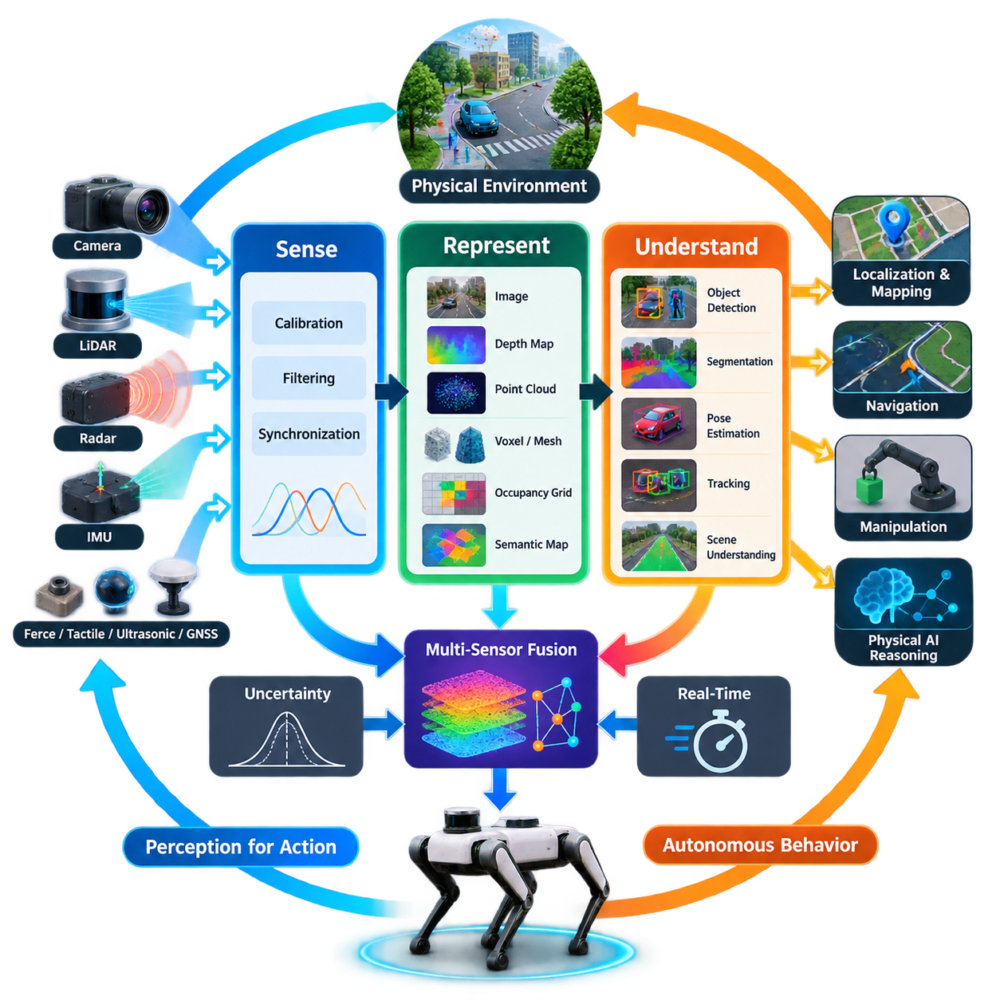
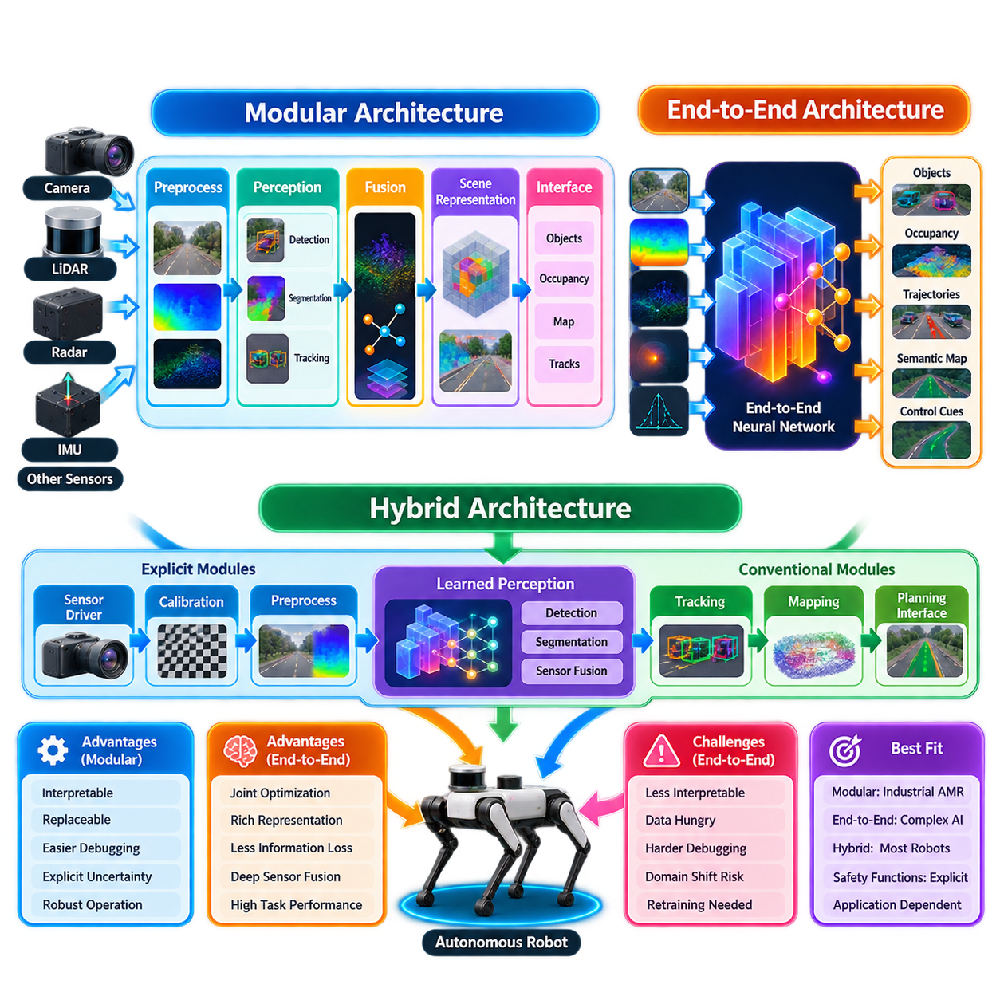
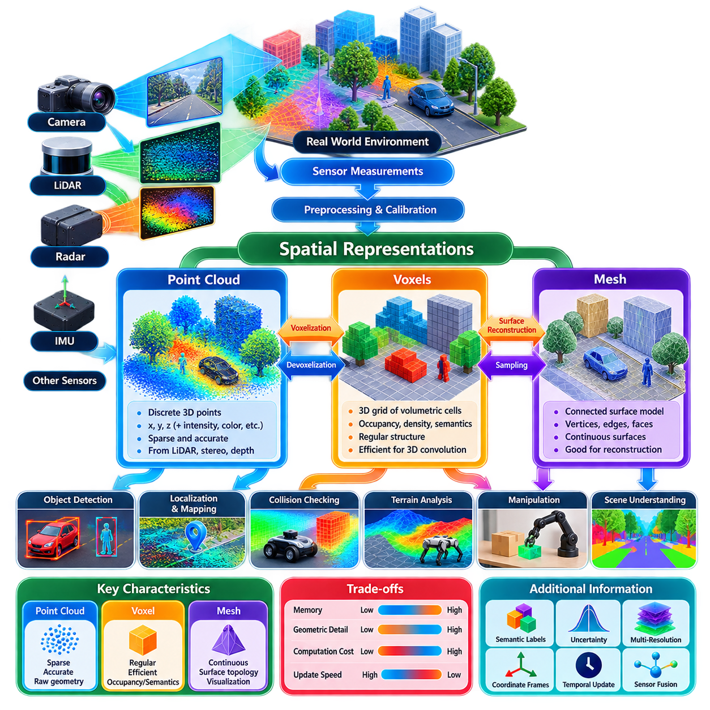
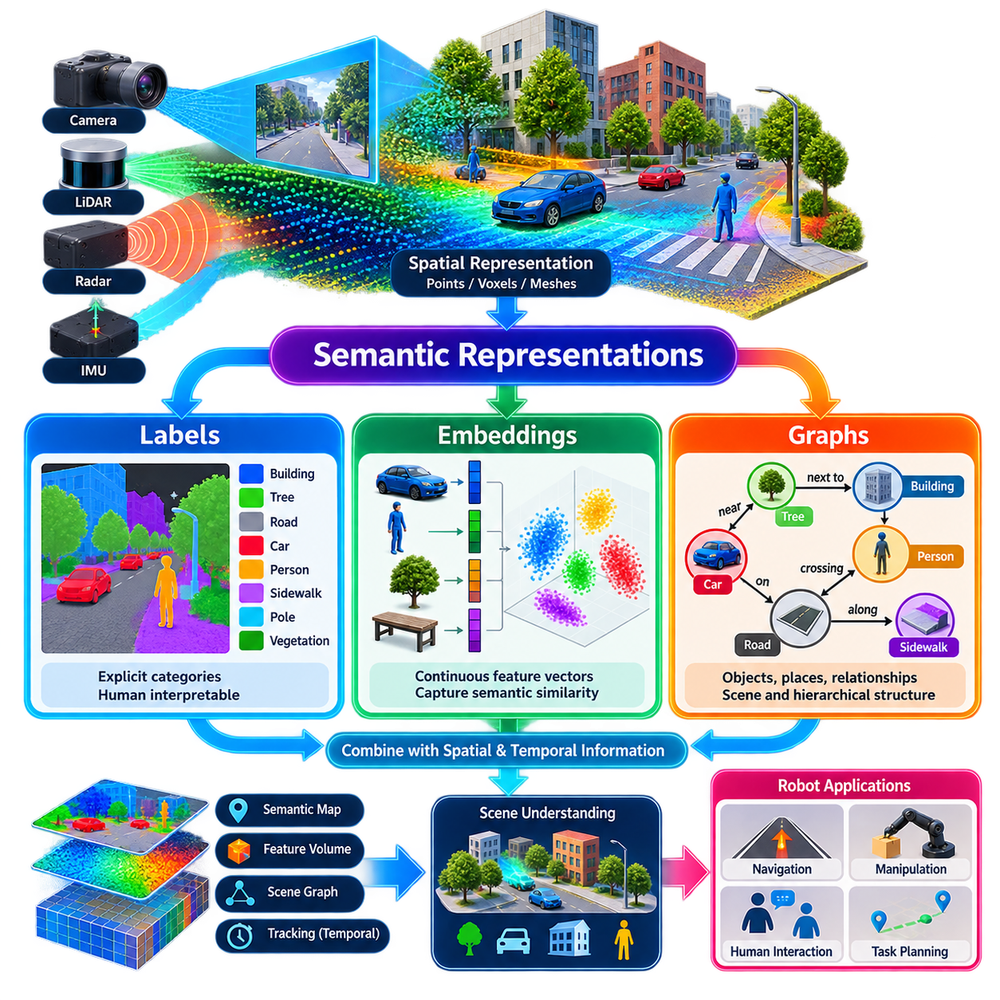
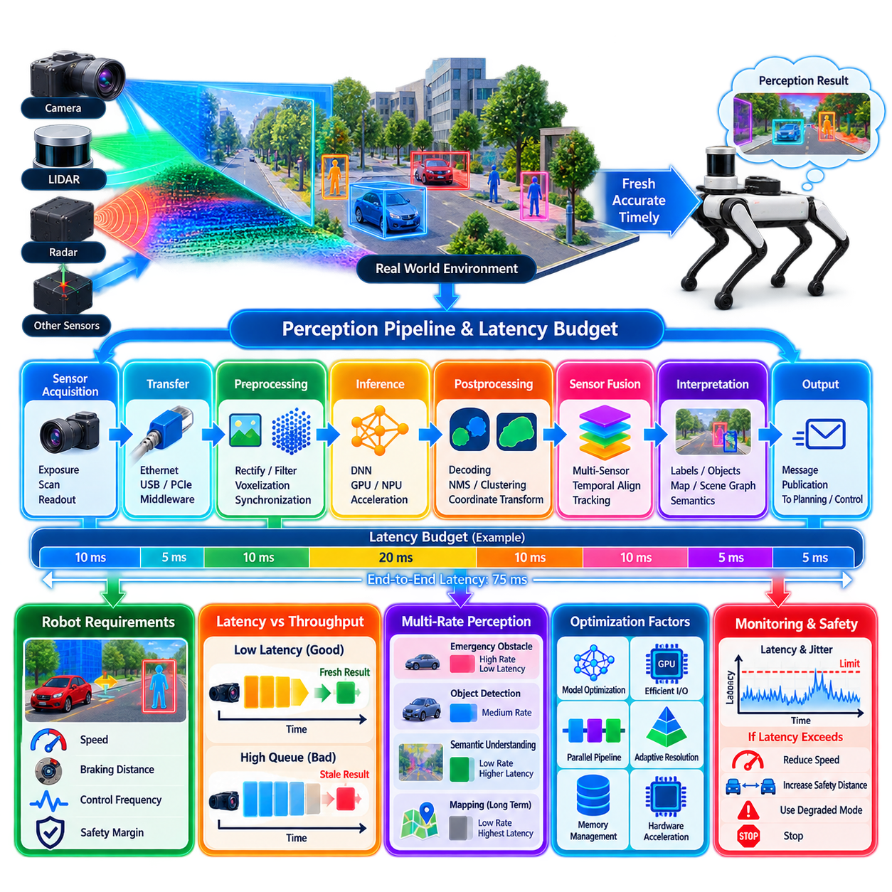
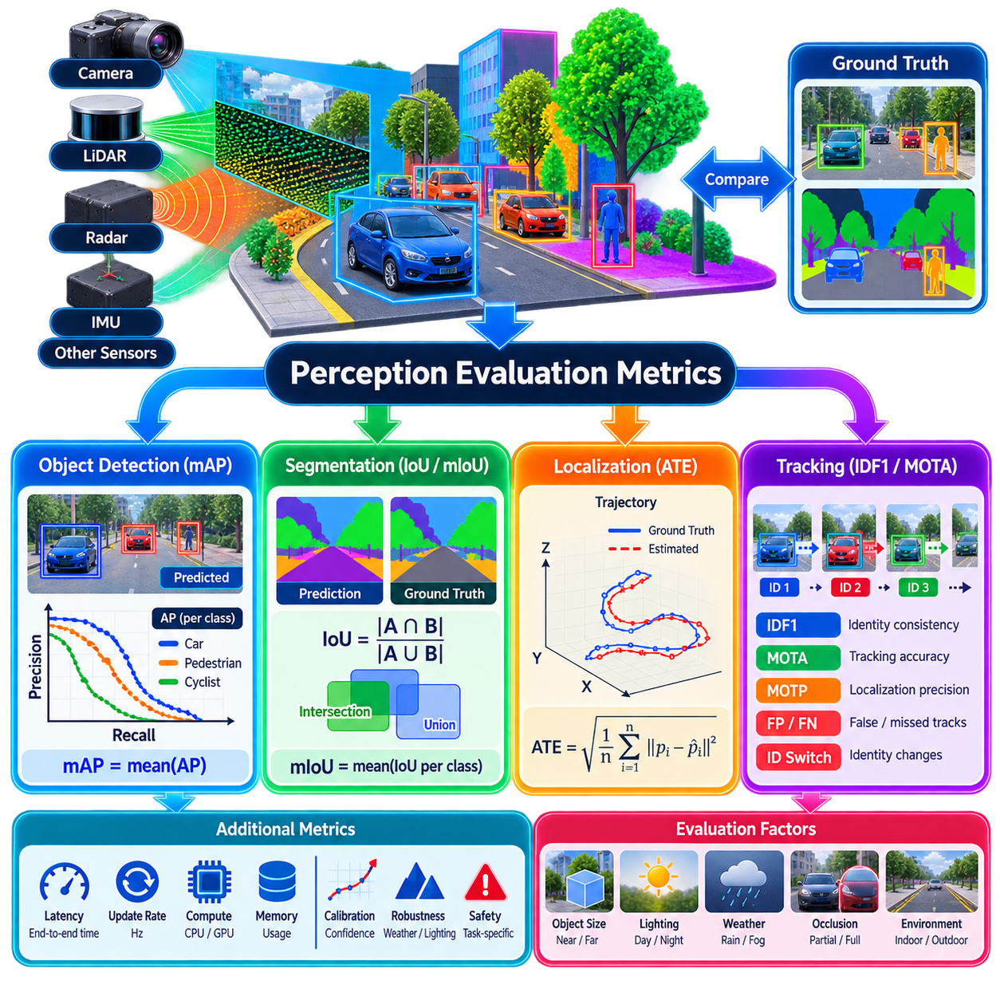
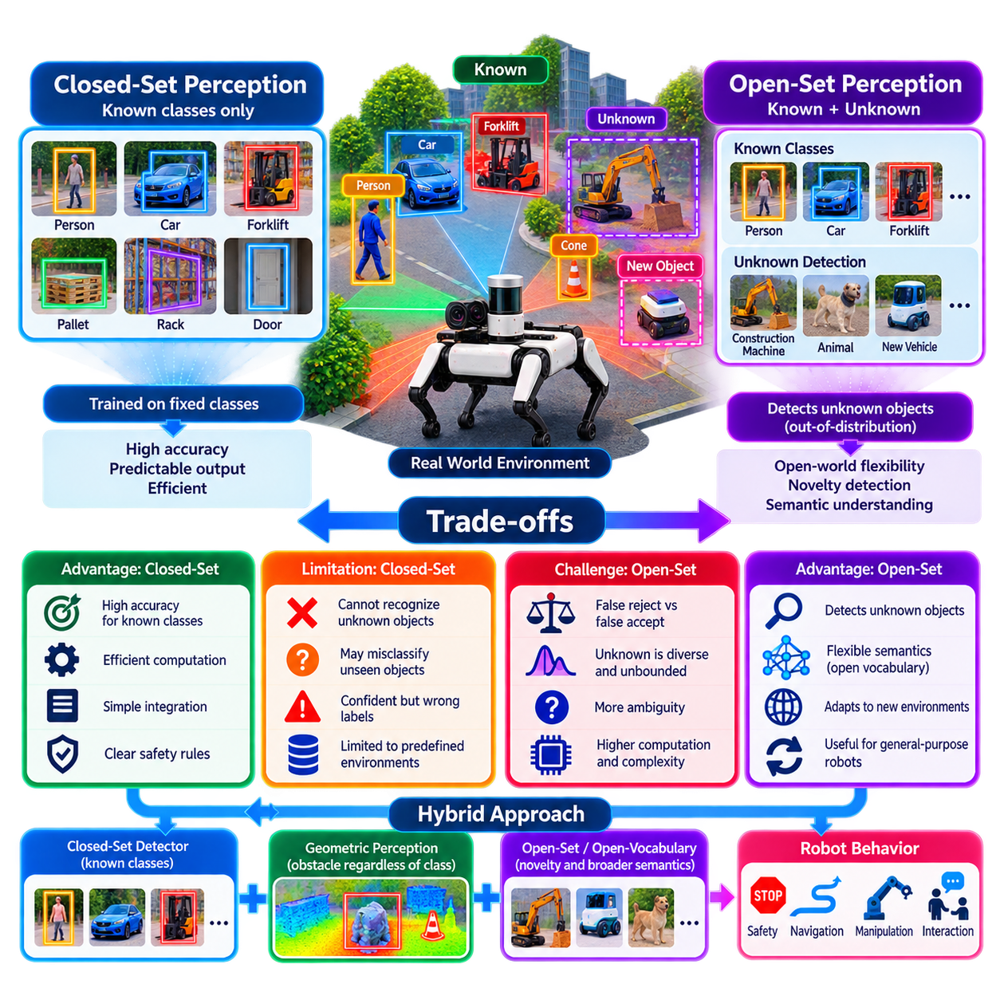
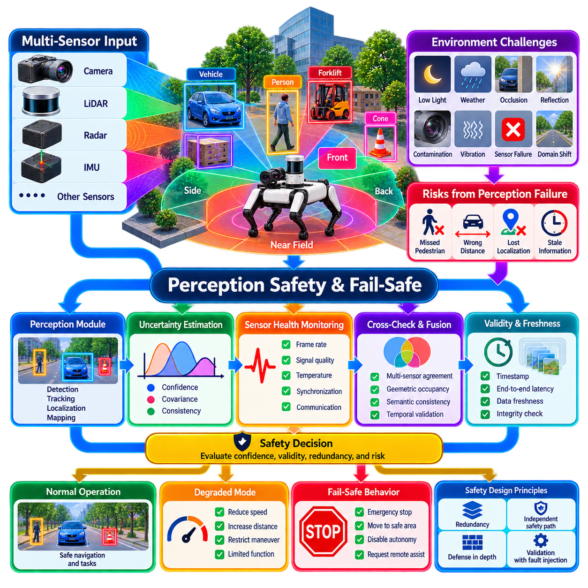
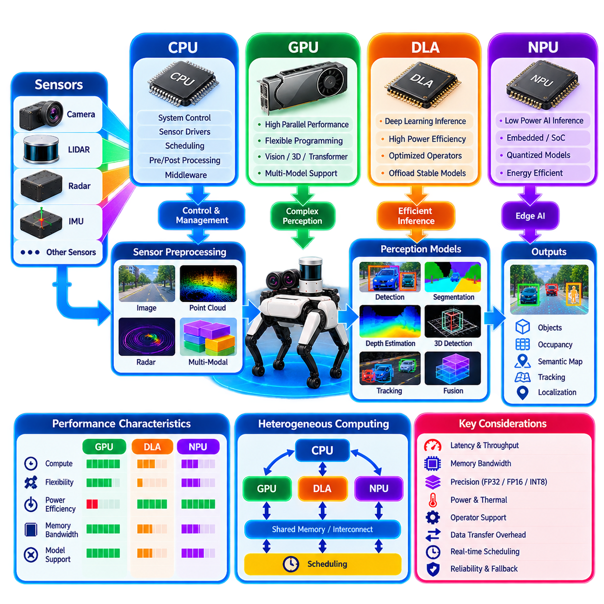
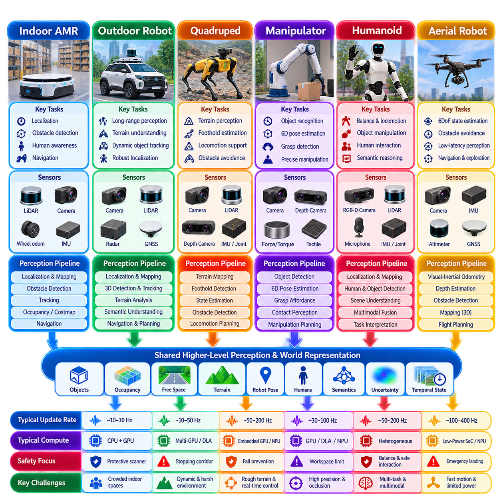

**Volume 14. Perception and Sensor Fusion**

# Chapter 01. Robot Perception Fundamentals

## 01.01. Robot Perception Pipeline Sense Represent Understand

{width="7.268055555555556in" height="7.268055555555556in"}

Robot perception is the process through which a robot converts physical signals from its environment into representations that can support autonomous decisions and actions. A useful abstraction divides this process into three closely connected stages: Sense, Represent, and Understand. These stages form the foundation upon which later functions such as localization, mapping, navigation, manipulation, and Physical AI reasoning are constructed.

The Sense stage establishes the robot\'s direct connection to the physical world. Cameras measure patterns of visible or infrared light, LiDAR measures reflected laser energy and range, radar observes electromagnetic reflections and Doppler velocity, while IMUs measure acceleration and angular velocity. Force, tactile, ultrasonic, GNSS, and other sensors extend perception to contact, proximity, motion, and global position.

Sensor measurements are not equivalent to knowledge about the environment. A camera produces arrays of pixel intensities, a LiDAR produces range measurements that can become three-dimensional points, and an IMU produces time-dependent inertial signals. Each measurement contains useful information but also noise, bias, uncertainty, limited resolution, occlusion, and environmental sensitivity. Perception therefore begins with measurement rather than with an immediately correct description of reality.

Practical sensing pipelines must first make heterogeneous sensor streams computationally usable. Raw measurements are decoded, timestamped, calibrated, filtered, synchronized, and transformed into consistent coordinate frames. Camera distortion may be corrected, LiDAR returns may be filtered, IMU bias may be compensated, and radar detections may require signal processing. Accurate timestamps and extrinsic calibration become particularly important when a moving robot combines measurements from several sensors.

The Represent stage converts processed measurements into structures that algorithms can efficiently interpret. Representation is therefore an intermediate language between physical sensing and machine understanding. Depending on the task, the same environment may be represented as images, depth maps, point clouds, voxels, meshes, occupancy grids, bird\'s-eye-view features, semantic maps, learned embeddings, or scene graphs. The broader volume explicitly develops spatial and semantic representations after this pipeline foundation.

Geometric representations describe where surfaces, obstacles, and objects exist in space. A point cloud preserves measured three-dimensional samples, while voxel structures discretize space into volumetric cells. Occupancy representations estimate whether regions are free, occupied, or unknown, and meshes describe connected surfaces. These representations differ in memory requirements, resolution, update cost, and suitability for downstream tasks, so no single geometric representation is optimal for every robot.

Representation also requires a consistent understanding of coordinate systems. Sensor measurements may initially exist in individual camera, LiDAR, radar, or IMU frames, while navigation normally requires information in robot, odometry, or map frames. Transforming observations between these frames allows measurements collected from different locations and times to describe a common physical environment. Errors in calibration or pose estimation therefore propagate directly into the quality of the resulting representation.

Modern perception increasingly uses learned feature representations in addition to explicit geometry. Neural networks transform pixels, point clouds, radar measurements, or multimodal observations into feature vectors and feature maps that capture patterns useful for detection, segmentation, recognition, or prediction. Such representations can preserve information that is difficult to encode manually and can support semantic reasoning beyond conventional geometric processing.

The Understand stage assigns task-relevant meaning to represented sensor information. Object detection can determine that a region contains a pedestrian, vehicle, pallet, tool, or obstacle, while semantic segmentation assigns categories to pixels or points. Instance segmentation distinguishes individual objects, pose estimation determines their spatial configuration, and tracking associates observations across time. Scene understanding extends these outputs toward relationships, context, and environmental structure.

Understanding is inherently task dependent. An indoor AMR may primarily need to distinguish traversable space, humans, pallets, racks, and dynamic obstacles. A mobile manipulator must additionally reason about object identity, six-degree-of-freedom pose, graspable regions, and contact conditions. A quadruped requires terrain geometry and foothold information, while a UAV needs obstacle, free-space, depth, motion, and landing-zone information. The required perception representation therefore follows the robot\'s intended actions.

Temporal information is essential because robots operate in dynamic environments rather than isolated frames. A single observation may reveal where an object appears, but a sequence can reveal whether it is moving, its estimated velocity, its trajectory, and whether it is likely to intersect the robot\'s path. Tracking, temporal feature aggregation, optical flow, scene flow, inertial integration, and motion estimation convert successive measurements into a continuously evolving interpretation of the environment.

Multi-sensor perception improves this interpretation by combining complementary physical observations. Cameras provide rich appearance and semantic information but depend strongly on illumination and visibility. LiDAR provides direct geometric range measurements, radar contributes robust distance and radial velocity observations, and IMUs provide high-rate motion information. Their combination can reduce individual weaknesses, but fusion requires careful spatial calibration, temporal synchronization, uncertainty handling, and failure detection.

A complete perception pipeline therefore should not be viewed as a simple one-way conversion from raw data to labels. Information can exist simultaneously at several abstraction levels, from raw measurements and geometric primitives to semantic objects and scene-level relationships. Downstream modules may consume different levels directly: obstacle avoidance may use occupancy, manipulation may require object pose, and higher-level Physical AI may consume semantic or learned representations for reasoning.

Uncertainty must accompany this transformation whenever possible. Sensor noise, incomplete observations, ambiguous classifications, occlusions, calibration errors, and domain changes prevent perception outputs from being perfectly certain. Confidence scores, covariance estimates, probabilistic occupancy, multiple hypotheses, and consistency checks allow downstream systems to distinguish strong evidence from weak evidence. This distinction becomes especially important when perception participates directly in safety-critical robot behavior.

Real-time operation introduces another fundamental constraint. Perception must produce sufficiently accurate information before that information becomes obsolete. High-resolution sensing and large neural models can improve representational richness, but they also increase computation, memory traffic, and latency. A production robot therefore balances sensing frequency, representation complexity, model accuracy, hardware capability, and end-to-end latency rather than optimizing perception accuracy independently.

The Sense--Represent--Understand abstraction also clarifies the relationship between classical robotics and modern AI. Classical systems often construct explicit geometric representations before applying carefully defined estimation and recognition algorithms. Learning-based systems may transform sensor measurements directly into latent features and semantic predictions. End-to-end approaches can reduce visible boundaries even further, but sensing, internal representation, and interpretation still exist conceptually within the computational process.

For Physical AI systems, perception ultimately serves action rather than observation alone. A useful perceptual representation must provide information that enables the robot to decide where it can move, what it can manipulate, which entities matter to the task, how the environment is changing, and what uncertainty remains. Later topics in this volume therefore extend the foundation toward 3D scene understanding, occupancy and semantic maps, Physical AI perception, tactile sensing, and open-vocabulary perception.

The overall pipeline can consequently be understood as a progressive transformation of physical evidence. Sense acquires measurements from the world, Represent organizes those measurements into computational structures, and Understand extracts meaning relevant to the robot\'s objectives. Reliable autonomous behavior emerges when these stages remain geometrically consistent, temporally aligned, uncertainty-aware, computationally efficient, and tightly connected to the decisions and actions that follow perception.

## 01.02. Perception System Architecture Modular vs End to End

{width="7.268055555555556in" height="7.268055555555556in"}

Robot perception systems can be organized along a spectrum ranging from strongly modular architectures to highly integrated end-to-end architectures. A modular system divides perception into explicit processing stages with defined interfaces, while an end-to-end system learns larger portions of the transformation from sensor observations to task-relevant outputs. The architectural choice determines how information, uncertainty, computation, and responsibility are distributed across the robot software stack.

A conventional modular perception architecture decomposes the system into components such as sensor preprocessing, calibration, feature extraction, object detection, segmentation, tracking, sensor fusion, scene representation, and downstream decision interfaces. Each component receives a defined input and produces an interpretable output. This structure follows naturally from the Sense--Represent--Understand pipeline and allows individual perception functions to be developed and validated separately.

For example, camera images may first pass through calibration and preprocessing before entering an object detector. LiDAR measurements can independently undergo filtering, voxelization, ground removal, and three-dimensional detection. Radar may estimate range and velocity, while IMU processing estimates motion. A fusion module subsequently combines selected outputs into tracks, occupancy information, semantic objects, or another representation consumed by navigation and planning.

The principal advantage of modular architecture is separation of concerns. Developers can select algorithms appropriate to individual sensor modalities and replace one component without redesigning the entire perception system. A new detector can replace an older detector while preserving the tracking interface, or a LiDAR model can be upgraded without changing camera preprocessing. Stable interfaces therefore support incremental engineering and long product life cycles.

Modularity also improves observability and debugging. When perception fails, engineers can inspect intermediate outputs such as calibrated images, filtered point clouds, detections, tracks, transformation matrices, confidence values, and occupancy maps. This makes it possible to localize whether an error originated in sensing, calibration, preprocessing, inference, fusion, or interpretation. Such traceability is particularly valuable during field testing and production failure analysis.

Another important benefit is explicit management of uncertainty and failure. Individual modules can expose confidence scores, covariance matrices, validity flags, diagnostic states, and timing information. A fusion component can reject inconsistent measurements or reduce the influence of a degraded sensor. The system can also continue operating in a reduced capability mode when one perception component becomes unavailable, provided that sufficient redundancy exists elsewhere in the architecture.

However, modular systems can lose information at component boundaries. A detector may compress a rich image feature map into bounding boxes before fusion, discarding appearance information that could have helped another sensor modality. Hand-designed interfaces may therefore create information bottlenecks. Errors also propagate sequentially: inaccurate calibration affects detection geometry, detection errors affect tracking, and tracking errors can ultimately influence planning and control.

End-to-end perception attempts to reduce these manually defined boundaries by learning a larger mapping jointly. Instead of independently producing many intermediate outputs, a neural architecture may consume camera images, LiDAR points, radar features, temporal observations, or combinations of them and directly generate task-oriented representations. These outputs can include objects, occupancy, trajectories, semantic features, or latent representations used by subsequent learned components.

Joint optimization is one of the strongest motivations for end-to-end design. When multiple processing stages are differentiable, training can optimize internal representations according to a common objective rather than optimizing each module independently. Features useful for the final task can emerge automatically, and information that would have been removed by handcrafted intermediate interfaces can remain available throughout the network.

Deep sensor fusion illustrates this advantage. Instead of separately completing camera detection and LiDAR detection before combining their final results, an integrated network can transform measurements from both sensors into a shared feature space. Camera appearance can complement LiDAR geometry before object-level decisions are made. Similar approaches can aggregate temporal observations and bird\'s-eye-view features into unified representations for scene understanding.

The benefits of integration introduce new engineering difficulties. Internal neural representations are usually less interpretable than explicit geometric or semantic interfaces, making failures harder to isolate. A wrong output may result from interactions among training data, feature extraction, attention, fusion, temporal context, or optimization rather than from a clearly identifiable module. Validation must therefore examine not only output accuracy but also robustness across operating conditions and failure scenarios.

End-to-end systems also depend heavily on training data. A modular geometric algorithm may retain predictable behavior across environments when its physical assumptions remain valid, whereas a learned system can behave unexpectedly outside its training distribution. Changes in cameras, lenses, LiDAR configurations, mounting positions, weather, illumination, environments, or object populations may require additional data collection, validation, adaptation, or retraining.

The distinction between modular and end-to-end architecture should therefore not be treated as an absolute binary choice. Modern robot perception commonly adopts hybrid architectures. Low-level sensor drivers, timestamping, calibration, coordinate transformations, health monitoring, and safety diagnostics often remain explicit modules, while computationally intensive interpretation may use deeply integrated neural networks. Learned outputs can then feed conventional tracking, mapping, planning, and safety components.

Hybrid architecture can also preserve multiple representations simultaneously. A neural perception network may produce semantic features and object hypotheses while a geometric pipeline independently maintains occupancy or free-space information. The robot can exploit learned semantic capability without abandoning physically interpretable representations. Redundant pathways can additionally provide consistency checks when learned and geometric estimates disagree.

The appropriate architectural boundary depends strongly on the robot platform and mission. Industrial AMRs often benefit from modularity because maintainability, deterministic interfaces, diagnostics, and long-term deployment are important. Manipulation systems may integrate vision and learned features more tightly because object geometry and semantics directly influence grasping. Physical AI systems can require even richer shared representations that connect perception with language, world models, reasoning, and action.

Real-time constraints further influence this choice. Modular pipelines allow components to operate at different frequencies: an IMU may update rapidly, LiDAR processing at a moderate rate, and computationally expensive semantic inference at a lower rate. End-to-end models can reduce duplicated processing but may create a large inference block whose latency and memory consumption become difficult to partition. Deployment architecture must therefore consider scheduling, accelerators, memory bandwidth, and worst-case latency.

Safety requirements generally favor clearly defined fallback behavior regardless of the selected architecture. A highly integrated learned model should not imply that every safety function must also become end-to-end. Independent obstacle detection, sensor-health monitoring, geometric constraints, confidence thresholds, degraded modes, and emergency stopping mechanisms can remain outside the learned perception path. This creates architectural diversity between performance-oriented intelligence and safety-oriented protection.

Modular systems are consequently strongest when transparency, replaceability, verification, heterogeneous sensors, and controlled failure handling dominate the design requirements. End-to-end systems become attractive when rich multimodal information must be preserved, large datasets are available, and joint optimization can significantly improve task performance. Hybrid systems attempt to combine these strengths by defining explicit boundaries only where they provide engineering, operational, or safety value.

The long-term direction of robot perception is therefore better described as selective integration rather than the disappearance of modularity. Learned models will increasingly connect sensing, spatial representation, semantics, temporal reasoning, and action-related features, while explicit interfaces will remain important for hardware abstraction, synchronization, diagnostics, safety, and system integration. Architecture should be chosen according to what information must remain interpretable and what information benefits from joint learning.

A production perception system should ultimately be evaluated as a complete robot capability rather than by architectural ideology. The correct design is the one that delivers sufficient accuracy, latency, robustness, diagnosability, maintainability, and safety for the intended operating environment. Modular, end-to-end, and hybrid architectures are therefore engineering alternatives within the same objective: converting uncertain sensor observations into reliable information that enables autonomous physical action.

## 01.03. Spatial Representation Voxels Point Clouds Meshes

{width="7.268055555555556in" height="7.268055555555556in"}

Spatial representation is the computational process of describing the geometry and organization of the physical environment in a form that a robot can store, analyze, and use for action. Raw sensor measurements alone do not provide a complete spatial model. Perception systems therefore transform observations into structured representations such as point clouds, voxels, and meshes, each preserving different properties of three-dimensional space.

The choice of spatial representation affects nearly every downstream perception function. Object detection, collision checking, localization, mapping, terrain analysis, manipulation, and scene understanding require different combinations of geometric precision, computational efficiency, memory consumption, and update speed. A representation suitable for detailed object reconstruction may therefore be inefficient for real-time navigation, while a compact navigation map may discard geometry needed for manipulation.

Point clouds represent three-dimensional environments as collections of discrete points with coordinates such as x, y, and z. Each point corresponds to a sampled location on a visible surface or detected structure. Additional attributes may include intensity, color, timestamp, surface normal, semantic class, or sensor confidence. LiDAR naturally produces point-cloud-like measurements, while stereo cameras and depth cameras can also generate point clouds from estimated depth.

The major advantage of a point cloud is that it preserves measured geometry without requiring space to be completely discretized. Large empty regions consume little or no storage because only observed points need to be represented. This makes point clouds particularly effective for LiDAR perception, three-dimensional object detection, registration, localization, mapping, and environmental reconstruction where accurate measured coordinates are important.

However, point clouds are irregular and unordered data structures. Neighboring points are not automatically connected, point density changes with distance and viewing angle, and different sensors can produce substantially different sampling patterns. Algorithms must therefore construct neighborhoods, spatial indexes, pillars, range images, or learned point features before higher-level reasoning can be performed efficiently. Sparse measurements can also leave large portions of surfaces unobserved.

Voxel representation addresses some of these difficulties by dividing three-dimensional space into discrete volumetric cells called voxels. A voxel can store occupancy, density, probability, semantic category, learned features, or other properties associated with a small region of space. Conceptually, voxels extend the two-dimensional pixel grid into three dimensions and provide a regular spatial organization suitable for structured computation.

Regular voxel grids simplify neighborhood operations because adjacent spatial regions have predictable relationships. Three-dimensional convolution, occupancy reasoning, collision checking, semantic mapping, and volumetric fusion can therefore operate naturally on voxelized data. Point clouds are frequently converted into voxels before neural-network inference because voxelization transforms irregular measurements into a representation that can be processed more efficiently by structured or sparse convolutional architectures.

The primary limitation of dense voxel grids is memory growth. Halving the voxel dimension along each spatial axis can increase the number of cells dramatically because resolution expands simultaneously in three dimensions. A large environment represented at fine resolution therefore becomes computationally expensive. This creates a fundamental trade-off between spatial precision and resource consumption, particularly for robots performing real-time perception on edge computing hardware.

Sparse voxel structures reduce this problem by storing only occupied or relevant cells instead of allocating memory to the entire three-dimensional volume. Sparse tensors, hierarchical grids, octrees, and related structures exploit the fact that most physical environments contain substantial empty space. These approaches enable higher spatial resolution over larger regions while retaining many of the computational advantages associated with voxel-based representations.

Voxel size itself becomes an important architectural parameter. Large voxels reduce memory consumption and accelerate computation but merge nearby geometric details. Small voxels preserve fine structures but increase processing cost and sensitivity to measurement noise. A perception system may therefore use different resolutions for different purposes, such as coarse occupancy for navigation and finer local geometry around obstacles or manipulation targets.

Meshes represent surfaces explicitly using connected geometric primitives, most commonly vertices, edges, and triangular faces. Unlike point clouds, which contain isolated samples, meshes encode relationships between neighboring surface locations. This connectivity allows a robot to represent continuous surfaces, object boundaries, slopes, terrain, and reconstructed structures more directly than an unconnected set of measured points.

A mesh can provide a compact and visually coherent representation of surfaces when the underlying geometry is sufficiently known. Surface normals, curvature, texture coordinates, material properties, and semantic labels can be associated with mesh elements. These characteristics make meshes valuable for three-dimensional reconstruction, digital twins, manipulation planning, simulation, inspection, terrain modeling, and applications where surface topology is important.

Generating a reliable mesh from sensor observations is nevertheless more complex than storing raw points. Measurements contain noise, occlusion, missing regions, moving objects, and inconsistent sampling density. Surface reconstruction must infer connectivity between observations and determine which measurements belong to the same physical surface. Incorrect assumptions can produce holes, artificial connections, distorted surfaces, or geometry that does not correspond to the actual environment.

Point clouds, voxels, and meshes should therefore be understood as complementary rather than competing representations. A perception pipeline may initially receive a LiDAR point cloud, transform it into sparse voxels for neural inference, maintain probabilistic voxel occupancy for navigation, and construct a mesh from accumulated observations for visualization or detailed reconstruction. Information can move between representations according to the requirements of each processing stage.

Coordinate frames provide the geometric foundation that allows these representations to remain consistent. Points, voxel centers, and mesh vertices must be expressed relative to defined sensor, robot, odometry, or map frames. When a robot moves, transformations derived from localization and calibration allow observations collected at different times and from different sensors to be accumulated into a common spatial reference.

Temporal updates introduce additional complexity because real environments are not static. A representation built from previous observations can become incorrect when people, vehicles, doors, equipment, or other objects move. Perception systems must distinguish persistent geometry from dynamic observations and decide when spatial information should be updated, decayed, replaced, or removed. This is particularly important for long-running autonomous robots operating in shared environments.

Spatial representations can also carry uncertainty rather than treating geometry as perfectly known. A point may contain measurement confidence, a voxel may store occupancy probability, and reconstructed surfaces may reflect confidence derived from repeated observations. Maintaining uncertainty allows the robot to distinguish confirmed free space from unobserved space and prevents incomplete sensor measurements from being interpreted as definitive geometric knowledge.

Semantic information further extends purely geometric representations. Points can receive class labels, voxels can contain semantic probabilities or learned features, and mesh surfaces can be associated with objects, materials, or functional regions. Geometry then answers where something exists, while semantics describes what it is or how it may be used. This combination forms an important foundation for higher-level scene understanding and Physical AI.

Robot platforms emphasize different representations according to their physical tasks. An outdoor AMR may rely heavily on point clouds and occupancy structures for obstacle detection and traversability analysis. A quadruped may require dense local terrain geometry for foothold selection. A manipulator may need detailed object surfaces and pose information, while a UAV may favor sparse representations that cover large three-dimensional regions with limited computational resources.

Modern perception architectures increasingly maintain several spatial representations simultaneously instead of selecting only one. Raw or filtered point clouds preserve sensor evidence, sparse voxels support efficient neural inference, occupancy structures support navigation, and meshes or reconstructed surfaces support detailed geometric reasoning. Learned feature volumes can coexist with all of these structures, providing task-oriented information that is difficult to describe using geometry alone.

The correct spatial representation is therefore determined by the robot\'s action requirements, sensor configuration, operating scale, latency budget, and available computing resources. Point clouds provide flexible sampled geometry, voxels provide structured volumetric reasoning, and meshes provide connected surface models. Production systems frequently combine them so that each representation contributes where its geometric and computational properties are most useful.

Spatial representation ultimately forms the bridge between sensing and physical reasoning. Sensors observe fragments of the environment, but autonomous robots require organized spatial knowledge to determine free space, obstacles, surfaces, objects, and possible interactions. By selecting and combining point clouds, voxels, meshes, and related structures appropriately, perception systems transform fragmented measurements into spatial models that can support reliable autonomous action.

## 01.04. Semantic Representations Labels Embeddings Graphs

{width="7.268055555555556in" height="7.268055555555556in"}

Semantic representation extends robot perception beyond geometry by describing what observed entities mean, how they relate to one another, and how they may matter for future actions. While spatial representations encode where surfaces, obstacles, and objects exist, semantic representations attach concepts to those structures. Labels, learned embeddings, and graphs provide complementary mechanisms for organizing this meaning at different levels of abstraction.

A semantic label assigns an explicit category or property to an observation. Pixels may be labeled as road, wall, person, vegetation, or floor, while points and voxels can receive equivalent three-dimensional classes. Object-level labels identify entities such as pallets, vehicles, tools, doors, or charging stations. Labels transform numerical sensor measurements into discrete concepts that downstream robot functions can interpret directly.

Labels are particularly useful because they are compact and human interpretable. A navigation system can assign different costs to floor, grass, stairs, and restricted zones, while a manipulation system can select behavior according to whether an observed object is a box, bottle, handle, or tool. Semantic maps can similarly associate regions with concepts such as corridor, loading zone, workstation, storage area, or hazardous region.

The simplicity of categorical labels also creates limitations. A fixed class vocabulary assumes that relevant concepts are known when the perception system is designed or trained. Objects outside that vocabulary may be classified incorrectly, grouped into a generic unknown category, or ignored. Labels also compress rich visual and geometric information into discrete symbols, potentially removing similarities and attributes that could be useful for reasoning about unfamiliar entities.

Learned embeddings provide a more continuous semantic representation. A neural network transforms an image region, object, point set, language description, or multimodal observation into a vector in a learned feature space. Rather than representing an entity only by a discrete class identifier, the embedding encodes patterns that allow semantically or visually related observations to occupy related regions of the representation space.

This continuous structure makes embeddings useful for recognition, retrieval, association, and open-vocabulary perception. Two chairs with substantially different appearances can produce related representations even when their pixel values differ greatly. Vision-language embeddings can additionally connect visual observations with textual concepts, enabling a robot to search for an object described by language even when that exact category was not explicitly included in a conventional closed-set classifier.

Embeddings can represent more than object identity. They may encode appearance, geometry, material, context, affordance, motion, or task-related properties depending on the training objective and input modalities. Point-cloud features can capture local three-dimensional structure, image embeddings can preserve visual semantics, and multimodal features can combine geometry, appearance, language, and temporal information into a shared latent representation.

The flexibility of embeddings comes with reduced interpretability. Individual dimensions usually do not correspond to clearly defined human concepts, and similar vectors do not automatically guarantee identical physical properties or safe actions. Embedding quality also depends strongly on training data and objectives. Domain shift, unusual viewpoints, sensor degradation, or novel environments can therefore alter feature relationships in ways that are difficult to diagnose directly.

Semantic graphs add another level by explicitly representing relationships among entities. In a graph, nodes can correspond to objects, places, regions, people, surfaces, or abstract concepts, while edges describe relationships such as inside, on, adjacent to, connected to, supports, near, moving toward, or reachable from. A graph therefore describes not only which entities exist but also how they are organized within a scene.

A robot observing a warehouse might construct nodes for an aisle, pallet, rack, forklift, and loading zone. Edges could indicate that a pallet is beside a rack, the rack is located within an aisle, and the aisle connects to a loading zone. Such relational structure provides information that cannot be represented adequately by independent object labels alone and can support task planning, semantic navigation, and contextual reasoning.

Scene graphs can combine semantic relationships with spatial attributes. Each node may contain a class label, position, dimensions, confidence, learned embedding, or object state, while edges may contain geometric distances, relative poses, interaction relationships, or temporal dependencies. The resulting structure bridges metric representations of physical space with symbolic descriptions that higher-level reasoning systems can manipulate more efficiently.

Graphs can also represent environments hierarchically. Individual objects may belong to regions, regions may form rooms or zones, and zones may belong to larger facilities. Such hierarchical semantic representations allow a robot to reason at different scales. A navigation request such as "go to the charging station in the maintenance area" can first be interpreted at the facility level and subsequently refined into local geometric navigation.

Temporal relationships extend semantic graphs into dynamic scene representations. Nodes can persist as objects are observed across multiple frames, while edges change when relationships evolve. A person may move from beside a vehicle to in front of it, or a pallet may change from stored to being transported. Maintaining these changes allows perception to describe not only the current scene but also its evolving state and interactions.

Labels, embeddings, and graphs therefore operate at complementary abstraction levels rather than serving as mutually exclusive alternatives. A single object node in a scene graph may contain a discrete semantic label, a learned embedding, a three-dimensional position, an estimated velocity, and an uncertainty value. Its graph edges can then describe relationships with surrounding entities. Rich robot perception often combines all three representation forms simultaneously.

Semantic representations become even more powerful when connected to spatial representations. Semantic labels can be attached to image pixels, point-cloud samples, voxels, occupancy cells, or mesh surfaces. Embeddings can be stored in spatial feature maps or three-dimensional feature volumes. Scene-graph nodes can reference metric object poses and mapped regions. Geometry answers where an entity is, while semantics describes what it is and how it relates to the robot\'s task.

Uncertainty remains important because semantic interpretation is rarely absolute. Classification probabilities, embedding similarity scores, object existence confidence, and uncertain graph relationships should be preserved when possible. A robot should distinguish between a confirmed pedestrian and a weak hypothesis, or between a known charging station and an object that merely appears semantically similar. Such uncertainty can influence planning and safety decisions.

Open-set and open-vocabulary perception increase the importance of flexible semantic representations. Fixed labels remain efficient for known operational categories, but embeddings allow perception to compare observations against new textual or visual concepts. Graph structures can then incorporate newly recognized entities without requiring the entire environmental representation to be redesigned. This combination supports robots operating in environments containing previously unseen objects and situations.

For Physical AI, semantics must ultimately connect perception with action. Recognizing an entity as a cup is useful, but understanding that it is graspable, contains liquid, is located on a table, and is requested by a human provides substantially richer information for behavior. Semantic representations can therefore include affordances, functional relationships, task relevance, and interaction possibilities rather than limiting understanding to conventional object categories.

Different robot platforms require different semantic complexity. An industrial AMR may primarily need semantic zones, obstacles, humans, and infrastructure labels. A manipulator requires object identity, pose, parts, affordances, and relationships. A humanoid or general-purpose Physical AI system may require open-vocabulary embeddings and dynamic scene graphs capable of connecting language instructions with objects, locations, people, and possible actions.

Semantic representation consequently forms a bridge between low-level perception and higher-level intelligence. Labels provide explicit and efficient categories, embeddings preserve continuous learned meaning, and graphs organize entities and their relationships into structured knowledge. Combined with spatial and temporal representations, they allow a robot to move from detecting physical structures toward understanding scenes in terms that can support reasoning, planning, interaction, and autonomous action.

## 01.05. Perception Latency Budget for Real Time Robots

{width="7.268055555555556in" height="7.268055555555556in"}

Real-time robot perception is constrained not only by accuracy but also by how quickly sensor information can be transformed into information suitable for decision and action. A perception result that arrives too late may describe a world that has already changed. Latency budgeting therefore allocates allowable processing time across sensing, transfer, preprocessing, inference, fusion, interpretation, and communication so the complete perception pipeline satisfies the robot\'s response-time requirement.

Perception latency should be considered from measurement acquisition to availability of the final output rather than from neural-network inference alone. The pipeline may include sensor exposure or scanning, device buffering, data transfer, decoding, synchronization, calibration, preprocessing, GPU upload, inference, postprocessing, sensor fusion, tracking, and message publication. Each stage contributes delay, and several small delays can accumulate into a significant end-to-end latency.

A useful latency budget begins with the physical behavior that the robot must support. Vehicle speed, braking capability, obstacle distance, manipulator motion, control frequency, and safety margin determine how old perception information can become before it is no longer useful. A fast outdoor robot generally requires tighter response constraints than a slowly moving warehouse platform, while high-speed manipulation or legged locomotion can require particularly rapid local perception updates.

Sensor acquisition introduces unavoidable latency before computation begins. A camera may require exposure and readout time, a rotating LiDAR needs time to collect points across a scan, and radar processing depends on its measurement cycle. Sensor data may also remain temporarily in hardware or driver buffers. Consequently, the timestamp of a completed sensor message can differ substantially from the physical time at which different portions of that measurement were actually observed.

Transport latency occurs when sensor data moves through interfaces such as Ethernet, USB, MIPI, PCIe, or middleware communication. Large camera frames and dense point clouds can consume considerable bandwidth, while unnecessary memory copies increase delay and processor load. Zero-copy transport, direct memory access, efficient serialization, and careful placement of processing nodes can reduce data movement and preserve more of the latency budget for actual perception computation.

Preprocessing consumes another portion of the budget. Image rectification, resizing, normalization, point-cloud filtering, voxelization, radar signal processing, coordinate transformation, and sensor synchronization may all occur before AI inference. Although each operation can appear inexpensive in isolation, sequential preprocessing across multiple sensors can become substantial. Efficient implementations therefore combine operations, exploit parallelism, and avoid repeated conversion between data formats.

Neural-network inference is often the most visible computational component, but its latency depends on more than model size. Input resolution, batch size, precision, memory bandwidth, accelerator utilization, kernel scheduling, and data-transfer overhead all influence execution time. GPU, DLA, and NPU accelerators can reduce inference latency, but the benefit is limited if the surrounding pipeline remains dominated by CPU preprocessing, synchronization, or memory movement.

Postprocessing must also be included in the latency budget. Detection networks may require decoding, thresholding, non-maximum suppression, coordinate conversion, or clustering before their outputs become usable. Three-dimensional perception can require additional geometric transformations, while tracking and occupancy generation introduce further computation. Measuring inference time alone can therefore substantially underestimate the delay experienced by navigation, planning, or control modules.

Multi-sensor fusion creates a special latency problem because sensors rarely operate at identical frequencies or measurement times. Waiting for perfectly synchronized camera, LiDAR, radar, and IMU observations may improve temporal alignment but can increase response delay. Using the newest available measurement reduces waiting time but introduces temporal offsets. Production systems must therefore balance synchronization accuracy against freshness and may compensate measurements using estimated ego-motion.

Latency and throughput should not be treated as equivalent metrics. A perception system may process thirty frames per second while still having a large delay between image capture and output if several frames remain queued in the pipeline. Throughput describes how much data can be processed over time, whereas latency describes how long one observation takes to reach its consumer. Real-time robotics requires both adequate throughput and sufficiently low end-to-end latency.

Queueing is particularly dangerous because latency can increase without obvious reductions in average processing rate. If sensors generate data faster than the perception pipeline can consume it, messages accumulate and the robot begins processing increasingly old observations. For many real-time applications, dropping stale frames and processing the newest available observation is preferable to preserving every frame. Queue depth and back-pressure policy are therefore architectural parameters rather than minor implementation details.

Average latency alone is also insufficient for real-time design. A system that usually responds quickly but occasionally experiences large timing spikes may create unsafe or unstable behavior. Percentile latency, maximum observed latency, and worst-case execution behavior are therefore important. Memory allocation, operating-system scheduling, thermal throttling, GPU contention, logging, and background processes can create jitter that is invisible when only average inference time is reported.

Pipeline parallelism can improve performance by allowing different stages to process different observations simultaneously. While the GPU performs inference on one frame, the CPU can preprocess the next sensor input and another thread can postprocess the previous result. This improves resource utilization and throughput, but excessive buffering can increase observation age. Parallel architecture must therefore be designed to reduce idle time without unintentionally creating deep queues.

Different perception outputs can operate under different latency budgets. Emergency obstacle detection may require the freshest possible information, while semantic classification or long-term map updates can tolerate larger delays. IMU-based motion estimation can operate at a high rate, object detection at a moderate rate, and detailed scene understanding at a lower rate. Multi-rate architecture prevents expensive semantic processing from unnecessarily delaying safety-critical geometric perception.

Spatial resolution and model complexity directly influence the latency budget. Higher-resolution images preserve small objects, dense point clouds preserve geometric detail, and fine voxels improve spatial precision, but all increase computation and memory traffic. Model pruning, quantization, reduced precision, sparse computation, region-of-interest processing, and adaptive resolution can reduce processing time while attempting to preserve the information most important for the robot\'s current task.

Latency can also be reduced by distributing computation appropriately across heterogeneous hardware. CPUs are effective for control-oriented logic and some preprocessing, GPUs provide highly parallel neural inference, and dedicated accelerators can execute selected networks efficiently. The optimal design minimizes unnecessary transfers among these devices. A theoretically faster accelerator can produce worse system latency if repeated memory copies or synchronization barriers dominate the execution path.

The age of information provides a useful system-level perspective. When a planner receives an obstacle position, the relevant question is not only how long the detection algorithm executed but how much time has passed since the underlying physical observation occurred. Sensor acquisition, buffering, synchronization, inference, fusion, and communication all contribute to this age. Dynamic-object motion can make even an accurate estimate increasingly incorrect as its information becomes older.

Temporal prediction can partially compensate for unavoidable latency. Tracking systems can propagate object states from their measurement timestamps toward the current time using estimated velocity or motion models. Ego-motion compensation can similarly transform older observations according to robot movement. Prediction does not eliminate latency, and prediction uncertainty grows with time, but it allows downstream modules to reason about the expected current state rather than blindly consuming stale measurements.

Safety engineering requires explicit behavior when the latency budget is violated. A perception system can monitor timestamps, processing duration, queue depth, sensor freshness, and output age. If information becomes too old, the robot may reduce speed, increase safety distance, reject the affected perception output, switch to a degraded sensing mode, or stop. Timing validity should therefore be treated as part of perception confidence rather than merely as a performance statistic.

Latency optimization must finally be performed at the complete robot-system level. Accelerating a detector from twenty milliseconds to ten milliseconds provides little benefit if sensor buffering, synchronization, and downstream communication still consume far more time. Profiling should identify the critical path from physical measurement to action-relevant output and optimize the dominant contributors while preserving accuracy, robustness, and maintainability.

A well-designed perception latency budget connects physical robot dynamics with computing architecture. Sensor rates, preprocessing, neural inference, fusion, communication, scheduling, and safety policies are allocated within a finite response-time envelope. The objective is not simply to achieve the highest frame rate, but to ensure that sufficiently accurate information reaches the robot predictably while it is still fresh enough to support safe and effective autonomous action.

## 01.06. Perception Evaluation Metrics mAP IoU ATE

{width="7.268055555555556in" height="7.268055555555556in"}

Perception evaluation determines whether a robot\'s interpretation of sensor data is sufficiently accurate, consistent, and reliable for its intended task. Because perception includes detection, segmentation, localization, mapping, and tracking, no single metric can characterize the complete system. Metrics such as mean Average Precision, Intersection over Union, and Absolute Trajectory Error quantify different aspects of performance and must be interpreted according to the perception function being evaluated.

Object detection evaluation begins by comparing predicted objects with ground-truth annotations. A prediction is normally considered a true positive when its class is correct and its spatial overlap with the corresponding ground-truth object exceeds a defined threshold. Predictions without valid matches become false positives, while ground-truth objects that are not detected become false negatives. These quantities provide the basis for precision, recall, and Average Precision calculations.

Precision measures how many reported detections are correct, whereas recall measures how many relevant ground-truth objects were successfully detected. High precision with low recall indicates that the detector produces few false alarms but misses many objects. High recall with low precision means that most objects are found but many incorrect detections are also generated. Robot applications often require an explicit trade-off between these two behaviors.

A detector produces confidence scores rather than a single fixed set of decisions. Changing the confidence threshold changes the balance between precision and recall. A precision-recall curve therefore evaluates detection behavior across many thresholds. Average Precision, or AP, summarizes this curve for a particular object class and evaluation criterion, providing a more informative measure than accuracy computed at only one confidence threshold.

Mean Average Precision, or mAP, aggregates AP values across multiple object classes and, depending on the benchmark, multiple overlap thresholds. It is widely used for evaluating two-dimensional and three-dimensional object detectors. However, the exact definition must always be reported because mAP calculated at a single IoU threshold is not equivalent to mAP averaged across a range of increasingly strict overlap thresholds.

Intersection over Union, or IoU, measures the spatial overlap between a predicted region and its ground-truth counterpart. For two-dimensional boxes or segmentation masks, IoU is the area of their intersection divided by the area of their union. A value of one represents perfect overlap, while zero represents no overlap. The same concept can be extended to three-dimensional bounding boxes or volumetric regions.

IoU serves both as an evaluation metric and as a matching criterion. During object-detection evaluation, a predicted box may be counted as correct only when its IoU with a ground-truth box exceeds a selected threshold. Increasing this threshold demands more accurate localization. Consequently, two detectors with similar classification capability can receive different scores when one predicts object boundaries or positions more precisely.

For semantic segmentation, IoU is usually calculated independently for each semantic class. Pixels predicted and annotated as the same class form the intersection, while all pixels belonging to either the prediction or ground truth form the union. Mean IoU, commonly written mIoU, averages these class-level values and provides a compact measure of segmentation quality across the semantic categories represented in the evaluation dataset.

Class imbalance must be considered when interpreting segmentation metrics. Large regions such as road, floor, wall, or background may dominate pixel-level accuracy, allowing a system to achieve a high score while performing poorly on small but important objects. Class-wise IoU and mIoU reduce this problem by exposing performance for individual categories, but safety-critical classes should still be inspected separately rather than hidden inside a global average.

Localization and SLAM require fundamentally different metrics because their outputs are trajectories or poses rather than object categories. Absolute Trajectory Error, or ATE, evaluates the difference between an estimated robot trajectory and a reference trajectory after applying an appropriate alignment procedure. It therefore measures accumulated global trajectory consistency and is commonly used to evaluate visual odometry, LiDAR odometry, and SLAM systems.

ATE is often derived from translational differences between corresponding estimated and ground-truth poses and summarized using statistics such as root mean square error. Before comparison, trajectories may require alignment because estimated and reference coordinate frames can differ. Depending on the system, alignment may compensate for rigid transformation, and monocular systems can additionally require scale alignment because absolute scale may not be directly observable.

ATE should not be interpreted without considering trajectory duration and operating environment. An error that is acceptable over a long outdoor route may be unacceptable for precise indoor docking or manipulation. Two systems can also produce similar final ATE values while exhibiting very different temporal behavior. Evaluation should therefore inspect trajectory plots, local errors, failure events, and drift patterns in addition to a single aggregate number.

Relative Pose Error, or RPE, complements ATE by measuring the error in relative motion over a specified time or distance interval. ATE emphasizes global trajectory agreement, whereas RPE reveals local translational and rotational drift. A localization system can therefore have relatively small short-term motion error while accumulating substantial global drift, or it can exhibit locally unstable estimates even when global corrections eventually reduce ATE.

Tracking introduces additional evaluation requirements because identity must remain consistent over time. Detection quality alone cannot reveal whether a tracker repeatedly changes an object\'s identity or loses and reacquires tracks. Tracking metrics therefore consider localization, association, missed detections, false tracks, and identity consistency. For autonomous robots, temporal stability can be as important as frame-level detection accuracy because planners consume continuously evolving object states.

Metric selection must reflect the downstream physical task. A high mAP value does not guarantee safe navigation if the detector misses small nearby obstacles, and a high mIoU does not guarantee useful traversability estimation if errors occur primarily at critical boundaries. Similarly, low ATE does not necessarily guarantee stable control if localization contains short but severe pose jumps. Evaluation must connect statistical scores to the consequences of perception errors.

Operating conditions should also be represented explicitly in evaluation. Performance can change with distance, object size, velocity, illumination, weather, occlusion, sensor noise, terrain, and environmental complexity. Reporting only an aggregate score can hide severe weaknesses in difficult conditions. A production robot should therefore evaluate metrics across meaningful subsets that correspond to its operational design domain and expected failure scenarios.

Uncertainty and confidence calibration provide another dimension of evaluation. A perception system should ideally be less confident when observations are ambiguous or outside its normal operating distribution. A detector with slightly lower mAP but well-calibrated confidence can sometimes support safer decision-making than a more accurate model that remains highly confident when wrong. Reliability diagrams and calibration errors can therefore complement conventional accuracy metrics.

Latency must also be evaluated together with accuracy. A detector can achieve excellent mAP while requiring too much processing time for a moving robot, and a SLAM system can produce accurate trajectories while failing to update poses at the required control rate. Practical evaluation should therefore report perception quality together with end-to-end latency, update frequency, computational load, memory consumption, and timing stability on the intended deployment hardware.

Benchmark results are most useful when evaluation protocols are reproducible. Dataset version, class definitions, IoU thresholds, confidence handling, trajectory alignment, coordinate conventions, ignored regions, and averaging procedures should be documented. Small differences in evaluation configuration can produce significantly different numerical results, making direct comparison misleading when protocols are not equivalent.

A complete robot perception evaluation should consequently use a collection of complementary metrics rather than optimize one headline number. mAP characterizes object-detection performance, IoU and mIoU quantify spatial overlap and segmentation quality, while ATE and related trajectory metrics evaluate localization consistency. Tracking, calibration, latency, robustness, and task-specific safety measures extend this evaluation toward real deployment requirements.

The purpose of perception metrics is ultimately not to maximize benchmark scores but to determine whether the robot receives information of sufficient quality to act reliably. Meaningful evaluation connects numerical metrics with operating conditions, timing constraints, uncertainty, and physical consequences. When interpreted together, mAP, IoU, ATE, and complementary measures provide a structured framework for converting perception performance into engineering evidence for autonomous robot design.

## 01.07. Open Set and Closed Set Perception Trade offs

{width="7.268055555555556in" height="7.268055555555556in"}

Closed-set perception assumes that the categories relevant to a robot are defined before deployment and represented in the training and evaluation process. The system is expected to distinguish among this known set of classes, such as person, vehicle, pallet, rack, door, or forklift. This formulation provides a clear relationship between training labels, model outputs, evaluation metrics, and downstream robot behavior.

The closed-set assumption is attractive for industrial robotics because operational environments are often deliberately constrained. A warehouse AMR may only require reliable recognition of people, pallets, vehicles, infrastructure, and several obstacle categories. Restricting the semantic vocabulary allows training data, decision thresholds, safety rules, and validation procedures to be optimized around a manageable collection of operationally important concepts.

Closed-set models can achieve high accuracy when deployment conditions resemble their training distribution. Their output structure is predictable, computational requirements can be controlled, and every recognized class can be connected to predefined robot behavior. A detected pedestrian may trigger a safety policy, while a recognized charging station can initiate docking. This deterministic semantic interface simplifies integration with planning and control.

The fundamental limitation appears when the robot encounters something outside the predefined vocabulary. Conventional classifiers are generally designed to choose among known categories and may assign an unfamiliar object to the most similar known class. An unusual machine, temporary construction object, animal, or previously unseen vehicle can therefore receive a confident but incorrect label instead of being recognized as unknown.

Open-set perception addresses this problem by assuming that deployment environments can contain categories that were not represented as known classes during training. The system must not only recognize familiar objects but also identify observations that do not fit the known semantic space. This introduces an explicit unknown state and changes perception from pure classification into a combination of recognition and novelty detection.

Detecting unknown objects is difficult because unknown is not a single coherent category. The space of possible unseen objects is effectively unlimited and cannot be represented exhaustively during training. A perception system must infer whether an observation differs sufficiently from its learned classes using confidence, feature-space distance, energy scores, uncertainty estimates, reconstruction behavior, or other measures of distributional familiarity.

Open-set recognition should be distinguished from open-vocabulary perception. Open-set systems primarily ask whether an observation belongs to known classes or should be treated as unknown. Open-vocabulary systems attempt to recognize a much broader and potentially changing collection of concepts, often by comparing visual features with language embeddings. The two approaches are related, but identifying novelty and assigning a meaningful new concept are different problems.

Learned embeddings provide an important mechanism for moving beyond rigid class boundaries. Instead of reducing every observation immediately to one categorical label, a model can preserve a feature vector describing visual, geometric, or multimodal characteristics. New observations can then be compared with known examples or textual concepts. This supports semantic similarity reasoning even when a conventional classifier lacks an explicit output class.

Vision-language models further expand this capability by connecting sensor observations with natural-language descriptions. A robot may compare an observed object with concepts such as "traffic cone," "fallen branch," or "portable barrier" without requiring each term to be represented by a dedicated output neuron during the original classifier design. Such flexibility is particularly valuable for general-purpose robots operating in environments that cannot be completely enumerated beforehand.

Greater semantic flexibility, however, introduces ambiguity. Closed-set classification can be optimized for a small set of operational categories, while open-set and open-vocabulary systems must distinguish among much broader possibilities. Similar objects, unusual viewpoints, poor illumination, occlusion, sensor noise, or domain shift can cause incorrect novelty judgments or misleading semantic matches. Expanded vocabulary therefore does not automatically produce more reliable perception.

False rejection and false acceptance become important trade-offs in open-set systems. If the unknown-detection threshold is too strict, familiar objects may frequently be rejected as unknown, reducing task performance. If it is too permissive, unfamiliar objects can be incorrectly absorbed into known classes. The appropriate threshold depends on the consequences of each error and may differ between semantic interaction, navigation, manipulation, and safety-critical perception.

Safety introduces an important reason for preserving the unknown state. A robot does not always need to know exactly what an unfamiliar object is before responding safely. For navigation, detecting that an unrecognized physical structure occupies the intended path may be sufficient to avoid collision. Geometry and occupancy can therefore provide a safety layer independent of semantic classification, allowing unknown objects to remain physically relevant even when their identity is uncertain.

This separation suggests a hybrid architecture for practical robots. A validated closed-set detector can handle operationally critical classes, geometric perception can detect obstacles regardless of identity, and an open-set or open-vocabulary subsystem can provide broader semantic interpretation. The robot can then use highly validated outputs for safety functions while exploiting flexible recognition for reasoning, interaction, and adaptation.

Confidence calibration becomes especially important in such hybrid systems. A model should not merely produce a class name but also indicate how strongly the observation supports that interpretation. High confidence should correspond to a high probability of correctness, while ambiguous or unfamiliar inputs should reduce confidence. Poorly calibrated models can be particularly dangerous because they may generate convincing semantic labels precisely when the observation lies outside their experience.

Temporal consistency can improve open-set reasoning. A single frame may contain an ambiguous object, but observations accumulated across different viewpoints and distances can provide stronger evidence about whether it belongs to a known category. Tracking preserves object identity while new measurements arrive, allowing semantic hypotheses and uncertainty to evolve over time rather than forcing an irreversible classification from one observation.

Multi-sensor perception provides another source of evidence. An unfamiliar visual appearance may still have clear three-dimensional geometry in LiDAR data, while radar can provide motion information and cameras provide semantic appearance. Combining these modalities can separate questions of existence, location, motion, and identity. A robot can therefore maintain a reliable physical model of an unknown object even when its semantic interpretation remains unresolved.

Evaluation of open-set perception requires more than conventional closed-set accuracy or mAP. The system must be evaluated on its ability to preserve known-class performance while detecting unknown observations. Test datasets should therefore contain both familiar and unfamiliar categories, and evaluation should examine incorrect acceptance of unknowns, rejection of known objects, confidence behavior, and the effect of novelty detection on downstream robot decisions.

The operational design domain strongly influences the appropriate balance. A highly structured manufacturing cell may favor closed-set perception because the environment, objects, and tasks are tightly controlled and extensive validation is possible. An outdoor service robot, humanoid, or general-purpose Physical AI system encounters much greater environmental diversity and therefore benefits more strongly from open-set and open-vocabulary capabilities.

Computational cost also differs between approaches. A compact closed-set detector can provide predictable low-latency inference on edge hardware, while large multimodal embedding models may require substantially greater memory and computation. Broad semantic reasoning may therefore operate at a lower frequency than safety-critical perception. Multi-rate architectures allow fast geometric and closed-set processing to coexist with slower but richer open-world interpretation.

The central engineering trade-off is consequently between specialization and flexibility. Closed-set perception offers controlled semantics, efficient computation, straightforward validation, and strong performance within known conditions. Open-set perception adds explicit handling of novelty, while open-vocabulary methods extend recognition toward previously unspecified concepts. Each increase in flexibility introduces additional uncertainty, computational cost, and validation complexity.

For Physical AI, the most practical direction is not necessarily to replace closed-set perception with completely unrestricted recognition. Robots can maintain trusted perception pathways for safety and mission-critical categories while using embeddings, novelty detection, language models, and semantic graphs to interpret unfamiliar situations. This layered design separates the requirement to remain physically safe from the ambition to understand an increasingly open world.

Open-set and closed-set perception should therefore be viewed as complementary design strategies rather than competing endpoints. The appropriate architecture depends on environmental variability, task criticality, available computation, validation requirements, and acceptable risk. Robust autonomous robots combine predictable recognition of known operational concepts with mechanisms for detecting, representing, and cautiously reasoning about what they have never encountered before.

## 01.08. Perception Safety Requirements and Fail Safe

{width="7.268055555555556in" height="7.268055555555556in"}

Perception safety begins with the principle that a robot must never assume its interpretation of the environment is perfectly correct. Cameras, LiDAR, radar, IMUs, learned models, and fusion algorithms can all fail or become unreliable. A safety-oriented perception architecture therefore treats uncertainty, missing observations, degraded sensors, timing violations, and inconsistent outputs as expected operating conditions that must be detected and managed.

Safety requirements should be derived from the physical consequences of perception failure rather than from perception accuracy alone. Missing a pedestrian, incorrectly estimating obstacle distance, losing localization, or using stale sensor information can directly influence motion decisions. Requirements must therefore connect perception performance with robot speed, stopping distance, operating environment, control response, and the severity of possible collisions or unsafe interactions.

A fundamental requirement is sufficient sensing coverage around the robot. Safety-relevant regions must remain observable across the intended operational design domain, including near-field areas, stopping corridors, turning regions, and manipulation workspaces. Sensor placement should minimize blind zones while considering occlusion, contamination, vibration, lighting, weather, reflective surfaces, and mechanical structures that may obstruct measurements.

Redundancy can reduce dependence on a single sensing mechanism. Cameras provide rich appearance information but can degrade under poor illumination, while LiDAR provides direct geometric measurements but can suffer from occlusion or adverse surface properties. Radar can remain useful in conditions that challenge optical sensors. Combining heterogeneous sensing principles allows one modality to preserve partial environmental awareness when another becomes degraded.

Redundancy alone does not guarantee safety because multiple sensors can fail for a common reason. Heavy contamination may obstruct several externally mounted sensors, incorrect calibration can affect an entire fusion pipeline, and power or communication faults can simultaneously remove multiple data sources. Safety analysis must therefore distinguish independent redundancy from common-cause failure and identify dependencies that could invalidate apparently redundant perception channels.

Sensor health monitoring provides the first layer of failure detection. A perception system can monitor frame rates, timestamps, packet loss, signal quality, image brightness, LiDAR point density, radar status, temperature, synchronization, communication state, and internal diagnostic messages. Measurements that violate expected ranges should be marked as degraded or invalid rather than silently propagated into downstream fusion and planning.

Data freshness is also a safety property. A technically correct detection can become dangerous if it represents the environment too far in the past. Each safety-relevant observation should retain an acquisition timestamp, and the system should monitor end-to-end age through preprocessing, inference, fusion, tracking, and communication. Outputs exceeding defined freshness limits can be rejected or cause the robot to enter a more conservative operating state.

Perception confidence should express more than classification probability. Safety decisions may depend on object existence confidence, localization covariance, depth uncertainty, tracking stability, sensor validity, temporal consistency, and agreement among independent observations. These indicators allow downstream modules to distinguish a strongly supported environmental estimate from a weak hypothesis instead of treating every perception output as equally trustworthy.

Cross-checking between independent representations can expose failures that one processing path cannot detect internally. A semantic detector may report free space while geometric occupancy indicates a physical obstacle, or camera-based localization may disagree with LiDAR odometry. Such inconsistencies should not automatically be resolved by trusting one source. They can instead trigger uncertainty escalation, additional verification, speed reduction, or a degraded operating mode.

Safety-critical obstacle perception should avoid depending entirely on semantic recognition. A robot does not need to know whether an unexpected object is a box, animal, machine part, or unfamiliar vehicle before avoiding collision. Geometry-based obstacle detection, occupancy estimation, range thresholds, and protective fields can provide an independent physical safety path while higher-level semantic perception determines object identity and task relevance.

Fail-safe behavior defines what the robot does when perception can no longer support normal autonomous operation. The safest response is not always an immediate emergency stop. Depending on the failure, environment, and robot dynamics, the system may reduce speed, increase following distance, restrict maneuvering, disable autonomous functions, request remote assistance, move toward a safe location, or execute a controlled stop.

A degraded mode should correspond to the remaining perception capability. If one camera fails while LiDAR and radar remain healthy, limited navigation may still be possible. If localization uncertainty increases, the robot may reduce speed and restrict operation to geometrically simple areas. If forward obstacle sensing becomes unavailable, continued forward motion may no longer be acceptable. Degradation policies should therefore be linked explicitly to specific failure combinations.

Fail-safe and fail-operational behavior represent different design objectives. A fail-safe system transitions toward a condition that minimizes risk after a critical failure, commonly by stopping or disabling motion. A fail-operational system maintains some useful functionality despite failures through redundancy and reconfiguration. Mobile robots often require a combination, remaining operational after tolerable faults while transitioning to a safe state when minimum sensing capability is lost.

Emergency stopping should remain architecturally independent from complex learned perception whenever practical. Dedicated safety sensors, protective scanners, bumpers, emergency-stop circuits, or independently validated geometric checks can provide a final protective layer. This architectural diversity reduces the possibility that one software defect, neural-network failure, corrupted model, or computational overload simultaneously disables both intelligent perception and emergency protection.

Machine-learning perception introduces additional safety challenges because failure boundaries are difficult to specify analytically. Performance can change with weather, illumination, unusual objects, sensor aging, environmental appearance, and distribution shift. Validation must therefore cover not only average accuracy but also difficult conditions, rare scenarios, confidence behavior, out-of-distribution inputs, and combinations of factors likely to occur during the robot\'s operational lifetime.

Runtime monitoring can complement offline validation by detecting when current conditions differ from those expected during development. Unusual feature distributions, low confidence, disagreement between models, persistent tracking instability, abnormal sensor statistics, or unexpected environmental conditions can indicate reduced perception reliability. Runtime monitors do not need to identify the exact failure cause before requesting more conservative robot behavior.

Localization safety requires particular attention because localization errors affect every spatial interpretation expressed in the robot or map frame. Sudden pose jumps, excessive covariance, inconsistent odometry, GNSS degradation, map-matching failure, or transform discontinuities can make otherwise accurate obstacle detections appear in incorrect locations. Plausibility checks on position, velocity, acceleration, orientation, and cross-sensor consistency help detect these failures.

Calibration is similarly safety relevant. Camera-to-LiDAR, sensor-to-body, and other extrinsic transformations can change because of vibration, impact, maintenance, or mechanical deformation. Incorrect calibration may produce apparently valid sensor measurements that become incorrect when fused. Systems should therefore verify calibration during commissioning and maintenance and, where feasible, monitor alignment consistency during operation.

Resource failures must also be considered part of perception safety. GPU overload, memory exhaustion, thermal throttling, processor contention, middleware congestion, and excessive logging can increase latency or prevent perception updates. Watchdogs and resource monitors should supervise update rates, execution deadlines, queue depth, memory usage, accelerator health, and process status so computational degradation becomes visible before it produces uncontrolled stale perception.

The interface between perception and planning should explicitly communicate validity. Downstream modules should receive timestamps, confidence or uncertainty, health state, and degradation information together with environmental estimates. A planner should not continue normal operation merely because a message exists. It should verify that the information is recent, sufficiently reliable, and supported by the minimum sensing configuration required for the current maneuver.

Safety validation should include deliberate fault injection rather than only nominal testing. Engineers can disconnect sensors, delay messages, corrupt timestamps, introduce calibration errors, obscure cameras, reduce LiDAR returns, overload processors, or create inconsistent sensor observations. The objective is to confirm that failures are detected within the required time and that the robot transitions predictably to the intended degraded or safe state.

Perception safety is therefore achieved through layers rather than through a single highly accurate model. Sensor diversity, health monitoring, uncertainty estimation, geometric safeguards, temporal validation, cross-checking, runtime supervision, degraded operation, and independent emergency protection collectively reduce risk. Each layer addresses failure modes that other layers may not detect, creating defense in depth across the complete perception architecture.

For Physical AI systems, increasingly capable learned perception should strengthen rather than replace this layered safety structure. Foundation models, open-vocabulary perception, temporal reasoning, and multimodal representations can improve environmental understanding, but their outputs should remain bounded by explicit validity checks and physical safety mechanisms. Intelligence can expand what the robot understands while safety architecture constrains what it is permitted to do.

A production perception system should ultimately be evaluated not only by how well it performs when everything works, but by how predictably it behaves when something does not. Safe perception requires knowing when information is valid, detecting when confidence has degraded, preserving independent protection against critical hazards, and selecting an appropriate fallback response. Fail-safe perception converts unavoidable uncertainty and failure into controlled robot behavior rather than uncontrolled physical risk.

## 01.09. Perception Hardware Accelerators GPU DLA NPU

{width="7.268055555555556in" height="7.268055555555556in"}

Perception hardware accelerators provide the computational foundation that allows modern robots to process high-bandwidth sensor streams and execute complex neural networks within real-time constraints. Cameras, LiDAR, radar, and multimodal perception can generate large computational workloads that exceed the practical capability of general-purpose CPUs alone. GPUs, DLAs, and NPUs address this problem through specialized parallel architectures optimized for different classes of perception computation.

The CPU remains important even when dedicated accelerators are available. It typically manages sensor drivers, operating-system services, middleware, synchronization, coordinate transformations, control logic, scheduling, and portions of preprocessing or postprocessing. However, sequential CPU execution is inefficient for the large matrix operations and highly parallel numerical workloads used by modern deep neural networks, motivating the use of specialized accelerators.

A graphics processing unit, or GPU, contains many parallel execution units designed to perform large numbers of numerical operations simultaneously. Although originally developed for graphics, GPUs are highly effective for convolution, matrix multiplication, attention, tensor operations, point-cloud processing, and other workloads common in robot perception. Their programmability makes them the most flexible accelerator class for rapidly evolving AI algorithms.

GPU acceleration is particularly valuable when a robot executes heterogeneous perception workloads. A single GPU can run object detection, semantic segmentation, depth estimation, feature extraction, three-dimensional detection, sensor fusion, tracking-related neural components, and vision-language models. This flexibility allows researchers and engineers to deploy new network architectures without requiring a dedicated hardware design for each perception function.

The performance of a GPU cannot be understood from theoretical operations per second alone. Actual inference speed depends on tensor dimensions, memory access, kernel efficiency, numerical precision, batch size, sparsity, synchronization, and utilization. Robot workloads often use a batch size of one because observations must be processed immediately, which differs significantly from throughput-oriented data-center inference where large batches can keep hardware highly utilized.

Memory bandwidth is frequently as important as arithmetic capability. High-resolution images, feature pyramids, voxel tensors, bird\'s-eye-view representations, point-cloud features, and transformer activations can require substantial movement between memory and compute units. A model with relatively moderate arithmetic requirements can therefore become memory-bound. Accelerator selection should consequently consider memory capacity, bandwidth, and data locality together with nominal compute performance.

A deep learning accelerator, or DLA, is designed more specifically for neural-network inference than a general-purpose GPU. DLA hardware commonly accelerates operations such as convolution, activation, pooling, normalization, and tensor processing using highly optimized execution paths. Because it supports a narrower workload than a GPU, it can often provide better power efficiency for neural networks that map well onto its supported operator set.

DLA resources are useful for offloading stable perception networks from the GPU. For example, a validated detector or segmentation model may execute on a DLA while the GPU handles more dynamic workloads such as three-dimensional fusion, transformer inference, or experimental models. This division can improve total system utilization and reserve flexible GPU capacity for algorithms that cannot execute efficiently on the dedicated accelerator.

The main limitation of DLA-style acceleration is restricted operator and model support. Neural networks containing unsupported layers, dynamic operations, unusual tensor shapes, or newly introduced architectures may require partial execution on another processor. Such fallback can introduce memory transfers and synchronization overhead. A model that appears computationally suitable for DLA deployment must therefore be tested as a complete execution graph rather than evaluated only by layer count.

A neural processing unit, or NPU, similarly targets machine-learning computation but can vary significantly in architecture among vendors. NPUs generally provide specialized tensor engines, local memory structures, quantized arithmetic, and dataflow optimized for neural inference. They are increasingly integrated into embedded system-on-chip platforms, allowing perception models to execute with lower power consumption than would often be possible using a large discrete GPU.

NPU efficiency is especially attractive for robots constrained by battery capacity, thermal dissipation, size, or cost. Small AMRs, drones, quadrupeds, and mobile manipulators may not be able to support high-power discrete GPUs continuously. An NPU can execute selected detection, classification, segmentation, or feature-extraction networks while consuming a smaller portion of the robot\'s energy and cooling budget.

Quantization plays an important role in dedicated accelerators. Neural networks originally trained using floating-point arithmetic can often be converted to lower-precision formats such as FP16 or INT8 for deployment. Reduced precision decreases memory traffic and can increase inference throughput, but conversion can alter numerical behavior. Calibration and validation are therefore required to confirm that acceleration does not introduce unacceptable degradation in perception accuracy.

Mixed-precision execution allows different parts of a model to use different numerical formats. Operations sensitive to numerical error can remain at higher precision while robust layers execute using lower precision. Modern perception deployment therefore involves more than simply transferring a trained model onto an accelerator. Engineers must optimize the computational graph, supported operators, precision, memory layout, and execution scheduling for the selected hardware.

Heterogeneous computing combines CPUs, GPUs, DLAs, and NPUs so that each processor executes workloads suited to its architecture. Sensor management and system logic may remain on the CPU, stable convolutional networks may execute on a DLA or NPU, and flexible high-complexity perception can run on the GPU. This approach can provide higher efficiency than attempting to execute every component on one processor type.

However, heterogeneous acceleration introduces communication overhead. Moving tensors between CPU memory, accelerator memory, and separate devices consumes bandwidth and time. Synchronization barriers can further increase latency when one processing stage waits for another accelerator to complete. A theoretically faster hardware configuration can therefore produce worse end-to-end performance if the perception graph requires excessive transfers between processors.

Unified or shared memory architectures can reduce some of this overhead by allowing processors to access common physical memory without repeated explicit copies. Nevertheless, memory contention remains possible when cameras, neural networks, visualization, mapping, and other processes simultaneously demand bandwidth. System design must therefore consider the complete memory hierarchy rather than treating accelerator computation as an isolated resource.

Real-time scheduling is equally important because a robot commonly runs several perception models concurrently. Obstacle detection may have strict deadlines, localization may require frequent updates, while semantic scene understanding can tolerate slower execution. Accelerator scheduling should prioritize safety-critical workloads and prevent large low-priority networks from blocking time-sensitive inference. Multi-rate perception architectures can distribute computation according to task urgency.

Thermal behavior places another constraint on sustained accelerator performance. Peak benchmark performance may be available only for short periods before temperature or power limits reduce clock frequency. Robots can operate for hours in enclosed computing compartments or challenging outdoor temperatures, making sustained performance more important than short benchmark results. Thermal design, cooling, power delivery, and workload scheduling therefore directly influence perception reliability.

Power consumption also connects accelerator selection with robot mobility. Every watt consumed by computing reduces the energy available for propulsion, sensing, communication, and mission equipment. High-performance GPUs may be justified for complex Physical AI workloads, while smaller robots can benefit from efficient NPUs or DLAs. The appropriate architecture balances perception capability against battery endurance, thermal limits, physical size, and mission duration.

Hardware redundancy and graceful degradation can improve reliability. If a high-performance perception workload becomes unavailable because of accelerator failure or overload, a simpler network or geometric perception path may continue on another compute resource. Safety-critical perception should not assume unlimited accelerator availability. Watchdogs can monitor inference deadlines, memory use, device temperature, utilization, and process health to detect computational degradation.

Software ecosystems strongly influence accelerator practicality. Compiler support, runtime libraries, optimized kernels, model converters, debugging tools, profiling utilities, and framework compatibility determine how easily models can be deployed and maintained. A processor with impressive theoretical specifications may provide limited engineering value if important perception operators require custom implementation or if debugging deployment failures is difficult.

Benchmarking should therefore use representative robot workloads rather than isolated synthetic operations. Evaluation should measure end-to-end latency, sustained frame rate, memory usage, power consumption, temperature, model accuracy, and timing jitter on the intended hardware. Camera preprocessing, point-cloud conversion, tensor transfers, postprocessing, and sensor fusion should be included because accelerator inference time alone does not represent complete perception performance.

Future Physical AI systems are likely to increase the need for heterogeneous acceleration. Conventional convolutional perception is increasingly combined with transformers, vision-language models, three-dimensional world representations, temporal models, and learned planning components. These workloads have different compute and memory characteristics, making a single accelerator architecture unlikely to be optimal for every stage of the intelligence pipeline.

The correct accelerator strategy is therefore workload-driven rather than device-driven. GPUs provide broad programmability and strong parallel performance, DLAs offer efficient execution for supported deep-learning graphs, and NPUs provide specialized low-power neural inference. CPUs remain essential for orchestration and general computation. Combining these resources intelligently allows a robot to balance flexibility, latency, energy efficiency, and computational capacity.

Perception acceleration ultimately concerns the complete path from sensor measurement to actionable information. The fastest individual processor does not necessarily produce the fastest or safest robot. Effective hardware architecture minimizes unnecessary data movement, assigns workloads to appropriate compute engines, guarantees critical deadlines, manages thermal and power constraints, and preserves fallback capability. These principles transform raw accelerator performance into dependable real-time perception for autonomous robots.

## 01.10. Perception Architecture Comparison by Robot Platform

{width="7.268055555555556in" height="7.268055555555556in"}

Robot perception architecture should be selected according to the physical platform rather than treated as a universal software stack. An indoor AMR, outdoor autonomous robot, quadruped, manipulator, humanoid, and aerial robot operate under different motion dynamics, sensing geometries, power limits, safety requirements, and interaction patterns. These differences determine sensor placement, perception rate, representation, computing architecture, and the degree of semantic understanding required.

Indoor autonomous mobile robots usually operate on relatively flat floors within warehouses, factories, hospitals, or commercial facilities. Their perception architecture emphasizes reliable localization, obstacle detection, free-space estimation, and human awareness. Two-dimensional or three-dimensional LiDAR, depth cameras, wheel odometry, and IMUs are common inputs, while occupancy grids and local costmaps provide efficient representations for navigation and collision avoidance.

The indoor AMR architecture can remain relatively modular because the environment and mission are usually structured. Localization, mapping, obstacle detection, tracking, and navigation can operate as separate components connected through well-defined interfaces. High-level semantic perception may identify people, pallets, doors, racks, or docking stations, but geometric obstacle detection should remain available independently because collision avoidance cannot depend entirely on correct object classification.

Outdoor mobile robots face substantially greater environmental variability. Uneven terrain, slopes, vegetation, rain, fog, shadows, direct sunlight, dust, moving vehicles, and long sensing distances increase perception complexity. Their architecture commonly combines cameras, three-dimensional LiDAR, radar, GNSS RTK, and IMUs so that geometric, visual, motion, and global positioning information remain available under changing operating conditions.

Outdoor perception requires richer spatial representations than a simple planar occupancy grid. Three-dimensional point clouds, elevation maps, voxel maps, traversability layers, semantic terrain maps, and bird\'s-eye-view representations can describe terrain geometry and obstacle structure. The perception system must distinguish between physically occupied space and terrain that is technically free but unsafe to traverse because of slope, roughness, softness, drop-offs, or insufficient clearance.

Outdoor platforms also require strong temporal reasoning because objects and the robot itself may move at significant speed. Detection and tracking should estimate position, velocity, trajectory, and uncertainty while ego-motion compensation aligns measurements acquired at different times. Radar becomes particularly useful for motion information and adverse conditions, while camera and LiDAR information provide complementary semantic and geometric detail.

Quadruped robots introduce a different perception problem because locomotion depends directly on local terrain geometry. Their architecture requires rapid estimation of foothold regions, surface orientation, step height, gaps, stairs, edges, and terrain stability. Cameras and LiDAR may provide global environmental understanding, but short-range depth sensing and proprioceptive information are especially important for controlling interactions between the feet and the ground.

Perception for quadrupeds must therefore operate across multiple spatial and temporal scales. Long-range perception supports route selection and obstacle avoidance, while local terrain perception supports foot placement and body stabilization. IMU measurements, joint encoders, contact sensing, and external perception must be fused so that the robot can distinguish environmental geometry from disturbances caused by its own body motion.

Manipulators shift the emphasis from navigation-scale perception toward precise object and interaction understanding. Their perception architecture commonly requires RGB or RGB-D cameras, wrist-mounted cameras, force or torque sensing, tactile sensors, and accurate robot kinematics. Object identity alone is insufficient; the system often needs six-degree-of-freedom pose, surface geometry, grasp points, part relationships, and affordances describing how an object can be manipulated.

Manipulation also requires perception at much finer spatial resolution than many mobile navigation tasks. Millimeter-scale pose errors can cause failed grasps or collisions even when object classification is correct. Eye-to-hand and eye-in-hand calibration, depth quality, occlusion handling, object tracking, and uncertainty estimation therefore become central architectural concerns. Tactile and force perception can further close the loop after visual information becomes unreliable during physical contact.

Mobile manipulators combine the requirements of navigation and manipulation. The robot must maintain large-scale localization and obstacle awareness while simultaneously supporting precise object interaction near the arm. A hierarchical architecture is therefore useful: navigation perception maintains global and local environmental models, while manipulation perception activates higher-resolution sensing and object-centric representations when the robot approaches its work target.

Humanoid robots require an even broader perception architecture because they combine locomotion, manipulation, human interaction, and semantic reasoning within one platform. Cameras, depth sensors, LiDAR, IMUs, joint encoders, force-torque sensors, tactile sensing, microphones, and potentially other modalities can contribute to a unified representation. Perception must support balance, terrain understanding, object manipulation, human awareness, and task interpretation concurrently.

Humanoid perception benefits strongly from hierarchical and multimodal representations. Low-level geometric and proprioceptive perception supports balance and collision avoidance, object-level representations support manipulation, and scene graphs or semantic maps support reasoning about places and relationships. Vision-language embeddings can connect observations with instructions, while temporal models preserve object states and human actions across extended interactions.

Aerial robots impose severe constraints on mass, energy consumption, computation, and sensing range. Small drones commonly rely on cameras, IMUs, altimeters, GNSS, and lightweight depth sensors, while larger aerial systems may carry LiDAR or radar. Visual-inertial odometry is particularly important where GNSS is unavailable, and perception latency must remain low because high vehicle speed can rapidly convert estimation errors into large spatial deviations.

Aerial perception architecture must also account for six-degree-of-freedom vehicle motion. Unlike ground robots, drones cannot assume that the sensing platform remains approximately level or constrained to a surface. Feature tracking, depth estimation, obstacle detection, and mapping must remain stable during rapid translation and rotation. Compute efficiency is especially important because accelerator power consumption directly competes with propulsion for limited onboard energy.

Industrial inspection robots introduce another architectural variation. Navigation perception may only need sufficient accuracy to position the platform near an inspection target, while inspection perception can demand extremely high image resolution, precise viewpoint control, anomaly detection, three-dimensional reconstruction, or comparison against CAD models. Separating mobility perception from inspection perception allows each subsystem to operate at the accuracy, rate, and computational scale appropriate to its task.

Sensor placement differs substantially among platforms. An AMR benefits from near-360-degree horizontal coverage, an outdoor vehicle requires long-range forward and surrounding perception, a quadruped needs both forward environmental sensing and downward terrain observation, and a manipulator benefits from fixed workspace cameras combined with wrist-mounted sensing. Humanoids often require head-centered sensing together with distributed body and contact sensors.

The required perception update rate also follows platform dynamics. Slowly moving semantic mapping can operate at relatively low frequency, while obstacle avoidance, legged locomotion, aerial stabilization, and contact control require much faster information. A practical architecture therefore separates perception according to temporal criticality rather than forcing every algorithm to operate at the same rate. Fast geometric loops can coexist with slower semantic reasoning.

Computing architecture should similarly match the platform. Indoor AMRs may operate effectively with embedded CPU-GPU systems, while high-performance outdoor robots can justify multiple accelerators for camera, LiDAR, fusion, and AI workloads. Small drones and compact robots favor power-efficient SoCs and NPUs. Humanoids and advanced Physical AI platforms may require heterogeneous CPU, GPU, and dedicated accelerator combinations to execute multimodal models while preserving real-time control.

Safety architecture also varies by platform but should remain independent from unrestricted semantic intelligence. An AMR can use certified protective scanners, an outdoor robot can maintain geometric obstacle and stopping corridors, and a manipulator can enforce workspace and force limits. A quadruped may require rapid stabilization or controlled sitting behavior, while an aerial robot may require emergency landing logic when localization or obstacle perception becomes unreliable.

Platform-specific perception should nevertheless expose common abstractions to higher-level intelligence. Objects, occupancy, free space, terrain, robot pose, human state, semantic regions, uncertainty, and temporal history can be represented through standardized interfaces even when the underlying sensors differ. This separation allows planning and reasoning systems to consume consistent world information without depending directly on every hardware-specific sensing mechanism.

The major architectural difference is therefore not simply the number of sensors but the physical questions that perception must answer. An AMR asks where it can safely drive, an outdoor robot asks where it can traverse under uncertain terrain conditions, a quadruped additionally asks where each foot can land, and a manipulator asks how an object can be physically contacted and moved. A humanoid must answer many of these questions simultaneously.

No single perception architecture is optimal across all robot platforms. The appropriate design emerges from locomotion type, interaction mode, environmental variability, required precision, sensor geometry, compute resources, energy limits, latency constraints, and safety consequences. Architecture should therefore begin with the physical capabilities and mission of the robot and then determine the sensing, representation, computation, and inference layers needed to support them.

For Physical AI, the long-term direction is toward a shared hierarchical perception framework with platform-specific lower layers and increasingly common higher-level representations. Sensors and real-time geometric processing remain tightly coupled to each robot\'s embodiment, while objects, semantics, affordances, scene relationships, temporal state, and learned embeddings can become more transferable across platforms. This architecture preserves embodiment-specific safety while enabling broader reusable intelligence.

Perception architecture comparison by robot platform ultimately demonstrates that embodiment determines what information matters, how quickly it must be produced, and how accurately it must describe the physical world. Effective systems combine platform-specific sensing and real-time safety pathways with reusable semantic and learned representations. The result is not one universal perception stack, but a family of architectures organized around the physical demands of autonomous action.
