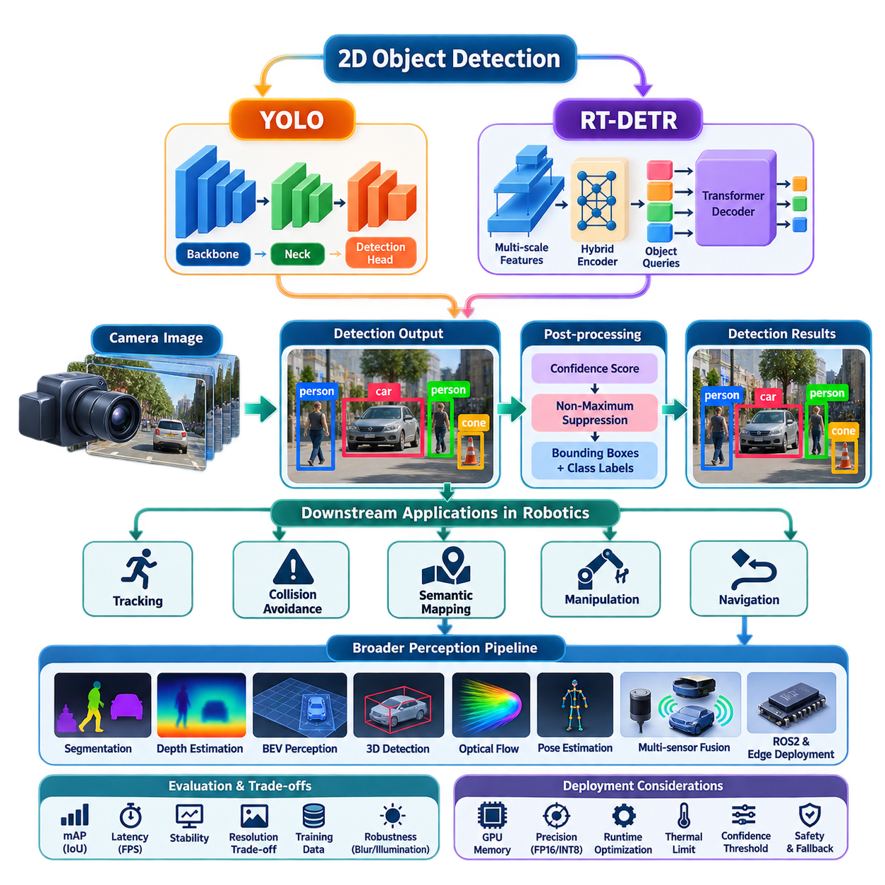
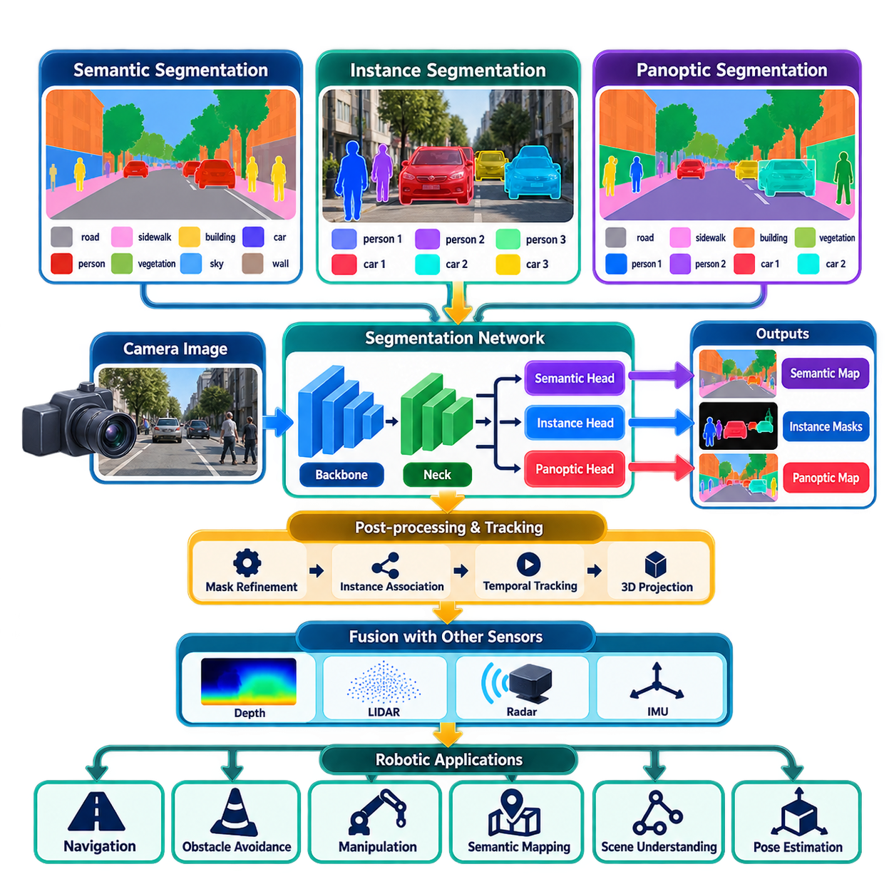
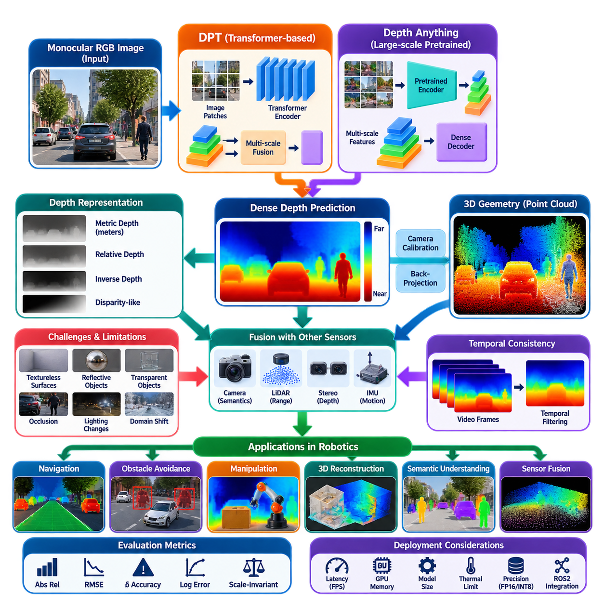
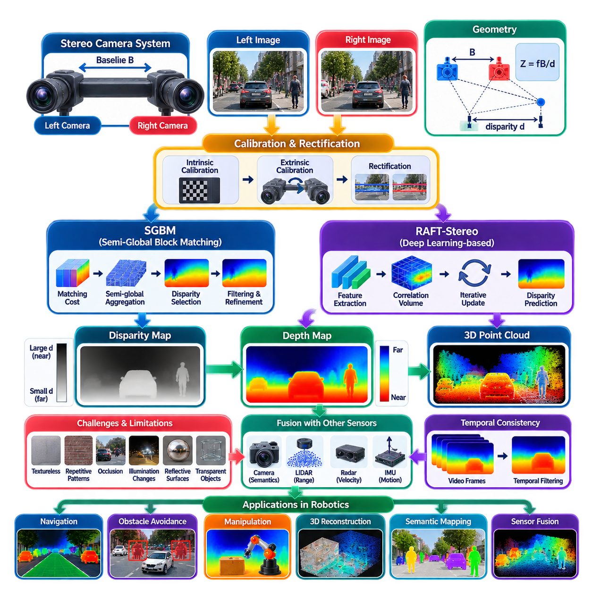
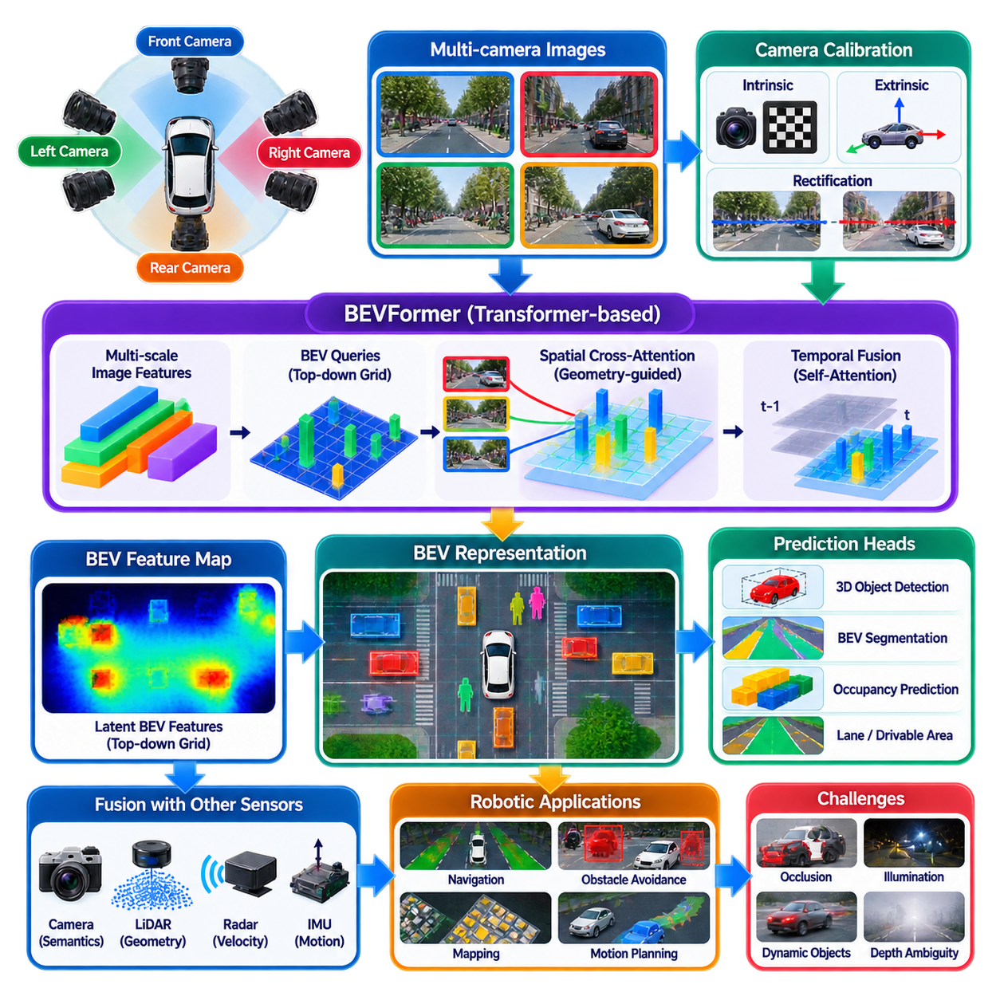
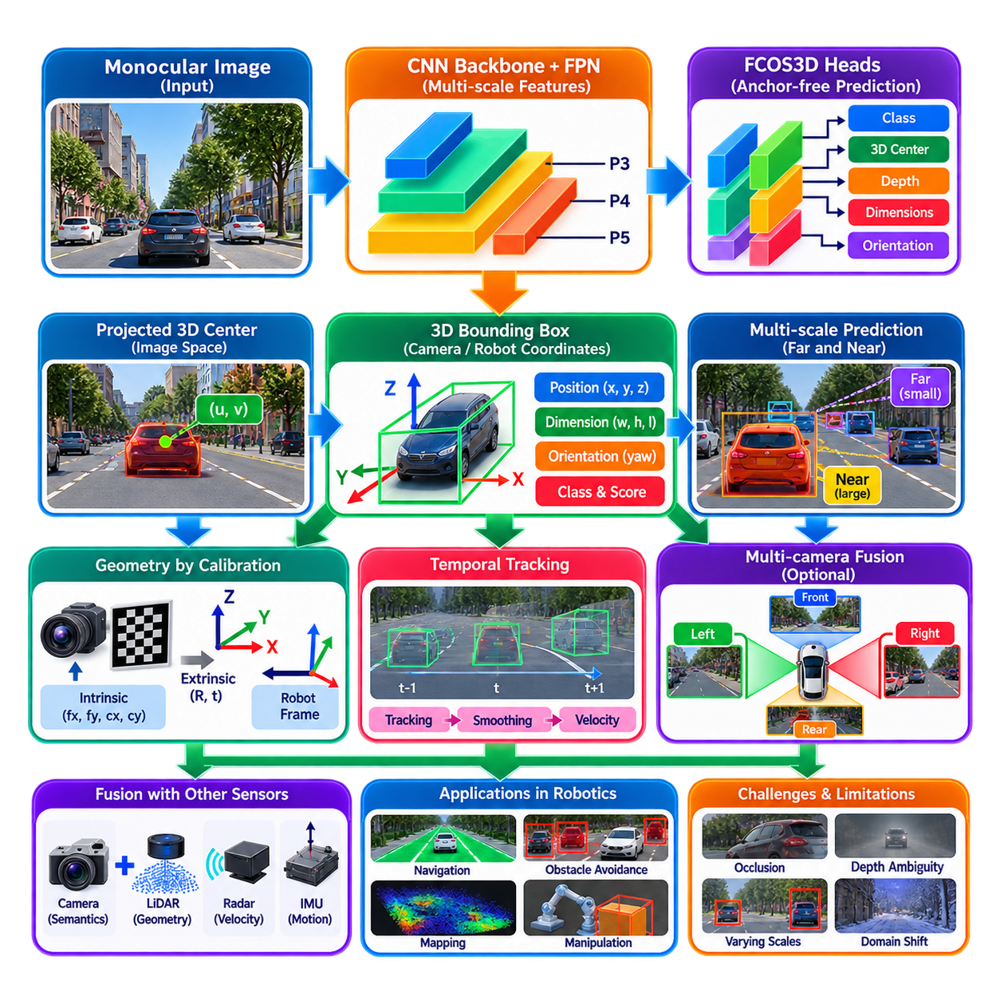
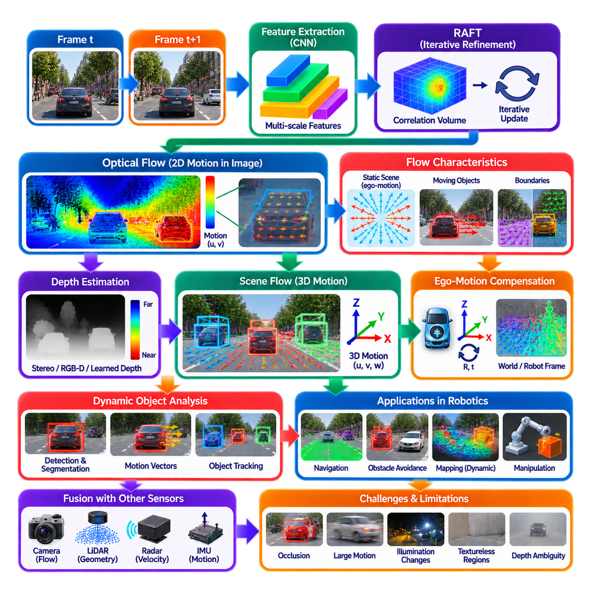
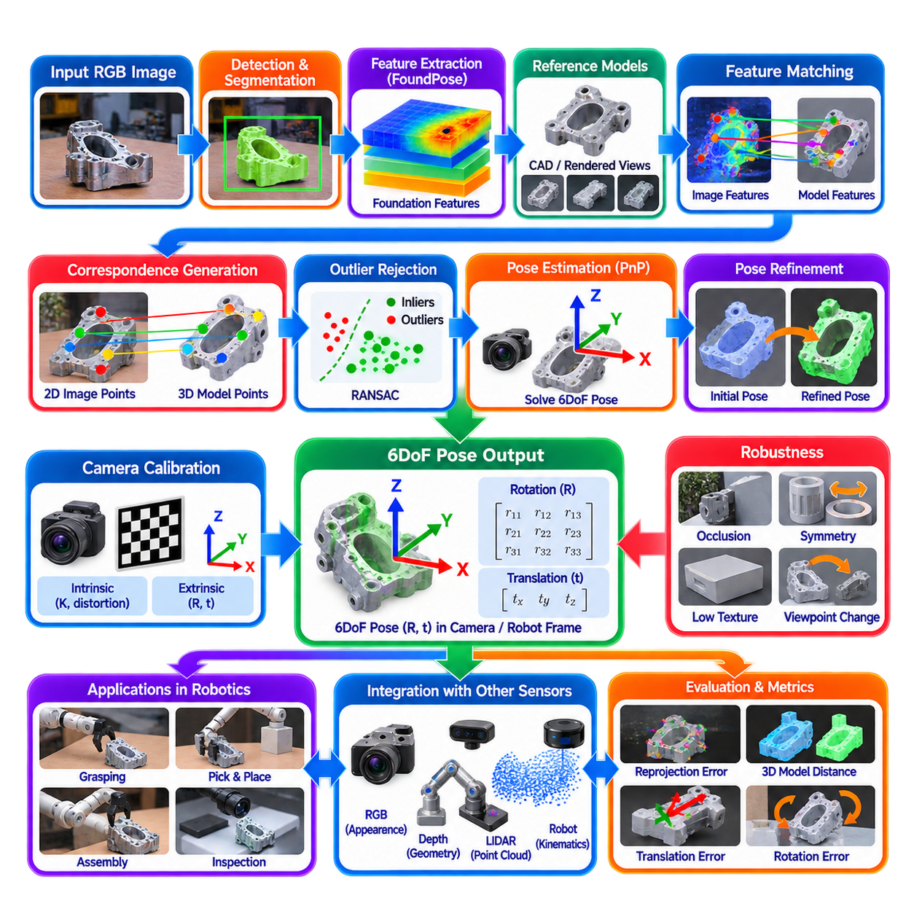
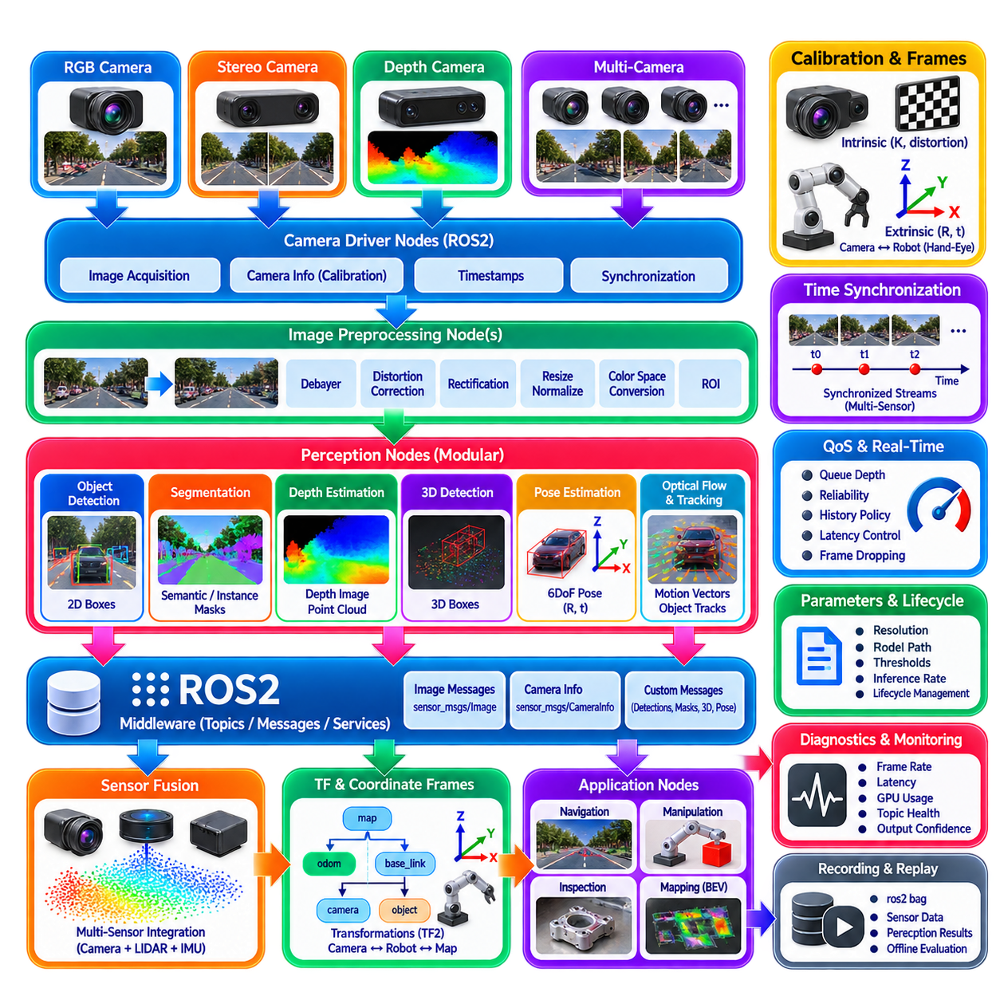
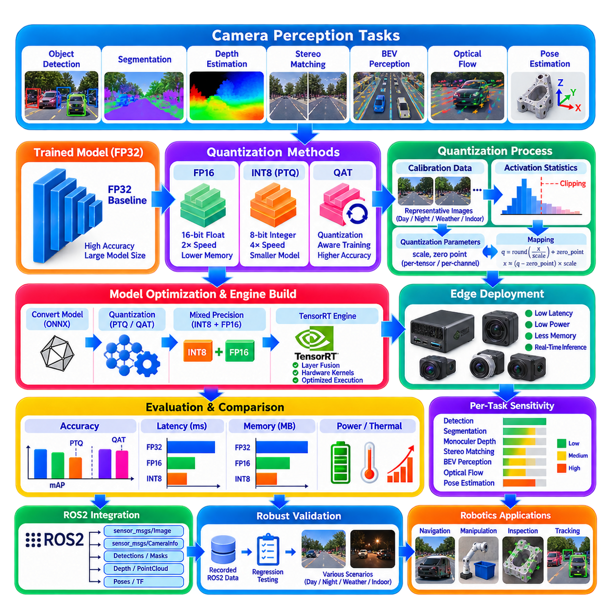

**Volume 14. Perception and Sensor Fusion**

# Chapter 02. Camera Perception

## 02.01. 2D Object Detection YOLO RT DETR Architecture [w/Code]

{width="7.268055555555556in" height="7.268055555555556in"}

Modern 2D object detection converts camera images into structured observations describing what objects are present and where they appear in the image plane. In robot perception, these detections form an important bridge between raw visual sensing and higher-level functions such as tracking, collision avoidance, semantic mapping, manipulation, and navigation. The camera-perception structure places YOLO and RT-DETR detection at the beginning of a broader pipeline that later extends toward segmentation, depth estimation, BEV perception, 3D detection, optical flow, pose estimation, ROS2 integration, and edge deployment. :chatgpt-content-reference{index="0"}

A 2D detector typically receives an RGB image represented as a tensor and produces a collection of object hypotheses containing class labels, confidence scores, and bounding boxes. A bounding box is commonly parameterized by its center coordinates, width, and height or by two opposite image-plane corners. During training, predicted objects are compared with annotated targets using localization and classification objectives, while inference converts the network outputs into the compact set of detections required by downstream robotic software.

YOLO represents the single-stage detector philosophy in which object localization and classification are performed within one integrated neural-network pipeline. Instead of first generating candidate regions and then processing each candidate independently, YOLO extracts visual features from the complete image and directly predicts objects from those features. This architecture is particularly attractive for robotics because the perception system must repeatedly process camera frames while maintaining sufficiently low latency for control and navigation.

A practical YOLO architecture can be understood as a sequence of backbone, neck, and detection-head functions. The backbone transforms pixels into hierarchical feature representations, where early layers preserve local edges and textures while deeper layers encode increasingly semantic information. The neck combines features across multiple spatial resolutions so that small, medium, and large objects remain detectable. The detection head finally transforms these fused features into bounding-box coordinates, object categories, and associated confidence estimates.

Multi-scale processing is especially important for mobile robots because the apparent size of an object changes rapidly with distance. A nearby pedestrian may occupy a substantial portion of the camera image, while another pedestrian farther along the robot\'s route may cover only a few pixels. Feature-pyramid mechanisms preserve high-resolution spatial information while combining it with deeper semantic features, allowing the detector to recognize objects across a broad range of scales without executing a completely separate network for every resolution.

YOLO implementations have evolved from anchor-based prediction toward increasingly anchor-free designs. Anchor-based detectors associate predictions with predefined bounding-box shapes, requiring suitable anchor configurations for the expected object distribution. Anchor-free approaches instead predict object locations and box geometry more directly from feature-map positions. For robot applications with changing cameras, environments, and object dimensions, reducing dependence on manually designed anchors can simplify adaptation and improve the portability of the perception pipeline.

Traditional dense detectors can generate multiple overlapping predictions for the same physical object. Non-Maximum Suppression, or NMS, resolves these duplicates by ranking detections according to confidence and suppressing boxes that overlap strongly with a higher-ranked prediction, usually according to Intersection over Union. Although computationally inexpensive compared with the neural network itself, NMS introduces an additional post-processing stage whose thresholds influence behavior when objects overlap or appear densely packed.

RT-DETR approaches real-time object detection from the transformer-based DETR family rather than from the conventional dense YOLO formulation. DETR reframes detection as a set-prediction problem: a fixed collection of object queries interacts with encoded image features and produces a set of object predictions. Training establishes one-to-one relationships between predicted and ground-truth objects through bipartite matching, reducing the conceptual need for hand-designed anchors and duplicate-removal procedures characteristic of many conventional detectors.

The transformer formulation provides an important architectural distinction. Convolutional detectors primarily build representations through spatially local operations combined across progressively deeper layers, whereas attention mechanisms can model relationships among spatial features more explicitly. This allows object queries to reason over image context when producing predictions. However, the original DETR approach introduced convergence and computational challenges, motivating architectures such as RT-DETR that restructure feature processing and query selection for practical real-time detection.

RT-DETR combines multi-scale convolutional features with an efficient hybrid encoder designed to limit the computational cost of processing high-resolution feature maps. Rather than applying expensive transformer operations uniformly across every feature level, the architecture separates intra-scale feature interaction from cross-scale fusion. This design retains useful multi-resolution information while reducing unnecessary computation, an important requirement when detection must operate continuously on GPU-equipped edge computers rather than offline datacenter hardware.

Another important component is query selection. Transformer detectors ultimately depend on a limited number of decoder queries to represent candidate objects, so the quality of those initial queries affects both convergence and inference efficiency. RT-DETR selects informative encoder features as object queries before transformer decoding. The decoder then progressively refines class and bounding-box predictions, enabling the architecture to maintain the end-to-end set-prediction principle while targeting latency levels appropriate for real-time vision applications.

YOLO and RT-DETR therefore represent two related but architecturally different approaches to the same robotic perception requirement. YOLO emphasizes a highly optimized dense detection pipeline built around convolutional feature extraction, multi-scale fusion, and efficient prediction heads. RT-DETR combines convolutional feature extraction with transformer-based set prediction and object queries. The appropriate choice is consequently not determined by accuracy alone but by latency, memory consumption, image resolution, accelerator support, training data, and downstream system requirements.

For robotics, detector performance must be evaluated as part of a complete perception-control pipeline rather than as an isolated benchmark. Mean Average Precision provides an important measure of detection quality, while Intersection over Union characterizes localization overlap, but neither metric alone determines whether a robot can operate safely. Frame latency, throughput, temporal stability, minimum detectable object size, false-negative behavior, confidence calibration, and performance under motion blur or illumination changes can be equally important operational characteristics. The broader volume explicitly treats perception latency and evaluation metrics as system-level concerns. :chatgpt-content-reference{index="1"}

Input resolution creates a fundamental engineering trade-off. Increasing image dimensions generally preserves more information about distant or physically small objects, but it also increases feature-map sizes, memory traffic, and inference cost. Reducing resolution improves throughput but may eliminate the visual detail required for early obstacle detection. A robot designer should therefore derive camera resolution and detector input size from required detection distance, field of view, target dimensions, vehicle velocity, and available reaction time rather than selecting resolution solely from benchmark conventions.

Latency should similarly be considered end to end. Camera exposure and readout, image transfer, preprocessing, neural inference, post-processing, message transport, tracking, planning, and control all consume part of the robot\'s reaction-time budget. A detector achieving high frames per second can still be unsuitable if buffering or asynchronous pipelines produce stale observations. Production implementations should timestamp frames near acquisition and preserve those timestamps through the perception stack so downstream modules can distinguish computational throughput from actual observation age.

Temporal behavior is another difference between benchmark detection and robotic perception. YOLO and RT-DETR normally process individual frames, whereas a moving robot experiences continuous scenes. Small variations in illumination, viewpoint, partial occlusion, or image noise may therefore cause bounding boxes and confidence scores to fluctuate between adjacent frames. Object tracking, temporal filtering, ego-motion compensation, or later temporal-fusion modules can transform frame-level detections into more stable object states suitable for planning and control.

Training data must reflect the robot\'s operational domain. Generic datasets provide useful pretrained visual representations, but production cameras encounter installation-specific viewpoints, lens distortion, vibration, weather, reflective surfaces, industrial uniforms, pallets, machinery, and objects that may be uncommon in general-purpose datasets. Fine-tuning should therefore include representative operational images and difficult negative examples. Data collected from the actual camera position is particularly valuable because mounting height and viewing angle strongly influence object appearance and occlusion patterns.

Deployment also requires explicit management of confidence thresholds and unknown conditions. A high threshold reduces false positives but can suppress distant or partially occluded hazards, while a low threshold increases recall at the cost of additional uncertain detections. These decisions should be linked to downstream risk handling. Detection confidence should not be interpreted as a direct probability of physical safety, and safety-critical behavior should not depend on a single neural prediction without appropriate redundancy, monitoring, or conservative fallback logic.

On edge robots, model selection extends beyond choosing a detector family. The complete implementation must consider GPU memory, tensor precision, supported operators, preprocessing overhead, batch size, thermal limits, and inference-runtime optimization. FP16 or INT8 execution can substantially reduce computation and memory requirements when supported by the target accelerator, although quantization effects must be validated on safety-relevant classes and difficult operating conditions. This naturally connects camera detection with the volume\'s later treatment of camera-perception quantization and edge deployment. :chatgpt-content-reference{index="2"}

Integration into a robot software architecture typically exposes detections as timestamped messages containing image references, bounding boxes, classes, confidence values, and frame identifiers. Calibration information allows image detections to be related to camera geometry, while synchronization enables later fusion with LiDAR, radar, depth, or inertial measurements. The detector should therefore be regarded not merely as an AI model but as a real-time software component with defined inputs, outputs, timing guarantees, diagnostics, and failure states.

A robust implementation can support multiple detector backends behind the same perception interface. YOLO may serve as the primary configuration when minimal latency and mature deployment tooling dominate, while RT-DETR can provide an alternative when transformer-based set prediction and contextual feature interaction are advantageous. Keeping preprocessing, inference, output normalization, visualization, tracking, and ROS2 interfaces modular prevents detector-specific details from propagating throughout the robot software stack and makes controlled model replacement significantly easier.

Ultimately, YOLO and RT-DETR illustrate the transition of 2D object detection from a standalone computer-vision task into a reusable perception service for autonomous machines. The detector transforms camera pixels into semantic object hypotheses, but useful robotic intelligence emerges only when those hypotheses are synchronized, validated, tracked, fused with geometry, and delivered within the required latency budget. This role fits the volume\'s progression from camera perception toward LiDAR, radar, inertial perception, multi-sensor fusion, 3D scene understanding, and Physical AI perception. :chatgpt-content-reference{index="3"}

## 02.02. Instance and Panoptic Segmentation for Robots [w/Code]

{width="7.268055555555556in" height="7.268055555555556in"}

Instance segmentation extends object detection by determining not only which objects are present but also the precise pixels belonging to each individual object instance. For a robot, this provides a richer representation than a bounding box because objects with similar classes can be separated spatially. A perception system can therefore distinguish one pedestrian from another, isolate individual pallets, vehicles, containers, or tools, and provide geometric information that is useful for navigation, manipulation, obstacle avoidance, and scene understanding.

Semantic segmentation assigns a class label to every relevant pixel, but it does not distinguish separate objects that belong to the same class. Instance segmentation adds an object-instance identity to the pixel-level representation. If three people appear in the same camera image, semantic segmentation identifies all corresponding pixels as the class "person," whereas instance segmentation produces three separate masks. This distinction is particularly important when a robot must reason about individual objects rather than only the semantic composition of the scene.

Panoptic segmentation combines semantic and instance segmentation into a unified scene representation. It attempts to assign every pixel a semantic category while also assigning individual identities to countable object instances. Things such as people, vehicles, and boxes can receive separate instance identities, while stuff categories such as road, floor, wall, sky, or vegetation can be represented as continuous semantic regions. This provides a more complete description of the visual environment for downstream robotic reasoning.

The conceptual difference between the three approaches can be understood through their output representations. Semantic segmentation answers "what class does this pixel belong to?", instance segmentation answers "which individual object does this pixel belong to?", and panoptic segmentation combines both questions into a unified representation. For robotics, the appropriate representation depends on the task. Navigation may require free-space and obstacle regions, manipulation may require an individual object\'s precise boundary, while general scene understanding may benefit from a complete panoptic representation.

Instance segmentation architectures generally contain a feature extraction stage followed by mechanisms that predict object regions and their corresponding masks. Modern approaches can build on detection-oriented backbones and generate a mask for each detected object, while other architectures formulate segmentation more directly around pixel or query representations. The central engineering challenge is to preserve sufficient spatial detail for accurate boundaries while maintaining the inference speed required by an operating robot.

Mask quality is important because a bounding box contains substantial background information around an object, whereas a segmentation mask attempts to describe its actual visible shape. This distinction becomes significant when objects overlap or when the robot must estimate usable interaction regions. For manipulation, a mask can help separate a target from surrounding objects; for navigation, it can provide a more precise obstacle boundary. However, the visible mask remains an image-space observation and does not by itself provide complete three-dimensional geometry.

Occlusion is one of the major challenges in robot segmentation. A person partially hidden behind another person, a pallet obstructed by equipment, or an object partly outside the camera field of view can produce incomplete visual regions. The perception system must distinguish between an actual object boundary and a boundary caused by occlusion. Temporal information from consecutive frames, depth information, or complementary sensors can help maintain consistent object identities and improve the interpretation of partially visible objects.

Panoptic segmentation introduces additional system-level requirements because every relevant image region should receive an appropriate interpretation. The system must simultaneously maintain semantic consistency for background regions and instance consistency for countable objects. Errors can therefore arise from incorrect semantic classification, incorrect instance separation, missed objects, or conflicting assignments between object and background regions. Evaluation consequently requires metrics that consider both recognition quality and the quality of the predicted regions.

For mobile robots, segmentation performance must be evaluated together with latency and resource consumption. High-resolution masks can require considerably more memory and computation than simple bounding-box detection. Increasing input resolution may improve object boundaries but can reduce frame rate and increase thermal load on an edge computer. A practical system therefore selects model size, image resolution, mask resolution, and inference precision according to the robot\'s perception latency budget rather than optimizing segmentation quality independently.

Camera characteristics also influence segmentation performance. Lens distortion, motion blur, exposure variation, shadows, reflections, weather, and changes in illumination can alter object boundaries and visual appearance. Training data should therefore represent the actual operating environment as closely as practical. Industrial robots and outdoor AMRs may encounter visual conditions that differ substantially from common benchmark datasets, making domain-specific fine-tuning, representative validation data, and difficult negative examples important parts of deployment preparation.

Segmentation becomes significantly more useful when connected to other perception functions. A segmented object can be combined with monocular or stereo depth to estimate three-dimensional position, with optical flow to characterize motion, or with LiDAR to obtain more reliable geometric information. In a multi-sensor architecture, the camera provides detailed semantic boundaries while other sensors contribute depth, range, velocity, or robustness under adverse visual conditions. This allows segmentation to serve as a semantic layer within a broader perception system rather than as an isolated computer-vision function.

In a robotic software architecture, segmentation results should be represented as timestamped data associated with the camera frame and calibration parameters. Depending on the application, the output may include semantic labels, instance identifiers, confidence values, binary or probabilistic masks, bounding boxes, and tracking information. ROS2 integration can expose these results to navigation, manipulation, mapping, and planning modules. Clear interfaces are important because downstream modules should not need to depend on the internal architecture of the segmentation network.

For edge deployment, model optimization becomes a practical consideration. Reduced-precision inference such as FP16 or INT8 can lower computation and memory requirements when the target accelerator supports the required operations. However, quantization and other optimization methods can alter fine mask boundaries, particularly for small objects or visually difficult regions. Deployment validation should therefore evaluate not only aggregate segmentation metrics but also task-specific behavior, latency, memory usage, and performance on representative robotic scenarios.

Instance and panoptic segmentation ultimately provide a richer visual representation than conventional 2D detection. Detection identifies objects primarily through bounding boxes, while segmentation describes their visible pixel regions and panoptic perception additionally organizes the complete scene into semantic and instance-aware regions. In the broader camera-perception architecture, these capabilities form a foundation for depth estimation, BEV perception, camera-based 3D detection, optical-flow analysis, pose estimation, and later multi-sensor fusion. :chatgpt-content-reference{index="0"}

Instance segmentation extends object detection by determining not only which objects are present but also the precise pixels belonging to each individual object instance. For a robot, this provides a richer representation than a bounding box because objects of the same class can be separated spatially. A perception system can distinguish individual pedestrians, pallets, vehicles, containers, or tools and provide detailed geometric information for navigation, manipulation, obstacle avoidance, and scene understanding.

Semantic segmentation assigns a class label to each relevant pixel, but it does not distinguish separate objects belonging to the same class. Instance segmentation adds an object identity to the pixel-level representation. If three people appear in the same camera image, semantic segmentation identifies all corresponding pixels as "person," whereas instance segmentation generates three separate masks. This distinction is essential when a robot must reason about individual physical entities rather than only the semantic composition of the environment.

Panoptic segmentation combines semantic segmentation and instance segmentation into a unified representation of the entire image. It assigns semantic categories to pixels while also distinguishing individual identities for countable objects. "Things" such as people, vehicles, boxes, and robots receive instance identities, whereas "stuff" such as road, floor, wall, sky, grass, or vegetation is represented as continuous semantic regions. The result is a structured description that attempts to account for every meaningful region visible to the camera.

The three segmentation paradigms differ primarily in the questions they answer. Semantic segmentation determines what category each pixel represents, instance segmentation determines which individual object owns each relevant pixel, and panoptic segmentation combines category and instance information into one coherent scene representation. Navigation may primarily require free-space and obstacle regions, manipulation requires accurate masks for individual targets, and general scene understanding benefits from a complete representation of both objects and environmental surfaces.

Instance segmentation architectures generally combine visual feature extraction with mechanisms for object recognition, localization, and mask prediction. A backbone converts the image into hierarchical feature maps, while multi-scale processing preserves information about objects of different sizes. Detection-oriented architectures may first identify candidate objects and then generate a mask for each instance, whereas newer query-based architectures can directly predict classes and masks from learned object queries. Both approaches must balance spatial accuracy against computational efficiency.

Mask prediction requires finer spatial information than conventional bounding-box detection. A bounding box includes background pixels around an object, whereas a segmentation mask attempts to follow the visible contour of the object itself. Accurate masks are especially valuable when objects overlap, when a manipulator must select a graspable region, or when an autonomous robot must estimate the boundary of an obstacle. However, an image mask describes only the visible two-dimensional projection and does not independently provide complete three-dimensional geometry.

Multi-scale representation remains important because robotic cameras observe objects over widely varying distances. A nearby pallet may occupy thousands of pixels while a distant pedestrian may appear as a small image region. Feature pyramids and related multi-resolution mechanisms combine high-resolution spatial information with deeper semantic features. Without adequate high-resolution representation, small objects can disappear during feature downsampling, while insufficient semantic context can make visually similar objects difficult to distinguish.

Occlusion is a major challenge for instance segmentation in robotics. A pedestrian may be partly hidden behind a vehicle, a pallet may be obstructed by machinery, or an object may extend beyond the camera field of view. The network observes only visible pixels and must distinguish actual object boundaries from boundaries created by occlusion. Temporal tracking, depth estimation, multi-view observations, and complementary sensors can help maintain object identity and support more stable interpretation when visible regions change over time.

Panoptic segmentation introduces additional consistency requirements because the complete image should be assigned meaningful semantic and instance information. Object regions must not conflict with background regions, separate instances should remain distinguishable, and semantically continuous surfaces should remain coherent. Errors may result from incorrect classification, missed objects, merged instances, fragmented masks, or incorrect assignment between "things" and "stuff." This makes panoptic perception a more comprehensive but also more demanding representation than independent detection or segmentation.

Evaluation must therefore consider both recognition and segmentation quality. Intersection over Union measures overlap between predicted and reference regions, while class-specific segmentation metrics characterize semantic accuracy. Instance-oriented evaluation considers whether individual objects are correctly detected and segmented. Panoptic Quality combines recognition and segmentation aspects to characterize the overall panoptic result. For robotics, these benchmark metrics should be complemented by task-specific evaluation because small boundary errors can have very different consequences for navigation and manipulation.

Temporal stability is particularly important in a moving robot. Even when individual frames are segmented accurately, predicted masks may fluctuate because of camera motion, changing illumination, partial occlusion, or small variations in network confidence. Such instability can propagate into tracking, mapping, or planning. Associating masks across frames, incorporating object tracking, using optical flow, or applying temporal feature aggregation can convert frame-level segmentation into a more persistent representation of physical objects and environmental regions.

Segmentation becomes substantially more useful when combined with depth information. A two-dimensional mask identifies which image pixels belong to an object, while monocular depth, stereo vision, RGB-D sensing, or LiDAR can associate those pixels with distance and three-dimensional geometry. The resulting object representation can support obstacle localization, grasp planning, spatial measurement, semantic mapping, and collision checking. This demonstrates how camera segmentation acts as a semantic component within a broader geometric perception architecture.

For navigation, segmentation can classify traversable and non-traversable regions more precisely than bounding-box detection alone. Floor, road, sidewalk, vegetation, wall, vehicle, pedestrian, and unknown regions can be interpreted differently by a navigation system. Semantic or panoptic masks can subsequently contribute to occupancy maps and semantic costmaps. Nevertheless, safety-critical obstacle detection should not assume that an unsegmented region is free space, because segmentation networks can fail under unfamiliar objects, adverse lighting, or domain shifts.

For manipulation, instance segmentation provides an explicit representation of individual target objects. A robot arm can use an object\'s mask to isolate depth measurements, estimate its visible geometry, calculate a region of interest, or provide input to six-degree-of-freedom pose estimation. When several objects touch or overlap in a bin, separating individual instances becomes particularly important. The segmentation result therefore connects camera perception with downstream pose estimation, grasp planning, and manipulation control rather than serving only as a visualization output.

Camera conditions strongly influence segmentation quality. Lens distortion, motion blur, shadows, reflections, exposure changes, rain, fog, dirt, vibration, and changing illumination can modify both object appearance and apparent boundaries. Training and validation data should therefore represent the actual operational domain. Industrial robots and outdoor AMRs often observe scenes from camera heights and viewing angles that differ from general image datasets, making deployment-specific data collection and fine-tuning important for reliable performance.

Input resolution creates a direct trade-off between boundary quality and computational cost. Higher-resolution images preserve thin structures, small objects, and detailed contours but increase memory traffic and inference latency. Lower resolutions improve throughput but can remove precisely the information required for accurate masks. Mask resolution itself can also be lower than image resolution and later upsampled. Robot designers should therefore select image and mask resolutions according to required detection distance, object size, platform velocity, and available compute resources.

Edge deployment requires optimization of the entire segmentation pipeline rather than only the neural network. Image acquisition, resizing, normalization, inference, mask generation, resizing to the original image, post-processing, message serialization, and transfer to downstream modules all contribute to latency. FP16 or INT8 inference may reduce computation and memory consumption, but optimization must be validated carefully because quantization can affect small objects, narrow structures, confidence values, and fine mask boundaries.

In a ROS2-based robot architecture, segmentation results can be published as timestamped outputs associated with camera calibration and coordinate-frame information. Messages may contain semantic labels, instance identifiers, confidence scores, bounding boxes, binary masks, compressed masks, or indexed segmentation images. Maintaining the original acquisition timestamp is important for synchronization with depth cameras, LiDAR, radar, and IMU data. Downstream components should receive a stable interface independent of the particular neural-network implementation.

A modular perception architecture can separate image preprocessing, neural inference, mask interpretation, temporal tracking, sensor fusion, and application interfaces. This allows different segmentation models to be evaluated without redesigning the entire robot software stack. The same normalized representation can feed navigation, manipulation, semantic mapping, scene understanding, or data logging. Such modularity also supports independent profiling of GPU utilization, latency, memory consumption, failure rates, and model accuracy during deployment.

Instance and panoptic segmentation ultimately transform camera images from collections of pixels into structured descriptions of objects and environmental regions. Instance segmentation provides object-specific masks, while panoptic segmentation combines individual objects with continuous semantic surfaces to describe the broader scene. Within the camera-perception structure, these capabilities naturally connect 2D detection with depth estimation, BEV perception, 3D detection, optical flow, pose estimation, ROS2 integration, and edge deployment. :chatgpt-content-reference{index="1"}

## 02.03. Monocular Depth Estimation DPT DepthAnything [w/Code]

{width="7.268055555555556in" height="7.268055555555556in"}

Monocular depth estimation predicts scene depth from a single RGB image, allowing a robot to infer approximate geometric structure without requiring stereo correspondence or an active depth sensor. Unlike object detection or segmentation, which primarily describe semantic content in the image plane, depth estimation assigns a depth-related value to each pixel. The resulting dense depth representation can support obstacle reasoning, navigation, manipulation, 3D reconstruction, and sensor fusion.

The fundamental difficulty is that absolute three-dimensional geometry cannot generally be determined uniquely from one image. Different physical scenes can produce similar two-dimensional projections, creating an inherently ill-posed inverse problem. Humans resolve this ambiguity using learned visual cues such as perspective, relative object size, texture gradients, occlusion, shading, and semantic knowledge. Modern monocular depth networks similarly learn statistical relationships between image appearance and scene geometry from large collections of training data.

A monocular depth network receives an RGB image and produces a dense depth or inverse-depth map whose spatial dimensions correspond to the input image. Each output value represents an estimate of scene distance or relative depth along the associated viewing direction. Depending on the training formulation, the prediction may represent metric depth in physical units, scale-invariant depth, relative depth ordering, disparity-like quantities, or affine-invariant depth that requires additional information before it can be interpreted metrically.

Relative depth and metric depth should therefore be distinguished carefully in robotic applications. Relative depth can correctly determine that one surface is closer than another while leaving the absolute distance uncertain. Metric depth attempts to estimate physical distance, typically in meters, and is more directly useful for collision checking or geometric measurement. A visually convincing depth map should never automatically be interpreted as metrically accurate unless the model, calibration, operating domain, and output convention explicitly support that interpretation.

Dense Prediction Transformer, or DPT, introduced a transformer-oriented architecture for dense prediction tasks such as monocular depth estimation. Instead of relying exclusively on conventional convolutional feature hierarchies, DPT uses representations generated by a vision transformer and reassembles features from multiple transformer stages into image-like feature maps. These representations are progressively fused and refined to recover spatial detail while preserving the global contextual information learned by the transformer encoder.

The transformer encoder divides an image into patches, converts them into token representations, and processes relationships among those tokens through self-attention. This provides a comparatively global receptive field and allows distant image regions to influence each other\'s representations. For depth estimation, global context can be valuable because geometric interpretation frequently depends on relationships among floors, walls, objects, horizons, and perspective structures that may be widely separated across the image.

DPT must convert token-oriented transformer representations back into dense spatial predictions. Intermediate features are therefore reassembled at appropriate spatial resolutions and passed through fusion stages that progressively combine semantic context with spatial structure. The decoder ultimately produces a dense depth prediction aligned with the image. This encoder-reassembly-fusion organization illustrates a general principle of dense vision: high-level global understanding must eventually be converted back into detailed per-pixel geometry.

Depth Anything advances monocular depth estimation by emphasizing large-scale and diverse visual learning. Rather than depending only on narrowly curated depth datasets, the approach exploits extensive image data and strong pretrained visual representations to improve generalization across scenes. This is particularly relevant to robotics because deployed cameras encounter environments, objects, illumination conditions, viewpoints, and textures that may differ substantially from the datasets used during supervised depth training.

A major advantage of broadly trained monocular depth models is their ability to provide useful geometric priors in previously unseen environments. Indoor corridors, warehouses, roads, vegetation, machinery, people, and miscellaneous objects can often be organized into plausible near-to-far structures even when exact metric depth remains uncertain. Such predictions can complement conventional geometry, especially when depth sensors are unavailable, temporarily degraded, or constrained by platform size, cost, power consumption, or sensing range.

DPT and Depth Anything should not be viewed simply as interchangeable depth sensors. They are learned inference systems whose outputs depend on training distributions and visual evidence. Textureless surfaces, mirrors, transparent objects, unusual scale relationships, strong reflections, extreme lighting, motion blur, unfamiliar environments, and objects with ambiguous geometry can produce erroneous predictions. Robots should therefore preserve uncertainty and avoid treating monocular depth as an unquestionable geometric measurement.

Camera calibration remains important even when depth is predicted by a neural network. Intrinsic parameters describe the relationship between image pixels and camera rays, enabling depth values to be projected into three-dimensional coordinates when the output has an appropriate geometric interpretation. Given calibrated focal lengths and principal point, a pixel and its depth can be back-projected into camera coordinates. Extrinsic calibration then relates these coordinates to the robot body, manipulator, map, or other sensor frames.

When reliable metric depth is available, the predicted image can be transformed into a pseudo point cloud by back-projecting pixels through the calibrated camera model. This representation can support local obstacle analysis, scene reconstruction, or fusion with LiDAR measurements. However, errors in predicted scale directly become three-dimensional position errors. Relative-depth models require scale alignment or another source of metric information before their outputs can safely participate in calculations that depend on physical distance.

Temporal consistency is another important requirement for moving robots. A model processing each frame independently may produce depth values that fluctuate even when the physical scene changes smoothly. Camera motion, exposure changes, motion blur, partial occlusion, or small image variations can cause frame-to-frame depth instability. Temporal filtering, visual odometry, optical flow, tracking, or multi-frame depth architectures can reduce these inconsistencies and produce a more stable representation for navigation and mapping.

Monocular depth can be combined naturally with semantic and instance segmentation. Segmentation identifies which pixels belong to objects or environmental regions, while depth provides an estimate of their geometric arrangement. A robot can consequently separate the depth values belonging to a pedestrian, pallet, vehicle, floor, or wall and derive approximate spatial relationships. This combination provides a transition from purely image-space recognition toward object-aware three-dimensional perception.

Fusion with LiDAR or stereo sensing can address important weaknesses of monocular estimation. LiDAR provides direct range measurements but usually with substantially lower image-plane density than a camera, while learned monocular depth provides dense predictions but may suffer from scale or generalization errors. A fusion system can use sparse metric measurements to constrain or correct dense camera-derived depth, potentially combining the semantic richness and spatial density of vision with the geometric reliability of direct ranging.

For navigation, depth maps can contribute to free-space estimation, obstacle detection, terrain interpretation, and local costmap generation. Nearby regions can be projected into robot coordinates and analyzed relative to the expected ground surface or traversable corridor. Nevertheless, monocular depth should normally complement rather than replace safety-rated obstacle sensing where collision consequences are significant. Unknown objects, domain shifts, or incorrect scale estimates can create precisely the kinds of errors that are difficult to detect from the depth image alone.

For manipulation, dense depth provides geometric information around target objects identified through detection or segmentation. The robot can estimate surface structure, separate foreground from background, initialize pose estimation, or generate approximate three-dimensional regions for grasp planning. Accuracy requirements are usually more demanding for manipulation than for coarse scene understanding, so monocular estimates may need refinement through stereo, RGB-D, structured light, LiDAR, multi-view reconstruction, or direct geometric verification.

Evaluation should distinguish prediction quality from operational usefulness. Common depth metrics measure absolute or relative error, threshold accuracy, logarithmic error, or scale-invariant agreement with reference depth. For robotics, additional evaluation should examine obstacle-distance error, boundary accuracy, temporal stability, failure under domain shifts, and performance at safety-relevant ranges. A model with strong average benchmark accuracy may still produce unacceptable local errors near thin obstacles, reflective surfaces, or important object boundaries.

Input resolution and model size create direct deployment trade-offs. Higher resolution can preserve small obstacles, narrow structures, and detailed depth discontinuities, but it increases GPU computation, memory traffic, and inference latency. Larger transformer encoders may improve representation quality while exceeding the real-time budget of an edge computer. Robot designers must therefore evaluate depth accuracy together with frame latency, GPU memory, thermal behavior, power consumption, and the required reaction time of the platform.

Edge deployment can use optimized runtimes and reduced numerical precision such as FP16 or, where adequately validated, INT8. Preprocessing, tensor transfer, inference, resizing, depth normalization, three-dimensional projection, and ROS2 message publication should all be included when measuring end-to-end latency. Optimization should also preserve the mathematical meaning of the output because incorrect normalization, resizing, or interpretation of inverse depth can create severe geometric errors even when neural inference itself is functioning correctly.

In a ROS2 architecture, the depth module can subscribe to calibrated camera images and publish timestamped depth maps together with metadata describing the camera frame and depth representation. Downstream nodes may convert depth into point clouds, associate it with segmentation masks, fuse it with LiDAR, or construct local spatial representations. Preserving the original image timestamp and coordinate-frame relationships is essential when the robot moves rapidly or when depth is combined with measurements from other sensors.

Monocular depth estimation ultimately transforms ordinary camera imagery into a learned geometric representation of the environment. DPT demonstrates how transformer features can be reconstructed into dense spatial predictions, while Depth Anything illustrates the importance of broad visual learning and generalization. Within the camera-perception structure, monocular depth forms a natural bridge from 2D detection and segmentation toward stereo depth, BEV perception, camera-based 3D detection, optical flow, pose estimation, and multi-sensor fusion. :chatgpt-content-reference{index="0"}

## 02.04. Stereo Depth Estimation SGBM RAFT Stereo [w/Code]

{width="7.268055555555556in" height="7.268055555555556in"}

Stereo depth estimation reconstructs scene geometry by observing the environment simultaneously from two cameras with a known spatial separation. Unlike monocular depth estimation, which must infer depth from learned visual cues and can suffer from scale ambiguity, calibrated stereo vision derives distance from geometric correspondence between left and right images. This makes stereo an important passive ranging technology for mobile robots, autonomous vehicles, manipulators, and other platforms requiring dense three-dimensional perception.

A stereo camera system consists of left and right cameras separated by a baseline. Because the cameras observe the same physical point from slightly different viewpoints, its image position shifts between the two views. This horizontal displacement is called disparity. For a rectified stereo pair, depth is approximately determined by Z = fB/d, where Z is depth, f is focal length, B is the stereo baseline, and d is disparity. Larger disparity therefore corresponds to closer objects, while smaller disparity represents greater distance.

Accurate calibration is fundamental to stereo geometry. Intrinsic calibration estimates focal length, principal point, and lens distortion for each camera, while extrinsic calibration determines the rotation and translation between the two cameras. Stereo rectification then transforms both images so that corresponding points lie approximately on the same horizontal scanline. This converts correspondence from a two-dimensional search problem into a primarily one-dimensional search along the epipolar line, substantially simplifying disparity estimation.

The central computational problem is stereo matching: identifying which pixel or image feature in the right image corresponds to a pixel in the left image. Matching can use intensity, color, local texture, learned features, or combinations of these representations. Once correspondence is established, disparity can be calculated and converted into depth. Incorrect matches directly produce incorrect geometry, making correspondence quality one of the dominant factors determining the reliability of a stereo perception system.

Stereo matching becomes difficult in textureless regions because many neighboring pixels may look nearly identical. Repetitive patterns can generate several plausible correspondences, while reflections and transparent surfaces violate assumptions about consistent appearance between views. Occlusion creates another fundamental difficulty because a surface visible to one camera may not be visible to the other. Illumination differences, motion blur, image noise, and imperfect calibration further complicate correspondence and can create invalid or unstable depth estimates.

Semi-Global Block Matching, or SGBM, provides a classical stereo method that balances local matching efficiency with broader spatial consistency. Rather than selecting disparity independently at each pixel, SGBM constructs matching costs and approximately minimizes an energy function along multiple image directions. The optimization penalizes abrupt disparity changes while allowing larger discontinuities when supported by the image evidence. This produces smoother and more coherent disparity maps than simple local block matching while remaining practical for real-time implementations.

The SGBM pipeline typically begins with calibrated and rectified stereo images, followed by computation of a matching cost over a predefined disparity range. Costs are aggregated along several directional paths while smoothness penalties encourage neighboring pixels to have similar disparities. The disparity with the lowest aggregated cost is selected, followed by optional consistency checks, filtering, and refinement. The resulting disparity image can then be transformed into metric depth using the calibrated focal length and baseline.

Several parameters strongly influence SGBM behavior. The minimum disparity and number of disparities determine the searchable depth range, while block size affects the balance between noise sensitivity and preservation of fine structures. Smoothness penalties regulate how easily disparity changes across neighboring regions. Uniqueness constraints, left-right consistency checks, speckle filtering, and subpixel refinement can reject unreliable matches or improve precision. Parameter selection should therefore reflect camera resolution, baseline, expected depth range, scene texture, and available computation.

SGBM remains attractive for robotics because its geometric behavior is understandable and it does not require neural-network training. It can operate on conventional CPUs and provides deterministic processing characteristics that are useful in constrained systems. However, its assumptions can break down in difficult visual environments, particularly on low-texture surfaces, thin structures, repetitive patterns, strong illumination changes, and complex occlusions. Its accuracy is consequently dependent on image quality, calibration, and carefully selected matching parameters.

RAFT-Stereo approaches the correspondence problem using learned deep visual features and iterative refinement. Inspired by recurrent all-pairs field transforms, it extracts feature representations from both stereo images, constructs correlation information describing potential matches, and repeatedly updates the disparity estimate through a recurrent mechanism. Instead of committing immediately to a local correspondence, the network progressively refines disparity using learned context and matching evidence, enabling more robust reasoning in visually difficult regions.

A key concept in RAFT-Stereo is the correlation representation between left and right image features. Feature similarity across possible disparities provides evidence about where corresponding scene points may appear. A recurrent update operator repeatedly queries this information together with contextual features and the current disparity estimate. Each iteration predicts a correction, gradually moving the disparity field toward a more consistent solution. This iterative structure differs substantially from the handcrafted matching-cost aggregation used by classical SGBM.

Learned stereo models can resolve ambiguities that are difficult for purely local algorithms because their features incorporate semantic and contextual information learned from data. Surfaces with weak texture may still contain higher-level visual patterns useful for correspondence, while object boundaries and contextual structures can guide disparity refinement. Nevertheless, RAFT-Stereo is not immune to failure. Domain shifts, unusual optical characteristics, extreme weather, severe motion blur, unseen camera configurations, and reflective or transparent materials can still degrade predictions.

SGBM and RAFT-Stereo therefore represent complementary stereo philosophies. SGBM relies on explicit geometric assumptions, engineered matching costs, directional optimization, and configurable filtering. RAFT-Stereo learns feature representations and iterative correspondence refinement from data. SGBM can be easier to interpret and deploy on CPU-oriented systems, whereas RAFT-Stereo generally demands substantially more GPU computation but can provide stronger disparity estimation in challenging visual scenes when the deployment domain is compatible with its training.

Stereo depth accuracy is strongly affected by baseline and focal length. A wider baseline produces larger disparities for a given distance and can improve depth resolution at longer ranges, but it also increases viewpoint differences and occlusion between cameras. A narrow baseline simplifies correspondence for nearby scenes but provides weak disparity at long distances. Camera selection and mechanical placement should therefore be derived from the robot\'s required sensing range rather than chosen independently from the intended application.

Depth uncertainty also grows rapidly as disparity becomes small. Since depth is inversely proportional to disparity, a small disparity error at long range can produce a large distance error. Stereo systems are consequently strongest within a finite working range determined by focal length, baseline, image resolution, and matching precision. For navigation and obstacle detection, designers should characterize depth error as a function of distance rather than treating stereo output as having uniform accuracy throughout the complete field of view.

Stereo depth naturally produces dense three-dimensional information. Once disparity has been converted into metric depth, calibrated pixels can be back-projected into camera coordinates to generate a point cloud. Semantic or instance segmentation masks can then associate these 3D points with pedestrians, vehicles, pallets, floors, walls, or manipulation targets. This combination connects camera-based recognition with explicit geometry and enables semantic point clouds, object-distance estimation, local mapping, and geometric reasoning.

Temporal processing can improve stereo perception on moving robots. Independent disparity maps may fluctuate because of image noise, changing texture, vibration, or temporary correspondence failures. Visual odometry, optical flow, tracking, or temporal filtering can align information across frames and suppress unstable measurements. Care is required around moving objects because incorrectly assuming static geometry can smear depth observations or create ghost structures in maps and obstacle representations.

Stereo can also be fused with LiDAR, radar, IMU, and monocular depth estimation. LiDAR contributes accurate sparse or semi-dense range measurements, radar provides robust range and velocity information under difficult weather, and IMU measurements help characterize platform motion. Learned monocular depth can provide useful priors where stereo correspondence is weak. Fusion allows the robot to exploit complementary sensing characteristics rather than expecting a single camera pair to remain reliable under every environmental condition.

For navigation, stereo depth can identify nearby obstacles, estimate free space, characterize terrain, and populate local occupancy or cost maps. For manipulation, dense depth around a segmented object can support surface reconstruction, pose estimation, grasp planning, and collision checking. Stereo is especially useful when passive sensing is desirable because it does not require projected infrared patterns or other active illumination, although its dependence on visible image texture introduces different limitations from active depth cameras.

Evaluation should include disparity error, depth error, invalid-pixel rate, boundary quality, and performance as a function of distance. Robotic evaluation should additionally examine temporal stability, thin-obstacle detection, latency, failure under illumination changes, calibration sensitivity, and behavior on reflective or textureless surfaces. Average benchmark accuracy alone cannot determine operational suitability because a small number of severe depth failures near obstacles may be more important than modest errors distributed across visually unimportant background regions.

Real-time deployment requires consideration of the complete stereo pipeline. Camera synchronization, image acquisition, rectification, matching or neural inference, disparity filtering, depth conversion, point-cloud generation, and ROS2 communication all contribute to latency. SGBM may be practical on CPU or embedded processors, while RAFT-Stereo typically benefits from GPU acceleration and reduced-precision inference. Resolution, disparity range, model size, memory usage, thermal limits, and required update rate must be balanced against geometric accuracy.

In a ROS2 architecture, synchronized left and right camera streams should preserve acquisition timestamps together with calibration information. Rectified images can feed either classical SGBM or learned RAFT-Stereo nodes, while standardized depth or disparity outputs allow downstream software to remain largely independent of the selected algorithm. Point-cloud generation, segmentation fusion, obstacle detection, mapping, and navigation can then consume the same geometric interface, supporting modular replacement and comparative evaluation of stereo algorithms.

Stereo depth estimation ultimately converts binocular camera observations into explicit metric geometry through correspondence and triangulation. SGBM demonstrates how engineered matching costs and semi-global optimization can produce practical disparity maps, while RAFT-Stereo demonstrates the power of learned features, correlation representations, and iterative refinement. Within the camera-perception structure, stereo depth complements monocular depth and provides a geometric foundation for BEV perception, 3D object detection, optical flow, pose estimation, and later multi-sensor fusion.

## 02.05. BEV Perception from Multi Camera BEVFormer [w/Code]

{width="7.268055555555556in" height="7.268055555555556in"}

Bird's-Eye-View perception transforms observations from multiple surrounding cameras into a unified representation defined in the robot or vehicle coordinate system. Instead of reasoning independently in each perspective image, the system organizes visual information on a common ground-oriented spatial plane. This representation is particularly useful for autonomous robots because navigation, obstacle reasoning, trajectory planning, mapping, and interaction with moving agents are naturally expressed in metric space around the platform.

A multi-camera system typically places cameras around the robot to provide overlapping or complementary fields of view. Front, rear, and side cameras observe different portions of the environment, and each image contains perspective distortion determined by its optical geometry. Objects close to a camera appear large while distant objects appear small. BEV perception attempts to convert these heterogeneous perspective observations into a common spatial representation in which positions and relationships are easier for downstream planning modules to interpret.

Camera calibration is fundamental to this transformation. Each camera requires intrinsic parameters describing focal length, principal point, and lens distortion, together with extrinsic parameters defining its position and orientation relative to the robot coordinate frame. These parameters establish the geometric relationship between image pixels and three-dimensional viewing rays. Accurate calibration allows visual features from different cameras to be associated with consistent spatial regions, while calibration errors can produce displaced, duplicated, or geometrically inconsistent BEV features.

Classical approaches can project image information onto a ground plane using inverse perspective mapping. Such methods work well when relevant surfaces approximately satisfy a planar-ground assumption, but real environments contain vehicles, pedestrians, curbs, walls, ramps, vegetation, machinery, and other structures extending above or below that plane. Modern learned BEV architectures therefore seek to infer a richer spatial representation rather than simply warping image pixels according to a fixed geometric transformation.

BEVFormer addresses this problem with a transformer-based architecture that constructs BEV features from multi-camera images using attention. A predefined grid of BEV queries represents spatial locations around the ego platform. Instead of directly resampling every camera image into the top-down plane, these queries interact with multi-scale image features extracted from the surrounding cameras. The resulting representation combines learned visual information with camera geometry while maintaining a consistent spatial organization in the BEV coordinate system.

The processing pipeline begins by extracting hierarchical image features from every camera using a visual backbone. Multi-scale features are valuable because nearby objects may occupy large image regions while distant vehicles, pedestrians, or obstacles can appear very small. The network must preserve detailed spatial evidence while also learning high-level semantic context. Features from all cameras then become the visual information source from which BEV queries gather evidence about corresponding regions of the environment.

BEV queries can be understood as latent spatial cells distributed across a predefined area around the platform. Each query represents a location in the top-down coordinate system rather than a specific image pixel. Camera calibration provides the relationship needed to determine where a spatial hypothesis may appear in the available camera views. Through attention-based sampling, each BEV query collects relevant visual evidence and updates its representation, gradually converting perspective image features into an organized top-down feature map.

Spatial cross-attention is a central component of BEVFormer. A BEV query does not need to interact uniformly with every pixel from every camera. Instead, geometric projection identifies camera regions that are potentially relevant to the spatial location represented by the query. Attention can then sample informative features from those regions and cameras. This geometry-guided mechanism reduces unnecessary interactions and provides a structured connection between multi-view perspective features and the shared BEV representation.

Multi-camera overlap creates both opportunities and challenges. A physical object may appear simultaneously in several cameras, providing complementary observations that can improve robustness. However, differences in viewpoint, occlusion, illumination, lens characteristics, and feature resolution can make the observations inconsistent. The BEV representation must integrate these views without treating repeated observations as separate physical objects. Accurate extrinsic calibration and learned multi-view feature aggregation are therefore essential for maintaining spatial coherence.

BEVFormer also incorporates temporal information because a robot operates in a continuously evolving world rather than from isolated images. A BEV representation from a previous frame contains useful information about objects and structures already observed. Temporal self-attention allows the current BEV queries to interact with historical BEV features. Before fusion, ego-motion must be considered so that previous spatial information is aligned with the current robot coordinate system rather than simply overlaid at outdated positions.

Temporal fusion provides several benefits. Objects that are temporarily occluded or poorly visible in the current images may still retain useful information from earlier observations. Distant or small objects can accumulate stronger evidence across multiple frames, while static environmental structures can become more stable. Temporal reasoning can therefore reduce frame-to-frame fluctuations and improve continuity. However, moving objects require careful treatment because their positions change independently of the ego platform and cannot be corrected solely through ego-motion compensation.

The resulting BEV feature map is not necessarily a conventional image. It is a learned latent representation in which each spatial cell encodes information useful for downstream perception tasks. Detection heads can predict object classes, positions, dimensions, orientations, and velocities from this representation. Other heads can perform semantic BEV segmentation, lane or drivable-area estimation, occupancy prediction, or map-element extraction. A shared BEV backbone can therefore support multiple spatial perception tasks using a common coordinate framework.

Three-dimensional object detection is one of the most important applications of BEV perception. Perspective images make direct reasoning about metric object relationships difficult because apparent size depends strongly on depth. In BEV space, objects can instead be represented relative to the robot using longitudinal and lateral coordinates. Predicted 3D boxes can describe center position, dimensions, orientation, class, and potentially motion state, providing information that can be passed more naturally to tracking, prediction, and motion-planning modules.

BEV segmentation provides another important capability. The system can classify spatial cells as road, drivable surface, lane region, obstacle, vegetation, sidewalk, or other semantic categories depending on the training objective. Unlike image segmentation, which describes visible pixels, BEV segmentation organizes semantics directly around the robot. This can simplify construction of semantic maps and navigation cost representations because downstream modules operate on a spatial frame closer to the one used for trajectory generation.

A major advantage of camera-based BEV perception is its ability to create rich spatial understanding without requiring dense active range sensing. Cameras provide high-resolution color, texture, and semantic information at relatively low sensor cost. Nevertheless, BEV geometry inferred from cameras remains vulnerable to depth ambiguity, occlusion, poor illumination, adverse weather, and domain shift. A geometrically organized output should therefore not be mistaken for direct physical measurement simply because it is expressed in a metric-looking top-down coordinate system.

Calibration sensitivity is especially important in multi-camera BEV systems. Small errors in camera orientation can translate into substantial spatial displacement at long range. Mechanical vibration, thermal effects, camera replacement, or changes in mounting position may invalidate previously measured extrinsics. Production robots should therefore monitor calibration stability and provide procedures for verification or recalibration. Training with realistic calibration perturbations can improve robustness but cannot eliminate the need for sound physical calibration.

The spatial extent and resolution of the BEV grid create an important engineering trade-off. A large region allows the robot to reason about distant objects but increases the number of BEV queries and computational demand. Finer cells provide greater spatial precision but consume more memory and processing time. The grid should therefore be designed according to platform speed, braking distance, camera coverage, required detection range, planning horizon, and available edge-computing resources rather than selected only from benchmark conventions.

Multi-camera BEV processing is computationally demanding because several high-resolution image streams must be processed simultaneously. Backbone inference, multi-scale feature storage, attention operations, temporal feature management, and task-specific prediction heads all consume GPU memory and bandwidth. Real-time deployment therefore requires careful selection of image resolution, camera count, backbone size, BEV grid dimensions, numerical precision, and inference runtime. Throughput alone is insufficient if buffering causes the BEV representation to describe an outdated world state.

Synchronization is equally important. Images from different cameras should correspond as closely as possible to the same physical time, particularly when the robot or surrounding objects move rapidly. Unsynchronized views can represent inconsistent object positions and create errors during multi-view aggregation. Hardware triggering, accurate timestamps, deterministic transport, and compensation for known timing offsets can improve consistency. Temporal BEV architectures also require reliable ego-motion estimates to align representations across consecutive time steps.

Sensor fusion can strengthen camera-based BEV perception. LiDAR provides direct geometric measurements, radar contributes range and relative velocity with robustness under difficult weather, GNSS and IMU provide ego-motion information, and wheel odometry can support short-term motion estimation. These measurements can be fused before, during, or after BEV feature construction depending on the architecture. The common top-down coordinate frame provides a natural interface for integrating heterogeneous sensor observations.

For mobile robots and outdoor AMRs, BEV perception can support obstacle detection, traversability analysis, local mapping, trajectory planning, and interactions with pedestrians or vehicles. For autonomous driving, the same representation can describe lanes, surrounding agents, road boundaries, and dynamic traffic structure. Indoor robots can use a smaller and finer BEV region appropriate to corridors and workspaces. The underlying principle remains the same: perspective camera observations are reorganized into a spatial representation centered on the autonomous platform.

Evaluation should examine more than object-detection accuracy. Spatial localization error, orientation error, BEV segmentation quality, temporal stability, camera-specific failure, calibration sensitivity, long-range performance, and latency all influence operational usefulness. Robustness should also be tested under partial camera obstruction or failure because a multi-camera system may continue operating with degraded coverage. Understanding how perception quality deteriorates is important for designing diagnostics, fallback behavior, and safety supervision.

In a ROS2 architecture, individual camera streams, calibration data, timestamps, and ego-motion information can feed a BEV perception node or distributed processing pipeline. The resulting outputs may include BEV feature maps, 3D detections, semantic grids, occupancy information, or tracked objects. Maintaining a stable coordinate convention and precise timestamp relationships allows navigation, mapping, tracking, prediction, and planning modules to consume BEV results without depending directly on the internal transformer architecture.

BEVFormer demonstrates how multi-camera perception can progress from independent perspective-image analysis toward unified spatial reasoning. Its combination of BEV queries, geometry-guided spatial cross-attention, temporal self-attention, and multi-camera features creates a persistent top-down representation around the autonomous platform. Within the camera-perception structure, this provides a bridge from 2D detection, segmentation, and depth estimation toward camera-based 3D detection, temporal scene understanding, mapping, navigation, and later multi-sensor fusion.

## 02.06. Camera Based 3D Object Detection FCOS3D [w/Code]

{width="7.268055555555556in" height="7.268055555555556in"}

Camera-based 3D object detection extends conventional image detection by estimating an object's position, physical dimensions, and orientation in three-dimensional space from camera observations. Instead of returning only a 2D bounding box, the detector predicts a 3D representation that can be related to the robot coordinate system. This enables camera perception to support spatial reasoning required for navigation, tracking, collision avoidance, motion prediction, and interaction with surrounding objects.

The central difficulty is that a perspective image does not directly encode metric depth. Many different three-dimensional configurations can produce similar two-dimensional projections, so the detector must infer depth and physical scale from visual evidence. Perspective, apparent object size, occlusion, texture, semantic category, ground relationships, and learned priors all contribute useful information. Camera-based 3D detection is therefore fundamentally more ambiguous than 2D detection or direct range sensing.

A 3D bounding box commonly describes an object using its center position, physical dimensions, and orientation. Depending on the coordinate convention, the center can be represented by lateral, vertical, and longitudinal coordinates relative to the camera or robot. Dimensions typically describe width, height, and length, while orientation expresses the object heading or yaw angle. Additional outputs may include class probability, confidence, projected image center, velocity, or uncertainty depending on the detector architecture and application.

FCOS3D adapts the anchor-free philosophy of FCOS to monocular 3D object detection. Rather than relying on predefined 2D or 3D anchor boxes, it predicts object properties directly from locations on multi-scale image feature maps. This avoids the need to design and match large collections of anchors with different scales, aspect ratios, orientations, and depths. The anchor-free formulation provides a relatively direct connection between image features and the parameters required to describe objects in three-dimensional space.

The processing pipeline begins with a camera image passed through a convolutional backbone and a multi-scale feature pyramid. The backbone extracts increasingly semantic visual representations, while the feature pyramid preserves information at several spatial resolutions. Large nearby objects and small distant objects can therefore activate different feature levels. Each feature-map location becomes a potential prediction point from which FCOS3D can estimate classification confidence and multiple geometric attributes of a candidate 3D object.

FCOS3D associates objects with projected three-dimensional centers rather than depending solely on conventional 2D bounding-box centers. A physical object has a center in 3D space, and camera projection maps this center onto the image plane. The detector learns offsets that relate feature-map locations to these projected centers. This provides a geometrically meaningful reference for predicting depth, dimensions, and orientation while retaining the computational advantages of dense anchor-free detection.

Depth prediction is one of the most critical components because errors along the viewing direction directly affect the reconstructed 3D position. A small image-space error may correspond to a large metric displacement for a distant object. The network therefore learns depth from object appearance and contextual cues, but this estimate remains dependent on the training distribution. Objects with unusual sizes, unfamiliar viewpoints, severe occlusion, or domain-specific appearance can produce incorrect depth even when their 2D detection remains visually plausible.

Physical dimensions provide another important source of three-dimensional information. Object categories often exhibit statistical size regularities, such as typical dimensions for pedestrians, cars, trucks, or other structured objects. FCOS3D can learn these priors and predict object dimensions from image features. However, category-level priors should not be confused with direct measurement. Industrial robots may encounter custom carts, machines, containers, and payloads whose dimensions differ substantially from those represented in common autonomous-driving datasets.

Orientation estimation determines how an object is rotated relative to the camera or reference coordinate frame. Monocular orientation is challenging because similar appearances can correspond to different headings, particularly for approximately symmetric objects. FCOS3D decomposes orientation prediction so that the network can estimate angular information more robustly rather than treating orientation as an unrestricted scalar regression problem. Accurate heading is particularly important for vehicle tracking, trajectory prediction, manipulation, and spatial interaction.

Multi-scale prediction is essential because perspective projection causes the apparent size of an object to change dramatically with distance. A nearby vehicle can occupy hundreds of pixels while the same vehicle far away may occupy only a small region. Feature pyramid networks provide multiple resolutions so that different object scales can be assigned to suitable feature levels. Nevertheless, very distant objects remain difficult because limited image resolution reduces both semantic evidence and the geometric cues needed for reliable depth estimation.

Camera calibration connects FCOS3D predictions to physical geometry. Intrinsic parameters define the relationship between pixels and camera rays, while extrinsic parameters transform positions from the camera frame into the robot, vehicle, or world frame. Calibration is therefore not merely preprocessing metadata; it determines how image-based predictions become usable spatial observations. Errors in focal length, camera orientation, or mounting position can systematically distort estimated object locations even if neural-network outputs are otherwise consistent.

The distinction between camera coordinates and robot coordinates is important for downstream integration. A detector may naturally predict object position relative to the optical camera frame, but navigation and planning generally operate in a body-centered or map coordinate system. A calibrated rigid transformation converts the 3D detection into the required frame. Maintaining explicit coordinate conventions prevents sign, axis, and orientation errors that can otherwise propagate into tracking, occupancy mapping, and collision assessment.

FCOS3D differs conceptually from BEVFormer even though both can support camera-based 3D perception. FCOS3D primarily predicts three-dimensional object properties from perspective image features, while BEVFormer constructs a shared bird's-eye-view representation from multiple cameras before performing spatial prediction. A monocular FCOS3D-style approach can be computationally simpler and applicable with fewer cameras, whereas BEV architectures can exploit broader multi-view context and spatial consistency at increased computational cost.

Camera-based 3D detections can also be combined across multiple cameras. An object visible from two overlapping views may generate complementary predictions that can be transformed into a common robot coordinate frame. Multi-camera association must determine whether detections correspond to the same physical object while accounting for viewpoint differences and occlusion. A shared BEV representation can solve this problem earlier in the network, whereas detection-level fusion can combine independently generated 3D hypotheses afterward.

Temporal tracking substantially increases the usefulness of frame-level 3D detections. A detector provides instantaneous object hypotheses, while a tracker associates them over time and estimates smoother position, orientation, and velocity states. Ego-motion compensation is necessary because apparent object motion contains both the object\'s movement and the robot\'s own motion. Kalman filtering, learned tracking, or other state-estimation methods can reduce measurement noise and provide predictions during brief detection failures or occlusions.

Monocular 3D detection is especially vulnerable to partial occlusion and truncation. An object may be hidden behind another vehicle, machinery, vegetation, or infrastructure, leaving only a small visible region. The network must infer the full 3D box from incomplete evidence. Learned category priors can help, but they can also produce confident yet incorrect geometry. Systems should therefore retain confidence or uncertainty information and avoid interpreting every predicted 3D box as an equally reliable physical measurement.

Camera-based 3D perception can be strengthened through fusion with stereo depth, LiDAR, radar, or learned monocular depth. Stereo provides geometric depth from correspondence, LiDAR supplies direct range measurements, and radar contributes range and relative velocity. Camera detection provides detailed semantics and object classification. Fusion can therefore correct or constrain uncertain camera-derived geometry while preserving the rich visual information required to identify and characterize objects.

For mobile robots, 3D detections can populate local object maps and provide obstacle position, size, and orientation to navigation modules. Outdoor AMRs can use these observations to reason about pedestrians, vehicles, equipment, and other structured obstacles. For autonomous driving, detections feed tracking and motion prediction. Manipulation systems can use camera-derived 3D hypotheses to initialize more precise pose estimation, although fine manipulation normally requires higher geometric accuracy than monocular detection alone can provide.

Evaluation should distinguish 2D recognition quality from actual three-dimensional accuracy. A detector can produce an excellent image-space box while placing the object at an incorrect depth. Useful metrics therefore examine 3D localization, center distance, dimensions, orientation, and detection quality at different ranges. For robotics, evaluation should additionally consider temporal stability, calibration sensitivity, small-object performance, uncertainty, domain shift, and the consequences of false depth estimates near the planned trajectory.

Training data strongly influences monocular 3D detection because the model learns relationships among appearance, object dimensions, perspective, and distance. Camera height, focal length, image resolution, road geometry, and object populations can differ substantially between datasets and deployed robots. Fine-tuning or retraining may therefore be required when moving from automotive datasets to indoor AMRs, outdoor robots, industrial campuses, ports, warehouses, or other environments with different camera configurations and object categories.

Real-time deployment requires balancing image resolution, backbone size, feature-pyramid complexity, prediction heads, and numerical precision. Higher resolution can improve distant-object recognition but increases GPU computation and memory traffic. FP16 or validated INT8 execution can reduce inference cost on supported edge accelerators. End-to-end latency should include camera acquisition, preprocessing, neural inference, decoding, coordinate transformation, tracking, ROS2 communication, and delivery to planning rather than reporting neural-network inference time alone.

In a ROS2 architecture, the detector can subscribe to calibrated camera images and publish timestamped 3D object messages containing class, confidence, position, dimensions, orientation, and coordinate-frame identifiers. Transform infrastructure can convert detections into robot or map coordinates, while tracking nodes can estimate persistent object states. Stable interfaces allow navigation, prediction, mapping, logging, and sensor-fusion modules to consume detections without depending on the internal implementation of FCOS3D.

FCOS3D demonstrates how anchor-free 2D detection principles can be extended into monocular three-dimensional perception by predicting projected centers, depth, dimensions, and orientation from multi-scale image features. Its importance is not merely the generation of 3D boxes, but the transition from image-space recognition toward metric spatial reasoning. Within camera perception, this capability connects detection, depth estimation, and BEV representation with tracking, mapping, navigation, and later multi-sensor fusion.

## 02.07. Optical Flow and Scene Flow Estimation [w/Code]

{width="7.268055555555556in" height="7.268055555555556in"}

Optical flow estimates the apparent motion of image pixels between consecutive camera frames. Instead of identifying only what objects are present, it describes how visual information moves across the image plane over time. Each pixel or selected image location is assigned a two-dimensional motion vector representing horizontal and vertical displacement. For robots, this dense motion information provides an important temporal cue for tracking, navigation, dynamic obstacle analysis, visual odometry, and scene understanding.

The fundamental optical-flow problem compares two images captured at different times and attempts to determine where visual points observed in the first frame appear in the second. If a pixel at position (x, y) moves by displacement (u, v), the estimated flow vector represents that image-space motion. The resulting flow field can reveal coherent object movement, camera-induced motion, independently moving objects, and boundaries where different physical surfaces exhibit different apparent velocities.

Classical optical-flow formulations often rely on brightness constancy, assuming that the appearance of a physical point remains approximately unchanged between nearby frames. They also commonly assume relatively small motion and spatial smoothness within local regions. These assumptions allow image derivatives to constrain pixel motion mathematically. However, illumination changes, reflections, occlusion, motion blur, large displacement, and non-rigid deformation can violate these assumptions and produce ambiguous or incorrect flow estimates.

Sparse optical flow tracks selected visual features, while dense optical flow attempts to estimate motion for most or all valid image pixels. Sparse approaches can be computationally efficient for visual odometry or feature tracking, but they provide limited information about complete moving surfaces. Dense flow produces a richer motion representation that can support object segmentation, dynamic-scene reasoning, collision analysis, and motion-aware perception, although it generally requires substantially greater computation and memory.

Modern deep optical-flow networks learn feature representations and correspondence directly from data. Instead of relying only on handcrafted image gradients or local matching rules, they extract features from consecutive frames and search for relationships between them. Learned models can handle larger displacement, weaker texture, and more complex appearance variation than many classical methods. Nevertheless, their reliability still depends on training distributions, image quality, motion patterns, and the characteristics of the deployed camera system.

RAFT is an influential example of iterative learned optical-flow estimation. It extracts features from both input images, constructs an all-pairs correlation representation describing similarities between image locations, and repeatedly refines an estimated flow field through a recurrent update mechanism. Rather than predicting the final motion in a single forward step, RAFT progressively corrects the flow estimate using correlation evidence and contextual information, producing accurate dense motion fields across a wide range of displacement scales.

The correlation representation is important because a pixel or feature in one frame may correspond to a location far away in the next frame when either the camera or object moves quickly. By maintaining information about many possible correspondences, the network can reason beyond a small local search window. The recurrent update operator then queries this information around the current flow hypothesis and predicts incremental corrections, allowing correspondence to become progressively more precise through repeated refinement.

Optical flow itself does not directly represent physical three-dimensional motion. A two-dimensional image displacement depends simultaneously on object motion, camera motion, object depth, focal length, and viewing geometry. The same physical velocity can therefore produce different image flows depending on distance from the camera. Similarly, a stationary environment produces substantial optical flow when the robot moves. Interpreting flow for robotics consequently requires camera calibration, ego-motion information, depth, or additional geometric constraints.

Ego-motion creates a characteristic flow pattern across the image. During forward motion, static scene points often appear to expand outward from a region related to the direction of travel, while rotation can generate broad image-wide motion even without translation. Visual odometry and inertial measurements can estimate camera motion and help predict the flow expected from the static environment. Deviations from this predicted motion can then provide evidence of independently moving objects or incorrect geometric assumptions.

Dynamic-object reasoning is one of the most useful robotic applications of optical flow. Detection and segmentation identify semantic objects, while flow indicates how their visible surfaces move between frames. Combining these representations allows a robot to distinguish stationary and moving instances, estimate image-space motion, maintain object tracks, and identify unexpected movement. This is especially valuable around pedestrians, vehicles, mobile equipment, doors, manipulators, and other dynamic elements that affect navigation decisions.

Occlusion creates a fundamental challenge because some pixels visible in one frame disappear in the next, while previously hidden regions become visible. A valid correspondence therefore does not always exist. Flow algorithms should ideally identify or reduce confidence in these regions rather than forcing arbitrary matches. Forward-backward consistency checks, learned occlusion reasoning, confidence estimation, and temporal models can help detect unreliable flow, but occlusion boundaries remain among the most difficult regions for dense motion estimation.

Scene flow extends the idea of optical flow from two-dimensional image motion to three-dimensional motion of scene points. Instead of estimating only image-plane displacement, scene flow attempts to determine how visible 3D points move through space over time. A scene-flow vector therefore describes physical motion in three dimensions and can represent dynamic geometry more directly. This makes scene flow particularly valuable for autonomous systems that must reason about future object positions and collision risk.

Estimating scene flow requires additional geometric information beyond ordinary monocular optical flow. Stereo cameras can provide depth at consecutive time steps, allowing 2D correspondences to be lifted into three-dimensional coordinates. RGB-D cameras or LiDAR can supply direct depth measurements, while monocular systems may combine learned depth with optical flow and camera motion. The quality of the resulting scene flow depends strongly on the accuracy and temporal consistency of both motion correspondence and depth estimation.

For a stereo system, a scene point can be reconstructed in 3D at time t using disparity and calibration, matched to its observation at time t+1, and reconstructed again. The difference between the two three-dimensional positions provides an estimate of scene flow. In practice, correspondence, disparity, calibration, synchronization, and occlusion errors all contribute to the final motion uncertainty. Joint models can estimate optical flow, disparity, and scene motion together so that the related geometric constraints reinforce one another.

Scene flow must distinguish object motion from ego-motion. A stationary wall appears to move relative to a moving camera even though its position in the world is fixed. Transforming observations into a common coordinate frame using visual-inertial odometry, wheel odometry, GNSS/IMU, or SLAM allows the system to compensate for robot motion. Residual three-dimensional displacement can then represent independent scene dynamics more directly, which is useful for tracking and predicting moving obstacles.

Temporal consistency is essential because noisy frame-to-frame flow can create unstable motion estimates. Small correspondence errors may cause velocity vectors to fluctuate, particularly at long range or near object boundaries. Tracking, temporal filtering, recurrent networks, and multi-frame feature aggregation can stabilize estimates across longer sequences. However, excessive smoothing can suppress genuine acceleration or rapid direction changes, so temporal processing must preserve dynamic behavior relevant to robot safety and planning.

Optical flow and scene flow naturally complement object detection and segmentation. A detector provides object categories and approximate locations, segmentation identifies object pixels, optical flow describes their image motion, and depth converts those observations toward three-dimensional geometry. Combining these outputs enables object-centric velocity estimation, motion segmentation, dynamic occupancy reasoning, and trajectory prediction. Such integration is more informative than treating appearance, geometry, and motion as independent perception tasks.

BEV perception can also incorporate temporal motion information derived from flow. Image-space motion can help align features between frames before they are projected or aggregated into a bird's-eye-view representation. Scene-flow estimates can directly describe movement within a metric spatial frame and contribute to dynamic occupancy grids or future occupancy prediction. This creates a connection between camera temporal perception and motion-aware spatial representations used by planning systems.

For navigation, flow can provide time-to-collision cues, moving-obstacle evidence, and information about traversable scene dynamics. Rapid expansion of image regions may indicate an approaching surface, while independently moving flow patterns can reveal crossing pedestrians or vehicles. These cues should be combined with depth and geometric reasoning because image velocity alone does not determine physical distance. A fast-moving distant object and a slower nearby object may produce similar image-plane motion under different conditions.

For manipulation, optical flow can track moving objects, deformable materials, human hands, tools, or robot-induced motion during interaction. Scene flow can provide richer three-dimensional displacement information for dynamic grasping, visual servoing, and manipulation of moving targets. Fine manipulation requires high spatial and temporal accuracy, so flow may need to be integrated with depth cameras, stereo vision, pose estimation, tactile sensing, or force feedback rather than serving as the sole motion measurement.

Evaluation of optical flow commonly measures endpoint error between predicted and reference motion vectors and the percentage of pixels exceeding specified error thresholds. Scene-flow evaluation additionally considers three-dimensional displacement and depth-related errors. Robotics evaluation should examine temporal stability, boundary accuracy, occlusion handling, latency, large-motion performance, small-object motion, ego-motion compensation, and failure under lighting changes, blur, reflections, weather, and domain shift.

Real-time deployment requires balancing image resolution, feature extraction cost, correlation computation, refinement iterations, and memory consumption. Dense learned flow can be expensive because correspondence must be evaluated over large spatial regions. Reduced-resolution processing, optimized correlation structures, FP16 execution, fewer refinement iterations, or specialized accelerators can reduce latency. These optimizations must be validated carefully because small moving objects and thin boundaries are often the first information lost when computation is reduced.

Camera synchronization and timestamps are critical for quantitative motion estimation. Flow implicitly depends on the time interval between frames, while scene velocity requires displacement to be divided by an accurately known temporal interval. Variable frame spacing, buffering, dropped frames, or unsynchronized stereo cameras can therefore create systematic velocity errors. A robotic pipeline should preserve acquisition timestamps rather than relying only on the time at which processed messages are received by downstream software.

In a ROS2 architecture, optical-flow or scene-flow nodes can subscribe to synchronized camera images, calibration data, depth information, and ego-motion estimates. Outputs may include dense 2D flow fields, confidence maps, 3D motion vectors, dynamic masks, or object-level velocities. Tracking, mapping, navigation, prediction, and sensor-fusion modules can consume these standardized motion representations without depending directly on the internal algorithm used to estimate correspondence.

Optical flow and scene flow ultimately introduce explicit temporal motion into camera perception. Optical flow describes how visual observations move across the image plane, while scene flow extends this reasoning into three-dimensional space by combining correspondence with geometry. Together with detection, segmentation, monocular or stereo depth, BEV perception, and 3D object detection, these methods allow a robot to move beyond understanding what and where objects are toward estimating how the surrounding physical world is changing over time.

## 02.08. Object Pose Estimation 6DoF FoundPose [w/Code]

{width="7.268055555555556in" height="7.268055555555556in"}

Object pose estimation determines how a physical object is positioned and oriented relative to a camera, robot, or world coordinate frame. In a full six-degree-of-freedom formulation, the pose contains three translational components and three rotational components. This transforms object perception from identifying what an object is and where it appears in an image into estimating the rigid transformation required for geometric interaction, manipulation, inspection, tracking, and spatial reasoning.

A 6DoF pose is commonly represented as a rigid-body transformation belonging to SE(3). Translation describes the object position along three spatial axes, while rotation describes its orientation. Rotation may be represented using a rotation matrix, quaternion, axis-angle vector, or Euler angles depending on the system interface. Together, rotation R and translation t transform points defined in the object coordinate frame into the camera or another reference coordinate frame.

Pose estimation requires a clear definition of the object coordinate system. A CAD model, reconstructed mesh, or reference object representation normally establishes an origin and three orthogonal axes attached to the object. The estimated pose then specifies where this coordinate frame exists in the observed scene. Consistent coordinate definitions are essential because a numerically correct transformation referenced to an incorrectly defined object frame can still produce incorrect grasping, inspection, or robot-motion behavior.

Traditional object pose pipelines often begin with object detection or segmentation, followed by extraction of local visual features and matching against features associated with a known object model. Corresponding 2D image points and 3D model points can then provide constraints for geometric pose estimation. Perspective-n-Point methods estimate camera-to-object transformation from these correspondences, while RANSAC can reject incorrect matches before nonlinear refinement improves the final pose.

Feature matching becomes difficult when objects contain weak texture, repeated patterns, reflective surfaces, substantial viewpoint changes, or partial occlusion. Industrial objects frequently amplify these problems because machined components may contain large uniform surfaces and repeated geometric structures. A pose system therefore needs representations that remain discriminative across appearance changes while preserving enough geometric information to establish reliable correspondences between observed image regions and object models.

FoundPose represents a modern direction in object pose estimation that exploits strong pretrained visual features rather than relying exclusively on task-specific features learned from narrowly labeled pose datasets. Foundation-model representations can encode transferable visual structures that remain useful across diverse objects and scenes. This is particularly important for robotic systems expected to handle previously unseen or weakly represented objects without requiring extensive pose-specific retraining for every new component.

A central objective of such foundation-feature approaches is generalizable pose estimation. Conventional object-specific networks can achieve strong performance when training and deployment objects closely match, but adding a new industrial component may require collecting images, generating annotations, and retraining the model. A more general approach attempts to use reusable visual representations together with an object reference model so that pose estimation can be extended to novel objects with substantially less object-specific learning.

Reference information may be derived from CAD geometry, rendered object views, reference images, or combinations of these representations. Synthetic rendering is especially useful when accurate CAD models are available because the object can be observed virtually from many known viewpoints. Features extracted from these reference views can form a database connecting visual appearance with known object geometry. During inference, observed image features can be compared against this reference representation to recover correspondences.

The inference pipeline generally starts by locating the target object or obtaining a segmentation mask that limits processing to relevant image regions. Visual features are then extracted from the observed object and compared with features generated from reference views or object representations. Candidate correspondences provide hypotheses about how observed image locations relate to known object geometry. Geometric estimation converts these correspondences into one or more candidate 6DoF poses.

Robust correspondence filtering is essential because not every visual match is geometrically valid. Background pixels, occluding objects, repetitive textures, and visually similar object regions can create incorrect associations. Geometric consistency tests and robust estimators can reject many of these outliers. Pose hypotheses may then be ranked according to correspondence quality, reprojection consistency, feature similarity, or other confidence measures before the strongest candidates proceed to refinement.

Pose refinement improves an initial estimate by aligning the predicted object configuration more precisely with the observation. Depending on the available sensing and representation, refinement can use image evidence, object masks, rendered views, depth measurements, point clouds, or geometric distances. An iterative process adjusts rotation and translation to reduce disagreement between predicted and observed object appearance or geometry. Refinement is particularly valuable when coarse feature matching provides the correct pose region but insufficient precision for manipulation.

Depth information can substantially reduce pose ambiguity. With an RGB-D camera, image correspondences can be associated with measured three-dimensional points, providing direct geometric constraints. Stereo vision can supply depth through triangulation, while LiDAR may contribute additional surface measurements for larger objects. RGB-only estimation remains attractive because cameras are inexpensive and information-rich, but depth-assisted refinement can improve translational accuracy and help reject visually plausible yet geometrically incorrect pose hypotheses.

Object symmetry creates one of the most important conceptual difficulties in pose evaluation. A cylindrical component, gear, bottle, or rotationally symmetric part may have several orientations that produce indistinguishable observations. Treating only one numerical rotation as correct can therefore penalize physically equivalent poses. Pose systems and evaluation metrics should explicitly account for known object symmetries so that predictions are judged according to observable geometry and task relevance rather than an arbitrary coordinate convention.

Partial occlusion introduces another major challenge. A robot may observe only a fraction of an object because it is inside a bin, behind another component, held by a human, or partially covered by tooling. The visible region may still contain enough discriminative information for feature-based matching, but the number and spatial distribution of valid correspondences decrease. Robust pose estimation should therefore represent confidence and avoid interpreting heavily occluded estimates as having the same certainty as fully visible objects.

Pose estimation is also sensitive to image resolution and viewing distance. Small objects or distant components occupy few pixels, reducing the amount of information available for feature matching and orientation estimation. Motion blur and defocus further weaken fine geometric evidence. High-resolution imaging can improve correspondence quality but increases feature-extraction cost and memory consumption. Camera placement should therefore consider expected object size, working distance, required pose accuracy, and available computation.

Camera calibration provides the geometric foundation for metric pose estimation. Intrinsic parameters define the mapping between camera rays and image pixels, while distortion parameters describe deviations introduced by the lens. When pose results must be used by a robot, extrinsic calibration determines the transformation between the camera and robot coordinate systems. Hand-eye calibration is particularly important for cameras mounted on manipulators or observing robot workspaces from fixed external positions.

For an eye-in-hand configuration, the camera moves together with the manipulator, so the estimated camera-to-object pose must be combined with the robot kinematic transformation to determine the object position in the robot base frame. In an eye-to-hand configuration, the camera is fixed externally and its relationship to the robot base must be calibrated. Errors in either transformation propagate directly into grasping and manipulation accuracy even when the vision algorithm estimates the camera-relative pose correctly.

Object detection, segmentation, and pose estimation form a natural perception hierarchy. Detection identifies candidate objects, segmentation isolates their visible regions, and 6DoF pose estimation determines their spatial transformations. Instance masks can suppress background features and improve correspondence quality, while object-class information can select the appropriate CAD or reference representation. This modular organization also allows different detectors or segmenters to be combined with the same pose-estimation subsystem.

Pose estimation connects naturally with camera-based 3D detection but provides a different level of geometric detail. A 3D detector often predicts a coarse oriented bounding box suitable for navigation and tracking, whereas 6DoF pose estimation attempts to align an object-specific coordinate frame with the physical object. This distinction is critical in manipulation and inspection, where knowing that a component occupies a particular 3D box is insufficient to determine the exact orientation of mounting holes, handles, connectors, or grasp surfaces.

For robotic manipulation, the estimated object pose can be combined with predefined or generated grasp poses. A grasp defined relative to the object frame can be transformed into the robot frame using the estimated object transformation. Motion planning then generates a collision-free trajectory toward the target configuration. Errors in translation or orientation propagate directly to the end-effector target, so applications such as connector insertion or precision assembly require considerably greater pose accuracy than coarse pick-and-place operations.

Industrial inspection provides another important application. A known CAD model and estimated pose allow the robot to predict where specific surfaces, holes, welds, labels, or inspection regions should appear. A manipulator or mobile inspection system can then position cameras or other sensors relative to those features. Pose estimation therefore serves not only as a recognition function but also as a geometric bridge between digital product definitions and physical inspection actions.

Temporal tracking can stabilize pose estimates when objects or cameras move. Instead of estimating each frame independently, previous poses provide useful priors for the next observation. Filtering or optimization can reduce jitter while detecting implausible jumps. For moving objects, pose tracking can additionally estimate translational and rotational velocity. However, temporal priors should not dominate new observations when an object is rapidly moved, reoriented, released, or temporarily lost.

Evaluation of 6DoF pose estimation should measure both translation and rotation while considering object geometry and symmetry. Reprojection error evaluates how well transformed model points align in the image, while 3D model-distance metrics evaluate geometric agreement between predicted and reference poses. Application-oriented evaluation should additionally measure grasp success, insertion accuracy, inspection alignment, robustness to occlusion, unseen-object generalization, inference latency, and failure-detection quality.

Generalization is especially important for FoundPose-style approaches because robotics environments frequently contain objects that were not represented in pose-training datasets. The practical value of reusable foundation features lies in reducing the dependency on extensive object-specific annotation and retraining. Nevertheless, generalization should be validated on the actual operational domain because unusual materials, transparent surfaces, severe reflections, extreme scale differences, and visually repetitive industrial components can still create ambiguous correspondences.

Real-time deployment requires balancing feature quality, image resolution, number of reference views, correspondence search, geometric hypothesis generation, and pose refinement. Large foundation-model features can improve matching but increase GPU memory and latency. Reference features can often be precomputed for known CAD models, reducing online computation. Approximate nearest-neighbor search, reduced precision, optimized feature extraction, and selective refinement of high-confidence hypotheses can further improve runtime performance.

In a ROS2 architecture, a pose-estimation node can subscribe to calibrated camera images, object detections or segmentation masks, depth information when available, and object-model identifiers. The output can contain object identity, confidence, translation, orientation, timestamp, and reference-frame information. TF transformations can then express the pose in camera, robot-base, end-effector, or map coordinates, allowing manipulation, inspection, tracking, planning, and logging modules to consume a consistent spatial interface.

Object pose estimation ultimately converts visual object recognition into an actionable rigid-body transformation. Six-degree-of-freedom reasoning specifies not only where an object exists but how its complete coordinate frame is oriented in physical space. FoundPose-style use of transferable pretrained visual features extends this capability toward more generalizable object handling, linking detection and segmentation with geometric correspondence, pose refinement, manipulation, inspection, and broader Physical AI interaction.

## 02.09. Camera Perception ROS2 Node Integration [w/Code]

{width="7.268055555555556in" height="7.268055555555556in"}

Camera perception in a robotic system becomes operationally useful only when individual vision algorithms are integrated into a reliable software pipeline. ROS2 provides a distributed communication framework in which camera drivers, preprocessing components, neural inference modules, geometric processing, tracking, sensor fusion, and navigation can operate as independent nodes. This modular organization allows perception algorithms to evolve without tightly coupling them to camera hardware or downstream robot-control software.

A typical camera perception architecture begins with one or more camera driver nodes that acquire images from physical sensors. The drivers publish image streams together with camera calibration information and acquisition timestamps. Depending on the sensor configuration, topics may contain RGB images, stereo pairs, depth images, or synchronized multi-camera streams. Preserving sensor-origin timestamps is essential because perception results must represent when the physical observation occurred rather than when later processing happened to finish.

ROS2 commonly represents camera images through standardized image messages, while camera calibration parameters are distributed through camera-information messages. The calibration data contains intrinsic parameters, distortion information, image dimensions, and projection-related quantities required by downstream geometry. Separating image data from calibration metadata allows algorithms to operate with different camera models while maintaining a common interface. Nodes should verify that calibration information corresponds to the actual camera resolution and operating mode.

Image preprocessing can be implemented as a dedicated node or integrated into the inference component. Typical operations include debayering, distortion correction, rectification, resizing, normalization, color-space conversion, and region-of-interest extraction. Stereo pipelines additionally require geometrically consistent rectification of the left and right images. Multi-camera systems must preserve each camera\'s identity and calibration so that independently acquired image features can later be transformed into a common robot coordinate system.

The ROS2 node graph should separate hardware-dependent functions from perception algorithms whenever practical. A camera driver should primarily manage sensor configuration and data acquisition, while an object-detection node should consume standardized image messages rather than directly controlling the camera. This separation makes it possible to replace YOLO, RT-DETR, segmentation, depth, optical-flow, or pose-estimation components without rewriting the hardware interface and also simplifies offline replay using previously recorded sensor data.

Camera perception nodes can expose different levels of information. A 2D detector may publish classes, confidence values, and image-space bounding boxes, while a segmentation node publishes semantic or instance masks. Depth nodes can produce dense depth images or point clouds, and 3D detection nodes can publish object position, dimensions, and orientation. Pose-estimation nodes may provide full 6DoF transformations. Standardized outputs allow downstream modules to consume perception results without depending on the internal neural-network architecture.

ROS2 Quality of Service, or QoS, configuration is particularly important for high-rate camera pipelines. Images are large and continuously generated, so attempting to preserve every frame can create queues and rapidly increase latency when processing cannot keep pace. For real-time perception, receiving the newest useful observation is often more important than processing every historical frame. Queue depth, reliability, durability, and history policies should therefore be selected according to the semantics and timing requirements of each topic.

A slow neural inference node can become a latency bottleneck even when the camera publishes at a much higher frame rate. If incoming frames accumulate in a queue, the detector may eventually process images describing a world state that is already outdated. A real-time robotic pipeline should therefore measure sensor-to-result latency and control buffering explicitly. Frame dropping can be preferable to unlimited queue growth when navigation decisions depend on the freshest available environmental observation.

ROS2 intra-process communication can reduce unnecessary data movement when compatible nodes execute within the same process. Large camera images and point clouds are expensive to serialize, copy, transmit, deserialize, and allocate repeatedly. Composition allows several processing components to execute within a shared process while preserving node-level modularity. Combined with suitable middleware and memory-management strategies, this can reduce latency and CPU overhead in high-bandwidth perception pipelines.

Node composition is particularly useful when camera preprocessing, neural inference, and immediate postprocessing must exchange large tensors or images at high frequency. However, placing every perception function in one process reduces fault isolation. A crash in one component can affect other components sharing that process. System architecture should therefore balance communication efficiency against isolation, maintainability, restart behavior, and safety requirements rather than assuming that either fully distributed or fully composed deployment is universally superior.

Lifecycle management provides a structured method for configuring and activating perception components. A camera or inference node may need to load calibration files, neural-network weights, TensorRT engines, reference models, or GPU resources before processing begins. Lifecycle states allow initialization to complete before data flow becomes active and can support controlled deactivation, cleanup, and restart. This is valuable when a robot contains multiple interdependent perception components that must enter operation in a predictable sequence.

Parameters provide a practical mechanism for configuring camera and perception behavior without recompiling software. Image resolution, frame rate, confidence threshold, model path, depth range, segmentation classes, inference precision, or tracking parameters can be exposed as ROS2 parameters. Configuration files can define platform-specific settings for different robots. Parameters that materially change geometric interpretation should be validated carefully because inconsistent resolution, calibration, or coordinate assumptions can silently corrupt perception outputs.

Coordinate-frame management is fundamental when image perception becomes spatial perception. Camera optical frames, camera mounting frames, robot base frames, odometry frames, and map frames represent different geometric references. ROS2 TF infrastructure can maintain transformations among these frames. A 3D detection or 6DoF object pose estimated in a camera frame can therefore be transformed into the robot base or map frame, provided that camera extrinsics and robot localization transformations are accurate and temporally consistent.

Timestamp consistency is as important as coordinate consistency. A transformation queried for the wrong time can place an otherwise accurate camera detection at an incorrect world position when the robot is moving. Perception messages should preserve acquisition timestamps, and TF queries should correspond to those timestamps whenever possible. Using the newest available transform without considering observation time can create systematic spatial errors, particularly on fast platforms or systems with significant inference latency.

Synchronization becomes more complex when perception uses multiple sensor streams. Stereo depth requires left and right images representing nearly the same instant, while camera-LiDAR fusion requires measurements to be temporally associated despite different sensor rates. Multi-camera BEV systems similarly depend on consistent observations across several viewpoints. ROS2 message synchronization mechanisms can associate streams by timestamps, but hardware synchronization and accurate sensor clocks remain preferable when precise geometric fusion is required.

The camera pipeline should explicitly distinguish raw sensor data, processed observations, and fused perception products. Raw images preserve the original measurement, rectified images provide geometrically corrected inputs, neural outputs describe task-specific predictions, and fused objects or occupancy representations combine multiple sources. Clear topic naming and message definitions help prevent downstream software from accidentally mixing coordinate frames, timestamps, calibration states, or incompatible representations.

Object detection can serve as the first semantic stage in a broader camera-perception graph. A detector may generate regions of interest that are consumed by instance segmentation, depth estimation, tracking, or 6DoF pose estimation. Alternatively, several algorithms can process the same image independently and fuse their results afterward. The architecture should reflect computational dependencies rather than forcing every vision task into a strictly sequential pipeline, because unnecessary serialization increases both latency and failure propagation.

Depth processing illustrates the importance of standardized interfaces. Monocular or stereo algorithms may internally use completely different methods, yet both can publish depth representations that downstream point-cloud or obstacle-processing nodes understand. This permits SGBM to be replaced by RAFT-Stereo or a monocular depth model without redesigning the complete navigation system, provided that units, invalid values, uncertainty, coordinate conventions, and calibration assumptions remain explicitly defined.

Temporal algorithms such as optical flow and object tracking require ordered image sequences and reliable timestamps. Dropped frames are not necessarily fatal, but the processing node must know the actual temporal interval between observations. Object velocity should be computed from acquisition times rather than assumed frame rates. When GPU load causes variable inference timing, asynchronous processing should preserve the relationship between every output and the source frame from which that output was generated.

Multi-camera BEV perception places additional demands on ROS2 integration because several image streams, calibration parameters, ego-motion information, and temporal features must be coordinated. A BEV node may subscribe directly to all required camera topics or receive synchronized bundles from an intermediate component. Its outputs can include 3D objects, semantic BEV grids, or occupancy representations. Downstream planning should depend on these defined outputs rather than on model-specific internal feature tensors whenever possible.

GPU resource management becomes important when multiple neural perception nodes execute simultaneously. Object detection, segmentation, depth estimation, optical flow, BEV perception, and pose estimation may each compete for GPU memory and compute capacity. Running every network independently at maximum camera rate can cause unpredictable latency or memory exhaustion. The perception architecture should therefore allocate execution rates, GPU resources, model precision, and scheduling priorities according to the robot\'s actual functional requirements.

Not every perception task needs to run at the same frequency. Fast obstacle detection may require a high update rate, while semantic mapping or detailed object pose estimation may operate less frequently or only when triggered by a task. Event-driven processing can reduce computational load by activating expensive algorithms only when relevant objects or operating states are detected. This creates a hierarchical perception pipeline in which computational effort follows the immediate needs of navigation, manipulation, or inspection.

Diagnostics should be treated as part of the perception architecture rather than as an external debugging feature. Nodes can monitor camera frame rate, dropped frames, inference latency, GPU utilization, synchronization error, calibration status, output confidence, and topic freshness. A robot should be able to distinguish between an environment containing no detected objects and a perception pipeline that has stopped producing valid results. Health information can therefore support fault handling and degraded operating modes.

Failure management is especially important for safety-related robotic perception. A camera can become disconnected, obscured, overexposed, or physically displaced, while a neural node can fail because of GPU memory exhaustion or corrupted input. Watchdogs and lifecycle supervision can detect missing or stale outputs and attempt controlled recovery. Downstream modules should define behavior for unavailable perception, such as reducing speed, switching sensors, restricting operation, or entering a safe state according to system requirements.

ROS2 recording and replay provide an important foundation for perception development and validation. Camera images, calibration messages, transforms, odometry, detections, depth maps, and diagnostic information can be recorded together so that identical sensor sequences can later be replayed through modified algorithms. This separates algorithm evaluation from physical robot availability and supports regression testing when models, parameters, middleware configurations, or hardware platforms change.

Performance evaluation should measure the complete pipeline rather than only neural inference. Camera exposure and acquisition, driver buffering, message transport, preprocessing, GPU transfer, inference, decoding, coordinate transformation, fusion, and publication all contribute to the time before a usable perception result reaches planning. Sensor-to-action latency and latency variation are often more meaningful for robotics than isolated frames-per-second measurements reported for the neural model alone.

A well-designed ROS2 camera-perception architecture therefore acts as the integration layer connecting image acquisition with increasingly sophisticated spatial understanding. Detection, segmentation, monocular and stereo depth, BEV perception, 3D object detection, optical flow, scene flow, and 6DoF pose estimation can remain specialized modules while sharing timestamps, calibration, coordinate frames, diagnostics, and standardized interfaces. This modular structure turns individual camera algorithms into a maintainable perception subsystem that can support navigation, manipulation, inspection, tracking, and broader Physical AI behavior.

## 02.10. Camera Perception Quantization for Edge Deploy [w/Code]

{width="7.268055555555556in" height="7.268055555555556in"}

Quantization is a key optimization technique for deploying camera perception models on edge computing platforms where GPU memory, power, bandwidth, and inference latency are constrained. Instead of performing every neural-network operation with high-precision floating-point values, quantization represents weights and activations using lower-precision formats. For robotic perception, the objective is not simply to reduce computation, but to preserve reliable visual understanding while meeting real-time system constraints.

Camera perception workloads frequently contain several neural networks operating simultaneously, including object detection, segmentation, monocular depth estimation, stereo matching, BEV perception, optical flow, and pose estimation. Executing all models in FP32 can consume substantial memory and compute resources. Lower-precision inference allows the same edge processor to support more perception functions, higher image rates, or additional planning and control workloads within a limited power envelope.

FP32 uses 32-bit floating-point values and generally provides a convenient baseline for model development and accuracy evaluation. FP16 reduces numerical precision while typically preserving a large dynamic range suitable for neural inference. Modern GPUs can execute FP16 operations efficiently using specialized tensor-processing hardware. For many camera perception networks, FP16 is therefore the first practical optimization step because it often provides substantial acceleration with relatively small changes in prediction quality.

INT8 quantization represents many network values using 8-bit integers and can provide greater reductions in memory traffic and computational cost than FP16. A floating-point tensor is mapped into an integer range using quantization parameters such as scale and, depending on the representation, a zero point. During inference, optimized kernels perform integer or mixed-precision operations while maintaining the numerical relationship between the quantized values and the original floating-point representation.

The basic quantization mapping can be understood as transforming a floating-point value into a discrete integer representation. The scale determines how much real numerical range is represented by one integer step, while the zero point aligns a selected real value with an integer code. Symmetric quantization commonly centers the representation around zero, whereas asymmetric quantization can shift the representable interval. The best choice depends on tensor distributions and hardware support.

Weights and activations behave differently under quantization. Neural-network weights are fixed after training and can be analyzed offline, while activation distributions depend on actual input images and intermediate network behavior. Activation quantization is therefore often more sensitive to operational data. Bright sunlight, dark indoor scenes, camera noise, unusual textures, weather, or sensor exposure changes may produce activation distributions different from those observed during model development.

Per-tensor quantization uses a single scale for an entire tensor, providing a simple and efficient representation. Per-channel quantization assigns different scales to individual channels, allowing the quantizer to adapt to variations in weight magnitude across filters. Per-channel weight quantization can significantly reduce quantization error in convolutional networks. However, the exact representation should be selected according to the capabilities and optimization paths supported by the target inference engine.

Post-training quantization, or PTQ, converts an already trained floating-point model into a lower-precision representation without requiring full retraining. This makes PTQ attractive for edge deployment because an existing model can be optimized relatively quickly. FP16 conversion may require little additional data, whereas INT8 PTQ normally requires calibration data to determine appropriate activation ranges. The resulting model must then be evaluated against the original floating-point baseline.

Calibration is one of the most important steps in INT8 PTQ. A representative collection of camera images is passed through the network so that the inference framework can observe activation statistics. These statistics are used to select quantization ranges and scales. Calibration data should represent actual deployment conditions, including expected environments, object sizes, illumination, camera viewpoints, weather, indoor or outdoor operation, and other conditions that materially affect the perception input distribution.

A calibration dataset does not necessarily need to be as large as the original training dataset, but representativeness is more important than arbitrary sample count. Using only bright daytime images for an outdoor robot that also operates at night can produce poor activation ranges. Similarly, calibration based only on uncluttered scenes may not represent dense industrial environments. Calibration should therefore be treated as an engineering representation of the operational design domain rather than a random collection of images.

Outliers create a major quantization challenge because a small number of unusually large activation values can expand the quantization range and reduce effective resolution for the majority of values. Calibration algorithms may use statistical methods to select clipping ranges that balance saturation against quantization resolution. The optimal strategy depends on the network, layer behavior, inference framework, and target task, so accuracy should be measured empirically rather than assuming that one calibration method is universally best.

Quantization-aware training, or QAT, introduces simulated quantization effects during model training or fine-tuning. The network therefore learns parameters that are more tolerant of reduced numerical precision. QAT can recover accuracy when INT8 PTQ causes unacceptable degradation, particularly for sensitive architectures or outputs. It requires additional training effort, however, and should generally be considered after simpler PTQ approaches have been evaluated against application requirements.

Different camera perception tasks have different sensitivity to numerical precision. Classification or coarse object detection may tolerate INT8 quantization relatively well, while dense depth estimation, optical flow, fine segmentation boundaries, stereo disparity, or precise 6DoF pose estimation can be more sensitive. Small numerical errors in intermediate features may become spatial or geometric errors in the final output. Quantization policy should therefore be selected according to the semantics of each perception task.

Mixed-precision inference provides a practical compromise when complete INT8 conversion produces unacceptable errors. Layers that quantize well can execute in INT8, while sensitive operations remain in FP16 or another supported precision. Input normalization, attention operations, regression heads, geometric prediction layers, or specialized operators may require higher precision depending on the architecture. An optimized engine can partition execution according to available kernels and precision constraints.

Object detection requires more than checking overall mean average precision after quantization. Robots may depend strongly on small-object detection, confidence calibration, localization accuracy, or specific safety-critical classes. An INT8 model can show only a small average accuracy reduction while losing performance on distant pedestrians or partially occluded obstacles. Deployment validation should therefore examine class-level, distance-dependent, size-dependent, and scenario-dependent behavior rather than relying on a single aggregate metric.

Depth estimation requires special attention because numerical changes can alter metric geometry. A small network-output difference may become a meaningful spatial error after depth scaling or reconstruction. Evaluation should examine absolute and relative depth error across near, medium, and long ranges. For navigation, the effect on obstacle distance and free-space estimation is often more important than a generic image-level metric. Quantization should therefore be validated through downstream geometric consequences.

Stereo networks introduce additional sensitivity because disparity accuracy is closely related to depth accuracy. At long distance, small disparity errors can correspond to large depth errors. Quantization of feature extraction, correlation, cost-volume processing, or disparity regression should therefore be tested across operating ranges. A configuration acceptable for nearby warehouse navigation may not provide sufficient geometric precision for longer-range outdoor perception even if average benchmark accuracy appears similar.

Optical-flow and scene-flow networks also require motion-oriented evaluation. Quantization errors can affect correspondence quality, especially around thin structures, object boundaries, weakly textured regions, and small moving objects. Endpoint error should be examined together with downstream velocity, dynamic-mask, and tracking behavior. For robots, preserving the motion of a small crossing object may be more important than minimizing average error across large static image regions.

Transformer-based camera perception models introduce additional considerations because attention layers, normalization, matrix multiplication, and activation distributions can respond differently to low precision. BEV perception also aggregates information across cameras, spatial locations, and time. Quantization errors can therefore propagate through several stages before producing a final spatial representation. Mixed precision may be appropriate when specific transformer components exhibit significantly greater sensitivity than convolutional layers.

TensorRT and similar optimized inference runtimes can compile trained networks into hardware-specific execution engines. During engine construction, supported layers can be assigned efficient kernels and numerical precision according to platform capabilities and optimization constraints. FP16 and INT8 execution can reduce inference latency and memory consumption, but unsupported operators may require higher-precision fallbacks or graph modifications. Actual engine inspection is therefore important when validating expected acceleration.

Edge deployment performance should be evaluated using end-to-end latency rather than only model execution time. Image acquisition, preprocessing, memory transfer, inference, decoding, coordinate transformation, tracking, and ROS2 publication all contribute to usable perception latency. Quantization may dramatically accelerate neural inference while producing only a modest system-level improvement if camera transport, CPU preprocessing, or postprocessing remains the dominant bottleneck.

Memory reduction can be as important as raw inference speed. Lower-precision weights reduce model storage and GPU memory consumption, while quantized activations can reduce intermediate memory requirements and bandwidth. This may allow several perception networks to coexist on one edge GPU without memory exhaustion. Reduced memory pressure can also create space for larger image buffers, tracking modules, BEV representations, maps, or planning models required by the complete robotic autonomy stack.

Power and thermal behavior should also be measured on the actual edge platform. A perception model that achieves high throughput during a short benchmark may reduce clock frequency during sustained operation because of thermal or power limits. Quantization can improve computational efficiency and reduce resource pressure, but system performance should be tested over realistic mission durations. Edge optimization is therefore a platform-level problem involving compute, memory, cooling, power supply, and workload scheduling.

ROS2 integration should preserve the same external perception interface regardless of whether the underlying model executes in FP32, FP16, INT8, or mixed precision. Detection messages, depth outputs, segmentation masks, poses, timestamps, coordinate frames, and confidence values should remain semantically consistent. This abstraction allows optimized inference engines to replace development models without requiring navigation, manipulation, mapping, or sensor-fusion nodes to be redesigned.

A robust deployment workflow begins with a validated floating-point reference, converts the model to a supported intermediate representation, builds optimized FP16 or INT8 engines, and evaluates each stage against the reference. Accuracy, latency, memory usage, GPU utilization, power, and thermal behavior should all be measured. If INT8 degradation is excessive, calibration can be improved, sensitive layers can remain at higher precision, or QAT can be introduced before repeating validation.

Regression testing is essential because model optimization changes numerical behavior even when network architecture appears unchanged. Recorded ROS2 camera sequences can provide repeatable inputs for comparing FP32, FP16, INT8, and mixed-precision implementations. The comparison should include both neural metrics and downstream behavior such as tracking stability, obstacle distance, object pose, navigation decisions, and perception latency. Representative difficult scenarios should remain part of the permanent validation set.

Quantization should ultimately be treated as a system engineering decision rather than a simple model-compression switch. The optimal precision is the lowest precision that satisfies the required perception accuracy, geometric reliability, latency, memory, power, and safety constraints on the actual target hardware. Different nodes may therefore use different numerical formats. A high-rate detector may operate efficiently in INT8 while precise depth, optical flow, or pose estimation retains FP16 where additional numerical fidelity produces meaningful robotic value.

Camera perception quantization for edge deployment connects neural-network optimization directly with robotic system architecture. FP16, INT8, PTQ, QAT, calibration, mixed precision, optimized inference engines, and hardware acceleration provide mechanisms for reducing computational cost, but their success must be judged by the behavior of the complete perception pipeline. Properly validated quantization enables sophisticated camera perception to operate within practical edge constraints while preserving the spatial and temporal information required for reliable Physical AI.
