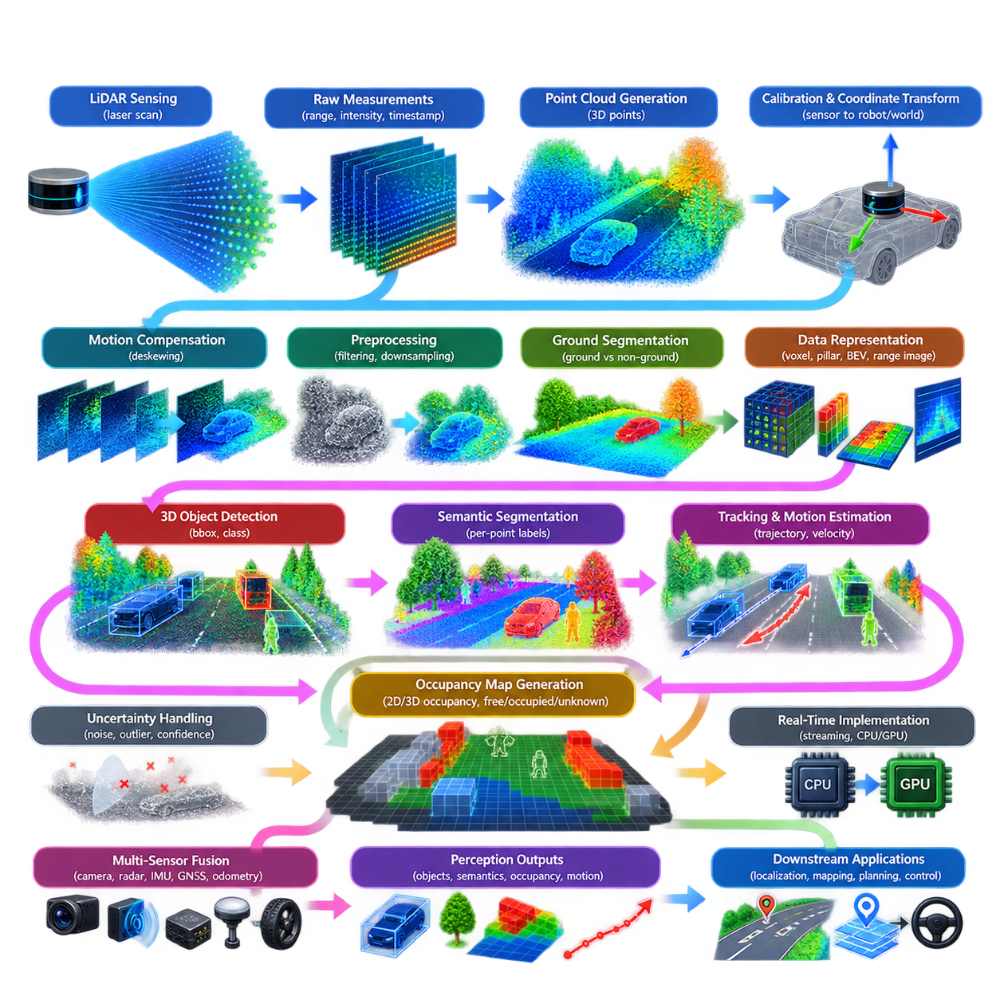
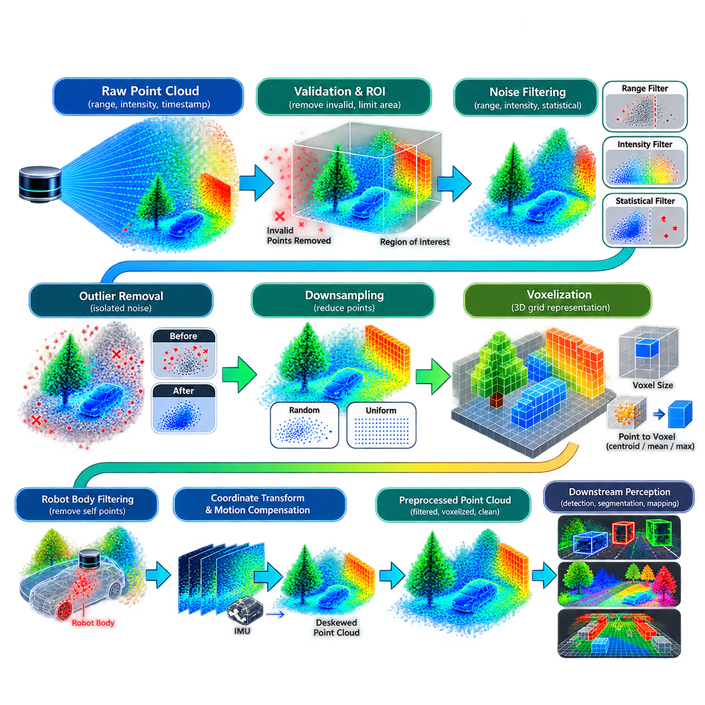
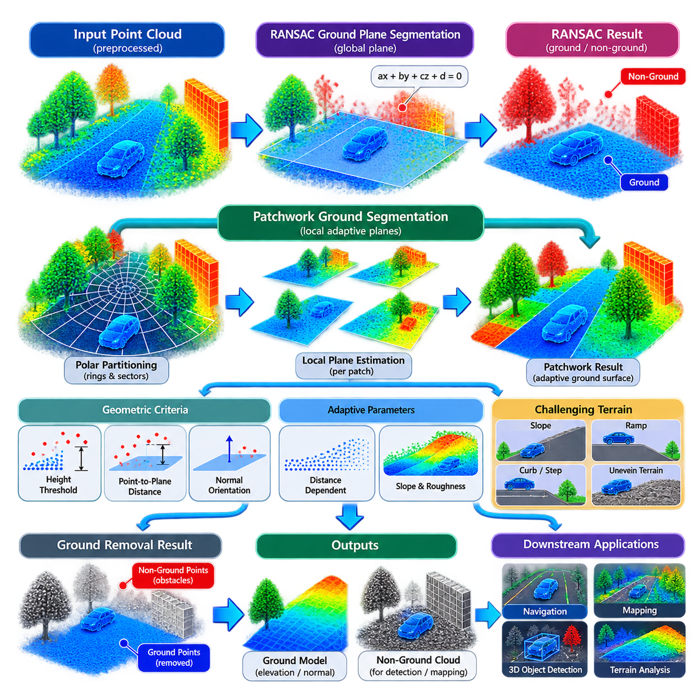
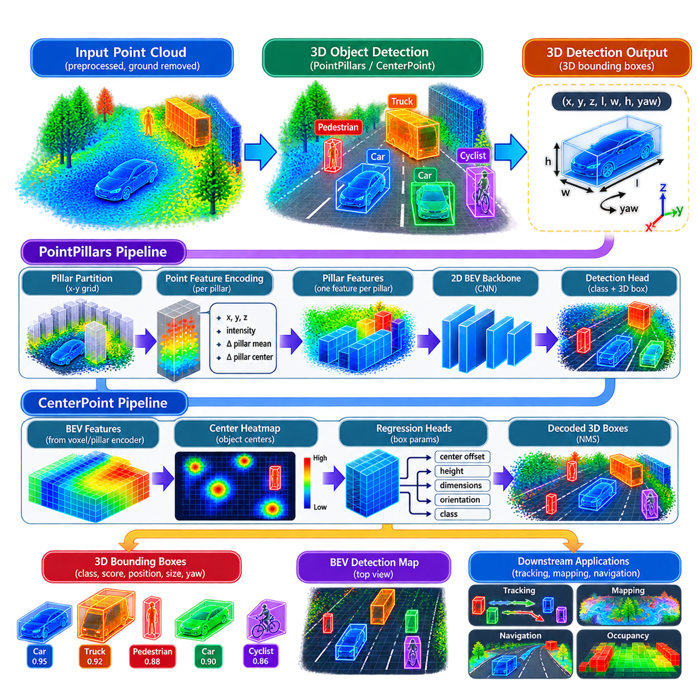
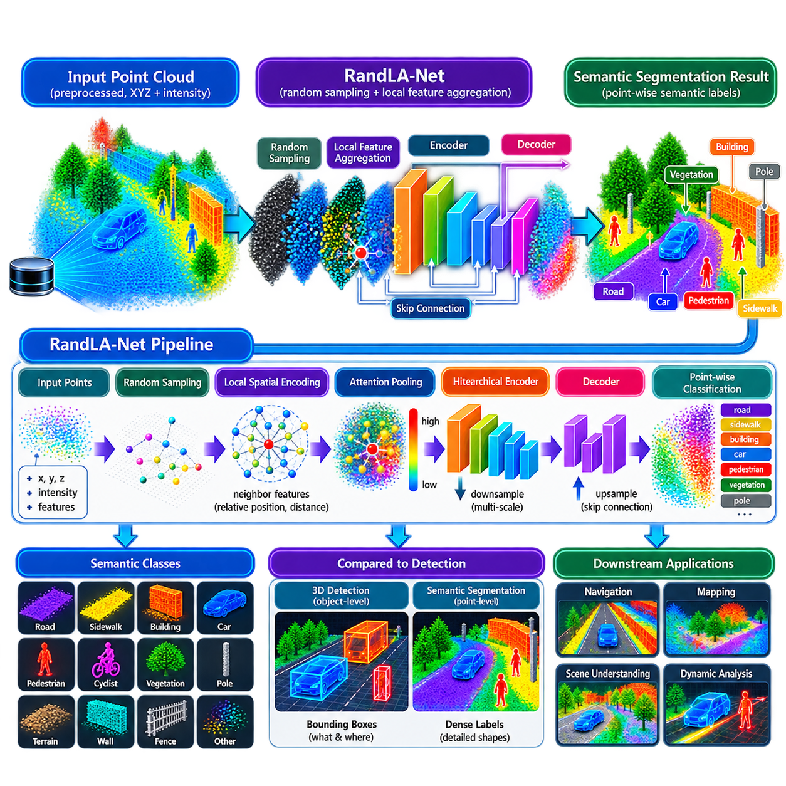
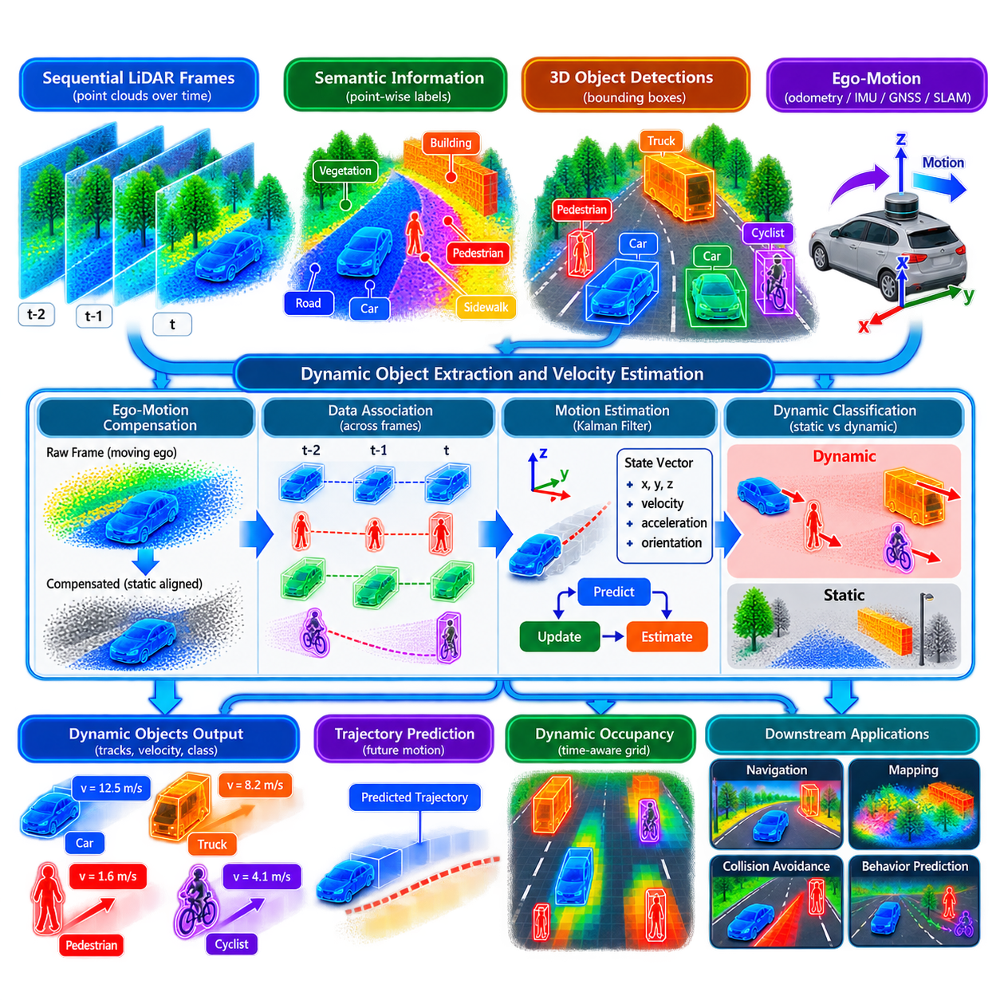
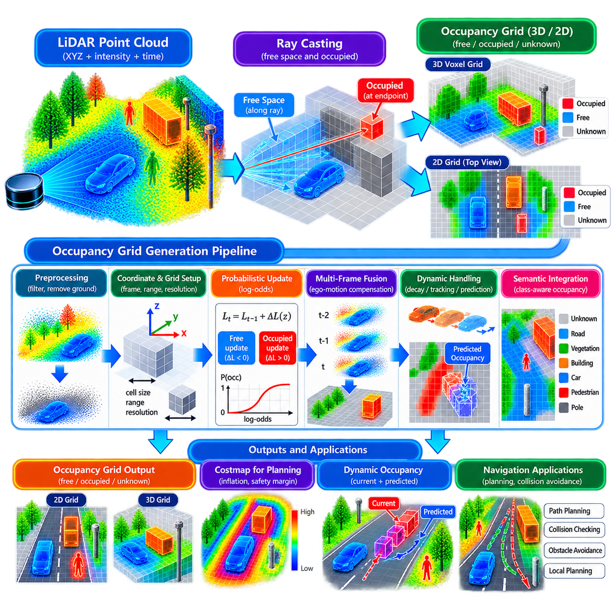
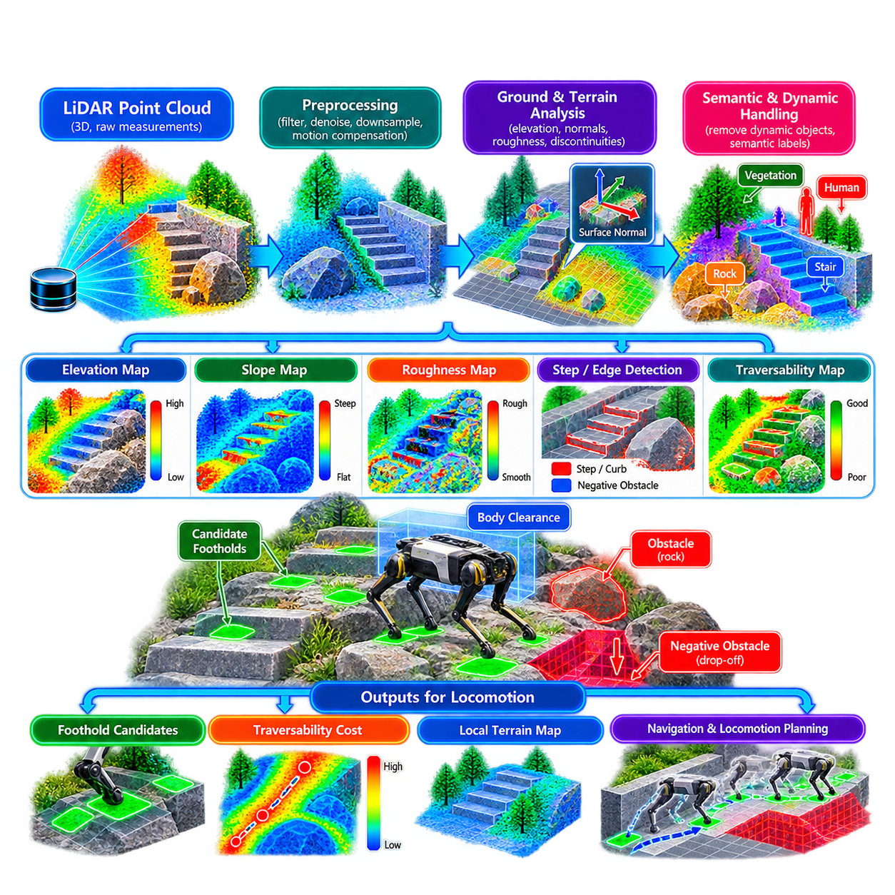
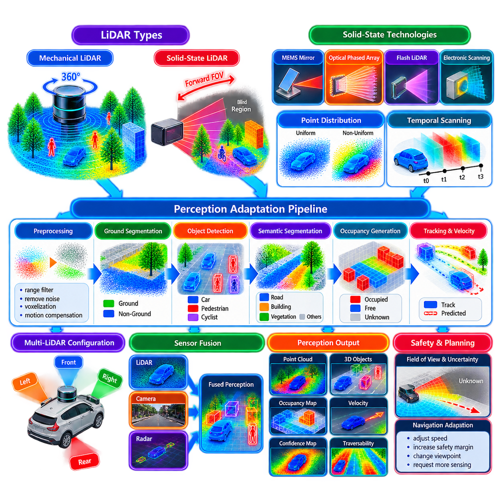
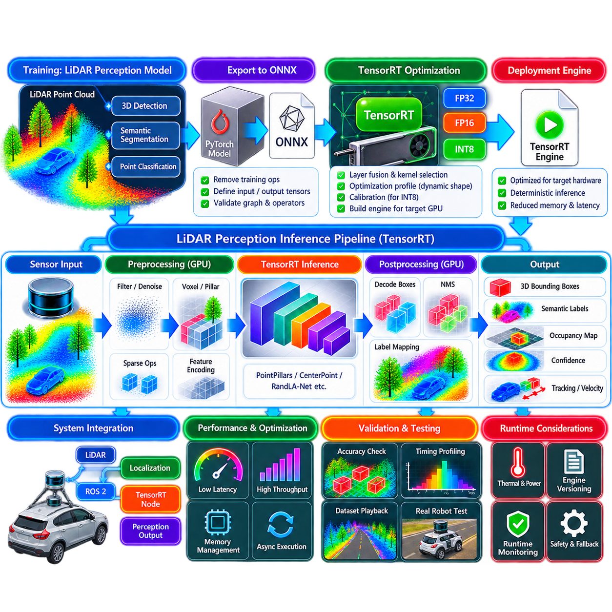

**Volume 14. Perception and Sensor Fusion**


# Chapter 03. LiDAR Perception

##  

## 03.01. LiDAR Point Cloud Processing Pipeline Overview

{width="7.268055555555556in" height="7.268055555555556in"}

LiDAR perception begins with the conversion of raw laser measurements into a structured representation of the surrounding three-dimensional environment. A LiDAR sensor emits laser pulses and measures their return time or phase characteristics to estimate distance. Each valid return is transformed into a point containing spatial coordinates such as x, y, and z, often accompanied by intensity, reflectivity, timestamp, ring index, or confidence information.

The resulting point cloud is fundamentally different from a conventional camera image. Image pixels occupy a regular two-dimensional grid, whereas LiDAR points are distributed irregularly throughout three-dimensional space. Their density changes with distance, sensor geometry, scanning pattern, and surface orientation. A perception pipeline must therefore transform this sparse and nonuniform measurement structure into representations that can be processed efficiently while preserving geometrically important information.

A practical pipeline normally starts with sensor acquisition and coordinate reconstruction. Raw range measurements are decoded according to the LiDAR model and converted from the sensor\'s native spherical or scanning coordinates into Cartesian coordinates. Accurate timestamps must be retained because a complete scan is generally acquired over a finite interval rather than instantaneously. The resulting points initially exist in the LiDAR sensor coordinate frame and must later be transformed into robot or world frames.

Calibration provides the geometric foundation for this transformation. Intrinsic sensor parameters describe properties associated with the LiDAR measurement mechanism, while extrinsic calibration defines the rigid transformation between the LiDAR and other robot coordinate frames. The transformation is commonly represented by rotation and translation. Calibration errors directly propagate into object geometry, sensor fusion, mapping, localization, and obstacle estimation, making calibration quality a system-level requirement rather than an isolated preprocessing concern.

Motion compensation becomes important when the robot moves while a scan is being acquired. Without compensation, points measured at different times are incorrectly treated as if they were observed from the same pose, producing distorted objects and surfaces. Odometry, IMU measurements, or fused state estimates can be used to transform individual points according to their acquisition timestamps. This deskewing stage is particularly important for fast AMRs, autonomous vehicles, UAVs, and rapidly rotating LiDAR systems.

Preprocessing then removes measurements that provide little useful information or that can destabilize later algorithms. Typical operations include invalid-return rejection, range limiting, region-of-interest cropping, outlier removal, intensity filtering, and removal of points belonging to the robot itself. Downsampling can reduce computational load while retaining the dominant geometry of the environment. Voxel-based reduction is particularly useful because it creates a predictable spatial structure for subsequent perception operations.

Ground processing is another major stage in mobile-robot LiDAR perception. For many navigation applications, a large portion of the point cloud corresponds to roads, floors, ramps, or other traversable surfaces. Separating ground from non-ground points allows the system to distinguish potential obstacles from supporting terrain. Methods may use geometric thresholds, local surface models, RANSAC-based plane estimation, or terrain-aware algorithms capable of handling slopes and irregular outdoor environments.

After preprocessing, the point cloud can be converted into representations optimized for particular algorithms. Direct point representations retain individual coordinates, voxel representations discretize three-dimensional space, and pillar representations aggregate points vertically into bird\'s-eye-view cells. Range images project measurements according to LiDAR scanning geometry, while BEV representations organize information in the horizontal plane. The representation determines memory consumption, computational efficiency, spatial resolution, and compatibility with downstream neural networks.

Object-level perception transforms geometric measurements into meaningful entities. Classical pipelines may cluster non-ground points and estimate bounding boxes from the resulting groups. Modern systems increasingly employ learned three-dimensional object detectors such as PointPillars or CenterPoint to estimate object position, dimensions, orientation, and class directly from LiDAR-derived features. These outputs provide structured observations that can subsequently be associated across time for tracking and motion estimation.

Semantic processing extends the pipeline beyond object bounding boxes by assigning meaning to individual points or spatial regions. Point-cloud segmentation can distinguish terrain, vegetation, buildings, vehicles, pedestrians, structures, and other environment classes. This information is valuable when geometric similarity alone is insufficient for robot decisions. Semantic labels can also be combined with occupancy representations, enabling navigation systems to reason about both whether a region is occupied and what type of entity occupies it.

Temporal processing converts independent LiDAR frames into a continuously evolving environmental model. Consecutive detections or clusters can be associated to estimate trajectories, velocities, and motion states. Dynamic-object extraction prevents moving objects from being incorrectly incorporated into persistent maps and allows planners to anticipate future occupancy. Ego-motion compensation is essential because apparent point movement may originate from robot motion rather than actual movement of objects in the environment.

Occupancy generation provides an important interface between perception and navigation. Filtered LiDAR observations can be projected into two-dimensional grids or accumulated into three-dimensional voxel maps describing free, occupied, and unknown space. Ray-based updates may identify free space between the sensor and measured surfaces. The resulting occupancy information can feed local costmaps, collision checking, obstacle avoidance, path planning, and safety functions without requiring every navigation component to process the original point cloud.

The LiDAR pipeline must also be designed around uncertainty. Range noise, multipath effects, reflective materials, rain, dust, partial occlusion, sparse returns, and limited angular resolution can produce ambiguous measurements. Instead of assuming that every point is equally reliable, robust systems preserve confidence information where possible and use spatial or temporal consistency to reject unstable observations. This becomes especially important when perception results directly influence collision avoidance or safety-related robot behavior.

Real-time implementation requires careful control of data movement as well as algorithm complexity. Modern LiDAR sensors may generate hundreds of thousands or millions of points per second, making unnecessary memory copies and repeated transformations expensive. Efficient implementations organize preprocessing, feature extraction, inference, and postprocessing as a streaming pipeline. CPU parallelism, GPU acceleration, sparse convolution, optimized kernels, and reduced-precision inference can be combined according to the computational capabilities of the robot platform.

Latency must be evaluated across the complete sensing-to-output chain rather than only at the neural-network inference stage. Sensor acquisition, packet decoding, synchronization, deskewing, filtering, host-to-device transfer, inference, postprocessing, tracking, and publication all contribute to the age of information delivered to downstream modules. A fast detector cannot compensate for excessive buffering or synchronization delays. Consequently, timestamp integrity and bounded pipeline latency are central requirements for production LiDAR perception.

LiDAR perception is rarely an isolated subsystem in a complete autonomous robot. Its outputs can be fused with camera semantics, radar velocity, IMU motion information, GNSS positioning, and wheel odometry. The broader architecture separates LiDAR-specific geometric processing from multi-sensor fusion so that each sensor can contribute complementary information without creating unnecessary dependencies. This organization is consistent with the volume structure, which treats LiDAR perception and multi-sensor fusion as distinct but connected perception layers.

A production pipeline should therefore be understood as a sequence of transformations from raw measurements to increasingly task-oriented representations. Raw returns become calibrated points; points become filtered geometric structures; structures become objects, semantic regions, dynamic states, and occupancy information; and these outputs become inputs to localization, mapping, prediction, planning, and control. Each transformation reduces raw sensor complexity while adding information that is more directly useful for autonomous decision making.

The exact configuration depends strongly on the robot platform. An indoor AMR may prioritize ground removal, obstacle extraction, and low-latency occupancy generation, while an outdoor AMR requires greater robustness to uneven terrain, weather, vegetation, and long-range objects. A quadruped may require dense local terrain analysis, whereas a UAV may emphasize lightweight processing and three-dimensional obstacle geometry. The same pipeline principles remain applicable, but processing priorities and representations change with the operational domain.

Ultimately, LiDAR point-cloud processing should not be viewed as a single algorithm but as an integrated perception architecture connecting physical sensing to autonomous behavior. Sensor characteristics, calibration, timing, preprocessing, spatial representation, learned perception, temporal reasoning, occupancy generation, and computational deployment must be designed together. A well-engineered pipeline preserves enough geometric information for accurate reasoning while progressively reducing data into representations that downstream robotic systems can consume reliably and in real time.

라이다 인지(LiDAR Perception)는 원시 레이저 측정값(Raw Laser Measurements)을 주변의 3차원 환경을 표현하는 구조화된 표현(Structured Representation)으로 변환하는 과정에서 시작된다. 라이다 센서(LiDAR Sensor)는 레이저 펄스(Laser Pulse)를 방출하고 반사되어 돌아오는 시간 또는 위상 특성(Phase Characteristics)을 측정하여 거리를 추정한다. 각각의 유효한 반사 신호(Return)는 x, y, z와 같은 공간 좌표(Spatial Coordinates)를 포함하는 포인트(Point)로 변환되며, 일반적으로 강도(Intensity), 반사도(Reflectivity), 타임스탬프(Timestamp), 링 인덱스(Ring Index), 신뢰도(Confidence) 등의 정보가 함께 포함될 수 있다.

이렇게 생성된 포인트 클라우드(Point Cloud)는 일반적인 카메라 영상(Camera Image)과 근본적으로 다른 구조를 가진다. 영상의 픽셀(Pixel)은 규칙적인 2차원 격자(2D Grid)에 배치되지만, 라이다 포인트는 3차원 공간에 불규칙하게 분포한다. 포인트 밀도(Point Density)는 거리, 센서 기하 구조(Sensor Geometry), 스캐닝 패턴(Scanning Pattern), 표면 방향(Surface Orientation)에 따라 달라진다. 따라서 인지 파이프라인(Perception Pipeline)은 중요한 기하학적 정보를 유지하면서 이러한 희소하고 불균일한 측정 구조를 효율적으로 처리할 수 있는 표현으로 변환해야 한다.

실제적인 파이프라인은 일반적으로 센서 데이터 획득(Sensor Acquisition)과 좌표 재구성(Coordinate Reconstruction)에서 시작한다. 원시 거리 측정값(Raw Range Measurements)은 라이다 모델에 따라 디코딩(Decoding)되고 센서 고유의 구면 좌표 또는 스캐닝 좌표에서 직교 좌표(Cartesian Coordinates)로 변환된다. 하나의 전체 스캔(Scan)은 순간적으로 획득되는 것이 아니라 일정한 시간 동안 생성되므로 정확한 타임스탬프를 유지해야 한다. 생성된 포인트는 초기에는 라이다 센서 좌표계(LiDAR Sensor Coordinate Frame)에 존재하며 이후 로봇 또는 월드 좌표계(World Frame)로 변환되어야 한다.

보정(Calibration)은 이러한 좌표 변환의 기하학적 기반을 제공한다. 센서 내부 파라미터(Intrinsic Parameters)는 라이다 측정 메커니즘과 관련된 특성을 나타내며, 외부 보정(Extrinsic Calibration)은 라이다와 다른 로봇 좌표계 사이의 강체 변환(Rigid Transformation)을 정의한다. 이러한 변환은 일반적으로 회전(Rotation)과 이동(Translation)으로 표현된다. 보정 오차는 객체 기하 구조, 센서 융합(Sensor Fusion), 매핑(Mapping), 위치 추정(Localization), 장애물 추정으로 직접 전파되므로 보정 품질은 단순한 전처리 문제가 아니라 시스템 수준 요구사항(System-Level Requirement)으로 다루어야 한다.

로봇이 스캔 데이터를 획득하는 동안 움직이는 경우에는 모션 보상(Motion Compensation)이 중요하다. 보상이 없다면 서로 다른 시간에 측정된 포인트가 동일한 자세(Pose)에서 관측된 것처럼 처리되어 객체와 표면이 왜곡될 수 있다. 오도메트리(Odometry), 관성 측정 장치(IMU) 데이터 또는 융합 상태 추정값(Fused State Estimate)을 이용하여 개별 포인트를 획득 시점에 맞게 변환할 수 있다. 이러한 디스큐잉(Deskewing) 과정은 고속 자율이동로봇(AMR), 자율주행 차량(Autonomous Vehicle), 무인항공기(UAV), 고속 회전형 라이다에서 특히 중요하다.

이후 전처리(Preprocessing)를 통해 유용한 정보를 거의 제공하지 않거나 후속 알고리즘을 불안정하게 만들 수 있는 측정값을 제거한다. 대표적인 작업에는 유효하지 않은 반사 신호 제거, 거리 제한(Range Limiting), 관심 영역 자르기(Region-of-Interest Cropping), 이상치 제거(Outlier Removal), 강도 필터링(Intensity Filtering), 로봇 자체에 해당하는 포인트 제거가 포함된다. 다운샘플링(Downsampling)은 환경의 주요 기하 구조를 유지하면서 계산량을 줄일 수 있으며, 복셀 기반 축소(Voxel-Based Reduction)는 이후 인지 연산을 위한 예측 가능한 공간 구조를 제공한다.

지면 처리(Ground Processing)는 이동 로봇의 라이다 인지에서 또 하나의 중요한 단계이다. 많은 내비게이션(Navigation) 응용에서 포인트 클라우드의 상당 부분은 도로, 바닥, 경사로 또는 기타 주행 가능한 표면(Traversable Surface)에 해당한다. 지면 포인트와 비지면 포인트를 분리하면 잠재적인 장애물과 로봇을 지지하는 지형을 구분할 수 있다. 기하학적 임계값(Geometric Threshold), 국부 표면 모델(Local Surface Model), 랜덤 샘플 합의 기반 평면 추정(RANSAC-Based Plane Estimation), 경사와 불규칙한 야외 환경을 처리할 수 있는 지형 인식 알고리즘(Terrain-Aware Algorithm) 등이 사용될 수 있다.

전처리가 완료된 후에는 포인트 클라우드를 특정 알고리즘에 최적화된 표현으로 변환할 수 있다. 직접 포인트 표현(Direct Point Representation)은 개별 좌표를 그대로 유지하며, 복셀 표현(Voxel Representation)은 3차원 공간을 이산화한다. 필러 표현(Pillar Representation)은 포인트를 수직 방향으로 집계하여 조감도 셀(Bird\'s-Eye-View Cell)을 구성한다. 거리 영상(Range Image)은 라이다 스캐닝 기하 구조에 따라 측정값을 투영하고, 조감도 표현(BEV Representation)은 수평면을 기준으로 정보를 구성한다. 선택한 표현 방식은 메모리 사용량, 계산 효율성, 공간 해상도, 후속 신경망(Neural Network)과의 호환성을 결정한다.

객체 수준 인지(Object-Level Perception)는 기하학적 측정값을 의미 있는 개체(Entity)로 변환한다. 전통적인 파이프라인에서는 비지면 포인트를 군집화(Clustering)하고 생성된 그룹으로부터 경계 상자(Bounding Box)를 추정할 수 있다. 현대적인 시스템에서는 포인트필러스(PointPillars)나 센터포인트(CenterPoint)와 같은 학습 기반 3차원 객체 검출기(Learned 3D Object Detector)를 활용하여 라이다 특징으로부터 객체 위치, 크기, 방향, 클래스를 직접 추정하는 방식이 널리 사용된다. 이러한 출력은 이후 시간축에서 연계되어 추적(Tracking)과 움직임 추정(Motion Estimation)에 사용될 수 있다.

의미론적 처리(Semantic Processing)는 개별 포인트 또는 공간 영역에 의미를 부여함으로써 단순한 객체 경계 상자를 넘어 인지 범위를 확장한다. 포인트 클라우드 분할(Point Cloud Segmentation)을 통해 지형, 식생, 건물, 차량, 보행자, 구조물 및 기타 환경 클래스를 구분할 수 있다. 이러한 정보는 기하학적 유사성만으로 로봇의 의사결정을 수행하기 어려운 경우 특히 유용하다. 의미론적 레이블(Semantic Label)을 점유 표현(Occupancy Representation)과 결합하면 특정 공간의 점유 여부뿐 아니라 어떤 종류의 개체가 해당 공간을 점유하고 있는지도 판단할 수 있다.

시간적 처리(Temporal Processing)는 서로 독립적인 라이다 프레임을 지속적으로 변화하는 환경 모델(Environmental Model)로 변환한다. 연속된 검출 결과 또는 클러스터를 연계하여 궤적(Trajectory), 속도(Velocity), 운동 상태(Motion State)를 추정할 수 있다. 동적 객체 추출(Dynamic Object Extraction)은 움직이는 객체가 영구적인 지도에 잘못 포함되는 것을 방지하고 플래너(Planner)가 미래의 점유 상태를 예측하도록 지원한다. 로봇 자체의 움직임으로 인해 포인트가 이동하는 것처럼 보일 수 있으므로 자차 운동 보상(Ego-Motion Compensation)이 필수적이다.

점유 공간 생성(Occupancy Generation)은 인지와 내비게이션 사이의 중요한 인터페이스를 제공한다. 필터링된 라이다 관측값은 2차원 격자에 투영하거나 3차원 복셀 지도(Voxel Map)에 누적하여 자유 공간(Free Space), 점유 공간(Occupied Space), 미확인 공간(Unknown Space)을 표현할 수 있다. 광선 기반 갱신(Ray-Based Update)을 이용하면 센서와 측정된 표면 사이의 자유 공간을 판별할 수 있다. 생성된 점유 정보는 모든 내비게이션 구성 요소가 원본 포인트 클라우드를 직접 처리하지 않아도 로컬 코스트맵(Local Costmap), 충돌 검사(Collision Checking), 장애물 회피(Obstacle Avoidance), 경로 계획(Path Planning), 안전 기능(Safety Function)에 활용될 수 있다.

라이다 파이프라인은 불확실성(Uncertainty)을 고려하여 설계되어야 한다. 거리 잡음(Range Noise), 다중 경로 효과(Multipath Effect), 반사성 재질, 비, 먼지, 부분 가림(Partial Occlusion), 희소한 반사 신호, 제한된 각도 해상도(Angular Resolution)는 모호한 측정값을 생성할 수 있다. 견고한 시스템은 모든 포인트의 신뢰도가 동일하다고 가정하지 않고 가능한 경우 신뢰도 정보를 유지하며, 공간적 또는 시간적 일관성(Spatial or Temporal Consistency)을 이용하여 불안정한 관측값을 제거한다. 이는 인지 결과가 충돌 회피나 안전 관련 로봇 동작에 직접 영향을 미칠 때 특히 중요하다.

실시간 구현(Real-Time Implementation)을 위해서는 알고리즘 복잡도뿐만 아니라 데이터 이동(Data Movement)도 세밀하게 관리해야 한다. 현대의 라이다 센서는 초당 수십만에서 수백만 개의 포인트를 생성할 수 있으므로 불필요한 메모리 복사와 반복적인 좌표 변환은 상당한 계산 비용을 발생시킨다. 효율적인 구현에서는 전처리, 특징 추출(Feature Extraction), 추론(Inference), 후처리(Postprocessing)를 스트리밍 파이프라인(Streaming Pipeline)으로 구성한다. 로봇 플랫폼의 연산 능력에 따라 CPU 병렬화, GPU 가속, 희소 합성곱(Sparse Convolution), 최적화 커널(Optimized Kernel), 저정밀도 추론(Reduced-Precision Inference)을 조합할 수 있다.

지연 시간(Latency)은 신경망 추론 단계만이 아니라 전체 센싱-출력 체인(Sensing-to-Output Chain)을 기준으로 평가해야 한다. 센서 데이터 획득, 패킷 디코딩, 동기화(Synchronization), 디스큐잉, 필터링, 호스트-디바이스 전송(Host-to-Device Transfer), 추론, 후처리, 추적, 데이터 발행(Publication)이 모두 후속 모듈에 전달되는 정보의 시간적 신선도에 영향을 준다. 빠른 검출기를 사용하더라도 과도한 버퍼링이나 동기화 지연을 보상할 수 없으므로 타임스탬프 무결성(Timestamp Integrity)과 제한된 파이프라인 지연(Bounded Pipeline Latency)은 양산 수준 라이다 인지의 핵심 요구사항이다.

완전한 자율 로봇 시스템에서 라이다 인지는 독립된 하위 시스템으로만 동작하는 경우가 드물다. 라이다 출력은 카메라 의미 정보(Camera Semantics), 레이더 속도(Radar Velocity), 관성 측정 장치(IMU)의 운동 정보, 위성항법시스템(GNSS) 위치 정보, 휠 오도메트리(Wheel Odometry)와 융합될 수 있다. 전체 아키텍처에서는 라이다 고유의 기하학적 처리와 다중 센서 융합(Multi-Sensor Fusion)을 분리하여 각 센서가 불필요한 종속성을 만들지 않으면서 상호 보완적인 정보를 제공하도록 구성한다.

따라서 양산 수준의 라이다 파이프라인은 원시 측정값에서 점차 작업 지향적인 표현(Task-Oriented Representation)으로 변환되는 일련의 과정으로 이해해야 한다. 원시 반사 신호는 보정된 포인트가 되고, 포인트는 필터링된 기하학적 구조가 되며, 이러한 구조는 다시 객체, 의미론적 영역, 동적 상태, 점유 정보로 변환된다. 최종적으로 이러한 출력은 위치 추정, 매핑, 예측(Prediction), 경로 계획, 제어(Control)의 입력으로 사용된다. 각각의 변환 단계는 원시 센서 데이터의 복잡성을 줄이는 동시에 자율 의사결정에 직접 활용할 수 있는 정보를 증가시킨다.

구체적인 파이프라인 구성은 로봇 플랫폼에 따라 크게 달라진다. 실내 자율이동로봇(Indoor AMR)은 지면 제거, 장애물 추출, 저지연 점유 공간 생성에 중점을 둘 수 있으며, 실외 자율이동로봇(Outdoor AMR)은 불규칙한 지형, 날씨, 식생, 장거리 객체에 대한 높은 강건성(Robustness)이 요구된다. 사족보행 로봇(Quadruped Robot)은 조밀한 근거리 지형 분석(Dense Local Terrain Analysis)이 필요할 수 있으며, 무인항공기는 경량 처리와 3차원 장애물 기하 구조를 중시할 수 있다. 기본적인 파이프라인 원리는 동일하지만 운용 영역(Operational Domain)에 따라 처리 우선순위와 표현 방식이 달라진다.

궁극적으로 라이다 포인트 클라우드 처리(LiDAR Point Cloud Processing)는 하나의 알고리즘이 아니라 물리적 센싱(Physical Sensing)을 자율 행동(Autonomous Behavior)으로 연결하는 통합 인지 아키텍처(Integrated Perception Architecture)로 이해해야 한다. 센서 특성, 보정, 시간 동기화, 전처리, 공간 표현, 학습 기반 인지, 시간적 추론(Temporal Reasoning), 점유 공간 생성, 연산 배포(Computational Deployment)를 함께 설계해야 한다. 잘 설계된 파이프라인은 정확한 공간 추론에 필요한 기하학적 정보를 충분히 보존하면서 원시 데이터를 후속 로봇 시스템이 신뢰성 있게 실시간으로 사용할 수 있는 표현으로 점진적으로 변환한다.

##  

## 03.02. Point Cloud Preprocessing Voxelization Filtering [w/Code]

{width="7.268055555555556in" height="7.268055555555556in"}

Point cloud preprocessing is the foundation for reliable LiDAR perception because raw measurements contain noise, redundant samples, invalid returns, and sensor-specific artifacts. Before detection, segmentation, mapping, or terrain analysis, the cloud must be transformed into a representation that is geometrically consistent and computationally manageable. The preprocessing stage therefore establishes the quality, density, spatial extent, and statistical characteristics of the data consumed by downstream perception algorithms.

A typical preprocessing pipeline begins by validating incoming points and removing measurements that cannot contribute meaningful geometric information. Points with invalid coordinates, impossible ranges, corrupted values, or measurements outside the operational sensing region can be discarded. A region of interest can also restrict processing to the area relevant to the robot. This reduces unnecessary computation while preventing distant or irrelevant structures from affecting algorithms that are designed for a specific local perception region.

Noise filtering is used to suppress isolated or statistically inconsistent measurements while preserving meaningful surfaces and object boundaries. Simple range and intensity thresholds can remove obvious artifacts, while statistical methods evaluate the local neighborhood of each point. Radius-based filtering considers how many neighboring points exist within a specified distance, whereas statistical filtering evaluates the distribution of neighbor distances. The parameters must be selected carefully because excessive filtering can remove thin structures, distant objects, or sparse but valid returns.

Outlier removal becomes particularly important in outdoor environments where LiDAR measurements may be affected by vegetation, reflective materials, atmospheric conditions, multipath effects, or transient returns. A robust preprocessing system should distinguish isolated measurement errors from legitimate sparse geometry. Filtering should therefore be evaluated according to the downstream task rather than simply maximizing point-cloud cleanliness. For example, a navigation system may tolerate aggressive removal of isolated points, while a mapping system may require preservation of fine structural details.

Downsampling provides another important mechanism for controlling computational cost. High-resolution LiDAR sensors can produce very large point clouds, and processing every point through every stage may exceed the available CPU, GPU, memory bandwidth, or real-time latency budget. Downsampling reduces the number of points while attempting to preserve the dominant geometry. Random sampling is simple but may produce uneven spatial coverage, while uniform spatial sampling provides more predictable geometric density.

Voxelization converts continuous three-dimensional space into a regular grid of volumetric cells called voxels. Points falling inside the same voxel can be represented by a selected statistic, such as the centroid, mean position, highest point, or another feature aggregation. The voxel size determines the trade-off between geometric resolution and computational efficiency. Small voxels preserve more detail but require more memory and computation, whereas large voxels reduce processing cost but can merge nearby structures and remove important geometric distinctions.

Voxelization is especially useful because it transforms an irregular point distribution into a structured spatial representation that can be efficiently processed by subsequent algorithms. It can support occupancy estimation, neighborhood search, collision reasoning, three-dimensional feature extraction, and neural-network input preparation. In learning-based perception, voxelized representations may also serve as an intermediate structure for sparse convolution or other spatially efficient architectures. The voxelization strategy should therefore be selected according to both the sensor characteristics and the requirements of the target model.

Filtering and voxelization should not be considered independent operations. Their ordering can influence the resulting geometry and computational cost. Applying a coarse spatial reduction before expensive neighborhood-based filtering can reduce processing requirements, while filtering before voxelization may prevent isolated noise from influencing voxel statistics. In some systems, multiple representations are maintained at different resolutions so that high-resolution information is available for precise local processing while lower-resolution structures support fast global reasoning.

Preprocessing must also account for the robot itself and the coordinate frame in which the data is interpreted. Points originating from the robot body, sensor mount, wheels, roof, or other known structures can create persistent false obstacles if they are not removed. A predefined geometric mask or robot-body model can eliminate these regions. Coordinate transformation and motion compensation should also be consistent with the preprocessing pipeline so that filtering and voxelization operate on spatially meaningful measurements.

The appropriate preprocessing configuration depends strongly on the application. Indoor AMRs generally require efficient removal of sensor artifacts and controlled voxel resolution for obstacle detection and navigation. Outdoor AMRs may need larger spatial regions, adaptive filtering, and preservation of terrain geometry. Legged robots require sufficient vertical resolution to characterize steps, slopes, rocks, and other terrain features. Consequently, there is no universally optimal voxel size or filtering threshold; these parameters must be evaluated against the robot\'s sensor, speed, environment, and perception objectives.

Real-time deployment requires preprocessing to be implemented as an efficient data pipeline rather than as a collection of isolated operations. Memory allocation, point-cloud copying, CPU-GPU transfers, neighborhood searches, and synchronization can become significant sources of latency even when individual algorithms are computationally simple. Production systems therefore commonly combine parallel processing, efficient spatial indexing, GPU acceleration, and carefully bounded buffers. The final objective is not merely to reduce the number of points, but to produce a stable and informative representation within the latency and resource constraints of the robot.

The output of preprocessing becomes the foundation for subsequent LiDAR perception functions. A filtered and appropriately voxelized cloud can be passed to ground segmentation, three-dimensional object detection, semantic segmentation, dynamic-object extraction, occupancy generation, and terrain analysis. This organization reflects the role of preprocessing within the LiDAR perception chapter, where point-cloud preprocessing and voxelization form the stage preceding ground segmentation and higher-level perception functions.

The central design principle is therefore to preserve task-relevant geometry while removing unnecessary computational complexity. Effective preprocessing does not attempt to create the visually cleanest point cloud possible; instead, it produces the most useful representation for the next perception stage. Filtering strength, voxel resolution, spatial limits, and sampling strategy must be treated as system parameters that influence accuracy, robustness, memory consumption, and latency across the complete LiDAR perception pipeline.

포인트 클라우드 전처리(Point Cloud Preprocessing)는 원시 측정 데이터(Raw Measurements)에 잡음(Noise), 중복 샘플(Redundant Samples), 유효하지 않은 반사값(Invalid Returns), 센서별 아티팩트(Sensor-Specific Artifacts)가 포함되기 때문에 신뢰성 높은 라이다 인지(LiDAR Perception)의 기반이 된다. 검출(Detection), 분할(Segmentation), 매핑(Mapping), 지형 분석(Terrain Analysis)을 수행하기 전에 포인트 클라우드를 기하학적으로 일관되고 계산 가능한 형태로 변환해야 한다. 따라서 전처리 단계는 후속 인지 알고리즘이 사용하는 데이터의 품질, 밀도, 공간 범위, 통계적 특성을 결정한다.

일반적인 전처리 파이프라인(Preprocessing Pipeline)은 입력 포인트의 유효성을 검사하고 의미 있는 기하학적 정보를 제공할 수 없는 측정값을 제거하는 것에서 시작한다. 유효하지 않은 좌표, 물리적으로 불가능한 거리, 손상된 값 또는 운용 센싱 영역(Operational Sensing Region)을 벗어난 측정값을 제거할 수 있다. 또한 관심 영역(Region of Interest)을 설정하여 로봇에 필요한 공간으로 처리 범위를 제한할 수 있다. 이를 통해 불필요한 계산을 줄이고 특정 지역 인지를 목적으로 하는 알고리즘이 멀리 떨어져 있거나 관련 없는 구조물의 영향을 받는 것을 방지한다.

잡음 필터링(Noise Filtering)은 의미 있는 표면과 객체 경계를 보존하면서 고립되거나 통계적으로 일관되지 않은 측정값을 억제하기 위해 사용된다. 단순한 거리 및 강도 임계값(Range and Intensity Threshold)은 명백한 아티팩트를 제거할 수 있으며, 통계적 방법은 각 포인트 주변의 국부 이웃(Local Neighborhood)을 평가한다. 반경 기반 필터링(Radius-Based Filtering)은 지정된 거리 안에 존재하는 이웃 포인트의 수를 고려하고, 통계적 필터링(Statistical Filtering)은 이웃 포인트 사이 거리의 분포를 평가한다. 과도한 필터링은 얇은 구조물, 원거리 객체 또는 희소하지만 유효한 반사값까지 제거할 수 있으므로 파라미터를 신중하게 설정해야 한다.

이상치 제거(Outlier Removal)는 식생, 반사성 재질, 대기 조건, 다중 경로 효과(Multipath Effects), 일시적인 반사값(Transient Returns) 등의 영향을 받을 수 있는 실외 환경에서 특히 중요하다. 강건한 전처리 시스템(Robust Preprocessing System)은 고립된 측정 오류와 실제로 존재하는 희소 기하 구조(Sparse Geometry)를 구분해야 한다. 따라서 필터링은 단순히 포인트 클라우드를 최대한 깨끗하게 만드는 방향이 아니라 후속 작업(Downstream Task)의 요구사항에 따라 평가해야 한다. 예를 들어 내비게이션 시스템은 고립된 포인트를 적극적으로 제거할 수 있지만, 매핑 시스템에서는 세밀한 구조적 특징을 보존해야 할 수 있다.

다운샘플링(Downsampling)은 계산 비용을 제어하는 또 하나의 중요한 방법이다. 고해상도 라이다 센서는 매우 큰 포인트 클라우드를 생성할 수 있으며 모든 처리 단계에서 모든 포인트를 처리하면 사용 가능한 CPU, GPU, 메모리 대역폭(Memory Bandwidth) 또는 실시간 지연 시간 예산(Real-Time Latency Budget)을 초과할 수 있다. 다운샘플링은 환경의 주요 기하 구조를 보존하면서 포인트 수를 감소시킨다. 무작위 샘플링(Random Sampling)은 단순하지만 공간적으로 불균일한 분포를 만들 수 있는 반면, 균일 공간 샘플링(Uniform Spatial Sampling)은 보다 예측 가능한 기하학적 밀도를 제공한다.

복셀화(Voxelization)는 연속적인 3차원 공간을 복셀(Voxel)이라 불리는 규칙적인 체적 셀(Volumetric Cell) 격자로 변환한다. 동일한 복셀 내부에 존재하는 포인트들은 중심점(Centroid), 평균 위치(Mean Position), 최고점(Highest Point) 또는 다른 특징 집계값(Feature Aggregation)을 이용하여 표현할 수 있다. 복셀 크기(Voxel Size)는 기하학적 해상도와 계산 효율성 사이의 절충 관계를 결정한다. 작은 복셀은 더 많은 세부 정보를 보존하지만 메모리와 계산량이 증가하고, 큰 복셀은 계산 비용을 줄이는 대신 가까운 구조물을 합치거나 중요한 기하학적 차이를 제거할 수 있다.

복셀화는 불규칙한 포인트 분포를 후속 알고리즘에서 효율적으로 처리할 수 있는 구조화된 공간 표현(Structured Spatial Representation)으로 변환한다는 점에서 특히 유용하다. 복셀 구조는 점유 공간 추정(Occupancy Estimation), 이웃 탐색(Neighborhood Search), 충돌 판단(Collision Reasoning), 3차원 특징 추출(3D Feature Extraction), 신경망 입력 준비(Neural-Network Input Preparation)를 지원할 수 있다. 학습 기반 인지(Learning-Based Perception)에서는 복셀화된 표현이 희소 합성곱(Sparse Convolution)이나 기타 공간 효율적인 아키텍처의 중간 표현으로 사용될 수도 있다. 따라서 복셀화 전략은 센서 특성과 목표 모델(Target Model)의 요구사항을 함께 고려하여 선택해야 한다.

필터링과 복셀화는 서로 독립적인 연산으로 간주해서는 안 된다. 두 연산의 수행 순서는 최종적인 기하 구조와 계산 비용에 영향을 미칠 수 있다. 계산 비용이 높은 이웃 기반 필터링(Neighborhood-Based Filtering)을 수행하기 전에 거친 공간 축소(Coarse Spatial Reduction)를 적용하면 처리량을 줄일 수 있으며, 복셀화 전에 필터링을 수행하면 고립된 잡음이 복셀 통계값에 영향을 미치는 것을 방지할 수 있다. 일부 시스템에서는 서로 다른 해상도의 여러 표현을 유지하여 정밀한 국부 처리에는 고해상도 정보를 사용하고 빠른 전역 추론(Global Reasoning)에는 저해상도 구조를 사용한다.

전처리는 로봇 자체와 데이터를 해석하는 좌표계(Coordinate Frame)도 고려해야 한다. 로봇의 본체, 센서 마운트(Sensor Mount), 바퀴, 지붕 또는 기타 알려진 구조물에서 발생하는 포인트를 제거하지 않으면 지속적인 거짓 장애물(False Obstacle)이 생성될 수 있다. 사전에 정의된 기하학적 마스크(Geometric Mask) 또는 로봇 본체 모델(Robot-Body Model)을 이용하여 이러한 영역을 제거할 수 있다. 또한 좌표 변환(Coordinate Transformation)과 모션 보상(Motion Compensation)은 전처리 파이프라인과 일관성을 유지해야 하며, 이를 통해 필터링과 복셀화가 공간적으로 의미 있는 측정 데이터에 적용되도록 해야 한다.

적절한 전처리 구성은 응용 분야에 따라 크게 달라진다. 실내 자율이동로봇(Indoor AMR)은 일반적으로 센서 아티팩트의 효율적인 제거와 장애물 검출 및 내비게이션을 위한 적절한 복셀 해상도(Voxel Resolution)가 필요하다. 실외 자율이동로봇(Outdoor AMR)은 더 넓은 공간 범위, 적응형 필터링(Adaptive Filtering), 지형 기하 구조의 보존이 요구될 수 있다. 보행 로봇(Legged Robot)은 계단, 경사면, 바위 및 기타 지형 특징을 분석할 수 있는 충분한 수직 해상도(Vertical Resolution)가 필요하다. 따라서 모든 시스템에 공통으로 적용되는 최적의 복셀 크기나 필터링 임계값은 존재하지 않으며, 로봇의 센서, 속도, 환경, 인지 목표에 따라 평가해야 한다.

실시간 배포(Real-Time Deployment)를 위해서는 전처리를 서로 분리된 개별 연산들의 집합이 아니라 효율적인 데이터 파이프라인(Data Pipeline)으로 구현해야 한다. 메모리 할당(Memory Allocation), 포인트 클라우드 복사, CPU-GPU 전송, 이웃 탐색, 동기화(Synchronization)는 개별 알고리즘이 단순하더라도 상당한 지연 시간의 원인이 될 수 있다. 따라서 양산 시스템(Production System)에서는 병렬 처리(Parallel Processing), 효율적인 공간 인덱싱(Spatial Indexing), GPU 가속, 제한된 버퍼(Bounded Buffer)를 조합하여 사용하는 경우가 많다. 최종 목표는 단순히 포인트 수를 줄이는 것이 아니라 로봇의 지연 시간 및 연산 자원 제약 안에서 안정적이고 유용한 표현을 생성하는 것이다.

전처리 결과는 이후 라이다 인지 기능의 기반이 된다. 필터링되고 적절하게 복셀화된 포인트 클라우드는 지면 분할(Ground Segmentation), 3차원 객체 검출(3D Object Detection), 의미론적 분할(Semantic Segmentation), 동적 객체 추출(Dynamic-Object Extraction), 점유 공간 생성(Occupancy Generation), 지형 분석으로 전달될 수 있다. 이러한 구성은 라이다 인지 체계에서 포인트 클라우드 전처리와 복셀화가 지면 분할 및 더 높은 수준의 인지 기능보다 앞단에 위치하는 처리 단계라는 역할을 보여준다.

따라서 핵심 설계 원칙은 작업에 필요한 기하학적 정보(Task-Relevant Geometry)를 보존하면서 불필요한 계산 복잡도(Computational Complexity)를 제거하는 것이다. 효과적인 전처리의 목적은 시각적으로 가장 깨끗한 포인트 클라우드를 만드는 것이 아니라 다음 인지 단계에서 가장 유용한 표현을 생성하는 데 있다. 필터링 강도(Filtering Strength), 복셀 해상도, 공간 범위, 샘플링 전략(Sampling Strategy)은 전체 라이다 인지 파이프라인의 정확도, 강건성(Robustness), 메모리 사용량, 지연 시간에 영향을 미치는 시스템 파라미터(System Parameter)로 관리해야 한다.

##  

## 03.03. Ground Plane Segmentation RANSAC Patchwork [w/Code]

{width="7.268055555555556in" height="7.268055555555556in"}

Ground plane segmentation separates LiDAR points representing supporting terrain from points belonging to obstacles, structures, vegetation, vehicles, and other non-ground objects. It is a fundamental operation in mobile robot perception because navigation requires a reliable distinction between traversable surfaces and potential collision regions. The task appears simple on flat indoor floors, but becomes considerably more difficult on slopes, ramps, curbs, uneven roads, and rough outdoor terrain.

The input to ground segmentation is normally a calibrated and preprocessed point cloud from which invalid measurements, obvious noise, and unnecessary regions have already been removed. Each point contains three-dimensional position and possibly intensity or additional sensor attributes. Ground segmentation assigns each valid point to ground or non-ground categories, producing a reduced obstacle cloud and a representation of the supporting surface that can be consumed by navigation, mapping, and terrain-analysis modules.

A simple geometric approach classifies points according to their height relative to the LiDAR or robot coordinate frame. This technique can operate efficiently when the ground is approximately horizontal and the sensor mounting height is known. However, a fixed height threshold becomes unreliable when the robot travels across slopes, ramps, road crowns, depressions, or changes in elevation. Practical ground segmentation therefore requires a local or adaptive model of the supporting surface rather than a single global height assumption.

Random Sample Consensus, commonly known as RANSAC, provides a robust method for estimating a dominant ground plane in the presence of obstacle points. The algorithm repeatedly selects a small subset of points, estimates a candidate plane, and measures how many observations lie within a predefined distance of that plane. Points satisfying the distance criterion are treated as inliers, while measurements inconsistent with the model are treated as outliers during the estimation process.

A plane can be represented by the equation ax + by + cz + d = 0, where the vector formed by a, b, and c defines the plane normal. Once a candidate plane has been estimated, the perpendicular distance from each point to that plane can be calculated and compared with an inlier threshold. The candidate supported by the strongest geometrically consistent point set is selected, and its parameters may subsequently be refined using all identified inliers.

RANSAC is attractive because obstacles do not necessarily corrupt the estimated surface even when many non-ground points exist in the cloud. Vehicles, pedestrians, poles, walls, and vegetation can remain outside the dominant consensus set while the road or floor defines the principal plane. The method is also conceptually simple and can be implemented efficiently. For relatively flat environments, it therefore provides a practical baseline for LiDAR ground extraction.

The limitations of a single-plane RANSAC model become apparent in complex outdoor environments. Real terrain may contain several slopes simultaneously, curved road surfaces, ramps, drainage structures, local depressions, and transitions between pavement and surrounding terrain. A globally estimated plane may correctly describe one region while incorrectly classifying another. Large distance thresholds can accommodate terrain variation but risk accepting low obstacles as ground, while small thresholds may fragment legitimate ground surfaces.

Local ground modeling addresses this limitation by dividing the surrounding environment into spatial regions and estimating ground properties independently within each region. Polar partitioning is particularly suitable for rotating LiDAR because the measurement density naturally changes with radial distance. The environment can be divided into concentric zones, rings, and angular sectors, allowing each local region to maintain thresholds and geometric models appropriate to its distance from the sensor.

Patchwork-style ground segmentation follows this local adaptive philosophy. Instead of forcing the complete point cloud to conform to one global plane, the environment is decomposed into multiple patches from which local ground candidates are extracted. Each patch can be evaluated using height distributions, surface orientation, local plane fitting, elevation characteristics, and neighboring spatial consistency. This allows the estimated ground surface to follow changing terrain more effectively than a single-plane model.

An important step in local plane estimation is the selection of reliable initial ground points. Points near the lowest elevation within a spatial region are natural candidates because the supporting terrain generally forms the lower envelope of the observed scene. Candidate selection must nevertheless reject abnormally low measurements caused by sensor noise, reflections, drainage gaps, or other artifacts. A contaminated initial set can produce an incorrect local plane and propagate classification errors to surrounding points.

After candidate points are selected, a local surface model can be estimated and its normal vector examined. Ground surfaces usually have orientation constraints relative to gravity or the expected robot frame, whereas walls and other vertical structures produce substantially different normals. Surface elevation, uprightness, flatness, and point-to-plane distance can therefore be evaluated together. Combining several geometric conditions is generally more robust than relying exclusively on a single height or distance threshold.

Patch-based processing also allows distance-dependent parameters to compensate for changes in LiDAR sampling characteristics. Near the sensor, the cloud is dense and small geometric structures can be observed with relatively high resolution. At long range, point spacing increases and the same surface may contain substantially fewer measurements. Applying identical thresholds everywhere can therefore produce inconsistent segmentation. Region-specific thresholds provide a mechanism for adapting the classifier to these spatial variations.

Temporal consistency can further improve ground estimation on a moving robot. Although each LiDAR scan can be segmented independently, the physical ground normally changes continuously as the robot travels. Previous ground estimates, vehicle attitude, IMU measurements, or local map information can provide useful constraints for subsequent frames. Such information must be synchronized correctly because pitch, roll, suspension motion, or rapid vehicle dynamics can change the apparent orientation of the ground relative to the LiDAR.

Ground segmentation errors affect several downstream perception functions. A false-ground error occurs when an actual obstacle is classified as traversable terrain, potentially removing critical collision information. A false-obstacle error occurs when legitimate ground is retained in the obstacle cloud, producing phantom barriers or unnecessarily restrictive costmaps. Safety-oriented robot systems therefore generally place greater emphasis on preventing hazardous obstacle removal while maintaining enough ground rejection to support stable navigation.

Curbs, steps, ramps, and terrain discontinuities require particular attention because they lie near the semantic boundary between ground and obstacle. A gently inclined ramp may be safely traversable, while a vertical curb of similar elevation change may not be. Ground segmentation alone cannot always determine traversability from elevation. Surface slope, discontinuity, roughness, robot clearance, wheel geometry, suspension capability, and platform-specific motion constraints may need to be evaluated by a subsequent terrain-analysis layer.

Computational efficiency is essential because ground segmentation typically processes every LiDAR frame before higher-level perception. Spatial partitioning, ordered point structures, efficient covariance estimation, parallel processing, and bounded neighborhood operations can significantly reduce execution time. The objective is to remove ground early enough to reduce the workload of clustering, object detection, occupancy generation, and navigation while avoiding excessive preprocessing latency that would reduce the freshness of perception outputs.

For production systems, RANSAC and Patchwork-style approaches should be viewed as complementary design concepts rather than universally competing solutions. Global or regional RANSAC can provide robust plane estimation in environments dominated by planar surfaces, while adaptive patch-based methods are better suited to spatially varying terrain. Hybrid implementations can use geometric priors, local plane fitting, gravity constraints, and adaptive thresholds according to the operational environment and available computational resources.

The final output should preserve both classifications and useful geometric information. Ground points can support elevation maps, surface-normal estimation, slope analysis, localization, and terrain modeling, while non-ground points can be forwarded to clustering, three-dimensional object detection, semantic segmentation, and occupancy mapping. Within the LiDAR perception pipeline, ground segmentation therefore forms the transition between basic point-cloud preprocessing and higher-level environmental understanding.

A robust ground segmentation system ultimately combines geometric modeling, adaptive spatial partitioning, sensor-aware thresholds, and platform-specific safety requirements. RANSAC demonstrates how consensus estimation can reject non-ground outliers, while Patchwork-style processing demonstrates how local models can represent complex terrain. The engineering objective is not simply to fit a mathematical plane, but to continuously identify the supporting environment accurately enough for a moving robot to perceive obstacles, evaluate terrain, and navigate safely in real time.

지면 평면 분할(Ground Plane Segmentation)은 지지 지형(Supporting Terrain)을 나타내는 라이다(LiDAR) 포인트와 장애물, 구조물, 식생, 차량 및 기타 비지면 객체(Non-Ground Object)에 속하는 포인트를 분리하는 과정이다. 이는 이동 로봇 인지(Mobile Robot Perception)의 기본적인 처리 과정으로, 내비게이션(Navigation)을 위해서는 주행 가능한 표면(Traversable Surface)과 잠재적인 충돌 영역(Potential Collision Region)을 신뢰성 있게 구분해야 한다. 평평한 실내 바닥에서는 비교적 단순하지만 경사면, 램프, 연석, 불규칙한 도로 및 거친 실외 지형에서는 훨씬 어려운 문제가 된다.

지면 분할의 입력은 일반적으로 보정(Calibration)과 전처리(Preprocessing)가 완료되어 유효하지 않은 측정값, 명백한 잡음, 불필요한 영역이 제거된 포인트 클라우드(Point Cloud)이다. 각 포인트는 3차원 위치와 경우에 따라 강도(Intensity) 또는 추가적인 센서 속성을 포함한다. 지면 분할은 각각의 유효한 포인트를 지면(Ground) 또는 비지면(Non-Ground)으로 분류하여 축소된 장애물 포인트 클라우드와 지지 표면의 표현을 생성하며, 이 결과는 내비게이션, 매핑(Mapping), 지형 분석(Terrain Analysis) 모듈에서 사용할 수 있다.

단순한 기하학적 접근 방법(Geometric Approach)은 라이다 또는 로봇 좌표계(Coordinate Frame)를 기준으로 포인트의 높이에 따라 분류한다. 지면이 거의 수평이고 센서 장착 높이를 알고 있는 경우 이 방법을 효율적으로 사용할 수 있다. 그러나 로봇이 경사면, 램프, 도로의 횡단 경사(Road Crown), 함몰부 또는 고도 변화 구간을 이동하면 고정된 높이 임계값(Fixed Height Threshold)의 신뢰성이 떨어진다. 따라서 실제 지면 분할에서는 하나의 전역 높이 가정보다 지지 표면에 대한 국부적 또는 적응형 모델(Local or Adaptive Model)이 필요하다.

랜덤 샘플 합의(Random Sample Consensus), 즉 랜삭(RANSAC)은 장애물 포인트가 존재하는 상황에서 지배적인 지면 평면(Dominant Ground Plane)을 강건하게 추정하기 위한 방법을 제공한다. 알고리즘은 반복적으로 소수의 포인트 부분집합을 선택하여 후보 평면(Candidate Plane)을 추정하고, 사전에 정의된 거리 범위 안에 존재하는 관측값의 수를 계산한다. 거리 조건을 만족하는 포인트는 인라이어(Inlier)로 처리하고 모델과 일치하지 않는 측정값은 추정 과정에서 아웃라이어(Outlier)로 처리한다.

평면은 ax + by + cz + d = 0의 방정식으로 표현할 수 있으며, a, b, c로 구성된 벡터는 평면의 법선 벡터(Plane Normal)를 정의한다. 후보 평면이 추정되면 각 포인트에서 해당 평면까지의 수직 거리(Perpendicular Distance)를 계산하여 인라이어 임계값(Inlier Threshold)과 비교할 수 있다. 기하학적으로 일관된 가장 많은 포인트 집합의 지지를 받는 후보가 선택되며, 이후 식별된 모든 인라이어를 사용하여 해당 평면의 파라미터를 더욱 정밀하게 조정할 수 있다.

랜삭은 포인트 클라우드에 많은 비지면 포인트가 존재하더라도 장애물이 반드시 추정된 표면을 왜곡하지 않는다는 장점이 있다. 차량, 보행자, 기둥, 벽, 식생은 지배적인 합의 집합(Consensus Set)의 외부에 남겨두면서 도로나 바닥을 주요 평면으로 추정할 수 있다. 또한 개념적으로 단순하고 효율적인 구현이 가능하다. 따라서 비교적 평탄한 환경에서는 라이다 지면 추출(LiDAR Ground Extraction)을 위한 실용적인 기준 방법(Baseline)으로 사용할 수 있다.

단일 평면 랜삭(Single-Plane RANSAC) 모델의 한계는 복잡한 실외 환경에서 명확하게 나타난다. 실제 지형에는 여러 경사면, 곡면 형태의 도로, 램프, 배수 구조물, 국부적인 함몰부, 포장도로와 주변 지형 사이의 전환 구간이 동시에 존재할 수 있다. 전역적으로 추정된 하나의 평면은 특정 영역을 정확하게 표현하면서 다른 영역을 잘못 분류할 수 있다. 큰 거리 임계값은 지형 변화를 수용할 수 있지만 낮은 장애물을 지면으로 잘못 받아들일 위험이 있으며, 작은 임계값은 실제 지면을 여러 영역으로 분리할 수 있다.

국부 지면 모델링(Local Ground Modeling)은 주변 환경을 여러 공간 영역(Spatial Region)으로 나누고 각 영역에서 독립적으로 지면 특성을 추정하여 이러한 한계를 해결한다. 극좌표 기반 분할(Polar Partitioning)은 측정 밀도가 반경 방향 거리에 따라 자연스럽게 변화하기 때문에 회전형 라이다(Rotating LiDAR)에 특히 적합하다. 환경을 동심 영역(Concentric Zone), 링(Ring), 각도 섹터(Angular Sector)로 나누면 각 국부 영역에서 센서와의 거리에 적합한 임계값과 기하학적 모델을 적용할 수 있다.

패치워크 방식 지면 분할(Patchwork-Style Ground Segmentation)은 이러한 국부 적응형(Local Adaptive) 개념을 따른다. 전체 포인트 클라우드를 하나의 전역 평면에 강제로 맞추는 대신 환경을 여러 패치(Patch)로 분해하고 각 패치에서 국부 지면 후보(Local Ground Candidate)를 추출한다. 각 패치는 높이 분포(Height Distribution), 표면 방향(Surface Orientation), 국부 평면 피팅(Local Plane Fitting), 고도 특성(Elevation Characteristics), 인접 영역과의 공간적 일관성(Spatial Consistency)을 이용하여 평가할 수 있다. 이를 통해 하나의 평면 모델보다 변화하는 지형을 효과적으로 추종할 수 있다.

국부 평면 추정(Local Plane Estimation)의 중요한 단계 중 하나는 신뢰할 수 있는 초기 지면 포인트(Initial Ground Point)를 선택하는 것이다. 지지 지형은 일반적으로 관측 장면의 하부 경계(Lower Envelope)를 형성하므로 공간 영역 내에서 가장 낮은 고도에 위치하는 포인트들이 자연스러운 후보가 된다. 그러나 센서 잡음, 반사, 배수 홈 또는 기타 아티팩트로 인해 비정상적으로 낮은 측정값이 발생할 수 있으므로 이러한 값을 제거해야 한다. 초기 후보 집합이 오염되면 잘못된 국부 평면이 생성되어 주변 포인트의 분류 오류로 이어질 수 있다.

후보 포인트가 선택되면 국부 표면 모델(Local Surface Model)을 추정하고 법선 벡터(Normal Vector)를 분석할 수 있다. 지면 표면은 일반적으로 중력 방향(Gravity) 또는 예상되는 로봇 좌표계에 대한 방향 제약(Orientation Constraint)을 가지지만 벽과 같은 수직 구조물은 크게 다른 법선 방향을 가진다. 따라서 표면 고도(Surface Elevation), 직립도(Uprightness), 평탄도(Flatness), 포인트-평면 거리(Point-to-Plane Distance)를 함께 평가할 수 있다. 하나의 높이 또는 거리 임계값에만 의존하는 것보다 여러 기하학적 조건을 결합하는 방식이 일반적으로 더 강건하다.

패치 기반 처리(Patch-Based Processing)를 사용하면 라이다 샘플링 특성의 변화에 대응하여 거리에 따른 파라미터(Distance-Dependent Parameter)를 적용할 수도 있다. 센서 가까이에서는 포인트 클라우드가 조밀하여 작은 기하학적 구조도 비교적 높은 해상도로 관측할 수 있다. 장거리에서는 포인트 간격이 증가하고 동일한 표면에서 얻을 수 있는 측정값의 수가 크게 감소할 수 있다. 따라서 모든 위치에 동일한 임계값을 적용하면 일관되지 않은 분할 결과가 발생할 수 있으며, 영역별 임계값(Region-Specific Threshold)을 통해 이러한 공간적 변화에 적응할 수 있다.

시간적 일관성(Temporal Consistency)은 이동하는 로봇에서 지면 추정 성능을 더욱 향상시킬 수 있다. 각각의 라이다 스캔을 독립적으로 분할할 수 있지만 실제 지면은 로봇이 이동하는 동안 일반적으로 연속적으로 변화한다. 이전 프레임의 지면 추정 결과, 차량 자세(Vehicle Attitude), 관성 측정 장치(IMU) 데이터 또는 국부 지도(Local Map) 정보를 이후 프레임의 유용한 제약 조건으로 사용할 수 있다. 다만 피치(Pitch), 롤(Roll), 서스펜션 움직임 또는 급격한 차량 동역학이 라이다 기준 지면 방향을 변화시킬 수 있으므로 이러한 정보는 정확하게 시간 동기화되어야 한다.

지면 분할 오류는 여러 후속 인지 기능(Downstream Perception Function)에 영향을 미친다. 거짓 지면 오류(False-Ground Error)는 실제 장애물을 주행 가능한 지형으로 분류하여 중요한 충돌 정보를 제거할 가능성이 있다. 거짓 장애물 오류(False-Obstacle Error)는 실제 지면을 장애물 포인트 클라우드에 남겨 가상의 장벽(Phantom Barrier)을 생성하거나 코스트맵(Costmap)을 불필요하게 제한할 수 있다. 따라서 안전 중심 로봇 시스템에서는 안정적인 내비게이션에 필요한 수준의 지면 제거 성능을 유지하면서 위험한 장애물이 제거되지 않도록 하는 것을 더욱 중요하게 고려한다.

연석, 계단, 램프, 지형 불연속(Terrain Discontinuity)은 지면과 장애물의 의미론적 경계(Semantic Boundary)에 위치하기 때문에 특별한 주의가 필요하다. 완만하게 기울어진 램프는 안전하게 주행할 수 있지만 비슷한 높이 변화가 있는 수직 연석은 주행할 수 없을 수 있다. 지면 분할만으로 고도 정보를 이용하여 항상 주행 가능성(Traversability)을 판단할 수 있는 것은 아니다. 표면 경사, 불연속성, 거칠기(Roughness), 로봇의 지상고(Clearance), 바퀴 형상(Wheel Geometry), 서스펜션 성능, 플랫폼별 운동 제약을 후속 지형 분석 계층(Terrain-Analysis Layer)에서 함께 평가해야 할 수 있다.

지면 분할은 일반적으로 고수준 인지 처리 이전에 모든 라이다 프레임을 처리하기 때문에 계산 효율성(Computational Efficiency)이 중요하다. 공간 분할(Spatial Partitioning), 정렬된 포인트 구조(Ordered Point Structure), 효율적인 공분산 추정(Covariance Estimation), 병렬 처리(Parallel Processing), 제한된 이웃 연산(Bounded Neighborhood Operation)을 활용하면 실행 시간을 크게 줄일 수 있다. 목표는 과도한 전처리 지연으로 인지 정보의 최신성이 저하되지 않으면서 지면을 조기에 제거하여 군집화, 객체 검출, 점유 공간 생성, 내비게이션의 계산 부담을 줄이는 것이다.

양산 시스템(Production System)에서 랜삭과 패치워크 방식은 항상 서로 경쟁하는 방법이라기보다 상호 보완적인 설계 개념(Complementary Design Concept)으로 이해할 수 있다. 전역 또는 영역별 랜삭(Global or Regional RANSAC)은 평면 구조가 지배적인 환경에서 강건한 평면 추정을 제공할 수 있으며, 적응형 패치 기반 방법(Adaptive Patch-Based Method)은 공간적으로 변화하는 지형에 더욱 적합하다. 하이브리드 구현(Hybrid Implementation)에서는 운용 환경과 사용 가능한 연산 자원에 따라 기하학적 사전 정보(Geometric Prior), 국부 평면 피팅, 중력 제약(Gravity Constraint), 적응형 임계값(Adaptive Threshold)을 함께 사용할 수 있다.

최종 출력은 분류 결과뿐 아니라 유용한 기하학적 정보도 보존해야 한다. 지면 포인트는 고도 지도(Elevation Map), 표면 법선 추정(Surface-Normal Estimation), 경사 분석(Slope Analysis), 위치 추정(Localization), 지형 모델링(Terrain Modeling)에 활용할 수 있으며, 비지면 포인트는 군집화(Clustering), 3차원 객체 검출(3D Object Detection), 의미론적 분할(Semantic Segmentation), 점유 공간 매핑(Occupancy Mapping)으로 전달할 수 있다. 따라서 라이다 인지 파이프라인에서 지면 분할은 기본적인 포인트 클라우드 전처리와 고수준 환경 이해(Higher-Level Environmental Understanding)를 연결하는 전환 단계에 해당한다.

강건한 지면 분할 시스템(Robust Ground Segmentation System)은 궁극적으로 기하학적 모델링(Geometric Modeling), 적응형 공간 분할(Adaptive Spatial Partitioning), 센서 특성을 고려한 임계값(Sensor-Aware Threshold), 플랫폼별 안전 요구사항(Platform-Specific Safety Requirements)을 결합한다. 랜삭은 합의 기반 추정(Consensus Estimation)을 이용하여 비지면 아웃라이어를 제거하는 방법을 보여주며, 패치워크 방식은 국부 모델을 이용하여 복잡한 지형을 표현하는 방법을 보여준다. 공학적 목표는 단순히 수학적인 평면을 피팅하는 것이 아니라 이동 로봇이 장애물을 인지하고 지형을 평가하며 실시간으로 안전하게 주행할 수 있을 정도로 지지 환경(Supporting Environment)을 지속적이고 정확하게 식별하는 것이다.

##  

## 03.04. 3D Object Detection PointPillars CenterPoint [w/Code]

{width="7.268055555555556in" height="7.268055555555556in"}

Three-dimensional object detection transforms LiDAR point clouds into structured descriptions of objects that occupy the robot's surrounding space. Unlike two-dimensional image detection, the detector must estimate object position, physical dimensions, orientation, and class in three-dimensional coordinates. Within a LiDAR perception pipeline, this stage follows preprocessing and ground handling and provides object-level information for tracking, prediction, occupancy reasoning, navigation, and collision avoidance.

A typical 3D bounding box is represented by its center coordinates, dimensions, and heading angle, often expressed as x, y, z, length, width, height, and yaw. The detector may additionally estimate object class, confidence score, and motion-related attributes. These parameters provide substantially richer geometric information than a 2D image box because they describe where an object physically exists relative to the robot and how much space it occupies.

Raw LiDAR data presents a difficult learning problem because point clouds are sparse, irregular, and nonuniformly distributed. Nearby objects may contain many returns while distant objects are represented by only a few points. Conventional dense convolutional networks cannot directly process this representation efficiently. Practical detectors therefore transform points into structured features such as voxels, pillars, range images, or bird's-eye-view feature maps before performing high-level detection.

PointPillars provides an efficient architecture by organizing the horizontal environment into a regular grid of vertical columns called pillars. Unlike full three-dimensional voxelization, a pillar does not discretize the vertical dimension into multiple cells. All points falling within the same horizontal cell are grouped together. This representation preserves useful height information within point features while allowing most subsequent computation to operate on an efficient two-dimensional pseudo-image.

For every occupied pillar, individual points can be augmented with features describing their coordinates, reflectivity, displacement from the pillar mean, and displacement from the pillar center. A point-wise neural network then transforms these measurements into learned features. Aggregation across points produces one feature vector for each pillar. Empty pillars require no point processing, making the representation particularly suitable for the sparse spatial distribution characteristic of LiDAR measurements.

The encoded pillar features are scattered into their corresponding locations on a two-dimensional pseudo-image. A convolutional backbone can then process this representation using computational techniques similar to conventional image networks. Multi-scale feature extraction captures both local object geometry and broader spatial context. The resulting bird's-eye-view features are passed to a detection head that predicts object classes and three-dimensional bounding-box parameters for candidate objects.

The efficiency of PointPillars comes from shifting much of the expensive three-dimensional computation into a two-dimensional convolutional representation. This makes the architecture attractive for autonomous vehicles and mobile robots operating under strict latency constraints. Pillar size controls an important trade-off: smaller cells retain greater spatial detail but increase feature-map resolution and computation, while larger cells improve efficiency at the cost of localization detail and separation between nearby objects.

CenterPoint approaches 3D detection from a different perspective by representing objects primarily through their centers in bird's-eye-view space. Rather than treating object detection mainly as anchor matching, CenterPoint predicts a heatmap indicating likely object-center locations. Additional regression branches estimate properties such as center refinement, height, dimensions, and orientation. This center-based formulation provides a natural representation for objects distributed across a ground-oriented environment.

The center heatmap allows the detector to identify object hypotheses as local peaks associated with semantic classes. Once a center is detected, regression outputs reconstruct the corresponding three-dimensional bounding box. Because the representation is centered on physical object locations, it avoids dependence on a large collection of predefined anchor boxes. This simplifies parts of the detection formulation and can improve robustness when object dimensions and orientations vary substantially.

CenterPoint is not tied to a single point-cloud encoder. Its center-based detection head can operate on bird's-eye-view features generated by voxel-based or pillar-based backbones. This distinction is important because PointPillars primarily defines an efficient method for encoding point clouds and extracting spatial features, whereas CenterPoint emphasizes a center-based detection and representation strategy. Elements of these approaches can therefore appear together within modern LiDAR detection systems rather than being strictly exclusive alternatives.

Training a 3D detector requires annotated point clouds containing object classes and three-dimensional bounding boxes. The learning objective commonly combines classification or heatmap losses with regression losses for object position, dimensions, height, and orientation. Data augmentation can include rotation, scaling, translation, flipping, and insertion of sampled objects into training scenes. Such augmentation improves geometric diversity and helps reduce sensitivity to specific sensor trajectories or environment configurations.

Orientation estimation deserves particular attention because a correctly localized object with an incorrect heading can still produce poor tracking and prediction. Vehicles and elongated objects have strongly directional geometry, while pedestrians or nearly symmetric objects may provide weaker orientation cues. Detectors may represent heading through direct angle regression, discrete orientation classes, or sine and cosine components designed to avoid discontinuities around angular boundaries.

Postprocessing converts dense network predictions into a compact set of object hypotheses. Predictions below a confidence threshold are rejected, and overlapping detections may be resolved through non-maximum suppression or related strategies. Center-based systems can exploit local maxima in their heatmaps before box reconstruction. The resulting detections are transformed into the coordinate frame required by downstream components and associated with accurate timestamps for temporal processing.

Detection performance is strongly affected by LiDAR range and point density. A nearby vehicle may contain hundreds of points describing its visible surfaces, whereas the same vehicle at long distance may contain only a small number of returns. Small objects such as pedestrians are especially vulnerable to sparse sampling and occlusion. Evaluation must therefore consider not only aggregate accuracy but also distance, object size, orientation, occlusion, and operational environment.

Common evaluation criteria compare predicted and reference 3D boxes using intersection-over-union or center-distance measures and summarize detection quality through precision-recall metrics. Localization, orientation, velocity, and classification errors may also be evaluated separately. For robotics, however, benchmark accuracy alone is insufficient. Detection latency, temporal stability, false-negative behavior, and the consequences of false detections must be assessed according to the requirements of navigation and safety.

Temporal integration extends frame-level detection into dynamic perception. Three-dimensional boxes detected in consecutive scans can be associated to maintain object identities and estimate trajectories and velocities. Ego-motion compensation is necessary because apparent movement in the LiDAR coordinate frame may result from robot motion. Stable 3D detection therefore provides the geometric observation layer upon which tracking, motion estimation, behavior prediction, and dynamic occupancy modeling can be constructed.

Real-time deployment requires optimization of the entire detection pipeline rather than only the neural-network backbone. Voxel or pillar generation, point-feature encoding, GPU transfer, backbone inference, detection heads, box decoding, and postprocessing all contribute to latency. Mixed-precision inference, TensorRT-style optimization, efficient memory management, sparse computation, and bounded input sizes can help satisfy the deterministic timing requirements of embedded and edge computing platforms.

PointPillars and CenterPoint illustrate two important principles in modern LiDAR perception: efficient spatial representation and object-centered reasoning. PointPillars demonstrates how irregular 3D measurements can be converted into a computationally efficient bird's-eye-view feature structure, while CenterPoint demonstrates how objects can be detected through their spatial centers and reconstructed geometrically. Together, these concepts form a practical foundation for high-performance 3D object perception.

Within the chapter structure, 3D object detection follows point-cloud preprocessing and ground segmentation and precedes semantic segmentation, dynamic-object extraction, occupancy generation, and specialized LiDAR perception functions. This positioning reflects its role as the transition from geometric point processing toward explicit object-level environmental understanding.

For autonomous robots, the final objective is not simply to generate accurate bounding boxes but to create reliable spatial evidence for decision making. A production detector must balance accuracy, range, computational cost, latency, robustness, and temporal consistency while operating under changing point density and environmental conditions. Properly integrated PointPillars- and CenterPoint-based designs allow LiDAR measurements to become structured object representations that downstream robotic intelligence can use for safe real-time interaction with the physical world.

3차원 객체 검출(3D Object Detection)은 라이다 포인트 클라우드(LiDAR Point Cloud)를 로봇 주변 공간을 점유하는 객체에 대한 구조화된 표현(Structured Description)으로 변환한다. 2차원 영상 객체 검출(2D Image Detection)과 달리 검출기는 객체의 위치, 실제 크기, 방향, 클래스를 3차원 좌표계에서 추정해야 한다. 라이다 인지 파이프라인(LiDAR Perception Pipeline)에서 이 단계는 전처리(Preprocessing)와 지면 처리(Ground Handling) 이후에 수행되며, 추적(Tracking), 예측(Prediction), 점유 공간 추론(Occupancy Reasoning), 내비게이션(Navigation), 충돌 회피(Collision Avoidance)를 위한 객체 수준 정보를 제공한다.

일반적인 3차원 경계 상자(3D Bounding Box)는 중심 좌표, 크기, 헤딩 각도(Heading Angle)로 표현되며, 흔히 x, y, z, 길이(Length), 폭(Width), 높이(Height), 요(Yaw)로 구성된다. 검출기는 추가적으로 객체 클래스(Object Class), 신뢰도 점수(Confidence Score), 움직임 관련 속성을 추정할 수 있다. 이러한 파라미터는 객체가 로봇을 기준으로 실제 어느 위치에 존재하며 얼마나 많은 공간을 점유하는지를 나타내므로 2차원 영상의 경계 상자보다 훨씬 풍부한 기하학적 정보를 제공한다.

원시 라이다 데이터(Raw LiDAR Data)는 포인트 클라우드가 희소하고 불규칙하며 비균일하게 분포하기 때문에 학습 측면에서 어려운 문제를 제시한다. 가까운 객체에서는 많은 반사 포인트를 얻을 수 있지만 원거리 객체는 소수의 포인트만으로 표현될 수 있다. 일반적인 밀집 합성곱 신경망(Dense Convolutional Network)은 이러한 표현을 직접 효율적으로 처리하기 어렵다. 따라서 실제 검출기는 고수준 검출을 수행하기 전에 포인트를 복셀(Voxel), 필러(Pillar), 거리 영상(Range Image), 조감도 특징 맵(Bird\'s-Eye-View Feature Map)과 같은 구조화된 특징으로 변환한다.

포인트필러스(PointPillars)는 수평 환경을 필러(Pillar)라고 하는 규칙적인 수직 기둥 형태의 격자로 구성하여 효율적인 아키텍처를 제공한다. 완전한 3차원 복셀화(3D Voxelization)와 달리 필러는 수직 방향을 여러 셀로 이산화하지 않는다. 동일한 수평 셀 내부에 존재하는 모든 포인트를 하나의 그룹으로 구성한다. 이러한 표현은 포인트 특징 내부에 유용한 높이 정보를 유지하면서 이후 대부분의 연산을 효율적인 2차원 의사 영상(Pseudo-Image)에서 수행할 수 있도록 한다.

각각의 점유된 필러(Occupied Pillar)에 대해 개별 포인트는 좌표, 반사도(Reflectivity), 필러 평균 위치로부터의 변위, 필러 중심으로부터의 변위 등을 나타내는 특징으로 확장될 수 있다. 이후 포인트 단위 신경망(Point-Wise Neural Network)이 이러한 측정값을 학습된 특징(Learned Feature)으로 변환한다. 포인트 전체에 대한 집계(Aggregation)를 수행하면 각 필러를 대표하는 하나의 특징 벡터(Feature Vector)가 생성된다. 빈 필러(Empty Pillar)는 포인트 처리가 필요하지 않으므로 이러한 표현은 라이다 측정 특유의 희소한 공간 분포에 특히 적합하다.

인코딩된 필러 특징(Encoded Pillar Feature)은 2차원 의사 영상에서 해당하는 위치에 배치된다. 이후 합성곱 백본(Convolutional Backbone)이 일반적인 영상 신경망과 유사한 계산 방법을 사용하여 이러한 표현을 처리할 수 있다. 다중 스케일 특징 추출(Multi-Scale Feature Extraction)은 국부적인 객체 기하 구조와 더 넓은 공간적 문맥(Spatial Context)을 동시에 포착한다. 생성된 조감도 특징(BEV Feature)은 객체 클래스와 후보 객체의 3차원 경계 상자 파라미터를 예측하는 검출 헤드(Detection Head)로 전달된다.

포인트필러스의 효율성은 계산 비용이 높은 3차원 연산의 상당 부분을 2차원 합성곱 표현으로 전환하는 데서 나온다. 따라서 엄격한 지연 시간 제약(Latency Constraint) 아래에서 동작하는 자율주행 차량과 이동 로봇에 적합하다. 필러 크기(Pillar Size)는 중요한 절충 관계를 결정한다. 작은 셀은 더 높은 공간적 세부 정보를 유지하지만 특징 맵 해상도와 계산량을 증가시키며, 큰 셀은 계산 효율성을 향상시키지만 위치 추정의 세밀함과 서로 가까운 객체를 분리하는 능력을 감소시킬 수 있다.

센터포인트(CenterPoint)는 조감도 공간(BEV Space)에서 객체를 주로 중심점(Object Center)을 기준으로 표현함으로써 3차원 검출 문제에 다른 방식으로 접근한다. 객체 검출을 주로 앵커 매칭(Anchor Matching) 문제로 처리하는 대신 센터포인트는 객체 중심이 존재할 가능성을 나타내는 히트맵(Heatmap)을 예측한다. 추가적인 회귀 분기(Regression Branch)는 중심점 보정, 높이, 크기, 방향 등의 속성을 추정한다. 이러한 중심 기반 표현(Center-Based Representation)은 지면 중심 환경에 분포하는 객체를 표현하는 자연스러운 방법을 제공한다.

중심점 히트맵(Center Heatmap)을 이용하면 의미론적 클래스(Semantic Class)에 대응하는 국부 최대값(Local Peak)을 객체 후보로 식별할 수 있다. 중심점이 검출되면 회귀 출력(Regression Output)을 이용하여 해당하는 3차원 경계 상자를 재구성한다. 표현의 기준이 실제 객체의 물리적 위치 중심에 있기 때문에 많은 수의 사전 정의된 앵커 박스(Predefined Anchor Box)에 대한 의존성을 줄일 수 있다. 이는 검출 구성의 일부를 단순화하고 객체의 크기와 방향 변화가 큰 환경에서 강건성(Robustness)을 향상시킬 수 있다.

센터포인트는 특정 포인트 클라우드 인코더(Point Cloud Encoder)에 종속되지 않는다. 중심 기반 검출 헤드(Center-Based Detection Head)는 복셀 기반 또는 필러 기반 백본에서 생성된 조감도 특징을 사용할 수 있다. 이러한 구분은 중요하다. 포인트필러스는 주로 포인트 클라우드를 효율적으로 인코딩하고 공간 특징을 추출하는 방법을 정의하는 반면, 센터포인트는 중심 기반의 검출 및 표현 전략을 강조한다. 따라서 현대적인 라이다 검출 시스템에서는 두 접근 방식의 요소가 엄격하게 배타적인 대안이 아니라 하나의 시스템 안에서 함께 사용될 수 있다.

3차원 검출기를 학습하려면 객체 클래스와 3차원 경계 상자가 주석 처리된 포인트 클라우드(Annotated Point Cloud)가 필요하다. 학습 목적 함수(Learning Objective)는 일반적으로 분류 또는 히트맵 손실(Classification or Heatmap Loss)과 객체 위치, 크기, 높이, 방향에 대한 회귀 손실(Regression Loss)을 결합한다. 데이터 증강(Data Augmentation)에는 회전, 스케일링, 이동, 반전(Flipping), 학습 장면에 샘플 객체를 삽입하는 방법 등이 포함될 수 있다. 이러한 증강은 기하학적 다양성을 높이고 특정 센서 궤적이나 환경 구성에 대한 민감도를 줄이는 데 도움을 준다.

방향 추정(Orientation Estimation)은 정확하게 위치가 추정된 객체라도 헤딩 방향이 잘못되면 추적과 예측 성능이 저하될 수 있으므로 특별한 주의가 필요하다. 차량이나 길쭉한 객체는 강한 방향성 기하 구조(Directional Geometry)를 가지는 반면, 보행자나 거의 대칭적인 객체는 상대적으로 약한 방향 단서를 제공할 수 있다. 검출기는 직접적인 각도 회귀(Angle Regression), 이산 방향 클래스(Discrete Orientation Class), 또는 각도 경계에서 발생하는 불연속성을 방지하도록 설계된 사인 및 코사인 성분(Sine and Cosine Components)을 이용하여 헤딩을 표현할 수 있다.

후처리(Postprocessing)는 밀집된 신경망 예측을 간결한 객체 후보 집합으로 변환한다. 신뢰도 임계값(Confidence Threshold)보다 낮은 예측은 제거하며, 서로 중첩되는 검출 결과는 비최대 억제(Non-Maximum Suppression) 또는 관련 기법을 통해 정리할 수 있다. 중심 기반 시스템에서는 경계 상자를 재구성하기 전에 히트맵의 국부 최대값을 활용할 수 있다. 최종 검출 결과는 후속 구성 요소에서 요구하는 좌표계로 변환되고 시간적 처리(Temporal Processing)를 위해 정확한 타임스탬프와 연계된다.

검출 성능은 라이다의 측정 거리와 포인트 밀도(Point Density)에 크게 영향을 받는다. 가까운 차량은 가시 표면을 표현하는 수백 개의 포인트를 포함할 수 있지만 동일한 차량이 원거리에 위치하면 소수의 반사 포인트만 포함할 수 있다. 보행자와 같은 작은 객체는 희소한 샘플링(Sparse Sampling)과 가림(Occlusion)의 영향을 특히 크게 받는다. 따라서 성능 평가에서는 전체 정확도뿐만 아니라 거리, 객체 크기, 방향, 가림 정도, 운용 환경(Operational Environment)을 함께 고려해야 한다.

일반적인 평가 기준(Evaluation Criteria)은 교차 영역 비율(Intersection-over-Union) 또는 중심 거리(Center Distance)를 이용하여 예측된 3차원 경계 상자와 기준 경계 상자를 비교하고 정밀도-재현율 지표(Precision-Recall Metric)를 통해 검출 품질을 요약한다. 위치, 방향, 속도, 분류 오류도 각각 평가할 수 있다. 그러나 로봇 시스템에서는 벤치마크 정확도만으로 충분하지 않다. 검출 지연 시간, 시간적 안정성(Temporal Stability), 미검출(False Negative) 특성, 오검출(False Detection)이 미치는 영향을 내비게이션 및 안전 요구사항에 따라 평가해야 한다.

시간적 통합(Temporal Integration)은 프레임 단위 검출을 동적 인지(Dynamic Perception)로 확장한다. 연속적인 스캔에서 검출된 3차원 경계 상자를 연계하여 객체 식별자(Object Identity)를 유지하고 궤적(Trajectory)과 속도를 추정할 수 있다. 라이다 좌표계에서 관측되는 움직임이 로봇 자체의 움직임으로 발생할 수 있으므로 자차 운동 보상(Ego-Motion Compensation)이 필요하다. 따라서 안정적인 3차원 객체 검출은 추적, 운동 추정(Motion Estimation), 행동 예측(Behavior Prediction), 동적 점유 모델링(Dynamic Occupancy Modeling)을 구축하기 위한 기하학적 관측 계층(Geometric Observation Layer)을 제공한다.

실시간 배포(Real-Time Deployment)를 위해서는 신경망 백본뿐만 아니라 전체 검출 파이프라인을 최적화해야 한다. 복셀 또는 필러 생성, 포인트 특징 인코딩, GPU 전송, 백본 추론, 검출 헤드, 경계 상자 디코딩(Box Decoding), 후처리 모두 지연 시간에 영향을 준다. 혼합 정밀도 추론(Mixed-Precision Inference), 텐서RT 방식 최적화(TensorRT-Style Optimization), 효율적인 메모리 관리, 희소 연산(Sparse Computation), 제한된 입력 크기(Bounded Input Size)를 활용하여 임베디드 및 엣지 컴퓨팅 플랫폼(Edge Computing Platform)의 결정론적 시간 요구사항(Deterministic Timing Requirement)을 만족시킬 수 있다.

포인트필러스와 센터포인트는 현대 라이다 인지에서 중요한 두 가지 원칙인 효율적인 공간 표현(Efficient Spatial Representation)과 객체 중심 추론(Object-Centered Reasoning)을 보여준다. 포인트필러스는 불규칙한 3차원 측정값을 계산 효율적인 조감도 특징 구조로 변환하는 방법을 제시하며, 센터포인트는 객체의 공간적 중심점을 이용하여 객체를 검출하고 기하학적으로 재구성하는 방법을 보여준다. 이러한 개념을 함께 활용하면 고성능 3차원 객체 인지를 위한 실용적인 기반을 구축할 수 있다.

전체 장 구조에서 3차원 객체 검출은 포인트 클라우드 전처리(Point Cloud Preprocessing)와 지면 분할(Ground Segmentation) 이후에 위치하며, 의미론적 분할(Semantic Segmentation), 동적 객체 추출(Dynamic-Object Extraction), 점유 공간 생성(Occupancy Generation), 특화된 라이다 인지 기능보다 앞에 배치된다. 이러한 구성은 3차원 객체 검출이 기하학적인 포인트 처리에서 명시적인 객체 수준 환경 이해(Object-Level Environmental Understanding)로 전환하는 핵심 단계임을 보여준다.

자율 로봇(Autonomous Robot)에서 최종 목표는 단순히 정확한 경계 상자를 생성하는 것이 아니라 의사결정(Decision Making)에 사용할 수 있는 신뢰성 높은 공간적 근거(Spatial Evidence)를 생성하는 것이다. 양산 수준 검출기(Production Detector)는 변화하는 포인트 밀도와 환경 조건에서 동작하면서 정확도, 검출 거리, 계산 비용, 지연 시간, 강건성, 시간적 일관성 사이의 균형을 유지해야 한다. 적절하게 통합된 포인트필러스 및 센터포인트 기반 설계는 라이다 측정값을 후속 로봇 지능(Robotic Intelligence)이 물리적 세계와 안전하게 실시간으로 상호작용하는 데 사용할 수 있는 구조화된 객체 표현으로 변환한다.

##  

## 03.05. Point Cloud Semantic Segmentation RandLA Net [w/Code]

{width="7.268055555555556in" height="7.268055555555556in"}

Point cloud semantic segmentation assigns a semantic class to individual LiDAR points, transforming raw geometry into a structured description of the surrounding environment. Instead of representing objects only with 3D bounding boxes, segmentation can identify roads, sidewalks, vegetation, buildings, vehicles, pedestrians, poles, terrain, and other classes at point level. Within the LiDAR perception pipeline, it follows preprocessing, ground segmentation, and 3D object detection as a higher-resolution form of environmental understanding.

Semantic segmentation differs fundamentally from 3D object detection. A detector predicts a limited number of object instances and their bounding boxes, whereas semantic segmentation predicts a category for essentially every valid point. This dense labeling preserves detailed object boundaries and background structures that may not naturally form discrete objects. The resulting semantic point cloud is useful for navigation, mapping, terrain understanding, scene reconstruction, and multi-sensor fusion.

LiDAR segmentation is challenging because point clouds are irregular, sparse, and unordered. Point density decreases with distance and varies according to surface orientation, occlusion, sensor scanning geometry, and environmental conditions. A nearby vehicle may contain hundreds of measurements while a distant pedestrian may contain only a few points. Algorithms must therefore recognize semantic structures despite large variations in sampling density and local geometric detail.

One family of approaches converts point clouds into voxels, range images, or bird\'s-eye-view representations before applying convolutional networks. Another family operates more directly on points and their neighborhoods. Direct point processing avoids some quantization losses introduced by discretization, but it creates a computational challenge because neighborhood construction and feature aggregation can become expensive when a LiDAR frame contains tens or hundreds of thousands of points.

RandLA-Net addresses this scalability problem by combining random point sampling with efficient local feature aggregation. The central idea is that large point clouds can be progressively reduced without requiring computationally expensive point-selection procedures at every network layer. Random sampling has very low selection overhead, allowing the architecture to process substantially larger point sets while dedicating learned computation to recovering and aggregating meaningful local geometric information.

Random sampling alone can discard important points because it does not explicitly preserve boundaries, small objects, or geometrically distinctive structures. RandLA-Net compensates for this weakness through a local feature aggregation mechanism that learns rich representations from neighboring points before and across progressive reductions. Consequently, the architecture relies on the combination of inexpensive sampling and effective neighborhood encoding rather than expecting the sampling operation itself to identify the most informative points.

Local spatial encoding describes the geometric relationship between a point and its neighbors. Relative coordinates, distances, and spatial arrangements provide information that cannot be obtained from point features alone. By combining spatial relationships with learned point features, the network can recognize local structures such as surfaces, edges, object boundaries, and characteristic geometric patterns. This is particularly important because an unordered point set has no inherent grid topology comparable to an image.

Attention-based pooling allows the network to learn that neighboring points do not contribute equally to semantic interpretation. Features that are highly informative for a local structure can receive greater importance, while less useful measurements contribute less strongly. This adaptive aggregation improves the representation of complex neighborhoods and helps preserve semantic information as the point cloud is progressively downsampled through the encoder.

The encoder gradually reduces point resolution while increasing feature abstraction. Early layers describe local geometry, while deeper layers represent progressively larger spatial contexts and more semantic information. This hierarchical structure is important because point classification cannot always be solved from a small neighborhood. A flat patch might represent a road, sidewalk, roof, or other surface, and broader context helps the network distinguish geometrically similar regions with different meanings.

A decoder restores point-level resolution from the compressed representation. Features from coarse layers are propagated toward denser point sets, while skip connections can reintroduce spatial details retained by earlier encoder stages. The final classification layer predicts semantic scores for each point, and the highest-scoring class can be selected as the semantic label. The result is a point cloud in which geometry and semantic category information remain spatially aligned.

Training requires point clouds with point-level semantic annotations. A classification loss is calculated between predicted classes and reference labels, but class imbalance must be considered carefully. Road and vegetation points may dominate a dataset while pedestrians, cyclists, poles, or other safety-relevant classes occur much less frequently. Weighted losses, balanced sampling, or related strategies can prevent large classes from overwhelming the learning signal associated with rare categories.

Data augmentation improves robustness to geometric and environmental variation. Point clouds can be rotated, translated, scaled, jittered, subsampled, or otherwise perturbed while maintaining corresponding semantic labels. Augmentation should reflect plausible sensor and robot conditions rather than arbitrarily modifying geometry. Robust training is particularly important for outdoor robots because viewpoint, terrain, traffic density, vegetation, weather, and sensor return characteristics can change substantially between operating environments.

Segmentation accuracy can be evaluated using intersection-over-union for each semantic class and mean IoU across classes. Overall point accuracy is also useful but can conceal poor performance on rare classes because dominant background categories contribute most points. For robotic applications, class-specific recall and failure modes should therefore be examined carefully. Missing a small pedestrian or obstacle can be more consequential than incorrectly labeling a small portion of vegetation.

Semantic segmentation can complement object detection rather than replace it. A 3D detector provides compact object hypotheses suitable for tracking and prediction, while point-level segmentation provides detailed boundaries and classifications for both objects and background structures. Detection boxes can be refined using semantic points, and segmentation results can support obstacle extraction when an object does not correspond well to a predefined detection category.

Semantic point clouds are also valuable for mapping. Instead of storing only geometric occupancy, a robot can associate map elements with semantic classes such as road, building, vegetation, wall, or infrastructure. Repeated observations can update semantic confidence over time, creating maps that support higher-level reasoning. A navigation system can then distinguish not only whether a region is occupied but also what type of structure or surface is present.

Dynamic environments require careful treatment because semantic labels alone do not indicate whether an object is moving. Vehicle or pedestrian points identified by segmentation can be combined with temporal association, ego-motion compensation, tracking, or scene-flow estimation to separate dynamic and static structures. This relationship explains why semantic segmentation naturally connects to the subsequent dynamic-object extraction and velocity-estimation stages of the LiDAR perception pipeline.

Real-time deployment requires attention to neighborhood search, sampling, memory access, feature propagation, and inference latency. Although random sampling reduces selection cost, local aggregation over large point sets still requires efficient implementation. Input-point limits, spatial indexing, GPU-parallel operations, mixed-precision inference, and optimized memory layouts can be used to maintain predictable processing times on edge computing platforms without excessively reducing semantic resolution.

The appropriate segmentation configuration depends on the robot and environment. Indoor AMRs may emphasize floors, walls, racks, pallets, people, and movable obstacles. Outdoor AMRs require classes such as road, curb, vegetation, vehicle, pedestrian, terrain, and infrastructure. Legged robots may require detailed terrain categories, while manipulation systems may demand finer object and surface semantics. The semantic taxonomy must therefore reflect the decisions the robot actually needs to make.

RandLA-Net illustrates an important design principle for large-scale point-cloud intelligence: computational efficiency does not require converting every problem into a dense grid. By combining inexpensive random sampling with learned local spatial encoding and attentive feature aggregation, the architecture can preserve useful semantic information while reducing the computational burden associated with very large point sets. This makes it especially relevant to real-time LiDAR processing where both scale and latency matter.

The final objective of point-cloud semantic segmentation is to transform geometric measurements into machine-interpretable environmental meaning. A production system must balance point-level accuracy, rare-class recognition, boundary quality, computational cost, latency, and robustness to changing point density. Integrated with detection, tracking, occupancy mapping, and sensor fusion, RandLA-Net-style segmentation provides a semantic layer that allows autonomous robots to reason not only about where surrounding structures exist, but also about what those structures represent.

포인트 클라우드 의미론적 분할(Point Cloud Semantic Segmentation)은 개별 라이다(LiDAR) 포인트에 의미론적 클래스(Semantic Class)를 할당하여 원시 기하 데이터(Raw Geometry)를 주변 환경에 대한 구조화된 표현(Structured Description)으로 변환한다. 3차원 경계 상자(3D Bounding Box)만으로 객체를 표현하는 대신 도로, 보도, 식생, 건물, 차량, 보행자, 기둥, 지형 및 기타 클래스를 포인트 수준(Point Level)에서 식별할 수 있다. 라이다 인지 파이프라인(LiDAR Perception Pipeline)에서는 전처리(Preprocessing), 지면 분할(Ground Segmentation), 3차원 객체 검출(3D Object Detection) 이후에 수행되는 더욱 높은 해상도의 환경 이해(Environmental Understanding) 단계에 해당한다.

의미론적 분할(Semantic Segmentation)은 3차원 객체 검출과 근본적으로 다르다. 객체 검출기(Detector)는 제한된 수의 객체 인스턴스(Object Instance)와 해당 경계 상자를 예측하지만, 의미론적 분할은 기본적으로 모든 유효한 포인트에 하나의 카테고리를 예측한다. 이러한 밀집 레이블링(Dense Labeling)은 개별 객체로 자연스럽게 구분하기 어려운 배경 구조와 세부적인 객체 경계를 보존한다. 생성된 의미론적 포인트 클라우드(Semantic Point Cloud)는 내비게이션(Navigation), 매핑(Mapping), 지형 이해(Terrain Understanding), 장면 재구성(Scene Reconstruction), 다중 센서 융합(Multi-Sensor Fusion)에 활용할 수 있다.

라이다 의미론적 분할은 포인트 클라우드가 불규칙하고 희소하며 순서가 없기 때문에 어려운 문제이다. 포인트 밀도(Point Density)는 거리가 증가할수록 감소하며 표면 방향, 가림(Occlusion), 센서 스캐닝 기하 구조(Sensor Scanning Geometry), 환경 조건에 따라 달라진다. 가까운 차량에서는 수백 개의 측정 포인트를 얻을 수 있지만 원거리 보행자는 불과 몇 개의 포인트로 표현될 수 있다. 따라서 알고리즘은 샘플링 밀도와 국부 기하학적 세부 정보(Local Geometric Detail)가 크게 변화하는 상황에서도 의미론적 구조를 인식해야 한다.

한 종류의 접근 방법은 포인트 클라우드를 복셀(Voxel), 거리 영상(Range Image), 조감도 표현(Bird\'s-Eye-View Representation)으로 변환한 후 합성곱 신경망(Convolutional Network)을 적용한다. 다른 접근 방법은 포인트와 주변 이웃(Neighborhood)을 보다 직접적으로 처리한다. 직접적인 포인트 처리(Direct Point Processing)는 이산화(Discretization) 과정에서 발생하는 일부 양자화 손실(Quantization Loss)을 방지할 수 있지만, 하나의 라이다 프레임에 수만 또는 수십만 개의 포인트가 포함되면 이웃 구성과 특징 집계(Feature Aggregation)의 계산 비용이 크게 증가할 수 있다.

랜드엘에이넷(RandLA-Net)은 무작위 포인트 샘플링(Random Point Sampling)과 효율적인 국부 특징 집계(Local Feature Aggregation)를 결합하여 이러한 확장성 문제(Scalability Problem)를 해결한다. 핵심 개념은 네트워크의 각 계층에서 계산 비용이 높은 포인트 선택 절차를 사용하지 않고도 대규모 포인트 클라우드의 크기를 점진적으로 감소시키는 것이다. 무작위 샘플링은 선택 비용이 매우 낮기 때문에 훨씬 큰 포인트 집합을 처리하면서 의미 있는 국부 기하 정보를 복원하고 집계하는 학습 연산에 계산 자원을 집중할 수 있다.

무작위 샘플링만 사용할 경우 경계, 작은 객체 또는 기하학적으로 특징적인 구조를 명시적으로 보존하지 않기 때문에 중요한 포인트가 제거될 수 있다. 랜드엘에이넷은 이러한 약점을 국부 특징 집계 메커니즘(Local Feature Aggregation Mechanism)을 통해 보완하며, 점진적인 포인트 축소 전후에 인접 포인트로부터 풍부한 표현을 학습한다. 따라서 이 아키텍처는 샘플링 연산 자체가 가장 중요한 포인트를 선택하도록 하는 대신 저비용 샘플링과 효과적인 이웃 특징 인코딩(Neighborhood Feature Encoding)을 결합하는 방식을 사용한다.

국부 공간 인코딩(Local Spatial Encoding)은 하나의 포인트와 주변 포인트 사이의 기하학적 관계를 표현한다. 상대 좌표(Relative Coordinates), 거리, 공간적 배치(Spatial Arrangement)는 포인트 특징만으로는 얻을 수 없는 정보를 제공한다. 공간적 관계를 학습된 포인트 특징(Learned Point Feature)과 결합하면 네트워크는 표면, 모서리, 객체 경계 및 특징적인 기하 패턴을 인식할 수 있다. 이는 순서가 없는 포인트 집합에는 영상과 같은 고유한 격자 위상(Grid Topology)이 존재하지 않기 때문에 특히 중요하다.

어텐션 기반 풀링(Attention-Based Pooling)은 주변의 모든 포인트가 의미론적 해석에 동일한 수준으로 기여하지 않는다는 것을 네트워크가 학습하도록 한다. 국부 구조를 판단하는 데 매우 유용한 특징에는 더 높은 중요도를 부여하고 상대적으로 유용성이 낮은 측정값은 더 적게 반영할 수 있다. 이러한 적응형 집계(Adaptive Aggregation)는 복잡한 이웃 영역의 표현 능력을 향상시키고, 인코더(Encoder)를 통해 포인트 클라우드가 점진적으로 다운샘플링되는 과정에서도 의미론적 정보를 유지하는 데 도움을 준다.

인코더는 특징의 추상화 수준(Feature Abstraction)을 높이면서 포인트 해상도를 점진적으로 감소시킨다. 초기 계층은 국부 기하 구조를 표현하고 더 깊은 계층은 점차 넓은 공간적 문맥(Spatial Context)과 높은 수준의 의미론적 정보를 표현한다. 이러한 계층적 구조(Hierarchical Structure)는 포인트 분류가 항상 작은 이웃 영역만으로 해결될 수 있는 것은 아니기 때문에 중요하다. 평평한 영역은 도로, 보도, 지붕 또는 다른 표면일 수 있으며, 더 넓은 문맥을 이용하면 기하학적으로 유사하지만 의미가 다른 영역을 구분할 수 있다.

디코더(Decoder)는 압축된 표현으로부터 포인트 수준 해상도를 복원한다. 거친 계층(Coarse Layer)의 특징은 더욱 조밀한 포인트 집합으로 전파되고, 스킵 연결(Skip Connection)을 이용하여 초기 인코더 단계에서 유지된 공간적 세부 정보를 다시 활용할 수 있다. 최종 분류 계층(Classification Layer)은 각 포인트에 대한 의미론적 점수(Semantic Score)를 예측하며 가장 높은 점수를 갖는 클래스를 의미론적 레이블로 선택할 수 있다. 최종 결과는 기하 정보와 의미론적 카테고리 정보가 공간적으로 정렬된 포인트 클라우드이다.

학습을 위해서는 포인트 수준의 의미론적 주석(Point-Level Semantic Annotation)이 포함된 포인트 클라우드가 필요하다. 예측 클래스와 기준 레이블(Reference Label) 사이에서 분류 손실(Classification Loss)을 계산하지만 클래스 불균형(Class Imbalance)을 신중하게 고려해야 한다. 도로와 식생 포인트가 데이터셋의 대부분을 차지하는 반면 보행자, 자전거 이용자, 기둥과 같은 안전 관련 클래스는 훨씬 적게 나타날 수 있다. 가중 손실(Weighted Loss), 균형 샘플링(Balanced Sampling) 등의 방법을 이용하면 대규모 클래스가 희소 클래스의 학습 신호를 압도하는 것을 방지할 수 있다.

데이터 증강(Data Augmentation)은 기하학적 변화와 환경 변화에 대한 강건성(Robustness)을 향상시킨다. 포인트 클라우드는 해당 의미론적 레이블을 유지하면서 회전, 이동, 스케일링, 지터링(Jittering), 서브샘플링(Subsampling) 또는 기타 변형을 적용할 수 있다. 데이터 증강은 기하 구조를 임의로 변형하기보다 실제 센서와 로봇의 운용 조건을 반영해야 한다. 실외 로봇에서는 시점, 지형, 교통 밀도, 식생, 날씨, 센서 반사 특성이 운용 환경에 따라 크게 변화할 수 있으므로 강건한 학습이 특히 중요하다.

분할 정확도(Segmentation Accuracy)는 각 의미론적 클래스에 대한 교차 영역 비율(Intersection-over-Union)과 클래스 전체의 평균 IoU(Mean IoU)를 이용하여 평가할 수 있다. 전체 포인트 정확도(Overall Point Accuracy)도 유용하지만 지배적인 배경 클래스가 대부분의 포인트를 차지하기 때문에 희소 클래스에서의 낮은 성능을 숨길 수 있다. 따라서 로봇 응용에서는 클래스별 재현율(Class-Specific Recall)과 실패 유형(Failure Mode)을 신중하게 평가해야 한다. 작은 보행자나 장애물을 놓치는 것은 식생의 일부를 잘못 분류하는 것보다 훨씬 심각한 결과를 초래할 수 있다.

의미론적 분할은 객체 검출(Object Detection)을 대체하기보다 상호 보완할 수 있다. 3차원 객체 검출기는 추적과 예측에 적합한 간결한 객체 후보(Object Hypothesis)를 제공하는 반면, 포인트 수준 분할은 객체와 배경 구조 모두에 대해 세밀한 경계와 분류 정보를 제공한다. 의미론적 포인트를 이용하여 검출 경계 상자를 정밀화할 수 있으며, 사전에 정의된 객체 검출 카테고리에 잘 대응하지 않는 장애물의 경우에도 분할 결과를 활용하여 장애물을 추출할 수 있다.

의미론적 포인트 클라우드는 매핑에도 유용하다. 단순히 기하학적 점유 정보(Geometric Occupancy)만 저장하는 대신 로봇은 지도 요소(Map Element)에 도로, 건물, 식생, 벽, 기반 시설(Infrastructure)과 같은 의미론적 클래스를 연결할 수 있다. 반복적인 관측을 통해 시간에 따라 의미론적 신뢰도(Semantic Confidence)를 갱신하면 고수준 추론(Higher-Level Reasoning)을 지원하는 지도를 생성할 수 있다. 이를 통해 내비게이션 시스템은 특정 영역의 점유 여부뿐만 아니라 어떤 종류의 구조물이나 표면이 존재하는지도 구분할 수 있다.

동적 환경(Dynamic Environment)은 의미론적 레이블만으로 객체의 움직임 여부를 판단할 수 없기 때문에 신중한 처리가 필요하다. 분할을 통해 식별된 차량 또는 보행자 포인트를 시간적 연계(Temporal Association), 자차 운동 보상(Ego-Motion Compensation), 추적(Tracking), 장면 흐름 추정(Scene-Flow Estimation)과 결합하여 동적 구조와 정적 구조를 구분할 수 있다. 이러한 관계는 의미론적 분할이 라이다 인지 파이프라인의 후속 단계인 동적 객체 추출(Dynamic-Object Extraction) 및 속도 추정(Velocity Estimation)과 자연스럽게 연결되는 이유를 보여준다.

실시간 배포(Real-Time Deployment)에서는 이웃 탐색(Neighborhood Search), 샘플링, 메모리 접근, 특징 전파(Feature Propagation), 추론 지연 시간(Inference Latency)을 고려해야 한다. 무작위 샘플링은 포인트 선택 비용을 감소시키지만 대규모 포인트 집합에서의 국부 특징 집계에는 여전히 효율적인 구현이 필요하다. 입력 포인트 수 제한, 공간 인덱싱(Spatial Indexing), GPU 병렬 연산, 혼합 정밀도 추론(Mixed-Precision Inference), 최적화된 메모리 배치(Optimized Memory Layout)를 활용하면 의미론적 해상도를 과도하게 낮추지 않으면서 엣지 컴퓨팅 플랫폼(Edge Computing Platform)에서 예측 가능한 처리 시간을 유지할 수 있다.

적절한 분할 구성은 로봇과 운용 환경에 따라 달라진다. 실내 자율이동로봇(Indoor AMR)은 바닥, 벽, 랙, 팔레트, 사람, 이동 장애물을 중요하게 구분할 수 있다. 실외 자율이동로봇(Outdoor AMR)은 도로, 연석, 식생, 차량, 보행자, 지형, 기반 시설 등의 클래스가 필요하다. 보행 로봇(Legged Robot)은 세부적인 지형 카테고리가 필요할 수 있으며, 조작 시스템(Manipulation System)은 더욱 세밀한 객체 및 표면 의미론을 요구할 수 있다. 따라서 의미론적 분류 체계(Semantic Taxonomy)는 로봇이 실제로 수행해야 하는 의사결정에 맞추어 설계해야 한다.

랜드엘에이넷은 대규모 포인트 클라우드 지능(Large-Scale Point-Cloud Intelligence)의 중요한 설계 원칙을 보여준다. 계산 효율성을 확보하기 위해 모든 문제를 밀집 격자(Dense Grid)로 변환할 필요는 없다. 저비용 무작위 샘플링과 학습된 국부 공간 인코딩, 어텐션 기반 특징 집계를 결합하면 매우 큰 포인트 집합에서 발생하는 계산 부담을 줄이면서 유용한 의미론적 정보를 보존할 수 있다. 이러한 특성은 데이터 규모와 지연 시간이 모두 중요한 실시간 라이다 처리에 특히 적합하다.

포인트 클라우드 의미론적 분할의 최종 목표는 기하학적 측정값(Geometric Measurement)을 기계가 해석할 수 있는 환경 의미(Machine-Interpretable Environmental Meaning)로 변환하는 것이다. 양산 시스템(Production System)은 포인트 수준 정확도, 희소 클래스 인식(Rare-Class Recognition), 경계 품질(Boundary Quality), 계산 비용, 지연 시간, 변화하는 포인트 밀도에 대한 강건성 사이에서 균형을 유지해야 한다. 검출, 추적, 점유 공간 매핑(Occupancy Mapping), 센서 융합과 통합된 랜드엘에이넷 방식의 분할은 자율 로봇이 주변 구조물이 어디에 존재하는지뿐만 아니라 그 구조물이 무엇을 의미하는지까지 추론할 수 있도록 하는 의미론적 계층(Semantic Layer)을 제공한다.

##  

## 03.06. Dynamic Object Extraction and Velocity Estimation [w/Code]

{width="7.268055555555556in" height="7.268055555555556in"}

Dynamic object extraction identifies LiDAR observations that belong to moving entities and separates them from the static environment. This capability is essential because a robot must distinguish permanent structures such as roads, walls, buildings, and poles from vehicles, pedestrians, cyclists, robots, and other objects whose positions change over time. Within the LiDAR perception pipeline, dynamic extraction builds upon detection and semantic understanding to support motion-aware environmental reasoning.

A single LiDAR scan provides geometric information about where surfaces exist but does not directly reveal whether an observed object is moving. Motion must therefore be inferred by comparing measurements across time. Consecutive point clouds, detected 3D bounding boxes, semantic labels, or clusters can be associated between frames to estimate changes in object position. Reliable temporal reasoning requires accurate timestamps and a consistent coordinate system across observations.

Ego-motion compensation is a fundamental prerequisite because the LiDAR sensor itself moves with the robot. Without compensation, static buildings, trees, and road structures appear to move in the opposite direction of the robot. Odometry, IMU, GNSS, SLAM, or fused localization estimates can provide the transformation between successive sensor poses. Point clouds or object states are transformed into a common reference frame before residual motion is interpreted as evidence of independently moving objects.

Dynamic-object extraction can operate at point, cluster, object, or occupancy level. Point-level approaches compare local geometric consistency across scans, while cluster-based methods associate groups of spatially connected measurements. Object-level approaches use 3D detections and semantic information, and occupancy-based approaches detect changes in spatial cells over time. The appropriate representation depends on sensor density, computational resources, and the type of motion information required by downstream systems.

Detection-based processing provides a practical solution when a reliable 3D object detector is already available. Each detected vehicle, pedestrian, cyclist, or other object is represented by a bounding box with position, dimensions, orientation, class, and confidence. Detections from successive frames can be associated using spatial distance, box overlap, appearance-independent geometry, semantic class, or predicted motion. Once associated, their displacement provides an initial estimate of object movement.

Data association is one of the most important components of temporal perception. The system must determine whether a detection in the current frame corresponds to an object observed previously or represents a newly appearing entity. Nearest-neighbor matching can work in simple scenes, while more complex environments may require gated assignment, cost matrices, Hungarian matching, probabilistic association, or learned association. Incorrect matching can create unrealistic velocity estimates or cause object identities to switch.

Velocity can be estimated from the displacement of an object\'s position over a known time interval. In its simplest form, velocity is approximated as the difference between consecutive object positions divided by the elapsed time. However, direct finite differences amplify localization noise and detection jitter. Stable systems therefore estimate velocity over multiple observations or incorporate a motion model that filters measurement uncertainty while maintaining responsiveness to genuine acceleration and direction changes.

Kalman filtering provides a common framework for estimating object motion from noisy measurements. The state vector may contain position, velocity, acceleration, orientation, or other motion variables, while the measurement model relates detector outputs to this state. Prediction propagates the object state forward in time, and measurement updates correct the prediction using new observations. The resulting velocity estimate is generally more stable than velocity obtained from raw frame-to-frame differences.

Different motion models are appropriate for different objects. A constant-velocity model can represent pedestrians or vehicles over short intervals, while constant-acceleration or coordinated-turn models may better describe changing vehicle motion. Model complexity should remain consistent with available observations because an excessively complex model can become unstable when LiDAR measurements are sparse. Multiple-model approaches can also evaluate several motion hypotheses when object behavior changes rapidly.

Point-level motion analysis provides information that may be missed by bounding-box tracking. After ego-motion compensation, points belonging to a static environment should align approximately with previous observations. Persistent residual displacement can indicate dynamic regions. Scene flow methods extend this concept by estimating a three-dimensional motion vector for individual points or local regions, providing dense motion information for deformable objects or scenes where predefined object classes are insufficient.

Semantic segmentation improves dynamic extraction by providing prior knowledge about the likely behavior of different structures. Buildings, poles, and static infrastructure are generally expected to remain stationary, whereas vehicles and pedestrians are potentially dynamic. Semantic labels should not be interpreted as direct motion evidence, however, because a parked vehicle is static and a movable object may temporarily remain stationary. Motion classification therefore requires temporal evidence in addition to semantic identity.

Static and dynamic classification is especially important for mapping. If moving vehicles or pedestrians are repeatedly inserted into a persistent map, they create ghost structures and corrupt localization or occupancy estimates. Dynamic points can therefore be removed before map integration or stored in a separate transient layer. Conversely, an object that remains stationary for a sufficiently long period may need to be represented as a temporary static obstacle rather than discarded completely.

Occlusion creates a major challenge for dynamic tracking. Objects may disappear behind vehicles, buildings, vegetation, or other obstacles and later reappear. A tracker should maintain predicted states for a limited period instead of immediately deleting a track after one missed observation. Track confirmation, survival time, confidence decay, and re-association logic help maintain continuity while preventing obsolete tracks from persisting indefinitely in the environmental model.

Velocity uncertainty increases when objects are distant, partially observed, or represented by few LiDAR points. Small errors in box center estimation can become large velocity errors when the frame interval is short. Robust systems therefore maintain uncertainty estimates and avoid treating every velocity value as equally reliable. Covariance, track age, detection confidence, observation count, and temporal consistency can be used to quantify the reliability of estimated motion states.

Accurate timing is critical because velocity is fundamentally displacement divided by time. Sensor timestamps, preprocessing delays, synchronization offsets, and asynchronous sensor streams can introduce systematic errors if they are ignored. When LiDAR information is fused with radar, camera, IMU, or odometry, measurements should be aligned to a consistent temporal reference. Motion compensation and velocity estimation should use acquisition time rather than simply the time at which processed data reaches the software module.

Radar can complement LiDAR because it can measure radial velocity directly through the Doppler effect, while LiDAR provides precise three-dimensional geometry. A fusion system can combine LiDAR position and shape estimates with radar velocity measurements to improve motion estimation, particularly at longer ranges or during sparse LiDAR observations. Camera information can additionally provide semantic and visual tracking cues, creating a more robust multi-sensor dynamic perception architecture.

Dynamic-object information becomes particularly valuable for occupancy prediction and navigation. Instead of representing an obstacle only at its current position, the system can project its estimated state into the near future. Predicted occupancy allows a planner to avoid locations that are currently free but are likely to become occupied. Time-to-collision, relative velocity, trajectory intersection, and safety margins can therefore be derived from the dynamic perception layer.

Real-time implementation requires dynamic extraction, association, filtering, and prediction to operate within a bounded latency budget. Excessive delay makes an otherwise accurate velocity estimate describe an outdated world state. Efficient track management, spatial gating, parallel processing, bounded history buffers, and optimized coordinate transformations help maintain predictable execution. The system should evaluate both estimation accuracy and the age of the motion information delivered to planning.

The output of this stage is more than a binary dynamic or static label. A useful dynamic object representation can include object identity, semantic class, 3D position, dimensions, orientation, velocity, motion direction, confidence, and uncertainty. These states can feed multi-object tracking, trajectory prediction, dynamic occupancy mapping, behavior reasoning, collision assessment, and local planning. Dynamic perception therefore forms an important bridge between geometric sensing and predictive robot behavior.

Within the LiDAR perception structure, dynamic-object extraction and velocity estimation naturally follow point-cloud semantic segmentation and precede occupancy generation and specialized perception functions. This ordering reflects the progression from geometric measurements to semantic interpretation, then temporal motion understanding, and finally spatial representations used by navigation and planning.

The engineering objective is ultimately to construct a temporally consistent model of how the environment changes around the robot. Reliable dynamic perception requires accurate ego-motion compensation, robust association, stable velocity estimation, uncertainty management, and low-latency processing. When integrated with detection, segmentation, localization, and sensor fusion, it enables autonomous robots to reason not only about where objects are, but also how they are moving and where they may be next.

동적 객체 추출(Dynamic Object Extraction)은 움직이는 개체(Moving Entity)에 속하는 라이다(LiDAR) 관측값을 식별하고 이를 정적 환경(Static Environment)과 분리하는 과정이다. 로봇은 도로, 벽, 건물, 기둥과 같은 영구적인 구조물과 차량, 보행자, 자전거 이용자, 로봇 및 시간에 따라 위치가 변하는 다른 객체를 구분해야 하므로 이러한 기능은 필수적이다. 라이다 인지 파이프라인(LiDAR Perception Pipeline)에서 동적 객체 추출은 객체 검출(Detection)과 의미론적 이해(Semantic Understanding)를 기반으로 움직임을 고려한 환경 추론(Motion-Aware Environmental Reasoning)을 지원한다.

단일 라이다 스캔(LiDAR Scan)은 표면이 어디에 존재하는지에 대한 기하학적 정보를 제공하지만 관측된 객체가 움직이고 있는지를 직접적으로 알려주지는 않는다. 따라서 움직임은 시간에 따른 측정값을 비교하여 추론해야 한다. 연속된 포인트 클라우드(Point Cloud), 검출된 3차원 경계 상자(3D Bounding Box), 의미론적 레이블(Semantic Label), 클러스터(Cluster)를 프레임 사이에서 연계하여 객체 위치의 변화를 추정할 수 있다. 신뢰성 높은 시간적 추론(Temporal Reasoning)을 위해서는 정확한 타임스탬프(Timestamp)와 관측 간에 일관된 좌표계(Coordinate System)가 필요하다.

자차 운동 보상(Ego-Motion Compensation)은 라이다 센서 자체가 로봇과 함께 움직이기 때문에 기본적인 선행 조건이다. 이를 보상하지 않으면 정적인 건물, 나무, 도로 구조물이 로봇의 이동 방향과 반대 방향으로 움직이는 것처럼 나타난다. 오도메트리(Odometry), 관성 측정 장치(IMU), 위성항법시스템(GNSS), 동시적 위치 추정 및 지도 작성(SLAM), 융합 위치 추정(Fused Localization)을 이용하여 연속된 센서 자세(Sensor Pose) 사이의 변환을 구할 수 있다. 잔여 움직임(Residual Motion)을 독립적인 객체 움직임으로 해석하기 전에 포인트 클라우드 또는 객체 상태를 공통 기준 좌표계(Common Reference Frame)로 변환해야 한다.

동적 객체 추출은 포인트(Point), 클러스터(Cluster), 객체(Object), 점유 공간(Occupancy) 수준에서 수행할 수 있다. 포인트 수준 접근 방법은 여러 스캔 사이의 국부적인 기하학적 일관성(Local Geometric Consistency)을 비교하며, 클러스터 기반 방법은 공간적으로 연결된 측정값 그룹을 연계한다. 객체 수준 접근 방법은 3차원 검출 결과와 의미론적 정보를 이용하며, 점유 공간 기반 접근 방법은 시간에 따른 공간 셀(Spatial Cell)의 변화를 검출한다. 적절한 표현 방식은 센서 밀도, 연산 자원, 후속 시스템이 요구하는 움직임 정보의 종류에 따라 결정된다.

신뢰성 높은 3차원 객체 검출기(3D Object Detector)를 이미 사용할 수 있다면 검출 기반 처리(Detection-Based Processing)는 실용적인 해결책을 제공한다. 검출된 각각의 차량, 보행자, 자전거 이용자 또는 기타 객체는 위치, 크기, 방향, 클래스, 신뢰도를 갖는 경계 상자로 표현된다. 연속된 프레임의 검출 결과는 공간 거리(Spatial Distance), 경계 상자 중첩(Box Overlap), 외형에 의존하지 않는 기하 정보(Appearance-Independent Geometry), 의미론적 클래스, 예측된 움직임을 이용하여 연계할 수 있다. 객체가 연계되면 위치 변화량을 이용하여 객체 움직임의 초기 추정값을 얻을 수 있다.

데이터 연계(Data Association)는 시간적 인지(Temporal Perception)의 가장 중요한 구성 요소 중 하나이다. 시스템은 현재 프레임에서 검출된 객체가 이전에 관측된 객체와 동일한 것인지 또는 새롭게 등장한 개체인지를 판단해야 한다. 단순한 장면에서는 최근접 이웃 매칭(Nearest-Neighbor Matching)을 사용할 수 있지만 복잡한 환경에서는 게이트 기반 할당(Gated Assignment), 비용 행렬(Cost Matrix), 헝가리안 매칭(Hungarian Matching), 확률적 연계(Probabilistic Association), 학습 기반 연계(Learned Association)가 필요할 수 있다. 잘못된 매칭은 비현실적인 속도 추정값을 만들거나 객체 식별자가 서로 바뀌는 아이디 전환(ID Switch)을 발생시킬 수 있다.

속도(Velocity)는 알려진 시간 간격 동안 객체 위치가 얼마나 변화했는지를 이용하여 추정할 수 있다. 가장 단순한 형태에서는 연속된 객체 위치의 차이를 경과 시간(Elapsed Time)으로 나누어 속도를 근사한다. 그러나 직접적인 유한 차분(Finite Difference)은 위치 추정 잡음과 검출 지터(Detection Jitter)를 증폭시킨다. 따라서 안정적인 시스템에서는 여러 관측값을 이용하여 속도를 추정하거나 측정 불확실성(Measurement Uncertainty)을 필터링하면서 실제 가속 및 방향 변화에는 빠르게 대응할 수 있는 운동 모델(Motion Model)을 사용한다.

칼만 필터링(Kalman Filtering)은 잡음이 포함된 측정값으로부터 객체 움직임을 추정하기 위한 일반적인 프레임워크를 제공한다. 상태 벡터(State Vector)는 위치, 속도, 가속도, 방향 또는 기타 운동 변수를 포함할 수 있으며, 측정 모델(Measurement Model)은 객체 검출기의 출력과 이러한 상태 사이의 관계를 정의한다. 예측(Prediction) 단계에서는 객체 상태를 미래 시점으로 전파하고 측정 갱신(Measurement Update) 단계에서는 새로운 관측값으로 예측 결과를 보정한다. 이렇게 얻은 속도 추정값은 일반적으로 단순한 프레임 간 위치 차이로 계산한 속도보다 안정적이다.

객체의 종류에 따라 적절한 운동 모델이 달라진다. 등속도 모델(Constant-Velocity Model)은 짧은 시간 동안 보행자나 차량의 움직임을 표현할 수 있으며, 등가속도 모델(Constant-Acceleration Model)이나 협조 회전 모델(Coordinated-Turn Model)은 변화하는 차량 움직임을 더 잘 표현할 수 있다. 라이다 측정값이 희소한 상황에서 지나치게 복잡한 모델을 사용하면 불안정해질 수 있으므로 모델의 복잡도는 사용 가능한 관측 정보와 일치해야 한다. 객체의 움직임이 급격하게 변화하는 경우에는 여러 운동 가설(Motion Hypothesis)을 평가하는 다중 모델 접근 방법(Multiple-Model Approach)을 사용할 수도 있다.

포인트 수준 움직임 분석(Point-Level Motion Analysis)은 경계 상자 추적만으로 얻기 어려운 정보를 제공할 수 있다. 자차 운동을 보상한 후 정적 환경에 속하는 포인트는 이전 관측값과 대체로 정렬되어야 한다. 지속적으로 나타나는 잔여 변위(Residual Displacement)는 동적 영역을 나타낼 수 있다. 장면 흐름(Scene Flow) 방법은 이 개념을 확장하여 개별 포인트 또는 국부 영역의 3차원 운동 벡터(Motion Vector)를 추정하며, 변형 가능한 객체(Deformable Object)나 사전에 정의된 객체 클래스만으로 충분하지 않은 장면에서 밀집된 움직임 정보를 제공할 수 있다.

의미론적 분할(Semantic Segmentation)은 서로 다른 구조물의 예상 행동에 대한 사전 지식(Prior Knowledge)을 제공하여 동적 객체 추출을 향상시킨다. 건물, 기둥, 정적 기반 시설(Static Infrastructure)은 일반적으로 움직이지 않을 것으로 예상되지만 차량과 보행자는 잠재적인 동적 객체이다. 그러나 주차된 차량은 정적이며 이동 가능한 객체도 일시적으로 정지할 수 있기 때문에 의미론적 레이블을 직접적인 움직임 증거로 해석해서는 안 된다. 따라서 움직임 분류(Motion Classification)에는 의미론적 식별 정보뿐만 아니라 시간적 증거(Temporal Evidence)가 필요하다.

정적 및 동적 분류(Static and Dynamic Classification)는 매핑(Mapping)에서 특히 중요하다. 움직이는 차량이나 보행자를 영구 지도(Persistent Map)에 반복적으로 삽입하면 유령 구조물(Ghost Structure)이 생성되어 위치 추정(Localization)이나 점유 공간 추정(Occupancy Estimation)을 왜곡할 수 있다. 따라서 지도에 통합하기 전에 동적 포인트를 제거하거나 별도의 일시적 계층(Transient Layer)에 저장할 수 있다. 반대로 충분히 오랜 시간 동안 정지한 객체는 완전히 제거하기보다 일시적인 정적 장애물(Temporary Static Obstacle)로 표현해야 할 수 있다.

가림(Occlusion)은 동적 객체 추적에서 중요한 문제를 발생시킨다. 객체가 차량, 건물, 식생 또는 다른 장애물 뒤로 사라졌다가 다시 나타날 수 있다. 추적기(Tracker)는 한 번의 관측 누락만으로 트랙(Track)을 즉시 삭제하는 대신 제한된 시간 동안 예측 상태(Predicted State)를 유지해야 한다. 트랙 확인(Track Confirmation), 생존 시간(Survival Time), 신뢰도 감소(Confidence Decay), 재연계 로직(Re-Association Logic)을 이용하면 환경 모델에서 오래된 트랙이 무한정 유지되는 것을 방지하면서 객체 추적의 연속성을 유지할 수 있다.

객체가 멀리 있거나 부분적으로 관측되거나 소수의 라이다 포인트로만 표현되는 경우 속도 불확실성(Velocity Uncertainty)이 증가한다. 프레임 간 시간 간격이 짧으면 경계 상자 중심 위치의 작은 오차도 큰 속도 오차로 변환될 수 있다. 따라서 강건한 시스템은 불확실성 추정값(Uncertainty Estimate)을 유지하고 모든 속도 값을 동일한 신뢰도로 처리하지 않는다. 공분산(Covariance), 트랙 지속 시간(Track Age), 검출 신뢰도, 관측 횟수, 시간적 일관성을 이용하여 추정된 운동 상태의 신뢰성을 정량화할 수 있다.

속도는 기본적으로 변위를 시간으로 나눈 값이기 때문에 정확한 시간 처리(Timing)가 매우 중요하다. 센서 타임스탬프, 전처리 지연, 동기화 오프셋(Synchronization Offset), 비동기 센서 스트림(Asynchronous Sensor Stream)을 무시하면 체계적인 오차(Systematic Error)가 발생할 수 있다. 라이다 정보를 레이더(Radar), 카메라(Camera), 관성 측정 장치, 오도메트리와 융합하는 경우 측정값을 일관된 시간 기준(Temporal Reference)에 정렬해야 한다. 모션 보상과 속도 추정은 처리된 데이터가 소프트웨어 모듈에 도착한 시간이 아니라 실제 데이터 획득 시간(Acquisition Time)을 기준으로 수행해야 한다.

레이더는 도플러 효과(Doppler Effect)를 통해 방사 방향 속도(Radial Velocity)를 직접 측정할 수 있는 반면 라이다는 정밀한 3차원 기하 정보를 제공하므로 두 센서는 상호 보완적이다. 센서 융합 시스템(Sensor Fusion System)은 라이다의 위치 및 형상 추정값과 레이더 속도 측정값을 결합하여 특히 장거리 또는 라이다 관측이 희소한 상황에서 움직임 추정 성능을 향상시킬 수 있다. 카메라 정보는 의미론적 정보와 시각적 추적 단서를 추가로 제공하여 더욱 강건한 다중 센서 동적 인지 아키텍처(Multi-Sensor Dynamic Perception Architecture)를 구성할 수 있다.

동적 객체 정보는 점유 공간 예측(Occupancy Prediction)과 내비게이션에서 특히 중요한 가치를 가진다. 장애물을 현재 위치에만 표현하는 대신 시스템은 추정된 상태를 가까운 미래로 투영할 수 있다. 예측 점유 공간(Predicted Occupancy)을 사용하면 현재는 비어 있지만 곧 객체가 점유할 가능성이 높은 위치를 플래너(Planner)가 회피할 수 있다. 따라서 충돌 예상 시간(Time-to-Collision), 상대 속도(Relative Velocity), 궤적 교차(Trajectory Intersection), 안전 여유(Safety Margin)를 동적 인지 계층으로부터 도출할 수 있다.

실시간 구현(Real-Time Implementation)을 위해서는 동적 객체 추출, 연계, 필터링, 예측이 제한된 지연 시간 예산(Bounded Latency Budget) 안에서 동작해야 한다. 과도한 지연이 발생하면 정확하게 계산된 속도 추정값이라도 이미 과거의 환경 상태를 나타내게 된다. 효율적인 트랙 관리(Track Management), 공간 게이팅(Spatial Gating), 병렬 처리(Parallel Processing), 제한된 이력 버퍼(Bounded History Buffer), 최적화된 좌표 변환을 이용하여 예측 가능한 실행 시간을 유지할 수 있다. 시스템은 추정 정확도뿐만 아니라 플래닝(Planning)에 전달되는 움직임 정보의 시간적 신선도도 함께 평가해야 한다.

이 단계의 출력은 단순한 동적 또는 정적 레이블(Binary Dynamic or Static Label)보다 훨씬 많은 정보를 포함한다. 유용한 동적 객체 표현(Dynamic Object Representation)은 객체 식별자, 의미론적 클래스, 3차원 위치, 크기, 방향, 속도, 이동 방향(Motion Direction), 신뢰도, 불확실성을 포함할 수 있다. 이러한 상태 정보는 다중 객체 추적(Multi-Object Tracking), 궤적 예측(Trajectory Prediction), 동적 점유 공간 매핑(Dynamic Occupancy Mapping), 행동 추론(Behavior Reasoning), 충돌 평가(Collision Assessment), 국부 경로 계획(Local Planning)에 전달될 수 있다. 따라서 동적 인지는 기하학적 센싱(Geometric Sensing)과 예측 기반 로봇 행동(Predictive Robot Behavior)을 연결하는 중요한 계층을 형성한다.

라이다 인지 구조에서 동적 객체 추출 및 속도 추정은 포인트 클라우드 의미론적 분할(Point Cloud Semantic Segmentation) 이후에 자연스럽게 위치하며, 점유 공간 생성(Occupancy Generation) 및 특화된 인지 기능보다 앞에 배치된다. 이러한 순서는 기하학적 측정값에서 의미론적 해석(Semantic Interpretation), 시간적 움직임 이해(Temporal Motion Understanding), 그리고 최종적으로 내비게이션과 플래닝에 사용되는 공간 표현(Spatial Representation)으로 발전하는 처리 흐름을 반영한다.

궁극적인 공학적 목표는 로봇 주변 환경이 시간에 따라 어떻게 변화하는지를 나타내는 시간적으로 일관된 모델(Temporally Consistent Model)을 구축하는 것이다. 신뢰성 높은 동적 인지를 위해서는 정확한 자차 운동 보상, 강건한 데이터 연계, 안정적인 속도 추정, 불확실성 관리(Uncertainty Management), 저지연 처리(Low-Latency Processing)가 필요하다. 객체 검출, 의미론적 분할, 위치 추정, 센서 융합과 통합하면 자율 로봇은 객체가 어디에 있는지를 넘어 어떻게 움직이고 있으며 다음 순간 어디에 위치할 가능성이 있는지까지 추론할 수 있다.

##  

## 03.07. LiDAR Occupancy Grid Generation [w/Code]

{width="7.268055555555556in" height="7.268055555555556in"}

LiDAR occupancy grid generation transforms geometric sensor measurements into a spatial representation that explicitly describes free, occupied, and unknown regions around a robot. Instead of preserving every individual point as the primary navigation interface, the environment is divided into discrete cells whose states summarize whether physical space can be traversed. This representation creates an efficient bridge between dense LiDAR perception and motion planning, collision checking, and obstacle avoidance.

An occupancy grid begins with a defined coordinate frame, spatial extent, and resolution. In a two-dimensional grid, the environment is divided into cells on the horizontal plane, while three-dimensional systems use volumetric voxels. Cell resolution determines the balance between geometric detail and computational cost. Fine grids represent narrow obstacles and boundaries accurately, whereas coarse grids require less memory and allow faster updates but may merge nearby structures or hide small hazards.

LiDAR measurements provide both occupied and free-space evidence. A valid laser return indicates that a surface exists near the measured endpoint, while the ray between the sensor origin and that endpoint generally indicates observable free space. Occupancy generation therefore uses more information than simply projecting point-cloud coordinates into grid cells. Ray tracing through the measurement path allows the system to distinguish visible empty regions from cells that have not yet been observed.

Unknown space must remain distinct from confirmed free space. A cell that contains no LiDAR return is not necessarily empty because it may lie behind an obstacle, outside the sensor field of view, beyond useful range, or within an occluded region. Treating unknown cells as free can produce unsafe navigation behavior. Occupancy mapping therefore maintains explicit uncertainty about unobserved regions and allows the planner to apply application-specific policies to unknown space.

Probabilistic occupancy models provide a principled method for integrating repeated measurements. Each cell can store the probability that it is occupied, and incoming LiDAR observations update this belief over time. A sensor model defines how strongly an endpoint supports occupancy and how strongly traversed ray cells support free space. Repeated consistent observations increase confidence, while contradictory measurements gradually modify the previous belief instead of immediately replacing it.

Log-odds representation is commonly used because probabilistic updates can be expressed efficiently as additions. Instead of repeatedly applying multiplication and normalization to occupancy probabilities, each observation contributes an increment representing occupied or free evidence. Upper and lower bounds can prevent confidence from becoming numerically extreme. The resulting value can later be converted back into occupancy probability or discretized into free, occupied, and unknown states.

Ray casting is a central operation in LiDAR occupancy generation. For each accepted return, a line is traced from the sensor origin toward the measured endpoint. Cells intersected before the endpoint receive free-space evidence, while the endpoint region receives occupied-space evidence. Algorithms such as Bresenham-style grid traversal or voxel traversal methods can efficiently identify intersected cells. The implementation must account for sensor range limits, grid boundaries, and invalid measurements.

Preprocessing strongly influences occupancy quality. Noise, isolated returns, self-reflections from the robot, and incorrectly segmented ground points can create false occupied cells. Filtering, robot-body masking, range restriction, and ground handling should therefore occur before or during occupancy generation. At the same time, excessive filtering can remove thin poles, curbs, pedestrians, or other safety-relevant structures, so preprocessing parameters must be selected according to navigation risk rather than visual cleanliness.

Ground information requires application-specific treatment. For a conventional wheeled robot, a flat road or floor should normally contribute traversable free-space information rather than obstacle occupancy. Curbs, steps, steep slopes, holes, and rough terrain may require separate classification because their traversability depends on robot geometry and mobility capability. Outdoor systems may therefore combine occupancy with elevation, slope, roughness, or terrain-class information instead of reducing every observation to a binary obstacle decision.

Two-dimensional occupancy grids are widely used for mobile robot navigation because most collision reasoning can be projected onto the ground plane. Non-ground LiDAR points within a selected height range are projected into grid cells, while points above or below the robot\'s relevant collision volume may be ignored or processed separately. This approach is computationally efficient, but it loses vertical structure and may be insufficient for overhangs, ramps, complex terrain, legged robots, or aerial platforms.

Three-dimensional occupancy representations preserve vertical geometry by dividing space into voxels. They can represent obstacles at different heights, overhanging structures, vegetation, stairs, shelves, and complex terrain more faithfully than a 2D grid. However, dense 3D grids become expensive as spatial extent and resolution increase. Sparse voxel structures, hierarchical representations, octrees, and localized rolling volumes can reduce memory requirements by allocating computation primarily to observed or operationally relevant regions.

A rolling local occupancy grid is particularly useful for navigation because the robot usually requires high-resolution information only within a limited surrounding area. The grid moves with the robot while maintaining a consistent local representation of nearby obstacles and free space. New LiDAR observations update cells entering the sensing region, while old information can be removed, decayed, or transformed. This bounds memory consumption and keeps computation approximately independent of total traveled distance.

Temporal behavior becomes important in environments containing moving objects. If a vehicle or pedestrian occupies a cell briefly and then moves away, persistent occupancy can leave a ghost obstacle. Time decay, observation clearing, dynamic-object masks, and tracking information can prevent transient objects from contaminating the static occupancy layer. Dynamic objects may also be maintained in a separate time-aware layer containing current state and predicted future occupancy.

Dynamic occupancy extends conventional grids by representing how occupied regions may evolve over time. Velocity estimates from tracked objects can project their positions into future time steps, producing predicted occupancy distributions or time-indexed cells. Navigation can then consider not only whether a location is occupied now but whether it is likely to become occupied when the robot reaches it. This directly connects LiDAR occupancy generation with dynamic-object extraction and velocity estimation.

Multi-frame accumulation can improve spatial completeness when a single scan is sparse, but it requires accurate ego-motion compensation. Previous observations must be transformed into a common coordinate frame using localization or odometry before integration. Pose errors can blur walls, enlarge obstacles, or create duplicated structures. The accumulation window should therefore balance improved point density against localization uncertainty, environmental dynamics, memory usage, and the need to maintain current information.

Semantic information can enrich occupancy beyond geometric state. Cells may store probabilities or labels indicating road, vegetation, vehicle, pedestrian, wall, terrain, or other categories. Semantic occupancy enables navigation policies that distinguish physically occupied structures according to their meaning. For example, vegetation, movable objects, people, and permanent infrastructure may require different safety margins, persistence rules, or planning behavior even when they occupy similar geometric regions.

Occupancy grids commonly feed costmaps used by navigation planners. Occupied cells can be inflated according to robot footprint, localization uncertainty, braking distance, or desired safety margin, creating regions of increasing traversal cost around obstacles. Free cells receive low traversal cost, while unknown cells can be assigned policies ranging from prohibited to cautiously traversable. The resulting costmap converts raw spatial evidence into a representation directly usable by global and local planning algorithms.

Sensor uncertainty should be reflected in grid generation. LiDAR range noise, angular resolution, surface reflectivity, incidence angle, occlusion, weather, and calibration error all influence the reliability of individual returns. A distant point should not necessarily produce the same spatial certainty as a dense nearby surface. Sensor models, confidence weighting, spatial dilation, or probabilistic kernels can represent uncertainty rather than assuming every measured endpoint corresponds to an exact deterministic obstacle location.

Real-time implementation requires careful management of ray traversal, memory access, coordinate transformation, and grid updates. A modern LiDAR can generate hundreds of thousands or millions of measurements per second, making naive per-point processing expensive. Parallel ray casting, GPU processing, spatial filtering, limited update regions, sparse data structures, and precomputed transformation logic can reduce latency. Occupancy information must remain sufficiently current for the speed and stopping distance of the robot.

The occupancy representation should also expose confidence and freshness to downstream systems. A cell observed recently and repeatedly has different reliability from one last observed several seconds earlier. Timestamped updates, decay functions, observation counts, or confidence values allow planners and fusion modules to reason about data age. This becomes especially important when obstacles leave the field of view or when temporary sensor occlusion prevents immediate confirmation of environmental changes.

Within the LiDAR perception pipeline, occupancy generation follows preprocessing, ground segmentation, object detection, semantic segmentation, and dynamic-object reasoning. It consolidates these geometric, semantic, and temporal outputs into a spatial representation suitable for navigation and planning. Static structures can populate persistent occupancy, dynamic objects can populate transient or predicted layers, and ground information can contribute traversability rather than simple obstacle classification.

The engineering objective is therefore not merely to convert LiDAR points into occupied cells, but to construct a continuously updated spatial belief about where the robot can safely move. Reliable occupancy generation combines ray-based free-space inference, probabilistic updates, ground understanding, dynamic-object handling, uncertainty management, and bounded real-time computation. Properly designed, it transforms complex LiDAR observations into an actionable environmental model connecting perception directly to autonomous navigation and physical interaction.

라이다 점유 격자 생성(LiDAR Occupancy Grid Generation)은 기하학적 센서 측정값(Geometric Sensor Measurements)을 로봇 주변의 자유 공간(Free Space), 점유 공간(Occupied Space), 미확인 공간(Unknown Space)을 명시적으로 표현하는 공간 표현(Spatial Representation)으로 변환한다. 모든 개별 포인트를 내비게이션(Navigation)의 기본 인터페이스로 유지하는 대신 환경을 이산적인 셀(Discrete Cell)로 분할하고 각 셀의 상태를 통해 물리적 공간의 주행 가능 여부를 요약한다. 이러한 표현은 고밀도 라이다 인지(LiDAR Perception)와 모션 플래닝(Motion Planning), 충돌 검사(Collision Checking), 장애물 회피(Obstacle Avoidance)를 효율적으로 연결한다.

점유 격자(Occupancy Grid)는 정의된 좌표계(Coordinate Frame), 공간 범위(Spatial Extent), 해상도(Resolution)를 기반으로 구성된다. 2차원 격자에서는 환경을 수평면상의 셀로 분할하며, 3차원 시스템에서는 체적 복셀(Volumetric Voxel)을 사용한다. 셀 해상도는 기하학적 세부 표현과 계산 비용 사이의 균형을 결정한다. 세밀한 격자는 좁은 장애물과 경계를 정확하게 표현하지만, 거친 격자는 메모리 사용량을 줄이고 빠른 갱신을 가능하게 하는 대신 인접한 구조물을 합치거나 작은 위험 요소를 표현하지 못할 수 있다.

라이다 측정값은 점유 공간과 자유 공간에 대한 정보를 모두 제공한다. 유효한 레이저 반사값(Valid Laser Return)은 측정된 종점(Endpoint) 부근에 표면이 존재함을 의미하며, 센서 원점과 해당 종점 사이의 광선(Ray)은 일반적으로 관측 가능한 자유 공간을 의미한다. 따라서 점유 공간 생성은 단순히 포인트 클라우드 좌표를 격자 셀에 투영하는 것보다 더 많은 정보를 활용한다. 측정 경로에 대한 광선 추적(Ray Tracing)을 수행하면 관측된 빈 공간과 아직 관측되지 않은 셀을 구분할 수 있다.

미확인 공간은 확인된 자유 공간과 명확하게 구분되어야 한다. 특정 셀에 라이다 반사값이 존재하지 않는다고 해서 반드시 빈 공간인 것은 아니다. 해당 셀은 장애물 뒤에 위치하거나 센서 시야각(Field of View) 밖에 있거나 유효 측정 거리를 벗어나거나 가려진 영역(Occluded Region)에 존재할 수 있다. 미확인 셀을 자유 공간으로 처리하면 위험한 내비게이션 동작이 발생할 수 있다. 따라서 점유 공간 매핑(Occupancy Mapping)은 관측되지 않은 영역의 불확실성을 명시적으로 유지하고 플래너(Planner)가 미확인 공간에 대해 응용 분야별 정책을 적용할 수 있도록 한다.

확률적 점유 모델(Probabilistic Occupancy Model)은 반복적인 측정값을 통합하기 위한 체계적인 방법을 제공한다. 각 셀은 해당 공간이 점유되어 있을 확률을 저장할 수 있으며, 새로운 라이다 관측값이 들어올 때마다 이러한 믿음(Belief)을 시간에 따라 갱신한다. 센서 모델(Sensor Model)은 측정 종점이 점유 상태를 얼마나 강하게 지지하는지와 광선이 통과한 셀이 자유 공간을 얼마나 강하게 지지하는지를 정의한다. 반복적으로 일관된 관측이 이루어지면 신뢰도가 증가하며, 상충하는 측정값이 발생하면 기존 믿음을 즉시 대체하는 대신 점진적으로 수정한다.

로그 오즈 표현(Log-Odds Representation)은 확률적 갱신을 효율적인 덧셈 연산으로 표현할 수 있기 때문에 널리 사용된다. 점유 확률에 대해 반복적으로 곱셈과 정규화(Normalization)를 수행하는 대신 각각의 관측값이 점유 또는 자유 공간 증거를 나타내는 증가값(Increment)을 제공한다. 상한과 하한을 설정하면 신뢰도가 수치적으로 지나치게 극단적인 값에 도달하는 것을 방지할 수 있다. 최종 값은 다시 점유 확률로 변환하거나 자유, 점유, 미확인의 이산 상태로 분류할 수 있다.

광선 투사(Ray Casting)는 라이다 점유 공간 생성의 핵심 연산이다. 각각의 유효한 반사값에 대해 센서 원점에서 측정 종점 방향으로 선을 추적한다. 종점 이전에 교차하는 셀에는 자유 공간 증거를 부여하고 종점 영역에는 점유 공간 증거를 부여한다. 브레젠험 방식 격자 탐색(Bresenham-Style Grid Traversal)이나 복셀 탐색(Voxel Traversal) 알고리즘을 이용하면 교차하는 셀을 효율적으로 식별할 수 있다. 구현 과정에서는 센서 측정 거리 제한, 격자 경계, 유효하지 않은 측정값을 고려해야 한다.

전처리(Preprocessing)는 점유 공간의 품질에 큰 영향을 미친다. 잡음, 고립된 반사값(Isolated Return), 로봇 자체에서 발생하는 반사(Self-Reflection), 잘못 분할된 지면 포인트는 거짓 점유 셀(False Occupied Cell)을 생성할 수 있다. 따라서 필터링(Filtering), 로봇 본체 마스킹(Robot-Body Masking), 거리 제한(Range Restriction), 지면 처리(Ground Handling)를 점유 공간 생성 이전 또는 생성 과정에서 수행해야 한다. 반면 과도한 필터링은 얇은 기둥, 연석, 보행자와 같은 안전 관련 구조물을 제거할 수 있으므로 전처리 파라미터는 시각적인 정돈 상태가 아니라 내비게이션 위험을 기준으로 설정해야 한다.

지면 정보(Ground Information)는 응용 분야에 따라 다르게 처리해야 한다. 일반적인 차륜형 로봇(Wheeled Robot)의 경우 평평한 도로나 바닥은 장애물 점유 공간이 아니라 주행 가능한 자유 공간 정보로 사용해야 한다. 연석, 계단, 급경사, 구덩이, 거친 지형은 로봇의 기하 구조와 이동 성능에 따라 주행 가능성이 달라지므로 별도로 분류해야 할 수 있다. 따라서 실외 시스템에서는 모든 관측값을 단순한 이진 장애물 판단(Binary Obstacle Decision)으로 축소하기보다 점유 정보와 고도(Elevation), 경사(Slope), 거칠기(Roughness), 지형 클래스(Terrain Class)를 결합할 수 있다.

2차원 점유 격자(2D Occupancy Grid)는 대부분의 충돌 판단을 지면 평면에 투영할 수 있기 때문에 이동 로봇 내비게이션에서 널리 사용된다. 선택된 높이 범위 안에 존재하는 비지면 라이다 포인트를 격자 셀에 투영하며, 로봇의 실제 충돌 영역과 관련이 없는 높거나 낮은 포인트는 무시하거나 별도로 처리할 수 있다. 이 방식은 계산 효율성이 높지만 수직 구조를 잃기 때문에 돌출 구조물(Overhang), 램프, 복잡한 지형, 보행 로봇(Legged Robot), 비행 플랫폼(Aerial Platform)에는 충분하지 않을 수 있다.

3차원 점유 표현(3D Occupancy Representation)은 공간을 복셀로 분할하여 수직 방향의 기하 구조를 보존한다. 서로 다른 높이의 장애물, 돌출 구조물, 식생, 계단, 선반, 복잡한 지형을 2차원 격자보다 정확하게 표현할 수 있다. 그러나 공간 범위와 해상도가 증가할수록 밀집 3차원 격자(Dense 3D Grid)의 계산량과 메모리 사용량이 크게 증가한다. 희소 복셀 구조(Sparse Voxel Structure), 계층적 표현(Hierarchical Representation), 옥트리(Octree), 국부 롤링 볼륨(Local Rolling Volume)을 이용하면 관측되거나 운용상 중요한 영역에 주로 계산 자원을 할당하여 메모리 요구량을 줄일 수 있다.

롤링 국부 점유 격자(Rolling Local Occupancy Grid)는 로봇이 일반적으로 주변의 제한된 영역에서만 고해상도 정보를 필요로 하기 때문에 내비게이션에 특히 유용하다. 격자는 로봇과 함께 이동하면서 주변 장애물과 자유 공간에 대한 일관된 국부 표현을 유지한다. 새로운 라이다 관측값은 센싱 영역으로 새롭게 들어오는 셀을 갱신하고 오래된 정보는 제거, 감쇠(Decay), 또는 좌표 변환할 수 있다. 이를 통해 메모리 사용량을 제한하고 전체 이동 거리와 거의 무관한 수준으로 계산량을 유지할 수 있다.

움직이는 객체가 존재하는 환경에서는 시간적 동작(Temporal Behavior)이 중요하다. 차량이나 보행자가 특정 셀을 잠시 점유한 후 이동했을 때 점유 상태가 지속적으로 남으면 유령 장애물(Ghost Obstacle)이 발생할 수 있다. 시간 감쇠(Time Decay), 관측 기반 클리어링(Observation Clearing), 동적 객체 마스크(Dynamic-Object Mask), 추적 정보(Tracking Information)를 이용하면 일시적인 객체가 정적 점유 계층(Static Occupancy Layer)을 오염시키는 것을 방지할 수 있다. 동적 객체는 현재 상태와 미래 예측 점유 공간을 포함하는 별도의 시간 인식 계층(Time-Aware Layer)에서 관리할 수도 있다.

동적 점유 공간(Dynamic Occupancy)은 기존의 점유 격자를 확장하여 점유 영역이 시간에 따라 어떻게 변화할지를 표현한다. 추적된 객체의 속도 추정값(Velocity Estimate)을 이용하여 미래 시간 단계의 위치를 투영하고 예측 점유 분포(Predicted Occupancy Distribution) 또는 시간 인덱스 셀(Time-Indexed Cell)을 생성할 수 있다. 이를 통해 내비게이션 시스템은 특정 위치가 현재 점유되어 있는지만 판단하는 것이 아니라 로봇이 해당 위치에 도달할 시점에 점유될 가능성이 있는지도 고려할 수 있다. 이는 라이다 점유 공간 생성과 동적 객체 추출 및 속도 추정(Dynamic Object Extraction and Velocity Estimation)을 직접 연결한다.

다중 프레임 누적(Multi-Frame Accumulation)은 단일 스캔이 희소한 경우 공간적 완전성(Spatial Completeness)을 향상시킬 수 있지만 정확한 자차 운동 보상(Ego-Motion Compensation)이 필요하다. 이전 관측값을 통합하기 전에 위치 추정(Localization) 또는 오도메트리(Odometry)를 이용하여 공통 좌표계로 변환해야 한다. 자세 오차(Pose Error)는 벽을 흐릿하게 만들거나 장애물 영역을 확대하거나 중복 구조물을 생성할 수 있다. 따라서 누적 시간 구간(Accumulation Window)은 향상된 포인트 밀도와 위치 추정 불확실성, 환경의 동적 특성, 메모리 사용량, 최신 정보 유지 요구사항 사이의 균형을 고려하여 설정해야 한다.

의미론적 정보(Semantic Information)를 이용하면 단순한 기하학적 상태를 넘어 점유 표현을 더욱 풍부하게 만들 수 있다. 셀에 도로, 식생, 차량, 보행자, 벽, 지형 등의 카테고리를 나타내는 확률 또는 레이블을 저장할 수 있다. 의미론적 점유 공간(Semantic Occupancy)을 이용하면 내비게이션 정책이 물리적으로 점유된 구조물을 그 의미에 따라 구분할 수 있다. 예를 들어 식생, 이동 가능한 객체, 사람, 영구 기반 시설(Permanent Infrastructure)은 비슷한 기하학적 공간을 점유하더라도 서로 다른 안전 여유, 지속성 규칙(Persistence Rule), 플래닝 동작을 요구할 수 있다.

점유 격자는 일반적으로 내비게이션 플래너가 사용하는 코스트맵(Costmap)의 입력으로 활용된다. 점유 셀은 로봇의 풋프린트(Robot Footprint), 위치 추정 불확실성(Localization Uncertainty), 제동 거리(Braking Distance), 요구되는 안전 여유에 따라 팽창(Inflation)시킬 수 있으며, 이를 통해 장애물 주변에 점진적으로 증가하는 주행 비용 영역을 생성한다. 자유 셀에는 낮은 주행 비용을 부여하고 미확인 셀에는 주행 금지부터 제한적 주행 허용까지 다양한 정책을 적용할 수 있다. 최종 코스트맵은 원시 공간 정보를 전역 및 국부 경로 계획 알고리즘(Global and Local Planning Algorithm)이 직접 사용할 수 있는 표현으로 변환한다.

센서 불확실성(Sensor Uncertainty)은 격자 생성 과정에 반영되어야 한다. 라이다 거리 잡음(Range Noise), 각도 해상도(Angular Resolution), 표면 반사율(Surface Reflectivity), 입사각(Incidence Angle), 가림, 날씨, 보정 오차(Calibration Error)는 개별 반사값의 신뢰성에 영향을 미친다. 원거리 포인트가 가까운 거리의 조밀한 표면과 동일한 공간적 확실성을 제공한다고 가정해서는 안 된다. 센서 모델, 신뢰도 가중치(Confidence Weighting), 공간 팽창(Spatial Dilation), 확률적 커널(Probabilistic Kernel)을 사용하여 모든 측정 종점을 정확한 결정론적 장애물 위치로 간주하는 대신 불확실성을 표현할 수 있다.

실시간 구현(Real-Time Implementation)을 위해서는 광선 탐색, 메모리 접근, 좌표 변환, 격자 갱신을 세밀하게 관리해야 한다. 최신 라이다는 초당 수십만에서 수백만 개의 측정값을 생성할 수 있기 때문에 단순한 포인트별 처리 방식은 많은 계산 비용을 요구할 수 있다. 병렬 광선 투사(Parallel Ray Casting), GPU 처리, 공간 필터링(Spatial Filtering), 제한된 갱신 영역(Limited Update Region), 희소 데이터 구조(Sparse Data Structure), 사전 계산된 좌표 변환 로직을 활용하여 지연 시간을 줄일 수 있다. 점유 정보는 로봇의 속도와 정지 거리(Stopping Distance)에 충분히 대응할 수 있을 정도로 최신 상태를 유지해야 한다.

점유 표현은 후속 시스템에 신뢰도와 정보 최신성(Freshness)을 함께 제공하는 것이 바람직하다. 최근에 반복적으로 관측된 셀과 수초 전에 마지막으로 관측된 셀은 서로 다른 신뢰성을 가진다. 타임스탬프 기반 갱신(Timestamped Update), 감쇠 함수(Decay Function), 관측 횟수(Observation Count), 신뢰도 값을 이용하면 플래너와 융합 모듈(Fusion Module)이 데이터의 시간적 노후화(Data Age)를 고려할 수 있다. 이는 장애물이 센서 시야에서 사라지거나 일시적인 센서 가림으로 인해 환경 변화를 즉시 확인할 수 없는 경우 특히 중요하다.

라이다 인지 파이프라인에서 점유 공간 생성은 전처리, 지면 분할(Ground Segmentation), 객체 검출(Object Detection), 의미론적 분할(Semantic Segmentation), 동적 객체 추론(Dynamic-Object Reasoning) 이후에 수행된다. 이 단계는 이러한 기하학적, 의미론적, 시간적 출력 정보를 내비게이션과 플래닝에 적합한 공간 표현으로 통합한다. 정적 구조물은 지속적인 점유 공간(Persistent Occupancy)을 구성하고 동적 객체는 일시적 또는 예측 계층(Transient or Predicted Layer)을 구성하며, 지면 정보는 단순한 장애물 분류가 아니라 주행 가능성(Traversability) 정보로 활용할 수 있다.

따라서 공학적 목표는 단순히 라이다 포인트를 점유 셀로 변환하는 것이 아니라 로봇이 어디로 안전하게 이동할 수 있는지에 대한 지속적으로 갱신되는 공간적 믿음(Spatial Belief)을 구축하는 것이다. 신뢰성 높은 점유 공간 생성은 광선 기반 자유 공간 추론(Ray-Based Free-Space Inference), 확률적 갱신(Probabilistic Update), 지면 이해(Ground Understanding), 동적 객체 처리, 불확실성 관리(Uncertainty Management), 제한된 실시간 연산(Bounded Real-Time Computation)을 결합한다. 적절하게 설계된 시스템은 복잡한 라이다 관측값을 인지와 자율 내비게이션 및 물리적 상호작용(Physical Interaction)을 직접 연결하는 실행 가능한 환경 모델(Actionable Environmental Model)로 변환한다.

##  

## 03.08. LiDAR Perception for Legged Robot Terrain Analysis [w/Code]

{width="7.268055555555556in" height="7.268055555555556in"}

LiDAR perception for legged robots differs fundamentally from perception designed primarily for wheeled navigation. A legged platform must determine not only whether space is occupied, but whether individual regions of terrain can physically support safe footholds and body motion. The perception system therefore transforms three-dimensional measurements into terrain geometry, surface properties, traversability estimates, and local representations suitable for locomotion planning.

Legged robots can operate over stairs, rocks, slopes, curbs, rubble, vegetation, gaps, and other terrain that conventional wheeled robots may classify simply as obstacles. Consequently, binary free-space and occupied-space representations are insufficient. The robot must reason about height variation, surface inclination, roughness, discontinuities, clearance, and geometric support while considering its own leg reach, body dimensions, stability limits, and locomotion capability.

A terrain-analysis pipeline normally begins with a calibrated and motion-compensated LiDAR point cloud. Measurements are transformed from the sensor frame into a robot, odometry, or gravity-aligned coordinate frame so that terrain geometry can be interpreted consistently. Accurate roll and pitch estimation is particularly important because body motion during walking can be substantial. IMU information is therefore commonly combined with localization estimates to stabilize the geometric interpretation of the surrounding surface.

Point-cloud preprocessing removes invalid measurements, isolated noise, robot-body returns, and observations outside the operational region. Downsampling or voxelization may reduce computational load while preserving terrain structures relevant to locomotion. Unlike perception pipelines focused mainly on vehicle detection, aggressive filtering must be avoided because small rocks, narrow edges, stair boundaries, holes, and other geometrically subtle features can strongly influence whether a foot can be placed safely.

Ground segmentation for legged robots cannot simply remove all ground points from subsequent processing. The supporting terrain itself is one of the most important perception targets. Instead of treating ground as an uninteresting background surface, the system estimates its local geometry and retains information describing elevation, orientation, continuity, and variation. Ground and obstacle classification may still be useful, but terrain analysis requires a richer representation of the surface on which the robot may step.

Elevation maps provide a practical representation by associating each horizontal cell with an estimated terrain height. Multiple LiDAR measurements can be accumulated to estimate local elevation while uncertainty values describe confidence in the surface estimate. Compared with a conventional occupancy grid, an elevation map preserves vertical structure needed to identify steps, ramps, rocks, depressions, and irregular surfaces while remaining computationally manageable for local locomotion planning.

Surface normals provide information about local terrain orientation. A normal can be estimated from neighboring points using plane fitting, covariance analysis, or related geometric methods. The angle between the surface normal and gravity provides an estimate of local slope. Gentle slopes may be traversable, whereas steep surfaces may exceed the robot\'s friction, joint, or stability limits. Normal consistency can also help distinguish smooth surfaces from irregular or fragmented terrain.

Terrain roughness describes local variation that cannot be represented by slope alone. A region may have a moderate average inclination while containing rocks or sharp height changes that make footholds unreliable. Roughness can be estimated from point-to-plane residuals, local height variance, curvature, or neighborhood statistics. The appropriate metric depends on point density and robot scale because geometric irregularities that are insignificant to a large quadruped may be critical to a smaller platform.

Step and edge detection is particularly important for legged locomotion. Positive height discontinuities may represent stairs, curbs, rocks, or ledges, while negative discontinuities may indicate descending steps, holes, trenches, or drop-offs. The perception system should estimate both the magnitude and spatial extent of these features. A step that is geometrically detectable is not automatically traversable; its height and width must be compared with the robot\'s reachable foothold region and kinematic limits.

Negative obstacles present a difficult LiDAR perception problem because a hole or drop-off may produce an absence of returns rather than a clearly measured obstacle surface. Missing measurements must therefore be interpreted together with ray geometry, neighboring terrain, sensor viewpoint, and temporal observations. Unknown space should not automatically be classified as safe ground. Conservative terrain reasoning is especially important near cliffs, stair edges, pits, drainage channels, and other potentially hazardous discontinuities.

Foothold evaluation converts terrain geometry into locomotion-relevant information. Candidate regions can be scored according to surface slope, roughness, available support area, edge distance, height uncertainty, expected contact quality, and reachability. A good foothold should provide sufficient planar or mechanically stable contact while remaining inside the leg\'s feasible workspace. Terrain perception therefore becomes directly connected to whole-body control and footstep planning rather than functioning as an isolated mapping subsystem.

Traversability estimation generalizes foothold analysis from individual contact locations to larger terrain regions. Each map cell or patch can receive a traversability score representing how suitable it is for the robot to cross. The score may combine slope, roughness, step height, clearance, semantic information, uncertainty, and robot-specific capability constraints. Traversability is therefore not an intrinsic property of terrain alone; the same surface can be traversable for one robot and unsafe for another.

Body clearance must be evaluated separately from foothold feasibility. A set of valid foot placements does not guarantee that the robot\'s torso, sensors, or limbs can pass through the surrounding geometry. Three-dimensional occupancy information can identify rocks, branches, rails, overhangs, or structures that may collide with the body during locomotion. Planning should therefore consider both contact-level terrain support and the swept volume of the robot\'s body and articulated limbs.

Local terrain maps are commonly maintained around the robot at relatively high resolution. As the platform walks, previous LiDAR observations can be transformed using estimated ego-motion and accumulated into a rolling map. Multi-frame integration increases surface density and reduces gaps caused by sparse measurements, but pose uncertainty can blur terrain features. Map updates must therefore balance temporal accumulation against localization accuracy and the possibility that the environment contains moving objects.

Dynamic objects require separation from terrain because people, vehicles, other robots, or moving vegetation should not become permanent elevation or support surfaces. Object detection, semantic segmentation, tracking, and temporal consistency can identify measurements that should be excluded from persistent terrain integration. A moving object may still represent an immediate collision hazard, so dynamic geometry can be maintained in a separate obstacle layer while static terrain remains available for foothold planning.

Semantic perception can further improve terrain interpretation. Geometrically similar surfaces may have different physical properties depending on whether they correspond to concrete, grass, gravel, vegetation, metal, or loose material. LiDAR intensity and geometry alone may provide limited semantic discrimination, so camera information can be fused with LiDAR when material or terrain category matters. Semantic labels can then modify traversability costs without replacing geometric safety constraints.

Uncertainty must be propagated through terrain analysis because sparse measurements and viewpoint limitations can create unreliable surface estimates. Elevation variance, normal confidence, point density, observation age, and localization uncertainty can be stored alongside terrain features. Foothold and path planners can penalize uncertain regions rather than treating every reconstructed surface as equally reliable. This is especially important at long range, near occlusion boundaries, and around negative obstacles.

Terrain perception operates across several spatial scales. Fine local geometry is required for individual foot placement, while broader terrain structure is required for selecting a stable body path through slopes, stairs, rocks, or clutter. Multi-resolution representations can preserve centimeter-scale information near candidate footholds while using coarser information for longer-range route evaluation. This reduces computation without discarding the geometric detail required for immediate locomotion.

Real-time performance is critical because walking continuously changes the sensor viewpoint and the set of reachable footholds. Point-cloud transformation, filtering, elevation-map updates, normal estimation, roughness analysis, traversability calculation, and collision-layer generation must remain within a bounded latency budget. Parallel processing, GPU acceleration, local map limits, incremental updates, and efficient neighborhood structures can help maintain terrain information at a rate compatible with locomotion control.

The terrain-analysis output should provide more than a visualization of the ground surface. Useful outputs include elevation, surface normal, slope, roughness, step and edge information, occupancy, uncertainty, candidate footholds, and traversability cost. These representations can feed footstep planners, model predictive control, whole-body control, gait selection, body trajectory planning, and safety supervision, allowing perception to influence both where the robot moves and how it moves.

Within the LiDAR perception structure, terrain analysis for legged robots extends the earlier concepts of preprocessing, ground segmentation, semantic understanding, dynamic-object handling, and occupancy generation toward locomotion-specific reasoning. Rather than replacing these components, it combines their outputs with detailed local surface geometry and robot capability constraints. The result is a perception layer specialized for physical interaction between articulated legs and complex three-dimensional terrain.

The engineering objective is ultimately to convert LiDAR geometry into actionable knowledge about support, stability, clearance, and traversability. Reliable legged-robot terrain perception requires gravity-aligned geometry, high-quality elevation estimation, discontinuity detection, uncertainty management, dynamic-object rejection, and robot-specific feasibility evaluation. When tightly integrated with locomotion planning and control, LiDAR enables a legged robot to reason not merely about where terrain exists, but where and how it can safely place its body and feet.

보행 로봇(Legged Robot)을 위한 라이다 인지(LiDAR Perception)는 주로 차륜형 내비게이션(Wheeled Navigation)을 위해 설계된 인지와 근본적으로 다르다. 보행 플랫폼(Legged Platform)은 단순히 공간이 점유되어 있는지를 판단하는 것뿐만 아니라 개별 지형 영역이 안전한 발 디딤(Foothold)과 몸체 움직임(Body Motion)을 물리적으로 지지할 수 있는지를 판단해야 한다. 따라서 인지 시스템은 3차원 측정값을 지형 기하 구조(Terrain Geometry), 표면 특성(Surface Properties), 주행 가능성 추정(Traversability Estimation), 보행 계획(Locomotion Planning)에 적합한 국부 표현(Local Representation)으로 변환한다.

보행 로봇은 계단, 바위, 경사면, 연석, 잔해, 식생, 틈새 및 기존 차륜형 로봇이 단순히 장애물로 분류할 수 있는 다양한 지형에서 동작할 수 있다. 따라서 이진 자유 공간 및 점유 공간 표현(Binary Free-Space and Occupied-Space Representation)만으로는 충분하지 않다. 로봇은 자체 다리 도달 범위(Leg Reach), 몸체 크기, 안정성 한계(Stability Limit), 이동 능력을 고려하면서 높이 변화, 표면 경사, 거칠기(Roughness), 불연속성(Discontinuity), 여유 공간(Clearance), 기하학적 지지(Geometric Support)를 추론해야 한다.

지형 분석 파이프라인(Terrain-Analysis Pipeline)은 일반적으로 보정(Calibration)과 모션 보상(Motion Compensation)이 완료된 라이다 포인트 클라우드(LiDAR Point Cloud)에서 시작한다. 지형 기하 구조를 일관되게 해석할 수 있도록 측정값을 센서 좌표계에서 로봇, 오도메트리(Odometry) 또는 중력 정렬 좌표계(Gravity-Aligned Coordinate Frame)로 변환한다. 보행 중 몸체 움직임이 상당히 클 수 있으므로 정확한 롤(Roll)과 피치(Pitch) 추정이 특히 중요하다. 따라서 관성 측정 장치(IMU) 정보는 주변 표면의 기하학적 해석을 안정화하기 위해 위치 추정(Localization) 결과와 일반적으로 결합된다.

포인트 클라우드 전처리(Point-Cloud Preprocessing)는 유효하지 않은 측정값, 고립된 잡음(Isolated Noise), 로봇 본체 반사값(Robot-Body Return), 운용 영역 밖의 관측값을 제거한다. 다운샘플링(Downsampling) 또는 복셀화(Voxelization)를 이용하여 보행에 중요한 지형 구조를 유지하면서 계산 부하를 줄일 수 있다. 차량 검출을 중심으로 하는 인지 파이프라인과 달리 작은 바위, 좁은 모서리, 계단 경계, 구멍과 같은 미세한 기하학적 특징도 안전한 발 디딤에 큰 영향을 줄 수 있으므로 과도한 필터링은 피해야 한다.

보행 로봇의 지면 분할(Ground Segmentation)은 이후 처리 과정에서 모든 지면 포인트를 단순히 제거해서는 안 된다. 지지 지형(Supporting Terrain) 자체가 가장 중요한 인지 대상 중 하나이기 때문이다. 지면을 중요하지 않은 배경 표면으로 취급하는 대신 시스템은 국부 기하 구조(Local Geometry)를 추정하고 고도(Elevation), 방향(Orientation), 연속성(Continuity), 변화량(Variation)을 설명하는 정보를 유지한다. 지면과 장애물 분류는 여전히 유용하지만 지형 분석에는 로봇이 실제로 발을 디딜 수 있는 표면에 대한 더욱 풍부한 표현이 필요하다.

고도 지도(Elevation Map)는 각각의 수평 셀(Horizontal Cell)에 추정된 지형 높이를 연결하여 실용적인 표현을 제공한다. 여러 라이다 측정값을 누적하여 국부 고도를 추정할 수 있으며, 불확실성 값(Uncertainty Value)을 이용하여 표면 추정에 대한 신뢰도를 나타낼 수 있다. 기존 점유 격자(Occupancy Grid)와 비교하면 고도 지도는 계단, 램프, 바위, 함몰부, 불규칙한 표면을 식별하는 데 필요한 수직 구조를 유지하면서도 국부 보행 계획에 적합한 수준으로 계산량을 관리할 수 있다.

표면 법선(Surface Normal)은 국부 지형의 방향에 대한 정보를 제공한다. 평면 피팅(Plane Fitting), 공분산 분석(Covariance Analysis) 또는 관련 기하학적 방법을 이용하여 주변 포인트로부터 법선을 추정할 수 있다. 표면 법선과 중력 방향 사이의 각도를 이용하면 국부 경사(Local Slope)를 추정할 수 있다. 완만한 경사면은 주행 가능할 수 있지만 급경사면은 로봇의 마찰력, 관절 또는 안정성 한계를 초과할 수 있다. 또한 법선의 일관성(Normal Consistency)을 이용하여 매끄러운 표면과 불규칙하거나 단절된 지형을 구분할 수 있다.

지형 거칠기(Terrain Roughness)는 경사만으로 표현할 수 없는 국부적인 변화를 나타낸다. 특정 영역의 평균 경사는 완만하더라도 바위나 급격한 높이 변화가 존재하면 신뢰할 수 있는 발 디딤 위치를 확보하기 어려울 수 있다. 거칠기는 포인트-평면 잔차(Point-to-Plane Residual), 국부 높이 분산(Local Height Variance), 곡률(Curvature), 이웃 통계(Neighborhood Statistics)를 이용하여 추정할 수 있다. 적절한 평가 방법은 포인트 밀도와 로봇 크기에 따라 달라지는데, 대형 사족보행 로봇(Quadruped Robot)에는 중요하지 않은 작은 불규칙성이 소형 플랫폼에는 치명적일 수 있기 때문이다.

계단 및 모서리 검출(Step and Edge Detection)은 보행 이동에서 특히 중요하다. 양의 높이 불연속(Positive Height Discontinuity)은 계단, 연석, 바위, 돌출부를 나타낼 수 있으며, 음의 불연속(Negative Discontinuity)은 내려가는 계단, 구멍, 도랑 또는 낭떠러지를 의미할 수 있다. 인지 시스템은 이러한 특징의 크기뿐만 아니라 공간적 범위(Spatial Extent)도 추정해야 한다. 기하학적으로 검출 가능한 계단이라고 해서 자동으로 주행 가능한 것은 아니며, 높이와 폭을 로봇의 발 디딤 가능 영역(Reachable Foothold Region) 및 운동학적 한계(Kinematic Limit)와 비교해야 한다.

음의 장애물(Negative Obstacle)은 구멍이나 낙차가 명확한 장애물 표면이 아니라 반사값의 부재(Absence of Returns)로 나타날 수 있기 때문에 라이다 인지에서 어려운 문제를 만든다. 따라서 누락된 측정값은 광선 기하 구조(Ray Geometry), 주변 지형, 센서 시점(Sensor Viewpoint), 시간적 관측(Temporal Observation)과 함께 해석해야 한다. 미확인 공간(Unknown Space)을 자동으로 안전한 지면으로 분류해서는 안 된다. 절벽, 계단 모서리, 구덩이, 배수로 등 잠재적으로 위험한 불연속 영역에서는 보수적인 지형 추론(Conservative Terrain Reasoning)이 특히 중요하다.

발 디딤 평가(Foothold Evaluation)는 지형 기하 구조를 보행에 직접 활용할 수 있는 정보로 변환한다. 후보 영역(Candidate Region)은 표면 경사, 거칠기, 사용 가능한 지지 면적(Support Area), 모서리와의 거리, 높이 불확실성, 예상 접촉 품질(Contact Quality), 도달 가능성(Reachability)에 따라 평가할 수 있다. 좋은 발 디딤 위치는 충분한 평면 또는 기계적으로 안정된 접촉을 제공하면서 다리의 실행 가능한 작업 공간(Feasible Workspace) 안에 존재해야 한다. 따라서 지형 인지는 독립적인 매핑 하위 시스템이 아니라 전신 제어(Whole-Body Control)와 보행 위치 계획(Footstep Planning)에 직접 연결된다.

주행 가능성 추정(Traversability Estimation)은 개별 접촉 위치에 대한 발 디딤 분석을 더 넓은 지형 영역으로 확장한다. 각 지도 셀 또는 패치(Patch)에 로봇이 해당 영역을 통과하기에 얼마나 적합한지를 나타내는 주행 가능성 점수(Traversability Score)를 부여할 수 있다. 이 점수는 경사, 거칠기, 계단 높이, 여유 공간, 의미론적 정보(Semantic Information), 불확실성, 로봇별 성능 제약을 결합할 수 있다. 따라서 주행 가능성은 지형 자체의 고유한 속성만이 아니며, 동일한 표면도 특정 로봇에는 주행 가능하지만 다른 로봇에는 위험할 수 있다.

몸체 여유 공간(Body Clearance)은 발 디딤 가능성과 별도로 평가해야 한다. 유효한 발 디딤 위치 집합이 존재한다고 해서 로봇의 몸통, 센서 또는 다리가 주변 기하 구조를 통과할 수 있다는 의미는 아니다. 3차원 점유 정보(3D Occupancy Information)를 이용하면 이동 중 몸체와 충돌할 가능성이 있는 바위, 나뭇가지, 난간, 돌출 구조물 등을 식별할 수 있다. 따라서 계획 과정에서는 접촉 수준의 지형 지지(Contact-Level Terrain Support)뿐만 아니라 로봇 몸체와 관절형 다리의 스윕 체적(Swept Volume)도 고려해야 한다.

국부 지형 지도(Local Terrain Map)는 일반적으로 로봇 주변에서 비교적 높은 해상도로 유지된다. 플랫폼이 보행함에 따라 이전 라이다 관측값을 추정된 자차 운동(Ego-Motion)을 이용하여 변환하고 롤링 지도(Rolling Map)에 누적할 수 있다. 다중 프레임 통합(Multi-Frame Integration)은 표면 밀도를 높이고 희소한 측정으로 발생하는 빈 영역을 감소시키지만 자세 불확실성(Pose Uncertainty)은 지형 특징을 흐리게 만들 수 있다. 따라서 지도 갱신은 시간적 누적과 위치 추정 정확도, 환경 내 동적 객체의 존재 가능성 사이에서 균형을 유지해야 한다.

사람, 차량, 다른 로봇 또는 움직이는 식생이 영구적인 고도나 지지 표면으로 저장되어서는 안 되므로 동적 객체(Dynamic Object)는 지형과 분리해야 한다. 객체 검출(Object Detection), 의미론적 분할(Semantic Segmentation), 추적(Tracking), 시간적 일관성(Temporal Consistency)을 이용하여 지속적인 지형 통합에서 제외해야 하는 측정값을 식별할 수 있다. 움직이는 객체는 여전히 즉각적인 충돌 위험이 될 수 있으므로 동적 기하 구조는 별도의 장애물 계층(Obstacle Layer)에 유지하고 정적 지형은 발 디딤 계획에 사용할 수 있다.

의미론적 인지(Semantic Perception)는 지형 해석을 더욱 향상시킬 수 있다. 기하학적으로 유사한 표면이라도 콘크리트, 잔디, 자갈, 식생, 금속 또는 느슨한 재질인지에 따라 서로 다른 물리적 특성을 가질 수 있다. 라이다 강도(LiDAR Intensity)와 기하 정보만으로는 재질이나 지형 카테고리를 충분히 구분하기 어려울 수 있으므로 필요한 경우 카메라 정보를 라이다와 융합할 수 있다. 이후 의미론적 레이블을 이용하여 기하학적 안전 제약을 대체하지 않으면서 주행 가능성 비용(Traversability Cost)을 조정할 수 있다.

희소한 측정과 센서 시점의 한계로 인해 신뢰성이 낮은 표면 추정이 발생할 수 있으므로 지형 분석 과정에서 불확실성(Uncertainty)을 전파해야 한다. 고도 분산(Elevation Variance), 법선 신뢰도(Normal Confidence), 포인트 밀도, 관측 데이터의 시간 경과(Observation Age), 위치 추정 불확실성을 지형 특징과 함께 저장할 수 있다. 발 디딤 및 경로 플래너는 재구성된 모든 표면을 동일한 신뢰도로 처리하는 대신 불확실한 영역에 불이익을 부여할 수 있다. 이는 원거리, 가림 경계(Occlusion Boundary), 음의 장애물 주변에서 특히 중요하다.

지형 인지는 여러 공간적 스케일(Spatial Scale)에서 동작한다. 개별 발 디딤 위치를 결정하기 위해서는 세밀한 국부 기하 구조가 필요하지만 경사면, 계단, 바위 또는 복잡한 장애물을 통과하는 안정적인 몸체 경로를 선택하려면 더 넓은 범위의 지형 구조가 필요하다. 다중 해상도 표현(Multi-Resolution Representation)은 후보 발 디딤 영역 근처에서는 센티미터 수준의 정보를 유지하고 장거리 경로 평가에는 더 거친 정보를 사용할 수 있다. 이를 통해 즉각적인 보행에 필요한 기하학적 세부 정보를 유지하면서 계산량을 줄일 수 있다.

보행 과정에서는 센서 시점과 도달 가능한 발 디딤 위치 집합이 지속적으로 변화하므로 실시간 성능(Real-Time Performance)이 중요하다. 포인트 클라우드 변환, 필터링, 고도 지도 갱신, 법선 추정, 거칠기 분석, 주행 가능성 계산, 충돌 계층 생성은 제한된 지연 시간 예산(Bounded Latency Budget) 안에서 수행되어야 한다. 병렬 처리(Parallel Processing), GPU 가속, 국부 지도 범위 제한, 증분 갱신(Incremental Update), 효율적인 이웃 구조(Neighborhood Structure)를 이용하면 보행 제어와 호환되는 속도로 지형 정보를 유지할 수 있다.

지형 분석의 출력은 단순한 지면 표면 시각화 이상의 정보를 제공해야 한다. 유용한 출력에는 고도, 표면 법선, 경사, 거칠기, 계단 및 모서리 정보, 점유 상태(Occupancy), 불확실성, 후보 발 디딤 위치(Candidate Foothold), 주행 가능성 비용이 포함된다. 이러한 표현은 보행 위치 플래너(Footstep Planner), 모델 예측 제어(Model Predictive Control), 전신 제어, 보행 패턴 선택(Gait Selection), 몸체 궤적 계획(Body Trajectory Planning), 안전 감독(Safety Supervision)에 전달되어 로봇이 어디로 이동할 것인지뿐만 아니라 어떻게 이동할 것인지에도 인지가 영향을 미치도록 한다.

라이다 인지 구조에서 보행 로봇을 위한 지형 분석은 앞서 설명한 전처리, 지면 분할, 의미론적 이해(Semantic Understanding), 동적 객체 처리(Dynamic-Object Handling), 점유 공간 생성(Occupancy Generation)의 개념을 보행 특화 추론(Locomotion-Specific Reasoning)으로 확장한다. 이러한 구성 요소를 대체하는 것이 아니라 세밀한 국부 표면 기하 구조와 로봇 성능 제약(Robot Capability Constraint)을 함께 결합한다. 그 결과 관절형 다리(Articulated Leg)와 복잡한 3차원 지형 사이의 물리적 상호작용에 특화된 인지 계층(Perception Layer)을 구성할 수 있다.

궁극적인 공학적 목표는 라이다 기하 정보(LiDAR Geometry)를 지지(Support), 안정성(Stability), 여유 공간, 주행 가능성에 관한 실행 가능한 지식(Actionable Knowledge)으로 변환하는 것이다. 신뢰성 높은 보행 로봇 지형 인지를 위해서는 중력 정렬 기하 구조, 고품질 고도 추정, 불연속 검출, 불확실성 관리, 동적 객체 제거, 로봇별 실행 가능성 평가(Robot-Specific Feasibility Evaluation)가 필요하다. 이를 보행 계획 및 제어와 긴밀하게 통합하면 라이다를 통해 보행 로봇은 단순히 지형이 어디에 존재하는지를 판단하는 것을 넘어 자신의 몸체와 발을 어디에, 그리고 어떤 방식으로 안전하게 배치할 수 있는지까지 추론할 수 있다.

##  

## 03.09. Solid State LiDAR Perception Adaptation [w/Code]

{width="7.268055555555556in" height="7.268055555555556in"}

Solid-state LiDAR introduces sensing characteristics that differ significantly from conventional mechanically rotating LiDAR, requiring corresponding adaptation throughout the perception pipeline. Instead of continuously rotating an optical assembly to obtain a nearly uniform 360-degree scan, solid-state sensors use technologies such as MEMS mirrors, optical phased arrays, flash illumination, or electronically controlled scanning. These architectures affect field of view, point distribution, temporal sampling, range, resolution, and measurement uncertainty.

A major difference is the field-of-view structure. Mechanical spinning LiDAR commonly provides broad azimuth coverage with relatively predictable scan lines, while many solid-state sensors observe a limited frontal or directional region. Perception algorithms must therefore avoid assuming complete surrounding coverage. Blind regions should remain explicitly represented as unknown space, and multiple sensors may be arranged around the robot when wider coverage is required for navigation, obstacle avoidance, or autonomous driving.

Point-cloud density can be highly nonuniform in solid-state LiDAR. Some sensors concentrate measurements near important regions of interest, while others use scanning patterns whose spatial density changes across the field of view. A perception pipeline designed around uniform angular sampling may therefore produce inconsistent filtering, clustering, or detection behavior. Processing parameters should account for local sampling density instead of assuming that neighboring spatial regions contain comparable numbers of measurements.

Scanning patterns also influence the temporal structure of a point cloud. Measurements commonly grouped into one frame may have been acquired at different times as the beam traverses the scene. Robot motion and object motion during this acquisition interval can distort reconstructed geometry. Accurate timestamps, scan-pattern knowledge, IMU measurements, and ego-motion estimates can be used for motion compensation so that individual measurements are transformed toward a consistent temporal reference before higher-level perception.

Solid-state LiDAR preprocessing should begin with sensor-specific validity checks rather than directly reusing thresholds developed for another LiDAR architecture. Minimum and maximum range, intensity behavior, invalid-return encoding, multi-return characteristics, confidence fields, and angular sampling should be understood from the sensor interface. Range filtering, outlier rejection, denoising, and coordinate conversion can then be configured according to the actual measurement characteristics rather than generic assumptions about point clouds.

Voxelization provides one method for reducing sensitivity to irregular point distributions. Raw measurements are assigned to spatial cells, producing a representation whose structure depends more on physical space than on the original scanning pattern. Voxel size must nevertheless be chosen carefully because excessive discretization can remove small obstacles, while very fine voxels retain sensor-specific sparsity and increase computation. Adaptive or range-dependent processing can provide better balance when point density changes strongly with distance.

Ground segmentation also requires adaptation to restricted field of view and irregular sampling. Plane-based methods may become unstable when only a small ground region is visible or when terrain contains slopes and discontinuities. Patch-based or locally adaptive ground models can better accommodate variations across the observed region. For mobile robots, ground estimation should additionally consider sensor mounting angle, body pitch and roll, and the changing visibility of nearby terrain during acceleration or uneven motion.

Three-dimensional object detection models trained using spinning LiDAR datasets may not transfer directly to solid-state sensors. Differences in scan geometry, vertical resolution, point density, field of view, noise, and maximum range create a sensor-domain shift. An object that contains many points in the training sensor may appear with a substantially different spatial pattern in the target sensor. Detection performance should therefore be validated using data collected with the intended solid-state device and mounting configuration.

Domain adaptation can reduce this sensor mismatch. Training data may be resampled to approximate the target scanning pattern, while synthetic point removal can reproduce lower-density regions or restricted fields of view. Fine-tuning on target-sensor data is generally more reliable when labeled examples are available. Feature-level adaptation and sensor-agnostic spatial representations can further reduce dependence on a particular beam arrangement, although they do not eliminate the need for target-domain validation.

Point-based semantic segmentation faces similar challenges because neighborhood statistics depend strongly on sampling geometry. A fixed number of nearest neighbors can cover very different physical areas in dense and sparse regions. Radius-based neighborhoods, density-aware features, adaptive sampling, or spatial normalization can make local feature extraction more consistent. Semantic models should also be evaluated separately across distance and viewing angle because aggregate accuracy can conceal severe degradation in sparsely sampled regions.

Occupancy generation must explicitly account for the directional visibility of solid-state LiDAR. Rays can provide strong free-space evidence inside the sensor\'s observed field, but areas outside that field should not be cleared simply because they contain no returns. Occlusion reasoning is equally important because a narrow frontal sensor may leave large portions of the environment temporarily unobserved during turning. Observation masks and freshness information can prevent unmeasured regions from being mistaken for confirmed free space.

A rolling occupancy representation can integrate observations as the robot moves, gradually increasing spatial coverage beyond the instantaneous sensor field of view. This requires accurate localization and ego-motion compensation because older observations must be transformed into the current map frame. Information should decay or lose confidence when it has not been observed recently, particularly in dynamic environments. Historical data should extend perception coverage without creating the false assumption that previously observed space remains unchanged.

Dynamic-object extraction is affected by the same limited and nonuniform observations. Objects may enter and leave the solid-state sensor\'s field of view rapidly, resulting in shorter tracks than with full-surround sensing. Track management should therefore distinguish between disappearance caused by physical occlusion, field-of-view exit, and actual object removal. Motion prediction can maintain temporary object hypotheses beyond the visible region, but uncertainty should increase as the time since direct observation grows.

Velocity estimation requires precise temporal calibration because electronically or mechanically steered solid-state scans may observe different portions of an object at different acquisition times. Treating the entire frame as a simultaneous measurement can bias motion estimates for fast-moving objects or rapidly moving robots. Per-point or region-level timestamps allow motion compensation and tracking modules to use the actual measurement time, improving geometric consistency and velocity estimation.

Multi-LiDAR configurations can compensate for limited individual fields of view. Front, rear, and side sensors may be combined to create broader environmental coverage, but this requires accurate extrinsic calibration and temporal synchronization. Overlapping regions are useful for calibration verification and redundancy, while non-overlapping regions extend coverage. The fusion layer should preserve each sensor\'s confidence, range characteristics, and visibility rather than assuming that all measurements have identical quality.

Camera and radar fusion can be particularly valuable with solid-state LiDAR. Cameras provide dense angular and semantic information across regions where LiDAR sampling may be sparse, while radar provides long-range detection and direct radial-velocity measurements under conditions where optical sensing may degrade. LiDAR contributes accurate geometric depth. A fusion architecture can exploit these complementary characteristics while maintaining explicit uncertainty when one sensor lacks coverage or confidence.

Weather and surface properties remain important because fog, rain, dust, highly reflective surfaces, dark materials, glass, and adverse incidence angles can alter return quality. Different solid-state architectures may respond differently to these conditions, so assumptions derived from one device should not automatically be generalized to another. Confidence indicators, temporal consistency checks, sensor redundancy, and degraded-mode logic can prevent isolated unreliable returns from dominating environmental interpretation.

Calibration stability must be monitored in production systems. A compact solid-state sensor may contain fewer large moving components than a spinning LiDAR, but perception accuracy still depends on correct intrinsic parameters, mounting geometry, timing, and alignment with the robot coordinate system. Mechanical shock, temperature variation, mounting deformation, or maintenance can introduce calibration errors. Automated consistency checks against maps, cameras, IMUs, or overlapping LiDAR observations can help detect gradual misalignment.

Real-time computation should exploit the actual sensor output rather than processing an unnecessarily dense generic representation. Restricted field of view can reduce total point count, while adaptive scanning may allocate measurements preferentially to important regions. Efficient pipelines can process only active spatial regions, use sparse tensors, limit neighborhood searches, and update local maps incrementally. However, computational savings should not be obtained by removing already sparse information needed to detect small or distant hazards.

Safety architecture must explicitly represent sensing limitations. A perception confidence map can describe regions with strong measurements, sparse observations, occlusion, stale information, or no current visibility. Planning speed and safety margins can then be adapted according to perception quality. A robot approaching a poorly observed region may reduce speed, change viewpoint, request additional sensing, or maintain a larger stopping margin rather than treating uncertain geometry as equivalent to reliably measured free space.

Solid-state LiDAR adaptation is therefore not a simple replacement of one point-cloud source with another. Sensor geometry influences preprocessing, ground estimation, object detection, segmentation, tracking, occupancy mapping, and planning confidence throughout the complete perception stack. Algorithms should be designed around physical spatial evidence and uncertainty rather than hidden assumptions about a particular number of channels, rotational scan pattern, or uniform angular distribution.

The engineering objective is to preserve reliable environmental understanding despite changes in scanning architecture. A robust solid-state LiDAR perception system combines sensor-specific calibration, density-aware processing, temporal compensation, target-domain learning, visibility-aware occupancy, uncertainty management, and complementary sensor fusion. With these adaptations, solid-state LiDAR can provide compact and efficient three-dimensional sensing while supporting the real-time geometric, semantic, and dynamic reasoning required by autonomous robots.

솔리드 스테이트 라이다(Solid-State LiDAR)는 기존의 기계식 회전 라이다(Mechanically Rotating LiDAR)와 상당히 다른 센싱 특성을 가지므로 전체 인지 파이프라인(Perception Pipeline)에 이에 대응하는 적응이 필요하다. 광학 장치를 지속적으로 회전시켜 거의 균일한 360도 스캔을 획득하는 대신 솔리드 스테이트 센서는 미세전자기계시스템 미러(MEMS Mirror), 광학 위상 배열(Optical Phased Array), 플래시 조명(Flash Illumination), 전자 제어 스캐닝(Electronically Controlled Scanning) 등의 기술을 사용한다. 이러한 구조적 차이는 시야각(Field of View), 포인트 분포(Point Distribution), 시간적 샘플링(Temporal Sampling), 측정 거리, 해상도, 측정 불확실성에 영향을 준다.

주요 차이점 중 하나는 시야각 구조(Field-of-View Structure)이다. 기계식 회전 라이다는 일반적으로 비교적 예측 가능한 스캔 라인(Scan Line)을 이용하여 넓은 방위각 범위(Azimuth Coverage)를 제공하지만, 많은 솔리드 스테이트 센서는 제한된 전방 또는 특정 방향 영역만 관측한다. 따라서 인지 알고리즘은 주변 전체가 완전하게 관측된다고 가정해서는 안 된다. 사각 영역(Blind Region)은 명시적으로 미확인 공간(Unknown Space)으로 유지해야 하며, 내비게이션(Navigation), 장애물 회피(Obstacle Avoidance), 자율주행(Autonomous Driving)을 위해 더 넓은 범위가 필요한 경우 여러 센서를 로봇 주변에 배치할 수 있다.

솔리드 스테이트 라이다에서는 포인트 클라우드 밀도(Point-Cloud Density)가 매우 비균일할 수 있다. 일부 센서는 중요한 관심 영역(Region of Interest)에 측정값을 집중시키며, 다른 센서는 시야각 내부에서도 공간 밀도가 달라지는 스캐닝 패턴(Scanning Pattern)을 사용한다. 따라서 균일한 각도 샘플링(Uniform Angular Sampling)을 전제로 설계된 인지 파이프라인은 필터링, 클러스터링(Clustering), 객체 검출에서 일관되지 않은 결과를 생성할 수 있다. 처리 파라미터는 인접한 공간 영역에 비슷한 수의 측정값이 존재한다고 가정하기보다 국부 샘플링 밀도(Local Sampling Density)를 고려해야 한다.

스캐닝 패턴은 포인트 클라우드의 시간적 구조(Temporal Structure)에도 영향을 준다. 하나의 프레임(Frame)으로 묶인 측정값이라도 빔이 장면을 스캔하는 동안 서로 다른 시점에 획득되었을 수 있다. 이러한 획득 시간 동안 발생하는 로봇의 움직임과 객체의 움직임은 재구성된 기하 구조를 왜곡할 수 있다. 정확한 타임스탬프(Timestamp), 스캔 패턴 정보, 관성 측정 장치(IMU) 측정값, 자차 운동 추정(Ego-Motion Estimate)을 이용하여 모션 보상(Motion Compensation)을 수행하면 고수준 인지 처리 이전에 개별 측정값을 일관된 시간 기준으로 변환할 수 있다.

솔리드 스테이트 라이다의 전처리(Preprocessing)는 다른 라이다 구조에서 개발된 임계값을 그대로 사용하는 대신 센서별 유효성 검사(Sensor-Specific Validity Check)에서 시작해야 한다. 최소 및 최대 측정 거리, 강도(Intensity) 특성, 유효하지 않은 반사값의 표현 방식, 다중 반사(Multi-Return) 특성, 신뢰도 필드(Confidence Field), 각도 샘플링 특성을 센서 인터페이스에서 파악해야 한다. 이후 실제 측정 특성에 따라 거리 필터링, 이상치 제거(Outlier Rejection), 잡음 제거(Denoising), 좌표 변환(Coordinate Conversion)을 구성해야 하며 포인트 클라우드에 대한 일반적인 가정에 의존해서는 안 된다.

복셀화(Voxelization)는 불규칙한 포인트 분포에 대한 민감도를 감소시키는 하나의 방법이다. 원시 측정값을 공간 셀(Spatial Cell)에 할당하면 원래의 스캐닝 패턴보다 실제 물리 공간에 더 의존하는 표현을 생성할 수 있다. 그러나 과도한 이산화(Discretization)는 작은 장애물을 제거할 수 있으며 지나치게 세밀한 복셀은 센서 고유의 희소성을 그대로 유지하면서 계산량을 증가시키므로 복셀 크기를 신중하게 선택해야 한다. 거리에 따라 포인트 밀도가 크게 변화하는 경우 적응형 또는 거리 의존 처리(Adaptive or Range-Dependent Processing)를 이용하여 더 적절한 균형을 확보할 수 있다.

지면 분할(Ground Segmentation) 역시 제한된 시야각과 불규칙한 샘플링에 맞추어 조정해야 한다. 관측 가능한 지면 영역이 작거나 지형에 경사와 불연속성이 존재하면 평면 기반 방법(Plane-Based Method)이 불안정해질 수 있다. 패치 기반 또는 국부 적응형 지면 모델(Patch-Based or Locally Adaptive Ground Model)은 관측 영역 내부의 변화를 보다 효과적으로 처리할 수 있다. 이동 로봇(Mobile Robot)의 경우 지면 추정 과정에서 센서 장착 각도, 몸체의 피치(Pitch)와 롤(Roll), 가속 또는 불규칙한 지형 주행 중 발생하는 근거리 지형의 가시성 변화도 고려해야 한다.

회전형 라이다 데이터셋(Spinning LiDAR Dataset)을 이용하여 학습된 3차원 객체 검출 모델(3D Object Detection Model)은 솔리드 스테이트 센서에 직접 적용되지 않을 수 있다. 스캔 기하 구조(Scan Geometry), 수직 해상도(Vertical Resolution), 포인트 밀도, 시야각, 잡음, 최대 측정 거리의 차이는 센서 도메인 변화(Sensor-Domain Shift)를 발생시킨다. 학습 센서에서 많은 포인트를 포함하던 객체가 대상 센서에서는 상당히 다른 공간 패턴으로 표현될 수 있다. 따라서 객체 검출 성능은 실제 적용할 솔리드 스테이트 장치와 장착 구성(Mounting Configuration)을 이용하여 수집한 데이터로 검증해야 한다.

도메인 적응(Domain Adaptation)은 이러한 센서 간 불일치를 줄일 수 있다. 학습 데이터를 재샘플링(Resampling)하여 대상 센서의 스캐닝 패턴을 근사할 수 있으며, 인위적인 포인트 제거(Synthetic Point Removal)를 통해 낮은 밀도 영역이나 제한된 시야각을 재현할 수 있다. 레이블이 포함된 대상 센서 데이터가 존재하는 경우 대상 데이터에 대한 미세 조정(Fine-Tuning)이 일반적으로 더 신뢰성 높은 방법이다. 특징 수준 적응(Feature-Level Adaptation)과 센서 비종속 공간 표현(Sensor-Agnostic Spatial Representation)을 사용하면 특정 빔 배열에 대한 의존성을 더욱 줄일 수 있지만 대상 도메인 검증(Target-Domain Validation)의 필요성 자체를 제거하지는 못한다.

포인트 기반 의미론적 분할(Point-Based Semantic Segmentation)도 이웃 통계(Neighborhood Statistics)가 샘플링 기하 구조에 크게 의존하기 때문에 유사한 문제를 가진다. 고정된 수의 최근접 이웃(Fixed Number of Nearest Neighbors)은 조밀한 영역과 희소한 영역에서 매우 다른 실제 공간 범위를 포함할 수 있다. 반경 기반 이웃(Radius-Based Neighborhood), 밀도 인식 특징(Density-Aware Feature), 적응형 샘플링(Adaptive Sampling), 공간 정규화(Spatial Normalization)를 사용하면 국부 특징 추출(Local Feature Extraction)을 더욱 일관되게 만들 수 있다. 전체 정확도만으로 희소 영역의 심각한 성능 저하가 가려질 수 있으므로 의미론적 모델은 거리와 관측 각도에 따라 별도로 평가해야 한다.

점유 공간 생성(Occupancy Generation)은 솔리드 스테이트 라이다의 방향성 가시성(Directional Visibility)을 명시적으로 고려해야 한다. 광선(Ray)은 센서가 실제로 관측한 시야각 내부에서 강력한 자유 공간 증거(Free-Space Evidence)를 제공할 수 있지만, 시야각 밖의 영역은 단순히 반사값이 없다는 이유만으로 자유 공간으로 제거해서는 안 된다. 좁은 전방 센서를 사용하는 경우 로봇이 회전하는 동안 환경의 넓은 영역이 일시적으로 관측되지 않을 수 있으므로 가림 추론(Occlusion Reasoning)도 중요하다. 관측 마스크(Observation Mask)와 정보 최신성(Freshness)을 이용하면 측정되지 않은 영역을 확인된 자유 공간으로 잘못 판단하는 것을 방지할 수 있다.

롤링 점유 표현(Rolling Occupancy Representation)은 로봇이 이동함에 따라 관측값을 통합하여 순간적인 센서 시야각보다 더 넓은 공간 범위를 점진적으로 구성할 수 있다. 이전 관측값을 현재 지도 좌표계로 변환해야 하므로 정확한 위치 추정(Localization)과 자차 운동 보상이 필요하다. 특히 동적 환경에서는 최근에 관측되지 않은 정보의 신뢰도를 감소시키거나 시간에 따라 감쇠(Decay)해야 한다. 과거 데이터는 인지 범위를 확장하는 데 활용되어야 하지만 이전에 관측된 공간이 현재도 변하지 않았다는 잘못된 가정을 만들어서는 안 된다.

동적 객체 추출(Dynamic-Object Extraction)도 제한적이고 비균일한 관측의 영향을 받는다. 객체가 솔리드 스테이트 센서의 시야각에 빠르게 진입하거나 이탈할 수 있으므로 전방위 센싱(Full-Surround Sensing)에 비해 객체 트랙(Track)이 짧아질 수 있다. 따라서 트랙 관리(Track Management)는 물리적 가림으로 인한 객체 소실, 시야각 이탈(Field-of-View Exit), 실제 객체 제거를 구분해야 한다. 움직임 예측(Motion Prediction)을 통해 가시 영역을 벗어난 객체 가설(Object Hypothesis)을 일시적으로 유지할 수 있지만 직접 관측되지 않은 시간이 증가할수록 불확실성도 함께 증가해야 한다.

전자식 또는 기계식으로 조향되는 솔리드 스테이트 스캔은 객체의 서로 다른 부분을 다른 시점에 관측할 수 있기 때문에 속도 추정(Velocity Estimation)에는 정밀한 시간 보정(Temporal Calibration)이 필요하다. 전체 프레임을 동시에 획득된 하나의 측정값으로 취급하면 빠르게 움직이는 객체나 고속으로 이동하는 로봇에서 운동 추정에 편향이 발생할 수 있다. 포인트 또는 영역 수준 타임스탬프를 이용하면 모션 보상 및 추적 모듈이 실제 측정 시간을 사용할 수 있으므로 기하학적 일관성과 속도 추정 성능을 향상시킬 수 있다.

다중 라이다 구성(Multi-LiDAR Configuration)은 개별 센서의 제한된 시야각을 보완할 수 있다. 전방, 후방, 측면 센서를 결합하면 더 넓은 환경 범위를 구성할 수 있지만 정확한 외부 파라미터 보정(Extrinsic Calibration)과 시간 동기화(Temporal Synchronization)가 필요하다. 중첩 영역(Overlapping Region)은 보정 검증과 센서 중복성(Redundancy)에 유용하며, 비중첩 영역은 전체 관측 범위를 확장한다. 융합 계층(Fusion Layer)은 모든 측정값의 품질이 동일하다고 가정하지 않고 각 센서의 신뢰도, 측정 거리 특성, 가시성 정보를 유지해야 한다.

카메라 및 레이더 융합(Camera and Radar Fusion)은 솔리드 스테이트 라이다와 함께 사용할 때 특히 유용할 수 있다. 카메라는 라이다 샘플링이 희소한 영역에서도 조밀한 각도 정보(Dense Angular Information)와 의미론적 정보를 제공하며, 레이더는 광학 센싱 성능이 저하될 수 있는 조건에서 장거리 검출과 직접적인 방사 방향 속도(Radial Velocity) 측정을 제공한다. 라이다는 정확한 기하학적 깊이(Geometric Depth)를 제공한다. 융합 아키텍처는 이러한 상호 보완적 특성을 활용하면서 특정 센서의 관측 범위나 신뢰도가 부족한 경우 불확실성을 명시적으로 유지할 수 있다.

안개, 비, 먼지, 높은 반사율을 가진 표면, 어두운 재질, 유리, 불리한 입사각(Incidence Angle)은 반사값의 품질을 변화시킬 수 있으므로 날씨와 표면 특성도 중요하다. 서로 다른 솔리드 스테이트 구조는 이러한 조건에 서로 다르게 반응할 수 있으므로 한 장치에서 얻은 가정을 다른 장치에 자동으로 일반화해서는 안 된다. 신뢰도 지표(Confidence Indicator), 시간적 일관성 검사(Temporal Consistency Check), 센서 중복성, 성능 저하 모드 로직(Degraded-Mode Logic)을 이용하면 고립된 신뢰성 낮은 반사값이 환경 해석을 지배하는 것을 방지할 수 있다.

양산 시스템(Production System)에서는 보정 안정성(Calibration Stability)을 지속적으로 확인해야 한다. 소형 솔리드 스테이트 센서는 회전형 라이다보다 대형 가동 부품이 적을 수 있지만 인지 정확도는 여전히 정확한 내부 파라미터(Intrinsic Parameter), 장착 기하 구조, 타이밍, 로봇 좌표계와의 정렬에 의존한다. 기계적 충격, 온도 변화, 장착부 변형, 유지보수 작업은 보정 오차를 발생시킬 수 있다. 지도, 카메라, 관성 측정 장치 또는 중첩되는 라이다 관측값과 비교하는 자동 일관성 검사(Automated Consistency Check)를 이용하면 점진적인 정렬 오차를 탐지하는 데 도움이 된다.

실시간 연산(Real-Time Computation)은 불필요하게 조밀한 일반 표현을 처리하기보다 실제 센서 출력을 활용해야 한다. 제한된 시야각은 전체 포인트 수를 줄일 수 있으며, 적응형 스캐닝(Adaptive Scanning)은 중요한 영역에 측정값을 우선적으로 할당할 수 있다. 효율적인 파이프라인은 활성 공간 영역(Active Spatial Region)만 처리하고 희소 텐서(Sparse Tensor)를 사용하며 이웃 탐색 범위를 제한하고 국부 지도를 증분 방식으로 갱신할 수 있다. 그러나 이미 희소한 상태에서 작은 장애물이나 원거리 위험 요소를 검출하는 데 필요한 정보까지 제거하여 계산량을 줄여서는 안 된다.

안전 아키텍처(Safety Architecture)는 센싱의 한계를 명시적으로 표현해야 한다. 인지 신뢰도 지도(Perception Confidence Map)를 이용하여 강한 측정값이 존재하는 영역, 희소하게 관측된 영역, 가려진 영역, 오래된 정보가 존재하는 영역, 현재 가시성이 없는 영역을 구분할 수 있다. 이후 플래닝 속도와 안전 여유(Safety Margin)를 인지 품질에 따라 조절할 수 있다. 로봇이 관측 품질이 낮은 영역에 접근하는 경우 불확실한 기하 구조를 신뢰성 있게 측정된 자유 공간과 동일하게 취급하기보다 속도를 줄이거나 시점을 변경하거나 추가 센싱을 요청하거나 더 큰 정지 여유를 유지할 수 있다.

따라서 솔리드 스테이트 라이다 적응(Solid-State LiDAR Adaptation)은 단순히 하나의 포인트 클라우드 입력원을 다른 입력원으로 교체하는 문제가 아니다. 센서 기하 구조(Sensor Geometry)는 전체 인지 스택에서 전처리, 지면 추정, 객체 검출, 의미론적 분할, 추적, 점유 공간 매핑(Occupancy Mapping), 플래닝 신뢰도(Planning Confidence)에 영향을 미친다. 알고리즘은 특정 채널 수, 회전 스캔 패턴, 균일한 각도 분포에 대한 숨겨진 가정보다 실제 물리적 공간 정보(Physical Spatial Evidence)와 불확실성을 중심으로 설계되어야 한다.

궁극적인 공학적 목표는 스캐닝 구조(Scanning Architecture)가 변화하더라도 신뢰성 높은 환경 이해(Environmental Understanding)를 유지하는 것이다. 강건한 솔리드 스테이트 라이다 인지 시스템은 센서별 보정(Sensor-Specific Calibration), 밀도 인식 처리(Density-Aware Processing), 시간적 보상(Temporal Compensation), 대상 도메인 학습(Target-Domain Learning), 가시성 인식 점유 표현(Visibility-Aware Occupancy), 불확실성 관리(Uncertainty Management), 상호 보완적 센서 융합(Complementary Sensor Fusion)을 결합한다. 이러한 적응을 통해 솔리드 스테이트 라이다는 소형이고 효율적인 3차원 센싱을 제공하면서 자율 로봇에 필요한 실시간 기하학적, 의미론적, 동적 추론을 지원할 수 있다.

##  

## 03.10. LiDAR Perception TensorRT Deployment Case [w/Code]

{width="7.268055555555556in" height="7.268055555555556in"}

Deploying a LiDAR perception pipeline on an autonomous robot requires converting research-oriented neural networks into deterministic, resource-efficient inference components. TensorRT provides an optimization and runtime framework for executing trained deep-learning models on NVIDIA GPUs. In a practical LiDAR deployment, optimization must address not only network inference but also point-cloud preprocessing, memory transfer, postprocessing, synchronization, and communication with downstream navigation modules.

The deployment process normally begins with a trained perception model developed in a framework such as PyTorch. The model may perform 3D object detection, semantic segmentation, point classification, or related LiDAR tasks. Before deployment, the inference graph should be separated from training-only operations such as gradient computation, augmentation, and loss evaluation. Input and output tensor definitions must also be stabilized so that the runtime interface remains predictable.

ONNX commonly serves as an intermediate representation between the training framework and TensorRT. The trained model is exported together with its input shapes, operators, and parameters, after which the ONNX graph can be validated independently. Unsupported operators, dynamic control flow, custom point-cloud operations, or unusual tensor transformations may prevent direct conversion. These components must be replaced, rewritten, or implemented through TensorRT-compatible plugins.

LiDAR networks present additional deployment challenges because their inputs are not naturally dense images. Models may require voxelization, pillar generation, sparse tensors, neighborhood search, scatter operations, or point-to-voxel mapping before the neural backbone begins. Some operations can remain as optimized CUDA preprocessing kernels, while others can be integrated into the inference engine. The engineering objective is to minimize unnecessary conversions and memory movement between these processing stages.

TensorRT optimization builds an inference engine specialized for the target GPU and deployment configuration. During engine construction, TensorRT evaluates available computational tactics for supported layers and selects implementations suited to the specified tensor dimensions and precision. The resulting engine is therefore a deployment artifact rather than simply a copy of the original training model. Engine generation should be performed for the intended hardware and software environment.

FP32 inference provides a useful reference because it is closest to conventional floating-point model execution, but it may not provide the required latency or throughput on an embedded platform. FP16 typically offers a favorable compromise for modern NVIDIA GPUs by reducing memory bandwidth and accelerating tensor operations while preserving adequate numerical accuracy for many perception models. The optimized model should always be validated against the original network rather than assuming numerical equivalence.

INT8 inference can provide additional performance and memory advantages but requires greater attention to quantization error. Post-training quantization generally uses representative calibration data to estimate appropriate activation ranges. The calibration dataset should reproduce realistic LiDAR distributions, including different distances, object densities, terrain conditions, and environmental scenes. Poor calibration can disproportionately degrade small-object detection or low-confidence semantic classes.

Quantization-aware training can be considered when post-training INT8 conversion produces unacceptable accuracy loss. During training, the model learns under simulated quantization effects and can adapt its parameters to reduced numerical precision. This requires additional development effort but may provide better deployment accuracy for sensitive architectures. Precision selection should therefore be treated as a system-level accuracy-latency trade-off rather than a purely computational decision.

Dynamic input shapes require careful handling in point-cloud systems because the number of valid measurements changes between frames. TensorRT optimization profiles can define supported input ranges, but unconstrained variability can reduce optimization efficiency. Many production pipelines therefore impose maximum point counts, voxel counts, or pillar counts and use bounded buffers. Excess measurements can be selected according to deterministic policies while sparse frames occupy only the required valid portion of the buffer.

Memory management is frequently as important as neural-network computation. Repeated allocation and deallocation of GPU buffers can introduce latency variation and fragmentation. Persistent device buffers, pinned host memory, reusable CUDA streams, and preallocated intermediate tensors reduce runtime overhead. When preprocessing and inference already execute on the GPU, keeping intermediate representations in device memory avoids unnecessary transfers through CPU memory and improves end-to-end latency.

Asynchronous execution allows preprocessing, inference, and postprocessing to overlap when dependencies permit. CUDA streams can coordinate data transfer and GPU kernels without forcing the CPU to block after every operation. However, concurrency must be designed carefully because simultaneous workloads compete for GPU compute resources and memory bandwidth. A robotics deployment should prioritize predictable deadline satisfaction over maximizing benchmark throughput under ideal conditions.

PointPillars-style detection provides a representative deployment case. Raw LiDAR points are filtered and transformed into pillars, point features are encoded, and the pillar representation is scattered into a bird\'s-eye-view pseudo-image. The convolutional backbone and detection heads are well suited to TensorRT acceleration, while pillar generation and scatter operations may require specialized CUDA kernels or plugins. Efficient integration prevents preprocessing from becoming slower than the optimized network itself.

CenterPoint-style systems introduce similar considerations when voxel or pillar features are converted into bird\'s-eye-view representations and processed by a detection backbone. Heatmap prediction and regression heads can generally be optimized efficiently, while voxelization, sparse operations, decoding, and non-maximum suppression may require additional engineering. End-to-end profiling is essential because accelerating only the backbone can produce little system benefit if preprocessing or box decoding dominates execution time.

Semantic point-cloud networks may contain neighborhood search, sampling, interpolation, or irregular gather operations that are less directly suited to standard TensorRT layers. RandLA-Net-style architectures, for example, require careful treatment of point neighborhoods and local feature aggregation. A practical implementation may combine TensorRT for dense neural components with optimized CUDA or C++ modules for geometric operations, maintaining a unified GPU-oriented pipeline wherever possible.

Postprocessing should receive the same optimization attention as inference. Detection systems may require heatmap peak extraction, bounding-box decoding, confidence filtering, coordinate transformation, and non-maximum suppression. Segmentation systems may require label selection and mapping predictions back to original points. GPU postprocessing can avoid transferring large intermediate tensors to the CPU, allowing only compact final object or semantic representations to cross the device boundary.

Coordinate transformations remain essential even after neural-network optimization. LiDAR measurements may begin in the sensor frame, while detection and segmentation outputs must eventually be represented in base, odometry, or map coordinates. Extrinsic calibration and ego-motion compensation should be applied at clearly defined stages. Incorrect transformations can create larger operational errors than modest neural-network accuracy degradation, making geometric validation an essential part of deployment testing.

Latency must be measured from sensor input to usable perception output rather than from the neural network alone. The complete path includes packet reception, point-cloud assembly, preprocessing, GPU transfer, TensorRT execution, postprocessing, coordinate conversion, and publication. A network reporting ten milliseconds of inference can still produce an unacceptable perception delay if the surrounding pipeline adds several tens of milliseconds.

Latency variation is also important. Autonomous robots operate under deadlines, so average execution time alone does not describe deployment quality. Profiling should record median, high-percentile, and worst observed latency under representative workloads. Dense scenes, maximum-range scans, simultaneous GPU workloads, thermal conditions, and logging activity should be included in testing because these conditions can expose timing behavior that is not visible in a simple offline benchmark.

Warm-up behavior must be considered when evaluating an inference engine. Initial executions can include memory initialization, kernel loading, cache population, or other one-time costs. Production systems generally perform controlled warm-up during startup before perception outputs are treated as operational. Runtime monitoring should additionally detect engine failures, invalid tensors, memory errors, or execution overruns so that the robot can enter a defined degraded or safe state.

Thermal and power constraints are especially important on embedded robotic platforms. A configuration that maintains high frame rate for several minutes may throttle during prolonged operation when GPU temperature or platform power limits are reached. Deployment validation should therefore include sustained testing rather than short benchmark runs. GPU utilization, memory usage, temperature, clock frequency, power consumption, and end-to-end latency should be observed together.

Integration with ROS 2 or another robotics middleware requires a clear interface between the optimized perception component and the rest of the autonomy stack. The deployment node may subscribe to LiDAR data and localization information, execute preprocessing and TensorRT inference, and publish 3D detections, semantic points, occupancy information, or confidence values. Message copies should be minimized where possible, particularly when high-volume point clouds are exchanged between processes.

Reliability requires validation at several levels. Numerical comparison verifies that TensorRT outputs remain acceptably close to the original framework, while dataset evaluation measures changes in detection or segmentation accuracy. Recorded sensor playback evaluates timing and integration, and vehicle or robot testing evaluates behavior under actual motion and environmental conditions. Each optimization step should therefore be verified against both perception metrics and system-level safety requirements.

Engine versioning and reproducibility are important for production maintenance. The deployed artifact should be associated with the original model version, training configuration, ONNX export, TensorRT version, CUDA environment, precision mode, calibration data, and target hardware. Rebuilding an engine after software or GPU changes can produce different optimization choices. Traceable configuration management allows performance regressions and field issues to be investigated systematically.

A successful TensorRT deployment therefore treats LiDAR perception as an end-to-end real-time computing problem rather than a model-conversion exercise. Neural inference, geometric preprocessing, GPU memory flow, custom kernels, postprocessing, middleware communication, and timing behavior must be optimized as one pipeline. The best engine configuration is not necessarily the one with the fastest isolated benchmark, but the one that delivers reliable perception within the robot\'s operational deadline.

The engineering objective is to transform trained LiDAR intelligence into a predictable edge-runtime capability. TensorRT provides acceleration through optimized execution, reduced precision, and hardware-aware kernel selection, while system engineering ensures that these gains survive integration with real point-cloud processing. When accuracy validation, latency control, memory management, thermal testing, and runtime monitoring are combined, optimized LiDAR perception can support dependable real-time autonomy on embedded and edge GPU platforms.

자율 로봇(Autonomous Robot)에 라이다 인지 파이프라인(LiDAR Perception Pipeline)을 배포하려면 연구 중심의 신경망(Neural Network)을 결정론적이고 자원 효율적인 추론 구성 요소(Inference Component)로 변환해야 한다. 텐서RT(TensorRT)는 엔비디아 GPU(NVIDIA GPU)에서 학습된 딥러닝 모델을 실행하기 위한 최적화 및 런타임 프레임워크(Optimization and Runtime Framework)를 제공한다. 실제 라이다 배포에서는 신경망 추론뿐만 아니라 포인트 클라우드 전처리(Point-Cloud Preprocessing), 메모리 전송, 후처리(Postprocessing), 동기화, 후속 내비게이션 모듈과의 통신까지 최적화해야 한다.

배포 과정은 일반적으로 파이토치(PyTorch)와 같은 프레임워크에서 개발된 학습 완료 인지 모델(Trained Perception Model)에서 시작한다. 모델은 3차원 객체 검출(3D Object Detection), 의미론적 분할(Semantic Segmentation), 포인트 분류(Point Classification) 또는 관련 라이다 작업을 수행할 수 있다. 배포 전에 추론 그래프(Inference Graph)를 그래디언트 계산(Gradient Computation), 데이터 증강(Augmentation), 손실 평가(Loss Evaluation)와 같은 학습 전용 연산에서 분리해야 한다. 런타임 인터페이스가 예측 가능한 상태로 유지되도록 입력 및 출력 텐서 정의도 안정화해야 한다.

오닉스(ONNX)는 일반적으로 학습 프레임워크와 텐서RT 사이의 중간 표현(Intermediate Representation)으로 사용된다. 학습된 모델을 입력 형상(Input Shape), 연산자(Operator), 파라미터와 함께 내보낸 후 오닉스 그래프를 독립적으로 검증할 수 있다. 지원되지 않는 연산자, 동적 제어 흐름(Dynamic Control Flow), 사용자 정의 포인트 클라우드 연산(Custom Point-Cloud Operation), 특수한 텐서 변환은 직접적인 변환을 방해할 수 있다. 이러한 구성 요소는 텐서RT 호환 플러그인(TensorRT-Compatible Plugin)을 이용하여 교체하거나 다시 작성하거나 구현해야 한다.

라이다 신경망은 입력이 본질적으로 밀집 영상(Dense Image)이 아니기 때문에 추가적인 배포 문제를 가진다. 모델은 신경망 백본(Neural Backbone)이 시작되기 전에 복셀화(Voxelization), 필러 생성(Pillar Generation), 희소 텐서(Sparse Tensor), 이웃 탐색(Neighborhood Search), 스캐터 연산(Scatter Operation), 포인트-복셀 매핑(Point-to-Voxel Mapping)을 요구할 수 있다. 일부 연산은 최적화된 CUDA 전처리 커널(CUDA Preprocessing Kernel)로 유지할 수 있으며, 다른 연산은 추론 엔진에 통합할 수 있다. 공학적 목표는 이러한 처리 단계 사이에서 불필요한 변환과 메모리 이동을 최소화하는 것이다.

텐서RT 최적화는 대상 GPU와 배포 구성에 특화된 추론 엔진(Inference Engine)을 생성한다. 엔진 생성 과정에서 텐서RT는 지원되는 계층에 사용할 수 있는 다양한 계산 전술(Computational Tactic)을 평가하고 지정된 텐서 크기와 정밀도(Precision)에 적합한 구현을 선택한다. 따라서 생성된 엔진은 단순히 기존 학습 모델을 복사한 것이 아니라 실제 배포를 위한 산출물(Deployment Artifact)이다. 엔진은 실제 사용할 하드웨어와 소프트웨어 환경을 대상으로 생성하는 것이 바람직하다.

FP32 추론은 기존 부동소수점 모델 실행과 가장 유사하므로 유용한 기준선(Reference)을 제공하지만 임베디드 플랫폼(Embedded Platform)이 요구하는 지연 시간이나 처리량을 만족하지 못할 수 있다. FP16은 최신 엔비디아 GPU에서 메모리 대역폭 사용량을 줄이고 텐서 연산을 가속하면서도 많은 인지 모델에서 충분한 수치 정확도를 유지하므로 일반적으로 좋은 절충안을 제공한다. 최적화된 모델은 수치적으로 동일할 것이라고 가정하지 말고 항상 원래 신경망과 비교하여 검증해야 한다.

INT8 추론은 추가적인 성능 및 메모리 이점을 제공할 수 있지만 양자화 오차(Quantization Error)를 더욱 세밀하게 관리해야 한다. 학습 후 양자화(Post-Training Quantization)는 일반적으로 대표성 있는 보정 데이터(Calibration Data)를 이용하여 적절한 활성화 범위(Activation Range)를 추정한다. 보정 데이터셋은 다양한 거리, 객체 밀도, 지형 조건, 환경 장면을 포함하여 실제 라이다 분포를 재현해야 한다. 부적절한 보정은 작은 객체 검출이나 낮은 신뢰도의 의미론적 클래스 성능을 특히 크게 저하시킬 수 있다.

학습 후 INT8 변환에서 허용하기 어려운 정확도 손실이 발생하면 양자화 인식 학습(Quantization-Aware Training)을 고려할 수 있다. 학습 과정에서 모델은 모의 양자화 효과(Simulated Quantization Effect)가 적용된 상태에서 학습되며 감소된 수치 정밀도에 맞게 파라미터를 적응시킬 수 있다. 추가적인 개발 작업이 필요하지만 민감한 아키텍처에서 더 높은 배포 정확도를 제공할 수 있다. 따라서 정밀도 선택은 단순한 계산 성능 문제가 아니라 시스템 수준의 정확도-지연 시간 절충(Accuracy-Latency Trade-Off) 문제로 다루어야 한다.

포인트 클라우드 시스템에서는 프레임마다 유효 측정값의 수가 달라지므로 동적 입력 형상(Dynamic Input Shape)을 신중하게 처리해야 한다. 텐서RT 최적화 프로파일(Optimization Profile)을 이용하여 지원되는 입력 범위를 정의할 수 있지만 지나치게 제한되지 않은 입력 변화는 최적화 효율을 낮출 수 있다. 따라서 많은 양산 파이프라인(Production Pipeline)은 최대 포인트 수, 복셀 수 또는 필러 수를 제한하고 경계가 정해진 버퍼(Bounded Buffer)를 사용한다. 입력이 한계를 초과하면 결정론적 정책(Deterministic Policy)에 따라 측정값을 선택하며 희소한 프레임은 버퍼의 실제 필요한 영역만 사용한다.

메모리 관리(Memory Management)는 신경망 계산 자체만큼 중요한 경우가 많다. GPU 버퍼를 반복적으로 할당하고 해제하면 지연 시간 변화와 메모리 단편화(Memory Fragmentation)가 발생할 수 있다. 지속적으로 유지되는 디바이스 버퍼(Persistent Device Buffer), 고정 호스트 메모리(Pinned Host Memory), 재사용 가능한 CUDA 스트림(CUDA Stream), 사전 할당된 중간 텐서(Preallocated Intermediate Tensor)를 사용하면 런타임 오버헤드를 줄일 수 있다. 전처리와 추론이 이미 GPU에서 실행된다면 중간 표현을 디바이스 메모리에 유지하여 CPU 메모리를 통한 불필요한 전송을 방지하고 종단간 지연 시간(End-to-End Latency)을 개선할 수 있다.

비동기 실행(Asynchronous Execution)을 사용하면 데이터 의존성이 허용하는 범위에서 전처리, 추론, 후처리를 중첩하여 실행할 수 있다. CUDA 스트림은 각 연산 이후 CPU가 대기하도록 강제하지 않고 데이터 전송과 GPU 커널을 조정할 수 있다. 그러나 동시에 실행되는 작업은 GPU 계산 자원과 메모리 대역폭을 공유하기 때문에 병렬 실행(Concurrency)을 신중하게 설계해야 한다. 로봇 배포에서는 이상적인 조건에서 벤치마크 처리량을 최대화하는 것보다 예측 가능한 시간 안에 처리 마감 조건(Deadline)을 만족시키는 것이 중요하다.

포인트필러스(PointPillars) 방식의 검출은 대표적인 배포 사례를 제공한다. 원시 라이다 포인트를 필터링하여 필러로 변환하고 포인트 특징(Point Feature)을 인코딩한 다음 필러 표현을 조감도 의사 영상(Bird\'s-Eye-View Pseudo-Image)에 스캐터한다. 합성곱 백본(Convolutional Backbone)과 검출 헤드(Detection Head)는 텐서RT 가속에 적합하지만 필러 생성 및 스캐터 연산에는 특화된 CUDA 커널이나 플러그인이 필요할 수 있다. 효율적으로 통합하지 않으면 전처리 시간이 최적화된 신경망의 추론 시간보다 길어질 수 있다.

센터포인트(CenterPoint) 방식의 시스템에서도 복셀 또는 필러 특징을 조감도 표현으로 변환하여 검출 백본에서 처리할 때 유사한 고려가 필요하다. 히트맵 예측(Heatmap Prediction)과 회귀 헤드(Regression Head)는 일반적으로 효율적으로 최적화할 수 있지만 복셀화, 희소 연산(Sparse Operation), 디코딩, 비최대 억제(Non-Maximum Suppression)는 추가적인 엔지니어링이 필요할 수 있다. 백본만 가속하고 전처리 또는 경계 상자 디코딩(Box Decoding)이 전체 실행 시간을 지배한다면 시스템 수준의 성능 향상은 제한적이므로 종단간 프로파일링(End-to-End Profiling)이 필수적이다.

의미론적 포인트 클라우드 신경망(Semantic Point-Cloud Network)은 이웃 탐색, 샘플링, 보간(Interpolation), 불규칙한 게더 연산(Irregular Gather Operation)을 포함할 수 있으며 이러한 연산은 표준 텐서RT 계층에 직접 적용하기 어려울 수 있다. 예를 들어 랜드엘에이넷(RandLA-Net) 방식의 아키텍처는 포인트 이웃 관계와 국부 특징 집계(Local Feature Aggregation)를 신중하게 처리해야 한다. 실제 구현에서는 밀집 신경망 구성 요소에 텐서RT를 적용하고 기하학적 연산에는 최적화된 CUDA 또는 C++ 모듈을 사용하여 가능한 범위에서 통합된 GPU 중심 파이프라인을 유지할 수 있다.

후처리는 추론과 동일한 수준으로 최적화를 고려해야 한다. 객체 검출 시스템은 히트맵 피크 추출(Heatmap Peak Extraction), 경계 상자 디코딩, 신뢰도 필터링(Confidence Filtering), 좌표 변환, 비최대 억제가 필요할 수 있다. 분할 시스템은 레이블 선택과 예측 결과를 원본 포인트로 다시 매핑하는 과정이 필요할 수 있다. GPU 후처리를 이용하면 대규모 중간 텐서를 CPU로 전송하지 않고 최종적인 소형 객체 또는 의미론적 표현만 디바이스 경계를 넘어 전달할 수 있다.

신경망 최적화 이후에도 좌표 변환(Coordinate Transformation)은 필수적이다. 라이다 측정값은 센서 좌표계(Sensor Frame)에서 시작할 수 있지만 객체 검출 및 분할 결과는 최종적으로 베이스(Base), 오도메트리 또는 지도 좌표계(Map Frame)로 표현해야 한다. 외부 파라미터 보정(Extrinsic Calibration)과 자차 운동 보상(Ego-Motion Compensation)은 명확하게 정의된 처리 단계에서 적용해야 한다. 잘못된 좌표 변환은 작은 신경망 정확도 저하보다 훨씬 큰 운용 오류를 발생시킬 수 있으므로 기하학적 검증(Geometric Validation)은 배포 시험의 필수 요소이다.

지연 시간(Latency)은 신경망 자체만 측정하는 것이 아니라 센서 입력에서 실제 사용할 수 있는 인지 출력까지 측정해야 한다. 전체 경로에는 패킷 수신(Packet Reception), 포인트 클라우드 조립(Point-Cloud Assembly), 전처리, GPU 전송, 텐서RT 실행, 후처리, 좌표 변환, 결과 발행(Publication)이 포함된다. 신경망 추론 시간이 10밀리초라고 하더라도 주변 파이프라인에서 수십 밀리초가 추가된다면 전체 인지 지연 시간은 실제 시스템 요구사항을 충족하지 못할 수 있다.

지연 시간의 변동(Latency Variation) 역시 중요하다. 자율 로봇은 정해진 처리 기한 아래에서 동작하므로 평균 실행 시간만으로는 배포 품질을 충분히 설명할 수 없다. 프로파일링 과정에서는 대표적인 운용 부하에서 중앙값(Median), 높은 백분위 지연 시간(High-Percentile Latency), 관측된 최악의 지연 시간을 기록해야 한다. 조밀한 장면, 최대 거리 스캔, 동시 GPU 작업, 열적 조건(Thermal Condition), 로깅 작업도 시험에 포함해야 하며 이러한 조건에서 단순한 오프라인 벤치마크에서는 나타나지 않는 시간적 문제가 드러날 수 있다.

추론 엔진을 평가할 때는 워밍업 동작(Warm-Up Behavior)도 고려해야 한다. 초기 실행에서는 메모리 초기화, 커널 로딩(Kernel Loading), 캐시 구성(Cache Population) 또는 기타 일회성 비용이 발생할 수 있다. 양산 시스템에서는 일반적으로 시작 과정에서 제어된 워밍업을 수행한 후 인지 출력을 정상 운용에 사용한다. 런타임 모니터링(Runtime Monitoring)은 엔진 오류, 유효하지 않은 텐서, 메모리 오류, 실행 시간 초과(Execution Overrun)를 탐지하여 로봇이 정의된 성능 저하 상태(Degraded State) 또는 안전 상태(Safe State)로 전환할 수 있도록 해야 한다.

열 및 전력 제약(Thermal and Power Constraint)은 임베디드 로봇 플랫폼에서 특히 중요하다. 몇 분 동안 높은 프레임률(Frame Rate)을 유지하는 구성도 장시간 운용 시 GPU 온도나 플랫폼 전력 제한에 도달하면 스로틀링(Throttling)이 발생할 수 있다. 따라서 배포 검증에서는 짧은 벤치마크뿐만 아니라 지속적인 장시간 시험(Sustained Testing)을 포함해야 한다. GPU 사용률, 메모리 사용량, 온도, 클럭 주파수(Clock Frequency), 전력 소비, 종단간 지연 시간을 함께 관찰해야 한다.

ROS 2 또는 다른 로봇 미들웨어(Robotics Middleware)와 통합할 때는 최적화된 인지 구성 요소와 나머지 자율주행 스택 사이에 명확한 인터페이스를 정의해야 한다. 배포 노드(Deployment Node)는 라이다 데이터와 위치 추정 정보를 구독하고 전처리와 텐서RT 추론을 실행한 후 3차원 객체 검출 결과, 의미론적 포인트, 점유 정보(Occupancy Information), 신뢰도 값을 발행할 수 있다. 특히 대용량 포인트 클라우드를 프로세스 사이에서 교환할 때는 가능한 범위에서 메시지 복사(Message Copy)를 최소화해야 한다.

신뢰성을 확보하려면 여러 수준에서 검증을 수행해야 한다. 수치 비교(Numerical Comparison)를 통해 텐서RT 출력이 원래 프레임워크의 결과와 허용 가능한 수준으로 유사한지 확인하고, 데이터셋 평가를 통해 객체 검출 또는 분할 정확도의 변화를 측정해야 한다. 기록된 센서 데이터 재생(Recorded Sensor Playback)을 이용하여 타이밍과 통합 상태를 평가하고 실제 차량 또는 로봇 시험을 통해 실제 움직임과 환경 조건에서의 동작을 검증해야 한다. 따라서 각각의 최적화 단계는 인지 성능 지표와 시스템 수준의 안전 요구사항 모두를 기준으로 검증해야 한다.

엔진 버전 관리(Engine Versioning)와 재현성(Reproducibility)은 양산 유지보수에서 중요하다. 배포 산출물은 원본 모델 버전, 학습 구성, 오닉스 내보내기 결과, 텐서RT 버전, CUDA 환경, 정밀도 모드, 보정 데이터, 대상 하드웨어와 연결하여 관리해야 한다. 소프트웨어 또는 GPU가 변경된 후 엔진을 다시 생성하면 서로 다른 최적화 방식이 선택될 수 있다. 추적 가능한 구성 관리(Configuration Management)를 적용하면 성능 저하와 현장 문제(Field Issue)를 체계적으로 조사할 수 있다.

성공적인 텐서RT 배포는 라이다 인지를 단순한 모델 변환 작업이 아니라 종단간 실시간 컴퓨팅 문제(End-to-End Real-Time Computing Problem)로 다룬다. 신경망 추론, 기하학적 전처리(Geometric Preprocessing), GPU 메모리 흐름, 사용자 정의 커널(Custom Kernel), 후처리, 미들웨어 통신, 시간적 동작을 하나의 파이프라인으로 최적화해야 한다. 가장 좋은 엔진 구성은 독립적인 벤치마크에서 가장 빠른 구성이 아니라 로봇의 운용 마감 시간(Operational Deadline) 안에서 신뢰성 높은 인지 결과를 지속적으로 제공하는 구성이다.

궁극적인 공학적 목표는 학습된 라이다 지능(Trained LiDAR Intelligence)을 예측 가능한 엣지 런타임 기능(Predictable Edge-Runtime Capability)으로 변환하는 것이다. 텐서RT는 최적화된 실행, 저정밀도 연산(Reduced Precision), 하드웨어 인식 커널 선택(Hardware-Aware Kernel Selection)을 통해 가속을 제공하며, 시스템 엔지니어링은 이러한 성능 향상이 실제 포인트 클라우드 처리와 통합된 이후에도 유지되도록 한다. 정확도 검증, 지연 시간 제어, 메모리 관리, 열 시험, 런타임 모니터링을 함께 적용하면 최적화된 라이다 인지는 임베디드 및 엣지 GPU 플랫폼에서 신뢰성 높은 실시간 자율 시스템을 지원할 수 있다.
