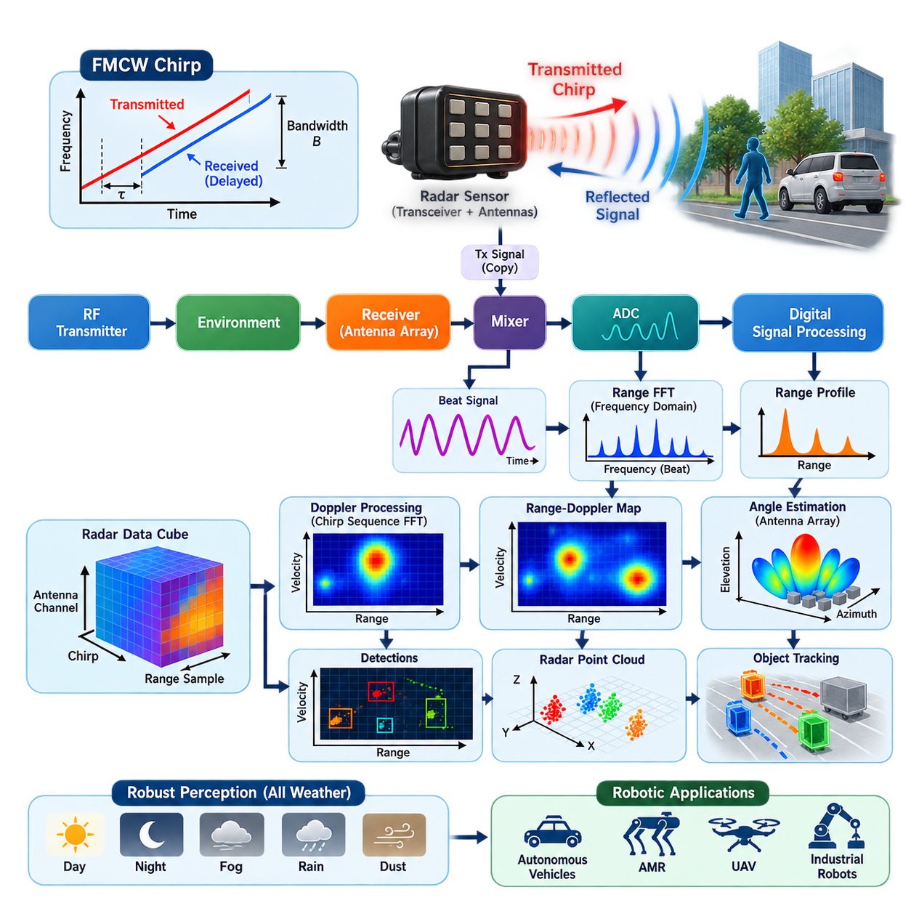
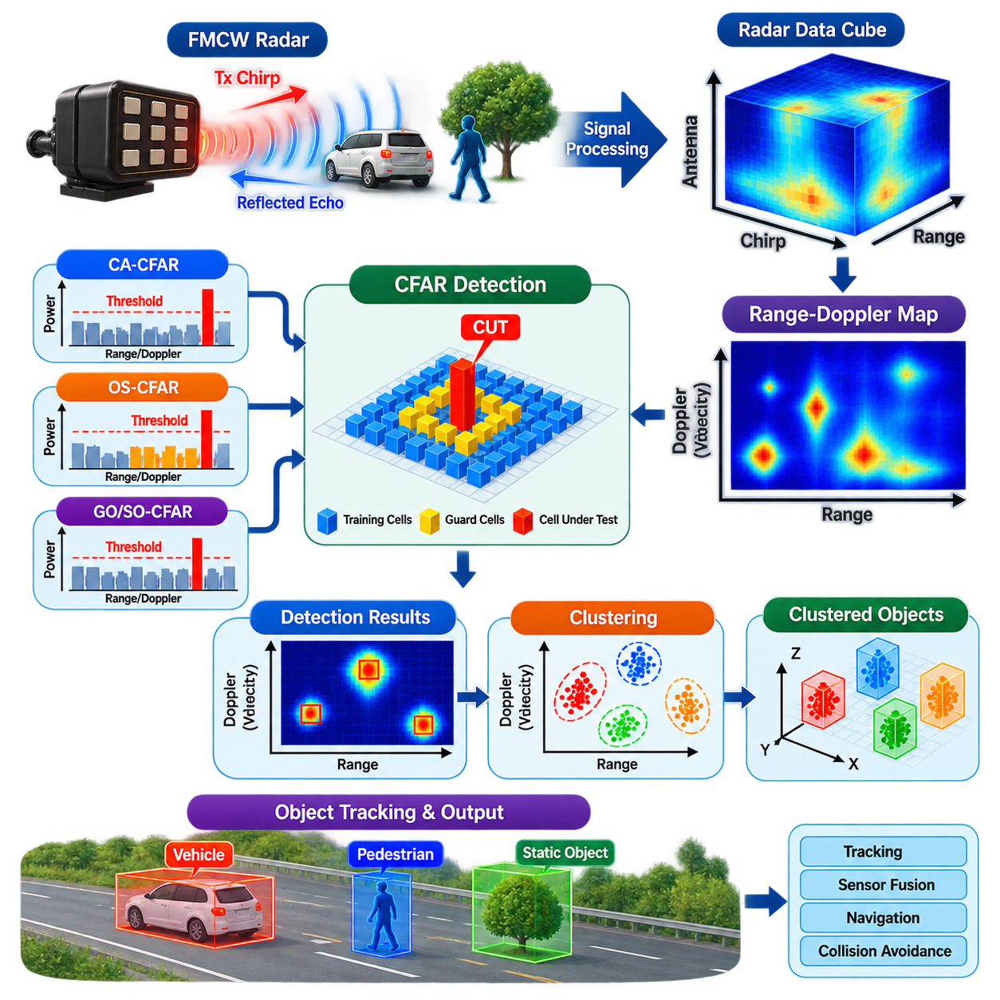
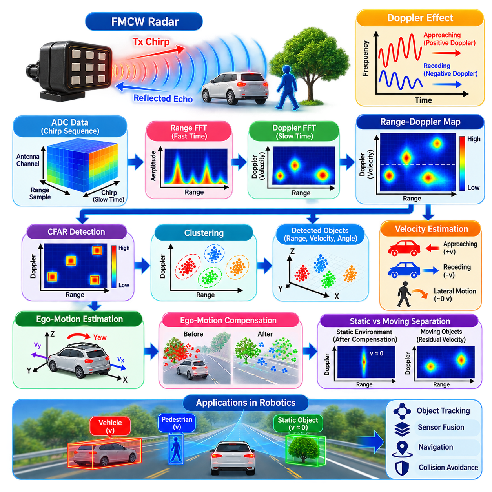
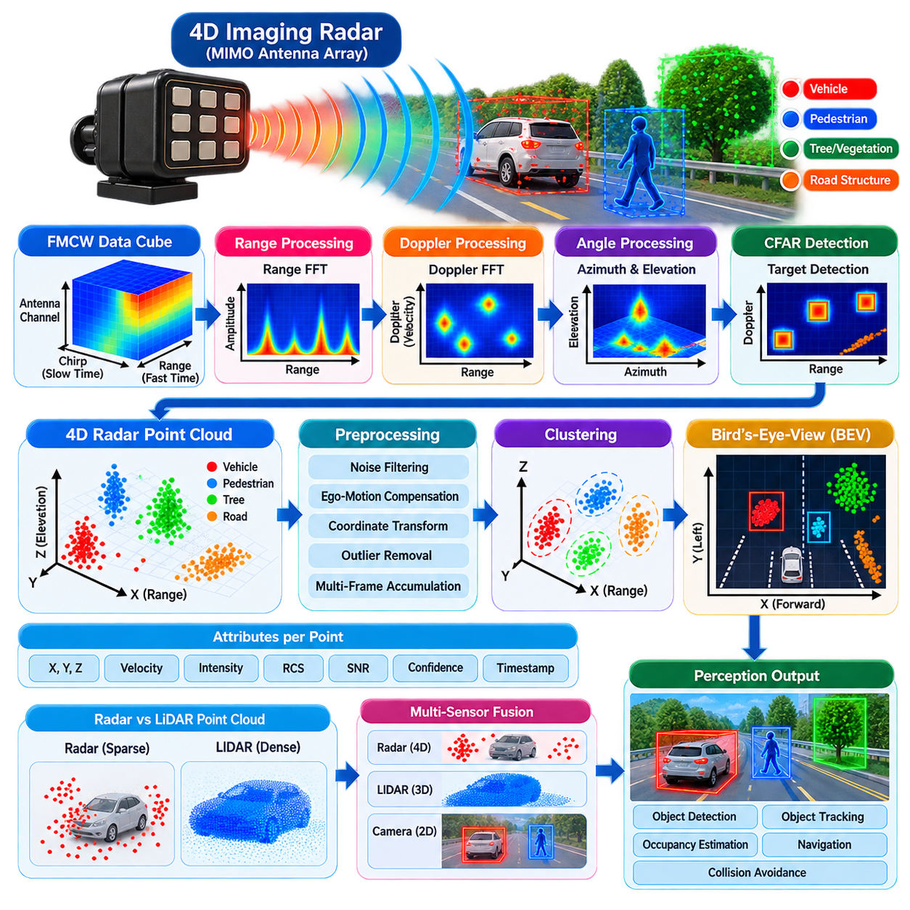
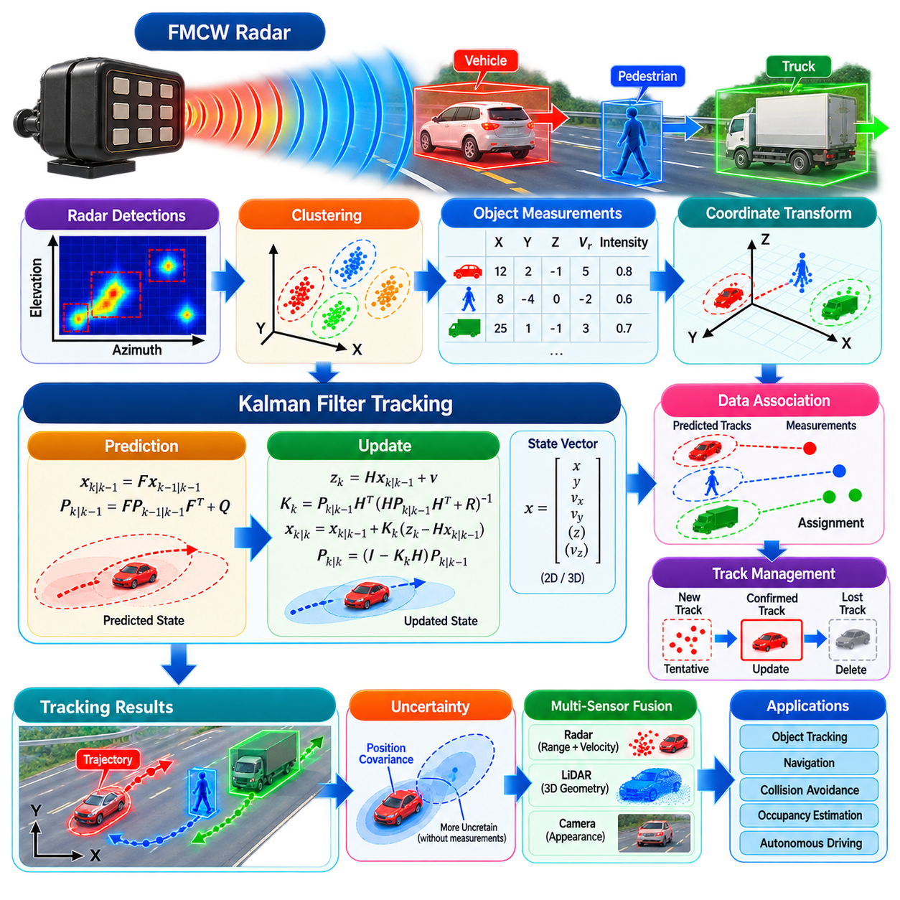
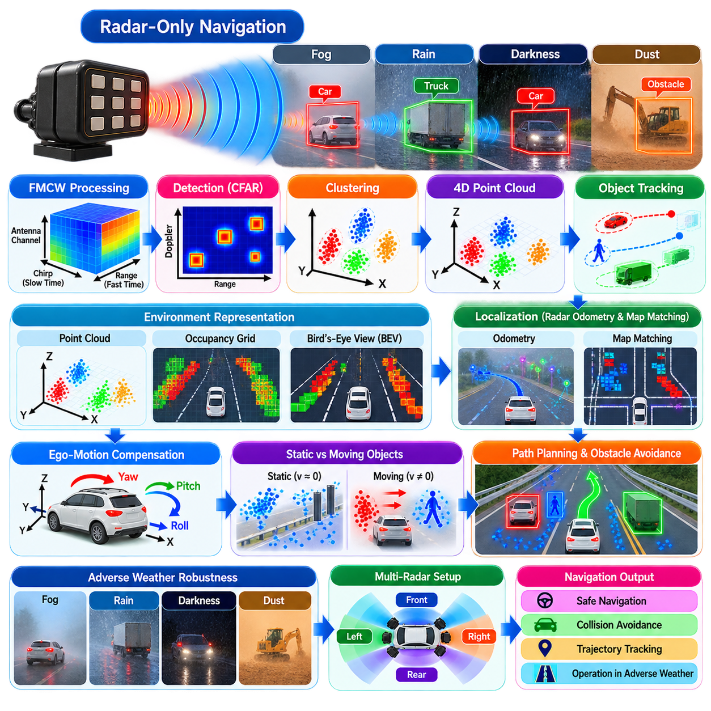
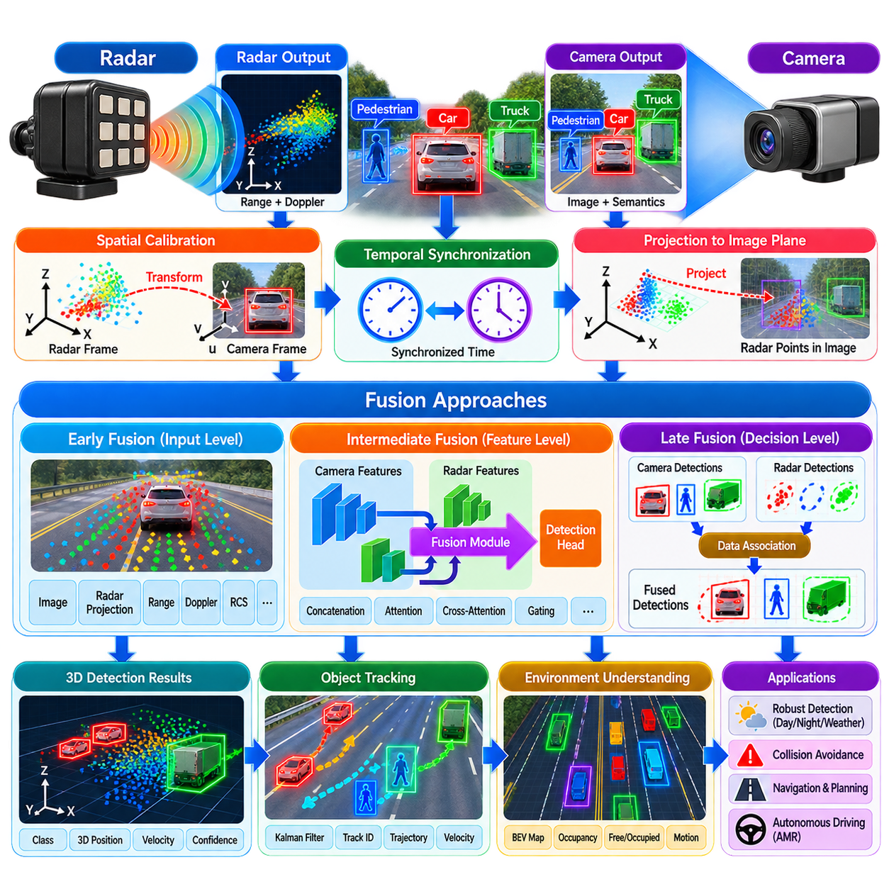
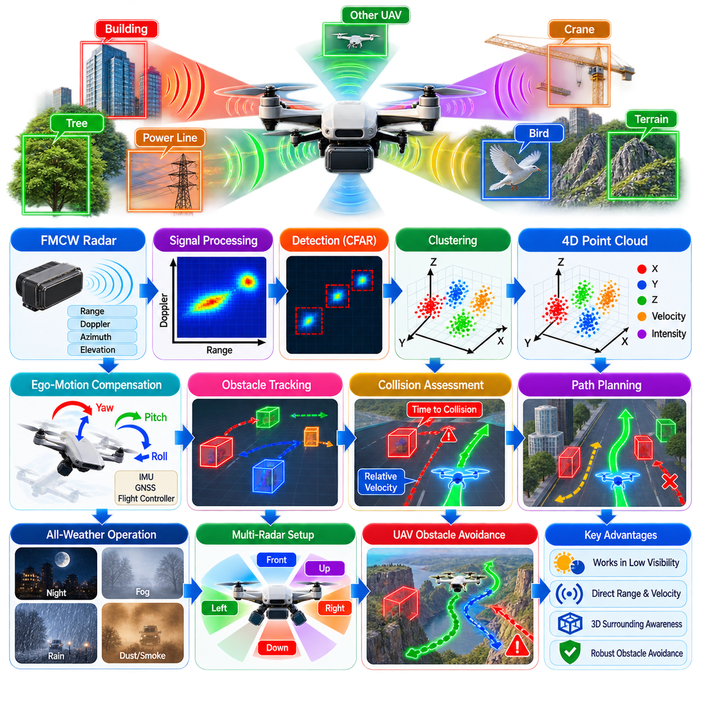
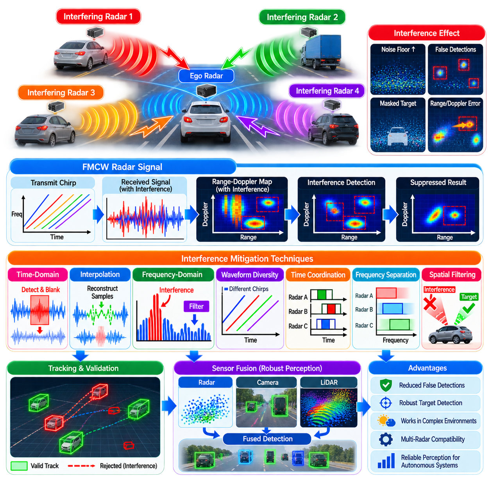
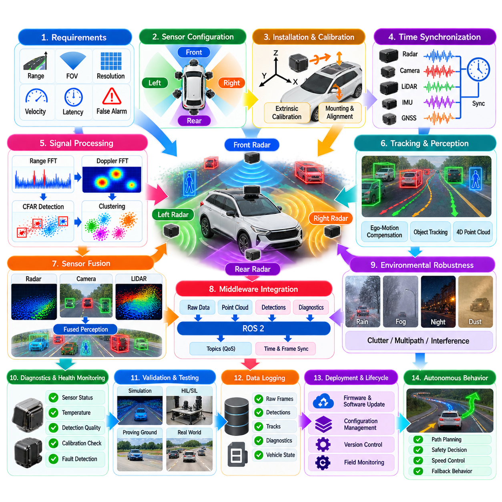

**Volume 14. Perception and Sensor Fusion**

# Chapter 04. Radar Perception

## 04.01. Radar Signal Processing FMCW Principles [w/Code]

{width="7.268055555555556in" height="7.268055555555556in"}

레이더 인지(Radar Perception)는 무선 주파수(Radio-Frequency) 전자기파를 송신하고 반사파를 분석하여 로봇에 거리와 상대 운동에 대한 직접적인 측정값을 제공한다. 수동형 카메라(Passive Camera)와 달리 레이더(Radar)는 환경을 능동적으로 조사하며, 어둠, 안개, 먼지, 비 및 일정 수준의 시야 차단 상황에서도 효과적으로 동작한다. 이러한 특성으로 인해 레이더는 실외 자율이동로봇(Outdoor AMR), 자율주행차, 무인항공기(UAV), 안전 필수 로봇 시스템(Safety-Critical Robotic System)을 위한 중요한 보완 센서가 된다.

현대 로봇용 레이더 센서(Radar Sensor)는 일반적으로 주파수 변조 연속파(Frequency-Modulated Continuous-Wave, FMCW) 방식을 사용한다. FMCW 레이더는 개별적인 펄스(Pulse)를 송신하는 대신, 반송파 주파수(Carrier Frequency)가 사전에 정의된 시간 구간에 걸쳐 변화하는 신호를 연속적으로 송신한다. 선형 주파수 스윕(Linear Frequency Sweep)을 처프(Chirp)라고 하며, 레이더는 처프를 반복적으로 송신하면서 물체, 표면, 차량, 사람 및 주변 구조물에서 반사된 전자기 에너지를 동시에 수신한다.

일반적인 선형 FMCW 처프(Linear FMCW Chirp)는 처프 지속시간(Chirp Duration) 동안 순간 주파수(Instantaneous Frequency)를 시작 주파수에서 종료 주파수까지 증가시킨다. 두 주파수의 차이는 스윕 대역폭(Sweep Bandwidth)을 정의한다. 송신파가 물체에 도달한 후 레이더로 되돌아오면 왕복 전파 시간(Round-Trip Propagation Time)에 따라 수신 신호에 지연이 발생한다. 송신 주파수가 지속적으로 변화하기 때문에 이러한 시간 지연은 송신 신호와 수신 신호 사이에서 측정 가능한 주파수 차이로 나타난다.

수신 신호(Received Signal)는 송신 신호의 복사본과 혼합되어 중간 주파수 신호(Intermediate-Frequency Signal)를 생성하며, 이를 일반적으로 비트 신호(Beat Signal)라고 한다. 정지 표적(Stationary Target)의 경우 비트 주파수(Beat Frequency)는 전파 지연에 거의 비례하므로 표적 거리와도 비례한다. 처프 기울기(Chirp Slope)를 S, 측정된 비트 주파수를 f_b라고 하면 거리는 R = c f_b /(2S)로 근사할 수 있으며, 여기서 c는 전자기파의 전파 속도를 의미한다.

거리 분해능(Range Resolution)은 단순한 신호 처리 해상도가 아니라 기본적으로 송신 대역폭(Transmitted Bandwidth)에 의해 결정된다. 이상적인 FMCW 파형(Waveform)에서 이론적인 거리 분해능은 대략 ΔR = c/(2B)이며, 여기서 B는 처프 대역폭(Chirp Bandwidth)이다. 따라서 대역폭을 증가시키면 거리 방향에서 서로 가까이 위치한 물체를 구별할 수 있다. FFT 크기, 샘플링 속도(Sampling Rate), 윈도잉(Windowing), 신호대잡음비(SNR)는 실제 추정 정확도에 영향을 주지만 물리적인 대역폭 자체를 대신할 수는 없다.

아날로그-디지털 변환(Analog-to-Digital Conversion) 이후 각 처프에서 수집된 샘플은 일반적으로 고속 푸리에 변환(Fast Fourier Transform, FFT)을 이용하여 처리된다. 이 연산은 샘플링된 비트 신호를 후보 거리에 대응하는 주파수 빈(Frequency Bin)으로 변환하기 때문에 거리 FFT(Range FFT)라고 한다. 생성된 스펙트럼(Spectrum)의 피크는 물체에서 반사된 에너지를 나타낸다. 인접 빈 사이의 스펙트럼 누설(Spectral Leakage)을 줄이기 위해 FFT 수행 전에 한 윈도(Hann Window)나 블랙맨 윈도(Blackman Window) 등의 윈도 함수가 적용되기도 한다.

이동 물체(Moving Object)는 시간에 따라 레이더와의 거리가 변화하기 때문에 추가적인 도플러 주파수 편이(Doppler Frequency Shift)를 발생시킨다. FMCW 레이더는 연속적으로 송신되는 여러 처프 사이의 위상 변화(Phase Evolution)를 분석하여 이러한 움직임을 추정한다. 처프 시퀀스(Chirp Sequence)에 두 번째 푸리에 변환을 수행하면 도플러 정보(Doppler Information)를 얻을 수 있으며, 거리와 도플러 차원을 결합하면 반사 에너지를 거리와 방사 속도(Radial Velocity)에 따라 표현하는 거리-도플러 맵(Range-Doppler Map)을 생성할 수 있다.

도플러 차원(Doppler Dimension)을 이용하면 측정 거리가 유사한 경우에도 정지 구조물과 이동 물체를 구별할 수 있다. 방사 속도(Radial Velocity)는 레이더 파장(Radar Wavelength)과 파형 설정을 이용하여 도플러 주파수로부터 추정할 수 있다. 그러나 레이더는 센서를 향하거나 센서로부터 멀어지는 방향의 속도 성분만 직접 측정한다. 레이더 시선 방향(Line of Sight)에 수직인 움직임은 방사 도플러 성분이 작기 때문에 완전한 속도 추정을 위해 객체 추적(Object Tracking)이나 센서 융합(Sensor Fusion)이 필요할 수 있다.

로봇용 레이더(Robotic Radar)는 반사 신호가 도달하는 방향을 추정하기 위해 여러 개의 송신 안테나(Transmit Antenna)와 수신 안테나(Receive Antenna)를 사용하는 경우가 많다. 공간적으로 분리된 안테나 소자 사이에서 관측되는 위상 차이(Phase Difference)는 각도 정보를 포함한다. 디지털 빔포밍(Digital Beamforming), 각도 FFT(Angle FFT), 고해상도 도래각(Direction-of-Arrival, DoA) 알고리즘을 사용하면 이러한 위상 관계를 방위각(Azimuth)으로 변환할 수 있으며, 적절한 안테나 배열에서는 고도각(Elevation)까지 추정할 수 있다.

다중입력 다중출력 레이더(Multiple-Input Multiple-Output Radar, MIMO Radar) 구조에서는 여러 송신 및 수신 채널을 조합하여 더 큰 가상 안테나 개구(Virtual Antenna Aperture)를 생성할 수 있다. 시분할 다중화 MIMO(Time-Division Multiplexed MIMO)는 서로 다른 송신기가 서로 다른 처프에서 동작하기 때문에 소형 밀리미터파 레이더(Millimeter-Wave Radar)에서 널리 사용된다. 이러한 가상 배열은 물리적인 수신 소자의 수를 동일하게 증가시키지 않고도 각도 분해 성능을 향상시키지만, 정확한 채널 보정(Channel Calibration)과 이동 보상(Motion Compensation)이 중요해진다.

전체 FMCW 처리 체인(Processing Chain)은 처프 생성, 무선주파수 송신(RF Transmission), 환경에서의 반사, 신호 수신, 믹싱(Mixing), 아날로그-디지털 변환 및 디지털 스펙트럼 처리(Digital Spectral Processing)의 연속적인 과정으로 이해할 수 있다. 거리 FFT는 거리 정보를 추출하고, 도플러 처리는 방사 방향 운동을 추정하며, 안테나 영역 처리(Antenna-Domain Processing)는 방향을 계산한다. 이렇게 생성된 측정값은 이후 검출 결과(Detection) 또는 레이더 포인트 클라우드(Radar Point Cloud)로 변환되어 상위 인지 모듈에서 사용될 수 있다.

실제 레이더 신호에는 이상적인 수학적 모델보다 훨씬 복잡한 요소가 포함된다. 열 잡음(Thermal Noise), 다중경로 전파(Multipath Propagation), 안테나 결합(Antenna Coupling), 위상 잡음(Phase Noise), 비선형 처프(Nonlinear Chirp), ADC 양자화(Quantization), 클러터(Clutter), 간섭(Interference), 약한 표적 반사도(Target Reflectivity) 등이 측정값을 왜곡할 수 있다. 금속 구조물은 강한 반사를 생성할 수 있으며, 일부 물체는 하나의 반사점이 아니라 여러 개의 산란 중심(Scattering Center)을 형성한다. 따라서 견고한 레이더 인지를 위해서는 객체 수준의 해석 이전에 세심한 보정과 신호 조절이 필요하다.

정적 클러터(Static Clutter)는 벽, 바닥, 기계, 가드레일 및 기반시설이 지속적인 반사를 발생시키기 때문에 로봇 시스템에서 특히 중요하다. 응용 목적에 따라 신호 처리 과정에서 정적인 성분을 억제하거나 유용한 기하학적 정보(Geometric Information)로 유지할 수 있다. 예를 들어 산업 시설을 주행하는 자율 로봇은 정적 레이더 특징(Static Radar Feature)을 환경 인식에 활용하면서 이동 표적을 별도로 추출하여 충돌 회피(Collision Avoidance)와 객체 추적에 이용할 수 있다.

레이더 설정(Radar Configuration)에는 서로 연관된 여러 공학적 절충 관계(Engineering Trade-off)가 존재한다. 처프 대역폭은 거리 분해능에 영향을 주고, 처프 지속시간과 샘플링 파라미터는 관측 가능한 거리에 영향을 주며, 처프의 개수와 반복 패턴은 도플러 분해능(Doppler Resolution)과 모호하지 않은 속도 범위(Unambiguous Velocity)에 영향을 준다. 안테나 형상(Antenna Geometry)은 각도 측정 능력을 결정하고, 프레임 속도(Frame Rate)는 인지 시스템이 새로운 측정값을 획득하는 주기를 결정한다. 따라서 이러한 파라미터들은 독립적으로 최적화하기보다 통합적으로 설계해야 한다.

원시 레이더 데이터(Raw Radar Data)의 구조는 흔히 거리 샘플, 처프 및 안테나 채널에 걸친 정보를 포함하는 레이더 큐브(Radar Cube)로 표현된다. 연속적인 변환 과정을 통해 관측 환경의 서로 다른 물리적 차원이 드러난다. 거리 처리는 반사 신호를 거리에 따라 구성하고, 도플러 처리는 방사 속도를 분리하며, 공간 처리는 신호의 도달 방향을 추정한다. 이후 처리 단계에서는 이러한 표현에 검출(Detection), 군집화(Clustering), 추적(Tracking), 분류(Classification) 또는 학습 기반 인지 모델(Learning-Based Perception Model)을 적용할 수 있다.

로봇 소프트웨어(Robot Software) 관점에서는 레이더 하드웨어가 일부 신호 처리를 내부적으로 수행하더라도 FMCW 원리를 이해하는 것이 중요하다. 레이더의 설정은 인지 알고리즘에 전달되는 데이터의 특성을 직접적으로 변화시킨다. 가까운 거리의 보행자 감지에 최적화된 내비게이션 시스템(Navigation System)은 장거리 실외 차량과 서로 다른 거리, 속도, 갱신 주기(Update Rate), 각도 설정을 요구할 수 있다. 따라서 신호 처리 파라미터는 독립적인 센서 설정이 아니라 전체 인지 시스템 아키텍처(Perception-System Architecture)의 일부로 다루어져야 한다.

FMCW 레이더는 궁극적으로 전자기파의 전파 지연(Propagation Delay), 도플러에 의해 발생하는 위상 변화, 안테나 배열의 위상 차이를 거리, 방사 속도 및 방향에 대한 추정값으로 변환한다. 이러한 측정값은 카메라(Camera)와 라이다(LiDAR)를 보완하는 물리적으로 독립적인 환경 정보를 제공한다. 전체 인지 아키텍처에서 레이더 신호 처리(Radar Signal Processing)는 이후 수행되는 CFAR 검출, 군집화, 객체 추적, 악천후 인지(Adverse-Weather Perception), 다중 센서 융합(Multi-Sensor Fusion)의 기반이 되는 측정 계층을 형성한다.

## 04.02. Radar Object Detection CFAR Clustering [w/Code]

{width="7.268055555555556in" height="7.268055555555556in"}

레이더 객체 검출(Radar Object Detection)은 처리된 레이더 측정값을 상위 수준의 인지 모듈(Perception Module)에서 사용할 수 있는 개별 후보 표적(Candidate Target)으로 변환한다. FMCW 신호 처리를 통해 거리(Range), 도플러(Doppler), 각도(Angle) 정보가 생성되면, 시스템은 어떤 측정값이 실제 객체에서 발생한 것이고 어떤 것이 잡음(Noise), 다중경로 반사(Multipath Reflection), 환경 클러터(Environmental Clutter)인지 판단해야 한다. 따라서 검출 단계는 저수준 레이더 신호 처리와 객체 추적(Object Tracking) 또는 센서 융합(Sensor Fusion)을 연결하는 핵심 과정이다.

레이더 측정값(Radar Measurement)은 하나의 고정된 진폭 임계값(Amplitude Threshold)을 적용하여 해석할 수 있을 정도로 일정하거나 깨끗하지 않은 경우가 많다. 수신 전력은 표적 거리, 재질, 방향, 안테나 이득(Antenna Gain), 전파 조건 및 간섭(Interference)에 따라 변화한다. 배경 클러터(Background Clutter) 역시 거리 및 도플러 셀에 따라 크게 달라질 수 있다. 따라서 특정 영역에서 잘 동작하는 임계값이 다른 영역에서는 과도한 오검출(False Detection)을 발생시키거나 약한 표적을 놓칠 수 있다.

일정 오경보율(Constant False Alarm Rate, CFAR) 검출은 레이더 데이터의 국부적인 통계적 특성에 따라 검출 임계값을 적응적으로 조절하여 이러한 문제를 해결한다. 모든 셀을 하나의 전역 임계값(Global Threshold)과 비교하는 대신, CFAR는 시험 대상 셀(Cell Under Test, CUT) 주변의 인접 셀을 분석한다. 주변 측정값을 이용하여 국부적인 잡음 또는 클러터 수준을 추정하고, 이 추정값을 기반으로 검출 임계값을 계산한다.

기본적인 CFAR 절차에서는 CUT 주변 영역을 학습 셀(Training Cell), 보호 셀(Guard Cell), 그리고 CUT 자체로 구분한다. 학습 셀은 국부적인 배경 수준을 추정하는 데 사용되며, 보호 셀은 학습 영역과 검사 대상 표적을 분리한다. 강한 표적의 에너지가 레이더 처리 응답으로 인해 인접 셀까지 확산될 수 있기 때문에 보호 영역은 중요하다. 이러한 에너지가 배경 추정에 포함되면 임계값이 상승하여 실제 표적을 놓칠 수 있다.

셀 평균 CFAR(Cell-Averaging CFAR, CA-CFAR)는 학습 셀의 전력을 평균하여 국부적인 잡음 수준을 추정한다. 이후 이 추정값에 스케일링 계수(Scaling Factor)를 적용하여 검출 임계값을 생성한다. CUT 값이 계산된 임계값을 초과하면 해당 셀을 검출 후보로 판단한다. CA-CFAR는 개념적으로 단순하고 주변 배경이 비교적 균질할 때 효과적이지만, 강한 클러터 경계(Clutter Boundary) 부근이나 학습 영역에 여러 표적이 존재하는 경우 성능이 저하될 수 있다.

순서 통계 CFAR(Ordered-Statistic CFAR, OS-CFAR)는 학습 셀의 전력값을 정렬하고 특정 순위의 값을 선택하여 배경 수준을 추정하는 다른 방식을 사용한다. 이 방법은 강한 인접 표적에 의해 학습 영역이 오염되는 상황에 상대적으로 강하다. 최대값 CFAR(Greatest-of CFAR)와 최소값 CFAR(Smallest-of CFAR) 등의 변형 방식도 비대칭적인 클러터 조건이나 서로 다른 배경 영역의 경계에서 사용할 수 있다. 적절한 CFAR 방식은 예상되는 운용 환경과 검출 요구사항에 따라 결정해야 한다.

CFAR는 일반적으로 거리 프로파일(Range Profile)이나 거리-도플러 맵(Range-Doppler Map)에 적용되며, 다차원 레이더 표현(Multidimensional Radar Representation)으로 확장할 수도 있다. 거리와 도플러에 걸쳐 검출을 수행하면 시스템은 거리뿐 아니라 방사 방향 운동(Radial Motion)을 기반으로 표적을 식별할 수 있다. 4D 레이더(4D Radar) 시스템에서는 이후 각도 정보를 추가하여 공간적인 표적 후보를 구성할 수 있다. 처리 아키텍처는 검출 민감도(Detection Sensitivity), 계산 비용, 로봇 인지 시스템에 요구되는 갱신 주기(Update Rate)를 균형 있게 고려해야 한다.

CFAR 출력에는 동일한 물리적 객체에서 발생한 여러 개의 검출점이 포함되는 경우가 많다. 차량, 보행자, 벽 또는 대형 금속 구조물은 물리적 크기와 여러 산란 중심(Scattering Center)으로 인해 서로 인접한 다수의 레이더 반사점을 생성할 수 있다. 군집화(Clustering)는 공간적 또는 운동학적으로 연관된 검출점을 하나의 그룹으로 결합하여 후보 객체(Candidate Object)를 구성한다. 이를 통해 이후 추적 및 분류 단계로 전달되는 개별 측정값의 수를 줄일 수 있다.

대표적인 군집화 방법에는 유클리드 거리 군집화(Euclidean-Distance Clustering), 잡음이 있는 응용을 위한 밀도 기반 공간 군집화(Density-Based Spatial Clustering of Applications with Noise, DBSCAN), 그리고 이와 유사한 밀도 기반 방법이 있다. 유클리드 군집화는 사전에 정의된 거리 임계값에 따라 검출점을 그룹화하며, DBSCAN은 이웃 거리와 밀집 영역을 형성하는 데 필요한 최소 포인트 수를 함께 고려한다. 군집화 파라미터는 레이더 분해능, 측정 불확실성, 표적 거리 및 예상되는 레이더 반사점의 밀도를 고려하여 설정해야 한다.

레이더 군집화(Radar Clustering)는 레이더 검출점이 희소하고 잡음이 많으며 물리적으로 모호할 수 있기 때문에 이상적인 포인트 클라우드(Point Cloud)를 군집화하는 것보다 어렵다. 하나의 보행자는 몇 개의 강한 반사만 생성할 수 있는 반면, 가까운 차량은 차체 전체에 분포된 다수의 검출점을 생성할 수 있다. 또한 다중경로 반사는 실제 물리적 객체와 일치하지 않는 가상 표적(Apparent Target)을 만들 수 있다. 따라서 군집화를 최종적인 객체 인식(Object Recognition) 단계로 간주해서는 안 되며, 시간적 추적(Temporal Tracking)과 센서 융합을 통해 유효성을 평가할 후보 그룹을 생성하는 단계로 이해해야 한다.

CFAR와 군집화를 결합한 파이프라인은 계층적인 검출 과정(Hierarchical Detection Process)으로 이해할 수 있다. 신호 처리는 먼저 원시 레이더 측정값을 거리-도플러 또는 거리-각도(Range-Angle) 데이터와 같은 표현으로 변환한다. CFAR는 이러한 표현에서 통계적으로 유의미한 셀을 검출하고, 군집화는 서로 연관된 검출점을 후보 객체로 묶는다. 이후 추적(Tracking)은 시간에 따라 이러한 후보들을 연관시키고 움직임을 추정하며 불안정하거나 일관성이 없는 측정값을 제거할 수 있다.

자율 로봇(Autonomous Robot)에서 최종 목표는 단순히 레이더 검출점의 수를 최대화하는 것이 아니다. 인지 시스템은 검출 확률(Detection Probability), 오경보율(False-Alarm Rate), 공간 정밀도(Spatial Precision), 계산 지연시간(Computational Latency), 환경 변화에 대한 강건성(Robustness) 사이에서 적절한 균형을 확보해야 한다. CFAR는 적응형 통계 검출(Adaptive Statistical Detection)을 제공하고 군집화는 개별 레이더 응답을 객체 수준의 후보로 변환한다. 두 과정은 함께 레이더 기반 인지의 핵심 처리 단계를 구성하며 객체 추적, 카메라-레이더 융합(Camera-Radar Fusion), 내비게이션(Navigation), 충돌 회피(Collision Avoidance)를 위한 구조화된 입력을 제공한다.

## 04.03. Radar Velocity Estimation Doppler Ego Motion [w/Code]

{width="7.268055555555556in" height="7.268055555555556in"}

레이더 속도 추정(Radar Velocity Estimation)은 도플러 효과(Doppler Effect)를 이용하여 반사 물체가 센서를 향해 접근하거나 센서로부터 멀어지는 속도를 측정한다. FMCW 거리 처리(Range Processing)가 전파 지연에 따른 주파수 차이를 이용하여 거리를 추정하는 반면, 물체의 움직임은 추가적인 주파수 및 위상 변화를 발생시킨다. 인지 시스템은 연속적인 레이더 처프(Radar Chirp)에서 이러한 변화를 관측하여 방사 속도(Radial Velocity)를 추정하고 이동 표적과 정지 환경 구조물을 구별할 수 있다.

도플러 효과는 레이더와 반사 표적 사이의 상대 운동(Relative Motion)이 시간에 따라 반사 전자기파의 위상(Phase)을 변화시키기 때문에 발생한다. 단일기지 레이더(Monostatic Radar)의 경우 도플러 주파수(Doppler Frequency)는 대략 방사 방향 표적 속도의 두 배를 파장으로 나눈 값에 비례한다. 따라서 레이더에 접근하는 표적과 멀어지는 표적은 서로 반대 부호의 도플러 편이(Doppler Shift)를 발생시키며, 이를 통해 방사 운동의 크기와 방향을 모두 추정할 수 있다.

FMCW 레이더에서 속도는 일반적으로 하나의 처프가 아니라 연속적인 처프 시퀀스(Chirp Sequence)를 이용하여 추정한다. 각 처프 내부의 샘플은 주로 거리 정보를 포함하는 반면, 반복되는 처프 사이에서 동일한 거리 성분의 위상 변화는 도플러 정보를 포함한다. 먼저 고속 시간 차원(Fast-Time Dimension)에 거리 FFT(Range FFT)를 적용하고, 이후 처프 또는 저속 시간 차원(Slow-Time Dimension)에 두 번째 FFT를 적용하여 신호를 도플러 주파수에 따라 분리한다.

이 과정에서 생성되는 2차원 표현을 거리-도플러 맵(Range-Doppler Map)이라고 한다. 한 축은 표적 거리를 나타내고 다른 축은 방사 속도 또는 도플러 주파수를 나타내며, 각 셀에는 반사 신호 에너지가 저장된다. 레이더 자체가 정지한 경우 정지 반사체는 상대 도플러가 거의 0인 위치에 나타나는 반면, 이동 표적은 양수 또는 음수 속도 위치에 나타난다. CFAR와 같은 검출 알고리즘은 이러한 표현에 직접 적용되어 유의미한 표적 응답을 검출할 수 있다.

속도 분해능(Velocity Resolution)은 여러 처프를 수집하는 결맞음 관측 구간(Coherent Observation Interval)의 길이에 크게 영향을 받는다. 일반적으로 관측 구간이 길어지면 유사한 방사 속도를 가진 표적을 구분하는 능력이 향상되지만 처리 지연시간이 증가하고 일정한 운동을 가정하기 어려워질 수 있다. 따라서 레이더 설정에서는 속도 분해능, 프레임 속도(Frame Rate), 계산 부하, 표적 동역학(Target Dynamics), 로봇 플랫폼의 실시간 요구사항 사이의 균형이 필요하다.

레이더에는 파장과 처프 반복 주기(Chirp Repetition Timing)에 의해 결정되는 비모호 속도 범위(Unambiguous Velocity Range)도 존재한다. 표적이 설정된 도플러 위상 샘플링 범위에 비해 지나치게 빠르게 움직이면 측정된 위상 변화가 래핑(Wrapping)되어 속도 모호성(Velocity Ambiguity)이 발생할 수 있다. 이 경우 실제로 높은 속도가 다른 낮은 속도로 관측될 수 있으며, 파형 설계, 다중 처프 구성, 시간적 추적 또는 모호성 해소 알고리즘을 이용하여 이러한 문제를 줄일 수 있다.

도플러 레이더(Doppler Radar)의 근본적인 한계는 방사 속도만을 직접 측정한다는 점이다. 센서를 향해 직접 이동하는 물체는 큰 방사 속도 성분을 생성하지만, 레이더 시선 방향(Line of Sight)에 수직으로 움직이는 물체는 빠르게 이동하더라도 측정되는 도플러가 거의 0일 수 있다. 이러한 기하학적 한계로 인해 완전한 2차원 또는 3차원 객체 속도를 추정하려면 일반적으로 각도 측정, 시간적 추적(Temporal Tracking), 다중 시점 또는 카메라, 라이다(LiDAR) 등의 센서와의 융합이 필요하다.

이동하는 로봇에 레이더가 장착된 경우 측정된 도플러에는 객체의 움직임뿐 아니라 로봇의 자기 운동(Ego-Motion)도 포함된다. 완전히 정지해 있는 벽, 기둥, 가드레일 또는 건물조차 레이더 플랫폼 자체가 병진 또는 회전 운동을 하면 0이 아닌 방사 속도로 관측될 수 있다. 자기 운동 보상(Ego-Motion Compensation)이 없다면 정지 환경 구조물이 이동 표적으로 잘못 해석되어 동적 객체 검출, 추적, 점유 추정(Occupancy Estimation), 충돌 예측 성능을 저하시킬 수 있다.

레이더 자기 운동 추정(Radar Ego-Motion Estimation)은 정지 환경에서 발생하는 반사점의 속도 패턴을 이용하여 센서의 움직임을 추정한다. 충분한 수의 검출점이 정적인 구조물에서 발생했다면 측정된 방사 속도는 공통적인 플랫폼 속도와 기하학적으로 일관된 관계를 가져야 한다. 도플러 측정값과 해당 표적의 방향을 결합하면 시스템은 레이더의 병진 운동(Translational Motion)을 추정하고 지배적인 정적 장면 모델(Static-Scene Model)과 일치하지 않는 측정값을 식별할 수 있다.

자기 운동 추정에 사용되는 레이더 측정값에는 이동 차량, 보행자, 다중경로 반사, 잡음 및 잘못된 검출 결과가 포함될 수 있기 때문에 강건한 추정(Robust Estimation)이 중요하다. 측정값이 깨끗한 경우 최소제곱 최적화(Least-Squares Optimization)를 이용하여 플랫폼 속도를 추정할 수 있으며, RANSAC이나 이상치에 강건한 추정기(Outlier-Resistant Estimator)를 사용하면 정지 세계 가설(Stationary-World Hypothesis)에 일치하지 않는 관측값을 제거할 수 있다. 시간적 필터링(Temporal Filtering)을 적용하면 연속 레이더 프레임 사이의 운동 추정값을 더욱 안정화할 수 있다.

회전 운동(Rotational Motion)은 환경의 각 지점이 방향과 로봇의 회전 중심에 대한 레이더 위치에 따라 서로 다른 겉보기 속도(Apparent Velocity)를 가지므로 추가적인 복잡성을 발생시킨다. 이동 로봇에서는 각속도(Angular Velocity)를 관성측정장치(IMU), 휠 오도메트리(Wheel Odometry) 또는 위치추정 시스템(Localization System)에서 얻어 레이더 측정값과 결합할 수 있다. 레이더 기반 운동과 다른 센서의 측정값을 동일한 좌표계에서 표현하려면 정확한 센서 외부 보정(Sensor Extrinsic Calibration)이 필요하다.

자기 운동이 추정되면 각 레이더 검출점에 대해 플랫폼의 움직임으로 발생할 것으로 예상되는 도플러 성분을 예측할 수 있다. 이 성분을 제거하면 자기 운동이 보상된 방사 속도(Ego-Motion-Compensated Radial Velocity)를 얻을 수 있다. 보상 이후 거의 정지 상태가 되는 측정값은 정적 환경과 연관시킬 수 있으며, 여전히 유의미한 잔류 속도(Residual Velocity)를 가지는 검출점은 독립적으로 움직이는 객체의 후보가 된다. 이러한 분리는 동적 장면 이해(Dynamic-Scene Understanding)에 중요한 정보를 제공한다.

자기 운동 보상은 의미 있는 주행 속도로 운용되는 실외 자율이동로봇(Outdoor AMR)과 자율주행차에서 특히 중요하다. 회전, 가속 또는 불규칙한 지형을 통과하는 동안 측정된 도플러와 실제 객체 운동 사이의 관계는 빠르게 변화할 수 있다. 고속 관성 측정(High-Rate Inertial Measurement)과 레이더 도플러 정보를 결합하면 어둠, 비, 안개, 먼지 또는 조명 변화로 인해 시각 센서 성능이 저하되는 상황에서도 주변 운동을 더욱 안정적으로 해석할 수 있다.

레이더 기반 속도(Radar-Derived Velocity)는 연속적인 객체 위치의 차이만으로 속도를 계산하는 대신 방사 방향 운동을 즉각적인 물리 측정값으로 제공하기 때문에 객체 추적(Object Tracking) 성능도 향상시킬 수 있다. 추적기는 칼만 필터링(Kalman Filtering)과 같은 기법을 이용하여 거리, 각도, 도플러 측정값을 운동 모델(Motion Model)과 결합할 수 있다. 이를 통해 속도 추정값을 안정화하고 프레임 사이의 데이터 연관(Data Association)을 개선하며 관측 객체가 잠재적인 충돌 위험을 가지는지 더 빠르게 예측할 수 있다.

전체 로봇 인지 파이프라인(Robotic Perception Pipeline)에서 도플러 처리는 저수준 FMCW 신호 처리와 동적 장면 해석을 연결한다. 거리 FFT는 반사 에너지가 발생한 거리를 결정하고, 도플러 처리는 방사 운동을 추정하며, 자기 운동 추정은 로봇의 움직임으로 발생한 성분을 설명하고, 자기 운동 보상은 잔류 표적 동역학(Residual Target Dynamics)을 드러낸다. 이렇게 생성된 속도 인식 검출값(Velocity-Aware Detection)은 객체 추적, 센서 융합, 내비게이션(Navigation), 충돌 회피(Collision Avoidance), 자율 의사결정(Autonomous Decision Making)을 위한 구조화된 정보를 제공한다.

## 04.04. Radar 4D Imaging Radar Point Cloud Processing [w/Code]

{width="7.268055555555556in" height="7.268055555555556in"}

4D 이미징 레이더(4D Imaging Radar)는 반사 표적의 네 가지 중요한 특성인 거리(Range), 방위각(Azimuth), 고도각(Elevation), 방사 속도(Radial Velocity)를 추정함으로써 기존 자동차 및 로봇용 레이더를 확장한다. 기존 레이더 시스템은 일반적으로 우수한 거리 및 도플러(Doppler) 측정 성능을 제공하지만 각도 분해능(Angular Resolution)은 상대적으로 제한적이다. 이미징 레이더는 안테나 개구(Antenna Aperture), 채널 수, 신호 처리 능력 및 공간 분해능을 향상시켜 주변 환경을 운동 정보가 결합된 더욱 풍부한 3차원 포인트 분포로 표현할 수 있다.

여기서 4D라는 용어는 4차원 물리 공간을 의미하지 않는다. 세 개의 차원은 공간적 위치를 나타내며 추가적인 하나의 차원은 속도를 나타낸다. 따라서 하나의 레이더 반사점은 x, y, z 좌표와 방사 속도 v_r을 이용하여 표현할 수 있으며, 신호 전력(Signal Power), 신호대잡음비(Signal-to-Noise Ratio), 레이더 단면적(Radar Cross Section), 신뢰도(Confidence), 타임스탬프(Timestamp) 등의 속성을 함께 포함할 수 있다. 이러한 표현 방식은 이미징 레이더를 동적 로봇 인지(Dynamic Robotic Perception)에 특히 적합하게 만든다.

이미징 레이더는 일반적으로 수평 및 수직 방향 모두에서 분해능을 확보할 수 있도록 배열된 여러 송신 및 수신 안테나를 사용한다. 다중입력 다중출력(Multiple-Input Multiple-Output, MIMO) 처리는 물리적인 채널들을 결합하여 더 큰 가상 안테나 배열(Virtual Antenna Array)을 구성한다. 증가된 가상 개구(Virtual Aperture)는 기존의 적은 채널 수를 사용하는 레이더보다 정밀한 도래각(Direction-of-Arrival) 추정을 가능하게 하며, 유사한 거리와 속도를 갖는 반사 신호를 방위각과 고도각에 따라 분리할 수 있도록 한다.

처리 파이프라인(Processing Pipeline)은 고속 시간(Fast Time), 저속 시간(Slow Time), 송신기 및 수신기 채널에 걸쳐 구성된 FMCW 레이더 샘플에서 시작한다. 거리 처리는 표적의 거리를 추정하고, 도플러 처리는 방사 속도를 추출하며, 공간 처리는 신호의 도래각을 추정한다. 레이더 아키텍처에 따라 이러한 연산은 거리, 도플러, 방위각 및 고도각 차원에 대한 변환으로 이해할 수 있으며, 이를 통해 유의미한 반사 신호를 검출할 수 있는 다차원 표현(Multidimensional Representation)이 생성된다.

각도 추정(Angle Estimation)은 유용한 4D 레이더 포인트 클라우드(Radar Point Cloud)를 생성하는 데 특히 중요하다. 기존 레이더는 충분한 방위각 정보를 제공하더라도 고도각 분해능이 낮아 서로 다른 높이에 위치한 물체를 구별하기 어려울 수 있다. 이미징 레이더는 2차원 안테나 배열과 고급 빔포밍(Beamforming) 또는 도래각 처리를 이용하여 고도 정보를 복원한다. 이를 통해 차량, 보행자, 도로 구조물, 벽, 식생 및 서로 다른 수직 위치에 존재하는 장애물을 더욱 효과적으로 표현할 수 있다.

스펙트럼 및 각도 처리 이후 검출 알고리즘(Detection Algorithm)은 다차원 측정 공간에서 유의미한 레이더 응답을 식별한다. CFAR 또는 이와 유사한 적응형 임계값 처리(Adaptive Thresholding) 기법을 이용하여 잡음을 억제하고 후보 반사점을 선택할 수 있다. 선택된 각 검출점은 일반적으로 거리, 방위각, 고도각으로 구성된 레이더 좌표계(Radar Coordinate System)에서 직교 좌표계(Cartesian Coordinate System)로 변환된다. 생성된 포인트에는 위치, 방사 속도, 신호 강도(Intensity), 신뢰도 및 기타 센서 고유 속성이 포함될 수 있다.

레이더 포인트 클라우드는 라이다 포인트 클라우드(LiDAR Point Cloud)와 근본적으로 다르다. 라이다는 일반적으로 비교적 정확한 공간 좌표를 가진 조밀한 기하학적 표면 샘플을 생성하는 반면, 레이더 반사점은 상대적으로 희소하며 전자기적 산란 특성(Electromagnetic Scattering Property)에 의해 결정된다. 큰 물체도 연속적인 표면 형태가 아니라 여러 개의 강한 산란 중심(Scattering Center)을 생성할 수 있다. 따라서 동일한 물리적 객체에서 발생한 레이더 포인트도 공간적으로 불규칙하게 분포할 수 있다.

레이더 포인트는 기하학적 밀도가 낮음에도 불구하고 개별 측정값에 도플러 속도가 직접 연결된다는 중요한 장점을 가진다. 이를 통해 인지 시스템은 공간적 위치뿐 아니라 움직임을 기준으로도 반사점을 구별할 수 있다. 서로 가까이 위치한 두 객체라도 방사 속도가 다르면 분리할 수 있으며, 반대로 동일한 이동 객체에서 발생한 여러 반사점은 서로 연관된 도플러 패턴을 나타낼 수 있어 군집화(Clustering)와 추적(Tracking)에 유용한 정보를 제공한다.

원시 이미징 레이더 포인트 클라우드(Raw Imaging-Radar Point Cloud)는 상위 수준의 인지 모듈에서 안정적으로 사용하기 전에 전처리(Preprocessing)가 필요하다. 일반적인 처리에는 낮은 신뢰도의 검출점 제거, 비현실적인 거리 또는 속도의 필터링, 센서 자기 운동(Ego-Motion) 보상, 로봇 좌표계로의 측정값 변환, 다른 센서와의 시간 동기화가 포함된다. 보정 오류(Calibration Error)는 체계적인 공간 왜곡을 발생시킬 수 있으므로 다중 센서 시스템에서는 정확한 내부 보정, 시간 보정 및 외부 보정(Extrinsic Calibration)이 필수적이다.

이동하는 레이더는 정지 구조물에서도 겉보기 도플러 운동(Apparent Doppler Motion)을 관측하기 때문에 자기 운동 보상(Ego-Motion Compensation)이 특히 중요하다. 레이더, 관성측정장치(IMU), 휠 오도메트리(Wheel Odometry) 또는 다른 위치추정 소스를 이용하여 로봇의 병진 및 회전 운동을 추정한 후, 플랫폼 움직임에 의해 발생할 것으로 예상되는 속도 성분을 각 측정값에서 제거할 수 있다. 보상된 포인트 클라우드는 정적 환경 반사와 독립적으로 움직이는 객체를 더욱 명확하게 분리하며 시간적 집계(Temporal Aggregation)를 위한 안정적인 표현을 제공한다.

레이더 포인트 클라우드는 단일 프레임에서 희소한 경우가 많기 때문에 여러 프레임을 누적하여 공간 밀도를 높일 수 있다. 시간적 누적은 추정된 자기 운동을 이용하여 이전 측정값을 공통 기준 좌표계(Common Reference Frame)로 변환한다. 그러나 동적 객체는 독립적으로 위치가 변화하므로 정지 물체와 동일한 방식으로 단순 누적할 수 없다. 따라서 이동 표적이 길게 늘어나거나 중복된 구조를 형성하지 않도록 운동 인식 누적(Motion-Aware Accumulation) 또는 객체 추적이 필요하다.

군집화는 여러 레이더 포인트를 후보 객체 수준의 표현으로 변환한다. DBSCAN과 같은 알고리즘은 공간 거리, 속도 유사도 또는 이들의 조합을 이용하여 포인트를 그룹화할 수 있다. 이미징 레이더는 기존 레이더보다 풍부한 공간 정보를 제공하므로 3차원 군집화(3D Clustering)를 더욱 실용적으로 수행할 수 있다. 그러나 군집의 크기와 밀도는 거리, 객체 방향, 반사도(Reflectivity), 안테나 분해능 및 환경 조건에 따라 달라지므로 고정된 군집화 파라미터가 모든 장면에서 일관된 성능을 제공하지는 않을 수 있다.

포인트 수준의 특징(Point-Level Feature)은 학습 기반 인지 모델(Learning-Based Perception Model)을 통해 처리할 수도 있다. 레이더 포인트 클라우드는 복셀화(Voxelization)하거나 조감도(Bird\'s-Eye View, BEV) 격자에 투영하거나 필러(Pillar) 형태로 표현할 수 있으며, 포인트 기반 신경망(Point-Based Neural Network)을 이용해 직접 처리할 수도 있다. 특징에는 직교 좌표, 도플러 속도, 레이더 단면적, 신호 강도, 고도 및 시간 정보가 포함될 수 있으며, 이를 이용하여 객체 검출, 의미 분류(Semantic Classification), 점유 추정(Occupancy Estimation), 레이더-카메라 및 레이더-라이다 융합을 수행할 수 있다.

조감도 표현(Bird\'s-Eye-View Representation)은 내비게이션과 충돌 회피가 주로 플랫폼 주변 객체의 공간적 배치에 의존하기 때문에 이동 로봇에서 특히 유용하다. 하나 또는 여러 프레임에서 수집된 레이더 포인트를 BEV 좌표계에 투영하고 점유 상태, 속도, 신호 강도 또는 학습된 특징에 따라 인코딩할 수 있다. 이를 통해 현대적인 다중 센서 융합 아키텍처(Multi-Sensor Fusion Architecture)에서 카메라 또는 라이다 특징과 결합할 수 있는 공통 표현을 구성할 수 있다.

4D 레이더 포인트 클라우드의 품질은 하드웨어 구성과 신호 처리 설계에 크게 의존한다. 안테나 개구는 각도 분해능에 영향을 주고, 파형 파라미터(Waveform Parameter)는 거리와 속도 특성을 결정하며, 검출 임계값은 약한 표적에 대한 민감도와 오경보(False Alarm) 사이의 균형을 제어한다. 레이더가 높은 각도 분해능을 제공하더라도 다중경로(Multipath), 간섭(Interference), 사이드로브(Sidelobe), 고스트 검출(Ghost Detection), 확장 객체 산란(Extended-Object Scattering)은 여전히 중요한 과제로 남는다.

따라서 로봇 시스템에서 이미징 레이더를 단순히 악천후에 강한 라이다 대체 센서로만 이해해서는 안 된다. 이미징 레이더의 독특한 강점은 3차원 공간 측정과 직접적인 방사 운동 감지, 그리고 강건한 전자기파 기반 동작을 결합한다는 점에 있다. 이러한 특성은 어둠, 안개, 비, 먼지 또는 시각적으로 열악한 산업 환경에서 운용되는 실외 자율이동로봇(Outdoor AMR), 자율주행차, 무인항공기(UAV) 및 기타 로봇 시스템에서 특히 유용하다.

전체 레이더 인지 아키텍처(Radar Perception Architecture)에서 4D 이미징 레이더는 다차원 FMCW 측정값을 공간적·동적으로 의미 있는 포인트 클라우드로 변환한다. 거리, 방위각, 고도각 및 도플러 처리를 통해 각 검출점의 기하학적 위치와 움직임을 결정하고, 필터링, 보정, 자기 운동 보상, 시간적 누적 및 군집화를 통해 원시 검출값을 유용한 환경 표현으로 변환한다. 이러한 출력은 객체 검출(Object Detection), 추적, 점유 추정, 센서 융합, 내비게이션(Navigation), 자율 의사결정(Autonomous Decision Making)의 기반 정보를 제공한다.

## 04.05. Radar Object Tracking Kalman Filter Integration [w/Code]

{width="7.268055555555556in" height="7.268055555555556in"}

레이더 객체 추적(Radar Object Tracking)은 프레임 단위의 검출 결과를 시간에 따라 지속적으로 유지되는 객체와 객체 운동의 추정값으로 변환한다. 개별 레이더 검출값은 잡음(Noise), 반사 강도의 변화, 가림(Occlusion), 다중경로(Multipath), 제한된 각도 분해능(Angular Resolution)으로 인해 변동할 수 있다. 추적 시스템은 연속 프레임의 측정값을 연관시키고 관측이 일시적으로 불확실한 경우에도 객체 상태를 유지하여 내비게이션(Navigation), 충돌 예측(Collision Prediction), 센서 융합(Sensor Fusion)에 안정적인 정보를 제공한다.

추적 파이프라인(Tracking Pipeline)은 일반적으로 CFAR 검출, 군집화(Clustering), 레이더 포인트 클라우드 처리(Radar Point-Cloud Processing) 이후에 시작된다. 동일한 물리적 객체와 관련된 여러 레이더 반사점을 하나의 후보 검출 결과로 그룹화할 수 있으며, 여기에는 위치, 방사 속도(Radial Velocity), 신호 강도(Intensity) 및 기타 속성이 포함될 수 있다. 추적기는 이러한 객체 수준 측정값을 입력받아 각각의 레이더 프레임을 독립적인 환경 스냅샷으로 처리하는 대신 지속적으로 변화하는 상태를 추정한다.

일반적인 추적 상태(Tracking State)는 객체의 위치와 속도를 포함하며, 평면 이동 로봇에서는 예를 들어 x, y, v_x, v_y로 표현할 수 있다. 3차원 시스템에서는 높이와 수직 속도를 추가할 수 있으며, 더욱 발전된 모델에서는 가속도(Acceleration), 진행 방향(Heading), 요 회전율(Yaw Rate), 객체 크기(Object Dimensions) 등을 표현할 수 있다. 상태 벡터(State Vector)는 레이더 측정으로 신뢰성 있게 관측할 수 없는 불필요한 변수를 추가하지 않으면서 예측에 필요한 충분한 동역학 정보를 포함하도록 선택해야 한다.

칼만 필터(Kalman Filter, KF)는 선형 시스템 및 측정 모델과 대략적인 가우시안 불확실성(Gaussian Uncertainty)을 가정하여 이러한 상태를 재귀적으로 추정하는 수학적 프레임워크를 제공한다. 필터는 하나의 추정 위치만 저장하는 것이 아니라 상태 추정값과 공분산(Covariance)을 함께 유지한다. 공분산은 불확실성을 나타내며, 추적기가 운동 예측과 새로운 레이더 관측 중 어느 쪽을 얼마나 신뢰해야 하는지를 결정하는 데 핵심적인 역할을 한다.

각 필터링 주기(Filtering Cycle)는 개념적으로 예측(Prediction)과 측정 갱신(Measurement Update)으로 구성된다. 예측 단계에서는 운동 모델(Motion Model)을 이용하여 이전 객체 상태를 레이더 프레임 사이의 경과 시간만큼 미래로 전파한다. 등속도 모델(Constant-Velocity Model)은 짧은 시간 동안 속도가 거의 일정하다고 가정하며, 프로세스 잡음(Process Noise)은 모델에 포함되지 않은 가속도와 기타 운동 변화를 표현한다. 객체가 새로운 관측 없이 변화하면 불확실성이 증가하므로 공분산 역시 함께 전파된다.

레이더 측정값이 입력되면 측정 모델(Measurement Model)은 예측된 상태를 센서가 관측할 수 있는 물리량으로 변환한다. 혁신값(Innovation) 또는 측정 잔차(Measurement Residual)는 실제 레이더 측정값과 예측된 측정값의 차이를 의미한다. 칼만 이득(Kalman Gain)은 이 잔차가 예측 상태를 얼마나 수정할 것인지 결정한다. 신뢰도가 높은 측정값은 더 큰 영향을 주고, 잡음이 많은 관측값은 해당 불확실성이 적절히 모델링되어 있다면 상대적으로 작은 보정만 수행한다.

레이더 측정은 본질적으로 거리(Range), 방위각(Azimuth), 고도각(Elevation), 방사 속도와 같은 극좌표계(Polar Coordinate) 물리량으로 표현되기 때문에 중요한 복잡성이 발생한다. 이러한 측정값과 직교 좌표계(Cartesian Coordinate)의 객체 상태 사이에는 비선형 관계가 존재한다. 측정값이 이미 거의 선형적인 직교 좌표 표현으로 변환된 경우에는 표준 선형 칼만 필터를 사용할 수 있지만, 비선형 레이더 측정 모델에서는 일반적으로 확장 칼만 필터(Extended Kalman Filter, EKF) 또는 무향 칼만 필터(Unscented Kalman Filter, UKF)가 필요하다.

확장 칼만 필터(Extended Kalman Filter)는 야코비안 행렬(Jacobian Matrix)을 이용하여 현재 예측 상태 주변에서 비선형 측정 함수를 선형화한다. 이를 통해 직교 좌표계의 운동 상태와 레이더 거리, 방향 및 도플러(Doppler) 관측값을 결합할 수 있다. 그러나 비선형성이 강하거나 불확실성이 큰 경우 이러한 근사 품질이 저하될 수 있다. 무향 칼만 필터는 국부적인 미분을 명시적으로 계산하는 대신 선택된 시그마 포인트(Sigma Point)를 비선형 모델을 통해 전파하는 대안을 제공한다.

정확한 필터링만으로는 완전한 추적 문제를 해결할 수 없으며, 먼저 측정값을 기존 트랙(Track)과 연결해야 한다. 데이터 연관(Data Association)은 어떤 레이더 검출값이 어떤 예측 객체에 속하는지를 결정한다. 단순한 최근접 이웃 방법(Nearest-Neighbor Method)은 가장 가까운 호환 측정값을 선택할 수 있지만, 복잡한 환경에서는 확률적 연관(Probabilistic Association) 또는 다중 가설 연관(Multi-Hypothesis Association)이 필요할 수 있다. 잘못된 연관은 트랙 전환(Track Switching), 불안정한 궤적 또는 잘못된 속도 추정을 발생시킬 수 있다.

게이팅(Gating)은 예측된 트랙과 통계적으로 일치하지 않는 측정값을 제거하여 데이터 연관의 탐색 공간을 줄인다. 혁신 공분산(Innovation Covariance)과 마할라노비스 거리(Mahalanobis Distance)를 이용하여 예측된 측정값 주변에 유효성 영역(Validation Region)을 구성할 수 있다. 이 영역 외부의 측정값은 해당 트랙에서 발생했을 가능성이 낮으므로 연관 과정 전에 제외할 수 있다. 이 방법은 상태 및 측정 불확실성을 고려하므로 고정된 유클리드 거리(Euclidean Distance) 임계값을 사용하는 것보다 체계적이다.

트랙 관리(Track Management)는 트랙을 언제 생성하고, 확정하고, 유지하며, 삭제할 것인지를 결정한다. 클러터(Clutter)와 다중경로가 일시적인 오검출을 발생시킬 수 있으므로 새로운 레이더 검출 결과를 즉시 신뢰할 수 있는 객체로 판단해서는 안 된다. 임시 트랙(Tentative Track)은 확정되기 전에 반복적인 관측을 요구할 수 있다. 반대로 확정된 트랙은 예측에 일시적으로 의존하면서 몇 번의 검출 누락을 견딜 수 있으므로 짧은 가림이나 순간적인 레이더 측정 손실 상황에서도 추적을 지속할 수 있다.

레이더 도플러 정보(Radar Doppler Information)는 방사 운동을 직접 측정하기 때문에 객체 추적에서 중요한 장점을 제공한다. 위치만 측정하는 센서는 주로 연속 프레임의 위치 변화로부터 속도를 추정하지만, 레이더는 즉각적인 운동 정보를 제공한다. 도플러를 측정 갱신 과정에 통합하면 속도 추정의 수렴성을 향상시키고, 서로 다른 운동을 갖는 인접 표적을 구분하며, 데이터 연관을 강화하고, 충돌과 관련된 동역학을 더욱 빠르게 추정할 수 있다.

이동 로봇에 레이더가 장착된 경우 자기 운동 보상(Ego-Motion Compensation)을 추적 시스템에 신중하게 통합해야 한다. 원시 레이더 속도에는 표적 운동과 센서 운동의 영향이 모두 포함된다. 로봇의 병진 및 회전 운동은 관성측정장치(IMU), 휠 오도메트리(Wheel Odometry), 위치추정(Localization) 또는 레이더 자체를 이용하여 추정할 수 있으며, 이후 측정값을 안정적인 기준 좌표계(Reference Frame)로 변환할 수 있다. 이러한 보상이 없으면 정지 기반시설이 인위적인 속도를 갖게 되어 객체 트랙을 오염시킬 수 있다.

추적 불확실성(Tracking Uncertainty)은 단순한 결정론적 객체 위치로 축소하기보다 하위 단계의 인지 및 계획 모듈에 전달되어야 한다. 위치와 속도의 공분산은 해당 트랙이 얼마나 신뢰할 수 있는지, 최근에 실제로 관측되었는지 또는 주로 예측에 의해 유지되고 있는지를 나타낼 수 있다. 내비게이션과 충돌 회피 시스템은 이러한 불확실성을 이용하여 안전 여유(Safety Margin), 충돌까지의 시간(Time-to-Collision), 궤적 위험도(Trajectory Risk), 예측 객체 운동의 신뢰도를 계산할 수 있다.

다중 센서 시스템(Multi-Sensor System)은 카메라 또는 라이다(LiDAR) 관측값을 동일한 추정 아키텍처에 통합하여 레이더 추적을 확장할 수 있다. 레이더는 강건한 거리 및 도플러 정보를 제공하고, 카메라는 풍부한 외형(Appearance) 및 의미 정보(Semantic Cue)를 제공하며, 라이다는 정확한 기하학적 구조를 제공한다. 동기화, 보정, 계산 제약 및 시스템 요구사항에 따라 측정값을 공통 필터 내부에서 융합하거나 트랙 수준에서 연관하거나 상위 수준의 융합 아키텍처를 통해 결합할 수 있다.

전체 레이더 인지 아키텍처(Radar Perception Architecture)에서 칼만 필터 기반 추적(Kalman-Filter-Based Tracking)은 순간적인 검출 결과를 지속적인 동적 세계 이해(Persistent Dynamic-World Understanding)와 연결하는 시간적 계층(Temporal Layer)을 제공한다. 검출과 군집화는 후보 객체를 식별하고, 예측은 기존 객체가 이동할 위치를 추정하며, 데이터 연관은 새로운 측정값을 트랙에 연결하고, 필터링은 정량화된 불확실성과 함께 위치 및 속도를 갱신한다. 이후 트랙 관리는 안정적인 객체 식별 정보를 유지하여 센서 융합, 내비게이션, 충돌 회피 및 자율 의사결정(Autonomous Decision Making)에 제공한다.

## 04.06. Radar Only Navigation Adverse Weather Fog Rain

{width="7.268055555555556in" height="7.268055555555556in"}

레이더 단독 내비게이션(Radar-Only Navigation)은 카메라(Camera)나 라이다(LiDAR)를 사용할 수 없거나 신뢰하기 어렵거나 성능이 심각하게 저하된 상황에서 레이더(Radar)를 주요 환경 센서로 사용하는 자율 내비게이션 방식이다. 이 방식은 안개, 비, 먼지, 어둠, 물보라 또는 급격하게 변화하는 조명 환경에서 운용되는 실외 로봇에 특히 중요하다. 레이더는 거리와 도플러(Doppler)를 직접 측정하며, 광학 센서의 성능이 크게 저하되는 조건에서도 유용한 환경 인식 능력을 유지할 수 있다.

레이더의 물리적인 장점은 가시광선이나 근적외선(Near-Infrared Light)이 아니라 무선 주파수 전자기파(Radio-Frequency Electromagnetic Wave)를 사용한다는 점에서 발생한다. 밀리미터파(Millimeter-Wave) 신호는 광학 센서에 비해 다양한 대기 조건에서 상대적으로 적은 성능 저하로 전파될 수 있다. 가시광선을 강하게 산란시키는 안개와 공기 중 입자는 레이더 측정에는 상대적으로 작은 영향을 줄 수 있으므로, 카메라 대비도 또는 라이다 반사 품질이 저하되는 상황에서도 주변 차량, 구조물 및 장애물을 계속 검출할 수 있다.

레이더 역시 악천후(Adverse Weather)의 영향을 완전히 받지 않는 것은 아니다. 강한 강수는 감쇠(Attenuation), 추가적인 산란(Scattering), 증가된 클러터(Clutter), 물로 덮인 표면에서의 반사를 발생시킬 수 있다. 젖은 도로와 금속 기반시설도 다중경로(Multipath) 특성을 변화시킬 수 있으며, 고인 물은 환경 반사의 강도를 변화시킬 수 있다. 따라서 레이더 단독 내비게이션은 레이더를 날씨의 영향을 전혀 받지 않는 센서가 아니라 강건하지만 불완전한 센서로 다루어야 한다.

내비게이션 파이프라인(Navigation Pipeline)은 거리, 도플러 속도 및 도래 방향(Direction of Arrival)을 추정하는 FMCW 신호 처리에서 시작한다. CFAR 검출은 통계적으로 유의미한 반사 신호를 식별하며, 군집화(Clustering)와 포인트 클라우드 처리(Point-Cloud Processing)는 이러한 반사점을 공간 구조 또는 후보 객체로 구성한다. 최신 4D 이미징 레이더(4D Imaging Radar)는 고도각(Elevation) 정보와 향상된 각도 분해능(Angular Resolution)을 추가하여 기존의 저해상도 레이더보다 장애물과 주변 기하 구조를 더욱 풍부하게 표현할 수 있다.

레이더 기반 국부 환경 모델(Local Environment Model)은 검출점, 포인트 클라우드(Point Cloud), 점유 격자(Occupancy Grid) 또는 조감도(Bird\'s-Eye View, BEV) 특징으로 표현할 수 있다. 벽, 기둥, 방호벽, 주차 차량 및 기타 기반시설에서 발생하는 정적 반사점은 기하학적 정보를 제공하며, 도플러 측정값은 이동 객체를 식별하는 데 도움을 준다. 자기 운동 보상(Ego-Motion Compensation) 이후에는 정지 구조물과 독립적으로 이동하는 표적을 더욱 효과적으로 분리하여 내비게이션에 적합한 운동 인식 환경 표현(Motion-Aware Representation)을 생성할 수 있다.

내비게이션은 환경 인식뿐만 아니라 로봇 자신의 자세(Pose) 추정도 필요하기 때문에 위치추정(Localization)이 핵심 요구사항이 된다. 레이더 오도메트리(Radar Odometry)는 연속적인 프레임 사이의 레이더 관측값을 정합하거나 정지 구조물에서 얻은 도플러 제약조건(Doppler Constraint)을 활용하여 상대 운동을 추정할 수 있다. 레이더 스캔 정합(Radar Scan Matching), 특징 연관(Feature Association), 레이더-관성 오도메트리(Radar-Inertial Odometry)는 어둠, 안개, 눈부심 또는 저텍스처 환경으로 인해 비주얼 오도메트리(Visual Odometry)의 신뢰성이 저하될 때 운동 추정값을 제공할 수 있다.

레이더 위치추정은 사전에 구축된 지도(Map)를 사용할 수도 있다. 건물, 방호벽, 기둥, 표지판 또는 산업 구조물에서 발생하는 특징적인 정적 레이더 반사점은 지속적인 랜드마크(Persistent Landmark)로 활용될 수 있다. 현재의 레이더 관측값을 레이더 지도와 정합하여 차량이나 로봇의 자세를 추정할 수 있다. 그러나 레이더의 관측 특성은 시점(Viewpoint), 날씨, 다중경로 및 센서 설정에 따라 달라질 수 있으므로 강건한 지도 정합(Map Matching)은 누락되거나 이동하거나 새롭게 나타나는 반사점에 대응할 수 있어야 한다.

점유 추정(Occupancy Estimation)은 레이더 관측값을 로봇 주변의 자유 영역(Free Region), 점유 영역(Occupied Region), 불확실 영역(Uncertain Region)으로 변환한다. 레이더 포인트 클라우드는 일반적으로 희소하고 라이다보다 공간적으로 모호한 반사점을 포함하므로 하나의 검출점을 정확한 장애물 표면으로 즉시 해석해서는 안 된다. 확률적 점유 갱신(Probabilistic Occupancy Update), 시간적 통합(Temporal Integration), 신뢰도 가중치(Confidence Weighting), 운동 일관성(Motion Consistency)을 이용하면 경로 계획과 충돌 회피에 적합한 더욱 안정적인 환경 표현을 생성할 수 있다.

도플러 정보(Doppler Information)는 상대 운동에 대한 직접적인 증거를 제공하기 때문에 악천후 내비게이션에서 특히 중요하다. 로봇의 자기 운동을 보상한 후에도 유의미한 잔류 속도(Residual Velocity)를 갖는 검출점은 이동 차량, 보행자, 기계 또는 기타 동적 장애물을 나타낼 수 있다. 추적 시스템은 칼만 필터링(Kalman Filtering) 또는 관련 추정 기법을 통해 위치와 도플러 측정값을 결합하여 궤적을 예측하고 국부 경로 계획기(Local Planner)에 운동 정보를 제공할 수 있다.

레이더 단독 장애물 회피(Radar-Only Obstacle Avoidance)는 검출된 객체뿐만 아니라 관측되지 않은 공간의 불확실성도 고려해야 한다. 희소한 레이더 반사점은 반사도가 낮은 재질이나 불리한 기하학적 형상을 가진 객체 주변에 관측 공백을 남길 수 있다. 보수적인 내비게이션(Conservative Navigation)은 장애물 안전 여유를 확대하고, 신뢰도가 감소하면 속도를 낮추며, 관측이 불충분한 영역 주변에 불확실성을 유지할 수 있다. 따라서 내비게이션 시스템은 모든 레이더 프레임을 동일하게 신뢰하기보다 인지 품질(Perception Quality)에 따라 주행 행동을 조정해야 한다.

비(Rain)는 빗방울, 도로의 물보라, 젖은 표면 및 변화하는 반사 특성으로 인해 측정 변동성을 증가시키는 추가적인 문제를 발생시킨다. 여러 프레임에서 지속적으로 관측되는 검출값은 일반적으로 일시적인 단일 반사보다 더 유용하며, 도플러 일관성(Doppler Consistency)은 환경 클러터와 일관되게 이동하는 표적을 구별하는 데 도움을 줄 수 있다. 시간적 필터링과 추적은 짧게 나타나는 측정값을 억제할 수 있지만, 지나치게 강한 필터링은 실제로 존재하는 작은 장애물이나 갑자기 등장하는 장애물을 제거하지 않도록 주의해야 한다.

안개(Fog)는 비와 다른 형태의 센싱 조건을 제공한다. 짙은 안개는 카메라 가시성을 심각하게 감소시키고 광학 거리 측정 신호를 감쇠하거나 산란시킬 수 있지만, 밀리미터파 레이더는 계속해서 유용한 거리와 운동 관측값을 제공할 수 있다. 따라서 레이더는 시야가 저하된 환경에서 중요한 센싱 수단이 된다. 그러나 내비게이션 성능은 여전히 레이더 분해능, 표적 반사도(Target Reflectivity), 안테나 형상(Antenna Geometry), 신호 처리 품질 및 희소한 측정값을 올바르게 해석하는 시스템의 능력에 의존한다.

실용적인 레이더 단독 내비게이션 아키텍처는 서로 중첩되는 시야(Field of View)를 가진 여러 레이더를 결합함으로써 성능을 향상시킬 수 있다. 전방, 측면 및 후방 센서를 사용하면 더 넓은 영역을 관측하고 개별 안테나 패턴의 한계로 발생하는 사각지대(Blind Region)를 줄일 수 있다. 여러 센서의 측정값을 일관된 주변 환경 표현으로 구성하려면 정확한 시간 동기화(Time Synchronization)를 수행하고 보정된 센서 외부 파라미터(Sensor Extrinsics)를 이용하여 공통 로봇 좌표계로 변환해야 한다.

레이더 단독 운용은 더 광범위한 다중 센서 로봇(Multi-Sensor Robot)에서 성능 저하 모드(Degraded Mode)로 이해할 수도 있다. 정상적인 조건에서는 카메라, 라이다, 레이더, 위성항법시스템(GNSS), 관성 센서(Inertial Sensor)가 협력하여 동작할 수 있다. 광학 센서의 신뢰도가 허용 가능한 수준 이하로 감소하면 시스템은 레이더 기반 위치추정, 장애물 검출 및 운동 추정에 대한 의존도를 높일 수 있다. 이러한 점진적 성능 저하 대응(Graceful Degradation)은 전체 자율 시스템을 항상 레이더만 사용하는 방식으로 설계하는 것보다 실용적인 경우가 많다.

안전 모니터링(Safety Monitoring)은 레이더 인지 체인의 상태와 신뢰도를 명시적으로 평가해야 한다. 검출 밀도(Detection Density), 위치추정 일관성(Localization Consistency), 추적 안정성(Tracking Stability), 센서 상태 및 환경 불확실성을 모니터링하여 자율 내비게이션을 계속 신뢰할 수 있는지 판단할 수 있다. 신뢰도가 충분하지 않다면 로봇은 환경에 대한 근거 없는 가정으로 계속 주행하는 대신 속도를 낮추고, 안전 여유를 확대하며, 기동을 제한하거나, 안전하게 정지하거나, 외부 지원을 요청할 수 있다.

실외 자율이동로봇(Outdoor AMR)에서 레이더 단독 내비게이션은 날씨와 조명이 빠르게 변화할 수 있는 물류 야드, 산업 현장, 터널, 항만, 캠퍼스 및 기반시설 환경에서 특히 유용하다. 레이더는 어둠, 안개, 비, 먼지 및 물보라 환경에서도 거리와 운동 센싱을 유지하면서 위치추정과 동적 객체 추적을 지원할 수 있다. 레이더의 역할은 단순히 라이다 포인트를 레이더 포인트로 대체하는 것이 아니라 레이더 측정의 불확실성을 명시적으로 고려하도록 내비게이션 소프트웨어를 설계할 때 가장 효과적으로 활용할 수 있다.

완전한 악천후 레이더 내비게이션 시스템(Adverse-Weather Radar Navigation System)은 FMCW 처리, 검출, 4D 포인트 클라우드 생성, 자기 운동 추정, 레이더 오도메트리, 위치추정, 점유 지도화(Occupancy Mapping), 객체 추적 및 운동 인식 경로 계획(Motion-Aware Planning)을 통합한다. 레이더의 강건성은 센싱 기반을 제공하며, 확률적 해석(Probabilistic Interpretation)과 불확실성 인식 제어(Uncertainty-Aware Control)는 불완전한 측정값을 안전한 내비게이션 행동으로 변환한다. 이러한 아키텍처를 통해 자율 로봇은 기존 광학 인지 시스템의 성능이 저하되거나 일시적으로 사용할 수 없는 상황에서도 유용한 이동 능력을 유지할 수 있다.

## 04.07. Radar Camera Sensor Fusion for Detection [w/Code]

{width="7.268055555555556in" height="7.268055555555556in"}

레이더-카메라 센서 융합(Radar-Camera Sensor Fusion)은 근본적으로 서로 다른 물리적 특성을 가진 두 가지 센싱 방식(Sensing Modality)을 결합하여 객체 검출(Object Detection) 성능을 향상시킨다. 카메라는 조밀한 시각 정보, 색상, 질감, 객체 경계 및 강력한 의미 분류(Semantic Classification) 능력을 제공하는 반면, 레이더는 거리와 방사 속도(Radial Velocity)를 직접 측정하고 어둠이나 시야가 저하된 환경에서도 효과적으로 동작한다. 센서 융합은 이러한 상호 보완적인 장점을 활용하여 각각의 센서를 독립적으로 사용할 때보다 더욱 강건한 검출 결과를 생성한다.

카메라는 3차원 주변 환경을 2차원 이미지 평면(Image Plane)에 투영하여 원근 영상(Perspective Image)을 생성한다. 현대적인 신경망(Neural Network)은 시각 조건이 양호한 경우 차량, 보행자, 자전거 이용자, 교통 기반시설 및 기타 의미 클래스(Semantic Class)를 높은 정확도로 검출할 수 있다. 그러나 단안 영상(Monocular Image)은 실제 거리 깊이(Metric Depth)나 방사 속도를 직접 측정하지 못하며, 어둠, 눈부심, 안개, 비, 낮은 대비 또는 부분적인 시야 차단 상황에서는 성능이 저하될 수 있다.

레이더는 카메라와 상호 보완적인 측정 영역(Measurement Domain)을 제공한다. FMCW 처리는 표적의 거리, 도플러 속도(Doppler Velocity), 방향을 추정하며, 4D 이미징 레이더(4D Imaging Radar)는 향상된 방위각(Azimuth) 및 고도각(Elevation) 정보까지 추가로 제공할 수 있다. 레이더 측정값은 일반적으로 이미지 픽셀보다 훨씬 희소하고 외형 정보가 부족하여 의미 분류가 어렵다. 그러나 직접 측정되는 실제 거리와 운동 정보는 카메라 기반 객체 검출에 중요한 물리적 제약조건을 제공한다.

효과적인 융합을 위해서는 레이더와 카메라 좌표계 사이의 정확한 공간 보정(Spatial Calibration)이 필요하다. 레이더 검출값은 처음에 레이더 좌표계(Radar Frame)로 표현되는 반면, 영상 관측값은 픽셀 좌표(Pixel Coordinate)로 표현된다. 보정된 강체 변환(Rigid Transformation)을 이용하여 레이더 포인트를 카메라 좌표계로 변환하고, 이후 카메라 내부 파라미터(Camera Intrinsic Parameter)를 이용하여 변환된 3차원 측정값을 이미지 평면에 투영한다. 보정 오류는 레이더 반사점을 잘못된 이미지 영역이나 객체와 연관시키는 원인이 될 수 있다.

로봇과 주변 객체는 레이더와 카메라 측정 사이에도 이동할 수 있기 때문에 시간 동기화(Temporal Synchronization) 역시 중요하다. 작은 타임스탬프(Timestamp) 차이라도 가까이 있거나 빠르게 움직이는 표적에서는 상당한 공간적 오정렬(Spatial Misalignment)을 발생시킬 수 있다. 하드웨어 트리거링(Hardware Triggering), 동기화된 클록(Synchronized Clock), 정밀한 타임스탬프 및 운동 보상(Motion Compensation)을 통해 이러한 오차를 줄일 수 있다. 따라서 고품질 융합은 신경망 설계뿐만 아니라 체계적인 센서 통합과 시간 동기 아키텍처에도 의존한다.

레이더-카메라 융합은 여러 수준에서 수행할 수 있다. 초기 융합(Early Fusion)은 충분한 해석이 이루어지기 전에 비교적 원시적이거나 저수준의 측정값을 결합하고, 중간 융합(Intermediate Fusion)은 개별 센서 인코더(Sensor Encoder)가 생성한 학습 특징을 결합하며, 후기 융합(Late Fusion)은 독립적으로 생성된 검출 결과나 트랙(Track)을 결합한다. 각각의 방식은 정보 보존, 계산 복잡도, 보정 민감도, 해석 가능성 및 개별 센서 고장에 대한 허용 능력에서 서로 다른 절충 관계를 가진다.

초기 융합은 레이더 측정값을 카메라 이미지에 투영하고 거리, 도플러, 레이더 단면적(Radar Cross Section) 또는 신뢰도 정보를 시각 입력에 추가할 수 있다. 레이더 포인트는 희소한 이미지 채널(Sparse Image Channel)로 표현하거나 투영 불확실성을 고려하여 공간적으로 확장할 수 있다. 이 방식은 객체 검출 네트워크가 시각 정보를 처리하면서 물리적인 레이더 측정값에 직접 접근할 수 있도록 하지만, 희소한 레이더 샘플링과 레이더 산란 중심(Scattering Center)과 가시적인 객체 표면 사이의 불완전한 대응 관계가 중요한 문제를 발생시킨다.

중간 융합 또는 특징 수준 융합(Feature-Level Fusion)은 각 센서 방식의 특성에 적합한 표현으로 먼저 인코딩한 후 결합할 수 있기 때문에 학습 기반 인지(Learning-Based Perception)에서 널리 사용된다. 카메라 백본(Camera Backbone)은 시각 특징을 추출하고, 레이더 인코더(Radar Encoder)는 포인트, 복셀(Voxel), 필러(Pillar), 거리-방위각 맵(Range-Azimuth Map) 또는 조감도(Bird\'s-Eye View) 표현을 처리한다. 이후 융합 모듈은 연결(Concatenation), 어텐션(Attention), 교차 어텐션(Cross-Attention), 게이팅(Gating) 또는 학습된 변환을 통해 이러한 특징을 결합하고, 검출 헤드(Detection Head)가 객체 예측값을 생성한다.

조감도 융합(Bird\'s-Eye-View Fusion)은 자율 로봇과 자율주행차에 특히 유용한 공통 표현을 제공한다. 카메라 특징은 기하학적 또는 학습 기반 깊이 추정(Depth Estimation)을 이용하여 원근 영상에서 BEV 표현으로 변환할 수 있으며, 레이더 측정값은 실제 지면 좌표(Metric Ground-Plane Coordinate)에 직접 배치할 수 있다. 두 센서가 BEV 공간에서 정렬되면 일관된 좌표계를 이용하여 공간 추론, 객체 검출, 점유 추정(Occupancy Estimation), 운동 분석 및 내비게이션(Navigation)에 함께 기여할 수 있다.

후기 융합(Late Fusion)은 센서별 인지 파이프라인의 독립성을 더 많이 유지한다. 카메라와 레이더 검출기가 각각 객체 가설(Object Hypothesis)을 생성한 후 시스템은 위치, 클래스, 속도, 신뢰도 또는 공간적 중첩(Spatial Overlap)을 이용하여 검출 결과를 연관시킨다. 연관된 가설은 하나로 결합하거나 공통 추적기(Common Tracker)로 전달할 수 있다. 이러한 아키텍처는 비교적 모듈화가 용이하고 하나의 센서가 고장 나더라도 점진적인 성능 저하(Graceful Degradation)가 가능하지만, 융합 이전 단계에서 손실된 정보는 쉽게 복구할 수 없다.

데이터 연관(Data Association)은 하나의 레이더 반사점이 반드시 객체의 시각적 중심에 대응하는 것은 아니기 때문에 핵심적인 문제이다. 차량은 바퀴, 모서리 또는 금속 부품에서 강한 레이더 반사를 생성할 수 있는 반면, 카메라 검출기는 전체 가시 영역을 경계 상자(Bounding Box)로 표현한다. 여러 레이더 포인트가 하나의 이미지 검출 결과에 속할 수 있으며, 특정 레이더 반사점은 다중경로나 클러터에서 발생할 수도 있다. 따라서 융합 시스템은 정확한 포인트-픽셀 대응(Point-to-Pixel Correspondence)을 가정하기보다 연관 불확실성(Association Uncertainty)을 모델링해야 한다.

도플러 속도(Doppler Velocity)는 융합 검출에서 레이더가 제공하는 가장 중요한 정보 중 하나이다. 카메라 검출은 객체의 의미적 종류를 식별할 수 있지만 단일 프레임만으로 순간적인 운동을 판단하기 어려울 수 있다. 레이더는 방사 속도를 직접 제공하여 정지 객체와 이동 객체를 구별하고, 시간적 연관(Temporal Association)을 개선하며, 잠재적으로 위험한 접근 표적을 식별하는 데 도움을 준다. 레이더 속도를 원시 센서 측정값이 아닌 이동 로봇을 기준으로 올바르게 해석하려면 자기 운동 보상(Ego-Motion Compensation)이 필요하다.

센서 융합은 깊이 추정(Depth Estimation) 성능도 향상시킬 수 있다. 카메라는 정확한 객체 경계와 의미적 정체성을 제공할 수 있지만, 특히 단안 비전(Monocular Vision)에서는 실제 거리 추정의 불확실성이 클 수 있다. 레이더는 시각적 깊이 추정값을 보정할 수 있는 직접적인 거리 측정값을 제공한다. 데이터 연관이 신뢰할 수 있는 경우 결합 시스템은 클래스, 영상 영역, 3차원 위치, 거리, 속도 및 신뢰도를 포함하는 검출 결과를 생성하여 이후의 추적 및 계획 단계에 더욱 풍부한 객체 표현을 제공할 수 있다.

강건한 융합(Robust Fusion)은 센서 불확실성과 변화하는 환경 조건을 고려해야 한다. 맑은 주간 환경에서는 카메라 특징이 의미 해석에서 더 큰 역할을 할 수 있지만, 어둠, 비, 안개, 눈부심 또는 저대비 장면에서는 레이더의 가치가 더욱 증가한다. 신뢰도 인식 융합(Confidence-Aware Fusion)은 각 센서의 신뢰도를 고정된 값으로 가정하는 대신 측정 품질에 따라 각 센서의 기여도를 동적으로 조정할 수 있다. 이를 통해 하나의 센싱 채널이 일시적으로 불안정해지더라도 점진적인 성능 저하를 지원할 수 있다.

센서 고장(Sensor Failure)과 센서 간 불일치(Disagreement)는 명시적으로 처리해야 한다. 레이더 반사도가 낮거나 레이더 분해능이 제한적인 경우 카메라는 객체를 검출하지만 이에 대응하는 레이더 반사점이 존재하지 않을 수 있으며, 반대로 시각적으로 가려진 객체를 레이더가 검출할 수도 있다. 따라서 융합 시스템은 모든 객체가 두 센서에서 동시에 나타나야 한다고 강제하기보다 상황에 따라 타당한 단일 센서 증거(Single-Sensor Evidence)를 유지할 수 있어야 한다. 일관성 검사(Consistency Check)와 불확실성 추정은 하나의 잘못된 센서 정보가 전체 융합 결과를 오염시키는 것을 방지하는 데 도움을 준다.

융합된 검출 결과는 칼만 필터 기반 다중 객체 추적기(Kalman-Filter-Based Multi-Object Tracker)와 같은 시간적 추적 시스템으로 전달할 수 있다. 카메라의 의미 정보는 객체의 정체성과 분류를 유지하는 데 도움을 주고, 레이더의 거리와 도플러 정보는 위치 및 속도 추정 성능을 향상시킨다. 추적은 또한 순간적인 데이터 연관의 모호성을 해결할 수 있는 시간적 문맥(Temporal Context)을 제공한다. 생성된 트랙은 충돌 예측, 점유 추론(Occupancy Reasoning), 행동 분석, 궤적 계획(Trajectory Planning), 자율 내비게이션에 활용된다.

실외 자율이동로봇(Outdoor AMR)과 기타 피지컬 AI 시스템(Physical AI System)에서 레이더-카메라 융합은 의미적 풍부함(Semantic Richness)과 물리적으로 직접 측정된 운동 정보 사이의 실용적인 균형을 제공한다. 카메라는 객체가 무엇으로 보이는지를 설명하고, 레이더는 객체가 어디에 있는지, 얼마나 멀리 떨어져 있는지, 방사 방향으로 어떻게 움직이는지를 제공한다. 정확한 보정, 동기화, 불확실성 모델링, 표현 정렬(Representation Alignment), 강건한 데이터 연관을 통해 이러한 상호 보완적 측정값을 다양한 환경 조건에서 동작할 수 있는 통합 객체 검출 아키텍처(Unified Detection Architecture)로 변환할 수 있다.

## 04.08. Radar for UAV Obstacle Avoidance [w/Code]

{width="7.268055555555556in" height="7.268055555555556in"}

레이더(Radar)는 무인항공기(UAV)에 직접적인 거리 및 상대 운동 측정값을 제공하여 시각 센싱(Visual Sensing)의 신뢰성이 저하되는 상황에서도 장애물 검출(Obstacle Detection)을 지원할 수 있다. 카메라와 달리 레이더는 전자기 에너지를 능동적으로 송신하므로 주변 조명에 의존하지 않는다. 또한 밀리미터파 레이더(Millimeter-Wave Radar)는 광학 센서와 비교하여 어둠, 안개, 먼지, 연기 및 중간 수준의 강수에서도 유용한 센싱 능력을 유지할 수 있어 강건한 항공 장애물 회피에 중요한 역할을 한다.

UAV 장애물 회피(UAV Obstacle Avoidance)는 장애물이 거의 모든 3차원 방향에서 접근할 수 있기 때문에 지상 로봇 내비게이션과 근본적으로 다르다. 건물, 기둥, 케이블, 나무, 크레인, 지형, 다른 항공기 및 임시 구조물은 비행 경로의 위, 아래, 측면 또는 정면에 나타날 수 있다. 따라서 레이더 인지 아키텍처(Radar Perception Architecture)는 평면 장애물의 기하학적 구조뿐만 아니라 3차원 커버리지, 각도 분해능(Angular Resolution), 검출 거리, 사각지대(Blind Zone), 비행체 동역학을 함께 고려해야 한다.

FMCW 레이더는 전파 지연(Propagation Delay)을 이용하여 장애물 거리를 추정하고 도플러 정보(Doppler Information)를 이용하여 상대 방사 속도(Relative Radial Velocity)를 추정한다. 다중 안테나 레이더(Multi-Antenna Radar)는 추가적으로 방위각(Azimuth)을 추정하며, 안테나 배열 형상이 지원하는 경우 고도각(Elevation)도 추정할 수 있다. 따라서 최신 4D 이미징 레이더(4D Imaging Radar)는 거리, 방위각, 고도각 및 방사 속도를 이용하여 검출 결과를 표현할 수 있다. 이러한 측정값은 장애물이 정지해 있는지, 접근하는지, 멀어지는지 또는 UAV의 계획된 궤적과 교차하는지를 예측하는 데 유용한 기반을 제공한다.

하나의 센서는 일반적으로 제한된 시야각(Field of View)만 제공하기 때문에 레이더 배치(Radar Placement)는 매우 중요하다. 전방 레이더는 주 비행 방향을 보호할 수 있으며, 추가적인 측면, 후방, 상향 또는 하향 레이더를 사용하면 주변 커버리지를 확대할 수 있다. 필요한 구성은 UAV 크기, 비행 속도, 기동성, 임무 프로파일(Mission Profile), 허용 가능한 사각 영역에 따라 달라진다. 센서 배치는 기체, 탑재체(Payload), 착륙 장치 및 회전하는 추진 장치로 인한 시야 차단도 최소화해야 한다.

중량, 소비 전력, 열 부하(Thermal Load), 공기역학적 통합(Aerodynamic Integration)은 UAV용 레이더 선택을 크게 제한한다. 우수한 각도 분해능을 제공하는 센서는 소형 항공기가 감당하기 어려운 수준의 안테나 채널, 처리 자원 및 전력을 요구할 수 있다. 따라서 인지 아키텍처는 센싱 거리와 분해능을 탑재 중량, 비행 지속시간(Flight Endurance), 온보드 연산 능력(Onboard Compute Capability), 통신 대역폭 및 환경 보호 요구사항과 균형 있게 설계해야 한다.

원시 레이더 측정값(Raw Radar Measurement)은 유용한 장애물 정보가 되기 전에 신호 처리가 필요하다. 거리 및 도플러 FFT 처리는 거리와 상대 운동을 추출하며, 안테나 영역 처리(Antenna-Domain Processing)는 방향을 추정한다. CFAR 검출은 통계적으로 유의미한 반사 신호를 식별할 수 있고, 군집화(Clustering)는 서로 연관된 레이더 포인트를 장애물 후보로 결합할 수 있다. 이미징 레이더 시스템에서는 이러한 검출 결과가 공간 좌표, 도플러 속도, 신호 강도 및 신뢰도를 포함하는 희소한 3차원 포인트 클라우드(Point Cloud)를 형성할 수 있다.

UAV는 비행 중 지속적으로 병진 및 회전 운동을 수행하므로 UAV의 움직임은 상당한 복잡성을 발생시킨다. 롤(Roll), 피치(Pitch), 요(Yaw), 가속도 및 진동은 측정된 도플러와 실제 장애물 운동 사이의 관계를 변화시킨다. 따라서 자기 운동 보상(Ego-Motion Compensation)을 위해서는 관성측정장치(IMU), 비행 제어기(Flight Controller), 위성항법시스템(GNSS), 시각-관성 추정기(Visual-Inertial Estimator) 또는 다른 내비게이션 소스에서 정확한 비행체 상태 정보를 얻어야 한다. 장애물 운동을 해석하기 전에 센서 측정값을 일관된 기체 또는 세계 좌표계(World Coordinate Frame)로 변환해야 한다.

항공 로봇은 뱅킹(Banking), 상승, 하강 또는 급격한 기동 중에 레이더의 방향이 빠르게 변할 수 있기 때문에 자세 보상(Attitude Compensation)이 특히 중요하다. 레이더 좌표계에서 정면으로 검출된 포인트도 UAV가 회전하면 세계 좌표계에서는 다른 방향에 대응할 수 있다. 레이더와 IMU 사이의 정확한 외부 보정(Extrinsic Calibration)과 동기화된 타임스탬프(Timestamp)를 이용하면 빠른 자세 변화가 발생하는 상황에서도 인지 시스템이 측정값을 올바르게 변환할 수 있다.

레이더 장애물 검출은 실제 물리적 위험 요소와 클러터(Clutter) 및 다중경로(Multipath)를 구별해야 한다. 지면, 건물 외벽, 금속 구조물, 식생 및 로터와 관련된 반사 신호는 복잡한 레이더 응답을 생성할 수 있다. 하나의 물리적 장애물이 여러 개의 산란 중심(Scattering Center)을 만들 수 있으며, 다중경로는 실제와 다른 위치에 겉보기 검출(Apparent Detection)을 생성할 수 있다. 시간적 일관성(Temporal Consistency), 신뢰도 필터링, 기하학적 제약조건, 도플러 정보 및 추적을 이용하여 불안정한 측정값의 영향을 줄일 수 있다.

가느다란 장애물(Thin Obstacle)은 UAV 내비게이션에서 특히 어려운 문제이다. 전력선, 케이블, 와이어, 나뭇가지 및 좁은 구조물은 작은 레이더 단면적(Radar Cross Section)을 갖거나 방향에 따라 크게 달라지는 반사 특성을 나타낼 수 있다. 검출 성능은 레이더 파장, 안테나 분해능, 객체 재질, 형상, 거리 및 관측 각도에 따라 달라진다. 따라서 레이더가 모든 가느다란 장애물의 검출을 보장한다고 가정해서는 안 되며, 안전 여유(Safety Margin)는 이러한 한계를 반영해야 한다.

다른 이동 객체가 존재하는 환경에서는 도플러 정보가 중요한 장점을 제공한다. 새, 드론, 차량, 기계 또는 항공기는 정적 환경과 다른 방사 속도를 나타낼 수 있다. UAV의 자기 운동을 보상한 이후 잔류 도플러 측정값(Residual Doppler Measurement)을 이용하면 독립적으로 이동하는 표적을 식별하는 데 도움을 받을 수 있다. 추적기(Tracker)는 시간에 따라 위치와 속도 측정값을 결합하여 궤적을 추정하고 다른 객체가 UAV의 안전 영역(Safety Volume)에 진입할 가능성을 예측할 수 있다.

장애물 추적(Obstacle Tracking)은 간헐적인 레이더 검출 결과를 비행 제어에 더욱 적합한 지속적인 추정값으로 변환한다. 칼만 필터 기반 추적(Kalman-Filter-Based Tracking) 또는 관련 추정기는 레이더 프레임 사이의 장애물 위치와 속도를 예측하고, 새로운 검출값을 기존 트랙과 연관시키며, 불확실성을 정량화할 수 있다. 이러한 시간적 표현(Temporal Representation)을 이용하면 회피 시스템은 현재 프레임에서 측정된 장애물 위치에만 반응하는 것이 아니라 미래의 상대 거리를 예측하여 판단할 수 있다.

충돌 평가(Collision Assessment)는 예측된 상대 위치, 상대 속도, 충돌까지의 시간(Time-to-Collision), 최근접 접근점(Closest Point of Approach), 안전 영역 교차 여부 등을 이용할 수 있다. 가까운 장애물이라도 상대 운동에 의해 거리가 증가하고 있다면 즉각적인 회피 기동이 필요하지 않을 수 있는 반면, 더 멀리 있는 장애물이라도 UAV를 향해 빠르게 접근한다면 조기에 대응해야 할 수 있다. 따라서 도플러 인식 예측(Doppler-Aware Prediction)은 단순한 거리 임계값에 의존하는 대신 동적인 충돌 위험을 고려하여 회피 결정을 수행할 수 있도록 한다.

국부 경로 계획기(Local Planner)는 레이더에서 얻은 장애물 정보를 실제로 실행 가능한 회피 궤적(Avoidance Trajectory)으로 변환한다. 후보 기동에는 측면 회피, 상승, 하강, 감속, 호버링(Hovering), 전진 정지 또는 이전에 안전성이 확인된 경로를 따라 복귀하는 방법이 포함될 수 있다. 경로 계획은 비행 동역학, 가속도 한계, 사용 가능한 추력(Thrust), 최소 안전거리, 임무 제약조건 및 장애물 측정의 불확실성을 고려해야 한다. 비상 행동(Emergency Behavior)은 정상적인 경로 최적화보다 단순하고 보수적으로 설계하는 것이 바람직하다.

레이더는 하향 또는 전방 측정값을 통해 지면이나 대형 지형 구조물을 관측할 수 있으므로 고도 및 지형 인식(Altitude and Terrain Awareness)도 지원할 수 있다. 거리 정보는 특히 시각적 텍스처가 부족한 상황에서 기압 고도(Barometric Altitude), GNSS, 라이다 또는 시각 기반 추정을 보완할 수 있다. 그러나 레이더 기반 지형 해석은 특히 건물 주변이나 불규칙한 지면에서 저고도 비행을 수행할 때 표면 경사, 산란, 다중경로 및 안테나 조사 영역(Antenna Footprint)을 신중하게 고려해야 한다.

실제 UAV 시스템에서 레이더는 단독 장애물 센서로 사용하기보다 다중 센서 아키텍처(Multi-Sensor Architecture)의 일부로 사용할 때 더욱 효과적인 경우가 많다. 카메라는 의미적 이해(Semantic Understanding)와 세밀한 시각 구조를 제공하고, 라이다는 정확한 기하학적 정보를 제공하며, 레이더는 시야가 저하된 환경에서도 강건한 거리 및 도플러 센싱을 제공한다. 센서 융합(Sensor Fusion)은 레이더의 악천후 환경 강건성을 유지하면서 희소한 공간 표현과 제한적인 장애물 분류 능력을 보완할 수 있다.

안전을 고려한 UAV 인지 시스템(Safety-Oriented UAV Perception)은 레이더 커버리지와 측정 신뢰도를 지속적으로 평가해야 한다. 검출 밀도(Detection Density)의 감소, 센서 시야 차단, 과도한 간섭, 보정 성능 저하 또는 일관되지 않은 추적 결과는 비행 행동에 반영되어야 한다. 인지 신뢰도가 안전 임계값 아래로 감소하면 관측되지 않은 공간이 비어 있다고 가정하는 대신 비행 속도를 낮추고, 안전거리를 확대하며, 기동을 제한하거나, 호버링하거나, 사전에 정의된 고장 안전 절차(Fail-Safe Procedure)를 실행할 수 있다.

따라서 레이더 기반 UAV 장애물 회피(Radar-Based UAV Obstacle Avoidance)는 FMCW 센싱, 3D 또는 4D 공간 추정, 자기 운동 보상, 검출, 군집화, 추적, 충돌 예측 및 운동 계획(Motion Planning)을 긴밀하게 결합된 항공 자율화 파이프라인(Aerial Autonomy Pipeline)으로 통합한다. 레이더의 핵심 가치는 광학 인지 성능이 저하되는 상황에서도 거리와 상대 운동을 강건하게 물리적으로 측정하는 데 있다. 불확실성 인식 경로 계획(Uncertainty-Aware Planning) 및 상호 보완적인 센서와 통합하면 레이더는 복잡하고 변화하는 환경에서 안전한 자율 비행 능력을 크게 강화할 수 있다.

## 04.09. Radar Interference Mitigation Techniques

{width="7.268055555555556in" height="7.268055555555556in"}

레이더 간섭(Radar Interference)은 다른 레이더 또는 무선 주파수(Radio-Frequency) 신호원이 송신한 전자기 신호가 수신기에 유입되어 원하는 표적 반사 신호를 방해할 때 발생한다. 자율주행차, 이동 로봇, 무인항공기(UAV), 산업 시스템에서 여러 밀리미터파 레이더(Millimeter-Wave Radar)가 동일한 환경에 배치되면서 이 문제의 중요성이 증가하고 있다. 간섭은 잡음 바닥(Noise Floor)을 높이고, 오검출(False Detection)을 생성하며, 약한 표적을 가리거나 거리 및 도플러(Doppler) 추정값을 왜곡할 수 있다.

FMCW 레이더는 간섭 레이더가 피해 레이더(Victim Radar)의 순간 수신 대역폭과 중첩되는 주파수의 처프(Chirp)를 송신할 때 특히 간섭에 취약하다. 서로 다른 레이더는 서로 다른 처프 기울기(Chirp Slope), 시작 주파수, 타이밍 오프셋(Timing Offset), 대역폭 및 반복 주기를 사용할 수 있기 때문에 간섭은 샘플링된 비트 신호(Beat Signal)에서 짧은 시간 동안의 교란으로 나타나는 경우가 많다. 파형 사이의 관계에 따라 광대역 잡음(Broadband Noise), 구조화된 인공 신호, 고스트 표적(Ghost Target) 또는 국부적인 스펙트럼 피크(Spectral Peak)가 발생할 수 있다.

간섭은 매우 비정상적(Nonstationary)일 수 있고 원하는 반사 신호보다 훨씬 강할 수 있다는 점에서 일반적인 열 잡음(Thermal Noise)과 다르다. 레이더 수신기는 하나의 처프 대부분에서 정상적인 샘플을 관측하다가 짧은 중첩 구간에서 매우 큰 진폭을 관측할 수 있다. 따라서 정상 잡음을 대상으로 설계된 기존 필터링은 효과가 낮을 수 있다. 효과적인 간섭 완화(Interference Mitigation)는 단순히 전체 검출 임계값을 높이는 것이 아니라 손상된 샘플이 언제 어디에서 발생하는지를 식별하는 것에서 시작한다.

시간 영역 간섭 검출(Time-Domain Interference Detection)은 거리 FFT(Range FFT)를 수행하기 전에 샘플링된 중간 주파수 신호(Intermediate-Frequency Signal)를 분석한다. 급격한 진폭 변화, 비정상적인 에너지, 통계적 이상치(Statistical Outlier) 또는 예상되는 신호 특성에서 벗어난 변화는 간섭을 나타낼 수 있다. 손상된 샘플을 식별한 후에는 블랭킹(Blanking), 클리핑(Clipping), 대체, 보간(Interpolation) 또는 재구성(Reconstruction)을 수행할 수 있다. 단순 블랭킹은 계산 효율이 높지만 간섭과 함께 유용한 표적 정보도 제거하며 추가적인 스펙트럼 왜곡을 발생시킬 수 있다.

보간은 주변의 손상되지 않은 측정값을 이용하여 손상된 시간 영역 샘플을 재구성한다. 선형 보간(Linear Interpolation), 다항식 보간(Polynomial Interpolation), 자기회귀(Autoregressive) 또는 모델 기반 보간(Model-Based Interpolation)은 간섭이 처프의 비교적 작은 구간만 차지할 경우 단순 블랭킹보다 더 많은 신호 정보를 보존할 수 있다. 그러나 긴 샘플 구간이 손상되거나 여러 간섭 이벤트가 약한 표적 성분과 중첩되면 신호 재구성은 점점 어려워진다.

주파수 영역 완화(Frequency-Domain Mitigation)는 레이더 측정값을 스펙트럼 표현으로 변환한 이후에 수행된다. 간섭 에너지는 여러 거리 빈(Range Bin)에 확산되거나 물리적으로 일관된 표적 피크와 다른 비정상적인 스펙트럼 구조로 나타날 수 있다. 스펙트럼 임계값 처리(Spectral Thresholding), 필터링, 마스킹(Masking) 또는 적응형 억제(Adaptive Suppression)를 통해 이러한 성분을 감쇠할 수 있다. 거리와 도플러 차원을 함께 처리하면 실제 표적은 여러 처프에 걸쳐 일관된 구조를 유지하는 반면 간섭은 그렇지 않을 수 있다는 특성을 추가적으로 활용할 수 있다.

파형 다양화(Waveform Diversity)는 인접한 레이더들이 동일한 시간-주파수 패턴을 반복적으로 점유할 가능성을 줄인다. 레이더는 처프 기울기, 시작 주파수, 대역폭, 반복 주기, 위상 또는 송신 타이밍을 변화시켜 지속적인 중첩 가능성을 감소시킬 수 있다. 무작위 또는 의사무작위 파형 파라미터(Randomized or Pseudo-Random Waveform Parameter)는 두 시스템이 유해한 동기 상태를 지속적으로 유지하는 것을 방지할 수 있지만, 이러한 파형 변경은 필요한 거리, 속도, 분해능 및 규제 조건을 만족해야 한다.

시간 영역 협조(Time-Domain Coordination)는 여러 레이더가 동일한 로봇이나 기반시설 시스템에 속하는 경우 사용할 수 있는 또 다른 간섭 완화 전략이다. 강하게 결합될 가능성이 있는 레이더가 동시에 송신하지 않도록 센서의 송신 시간을 스케줄링하여 시분할 방식(Time-Division Operation)으로 동작시킬 수 있다. 이 방식은 상호 간섭을 크게 줄일 수 있지만 센서 간 동기화가 필요하며 각 센서가 사용할 수 있는 송신 시간이 감소한다. 따라서 스케줄링 아키텍처는 간섭 회피와 갱신 주기(Update Rate), 센싱 커버리지 사이의 균형을 고려해야 한다.

주파수 영역 협조(Frequency-Domain Coordination)는 충분한 주파수 자원이 존재할 경우 센서에 서로 다른 주파수 영역 또는 처프 설정을 할당하여 간섭을 분리한다. 주파수 분리는 직접적인 파형 중첩을 줄일 수 있지만 사용 가능한 레이더 대역폭은 제한적이며 거리 분해능(Range Resolution)을 확보하는 데 이미 사용될 수 있다. 실제 시스템에서는 모든 레이더에 완전히 독립적인 주파수 대역을 할당하기보다 부분적인 주파수 분리와 시간 협조를 함께 사용할 수 있다.

공간적 간섭 완화(Spatial Mitigation)는 안테나의 방향성과 다중 채널 측정값을 활용한다. 원하는 표적 반사와 다른 방향에서 들어오는 간섭은 디지털 빔포밍(Digital Beamforming), 적응형 공간 필터링(Adaptive Spatial Filtering) 또는 널 조향(Null Steering)을 통해 억제할 수 있다. MIMO 및 이미징 레이더(Imaging Radar) 배열은 이러한 처리에 활용할 수 있는 추가적인 공간 자유도(Spatial Degree of Freedom)를 제공한다. 그러나 간섭원과 원하는 표적이 유사한 각도 방향에 존재하면 공간적 억제가 어려워진다.

여러 차원에 걸친 신호 일관성(Signal Consistency)은 간섭을 구별하기 위한 또 다른 강력한 방법을 제공한다. 실제 레이더 표적은 일반적으로 거리, 도플러, 각도, 진폭 및 시간적 변화 사이에서 물리적 운동과 일치하는 관계를 나타낸다. 반면 간섭으로 발생한 인공 신호는 이러한 관계를 위반할 수 있다. 따라서 다차원 필터링(Multi-Dimensional Filtering)을 이용하면 하나의 처리 영역에서는 강하게 나타나지만 인접 처프, 안테나 채널, 프레임 또는 운동 추정값에서 일관된 근거를 갖지 못하는 측정값을 제거할 수 있다.

간섭이 존재하는 상황에서는 상승된 배경 에너지가 국부적인 잡음 추정을 왜곡할 수 있기 때문에 CFAR 검출을 신중하게 설정해야 한다. CFAR 학습 셀(Training Cell) 내부의 강한 간섭은 적응형 임계값을 상승시켜 약한 표적이 사라지게 할 수 있으며, 구조화된 간섭 자체가 임계값을 초과하여 오검출을 생성할 수도 있다. 따라서 검출기 자체만으로 손상된 측정값을 제거하려 하기보다 CFAR 이전 또는 CFAR와 함께 간섭 인식 전처리(Interference-Aware Preprocessing)를 수행해야 한다.

시간적 추적(Temporal Tracking)은 검출 이후 추가적인 강건성 계층을 제공한다. 실제 물리적 객체는 일반적으로 타당한 운동에 따라 연속적으로 변화하는 측정값을 생성하는 반면, 간섭으로 발생한 검출 결과는 짧게 나타나거나 프레임 사이에서 일관되지 않게 이동하는 경우가 많다. 칼만 필터 기반 추적(Kalman-Filter-Based Tracking), 트랙 확정 로직(Track Confirmation Logic), 속도 일관성 및 지속성 검사를 통해 고립된 오검출이 즉시 신뢰할 수 있는 객체로 처리되는 것을 방지할 수 있다. 그러나 추적만으로 간섭에 의해 완전히 가려진 표적을 복원할 수는 없다.

머신러닝 기반 간섭 완화(Machine-Learning-Based Interference Mitigation)는 정상적인 레이더 신호와 손상된 측정값을 구별하는 패턴을 학습할 수 있다. 신경망(Neural Network)은 시간 영역 샘플, 거리-도플러 맵(Range-Doppler Map), 스펙트로그램(Spectrogram) 또는 기타 레이더 표현을 입력으로 사용하여 간섭 검출, 억제 또는 신호 재구성을 수행할 수 있다. 이러한 방법은 복잡한 비선형 간섭 패턴을 모델링할 수 있지만, 신뢰성은 학습 데이터의 다양성과 이전에 관측하지 못한 레이더 설정 및 환경에 대한 일반화 능력에 크게 의존한다.

다중 레이더 로봇(Multi-Radar Robot)에서는 간섭 관리를 단순한 신호 처리 보정 문제로 취급하기보다 시스템 아키텍처 단계에서 시작해야 한다. 동일한 플랫폼에 장착된 전방, 후방, 측면 및 코너 레이더는 기하학적 배치가 알려져 있고 송신 타이밍을 제어할 수 있으므로 협조된 송신 스케줄과 파형 할당을 사용할 수 있다. 정확한 동기화와 중앙집중식 설정(Centralized Configuration)을 통해 계산 비용이 높은 억제 알고리즘이 필요해지기 전에 자체 간섭(Self-Interference)을 예방할 수 있다.

외부 시스템에서 발생하는 간섭은 로봇이 인접 레이더 송신기를 직접 제어할 수 없기 때문에 해결하기가 더 어렵다. 따라서 간섭 검출과 적응형 대응(Adaptive Response)이 중요하다. 레이더는 성능이 저하된 측정값을 식별하고, 지원되는 경우 파형 또는 타이밍 파라미터를 변경하며, 손상된 구간을 제거하고, 신뢰도 정보를 하위 인지 모듈에 전달할 수 있다. 이후 자율 시스템(Autonomy Stack)은 모든 검출값을 동일한 신뢰도로 해석하는 대신 불확실한 레이더 측정값에 대한 의존도를 낮출 수 있다.

센서 융합(Sensor Fusion)은 레이더 품질이 저하될 때 또 다른 수준의 복원력(Resilience)을 제공한다. 카메라와 라이다(LiDAR) 관측값은 레이더에서 불확실해진 객체를 보완할 수 있으며, 레이더는 어둠이나 악천후로 광학 센싱 성능이 저하될 때 여전히 중요한 역할을 수행한다. 신뢰도 인식 융합 아키텍처(Confidence-Aware Fusion Architecture)는 간섭 수준, 환경 조건 및 센서 상태에 따라 센서 방식별 가중치를 동적으로 조정하여 일시적으로 손상된 레이더 채널이 전체 융합 인지 결과를 지배하는 것을 방지할 수 있다.

강건한 간섭 완화 아키텍처(Robust Interference-Mitigation Architecture)는 따라서 예방(Prevention), 검출(Detection), 억제(Suppression), 인지 수준 검증(Perception-Level Validation)을 결합한다. 파형 및 송신 협조는 신호가 수신되기 전에 간섭 발생 가능성을 줄이고, 시간-주파수 및 공간 처리는 손상된 측정값을 식별하고 억제하며, 추적 또는 센서 융합은 최종 검출 결과가 물리적으로 일관된지를 평가한다. 이러한 기술을 함께 적용하면 복잡한 로봇 환경에서 레이더 밀도가 증가하더라도 레이더 인지 시스템은 신뢰할 수 있는 거리, 속도 및 객체 정보를 지속적으로 유지할 수 있다.

## 04.10. Radar Perception Production Integration Case

{width="7.268055555555556in" height="7.268055555555556in"}

레이더 인지(Radar Perception)의 양산 통합(Production Integration)은 실험실 환경에서 객체 검출 알고리즘을 시연하는 것보다 훨씬 많은 엔지니어링을 요구한다. 양산 시스템은 다양한 온도, 기상 조건, 노면 상태, 진동 수준, 전자기 환경 및 객체 분포에서 지속적으로 동작해야 한다. 따라서 신호 처리, 인지 알고리즘, 하드웨어, 미들웨어(Middleware), 진단(Diagnostics), 보정(Calibration), 안전 동작 및 차량 인터페이스를 하나의 통합된 시스템으로 설계해야 한다.

통합 과정은 개별 알고리즘을 먼저 선택하는 것이 아니라 운용 요구사항(Operational Requirements)을 정의하는 것에서 시작한다. 검출 거리, 최소 객체 크기, 시야각(Field of View), 각도 분해능(Angular Resolution), 속도 정확도, 갱신 주기(Update Rate), 지연시간(Latency), 오경보율(False-Alarm Rate), 환경 조건 및 안전 여유(Safety Margin)를 로봇의 실제 임무로부터 도출해야 한다. 이러한 요구사항은 레이더 배치, 센서 사양, 처리 아키텍처, 연산 자원 및 하위 인지 인터페이스를 결정한다.

센서 구성(Sensor Configuration)은 플랫폼의 기하학적 구조에 크게 영향을 받는다. 전방 레이더는 주요 주행 방향에서 장거리 탐지 범위를 제공할 수 있으며, 측면, 코너 또는 후방 센서는 차량 주변의 인지 범위를 확장한다. 장착 높이, 방향, 구조적 차폐, 바퀴에서 발생하는 물보라, 진동, 범퍼 재질 및 주변 금속 부품은 측정 품질에 영향을 미친다. 기계적 통합을 변경하기 어려워지기 전에 커버리지 분석(Coverage Analysis)을 통해 사각 영역(Blind Region)을 식별해야 한다.

양산 레이더 설치에는 각 레이더와 로봇 좌표계(Robot Coordinate Frame) 사이의 정확한 외부 보정(Extrinsic Calibration)이 필요하다. 작은 각도 오차도 장거리에서는 큰 횡방향 위치 오차를 발생시키고 다중 센서 연관(Multi-Sensor Association) 성능을 저하시킬 수 있다. 보정 절차는 센서의 병진 및 회전 위치를 추정하고, 설치 공차를 검증하며, 정비나 기계적 충격으로 발생한 변화를 검출할 수 있어야 한다. 보정 파라미터는 버전 관리(Version Control)되어야 하며 각 플랫폼에 실제 장착된 물리적 센서 구성과 연결되어야 한다.

레이더 정보를 카메라(Camera), 라이다(LiDAR), 관성측정장치(IMU), 위성항법시스템(GNSS), 휠 오도메트리(Wheel Odometry) 또는 차량 상태 측정값과 결합하는 경우 시간 동기화(Time Synchronization) 역시 중요하다. 모든 측정값은 공통 클록(Common Clock)을 기준으로 하는 신뢰할 수 있는 타임스탬프(Timestamp)를 가져야 한다. 시스템 요구사항에 따라 하드웨어 동기화, 정밀 시간 프로토콜(Precision Time Protocol, PTP), 트리거 분배(Trigger Distribution) 또는 특성이 정확히 파악된 소프트웨어 타임스탬프를 사용할 수 있다. 로봇이나 주변 객체가 움직이는 상황에서는 시간 오차가 직접적인 공간 오차로 변환된다.

레이더 처리 체인(Radar Processing Chain)은 원시 FMCW 측정값을 인지 수준의 정보로 변환한다. 거리 및 도플러 처리(Range and Doppler Processing)는 거리와 방사 속도(Radial Velocity)를 추정하고, 안테나 영역 처리(Antenna-Domain Processing)는 방향을 추정하며, CFAR는 유의미한 반사 신호를 식별한다. 이미징 레이더(Imaging Radar)는 추가적으로 고도각(Elevation)을 추정하고 4D 포인트 클라우드(4D Point Cloud)를 생성할 수 있다. 이후 필터링, 군집화(Clustering), 자기 운동 보상(Ego-Motion Compensation), 추적(Tracking)을 통해 희소한 레이더 반사점을 자율 내비게이션에 적합한 환경 표현으로 변환한다.

양산 구현(Production Implementation)은 결정론적 지연시간(Deterministic Latency)과 연산 자원의 제한을 만족해야 한다. 장면에 많은 반사점이나 객체가 존재한다는 이유로 처리 시간이 간헐적으로 제한 시간을 초과해서는 안 된다. 실제 운용 부하에서 최악 조건 실행시간(Worst-Case Execution Time), CPU 및 GPU 사용률, 메모리 소비량, 통신 대역폭 및 큐 동작(Queue Behavior)을 측정해야 한다. 과도한 버퍼링(Buffering)은 인지 출력이 부드럽게 보이도록 만들 수 있지만 장애물 정보를 오래된 상태로 만드는 지연시간을 숨길 수 있다.

미들웨어 통합(Middleware Integration)은 레이더 데이터가 로봇 소프트웨어 아키텍처 내부에서 어떻게 전달되는지를 정의한다. ROS 2 시스템에서는 드라이버(Driver)가 원시 측정값, 포인트 클라우드, 검출 객체, 진단 정보 및 센서 메타데이터를 서로 다른 토픽(Topic)을 통해 발행할 수 있다. 서비스 품질(Quality of Service, QoS) 설정은 갱신 주기, 신뢰성 요구사항, 큐 깊이(Queue Depth) 및 메시지 손실 허용 수준을 반영해야 한다. 좌표계 정의와 타임스탬프는 전체 처리 그래프에서 일관성을 유지해야 한다.

레이더 자기 운동 보상(Radar Ego-Motion Compensation)은 신뢰할 수 있는 플랫폼 운동 정보를 사용해야 한다. 로봇 자체가 움직이면 정지한 기반시설도 원시 도플러 측정에서 움직이는 것처럼 나타나기 때문에 동적 객체를 분류하기 전에 병진 및 회전 운동을 고려해야 한다. IMU, 휠 오도메트리, 위치추정(Localization) 또는 레이더 기반 운동 추정값을 이용하여 필요한 차량 상태를 얻을 수 있다. 잘못된 보상은 정지 객체를 이동 위험 요소로 잘못 변환하거나 실제 움직임을 억제하는 체계적인 오류를 발생시킬 수 있다.

객체 추적(Object Tracking)은 개별 레이더 프레임을 넘어 시간적 안정성을 제공한다. 칼만 필터링(Kalman Filtering) 또는 관련 추정 기법은 간헐적인 측정값을 처리하면서 위치, 속도, 공분산(Covariance), 트랙 식별자(Track Identity)를 유지할 수 있다. 양산용 트랙 관리(Track Management)에서는 트랙 확정, 삭제, 게이팅(Gating), 데이터 연관(Data Association) 로직을 신중하게 조정해야 한다. 추적기는 밀집 교통 환경, 교차로, 정적 클러터, 부분 가림, 다중경로 및 서로 다른 속도를 가진 객체가 존재하는 장면에서도 안정적으로 동작해야 한다.

레이더-카메라(Radar-Camera) 또는 레이더-라이다(Radar-LiDAR) 융합에는 공간적·시간적 정렬이 모두 필요하다. 레이더는 강건한 거리 및 도플러 정보를 제공하고, 카메라는 의미적 외형(Semantic Appearance)을 제공하며, 라이다는 정밀한 기하학적 정보를 제공한다. 융합은 측정값, 특징(Feature), 검출 결과 또는 트랙 수준에서 수행할 수 있다. 양산 아키텍처는 하나의 성능이 저하된 센서 방식이 다른 센서 채널의 신뢰할 수 있는 정보까지 자동으로 오염시키지 않도록 센서별 불확실성을 유지해야 한다.

환경 강건성(Environmental Robustness)은 체계적으로 평가해야 한다. 비, 안개, 먼지, 물보라, 젖은 표면, 금속 구조물, 터널, 식생 및 반사가 많은 산업 환경은 레이더 측정 특성을 변화시킬 수 있다. 레이더는 일반적으로 시야가 저하된 환경에서도 강건하지만 다중경로, 간섭(Interference), 감쇠(Attenuation), 클러터는 여전히 인지 성능에 영향을 미친다. 환경 신뢰도 지표(Environmental Confidence Indicator)를 사용하면 하위 모듈이 고품질 측정 상황과 보수적인 내비게이션 동작이 필요한 상황을 구분하는 데 도움을 줄 수 있다.

하나의 로봇에 여러 레이더가 설치되거나 다수의 레이더 장착 장비가 동일한 환경에서 운용될 경우 간섭 관리(Interference Management)의 중요성이 증가한다. 협조된 타이밍과 파형 설정(Waveform Configuration)을 이용하여 자체 간섭(Self-Interference)을 줄일 수 있으며, 신호 수준의 간섭 검출 및 억제는 제어할 수 없는 외부 간섭에 대응한다. 인지 소프트웨어는 손상된 측정값을 정상적인 검출 결과로 처리하는 대신 레이더 품질 저하를 인식하고 신뢰도 또는 진단 상태를 전달해야 한다.

센서 고장이 항상 완전한 기능 정지 형태로 발생하는 것은 아니기 때문에 진단(Diagnostics)은 양산 운용에서 필수적이다. 레이더는 안테나 차단, 과열, 통신 오류, 보정값 변화, 검출 밀도 감소 또는 내부 고장이 발생한 상태에서도 데이터를 계속 송신할 수 있다. 따라서 상태 모니터링(Health Monitoring)은 장치 자체의 상태 정보와 인지 수준 지표를 함께 사용해야 한다. 고장 정보는 자율 시스템으로 전달되어 필요할 경우 감속, 제한 운행 또는 안전 정지(Safe Stop)를 수행할 수 있어야 한다.

검증(Validation)은 고정된 데이터셋에서 객체 검출 정확도만 측정하는 것보다 훨씬 광범위하게 수행되어야 한다. 기록된 레이더 데이터, 시뮬레이션(Simulation), 소프트웨어 인 더 루프(Software-in-the-Loop, SIL), 하드웨어 인 더 루프(Hardware-in-the-Loop, HIL), 통제된 시험장 테스트 및 실제 운용 환경 시험을 결합해야 한다. 시험 시나리오는 정상 운용, 경계 조건(Edge Case), 센서 성능 저하, 간섭, 악천후, 밀집 동적 환경, 비정상적인 반사체 및 고장 복구를 포함해야 한다. 신호 처리, 펌웨어, 보정 또는 인지 소프트웨어가 변경될 때마다 회귀 시험(Regression Testing)이 필요하다.

데이터 로깅(Data Logging)은 온보드 저장 공간과 네트워크 용량을 과도하게 소비하지 않으면서 엔지니어링 분석을 지원해야 한다. 양산 시스템은 중요한 이벤트 주변의 일부 원시 레이더 프레임을 기록하는 동시에 압축된 검출 결과, 트랙, 진단 정보, 타임스탬프 및 차량 상태를 지속적으로 저장할 수 있다. 트리거 기반 로깅(Triggered Logging)을 사용하면 엔지니어가 오검출, 미검출, 위치추정 실패 또는 비상 정지 상황을 재구성할 수 있다. 재현 가능한 근본 원인 분석(Root-Cause Analysis)을 위해서는 일관된 메타데이터와 소프트웨어 버전 정보가 필요하다.

배포(Deployment)에는 제어된 설정 관리(Configuration Management)와 소프트웨어 생명주기 관리(Software Lifecycle Management)도 필요하다. 레이더 펌웨어, 파형 파라미터, 보정 파일, 인지 모델, 필터링 임계값 및 추적기 설정은 특정 릴리스(Release)와 연결하여 추적할 수 있어야 한다. 무선 업데이트(Over-the-Air Update) 또는 서비스 기반 업데이트에서는 센서 펌웨어, 드라이버, 미들웨어 인터페이스 및 인지 모듈 사이의 호환성을 유지해야 한다. 그렇지 않으면 명목상 동일한 로봇 사이에서도 설정 차이(Configuration Drift)로 인해 현장 동작의 차이가 발생하고 원인 분석이 어려워질 수 있다.

양산 레이더 인지 시스템(Production Radar Perception System)은 궁극적으로 센싱 성능을 자율 행동(Autonomous Behavior)과 연결한다. 신뢰할 수 있는 거리, 속도, 객체 트랙, 점유 정보(Occupancy Information), 불확실성 및 진단 상태가 정의된 지연시간 이내에 경로 계획 및 안전 모듈로 전달되어야 한다. 신뢰도가 감소하면 시스템은 속도를 낮추고, 안전거리를 확대하며, 기동을 제한하거나 안전하게 정지하는 방식으로 예측 가능한 성능 저하(Predictable Degradation)를 수행해야 한다. 따라서 양산 준비도(Production Readiness)는 레이더 정확도만으로 달성되는 것이 아니라 센싱, 연산, 검증, 진단, 생명주기 관리 및 안전을 하나의 신뢰성 높은 인지 아키텍처로 통합함으로써 달성된다.
