**Volume 14. Perception and Sensor Fusion**

# Chapter 05. IMU and Inertial Perception

## 05.01. IMU Measurement Model Accelerometer Gyroscope [w/Code]

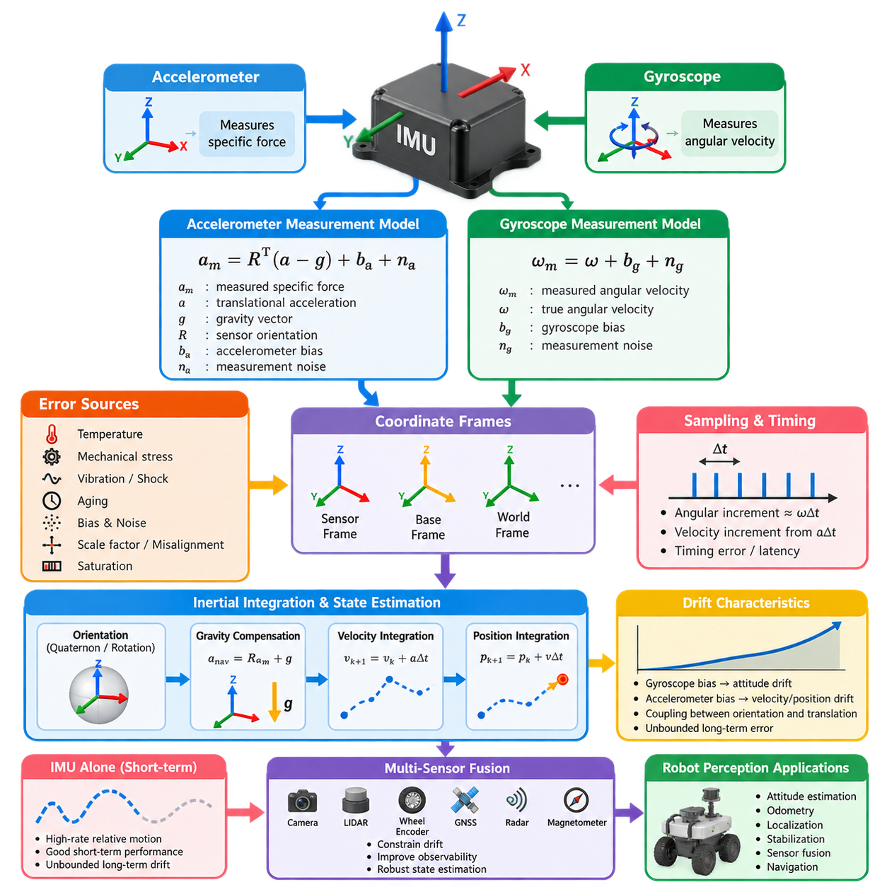{width="7.268055555555556in" height="7.268055555555556in"}

관성 측정 장치(Inertial Measurement Unit, IMU)는 비력(specific force)과 각속도(angular velocity)를 측정하여 로봇의 단기적인 움직임(short-term motion)을 간결하게 표현한다. 두 가지 핵심 감지 요소는 가속도계(accelerometer)와 자이로스코프(gyroscope)이며, 일반적으로 각각 서로 직교하는 3개의 축으로 구성된다. 두 센서는 함께 6자유도(six-degree-of-freedom, 6DoF) 관성 관측값을 생성하며, 이는 로봇 인지 시스템(robot perception system)의 자세 추정(attitude estimation), 오도메트리(odometry), 위치 추정(localization), 안정화(stabilization), 센서 융합(sensor fusion)을 지원한다.

이상적인 3축 자이로스코프(three-axis gyroscope)는 관성 기준 좌표계(inertial reference frame)에 대한 센서 본체(sensor body)의 각속도를 측정하며, 그 결과는 IMU 본체 좌표계(body coordinate frame)에서 표현된다. 실제 각속도를 ω라고 하면 실제 측정값은 ω_m = ω + b_g + n_g로 모델링할 수 있다. 여기서 b_g는 자이로스코프 바이어스(gyroscope bias), n_g는 측정 잡음(measurement noise)을 나타낸다. 이 간단한 방정식은 대부분의 관성 상태 추정(inertial state estimation) 모델의 기초가 된다.

자이로스코프 바이어스(gyroscope bias)는 각속도를 시간에 대해 적분하여 자세(orientation)를 추정하기 때문에 특히 중요하다. 매우 작은 일정한 오프셋(offset)도 지속적으로 증가하는 자세 오차(attitude error)를 발생시킨다. 실제 MEMS 자이로스코프(MEMS gyroscope)는 온도, 기계적 응력(mechanical stress), 노화(aging), 확률적 과정(stochastic process)으로 인해 천천히 변화하는 바이어스도 가진다. 따라서 실제 추정기(estimator)는 자이로스코프 바이어스를 초기 보정하고 운용 중에도 지속적으로 추정해야 하는 상태 변수(state)로 취급한다.

가속도계(accelerometer)는 일반적인 운동학적 가속도(kinematic acceleration)를 직접 측정하지 않는다. 대신 센서에 작용하는 비중력 힘(non-gravitational force)을 단위 질량당 표현한 비력(specific force)을 측정한다. 일반적인 모델은 a_m = Rᵀ(a − g) + b_a + n_a로 표현된다. 여기서 a는 기준 좌표계에서의 병진 가속도(translational acceleration), g는 중력 벡터(gravity vector), R은 센서 자세(sensor orientation), b_a와 n_a는 각각 가속도계 바이어스(accelerometer bias)와 측정 잡음(measurement noise)을 나타낸다.

이러한 차이는 관성 감지(inertial sensing)의 중요한 특성을 설명한다. 수평면에 정지해 있는 가속도계는 일반적으로 수직 감지축(vertical sensing axis)을 따라 0이 아니라 약 1g의 중력 가속도(gravitational acceleration)를 출력한다. 지지면(supporting surface)이 중력에 반대되는 힘을 발생시키며 가속도계는 이 비력(specific force)을 감지하기 때문이다. 따라서 측정값을 올바르게 해석하려면 센서 자세와 좌표계(coordinate frame), 중력 방향(gravity direction)에 대한 일관된 규약이 필요하다.

가속도계(accelerometer)와 자이로스코프(gyroscope)는 서로 상호보완적인 특성을 가진다. 자이로스코프 측정값은 회전 운동(rotational motion)에 대해 빠르고 국부적으로 부드러운 정보를 제공하지만 적분 과정에서 드리프트(drift)가 누적된다. 가속도계 측정값에는 중력 및 병진 운동(translational dynamics)에 관한 정보가 포함되지만 로봇의 가속, 진동(vibration), 충격(impact), 센서 잡음에 크게 영향을 받는다. 따라서 신뢰할 수 있는 관성 인지(inertial perception)를 위해서는 로봇의 운동 상태에 따라 두 신호를 함께 해석해야 한다.

좌표계(coordinate frame)는 측정 모델(measurement model)의 핵심 요소이다. 원시 IMU 측정값(raw IMU measurement)은 일반적으로 센서 패키지의 물리적 구조와 장착 방향에 의해 결정되는 센서 고정 좌표계(sensor-fixed frame)에서 표현된다. 반면 로봇 알고리즘은 베이스(base), 차량(vehicle), 월드(world), 맵(map), 항법 좌표계(navigation frame)에서 동작할 수 있다. 잘못된 축 방향, 좌표계 손잡이 규약(handedness convention), 장착 변환(mounting transformation)은 체계적인 추정 오차를 발생시키므로 좌표계 사이의 회전 관계를 명확하게 정의해야 한다.

보다 현실적인 가속도계 모델(accelerometer model)은 이상적인 방정식에 스케일 계수 오차(scale-factor error), 축 정렬 오차(axis misalignment), 교차축 감도(cross-axis sensitivity), 비선형 효과(nonlinear effect)를 추가한다. 개념적으로 a_m = M_a Rᵀ(a − g) + b_a + n_a로 표현할 수 있으며, M_a는 3축 센서의 기하학적 구조와 이득(gain)의 불완전성을 나타낸다. 자이로스코프에도 동일한 종류의 항을 적용하여 관성 측정값이 추정기에 입력되기 전에 보정(calibration)을 통해 체계적 오차를 식별할 수 있다.

바이어스(bias)와 잡음(noise)은 서로 다른 영향을 미치므로 하나의 오차 원인으로 취급해서는 안 된다. 바이어스는 지속적이거나 천천히 변화하는 오프셋을 발생시키는 반면, 측정 잡음은 실제 신호 주변에서 빠르고 무작위적인 변화를 만든다. 바이어스 불안정성(bias instability), 랜덤 워크(random walk), 양자화(quantization), 온도 의존성(temperature dependence), 진동 민감도(vibration sensitivity), 샘플링 효과(sampling effect)도 실제 IMU의 특성을 결정한다. 이러한 통계적 특성은 관성 관측값에 부여되는 불확실성(uncertainty)을 결정한다.

샘플링 시간(sampling time) 역시 측정 모델의 필수 요소이다. 관성 항법(inertial navigation)은 측정값을 적분하여 운동 상태를 계산하기 때문이다. 샘플링 간격을 Δt라고 하면 각도 증분(angular increment)은 대략 ωΔt와 관련되며, 속도 증분(velocity increment)은 동일한 시간 간격 동안의 가속도로부터 계산된다. 따라서 타이밍 오차(timing error), 불규칙한 샘플링, 패킷 지연(packet latency), 부정확한 타임스탬프(timestamp)는 센서 자체가 정상적으로 동작하더라도 운동 추정 오차로 나타날 수 있다.

임의의 3차원 운동에서 세 개의 오일러 각속도(Euler-angle rate)를 단순히 적분하는 방식으로 자세를 안전하게 갱신할 수는 없다. 실제 시스템에서는 일반적으로 회전 행렬(rotation matrix)이나 단위 쿼터니언(unit quaternion)을 사용하여 자세를 표현하고, 자이로스코프 관측값을 이용하여 회전 다양체(rotation manifold)상에서 자세를 전파한다. 추정된 자세를 이용하면 측정된 비력을 항법 좌표계로 변환하고, 중력을 보상한 후 병진 가속도를 속도와 위치로 적분할 수 있다.

가속도계 적분(accelerometer integration)은 특히 자세 오차(attitude error)에 민감하다. 추정된 중력 방향이 조금이라도 부정확하면 약 9.81 m/s²에 해당하는 중력 가속도의 일부가 수평 운동으로 잘못 해석된다. 이렇게 발생한 가짜 가속도(false acceleration)는 속도로 적분되고 다시 위치로 적분되면서 빠른 드리프트를 발생시킨다. 이러한 자세와 병진 운동 사이의 결합(coupling)은 최종 목표가 위치 추정이라 하더라도 정확한 자이로스코프 모델링이 중요한 이유 중 하나이다.

로봇에 사용되는 MEMS IMU는 기계적으로 매우 가혹한 환경에서 동작한다. 휠 진동(wheel vibration), 구동계 고조파(drivetrain harmonics), 서스펜션 충격(suspension impact), 매니퓰레이터 운동(manipulator motion), 프로펠러 진동(propeller vibration), 구조 공진(structural resonance), 충격(shock)은 측정값을 오염시키거나 센서 측정 범위를 초과하게 만들 수 있다. 특히 포화(saturation)가 발생하면 측정값이 실제 운동을 더 이상 나타내지 못하므로 적절한 가속도계와 자이로스코프 측정 범위를 선택할 때 동적 범위(dynamic range), 분해능(resolution), 잡음 성능 사이의 균형을 고려해야 한다.

추정기(estimator)에 제공되는 측정 공분산(measurement covariance)은 임의의 상수가 아니라 실제 센서 특성을 반영해야 한다. 가속도계와 자이로스코프의 잡음 밀도(noise density)는 정지 상태의 측정 기록으로 특성화할 수 있으며, 장시간 데이터에서는 바이어스 불안정성과 랜덤 워크 특성을 분석할 수 있다. 이러한 매개변수는 칼만 필터(Kalman filter), 팩터 그래프(factor graph), 사전 적분(pre-integration) 알고리즘 및 기타 확률적 추정(probabilistic estimation) 프레임워크에서 프로세스 및 측정 불확실성으로 사용된다.

IMU는 단독으로도 높은 주기의 상대 운동(relative motion) 정보를 제공하지만 일반적으로 장시간에 걸쳐 오차가 제한된 위치와 헤딩(heading)을 제공하지는 못한다. 적분 과정에서 작은 측정 오차가 점차 큰 상태 오차로 확대되며, 중력만으로는 자세 관측 가능성(orientation observability)이 제한된다. 따라서 카메라(camera), 라이다(LiDAR), 휠 인코더(wheel encoder), 위성항법시스템(GNSS), 레이더(radar), 자기계(magnetometer), 외부 기준(external reference) 등을 관성 측정값과 융합하여 드리프트를 억제하고 전역적으로 의미 있는 운동 상태를 복원한다.

따라서 측정 모델(measurement model)은 이후의 관성 인지 파이프라인(inertial perception pipeline)을 구성하는 기초가 된다. 보정(calibration)은 내부 및 외부 매개변수(intrinsic and extrinsic parameters)를 추정하고, 사전 적분(pre-integration)은 최적화 상태 사이의 고주기 샘플을 요약하며, 자세 필터(attitude filter)는 관성 관측값과 기준 정보를 결합한다. 이후 관성 오도메트리(inertial odometry)가 로봇 운동을 전파하고, 다중 센서 융합(multi-sensor fusion) 단계에서는 모델링된 측정값과 그 불확실성을 이용하여 강건한 상태 추정(robust state estimation)을 수행한다.

## 05.02. IMU Calibration Intrinsic and Extrinsic [w/Code]

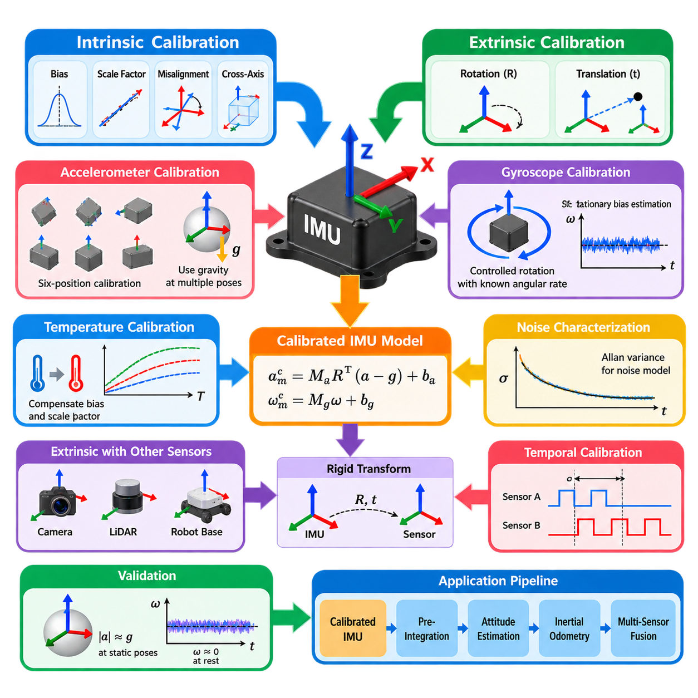{width="7.268055555555556in" height="7.268055555555556in"}

내부 보정(Intrinsic Calibration)은 IMU 자체 내부에서 발생하는 오차를 특성화하는 과정이며, 외부 보정(Extrinsic Calibration)은 IMU가 로봇 또는 다른 센서와 기하학적으로 어떤 관계를 갖는지를 결정하는 과정이다. 두 보정 모두 매우 중요하다. 관성 측정값(Inertial Measurement)은 시간에 따라 적분되므로 개별 샘플에서는 미미해 보이는 작은 체계적 오차(Systematic Error)도 누적되면서 자세(Attitude), 속도(Velocity), 위치(Position) 추정에서 상당한 오차를 발생시킬 수 있다.

실제적인 내부 모델(Intrinsic Model)은 이상적인 가속도계(Accelerometer)와 자이로스코프(Gyroscope) 방정식에 바이어스(Bias), 스케일 계수 오차(Scale-Factor Error), 축 정렬 오차(Axis Misalignment), 교차축 결합(Cross-Axis Coupling)을 추가한다. 완벽하게 직교하는 3개의 감지축과 동일한 이득(Gain)을 가정하는 대신, 보정 과정에서는 원시 센서 출력(Raw Sensor Output)을 보정된 물리 측정값으로 변환하는 행렬을 도입한다. 이러한 매개변수는 단순한 오프셋 제거만으로는 신뢰성 있게 제거하기 어려운 제조 공차(Manufacturing Tolerance)와 센서의 불완전성을 나타낸다.

가속도계 바이어스(Accelerometer Bias)는 IMU가 정지해 있는 동안 수집한 측정값으로 초기 추정할 수 있다. 예상되는 비력(Specific Force)의 크기는 대략 중력(Gravity)과 같으므로 여러 정적 자세(Static Orientation)에서 얻은 측정값을 이용하면 바이어스, 스케일 계수, 축 정렬 오차를 분리하여 추정할 수 있다. 따라서 6자세 보정(Six-Position Calibration) 또는 다중 자세 보정(Multi-Orientation Calibration)은 센서를 서로 다른 알려진 자세로 회전시키고, 보정된 측정값이 중력 모델(Gravity Model)을 만족하도록 매개변수를 최적화한다.

자이로스코프 바이어스(Gyroscope Bias)는 실제 각속도(True Angular Velocity)가 0에 가까워야 하는 정지 구간에서 일반적으로 추정된다. 많은 샘플을 평균하면 고주파 측정 잡음(High-Frequency Measurement Noise)을 억제하면서 거의 일정한 바이어스 성분을 확인할 수 있다. 보다 완전한 보정에서는 알려진 각속도를 이용한 제어된 회전(Controlled Rotation)을 수행하여 스케일 계수와 교차축 오차를 식별한다. 이렇게 얻은 보정값은 원시 자이로스코프 출력을 보다 정확한 본체 각속도(Body Angular Velocity)로 변환한다.

온도(Temperature)는 MEMS 관성 센서(MEMS Inertial Sensor)에 큰 영향을 미치며 바이어스와 스케일 계수를 모두 변화시킬 수 있다. 따라서 실온에서 얻은 보정값은 로봇 내부 온도가 상승하거나 실외 환경에서 운용될 경우 정확도가 떨어질 수 있다. 열 보정(Thermal Calibration)은 예상 운용 온도 범위에서 가속도계와 자이로스코프의 동작 특성을 기록하고, 측정된 센서 온도에 따라 보정 매개변수를 수정할 수 있는 보상 함수(Compensation Function) 또는 룩업 모델(Lookup Model)을 구성한다.

잡음(Noise)은 결정론적 보정(Deterministic Calibration)을 통해 완전히 제거할 수 없지만 통계적 특성은 반드시 파악해야 한다. 정지 상태의 데이터셋을 이용하면 단기 측정 분산(Short-Term Measurement Variance)을 추정할 수 있으며, 장시간 기록을 이용하면 바이어스 불안정성(Bias Instability)과 랜덤 워크(Random Walk) 특성을 분석할 수 있다. 앨런 분산(Allan Variance) 또는 앨런 편차(Allan Deviation) 분석은 주요 확률적 오차 과정(Stochastic Error Process)을 구분하고 칼만 필터(Kalman Filter), 사전 적분(Pre-Integration) 모델, 확률적 추정기(Probabilistic Estimator)에 필요한 매개변수를 얻는 데 널리 사용된다.

외부 보정(Extrinsic Calibration)은 이와 다른 문제를 다룬다. IMU의 감지 좌표계(Sensing Frame)는 일반적으로 로봇의 기준 좌표계(Reference Frame)와 완벽하게 일치하지 않는다. 센서는 로봇 원점(Robot Origin)에서 떨어진 위치에 설치될 수 있으며 기계적인 장착 방향으로 인해 회전되어 있을 수도 있다. 이러한 강체 변환(Rigid Transformation)은 IMU 좌표계와 인지 및 위치 추정 시스템에서 사용하는 로봇 베이스(Base), 차량(Vehicle), 카메라(Camera), 라이다(LiDAR), 항법 좌표계(Navigation Frame) 사이의 회전과 병진으로 표현된다.

회전 외부 오차(Rotational Extrinsic Error)는 측정된 가속도와 각속도가 해석되는 방향 자체를 변화시키므로 특히 중요하다. 작은 장착 각도 오차(Mounting-Angle Error)만 존재해도 중력 성분이 잘못된 축으로 투영되어 실제로 존재하지 않는 인공적인 가속도(Artificial Acceleration)를 생성할 수 있다. 따라서 중력 보상(Gravity Compensation), 관성 전파(Inertial Propagation), 다중 센서 융합(Multi-Sensor Fusion)을 일관되게 수행하려면 IMU와 로봇 본체 좌표계 사이의 회전을 정확하게 추정해야 한다.

IMU와 로봇 기준점 사이의 병진(Translation)은 플랫폼이 회전할 때 중요해진다. 회전 중심(Rotation Center)에서 떨어진 위치에 장착된 IMU에는 레버 암(Lever Arm)에 의해 추가적인 구심 가속도(Centripetal Acceleration)와 접선 가속도(Tangential Acceleration)가 발생한다. 느리게 움직이는 소형 플랫폼에서는 이러한 변위를 무시할 수도 있지만, 빠르게 회전하는 로봇, 무인항공기(UAV), 매니퓰레이터(Manipulator), 대형 차량 또는 본체 원점에서 멀리 떨어진 위치에 센서가 장착된 시스템에서는 상당한 오차를 발생시킬 수 있다.

카메라-IMU 보정(Camera--IMU Calibration)은 카메라 광학 좌표계(Camera Optical Frame)와 IMU 좌표계 사이의 강체 변환을 추정하며, 시간 오프셋(Temporal Offset)을 동시에 추정하는 경우도 많다. 충분히 다양한 회전 및 병진 운동을 수행하면 시각 특징 궤적(Visual Feature Trajectory)이 기하학적 제약 조건을 제공하고 관성 측정값은 고주기 운동 정보를 제공한다. 이후 최적화를 통해 시각 정보와 관성 정보가 표현하는 운동이 서로 일관되도록 하는 변환 관계를 결정한다.

라이다-IMU 보정(LiDAR--IMU Calibration)도 동일한 기하학적 원리를 따르지만 3차원 포인트 클라우드 정합(3D Point-Cloud Registration) 또는 라이다 오도메트리(LiDAR Odometry)에서 운동 제약 조건을 얻는다. 보정 과정은 라이다 좌표계와 IMU 좌표계를 연결하는 회전과 병진을 추정하여 두 센서가 계산한 운동이 서로 일치하도록 한다. 특히 라이다-관성 오도메트리(LiDAR-Inertial Odometry)에서는 작은 회전 정렬 오차만으로도 스캔 보상(Scan Compensation)과 지도 일관성(Map Consistency)이 저하될 수 있으므로 정확한 외부 매개변수가 중요하다.

시간 보정(Temporal Calibration)은 공간적 외부 보정(Spatial Extrinsic Calibration)과 함께 고려해야 한다. 카메라 프레임(Camera Frame), 라이다 스캔(LiDAR Scan), 인코더 메시지(Encoder Message), 위성항법시스템 관측값(GNSS Observation), IMU 샘플은 서로 다른 클록(Clock)이나 통신 경로에서 생성될 수 있다. 타임스탬프 오프셋(Timestamp Offset)이 존재하면 서로 다른 물리적 시점의 측정값을 동시에 발생한 것처럼 융합하게 된다. 빠른 운동에서는 이러한 시간 정렬 오차(Temporal Misalignment)가 공간적 보정 오차처럼 나타나면서 추정 성능을 크게 저하시킬 수 있다.

보정 동작(Calibration Motion)은 추정하려는 매개변수가 충분히 관측될 수 있도록 다양한 운동을 포함해야 한다. 하나의 축만을 중심으로 회전하거나 주로 직선 운동만 수행하면 일부 보정 변수가 충분히 관측되지 않을 수 있다. 좋은 보정 절차는 여러 축을 중심으로 한 회전을 포함하며, 병진 매개변수를 추정해야 하는 경우 충분히 다양한 병진 가속도(Translational Acceleration)도 포함한다. 따라서 최적화 품질은 보정 알고리즘뿐 아니라 보정 데이터 수집에 사용되는 궤적(Trajectory)에 의해서도 결정된다.

보정 매개변수(Calibration Parameter)는 일반적으로 비선형 최소제곱 최적화(Nonlinear Least-Squares Optimization), 필터링(Filtering), 전용 배치 보정 알고리즘(Batch-Calibration Algorithm)을 통해 추정된다. 잔차(Residual)는 센서 관측값을 알려진 물리적 제약 조건 또는 운동 추정값과 비교하며, 최적화기는 바이어스, 스케일 계수, 정렬 오차, 좌표 변환, 경우에 따라 시간 오프셋까지 조정한다. 이후 매개변수 공분산(Parameter Covariance) 또는 잔차 통계를 이용하여 데이터셋이 신뢰할 수 있는 해를 얻기에 충분한 정보를 제공했는지 판단할 수 있다.

검증(Validation)은 매개변수 추정과 독립적으로 수행해야 한다. 보정된 정지 상태의 가속도계 측정값은 다양한 자세에서 예상되는 중력 크기를 재현해야 하며, 보정된 정지 상태의 자이로스코프 출력은 0에 가까운 값을 유지해야 한다. 외부 보정에서는 서로 연결된 센서들이 독립적으로 복원한 운동이 좌표 변환 이후 서로 일치해야 한다. 잔차 패턴(Residual Pattern)을 분석하면 남아 있는 축 오차, 타임스탬프 오프셋, 진동 영향 또는 낮은 관측 가능성(Poor Observability)을 찾아낼 수 있다.

양산 로봇(Production Robot)에서는 보정을 일회성 실험실 절차가 아니라 지속적으로 관리해야 한다. 센서 교체, 기계적 충격, 장착 상태 변경, 온도 사이클(Temperature Cycle), 구조적 변형(Structural Deformation), 장기간의 노화는 기존에 추정된 매개변수를 무효화할 수 있다. 따라서 보정값은 하드웨어 구성(Hardware Configuration)과 함께 버전 관리되어야 하며, 유지보수 과정에서 점검하고 운용 진단(Operational Diagnostics)을 통해 관성 센서의 특성 변화를 감시함으로써 항법 성능에 영향을 주기 전에 문제를 탐지해야 한다.

강건한 관성 인지 파이프라인(Robust Inertial Perception Pipeline)은 IMU 측정값이 상위 수준의 추정 과정으로 전달되기 전에 내부 보정, 열 보상(Thermal Compensation), 공간적 외부 보정, 시간 정렬(Temporal Alignment), 불확실성 특성화(Uncertainty Characterization)를 통합한다. 이렇게 보정된 측정값은 IMU 사전 적분(IMU Pre-Integration), 자세 추정(Attitude Estimation), 관성 오도메트리(Inertial Odometry), 다중 센서 융합의 기반을 제공하며, 이는 이후 IMU 및 관성 인지 아키텍처(Inertial Perception Architecture)를 구성하는 핵심 단계로 이어진다.

## 05.03. IMU Pre Integration Theory and Implementation [w/Code]

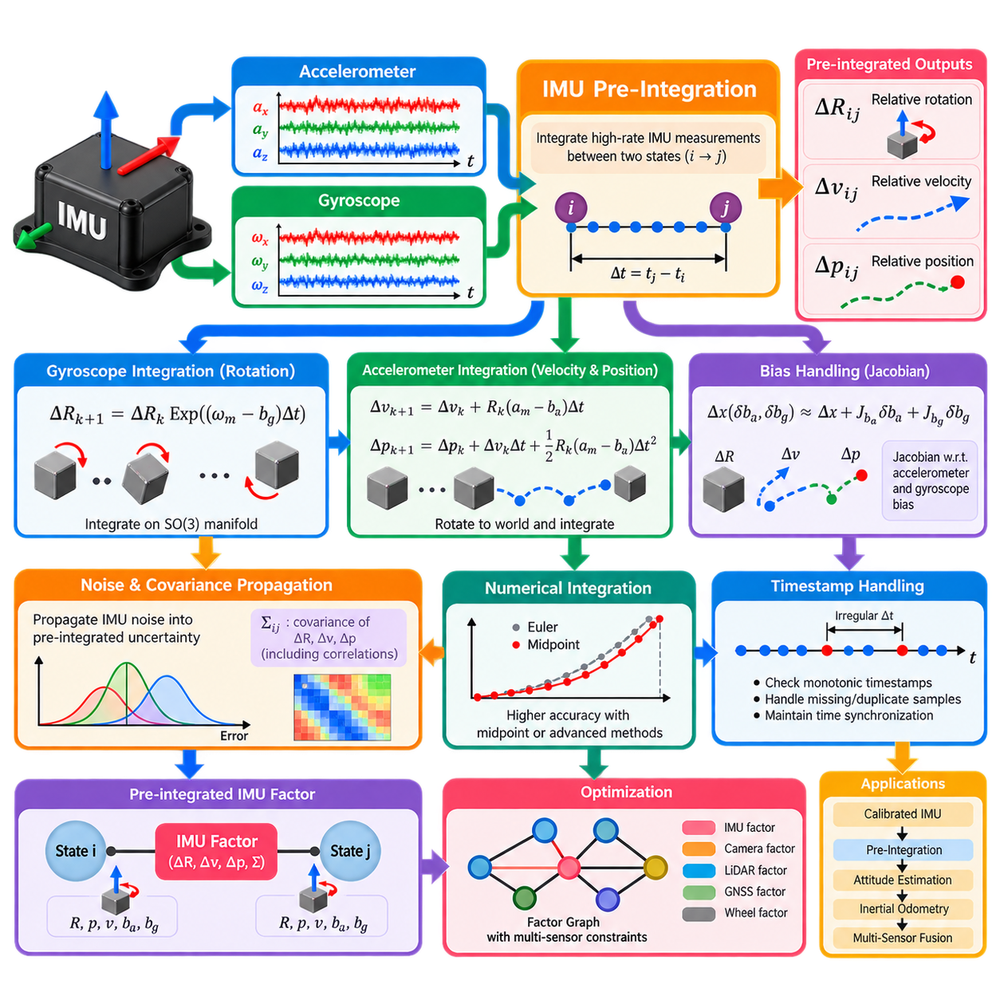{width="7.268055555555556in" height="7.268055555555556in"}

IMU 사전 적분(IMU Pre-Integration)은 다수의 고주기 관성 측정값(High-Rate Inertial Measurements)을 두 개의 추정 상태(Estimation State) 사이에 존재하는 간결한 상대 운동 제약(Relative-Motion Constraint)으로 요약하는 계산 기법이다. IMU는 초당 수백 또는 수천 개의 샘플로 동작할 수 있지만 카메라(Camera), 라이다(LiDAR), 위성항법시스템(GNSS) 또는 최적화 상태(Optimization State)는 훨씬 낮은 주기로 갱신된다. 따라서 반복적인 최적화 과정에서 모든 관성 샘플을 직접 처리하면 불필요한 계산 비용이 발생한다.

기본적인 개념은 일반적으로 i와 j로 표시되는 두 시점 사이에서 가속도계(Accelerometer)와 자이로스코프(Gyroscope) 측정값을 국부적으로 적분하는 것이다. 전체 전역 항법 상태(Global Navigation State)를 반복적으로 전파하는 대신, 사전 적분은 회전(Rotation), 속도(Velocity), 위치(Position)의 상대적인 변화를 구성한다. 이러한 값은 일반적으로 ΔRᵢⱼ, Δvᵢⱼ, Δpᵢⱼ로 표현되며 해당 시간 구간에서 누적된 관성 운동을 요약한다.

자이로스코프 측정값은 주로 상대 회전 증분(Relative Rotation Increment)을 결정한다. 추정된 자이로스코프 바이어스(Gyroscope Bias)를 제거한 후 각속도(Angular Velocity)를 3차원 회전 다양체(Rotation Manifold)상에서 적분한다. 개념적으로 각각의 작은 증분은 ΔRₖ₊₁ = ΔRₖ Exp((ωₘ − b_g)Δt)에 따라 누적 회전을 갱신하며, 여기서 Exp는 회전 벡터(Rotation Vector)를 유효한 회전 행렬(Rotation Matrix) 또는 이에 상응하는 쿼터니언(Quaternion) 표현으로 변환한다.

가속도계 측정값은 속도와 위치 증분 모두에 기여한다. 가속도는 움직이는 IMU 좌표계(IMU Frame)에서 측정되기 때문에 보정된 각각의 가속도계 샘플은 적분 전에 누적된 상대 자세(Relative Orientation)를 이용하여 회전 변환되어야 한다. 사전 적분된 속도(Pre-Integrated Velocity)는 시간에 따라 가속도를 누적하고, 위치 증분(Position Increment)은 현재의 속도 증분과 각 샘플링 구간에서 발생하는 가속도 성분을 모두 포함하여 두 번째 적분을 수행한다.

사전 적분의 주요 장점은 생성된 상대 측정값(Relative Measurement)이 해당 구간 시작 시점의 전역 위치(Global Position), 속도, 자세와 상당 부분 독립적으로 구성될 수 있다는 것이다. 중력(Gravity)과 초기 항법 상태(Initial Navigation State)는 이후 사전 적분 제약을 평가할 때 적용된다. 이러한 분리를 통해 최적화기는 매 반복마다 모든 원시 IMU 샘플(Raw IMU Sample)을 다시 적분하지 않고도 전역 상태를 반복적으로 변경할 수 있다.

사전 적분된 값은 가속도계 및 자이로스코프의 바이어스 추정값에 의존하므로 바이어스 처리(Bias Handling)는 여전히 중요하다. 바이어스 추정값이 변경될 때마다 전체 적분을 다시 수행하면 계산 효율성이 감소한다. 따라서 실제 공식화에서는 자이로스코프와 가속도계 바이어스의 작은 변화에 따라 ΔR, Δv, Δp가 어떻게 변화하는지를 나타내는 야코비안(Jacobian)을 전파하여 최적화 과정에서 1차 바이어스 보정(First-Order Bias Correction)을 수행할 수 있도록 한다.

바이어스 추정값이 사전 적분에 사용했던 값에서 변경되면 저장된 증분은 이러한 야코비안을 이용하여 근사적으로 보정할 수 있다. 회전은 자이로스코프 바이어스와 관련된 보정을 받으며, 속도와 위치는 가속도계 및 자이로스코프 바이어스 모두의 영향을 받는다. 바이어스 변화가 너무 커져 선형 근사(Linear Approximation)의 정확성이 유지되지 못하는 경우에는 갱신된 바이어스 추정값을 사용하여 원시 IMU 시퀀스를 다시 적분할 수 있다.

측정 불확실성(Measurement Uncertainty) 역시 사전 적분 과정 전체에서 전파되어야 한다. 가속도계와 자이로스코프의 잡음(Noise)은 모든 적분 단계에 유입되며 상대 회전, 속도, 위치의 불확실성으로 누적된다. 따라서 명목 사전 적분값(Nominal Pre-Integrated Quantities)과 함께 공분산 행렬(Covariance Matrix)을 전파한다. 이 공분산은 각각의 개별 불확실성뿐 아니라 적분 과정에서 생성되는 회전, 속도, 위치 오차 사이의 상관관계(Correlation)도 표현한다.

오차 상태 공식화(Error-State Formulation)는 이러한 불확실성을 효율적으로 전파하는 방법을 제공한다. 전체 비선형 상태(Nonlinear State)에 대한 불확실성을 직접 표현하는 대신, 명목 회전, 속도, 위치 증분을 중심으로 작은 섭동(Perturbation)을 정의한다. 선형화된 상태 전이 행렬(State-Transition Matrix)과 잡음 주입 행렬(Noise-Injection Matrix)은 IMU 샘플에서 다음 샘플로 공분산을 전파하여 최종 관성 제약(Inertial Constraint)에 통계적 가중치를 부여하는 데 필요한 불확실성을 생성한다.

사전 적분은 3차원 회전의 기하학적 특성을 고려해야 한다. SO(3)는 비선형 다양체(Nonlinear Manifold)이므로 일반적인 벡터 덧셈만으로 회전을 누적할 수 없다. 따라서 회전 행렬, 단위 쿼터니언(Unit Quaternion), 지수 사상(Exponential Map), 로그 사상(Logarithmic Map)이 일반적으로 사용된다. 다양체를 고려한 적분(Manifold-Aware Integration)은 특히 크거나 복잡한 회전 운동에서 자세를 제약되지 않은 유클리드 벡터(Euclidean Vector)로 취급할 때 발생할 수 있는 불일치를 방지한다.

수치 적분(Numerical Integration)의 품질은 적분 방법과 IMU 샘플링 주기(Sampling Rate)에 따라 달라진다. 샘플링 간격이 매우 짧다면 단순한 오일러 적분(Euler Integration)도 충분할 수 있지만, 중점 적분(Midpoint Integration)은 인접한 샘플의 정보를 함께 사용하여 정확도를 향상시킬 수 있다. 더욱 정교한 방법을 사용하면 이산화 오차(Discretization Error)를 추가로 감소시킬 수 있지만 계산 복잡도와 센서 주기, 운동 동역학(Motion Dynamics), 로봇의 정확도 요구사항 사이의 균형을 고려해야 한다.

타임스탬프 정확도(Timestamp Accuracy)는 수치 계산식만큼 중요하다. 각각의 적분 간격 Δt는 IMU 타임스탬프에서 계산되므로 샘플 누락(Missing Sample), 중복 타임스탬프(Duplicated Timestamp), 클록 드리프트(Clock Drift), 통신 지연(Communication Latency), 불규칙한 샘플링은 누적된 운동을 직접 왜곡한다. 따라서 구현 과정에서는 타임스탬프의 단조성(Timestamp Monotonicity)을 검증하고 비정상적인 시간 간격을 감지하며, IMU와 최적화 키프레임(Optimization Keyframe)을 정의하는 다른 센서 사이의 일관된 시간 동기화(Time Synchronization)를 유지해야 한다.

팩터 그래프(Factor Graph) 시스템에서 사전 적분된 IMU 측정값은 연속된 로봇 상태를 연결하는 관성 팩터(Inertial Factor)가 된다. 각 상태는 자세, 위치, 속도, IMU 바이어스 변수를 포함할 수 있다. 관성 팩터는 누적된 관성 측정값을 기반으로 상태 i가 상태 j로 어떻게 변화해야 하는지를 예측하고, 잔차(Residual)는 이 예측값과 현재 상태 추정값 사이의 차이를 표현한다. 전파된 공분산은 이러한 잔차의 가중치를 결정한다.

회전 잔차(Rotation Residual)는 추정된 상대 자세와 ΔRᵢⱼ를 비교하며, 속도 및 위치 잔차는 중력과 경과 시간(Elapsed Time)을 고려한 후 상태 차이를 해당 사전 적분 증분과 비교한다. 바이어스 변화는 랜덤 워크 제약(Random-Walk Constraint)을 통해 추가로 표현할 수 있다. 이후 최적화 과정에서는 이러한 관성 잔차를 카메라, 라이다, 위성항법시스템, 휠 오도메트리(Wheel Odometry) 또는 기타 센서 제약과 결합하여 일관된 궤적(Consistent Trajectory)을 추정한다.

구현에서는 일반적으로 현재 시간 구간에 대한 사전 적분 객체(Pre-Integration Object)를 유지한다. 각각의 IMU 샘플이 입력되면 알고리즘은 현재 바이어스 추정값을 제거하고 상대 회전을 갱신하며 속도와 위치 증분을 적분하고 야코비안을 전파하면서 공분산을 갱신한다. 새로운 카메라 프레임, 라이다 키프레임(LiDAR Keyframe), 최적화 상태가 생성되면 누적된 객체를 확정하고 해당 상태 사이를 연결하는 제약 조건으로 사용한다.

실시간 시스템(Real-Time System)은 흔히 서로 연관된 두 개의 전파 경로(Propagation Path)를 유지한다. 하나의 사전 적분기는 제어(Control) 또는 오도메트리 출력을 위한 고주기 상태 예측(High-Rate State Prediction)을 제공하고, 다른 사전 적분기는 그래프 최적화(Graph Optimization)를 위한 측정값을 누적한다. 최적화된 상태와 바이어스를 사용할 수 있게 되면 실시간 전파 경로를 보정된 상태에서 재설정하고 다시 전파할 수 있다. 이러한 아키텍처는 저지연 관성 예측(Low-Latency Inertial Prediction)과 전역적으로 보정된 다중 센서 추정(Global Multi-Sensor Estimation)을 결합한다.

따라서 IMU 사전 적분은 고주기 관성 감지(High-Frequency Inertial Sensing)와 상대적으로 낮은 주기의 확률적 상태 추정(Probabilistic State Estimation)을 연결하는 가교 역할을 한다. 대량의 가속도계 및 자이로스코프 샘플을 압축하면서 상대 운동, 바이어스 민감도(Bias Sensitivity), 불확실성을 보존한다. 관성 인지 아키텍처(Inertial Perception Architecture)에서는 IMU 측정 모델링과 보정 이후에 자연스럽게 배치되며, 자세 추정(Attitude Estimation), 관성 오도메트리(Inertial Odometry), 다중 센서 융합(Multi-Sensor Fusion)을 위한 수학적 기반을 제공한다.

## 05.04. Attitude Estimation AHRS Mahony Madgwick EKF [w/Code]

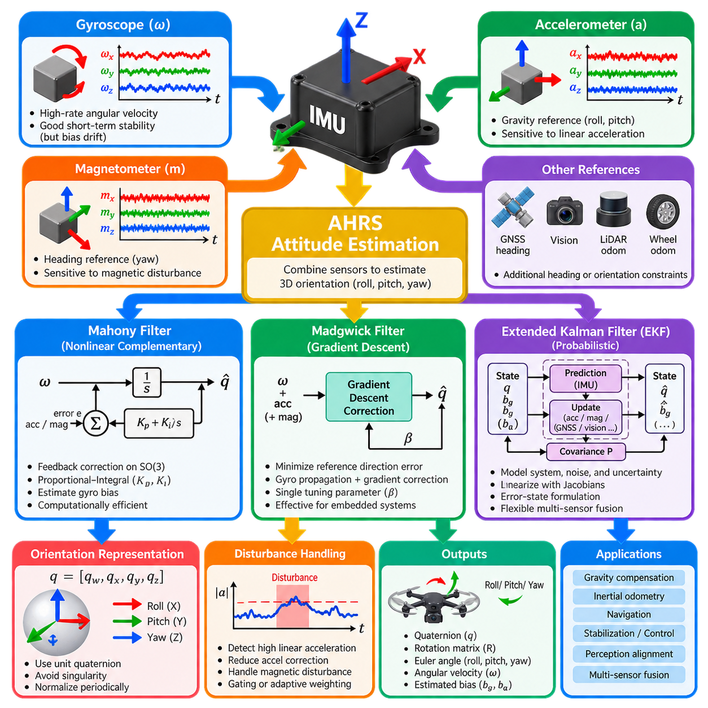{width="7.268055555555556in" height="7.268055555555556in"}

자세 추정(Attitude Estimation)은 기준 좌표계(Reference Frame)에 대한 로봇 또는 센서 본체의 3차원 방향(Three-Dimensional Orientation)을 결정하는 과정이다. 일반적으로 AHRS라고 하는 자세 및 방위 기준 시스템(Attitude and Heading Reference System)은 고주기 자이로스코프(Gyroscope) 측정값과 가속도계(Accelerometer)에서 얻은 중력 정보를 결합하고, 사용 가능한 경우 자기계(Magnetometer) 또는 기타 외부 기준(External Reference)의 헤딩 관측값을 이용하여 롤(Roll), 피치(Pitch), 요(Yaw)를 추정한다.

자이로스코프는 측정된 각속도(Angular Velocity)를 지속적으로 적분하여 자세를 전파할 수 있기 때문에 우수한 단기 회전 정보를 제공한다. 그러나 매우 작은 자이로스코프 바이어스(Gyroscope Bias)도 시간이 지남에 따라 증가하는 자세 드리프트(Orientation Drift)를 발생시킨다. 가속도계와 자기계는 이러한 드리프트를 보정할 수 있는 절대 방향 기준(Absolute Directional Reference)을 제공하지만, 병진 가속도(Translational Acceleration), 진동(Vibration), 자기 교란(Magnetic Disturbance), 환경적 간섭(Environmental Interference)의 영향을 받을 수 있다.

따라서 AHRS는 하나의 측정 소스에 의존하지 않고 서로 상호보완적인 센서 특성을 결합한다. 자이로스코프 데이터는 빠른 자세 변화에서 주요 역할을 하며, 가속도계 관측값은 롤과 피치를 위한 장기적인 중력 기준(Gravity Reference)을 제공한다. 자기계는 지구 자기장(Earth\'s Magnetic Field)을 관측하여 요에 대한 헤딩 기준(Heading Reference)을 제공할 수 있지만, 자기 교란이 존재하는 경우 측정값을 제거하거나 가중치를 조절하고 일시적으로 사용하지 않는 처리가 필요할 수 있다.

자세는 일반적으로 단위 쿼터니언(Unit Quaternion)을 사용하여 표현한다. 쿼터니언은 오일러 각(Euler Angle)에서 발생하는 특이점(Singularity)을 방지하면서 3차원 회전을 효율적으로 결합할 수 있기 때문이다. 쿼터니언은 자이로스코프가 측정한 각속도를 이용하여 전파하며 단위 길이 제약(Unit-Length Constraint)을 유지하도록 주기적으로 정규화한다. 회전 행렬(Rotation Matrix)도 널리 사용되며, 오일러 각은 주로 시각화, 인터페이스, 사람이 이해하기 위한 표현에 사용된다.

마호니 필터(Mahony Filter)는 회전 기하학(Rotational Geometry)상에서 직접 동작하는 비선형 상보 자세 관측기(Nonlinear Complementary Attitude Observer)이다. 자이로스코프 측정값을 사용하여 자세를 예측하고, 측정된 기준 방향과 현재 자세에서 예측한 방향 사이의 차이로부터 자세 오차(Attitude Error)를 구성한다. 이 오차를 피드백하여 쿼터니언 또는 회전 행렬을 적분하기 전에 각속도를 보정함으로써 계산 효율적인 폐루프 추정기(Closed-Loop Estimator)를 구성한다.

마호니 방식의 핵심적인 장점은 비례-적분 보정 구조(Proportional-Integral Correction Structure)에 있다. 비례 성분(Proportional Component)은 자세 불일치를 빠르게 보정하고, 적분 성분(Integral Component)은 천천히 변화하는 자이로스코프 바이어스를 추정할 수 있다. 적절한 이득(Gain)은 응답성과 잡음 민감도 사이의 균형을 결정한다. 보정이 지나치게 강하면 가속도계 교란에 민감하게 반응하고, 반대로 보정이 약하면 관성 드리프트가 더 오랫동안 지속될 수 있다.

매드윅 필터(Madgwick Filter) 역시 자이로스코프, 가속도계, 그리고 선택적으로 자기계 측정값을 사용하여 자세를 추정하지만, 기준 방향의 정렬을 최적화 문제(Optimization Problem)로 구성한다. 경사 하강법 보정 단계(Gradient-Descent Correction Step)는 측정된 중력 또는 자기장 방향과 예측된 방향 사이의 불일치를 나타내는 목적 함수(Objective)를 최소화한다. 이렇게 얻은 보정값을 자이로스코프 기반 쿼터니언 전파와 결합하여 갱신된 자세 추정값을 얻는다.

매드윅 필터링(Madgwick Filtering)은 비교적 적은 계산량으로 효과적인 자세 추정을 제공하므로 임베디드 시스템(Embedded System)과 자원이 제한된 시스템(Resource-Constrained System)에 적합하다. 주요 튜닝 매개변수(Tuning Parameter)는 자이로스코프 전파에 대한 경사 기반 보정의 크기를 결정한다. 강한 보정은 수렴성을 향상시키지만 교란된 기준 측정값에 대한 민감도를 증가시킬 수 있으며, 약한 보정은 보다 부드러운 동작을 제공하지만 드리프트 보정 속도가 느려진다.

마호니 필터와 매드윅 필터 모두 중요한 가정에 의존한다. 가속도계 측정값을 자세 기준으로 사용할 때 해당 측정값이 대략적으로 중력 방향(Gravity Direction)을 나타내야 한다는 것이다. 강한 병진 가속, 충격(Impact), 휠 진동(Wheel Vibration), 급격한 기동(Aggressive Maneuvering)이 발생하면 이러한 가정은 성립하지 않는다. 따라서 실제 구현에서는 가속도 크기 또는 일관성을 감시하고 동적 교란이 발생하는 구간에서는 가속도계 보정의 영향을 감소시킨다.

확장 칼만 필터(Extended Kalman Filter, EKF)는 시스템 상태(System State), 프로세스 동역학(Process Dynamics), 센서 관측값(Sensor Observation), 불확실성(Uncertainty)을 명시적으로 모델링하는 확률적 대안(Probabilistic Alternative)을 제공한다. 자세 EKF는 자이로스코프 바이어스와 함께 자세를 추정하고 필요에 따라 가속도계 바이어스 또는 기타 변수도 포함할 수 있다. 자이로스코프 측정값은 높은 주기로 상태를 전파하고, 가속도계, 자기계, 위성항법시스템(GNSS), 비전(Vision) 또는 기타 관측값은 사용 가능할 때 보정 갱신(Correction Update)을 제공한다.

자세 동역학과 센서 관측 방정식은 비선형이므로 EKF는 야코비안 행렬(Jacobian Matrix)을 사용하여 현재 추정값 주변에서 이를 선형화한다. 상태 공분산(State Covariance)은 예측 단계에서 프로세스 불확실성(Process Uncertainty)에 따라 전파되고, 측정 갱신 단계에서는 측정 불확실성(Measurement Uncertainty)에 따라 감소하거나 재구성된다. 이러한 확률적 구조를 통해 서로 다른 센서를 예상 정확도와 현재 측정 품질에 따라 체계적으로 가중할 수 있다.

많은 로봇 시스템에서는 제약되지 않은 쿼터니언을 기존의 가산 상태(Additive State)에 직접 포함하는 대신 오차 상태 EKF(Error-State EKF)를 사용한다. 명목 쿼터니언(Nominal Quaternion)은 현재 자세를 표현하고, 작은 3차원 회전 오차를 선형화된 오차 상태(Linearized Error State)로 유지한다. 각 보정 이후 이 작은 회전을 명목 자세에 주입하고 오차 상태를 재설정함으로써 3차원 회전의 기하학적 특성을 보다 자연스럽게 유지할 수 있다.

EKF에서 가속도계 보정은 측정된 비력 방향(Specific-Force Direction)과 현재 자세로부터 예측된 중력 방향을 비교한다. 대략적인 정지 상태 또는 저동적 조건(Low-Dynamic Condition)에서는 이를 통해 롤과 피치에 대한 높은 관측 가능성(Observability)을 확보할 수 있다. 그러나 상당한 선형 가속이 발생하면 측정값에 중력뿐 아니라 운동 가속도가 포함되므로 잘못된 자세 보정을 방지하기 위해 적응형 공분산(Adaptive Covariance), 이노베이션 게이팅(Innovation Gating), 측정값 거부(Measurement Rejection)가 필요할 수 있다.

요는 중력이 수직축을 중심으로 하는 회전에 대한 정보를 제공하지 않기 때문에 다른 관측 가능성 문제(Observability Problem)를 가진다. 따라서 자기계 또는 다른 헤딩 기준이 없다면 누적된 자이로스코프 오차에 따라 요 드리프트(Yaw Drift)가 발생한다. 모터, 철골 구조물, 전기 시스템, 철근 건물 주변에서 동작하는 로봇은 자기계를 신뢰하기 어려울 수 있으므로 비전, 라이다 오도메트리(LiDAR Odometry), GNSS 헤딩(GNSS Heading), 휠 운동(Wheel Motion), 지도 기반 위치 추정(Map-Based Localization) 등을 이용하여 헤딩을 제한할 수 있다.

이노베이션 감시(Innovation Monitoring)는 강건한 AHRS 동작을 위해 중요하다. 예측된 기준 측정값과 실제 관측값의 차이는 입력 데이터가 현재 상태 추정값과 일관성을 갖는지를 나타낸다. 큰 이노베이션은 가속도 교란, 자기 이상(Magnetic Anomaly), 센서 포화(Sensor Saturation), 잘못된 보정, 타이밍 문제를 의미할 수 있다. 강건한 구현에서는 의심스러운 측정값이 자세 추정값을 즉시 손상시키지 않도록 해당 측정값을 차단하거나 가중치를 낮춘다.

마호니, 매드윅, EKF 중 어떤 방법을 선택할지는 절대적인 성능 순위가 아니라 시스템 요구사항(System Requirements)에 따라 결정된다. 마호니는 효율적인 피드백 관측기(Feedback Observer) 구조를 제공하고, 매드윅은 간결한 경사 기반 보정(Gradient-Based Correction)을 제공하며, EKF는 명시적인 불확실성 전파(Uncertainty Propagation)와 유연한 다중 센서 통합(Multi-Sensor Integration)을 제공한다. 임베디드 제어기는 경량 필터를 선호할 수 있으며, 여러 비동기 센서를 사용하는 자율 로봇은 확률적 필터링 아키텍처(Probabilistic Filtering Architecture)에서 더 큰 이점을 얻을 수 있다.

양산 수준의 자세 추정 파이프라인(Production Attitude-Estimation Pipeline)은 보정되고 시간 정렬된 IMU 측정값에서 시작하여 적절한 필터링과 바이어스 보상(Bias Compensation)을 수행하고, 자이로스코프 데이터를 이용하여 자세를 전파한 다음 신뢰할 수 있는 외부 기준을 적용하여 드리프트를 보정한다. 최종 자세 추정값은 중력 보상(Gravity Compensation), 관성 오도메트리(Inertial Odometry), 항법(Navigation), 안정화(Stabilization), 인지 정렬(Perception Alignment), 그리고 관성 인지 아키텍처(Inertial Perception Architecture)의 후속 다중 센서 융합(Multi-Sensor Fusion)을 위한 핵심 입력으로 사용된다.

## 05.05. IMU Aided Odometry and Dead Reckoning [w/Code]

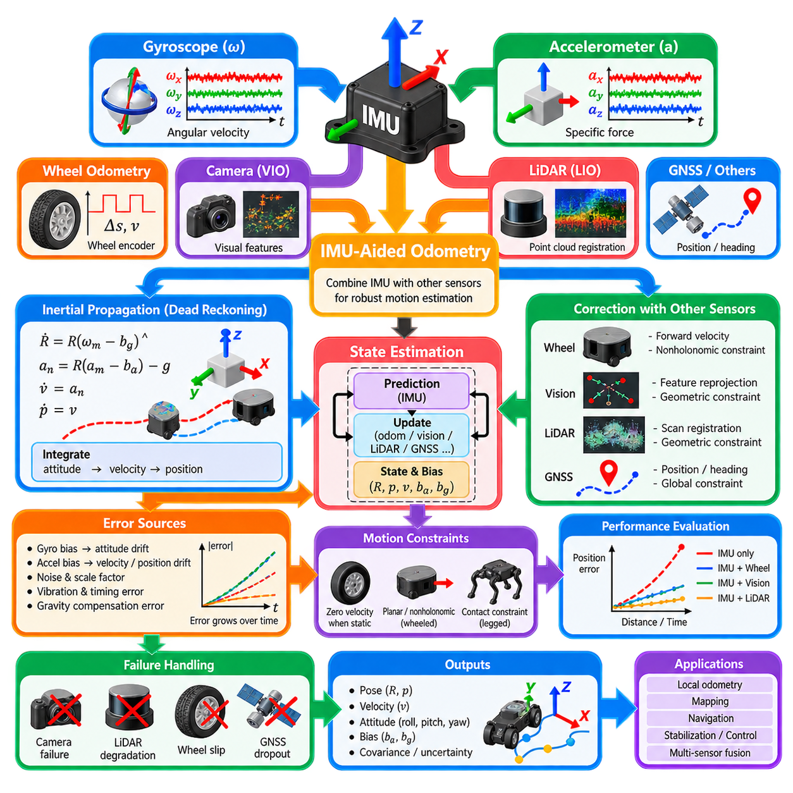{width="7.268055555555556in" height="7.268055555555556in"}

IMU 보조 오도메트리(IMU-Aided Odometry)는 고주기 관성 측정값(High-Rate Inertial Measurements)을 상대 변위(Relative Displacement) 또는 속도 정보를 제공하는 다른 센서와 결합하여 로봇의 운동을 추정한다. IMU는 각속도(Angular Velocity)와 비력(Specific Force)을 지속적으로 측정하므로 상대적으로 느린 외부 관측 사이에서도 자세(Orientation), 속도(Velocity), 위치(Position)를 빠르게 전파할 수 있다. 이를 통해 카메라(Camera), 라이다(LiDAR), 휠 인코더(Wheel Encoder) 등의 오도메트리 센서가 낮은 주기로 갱신되더라도 부드러운 운동 추정이 가능하다.

추측 항법(Dead Reckoning)은 지속적인 절대 위치 측정 없이 이전에 알고 있던 상태로부터 운동을 전파하여 현재 상태를 결정한다. 초기 위치, 속도, 자세가 주어지면 자이로스코프(Gyroscope) 측정값으로 자세를 갱신하고, 가속도계(Accelerometer) 측정값을 항법 좌표계(Navigation Frame)로 변환한 뒤 중력을 보상하여 속도와 위치로 적분한다. 이렇게 생성된 궤적(Trajectory)은 국부적으로 연속적이지만 시간이 지남에 따라 오차가 누적된다.

가속도 측정값은 움직이는 IMU 좌표계(IMU Frame)에서 표현되므로 자세 정확도(Orientation Accuracy)는 관성 추측 항법(Inertial Dead Reckoning)의 핵심 요소이다. 추정된 자세는 중력을 제거하기 전에 비력을 항법 또는 월드 좌표계(World Frame)로 변환하는 방법을 결정한다. 작은 자세 오차만 발생해도 중력의 일부가 수평 가속도로 잘못 투영되어 가짜 속도(False Velocity)를 생성하고, 이후 적분되면서 위치 오차가 빠르게 증가한다.

자이로스코프 바이어스(Gyroscope Bias)는 추측 항법 드리프트(Dead-Reckoning Drift)의 주요 원인 중 하나이다. 작은 각속도 오프셋도 자세 오차로 누적되고, 잘못된 중력 보상을 통해 병진 운동까지 간접적으로 손상시킨다. 가속도계 바이어스(Accelerometer Bias)는 직접적으로 속도 오차를 발생시키고 적분 과정에서 위치 오차를 대략 이차적으로 증가시킨다. 따라서 정확한 보정(Calibration), 온라인 바이어스 추정(Online Bias Estimation), 적절한 불확실성 모델(Uncertainty Model)이 중요하다.

순수 관성 항법(Pure Inertial Navigation)은 우수한 단기 운동 전파 성능을 제공할 수 있지만, 저가형 MEMS IMU를 사용하는 경우 일반적으로 위치 오차를 장기간 제한할 수 없다. 측정 잡음(Measurement Noise), 바이어스 불안정성(Bias Instability), 스케일 계수 오차(Scale-Factor Error), 진동(Vibration), 타이밍 오차(Timing Error), 불완전한 중력 보상이 지속적으로 누적된다. IMU 보조 오도메트리는 다른 센서에서 얻은 독립적인 운동 관측값으로 관성 전파를 주기적으로 제한하여 이러한 문제를 보완한다.

휠 오도메트리(Wheel Odometry)는 바퀴형 로봇(Wheeled Robot)과 자율이동로봇(AMR)에 자연스럽게 적용할 수 있는 상호보완적인 정보원이다. 인코더 측정값은 휠 회전과 차량 변위를 추정하고, IMU는 빠른 회전 동역학(Rotational Dynamics)과 가속도 정보를 제공한다. 두 정보를 융합하면 단기 운동 추정 성능이 향상되고 일시적인 인코더 이상에서도 부드러운 자세 갱신이 가능하지만, 휠 슬립(Wheel Slip), 불규칙한 지형, 타이어 변형(Tire Deformation), 스키드 조향(Skid Steering)은 체계적인 오도메트리 오차를 발생시킬 수 있다.

일반적인 바퀴형 로봇 추정기(Estimator)는 위치, 속도, 자세, 가속도계 바이어스, 자이로스코프 바이어스를 시스템 상태(System State)로 표현한다. IMU 측정값은 높은 주기로 예측 단계(Prediction Stage)를 구동하고, 휠에서 계산된 전진 속도(Forward Velocity) 또는 증분 변위(Incremental Displacement)는 보정 관측값(Correction Observation)을 제공한다. 비홀로노믹 제약(Nonholonomic Constraint)을 추가하여 정상적인 지면 접촉 조건에서는 차량의 횡방향 및 수직 속도가 작아야 한다는 물리적 특성을 표현할 수도 있다.

시각-관성 오도메트리(Visual-Inertial Odometry)는 카메라와 IMU 측정값을 결합하여 서로 상호보완적인 센서 특성을 활용한다. 카메라는 추적된 시각 특징(Visual Feature)으로부터 기하학적 제약(Geometric Constraint)을 제공하고, IMU는 빠른 회전, 모션 블러(Motion Blur), 이미지 프레임 사이의 구간에서도 고주기 운동 정보를 제공한다. 또한 관성 데이터는 실제 크기를 갖는 가속도와 중력 정보를 제공하여 영상만으로 안정적으로 추론하기 어려운 운동 동역학(Motion Dynamics)을 파악하는 데 도움을 준다.

라이다-관성 오도메트리(LiDAR-Inertial Odometry)는 관성 전파와 포인트 클라우드 정합(Point-Cloud Registration)에서 얻은 기하학적 제약을 결합하는 유사한 원리를 사용한다. IMU 측정값은 연속된 스캔 사이의 운동을 예측하고 회전형 라이다 스캔 내부에서 서로 다른 시점에 획득된 포인트의 왜곡 보정(Deskewing)을 지원한다. 이후 라이다 정합은 연속 스캔 또는 유지되는 로컬 맵(Local Map)의 기하학적 구조를 정렬하여 누적된 관성 드리프트를 보정한다.

상태 추정(State Estimation)은 확장 칼만 필터(Extended Kalman Filter), 오차 상태 칼만 필터(Error-State Kalman Filter), 슬라이딩 윈도우 최적화기(Sliding-Window Optimizer), 팩터 그래프(Factor Graph) 등을 이용하여 구현할 수 있다. 필터링 방식은 현재 상태와 공분산(Covariance)을 순차적으로 전파하는 반면, 최적화 방식은 관성 및 오도메트리 제약을 사용하여 여러 과거 상태를 동시에 개선한다. IMU 사전 적분(IMU Pre-Integration)은 연속된 키프레임(Keyframe) 사이의 고주기 관성 샘플을 간결한 상대 운동 팩터(Relative-Motion Factor)로 요약하므로 최적화에서 특히 유용하다.

예측 단계는 보정된 가속도계와 자이로스코프 측정값을 사용하여 상태를 전파한다. 먼저 자세를 적분하고, 측정된 비력을 항법 좌표계로 변환한 뒤 선택된 규약에 따라 중력을 적용하고, 가속도를 속도와 위치로 적분한다. 동시에 추정기는 IMU 잡음, 바이어스 변화(Bias Evolution), 불완전한 운동 모델링(Motion Modeling)으로 인해 증가하는 불확실성을 표현하기 위해 공분산을 전파한다.

보정 관측값(Correction Observation)은 관성 전파 과정에서 누적된 불확실성을 감소시킨다. 휠 속도, 시각 재투영(Visual Reprojection), 라이다 정합, GNSS 위치 또는 기타 측정값은 예측된 운동과 관측된 운동 사이의 잔차(Residual)를 생성한다. 추정기는 이러한 잔차를 사용하여 자세, 속도, 그리고 많은 경우 IMU 바이어스를 보정한다. 따라서 외부 오도메트리는 위치만 보정하는 것이 아니라 센서 바이어스 추정 정확도를 높여 이후의 관성 전파 성능도 간접적으로 개선한다.

정지 상태 및 운동 제약(Zero-Motion and Motion Constraints)은 적용 가능한 상황에서 추측 항법 성능을 크게 향상시킬 수 있다. 로봇이 정지한 것으로 알려진 경우 측정 속도를 0으로 제한하여 속도 드리프트를 보정하고 바이어스 추정을 개선할 수 있다. 지상 로봇(Ground Robot)은 평면 운동 제약(Planar-Motion Constraint)이나 비홀로노믹 제약을 활용할 수 있으며, 다족 로봇(Legged Robot)은 접촉 정보(Contact Information)를 사용할 수 있다. 이러한 제약은 물리적 지식을 추가하여 관성 센서만으로는 관측하기 어려운 오차를 감소시킨다.

IMU 보조 오도메트리는 다른 인지 센서가 일시적으로 성능이 저하되는 구간을 연결하는 역할을 수행해야 하는 경우가 많으므로 센서 고장(Sensor Failure)도 고려해야 한다. 카메라는 어두운 환경이나 텍스처가 부족한 영역에서 실패할 수 있고, 라이다 정합은 기하학적으로 반복적인 환경에서 성능이 저하될 수 있으며, 휠 오도메트리는 심한 슬립이 발생할 때 신뢰성이 낮아질 수 있다. IMU는 이러한 구간에서 단시간 동안 상태를 전파할 수 있지만 신뢰할 수 있는 외부 제약이 다시 확보될 때까지 불확실성을 증가시켜야 한다.

시간 동기화(Time Synchronization)와 외부 보정(Extrinsic Calibration)은 융합 오도메트리(Fused Odometry)의 품질에 직접적인 영향을 미친다. IMU와 다른 센서 사이의 잘못된 좌표 변환은 각 센서가 독립적으로 관측한 운동을 서로 불일치하게 만들며, 타임스탬프 오프셋(Timestamp Offset)은 서로 다른 물리적 시점의 측정값을 연결한다. 이러한 오차는 빠른 회전이나 가속 중에 특히 크게 나타나며 원인을 알기 어려운 바이어스, 정합 성능 저하, 추정기 내부의 지속적인 잔차로 나타날 수 있다.

따라서 추측 항법 성능은 순간적인 자세 오차만이 아니라 거리와 시간에 따른 드리프트율(Drift Rate)을 함께 평가해야 한다. 상대 자세 오차(Relative Pose Error), 궤적 오차(Trajectory Error), 헤딩 드리프트(Heading Drift), 속도 일관성(Velocity Consistency), 공분산 거동(Covariance Behavior)은 서로 보완적인 평가 지표를 제공한다. 시험에는 직선 주행, 회전, 가속, 정지, 진동, 경사면, 휠 슬립, 센서 드롭아웃(Sensor Dropout) 등 실제 로봇 운용 환경을 대표하는 조건을 포함해야 한다.

강건한 IMU 보조 오도메트리 아키텍처(Robust IMU-Aided Odometry Architecture)는 보정된 관성 감지(Calibrated Inertial Sensing), 정확한 자세 추정(Attitude Estimation), 바이어스 추적(Bias Tracking), 운동 제약(Motion Constraint), 불확실성 전파(Uncertainty Propagation), 상호보완적인 오도메트리 관측값을 결합한다. 이를 통해 고주기의 국부적으로 연속적인 상태 추정값을 제공하면서도 관성 추측 항법만으로는 드리프트가 누적된다는 한계를 고려한다. 관성 인지 파이프라인(Inertial Perception Pipeline)에서는 이러한 기능이 IMU 사전 적분과 자세 추정을 후속 다중 센서 융합(Multi-Sensor Fusion) 및 항법(Navigation) 기능으로 연결한다.

## 05.06. Zero Velocity Update ZUPT for Legged Robots [w/Code]

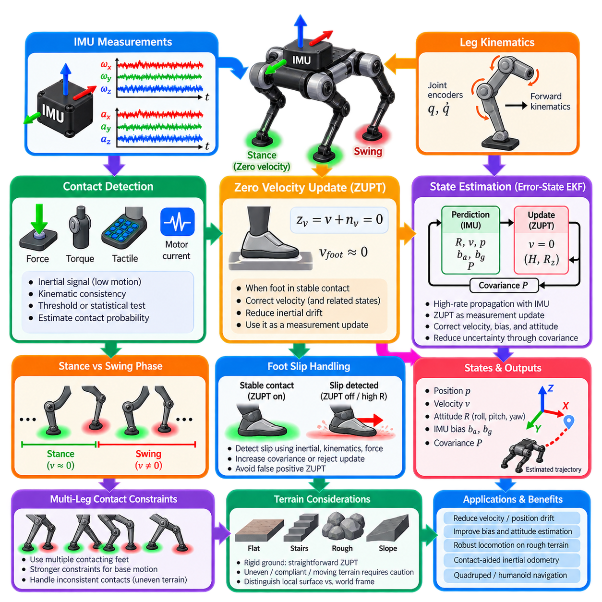{width="7.268055555555556in" height="7.268055555555556in"}

영속도 갱신(Zero-Velocity Update, ZUPT)은 로봇의 일부가 정지해 있다고 알려진 구간을 활용하는 상태 추정(State Estimation) 기법이다. 다족 로봇(Legged Robot)에서는 각 발이 스윙 단계(Swing Phase)와 지면 접촉 단계(Ground-Contact Phase)를 반복적으로 전환한다. 발이 미끄러짐 없이 안정적으로 지면에 접촉하면 지면에 대한 발의 속도는 0에 가까워야 하며, 이를 강력한 물리적 제약(Physical Constraint)으로 사용하여 누적되는 관성 드리프트(Inertial Drift)를 감소시킬 수 있다.

관성 항법(Inertial Navigation)은 자이로스코프(Gyroscope)와 가속도계(Accelerometer) 측정값을 지속적으로 적분하여 자세(Orientation), 속도(Velocity), 위치(Position)를 전파한다. 작은 센서 바이어스(Sensor Bias)와 측정 잡음(Measurement Noise)은 적분 과정에서 누적되어 속도와 위치 추정값의 드리프트를 발생시킨다. ZUPT는 신뢰할 수 있는 정지 상태가 감지될 때마다 영속도 관측(Zero-Velocity Observation)을 추가하여 이러한 오차 증가를 억제하고, 추정기가 속도를 보정하면서 상관관계를 가진 다른 상태 변수도 간접적으로 개선하도록 한다.

기본적인 ZUPT 측정은 개념적으로 z_v = v + n_v = 0으로 표현할 수 있다. 여기서 v는 제약되는 지점의 속도를 나타내고 n_v는 측정 불확실성(Measurement Uncertainty)을 나타낸다. 추정기는 예측된 속도와 예상되는 0의 속도를 비교하여 이노베이션(Innovation)을 생성한다. 이후 이 잔차(Residual)를 이용하여 감지된 정지 상태에 부여된 신뢰도에 따라 추정 상태를 보정한다.

발 장착형 IMU(Foot-Mounted IMU)의 경우 이러한 개념을 직접 적용할 수 있다. 입각 단계(Stance Phase)에서 지면에 단단히 고정된 발은 지지면에 대해 거의 정지 상태를 유지해야 한다. 따라서 자이로스코프 크기와 가속도계의 거동을 감시하여 정지 구간을 식별할 수 있다. 정지 상태가 감지되면 추정된 발 속도를 0에 가깝게 보정하여 연속적인 보행 과정에서 속도 오차가 자유롭게 증가하는 것을 방지한다.

다족 로봇은 각 발보다 몸통(Torso)에 주 IMU를 장착하는 경우가 많기 때문에 ZUPT 적용이 보다 간접적이다. 하나 이상의 발이 정지 상태를 유지하더라도 로봇 본체는 계속 움직일 수 있다. 이 경우 관절 인코더(Joint Encoder) 측정값과 순기구학(Forward Kinematics)을 이용하여 본체 상태와 접촉 중인 발의 관계를 계산한다. 이후 접촉점(Contact Point)의 영속도를 로봇 베이스 속도(Base Velocity)와 운동에 대한 운동학적 측정 제약(Kinematic Measurement Constraint)으로 변환할 수 있다.

따라서 신뢰할 수 있는 접촉 감지(Contact Detection)는 ZUPT 성능의 핵심 요소이다. 발 힘 센서(Foot-Force Sensor), 관절 토크 추정(Joint Torque Estimation), 촉각 센서(Tactile Sensor), 모터 전류(Motor Current), 접촉 스위치(Contact Switch), 운동학적 일관성(Kinematic Consistency), 관성 신호(Inertial Signature) 등을 이용하여 발이 로봇을 지지하고 있는지를 판단할 수 있다. 그러나 착지(Touchdown), 이지(Liftoff), 충격(Impact), 탄성 변형(Compliant Deformation), 부분 접촉(Partial Contact)에서는 완전한 정지 상태라는 가정이 성립하지 않을 수 있으므로 단순한 접촉 플래그(Contact Flag)만으로는 충분하지 않을 수 있다.

임계값 기반 정지 감지(Threshold-Based Stationary Detection)는 비교적 간단하게 구현할 수 있다. 각속도 크기가 설정된 임계값보다 낮게 유지되고 동시에 가속도계 크기가 예상 중력 수준에 가까운지를 검사할 수 있다. 이러한 조건은 하나의 샘플이 아니라 짧은 시간 윈도우(Temporal Window)에 걸쳐 평가할 수 있다. 윈도우 기반 검사는 측정 잡음에 대한 민감도를 줄이고 개별 샘플 때문에 영속도 제약이 반복적으로 활성화되거나 비활성화되는 현상을 방지한다.

보다 정교한 감지기는 정지 상태 인식을 통계적으로 구성한다. 일반화 우도비 검정(Generalized Likelihood Ratio Test), 확률적 접촉 추정기(Probabilistic Contact Estimator), 학습 기반 분류기(Learned Classifier), 다중 센서 접촉 모델(Multi-Sensor Contact Model)을 이용하여 관측된 관성 및 기계적 신호가 정지한 발의 특성과 일치하는지를 평가할 수 있다. 이러한 방법은 고정된 임계값만으로 보행(Walking), 트로팅(Trotting), 달리기(Running), 등반(Climbing), 험지 주행(Rough-Terrain Locomotion)을 모두 처리하기 어려운 동적 보행에서 특히 유용하다.

잘못된 양성 ZUPT(False Positive ZUPT)는 일시적으로 갱신을 수행하지 못하는 것보다 더 큰 문제를 발생시킬 수 있다. 미끄러지고 있는 발을 영속도 상태라고 잘못 판단하면 추정기에 물리적으로 잘못된 제약이 입력되어 베이스 속도, 자세 또는 위치 추정값을 왜곡할 수 있다. 따라서 강건한 구현에서는 접촉 신뢰도(Contact Confidence)에 따라 불확실성을 설정하고, 잔차가 예측된 로봇 동역학(Robot Dynamics) 또는 다른 센서 관측값과 일치하지 않을 경우 갱신을 거부할 수 있어야 한다.

발 미끄러짐(Foot Slip)은 느슨한 토양, 젖은 표면, 경사면, 자갈 또는 저마찰 바닥에서 특히 중요하다. 발이 지면과 계속 접촉하고 있더라도 지면에 대해 움직일 수 있으므로 접촉 상태가 반드시 영속도를 의미하지는 않는다. 슬립 감지(Slip Detection)는 관절 운동학, 관성 운동, 힘 측정값, 추정된 베이스 운동을 비교하여 수행할 수 있다. 슬립이 의심되면 ZUPT 공분산(Covariance)을 증가시키거나 안정적인 접촉이 다시 확보될 때까지 제약을 비활성화할 수 있다.

오차 상태 칼만 필터(Error-State Kalman Filter)에서는 일반적으로 IMU가 고주기 상태 전파(State Propagation)를 수행하고 ZUPT가 측정 갱신(Measurement Update) 역할을 한다. 상태에는 베이스 자세, 위치, 속도, 가속도계 바이어스(Accelerometer Bias), 자이로스코프 바이어스(Gyroscope Bias)가 포함될 수 있다. 이러한 상태들은 공분산 전파(Covariance Propagation)를 통해 서로 상관관계를 가지므로 속도를 보정하면 센서 바이어스와 자세 오차도 감소할 수 있으며, 이를 통해 영속도 구간이 종료된 이후의 관성 전파 성능도 향상된다.

ZUPT는 관성 센서만으로는 제약하기 어려운 상태의 관측 가능성(Observability)도 향상시킨다. 가속도계 바이어스는 속도 드리프트를 발생시키고 자이로스코프 바이어스는 자세 오차를 발생시켜 결국 병진 상태 추정까지 오염시킨다. 반복적인 정지 제약(Stationary Constraint)은 실제 로봇 운동과 누적된 센서 오차를 구분하는 정보를 제공한다. 이러한 효과는 지속적인 GNSS, 비전(Vision), 외부 기준 위치 추정(Externally Referenced Localization)을 사용할 수 없는 장시간 운용에서 특히 중요하다.

다족 시스템(Multi-Legged System)에서는 여러 발이 동시에 접촉하면 추가적인 제약을 얻을 수 있다. 사족보행 로봇(Quadruped)은 보행 패턴(Gait)에 따라 두 개, 세 개 또는 네 개의 발이 접촉할 수 있으며, 휴머노이드(Humanoid)는 단일 지지 단계(Single-Support Phase)와 이중 지지 단계(Double-Support Phase)를 번갈아 사용할 수 있다. 여러 개의 안정적인 접촉은 베이스 운동을 더욱 강하게 제한할 수 있지만 지형 변형이나 슬립으로 인해 개별 발의 제약이 서로 일치하지 않을 수 있으므로 상충하는 접촉 가정은 신중하게 처리해야 한다.

접촉 보조 관성 오도메트리(Contact-Aided Inertial Odometry)는 단순한 영속도 이벤트를 넘어 ZUPT 개념을 확장한다. 안정적인 발 접촉점을 입각 단계 동안 로컬 월드 좌표계(Local World Frame)에서 위치가 고정된 임시 랜드마크(Temporary Landmark)로 취급할 수 있다. 추정기는 로봇 베이스와 접촉점 위치를 함께 추적하고 다리 운동학(Leg Kinematics)을 이용하여 상대적인 기하 관계를 제약한다. 발이 지면에서 떨어지면 해당 제약을 제거하고 다음 착지 시 새로운 접촉 상태(Contact State)를 도입할 수 있다.

지형 기하(Terrain Geometry)는 이러한 제약을 해석하는 방법에 영향을 미친다. 단단하고 평평한 지면에서는 정지 접촉 가정(Stationary-Contact Assumption)을 비교적 직접적으로 적용할 수 있지만 계단, 암석, 탄성 표면(Compliant Surface), 움직이는 플랫폼(Moving Platform), 변형 가능한 지형(Deformable Terrain)에서는 더욱 신중한 처리가 필요하다. 특히 지지 환경 자체가 움직일 가능성이 있는 경우에는 로컬 표면에 대한 정지 접촉과 월드 좌표계에서의 절대적인 정지점을 구분해야 한다.

접촉 이벤트(Contact Event), 관절 인코더 측정값, IMU 샘플이 동일한 물리적 운동을 표현해야 하므로 타이밍 정확도(Timing Accuracy)도 매우 중요하다. 감지된 착지 시점과 실제 접촉 시점 사이에 지연이 존재하면 발이 아직 움직이고 있는 동안 영속도 제약을 적용할 수 있다. 따라서 동적인 다족 보행에서는 하드웨어 타임스탬프(Hardware Timestamp), 동기화된 센서 클록(Synchronized Sensor Clock), 적절한 버퍼링(Buffering), 접촉 전환(Contact Transition)에 대한 정밀한 처리가 필요하다.

ZUPT는 정적인 시험만이 아니라 전체 보행 시나리오(Locomotion Scenario)에서 평가해야 한다. 보행 속도, 보행 패턴 전환(Gait Transition), 회전, 달리기, 경사면, 계단, 충격, 불규칙한 지형, 의도적인 발 미끄러짐, 센서 교란 등을 시험에 포함해야 한다. 유용한 평가 지표로는 속도 드리프트(Velocity Drift), 위치 드리프트(Position Drift), 자세 안정성(Attitude Stability), 바이어스 수렴(Bias Convergence), 잘못된 정지 감지(False Stationary Detection), 접촉 누락(Missed Contact), 잘못되거나 사용할 수 없는 제약 이후의 추정기 복구 성능(Estimator Recovery) 등이 있다.

따라서 강건한 ZUPT 아키텍처(Robust ZUPT Architecture)는 보정된 관성 감지(Calibrated Inertial Sensing), 신뢰할 수 있는 접촉 감지, 다리 운동학, 불확실성을 고려한 측정 갱신(Uncertainty-Aware Measurement Update), 명시적인 슬립 처리(Slip Handling)를 결합한다. ZUPT는 관성 드리프트를 영구적으로 제거하는 것이 아니라 신뢰할 수 있는 물리적 접촉이 확보될 때마다 추정기를 반복적으로 고정하는 역할을 한다. IMU 및 관성 인지 파이프라인(Inertial Perception Pipeline)에서 ZUPT는 일반적인 관성 오도메트리(Inertial Odometry)를 사족보행 및 휴머노이드 로봇을 위한 접촉 보조 상태 추정(Contact-Aided State Estimation)으로 확장하는 실용적인 연결 고리를 제공한다.

## 05.07. High Rate IMU for Impact Shock Detection [w/Code]

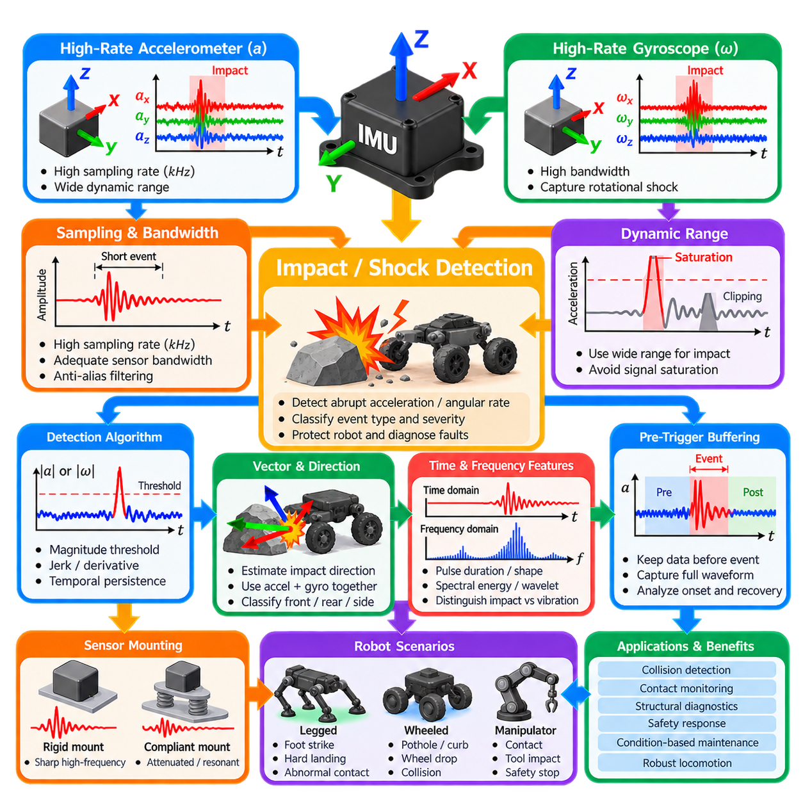{width="7.268055555555556in" height="7.268055555555556in"}

고주기 IMU(High-Rate IMU)는 일반적인 항법 운동(Navigation Motion)보다 훨씬 빠르게 발생하는 기계적 이벤트(Mechanical Event)를 로봇 시스템이 관측해야 할 때 사용된다. 충격(Impact), 쇼크(Shock), 충돌(Collision), 발 착지(Foot Strike), 휠 충격(Wheel Hit), 강한 착륙(Hard Landing), 구조물 접촉(Structural Contact)은 불과 수 밀리초 내에 발생할 수 있다. 관성 신호를 높은 주파수로 샘플링하면 이러한 짧은 시간의 과도 신호(Transient)를 보존하여 시간 평균화로 정보가 사라지기 전에 감지할 수 있다.

충격 감지(Impact Detection)는 단순히 부드러운 본체 운동을 추정하는 것이 목적이 아니라는 점에서 일반적인 관성 항법(Inertial Navigation)과 다르다. 시스템은 정상적인 이동보다 진폭과 주파수 성분이 훨씬 높은 가속도 및 각속도의 급격한 변화를 인식해야 한다. 고주기 가속도계(High-Rate Accelerometer)는 병진 충격(Translational Shock)을 포착하고, 고주기 자이로스코프(High-Rate Gyroscope)는 접촉력이 로봇의 질량 중심(Center of Mass)에서 벗어난 위치에 작용할 때 발생하는 회전 충격(Rotational Impulse)을 감지한다.

샘플링 주파수(Sampling Frequency)는 신뢰성 있게 표현할 수 있는 가장 짧은 이벤트를 결정한다. 샘플링 원리에 따르면 측정 주기는 관심 신호의 최고 주파수보다 두 배 이상 높아야 하지만, 실제 충격 감시에서는 일반적으로 추가적인 대역폭 여유(Bandwidth Margin)가 필요하다. 수백 헤르츠로 동작하는 IMU는 중간 수준의 접촉을 감지할 수 있지만, 킬로헤르츠급 샘플링(Kilohertz-Class Sampling)은 빠른 충격, 구조 진동(Structural Vibration), 동적으로 움직이는 로봇의 접촉 전환(Contact Transition)을 더욱 정확하게 포착할 수 있다.

센서 대역폭(Sensor Bandwidth)은 샘플링 주파수와 함께 고려해야 한다. 장치가 수 킬로헤르츠의 속도로 데이터를 출력하더라도 내부 아날로그 또는 디지털 필터링이 실제 물리적 대역폭을 훨씬 낮은 수준으로 제한할 수 있다. 따라서 출력 주기만 높인다고 충격 관측 성능이 향상되는 것은 아니다. 기계 구조(Mechanical Structure), 센서 대역폭, 앤티앨리어싱 필터링(Anti-Alias Filtering), 디지털 필터(Digital Filter), 통신 인터페이스(Communication Interface), 타임스탬프(Timestamping)를 포함한 전체 감지 체인이 활용 가능한 과도 신호 정보를 결정한다.

동적 범위(Dynamic Range) 역시 중요한 설계 매개변수이다. 충격은 일반적인 항법에서 필요한 범위를 훨씬 초과하는 가속도를 발생시킬 수 있기 때문이다. 높은 감도로 설정된 항법용 IMU(Navigation IMU)는 충돌이나 강한 착륙에서 포화(Saturation)될 수 있다. 신호 클리핑(Clipping)이 발생하면 최대 크기와 파형 형태를 신뢰성 있게 복원할 수 없다. 따라서 충격 감지 시스템에서는 더 넓은 가속도 및 각속도 측정 범위를 사용하거나 고감도 센서와 광범위 센서(High-Range Sensor)를 결합할 수 있다.

기본적인 감지기는 3축 가속도 벡터의 크기를 감시하고 설정된 임계값(Threshold)을 초과하면 이벤트를 발생시킬 수 있다. 각속도 크기, 가속도 변화율(Acceleration Derivative), 저크(Jerk)를 이용하면 갑작스러운 기계적 이벤트에 대한 추가적인 근거를 확보할 수 있다. 임계값은 정상적인 로봇 운동과 진동의 분포보다 높으면서 의미 있는 접촉을 감지할 수 있을 만큼 낮게 설정해야 한다. 시간 지속 조건(Temporal Persistence Condition)을 적용하면 단발성 전기적 또는 수치적 스파이크를 제거하는 데 도움이 된다.

벡터 정보(Vector Information)는 단순한 크기 정보보다 더 많은 정보를 제공한다. 가속도 충격의 방향을 이용하면 대략적인 접촉 방향을 추정할 수 있으며, 동시에 발생하는 각가속도(Angular Acceleration) 또는 각속도 변화는 질량 중심에서 벗어난 충격(Off-Center Impact)을 나타낼 수 있다. IMU 위치와 로봇의 기하 구조를 알고 있다면 병진 및 회전 응답을 결합하여 전방, 후방, 측면, 수직 또는 경사 방향의 기계적 이벤트를 분류할 수 있다.

충격 지속 시간(Impact Duration)과 임펄스 형태(Impulse Shape)는 유용한 분류 특징(Classification Feature)을 제공한다. 강체 충돌(Rigid Collision)은 좁고 진폭이 높은 펄스와 이후의 구조적 링잉(Structural Ringing)을 발생시킬 수 있는 반면, 탄성 물체(Compliant Object)와의 접촉은 더 넓고 낮은 주파수의 응답을 생성할 수 있다. 따라서 발 착지, 휠의 연석 접촉(Wheel Curb Contact), 매니퓰레이터 충돌(Manipulator Collision), 섀시 충격(Chassis Impact)은 최대 가속도 크기가 비슷하더라도 서로 다른 시간적 특성을 나타낼 수 있다.

주파수 영역 분석(Frequency-Domain Analysis)은 충격과 지속적인 진동을 구분하는 데 활용할 수 있다. 모터 회전, 기어 맞물림(Gear Meshing), 프로펠러, 휠, 구조 공진(Structural Resonance)은 반복적인 스펙트럼 성분(Spectral Component)을 생성하는 경우가 많지만 갑작스러운 충격은 광대역 과도 에너지(Broadband Transient Energy)를 발생시킨다. 단시간 푸리에 변환(Short-Time Fourier Transform), 대역 에너지 측정(Band-Energy Measurement), 웨이블릿(Wavelet), 적절하게 설계된 디지털 필터를 이용하여 이벤트 발생 시점을 식별할 수 있는 시간 해상도를 유지하면서 이러한 차이를 분석할 수 있다.

필터링(Filtering)은 신중한 절충이 필요하다. 지나치게 강한 저역통과 필터링(Low-Pass Filtering)은 감지하려는 과도 신호 자체를 억제할 수 있기 때문이다. 따라서 항법과 충격 감지는 동일한 원시 IMU 스트림(Raw IMU Stream)에서 서로 다른 처리 경로(Processing Path)를 사용할 수 있다. 필터링된 저주파 경로는 자세 및 오도메트리 추정에 사용하고, 더 높은 대역폭의 경로는 충격 및 진동 성분을 보존하여 이벤트 감지, 진단(Diagnostics), 안전 감시(Safety Monitoring)에 활용할 수 있다.

사전 트리거 버퍼링(Pre-Trigger Buffering)은 시스템이 과도 신호가 시작된 이후에 충격을 인식하는 경우가 많기 때문에 유용하다. 순환 버퍼(Circular Buffer)는 짧은 구간의 고주기 IMU 샘플 이력을 지속적으로 저장한다. 트리거가 발생하면 시스템은 이벤트 전후의 데이터를 모두 보존한다. 이를 통해 접근 운동(Approach Motion), 충격 시작(Impact Onset), 최대 응답(Peak Response), 구조적 링잉, 회복 동작(Recovery Behavior)을 포함한 전체 파형을 분석할 수 있다.

충격 데이터를 다른 로봇 신호와 연관시켜야 할 경우 정확한 타임스탬프가 필수적이다. 모터 전류, 관절 토크(Joint Torque), 힘 센서(Force Sensor), 촉각 센서(Tactile Sensor), 휠 인코더(Wheel Encoder), 카메라(Camera), 접촉 스위치(Contact Switch), 제어기 상태(Controller State)는 이벤트의 원인을 파악하는 데 도움을 줄 수 있다. 하드웨어 동기화(Hardware Synchronization) 또는 정확하게 정렬된 클록(Aligned Clock)을 이용하면 명령된 운동, 환경 접촉, 액추에이터 이상(Actuator Anomaly), 기계적 고장(Mechanical Failure) 중 무엇이 먼저 발생했는지 재구성할 수 있다.

다족 로봇(Legged Robot)은 각각의 착지(Touchdown)가 과도적인 기계 이벤트를 발생시키므로 고주기 충격 감지의 이점을 크게 얻을 수 있다. IMU 신호를 보행 단계(Gait Phase), 관절 운동학(Joint Kinematics), 접촉 추정(Contact Estimation), 힘 측정값과 결합하면 정상적인 발 착지와 비정상적인 충돌을 구분할 수 있다. 과도한 착지 충격은 부적절한 발 디딤 위치(Foothold Selection), 잘못된 임피던스(Impedance), 예상하지 못한 지형 높이, 제어 오차(Control Error), 진행 중인 기계적 문제를 나타낼 수 있다.

실외 바퀴형 로봇(Wheeled Outdoor Robot)의 충격 이벤트는 포트홀(Pothole), 연석(Curb), 돌, 서스펜션 바텀아웃(Suspension Bottoming), 휠 드롭(Wheel Drop), 섀시 접촉, 장애물 충돌 등에서 발생할 수 있다. 따라서 이벤트 심각도(Event Severity)는 차량 속도, 서스펜션 상태(Suspension State), 휠 운동, 지형 인지(Terrain Perception)와 함께 해석해야 한다. 반복적인 충격 통계는 개별 이벤트가 즉각적인 고장을 일으키지 않더라도 과도한 기계적 하중(Mechanical Loading)을 발생시키는 경로나 운용 조건을 파악하는 데 활용할 수 있다.

휴머노이드(Humanoid) 및 매니퓰레이션 시스템(Manipulation System)에서는 의도된 접촉(Intended Contact)과 위험한 충격(Hazardous Impact)을 구분해야 한다. 파지(Grasping), 배치(Placing), 보행(Stepping), 착석(Sitting), 도구 사용(Tool Use)은 자연스럽게 접촉 과도 신호를 발생시키지만 예상하지 못한 사람과의 접촉이나 주변 장비와의 충돌은 빠른 대응이 필요할 수 있다. 따라서 작업 상태(Task State)와 접촉 위치에 관한 문맥 정보를 관성 임계값과 결합하여 모든 기계적 이벤트를 고장으로 판단하지 않도록 해야 한다.

이벤트 심각도는 최대 가속도(Peak Acceleration), 최대 각속도(Peak Angular Rate), 저크, 펄스 지속 시간(Pulse Duration), 적분 가속도(Integrated Acceleration), 스펙트럼 에너지(Spectral Energy) 또는 이러한 값의 조합으로 표현할 수 있다. 구조 응답(Structural Response)은 센서 위치, 질량 분포(Mass Distribution), 탄성(Compliance), 장착 강성(Mounting Stiffness)에 따라 달라지므로 하나의 지표만으로 모든 충격을 설명할 수는 없다. 따라서 보정 실험(Calibration Experiment)을 통해 측정된 관성 특성을 예상 운용 범위의 알려진 기계 이벤트와 연관시켜야 한다.

센서 장착(Sensor Mounting)은 관측되는 파형에 큰 영향을 미친다. 강성이 높은 섀시 연결부 근처에 설치된 IMU는 날카로운 고주파 충격을 포착할 수 있는 반면, 탄성 브래킷(Compliant Bracket)에 장착된 센서는 감쇠되거나 공진된 운동을 관측할 수 있다. 질량 중심 근처에 설치하면 병진 응답이 강조되고, 질량 중심에서 멀리 떨어진 위치에서는 회전 효과가 더욱 강하게 나타날 수 있다. 따라서 기계적 통합(Mechanical Integration) 자체가 측정 시스템 설계의 일부가 된다.

강건한 고주기 충격 감지(Robust High-Rate Impact Detection)는 충분한 샘플링 주파수, 물리적 센서 대역폭, 적절한 동적 범위, 저지연 처리(Low-Latency Processing), 이벤트 버퍼링(Event Buffering), 동기화된 타임스탬프, 문맥 인식형 분류(Context-Aware Classification)를 통합해야 한다. 관성 인지 아키텍처(Inertial Perception Architecture)에서 이러한 기능은 IMU의 역할을 항법과 오도메트리를 넘어 이동 로봇, 다족 로봇, 매니퓰레이션 로봇의 충돌 감지(Collision Detection), 접촉 감시(Contact Monitoring), 구조 진단(Structural Diagnostics), 안전 대응(Safety Response), 상태 기반 유지보수(Condition-Based Maintenance)까지 확장한다.

## 05.08. MEMS IMU Thermal Calibration and Compensation [w/Code]

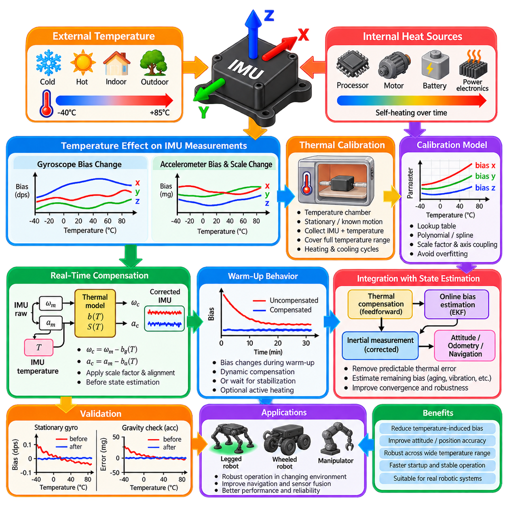{width="7.268055555555556in" height="7.268055555555556in"}

MEMS IMU의 성능은 온도(Temperature)에 크게 영향을 받는다. 센서가 가열되거나 냉각되면서 가속도계(Accelerometer)와 자이로스코프(Gyroscope)의 기계적 및 전기적 특성이 변화하기 때문이다. 바이어스(Bias), 스케일 계수(Scale Factor), 잡음 특성(Noise Characteristics), 축 정렬(Axis Alignment)은 운용 온도 범위에 따라 달라질 수 있다. 관성 측정값은 시간에 따라 적분되므로 작은 온도 의존적 오차(Temperature-Dependent Error)도 상당한 자세, 속도, 위치 드리프트로 누적될 수 있다.

온도 변화는 외부 환경뿐 아니라 로봇 자체에서도 발생한다. 실외 플랫폼(Outdoor Platform)은 저온 시동(Cold Start), 직사광선, 계절 변화, 실내외 환경 사이의 급격한 전환을 경험할 수 있다. 내부 프로세서, 모터, 배터리, 전력 전자장치(Power Electronics), 인클로저(Enclosure)의 발열 역시 시동 이후 IMU 온도를 상승시킬 수 있으며, 주변 환경 온도가 거의 일정하더라도 체계적인 측정값 변화를 발생시킬 수 있다.

자이로스코프 바이어스(Gyroscope Bias)는 특히 온도 변화에 민감하다. 정지 상태의 자이로스코프는 이상적으로 0의 각속도를 출력해야 하지만 영각속도 출력(Zero-Rate Output)은 일반적으로 온도에 따라 변화한다. 이러한 온도 의존적 바이어스를 적분하면 지속적으로 증가하는 자세 오차가 발생한다. 이 자세 오차는 다시 중력 보상(Gravity Compensation)을 손상시키므로 자이로스코프의 작은 열적 영향이 간접적으로 훨씬 큰 속도 및 위치 오차를 발생시킬 수 있다.

가속도계 바이어스(Accelerometer Bias) 역시 온도에 따라 변화하며 실제로 존재하지 않는 병진 가속도(False Translational Acceleration)를 발생시킬 수 있다. 스케일 계수도 변화하여 동일한 물리적 가속도가 온도에 따라 서로 다른 디지털 출력을 생성할 수 있다. 개별 편차는 작아 보일 수 있지만 이중 적분(Double Integration) 때문에 가속도계 오차는 위치 추정에 특히 큰 영향을 미친다. 따라서 열 보상(Thermal Compensation)은 일정한 바이어스만 제거하는 것이 아니라 오프셋(Offset)과 감도(Sensitivity)의 변화를 모두 처리해야 한다.

열 보정(Thermal Calibration)은 예상 운용 온도 범위에서 IMU를 관측하여 이러한 관계를 특성화한다. 센서를 온도 제어 챔버(Temperature-Controlled Chamber)에 배치하고 정지 상태를 유지하거나 알려진 운동을 가하면서 저온에서 고온까지 점진적으로 변화시킬 수 있다. 가속도계, 자이로스코프, 온도, 타임스탬프(Timestamp) 데이터를 지속적으로 기록하여 측정 오차와 센서 내부 온도의 관계를 분석한다.

유용한 보정 절차는 몇 개의 대표 온도만 사용하는 것이 아니라 전체 운용 범위(Operational Range)를 포함해야 한다. MEMS의 특성에는 열 이력 현상(Thermal Hysteresis)이 나타날 수 있으므로 가열과 냉각 과정 모두에서 데이터를 수집할 수 있다. 즉 동일한 온도에서도 이전의 열 상태에 따라 센서 응답이 달라질 수 있다. 반복적인 온도 사이클(Temperature Cycle)은 재현 가능한 열적 특성을 무작위 잡음, 드리프트, 노화(Aging), 실험 편차와 구분하는 데에도 도움이 된다.

정지 상태 열 보정(Stationary Thermal Calibration)은 자이로스코프 영각속도 바이어스를 식별하는 직접적인 방법을 제공한다. 각 온도에서 일정 시간 동안 자이로스코프 출력을 평균하면 무작위 잡음을 억제할 수 있다. 가속도계 보정에서는 중력과 센서 자세를 고려해야 한다. 알려진 여러 정적 자세(Static Orientation)에서 측정값을 수집하면 각 감지축에 작용하는 예상 중력 가속도와 온도 의존적 바이어스 및 스케일 계수 효과를 분리할 수 있다.

이렇게 얻은 보정 데이터는 룩업 테이블(Lookup Table), 구간별 보간(Piecewise Interpolation), 다항 함수(Polynomial Function), 스플라인(Spline) 또는 기타 회귀 모델(Regression Model)을 이용하여 표현할 수 있다. 예를 들어 자이로스코프 바이어스는 b_g(T), 가속도계 바이어스는 b_a(T)의 함수로 모델링할 수 있으며 스케일 계수 역시 온도 의존 함수로 표현할 수 있다. 적절한 모델은 무작위 측정 잡음까지 과적합하거나 불안정한 외삽(Extrapolation)을 발생시키지 않으면서 실제 센서의 열적 특성을 표현해야 한다.

다항식 보상(Polynomial Compensation)은 열적 특성이 운용 범위에서 부드럽게 변화할 때 편리하게 사용할 수 있다. 바이어스 항은 개념적으로 b(T) = c₀ + c₁T + c₂T² + ... 형태로 표현할 수 있으며, 각 계수는 보정 데이터로부터 추정한다. 높은 차수의 다항식은 모델의 표현 능력을 높일 수 있지만 데이터셋에 과적합될 위험도 증가한다. 센서 특성에 국부적인 비선형성(Local Nonlinearity)이 존재하는 경우 하나의 전역 다항식보다 구간별 모델이나 스플라인 기반 모델이 더 적합할 수 있다.

룩업 테이블 보상(Lookup-Table Compensation)은 임베디드 구현(Embedded Implementation)에 적합한 간단한 대안을 제공한다. 보정 매개변수를 개별 온도 지점에 저장하고 그 사이의 값은 보간을 통해 계산한다. 이 방법은 열 응답에 특정한 전역 수학적 형태를 강제하지 않는다는 장점이 있다. 일반적으로 필요한 메모리는 크지 않지만 중요한 특성 변화를 충분히 표현하면서 불필요하게 테이블을 복잡하게 만들지 않도록 보정 온도 간격을 적절히 선택해야 한다.

실시간 보상(Real-Time Compensation)은 IMU의 온도를 읽고 관성 측정값이 자세 추정(Attitude Estimation), 사전 적분(Pre-Integration), 오도메트리(Odometry)에 입력되기 전에 해당 온도에 맞는 보정값을 적용한다. 개념적으로 보정된 각속도는 ω_c = ω_m − b_g(T)로 표현할 수 있으며 가속도에도 유사한 보정을 적용한다. 온도 의존적 스케일 계수와 축간 결합(Axis Coupling)을 모델링하는 경우 보상 단계에서 현재 온도에 적합한 보정 행렬(Calibration Matrix)도 적용한다.

IMU가 보고하는 온도는 실제 MEMS 감지 구조(Sensing Structure)의 온도와 항상 동일하지는 않다. 열 구배(Thermal Gradient)와 센서 패키지의 열 동역학(Thermal Dynamics)은 환경 변화, 내부 전자장치, 감지 소자 사이에 시간 지연을 발생시킨다. 따라서 급격한 가열 과정에서는 단순한 정적 온도-바이어스 관계만으로 완전히 설명할 수 없는 과도 오차(Transient Error)가 발생할 수 있다. 이러한 영향이 중요한 시스템에서는 보정 과정에서 열 시정수(Thermal Time Constant)를 고려해야 한다.

워밍업 동작(Warm-Up Behavior)은 전원을 켠 직후 즉시 운용해야 하는 로봇 시스템에서 특히 중요하다. IMU는 주변 온도에 가까운 상태에서 시작한 후 주변 전자장치의 발열에 따라 점차 더 높은 평형 온도(Equilibrium Temperature)에 도달할 수 있다. 이 과정에서 바이어스가 지속적으로 변화할 수 있다. 시스템은 시동 직후부터 동적으로 보상을 수행하거나 열적 안정화가 이루어질 때까지 고정밀 운용을 지연하거나, 제어된 가열을 사용하여 센서를 예측 가능한 운용점(Operating Point) 부근에 유지할 수 있다.

능동 열 안정화(Active Thermal Stabilization)는 IMU를 거의 일정한 높은 온도로 유지하여 보정의 복잡성을 줄일 수 있다. 히터(Heater), 온도 센서, 피드백 제어기(Feedback Controller)를 사용하여 감지 패키지를 예상되는 최대 환경 온도보다 높은 수준 또는 좁게 제어되는 온도 영역에 유지한다. 이러한 방법은 반복성(Repeatability)을 향상시킬 수 있지만 전력 소비, 기계적 복잡성, 워밍업 요구사항, 열 설계 제약을 증가시키므로 일부 소형 로봇에는 적합하지 않을 수 있다.

온도 보상은 온라인 바이어스 추정(Online Bias Estimation)을 대체하는 방법이 아니라 함께 통합되어야 한다. 열 모델(Thermal Model)은 예측 가능한 체계적 변화를 제거하고, 확장 칼만 필터(Extended Kalman Filter, EKF) 또는 기타 추정기는 노화, 기계적 응력(Mechanical Stress), 진동, 불완전한 보정, 확률적 드리프트(Stochastic Drift)로 인해 남아 있는 바이어스를 추적한다. 피드포워드 열 보상(Feedforward Thermal Compensation)과 온라인 추정을 결합하면 추정기의 부담을 줄이고 온도가 변화하는 상황에서도 수렴 성능을 향상시킬 수 있다.

검증(Validation)은 보정 모델을 생성할 때 사용하지 않은 온도 궤적(Temperature Trajectory)과 운용 조건을 이용하여 수행해야 한다. 보정된 정지 상태의 자이로스코프 출력은 지정된 온도 범위에서 0에 가까운 값을 유지해야 하며, 보정된 가속도계 측정값은 중력과 일관성을 유지해야 한다. 동적 검증(Dynamic Validation)에서는 일정한 온도 지점뿐 아니라 가열, 냉각, 시동, 실제 로봇 운동 중에도 자세, 속도, 위치 오차가 적절한 수준으로 유지되는지를 확인해야 한다.

양산 적용(Production Deployment)에서는 보정 데이터를 해당 데이터를 생성한 특정 IMU 또는 하드웨어 구성(Hardware Configuration)과 연결하여 관리해야 한다. 센서 교체, 인쇄회로기판 재설계(PCB Redesign), 장착 변경, 인클로저 수정, 열원의 변화는 열적 특성을 변화시킬 수 있다. 따라서 보정 계수(Calibration Coefficient)는 버전 관리되고 추적 가능해야 하며, 진단 시스템은 온도에 따른 잔여 바이어스(Residual Bias)를 감시하여 성능 저하를 식별하거나 재보정(Recalibration)이 필요한 시점을 판단할 수 있어야 한다.

강건한 MEMS 열 보상 파이프라인(Robust MEMS Thermal-Compensation Pipeline)은 온도 특성화(Temperature Characterization), 다중 온도 보정(Multi-Temperature Calibration), 적절한 회귀 또는 룩업 모델, 실시간 보정, 워밍업 관리, 검증, 온라인 바이어스 추정을 통합한다. 상위 수준의 처리 단계에 입력되기 전에 예측 가능한 열적 오차를 제거함으로써 실제 로봇 시스템이 경험하는 변화하는 외부 및 내부 온도 환경에서도 자세 추정, IMU 사전 적분(IMU Pre-Integration), 관성 오도메트리(Inertial Odometry), 다중 센서 융합(Multi-Sensor Fusion)의 성능을 향상시킬 수 있다.

## 05.09. UAV IMU Vibration Filtering and Isolation [w/Code]

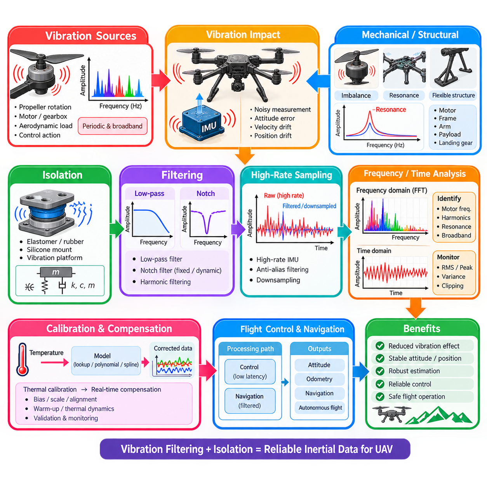{width="7.268055555555556in" height="7.268055555555556in"}

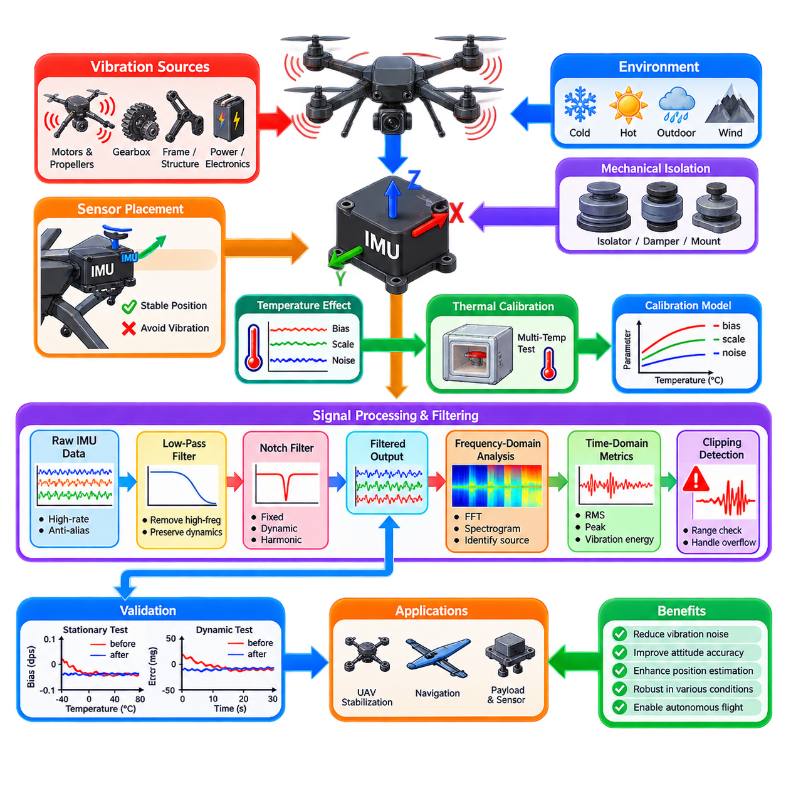{width="7.268055555555556in" height="7.268055555555556in"}

무인항공기(UAV)의 관성 감지(Inertial Sensing)는 추진 시스템(Propulsion System)이 주기적 및 광대역 기계 가진(Periodic and Broadband Mechanical Excitation)을 발생시켜 기체 구조(Airframe)를 통해 IMU로 전달하기 때문에 진동(Vibration)의 영향을 크게 받는다. 모터(Motor), 프로펠러(Propeller), 기어박스(Gearbox), 공기역학적 하중(Aerodynamic Loading), 구조 공진(Structural Resonance), 빠른 제어 동작(Control Action)은 가속도 및 각속도 교란을 발생시킨다. 이러한 신호가 적절한 처리 없이 추정기(Estimator)에 입력되면 자세, 속도, 고도, 위치 추정값에 잡음이 증가하거나 불안정해질 수 있다.

프로펠러 회전(Propeller Rotation)은 멀티로터 무인항공기(Multirotor UAV)에서 가장 지배적인 진동원(Vibration Source) 중 하나이다. 각각의 로터(Rotor)는 회전 속도, 블레이드 수(Blade Count), 공기역학적 불균형(Aerodynamic Imbalance), 모터 특성과 관련된 주기적인 힘을 발생시킨다. 분당 수천 회전으로 동작하는 로터는 IMU 측정 대역폭까지 확장되는 기본 주파수(Fundamental Frequency)와 고조파(Harmonic)를 생성할 수 있으며, 로터별 회전 속도의 미세한 차이는 복잡한 복합 진동 패턴을 추가로 발생시킬 수 있다.

기계적 불균형(Mechanical Imbalance)은 진동 진폭을 크게 증가시킨다. 프로펠러 제조 공차(Manufacturing Tolerance), 블레이드 손상(Blade Damage), 오염, 휘어진 모터 축(Bent Motor Shaft), 마모된 베어링(Worn Bearing), 부정확한 조립은 회전 질량을 이상적인 회전축에서 벗어나게 할 수 있다. 이러한 결함은 회전 속도가 증가할수록 커지는 원심 가진(Centrifugal Excitation)을 발생시킨다. 따라서 진동 완화(Vibration Mitigation)는 신호 처리 알고리즘에 전적으로 의존하기보다 기계적 검사와 밸런싱(Balancing)에서 시작해야 한다.

구조 공진은 비교적 작은 가진도 IMU가 위치한 지점에서 큰 운동으로 증폭시킬 수 있다. UAV 프레임(Frame), 암(Arm), 항공전자 장착판(Avionics Plate), 페이로드 마운트(Payload Mount), 착륙 구조(Landing Structure), 센서 브래킷(Sensor Bracket)은 질량, 강성(Stiffness), 감쇠(Damping)에 의해 결정되는 고유 진동수(Natural Frequency)를 가진다. 모터 또는 프로펠러 가진 주파수가 이러한 고유 진동수 중 하나에 접근하면 원래 가진력이 크게 증가하지 않더라도 공진으로 인해 측정 가속도가 상당히 증가할 수 있다.

따라서 IMU 장착 위치(IMU Placement)는 진동 민감도에 영향을 미친다. 센서를 기체의 강성이 높고 구조적으로 안정적인 영역에 배치하면 유연체 운동(Flexible-Body Motion)을 감소시킬 수 있지만, 진동하는 암이나 모터 또는 탄성 구조(Compliant Structure) 근처에 설치하면 더 강한 교란에 노출될 수 있다. 또한 회전 중심에서 멀어질수록 각운동과 구조 변형으로 인한 추가 가속도가 발생할 수 있으므로 UAV의 질량 중심(Center of Mass)도 장착 위치 선정 시 고려해야 한다.

기계적 절연(Mechanical Isolation)은 고주파 진동이 IMU까지 전달되는 것을 억제한다. 엘라스토머 패드(Elastomer Pad), 고무 댐퍼(Rubber Damper), 실리콘 마운트(Silicone Mount), 폼 구조(Foam Structure), 전용 진동 절연 플랫폼(Vibration-Isolation Platform)을 이용하여 기체와 센서 어셈블리 사이에 탄성과 감쇠를 추가할 수 있다. 절연 구조는 근사적으로 질량-스프링-댐퍼 시스템(Mass-Spring-Damper System)으로 동작하며 강성, 감쇠, 지지 질량에 따라 주파수별 전달률(Transmissibility)이 결정된다.

진동 절연은 단순히 마운트를 가능한 한 부드럽게 만드는 것을 의미하지 않는다. 지나치게 유연한 마운트는 저주파 운동, 센서 응답 지연, 큰 변위 또는 제어 대역폭(Control Bandwidth) 내부의 새로운 공진을 발생시킬 수 있다. 따라서 절연 시스템의 고유 진동수는 주요 진동 주파수보다 충분히 낮게 배치하면서도 저주파 강체 운동(Rigid-Body Motion)을 정확하게 측정하고 안정적인 센서 정렬을 유지할 수 있는 충분한 강성을 확보해야 한다.

절연 마운트(Isolation Mount)의 전달률은 공진 주파수 주변에서 크게 변화한다. 공진보다 낮은 주파수에서는 센서가 기체 운동을 따라가는 경향이 있으며, 공진 부근에서는 진동이 감쇠되지 않고 오히려 증폭될 수 있다. 공진보다 충분히 높은 주파수에서는 절연 효과가 나타나 전달되는 진동이 감소한다. 감쇠는 공진 피크(Resonance Peak)를 낮추지만 고주파 절연 성능에도 영향을 미치므로 마운트 설계에서는 적절한 절충이 필요하다.

디지털 필터링(Digital Filtering)은 측정 신호에 남아 있는 진동을 억제하여 기계적 절연을 보완한다. 저역통과 필터(Low-Pass Filter)는 기체 동역학과 자세 제어에 필요한 대역폭보다 높은 주파수 성분을 제거한다. 차단 주파수(Cutoff Frequency)는 실제 UAV 운동을 보존할 만큼 충분히 높으면서 구조 및 추진계 진동을 감쇠할 만큼 낮아야 한다. 지나친 필터링은 위상 지연(Phase Delay)을 발생시켜 피드백 제어 안정성을 저하시킬 수 있다.

노치 필터(Notch Filter)는 진동 에너지가 특정 주파수 주변에 집중되어 있을 때 특히 유용하다. 노치는 좁은 주파수 대역을 강하게 감쇠하면서 해당 영역 이외의 신호는 보존한다. 고정 노치 필터(Fixed Notch Filter)는 예측 가능한 모터 또는 구조 주파수를 대상으로 할 수 있지만 로터 속도는 스로틀(Throttle)과 기동에 따라 변화한다. 따라서 비행 중 주요 진동 주파수가 크게 이동하면 고정 노치의 효과가 감소할 수 있다.

동적 노치 필터링(Dynamic Notch Filtering)은 운용 중 변화하는 추진계 주파수에 맞추어 제거 주파수 대역을 적응적으로 변경한다. 모터 회전 속도는 전자식 속도 제어기 텔레메트리(Electronic Speed Controller Telemetry), RPM 센서 또는 IMU 데이터의 스펙트럼 분석(Spectral Analysis)을 통해 추정할 수 있다. 이후 필터 중심 주파수를 모터 기본 주파수 또는 주요 고조파에 맞추어 추적함으로써 유용한 관성 정보의 넓은 주파수 영역을 불필요하게 제거하지 않으면서 강한 감쇠를 수행할 수 있다.

고조파 필터링(Harmonic Filtering)은 추진계 진동이 기본 모터 주파수에만 나타나는 것이 아니기 때문에 중요하다. 블레이드 통과(Blade Passage), 모터의 전자기적 영향(Electromagnetic Effect), 구조적 결합(Structural Coupling), 비선형 기계 거동(Nonlinear Mechanical Behavior)은 2차, 3차 및 더 높은 고조파를 발생시킬 수 있다. 따라서 적응형 필터링 아키텍처(Adaptive Filtering Architecture)는 비행 제어기와 상태 추정기에 필요한 저주파 강체 운동을 보존하면서 서로 연관된 여러 주파수 대역을 동시에 추적할 수 있다.

앨리어싱(Aliasing)은 진동 성분이 디지털 샘플링으로 올바르게 표현할 수 없는 주파수 영역에 도달하기 전에 방지해야 한다. 기계적 진동에 샘플링 주파수 절반보다 높은 에너지가 포함되어 있으면 해당 에너지가 낮은 주파수 영역으로 접혀 들어와 일반적인 디지털 필터링만으로 제거하기 어려운 가짜 운동(False Motion)으로 나타날 수 있다. 따라서 충분한 IMU 샘플링 주파수, 아날로그 대역폭 제어(Analog Bandwidth Control), 앤티앨리어싱 필터링(Anti-Alias Filtering)은 UAV 진동 관리의 기본 요소이다.

고주기 IMU 샘플링(High-Rate IMU Sampling)은 실제 기체 동역학과 고주파 진동 사이의 분리를 더욱 명확하게 할 수 있다. 원시 측정값(Raw Measurement)을 킬로헤르츠급 속도로 획득한 뒤 적절하게 필터링하고 제어 또는 상태 추정을 위해 다운샘플링(Downsampling)할 수 있다. 이러한 아키텍처는 데시메이션(Decimation) 이전에 진동 성분을 감쇠할 수 있도록 하며 고주파 추진계 신호가 항법 시스템에서 사용하는 저주파 관성 데이터에 혼입될 위험을 감소시킨다.

주파수 영역 분석(Frequency-Domain Analysis)은 진동 문제를 진단하는 데 유용하다. 고속 푸리에 변환(Fast Fourier Transform, FFT)을 사용하면 주요 모터 주파수, 고조파, 구조 공진, 광대역 교란(Broadband Disturbance)을 식별할 수 있다. 스펙트로그램(Spectrogram)은 이러한 분석을 시간 영역까지 확장하여 로터 속도가 변할 때 진동 주파수가 어떻게 이동하는지 보여준다. 스로틀 수준, 비행 모드, 페이로드 구성, 장착 방식에 따른 스펙트럼을 비교하면 과도한 진동의 물리적 원인을 파악하는 데 도움이 된다.

시간 영역 지표(Time-Domain Metric)는 온보드 감시(Onboard Monitoring)에 보완적인 정보를 제공한다. 제곱평균제곱근 가속도(Root-Mean-Square Acceleration), 최대 가속도(Peak Acceleration), 각속도 분산(Angular-Rate Variance), 클리핑 빈도(Clipping Frequency), 짧은 시간 윈도우의 진동 에너지(Vibration Energy)를 이용하여 IMU 환경이 허용 가능한 범위에 유지되는지 판단할 수 있다. 수직 진동, 횡방향 구조 모드, 비틀림 운동(Torsional Motion)은 서로 다른 원인을 가질 수 있으므로 각 축을 독립적으로 감시하는 것도 유용하다.

센서 클리핑(Sensor Clipping)은 포화로 인해 손실된 정보를 필터링으로 복원할 수 없기 때문에 특히 위험하다. 심한 진동은 가속도계 또는 자이로스코프의 측정 범위를 반복적으로 초과하여 왜곡된 파형과 편향된 평균값을 발생시킬 수 있다. 따라서 적절한 센서 측정 범위, 기계적 진동 완화, 진동 감시를 통해 지속적인 클리핑을 방지해야 한다. 시스템은 클리핑 이벤트를 감지하고 영향을 받은 관성 측정값의 신뢰도를 일시적으로 낮출 수도 있다.

진동 제거(Vibration Rejection)는 비행 제어 및 항법 아키텍처(Flight-Control and Navigation Architecture)와 독립적으로 설계하기보다 전체 시스템과 연계해야 한다. 제어 루프(Control Loop)는 안정화를 위해 상대적으로 높은 대역폭을 요구할 수 있지만 항법 추정은 일반적으로 더 강한 필터링을 허용할 수 있다. 따라서 저지연 처리 경로(Low-Latency Processing Path)는 제어에 필요한 충분한 동역학을 보존하고, 별도의 정밀 필터링 경로는 자세, 속도, 위치 추정기에 더 낮은 잡음의 측정값을 제공하도록 구성할 수 있다.

검증(Validation)은 벤치 시험(Bench Testing)과 실제 운용을 대표하는 비행 시험(Flight Experiment)을 결합하여 수행해야 한다. 모터 런업 시험(Motor Run-Up Test), 프로펠러 밸런싱 검사, 주파수 스윕(Frequency Sweep), 다양한 스로틀 수준, 급격한 기동(Aggressive Maneuver), 페이로드 변경, 바람 교란(Wind Disturbance), 이륙, 착륙, 장시간 비행을 평가해야 한다. 목표는 단순히 측정 진동을 최소화하는 것이 아니라 UAV의 전체 운용 영역에서 안정적인 제어와 신뢰할 수 있는 관성 추정을 유지하는 것이다.

강건한 UAV 진동 관리 아키텍처(Robust UAV Vibration-Management Architecture)는 기계적 밸런싱(Mechanical Balancing), 구조 설계(Structural Design), 적절한 IMU 배치, 조정된 진동 절연(Tuned Vibration Isolation), 충분한 샘플링 대역폭, 앤티앨리어싱 보호(Anti-Alias Protection), 저역통과 및 적응형 노치 필터링(Adaptive Notch Filtering), 클리핑 감지(Clipping Detection), 스펙트럼 진단(Spectral Diagnostics)을 통합한다. 이러한 요소를 함께 적용하면 실제 강체 운동은 보존하면서 추진계 및 구조적 교란을 억제하여 자세 제어(Attitude Control), 오도메트리(Odometry), 항법(Navigation), 자율 비행(Autonomous Flight)에 신뢰할 수 있는 관성 데이터를 제공할 수 있다.

## 05.10. IMU ROS2 Driver and Integration Best Practices [w/Code]

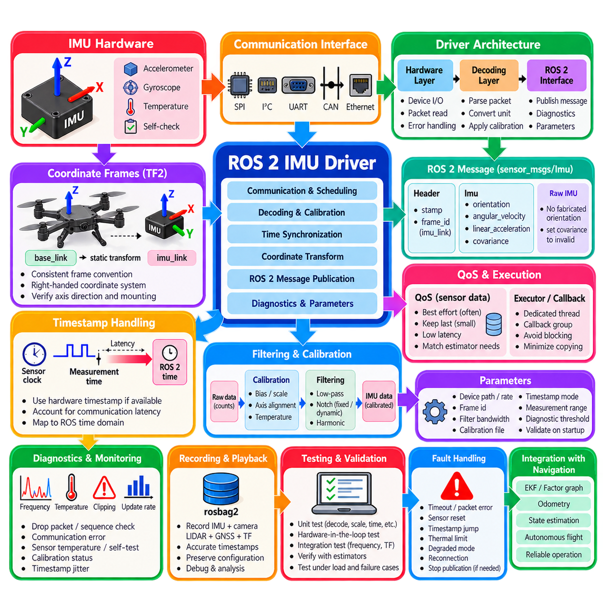{width="7.268055555555556in" height="7.268055555555556in"}

ROS 2 IMU 드라이버(ROS 2 IMU Driver)는 관성 센싱 하드웨어(Inertial Sensing Hardware)와 로봇의 인지(Perception), 위치 추정(Localization), 제어(Control), 항법(Navigation) 스택 사이의 소프트웨어 경계(Software Boundary)를 형성한다. 그 역할은 단순히 가속도계와 자이로스코프 레지스터를 읽는 것에 그치지 않는다. 양산 수준의 드라이버(Production-Quality Driver)는 하드웨어 고유의 세부 사항을 하위 소프트웨어에서 분리하면서 측정 타이밍, 좌표계 규약, 보정 상태, 불확실성, 진단 정보, 결정론적 데이터 전달(Deterministic Data Delivery)을 유지해야 한다.

드라이버 아키텍처(Driver Architecture)는 하드웨어 통신(Hardware Communication), ROS 2 메시지 발행(Message Publication), 상위 수준 처리(Higher-Level Processing)를 분리하는 것이 바람직하다. 하드웨어 계층(Hardware Layer)은 SPI, I²C, UART, CAN, Ethernet 등의 인터페이스를 관리하고, 디코딩 계층(Decoding Layer)은 장치 패킷을 물리 단위(Physical Unit)로 변환한다. 이후 ROS 2 인터페이스 계층(Interface Layer)이 표준화된 메시지를 발행한다. 이러한 분리는 센서 교체, 시험, 고장 진단, 서로 다른 로봇 플랫폼에서의 재사용을 용이하게 한다.

관성 데이터를 위한 주요 ROS 2 인터페이스는 sensor_msgs/msg/Imu이며, 이 메시지는 자세(Orientation), 각속도(Angular Velocity), 선형 가속도(Linear Acceleration), 공분산(Covariance) 정보를 포함한다. 내부적으로 자세를 추정하지 않는 원시 IMU(Raw IMU)는 임의의 자세 값을 생성해서는 안 된다. 대신 자세 필드와 해당 공분산을 통해 자세 정보를 사용할 수 없음을 표시하고, 각속도와 선형 가속도에는 센서가 제공하는 보정된 측정값을 포함해야 한다.

좌표계 규약(Coordinate-Frame Convention)은 전체 시스템에서 일관되게 정의되어야 한다. IMU 측정축은 물리적인 센서 좌표계(Sensor Frame)를 기준으로 하며, 장착 방향 때문에 로봇 베이스 좌표계(Base Frame)와 다를 수 있다. 메시지 헤더의 frame_id는 측정값이 표현되는 좌표계를 식별해야 한다. 이후 ROS 2 TF2 프레임워크를 이용한 정적 변환(Static Transformation)을 통해 imu_link, base_link 및 다른 센서 좌표계 사이의 강체 관계(Rigid Relationship)를 정의할 수 있다.

축 방향(Axis Direction)과 좌표계 손잡이성(Handedness)의 오류는 추정기 또는 보정 문제와 유사한 고장을 발생시킬 수 있다. ROS 규약은 일반적으로 오른손 좌표계(Right-Handed Coordinate System)를 사용하지만 일부 IMU나 제조사 프로토콜은 다른 축 정의를 사용할 수 있다. 따라서 드라이버 통합 과정에서는 장치 문서, 장착 기하 구조, 로봇 좌표계 정의가 자동으로 일치한다고 가정하지 말고 세 축 모두에 대해 양의 가속도와 양의 각속도 방향을 명시적으로 검증해야 한다.

타임스탬프 처리(Timestamp Handling)는 드라이버의 가장 중요한 역할 중 하나이다. 타임스탬프는 단순히 ROS 2 콜백이 메시지를 발행한 시간이 아니라 실제 물리적 측정 시점(Physical Measurement Time)을 가능한 한 정확하게 나타내야 한다. 직렬 통신(Serial Transport), 버퍼링(Buffering), 운영체제 스케줄링(Operating-System Scheduling), 패킷 디코딩은 가변적인 지연을 발생시킬 수 있다. 따라서 하드웨어 타임스탬프(Hardware Timestamp) 또는 센서 클록(Sensor Clock)을 사용할 수 있다면 이를 보존하고 ROS 시간 영역(ROS Time Domain)으로 신중하게 매핑해야 한다.

고주기 IMU(High-Rate IMU)는 초당 수백 또는 수천 개의 메시지를 생성할 수 있으므로 효율적인 데이터 경로(Data Path)가 필요하다. 드라이버는 데이터 획득 경로에서 불필요한 메모리 할당, 복사, 변환, 로깅, 블로킹 동작(Blocking Operation)을 최소화해야 한다. 하드웨어 읽기와 패킷 파싱(Packet Parsing)은 예측 가능한 상태를 유지해야 하며, ROS 2 시스템의 다른 영역에서 계산 부하가 증가하더라도 과도한 지터(Jitter), 큐 증가, 관성 샘플 손실이 발생하지 않도록 해야 한다.

ROS 2 서비스 품질(Quality of Service, QoS)은 IMU 데이터의 실시간 특성에 맞게 설정해야 한다. 많은 고주기 파이프라인에서는 지연된 과거 샘플보다 최신 측정값이 더 중요하므로 센서 지향 QoS 프로파일(Sensor-Oriented QoS Profile)이 적합하다. 큐 깊이(Queue Depth), 신뢰성(Reliability), 지속성(Durability), 히스토리(History) 설정은 통신 품질과 추정기 요구사항에 따라 선택해야 한다. 소비자가 발행 속도를 따라가지 못할 때 지나치게 깊은 신뢰성 큐를 사용하면 오히려 지연이 증가할 수 있다.

실행기(Executor)와 콜백 구성(Callback Organization) 역시 타이밍 동작에 영향을 미친다. IMU 데이터 획득은 느린 진단 처리, 파라미터 서비스(Parameter Service), 시각화, 파일 기록, 계산량이 많은 처리 작업 때문에 불필요하게 차단되어서는 안 된다. 콜백 그룹(Callback Group), 멀티스레드 실행기(Multithreaded Executor), 전용 데이터 획득 스레드(Dedicated Acquisition Thread)를 사용하면 시간에 민감한 센서 처리를 낮은 우선순위 작업과 분리할 수 있다. 이러한 아키텍처는 유휴 상태가 아니라 실제적인 프로세서 부하 조건에서 평가해야 한다.

보정(Calibration)은 데이터 파이프라인의 명확하게 정의된 지점에서 적용해야 한다. 원시 센서 카운트(Raw Sensor Count)를 먼저 물리 단위로 변환한 다음 바이어스(Bias), 스케일 계수(Scale Factor), 축 정렬 오차(Axis Misalignment), 온도 효과(Temperature Effect)를 내부 보정(Intrinsic Correction)을 통해 보상할 수 있다. 필요한 경우 다른 로봇 좌표계로 외부 회전 변환(Extrinsic Rotation)을 명시적으로 수행할 수 있지만, 보정된 측정값을 고유 IMU 좌표계에 유지하고 TF를 통해 기하 관계를 정의하는 방식이 일반적으로 더 명확하고 추적 가능한 아키텍처를 제공한다.

공분산 값(Covariance Value)은 예제 코드에서 복사한 임의의 상수가 아니라 실제 측정 불확실성(Measurement Uncertainty)을 나타내야 한다. 각속도와 선형 가속도의 공분산은 센서 특성화(Sensor Characterization), 정지 상태 실험, 앨런 편차 분석(Allan Deviation Analysis), 검증된 제조사 사양으로부터 얻을 수 있다. 하위의 EKF, 팩터 그래프(Factor Graph), 센서 융합 시스템은 이러한 값을 이용하여 측정 가중치를 결정하므로 비현실적인 공분산은 상태 추정 성능을 크게 왜곡할 수 있다.

파라미터화(Parameterization)는 서로 다른 하드웨어와 로봇 사이의 이식성(Portability)을 향상시킨다. 장치 경로(Device Path), 통신 속도, 프레임 식별자(Frame Identifier), 발행 주파수(Publication Frequency), 측정 범위, 필터 대역폭(Filter Bandwidth), 보정 파일(Calibration File), 타임스탬프 모드, 진단 임계값(Diagnostic Threshold)을 ROS 2 파라미터로 제공할 수 있다. 지원되지 않는 샘플링 속도, 잘못된 프레임 이름, 호환되지 않는 필터 설정이 발견하기 어려운 통합 오류를 발생시키지 않도록 구성 시점에 파라미터를 검증해야 한다.

수명주기 관리(Lifecycle Management)는 양산 로봇 시스템에서 유용하다. 수명주기를 지원하는 IMU 노드(Lifecycle-Aware IMU Node)는 구성(Configuration), 활성화(Activation), 비활성화(Deactivation), 정리(Cleanup), 고장 복구(Fault Recovery)를 분리할 수 있다. 측정값을 발행하기 전에 구성 단계에서 하드웨어 통신을 설정하고 검증할 수 있다. 이를 통해 시작 순서(Startup Sequencing)를 보다 결정론적으로 구성하고, 위치 추정이나 자율 주행을 활성화하기 전에 감독 소프트웨어(Supervisory Software)가 보정, 통신, 센서 상태가 적절한지 확인할 수 있다.

진단(Diagnostics)은 단순히 ROS 2 토픽이 존재하는지만 확인해서는 안 된다. 유용한 상태 지표에는 실제 발행 주파수, 타임스탬프 지터, 손실된 패킷(Dropped Packet), 시퀀스 불연속(Sequence Discontinuity), 통신 오류, 센서 온도, 포화(Saturation), 클리핑(Clipping), 자체 진단 상태(Self-Test Status), 보정 유효성(Calibration Validity)이 포함된다. 예상 갱신 속도와 실제 측정된 갱신 속도를 비교하면 정상적인 센서와 불규칙하거나 오래된 데이터를 발행하는 드라이버를 구분할 수 있다.

원시 토픽(Raw Topic)과 처리된 토픽(Processed Topic)이 모두 필요한 경우 이를 분리할 수 있다. 원시 토픽은 디버깅, 보정, 오프라인 분석을 위해 센서 출력에 가까운 측정값을 보존하고, 보정 토픽(Calibrated Topic)은 실제 상태 추정에 사용할 보정 데이터를 제공한다. 추가적인 온도 또는 진단 토픽을 통해 보조 정보를 제공할 수도 있다. 명확한 토픽 명명(Topic Naming)을 사용하면 하위 구성요소가 원시, 보정, 필터링, 융합된 관성 측정값을 실수로 혼용하는 것을 방지할 수 있다.

ROS 2 통합은 재현 가능한 기록 및 재생(Recording and Playback)도 지원해야 한다. rosbag2를 이용하면 IMU 메시지를 카메라, 라이다(LiDAR), 위성항법시스템(GNSS), 휠 인코더(Wheel Encoder), 관절 상태(Joint State), TF 데이터와 함께 기록하여 디버깅과 알고리즘 개발에 활용할 수 있다. 재생 과정에서는 드라이버에서 이미 발생한 동기화 오류를 복구할 수 없으므로 정확한 타임스탬프가 필수적이다. 따라서 기록 데이터셋에는 센서 구성, 보정, 좌표계 관계를 재구성할 수 있는 충분한 메타데이터(Metadata)를 보존해야 한다.

시험(Testing)은 패킷 디코딩, 스케일 변환(Scale Conversion), 축 매핑(Axis Mapping), 타임스탬프 변환, 보정 방정식에 대한 단위 시험(Unit Test)을 포함해야 한다. 하드웨어 인 더 루프 시험(Hardware-in-the-Loop Test)을 통해 통신 복구, 패킷 손실, 재연결 동작(Reconnect Behavior), 지속적인 고주기 동작을 검증할 수 있다. 통합 시험(Integration Test)에서는 실제적인 CPU, 메모리, 통신 부하 조건에서 토픽 주파수, TF 일관성, 공분산 유효성, 하위 추정기와의 호환성을 확인해야 한다.

고장 처리(Fault Handling)는 그럴듯하지만 실제로는 잘못된 측정값을 아무런 경고 없이 발행하는 상황을 방지해야 한다. 통신 타임아웃(Communication Timeout), 손상된 패킷(Corrupted Packet), 센서 리셋(Sensor Reset), 타임스탬프 불연속, 열 한계 초과(Thermal Limit Violation), 반복적인 포화는 명시적인 진단 상태를 발생시켜야 한다. 시스템 안전 요구사항에 따라 노드는 성능 저하 상태(Degraded Status)로 계속 동작하거나 제어된 재연결을 시도하거나 데이터 발행을 비활성화하거나 감독 소프트웨어에 통보하여 위치 추정 및 운동 기능이 적절하게 대응하도록 할 수 있다.

강건한 ROS 2 IMU 통합(Robust ROS 2 IMU Integration)은 하드웨어 추상화(Hardware Abstraction), 표준화된 메시지, 정확한 타임스탬프, 일관된 좌표계, 의미 있는 공분산, 보정 관리(Calibration Management), 적절한 QoS, 효율적인 실행, 수명주기 제어, 진단, 기록, 체계적인 시험을 결합한다. 이러한 모범 사례(Best Practices)를 함께 적용하면 IMU 드라이버는 자세 추정(Attitude Estimation), 사전 적분(Pre-Integration), 오도메트리(Odometry), 센서 융합(Sensor Fusion), 항법, 실시간 자율 로봇 운용(Real-Time Autonomous Robot Operation)을 위한 신뢰할 수 있는 기반이 된다.
