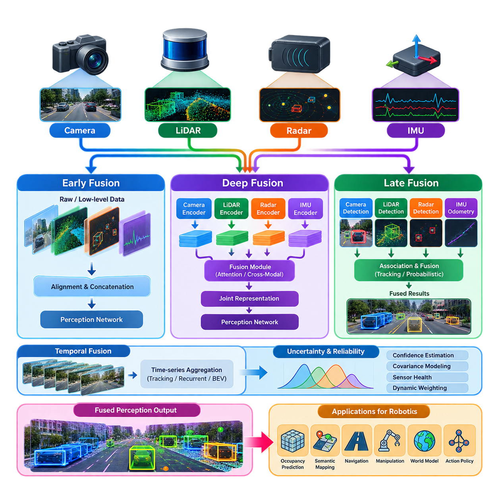
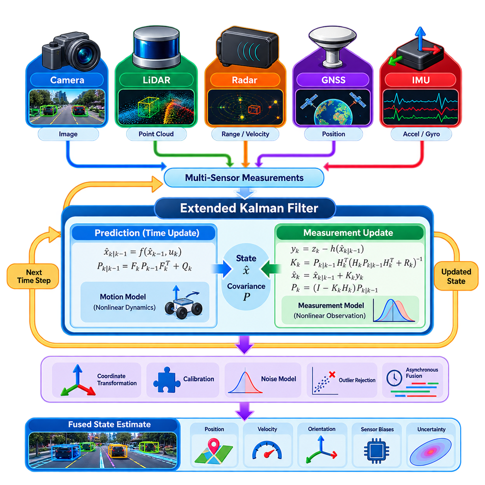
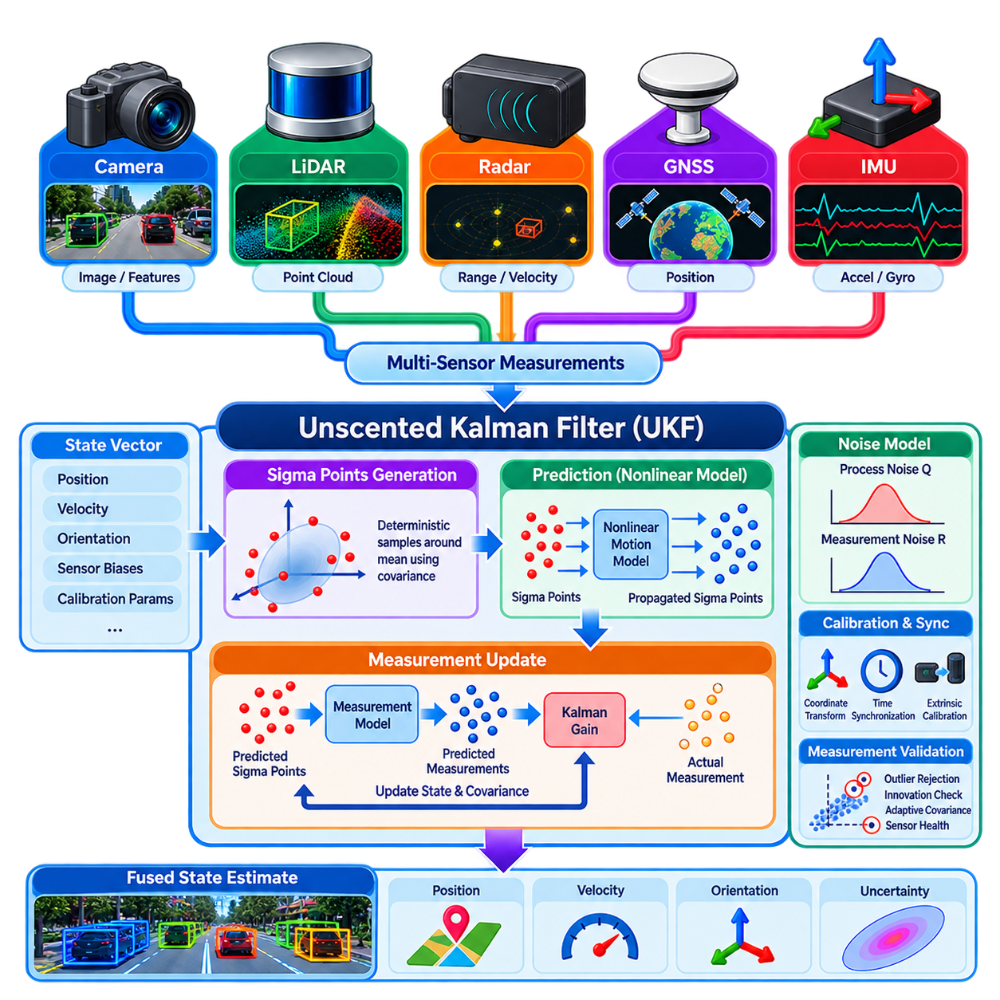
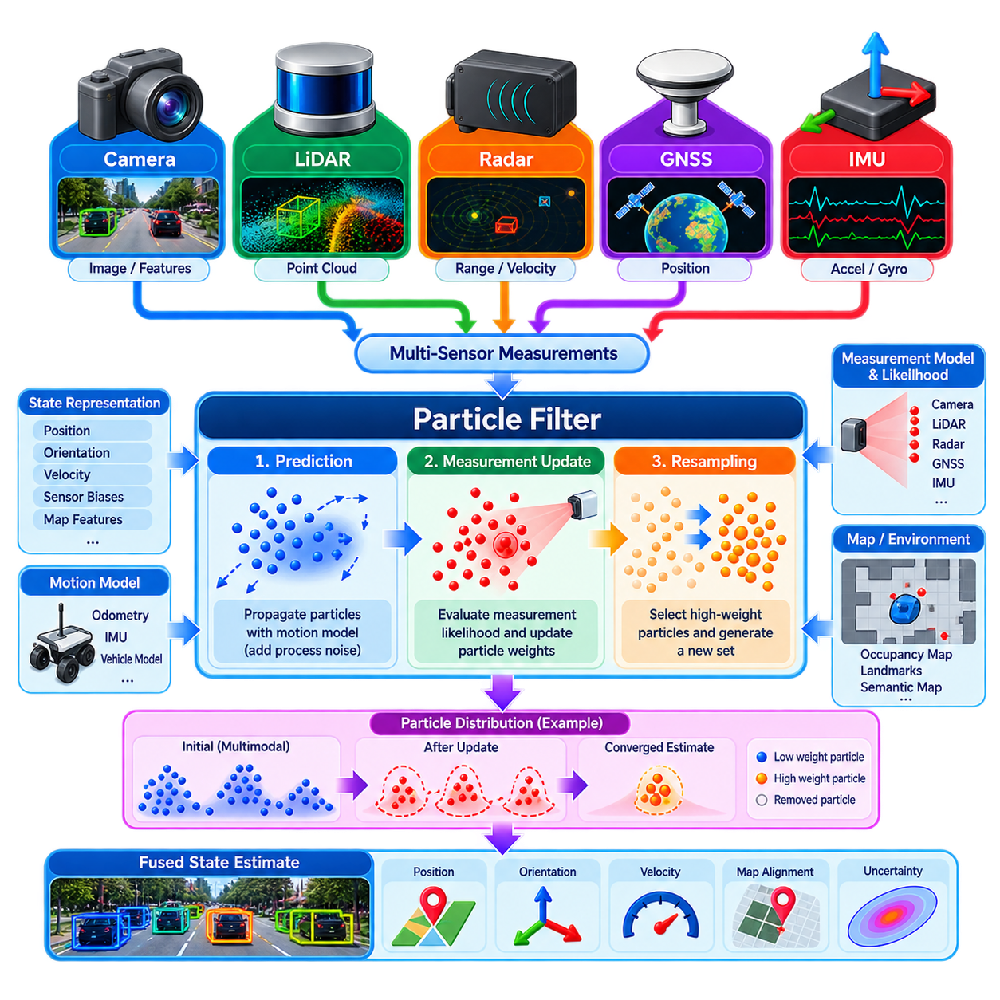
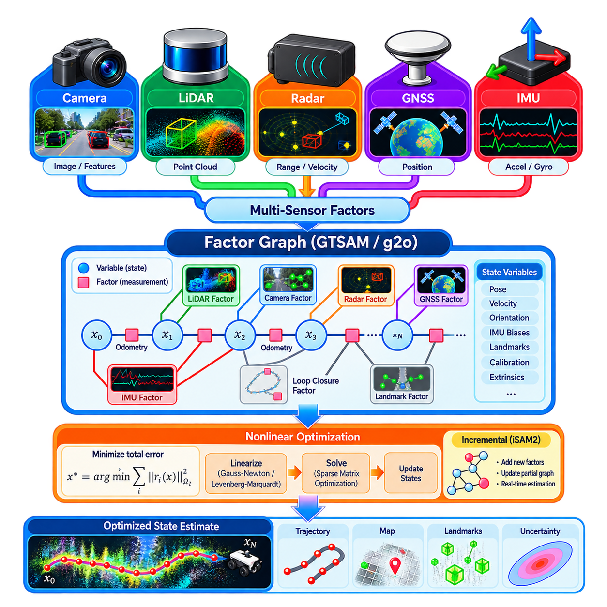
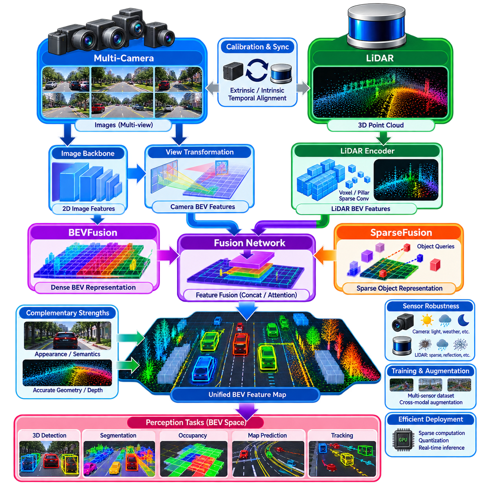
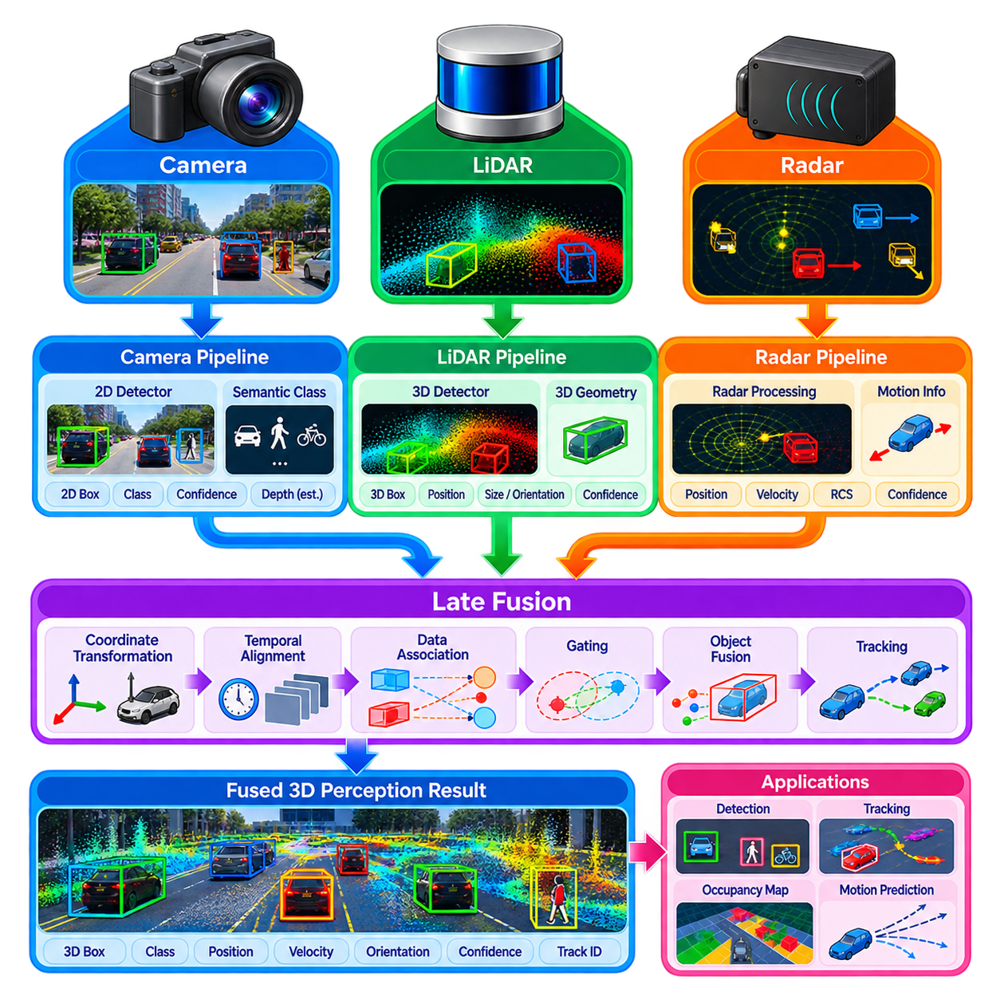
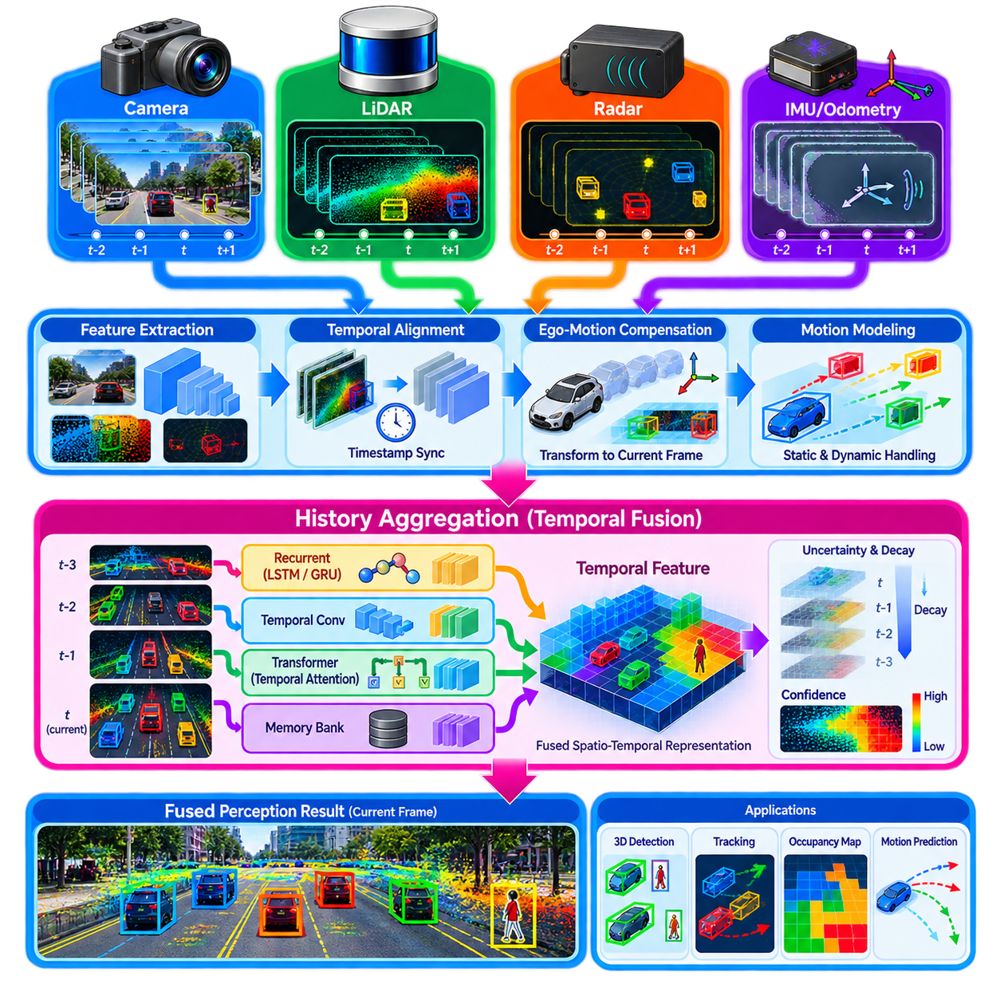
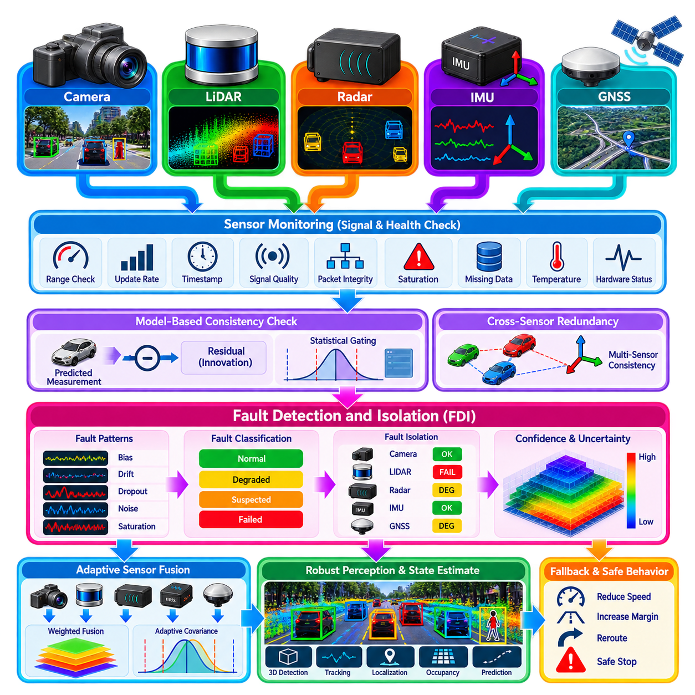
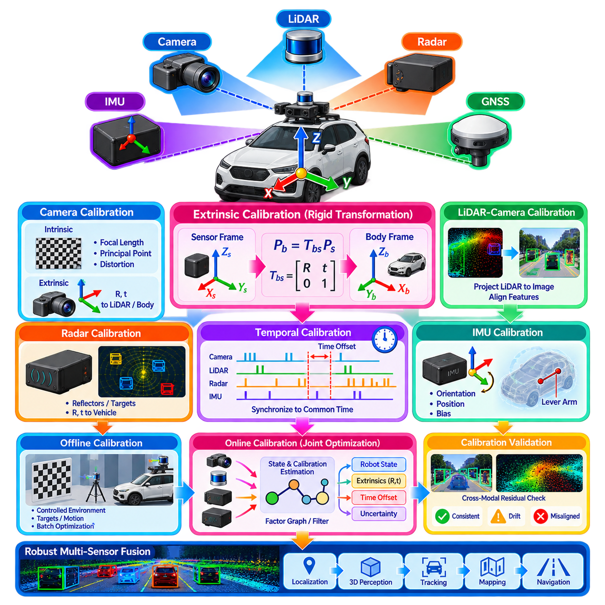

**Volume 14. Perception and Sensor Fusion**

# Chapter 06. Multi Sensor Fusion

## 06.01. Sensor Fusion Architectures Early Late Deep Fusion

{width="7.268055555555556in" height="7.268055555555556in"}

Sensor fusion combines observations from multiple sensing modalities so that a robot can construct a more complete and reliable representation of its environment than any individual sensor can provide. Cameras contribute rich appearance and semantic information, LiDAR provides accurate three-dimensional geometry, radar measures range and relative velocity robustly, while IMUs supply high-rate motion information. Fusion architecture determines where these complementary signals interact within the perception pipeline.

The fundamental architectural choice is the fusion stage. Early fusion combines sensor measurements or minimally processed representations near the input of the perception system. Late fusion allows each modality to generate independent estimates before combining their decisions. Deep fusion performs interaction inside learned neural representations, often across several intermediate layers. These approaches differ significantly in information preservation, computational cost, synchronization requirements, robustness, and model complexity.

Early fusion attempts to preserve as much raw sensor information as possible before higher-level interpretation occurs. Measurements from cameras, LiDAR, radar, or other sensors are transformed into compatible spatial or numerical representations and concatenated, projected, or jointly encoded. For example, LiDAR points may be projected into an image plane, or camera features may be associated with points or voxels before object detection is performed.

The primary advantage of early fusion is that relationships between modalities can be exploited before information is compressed into object-level decisions. Image texture may help distinguish objects having similar geometry, while LiDAR depth can resolve ambiguities inherent in monocular vision. However, this architecture places strong demands on calibration and synchronization because measurements must represent approximately the same physical scene and must be geometrically aligned in a common coordinate framework.

Early fusion can also be sensitive to heterogeneous sensor characteristics. Camera images are dense two-dimensional arrays, LiDAR measurements are sparse three-dimensional point sets, radar returns contain range and Doppler information, and IMUs generate high-frequency temporal sequences. Directly combining these representations is therefore rarely trivial. Practical systems usually require projection, voxelization, interpolation, coordinate transformation, normalization, or another representation conversion before meaningful fusion becomes possible.

Late fusion takes the opposite approach by allowing each sensor pipeline to operate largely independently. A camera detector may estimate object classes and bounding boxes, a LiDAR detector may produce three-dimensional objects, and radar processing may estimate targets and velocities. These outputs are subsequently associated and combined using geometric correspondence, probabilistic reasoning, confidence weighting, tracking, or rule-based logic to obtain a consolidated environmental interpretation.

This separation provides important engineering advantages. Individual perception modules can be developed, validated, replaced, or degraded independently, and a failure in one modality does not necessarily corrupt the internal representation of another. Late fusion therefore supports modular software architectures and graceful degradation. It is especially attractive in production robots where diagnostic visibility, sensor redundancy, maintainability, and explicit failure handling may be as important as maximum perception accuracy.

The limitation of late fusion is that considerable information may already have been discarded before fusion occurs. Once a camera network converts an image into a small set of detections, subtle visual evidence that could have supported LiDAR interpretation may no longer be available. Similarly, geometric structures removed during point-cloud processing cannot contribute to subsequent cross-modal reasoning. Late fusion consequently trades some representational richness for modularity and architectural simplicity.

Deep fusion introduces learned interactions between sensor representations inside neural networks. Instead of combining only raw measurements or final decisions, modality-specific encoders first transform inputs into latent features. Fusion modules then exchange, concatenate, attend to, or aggregate these features before downstream prediction. Because the network can learn which information from each modality is useful, deep fusion can model complex cross-modal relationships that are difficult to specify manually.

Feature alignment is a central problem in deep fusion. Representations may be transformed into a common image plane, voxel grid, point-based space, or bird\'s-eye-view representation. Bird\'s-eye-view fusion is particularly useful for mobile robots because camera, LiDAR, and radar information can be expressed relative to the robot on a shared ground-oriented coordinate system. Once aligned, learned networks can reason jointly about geometry, semantics, motion, free space, and surrounding objects.

Attention mechanisms provide another powerful strategy for deep multimodal fusion. Rather than treating every sensor contribution equally, attention can learn relationships between features and selectively emphasize information relevant to the current spatial region or task. Cross-attention can allow camera features to query geometric features or vice versa. Such mechanisms reduce dependence on simple concatenation and provide flexible interaction between heterogeneous representations at multiple scales.

Deep fusion does not eliminate classical engineering requirements. Accurate intrinsic and extrinsic calibration remains necessary whenever features must correspond geometrically, while timestamp alignment is essential when the robot or surrounding objects are moving. A small temporal offset can translate into significant spatial disagreement at high velocity. Therefore, synchronization, coordinate transformations, motion compensation, calibration monitoring, and uncertainty management remain foundational components even in highly learned fusion systems.

Temporal fusion extends the architecture beyond measurements captured at a single instant. Sensor histories can provide information about motion, persistence, visibility, and temporary occlusion. Recurrent models, temporal convolutions, transformers, tracking filters, or accumulated bird\'s-eye-view features can integrate observations across time. This is particularly valuable when objects are intermittently hidden or when sparse sensors require several measurements to establish stable velocity and geometry estimates.

Uncertainty should influence how information is fused. Sensor quality changes with environmental conditions: cameras may deteriorate in darkness or glare, LiDAR may experience degradation from precipitation or reflective surfaces, and radar may generate multipath or ambiguous returns. A robust fusion architecture should avoid assuming constant sensor reliability. Confidence estimation, covariance modeling, learned weighting, consistency checks, and sensor-health information can dynamically modify the contribution of each modality.

The distinction between early, late, and deep fusion should therefore not be interpreted as three mutually exclusive designs. Practical robotic perception systems frequently employ hybrid architectures. Raw or low-level measurements may be fused for localization, intermediate neural features may be combined for object and occupancy perception, and final detections may undergo late fusion with independent safety channels. Different fusion stages can coexist because different robot functions have different latency, accuracy, explainability, and reliability requirements.

Architecture selection ultimately depends on the operational objective rather than on a universally superior fusion method. Early fusion favors information richness but requires tight alignment, late fusion favors modularity and fault isolation, and deep fusion offers powerful learned cross-modal reasoning at the cost of training and computational complexity. Production systems must balance these properties against available sensors, edge-compute resources, real-time deadlines, environmental conditions, and safety requirements.

For Physical AI systems, sensor fusion increasingly becomes more than a mechanism for improving object detection. The fused representation can serve as the perceptual state consumed by occupancy prediction, semantic mapping, navigation, manipulation, world models, and action policies. A well-designed architecture therefore transforms heterogeneous sensor streams into a spatially and temporally coherent representation that supports both immediate robot control and higher-level reasoning about the physical world.

## 06.02. Extended Kalman Filter for Multi Sensor Fusion [w/Code]

{width="7.268055555555556in" height="7.268055555555556in"}

An Extended Kalman Filter (EKF) provides a practical probabilistic framework for combining measurements from multiple sensors when the robot system is nonlinear but can be approximated locally by a linear model. In multi-sensor fusion, the EKF maintains an estimate of the robot state together with its uncertainty and continuously incorporates measurements from sensors such as cameras, LiDAR, radar, GNSS, and IMU. The corresponding chapter is positioned within the multi-sensor fusion section of the perception architecture. :chatgpt-content-reference{index="0"}

The central concept of the EKF is to represent the robot state as a probability distribution characterized primarily by a state vector and covariance matrix. A typical state may contain position, velocity, orientation, and sensor-related parameters such as biases. The covariance expresses uncertainty associated with the estimated state. Instead of treating sensor measurements as exact values, the EKF continuously evaluates how uncertain the current estimate is and how much new measurements should modify that estimate.

The EKF operates through two fundamental stages: prediction and measurement update. During prediction, the system uses a motion model together with control inputs or inertial measurements to propagate the previous state forward in time. The covariance is propagated simultaneously through the system dynamics. This produces a predicted state and uncertainty before the next external sensor measurement becomes available.

The measurement update incorporates an observation from a sensor into the predicted state. A measurement model describes how the current state should appear in the sensor\'s measurement space. The difference between the actual measurement and the predicted measurement forms the innovation or residual. The EKF uses the residual together with the predicted uncertainty and measurement noise to determine how strongly the observation should influence the state estimate.

Because robotic systems are generally nonlinear, the EKF approximates nonlinear motion and measurement models through local linearization. The Jacobian matrix represents how small changes in the state affect the predicted system behavior or sensor observation. These Jacobians are used to propagate covariance and calculate the Kalman gain. The quality of this local approximation strongly affects filter stability and estimation accuracy, particularly when the robot undergoes large rotations or highly nonlinear motion.

The Kalman gain determines the relative influence of the prediction and the incoming measurement. When the predicted state is highly uncertain but the sensor measurement is reliable, the measurement receives greater influence. When the measurement is noisy and the prediction is relatively certain, the filter relies more heavily on the predicted state. This adaptive weighting allows heterogeneous sensors with different accuracy and update rates to contribute according to their estimated uncertainty.

Multi-sensor fusion becomes particularly useful when sensors operate at different frequencies and provide complementary information. An IMU can provide high-rate acceleration and angular velocity measurements for short-term motion propagation, while GNSS can provide slower absolute position observations. LiDAR or camera measurements can provide geometric constraints, and radar can contribute range or velocity information. The EKF provides a common probabilistic state-estimation framework through which these asynchronous observations can be incorporated.

Coordinate frames and calibration are fundamental to reliable EKF fusion. Each sensor may measure information in its own coordinate system, so observations must be transformed into the state-estimation frame before they can be used consistently. Extrinsic calibration defines the relative position and orientation between sensors, while intrinsic calibration describes sensor-specific measurement characteristics. Incorrect transformations can introduce systematic estimation errors that cannot be removed simply by tuning filter parameters.

Sensor noise models are equally important because the EKF depends directly on process and measurement covariance. Process noise represents uncertainty in the motion model, actuator behavior, or unmodeled dynamics, while measurement noise represents uncertainty in individual sensor observations. If these covariance values are poorly selected, the filter may become excessively dependent on measurements or prediction. Practical systems therefore require covariance tuning, validation against real data, and monitoring of estimation consistency.

Outlier handling is an important consideration in real robotic systems. A sensor measurement may occasionally be inconsistent because of visual misdetections, LiDAR artifacts, radar multipath, GNSS degradation, or temporary environmental interference. Innovation-based consistency checks can compare an incoming measurement against the predicted observation before accepting it. Measurements that exceed an appropriate statistical threshold can be rejected, down-weighted, or processed through a separate fault-handling mechanism.

The EKF is particularly attractive for production robotics because it provides a computationally efficient and interpretable estimation mechanism. Its recursive structure requires only the current state, covariance, and incoming measurements rather than storing an entire measurement history. This makes it suitable for real-time embedded and edge systems where computational resources and latency are constrained. It can also be integrated naturally with localization, odometry, navigation, and perception pipelines.

However, the EKF has limitations that must be considered when designing a multi-sensor fusion system. Its local linearization can become inaccurate when the system exhibits strong nonlinearities or when uncertainty becomes large. Poor initialization, incorrect Jacobians, inconsistent covariance models, or severe sensor faults can cause divergence. For highly nonlinear estimation problems, alternatives such as the Unscented Kalman Filter, Particle Filter, or optimization-based Factor Graph methods may provide different trade-offs.

In a complete robot perception architecture, the EKF should therefore be viewed as a state-estimation component rather than as a universal fusion solution. Its effectiveness depends on accurate system modeling, calibration, synchronization, uncertainty representation, and sensor-health management. When these foundations are properly designed, EKF-based fusion can transform heterogeneous sensor observations into a temporally continuous and probabilistically consistent estimate of robot motion and environmental state.

## 06.03. Unscented Kalman Filter Nonlinear Fusion [w/Code]

{width="7.268055555555556in" height="7.268055555555556in"}

The Unscented Kalman Filter (UKF) is a recursive Bayesian state-estimation method designed for nonlinear systems where conventional linear filtering is insufficient. In multi-sensor fusion, it combines observations from sensors such as IMUs, GNSS, cameras, LiDAR, and radar while maintaining an estimate of the system state and its uncertainty. Unlike the Extended Kalman Filter, the UKF does not require explicit Jacobian-based linearization of nonlinear models.

The central idea of the UKF is the Unscented Transform, which approximates how a probability distribution changes when it passes through a nonlinear function. Instead of approximating the nonlinear function itself, the UKF selects a deterministic set of representative state samples called sigma points. These points capture the mean and covariance of the current state distribution and are individually propagated through the actual nonlinear system equations.

For a state vector of dimension n, a standard UKF constructs a compact set of sigma points around the estimated mean using the state covariance. Scaling parameters control how widely these points are distributed and how their corresponding weights contribute to the reconstructed statistics. The sigma-point formulation represents uncertainty geometrically and allows nonlinear transformations to deform the distribution without calculating derivatives of the underlying motion or measurement functions.

During the prediction stage, every sigma point is propagated through the nonlinear motion model. A mobile robot model, for example, may include nonlinear relationships among position, velocity, orientation, angular rate, acceleration, and sensor biases. After propagation, the transformed sigma points are recombined using predefined weights to calculate the predicted state mean and covariance. Process noise is then incorporated to represent uncertainty in dynamics and unmodeled disturbances.

The measurement-update stage applies the sensor measurement model to the predicted sigma points. Each sigma point is transformed into the expected measurement space, producing a distribution of predicted observations. Their weighted mean forms the predicted measurement, while their spread determines measurement covariance. Cross-covariance between the predicted state and measurement is then used to calculate the Kalman gain and correct the state using the actual sensor observation.

This mechanism is particularly useful when sensor observations contain strongly nonlinear relationships. Range and bearing measurements from radar, perspective geometry from cameras, orientation represented through rotations, and nonlinear vehicle-motion models can challenge first-order linearization. Because the UKF evaluates the nonlinear functions directly at multiple representative points, it can capture effects that may be lost when an Extended Kalman Filter relies only on a local Jacobian approximation.

In robotic multi-sensor fusion, high-rate IMU measurements can drive continuous motion prediction while lower-rate sensors provide correction observations. GNSS can constrain global position, LiDAR can provide geometric pose information, cameras can contribute visual odometry or landmark observations, and radar can supply range and velocity measurements. The UKF can process these heterogeneous and asynchronous measurements sequentially as they arrive while maintaining a unified probabilistic state.

The state vector must be designed according to the estimation objective. A mobile robot may estimate three-dimensional position, linear velocity, orientation, accelerometer bias, and gyroscope bias. Additional states can represent calibration parameters, scale factors, or other slowly varying quantities. Increasing state dimension, however, increases the number of sigma points and computational cost, so production implementations should include only states that materially improve the required estimation performance.

Orientation requires special attention because three-dimensional rotation does not behave like an ordinary Euclidean vector. Directly averaging orientation parameters can create numerical or geometric inconsistencies, particularly when rotations become large. Practical UKF implementations may use quaternions, error-state representations, or manifold-aware operations so that sigma-point generation, propagation, and state correction remain consistent with the geometry of three-dimensional rotation.

Process and measurement noise remain fundamental to UKF performance. The process-noise covariance describes uncertainty in robot dynamics, control inputs, inertial integration, and unmodeled disturbances. Measurement covariance represents sensor uncertainty. If these values underestimate real uncertainty, the filter may become overconfident and reject useful corrections. Excessive covariance can instead produce unstable or unnecessarily noisy estimates, making realistic noise characterization essential.

Multi-sensor systems must also address synchronization, coordinate transformations, and calibration independently of the nonlinear estimator. Camera, LiDAR, radar, GNSS, and IMU observations may originate at different timestamps and in different coordinate frames. Extrinsic transformations must relate the sensor frames accurately, while temporal alignment or motion compensation must account for robot movement between measurements. The UKF cannot compensate automatically for systematic errors introduced by incorrect calibration.

Robust fusion additionally requires measurement validation. Sensor observations can become unreliable because of GNSS multipath, visual tracking failure, LiDAR degradation, radar ambiguity, vibration, or communication faults. Innovation statistics can be compared with expected measurement uncertainty to detect inconsistent observations. Outlier rejection, adaptive covariance adjustment, sensor-health monitoring, or temporary exclusion of failed modalities can prevent corrupted measurements from destabilizing the fused state estimate.

Compared with the Extended Kalman Filter, the UKF removes the need to derive and maintain Jacobian matrices and can provide better nonlinear uncertainty propagation in suitable problems. The trade-off is greater computation because several sigma points must pass through the motion and measurement models during every update. The relative benefit therefore depends on state dimension, nonlinear severity, update frequency, available edge-computing resources, and required estimation accuracy.

The UKF should consequently be selected as part of the overall sensor-fusion architecture rather than treated as an automatically superior replacement for the EKF. It is especially valuable when nonlinear transformations are significant, Jacobians are difficult or error-prone, and computational resources permit sigma-point propagation. When combined with accurate models, calibration, timing, noise estimation, and fault handling, it provides a powerful framework for real-time nonlinear multi-sensor state estimation.

## 06.04. Particle Filter Based Multi Sensor Fusion [w/Code]

{width="7.268055555555556in" height="7.268055555555556in"}

Particle Filter based multi-sensor fusion provides a probabilistic state-estimation framework for robotic systems whose dynamics, measurements, or uncertainty cannot be represented adequately by Gaussian assumptions. Instead of describing the state using only a mean and covariance, a Particle Filter represents the posterior probability distribution with a collection of weighted samples called particles. This allows the estimator to represent nonlinear, non-Gaussian, and even multimodal state distributions.

Each particle represents one hypothesis about the possible state of the robot or environment. A particle may contain position, orientation, velocity, sensor biases, or other variables required by the estimation problem. Associated weights indicate how well individual hypotheses agree with available observations. The complete particle population therefore approximates the probability distribution of the hidden state rather than forcing uncertainty into a single Gaussian distribution.

Particle filtering is based on recursive Bayesian estimation. Given a previous posterior distribution, the filter first predicts how each state hypothesis evolves according to a motion or process model. New sensor observations are then evaluated to determine how probable they are under each predicted hypothesis. The resulting likelihood modifies particle weights, producing an approximation of the posterior distribution conditioned on both previous information and the latest measurements.

During prediction, every particle is propagated independently through the robot\'s motion model. For a mobile robot, this model may use wheel odometry, commanded velocity, IMU measurements, or vehicle dynamics to estimate the next pose. Random process noise is sampled during propagation so that the particle population represents uncertainty in motion. Consequently, particles spread through the state space according to both system dynamics and uncertainty rather than following one deterministic trajectory.

The measurement-update stage evaluates predicted particles using incoming sensor observations. A measurement likelihood model calculates how consistent a camera, LiDAR, radar, GNSS, or other observation is with the state represented by each particle. Particles that explain the observation well receive high weights, while inconsistent hypotheses receive low weights. Measurements from multiple sensors can be incorporated sequentially or through a combined likelihood model when their statistical relationships are properly considered.

Resampling is the mechanism that concentrates computational resources on plausible regions of the state space. After repeated measurement updates, a small number of particles may contain most of the probability mass while many others have negligible weights. Resampling generates a new population by preferentially selecting high-weight particles and discarding unlikely ones. This maintains useful hypotheses but can also reduce particle diversity if resampling is performed too aggressively.

Particle degeneracy occurs when nearly all particle weights approach zero except for a few samples. Effective sample size is commonly used to determine when resampling is necessary rather than resampling at every update. Another challenge is particle impoverishment, where repeated replication of successful particles removes diversity from the population. Appropriate process noise, adaptive resampling, improved proposal distributions, or controlled particle injection can help preserve alternative hypotheses.

The ability to maintain multiple hypotheses is a major advantage over Gaussian filters such as the EKF and UKF. A robot may initially be uncertain between several possible locations, visual or geometric observations may produce ambiguous associations, and symmetric environments may generate multiple plausible poses. A Particle Filter can preserve these separate probability modes until additional measurements provide sufficient evidence to eliminate incorrect hypotheses.

This property makes Particle Filters particularly suitable for localization. In Monte Carlo Localization, particles represent candidate robot poses and sensor observations progressively concentrate them around positions consistent with the map. LiDAR scans can be compared with occupancy maps, cameras can contribute landmark or semantic observations, and wheel odometry or IMU data can propagate motion. Global localization and recovery from localization failure are therefore natural applications of particle-based estimation.

Multi-sensor fusion requires carefully designed likelihood functions because different sensors provide fundamentally different measurement structures. GNSS may produce global position observations, radar may provide range and velocity, LiDAR may generate geometric scan correspondence, and cameras may observe features, objects, or landmarks. Each measurement model should translate sensor evidence into a likelihood that can be evaluated consistently for the state hypothesis represented by each particle.

Sensor uncertainty should directly influence these likelihood calculations. A highly accurate observation should produce a concentrated likelihood distribution, strongly favoring particles consistent with the measurement. A noisy or degraded sensor should produce a broader likelihood so that it does not eliminate plausible hypotheses prematurely. Dynamic covariance estimation, sensor-health information, environmental conditions, and confidence measures can therefore be incorporated into particle weighting for robust fusion.

Asynchronous sensors can be handled by updating the particle distribution whenever a timestamped measurement becomes available. However, accurate temporal alignment remains essential because the robot may move significantly between sensor observations. Coordinate transformations and extrinsic calibration must also place measurements into compatible reference frames. Like other probabilistic estimators, a Particle Filter cannot inherently correct systematic errors caused by incorrect calibration or synchronization.

Particle Filters impose substantial computational requirements because motion propagation and likelihood evaluation must be repeated for many particles. The computational cost increases with particle count, state dimension, sensor complexity, and update frequency. Efficient implementations can parallelize particle operations on multicore CPUs or GPUs, reduce expensive measurement evaluations, adapt the number of particles, and use hierarchical or coarse-to-fine strategies to satisfy real-time constraints.

The number of particles represents an important engineering trade-off. Too few particles may fail to cover important regions of the state space and can cause the estimator to lose the correct hypothesis. Excessively many particles improve distribution coverage but increase memory usage and computation. Required particle count depends strongly on state dimensionality and uncertainty, which is why Particle Filters are especially effective when the probabilistic problem can be expressed in a relatively compact state space.

In practical robotics, Particle Filters are often combined with other estimation methods rather than used for every state variable. A particle-based estimator may maintain global pose hypotheses while an EKF, UKF, visual-inertial estimator, or local optimizer estimates high-rate continuous motion. Such hybrid architectures exploit the multimodal reasoning capability of particles while avoiding the computational expense of representing a large high-dimensional state entirely through samples.

Particle Filter based multi-sensor fusion is therefore most valuable when ambiguity, nonlinear dynamics, non-Gaussian uncertainty, or multiple competing hypotheses are fundamental characteristics of the estimation problem. Its effectiveness depends on appropriate proposal generation, measurement likelihoods, resampling strategy, calibration, synchronization, and computational design. When these elements are engineered carefully, particle-based estimation provides a flexible foundation for robust localization and sensor fusion in complex robotic environments.

## 06.05. Factor Graph Optimization GTSAM g2o [w/Code]

{width="7.268055555555556in" height="7.268055555555556in"}

Factor graph optimization provides a general framework for estimating robot states by expressing relationships among unknown variables and sensor measurements as a sparse graphical model. Unlike recursive filters that summarize previous information into a single current estimate and covariance, a factor graph can retain constraints across many states over time. This makes it particularly suitable for multi-sensor fusion, localization, SLAM, calibration, and trajectory estimation problems involving complex dependencies.

A factor graph contains variable nodes and factor nodes. Variable nodes represent quantities that must be estimated, such as robot poses, velocities, IMU biases, landmarks, calibration parameters, or object states. Factor nodes represent probabilistic constraints connecting those variables. Odometry, IMU measurements, GNSS observations, camera features, LiDAR registration, radar measurements, and loop closures can therefore be represented within one mathematical structure while retaining their individual uncertainty models.

The probabilistic formulation converts sensor fusion into a maximum a posteriori estimation problem. Each factor contributes an error term describing the difference between an observed measurement and the measurement predicted from the connected state variables. Measurement uncertainty determines how strongly that residual influences the solution. Assuming appropriate probabilistic models, optimization seeks the state configuration that minimizes the combined weighted error generated by all active factors.

A simple example is robot trajectory estimation in which consecutive pose variables are connected by odometry factors. GNSS factors can constrain selected poses to global coordinates, while LiDAR or visual observations introduce relative geometric constraints. IMU factors can connect position, velocity, orientation, and bias states across time. When a previously visited location is recognized, a loop-closure factor can connect distant trajectory states and correct accumulated drift across the entire estimate.

Nonlinear optimization is required because robotic measurement models frequently contain nonlinear transformations involving rotation, projection, range, or rigid-body motion. Factor graph systems typically linearize residual functions around the current state estimate and iteratively solve for state increments. Methods related to Gauss-Newton or Levenberg-Marquardt optimization are commonly employed, with repeated linearization allowing the estimate to converge toward a configuration that better satisfies the complete set of constraints.

Sparsity is one of the most important computational properties of factor graphs. A sensor measurement usually depends on only a small subset of the complete state, so most variables are not directly connected to one another. This produces sparse Jacobian and information matrices that can be exploited by specialized numerical methods. Variable ordering, sparse matrix factorization, elimination strategies, and incremental updates therefore strongly influence memory consumption and optimization speed.

GTSAM provides a widely used software framework for factor-graph-based estimation and smoothing. It represents variables through keys, measurements through factors, and nonlinear estimation problems through collections of these relationships. Robotics applications can construct factors for poses, landmarks, inertial measurements, priors, and sensor observations, then solve the resulting graph using batch or incremental optimization. Its design makes probabilistic graphical modeling explicit within the software architecture.

Incremental smoothing is especially important for continuously operating robots. Instead of solving the complete optimization problem from the beginning whenever a new measurement arrives, algorithms such as iSAM2 update the existing solution by relinearizing and reorganizing only the portions of the graph that require modification. This approach enables long-running estimation systems to incorporate new measurements and loop closures while avoiding the full computational cost of repeated batch optimization.

The g2o framework approaches graph optimization from a closely related perspective and is widely associated with nonlinear least-squares optimization of graph-structured estimation problems. Vertices represent unknown states and edges represent constraints between them. Users define error functions, information matrices, and optimization behavior appropriate to the application. This structure has made g2o useful for pose-graph optimization, visual SLAM, mapping, and other geometric estimation problems.

Although GTSAM and g2o can solve related optimization problems, their abstractions and typical workflows differ. GTSAM emphasizes factor graphs, probabilistic inference, smoothing, and reusable sensor factors, while g2o emphasizes general graph-based nonlinear optimization through vertices and edges. The choice between them should therefore consider existing software architecture, required sensor models, incremental estimation needs, customization requirements, computational constraints, and integration with the surrounding robotics stack.

IMU pre-integration is an important example of factor graph design for multi-sensor fusion. Raw inertial measurements arrive at much higher rates than cameras, LiDAR, or GNSS, and creating a separate optimization state for every IMU sample would be inefficient. Pre-integration summarizes many accelerometer and gyroscope measurements between selected states while preserving their dependence on motion and bias, allowing inertial information to enter the graph as compact constraints.

Robust estimation is necessary because incorrect measurements can strongly distort an optimization result. Visual feature mismatches, false loop closures, GNSS multipath, LiDAR registration failures, or radar ambiguities may produce large residuals inconsistent with the true trajectory. Robust loss functions can reduce the influence of extreme residuals, while gating, consistency tests, switchable constraints, or sensor-health logic can prevent unreliable observations from dominating the optimization.

Factor graphs also provide a natural mechanism for estimating parameters that would otherwise be treated as fixed. Sensor extrinsic transformations, time offsets, IMU biases, scale factors, or landmark positions can become optimization variables when sufficient observations make them observable. Jointly estimating these quantities can improve consistency, but it also increases state dimension and may introduce poorly constrained directions. Observability and parameter correlation must therefore be considered carefully.

Marginalization becomes important when the graph grows continuously. A robot cannot necessarily retain every historical state and measurement indefinitely, especially on embedded or edge-computing platforms. Fixed-lag smoothing maintains a moving temporal window and marginalizes older variables while preserving their relevant information as prior constraints. This creates a practical compromise between filter-like bounded computation and full smoothing over an entire trajectory.

Compared with EKF or UKF fusion, factor graph optimization can reconsider earlier states when new information becomes available. A loop closure detected minutes later, for example, can modify previous poses and distribute corrections through the trajectory rather than affecting only the current estimate. The cost is greater memory usage, optimization complexity, and implementation overhead. Factor graphs are therefore especially valuable when global consistency and retrospective correction justify additional computation.

A production implementation must address more than the optimizer itself. Accurate timestamps, coordinate frames, sensor calibration, covariance models, initialization, outlier rejection, numerical conditioning, and failure recovery remain essential. The graph must also be managed so that computation stays within real-time limits. Monitoring residuals and optimization convergence can provide valuable diagnostic information about sensor quality, calibration drift, and inconsistencies within the estimation pipeline.

Factor graph optimization ultimately transforms multi-sensor fusion from sequential measurement correction into joint constraint reasoning. GTSAM and g2o provide practical foundations for implementing this approach, while batch optimization, incremental smoothing, robust factors, pre-integration, and marginalization make it applicable to real robotic systems. Properly engineered, factor graphs provide a scalable framework for producing spatially and temporally consistent state estimates from heterogeneous sensor information.

## 06.06. Camera LiDAR Deep Fusion BEVFusion SparseFusion [w/Code]

{width="7.268055555555556in" height="7.268055555555556in"}

Camera--LiDAR deep fusion combines the complementary strengths of visual appearance and precise three-dimensional geometry within a learned perception architecture. Cameras provide dense texture, color, semantic cues, and long-range visual context, while LiDAR supplies accurate depth and spatial structure. Deep fusion methods such as BEVFusion and SparseFusion integrate these modalities inside neural feature representations rather than combining only raw measurements or final detection outputs.

The central challenge is that camera and LiDAR data exist in fundamentally different representations. Camera images are dense perspective projections defined on two-dimensional pixel grids, whereas LiDAR produces sparse three-dimensional points distributed through physical space. Effective fusion therefore requires a mechanism that establishes spatial correspondence while preserving useful modality-specific information. Calibration, coordinate transformation, feature projection, and learned representation alignment form the foundation of this process.

BEVFusion addresses this representation mismatch by transforming multimodal information into a common bird's-eye-view, or BEV, coordinate space. Camera images are processed by image backbones to generate semantic feature maps, which are subsequently transformed from perspective views into BEV features. LiDAR points are independently encoded into geometric BEV representations. Once both modalities occupy a compatible spatial frame, their features can be combined efficiently for downstream perception tasks.

The camera branch typically begins with multiple surround-view images processed through convolutional or transformer-based feature extractors. Image features contain information about object appearance, boundaries, road structure, signs, and semantic context, but they do not directly provide reliable metric depth. A view-transformation stage therefore projects or lifts these perspective features into three-dimensional or BEV space using camera calibration and depth-related reasoning before multimodal fusion occurs.

The LiDAR branch converts sparse point measurements into a representation suitable for efficient neural processing. Points may be voxelized or organized into pillars, after which sparse convolutional networks or point-cloud encoders extract geometric features. LiDAR provides accurate range, object shape, free-space boundaries, and vertical structure, making it a strong geometric reference for fusion. Its sparse nature, however, can limit semantic detail at long range or on weakly sampled surfaces.

Once camera and LiDAR features have been transformed into a shared BEV space, BEVFusion combines them using feature concatenation, convolutional fusion, attention, or related learned operations. The resulting representation contains both geometric and semantic information indexed in a robot-centered spatial coordinate system. Detection, segmentation, occupancy estimation, or map prediction heads can then operate on a unified feature map rather than independently processing each sensor output.

A major advantage of BEV representation is its compatibility with mobile robot reasoning. Navigation and autonomous driving decisions are naturally expressed relative to the ground plane, where object position, free space, lanes, obstacles, and motion relationships are directly relevant. A shared BEV representation also simplifies downstream integration because perception outputs can align naturally with occupancy maps, local planning, tracking, and trajectory generation components.

SparseFusion represents another direction in deep multimodal fusion by emphasizing sparse object-level or query-oriented representations rather than relying entirely on dense BEV feature grids. Sparse representations can focus computation on potentially meaningful objects or spatial hypotheses, reducing unnecessary processing of large empty regions. Camera and LiDAR information can be associated through learned queries or sparse features that encode object geometry, semantics, and cross-modal relationships.

Query-based fusion is particularly useful when the primary objective is object-centric perception. Instead of generating dense predictions at every spatial location, a limited set of learned object queries can gather evidence from image and point-cloud features. Cross-attention mechanisms allow these queries to retrieve relevant information from different modalities and views. Each query can progressively evolve into an object hypothesis containing category, position, dimensions, orientation, confidence, and other attributes.

Deep fusion can exploit complementary sensor characteristics more effectively than simple late fusion. A distant object with few LiDAR points may still have strong visual evidence, while an object with ambiguous visual appearance may possess clear geometric structure in LiDAR. Learned fusion modules can combine these signals before final decisions are produced, allowing one modality to resolve uncertainty in another. This interaction is one of the principal motivations for feature-level multimodal perception.

Accurate calibration remains essential despite the use of learned neural networks. Camera intrinsic parameters determine image projection geometry, while camera-to-LiDAR extrinsic calibration defines the rigid transformation between sensor coordinate systems. Small rotational or translational errors can shift features significantly, especially at long distances. Calibration validation and online monitoring are therefore necessary for maintaining reliable cross-modal correspondence in deployed robotic systems.

Temporal synchronization is equally important because camera frames and LiDAR scans are not necessarily captured at exactly the same instant. Robot ego-motion and dynamic objects can create spatial disagreement between modalities when timestamps differ. Hardware synchronization, precise timestamps, ego-motion compensation, and temporal feature alignment can reduce these errors. Temporal fusion may additionally aggregate information from previous frames to improve stability, velocity reasoning, and robustness under temporary occlusion.

Robust multimodal perception must also consider sensor degradation and failure. Cameras may become unreliable under darkness, glare, contamination, or severe weather, while LiDAR can suffer from sparse returns, precipitation artifacts, reflective surfaces, or partial obstruction. A fusion network should avoid depending blindly on one modality. Modality dropout during training, confidence-aware fusion, uncertainty estimation, sensor-health monitoring, and fallback perception paths can improve resilience.

Training deep fusion systems requires datasets in which sensor streams are accurately calibrated, synchronized, and annotated. Data augmentation must preserve cross-modal consistency; geometric transformations applied to LiDAR should correspond appropriately to image transformations and calibration parameters. Sensor-specific augmentation can simulate missing measurements, image degradation, sparse point clouds, or calibration perturbations so that the learned representation becomes less sensitive to realistic deployment variations.

Computational architecture is an important consideration for edge deployment. Multi-camera image backbones, LiDAR encoders, view transformation, cross-modal fusion, and prediction heads can collectively demand substantial GPU memory and processing throughput. Efficient backbone selection, reduced BEV resolution, sparse computation, mixed-precision inference, quantization, TensorRT optimization, and careful scheduling can reduce latency while preserving the perception accuracy required for real-time robotic operation.

BEVFusion and SparseFusion therefore illustrate two complementary architectural principles. BEV-oriented fusion emphasizes a common dense spatial representation suitable for comprehensive scene reasoning, whereas sparse or query-oriented fusion emphasizes object-centric representations and computational selectivity. Practical systems may combine both concepts, using dense BEV features for occupancy and navigation while employing sparse queries for object detection and tracking.

For Physical AI and autonomous robots, Camera--LiDAR deep fusion ultimately serves as a bridge between raw multimodal sensing and structured spatial intelligence. By aligning semantic image information with metric three-dimensional geometry, the fused representation can support detection, tracking, occupancy prediction, semantic mapping, navigation, manipulation, and world-model construction. Its effectiveness depends not only on neural architecture but also on calibration, synchronization, uncertainty handling, training quality, and real-time deployment engineering.

## 06.07. LiDAR Radar Camera Late Fusion Pipeline [w/Code]

{width="7.268055555555556in" height="7.268055555555556in"}

Late fusion provides a modular approach to multi-sensor perception in which LiDAR, radar, and camera data are processed independently before their detection or tracking results are combined. Rather than forcing heterogeneous raw measurements into a common representation at the beginning of the pipeline, each sensor retains a specialized processing chain optimized for its physical characteristics. Fusion occurs after meaningful objects, tracks, or environmental hypotheses have already been generated.

The camera pipeline primarily extracts appearance and semantic information from images. Neural object detectors can identify vehicles, pedestrians, cyclists, signs, and other relevant classes while estimating image-space bounding boxes, segmentation masks, keypoints, or confidence scores. Cameras provide rich semantic discrimination and angular resolution, but monocular depth and velocity estimates may remain uncertain, especially under poor illumination, glare, occlusion, or adverse weather conditions.

The LiDAR pipeline independently processes three-dimensional point clouds to recover metric geometry. Point-based, voxel-based, pillar-based, or sparse convolutional networks can detect objects and estimate their three-dimensional position, dimensions, orientation, and confidence. LiDAR offers accurate range and spatial structure, making it valuable for obstacle geometry and free-space reasoning, although point density decreases with distance and measurements can degrade under certain weather or reflective conditions.

Radar contributes a different form of information by measuring range, radial velocity, angle, and reflected signal characteristics. Its direct Doppler velocity measurement is particularly useful for distinguishing moving objects and estimating relative motion. Radar can also remain operational under environmental conditions that challenge optical sensing. However, radar detections are generally sparse and may contain multipath reflections, clutter, uncertain angular measurements, or ambiguous associations requiring dedicated preprocessing and tracking.

In a late-fusion architecture, each modality produces a standardized set of object-level outputs before fusion. A camera result may contain class, image bounding box, confidence, and estimated depth; LiDAR may provide a three-dimensional bounding box and pose; radar may provide target position and radial velocity. Converting these heterogeneous outputs into compatible object representations allows the fusion module to reason about correspondence without requiring direct fusion of raw sensor tensors.

Coordinate transformation is essential because detections originate in different sensor frames. Camera observations are associated with image coordinates and camera geometry, while LiDAR and radar detections are naturally represented in their respective three-dimensional coordinate systems. Extrinsic calibration transforms these results into a common robot, vehicle, or world coordinate frame. Accurate intrinsic camera calibration is also required when projecting three-dimensional hypotheses into image space for association.

Temporal alignment is equally important in a late-fusion pipeline. Cameras, LiDARs, and radars may operate at different frequencies and generate measurements with different acquisition delays. A moving robot or dynamic object can therefore occupy different positions at nominally nearby timestamps. Timestamp management, buffering, interpolation, ego-motion compensation, and track prediction can align observations to a common fusion time before association and state estimation are performed.

Data association determines which independently generated observations correspond to the same physical object. Geometric distance, three-dimensional intersection-over-union, projected image overlap, class compatibility, velocity consistency, appearance embeddings, or combinations of these measures can define association costs. Assignment algorithms then establish correspondences between sensor detections or existing tracks while rejecting combinations that are physically or semantically inconsistent.

Gating reduces incorrect associations before more expensive matching is attempted. A camera detection and LiDAR object may be considered compatible only if the projected three-dimensional box overlaps the image observation sufficiently. Radar targets may be gated according to predicted range, position, or velocity. Statistical gates based on estimated covariance can account for sensor uncertainty, preventing measurements far outside a plausible region from contaminating the fused object state.

After association, object attributes can be fused according to the strengths and uncertainties of individual sensors. LiDAR may dominate metric position and object dimensions, radar can strongly influence radial velocity, and cameras may provide the most reliable semantic class. Weighted averaging, Bayesian estimation, Kalman filtering, covariance intersection, confidence rules, or learned fusion modules can combine these attributes while preserving explicit estimates of uncertainty.

Tracking provides temporal continuity above the detection layer. A fused tracker maintains object identities and estimates position, velocity, acceleration, orientation, and uncertainty across successive frames. Sensor detections can update existing tracks whenever they become available, while prediction maintains tracks during temporary observation gaps. This asynchronous track-level architecture is useful when individual sensors operate at different rates or intermittently fail to detect an object.

One important advantage of late fusion is modularity. Camera, LiDAR, and radar perception modules can be developed, tested, replaced, or upgraded independently as long as they maintain compatible output interfaces. A new camera detector does not necessarily require retraining the LiDAR network, and radar processing can evolve separately. This property simplifies engineering integration and supports heterogeneous hardware configurations across different robot or vehicle product variants.

Late fusion also supports fault isolation and graceful degradation. If a camera becomes unavailable because of darkness or contamination, LiDAR and radar pipelines can continue producing observations. If LiDAR performance deteriorates, radar and camera detections may preserve partial environmental awareness. Sensor-health information can modify confidence, disable unreliable measurements, or change association thresholds so that one degraded modality does not automatically corrupt the entire fused perception output.

The principal limitation is that late fusion discards information before cross-modal interaction occurs. Once an image has been reduced to object detections, its dense visual features are no longer available to improve weak LiDAR observations. Likewise, detailed point-cloud geometry may disappear after conversion into bounding boxes. Consequently, late fusion may miss cross-modal relationships that feature-level or deep fusion architectures can learn directly from richer intermediate representations.

False negatives present another challenge because late fusion can combine only information that reaches the fusion stage. If a sensor-specific detector fails to generate an object hypothesis, later fusion cannot recover all of the discarded evidence from that modality. Multi-sensor track management, permissive candidate generation, sensor-specific confidence calibration, and fusion of unmatched detections can reduce this problem, but detector quality remains a fundamental dependency.

A production pipeline therefore requires carefully designed interfaces describing object states, coordinate frames, timestamps, covariance, confidence, class probabilities, sensor identity, and validity information. Diagnostic logging should preserve association decisions and sensor contributions so that failures can be analyzed. Deterministic latency, bounded queues, stale-measurement handling, calibration monitoring, and fallback modes are also necessary when fusion participates directly in navigation or safety-related functions.

For autonomous robots and Physical AI systems, LiDAR--radar--camera late fusion offers a practical balance between multimodal robustness and engineering modularity. It is particularly appropriate when mature sensor-specific perception modules already exist or when independent safety and diagnostic paths are required. Although it sacrifices some information richness compared with deep fusion, a carefully designed late-fusion pipeline can deliver interpretable, fault-tolerant object perception and tracking for real-time robotic operation.

## 06.08. Temporal Fusion History Aggregation [w/Code]

{width="7.268055555555556in" height="7.268055555555556in"}

Temporal fusion extends perception beyond isolated sensor snapshots by integrating observations collected across multiple time steps. Instead of estimating the environment independently at every frame, the system preserves useful information from previous observations and combines it with current measurements. This history aggregation provides temporal continuity, improves robustness to incomplete sensing, and enables perception systems to reason about motion, persistence, and changing environmental states.

A single sensor frame contains only a partial observation of the physical world. Objects may be temporarily occluded, LiDAR returns may be sparse, camera detections may fluctuate, and radar measurements may contain noise or ambiguity. By accumulating evidence across time, temporal fusion can recover information that is weak or missing in an individual frame. Repeated observations also help distinguish persistent environmental structure from transient measurement artifacts.

The basic temporal fusion pipeline begins with a sequence of timestamped sensor observations. Each frame is encoded into features, objects, point clouds, occupancy representations, or other intermediate states. Historical information is then transformed into the coordinate frame associated with the current observation before aggregation. This alignment step is essential because both the robot and surrounding objects may move significantly between consecutive measurements.

Ego-motion compensation removes apparent environmental motion caused by movement of the robot itself. Odometry, IMU, visual-inertial estimation, GNSS, or localization results can provide transformations between historical and current robot poses. Previous point clouds, BEV features, object states, or occupancy cells can then be warped into the current coordinate frame. Without accurate compensation, stationary structures may appear duplicated or blurred after temporal accumulation.

Dynamic objects require additional treatment because ego-motion compensation alone assumes that the observed world is static. Vehicles, pedestrians, robots, and other moving entities change position independently between frames. Tracking, scene flow, optical flow, velocity estimates, or learned motion models can predict these changes. Motion-aware temporal alignment prevents historical features from being incorrectly accumulated at obsolete locations and improves consistency around dynamic obstacles.

History aggregation can operate at several representation levels. Raw LiDAR sweeps may be accumulated to increase point density, object detections may be linked through tracking, and intermediate neural features can be propagated through time. Bird's-eye-view representations are particularly suitable because historical spatial features can be transformed into a common robot-centered plane. Occupancy grids and semantic maps can similarly maintain evidence over longer temporal horizons.

Simple aggregation methods include concatenation, averaging, maximum pooling, and exponentially weighted updates. These techniques are computationally efficient and can provide substantial benefits when historical observations are accurately aligned. However, fixed aggregation rules treat temporal information according to predetermined assumptions and may struggle when object motion, sensor reliability, or scene dynamics vary significantly. Learned temporal models can instead determine which historical information should be preserved or suppressed.

Recurrent neural networks such as LSTM and GRU architectures provide one mechanism for maintaining a compact temporal state. At every time step, the current sensor features are combined with a hidden representation summarizing previous observations. This allows information to persist across frames without storing the complete history explicitly. Recurrent processing can support object tracking, motion estimation, occupancy prediction, and perception under temporary occlusion, although long sequences can still be difficult to model effectively.

Temporal convolution provides another approach by processing a fixed sequence of historical features using kernels spanning the time dimension. It enables parallel computation and captures local temporal patterns such as velocity changes or repeated observations. Dilated temporal convolutions can extend the receptive field without proportionally increasing computation. Their fixed temporal window makes memory requirements predictable, which can be advantageous for real-time embedded and edge perception systems.

Transformer-based temporal fusion uses attention to establish relationships among observations from different times. Current features or object queries can selectively attend to relevant historical information rather than treating every past frame equally. Temporal attention can learn that recent observations are usually important while still retrieving older evidence when an object becomes occluded. It can also combine spatial and temporal attention to reason jointly about where and when relevant information was observed.

Memory-based architectures extend this principle by maintaining a persistent feature bank, object memory, map memory, or latent scene state. New observations update the memory, while perception modules query it to recover historical context. Memory may retain object identities, semantic information, occupancy evidence, or geometric structure for substantially longer periods than a short frame sequence. Such architectures begin to connect temporal perception with persistent world representations used by Physical AI systems.

Temporal fusion is closely related to multi-object tracking because tracking explicitly associates observations belonging to the same physical entity across time. A track maintains identity together with estimates of position, velocity, orientation, and uncertainty. Historical detections can stabilize classification and geometry, while predicted states bridge short periods without measurements. Track-level history can therefore serve as a compact object-centric representation for navigation and behavior prediction.

Occupancy perception also benefits strongly from history aggregation. A single frame may contain unknown regions behind obstacles or insufficient evidence in sparsely observed areas. Accumulating properly aligned measurements can increase coverage and stabilize occupied and free-space estimates. Dynamic occupancy models additionally estimate motion within cells or learned spatial elements, allowing the representation to distinguish stationary structures from moving agents and predict near-future occupancy.

Uncertainty should determine how long historical information remains influential. Old measurements may become unreliable because localization uncertainty grows, objects move, or environmental conditions change. Temporal decay can gradually reduce the contribution of stale observations, while confidence-aware aggregation can preserve reliable evidence longer. Learned uncertainty models, covariance propagation, visibility reasoning, and sensor-health information can further regulate how history contributes to the current representation.

Multi-sensor temporal fusion introduces additional complexity because each modality can have a different sampling frequency, latency, field of view, and noise characteristic. Cameras may operate at video rates, LiDAR at lower scan frequencies, radar at another update rate, and IMUs at hundreds of hertz. Timestamped buffers, interpolation, asynchronous updates, and motion compensation are therefore required before historical information from multiple sensors can be aggregated consistently.

The temporal window creates an important engineering trade-off. Short histories reduce memory usage and latency but may provide insufficient context for slow motion or extended occlusion. Long histories contain richer information but increase computation and the risk of accumulating outdated evidence. Adaptive memory selection, key-frame strategies, compressed latent states, and attention-based retrieval can preserve useful long-term context without processing every historical observation at every update.

For real-time robotic deployment, temporal fusion must operate within deterministic computational and memory limits. Historical feature buffers, BEV tensors, point clouds, and object tracks can consume substantial memory if retained without control. Feature compression, fixed-lag windows, sparse representations, mixed-precision inference, selective caching, and GPU acceleration can make history aggregation practical while maintaining the update rates required by autonomous navigation and safety functions.

Temporal fusion ultimately changes perception from instantaneous recognition into continuous scene understanding. By combining aligned historical evidence with current observations, robots can maintain persistent objects, infer motion, survive temporary sensor gaps, stabilize occupancy, and reason about evolving environments. When integrated with multi-sensor fusion, tracking, semantic mapping, and world models, history aggregation provides an important foundation for spatial-temporal intelligence in autonomous robots and Physical AI systems.

## 06.09. Sensor Fusion Failure Detection and Isolation [w/Code]

{width="7.268055555555556in" height="7.268055555555556in"}

Sensor fusion failure detection and isolation is the process of determining whether sensor information remains trustworthy, identifying which sensing channel or processing path has degraded, and preventing corrupted data from destabilizing the fused state estimate. In autonomous robots, this function is essential because fusion algorithms can produce highly confident but incorrect results when erroneous measurements are accepted without adequate consistency checking.

Sensor failures can appear as complete loss, intermittent dropout, gradual drift, increased noise, bias, saturation, frozen values, timing errors, calibration changes, or physically implausible measurements. Some failures are obvious, such as a disconnected LiDAR, while others are subtle. A slowly drifting IMU bias or slightly incorrect camera extrinsic calibration may continue producing apparently reasonable measurements while progressively degrading localization and perception accuracy.

Failure detection begins with continuous monitoring of sensor signals and their statistical behavior. Basic checks include measurement range, update frequency, timestamp progression, packet integrity, signal quality, saturation, and missing-data detection. These low-level diagnostics can identify communication faults and hardware abnormalities before measurements enter the fusion estimator. However, measurements that satisfy basic validity checks may still be inconsistent with the physical state of the robot.

Model-based consistency checking compares actual sensor measurements with values predicted from the current fused state. In Kalman-filter-based systems, the difference between a measurement and its predicted value forms the innovation or residual. Under normal operation, this residual should remain statistically compatible with the expected process and measurement uncertainty. Persistent or unusually large residuals can therefore indicate sensor degradation, incorrect modeling, or an abnormal operating condition.

The innovation covariance provides a statistical scale for interpreting residual magnitude. A large numerical residual is not necessarily abnormal when measurement uncertainty is naturally high, while a smaller residual can be significant for a highly accurate sensor. Normalized innovation measures and Mahalanobis distance allow residuals to be evaluated relative to expected uncertainty. Statistical gating can reject observations whose inconsistency exceeds an appropriate confidence threshold.

Redundancy between heterogeneous sensors provides another powerful mechanism for failure detection. GNSS position can be compared with inertial and odometric motion, camera-derived motion with LiDAR odometry, and radar velocity with tracked-object or ego-motion estimates. Agreement among independent sensing principles increases confidence, whereas persistent disagreement indicates that one or more channels may be unreliable. Physical diversity is valuable because different sensors often fail under different environmental conditions.

Failure isolation extends detection by identifying the source of an inconsistency. When several sensors disagree, the system must determine which sensor, calibration parameter, communication path, or estimator component is responsible. Pairwise consistency tests, multiple-model estimation, independent observer banks, residual signatures, and sensor voting can help distinguish faulty channels. Isolation becomes more difficult when multiple sensors fail simultaneously or share a common source of error.

Fault signatures describe characteristic patterns produced by different failure modes. A constant residual offset may indicate bias, increasing error over time may suggest drift, repeated discontinuities may indicate communication instability, and sudden disagreement after mechanical impact may indicate extrinsic calibration displacement. Combining statistical evidence with known sensor behavior allows the diagnostic system to classify failures more precisely than a single threshold-based detector.

Temporal reasoning is important because isolated abnormal measurements do not always represent genuine failures. A camera may briefly lose features because of glare, GNSS may experience short multipath disturbances, or LiDAR may receive transient precipitation artifacts. Detection logic can therefore consider persistence, recurrence, rate of change, and historical sensor quality. Debouncing and temporal confidence prevent unnecessary fault declarations while still responding rapidly to sustained abnormalities.

Environmental degradation should be distinguished from permanent hardware failure whenever possible. Darkness, fog, rain, dust, reflective surfaces, electromagnetic interference, vibration, and GNSS-denied environments can temporarily reduce sensor quality without damaging the device. Context-aware diagnostics can interpret image brightness, LiDAR return statistics, radar clutter, satellite quality indicators, or vibration levels to determine whether poor measurements are consistent with current operating conditions.

Once a faulty or degraded sensor has been identified, the fusion architecture must control its influence. A severely corrupted measurement may be rejected completely, while moderately degraded information can remain usable with increased measurement covariance. Adaptive covariance inflation reduces the weight assigned to uncertain observations without immediately disabling the sensor. This gradual response is often preferable when sensor quality varies continuously rather than changing between simple healthy and failed states.

Sensor exclusion must also consider observability. Removing a sensor can eliminate information required to estimate particular state variables. For example, inertial sensing can maintain short-term motion during GNSS loss but accumulates drift without external correction. A failure-management system should therefore understand which states remain observable under the surviving sensor configuration and adjust operational limits when the remaining sensor set cannot support normal autonomy performance.

Graceful degradation allows the robot to continue operating at a reduced capability instead of transitioning immediately from full autonomy to complete shutdown. Loss of one camera may reduce field of view, degraded GNSS may force reliance on local localization, and uncertain perception may require lower speed or larger safety margins. The fusion system should communicate its confidence and available sensing capability to planning, control, and safety layers so that robot behavior can adapt appropriately.

Redundant estimation paths can improve fault tolerance. A primary fused estimator may operate alongside independent localization or perception channels based on different sensor combinations. Their outputs can be compared continuously, providing another source of diagnostic evidence. Diverse algorithms and sensing principles reduce common-mode dependence, although redundancy increases computational cost and must be designed carefully to avoid multiple estimators sharing the same hidden failure source.

Deep-learning-based fusion introduces additional failure modes because neural networks can behave unpredictably under distribution shifts, unusual weather, sensor corruption, or unseen combinations of missing modalities. Confidence scores alone may not represent true uncertainty. Modality dropout during training, uncertainty-aware models, out-of-distribution detection, cross-modal consistency checks, and independent physical plausibility tests can improve the reliability of learned fusion architectures.

Calibration and synchronization should be monitored as health variables rather than assumed permanently correct. Mechanical vibration, thermal expansion, sensor replacement, clock drift, or communication latency changes can gradually alter spatial or temporal alignment. Online consistency metrics can reveal systematic projection or timing errors between camera, LiDAR, radar, and IMU measurements. Some systems may estimate calibration parameters online, while safety-critical systems can request recalibration when limits are exceeded.

Failure detection thresholds must balance sensitivity and false alarms. Thresholds that are too permissive allow corrupted measurements into the estimator, while overly strict thresholds can reject valid observations during aggressive motion or unusual environmental conditions. Adaptive thresholds based on operating mode, predicted uncertainty, sensor quality, and environmental context can provide more robust behavior than fixed limits, but they require careful validation across representative scenarios.

A production implementation should maintain explicit sensor-health states such as healthy, degraded, suspected, failed, and recovering. State transitions can combine hardware diagnostics, statistical residuals, environmental indicators, and temporal persistence. Recovery should also be controlled because immediately trusting a sensor after measurements return may reintroduce unstable data. Reinitialization, consistency verification, covariance adjustment, or a probation period may be required before full fusion authority is restored.

Sensor fusion failure detection and isolation ultimately converts multi-sensor redundancy into operational resilience. The objective is not merely to detect broken hardware, but to continuously determine which information can be trusted, quantify degradation, isolate inconsistent sources, and adapt the estimator and robot behavior accordingly. Integrated with uncertainty estimation, health monitoring, fallback modes, planning, and safety supervision, FDI enables robust perception and state estimation under real-world sensor faults and environmental disturbances.

## 06.10. Multi Sensor Fusion Calibration Extrinsic Online [w/Code]

{width="7.268055555555556in" height="7.268055555555556in"}

Multi-sensor fusion calibration establishes the geometric and temporal relationships required to combine measurements from cameras, LiDAR, radar, IMU, GNSS, and other sensors within a common spatial representation. Even highly accurate individual sensors can produce inconsistent fused estimates when their relative poses are incorrect. Calibration therefore forms a foundational layer beneath perception, localization, mapping, tracking, and autonomous navigation.

Extrinsic calibration determines the rigid-body transformation between sensor coordinate frames. This transformation normally consists of three-dimensional translation and rotation and can be represented using a homogeneous transformation matrix or an equivalent pose representation. For example, camera-to-LiDAR calibration defines how a point measured in the LiDAR frame is transformed into the camera frame before it is projected onto the image plane.

A robotic platform typically defines a stable reference frame such as base_link, vehicle, or body frame. Each sensor is connected to this reference through an extrinsic transformation, creating a transformation tree. Camera, LiDAR, radar, and IMU observations can then be converted into a common coordinate system. Consistent frame conventions, axis definitions, transformation direction, and units are essential because small implementation mistakes can create large fusion errors.

Camera calibration contains both intrinsic and extrinsic components. Intrinsic parameters describe focal length, principal point, distortion, and the relationship between three-dimensional rays and image pixels. Extrinsic calibration describes the camera pose relative to another sensor or robot frame. Accurate projection of LiDAR points, radar targets, or three-dimensional object hypotheses into an image therefore requires both parameter sets to remain valid.

LiDAR-camera calibration commonly uses geometric features observable by both sensing modalities. Calibration targets, planar surfaces, edges, corners, or naturally occurring environmental structures can provide correspondence constraints. Optimization adjusts rotation and translation until projected LiDAR geometry aligns with corresponding image structures. The quality of the result depends strongly on measurement diversity, target geometry, sensor field overlap, and the accuracy of extracted correspondences.

Radar calibration presents different challenges because radar measurements are sparse and do not directly resemble camera images or dense LiDAR geometry. Reflective targets, corner reflectors, moving objects, or environmental landmarks can establish cross-sensor correspondences. Radar-to-vehicle orientation is particularly important because small angular errors can create substantial lateral position errors at long range and can distort velocity interpretation during multi-object tracking.

IMU extrinsic calibration defines the orientation and position of the inertial sensor relative to the robot body and other sensing devices. Orientation misalignment can incorrectly distribute measured acceleration and angular velocity across axes. The lever arm between the IMU and another sensor also matters during rotation because sensors at different positions experience different translational motion. High-dynamic platforms therefore require careful treatment of both rotational and translational extrinsics.

Temporal calibration complements spatial calibration. Sensors frequently use different clocks, acquisition mechanisms, exposure times, scan patterns, and communication paths. A spatially perfect calibration can still produce poor fusion if measurements are associated with incorrect timestamps. Camera exposure timing, LiDAR scan timing, radar update timing, and IMU sampling must therefore be related accurately to the common system time used by the fusion estimator.

Time offset can be estimated by comparing motion observed independently by different sensors. Rotational motion measured by an IMU can be correlated with camera or LiDAR orientation changes, while vehicle motion can align radar, odometry, and GNSS observations. The calibration process searches for the temporal displacement that maximizes consistency between these signals. Hardware triggering and synchronized clocks remain preferable when sufficiently precise synchronization is available.

Offline extrinsic calibration is normally performed during manufacturing, integration, commissioning, or maintenance. The robot is placed in a controlled environment and observations are collected while the sensors view suitable calibration structures or experience informative motion. A batch optimizer then estimates the transformation parameters from many measurements. Offline procedures can achieve high accuracy because they can use dedicated targets, long datasets, and computationally intensive optimization.

However, extrinsic parameters should not always be assumed constant throughout the operational life of a robot. Mechanical vibration, impacts, thermal deformation, mounting relaxation, maintenance, or sensor replacement can change relative sensor poses. Even small changes may become significant for long-range projection or precise localization. Calibration parameters should therefore be treated as quantities whose validity can be monitored rather than permanent constants stored indefinitely.

Online calibration estimates or refines calibration parameters while the robot is operating. Extrinsic rotation, translation, or temporal offset can be included as additional variables within a filter, factor graph, or nonlinear optimization problem. Sensor observations then constrain both the robot state and calibration parameters. This approach can compensate for gradual changes and reduce the need for repeated manual calibration when sufficient informative motion and environmental structure are available.

Observability is a central issue in online calibration. Calibration parameters cannot be estimated reliably unless robot motion and sensor observations provide enough independent information. Straight-line motion at constant speed may reveal little about certain rotational or translational parameters, while diverse rotations and accelerations can make them observable. Online systems should therefore monitor parameter uncertainty and avoid treating poorly constrained calibration estimates as accurate.

Factor graph optimization provides a natural framework for joint state and calibration estimation. Robot poses, velocities, IMU biases, landmarks, extrinsic transformations, and time offsets can be represented as variables connected by sensor factors. As observations accumulate, optimization can refine both trajectory and calibration. Priors can constrain parameters near known installation values, preventing unrealistic solutions when temporary observations provide insufficient information.

Calibration quality can be monitored using cross-modal residuals. Projected LiDAR edges should align with corresponding image structures, radar targets should remain consistent with tracked objects, and motion estimated by cameras or LiDAR should agree with inertial measurements after transformation. Persistent structured residuals may indicate calibration drift. Statistical thresholds and temporal filtering can distinguish systematic misalignment from temporary measurement noise or association errors.

Online recalibration must be carefully separated from ordinary sensor faults. A large residual may result from an incorrect extrinsic parameter, but it may also originate from sensor degradation, bad data association, synchronization error, or unusual environmental conditions. Updating calibration too aggressively can cause the estimator to absorb unrelated faults into geometric parameters. Robust loss functions, bounded parameter changes, health monitoring, and multi-sensor consistency checks help prevent this behavior.

Calibration uncertainty should be considered by the fusion system rather than treating estimated transformations as perfectly known. Uncertain extrinsics increase uncertainty in transformed measurements and projected features. Covariance propagation or probabilistic calibration representations can communicate this effect to downstream estimation. When calibration confidence falls below an acceptable level, the system can reduce the influence of affected cross-modal constraints or request a dedicated recalibration procedure.

For production robots, calibration management should include parameter versioning, validation records, installation identity, temperature or mechanical context when relevant, and automated consistency checks during startup. Replacement of a camera, LiDAR, radar, or IMU should trigger verification of associated transformations. Maintaining traceable calibration data prevents outdated parameters from silently entering the perception stack and simplifies diagnosis of field failures.

Multi-sensor calibration ultimately determines whether independently accurate sensors describe the same physical world consistently. Reliable fusion requires correct spatial transformations, accurate timing, observable estimation, calibration-health monitoring, and controlled online refinement. Combining high-quality offline initialization with online validation and selective recalibration provides a practical architecture for maintaining robust multi-sensor perception throughout the operational life of autonomous robots and Physical AI systems.
