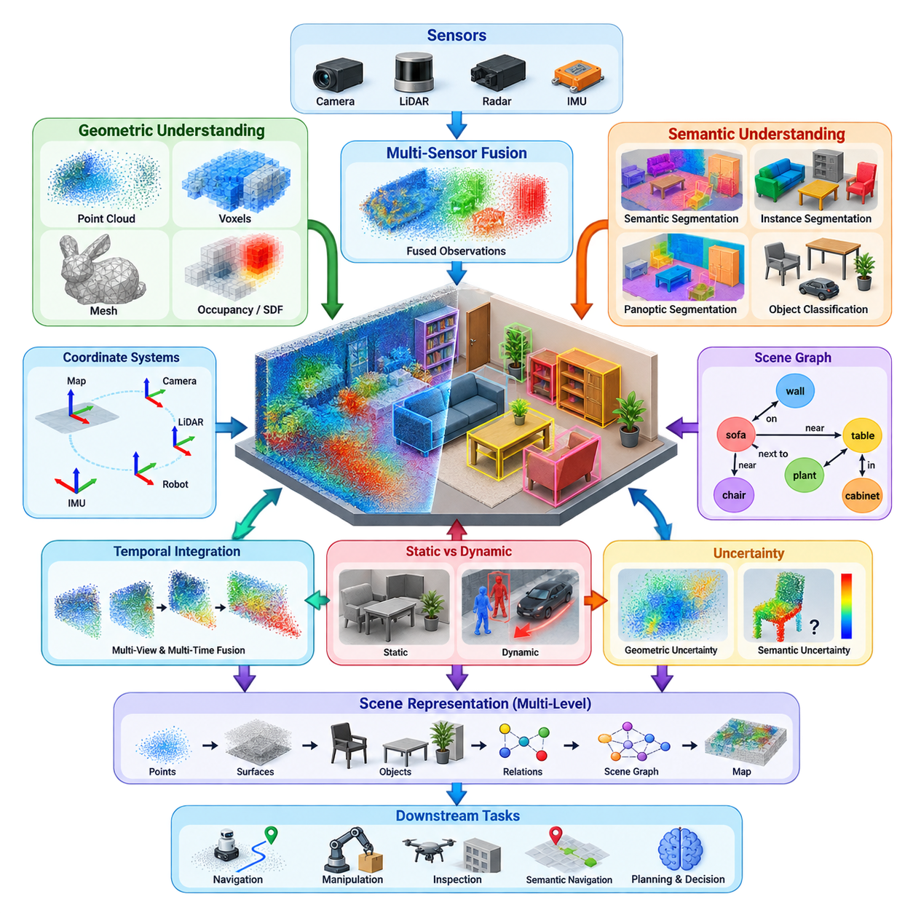
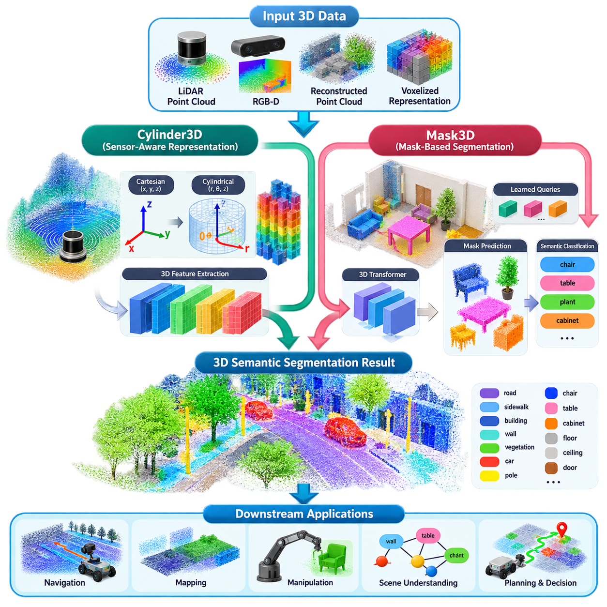
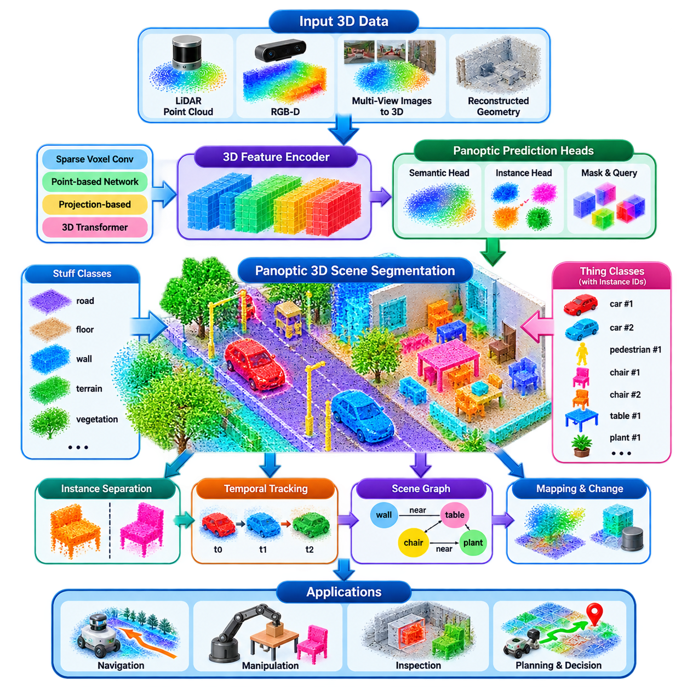
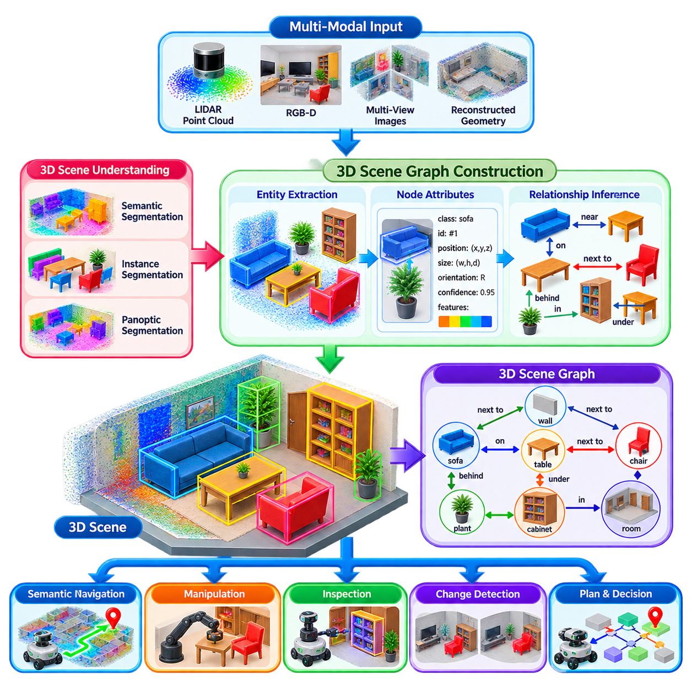
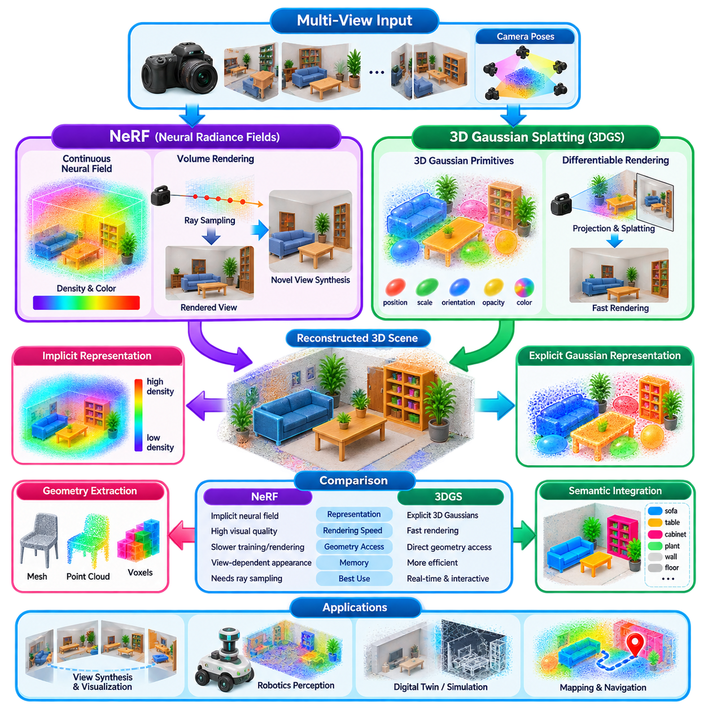
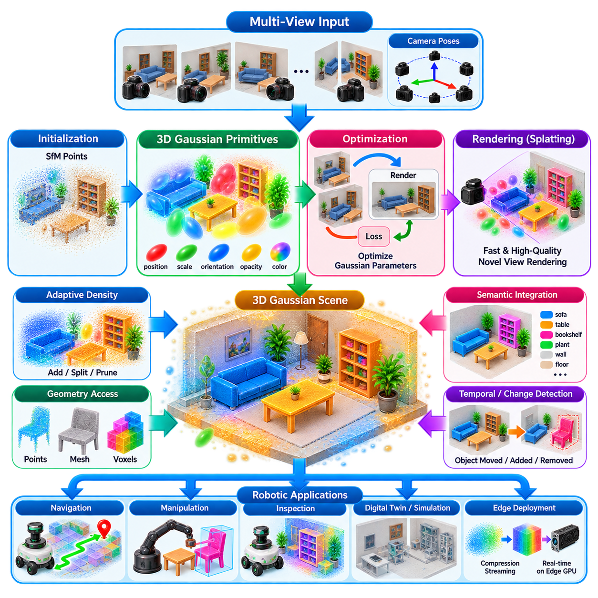
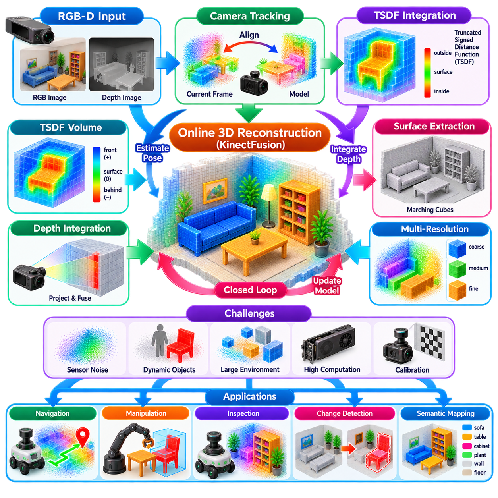
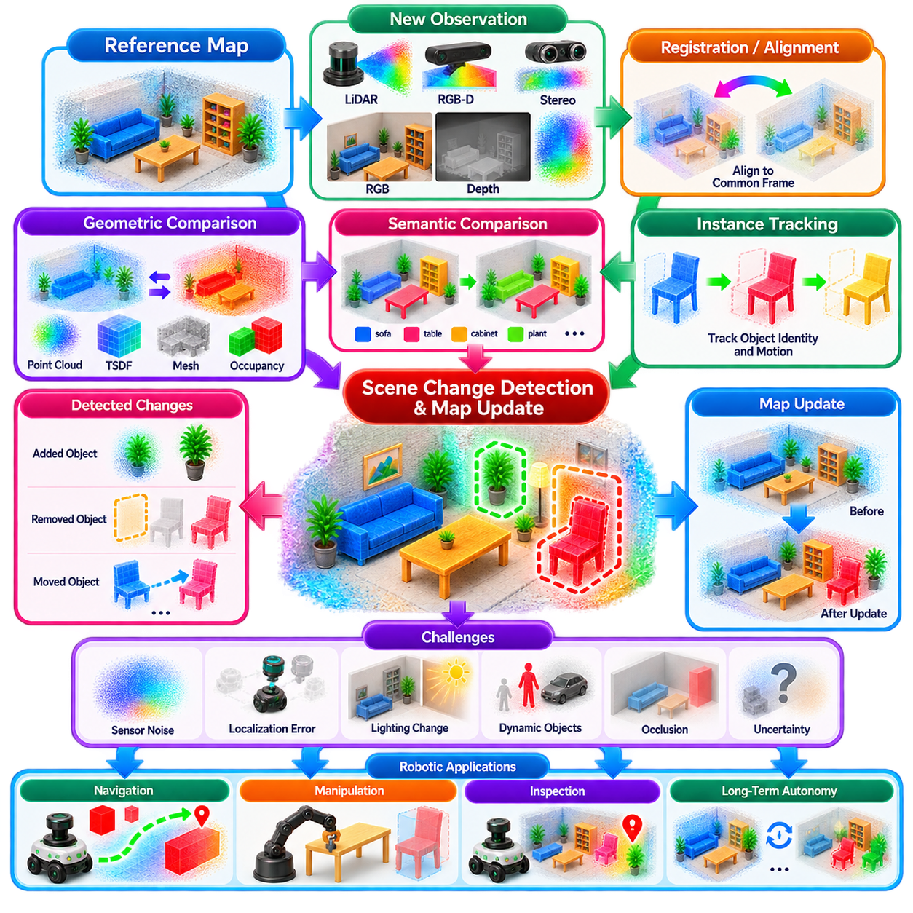
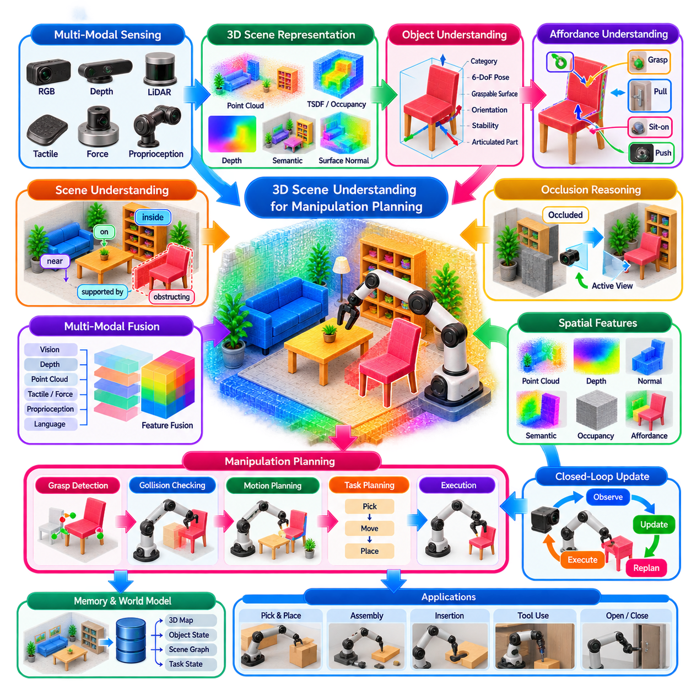
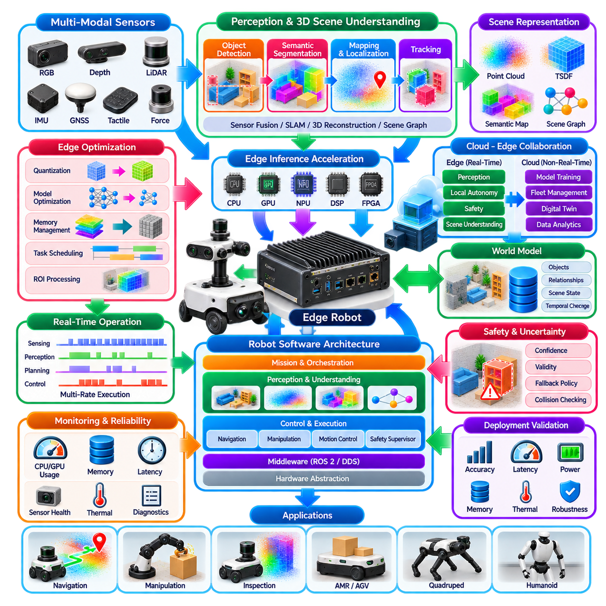

**Volume 14. Perception and Sensor Fusion**

# Chapter 07. 3D Scene Understanding

## 07.01. 3D Scene Understanding Overview Geometry Semantics

{width="7.268055555555556in" height="7.268055555555556in"}

3차원 장면 이해(3D Scene Understanding)는 로봇이 원시 공간 측정값(raw spatial measurements)을 주변 세계에 대한 내부 표현(internal representation)으로 변환하여 추론(reasoning)과 행동(action)에 활용할 수 있도록 한다. 센서 관측값을 서로 분리된 픽셀(pixel)이나 점(point)으로 처리하는 대신, 시스템은 이를 기하학(geometry), 객체(objects), 표면(surfaces), 자유 공간(free space), 의미 정보(semantic meaning)에 따라 구성한다. 이러한 표현은 저수준 인지(low-level perception)와 고수준 내비게이션(navigation), 조작(manipulation), 계획(planning), 자율 의사결정(autonomous decision making)을 연결하는 역할을 한다.

기하학적 구성 요소(geometric component)는 구조물이 어디에 존재하며 3차원 공간에서 어떻게 배치되어 있는지를 기술한다. 깊이 영상(depth images), 스테레오 비전(stereo vision), 라이다 포인트 클라우드(LiDAR point clouds), 재구성된 표면(reconstructed surfaces)은 거리, 방향, 형상, 부피, 공간적 연결성에 관한 정보를 제공할 수 있다. 응용 분야에 따라 기하학은 포인트 클라우드(point clouds), 복셀(voxels), 메시(meshes), 점유 구조(occupancy structures), 부호 거리장(signed distance fields), 학습 기반 연속 표현(learned continuous representations) 등으로 표현할 수 있으며, 이는 앞선 인지 파이프라인(perception pipeline)에서 다룬 공간 표현(spatial representations)을 확장한다.

그러나 기하학(geometry)만으로는 관측된 구조물이 무엇을 의미하는지 설명할 수 없다. 로봇은 수직 평면 구조를 정확하게 재구성하더라도 그것이 벽(wall), 문(door), 캐비닛(cabinet), 차량(vehicle), 또는 다른 객체인지 알지 못할 수 있다. 의미 이해(semantic understanding)는 기하학적 관측값을 의미 있는 범주(categories), 속성(attributes), 정체성(identities), 문맥 정보(contextual information)와 연결한다. 따라서 기하학과 의미론(semantics)의 결합은 단순한 계량적 재구성(metric reconstruction)을 작업 중심 추론(task-oriented reasoning)에 직접 활용할 수 있는 표현으로 변환한다.

유용한 3차원 장면 모델(3D scene model)은 서로 연결된 여러 추상화 수준(levels of abstraction)으로 이해할 수 있다. 가장 낮은 수준에는 픽셀(pixels), 깊이 값(depth values), 레이더 반사 신호(radar returns), 3차원 점(3D points)과 같은 측정값이 존재한다. 이러한 관측값은 표면(surfaces), 세그먼트(segments), 공간 영역(spatial regions)으로 그룹화되고 이후 객체 및 의미 클래스(semantic classes)와 연결될 수 있다. 더 높은 수준에서는 내부(inside), 위(on top of), 인접(adjacent to), 연결(connected to), 도달 가능(reachable from) 등의 관계를 통해 환경 내 개체들이 어떻게 상호작용하는지를 표현할 수 있다.

좌표계(coordinate systems)는 서로 다른 센서와 서로 다른 시점에서 얻어진 관측값을 일관된 공간 기준(spatial frame)으로 표현해야 하기 때문에 이 과정의 핵심 요소이다. 카메라(camera), 라이다(LiDAR), 레이더(radar), 관성측정장치(IMU), 로봇 본체(robot-body), 오도메트리(odometry), 지도(map) 좌표계가 하나의 인지 시스템에서 동시에 존재할 수 있다. 정확한 보정(calibration)과 자세 추정(pose estimation)을 통해 측정값을 이 좌표계 사이에서 변환할 수 있다. 따라서 외부 파라미터 보정(extrinsic calibration)이나 위치 추정(localization)의 오류는 개별 센서가 정상적으로 동작하더라도 재구성된 기하 구조를 왜곡하고 의미적 연관성을 불일치시킬 수 있다.

3차원 이해(3D understanding)는 여러 관점에서 얻은 관측값을 시간에 따라 누적할 때 특히 강력해진다. 하나의 카메라 영상이나 라이다 스캔(LiDAR scan)은 객체 간 가림(occlusion)과 센서의 제한된 시야(field of view) 때문에 환경의 일부만 관측한다. 로봇의 이동은 추가적인 관측을 제공하여 이전에 가려져 있던 영역을 점진적으로 확인할 수 있도록 한다. 따라서 시간적 통합(temporal integration)은 보다 완전한 표현을 생성할 수 있지만, 동시에 위치 추정 불확실성(localization uncertainty), 이동 객체(moving objects), 환경 변화(environmental changes)를 처리하는 메커니즘이 필요하다.

의미 분할(semantic segmentation)은 개별 공간 요소에 범주 정보를 할당하며, 인스턴스 추론(instance reasoning)은 동일한 범주에 속하는 서로 다른 객체들을 구분한다. 파놉틱 표현(panoptic representations)은 이러한 두 관점을 결합하여 로봇이 배경 구조(background structures)와 개별적으로 구분 가능한 객체(countable objects)를 동시에 식별하도록 한다. 이러한 개념은 이후의 3차원 의미 장면 분할(3D semantic scene segmentation)과 파놉틱 장면 분할(panoptic scene segmentation), 그리고 환경 내 개체 간 관계를 명시적으로 표현하는 구조의 기반이 된다.

장면 그래프(scene graphs)는 객체, 영역 또는 장소를 노드(nodes)로 표현하고 이들 사이의 공간적 또는 의미적 관계를 엣지(edges)로 표현하는 고수준 표현(high-level representation)을 제공한다. 로봇은 수백만 개의 점이나 복셀을 직접 추론하는 대신, 공구(tool)가 작업대(workbench) 위에 있거나 컨테이너(container)가 매니퓰레이터(manipulator) 옆에 있다는 관계를 기반으로 추론할 수 있다. 이러한 추상화는 인지 시스템이 작업 계획(task planning), 언어 기반 추론(language-based reasoning), 조작 시스템(manipulation systems), 또는 다른 기호적·학습 기반 의사결정 모듈(symbolic and learned decision modules)과 정보를 교환해야 할 때 특히 유용하다.

완전한 장면 표현(scene representation)은 정적 구조(static structure)와 동적 요소(dynamic content)를 구분할 수 있어야 한다. 바닥(floors), 벽(walls), 기둥(pillars), 고정 설비(fixed machinery)는 지속적인 기하 구조를 정의할 수 있지만, 사람(humans), 차량(vehicles), 문(doors), 이동 가능한 컨테이너(movable containers), 다른 로봇(other robots)은 위치나 상태가 변화할 수 있다. 모든 관측값을 영구적인 것으로 처리하면 지도가 손상되고 계획 정보의 신뢰성이 떨어진다. 따라서 현대적인 장면 이해 시스템은 공간 재구성(spatial reconstruction)에 객체 추적(object tracking), 시간적 일관성(temporal consistency), 변화 감지(change detection), 저장된 지식의 갱신 메커니즘을 결합한다.

불확실성(uncertainty)은 3차원 장면 이해가 잡음이 포함된 센서(noisy sensors), 불완전한 관측(incomplete observations), 불완전한 보정(imperfect calibration), 가림(occlusion), 그리고 잘못된 예측을 생성할 수 있는 학습 모델(learned models)에 의존하기 때문에 피할 수 없다. 강건한 시스템(robust system)은 모든 추정치를 동일하게 신뢰하기보다 신뢰도 정보(confidence information)를 유지해야 한다. 기하학적 불확실성(geometric uncertainty)은 불확실한 깊이나 자세를 나타낼 수 있으며, 의미적 불확실성(semantic uncertainty)은 모호한 클래스 예측을 표현할 수 있다. 이를 통해 계획 모듈(planning modules)은 인지된 장면이 완벽하게 알려져 있다고 가정하지 않고 불확실한 영역을 고려할 수 있다.

로봇에 적합한 표현 방식은 하위 작업(downstream task)에 따라 크게 달라진다. 내비게이션(navigation)은 일반적으로 자유 공간, 장애물, 주행 가능성(traversability), 연결성(connectivity)을 강조하지만, 조작(manipulation)은 정확한 국부 표면(local surfaces), 객체 경계(object boundaries), 자세(poses), 접촉 관련 기하 구조(contact-relevant geometry)를 요구한다. 검사(inspection)는 조밀한 재구성(dense reconstruction)과 변화 감지가 중요할 수 있으며, 의미 기반 내비게이션(semantic navigation)은 공간 위치와 의미 있는 개체 사이의 연관성을 요구한다. 따라서 모든 작업에 최적인 단일 표현은 존재하지 않으며 실제 시스템에서는 여러 상호 보완적인 표현을 동시에 유지하는 경우가 많다.

학습 기반 표현(learned representations)은 점차 명시적 기하 모델(explicit geometric models)을 보완하고 있다. 신경망(neural networks)은 포인트 클라우드, 희소 복셀(sparse voxels), 영상, 다중모달 센서 특징(multimodal sensor features)을 공간 구조와 의미적 문맥을 모두 포함하는 잠재 표현(latent representations)으로 인코딩할 수 있다. 신경 암시적 표현(neural implicit representations)과 신경 렌더링(neural rendering)은 연속적인 장면 특성을 모델링할 수 있으며, 3차원 가우시안 표현(3D Gaussian representations)은 효율적인 재구성과 렌더링을 제공할 수 있다. 이러한 접근법은 좌표 일관성과 물리적 공간 추론의 필요성을 제거하는 것이 아니라 기존 기하학적 매핑(conventional geometric mapping)을 확장한다.

실시간 로보틱스(real-time robotics)에서는 로봇이 이동하는 동안 장면 모델의 계산량을 관리할 수 있어야 한다는 추가적인 제약이 존재한다. 조밀한 3차원 처리(dense 3D processing)는 특히 대규모 환경을 지속적으로 재구성할 때 상당한 메모리, 대역폭, GPU 자원을 소비할 수 있다. 따라서 희소 표현(sparse representations), 계층형 지도(hierarchical maps), 관심 영역 처리(region-of-interest processing), 증분 갱신(incremental updates), 하드웨어 가속 추론(hardware-accelerated inference)이 중요한 설계 전략이 된다. 이에 따라 장의 구성은 의미 이해와 장면 그래프에서 시작하여 재구성, 변화 감지, 조작 활용, 엣지 배포(edge deployment)로 확장된다.

자율 로봇(autonomous robots)에서 3차원 장면 이해의 궁극적인 목적은 재구성 자체가 아니라 물리적 환경에 대한 행동 가능한 이해(actionable understanding)를 확보하는 것이다. 로봇은 어디로 이동할 수 있는지, 어떤 개체가 중요한지, 객체들이 서로 어떤 관계를 가지는지, 무엇이 변화했는지, 어떤 상호작용이 물리적으로 가능한지를 판단해야 한다. 기하학은 세계의 공간 구조를 확립하고, 의미론은 그 구조에 의미를 부여하며, 시간적 추론(temporal reasoning)은 로봇과 환경이 변화하는 동안 표현의 일관성을 유지한다.

이러한 결합은 전체 인지 아키텍처(perception architecture)에서 다중 센서 융합(multi-sensor fusion)과 고수준 공간 지도(higher-level spatial maps)를 연결하는 중요한 중간 계층(intermediate layer)을 형성한다. 앞선 센서 융합 단계는 상호 보완적인 측정값을 통합하고, 이후의 점유 및 의미 지도(occupancy and semantic mapping)는 내비게이션과 장기 운용을 위해 환경 지식을 구조화한다. 3차원 장면 이해는 융합된 관측값을 구조화된 기하학적·의미적 지식으로 변환함으로써 이러한 단계들을 연결하며, 자율 시스템이 이를 계획, 상호작용, 지능적인 물리적 행동(intelligent physical behavior)에 활용할 수 있도록 한다.

## 07.02. 3D Semantic Segmentation Cylinder3D Mask3D [w/Code]

{width="7.268055555555556in" height="7.268055555555556in"}

3차원 의미 분할(3D Semantic Segmentation)은 3차원 장면을 구성하는 개별 요소에 의미 범주(semantic category)를 할당하여 로봇이 바닥, 벽, 식생, 차량, 가구 및 기타 의미 있는 영역과 표면을 구분할 수 있도록 한다. 주로 객체 주변의 경계 영역(bounding volumes)을 예측하는 3차원 객체 탐지(3D object detection)와 달리, 의미 분할은 조밀한 공간 레이블(dense spatial labels)을 생성하므로 환경의 구성 요소에 대한 세부적인 정보를 제공한다.

3차원 의미 분할 시스템의 입력은 일반적으로 라이다 포인트 클라우드(LiDAR point clouds), RGB-D 측정값(RGB-D measurements), 재구성된 포인트 클라우드(reconstructed point clouds), 또는 복셀화된 장면 표현(voxelized scene representations)으로 구성된다. 각 점에는 공간 좌표와 함께 반사 강도(intensity), 색상(color), 표면 법선(surface normal), 학습된 특징(learned features) 등의 속성이 포함될 수 있다. 분할 네트워크(segmentation network)는 이러한 불규칙한 관측값을 의미 예측(semantic predictions)으로 변환하면서 내비게이션, 매핑, 조작 및 장면 추론에 필요한 공간적 세부 정보를 충분히 보존한다.

근본적인 어려움 중 하나는 원시 포인트 클라우드(raw point clouds)가 희소하고(sparse), 불규칙하며(irregular), 균일하지 않게 분포한다는 점이다. 라이다 측정값은 거리가 멀어질수록 점점 희소해지고, 실내 RGB-D 스캔에는 가림(occlusion)과 누락된 표면이 존재한다. 균일한 복셀 그리드(uniform voxel grid)에 기존의 조밀한 3차원 합성곱(dense 3D convolution)을 적용하면 빈 공간을 처리하는 데 상당한 연산을 낭비할 수 있다. 따라서 실제 아키텍처에서는 계산 효율적인 공간 특징을 얻기 위해 점 기반 처리(point-based processing), 희소 합성곱(sparse convolutions), 투영 기반 표현(projection-based representations), 또는 이들의 조합을 사용한다.

Cylinder3D는 기존의 직교 좌표계 기반 복셀화(Cartesian voxelization)에만 의존하는 대신 원통형 공간 분할(cylindrical spatial partitioning)을 사용하여 대규모 라이다 의미 분할(large-scale LiDAR semantic segmentation)을 수행한다. 이러한 표현은 각도 샘플링(angular sampling)과 방사 거리(radial distance)가 점 밀도에 큰 영향을 주기 때문에 회전형 라이다(rotating LiDAR)의 기하학적 특성과 잘 부합한다. 원통형 분할은 근거리와 원거리 영역에 공간 셀을 보다 효과적으로 할당하여 균일한 직교 좌표계 그리드가 발생시키는 일부 표현 불균형(representation imbalance)을 줄일 수 있다.

원통형 표현(cylindrical representation)에서는 점의 직교 좌표(Cartesian coordinates)를 방사형(radial), 각도형(angular), 수직형(vertical) 성분으로 변환한다. 이후 각 점을 원통형 셀(cylindrical cells)에 할당하여 효율적인 특징 처리에 적합한 구조화된 표현을 구성한다. 이러한 변환은 원래의 기하 정보를 제거하는 것이 아니라 공간을 이산화(discretization)하는 방법을 변경하는 것이다. 이를 통해 네트워크는 3차원 공간 관계를 유지하면서 실외 라이다 측정값의 특징적인 분포를 보다 효과적으로 처리할 수 있다.

Cylinder3D는 이러한 표현을 3차원 특징 추출(3D feature extraction)과 결합하여 인접 영역 사이의 문맥 정보(contextual information)를 학습한다. 국부적인 기하학적 패턴(local geometric patterns)은 도로, 보도, 벽, 기둥, 식생 또는 차량과 같은 표면과 객체를 나타낼 수 있으며, 네트워크의 더 깊은 특징(deeper network features)은 보다 넓은 공간적 문맥을 포착한다. 최종적으로 의미 예측 결과를 원래의 점과 연결하여 조밀하게 레이블링된 포인트 클라우드(densely labeled point cloud)를 생성하고, 이를 하위 매핑 및 자율 내비게이션 모듈에 통합할 수 있다.

Cylinder3D가 보여주는 중요한 원칙 중 하나는 표현 방식(representation)이 센싱 시스템(sensing system)의 물리적 특성을 반영해야 한다는 것이다. 이론적으로 단순한 공간 이산화 방식이 센서 밀도가 장면 전체에서 크게 변화하는 상황에서 반드시 최적인 것은 아니다. 센서 인식형 표현(sensor-aware representations)은 인식에 중요한 영역의 정보를 유지하면서 메모리와 연산 자원을 보다 효율적으로 사용할 수 있다. 이러한 원칙은 라이다 분할뿐만 아니라 다양한 로봇 인지 파이프라인(robotic perception pipelines)에도 적용된다.

Mask3D는 학습된 마스크(learned masks)를 통해 의미 개체(semantic entities)를 표현하는 다른 관점에서 3차원 장면 분할에 접근한다. 분할 문제를 단순히 모든 점이나 복셀에 대한 독립적인 분류 문제로 처리하는 대신, 마스크 기반 아키텍처(mask-based architectures)는 의미 또는 인스턴스 수준 개념(semantic or instance-level concepts)과 연결된 공간 요소들의 그룹을 예측한다. 이러한 방식은 동일한 범주의 여러 객체를 서로 구분하면서 정확한 객체 경계를 유지해야 하는 복잡한 실내 장면에서 특히 유용하다.

마스크 기반 접근법(mask-based approach)은 일반적으로 희소 3차원 표현(sparse three-dimensional representation)에서 특징을 추출하고 학습된 쿼리(learned queries)를 사용하여 장면 내부의 의미 있는 영역을 식별한다. 각각의 쿼리는 어떤 공간 요소들이 하나의 그룹에 속하는지를 나타내는 마스크(mask)와 해당 영역이 무엇을 의미하는지를 나타내는 의미 예측을 생성할 수 있다. 어텐션 기반 처리(attention-based processing)는 전역 장면 문맥(global scene context)과 국부 기하 구조(local geometry)를 연결하여 외형이나 기하 구조가 유사한 인접 객체를 분리하는 데 도움을 준다.

따라서 Cylinder3D와 Mask3D는 현대적인 3차원 분할(3D segmentation)의 상호 보완적인 두 가지 방향을 보여준다. Cylinder3D는 특히 대규모 라이다 장면에서 점 단위 의미 이해(point-wise semantic understanding)를 위한 효율적인 센서 인식형 공간 표현(sensor-aware spatial representation)을 강조한다. Mask3D는 마스크 예측(mask prediction)과 학습된 쿼리를 활용한 객체 및 영역 중심 추론(object- and region-oriented reasoning)을 강조한다. 두 접근법의 선택은 센서 구성, 환경 규모, 필요한 의미적 세분성(semantic granularity), 연산 자원, 그리고 하위 로봇 작업에 따라 달라진다.

의미 분할(semantic segmentation)은 인스턴스 분할(instance segmentation) 및 파놉틱 분할(panoptic segmentation)과도 구분해야 한다. 의미 분할은 동일 클래스에 속한 개별 객체를 반드시 구분하지 않고 범주를 할당한다. 인스턴스 분할은 개별 객체 인스턴스를 식별하며, 파놉틱 분할은 배경 영역의 의미 레이블링과 개별적으로 셀 수 있는 객체의 인스턴스 수준 분리를 결합한다. 이러한 표현은 더욱 풍부한 3차원 장면 이해와 장면 그래프(scene graph) 구축으로 발전하는 자연스러운 단계가 된다.

3차원 분할 모델을 학습하려면 정확하게 레이블링된 공간 데이터가 필요하지만, 점 단위(point-level) 또는 복셀 단위(voxel-level) 주석(annotation)을 생성하는 데는 많은 비용이 필요하다. 레이블은 가림, 희소한 측정값, 모호한 경계, 서로 다른 센서 관점에도 불구하고 일관성을 유지해야 한다. 회전(rotation), 크기 조정(scaling), 점 교란(point perturbation), 공간 자르기(spatial cropping), 장면 혼합(scene mixing)과 같은 데이터 증강(data augmentation)은 강건성을 향상시킬 수 있다. 합성 데이터(synthetic data)와 전이된 표현(transferred representations)을 활용하면 수작업으로 주석된 실제 장면에 대한 의존성을 추가로 줄일 수 있다.

평가에서는 일반적으로 예측된 의미 영역이 정답 레이블(ground-truth labels)과 얼마나 정확하게 중첩되는지를 측정한다. 교집합 대비 합집합(Intersection over Union, IoU)은 누락된 영역과 잘못 할당된 영역을 모두 반영하기 때문에 널리 사용되며, 일반적으로 클래스 전체의 평균 IoU(mean IoU, mIoU)로 요약된다. 도로나 바닥과 같은 지배적인 범주가 작은 객체보다 훨씬 많은 점을 포함하는 경우 전체 정확도(overall accuracy)만으로는 성능을 잘못 해석할 수 있다. 따라서 안전에 중요하거나 작업과 직접 관련된 범주의 실패를 식별하려면 클래스별 평가(per-class evaluation)가 중요하다.

이동하는 로봇에 분할 기술을 적용할 경우 시간적 일관성(temporal consistency)이 중요해진다. 연속 프레임에 대해 독립적으로 수행한 예측은 센서 잡음, 관점 변화, 가림, 모델 불확실성 때문에 변동할 수 있다. 로봇 이동 정보, 객체 추적(object tracking), 시간적 특징 융합(temporal feature fusion)을 통해 관측값을 연결하면 의미 추정 결과를 안정화할 수 있다. 이후 지속적인 의미 정보(persistent semantic information)를 지도에 누적하여 각각의 관측을 서로 관련 없는 새로운 장면으로 반복 해석하는 것을 방지할 수 있다.

로봇 운용에서는 분할 불확실성(segmentation uncertainty)이 하위 의사결정으로 전달되어야 한다. 높은 신뢰도로 주행 가능한 바닥(traversable floor)으로 분류된 영역은 내비게이션에 활용할 수 있지만, 장애물 경계 주변의 모호한 영역은 보수적으로 처리할 필요가 있다. 마찬가지로 불확실한 객체 마스크를 영구적인 의미 랜드마크(semantic landmarks)로 자동 등록해서는 안 된다. 신뢰도 임계값(confidence thresholds), 미지 클래스(unknown classes), 시간적 확인(temporal confirmation), 센서 중복성(sensor redundancy)은 불확실한 예측이 위험한 가정으로 전환되는 것을 방지하는 메커니즘을 제공한다.

실시간 배포(real-time deployment)에서는 3차원 네트워크가 대규모 공간 데이터를 처리하기 때문에 상당한 메모리 및 지연시간 제약(memory and latency constraints)이 발생한다. 희소 텐서(sparse tensors), 저해상도 복셀 구조(reduced-resolution voxel structures), 혼합 정밀도 추론(mixed-precision inference), 관심 영역 필터링(region filtering), 모델 가지치기(model pruning), GPU 가속을 통해 연산 비용을 줄일 수 있다. 요구되는 동작 지점(operating point)은 로봇에 따라 달라지며, 실내 매니퓰레이터는 세밀한 공간 정보를 우선할 수 있지만 이동형 자율주행 로봇(AMR)은 안전한 이동에 충분한 분할 거리와 예측 가능한 지연시간을 우선할 수 있다.

3차원 의미 분할의 출력은 기하학(geometry), 위치 추정(localization), 시간적 매핑(temporal mapping)과 결합할 때 더욱 높은 가치를 갖는다. 의미 레이블은 레이블이 없는 포인트 클라우드를 주행 가능한 표면, 구조적 요소, 이동 가능한 객체, 작업 관련 영역을 포함하는 해석 가능한 공간 모델(interpretable spatial model)로 변환할 수 있다. 이러한 결과는 점유 지도(occupancy maps), 의미 지도(semantic maps), 조작 계획(manipulation planning), 변화 감지(change detection), 고수준 장면 그래프의 입력으로 사용되어 조밀한 인지(dense perception)를 자율적인 추론과 행동으로 연결할 수 있다.

보다 광범위한 3차원 장면 이해 파이프라인(3D scene-understanding pipeline)에서 Cylinder3D와 Mask3D는 의미 해석(semantic interpretation)이 표현 설계(representation design)와 분리될 수 없음을 보여준다. 효과적인 시스템은 센서 기하(sensor geometry), 공간 이산화(spatial discretization), 학습 특징(learned features), 의미 범주, 연산 제약, 하위 작업 요구사항을 통합적으로 고려해야 한다. 그 결과 생성되는 분할 정보는 단순한 시각화 계층이 아니라 물리적 로봇이 3차원 공간에 무엇이 존재하는지를 이해하고 그 정보가 자신의 행동에 어떤 영향을 주어야 하는지를 추론할 수 있도록 하는 구조화된 환경 지식(structured environmental knowledge)이다.

## 07.03. Panoptic 3D Scene Segmentation [w/Code]

{width="7.268055555555556in" height="7.268055555555556in"}

파놉틱 3차원 장면 분할(Panoptic 3D Scene Segmentation)은 3차원 환경에서 관측 가능한 모든 요소에 의미(semantic meaning)를 부여하고, 필요한 경우 개별 인스턴스 정체성(individual instance identity)까지 부여하는 통합 표현(unified representation)을 제공한다. 이는 공간 요소가 어떤 범주에 속하는지를 결정하는 의미 분할(semantic segmentation)과 동일한 범주에 속하는 서로 다른 객체를 구분하는 인스턴스 분할(instance segmentation)을 결합한다. 그 결과는 독립적으로 탐지된 객체들의 집합이 아니라 전체 장면에 대한 구조화된 해석(structured interpretation)이 된다.

파놉틱 분할(panoptic segmentation)의 핵심적인 구분은 "stuff"와 "things" 사이에 있다. Stuff 클래스(stuff classes)는 일반적으로 개별적인 정체성을 요구하지 않는 도로, 바닥, 벽, 지형 또는 식생과 같은 영역을 설명한다. Thing 클래스(thing classes)는 차량, 보행자, 의자, 컨테이너 또는 로봇과 같이 개별적으로 셀 수 있는 개체를 나타낸다. 파놉틱 시스템은 두 그룹 모두에 의미 레이블(semantic labels)을 할당하면서, 추가적으로 각각의 thing 객체에 고유한 인스턴스 식별자(instance identifier)를 부여한다.

3차원 인지 파이프라인(3D perception pipeline)에서 파놉틱 예측(panoptic predictions)은 라이다 포인트 클라우드(LiDAR point clouds), RGB-D 측정값(RGB-D measurements), 3차원으로 투영된 다중 시점 영상(multi-view images), 또는 재구성된 장면 기하(reconstructed scene geometry)로부터 생성될 수 있다. 각 점, 복셀 또는 기타 공간 기본 요소(spatial primitive)는 최종적으로 파놉틱 레이블(panoptic label)을 부여받는다. 이 레이블은 일반적으로 의미 클래스 식별자(semantic class identifier)와 인스턴스 식별자(instance identifier)를 결합하므로, 하위 모듈은 해당 영역이 차량이라는 사실과 동시에 관측된 장면에서 특정 차량이라는 사실을 모두 판단할 수 있다.

파놉틱 3차원 분할(Panoptic 3D Segmentation)은 Cylinder3D 및 Mask3D와 같은 아키텍처에서 소개된 의미 분할 방법을 확장한다. 의미 특징 추출(semantic feature extraction)은 범주 수준의 이해(category-level understanding)를 제공하고, 인스턴스 중심 메커니즘(instance-oriented mechanisms)은 이러한 의미 영역 내부에서 일관된 객체를 식별한다. 마스크 기반 접근법(mask-based approaches)은 특히 적합한데, 학습된 쿼리(learned queries)가 객체 마스크(object masks)와 클래스 예측(class predictions)을 함께 생성할 수 있기 때문이다. 이를 통해 의미 추론과 인스턴스 추론을 통합된 파놉틱 표현으로 자연스럽게 연결할 수 있다.

일반적인 아키텍처는 입력 기하(input geometry)를 학습된 3차원 특징(learned 3D features)으로 인코딩하면서 시작한다. 센서와 연산 제약에 따라 희소 복셀 합성곱(sparse voxel convolution), 점 기반 네트워크(point-based networks), 투영 기반 인코더(projection-based encoders), 또는 트랜스포머 아키텍처(transformer architectures)를 사용할 수 있다. 이러한 특징은 국부적인 기하 정보(local geometric information)와 더 넓은 문맥 정보(broader contextual information)를 포함한다. 이후 예측 헤드(prediction heads) 또는 학습된 쿼리(learned queries)는 의미 클래스, 인스턴스 마스크, 객체 신뢰도(object confidence) 및 최종 파놉틱 장면을 구성하는 데 필요한 기타 정보를 추정한다.

3차원에서 인스턴스를 분리하는 것은 객체들이 서로 가까이 있거나 부분적으로 가려져 있거나 희소하게 측정되거나 기하학적으로 유사한 경우 어려워진다. 서로 인접한 두 개의 의자, 주차된 차량, 보관 상자 또는 보행자는 특정 관점에서 서로 연결되거나 겹쳐 보이는 공간 관측값을 생성할 수 있다. 따라서 효과적인 모델은 기하학적 불연속(geometric discontinuities), 의미 특징(semantic features), 문맥적 관계(contextual relationships), 학습된 객체 수준 표현(learned object-level representations)을 결합하여 관측값이 하나의 객체에 속하는지 여러 개의 서로 다른 인스턴스에 속하는지를 판단한다.

인스턴스 연관(instance association)은 희소한 실외 라이다 데이터(sparse outdoor LiDAR data)에서 더욱 어려워진다. 서로 가까운 객체라도 일부는 많은 측정값을 포함하는 반면, 원거리에 있는 객체는 매우 적은 수의 점으로만 표현될 수 있다. 따라서 기둥, 표지판, 보행자와 같은 작은 객체는 안정적으로 분리하기 어려울 수 있다. 센서 인식형 표현(sensor-aware representations), 다중 스케일 특징(multi-scale features), 시간적 누적(temporal accumulation), 카메라-라이다 융합(camera-LiDAR fusion)은 단일 3차원 관측만으로 안정적인 인스턴스 분리가 어려운 경우 추가적인 정보를 제공할 수 있다.

파놉틱 출력(panoptic output)은 의미 예측과 인스턴스 예측 사이의 충돌도 해결해야 한다. 여러 마스크가 서로 겹치거나, 서로 다른 쿼리가 동일한 객체를 예측하거나, 의미 분류기(semantic classifier)가 인스턴스 수준 예측과 다른 결과를 낼 수 있다. 후처리(post-processing)는 신뢰도를 기준으로 예측 결과의 순위를 정하고, 중복 예측을 제거하며, 겹치는 할당을 해결하고, 각 공간 요소가 일관된 최종 레이블을 갖도록 할 수 있다. 일부 아키텍처는 이러한 할당 과정을 직접 학습하여 수작업으로 설계된 후처리에 대한 의존성을 줄인다.

시간적 파놉틱 이해(temporal panoptic understanding)는 분할을 개별 프레임에서 시간에 따라 지속되는 객체로 확장한다. 현재 스캔에서 차량에 하나의 인스턴스 식별자가 할당되고 다음 스캔에서 다른 식별자가 할당된다면, 상위 수준의 추론이 불필요하게 복잡해진다. 시간적 연관(temporal association)은 움직임 추정(motion estimation), 기하학적 중첩(geometric overlap), 외형 특징(appearance features), 객체 추적(object tracking), 또는 학습된 임베딩(learned embeddings)을 사용하여 정체성을 유지할 수 있다. 이를 통해 프레임 수준 파놉틱 분할은 파놉틱 추적(panoptic tracking)과 지속적인 장면 이해(persistent scene understanding)로 발전할 수 있다.

지속적인 정체성(persistent identity)은 동적 환경에서 작동하는 이동 로봇(mobile robots)에게 특히 중요하다. 로봇은 새롭게 관측된 사람과 이미 추적 중인 사람을 구분하거나, 컨테이너가 이동했음을 인식하거나, 일시적인 가림 이후에도 다른 로봇이 동일한 물리적 개체인지 판단해야 할 수 있다. 안정적인 인스턴스 정체성(stable instance identities)을 확보하면 의미 매핑(semantic mapping), 궤적 예측(trajectory prediction), 상호작용 추론(interaction reasoning), 변화 감지(change detection)를 고립된 측정값이 아니라 객체 단위로 수행할 수 있다.

파놉틱 분할은 또한 조밀한 기하 인지(dense geometric perception)와 장면 그래프(scene graphs)를 연결하는 유용한 인터페이스를 제공한다. 조밀한 점이나 복셀은 객체의 상세한 공간적 범위를 표현하고, 인스턴스 식별자는 장면 그래프의 노드(scene-graph node)를 생성할 수 있는 자연스러운 개체(entity)를 제공한다. 의미 레이블은 객체의 유형을 정의하고, 기하학적 관계(geometric relationships)는 가까움(near), 내부(inside), 위(on), 연결됨(connected to), 방해함(obstructing)과 같은 엣지(edges)를 생성할 수 있다. 따라서 파놉틱 인지는 조밀한 센싱(dense sensing)에서 관계적 장면 추론(relational scene reasoning)으로 전환하는 과정을 지원한다.

평가(evaluation)는 인식 품질(recognition quality)과 분할 품질(segmentation quality)을 모두 고려해야 한다. 시스템은 의미 범주를 정확하게 식별하는 동시에 개별 인스턴스를 분리하고 공간적 경계를 유지해야 한다. 파놉틱 품질(Panoptic Quality)은 일반적으로 분할 중첩(segmentation overlap)과 인식 성능(recognition performance)을 모두 반영하도록 정의된다. 로봇 분야에서는 추가적으로 시간적 정체성 안정성(temporal identity stability), 작은 객체 성능(small-object performance), 거리 의존적 정확도(distance-dependent accuracy), 추론 지연시간(inference latency), 그리고 분할 오류가 하위 계획이나 안전성에 미치는 영향을 평가할 수 있다.

클래스 불균형(class imbalance)은 대규모 구조적 표면이 수백만 개의 점을 포함하는 반면 작업과 관련된 작은 객체에는 매우 적은 수의 점만 존재할 수 있기 때문에 중요한 문제이다. 모델이 전체적인 정확도에서는 높은 성능을 보이면서도 보행자, 도구, 손잡이, 표지판 또는 기타 중요한 개체에서는 낮은 성능을 보일 수 있다. 균형 샘플링(balanced sampling), 클래스 인식 손실(class-aware losses), 다중 스케일 특징 추출(multi-scale feature extraction), 대상 중심 증강(targeted augmentation)을 사용하면 대규모 장면 구조가 제공하는 문맥을 유지하면서 희귀하거나 기하학적으로 작은 클래스의 성능을 향상시킬 수 있다.

파놉틱 예측은 불확실성(uncertainty)을 유지해야 하는데, 잘못된 인스턴스 경계나 의미 할당이 계획(planning)으로 전파될 수 있기 때문이다. 서로 가까이 있는 두 사람을 하나의 인스턴스로 병합하거나, 하나의 장애물을 여러 객체로 분리하거나, 미지의 구조물을 주행 가능한 공간으로 분류하면 안전하지 않은 의사결정이 발생할 수 있다. 신뢰도 추정(confidence estimation), 미지 영역 처리(unknown-region handling), 시간적 확인(temporal confirmation), 다중 센서 일관성 검사(multi-sensor consistency checks), 보수적인 지도 갱신(conservative map updates)은 불확실한 파놉틱 예측이 즉시 신뢰할 수 있는 환경 지식으로 전환되는 것을 방지할 수 있다.

내비게이션(navigation)에서는 파놉틱 이해를 통해 지속적인 표면(persistent surfaces)과 개별적인 동적 장애물(dynamic obstacles)을 구분할 수 있으며, 점유 정보(occupancy)만 사용하는 것보다 더 풍부한 정보를 제공한다. 조작(manipulation)에서는 인접한 객체들을 분리하고 그 의미적 정체성을 유지하여 객체 선택(object selection)과 파지 계획(grasp planning)을 지원한다. 검사(inspection)와 산업용 로보틱스(industrial robotics)에서는 인스턴스 수준 비교(instance-level comparison)를 통해 특정 구성요소가 이동했거나 사라졌거나 변화했는지를 확인할 수 있다. 따라서 동일한 표현을 사용하여 완전히 별도의 장면 해석을 요구하지 않고도 다양한 로봇 행동을 지원할 수 있다.

실시간 배포(real-time deployment)에서는 메모리, 연산량, 지연시간을 신중하게 관리해야 한다. 대규모 포인트 클라우드와 조밀한 실내 재구성(dense indoor reconstructions)은 수백만 개의 공간 요소를 생성할 수 있으며, 쿼리 기반 마스크 처리(query-based mask processing)는 상당한 연산 비용을 추가할 수 있다. 희소 특징 표현(sparse feature representations), 공간 자르기(spatial cropping), 계층적 처리(hierarchical processing), 혼합 정밀도 추론(mixed-precision inference), 최적화된 어텐션(optimized attention), GPU 가속(GPU acceleration)을 사용하면 실용적인 갱신 주기(update rate)를 유지하는 데 도움이 된다. 적절한 구성은 장면 규모, 센서 주파수, 로봇 속도, 요구되는 분할 세부 수준에 따라 달라진다.

3차원 장면 이해(3D scene understanding)에서 파놉틱 분할(panoptic segmentation)은 단순히 "여기에 무엇이 존재하는가?"라는 질문에서 나아가 동시에 "그것은 무엇인가?"와 "그것은 어떤 개별 객체인가?"를 묻는 중요한 전환을 나타낸다. 기하학적 구조(geometric structure), 의미 범주(semantic categories), 인스턴스 정체성(instance identities)을 결합함으로써 로봇은 주변 환경에 대한 보다 완전한 설명을 얻을 수 있다. 이러한 구조화된 표현은 이후의 장면 그래프 구축(scene graph construction), 지속적 매핑(persistent mapping), 변화 감지(change detection), 조작 계획(manipulation planning), 고수준 물리적 추론(higher-level physical reasoning)을 위한 기반을 제공한다.

## 07.04. 3D Scene Graph Construction [w/Code]

{width="7.268055555555556in" height="7.268055555555556in"}

3차원 장면 그래프(3D Scene Graph)는 환경을 개체(entity)와 그 관계(relationship)의 구조화된 네트워크로 표현하여, 조밀한 기하학적·의미론적 인지 결과를 로봇이 추론할 수 있는 고수준 표현으로 변환한다. 장면을 정리되지 않은 점, 복셀 또는 분할 영역의 집합으로 취급하는 대신, 그래프는 의미 있는 개체를 노드(node)로 표현하고 공간적, 의미적 또는 기능적 관계를 엣지(edge)로 표현한다. 이를 통해 3차원 인지와 고수준 추론, 계획 및 상호작용 사이의 중간 표현(intermediate representation)을 제공한다.

3차원 장면 그래프의 구축(3D scene graph construction)은 일반적으로 카메라(camera), 라이다(LiDAR), RGB-D 센서 또는 융합 인지 시스템(fused perception systems)으로부터 얻어진 기하학적·의미론적 관측으로 시작한다. 관측된 장면에서 객체, 표면, 방, 구조물 및 기타 의미 있는 영역을 추출하여 그래프 개체 후보(candidate graph entities)로 변환한다. 의미 분할(semantic segmentation), 인스턴스 분할(instance segmentation), 파놉틱 분할(panoptic segmentation)은 객체의 범주와 개별 정체성을 결정하는 데 유용한 정보를 제공한다. 이렇게 생성된 개체들은 장면 그래프를 구성하는 기본 노드가 된다.

장면 그래프의 노드(node)는 단순한 객체 레이블(object label)보다 많은 정보를 포함해야 한다. 객체 범주(object category), 인스턴스 정체성(instance identity), 기하학적 범위(geometric extent), 위치(position), 방향(orientation), 신뢰도(confidence), 시간적 상태(temporal state), 관련 시각 또는 기하학적 특징(visual or geometric features) 등을 포함할 수 있다. 예를 들어 테이블을 나타내는 노드는 3차원 경계 영역(3D bounding region), 추정 자세(estimated pose), 의미 클래스(semantic class), 신뢰도 점수(confidence score)를 포함할 수 있다. 이러한 속성을 유지하면 하위 모듈이 그래프를 단순한 기호적 설명(symbolic description)이 아니라 underlying spatial evidence와 연결된 표현으로 활용할 수 있다.

엣지(edge)는 노드 사이의 관계를 표현하며 그래프의 의미를 구성하는 핵심 요소이다. 일반적인 공간 관계(spatial relationships)에는 가까움(near), 멂(far), 왼쪽(left of), 오른쪽(right of), 위(above), 아래(below), 내부(inside), 인접(adjacent to) 등이 있다. 그 밖에도 위에 놓임(on), 부착(attached to), 연결(connected to), 지지(supported by), 방해(obstructing)와 같은 물리적 또는 기능적 관계를 표현할 수 있다. 어떤 관계를 선택할지는 로봇의 응용 분야에 따라 달라지는데, 내비게이션 시스템은 공간적 연결성(spatial connectivity)을 강조할 수 있는 반면 조작 시스템은 지지(support), 포함(containment), 접촉(contact) 관계를 필요로 할 수 있다.

기하학적 관계(geometric relationships)는 추정된 객체 위치, 방향, 경계 영역, 표면 또는 포인트 클라우드 기하 구조로부터 직접 도출할 수 있다. 예를 들어 두 객체 중심 사이의 거리는 가까움 또는 멂의 관계를 결정하는 데 사용할 수 있으며, 상대적인 높이는 한 객체가 다른 객체보다 위에 있음을 나타낼 수 있다. 보다 복잡한 관계는 표면과 부피에 대한 기하학적 추론을 필요로 할 수 있다. 이러한 관계는 불확실한 인지 결과로부터 도출되기 때문에 모든 그래프 엣지를 정확한 사실로 취급하기보다는 관계의 신뢰도를 함께 유지하는 것이 중요하다.

의미론적 관계(semantic relationships)는 기하학만으로 항상 얻을 수 없는 정보를 제공한다. 객체는 의자, 테이블, 차량, 문 또는 기계 부품으로 인식될 수 있으며, 주변 개체와의 관계는 문맥 정보(contextual information)를 통해 결정될 수 있다. 의자는 테이블과 연관될 수 있고, 차량은 주차 영역을 점유할 수 있으며, 공구는 특정 작업 공간(workstation)에 속할 수 있다. 의미 레이블과 기하학적 관계를 결합하면 그래프는 개체가 무엇인지뿐만 아니라 환경 내에서 어떻게 배치되어 있는지도 표현할 수 있다.

계층적 장면 그래프(hierarchical scene graphs)는 여러 공간 수준(spatial levels)을 동시에 표현할 수 있다. 개별 객체는 더 큰 영역에 속할 수 있고, 방은 건물에 속하며, 건물은 시설이나 사이트에 속할 수 있다. 이러한 계층 구조를 이용하면 로봇이 모든 단계에서 모든 저수준 점을 처리하지 않고도 서로 다른 규모에서 추론할 수 있다. 내비게이션 작업은 방이나 건물 수준에서 수행될 수 있는 반면, 조작 작업은 개별 객체와 그 주변 관계 수준까지 내려갈 수 있다. 따라서 계층 구조는 국부적인 인지와 대규모 환경 추론을 연결한다.

여러 객체가 동일한 의미 범주를 공유하는 경우 인스턴스 정체성(instance identity)이 특히 중요하다. 방 안에 여러 개의 의자가 있다면 모두 의미 클래스 "의자(chair)"에 속하지만, 로봇이 특정 의자와 상호작용해야 한다면 각각 별도의 그래프 개체로 유지되어야 한다. 파놉틱 3차원 분할(Panoptic 3D Segmentation)은 의미 범주와 인스턴스 레이블을 결합하기 때문에 이러한 정체성 정보를 제공하는 유용한 입력이 될 수 있다. 그래프는 공통 클래스 수준 정보를 공유하면서 각각의 객체를 별도의 노드로 유지할 수 있다.

시간 정보(temporal information)는 장면 그래프를 정적인 설명(static description)에서 변화하는 환경을 표현하는 구조로 확장한다. 로봇이 작동하는 동안 객체는 이동하거나 사라지거나 새롭게 나타나거나 상태가 변경될 수 있다. 강건한 시스템은 지속적으로 새로운 개체를 생성하는 대신 연속된 프레임의 관측값을 기존 그래프 노드와 연관시킬 수 있다. 시간적 추적(temporal tracking), 자세 갱신(pose updates), 신뢰도 변화(confidence changes), 상태 전이(state transitions)를 통해 그래프는 지속적인 개체를 표현하면서 환경 변화에도 적응할 수 있다.

장면 그래프 구축은 로봇이 전체 환경을 동시에 관측하지 못하기 때문에 불확실성(uncertainty)과 불완전한 관측(incomplete observation)을 처리해야 한다. 가림(occlusion)은 객체의 일부를 숨길 수 있고, 센서의 측정 범위(sensor range)는 가시 영역을 제한하며, 의미 분류기(semantic classifier)는 모호한 예측을 생성할 수 있다. 따라서 그래프는 관측된 사실(observed facts)과 불확실하거나 추론된 관계(inferred relationships)를 구분해야 한다. 신뢰도 값(confidence values), 미지 상태(unknown states), 잠정적 엣지(provisional edges)를 사용하면 불완전한 관측을 영구적인 지식으로 잘못 처리하는 것을 방지할 수 있다.

그래프 구축에는 다중모달 정보(multimodal information)도 통합할 수 있다. 카메라 영상은 외형과 의미 단서를 제공하고, 라이다는 정확한 공간 기하 정보를 제공하며, IMU 또는 위치 추정 시스템(localization systems)은 로봇의 자세와 시간적 기준을 제공한다. 다중 센서 융합(multi-sensor fusion)을 통해 상호 보완적인 정보를 이용하여 그래프 개체와 관계를 추정할 수 있다. 이는 카메라, 라이다, 레이더, IMU 및 기타 센싱 방식이 각각 다른 정보를 제공한 후 고수준 장면 이해로 연결되는 전체 인지 아키텍처와 일치한다.

생성된 그래프는 인지(perception)와 추론(reasoning) 사이의 인터페이스로 활용될 수 있다. 내비게이션 시스템은 어떤 영역들이 연결되어 있는지, 어떤 객체가 경로를 방해하는지, 특정 의미 객체가 어디에 위치하는지를 질의할 수 있다. 조작 시스템은 어떤 객체가 표면 위에 있는지, 어떤 컨테이너가 다른 객체를 포함하는지, 또는 어떤 객체들이 서로 인접해 있는지를 판단할 수 있다. 검사 시스템은 시간에 따른 그래프 상태를 비교하여 누락되거나 이동했거나 새롭게 추가된 구성요소를 식별할 수 있다.

의미 기반 내비게이션(semantic navigation)에서는 장면 그래프가 언어 또는 작업 설명(task descriptions)을 실제 물리적 개체와 연결하는 메커니즘을 제공한다. 특정 객체나 위치를 지칭하는 명령은 의미 레이블, 공간 관계, 그래프 계층 구조와 연결하여 실제 환경에 대응시킬 수 있다. 로봇은 구분되지 않은 지도에서 대상을 찾는 대신 특정 대상이 방 안에 있고 특정 랜드마크 근처 또는 다른 객체 옆에 있다는 관계를 기반으로 추론할 수 있다. 이를 통해 공간 표현을 고수준 작업 추론(higher-level task reasoning)에 보다 적합하게 만들 수 있다.

장면 그래프는 기존 점유 지도(occupancy map)로는 표현하기 어려운 객체 관계를 제공함으로써 조작 계획(manipulation planning)도 지원할 수 있다. 계획기는 어떤 객체가 테이블 위에 있는지, 어떤 컨테이너가 닫혀 있는지, 또는 어떤 객체가 다른 객체에 대한 접근을 방해하고 있는지를 알아야 할 수 있다. 이러한 관계는 모션 계획(motion planning)과 조작을 위한 제약조건(constraints)이나 목표(goal)로 변환할 수 있다. 따라서 그래프는 정밀한 제어에 필요한 기하학적 표현을 대체하는 것이 아니라 인지와 물리적 상호작용 사이를 연결하는 의미론적 브리지(semantic bridge) 역할을 한다.

유용한 장면 그래프를 유지하려면 일회성 구축(one-time construction)이 아니라 지속적인 갱신(continuous updating)이 필요하다. 새로운 센서 관측값이 들어오면 객체의 자세가 변하고, 이전에는 알려지지 않았던 영역이 새롭게 관측되며, 환경 상태에 대한 기존 판단이 수정될 수 있다. 따라서 증분 그래프 갱신(incremental graph updates)은 새로운 개체를 추가하고, 기존 속성을 정교화하며, 관계를 수정하고, 더 이상 유효하지 않은 정보를 제거하고, 필요한 경우 지속적인 정체성을 유지해야 한다. 이러한 접근법은 그래프가 더 이상 실제 물리적 환경과 일치하지 않는 정적인 스냅샷(static snapshot)이 되는 것을 방지한다.

보다 넓은 3차원 장면 이해 아키텍처(3D scene-understanding architecture)에서 장면 그래프 구축은 기하학적·의미론적 해석 이후에 위치하며 이후의 추론을 위한 고수준 표현을 제공한다. 해당 장의 구조에서는 3차원 의미 분할(3D semantic segmentation), 파놉틱 분할(panoptic segmentation), 장면 그래프 구축(scene graph construction), 신경 암시적 표현(neural implicit representations), 3D 가우시안 스플래팅(3D Gaussian Splatting), 온라인 재구성(online reconstruction), 변화 감지(change detection), 조작 계획(manipulation planning), 엣지 배포(edge deployment)를 하나의 연속적인 구조로 배치한다. 이러한 구성은 장면 그래프를 구조화된 인지와 하위 로봇 지능을 연결하는 핵심 추상화(key abstraction)로 위치시킨다.

따라서 3차원 장면 그래프의 실질적인 가치는 인지 결과와 행동 가능한 관계(actionable relationships)를 얼마나 정확하고 일관되게 연결하는가에 의해 결정된다. 유용한 그래프는 공간 구조(spatial structure), 의미적 정체성(semantic identity), 인스턴스 분리(instance separation), 시간적 연속성(temporal continuity), 불확실성(uncertainty)을 유지하면서도 계산 가능한 수준으로 관리되어야 한다. 이러한 특성이 유지되면 장면 그래프는 로봇이 객체, 장소, 관계, 변화, 작업 문맥을 추론할 수 있는 압축된 표현(compact representation)이 되며, 내비게이션, 조작, 검사, 계획 및 보다 광범위한 물리적 상호작용을 지원할 수 있다.

## 07.05. Neural Implicit Representations NeRF 3DGS [w/Code]

{width="7.268055555555556in" height="7.268055555555556in"}

신경 암시적 표현(Neural Implicit Representations)은 3차원 장면을 이산적인 점, 복셀 또는 메시로만 저장하는 대신 연속적인 함수(continuous function)로 표현하는 방법을 제공한다. 모든 표면 요소를 명시적으로 기록하는 대신, 신경망(neural network)이 공간 좌표와 관측 방향 등의 입력을 장면의 밀도(density), 점유(occupancy), 색상(color), 기타 학습된 특징(learned features)과 같은 장면 속성으로 변환하는 함수를 학습한다. 이러한 접근법은 비교적 제한된 관측 데이터만으로도 상세한 장면 재구성과 새로운 시점 합성(view synthesis)을 가능하게 한다.

신경 방사 필드(Neural Radiance Fields), 일반적으로 NeRF라고 부르는 방법은 대표적인 신경 암시적 3차원 장면 표현이다. NeRF는 샘플링된 위치에서 밀도와 관측 방향에 따른 색상(view-dependent color)을 예측하는 연속적인 체적 필드(volumetric field)로 장면을 모델링한다. 렌더링 과정에서는 광선(ray)이 학습된 필드를 통과하고 예측된 밀도와 색상에 따라 누적된다. 렌더링된 영상이 실제 카메라 영상과 일치하도록 네트워크를 최적화함으로써, 모델은 새로운 시점의 영상을 합성할 수 있는 표현을 학습한다.

기본적인 NeRF 구성은 카메라 자세(camera poses)와 서로 다른 관점에서 촬영된 여러 영상에 의존한다. 각 학습 영상에 대해 카메라 광선(camera rays)을 장면을 통과하도록 샘플링하고, 각 광선을 따라 존재하는 점들을 신경 필드(neural field)에 입력한다. 체적 렌더링(volumetric rendering)은 이러한 샘플들을 통합하여 예측된 픽셀 색상을 생성하며, 이를 대응하는 실제 관측 픽셀과 비교한다. 여러 시점의 많은 광선에 대해 이러한 최적화를 반복하면 신경 표현은 연속적인 필드 내부에 장면의 기하 구조와 외형을 모두 인코딩할 수 있다.

NeRF의 중요한 특징 중 하나는 기하 구조가 명시적인 메시나 포인트 클라우드가 아니라 암시적으로 표현된다는 점이다. 밀도 값(density values)은 표면이 존재할 가능성이 높은 위치에 대한 정보를 제공하며, 시점 의존 방사(view-dependent radiance)는 관측 방향, 조명 또는 재질 특성으로 인해 발생하는 외형 변화를 표현한다. 이를 통해 매우 사실적인 새로운 시점 합성이 가능하지만, 학습된 표현은 기본적으로 미분 가능한 영상 렌더링(differentiable image rendering)을 중심으로 설계되어 있기 때문에 정확한 기하 정보를 추출하려면 추가적인 처리가 필요할 수 있다.

NeRF 기반 재구성(NeRF-based reconstruction)은 단일 관점에서는 얻기 어려운 시각 정보를 제공할 수 있다. 추가적인 카메라에서 관측된 이전의 가려진 표면은 표현에 포함될 수 있으며, 연속적인 필드는 서로 다른 관측점 사이의 중간 시점을 시각적으로 일관되게 생성할 수 있다. 그러나 재구성 품질은 카메라 관측 범위(camera coverage), 자세 정확도(pose accuracy), 영상 품질(image quality), 장면의 움직임(scene motion), 그리고 학습 관측값을 넘어서는 일반화 능력에 크게 영향을 받는다.

기존 NeRF 최적화는 많은 영상에 대해 광선을 반복적으로 샘플링하고, 신경망을 평가하며, 체적 렌더링을 수행해야 하기 때문에 계산 비용이 높을 수 있다. 이러한 특성은 빠른 재구성이나 빈번한 장면 갱신이 필요한 응용 분야에서 직접적인 사용을 제한한다. 따라서 연속적인 장면 모델링의 장점을 유지하면서 학습 및 렌더링 비용을 줄이기 위해 개선된 네트워크 구조, 샘플링 전략, 가속 구조(acceleration structures), 대체 표현 방식에 대한 연구가 이루어졌다.

3차원 가우시안 스플래팅(Three-dimensional Gaussian Splatting), 일반적으로 3DGS라고 부르는 방법은 신경 장면 표현과 렌더링에 대해 다른 접근법을 제공한다. 전체 장면을 주로 다층 신경 필드(multilayer neural field)로 표현하는 대신, 3DGS는 3차원 가우시안 기본 요소(3D Gaussian primitives)의 집합으로 장면을 표현한다. 각각의 가우시안은 위치(position), 크기(scale), 방향(orientation), 불투명도(opacity), 외형 관련 파라미터(appearance-related parameters)를 포함할 수 있다. 이러한 기본 요소는 영상 평면에 투영된 후 각 요소의 기여도를 효율적으로 누적하여 렌더링된다.

가우시안 표현(Gaussian representation)은 명시적인 공간 기본 요소(explicit spatial primitives)를 제공하면서도 미분 가능한 최적화 과정(differentiable optimization process)을 유지한다. 학습 과정에서는 관측된 영상과 렌더링된 영상이 일치하도록 가우시안 기본 요소의 위치, 형상, 방향, 불투명도, 외형을 최적화한다. 추가적인 공간 세부 정보가 필요한 영역에서는 적응형 정제(adaptive refinement)를 통해 가우시안을 추가하거나 수정할 수 있다. 그 결과 세밀한 시각 구조를 보존하면서도 효율적인 렌더링을 지원하는 표현을 얻을 수 있다.

기존 NeRF와 비교하면 3DGS는 모든 카메라 광선을 따라 많은 샘플 위치에서 심층 신경망을 반복적으로 평가할 필요가 없기 때문에 훨씬 빠른 렌더링을 제공할 수 있다. 장면은 대신 영상 평면으로 투영하고 효율적으로 래스터화(rasterize)할 수 있는 공간 기본 요소로 표현된다. 이러한 특성은 빠른 새로운 시점 렌더링이 중요한 대화형 시각화(interactive visualization), 가상 환경(virtual environments), 디지털 트윈(digital twins), 로봇 시뮬레이션 및 기타 응용 분야에서 가우시안 스플래팅을 매력적인 방법으로 만든다.

NeRF와 3DGS는 서로 관련되어 있지만 서로 다른 설계 철학을 보여준다. NeRF는 장면의 방사와 밀도를 암시적으로 표현하는 연속적인 학습 함수(continuous learned function)를 강조하는 반면, 3DGS는 장면을 표현하기 위해 최적화된 명시적 공간 기본 요소의 집합을 사용한다. 두 방법 모두 여러 시점의 관측값으로부터 학습하며 직접 촬영되지 않은 새로운 시점을 합성할 수 있다. 표현 방식, 최적화 방법, 메모리 구성, 렌더링 동작의 차이는 로봇 응용 분야에서 서로 다른 장단점을 만든다.

로봇 인지(robotic perception)에서 신경 암시적 표현은 모든 기하학적 표현을 대체하는 방법으로 간주해서는 안 된다. 포인트 클라우드, 메시, 점유 격자(occupancy grids), 부호 거리 필드(signed distance fields), 의미 지도(semantic maps)는 여전히 유용하다. 내비게이션과 조작은 명시적인 공간 추론(explicit spatial reasoning)을 요구하는 경우가 많기 때문이다. 대신 신경 표현은 조밀한 외형 정보, 상세한 재구성, 새로운 시점 합성 또는 작업별 기하·의미 표현으로 변환할 수 있는 학습된 특징을 제공함으로써 이러한 구조를 보완할 수 있다.

카메라 자세 추정(camera pose estimation)과의 통합은 특히 중요하다. 신경 재구성은 관측값이 알려진 시점 또는 일관되게 추정된 시점에 대응한다는 가정을 기반으로 한다. 카메라 보정(camera calibration)이나 자세 추정의 오류는 기하학적 왜곡, 흐릿한 구조, 중복된 표면 또는 일관되지 않은 외형을 발생시킬 수 있다. 따라서 로봇에서는 신경 재구성을 독립적인 인지 요소로 취급하기보다 위치 추정(localization), 시각 오도메트리(visual odometry), SLAM, 다중 센서 보정(multi-sensor calibration)과 신중하게 연결해야 한다.

시간적 재구성(temporal reconstruction)은 실제 환경이 항상 정적이지 않기 때문에 또 다른 문제를 제기한다. 기존 NeRF나 3DGS 모델은 일반적으로 관측된 장면을 상대적으로 안정적인 표현으로 설명할 수 있다고 가정한다. 움직이는 사람, 차량, 문, 로봇 또는 변화하는 객체는 이러한 가정을 위반할 수 있다. 따라서 실제 로봇 시스템은 정적 영역과 동적 영역을 분리하고, 국부 영역을 갱신하며, 변화를 추적하거나, 환경이 변화할 때 여러 표현을 유지할 수 있는 메커니즘이 필요하다.

신경 재구성과 의미 이해(semantic understanding)의 관계도 중요하다. 시각적으로 매우 상세한 재구성이 생성되었다고 해서 각 영역이 무엇을 의미하는지에 대한 정보가 자동으로 제공되는 것은 아니다. 의미 분할(semantic segmentation), 인스턴스 분할(instance segmentation), 파놉틱 분할(panoptic segmentation), 장면 그래프(scene graphs)를 재구성된 기하 구조와 연결하면 보다 풍부한 표현을 생성할 수 있다. 이와 같이 신경 렌더링(neural rendering)은 상세한 공간 및 외형 정보를 제공하고, 의미 인지는 객체 정체성, 범주 정보, 관계를 제공할 수 있다.

신경 암시적 표현은 엣지 배포(edge deployment)에도 중요한 영향을 미친다. 대규모 신경 필드(neural fields)나 고해상도 가우시안 표현은 상당한 메모리와 연산량을 요구할 수 있으며, 로봇 시스템은 일반적으로 GPU, 전력, 지연시간, 발열에 대한 엄격한 제약을 받는다. 따라서 실제 배포에서는 장면 자르기(scene cropping), 상세도 제어(level-of-detail control), 표현 압축(representation compression), 저정밀도 처리(reduced precision), 선택적 재구성(selective reconstruction), 관심 영역 처리(region-of-interest processing) 등이 필요할 수 있다. 목표는 모든 영역을 최대 품질로 재구성하는 것이 아니라 로봇의 현재 작업에 충분한 정보를 유지하는 것이다.

보다 넓은 3차원 장면 이해 아키텍처(3D scene-understanding architecture)에서 신경 암시적 표현은 의미 및 파놉틱 장면 해석 이후에 위치하며, 가우시안 기반 재구성(Gaussian-based reconstruction), 온라인 3차원 재구성(online 3D reconstruction), 장면 변화 감지(scene change detection), 조작 계획(manipulation planning), 엣지 배포(edge deployment)로 이어지는 기법들과 연결된다. 해당 장의 구조는 따라서 NeRF와 3DGS를 장면 콘텐츠의 이해에서 보다 풍부하고 효율적인 공간 재구성으로 발전하는 과정의 일부로 다룬다.

NeRF와 3DGS의 로봇 분야에서의 실질적인 가치는 결국 재구성된 정보를 물리적 행동(physical action)과 어떻게 연결하는가에 달려 있다. 로봇에게 필요한 것은 단순한 시각적 사실성(visual realism)이 아니라 위치 추정, 내비게이션, 검사, 조작, 계획을 지원할 수 있는 신뢰할 수 있는 공간 정보이다. 따라서 신경 암시적 표현은 연속적인 재구성(continuous reconstruction), 외형 모델링(appearance modeling), 효율적인 렌더링이라는 장점을 명시적 기하 구조, 의미 이해, 시간적 추론, 작업 중심 로봇 의사결정과 통합할 때 가장 유용하게 활용될 수 있다.

## 07.06. 3D Gaussian Splatting for Scene Reconstruction [w/Code]

{width="7.268055555555556in" height="7.268055555555556in"}

3차원 가우시안 스플래팅(3D Gaussian Splatting), 일반적으로 3DGS라고 부르는 방법은 여러 시점의 영상으로부터 최적화할 수 있는 명시적인 가우시안 기본 요소(explicit Gaussian primitives)의 집합을 사용하여 3차원 장면을 표현한다. 각각의 가우시안은 위치(position), 크기(scale), 방향(orientation), 불투명도(opacity), 외형(appearance)과 같은 파라미터를 통해 공간의 특정 영역을 표현한다. 연결된 표면을 명시적으로 모델링하는 기존 메시 재구성(mesh reconstruction)과 달리, 3DGS는 효율적인 투영과 렌더링을 통해 장면의 시각적 구조를 재현할 수 있는 분산된 공간 기본 요소(distributed spatial primitives)의 집합을 유지한다.

재구성 과정은 일반적으로 여러 관점에서 촬영된 영상과 추정된 카메라 자세(camera poses)로 시작한다. 영상은 외형 정보를 제공하고, 카메라 자세는 서로 다른 관측 사이의 공간적 관계를 설정한다. 초기 3차원 점 집합은 구조로부터의 운동(Structure-from-Motion, SfM) 또는 다른 기하학적 재구성 방법을 통해 얻을 수 있다. 이러한 점들은 가우시안 기본 요소의 초기 위치를 제공하며, 이후 관측된 영상이 렌더링된 투영 영상과 일치하도록 최적화된다.

각 가우시안은 특정 위치를 중심으로 하는 비등방성(anisotropic) 3차원 확률 분포와 유사한 공간 부피로 이해할 수 있다. 공분산(covariance)은 공간적 형상, 크기, 방향을 결정하며, 불투명도(opacity)는 렌더링 영상에 얼마나 강하게 기여하는지를 제어한다. 외형 파라미터(appearance parameters)는 가우시안의 가시적인 색상이나 방사(radiance)를 결정한다. 따라서 이러한 기본 요소들의 집합은 서로 다른 공간 영역이 서로 다른 크기, 방향, 밀도 및 시각적 특성을 가질 수 있는 명시적 체적 표현(explicit volumetric representation)을 구성한다.

렌더링은 3차원 가우시안을 카메라 영상으로 투영하고 깊이(depth), 불투명도(opacity), 외형(appearance)에 따라 각 가우시안의 기여도를 누적하여 수행한다. 일반적으로 스플래팅(splatting)이라고 부르는 이 과정은 시각화를 위해 기존의 다각형 메시(polygon mesh)를 먼저 구축할 필요성을 줄인다. 기본 요소를 효율적으로 투영하고 래스터화(rasterization)할 수 있기 때문에, 3DGS는 적절한 하드웨어에서 대화형 또는 준실시간 수준의 고품질 새로운 시점 렌더링(novel-view rendering)을 달성할 수 있다. 이러한 렌더링 효율성은 3DGS를 계산 비용이 높은 신경 체적 렌더링(neural volumetric rendering)과 구별하는 중요한 실용적 특성이다.

최적화 과정에서는 렌더링된 영상이 원본 다중 시점 관측 영상과 일치하도록 가우시안 파라미터를 조정한다. 학습 목적 함수(training objective)는 영상 재구성 손실(image reconstruction losses)과 안정적이고 시각적으로 일관된 표현을 유도하는 추가적인 정규화 기법(regularization mechanisms)을 포함할 수 있다. 최적화 과정에서 충분히 표현되지 않은 영역은 기존 가우시안을 수정하거나 새로운 기본 요소를 추가하여 정제할 수 있다. 따라서 세부 정보가 부족한 영역에는 더 많은 공간 기본 요소를 할당하고, 중복 정보가 많은 영역은 상대적으로 적은 수의 기본 요소로 유지할 수 있다.

적응형 밀도 제어(adaptive density control)는 실제 3DGS 재구성에서 중요한 구성 요소이다. 장면 전체에 기본 요소를 균일하게 분포시키는 것은 비효율적인데, 장면의 각 부분이 서로 다른 수준의 표현 세부 정보를 필요로 하기 때문이다. 얇은 객체, 경계, 식생, 질감이 있는 표면과 같은 세밀한 구조는 많은 수의 작은 가우시안을 필요로 할 수 있는 반면, 크고 평탄한 표면은 더 적은 수의 가우시안으로 표현할 수 있다. 적응형 분할(splitting), 복제(cloning), 제거(pruning), 파라미터 최적화를 통해 관측된 시각적 복잡도에 따라 표현 능력을 배분할 수 있다.

가우시안 기본 요소의 명시적인 특성은 3DGS와 NeRF와 같은 암시적 신경 필드(implicit neural fields)를 구별하는 중요한 특징이다. NeRF는 장면을 학습된 연속 함수(learned continuous function)로 표현하며 광선 기반 렌더링(ray-based rendering) 과정에서 이 함수를 평가해야 한다. 반면 3DGS는 직접 영상으로 투영할 수 있는 최적화된 공간 기본 요소를 저장한다. 이러한 차이는 렌더링 연산을 줄이고 공간 요소에 보다 직접적으로 접근할 수 있도록 한다. 그러나 3DGS가 모든 로봇 응용 분야에 필요한 물리적으로 의미 있는 표면, 의미 레이블 또는 내비게이션 구조를 자동으로 제공하는 것은 아니다.

카메라 보정(camera calibration)과 자세 정확도(pose accuracy)는 재구성 품질에 큰 영향을 미친다. 카메라의 위치나 방향이 정확하지 않으면 동일한 물리적 구조가 서로 다른 영상에서 일관되지 않은 위치에 투영될 수 있다. 그러면 최적화 과정에서 흐릿한 표면, 중복된 구조, 왜곡된 기하 구조 또는 잘못된 위치의 가우시안이 생성될 수 있다. 따라서 로봇에서는 안정적인 가우시안 표현을 생성하기 위해 신뢰할 수 있는 카메라 보정, 시각 오도메트리(visual odometry), SLAM, 다중 센서 보정(multi-sensor calibration)이 중요한 기반이 된다.

가우시안 장면의 기하학적 품질은 영상의 외형뿐만 아니라 시점의 관측 범위(viewpoint coverage)에도 영향을 받는다. 여러 방향에서 관측된 영역은 일반적으로 공간 구조에 대한 더 강한 제약을 제공하는 반면, 한두 개의 시점에서만 관측된 영역은 여전히 모호할 수 있다. 가림(occlusion)은 추가적인 문제를 만들며, 추가 관측이 없으면 가려진 표면을 신뢰성 있게 재구성하기 어렵다. 따라서 실제 환경에서 가우시안 기반 재구성을 수행하는 로봇은 데이터를 수집할 때 센서의 이동 경로와 시점 커버리지를 함께 고려해야 한다.

3DGS는 명시적인 공간 표현(explicit spatial representation)을 제공하지만, 가우시안 기본 요소가 기존의 물리적 객체 표면과 동일한 것은 아니다. 하나의 가우시안이 여러 물리적 구조와 겹칠 수 있으며, 정확한 물리적 경계를 정의하지 않고 외형만 표현할 수도 있다. 따라서 충돌 검사(collision checking), 정확한 객체 치수, 조작 접촉면(manipulation contact surfaces)과 같은 직접적인 기하 질의(geometric queries)에는 추가 처리가 필요할 수 있다. 가우시안 표현은 시각적 재구성과 렌더링에 특히 강점을 가지며, 물리적 상호작용을 위해서는 명시적인 메시, 포인트 클라우드, 점유 구조 또는 부호 거리 표현(signed distance representations)이 여전히 필요할 수 있다.

의미 통합(semantic integration)을 통해 가우시안 스플래팅을 시각적 재구성에서 구조화된 장면 이해(structured scene understanding)로 확장할 수 있다. 의미 레이블은 개별 가우시안 또는 가우시안 기본 요소의 그룹과 연결될 수 있으며, 이를 통해 재구성된 영역을 벽, 바닥, 가구, 차량, 식생 또는 기타 의미 있는 개체로 분류할 수 있다. 인스턴스 정보(instance information)를 추가하면 동일한 범주에 속하는 서로 다른 객체를 더욱 구분할 수 있다. 가우시안의 기하 및 외형 정보에 의미 정보와 인스턴스 정보를 결합하면 장면 그래프(scene graphs), 의미 지도(semantic maps), 검사(inspection), 작업 중심 추론(task-oriented reasoning)을 지원할 수 있는 더욱 풍부한 표현을 생성할 수 있다.

시간적 재구성(temporal reconstruction)은 가우시안 스플래팅이 일반적으로 재구성 과정에서 장면이 충분히 안정적이라고 가정하기 때문에 추가적인 문제를 발생시킨다. 움직이는 사람, 차량, 로봇, 문 또는 기타 객체는 일관되지 않은 관측을 생성하여 해당 외형이 공간상 잘못된 위치에 분산되도록 만들 수 있다. 실제 시스템에서는 정적 요소와 동적 요소를 분리하거나, 국부 영역을 독립적으로 재구성하거나, 선택된 가우시안 집합만 갱신하거나, 장면 요소 사이의 시간적 연관을 유지할 수 있다. 이러한 메커니즘은 3DGS를 지속적으로 변화하는 로봇 환경에 적용할 때 중요하다.

장면 변화(scene changes)는 서로 다른 시점에 수집된 가우시안 기반 표현을 비교함으로써 감지할 수도 있다. 가우시안 기본 요소의 공간 분포, 외형, 불투명도 또는 의미 속성의 차이는 객체가 이동했거나 사라졌거나 새롭게 추가되었음을 나타낼 수 있다. 그러나 조명 변화, 관측 시점 변화, 센서 잡음 또는 재구성 불확실성에 의해 발생한 차이와 실제 물리적 변화를 구분해야 한다. 따라서 신뢰성 있는 변화 감지는 시간적 일관성(temporal consistency), 신뢰도 추정(confidence estimation), 기하학적 검증(geometric verification), 상호 보완적인 센서 정보를 활용하는 것이 유리하다.

로봇 분야에서는 가우시안 표현을 서로 다른 공간 규모(spatial scales)로 구성할 수 있다. 전역 가우시안 모델(global Gaussian model)은 넓은 환경에 대한 상세한 시각적 표현을 제공할 수 있으며, 국부 가우시안 집합(local Gaussian subsets)은 로봇의 현재 위치 주변에서 로드하거나 정제할 수 있다. 상세도 관리(level-of-detail management)를 사용하면 원거리 또는 시각적으로 중요하지 않은 영역에 더 적은 수의 기본 요소를 사용하여 메모리와 렌더링 비용을 줄일 수 있다. 이러한 계층적 전략은 전체 환경을 항상 최대 해상도로 재구성하는 것이 아니라 지속적으로 운용해야 하는 이동 로봇에서 특히 중요하다.

엣지 배포(edge deployment)에서는 대규모 가우시안 장면이 수백만 개의 기본 요소를 포함할 수 있기 때문에 추가적인 고려가 필요하다. 렌더링 자체는 효율적일 수 있지만, 대규모 표현을 저장하고 전송하며 갱신하고 처리하는 과정에서도 상당한 메모리와 대역폭을 사용할 수 있다. 압축(compression), 제거(pruning), 공간 분할(spatial partitioning), 스트리밍(streaming), 상세도 선택(level-of-detail selection), 관심 영역 처리(region-of-interest processing)를 통해 이러한 비용을 줄일 수 있다. 따라서 실제 로봇 시스템에서는 영상 품질뿐만 아니라 메모리 사용량(memory footprint), 갱신 지연시간(update latency), GPU 활용률(GPU utilization), 하위 작업에서 실제로 필요한 장면 정보의 양까지 함께 최적화해야 한다.

3DGS는 물리적 환경을 시각적으로 상세하게 재구성함으로써 디지털 트윈(digital twins)과 시뮬레이션(simulation)을 지원할 수 있다. 재구성된 시설, 실험실, 창고 또는 실외 현장은 직접 촬영되지 않은 시점에서도 렌더링할 수 있다. 의미 정보, 객체 정체성, 공간 지도, 동적 상태 정보를 결합하면 가우시안 표현은 더욱 풍부한 디지털 트윈 시스템의 하나의 계층이 될 수 있다. 그러나 시각적 재구성만으로 물리적 동역학(physical dynamics), 충돌 특성(collision properties), 제어 인터페이스(control interfaces)가 자동으로 포함되는 것은 아니므로 완전한 물리 시뮬레이션과는 구분해야 한다.

내비게이션(navigation)과 검사(inspection)에서는 가우시안 스플래팅을 통해 로봇 주변의 상세한 시각적 문맥을 제공하고 직접 관측하기 어려운 영역에 대한 시점 합성(viewpoint synthesis)을 지원할 수 있다. 조작(manipulation)에서는 재구성된 외형 정보가 객체와 표면을 식별하는 데 도움을 줄 수 있지만, 정밀한 상호작용을 위해서는 신뢰할 수 있는 기하 정보, 객체 자세, 충돌 정보, 접촉 제약조건(contact constraints)이 여전히 필요하다. 따라서 실제적으로 가장 적합한 아키텍처는 하이브리드 구조인 경우가 많으며, 3DGS는 고품질 시각적 재구성과 외형 정보를 제공하고, 명시적인 기하 및 의미 표현은 물리적 추론과 제어에 필요한 정보를 제공한다.

보다 넓은 3차원 장면 이해 아키텍처(3D scene-understanding architecture)에서 3차원 가우시안 스플래팅(3D Gaussian Splatting)은 신경 암시적 표현(neural implicit representations) 이후에 위치하며 온라인 재구성(online reconstruction), 장면 변화 감지(scene change detection), 조작 계획(manipulation planning), 엣지 배포(edge deployment)로 이어진다. 해당 장의 구조에서는 신경 암시적 표현, 가우시안 스플래팅, 온라인 3차원 재구성, 장면 변화 감지, 조작 계획, 엣지 배포가 동일한 3차원 장면 이해의 연속적인 구성 요소로 배치되어 있다. 이러한 위치는 3DGS가 독립적인 렌더링 기술이 아니라 인지(perception), 재구성(reconstruction), 공간 이해(spatial understanding), 로봇 행동(robotic action)을 연결하는 더 큰 파이프라인의 일부임을 강조한다.

3차원 가우시안 스플래팅의 로봇 분야에서의 실질적인 의미는 결국 시각 정보와 공간 정보를 물리적 작업(physical tasks)에 얼마나 효율적으로 연결할 수 있는가에 달려 있다. 주요 장점으로는 명시적인 공간 기본 요소, 고품질 새로운 시점 합성, 효율적인 렌더링, 적응형 표현 밀도(adaptive representation density), 다중 시점 재구성과의 호환성을 들 수 있다. 반면 시점 커버리지에 대한 의존성, 카메라 자세 품질에 대한 민감성, 동적 장면 처리의 어려움, 잠재적으로 큰 메모리 요구량, 추가적인 기하 및 의미 처리의 필요성은 중요한 제약이다. 따라서 3DGS를 위치 추정, 매핑, 의미 인지, 시간적 추론, 작업별 계획과 통합하면 물리적 AI 인지 시스템(Physical AI perception system) 내에서 효과적인 재구성 계층(reconstruction layer)으로 활용할 수 있다.

## 07.07. Online 3D Reconstruction TSDF KinectFusion [w/Code]

{width="7.268055555555556in" height="7.268055555555556in"}

온라인 3D 재구성(Online 3D Reconstruction)은 새로운 센서 관측이 입력될 때마다 3차원 표현을 지속적으로 구축하고 갱신하는 기술이다. 전체 데이터를 획득한 후 처리할 수 있는 오프라인 재구성(Offline Reconstruction)과 달리, 온라인 시스템은 로봇이 이동하는 동안 센서 자세(Sensor Pose)를 추정하고, 각각의 새로운 깊이 관측(Depth Observation)을 통합하며, 장면 표현(Scene Representation)을 갱신하고, 충분한 정확도를 유지해야 한다. 이러한 특성 때문에 온라인 재구성은 인식(Perception), 위치추정(Localization), 매핑(Mapping), 실시간 로봇 동작(Real-Time Robotic Operation)을 연결하는 중요한 기술이 된다.

대표적인 고전적 접근법으로 KinectFusion이 있으며, 이는 깊이 센싱(Depth Sensing), 카메라 추적(Camera Tracking), 볼류메트릭 재구성(Volumetric Reconstruction)을 연속적인 처리 루프(Processing Loop)로 결합한다. RGB-D 또는 깊이 카메라(Depth Camera)는 밀집 깊이 측정(Dense Depth Measurement)을 제공하고, 시스템은 현재 카메라의 자세를 기존 모델에 대한 상대적인 위치와 방향으로 추정한다. 이후 새로운 깊이 프레임(Depth Frame)은 현재 재구성 결과와 정렬되고(Aligned), 볼류메트릭 표현(Volumetric Representation)에 통합된다. 이 반복적인 과정은 센서가 환경을 이동하면서 점진적으로 3D 모델을 구축할 수 있도록 한다.

KinectFusion의 핵심 표현 방식은 절단 부호 거리 함수(Truncated Signed Distance Function), 일반적으로 TSDF라고 불리는 방식이다. TSDF 볼륨(TSDF Volume)은 주변 표면에 대한 부호가 있는 거리(Signed Distance)를 각 복셀(Voxel)에 저장한다. 각 값은 해당 복셀이 관측된 표면의 앞쪽에 있는지, 표면 근처에 있는지, 또는 표면 뒤쪽에 있는지를 나타내며, 절단(Truncation)을 통해 저장되는 거리를 표면 주변의 제한된 영역으로 한정한다. 이러한 표현 방식은 잡음이 포함된 깊이 측정을 통합하면서도 장면의 기하학적 구조를 부드러운 볼류메트릭 표현으로 유지하는 데 유용하다.

깊이 통합(Depth Integration)은 새로운 깊이 프레임이 입력될 때마다 TSDF 볼륨을 갱신한다. 깊이 영상(Depth Image)은 추정된 카메라 자세와 보정된 카메라 모델(Camera Model)을 이용하여 재구성 볼륨(Reconstruction Volume)에 투영된다. 각 관련 복셀에 대해 시스템은 예측된 위치와 측정된 표면 깊이를 비교하고 절단된 부호 거리(Truncated Signed Distance)를 계산한다. 반복적으로 수행되는 관측은 가중치 기반 갱신(Weighted Update)을 통해 융합되며, 이를 통해 서로 다른 시점에서 반복적으로 관측된 측정값은 일관된 표면을 강화하고 개별적인 잡음 측정의 영향을 감소시킬 수 있다.

카메라 추적(Camera Tracking)은 모든 깊이 관측이 전역 재구성(Global Reconstruction)의 올바른 위치와 연결되어야 하기 때문에 필수적이다. KinectFusion은 현재 깊이 관측을 기존 모델과 정렬하여 카메라 자세를 추정한다. 이러한 정렬은 표면의 점과 법선(Surface Point and Normal)과 같은 기하학적 정보를 사용할 수 있으며, 일반적으로 반복적인 최적화 과정(Iterative Optimization Process)을 통해 수행된다. 정확한 추적이 이루어지면 연속적인 관측값이 하나의 일관된 모델로 누적되지만, 추적이 부정확하면 서로 연결되지 않거나 중복되는 표면이 생성될 수 있다.

따라서 추적(Tracking)과 재구성(Reconstruction)은 폐루프(Closed Loop)를 형성한다. 현재 모델은 새로운 카메라 자세를 추정하기 위한 기준을 제공하고, 새롭게 추정된 자세는 다음 깊이 프레임이 모델에 통합되는 방식을 결정한다. 추적 정확도가 떨어지면 이후의 깊이 통합 과정에서 기하학적 왜곡(Geometric Distortion), 이중 표면(Double Surface), 정합 오류(Misalignment)가 발생할 수 있다. 따라서 신뢰성 있는 위치추정(Localization)을 유지하는 것은 볼류메트릭 통합 방법 자체만큼이나 중요하다.

TSDF 기반 재구성의 주요 장점은 명시적인 표면을 추출할 수 있는 볼류메트릭 표현을 제공한다는 점이다. TSDF 볼륨이 갱신되면 Marching Cubes와 같은 방법을 사용하여 등가면(Isosurface)을 생성할 수 있다. 이렇게 생성된 메시(Mesh)는 연속적인 표면 표현을 제공하며, 시각화하거나 분석하거나 후속 기하학적 처리(Geometric Processing)에 전달할 수 있다. 따라서 볼류메트릭 매핑(Volumetric Mapping)과 명시적 표면 재구성(Explicit Surface Reconstruction)을 효과적으로 연결할 수 있다.

KinectFusion이 특히 중요한 의미를 갖는 이유는 깊이 관측으로부터 밀집 3D 재구성(Dense 3D Reconstruction)과 카메라 추적을 점진적으로 수행할 수 있음을 보여주었기 때문이다. 그러나 초기 방식에는 실용적인 한계가 있다. 밀집 복셀 볼륨(Dense Voxel Volume)은 상당한 메모리를 요구할 수 있으며, 재구성 가능한 작업 공간(Reconstruction Workspace)은 선택된 볼륨 크기와 복셀 해상도(Voxel Resolution)에 의해 제한된다. 따라서 대규모 환경에서는 확장성을 유지하기 위해 다른 메모리 구조, 공간 분할(Spatial Partitioning), 계층적 표현(Hierarchical Representation) 등이 필요하다.

계산 요구사항(Computational Requirement) 역시 상당하다. 입력되는 각 프레임에 대해 깊이 전처리(Depth Preprocessing), 자세 추정(Pose Estimation), TSDF 통합, 표면 처리(Surface Processing) 등이 수행될 수 있기 때문이다. 따라서 실시간 동작(Real-Time Operation)을 위해서는 효율적인 알고리즘과 하드웨어 가속(Hardware Acceleration)이 필요하다. GPU를 이용한 병렬 처리는 복셀 통합, 기하학적 대응(Geometric Correspondence) 및 기타 처리 단계의 속도를 높일 수 있다. 최신 시스템에서는 희소 표현(Sparse Representation), 계층적 볼륨(Hierarchical Volume), 저해상도 처리(Reduced-Resolution Processing), 관심 영역의 선택적 갱신(Selective Region Update) 등을 활용하여 효율성을 더욱 향상시킬 수 있다.

온라인 재구성은 센서 보정(Sensor Calibration)에 크게 의존한다. 깊이 카메라의 내부 파라미터(Intrinsic Parameters)는 영상 좌표가 3차원 공간의 광선과 어떻게 대응하는지를 결정하며, 외부 파라미터(Extrinsic Parameters)는 카메라와 다른 센서 또는 로봇 본체 사이의 관계를 결정한다. 보정 오류(Calibration Error)는 시간이 지남에 따라 누적되는 표면의 체계적인 왜곡(Systematic Surface Distortion)을 발생시킬 수 있다. 따라서 깊이 정보가 RGB 카메라, IMU, LiDAR 또는 다른 센서와 결합될 때 정확한 보정과 동기화(Synchronization)가 필수적이다.

센서 잡음(Sensor Noise)과 누락된 깊이 측정(Missing Depth Measurement) 역시 TSDF 품질에 영향을 준다. 깊이 카메라는 반사성, 투명성, 어두운 표면 또는 먼 거리의 표면에서 불안정한 측정값을 생성할 수 있으며, 폐색(Occlusion)으로 인해 장면의 일부 영역이 관측되지 않을 수도 있다. 가중치 기반 통합은 개별적인 잡음 측정값의 영향을 줄이는 데 도움이 되지만, 지속적으로 발생하는 센싱 오류는 단순한 평균화만으로 제거할 수 없다. 따라서 강건한 전처리(Robust Preprocessing), 신뢰도 추정(Confidence Estimation), 이상치 제거(Outlier Rejection), 센서 융합(Sensor Fusion), 적절한 관측 가중치(Observation Weighting)가 재구성 안정성을 향상시킬 수 있다.

또 다른 문제는 대부분 정적인 환경이라는 가정이다. 고전적인 TSDF 통합은 관측값을 지속적인 모델에 자연스럽게 누적하기 때문에, 움직이는 객체가 고스트 표면(Ghost Surface)이나 이동 흔적(Motion Trail)을 남길 수 있다. 사람, 차량, 문 또는 이동 가능한 장비가 정적인 기하학 구조로 처리되면 재구성 결과를 오염시킬 수 있다. 실제 로봇 시스템에서는 유용한 맵을 유지하기 위해 동적 객체 탐지(Dynamic Object Detection), 시간적 필터링(Temporal Filtering), 선택적 통합(Selective Integration), 정적 및 동적 표현의 분리(Separate Static and Dynamic Representation) 등이 필요할 수 있다.

온라인 재구성과 SLAM의 관계는 특히 중요하다. 재구성은 상세한 기하학 정보를 제공하는 반면, SLAM은 로봇의 이동 궤적 전체에서 위치추정과 전역적 일관성(Global Consistency)을 제공한다. 로컬 추적(Local Tracking)은 연속적인 프레임을 효과적으로 정렬할 수 있지만, 루프 클로저(Loop Closure)나 전역 최적화(Global Optimization)가 적용되지 않으면 누적 오차(Drift)로 인해 대규모 환경에서 모델이 변형될 수 있다. 따라서 실제 시스템에서는 로컬 밀집 추적(Local Dense Tracking)을 포즈 그래프 최적화(Pose-Graph Optimization), 루프 클로저 또는 외부 위치추정 정보와 결합하여 대규모 환경에서 일관성을 유지할 수 있다.

TSDF 재구성은 의미론적 인식(Semantic Perception)과도 결합할 수 있다. 의미론적 분할(Semantic Segmentation)은 재구성된 표면에 의미적 범주를 부여할 수 있으며, 인스턴스 분할(Instance Segmentation) 또는 파놉틱 분할(Panoptic Segmentation)은 개별 객체와 공간 영역을 연결할 수 있다. 이렇게 구성된 표현은 재구성된 기하학 구조 안에서 벽, 바닥, 가구, 기계, 차량 및 기타 객체를 구분할 수 있게 한다. 이러한 결합은 온라인 재구성을 순수한 기하학적 매핑에서 의미론적 장면 이해(Semantic Scene Understanding)로 확장한다.

다중 해상도(Multi-Resolution) 및 공간 적응형 표현(Spatially Adaptive Representation)은 대규모 구조와 세밀한 기하학적 정보를 동시에 포함하는 환경에서 유용하다. 로봇은 현재 작업 영역 주변에서는 높은 해상도를 필요로 하지만 먼 영역에서는 상대적으로 거친 기하학 정보만 필요할 수 있다. 계층적 TSDF 볼륨(Hierarchical TSDF Volume), 복셀 해싱(Voxel Hashing), 서브맵 구조(Submap Structure), 로컬 재구성 윈도우(Local Reconstruction Window) 등을 이용하면 공간적 중요도에 따라 계산 자원과 메모리를 할당할 수 있다. 이러한 전략을 통해 온라인 재구성은 하나의 고정된 밀집 볼륨이 갖는 한계를 넘어 확장될 수 있다.

내비게이션(Navigation)에서는 재구성된 기하학 정보가 장애물 표면(Obstacle Surface), 자유 공간(Free Space), 지형 구조(Terrain Structure), 경로 계획을 위한 공간적 제약(Spatial Constraint)을 제공할 수 있다. 조작(Manipulation)에서는 고해상도 로컬 재구성을 통해 파지(Grasping)와 상호작용에 필요한 표면 및 객체 형상을 제공할 수 있다. 검사(Inspection)에서는 반복적으로 생성된 재구성 결과를 비교하여 기하학적 변화를 식별할 수 있다. 따라서 동일한 기본 재구성 프레임워크는 적절한 의미론, 계획 및 의사결정 모듈과 연결될 경우 다양한 로봇 작업을 지원할 수 있다.

온라인 재구성은 변화 감지(Change Detection)의 기반도 제공한다. 현재의 TSDF 또는 표면 모델을 이전 맵과 비교하면 기하학적 변화가 발생한 영역을 식별할 수 있다. 그러나 겉으로 보이는 변화는 실제 환경의 변화가 아니라 위치추정 오류, 센서 잡음, 불완전한 관측 또는 서로 다른 시점에서 발생한 관측 차이에 의해서도 발생할 수 있다. 따라서 신뢰성 있는 변화 감지를 위해서는 기하학적 정합(Geometric Registration), 불확실성 처리(Uncertainty Handling), 시간적 일관성(Temporal Consistency), 그리고 가능한 경우 의미론적 또는 다중 센서 기반 확인(Semantic or Multimodal Confirmation)이 필요하다.

TSDF와 KinectFusion에서 최신 신경 암시적 표현(Neural Implicit Representation) 및 Gaussian 표현으로 발전했다고 해서 고전적인 볼류메트릭 재구성(Volumetric Reconstruction)이 더 이상 중요하지 않은 것은 아니다. TSDF는 명시적인 공간 표현(Explicit Spatial Representation)을 제공하고, 기하학적 질의(Geometric Query)를 지원하며, 깊이 측정을 자연스럽게 통합하고, 물리적 추론(Physical Reasoning)에 활용할 수 있는 표면을 생성할 수 있다는 장점이 있다. 신경 암시적 표현과 3D Gaussian Splatting은 외관 모델링(Appearance Modeling), 새로운 시점 합성(View Synthesis), 효율적인 렌더링(Efficient Rendering)에서 서로 다른 장점을 제공하지만, 로봇 시스템에서는 충돌 검사(Collision Checking), 내비게이션, 조작, 미터법적 추론(Metric Reasoning)을 위해 명시적인 기하학 정보가 여전히 필요할 수 있다.

보다 넓은 3D 장면 이해(3D Scene Understanding) 아키텍처에서 온라인 3D 재구성은 신경 암시적 및 Gaussian 기반 장면 표현(Neural Implicit and Gaussian-Based Scene Representation) 이후에 위치하며, 장면 변화 감지(Scene Change Detection), 조작 계획(Manipulation Planning), 엣지 배포(Edge Deployment)와 직접 연결된다. 의미론적 이해(Semantic Understanding)와 장면 그래프(Scene Graph)에서 신경 표현(Neural Representation), Gaussian Splatting, 온라인 재구성, 그리고 이후의 로봇 응용으로 이어지는 발전은 정적인 모델을 구축하는 것보다 공간 지식(Spatial Knowledge)을 지속적으로 갱신하는 방향으로 강조점이 이동하고 있음을 보여준다.

온라인 3D 재구성의 실질적인 목표는 단순히 시각적으로 완전한 모델을 만드는 것이 아니라, 로봇이 동작하는 동안 기하학적으로 유용한 표현을 유지하는 것이다. KinectFusion과 TSDF는 이 문제를 이해하기 위한 명확한 기반을 제공한다. 즉, 보정된 깊이 관측값을 공간에서 추적하고, 이를 볼류메트릭 모델에 통합하며, 지속적으로 활용 가능한 기하학 정보로 변환한다. 이를 강건한 위치추정, 센서 융합, 의미론적 이해, 동적 장면 처리, 효율적인 계산과 결합하면 온라인 재구성은 자율 로봇의 지속적인 공간 인식(Persistent Spatial Awareness)을 위한 핵심 능력이 된다.

## 07.08. Scene Change Detection and Map Update [w/Code]

{width="7.268055555555556in" height="7.268055555555556in"}

장면 변화 감지(Scene Change Detection)는 이전에 구축된 3차원 장면 표현(3D Scene Representation)과 새롭게 획득한 관측 데이터 사이의 의미 있는 차이를 식별하는 기술이다. 로봇 시스템에서 중요한 것은 단순히 시각적 차이를 검출하는 것이 아니라 물리적 환경이 실제로 변화했는지를 판단하는 것이다. 객체가 이동하거나 사라지거나 새롭게 나타나거나 상태가 변경될 수 있으며, 조명 변화, 센서 잡음, 시점 변화, 위치추정 오류 역시 겉보기 차이를 발생시킬 수 있다. 따라서 신뢰성 있는 변화 감지(Change Detection)에는 기하학적(Geometric), 의미론적(Semantic), 시간적(Temporal) 추론이 필요하다.

실용적인 변화 감지 파이프라인(Change Detection Pipeline)은 기준 지도(Reference Map)와 새롭게 획득한 센서 관측으로부터 시작한다. 현재 관측은 LiDAR, RGB-D 카메라, 스테레오 카메라 또는 융합된 3D 인지 시스템에서 생성될 수 있다. 비교하기 전에 새로운 데이터는 위치추정(Localization), SLAM 또는 지도 정합(Map Registration)을 사용하여 공통 좌표계(Common Coordinate Frame)로 변환되어야 한다. 정확한 공간 정렬(Spatial Alignment)은 필수적이며, 작은 자세 오류(Pose Error)조차 특히 객체 경계와 세밀한 구조 주변에서 큰 겉보기 차이를 발생시킬 수 있다.

기하학적 변화 감지(Geometric Change Detection)는 포인트 클라우드(Point Cloud), 점유 지도(Occupancy Map), 메시(Mesh), TSDF 볼륨 또는 기타 3D 재구성 결과와 같은 공간 표현을 비교한다. 대응하는 영역은 거리(Distance), 점유(Occupancy), 표면 위치(Surface Position), 기하학적 중첩(Geometric Overlap) 등의 기준으로 평가된다. 관측된 표면이 적절한 허용 오차(Tolerance)를 넘어 기준 기하 구조와 지속적으로 다를 경우 해당 영역을 변화된 영역으로 판단할 수 있다. 이 임계값은 센서 정확도, 재구성 불확실성(Reconstruction Uncertainty), 지도 공간 해상도를 고려해야 한다.

포인트 클라우드 비교(Point-Cloud Comparison)는 기하학적 차이를 식별하는 직접적인 방법이다. 새롭게 관측된 점들은 거리 기반 대응(Distance-Based Correspondence)이나 국부 표면 모델(Local Surface Model)을 이용하여 기준 지도상의 인접한 점들과 비교할 수 있다. 추가된 점들은 새롭게 생성된 객체를 나타낼 수 있으며, 기준 점이 사라진 경우에는 객체가 제거되었거나 가려졌음을 나타낼 수 있다. 그러나 점 밀도(Point Density)는 거리, 관측 각도, 센서 특성에 따라 달라질 수 있으므로 오검출(False Detection)이 발생할 수 있다. 따라서 기하학적 비교에는 일반적으로 공간적 허용 오차와 신뢰도 정보(Confidence Information)를 함께 적용해야 한다.

점유 기반 비교(Occupancy-Based Comparison)는 또 다른 실용적인 접근법이다. 기준 점유 지도는 영역을 점유(Occupied), 자유(Free), 미지(Unknown) 상태로 표현하고, 새롭게 생성된 관측값은 이러한 상태를 갱신한다. 자유 영역에서 점유 영역으로의 전환은 새롭게 추가된 장애물을 나타낼 수 있으며, 점유 영역에서 자유 영역으로의 전환은 객체가 제거되었거나 이동했음을 나타낼 수 있다. 그러나 관측이 충분하지 않아 미지 상태가 된 영역을 자동으로 변화 영역으로 분류해서는 안 된다. 불충분한 관측 역시 물리적 객체가 사라진 것과 동일한 패턴을 만들 수 있기 때문이다.

의미론적 변화 감지(Semantic Change Detection)는 단순히 어디가 변했는지만이 아니라 무엇이 변했는지에 대한 정보를 추가한다. 기하학적으로 점유된 영역이 그대로 유지되더라도 의미론적 범주가 다른 것으로 변경될 수 있으며, 객체의 범주는 그대로 유지하면서 인스턴스 정체성(Instance Identity)이나 상태(State)가 변경될 수도 있다. 따라서 3D 의미 분할(3D Semantic Segmentation), 파놉틱 분할(Panoptic Segmentation), 객체 인식(Object Recognition)에서 생성된 의미 레이블(Semantic Label)을 시간에 따라 비교하면 의미 있는 환경 변화를 식별할 수 있다.

인스턴스 수준 변화 감지(Instance-Level Change Detection)는 이동 가능한 객체 주변에서 작동하는 이동 로봇에 특히 유용하다. 의자는 동일한 의미 클래스(Semantic Class)를 유지하면서 다른 위치로 이동할 수 있고, 차량이 주차 영역을 떠난 후 다른 차량이 동일한 영역을 점유할 수도 있다. 인스턴스 정체성, 객체 자세(Object Pose), 기하학적 범위(Geometric Extent), 시간적 연관(Temporal Association)을 유지하면 단순한 출현이나 소멸과 실제 객체 이동을 구분할 수 있다. 이는 장면 변화 감지와 지속적 객체 추적(Persistent Object Tracking)을 연결한다.

시간적 일관성(Temporal Consistency)은 하나의 관측만으로 영구적인 환경 변화를 선언하지 않도록 하기 위해 필요하다. 일시적으로 벽을 가리는 사람이 나타났다고 해서 벽이 사라진 것은 아니며, 일시적인 센서 고장이 객체가 제거되었음을 의미하는 것도 아니다. 강건한 시스템은 지속적인 지도(Map) 변경을 수행하기 전에 반복 관측(Repeated Observation), 시간적 확인(Temporal Confirmation), 또는 신뢰도 누적(Confidence Accumulation)을 요구할 수 있다. 이를 통해 단기적인 사건이 장기적인 공간 지식을 불필요하게 손상시키는 것을 방지할 수 있다.

따라서 동적 객체(Dynamic Object)는 정적인 환경 구조(Static Environmental Structure)와 다르게 처리해야 한다. 사람, 차량, 문, 이동식 장비 및 기타 객체는 위치를 자주 변경할 수 있다. 이러한 관측값을 정적 지도(Static Map)에 직접 통합하면 고스트 객체(Ghost Object), 중복 표면(Duplicated Surface), 오래된 기하 구조(Obsolete Geometry)가 지도에 남을 수 있다. 실제 시스템에서는 동적 객체 감지(Dynamic-Object Detection)와 의미 분류를 통해 별도로 추적해야 할 영역을 식별하고, 정적 지도 갱신에서 일시적으로 제외하거나 동적 계층(Dynamic Layer)으로 관리할 수 있다.

지도 갱신(Map Updating)은 기존 정보를 새로운 관측값으로 단순히 교체하는 과정으로 취급해서는 안 된다. 안정적인 영역은 유지하고, 확인된 변화는 기준 표현(Reference Representation)에 반영하며, 불확실한 영역은 추가적인 증거가 확보될 때까지 기존 상태로 유지할 수 있다. 이러한 접근법을 통해 지도는 기존의 신뢰할 수 있는 정보를 보존하면서 검증된 환경 변화를 점진적으로 반영할 수 있다. 이 과정에서는 신뢰도(Confidence), 관측 이력(Observation History), 갱신 시간(Update Timestamp)을 지도 요소와 함께 저장하여 활용할 수 있다.

정합 품질(Registration Quality)은 지도 갱신에 직접적인 영향을 미친다. 환경 변화와 위치추정 오류가 공간적으로 유사한 형태로 나타나는 경우, 변화 감지 시스템은 두 가지를 안정적으로 구분하기 어렵기 때문이다. 루프 클로저(Loop Closure), 전역 자세 최적화(Global Pose Optimization), 스캔 정합(Scan Matching), 다중 센서 위치추정(Multi-Sensor Localization)은 누적 오차(Drift)를 줄이는 데 도움을 줄 수 있다. 대규모 환경에서는 서브맵(Submap)이나 국부 지도 영역을 독립적으로 정합한 후 전역 포즈 그래프(Global Pose Graph)를 통해 연결할 수 있다. 이러한 계층적 접근은 지속적인 국부 갱신을 수행하면서도 공간적 일관성을 유지하는 데 도움을 준다.

장면 그래프(Scene Graph)는 변화 관리를 위한 보다 높은 수준의 표현을 제공한다. 원시 기하 구조만 비교하는 대신 시스템은 시간에 따른 그래프 노드(Graph Node)와 관계(Relationship)를 비교할 수 있다. 기계를 나타내는 노드가 위치를 변경하거나, 작업 공간에서 객체가 사라지거나, 새로운 객체가 특정 구역과 연관될 수 있다. 내부(inside), 근처(near), 위(on), 연결(connected to), 방해(obstructing)와 같은 관계 역시 변경될 수 있다. 이러한 그래프 수준의 변화는 원시적인 점의 차이보다 더욱 의미 있는 환경 변화를 표현할 수 있다.

변화 감지는 서로 다른 공간적·의미론적 수준에서 정보를 갱신함으로써 의미 지도(Semantic Map) 유지 관리에도 활용할 수 있다. 벽과 바닥 같은 정적 구조는 천천히 갱신할 수 있는 반면, 이동 가능한 객체는 빈번한 갱신이 필요할 수 있다. 기능 영역(Functional Zone), 작업 공간(Workspace), 이동 영역(Traffic Area), 제한 구역(Restricted Region) 역시 관련 객체나 운영 조건이 변화함에 따라 변경될 수 있다. 따라서 계층적 지도 아키텍처(Layered Map Architecture)는 장기적인 구조 정보와 단기적인 환경 상태를 분리하여 관리할 수 있다.

내비게이션(Navigation)에서는 신뢰할 수 있는 지도 갱신을 통해 경로 계획기(Path Planner)가 더 이상 존재하지 않는 장애물을 계속 사용하거나 과거에 자유 공간이었던 영역이 여전히 사용 가능하다고 잘못 판단하는 것을 방지할 수 있다. 예를 들어 창고 통로에 팔레트가 배치되었다면 내비게이션 시스템은 새로운 장애물을 관련 공간 표현에 반영해야 한다. 반대로 팔레트가 제거되고 그 변화가 확인되면 해당 영역을 자유 공간으로 복원할 수 있다. 따라서 변화 인식 매핑(Change-Aware Mapping)은 인지(Perception)와 지속적으로 갱신되는 내비게이션을 연결하는 중요한 역할을 한다.

조작(Manipulation)과 검사(Inspection)에서는 변화 감지를 통해 객체 상태에 대한 더욱 상세한 정보를 얻을 수 있다. 로봇은 부품이 이동했는지, 작업 공간에서 공구가 사라졌는지, 검사 대상 구조가 이전 기준 상태와 달라졌는지를 판단할 수 있다. 객체의 기하 구조, 자세, 의미적 정체성, 국부적인 장면 관계를 비교하면 유지보수(Maintenance), 재고 모니터링(Inventory Monitoring), 공정 검증(Process Verification), 작업 수행(Task Execution)을 지원할 수 있다. 동일한 메커니즘은 응용 분야에 따라 서로 다른 공간 규모에서 작동할 수 있다.

불확실성(Uncertainty)은 변화 표현의 일부로 계속 유지되어야 한다. 감지된 차이가 센서 잡음, 불완전한 가시성, 보정 오류, 위치추정 드리프트 또는 재구성 인공물(Reconstruction Artifact)에 의해 발생했을 가능성이 있기 때문에 모든 차이를 자동으로 확인된 물리적 변화로 취급해서는 안 된다. 변화 신뢰도(Change Confidence)는 관측 빈도, 기하학적 일관성, 의미론적 일치, 센서 간 일치, 시간적 지속성(Temporal Persistence)을 기반으로 추정할 수 있다. 확인됨(Confirmed), 가능성 높음(Probable), 불확실함(Uncertain)과 같은 상태를 유지하면 하위 시스템이 증거의 신뢰도에 따라 적절하게 대응할 수 있다.

다중 센서 융합(Multi-Sensor Fusion)은 상호 보완적인 관측을 결합하여 변화 감지 성능을 향상시킬 수 있다. LiDAR는 정확한 공간 구조를 제공하고, 카메라는 외형과 의미 정보를 제공하며, RGB-D 센서는 조밀한 국부 기하 정보를 제공하고, IMU 또는 위치추정 시스템은 움직임과 자세 정보를 제공한다. 여러 센서가 독립적으로 동일한 변화를 지지한다면 신뢰도를 높일 수 있다. 반대로 센서 간 정보가 일치하지 않는 경우에는 즉시 영구 지도(Persistent Map)를 변경하기보다 추가 관측을 수행하도록 할 수 있다.

TSDF 기반 매핑과 같은 온라인 3D 재구성(Online 3D Reconstruction) 방법은 지속적인 장면 비교를 위한 자연스러운 기하학적 기반을 제공한다. 신경 암시적 표현(Neural Implicit Representation)과 3D Gaussian Splatting은 추가적으로 상세한 외형과 공간 정보를 제공할 수 있지만, 직접적인 기하학적 변화 측정에 적합한지는 사용되는 표현 방식과 응용 분야에 따라 달라진다. 따라서 실제 시스템에서는 명시적 기하 지도(Explicit Geometric Map)와 더욱 풍부한 신경 또는 Gaussian 표현을 결합하고, 각각의 강점에 따라 활용할 수 있다.

장면 변화 감지는 장기 자율성(Long-Term Autonomy)을 지원하며 로봇이 장기간에 걸쳐 환경 지식을 유지하도록 할 수 있다. 초기 운용 단계에서 생성된 지도는 실제 환경이 변화했음에도 영구적으로 고정되어 있어서는 안 된다. 대신 로봇은 지속적으로 관측을 축적하고, 지속적인 변화를 식별하며, 영향을 받은 영역을 갱신하고, 안정적인 구조는 보존하며, 필요할 경우 과거 정보를 유지할 수 있다. 이를 통해 매핑은 일회성 재구성 과정에서 지속적인 환경 상태 관리(Continuous Environmental State Management)로 발전한다.

보다 넓은 3차원 장면 이해(3D Scene Understanding) 아키텍처에서 장면 변화 감지는 의미 및 파놉틱 해석(Semantic and Panoptic Interpretation), 장면 그래프 구축(Scene Graph Construction), 신경 장면 표현(Neural Scene Representation), 가우시안 스플래팅(Gaussian Splatting), 온라인 3D 재구성 이후에 위치한다. 그리고 이러한 인지 및 재구성 계층을 조작 계획(Manipulation Planning)과 엣지 배포(Edge Deployment)와 같은 이후 기능과 연결한다. 이러한 발전 과정은 장면의 내용을 인식하고, 공간 정보를 재구성하고 조직화하며, 자율 로봇 운용에 계속 유용하게 사용할 수 있는 변화하는 표현을 유지하는 방향으로 이어진다.

장면 변화 감지와 지도 갱신(Scene Change Detection and Map Update)의 실질적인 목표는 단순히 차이 영상을 생성하는 것이 아니라 현재 물리적 환경에 대한 신뢰할 수 있는 표현(Trustworthy Representation)을 유지하는 것이다. 강건한 시스템은 관측값을 정확하게 정렬하고, 실제 변화와 센싱 및 위치추정 오류를 구분하며, 정적 정보와 동적 정보를 분리하고, 변화를 의미적·인스턴스 정체성과 연결하며, 충분한 증거가 확보된 경우에만 지도를 갱신해야 한다. 이를 위치추정, 3D 재구성, 의미 인지, 장면 그래프, 작업 계획과 통합하면 변화 인식 매핑은 지속적인 공간 인식(Persistent Spatial Awareness)과 장기 자율 운용(Long-Term Autonomous Operation)을 위한 핵심 기반이 된다.

## 07.09. 3D Scene Understanding for Manipulation Planning [w/Code]

{width="7.268055555555556in" height="7.268055555555556in"}

조작 계획을 위한 3D 장면 이해(3D Scene Understanding for Manipulation Planning)는 원시적인 시각 및 기하학적 관측을 로봇이 어떤 객체가 존재하는지, 객체가 어디에 위치하는지, 서로 어떻게 관계되어 있는지, 그리고 어떻게 물리적으로 조작할 수 있는지를 판단할 수 있는 표현으로 변환한다. 조작(Manipulation)은 단순한 객체 검출(Object Detection)보다 훨씬 풍부한 이해를 요구한다. 로봇은 객체 자세(Object Pose), 표면(Surface), 접근 가능성(Accessibility), 접촉 가능성(Contact Possibility), 장애물(Obstacle), 작업 문맥(Task Context) 등을 추론해야 하기 때문이다. 이렇게 생성된 표현은 인지(Perception)를 파지(Grasping), 모션 계획(Motion Planning), 충돌 검사(Collision Checking), 행동 실행(Action Execution)과 직접 연결한다.

이 과정은 다중 모달 센싱(Multimodal Sensing)에서 시작한다. 카메라는 시각적 외형과 의미 정보를 제공하고, 깊이 센서(Depth Sensor), RGB-D 카메라, LiDAR, 촉각 센서(Tactile Sensor), 힘 센서(Force Sensor), 고유수용감각(Proprioception) 측정값은 상호 보완적인 기하 및 물리 정보를 제공한다. 이러한 관측값은 깊이 맵(Depth Map), 포인트 클라우드(Point Cloud), 표면 법선(Surface Normal), 점유 표현(Occupancy Representation) 또는 부호 거리 표현(Signed-Distance Representation), 의미 영역(Semantic Region), 객체 자세, 기타 공간 특징(Spatial Feature)으로 변환될 수 있다. 이러한 표현을 결합하면 단일 센서만으로 생성할 수 있는 것보다 더욱 풍부한 조작 작업 공간(Manipulation Workspace)의 표현을 구축할 수 있다.

객체 이해(Object Understanding)는 조작의 기본 구성 요소이다. 조작에서는 단순히 객체의 범주(Object Category)를 식별하는 것만으로 충분하지 않기 때문이다. 로봇은 6자유도 자세(6-DoF Pose)를 추정하고, 파지가 가능한 표면을 식별하며, 객체의 방향을 판단하고, 대략적인 안정성을 추론하고, 관절형 구성 요소(Articulated Component)를 인식하고, 주변 기하 구조가 접근을 제한하는지를 판단해야 할 수 있다. 최신 비전 모델(Vision Model)은 고정된 학습 범주를 넘어 객체에 대한 일반화된 의미 이해를 제공할 수 있지만, 이러한 예측은 신뢰할 수 있는 물리적 상호작용을 지원하기 전에 정확한 공간 정보와 연결되어야 한다.

어포던스 이해(Affordance Understanding)는 장면 인지(Scene Perception)와 가능한 행동(Action)을 연결한다. 어포던스는 손잡이를 당기거나, 버튼을 누르거나, 서랍을 열거나, 컵을 잡는 것처럼 객체 또는 표면이 제공하는 상호작용 기회를 의미한다. 어포던스는 객체의 특성과 공간적 배치 모두에 의존한다. 서로 다른 두 객체가 유사한 조작 기회를 제공할 수 있으며, 반대로 동일한 객체라도 방향, 주변 장애물, 접근 가능성에 따라 서로 다른 조작 기회를 제공할 수 있다.

장면 이해(Scene Understanding)는 이러한 추론을 개별 객체에서 여러 객체 사이의 관계로 확장한다. 대상 객체는 컨테이너 내부에 있거나, 다른 객체 뒤에 있거나, 부분적으로 가려져 있거나, 표면 위에 놓여 있거나, 장애물로 둘러싸여 있을 수 있다. 따라서 로봇은 내부(inside), 위(on), 근처(near), 연결(connected to), 지지(supported by), 방해(obstructing)와 같은 관계를 이해해야 한다. 장면 그래프(Scene Graph), 의미 지도(Semantic Map), 점유 표현(Occupancy Representation), 월드 모델(World Model)은 이러한 관계를 구조적으로 표현하고 작업 수준 추론(Task-Level Reasoning)과 연결할 수 있는 방법을 제공한다.

폐색 추론(Occlusion Reasoning)은 복잡한 환경에서 조작이 이루어지는 경우 특히 중요하다. 대상 객체가 다른 객체에 의해 부분적으로 가려지거나 제한된 시점에서만 보일 수 있기 때문이다. 로봇은 직접 관측된 정보와 주변 기하 구조 및 이전 관측을 통해 추론된 정보를 구분해야 한다. 중요한 객체에 대한 불확실성이 높은 상태로 남아 있다면 능동적 인지(Active Perception)를 통해 카메라 시점이나 로봇의 위치를 변경하여 추가적인 정보를 획득할 수 있다.

공간 특징 표현(Spatial Feature Representation)은 인지와 계획을 연결하는 역할을 한다. 유용한 특징으로는 포인트 클라우드, 깊이 맵, 표면 법선, 객체 자세, 의미 분할(Semantic Segmentation), 점유 또는 부호 거리 필드(Signed-Distance Field), 밀집 대응(Dense Correspondence), 어포던스 맵(Affordance Map) 등이 있다. 이러한 표현은 객체의 외형뿐만 아니라 기하학적 구조와 가능한 상호작용 영역도 설명한다. 따라서 조작 계획기(Manipulation Planner)는 이러한 특징을 사용하여 파지 후보(Grasp Candidate), 접근 방향(Approach Direction), 충돌 제약(Collision Constraint), 실행 가능한 궤적(Feasible Trajectory)을 평가할 수 있다.

다중 모달 융합(Multi-Modal Fusion)은 서로 다른 형태의 관측값을 하나의 통합된 공간 표현(Unified Spatial Representation)으로 결합한다. 시각 특징(Visual Feature), 깊이 및 기하 정보(Depth and Geometry), 포인트 클라우드 특징, 표면 법선, 촉각 또는 힘 정보, 고유수용감각, 언어 명령(Language Instruction)을 교차 모달 어텐션(Cross-Modal Attention)과 특징 융합(Feature Fusion)을 통해 처리할 수 있다. 이는 하나의 센싱 방식만으로 충분한 정보를 얻기 어려운 경우 특히 중요하다. 예를 들어 시각 정보는 객체를 식별하고, 깊이 정보는 기하 구조를 추정하며, 촉각 정보는 접촉을 확인하고, 언어 정보는 어떤 객체를 조작해야 하는지를 지정할 수 있다.

장면 표현이 구축되면 조작 계획(Manipulation Planning)은 가능한 행동 후보를 평가할 수 있다. 파지 검출(Grasp Detection)은 가능한 접촉 위치를 식별하고 적합성을 평가하며, 충돌 검사(Collision Checking)는 로봇, 그리퍼 또는 조작 대상 객체가 주변 기하 구조와 충돌하지 않고 이동할 수 있는지를 확인한다. 이후 자세 및 궤적 계획(Pose and Trajectory Planning)은 운동학적(Kinematic), 기하학적(Geometric), 환경적 제약을 만족하면서 로봇이 객체에 어떻게 접근하고 조작을 수행해야 하는지를 결정한다. 이를 통해 인지와 물리적 행동 사이에 지속적인 연결이 형성된다.

조작 계획은 여러 수준에서 수행된다. 작업 수준 추론(Task-Level Reasoning)은 객체를 집어 선반에 놓는 것과 같이 무엇을 완료해야 하는지를 결정한다. 행동 계획(Behavioral Planning)은 파지, 밀기, 당기기, 미끄러뜨리기, 삽입, 양팔 협응(Dual-Arm Coordination)과 같은 적절한 상호작용 전략을 선택한다. 모션 계획(Motion Planning)은 충돌이 없는 궤적을 생성하고, 파지 계획(Grasp Planning)은 접촉 위치, 그리퍼 구성, 접근 방향, 힘 분포를 결정한다. 이러한 각 수준은 객체 자세나 장면 상태의 변화가 기존 계획을 무효화할 수 있기 때문에 인지와 지속적으로 상호작용한다.

따라서 인지-계획 루프(Perception-Planning Loop)는 인지를 일회성 전처리 단계로 취급하지 않고 폐루프(Closed Loop)로 유지해야 한다. 행동이 시작된 후 새로운 관측을 통해 객체 이동, 예상하지 못한 접촉, 폐색, 파지 실패, 환경 변화가 발견될 수 있다. 로봇은 공간 표현을 갱신하고, 어포던스와 제약을 다시 평가하며, 필요한 경우 계획을 다시 수립할 수 있다. 이러한 폐루프 구조는 불확실한 환경에서 특히 중요하며, 관측과 행동이 서로 지속적으로 영향을 미치는 체화 인지(Embodied Perception)와도 일치한다.

메모리 및 월드 모델 구성 요소(Memory and World-Model Components)는 3D 지도, 객체 상태(Object State), 이전 관측, 작업과 관련된 관계를 유지할 수 있다. 지속적인 정보(Persistent Information)를 사용하면 로봇은 새롭게 관측된 객체와 이전에 알고 있던 객체를 구분할 수 있으며, 객체가 일시적으로 시야에서 사라졌을 때에도 유용한 문맥을 유지할 수 있다. 월드 모델은 공간 상태(Spatial State)와 작업 상태(Task State)를 연결하여 계획 시스템이 이미 완료된 작업, 아직 불확실한 상태, 다음에 어떤 관측을 획득해야 하는지를 추론할 수 있도록 한다.

이러한 인지 및 계획 아키텍처는 파지, 조립(Assembly), 삽입(Insertion), 분류(Sorting), 도구 사용(Tool Use), 변형 객체 조작(Deformable-Object Manipulation), 검사(Inspection), 픽 앤 플레이스(Pick-and-Place), 문 열기 및 닫기(Door Opening and Closing), 나사 조이기(Screw Driving) 등 다양한 조작 응용을 지원한다. 이러한 작업은 기하학적 정밀도, 의미 이해, 힘 상호작용, 계획 복잡도에 대해 서로 다른 요구사항을 가진다. 따라서 공통적인 3D 장면 표현을 기반으로 사용할 수 있으며, 작업별 모듈이 적절한 행동 정책(Action Policy)을 결정한다.

비전-언어-행동(Vision-Language-Action, VLA) 시스템은 자연어 명령(Natural-Language Instruction)을 공간 인지와 물리적 행동에 연결함으로써 이러한 아키텍처를 확장한다. 언어 명령은 의도된 객체, 목적지 또는 작업 순서를 지정할 수 있으며, 공간 특징 추출(Spatial Feature Extraction)은 이에 대응하는 물리적 객체와 관계를 식별한다. 융합 및 추론(Fusion and Reasoning)은 행동 정책이나 계획기가 로봇 행동을 생성하기 전에 언어, 인지, 메모리, 월드 상태를 결합한다. 이를 통해 언어 기반 작업 이해(Language-Grounded Task Understanding)에서 물리적으로 실행 가능한 조작으로 이어지는 경로를 구축할 수 있다.

이러한 시스템을 학습시키기 위해서는 객체, 환경, 시점, 상호작용 조건에 걸쳐 일반화할 수 있도록 다양한 실제 및 시뮬레이션 데이터가 필요하다. 대규모 데이터셋(Large-Scale Dataset), 사실적인 시뮬레이션(Photorealistic Simulation), 도메인 랜덤화(Domain Randomization), 지도 학습(Supervised Learning)과 자기지도 학습(Self-Supervised Learning), 어포던스 학습(Affordance Learning), 지속 학습(Continual Learning), 전이 학습(Transfer Learning)은 강건성을 높이는 데 기여할 수 있다. 시뮬레이션은 실제 로봇에 배포하기 전에 조명, 질감, 카메라 구성, 물리 특성, 객체 배치, 작업 조건을 통제된 방식으로 다양하게 생성할 수 있다는 점에서 특히 유용하다.

보다 넓은 3차원 장면 이해(3D Scene Understanding) 아키텍처에서 조작 계획(Manipulation Planning)은 환경을 이해하는 단계에서 환경에 직접 행동하는 단계로 전환하는 역할을 한다. 의미 및 파놉틱 인지(Semantic and Panoptic Perception)는 객체와 인스턴스를 식별하고, 장면 그래프(Scene Graph)는 이들의 관계를 구조화하며, 신경 표현(Neural Representation)과 가우시안 표현(Gaussian Representation)은 공간 및 시각 정보를 더욱 풍부하게 하고, 온라인 재구성(Online Reconstruction)은 변화하는 기하 구조를 지속적으로 유지한다. 조작 계획은 이러한 표현을 사용하여 로봇이 물리적 환경과 언제, 어디서, 어떻게, 어떤 순서로 상호작용해야 하는지를 결정한다.

실질적인 목표는 단순히 정확한 3D 모델을 생성하는 것이 아니라 신뢰할 수 있는 행동을 지원할 수 있는 작업 중심 공간 이해(Task-Relevant Spatial Understanding)를 구축하는 것이다. 조작 가능한 로봇은 기하학(Geometry), 의미(Semantics), 객체 정체성(Object Identity), 어포던스, 관계(Relationship), 불확실성(Uncertainty), 시간적 상태(Temporal State)를 파지 및 모션 계획과 연결해야 한다. 이러한 요소들이 폐루프 인지-추론-계획-행동(Perception-Reasoning-Planning-Action) 구조로 작동할 때 3D 장면 이해는 단순한 장면 설명을 넘어 물리적 상호작용(Physical Interaction)을 위한 기반 기술이 된다.

## 07.10. 3D Scene Understanding Deployment on Edge [w/Code]

{width="7.268055555555556in" height="7.268055555555556in"}

엣지에서의 3D 장면 이해(3D Scene Understanding on the Edge)는 복잡한 공간 인지(Spatial Perception)를 제한된 연산 능력, 메모리, 전력, 열 자원을 가진 로봇에서 직접 동작할 수 있는 형태로 변환한다. 목표는 고성능 워크스테이션의 모든 기능을 그대로 재현하는 것이 아니라 내비게이션(Navigation), 조작(Manipulation), 검사(Inspection), 안전(Safety), 로컬 자율성(Local Autonomy)에 필요한 장면 정보를 유지하는 것이다. 따라서 엣지 배포(Edge Deployment)는 인지 모델, 공간 표현, 추론 가속(Inference Acceleration), 메모리 사용량, 지연시간(Latency), 로봇의 실시간 소프트웨어 아키텍처 사이의 정교한 조정을 필요로 한다.

엣지 인지 파이프라인(Edge Perception Pipeline)은 카메라, 깊이 센서(Depth Sensor), LiDAR, IMU, GNSS 및 기타 센서로부터 데이터를 획득하는 것에서 시작한다. 이러한 측정값은 로컬에서 처리되어 객체 검출(Object Detection), 의미론적 분할(Semantic Segmentation), 위치추정(Localization), 매핑(Mapping), 추적(Tracking), 장면 이해(Scene Understanding) 결과를 생성한다. 통합 로봇 아키텍처는 센서 융합(Sensor Fusion)과 SLAM을 포함하는 보다 넓은 인지 및 이해 계층(Perception and Understanding Layer)에 이러한 기능을 배치하며, 필요에 따라 월드 모델(World Model) 및 디지털 트윈(Digital Twin)과 연결한다. 이러한 구조는 장면 이해가 로봇의 실제 운용 상태와 밀접하게 연결되도록 한다.

3D 장면 이해는 포인트 클라우드 처리(Point-Cloud Processing), 볼류메트릭 재구성(Volumetric Reconstruction), 신경망 추론(Neural Inference), 의미론적 해석(Semantic Interpretation), 시간적 추론(Temporal Reasoning)을 동시에 포함할 수 있기 때문에 계산 효율성(Computational Efficiency)이 매우 중요하다. 따라서 엣지 시스템은 작업의 특성에 따라 CPU, GPU, NPU 및 특수 가속기(Specialized Accelerator)를 사용하는 이기종 컴퓨팅(Heterogeneous Computing)의 이점을 활용할 수 있다. 신경망은 양자화(Quantization), 연산자 융합(Operator Fusion), 메모리 인식 스케줄링(Memory-Aware Scheduling), 저정밀도 연산(Reduced Precision), 하드웨어 특화 컴파일(Hardware-Specific Compilation)을 통해 최적화할 수 있다. 목표는 로봇의 운용 한계 내에서 추론 지연시간과 전력 소비를 유지하면서 충분한 인지 정확도를 확보하는 것이다.

대규모 3D 표현을 처리할 때 메모리 관리(Memory Management)는 특히 중요하다. 포인트 클라우드, 복셀 맵(Voxel Map), TSDF 볼륨, 가우시안 프리미티브(Gaussian Primitive), 의미 지도(Semantic Map), 장면 그래프(Scene Graph)는 높은 해상도로 유지할 경우 상당한 메모리를 사용할 수 있다. 엣지 시스템은 공간 분할(Spatial Partitioning), 국부 재구성(Local Reconstruction), 상세도 제어(Level-of-Detail Control), 압축(Compression), 가지치기(Pruning), 관심 영역 처리(Region-of-Interest Processing)를 통해 이러한 부담을 줄일 수 있다. 환경의 모든 영역을 항상 최고 해상도로 유지하기보다 로봇 주변, 활성 객체, 내비게이션 통로 또는 현재 작업과 직접 관련된 영역에 계산 자원을 집중할 수 있다.

실시간 동작(Real-Time Behavior)을 위해서는 높은 평균 추론 처리량(Inference Throughput)만으로 충분하지 않다. 로봇 시스템은 센싱(Sensing), 인지(Perception), 월드 모델 갱신(World-Model Update), 계획(Planning), 제어(Control) 전반에서 예측 가능한 실행 타이밍(Execution Timing)을 유지해야 한다. 따라서 전체 플랫폼 아키텍처는 서로 다른 처리 주파수를 분리하여 인지와 장면 이해가 적절한 주파수로 동작하도록 하면서 하위 수준의 제어는 훨씬 높은 주파수로 동작하도록 구성할 수 있다. 이러한 다중 주기 구조(Multi-Rate Structure)는 계산량이 많은 3D 이해 과정이 안전에 중요한 제어 및 액추에이터 루프(Actuator Loop)를 불필요하게 방해하는 것을 방지한다.

모델 최적화(Model Optimization)는 엣지 배포의 또 다른 중요한 요구사항이다. 학습은 표준 머신러닝 프레임워크를 사용하여 수행할 수 있지만, 배포 단계에서는 하드웨어 호환 표현(Hardware-Compatible Representation)으로 변환하고 가속기 특화 소프트웨어 스택(Accelerator-Specific Software Stack)을 통해 실행해야 한다. 양자화는 정수 연산(Integer Arithmetic)이 처리량과 에너지 효율을 크게 향상시킬 수 있기 때문에 특히 중요하다. 수치 정밀도(Numerical Precision)를 낮추더라도 객체 검출, 분할, 깊이 추정(Depth Estimation), 장면 이해 정확도가 허용할 수 없는 수준으로 저하되지 않도록 보정(Calibration) 또는 양자화 인식 학습(Quantization-Aware Training)을 신중하게 수행해야 한다.

3D 장면 이해는 하나의 신경망보다 여러 신경 모델을 필요로 하는 경우가 많다. 객체 검출은 관련 객체를 식별하고, 의미론적 또는 파놉틱 분할(Semantic or Panoptic Segmentation)은 공간적 범위를 설명하며, 깊이 추정은 기하학 정보를 제공하고, 추적은 시간에 따른 객체 정체성(Object Identity)을 유지할 수 있다. 모든 모델을 항상 최대 해상도로 실행하면 엣지 자원을 초과할 수 있다. 따라서 실제 아키텍처에서는 작업 인식 스케줄링(Task-Aware Scheduling), 특징 추출 공유(Shared Feature Extraction), 선택적 추론(Selective Inference), 모델 캐스케이드(Model Cascading), 관심 영역 처리를 사용하여 실제로 필요한 정보가 있을 때 계산량이 높은 연산을 활성화한다.

배포 아키텍처는 또한 고수준 AI 추론(High-Level AI Inference)과 결정론적 로봇 실행(Deterministic Robotic Execution) 사이의 명확한 경계를 유지해야 한다. 장면 이해는 의미 객체(Semantic Object), 공간 관계(Spatial Relationship), 점유 정보(Occupancy Information), 작업 관련 가설(Task-Relevant Hypothesis)을 생성할 수 있는 반면, 내비게이션, 조작, 모션 제어(Motion Control), 안전 감독(Safety Supervision), 하드웨어 인터페이스는 이러한 결과를 실제 행동으로 변환하는 역할을 담당한다. 로봇 소프트웨어 아키텍처는 제어 및 실행(Control and Execution)보다 인지 및 이해를 상위에 배치하고, ROS 2와 DDS와 같은 미들웨어를 통해 분산 구성 요소 사이의 표준화된 통신을 제공한다.

엣지 배포는 모든 연산을 반드시 로봇에서 영구적으로 수행해야 한다는 의미는 아니다. 클라우드-엣지 협업(Cloud-Edge Collaboration)은 지연시간에 민감한 기능과 계산량이 많거나 전역적인 조정이 필요한 기능을 분리할 수 있다. 실시간 인지, 센서 처리, 로컬 자율성, 안전 관련 기능은 엣지에 유지하고, 모델 학습(Model Training), 플릿 관리(Fleet Management), 디지털 트윈, 데이터 분석(Data Analytics), 지식 관리(Knowledge Management), 소프트웨어 배포(Software Deployment)는 클라우드 또는 온프레미스 인프라를 통해 조정할 수 있다. 이러한 분리를 통해 원격 인프라와의 통신이 지연되거나 일시적으로 사용할 수 없는 상황에서도 로컬 운용을 지속할 수 있다.

3D 장면 이해에서 월드 모델 통합(World-Model Integration)은 개별 인지 결과보다 상위에 추가적인 계층을 제공한다. 엣지 시스템은 로봇 운용에 필요한 객체, 공간 관계, 점유 정보, 장면 상태(Scene State), 시간적 변화(Temporal Change)를 로컬에서 유지하면서 선택된 정보를 더 큰 월드 모델 또는 디지털 트윈과 동기화할 수 있다. 이러한 접근법은 모든 원시 센서 스트림을 원격 서버로 전송할 필요성을 줄인다. 대신 로봇은 플릿 수준의 추론(Fleet-Level Reasoning)과 장기적인 환경 지식(Long-Term Environmental Knowledge)에 유용한 구조화된 정보, 선택된 관측, 이벤트 또는 압축된 표현을 전송할 수 있다.

신뢰성(Reliability)과 관측 가능성(Observability)은 엣지 인지가 실제 환경에서 지속적으로 동작하기 때문에 필수적이다. 센서 상태, GPU 또는 NPU 사용률, 메모리 사용량, 추론 지연시간, 위치추정 신뢰도, 통신 지연시간, 열 상태(Thermal Condition), 모델 안정성(Model Stability)은 운용 중 지속적으로 모니터링되어야 한다. ROS 2는 분산 통신, 진단(Diagnostics), 기록(Recording), 런타임 검사(Runtime Inspection)를 위한 메커니즘을 제공하여 이러한 모니터링 아키텍처를 지원할 수 있다. 기록된 센서 및 시스템 데이터는 장애 분석(Failure Analysis), 모델 개선, 시뮬레이션 기반 검증(Simulation-Based Validation)을 위해 재생할 수도 있다.

안전(Safety)을 위해서는 장면 이해 결과를 오류가 없는 명령으로 취급해서는 안 된다. 객체 검출, 분할, 깊이 추정, 장면 해석은 폐색, 조명, 센서 성능 저하, 비정상적인 객체, 동적 환경, 모델 불확실성(Model Uncertainty)으로 인해 실패할 수 있다. 따라서 엣지 시스템은 신뢰도(Confidence)와 유효성(Validity) 정보를 제공하고 정의된 대체 동작(Fallback Behavior)을 지원해야 한다. 안전 감독기(Safety Supervisor), 런타임 모니터(Runtime Monitor), 충돌 검사, 하위 수준 제어 제약(Lower-Level Control Constraint)은 불확실한 고수준 인지 결과가 직접적으로 안전하지 않은 물리적 행동을 발생시키는 것을 방지할 수 있다.

배포 검증(Deployment Validation)은 AI 정확도와 로봇 시스템 성능을 모두 평가해야 한다. 검출 정확도, 분할 품질, 깊이 오차, 추적 일관성, 장면 이해 정확도와 같은 일반적인 지표뿐만 아니라 지연시간, 처리량, 메모리 사용량, 열 특성(Thermal Behavior), 전력 사용량, 복구 동작(Recovery Behavior)도 함께 평가해야 한다. 실제 현장 테스트는 특히 중요하다. 벤치마크에서 우수한 성능을 보이는 모델이라도 실제 센서 잡음, 진동, 조명 변화, 폐색, 네트워크 중단, 계산 자원 경쟁 상황에서는 다르게 동작할 수 있기 때문이다.

보다 넓은 로봇 소프트웨어 아키텍처에서 엣지 기반 3D 장면 이해는 인지 및 이해 계층에 속하며 월드 모델, 미션 및 오케스트레이션(Mission and Orchestration), 제어 및 실행, 소프트웨어 인프라, 하드웨어 추상화 계층(Hardware Abstraction Layer)과 상호작용한다. 이 아키텍처는 서로 다른 로봇 플랫폼에서 통합된 구조를 유지하면서도 엣지 컴퓨팅 구성은 로봇의 물리적 형태와 작업량에 따라 달라질 수 있도록 설계된다. 이를 통해 실내 AMR, 실외 차량, 검사 로봇, 매니퓰레이터, 사족보행 로봇, 휴머노이드 및 기타 플랫폼을 완전히 독립적인 소프트웨어 스택으로 분리하지 않고 표준화된 인터페이스를 통해 지원할 수 있다.

엣지 배포의 실질적인 목표는 3D 장면 이해를 계산량이 높은 인지 기능에서 지속적으로 동작하는 실시간 로봇 기능으로 전환하는 것이다. 시스템은 적절한 공간 표현을 선택하고, AI 추론을 최적화하며, 메모리와 열 자원을 관리하고, 예측 가능한 지연시간을 유지하고, 불확실성을 노출하며, 인지 결과를 내비게이션, 조작, 안전, 미션 실행과 연결해야 한다. 이를 클라우드-엣지 협업, 월드 모델, 표준화된 미들웨어, 진단, 지속적인 모델 개선과 결합하면 엣지 3D 장면 이해는 다양한 Physical AI 로봇에서 지속적인 로컬 자율성(Local Autonomy)을 구현하기 위한 핵심 기반이 된다.
