**Volume 14. Perception and Sensor Fusion**


# Chapter 08. Occupancy and Semantic Maps

##  

## 08.01. Occupancy Grid Mapping Theory and Update Rules [w/Code]

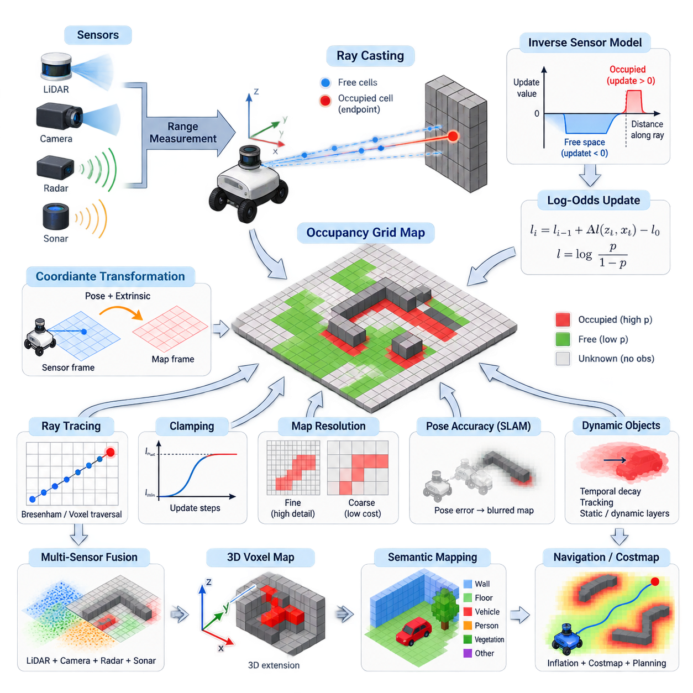{width="7.268055555555556in" height="7.268055555555556in"}

Occupancy grid mapping represents the environment as a regular lattice of cells, with each cell storing the probability that the corresponding region of space is occupied. Rather than committing immediately to a binary free-or-occupied decision, the map maintains uncertainty explicitly. This probabilistic representation makes occupancy grids particularly suitable for mobile robots operating with noisy LiDAR, sonar, depth cameras, or other range sensors.

A two-dimensional occupancy map divides the horizontal workspace into cells with a selected spatial resolution, such as several centimeters per cell. Each cell \\(m_i\\) is treated as a random variable representing whether that location is occupied. The mapping problem estimates \\(p(m_i \\mid z_{1:t}, x_{1:t})\\), where \\(z_{1:t}\\) denotes all sensor observations and \\(x_{1:t}\\) represents the corresponding robot poses up to the current time.

The fundamental update process begins by transforming a sensor measurement from the sensor coordinate frame into the map coordinate frame using the estimated robot pose and sensor extrinsic calibration. A range observation defines a ray extending from the sensor origin toward the detected surface. Cells traversed before the measured endpoint provide evidence of free space, while the endpoint region provides evidence that an obstacle or physical surface occupies that location.

Directly updating probabilities with Bayes\' rule is possible, but repeated multiplication and normalization are computationally inconvenient. Occupancy grid implementations therefore commonly use the log-odds representation. For occupancy probability \\(p\\), the log odds are defined as \\(l=\\log(p/(1-p))\\). Independent measurement evidence can then be accumulated through addition, producing an efficient update rule suitable for real-time robotic perception.

For a cell \\(m_i\\), the recursive update can be expressed conceptually as the previous log-odds value plus the log-odds contribution produced by the inverse sensor model. Measurements indicating free space decrease occupancy evidence, whereas measurements corresponding to detected surfaces increase it. A prior term prevents the same prior probability from being counted repeatedly when the recursive Bayesian formulation is implemented.

The inverse sensor model determines how individual measurements modify cells and therefore strongly influences map quality. It typically assigns one update value to cells along the free-space portion of a ray and another value to cells near its endpoint. Cells not observed by the current measurement remain unchanged. Sensor uncertainty may also be represented by spreading endpoint evidence across several cells instead of updating only a single discrete location.

Ray tracing is consequently a central operation in occupancy mapping. Algorithms such as Bresenham-style grid traversal or voxel traversal methods identify the cells intersected by each measurement ray. For LiDAR mapping, hundreds or thousands of rays may be processed for every scan. Efficient ray traversal, bounded update regions, parallel processing, and appropriate map resolution therefore become important for maintaining real-time update rates.

Occupancy probabilities should normally be bounded rather than allowed to converge indefinitely toward absolute certainty. Repeated observations of the same wall could otherwise produce extremely large log-odds magnitudes, making later corrections difficult when the environment changes or earlier measurements were erroneous. Clamping log odds between predefined minimum and maximum values preserves confidence while allowing contradictory future observations to modify the map.

Unknown space must remain distinct from confirmed free space. A cell that has never been observed contains no evidence that a robot can safely traverse it, whereas a free cell has received measurements supporting traversability. Maintaining occupied, free, and unknown states is therefore essential for exploration and navigation. Planning systems can assign different costs or policies to unknown regions depending on mission requirements and safety constraints.

Map resolution introduces a fundamental trade-off between geometric detail, computational load, and memory consumption. Fine grids represent narrow obstacles and boundaries more accurately but require substantially more cells and sensor updates. Coarse grids reduce computation and memory but may erase thin structures or merge nearby objects. Resolution should therefore reflect sensor accuracy, robot dimensions, operating speed, and the geometric detail required by navigation.

Pose accuracy is equally important because occupancy mapping assumes that observations can be placed consistently in a common coordinate system. Errors in localization cause repeated measurements of the same physical structure to appear at different locations, producing blurred walls, duplicated obstacles, or distorted corridors. Occupancy mapping is therefore closely coupled with odometry, localization, and SLAM even though the occupancy update itself can be formulated independently.

Dynamic objects create another difficulty because the classical occupancy model implicitly assumes a mostly static world. A pedestrian, vehicle, or moving robot may temporarily generate occupied evidence and leave residual obstacles after moving away. Practical systems address this through temporal decay, observation counters, dynamic-object filtering, tracking, or separate static and dynamic map layers so that transient measurements do not permanently corrupt the environmental representation.

Sensor characteristics must also be reflected in the update rules. LiDAR generally provides accurate range endpoints and strong free-space evidence along beams, while sonar has wider angular uncertainty and depth cameras suffer from occlusion, limited range, and invalid measurements. Treating every sensing modality with identical update probabilities can therefore create overconfident maps. The inverse sensor model should approximate the reliability and geometry of the actual sensor.

Multiple sensors can contribute to the same occupancy representation after their measurements are transformed into a shared coordinate frame. LiDAR may provide accurate geometric boundaries, cameras may contribute depth or semantic information, and radar may improve robustness under adverse environmental conditions. However, correlated measurements should be handled carefully because repeatedly treating dependent observations as statistically independent can cause excessive confidence in occupancy estimates.

For navigation, the raw occupancy grid usually becomes the geometric foundation for higher-level map representations. Occupied cells can be inflated according to robot footprint and safety margins, while free cells form candidate traversable regions. Navigation costmaps then incorporate obstacle distance, unknown-space policy, dynamic obstacles, and mission constraints. Thus occupancy mapping converts uncertain sensor measurements into a spatial representation that planners can use for collision-aware motion.

The same principle extends naturally from two-dimensional grids to three-dimensional voxel maps, where each voxel maintains occupancy evidence for a volume of space. Three-dimensional representations are valuable for drones, manipulators, legged robots, and environments containing overhangs or vertically complex structures. Their increased memory and computation requirements motivate sparse structures and hierarchical representations rather than allocating every voxel in a dense volume.

Occupancy mapping also provides a foundation for semantic mapping. Once geometric occupancy has established where physical structures exist, semantic perception can associate occupied regions with classes such as wall, floor, vehicle, person, vegetation, shelf, or machine. Geometry answers whether space is occupied, while semantic information explains what occupies it. This separation enables progressively richer representations without discarding the probabilistic geometric foundation.

A robust implementation therefore combines probabilistic state representation, inverse sensor modeling, ray traversal, log-odds accumulation, confidence limits, coordinate transformation, and explicit treatment of unknown space. These mechanisms transform successive uncertain measurements into a persistent environmental model. The surrounding chapter structure extends this foundation toward 3D voxel occupancy, semantic occupancy prediction, dynamic-aware updates, navigation costmaps, and long-term semantic mapping

점유 격자 지도화(Occupancy Grid Mapping)는 환경을 규칙적인 셀(Cell) 격자로 표현하고, 각 셀에 해당 공간 영역이 점유되어 있을 확률을 저장하는 방식이다. 공간을 즉시 자유 공간(Free) 또는 점유 공간(Occupied)으로 이진 결정하지 않고 불확실성(Uncertainty)을 명시적으로 유지한다. 이러한 확률적 표현(Probabilistic Representation)은 잡음이 포함된 라이다(LiDAR), 소나(Sonar), 깊이 카메라(Depth Camera) 등의 거리 센서(Range Sensor)를 사용하는 이동 로봇(Mobile Robot)에 특히 적합하다.

2차원 점유 지도(2D Occupancy Map)는 수평 작업 공간을 셀당 수 센티미터와 같이 선택된 공간 해상도(Spatial Resolution)를 갖는 셀로 분할한다. 각 셀 \\(m_i\\)는 해당 위치의 점유 여부를 나타내는 확률 변수(Random Variable)로 취급된다. 지도화 문제(Mapping Problem)는 현재 시점까지의 모든 센서 관측값을 \\(z_{1:t}\\), 이에 대응하는 로봇 자세(Robot Pose)를 \\(x_{1:t}\\)라 할 때 \\(p(m_i \\mid z_{1:t}, x_{1:t})\\)를 추정하는 문제로 표현된다.

기본적인 갱신 과정(Update Process)은 추정된 로봇 자세와 센서 외부 보정(Sensor Extrinsic Calibration)을 이용하여 센서 측정값을 센서 좌표계(Sensor Coordinate Frame)에서 지도 좌표계(Map Coordinate Frame)로 변환하는 것에서 시작한다. 거리 측정값은 센서 원점에서 감지된 표면까지 이어지는 광선(Ray)을 정의한다. 측정 종점 이전을 통과하는 셀은 자유 공간이라는 증거를 제공하고, 종점 주변은 장애물 또는 물리적 표면이 존재한다는 증거를 제공한다.

베이즈 규칙(Bayes\' Rule)을 이용하여 확률을 직접 갱신할 수도 있지만, 반복적인 곱셈과 정규화(Normalization)는 계산 측면에서 불편하다. 따라서 점유 격자 구현에서는 일반적으로 로그 오즈 표현(Log-Odds Representation)을 사용한다. 점유 확률이 \\(p\\)일 때 로그 오즈는 \\(l=\\log(p/(1-p))\\)로 정의된다. 독립적인 측정 증거를 단순한 덧셈으로 누적할 수 있으므로 실시간 로봇 인지(Real-Time Robotic Perception)에 적합한 효율적인 갱신 규칙을 구성할 수 있다.

셀 \\(m_i\\)에 대한 재귀적 갱신(Recursive Update)은 개념적으로 이전 로그 오즈 값에 역 센서 모델(Inverse Sensor Model)이 생성한 로그 오즈 기여분을 더하는 방식으로 표현할 수 있다. 자유 공간을 나타내는 측정은 점유 증거를 감소시키고, 감지된 표면에 해당하는 측정은 점유 증거를 증가시킨다. 재귀적 베이지안 공식(Recursive Bayesian Formulation)을 구현할 때 동일한 사전 확률(Prior Probability)이 반복 계산되지 않도록 사전 확률 항을 적절히 처리해야 한다.

역 센서 모델(Inverse Sensor Model)은 개별 측정값이 각 셀을 어떻게 변화시키는지를 결정하므로 지도 품질에 큰 영향을 준다. 일반적으로 광선의 자유 공간 구간에 위치한 셀에는 하나의 갱신 값을 적용하고, 측정 종점 주변 셀에는 다른 값을 적용한다. 현재 측정으로 관측되지 않은 셀은 변경하지 않는다. 센서 불확실성(Sensor Uncertainty)을 표현하기 위해 종점 증거를 하나의 셀에만 적용하지 않고 여러 인접 셀에 분산시킬 수도 있다.

따라서 광선 추적(Ray Tracing)은 점유 지도화의 핵심 연산이다. 브레젠험 방식 격자 탐색(Bresenham-Style Grid Traversal)이나 복셀 탐색(Voxel Traversal) 알고리즘을 이용하여 각각의 측정 광선이 통과하는 셀을 식별한다. 라이다 지도화에서는 하나의 스캔마다 수백에서 수천 개의 광선을 처리할 수 있다. 따라서 실시간 갱신 속도를 유지하려면 효율적인 광선 탐색, 제한된 갱신 영역, 병렬 처리(Parallel Processing), 적절한 지도 해상도가 중요하다.

점유 확률(Occupancy Probability)은 절대적인 확신에 무한히 가까워지도록 두기보다는 일정 범위 내로 제한하는 것이 일반적이다. 동일한 벽을 반복 관측하면 로그 오즈의 절댓값이 지나치게 커질 수 있으며, 이 경우 환경이 변하거나 이전 측정이 잘못되었을 때 수정하기 어려워진다. 로그 오즈를 미리 정의된 최소값과 최대값 사이로 제한하는 클램핑(Clamping)을 적용하면 높은 신뢰도를 유지하면서도 이후의 상반된 관측을 통해 지도를 수정할 수 있다.

미지 공간(Unknown Space)은 확인된 자유 공간(Free Space)과 반드시 구분해야 한다. 한 번도 관측되지 않은 셀은 로봇이 안전하게 통과할 수 있다는 증거가 없지만, 자유 셀은 통행 가능성을 뒷받침하는 측정 증거를 가지고 있다. 따라서 탐사(Exploration)와 내비게이션(Navigation)을 위해 점유, 자유, 미지 상태를 구분하는 것이 중요하다. 계획 시스템(Planning System)은 임무 요구사항과 안전 제약에 따라 미지 영역에 서로 다른 비용이나 정책을 적용할 수 있다.

지도 해상도(Map Resolution)는 기하학적 세부 표현, 계산 부하, 메모리 사용량 사이의 근본적인 절충 관계(Trade-Off)를 만든다. 세밀한 격자는 좁은 장애물과 경계를 더 정확하게 표현하지만 훨씬 많은 셀과 센서 갱신 연산을 필요로 한다. 반대로 거친 격자는 계산량과 메모리를 줄이지만 얇은 구조물이 사라지거나 인접한 객체가 합쳐질 수 있다. 따라서 해상도는 센서 정확도, 로봇 크기, 운행 속도, 내비게이션에 필요한 기하학적 정밀도를 고려하여 결정해야 한다.

점유 지도화는 관측값을 공통 좌표계(Common Coordinate System)에 일관되게 배치할 수 있다고 가정하므로 자세 정확도(Pose Accuracy)도 매우 중요하다. 위치 추정(Localization)의 오차가 발생하면 동일한 물리적 구조물을 반복 관측하더라도 서로 다른 위치에 배치되어 벽이 흐려지거나 장애물이 중복되고 복도가 왜곡될 수 있다. 따라서 점유 지도 갱신 자체는 독립적으로 정의할 수 있지만 실제 시스템에서는 주행 거리 추정(Odometry), 위치 추정, 동시적 위치 추정 및 지도 작성(SLAM)과 밀접하게 연결된다.

동적 객체(Dynamic Object)는 고전적인 점유 모델이 대부분 정적인 환경을 가정한다는 점에서 또 다른 문제를 발생시킨다. 보행자, 차량 또는 이동 로봇은 일시적으로 점유 증거를 생성한 뒤 이동한 위치에 잔류 장애물을 남길 수 있다. 실제 시스템에서는 시간 감쇠(Temporal Decay), 관측 횟수 카운터(Observation Counter), 동적 객체 필터링(Dynamic-Object Filtering), 추적(Tracking), 또는 정적 지도와 동적 지도 계층을 분리하여 일시적인 측정값이 환경 표현을 영구적으로 오염시키지 않도록 한다.

센서 특성(Sensor Characteristics) 역시 갱신 규칙에 반영되어야 한다. 라이다는 일반적으로 정확한 거리 종점과 광선을 따라 강한 자유 공간 증거를 제공하지만, 소나는 더 넓은 각도 불확실성(Angular Uncertainty)을 가지며 깊이 카메라는 가림(Occlusion), 제한된 측정 거리, 유효하지 않은 측정값 등의 영향을 받는다. 모든 센서 방식에 동일한 갱신 확률을 적용하면 지나치게 확신적인 지도가 만들어질 수 있으므로 역 센서 모델은 실제 센서의 신뢰성과 측정 기하학을 반영해야 한다.

여러 센서의 측정값은 공통 좌표계로 변환한 후 동일한 점유 표현(Occupancy Representation)에 통합할 수 있다. 라이다는 정확한 기하학적 경계를 제공하고, 카메라는 깊이 또는 의미 정보(Semantic Information)를 추가하며, 레이더(Radar)는 악천후 환경에서 강건성(Robustness)을 향상시킬 수 있다. 그러나 상관관계가 있는 측정값을 반복적으로 통계적 독립으로 간주하면 점유 확률에 과도한 확신이 발생할 수 있으므로 주의해야 한다.

내비게이션을 위해 원시 점유 격자(Raw Occupancy Grid)는 일반적으로 상위 수준 지도 표현의 기하학적 기반으로 사용된다. 점유 셀은 로봇의 형상(Robot Footprint)과 안전 여유(Safety Margin)를 고려하여 팽창시킬 수 있으며, 자유 셀은 이동 가능한 후보 영역을 형성한다. 이후 내비게이션 비용 지도(Costmap)는 장애물 거리, 미지 공간 정책, 동적 장애물, 임무 제약 등을 통합한다. 즉, 점유 지도화는 불확실한 센서 측정을 충돌 회피 이동 계획에 사용할 수 있는 공간 표현으로 변환한다.

동일한 원리는 2차원 격자에서 3차원 복셀 지도(3D Voxel Map)로 자연스럽게 확장될 수 있으며, 이 경우 각 복셀(Voxel)은 일정한 공간 부피에 대한 점유 증거를 유지한다. 3차원 표현은 무인항공기(UAV), 매니퓰레이터(Manipulator), 다족 로봇(Legged Robot), 그리고 돌출 구조나 수직적으로 복잡한 환경에서 유용하다. 그러나 메모리와 계산 요구량이 크게 증가하므로 전체 공간에 복셀을 밀집 배치하기보다 희소 구조(Sparse Structure)와 계층적 표현(Hierarchical Representation)이 활용된다.

점유 지도화는 의미 지도화(Semantic Mapping)의 기반으로도 활용된다. 기하학적 점유 정보가 물리적 구조물의 위치를 결정하면 의미 인지(Semantic Perception)를 이용하여 점유 영역에 벽, 바닥, 차량, 사람, 식생, 선반, 기계 등의 클래스를 연결할 수 있다. 기하 정보(Geometry)는 공간이 점유되어 있는지를 설명하고 의미 정보(Semantics)는 무엇이 그 공간을 점유하는지를 설명한다. 이러한 분리를 통해 확률적 기하 기반을 유지하면서 더 풍부한 환경 표현으로 확장할 수 있다.

따라서 강건한 점유 지도 구현은 확률적 상태 표현(Probabilistic State Representation), 역 센서 모델(Inverse Sensor Model), 광선 탐색(Ray Traversal), 로그 오즈 누적(Log-Odds Accumulation), 신뢰도 제한(Confidence Limits), 좌표 변환(Coordinate Transformation), 미지 공간의 명시적 처리를 결합한다. 이러한 메커니즘은 연속적으로 입력되는 불확실한 측정값을 지속적인 환경 모델(Persistent Environmental Model)로 변환한다. 이후 내용은 이러한 기반을 3차원 복셀 점유, 의미 점유 예측(Semantic Occupancy Prediction), 동적 객체 인식 갱신, 내비게이션 비용 지도, 장기 의미 지도(Long-Term Semantic Map)로 확장한다.

##  

## 08.02. 3D Occupancy Voxel Map OctoMap Bonxai [w/Code]

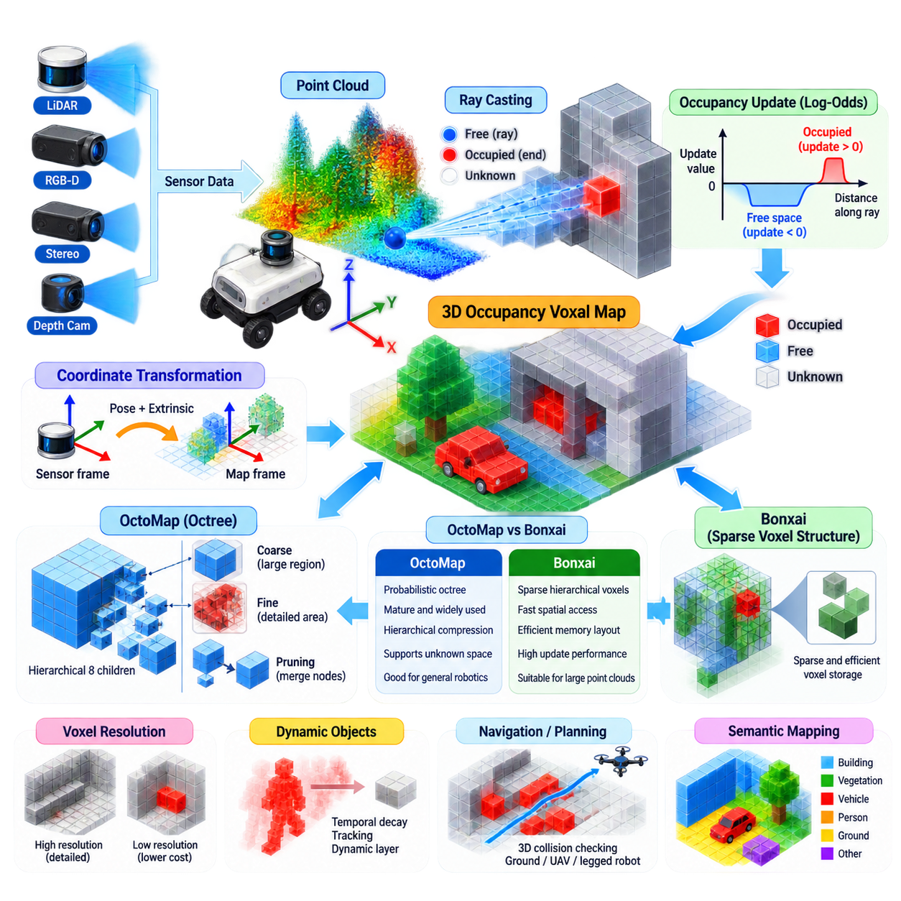{width="7.268055555555556in" height="7.268055555555556in"}

Three-dimensional occupancy mapping extends the probabilistic occupancy-grid concept from planar cells into volumetric voxels, allowing a robot to represent free, occupied, and unknown space throughout a 3D environment. This representation is essential when obstacles cannot be described adequately on a horizontal plane, such as shelves, overhangs, stairs, vegetation, machinery, suspended structures, and terrain with significant elevation variation.

A 3D occupancy map divides space into voxels, where each voxel represents a small cubic region and stores evidence about whether that volume is occupied. Measurements from LiDAR, RGB-D cameras, stereo systems, or other depth sensors are transformed into a common map coordinate frame. Sensor rays then provide free-space evidence along their paths and occupied-space evidence around measured endpoints, following the same probabilistic principles used in two-dimensional occupancy grids.

The occupancy probability of each voxel can be updated recursively using Bayesian estimation, although practical implementations commonly employ log-odds values for computational efficiency. Free observations reduce the voxel\'s occupancy evidence, while surface observations increase it. Minimum and maximum log-odds limits prevent unlimited confidence accumulation, allowing the map to recover when measurements are noisy or previously occupied regions later become free.

A straightforward dense voxel array becomes impractical as the represented environment grows. If the linear dimensions of a map increase, the number of possible voxels grows cubically, even though most robotic environments contain large regions that are unobserved or empty. Three-dimensional occupancy systems therefore rely heavily on sparse data structures that allocate memory only where meaningful observations or spatial subdivisions are required.

OctoMap is a widely used probabilistic 3D mapping framework based on an octree data structure. An octree recursively divides a cubic volume into eight child regions, enabling the map to represent space hierarchically. Large homogeneous regions can remain represented at coarse resolution, while areas containing geometric detail can be subdivided into smaller voxels. This provides a useful balance between spatial resolution and memory consumption.

The probabilistic formulation of OctoMap allows nodes to represent occupied, free, or unknown regions while accumulating evidence from repeated sensor observations. A depth measurement is inserted by ray casting from the sensor origin toward the measured endpoint. Voxels traversed by the ray are updated toward free space, while the endpoint is updated toward occupied space. Repeated observations gradually increase confidence without requiring an immediate binary decision.

Hierarchical representation also enables spatial queries at different resolutions. A robot may require fine geometry near its body for collision avoidance while accepting coarser information for distant structures. Octree pruning can merge child nodes when their occupancy states become sufficiently similar, reducing memory consumption. Conversely, nodes can be expanded when new measurements reveal spatial detail that requires finer representation.

OctoMap\'s strengths include its mature probabilistic formulation, explicit modeling of unknown space, hierarchical compression, and broad integration with robotics software. It has been extensively used for mobile robots, manipulators, aerial robots, exploration, collision checking, and 3D planning. However, maintaining an octree introduces pointer traversal, node-management, memory-allocation, and cache-locality costs that can become important in high-rate perception pipelines.

Bonxai addresses a different performance point in sparse voxel mapping by emphasizing fast spatial access and efficient memory organization. Rather than relying on the traditional recursive octree organization used by OctoMap, Bonxai employs a sparse hierarchical voxel structure designed to improve practical CPU performance. This is particularly valuable when perception systems must repeatedly insert large point clouds and query local 3D occupancy at high frequency.

The distinction between OctoMap and Bonxai is therefore not simply whether both can represent occupied voxels. Their internal organizations reflect different optimization priorities. OctoMap emphasizes a mature hierarchical probabilistic octree representation, whereas Bonxai targets efficient sparse voxel storage and faster access patterns. Selection should therefore consider update frequency, map scale, memory budget, query behavior, and compatibility with the surrounding robotics software stack.

Insertion of a LiDAR point cloud into either representation requires accurate coordinate transformation. Each point is transformed from the sensor frame through the robot frame into the global or local map frame using the current pose estimate and calibrated sensor extrinsics. Pose errors directly distort the voxel map, causing surfaces to become thicker, duplicated, or displaced. Reliable localization or SLAM is therefore fundamental to consistent 3D occupancy reconstruction.

Ray casting is one of the most computationally expensive parts of volumetric occupancy mapping because every valid range observation can traverse many voxels before reaching its endpoint. High-resolution 3D LiDAR may produce tens or hundreds of thousands of points per scan. Practical systems therefore use point filtering, range limits, downsampling, bounded local maps, efficient voxel traversal, and parallel processing to control the computational cost of occupancy updates.

Voxel resolution determines the smallest geometric structure that the map can represent. Small voxels capture thin obstacles and detailed surfaces but increase memory consumption, insertion cost, and query workload. Larger voxels reduce computational requirements but can merge nearby structures and exaggerate obstacle dimensions. Resolution must therefore be selected according to robot size, sensor accuracy, environment complexity, motion speed, and planning requirements.

For navigation, a 3D occupancy map can be queried directly by a three-dimensional planner or projected into a two-dimensional representation. Ground robots frequently extract occupied columns or height-filtered obstacles to construct navigation costmaps, while UAVs and other free-flying robots require full volumetric collision checking. Legged robots can additionally combine voxel occupancy with terrain height, surface orientation, and traversability information for foothold and body-motion planning.

Local and global voxel maps often serve different purposes. A global map preserves persistent environmental structure for localization, mission planning, and long-term operation, while a rolling local map maintains high-resolution occupancy around the robot for immediate collision avoidance. Restricting frequent updates to a local volume can significantly reduce computational load while retaining a larger, more persistent representation for strategic planning.

Dynamic environments require additional mechanisms because conventional voxel occupancy assumes that observations primarily describe static geometry. Moving people, vehicles, manipulators, or other robots may leave temporary occupied voxels behind. Time decay, clearing rays, observation timestamps, object tracking, and separate dynamic layers can remove stale evidence and prevent transient objects from becoming permanent structures in the map.

Three-dimensional occupancy maps can also provide the geometric substrate for semantic mapping. Occupied voxels may be augmented with class probabilities, object identities, instance labels, traversability attributes, or learned feature embeddings. A voxel map can consequently evolve from a purely geometric collision representation into a richer spatial memory that describes both where physical matter exists and what that matter represents.

In a modern robotic perception architecture, OctoMap and Bonxai should therefore be viewed as alternative sparse spatial representations rather than complete perception systems. Sensor preprocessing, localization, coordinate transformation, ray traversal, occupancy updates, dynamic-object handling, and planning interfaces remain necessary around them. The chapter structure places this topic directly after occupancy-grid theory and before semantic occupancy prediction, surround-view occupancy, dynamic-aware updates, costmap generation, and long-term semantic-map maintenance. :chatgpt-content-reference{index="0"}

3차원 점유 지도화(3D Occupancy Mapping)는 평면 셀(Planar Cell)을 사용하는 확률적 점유 격자(Probabilistic Occupancy Grid)의 개념을 체적 복셀(Volumetric Voxel)로 확장하여, 로봇이 3차원 환경 전체에서 자유 공간(Free Space), 점유 공간(Occupied Space), 미지 공간(Unknown Space)을 표현할 수 있도록 한다. 선반, 돌출 구조물, 계단, 식생, 기계 설비, 매달린 구조물, 고도 변화가 큰 지형처럼 수평 평면만으로 장애물을 충분히 표현할 수 없는 환경에서 이러한 표현은 필수적이다.

3차원 점유 지도(3D Occupancy Map)는 공간을 복셀(Voxel)로 분할하며, 각 복셀은 작은 입방체 공간 영역을 나타내고 해당 공간의 점유 여부에 대한 증거를 저장한다. 라이다(LiDAR), RGB-D 카메라(RGB-D Camera), 스테레오 시스템(Stereo System) 또는 기타 깊이 센서(Depth Sensor)의 측정값은 공통 지도 좌표계(Common Map Coordinate Frame)로 변환된다. 이후 센서 광선(Sensor Ray)은 경로상의 자유 공간 증거와 측정 종점 주변의 점유 공간 증거를 제공하며, 이는 2차원 점유 격자와 동일한 확률적 원리를 따른다.

각 복셀의 점유 확률(Occupancy Probability)은 베이지안 추정(Bayesian Estimation)을 이용하여 재귀적으로 갱신할 수 있지만, 실제 구현에서는 계산 효율성을 위해 일반적으로 로그 오즈(Log-Odds) 값을 사용한다. 자유 공간 관측은 복셀의 점유 증거를 감소시키고, 표면 관측은 점유 증거를 증가시킨다. 최소 및 최대 로그 오즈 제한을 적용하면 신뢰도가 무한히 누적되는 것을 방지하여 측정에 잡음이 있거나 이전에 점유되었던 영역이 나중에 자유 공간으로 바뀌는 경우에도 지도를 수정할 수 있다.

단순한 밀집 복셀 배열(Dense Voxel Array)은 표현하려는 환경이 커질수록 비현실적이 된다. 지도의 각 축 방향 크기가 증가하면 가능한 복셀 수는 세제곱으로 증가하지만, 실제 로봇 환경에서는 대부분의 영역이 관측되지 않았거나 비어 있는 경우가 많다. 따라서 3차원 점유 시스템은 의미 있는 관측 또는 공간 분할이 필요한 영역에만 메모리를 할당하는 희소 자료구조(Sparse Data Structure)에 크게 의존한다.

옥토맵(OctoMap)은 옥트리 자료구조(Octree Data Structure)를 기반으로 하는 널리 사용되는 확률적 3차원 지도화 프레임워크(Probabilistic 3D Mapping Framework)이다. 옥트리는 하나의 입방체 공간을 재귀적으로 여덟 개의 하위 영역으로 분할하여 공간을 계층적으로 표현한다. 균질한 넓은 영역은 낮은 해상도로 유지하고, 기하학적 세부 구조가 존재하는 영역은 더 작은 복셀로 세분화할 수 있다. 이를 통해 공간 해상도와 메모리 사용량 사이의 효과적인 균형을 제공한다.

옥토맵의 확률적 공식(Probabilistic Formulation)은 반복되는 센서 관측으로부터 증거를 누적하면서 노드(Node)가 점유, 자유 또는 미지 영역을 표현할 수 있도록 한다. 깊이 측정값은 센서 원점에서 측정 종점까지 광선 투사(Ray Casting)를 수행하여 삽입된다. 광선이 통과하는 복셀은 자유 공간 방향으로 갱신되고, 종점은 점유 공간 방향으로 갱신된다. 반복 관측을 통해 즉각적인 이진 결정 없이 점진적으로 신뢰도를 높일 수 있다.

계층적 표현(Hierarchical Representation)은 서로 다른 해상도에서 공간을 조회할 수 있게 한다. 로봇은 충돌 회피(Collision Avoidance)를 위해 자신의 주변에서는 정밀한 기하 정보를 요구할 수 있지만, 멀리 떨어진 구조물에는 상대적으로 거친 정보를 사용할 수 있다. 옥트리 가지치기(Octree Pruning)는 하위 노드들의 점유 상태가 충분히 유사할 경우 이들을 병합하여 메모리 사용량을 줄인다. 반대로 새로운 측정으로 더 세밀한 공간 표현이 필요해지면 노드를 다시 확장할 수 있다.

옥토맵의 주요 장점은 성숙한 확률적 공식, 미지 공간의 명시적 모델링(Explicit Modeling), 계층적 압축(Hierarchical Compression), 그리고 로봇 소프트웨어와의 폭넓은 통합이다. 이동 로봇(Mobile Robot), 매니퓰레이터(Manipulator), 비행 로봇(Aerial Robot), 탐사(Exploration), 충돌 검사(Collision Checking), 3차원 경로 계획(3D Planning) 등에 광범위하게 활용되어 왔다. 그러나 옥트리를 유지하려면 포인터 탐색(Pointer Traversal), 노드 관리, 메모리 할당, 캐시 지역성(Cache Locality)과 관련된 비용이 발생하며, 고속 인지 파이프라인에서는 이러한 비용이 중요해질 수 있다.

본자이(Bonxai)는 빠른 공간 접근(Fast Spatial Access)과 효율적인 메모리 구성(Efficient Memory Organization)을 강조함으로써 희소 복셀 지도화에서 서로 다른 성능 지점을 목표로 한다. 옥토맵에서 사용하는 전통적인 재귀적 옥트리 구조에 의존하기보다는 실제 CPU 성능을 향상시키도록 설계된 희소 계층형 복셀 구조(Sparse Hierarchical Voxel Structure)를 사용한다. 이는 대규모 포인트 클라우드(Point Cloud)를 반복적으로 삽입하고 로컬 3차원 점유 정보를 높은 주기로 조회해야 하는 인지 시스템에서 특히 유용하다.

따라서 옥토맵과 본자이의 차이는 단순히 두 시스템 모두 점유 복셀을 표현할 수 있다는 수준에 있지 않다. 두 시스템의 내부 구조는 서로 다른 최적화 우선순위(Optimization Priority)를 반영한다. 옥토맵은 성숙한 계층형 확률적 옥트리 표현을 강조하는 반면, 본자이는 효율적인 희소 복셀 저장과 빠른 접근 패턴(Access Pattern)을 목표로 한다. 따라서 갱신 주기, 지도 규모, 메모리 예산, 조회 방식, 주변 로봇 소프트웨어 스택과의 호환성을 고려하여 선택해야 한다.

라이다 포인트 클라우드를 두 표현 중 하나에 삽입하려면 정확한 좌표 변환(Coordinate Transformation)이 필요하다. 각각의 포인트는 현재 자세 추정값(Pose Estimate)과 보정된 센서 외부 파라미터(Sensor Extrinsics)를 이용하여 센서 좌표계에서 로봇 좌표계를 거쳐 전역 또는 로컬 지도 좌표계로 변환된다. 자세 오차(Pose Error)는 복셀 지도를 직접 왜곡하여 표면을 두껍게 만들거나 중복시키고 위치를 이동시킬 수 있다. 따라서 신뢰할 수 있는 위치 추정(Localization) 또는 동시적 위치 추정 및 지도 작성(SLAM)은 일관된 3차원 점유 재구성에 필수적이다.

광선 투사(Ray Casting)는 각각의 유효한 거리 측정값이 종점에 도달하기 전에 다수의 복셀을 통과할 수 있기 때문에 체적 점유 지도화에서 가장 많은 계산량을 요구하는 작업 중 하나이다. 고해상도 3차원 라이다는 한 번의 스캔에서 수만 개에서 수십만 개의 포인트를 생성할 수 있다. 따라서 실제 시스템에서는 점유 갱신 계산량을 제어하기 위해 포인트 필터링(Point Filtering), 거리 제한, 다운샘플링(Downsampling), 제한된 로컬 지도, 효율적인 복셀 탐색(Voxel Traversal), 병렬 처리(Parallel Processing)를 활용한다.

복셀 해상도(Voxel Resolution)는 지도가 표현할 수 있는 최소 기하학적 구조를 결정한다. 작은 복셀은 얇은 장애물과 세밀한 표면을 표현할 수 있지만 메모리 사용량, 데이터 삽입 비용, 조회 연산량을 증가시킨다. 큰 복셀은 계산 요구량을 감소시키지만 가까운 구조물을 하나로 합치거나 장애물의 실제 크기를 과장할 수 있다. 따라서 로봇 크기, 센서 정확도, 환경 복잡도, 이동 속도, 경로 계획 요구사항을 고려하여 해상도를 결정해야 한다.

내비게이션(Navigation)을 위해 3차원 점유 지도는 3차원 플래너(3D Planner)가 직접 조회하거나 2차원 표현으로 투영할 수 있다. 지상 로봇(Ground Robot)은 점유된 수직 열 또는 높이 필터링된 장애물을 추출하여 내비게이션 비용 지도(Costmap)를 구성하는 경우가 많다. 반면 무인항공기(UAV)와 같은 자유 비행 로봇은 완전한 체적 충돌 검사(Volumetric Collision Checking)가 필요하다. 다족 로봇(Legged Robot)은 복셀 점유 정보에 지형 높이, 표면 방향, 주행 가능성(Traversability)을 결합하여 발 디딤 위치와 몸체 움직임을 계획할 수 있다.

로컬 복셀 지도(Local Voxel Map)와 전역 복셀 지도(Global Voxel Map)는 서로 다른 목적을 담당하는 경우가 많다. 전역 지도는 위치 추정, 임무 계획, 장기 운용을 위해 지속적인 환경 구조를 보존하는 반면, 롤링 로컬 지도(Rolling Local Map)는 즉각적인 충돌 회피를 위해 로봇 주변의 고해상도 점유 정보를 유지한다. 빈번한 갱신을 제한된 로컬 공간에 집중하면 전략적 계획을 위한 더 큰 지속형 지도를 유지하면서 계산 부하를 크게 줄일 수 있다.

동적 환경(Dynamic Environment)에서는 기존 복셀 점유 모델이 주로 정적 기하 구조를 관측한다고 가정하기 때문에 추가적인 처리 메커니즘이 필요하다. 움직이는 사람, 차량, 매니퓰레이터 또는 다른 로봇은 이동 후에도 일시적인 점유 복셀을 남길 수 있다. 시간 감쇠(Time Decay), 클리어링 광선(Clearing Ray), 관측 타임스탬프(Observation Timestamp), 객체 추적(Object Tracking), 별도의 동적 계층(Dynamic Layer)을 이용하면 오래된 증거를 제거하고 일시적인 객체가 지도에 영구적인 구조물로 남는 것을 방지할 수 있다.

3차원 점유 지도는 의미 지도화(Semantic Mapping)를 위한 기하학적 기반(Geometric Substrate)으로도 사용할 수 있다. 점유 복셀에는 클래스 확률(Class Probability), 객체 식별 정보(Object Identity), 인스턴스 레이블(Instance Label), 주행 가능성 속성(Traversability Attribute), 학습된 특징 임베딩(Learned Feature Embedding)을 추가할 수 있다. 이에 따라 복셀 지도는 단순한 기하학적 충돌 표현에서 물리적 물체가 어디에 존재하는지뿐만 아니라 그 물체가 무엇인지를 설명하는 더욱 풍부한 공간 기억(Spatial Memory)으로 발전할 수 있다.

현대적인 로봇 인지 아키텍처(Robotic Perception Architecture)에서 옥토맵과 본자이는 완전한 인지 시스템이라기보다 서로 대체 가능한 희소 공간 표현(Sparse Spatial Representation)으로 이해해야 한다. 이들을 실제 시스템에 적용하려면 센서 전처리, 위치 추정, 좌표 변환, 광선 탐색, 점유 갱신, 동적 객체 처리, 경로 계획 인터페이스가 함께 구성되어야 한다. 이 주제는 점유 격자 이론(Occupancy Grid Theory) 이후 3차원 표현으로 확장되는 단계이며, 이후 의미 점유 예측(Semantic Occupancy Prediction), 서라운드 뷰 점유(Surround-View Occupancy), 동적 객체 인식 갱신(Dynamic-Aware Update), 비용 지도 생성(Costmap Generation), 장기 의미 지도 유지관리(Long-Term Semantic Map Maintenance)로 이어진다.

##  

## 08.03. Semantic Occupancy Prediction MonoScene TPVFormer [w/Code]

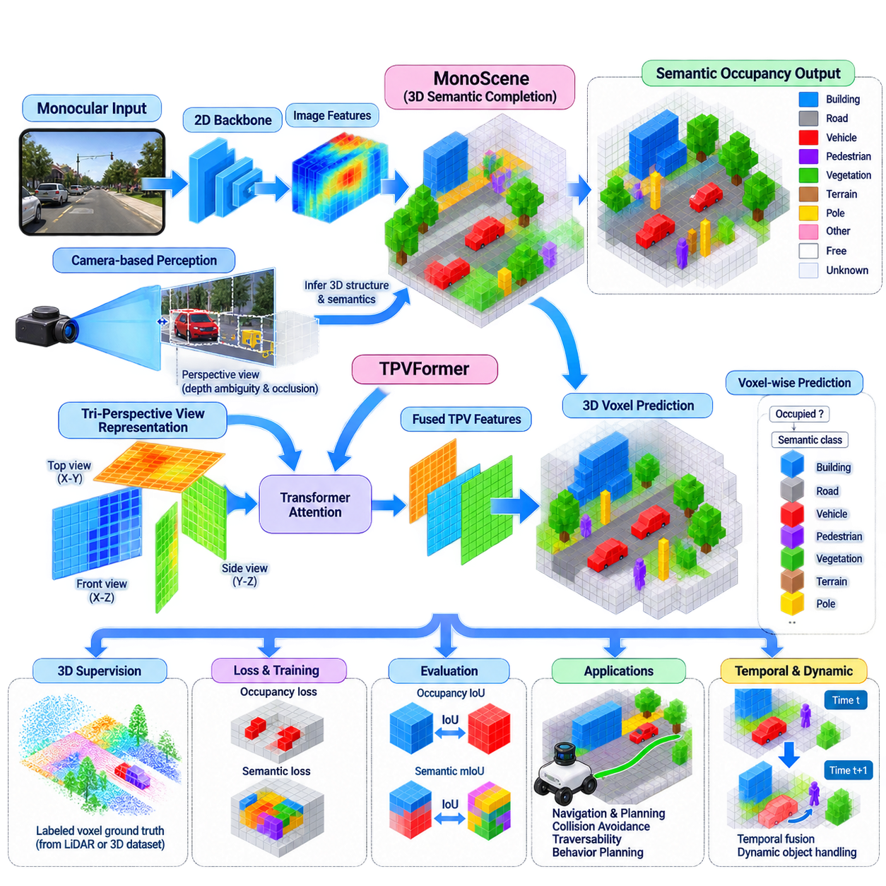{width="7.268055555555556in" height="7.268055555555556in"}

Semantic occupancy prediction extends geometric occupancy mapping by estimating not only whether a region of 3D space is occupied, but also what semantic category occupies it. Instead of producing only free, occupied, and unknown states, the system assigns semantic labels such as road, building, vehicle, pedestrian, vegetation, or terrain to volumetric cells. This creates a unified representation of scene geometry and meaning for robotic perception. :chatgpt-content-reference{index="0"}

The problem is commonly formulated over a predefined three-dimensional voxel volume surrounding the robot. For each voxel, a model predicts whether the space is empty or occupied and, when occupied, estimates its semantic class. The resulting semantic occupancy grid provides dense spatial understanding even for regions that are partially observed, occluded, or not directly measured by a depth sensor, distinguishing prediction from purely measurement-driven voxel mapping.

Camera-based semantic occupancy prediction is particularly attractive because cameras provide dense appearance information at relatively low hardware cost. However, perspective images collapse three-dimensional geometry onto two-dimensional image planes, creating substantial ambiguity in depth and occluded regions. A successful model must therefore infer 3D structure from visual cues while transferring image features into an appropriate volumetric or structured spatial representation.

MonoScene demonstrates this concept using monocular imagery for three-dimensional semantic scene completion. The central objective is to infer a dense semantic 3D representation from a single RGB observation rather than depending on LiDAR measurements during inference. Image features extracted by a two-dimensional backbone must therefore provide sufficient contextual evidence to reason about depth, object structure, surfaces, and portions of the environment that are not directly visible.

Semantic scene completion combines two closely related tasks. Scene completion predicts the occupancy of unobserved space, while semantic scene completion additionally predicts the category of occupied regions. This means the network must reason beyond visible surfaces. For example, an image may expose only the front surface of a vehicle, yet the predicted voxel representation should approximate its complete spatial extent rather than representing only the visible pixels projected into 3D.

MonoScene uses relationships between two-dimensional image features and three-dimensional voxel features to bridge the dimensional gap between camera observations and volumetric scene understanding. Contextual reasoning is important because a single image does not uniquely determine depth. Semantic regularities, object appearance, scene layout, and relationships among spatial regions help constrain plausible 3D interpretations and improve completion of areas without direct visual evidence.

The cost of dense 3D prediction becomes significant as spatial resolution increases. A volumetric feature tensor grows with width, height, and depth, causing memory consumption and computation to rise rapidly. This cubic scaling makes high-resolution occupancy prediction difficult on embedded robotic hardware. Consequently, efficient representations that retain useful three-dimensional context without maintaining a fully dense high-dimensional voxel feature volume are highly desirable.

TPVFormer approaches this challenge using a tri-perspective view representation. Instead of storing all scene features directly in a dense 3D volume, the environment is represented through three orthogonal feature planes corresponding conceptually to top, front, and side perspectives. These complementary planes encode spatial information more compactly while still allowing features for three-dimensional positions to be reconstructed or queried from their projected locations.

The tri-perspective representation offers an important computational advantage because its feature storage grows primarily with combinations of two spatial dimensions rather than directly with the complete dense 3D volume. Information from the three planes can be combined to describe a voxel location, allowing the model to preserve broad 3D contextual reasoning while reducing the memory burden associated with conventional volumetric feature tensors.

Transformer-based attention enables TPVFormer to aggregate information across image observations and structured spatial features. Camera features provide visual evidence, while learned spatial queries organize that evidence into the tri-perspective representation. Attention mechanisms can associate image regions with relevant spatial locations and propagate contextual information, supporting semantic reasoning across areas that may be difficult to infer from local visual appearance alone.

MonoScene and TPVFormer therefore illustrate two important design directions for semantic occupancy perception. MonoScene emphasizes monocular semantic scene completion and demonstrates that meaningful 3D structure can be inferred from a single image. TPVFormer emphasizes an efficient structured representation for 3D semantic occupancy reasoning, reducing dependence on computationally expensive dense volumetric feature processing while preserving spatial context.

Training semantic occupancy models requires three-dimensional supervision describing both occupancy and semantic categories. Ground-truth voxel labels may be generated from annotated 3D datasets, accumulated LiDAR scans, reconstructed scenes, or other spatial annotations. Care is required when distinguishing genuinely empty space from unobserved regions because treating unknown voxels as free space introduces incorrect supervision and can bias the network toward unsafe predictions.

Class imbalance is another major challenge. Large portions of a scene may consist of empty space, road, ground, or building surfaces, while safety-critical categories such as pedestrians, cyclists, poles, or small obstacles occupy relatively few voxels. Loss functions, sampling strategies, class weighting, and evaluation procedures must prevent dominant classes from overwhelming learning signals associated with smaller but operationally important objects.

Evaluation should separately consider geometric occupancy and semantic correctness. Intersection over Union (IoU) can measure overlap between predicted and ground-truth classes, while scene-completion metrics assess whether occupied geometry is reconstructed correctly. A model may predict overall occupancy reasonably well yet assign incorrect semantic classes, or achieve good semantic scores on visible surfaces while performing poorly in occluded regions. Both capabilities matter for robotics.

Temporal information can further improve semantic occupancy prediction. Although a single frame provides an instantaneous observation, a moving robot continuously receives new views of the environment. Features or occupancy predictions accumulated across time can reduce depth ambiguity, reveal previously occluded structures, and stabilize semantic estimates. Temporal fusion must nevertheless account for ego-motion and independently moving objects to avoid misaligning information.

Dynamic objects are particularly important because a semantic occupancy map should distinguish persistent environmental structure from transient occupancy. Vehicles, people, and other robots can change position between observations. Their semantic identity provides information unavailable in a purely geometric occupancy grid and enables downstream systems to apply class-dependent motion models, safety margins, prediction horizons, and collision-avoidance policies.

For navigation, semantic occupancy provides substantially richer information than binary obstacle maps. A planner can distinguish a wall from vegetation, a traversable ground surface from an unknown region, or a stationary structure from a potentially moving vehicle. Semantic information can consequently influence traversability, cost assignment, route selection, behavior planning, and safety constraints instead of treating every occupied voxel as an identical obstacle.

Robotic deployment introduces strict latency and memory constraints. Image encoders, attention operations, spatial feature representations, and dense occupancy decoding may compete with detection, localization, planning, and control for shared GPU resources. Practical implementations therefore require careful choices of image resolution, voxel resolution, spatial range, model size, precision, and update frequency, particularly on embedded edge-computing platforms.

Semantic occupancy should ultimately be interpreted as a probabilistic scene representation rather than an infallible reconstruction. Camera ambiguity, occlusion, adverse weather, unfamiliar objects, localization error, and domain shift can all produce incorrect predictions. Confidence estimation and fusion with measured geometry from LiDAR, radar, or depth sensors can therefore provide a safer architecture than relying exclusively on inferred occupancy for collision-critical decisions.

Within the occupancy and semantic mapping pipeline, semantic occupancy prediction forms the transition from geometric mapping toward richer machine-interpretable spatial understanding. MonoScene illustrates monocular 3D semantic completion, while TPVFormer demonstrates efficient tri-perspective spatial reasoning. These concepts provide the foundation for subsequent surround-view camera occupancy, dynamic-aware updates, semantic map layers, navigation costmaps, and persistent semantic mapping. :chatgpt-content-reference{index="1"}

의미론적 점유 예측(Semantic Occupancy Prediction)은 기하학적 점유 지도화(Geometric Occupancy Mapping)를 확장하여 3차원 공간의 특정 영역이 점유되어 있는지뿐만 아니라 그 영역을 어떤 의미적 범주가 차지하고 있는지도 추정한다. 단순히 자유 공간(Free), 점유 공간(Occupied), 미지 공간(Unknown)만을 생성하는 대신, 각 체적 셀(Volumetric Cell)에 도로(Road), 건물(Building), 차량(Vehicle), 보행자(Pedestrian), 식생(Vegetation), 지형(Terrain) 등의 의미 레이블(Semantic Label)을 할당한다. 이를 통해 로봇 인지(Robotic Perception)를 위한 환경의 기하 구조와 의미를 통합적으로 표현할 수 있다.

이 문제는 일반적으로 로봇 주변의 사전에 정의된 3차원 복셀 영역(3D Voxel Volume)을 대상으로 구성된다. 각 복셀에 대해 모델은 해당 공간이 비어 있는지 또는 점유되어 있는지를 예측하고, 점유되어 있다면 그 의미 클래스(Semantic Class)를 추정한다. 이렇게 생성된 의미론적 점유 격자(Semantic Occupancy Grid)는 깊이 센서(Depth Sensor)가 직접 관측하지 못하는 부분이나 부분적으로 관측되거나 가려진 영역에서도 조밀한 공간 이해(Dense Spatial Understanding)를 제공한다. 이러한 점에서 순수한 측정 기반 복셀 지도화와 구별된다.

카메라 기반 의미론적 점유 예측(Camera-Based Semantic Occupancy Prediction)은 비교적 낮은 하드웨어 비용으로 카메라가 풍부한 외관 정보를 제공하기 때문에 특히 매력적이다. 그러나 원근 영상(Perspective Image)은 3차원 기하 구조를 2차원 영상 평면으로 압축하므로 깊이와 가려진 영역에 상당한 모호성이 발생한다. 따라서 성공적인 모델은 시각적 단서(Visual Cue)로부터 3차원 구조를 추론하는 동시에 영상 특징을 적절한 체적 또는 구조화된 공간 표현으로 전달해야 한다.

MonoScene은 단안 영상(Monocular Image)을 이용하여 3차원 의미론적 장면 완성(3D Semantic Scene Completion)을 수행하는 이러한 개념을 보여준다. 핵심 목표는 추론 단계에서 라이다(LiDAR) 측정에 의존하지 않고 단일 RGB 영상만으로 조밀한 3차원 의미 표현(Dense 3D Semantic Representation)을 추론하는 것이다. 따라서 2차원 백본(2D Backbone)이 추출한 영상 특징은 깊이, 객체 구조, 표면, 그리고 직접 관측되지 않는 환경 영역에 대해 추론할 수 있을 만큼 충분한 맥락 정보를 제공해야 한다.

의미론적 장면 완성(Semantic Scene Completion)은 서로 밀접하게 관련된 두 가지 작업을 결합한다. 장면 완성(Scene Completion)은 관측되지 않은 공간의 점유 여부를 예측하고, 의미론적 장면 완성은 추가적으로 점유 영역의 범주까지 예측한다. 따라서 네트워크는 단순히 보이는 표면을 넘어 추론해야 한다. 예를 들어 영상에는 차량의 앞쪽 표면만 나타날 수 있지만, 예측된 복셀 표현은 가시적인 픽셀을 3차원으로 투영한 결과만 나타내는 것이 아니라 차량의 전체적인 공간적 범위를 근사해야 한다.

MonoScene은 2차원 영상 특징과 3차원 복셀 특징 사이의 관계를 이용하여 카메라 관측과 체적 장면 이해 사이의 차원을 연결한다. 단일 영상만으로는 깊이가 유일하게 결정되지 않기 때문에 맥락적 추론(Contextual Reasoning)이 중요하다. 의미적 규칙성(Semantic Regularity), 객체 외관, 장면 배치, 공간 영역 사이의 관계는 가능한 3차원 해석을 제한하고 직접적인 공간 증거가 없는 영역의 완성을 향상시키는 데 도움을 준다.

고해상도 3차원 예측에서는 조밀한 3차원 특징을 사용하는 데 따른 비용이 상당히 증가한다. 체적 특징 텐서(Volumetric Feature Tensor)는 폭, 높이, 깊이에 따라 증가하기 때문에 메모리 사용량과 계산량이 빠르게 증가한다. 이러한 세제곱 규모의 증가(Cubic Scaling)는 임베디드 로봇 하드웨어에서 고해상도 점유 예측을 어렵게 만든다. 따라서 완전한 고차원 복셀 특징 텐서를 유지하지 않으면서도 유용한 3차원 맥락 정보를 보존하는 효율적인 표현이 매우 중요하다.

TPVFormer는 이러한 문제에 대해 삼중 원근 뷰 표현(Tri-Perspective View Representation)을 사용한다. 모든 장면 특징을 조밀한 3차원 체적에 직접 저장하는 대신, 환경을 개념적으로 위쪽(Top), 앞쪽(Front), 측면(Side)에 해당하는 세 개의 직교 특징 평면(Orthogonal Feature Plane)으로 표현한다. 이러한 상호 보완적인 평면은 공간 정보를 더욱 압축적으로 인코딩하면서도 3차원 위치에 대한 특징을 재구성하거나 조회할 수 있도록 한다.

삼중 원근 표현은 특징 저장량이 완전한 조밀 3차원 체적에 직접 의존하기보다는 주로 두 공간 차원의 조합에 따라 증가한다는 점에서 중요한 계산상의 이점을 제공한다. 세 개의 평면에서 추출된 정보를 결합하여 특정 복셀 위치를 표현할 수 있으므로, 기존의 조밀한 체적 특징 텐서가 요구하는 메모리 부담을 줄이면서도 광범위한 3차원 맥락 추론을 유지할 수 있다.

트랜스포머 기반 어텐션(Transformer-Based Attention)은 영상 관측과 구조화된 공간 특징 사이에서 정보를 통합할 수 있도록 한다. 카메라 특징은 시각적 증거를 제공하고, 학습된 공간 쿼리(Learned Spatial Query)는 해당 증거를 삼중 원근 표현으로 구성한다. 어텐션 메커니즘은 영상 영역과 관련된 공간 위치를 연결하고 맥락 정보를 전달하여, 국소적인 시각적 외관만으로는 판단하기 어려운 영역에 대해서도 의미적 추론을 지원할 수 있다.

따라서 MonoScene과 TPVFormer는 의미론적 점유 인지(Semantic Occupancy Perception)에서 중요한 두 가지 설계 방향을 보여준다. MonoScene은 단안 의미론적 장면 완성(Monocular Semantic Scene Completion)을 강조하며 단일 영상으로부터 의미 있는 3차원 구조를 추론할 수 있음을 보여준다. TPVFormer는 효율적인 구조화 표현을 이용한 3차원 의미론적 점유 추론을 강조하며, 공간적 맥락을 유지하면서 계산 비용이 큰 조밀 체적 특징 처리에 대한 의존성을 줄인다.

의미론적 점유 모델을 학습하려면 점유 상태와 의미 범주를 모두 설명하는 3차원 지도 데이터(3D Supervision)가 필요하다. 정답 복셀 레이블(Ground-Truth Voxel Label)은 주석이 포함된 3차원 데이터셋, 누적 라이다 스캔, 재구성된 장면 또는 기타 공간 주석으로부터 생성할 수 있다. 실제로 관측되지 않은 영역과 진정한 빈 공간을 구분하는 것이 중요하다. 미지 복셀을 자유 공간으로 간주하면 잘못된 학습 데이터가 생성되고 모델이 안전하지 않은 예측을 하도록 편향될 수 있다.

클래스 불균형(Class Imbalance) 역시 중요한 문제이다. 장면의 상당 부분은 빈 공간, 도로, 지면 또는 건물 표면으로 구성되는 반면, 보행자, 자전거 이용자, 기둥 또는 작은 장애물과 같은 안전에 중요한 범주는 매우 적은 수의 복셀만 차지한다. 따라서 손실 함수(Loss Function), 샘플링 전략(Sampling Strategy), 클래스 가중치(Class Weighting), 평가 절차(Evaluation Procedure)를 적절하게 설계하여 지배적인 클래스가 작지만 운용상 중요한 객체에 대한 학습 신호를 압도하지 않도록 해야 한다.

평가는 기하학적 점유 정확도(Geometric Occupancy)와 의미적 정확도(Semantic Correctness)를 구분하여 고려해야 한다. 교집합 대비 합집합(IoU, Intersection over Union)은 예측 클래스와 정답 클래스의 중첩 정도를 측정할 수 있으며, 장면 완성 지표(Scene Completion Metric)는 점유 기하 구조가 얼마나 정확하게 복원되었는지를 평가할 수 있다. 모델은 전체적인 점유 상태는 합리적으로 예측하면서도 의미 클래스를 잘못 분류할 수 있고, 반대로 가시 영역에서는 높은 의미 점수를 얻으면서 가려진 영역에서는 성능이 낮을 수도 있다. 로봇 시스템에서는 두 능력이 모두 중요하다.

시간 정보를 추가하면 의미론적 점유 예측을 더욱 향상시킬 수 있다. 단일 프레임은 순간적인 관측만 제공하지만 이동하는 로봇은 지속적으로 새로운 환경 영상을 획득한다. 시간에 따른 특징(Temporal Feature)이나 점유 예측을 누적하면 깊이 모호성을 줄이고, 이전에는 가려져 있던 구조물을 발견하며, 의미 추정을 안정화할 수 있다. 그러나 시간적 융합(Temporal Fusion)을 적용할 때에는 로봇 자체의 움직임과 독립적으로 이동하는 객체를 고려하여 서로 다른 시점의 정보를 정확하게 정렬해야 한다.

동적 객체(Dynamic Object)는 의미론적 점유 지도가 지속적인 환경 구조와 일시적인 점유를 구분해야 하기 때문에 특히 중요하다. 차량, 사람, 다른 로봇은 관측 사이에서 위치를 변경할 수 있다. 객체의 의미적 정체성(Semantic Identity)은 순수한 기하학적 점유 격자에서는 얻을 수 없는 정보를 제공하며, 이를 통해 후단 시스템이 클래스별 이동 모델, 안전 여유, 예측 시간 범위, 충돌 회피 정책을 적용할 수 있다.

내비게이션(Navigation) 측면에서 의미론적 점유 표현은 이진 장애물 지도(Binary Obstacle Map)보다 훨씬 풍부한 정보를 제공한다. 플래너(Planner)는 벽과 식생, 주행 가능한 지면과 미지 영역, 정적인 구조물과 이동 가능성이 있는 차량을 구분할 수 있다. 따라서 의미 정보는 모든 점유 복셀을 동일한 장애물로 처리하는 대신 주행 가능성(Traversability), 비용 할당(Cost Assignment), 경로 선택(Route Selection), 행동 계획(Behavior Planning), 안전 제약(Safety Constraint)에 영향을 줄 수 있다.

로봇에 실제로 배포하려면 엄격한 지연 시간(Latency)과 메모리 제약을 고려해야 한다. 영상 인코더(Image Encoder), 어텐션 연산(Attention Operation), 공간 특징 표현(Spatial Feature Representation), 조밀한 점유 디코딩(Dense Occupancy Decoding)은 동일한 GPU 자원을 사용하는 객체 검출, 위치 추정, 계획, 제어 시스템과 경쟁할 수 있다. 따라서 실제 구현에서는 특히 임베디드 엣지 컴퓨팅(Embedded Edge Computing) 플랫폼에서 영상 해상도, 복셀 해상도, 공간 범위, 모델 크기, 정밀도(Precision), 갱신 주기를 신중하게 결정해야 한다.

의미론적 점유는 궁극적으로 완벽한 3차원 재구성이라기보다는 확률적 장면 표현(Probabilistic Scene Representation)으로 이해해야 한다. 카메라의 모호성, 가림, 악천후, 익숙하지 않은 객체, 위치 추정 오차, 도메인 변화(Domain Shift)는 모두 잘못된 예측을 발생시킬 수 있다. 따라서 신뢰도 추정(Confidence Estimation)과 라이다, 레이더, 깊이 센서에서 얻은 측정 기반 기하 정보와의 융합은 충돌에 직접 관련된 중요한 의사결정에서 추론된 점유 정보에만 의존하는 것보다 더 안전한 아키텍처를 제공할 수 있다.

점유 및 의미 지도화 파이프라인(Occupancy and Semantic Mapping Pipeline)에서 의미론적 점유 예측은 기하학적 지도화(Geometric Mapping)에서 더욱 풍부하고 기계가 해석할 수 있는 공간 이해(Machine-Interpretable Spatial Understanding)로 전환되는 단계에 해당한다. MonoScene은 단안 3차원 의미 장면 완성을 보여주고, TPVFormer는 효율적인 삼중 원근 공간 추론을 보여준다. 이러한 개념은 이후의 서라운드 뷰 카메라 점유(Surround-View Camera Occupancy), 동적 객체 인식 기반 갱신(Dynamic-Aware Update), 의미 지도 계층(Semantic Map Layer), 내비게이션 비용 지도(Navigation Costmap), 지속형 의미 지도(Persistent Semantic Mapping)로 이어지는 기반을 제공한다.

##  

## 08.04. Surround View Occupancy from Multi Camera [w/Code]

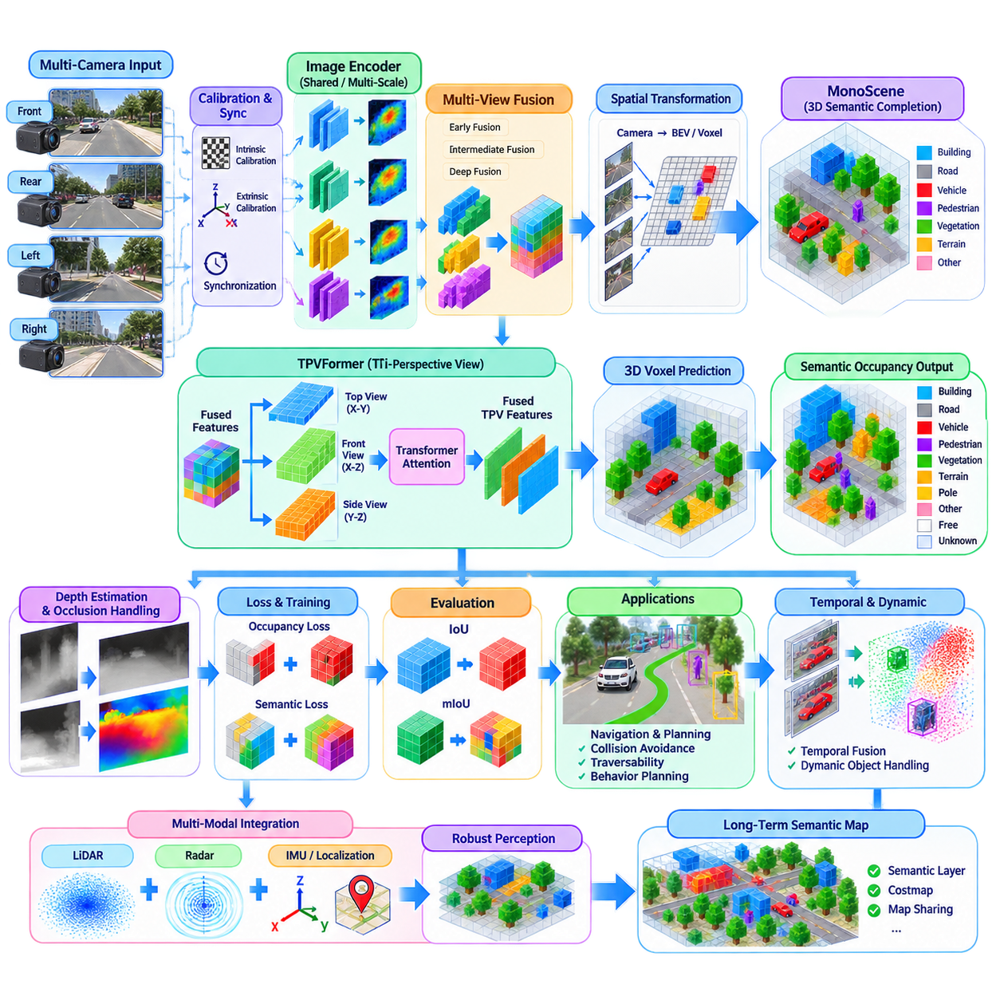{width="7.268055555555556in" height="7.268055555555556in"}

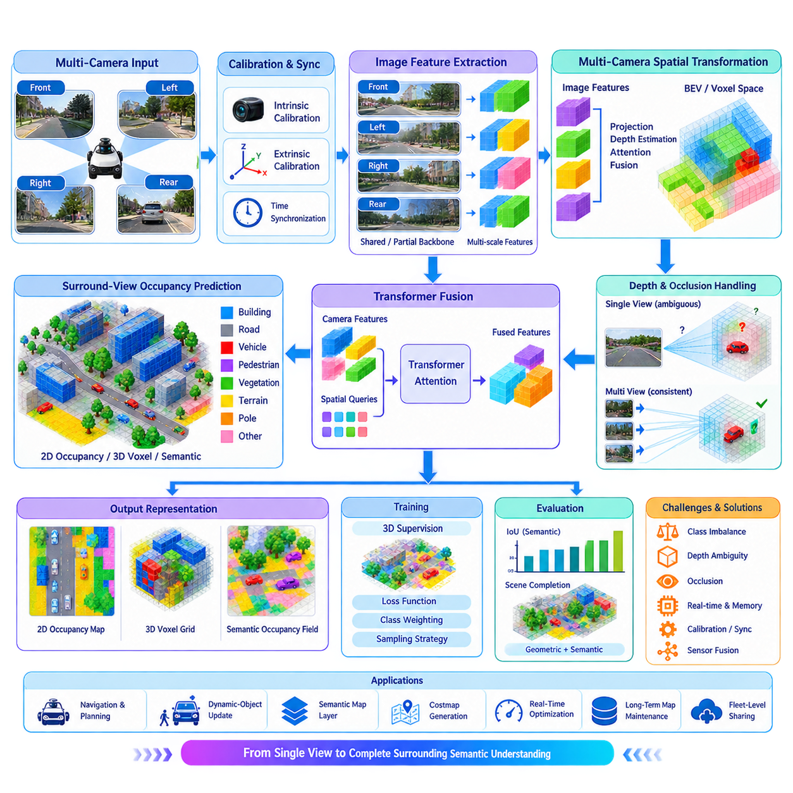{width="7.268055555555556in" height="7.268055555555556in"}

Surround-view occupancy prediction extends semantic occupancy mapping from a single camera to multiple cameras positioned around the robot. Front, rear, left, and right cameras provide overlapping observations that collectively cover a much larger portion of the surrounding environment. The objective is to transform these perspective images into a consistent spatial representation in which free space, occupied regions, and semantic categories can be estimated around the complete robot body rather than only within one camera\'s field of view.

A multi-camera system begins by synchronizing images from all cameras and applying accurate intrinsic and extrinsic calibration. Intrinsic parameters describe each camera\'s projection characteristics, while extrinsic parameters define its position and orientation relative to the robot coordinate frame. These parameters are essential because images captured from different viewpoints must ultimately contribute to a common spatial representation. Calibration errors can otherwise produce duplicated surfaces, discontinuities, or incorrectly positioned occupancy predictions.

Each camera provides a perspective observation with different visibility, scale, and occlusion characteristics. The front camera may observe distant road structure while side cameras provide stronger evidence about nearby obstacles, and the rear camera covers regions that would otherwise remain invisible. Because the cameras have overlapping fields of view, the same physical object can appear in several images. The perception system must therefore associate these observations with consistent spatial locations instead of treating each image as an independent scene.

The first processing stage commonly uses a shared or partially shared image backbone to extract visual features from each camera image. Convolutional neural networks or transformer-based vision encoders can generate multi-scale representations containing texture, appearance, boundary, and semantic information. Multi-scale features are particularly useful because nearby small obstacles and distant large structures require different spatial resolutions. The resulting features form the visual input to subsequent multi-camera spatial transformation and occupancy prediction stages.

A central challenge is converting perspective image features into a common spatial coordinate system. Each camera observes the environment through a different projection, so simple image concatenation does not produce a geometrically consistent representation. The system instead establishes relationships between image features and locations in a shared bird\'s-eye-view, voxel, or other spatial representation. Camera calibration, estimated depth, learned projection, and attention mechanisms can all contribute to this transformation.

Bird\'s-eye-view representation is particularly useful for mobile robots because it provides a common horizontal reference around the robot. Features from front, rear, and side cameras can be projected or lifted into the same BEV coordinate system and then fused. The resulting representation allows the perception system to reason about obstacles and free space relative to the robot rather than relative to individual camera images. This is especially important for navigation, where spatial relationships between the robot footprint and surrounding objects directly affect motion decisions.

Depth estimation remains a fundamental difficulty in camera-only occupancy prediction. A pixel corresponds to a viewing ray rather than a unique three-dimensional location, so the system must infer where along that ray the relevant surface exists. Multi-camera overlap provides additional geometric constraints because the same object may be observed from different viewpoints. Learned depth distributions, stereo relationships, temporal information, or transformer attention can therefore reduce depth ambiguity and improve the spatial consistency of the predicted occupancy.

Feature fusion can be performed at several stages. Early fusion combines relatively low-level information before extensive spatial reasoning, while late fusion combines predictions or high-level features after each camera has been processed independently. Intermediate or deep fusion allows camera features to interact after they have acquired meaningful spatial and semantic representations. The appropriate strategy depends on computational resources, camera configuration, synchronization quality, and the degree of cross-camera interaction required by the application.

Occlusion is another major reason for using multiple cameras. A single camera may be unable to observe the space behind a vehicle, beside a wall, or immediately adjacent to the robot body. Surround-view perception does not eliminate occlusion, but different viewpoints can expose regions hidden from one camera to another. The fusion model can therefore combine visible evidence from multiple viewpoints and estimate occupancy in areas where individual camera observations are incomplete.

The final output can be represented as a two-dimensional occupancy map, a three-dimensional voxel grid, or a semantic occupancy field. For each spatial element, the model can estimate occupancy probability and semantic class probabilities. Categories such as road, building, vehicle, pedestrian, vegetation, wall, or other objects can then be associated with occupied regions. This provides richer information than a conventional binary obstacle map and allows downstream navigation systems to distinguish different environmental structures.

Temporal fusion can further improve surround-view occupancy. Consecutive synchronized camera observations provide repeated measurements while the robot moves through the environment. Ego-motion estimation allows historical features or occupancy predictions to be transformed into a common coordinate frame before fusion. Temporal aggregation can stabilize predictions, recover information temporarily hidden by occlusion, and reduce frame-to-frame fluctuations. Moving objects must nevertheless be handled separately because their motion can invalidate simple static-scene accumulation.

Real-time operation requires careful management of computational cost. A robot with six or more cameras can generate a large volume of image data, and processing every image at high resolution through independent deep networks may exceed available edge-computing resources. Practical systems can therefore use shared backbones, reduced image resolution, feature compression, sparse spatial processing, mixed precision, quantization, and selective update rates. The architecture must balance spatial coverage, prediction quality, latency, and power consumption.

Camera synchronization and calibration should be treated as operational requirements rather than merely offline preparation steps. Small timing differences become significant when the robot or surrounding objects are moving quickly. Similarly, vibration, mechanical impacts, temperature changes, or camera mounting tolerances can gradually modify extrinsic alignment. A production system should therefore include calibration validation, synchronization monitoring, confidence checks, and mechanisms for detecting degraded camera inputs.

Surround-view occupancy becomes especially valuable when integrated with other perception modalities. LiDAR can provide accurate geometric range information, while cameras contribute dense semantic appearance. Radar can provide complementary observations under poor visibility, and inertial or localization systems provide motion information required for temporal alignment. The resulting multi-modal representation can combine measured geometry with learned semantic occupancy, reducing dependence on any single sensor and providing a stronger basis for navigation and safety decisions.

Within the occupancy and semantic mapping architecture, surround-view occupancy represents the transition from single-view perception toward complete spatial coverage around the robot. The preceding semantic occupancy concepts establish how camera observations can be converted into 3D semantic space, while surround-view processing extends this capability across multiple viewpoints. This foundation supports subsequent dynamic-object-aware occupancy updates, semantic map layers, navigation costmap generation, real-time occupancy optimization, long-term semantic-map maintenance, and fleet-level semantic map sharing.

서라운드 뷰 점유 예측(Surround-View Occupancy Prediction)은 단일 카메라에서 다중 카메라로 의미론적 점유 지도화(Semantic Occupancy Mapping)를 확장한다. 로봇 주변에 배치된 전방, 후방, 좌측, 우측 카메라는 서로 중첩되는 관측을 제공하며, 이를 통해 로봇 주변 환경의 훨씬 넓은 영역을 함께 관측할 수 있다. 목표는 이러한 원근 영상(Perspective Image)을 일관된 공간 표현으로 변환하여 로봇의 한쪽 시야뿐만 아니라 로봇 전체 주변에서 자유 공간(Free Space), 점유 영역(Occupied Region), 의미 범주(Semantic Category)를 추정하는 것이다.

다중 카메라 시스템은 일반적으로 모든 카메라의 영상을 동기화(Synchronization)하고 정확한 내부 파라미터 보정(Intrinsic Calibration)과 외부 파라미터 보정(Extrinsic Calibration)을 적용하는 것에서 시작한다. 내부 파라미터는 각 카메라의 투영 특성을 설명하고, 외부 파라미터는 로봇 좌표계(Robot Coordinate Frame)에 대한 카메라의 위치와 방향을 정의한다. 이러한 파라미터는 서로 다른 시점에서 촬영된 영상이 궁극적으로 하나의 공통 공간 표현에 기여해야 하기 때문에 필수적이다. 보정 오차가 발생하면 중복된 표면, 불연속적인 구조, 잘못 배치된 점유 예측이 발생할 수 있다.

각 카메라는 서로 다른 가시성(Visibility), 스케일(Scale), 가림 특성(Occlusion Characteristics)을 가진 원근 관측을 제공한다. 전방 카메라는 먼 거리의 도로 구조를 관측할 수 있고, 측면 카메라는 가까운 장애물에 대해 더 강한 증거를 제공하며, 후방 카메라는 그렇지 않으면 관측할 수 없는 영역을 담당한다. 여러 카메라의 시야가 서로 중첩되기 때문에 동일한 물리적 객체가 여러 영상에 나타날 수 있다. 따라서 인지 시스템은 각 영상을 독립적인 장면으로 처리하지 않고 이러한 관측을 일관된 공간 위치와 연결해야 한다.

첫 번째 처리 단계에서는 일반적으로 공유되거나 부분적으로 공유되는 영상 백본(Image Backbone)을 사용하여 각 카메라 영상에서 시각적 특징(Visual Feature)을 추출한다. 합성곱 신경망(Convolutional Neural Network) 또는 트랜스포머 기반 비전 인코더(Transformer-Based Vision Encoder)는 질감(Texture), 외관(Appearance), 경계(Boundary), 의미 정보(Semantic Information)를 포함하는 다중 스케일 표현(Multi-Scale Representation)을 생성할 수 있다. 다중 스케일 특징은 가까운 곳의 작은 장애물과 먼 곳의 큰 구조물이 서로 다른 공간 해상도를 요구하기 때문에 특히 유용하다. 이렇게 생성된 특징은 이후의 다중 카메라 공간 변환 및 점유 예측 단계의 시각적 입력이 된다.

핵심적인 문제는 원근 영상 특징(Perspective Image Feature)을 공통 공간 좌표계(Common Spatial Coordinate System)로 변환하는 것이다. 각 카메라는 서로 다른 투영을 통해 환경을 관측하므로 단순히 영상을 연결하는 것만으로는 기하학적으로 일관된 표현을 만들 수 없다. 대신 시스템은 영상 특징과 공유된 BEV(Bird\'s-Eye View), 복셀(Voxel), 또는 기타 공간 표현의 위치 사이에 관계를 설정한다. 카메라 보정 정보, 추정된 깊이(Estimated Depth), 학습된 투영(Learned Projection), 어텐션 메커니즘(Attention Mechanism) 등이 이러한 변환에 활용될 수 있다.

버드아이뷰(BEV) 표현은 로봇 주변에서 이동하는 로봇에 특히 유용하다. 이는 로봇 주변 전체에 대한 공통 수평 기준(Common Horizontal Reference)을 제공한다. 전방, 후방, 측면 카메라의 특징을 동일한 BEV 좌표계로 투영하거나 들어 올린 후 융합할 수 있다. 이렇게 생성된 표현을 통해 인지 시스템은 개별 카메라 영상이 아닌 로봇을 기준으로 장애물과 자유 공간을 추론할 수 있다. 이는 로봇 형상(Robot Footprint)과 주변 객체 사이의 공간적 관계가 이동 결정에 직접적인 영향을 미치는 내비게이션(Navigation)에서 특히 중요하다.

깊이 추정(Depth Estimation)은 카메라 기반 점유 예측에서 여전히 핵심적인 어려움이다. 하나의 픽셀은 고유한 3차원 위치가 아니라 하나의 관측 광선(Viewing Ray)에 대응하므로 시스템은 해당 광선을 따라 관련 표면이 어느 위치에 존재하는지를 추론해야 한다. 다중 카메라의 중첩 관측은 동일한 객체가 서로 다른 시점에서 관측될 수 있기 때문에 추가적인 기하학적 제약을 제공한다. 따라서 학습된 깊이 분포(Learned Depth Distribution), 스테레오 관계(Stereo Relationship), 시간 정보(Temporal Information), 트랜스포머 어텐션(Transformer Attention)은 깊이 모호성을 줄이고 예측된 점유 정보의 공간적 일관성을 향상시킬 수 있다.

특징 융합(Feature Fusion)은 여러 단계에서 수행할 수 있다. 초기 융합(Early Fusion)은 광범위한 공간 추론이 수행되기 전에 상대적으로 낮은 수준의 정보를 결합하고, 후기 융합(Late Fusion)은 각 카메라가 독립적으로 처리된 이후 예측 결과 또는 고수준 특징을 결합한다. 중간 또는 심층 융합(Intermediate or Deep Fusion)은 카메라 특징이 의미 있고 공간적인 표현을 획득한 이후 서로 상호작용하도록 한다. 적절한 전략은 계산 자원, 카메라 구성, 동기화 품질, 그리고 필요한 카메라 간 상호작용의 정도에 따라 결정된다.

가림(Occlusion)은 다중 카메라를 사용하는 또 다른 중요한 이유이다. 하나의 카메라는 차량 뒤쪽, 벽 옆, 또는 로봇 본체 바로 주변의 공간을 관측하지 못할 수 있다. 서라운드 뷰 인지(Surround-View Perception)는 가림 자체를 제거하지는 않지만, 서로 다른 시점을 통해 한 카메라에서 가려진 영역을 다른 카메라가 관측할 수 있도록 한다. 따라서 융합 모델은 여러 시점에서 얻은 가시적 증거를 결합하여 개별 카메라의 관측이 불완전한 영역에서도 점유 상태를 추정할 수 있다.

최종 출력은 2차원 점유 지도(2D Occupancy Map), 3차원 복셀 격자(3D Voxel Grid), 또는 의미론적 점유 필드(Semantic Occupancy Field)로 표현할 수 있다. 각 공간 요소에 대해 점유 확률(Occupancy Probability)과 의미 클래스 확률(Semantic Class Probability)을 추정할 수 있다. 이후 도로, 건물, 차량, 보행자, 식생, 벽 또는 기타 객체와 같은 범주를 점유 영역에 연결할 수 있다. 이는 기존의 이진 장애물 지도(Binary Obstacle Map)보다 풍부한 정보를 제공하며, 후단 내비게이션 시스템이 서로 다른 환경 구조를 구분할 수 있도록 한다.

시간적 융합(Temporal Fusion)은 서라운드 뷰 점유 예측을 더욱 향상시킬 수 있다. 연속적으로 동기화된 카메라 관측은 로봇이 환경을 이동하는 동안 반복적인 측정값을 제공한다. 자아 움직임 추정(Ego-Motion Estimation)을 이용하면 과거의 특징이나 점유 예측을 융합하기 전에 공통 좌표계로 변환할 수 있다. 시간적 집계(Temporal Aggregation)는 예측을 안정화하고, 일시적으로 가려진 정보를 복원하며, 프레임 간 변동을 줄일 수 있다. 그러나 움직이는 객체의 경우 정적인 환경을 가정한 단순한 누적이 잘못된 결과를 만들 수 있으므로 별도로 처리해야 한다.

실시간 운용(Real-Time Operation)을 위해서는 계산 비용을 신중하게 관리해야 한다. 6개 이상의 카메라를 사용하는 로봇은 대량의 영상 데이터를 생성하며, 모든 영상을 독립적인 심층 네트워크를 통해 높은 해상도로 처리하면 가용한 엣지 컴퓨팅(Edge Computing) 자원을 초과할 수 있다. 따라서 실제 시스템에서는 공유 백본(Shared Backbone), 감소된 영상 해상도, 특징 압축(Feature Compression), 희소 공간 처리(Sparse Spatial Processing), 혼합 정밀도(Mixed Precision), 양자화(Quantization), 선택적 갱신 주기(Selective Update Rate)를 활용할 수 있다. 아키텍처는 공간적 커버리지, 예측 품질, 지연 시간(Latency), 전력 소비(Power Consumption) 사이의 균형을 유지해야 한다.

카메라 동기화와 보정은 단순한 오프라인 준비 과정이 아니라 실제 운용을 위한 요구사항으로 취급해야 한다. 로봇이나 주변 객체가 빠르게 움직이는 경우 작은 시간 차이도 중요한 문제가 될 수 있다. 마찬가지로 진동, 기계적 충격, 온도 변화, 카메라 장착 공차 등은 외부 정렬 상태를 점진적으로 변화시킬 수 있다. 따라서 양산 시스템(Production System)은 보정 검증(Calibration Validation), 동기화 모니터링(Synchronization Monitoring), 신뢰도 검사(Confidence Check), 카메라 입력 성능 저하를 탐지하는 메커니즘을 포함해야 한다.

서라운드 뷰 점유는 다른 인지 센서와 통합될 때 특히 높은 가치를 가진다. 라이다(LiDAR)는 정확한 기하학적 거리 정보를 제공하고, 카메라는 조밀한 의미적 외관 정보를 제공한다. 레이더(Radar)는 가시성이 좋지 않은 환경에서 상호 보완적인 관측을 제공할 수 있으며, 관성 또는 위치 추정 시스템은 시간적 정렬에 필요한 움직임 정보를 제공한다. 이렇게 구성된 다중 모달 표현(Multi-Modal Representation)은 측정된 기하 정보와 학습된 의미론적 점유를 결합하여 단일 센서에 대한 의존성을 줄이고 내비게이션과 안전 의사결정을 위한 더욱 강건한 기반을 제공할 수 있다.

점유 및 의미 지도 아키텍처(Occupancy and Semantic Mapping Architecture)에서 서라운드 뷰 점유는 단일 시점 인지(Single-View Perception)에서 로봇 주변의 완전한 공간 커버리지(Complete Spatial Coverage)로 전환되는 단계에 해당한다. 앞선 의미론적 점유 개념은 카메라 관측을 3차원 의미 공간(3D Semantic Space)으로 변환하는 방법을 제시하며, 서라운드 뷰 처리는 이러한 능력을 여러 시점으로 확장한다. 이 기반은 이후 동적 객체 인식 기반 점유 갱신(Dynamic-Object-Aware Occupancy Update), 의미 지도 계층(Semantic Map Layer), 내비게이션 비용 지도 생성(Navigation Costmap Generation), 실시간 점유 최적화(Real-Time Occupancy Optimization), 장기 의미 지도 유지관리(Long-Term Semantic-Map Maintenance), 그리고 플릿 수준 의미 지도 공유(Fleet-Level Semantic Map Sharing)를 지원한다.

##  

## 08.05. Dynamic Object Aware Occupancy Map Update [w/Code]

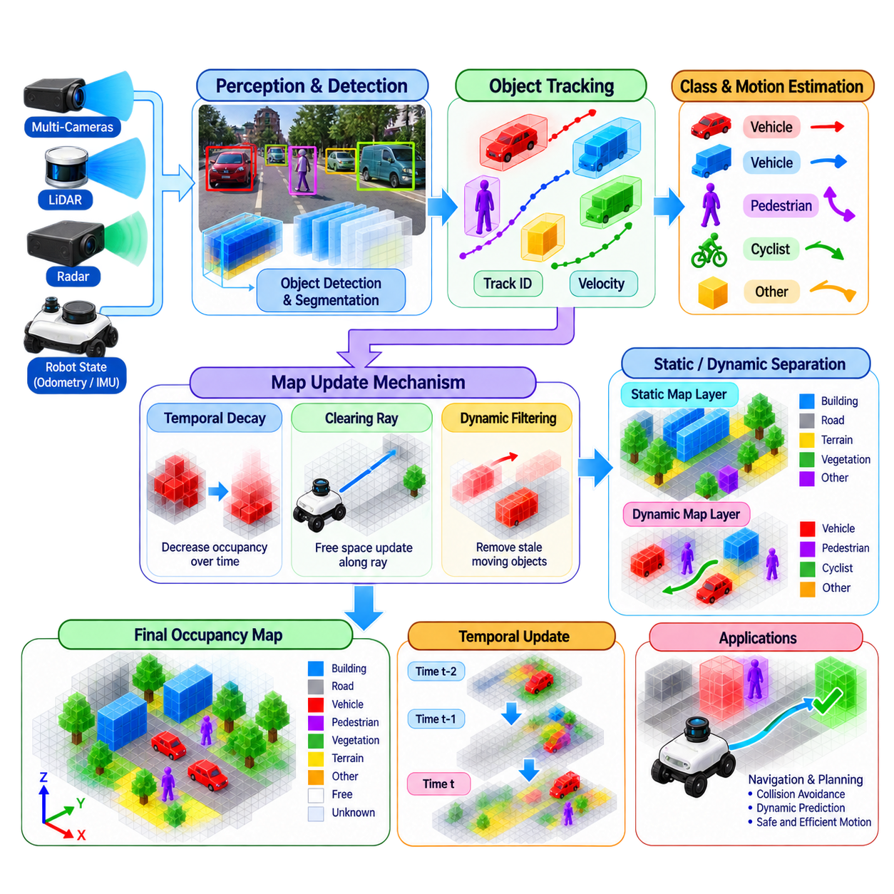{width="7.268055555555556in" height="7.268055555555556in"}

Dynamic-object-aware occupancy mapping extends conventional occupancy mapping by explicitly considering the fact that parts of the environment can move. A static occupancy model may interpret a pedestrian, vehicle, or another robot as a permanent obstacle after observing it for several frames. The purpose of dynamic-aware updating is therefore to distinguish persistent environmental structure from temporary occupancy and continuously revise the map as objects appear, move, and disappear.

A conventional occupancy grid accumulates sensor evidence over time under an implicit assumption that the observed environment is approximately static. This assumption is effective for walls, floors, buildings, shelves, and other fixed structures, but it becomes problematic when applied to moving objects. Once an object has occupied a cell, repeated historical evidence can maintain a high occupancy probability even after the object has moved away. Without an appropriate clearing or decay mechanism, the resulting map gradually contains stale obstacles.

Dynamic-object-aware mapping begins by identifying observations that are likely to originate from moving objects. Object detection, semantic segmentation, point-cloud clustering, object tracking, optical flow, radar velocity, or temporal consistency analysis can provide this information. The perception system does not necessarily need perfect object classification; even an estimate that a region is temporally unstable can be sufficient to prevent that region from being treated as permanent static geometry.

Temporal information provides an important signal for determining whether occupancy is persistent. A surface that remains at approximately the same spatial position across many observations is more likely to represent static structure, while an occupied region that changes position over time may correspond to a dynamic object. Comparing current observations with historical occupancy, object tracks, or previous sensor frames allows the system to estimate the persistence of individual occupied regions.

Temporal decay is one practical mechanism for removing stale occupancy evidence. Instead of allowing an occupied voxel or grid cell to retain its probability indefinitely, its confidence can gradually decrease when supporting observations are no longer received. The decay rate should reflect the operational environment and sensor update frequency. A rapidly changing map may require relatively aggressive decay, whereas a stable industrial environment can retain static evidence for much longer periods.

Clearing rays provide another important mechanism. When a range sensor observes a surface at a new location, the ray from the sensor to that surface provides evidence that the intervening space is free. If a vehicle previously occupied that region but has moved away, subsequent measurements can therefore remove the old occupancy through free-space evidence. This approach is particularly effective with LiDAR because each new range measurement naturally provides both occupied-endpoint and free-space information.

Object tracking can further improve dynamic occupancy updates by maintaining the identity and estimated motion of moving objects across frames. A tracked vehicle or pedestrian can be represented separately from the static occupancy layer, allowing its predicted position to be updated without permanently modifying the underlying map. Tracking also provides velocity and trajectory information that can be used by downstream planning systems for collision avoidance and motion prediction.

A useful architecture therefore separates static and dynamic map layers. The static layer preserves relatively persistent structures such as walls, buildings, road boundaries, and fixed equipment. The dynamic layer represents temporary objects whose positions can change over time. This separation prevents moving objects from contaminating the long-term environmental model while allowing navigation and safety modules to react immediately to their current locations.

Semantic information can make this separation more reliable. A perception model may classify an occupied region as a vehicle, pedestrian, bicycle, vegetation, wall, or building. Different semantic classes can then receive different temporal behaviors. A building should normally remain stable unless strong contradictory evidence appears, while a pedestrian should be expected to move. Semantic classification therefore provides useful prior information for deciding how quickly occupancy evidence should be retained, decayed, or removed.

Dynamic occupancy also requires careful treatment of partially observed objects. A moving vehicle may be visible from only one side, while another portion is hidden by another object or outside the camera field of view. If the system immediately clears every region that is not currently observed, it may incorrectly erase valid occupancy. Dynamic-aware mapping must therefore distinguish between confirmed free space, temporarily unobserved space, and occupancy that has become inconsistent with recent observations.

Localization and coordinate transformation remain critical because temporal comparison assumes that observations from different moments are correctly aligned. Ego-motion compensation transforms historical sensor measurements into a common reference frame. If localization errors are significant, a static wall may appear to move and could incorrectly be classified as dynamic. Dynamic-object detection and map updating should therefore operate together with reliable odometry, localization, SLAM, and calibrated sensor extrinsics.

Multi-sensor fusion can strengthen dynamic-object detection and map updating. Cameras provide semantic appearance and object classification, LiDAR provides accurate spatial geometry, and radar can provide direct velocity-related information for moving targets. Combining these sources allows the system to distinguish a physically moving object from apparent motion caused by sensor noise, occlusion, or robot movement. The resulting occupancy update can be more robust than relying on any single sensor modality.

The update policy should also consider the difference between immediate navigation and long-term mapping. A local navigation map should respond quickly to pedestrians, vehicles, and other temporary obstacles because collision avoidance depends on their current positions. A global semantic map should generally preserve stable environmental structure and avoid storing transient objects as permanent landmarks. Maintaining separate temporal horizons for local and persistent representations is therefore useful for autonomous robots operating continuously in changing environments.

Dynamic-aware occupancy is particularly important for AMRs, outdoor autonomous robots, quadrupeds, and other systems operating in environments shared with people and vehicles. In an indoor warehouse, forklifts and workers may move through otherwise stable aisles. In outdoor environments, vehicles, pedestrians, vegetation, and temporary obstacles can change the traversable space continuously. A dynamic occupancy layer allows the navigation system to react to these changes without repeatedly rebuilding the entire static map.

Real-time implementation requires balancing update accuracy with computational cost. High-resolution LiDAR and multi-camera systems can generate large amounts of temporal data, while object detection, tracking, ray casting, occupancy updates, and map maintenance all compete for computing resources. Efficient spatial indexing, local update regions, selective processing, GPU acceleration, and appropriate map-update frequencies can help maintain predictable latency while preserving sufficient temporal responsiveness.

Dynamic-object-aware occupancy mapping ultimately transforms the occupancy map from a static geometric record into a continuously updated spatial memory. The map must preserve reliable environmental structure while allowing temporary occupancy to appear, move, decay, and disappear. Within the chapter structure, this capability follows geometric and semantic occupancy representation and precedes semantic map-layer design, navigation costmap generation, real-time occupancy optimization, long-term semantic-map maintenance, and AMR semantic-map sharing. :chatgpt-content-reference{index="0"}

동적 객체 인식 기반 점유 지도화(Dynamic-Object-Aware Occupancy Mapping)는 환경의 일부 영역이 이동할 수 있다는 사실을 명시적으로 고려하여 기존 점유 지도화(Occupancy Mapping)를 확장한다. 정적 점유 모델(Static Occupancy Model)은 보행자, 차량 또는 다른 로봇을 여러 프레임에서 관측한 후 영구적인 장애물로 해석할 수 있다. 따라서 동적 객체 인식 기반 갱신의 목적은 지속적으로 존재하는 환경 구조와 일시적인 점유를 구분하고, 객체가 나타나고 이동하고 사라지는 과정에 따라 지도를 지속적으로 수정하는 것이다.

기존 점유 격자(Occupancy Grid)는 관측된 환경이 대체로 정적이라는 암묵적인 가정하에 시간에 따라 센서 증거를 누적한다. 이러한 가정은 벽, 바닥, 건물, 선반 및 기타 고정 구조물에는 효과적이지만 이동 객체에 적용하면 문제가 발생한다. 객체가 특정 셀을 점유한 후 이동하더라도 과거의 반복적인 증거가 높은 점유 확률을 계속 유지할 수 있기 때문이다. 적절한 제거 또는 감쇠 메커니즘이 없다면 결과 지도에는 오래된 장애물(Stale Obstacle)이 점차 축적된다.

동적 객체 인식 기반 지도화는 이동 객체에서 발생했을 가능성이 높은 관측값을 식별하는 것에서 시작한다. 객체 검출(Object Detection), 의미론적 분할(Semantic Segmentation), 포인트 클라우드 클러스터링(Point Cloud Clustering), 객체 추적(Object Tracking), 광학 흐름(Optical Flow), 레이더 속도(Radar Velocity), 시간적 일관성 분석(Temporal Consistency Analysis) 등을 활용할 수 있다. 시스템이 객체의 종류를 완벽하게 분류할 필요는 없다. 특정 영역이 시간에 따라 불안정하다는 추정만으로도 해당 영역을 영구적인 정적 기하 구조로 처리하는 것을 방지할 수 있다.

시간 정보(Temporal Information)는 점유가 지속적인지 판단하기 위한 중요한 신호를 제공한다. 여러 관측에서 거의 동일한 공간 위치에 계속 존재하는 표면은 정적 구조를 나타낼 가능성이 높은 반면, 시간에 따라 위치가 변화하는 점유 영역은 동적 객체일 가능성이 높다. 현재 관측값을 과거의 점유 지도, 객체 추적 정보 또는 이전 센서 프레임과 비교하면 개별 점유 영역의 지속성을 추정할 수 있다.

시간 감쇠(Temporal Decay)는 오래된 점유 증거를 제거하기 위한 실용적인 방법 중 하나이다. 점유 복셀(Voxel)이나 격자 셀(Grid Cell)이 무한히 높은 확률을 유지하도록 하는 대신, 이를 뒷받침하는 새로운 관측이 더 이상 들어오지 않으면 신뢰도를 점진적으로 감소시킬 수 있다. 감쇠 속도는 운용 환경과 센서 갱신 주기를 반영해야 한다. 빠르게 변화하는 지도에서는 상대적으로 강한 감쇠가 필요할 수 있지만, 안정적인 산업 환경에서는 정적 증거를 훨씬 오래 유지할 수 있다.

클리어링 광선(Clearing Ray)은 또 다른 중요한 메커니즘이다. 거리 센서(Range Sensor)가 새로운 위치에 있는 표면을 관측하면 센서에서 해당 표면까지 이어지는 광선은 그 사이 공간이 자유 공간이라는 증거를 제공한다. 차량이 이전에 해당 영역을 점유하고 있었지만 이동한 경우, 이후의 측정값은 자유 공간 증거를 통해 기존 점유 상태를 제거할 수 있다. 이러한 방식은 각각의 새로운 거리 측정이 점유된 종점과 자유 공간에 대한 정보를 자연스럽게 제공하는 라이다(LiDAR)에서 특히 효과적이다.

객체 추적(Object Tracking)은 프레임 간 이동 객체의 식별 정보와 추정된 움직임을 유지함으로써 동적 점유 갱신을 더욱 향상시킬 수 있다. 추적된 차량이나 보행자는 정적 점유 계층(Static Occupancy Layer)과 분리하여 표현할 수 있으므로, 기본 지도(Underlying Map)를 영구적으로 변경하지 않고도 해당 객체의 예측 위치를 갱신할 수 있다. 또한 추적은 속도와 궤적 정보를 제공하므로 후단 계획 시스템(Downstream Planning System)에서 충돌 회피(Collision Avoidance)와 움직임 예측(Motion Prediction)에 활용할 수 있다.

따라서 유용한 아키텍처는 정적 지도 계층(Static Map Layer)과 동적 지도 계층(Dynamic Map Layer)을 분리한다. 정적 계층은 벽, 건물, 도로 경계, 고정 설비와 같이 비교적 지속적으로 존재하는 구조물을 유지한다. 동적 계층은 시간이 지나면서 위치가 변할 수 있는 일시적인 객체를 표현한다. 이러한 분리는 이동 객체가 장기 환경 모델(Long-Term Environmental Model)을 오염시키는 것을 방지하면서도 내비게이션 및 안전 모듈이 현재 위치에 즉각적으로 대응할 수 있도록 한다.

의미 정보(Semantic Information)는 이러한 분리를 더욱 안정적으로 만들 수 있다. 인지 모델은 점유 영역을 차량, 보행자, 자전거, 식생, 벽, 건물 등의 클래스로 분류할 수 있다. 이후 각 의미 클래스에 서로 다른 시간적 동작(Temporal Behavior)을 적용할 수 있다. 건물은 강한 반대 증거가 나타나지 않는 한 일반적으로 안정적으로 유지되어야 하지만, 보행자는 이동할 것으로 예상된다. 따라서 의미 분류는 점유 증거를 얼마나 빠르게 유지하거나 감쇠하거나 제거할지를 결정하는 데 유용한 사전 정보(Prior Information)를 제공한다.

동적 점유는 부분적으로 관측된 객체(Partially Observed Object)에 대해서도 신중하게 처리해야 한다. 이동하는 차량은 한쪽 면만 보일 수 있고 다른 부분은 다른 객체에 의해 가려지거나 카메라의 시야 밖에 있을 수 있다. 현재 관측되지 않는 모든 영역을 즉시 제거하면 유효한 점유 정보를 잘못 삭제할 수 있다. 따라서 동적 인식 기반 지도화는 확실하게 확인된 자유 공간(Confirmed Free Space), 일시적으로 관측되지 않은 공간(Temporarily Unobserved Space), 최근 관측과 일치하지 않게 된 점유 영역을 구분해야 한다.

위치 추정(Localization)과 좌표 변환(Coordinate Transformation)은 시간에 따른 비교가 서로 다른 시점의 관측값을 정확하게 정렬한다는 가정에 기반하기 때문에 여전히 중요하다. 자아 움직임 보정(Ego-Motion Compensation)을 통해 과거 센서 측정값을 공통 기준 좌표계(Common Reference Frame)로 변환할 수 있다. 위치 추정 오차가 크면 정적인 벽도 움직이는 것처럼 나타날 수 있으며, 이로 인해 정적 구조물이 동적 객체로 잘못 분류될 수 있다. 따라서 동적 객체 검출과 지도 갱신은 신뢰할 수 있는 주행 거리 추정(Odometry), 위치 추정, SLAM, 그리고 보정된 센서 외부 파라미터(Sensor Extrinsics)와 함께 동작해야 한다.

다중 센서 융합(Multi-Sensor Fusion)은 동적 객체 검출과 지도 갱신을 더욱 강화할 수 있다. 카메라는 의미적 외관(Semantic Appearance)과 객체 분류 정보를 제공하고, 라이다는 정확한 공간 기하 정보를 제공하며, 레이더는 이동 대상에 대한 직접적인 속도 관련 정보를 제공할 수 있다. 이러한 센서 정보를 결합하면 물리적으로 실제 이동하는 객체와 센서 잡음, 가림, 로봇 자체의 움직임으로 인해 발생하는 겉보기 움직임을 구분할 수 있다. 결과적으로 생성되는 점유 갱신은 단일 센서 방식보다 더욱 강건해질 수 있다.

갱신 정책(Update Policy)은 즉각적인 내비게이션과 장기 지도화의 차이도 고려해야 한다. 로컬 내비게이션 지도(Local Navigation Map)는 보행자, 차량 및 기타 일시적인 장애물에 신속하게 반응해야 한다. 충돌 회피는 이들의 현재 위치에 의존하기 때문이다. 반면 전역 의미 지도(Global Semantic Map)는 일반적으로 안정적인 환경 구조를 유지하고 일시적인 객체를 영구적인 랜드마크로 저장하지 않아야 한다. 따라서 로봇이 변화하는 환경에서 지속적으로 운용되는 경우 로컬 표현과 지속적인 표현에 서로 다른 시간적 범위(Temporal Horizon)를 적용하는 것이 유용하다.

동적 객체 인식 기반 점유 지도화는 AMR, 야외 자율주행 로봇, 사족보행 로봇(Quadruped), 그리고 사람이나 차량과 동일한 공간에서 운용되는 기타 시스템에서 특히 중요하다. 실내 물류창고에서는 지게차와 작업자가 비교적 안정적인 통로를 이동할 수 있다. 야외 환경에서는 차량, 보행자, 식생, 임시 장애물 등이 주행 가능한 공간을 지속적으로 변화시킬 수 있다. 동적 점유 계층을 사용하면 전체 정적 지도를 반복적으로 다시 구축하지 않고도 내비게이션 시스템이 이러한 변화에 대응할 수 있다.

실시간 구현(Real-Time Implementation)에서는 갱신 정확도와 계산 비용 사이의 균형을 유지해야 한다. 고해상도 라이다와 다중 카메라 시스템은 많은 양의 시간적 데이터를 생성하며, 객체 검출, 추적, 광선 투사(Ray Casting), 점유 갱신, 지도 유지관리(Map Maintenance)가 모두 컴퓨팅 자원을 공유한다. 효율적인 공간 인덱싱(Spatial Indexing), 로컬 갱신 영역(Local Update Region), 선택적 처리(Selective Processing), GPU 가속(GPU Acceleration), 적절한 지도 갱신 주기를 활용하면 충분한 시간적 반응성을 유지하면서도 예측 가능한 지연 시간을 확보할 수 있다.

동적 객체 인식 기반 점유 지도화는 궁극적으로 점유 지도를 정적인 기하학적 기록(Static Geometric Record)에서 지속적으로 갱신되는 공간 기억(Continuously Updated Spatial Memory)으로 변화시킨다. 지도는 신뢰할 수 있는 환경 구조를 보존하는 동시에 일시적인 점유가 나타나고, 이동하고, 감쇠되고, 사라질 수 있도록 해야 한다. 본 장의 구조에서는 이러한 기능이 기하학적 및 의미론적 점유 표현(Geometric and Semantic Occupancy Representation) 다음에 위치하며, 의미 지도 계층 설계(Semantic Map-Layer Design), 내비게이션 비용 지도 생성(Navigation Costmap Generation), 실시간 점유 최적화(Real-Time Occupancy Optimization), 장기 의미 지도 유지관리(Long-Term Semantic-Map Maintenance), AMR 의미 지도 공유(AMR Semantic-Map Sharing)로 이어진다.

##  

## 08.06. Semantic Map Layer Design Zones Labels POIs [w/Code]

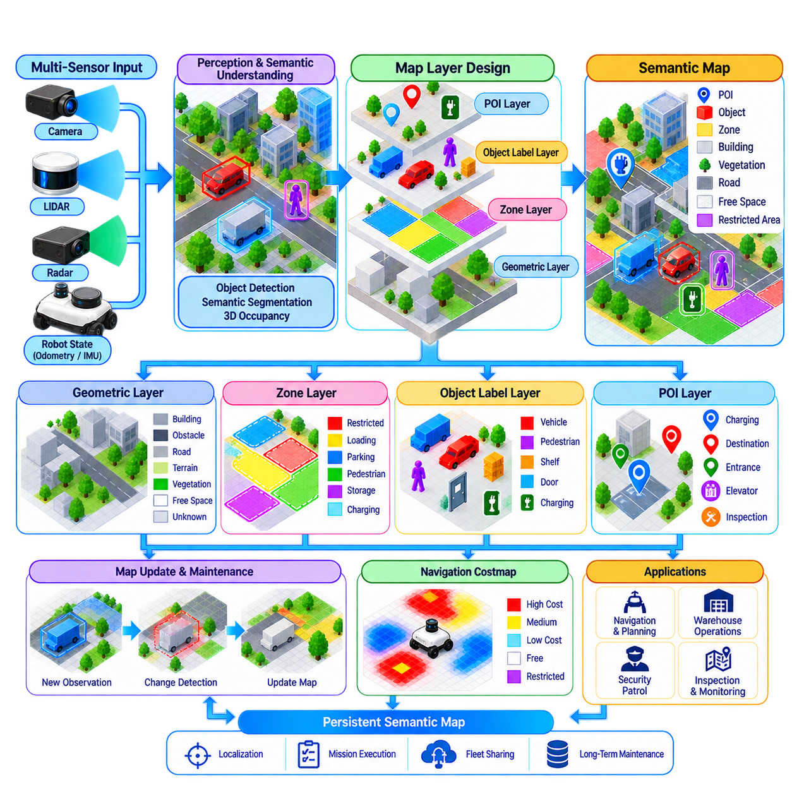{width="7.268055555555556in" height="7.268055555555556in"}

Semantic map layer design extends occupancy mapping by organizing spatial information into multiple interpretable layers that describe not only where physical structures exist, but also what those structures represent and how they should be treated by downstream robotic systems. A practical semantic map can combine geometric occupancy with zones, object labels, landmarks, and points of interest (POIs). This layered representation allows perception outputs to become persistent spatial knowledge that can be consumed by localization, navigation, planning, fleet management, and mission-level applications.

A semantic map normally separates information according to its meaning and temporal behavior rather than storing everything in a single undifferentiated grid. A geometric layer may contain walls, obstacles, free space, and terrain boundaries, while semantic layers describe roads, sidewalks, restricted areas, loading zones, pedestrian areas, parking regions, or operational facilities. Separating these representations allows each layer to have its own resolution, update policy, confidence model, and lifetime according to how the information is used.

Zones provide a particularly important abstraction because many robotic missions depend on spatial rules rather than individual objects. A warehouse can contain storage zones, aisles, loading areas, charging areas, and restricted regions. An outdoor security robot may distinguish public paths, buildings, gates, parking areas, and protected zones. Instead of requiring the planner to rediscover these meanings from raw perception every time, the semantic map stores them explicitly as persistent spatial regions associated with operational policies.

A zone can be represented using polygons, raster masks, occupancy regions, or three-dimensional boundaries depending on the application. Polygonal representations are efficient for large relatively stable areas, while grid-based representations integrate naturally with occupancy and costmap systems. A zone can also contain attributes such as allowed robot classes, speed limits, access permissions, preferred routes, operating schedules, or safety constraints. These attributes transform a geometric region into a machine-readable operational rule.

Semantic labels provide object-level or region-level meaning within the map. Objects such as doors, elevators, shelves, charging stations, fire extinguishers, traffic signs, vehicles, or machines can be represented with class labels and spatial poses. The label should ideally be associated with a confidence value and source information because semantic recognition is not always correct. Separating observed labels from persistent map labels also makes it possible to manage uncertainty and resolve conflicts between newly perceived information and previously stored knowledge.

Points of interest (POIs) provide another important layer for mission-oriented robotics. A POI can represent a charging station, inspection location, delivery destination, entrance, emergency equipment, docking position, elevator, or other meaningful location. Unlike generic map coordinates, a POI can contain semantic attributes and relationships that allow a robot to interpret a task such as "go to the loading area," "inspect the north gate," or "return to the charging station." This creates a direct connection between spatial representation and mission-level commands.

A semantic map can therefore be viewed as a collection of interconnected layers rather than a single map image. Geometry describes physical space, semantic regions describe environmental meaning, object layers describe identifiable entities, and POI layers describe operationally important locations. Navigation systems can selectively consume the layers relevant to a particular task. This modularity is valuable because a warehouse navigation task, outdoor patrol mission, and infrastructure inspection task may require different semantic information even when they share the same underlying geometric map.

Map coordinates and semantic entities must remain spatially consistent. Localization provides the robot pose used to associate new observations with existing map elements, while coordinate transformations ensure that sensor observations and semantic entities are expressed in the same reference frame. If localization drifts or coordinate frames are incorrectly aligned, semantic boundaries, object locations, and POIs can become displaced. Consequently, semantic map quality depends not only on semantic recognition but also on reliable localization and spatial registration.

Semantic map construction can combine information from multiple perception sources. Camera models can provide object classes and visual context, LiDAR can provide accurate geometric boundaries, radar can contribute information about moving objects, and occupancy mapping can provide free-space and obstacle structure. The semantic layer should preserve the relationship between these observations and the underlying geometry. This allows a system to distinguish between a visually recognized object and a geometrically verified structure rather than treating every semantic prediction as equally certain.

Map updates should also account for the different persistence characteristics of semantic information. A building wall or fixed machine can remain in the map for a long period, while a parked vehicle, temporary barrier, or pedestrian should normally be treated as transient information. The semantic map can therefore assign temporal policies to different classes and layers. Persistent layers can be updated cautiously, while dynamic layers can be refreshed frequently or connected to the dynamic-object-aware occupancy system described in the preceding section.

Semantic zones can also be connected directly to navigation costmaps. A restricted area can receive an effectively prohibitive traversal cost, while a preferred route can receive a lower cost. A pedestrian zone may require reduced robot speed, and a loading zone may permit temporary stopping or docking behavior. This separation allows the navigation planner to remain relatively generic while the semantic map provides environment-specific constraints and operational meaning.

For multi-robot systems, semantic maps become a shared source of spatial knowledge. Robots can exchange stable semantic information about zones, POIs, landmarks, and persistent structures rather than continuously sharing all raw sensor data. A fleet can therefore maintain a common representation of charging stations, restricted areas, inspection points, loading locations, and other operational entities. Map sharing requires consistent coordinate frames, version control, conflict resolution, confidence management, and mechanisms for identifying stale information.

Long-term semantic map maintenance requires explicit handling of change. Construction, furniture relocation, road modifications, new equipment, closed areas, and temporary installations can make previously valid semantic information obsolete. Change detection can compare new observations against stored geometry and semantic layers, while update policies determine whether a discrepancy should immediately modify the map or first require confirmation. Maintaining historical information can also be useful when environmental changes are gradual or when multiple robots provide conflicting observations.

A well-designed semantic map should therefore distinguish between perception, persistent knowledge, and operational policy. Perception provides observations and confidence estimates; the map stores spatially registered knowledge; and higher-level systems interpret that knowledge according to mission requirements. This separation prevents the semantic map from becoming an uncontrolled collection of raw predictions and makes its contents easier to validate, version, synchronize, and reuse across different robotic applications.

Within the occupancy and semantic mapping structure, semantic map layer design follows geometric and semantic occupancy representation and dynamic-object-aware occupancy updating. It provides the bridge from spatial perception to persistent environmental knowledge by organizing zones, labels, and POIs into reusable layers. The subsequent navigation costmap stage can consume these semantic layers to generate motion-related costs, while later long-term maintenance and AMR fleet-sharing stages extend the representation into continuously managed and distributed semantic knowledge. :chatgpt-content-reference{index="0"}

의미 지도 계층 설계(Semantic Map Layer Design)는 점유 지도화(Occupancy Mapping)를 확장하여 물리적 구조물이 어디에 존재하는지만 나타내는 것이 아니라, 그 구조물이 무엇을 의미하는지와 후단 로봇 시스템에서 어떻게 취급되어야 하는지를 설명하는 여러 계층으로 공간 정보를 구성한다. 실용적인 의미 지도(Semantic Map)는 기하학적 점유(Geometric Occupancy)에 Zone, 객체 Label, Landmark, 관심 지점(POI, Point of Interest) 등을 결합할 수 있다. 이러한 계층적 표현을 통해 인지 결과를 지속적인 공간 지식(Persistent Spatial Knowledge)으로 발전시키고, 위치 추정(Localization), 내비게이션(Navigation), 계획(Planning), 플릿 관리(Fleet Management), 임무 수준 응용(Mission-Level Application)에서 활용할 수 있다.

의미 지도는 일반적으로 모든 정보를 하나의 구분되지 않은 격자에 저장하기보다 그 의미와 시간적 특성(Temporal Behavior)에 따라 정보를 분리한다. 기하학적 계층(Geometric Layer)은 벽, 장애물, 자유 공간, 지형 경계 등을 포함할 수 있으며, 의미 계층(Semantic Layer)은 도로, 보도, 출입 제한 구역, 적재 구역, 보행자 영역, 주차 영역, 운영 시설 등을 표현한다. 이러한 표현을 분리하면 각 계층이 정보의 활용 방식에 따라 서로 다른 해상도, 갱신 정책(Update Policy), 신뢰도 모델(Confidence Model), 수명(Lifetime)을 가질 수 있다.

Zone은 많은 로봇 임무가 개별 객체보다는 공간적 규칙에 의존하기 때문에 특히 중요한 추상화(Abstraction)이다. 창고에는 보관 구역, 통로, 적재 구역, 충전 구역, 출입 제한 구역 등이 존재할 수 있다. 야외 보안 로봇은 공공 통로, 건물, 출입구, 주차 영역, 보호 구역 등을 구분할 수 있다. 플래너(Planner)가 매번 원시 인지 결과에서 이러한 의미를 다시 찾아내도록 하는 대신, 의미 지도는 이를 지속적인 공간 영역(Persistent Spatial Region)으로 명시적으로 저장하고 운용 정책(Operational Policy)과 연결할 수 있다.

Zone은 응용 분야에 따라 다각형(Polygon), 래스터 마스크(Raster Mask), 점유 영역(Occupancy Region), 또는 3차원 경계(3D Boundary)로 표현할 수 있다. 다각형 표현은 넓고 비교적 안정적인 영역에 효율적이며, 격자 기반 표현(Grid-Based Representation)은 점유 지도(Occupancy Map) 및 비용 지도(Costmap) 시스템과 자연스럽게 통합된다. Zone에는 허용 로봇 종류(Allowed Robot Class), 속도 제한(Speed Limit), 접근 권한(Access Permission), 운영 일정(Operating Schedule), 선호 경로(Preferred Route), 안전 제약(Safety Constraint) 등의 속성을 추가할 수도 있다. 이를 통해 단순한 기하학적 영역이 기계가 해석할 수 있는 운용 규칙(Machine-Readable Operational Rule)으로 발전한다.

의미 Label은 지도 내에서 객체 수준 또는 영역 수준의 의미를 제공한다. 문, 엘리베이터, 선반, 충전 스테이션, 소화기, 교통 표지판, 차량, 기계 등의 객체를 클래스 Label과 공간 자세(Spatial Pose)를 함께 표현할 수 있다. Label에는 의미 인식이 항상 정확하지 않기 때문에 신뢰도 값(Confidence Value)과 정보 출처(Source Information)를 함께 연결하는 것이 바람직하다. 또한 관측된 Label(Observed Label)과 지속적으로 유지되는 지도 Label(Persistent Map Label)을 분리하면 불확실성을 관리하고 새롭게 인식된 정보와 기존에 저장된 지식 사이의 충돌을 해결할 수 있다.

관심 지점(POI, Point of Interest)은 임무 중심 로봇(Mission-Oriented Robotics)을 위한 또 하나의 중요한 계층을 제공한다. POI는 충전 스테이션, 검사 위치, 배송 목적지, 출입구, 비상 장비, 도킹 위치, 엘리베이터 또는 기타 의미 있는 위치를 나타낼 수 있다. 일반적인 지도 좌표와 달리 POI에는 의미 속성(Semantic Attribute)과 관계(Relationship)를 포함할 수 있으므로 로봇은 "적재 구역으로 이동", "북쪽 출입구를 검사", "충전 스테이션으로 복귀"와 같은 임무를 해석할 수 있다. 이를 통해 공간 표현과 임무 수준 명령(Mission-Level Command)이 직접 연결된다.

따라서 의미 지도는 하나의 지도 이미지가 아니라 서로 연결된 여러 계층의 집합으로 볼 수 있다. 기하학(Geometry)은 물리적 공간을 설명하고, 의미 영역(Semantic Region)은 환경의 의미를 설명하며, 객체 계층(Object Layer)은 식별 가능한 개체를 설명하고, POI 계층은 운용상 중요한 위치를 설명한다. 내비게이션 시스템은 특정 임무에 필요한 계층만 선택적으로 사용할 수 있다. 이러한 모듈성(Modularity)은 동일한 기하학적 지도를 공유하더라도 창고 내비게이션, 야외 순찰, 인프라 검사와 같은 서로 다른 임무에는 서로 다른 의미 정보가 필요하기 때문에 중요하다.

지도 좌표와 의미 객체(Semantic Entity)는 공간적으로 일관된 상태를 유지해야 한다. 위치 추정(Localization)은 새로운 관측값을 기존 지도 요소와 연결하는 데 사용되는 로봇 자세(Robot Pose)를 제공하고, 좌표 변환(Coordinate Transformation)은 센서 관측값과 의미 객체가 동일한 기준 좌표계(Reference Frame)로 표현되도록 한다. 위치 추정이 드리프트(Drift)하거나 좌표계가 잘못 정렬되면 의미 경계, 객체 위치, POI가 실제 위치에서 벗어날 수 있다. 따라서 의미 지도 품질은 의미 인식뿐만 아니라 신뢰할 수 있는 위치 추정과 공간 정합(Spatial Registration)에 의해서도 결정된다.

의미 지도 구축(Semantic Map Construction)은 여러 인지 소스(Perception Source)의 정보를 결합할 수 있다. 카메라 모델은 객체 클래스와 시각적 맥락(Visual Context)을 제공하고, 라이다(LiDAR)는 정확한 기하학적 경계를 제공하며, 레이더(Radar)는 이동 객체에 대한 정보를 추가할 수 있고, 점유 지도화는 자유 공간과 장애물 구조를 제공할 수 있다. 의미 계층은 이러한 관측값과 기본 기하 구조 사이의 관계를 유지해야 한다. 이를 통해 시스템은 시각적으로 인식된 객체와 기하학적으로 검증된 구조를 구분할 수 있으며, 모든 의미 예측을 동일한 수준의 확실성으로 취급하지 않을 수 있다.

지도 갱신(Map Update)은 의미 정보마다 서로 다른 지속 특성(Persistence Characteristic)을 고려해야 한다. 건물 벽이나 고정 기계는 오랫동안 지도에 유지될 수 있지만, 주차된 차량, 임시 장벽, 보행자는 일반적으로 일시적인 정보로 취급해야 한다. 따라서 의미 지도는 서로 다른 클래스와 계층에 시간적 정책(Temporal Policy)을 할당할 수 있다. 지속 계층(Persistent Layer)은 신중하게 갱신하고, 동적 계층(Dynamic Layer)은 빈번하게 갱신하거나 앞 절에서 설명한 동적 객체 인식 기반 점유 시스템(Dynamic-Object-Aware Occupancy System)과 연결할 수 있다.

의미 Zone은 내비게이션 비용 지도(Navigation Costmap)와 직접 연결할 수도 있다. 출입 제한 구역(Restricted Area)에는 사실상 통과가 불가능한 수준의 높은 비용을 부여할 수 있고, 선호 경로(Preferred Route)에는 상대적으로 낮은 비용을 부여할 수 있다. 보행자 구역(Pedestrian Zone)은 로봇 속도를 낮추도록 할 수 있으며, 적재 구역(Loading Zone)은 일시적인 정지 또는 도킹 동작(Docking Behavior)을 허용할 수 있다. 이러한 분리를 통해 내비게이션 플래너는 상대적으로 범용적으로 유지하면서도 의미 지도는 환경별 제약과 운용상의 의미를 제공할 수 있다.

다중 로봇 시스템(Multi-Robot System)에서 의미 지도는 공유되는 공간 지식의 원천이 된다. 로봇은 모든 원시 센서 데이터를 지속적으로 공유하는 대신 Zone, POI, Landmark, 지속적인 구조물에 대한 안정적인 의미 정보를 교환할 수 있다. 이를 통해 플릿(Fleet)은 충전 스테이션, 출입 제한 구역, 검사 지점, 적재 위치 및 기타 운용 객체에 대한 공통 표현을 유지할 수 있다. 지도 공유(Map Sharing)를 위해서는 일관된 좌표계, 버전 관리(Version Control), 충돌 해결(Conflict Resolution), 신뢰도 관리(Confidence Management), 오래된 정보(Stale Information)를 식별하는 메커니즘이 필요하다.

장기적인 의미 지도 유지관리(Long-Term Semantic Map Maintenance)에는 환경 변화에 대한 명시적인 처리가 필요하다. 건설 공사, 가구 이동, 도로 변경, 새로운 장비, 폐쇄 구역, 임시 시설물 등은 기존의 의미 정보를 더 이상 유효하지 않게 만들 수 있다. 변화 검출(Change Detection)은 새로운 관측값과 저장된 기하 및 의미 계층을 비교할 수 있으며, 갱신 정책은 차이가 발견되었을 때 즉시 지도를 수정할 것인지 또는 먼저 확인 절차를 거칠 것인지를 결정한다. 환경 변화가 점진적으로 발생하거나 여러 로봇이 서로 다른 관측을 제공하는 경우에는 과거 정보를 유지하는 것도 유용할 수 있다.

잘 설계된 의미 지도는 인지(Perception), 지속적 지식(Persistent Knowledge), 운용 정책(Operational Policy)을 구분해야 한다. 인지는 관측값과 신뢰도 추정치를 제공하고, 지도는 공간적으로 정합된 지식을 저장하며, 상위 시스템은 임무 요구사항에 따라 해당 지식을 해석한다. 이러한 분리를 통해 의미 지도가 통제되지 않은 원시 예측의 집합으로 변하는 것을 방지할 수 있으며, 지도 내용을 검증(Validation), 버전 관리(Versioning), 동기화(Synchronization), 재사용(Reuse)하기도 쉬워진다.

점유 및 의미 지도 구조(Occupancy and Semantic Mapping Structure)에서 의미 지도 계층 설계는 기하학적 및 의미론적 점유 표현(Geometric and Semantic Occupancy Representation)과 동적 객체 인식 기반 점유 갱신(Dynamic-Object-Aware Occupancy Updating) 다음 단계에 위치한다. 이는 Zone, Label, POI를 재사용 가능한 계층으로 구성함으로써 공간 인지(Spatial Perception)를 지속적인 환경 지식(Persistent Environmental Knowledge)으로 연결하는 역할을 한다. 이후의 내비게이션 비용 지도 단계(Navigation Costmap Stage)는 이러한 의미 계층을 이용하여 이동 관련 비용을 생성하고, 이후의 장기 유지관리와 AMR 플릿 공유 단계는 이 표현을 지속적으로 관리되고 분산되는 의미 지식(Distributed Semantic Knowledge)으로 확장한다.

##  

## 08.07. Costmap Generation from Occupancy for Navigation [w/Code]

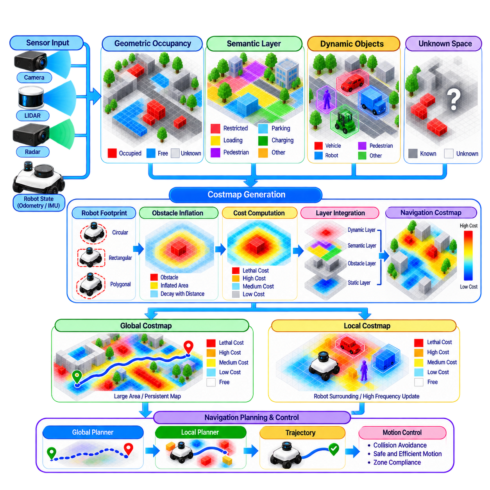{width="7.268055555555556in" height="7.268055555555556in"}

Occupancy information becomes directly useful for navigation when it is transformed into a costmap that expresses not only whether a location is occupied, but also how undesirable or risky it is for the robot to traverse that location. A costmap converts geometric occupancy, semantic information, and navigation constraints into spatial costs that planners and controllers can consume. This provides the interface between perception and motion planning, allowing uncertain environmental observations to influence path selection and local obstacle avoidance.

A basic occupancy grid usually represents cells as free, occupied, or unknown, whereas a navigation costmap assigns numerical costs to spatial locations. Free space can receive a low traversal cost, obstacles can receive a lethal or prohibited cost, and regions near obstacles can receive progressively higher costs. The resulting gradient provides navigation algorithms with information about clearance and risk rather than forcing them to make a simple binary decision about whether a cell is traversable.

Obstacle inflation is one of the most important operations in costmap generation. A physical obstacle occupies only a limited set of cells, but the robot itself has nonzero dimensions and cannot safely pass arbitrarily close to that obstacle. Inflation expands obstacle influence according to the robot footprint and safety margin. A cost function can then decrease with distance from the obstacle, creating a spatial gradient that encourages trajectories with greater clearance while preserving the possibility of navigating through sufficiently wide passages.

The robot footprint must be represented appropriately because different robot platforms have different collision geometries. A circular footprint can simplify computation for some mobile robots, while rectangular or polygonal footprints better represent elongated AMRs and industrial platforms. For robots with complex or changing configurations, such as articulated or legged systems, the effective footprint may need to depend on the current posture or planned motion. Costmap generation should therefore reflect the actual collision envelope rather than relying only on a nominal point model.

Unknown space requires explicit treatment because an unobserved cell does not necessarily represent free space. For indoor navigation in a well-mapped environment, unknown cells may be treated as highly costly or prohibited. During exploration, however, the robot may intentionally enter unknown regions. The appropriate policy therefore depends on the mission and operating environment. Separating unknown from confirmed free space allows the planner to apply different behaviors without corrupting the underlying occupancy representation.

Semantic map layers can provide additional information for costmap generation. A semantic zone may represent a restricted area, pedestrian region, loading area, preferred route, charging zone, or other operational region. These areas can modify the navigation cost independently of geometric obstacles. For example, a pedestrian zone may impose a lower speed requirement, while a restricted zone may receive a prohibitive cost. This allows navigation behavior to reflect environmental meaning rather than treating every region solely according to geometric distance.

Dynamic occupancy should also be incorporated into the costmap because moving obstacles can change the immediately traversable space. The dynamic-object-aware occupancy layer can provide current positions of pedestrians, vehicles, forklifts, or other robots. These observations should generally influence the local costmap rapidly while avoiding unnecessary modification of the persistent global map. The resulting architecture separates long-term environmental structure from short-term collision risk.

Costmap generation can be organized into global and local representations. A global costmap typically covers a larger region and reflects persistent map information, semantic zones, and relatively stable obstacles. A local costmap covers the area immediately surrounding the robot and is updated at a higher frequency using recent sensor observations. This separation allows the global planner to reason about longer-range connectivity while the local planner reacts quickly to newly detected obstacles and changing free space.

The relationship between occupancy probability and navigation cost should be designed carefully. A cell with a high probability of occupancy can receive a high cost, while uncertain observations may receive an intermediate cost depending on the safety policy. However, probability and cost do not necessarily have a one-to-one relationship. A small uncertainty near the robot footprint may be operationally more important than the same uncertainty far away. Costmap design should therefore consider probability, distance, robot dynamics, and mission-specific risk together.

Sensor observations must be transformed into the correct map frame before they can update the costmap. Localization, odometry, sensor extrinsic calibration, and temporal synchronization therefore remain essential. Misaligned observations can generate false obstacles, gaps in walls, or displaced cost regions. For moving robots, latency is also important because an obstacle observed several hundred milliseconds earlier may no longer be at the same position. Real-time systems should therefore account for both spatial and temporal uncertainty.

Costmap resolution creates another trade-off between geometric accuracy and computational demand. A fine resolution can represent narrow obstacles and provide precise collision margins, but it increases memory usage and update computation. A coarse resolution reduces computational cost but may remove important narrow passages or merge nearby obstacles. The appropriate resolution should consider the robot footprint, sensor accuracy, operating speed, environment scale, and the requirements of the local and global planners.

The generated costmap is ultimately consumed by motion-planning components. A global planner can use the costmap to search for a collision-free route through the larger environment, while a local planner or controller evaluates short trajectories against nearby obstacle costs. The costmap therefore becomes a shared spatial interface between perception and planning. Its quality directly affects whether the planner receives a stable representation of traversability, obstacle clearance, restricted regions, and local collision risk.

For ROS 2 and Navigation2-based systems, occupancy and semantic information can be integrated into layered costmap architectures. Static map data, obstacle observations, inflation, dynamic information, and semantic constraints can be represented as separate layers whose outputs are combined into a navigation cost field. This modular organization allows individual sources to be updated or replaced without redesigning the complete navigation system and supports different configurations for indoor AMRs, outdoor robots, and other mobile platforms.

A production costmap must also handle stale information, sensor dropouts, temporary occlusion, and dynamic changes. Persistent obstacle information should not remain indefinitely when contradictory observations indicate that the region has become free. Conversely, an obstacle should not disappear immediately simply because it is temporarily outside the sensor field of view. Time-based clearing, observation persistence, confidence thresholds, and sensor-specific update policies can provide a controlled balance between responsiveness and stability.

Costmap generation therefore represents the final transformation of occupancy and semantic perception into navigation-oriented spatial risk. The preceding occupancy layers provide geometric, volumetric, semantic, and dynamic information, while the costmap converts these representations into traversability costs that global and local planners can use. The following stages can then address real-time occupancy update-rate optimization, long-term semantic-map maintenance, and AMR fleet-level semantic-map sharing, extending the costmap from a local navigation interface into a continuously managed spatial intelligence layer.

점유 정보(Occupancy Information)는 특정 위치가 점유되어 있는지만 나타내는 것이 아니라, 로봇이 해당 위치를 통과하는 것이 얼마나 바람직하지 않거나 위험한지를 표현하는 비용 지도(Costmap)로 변환될 때 내비게이션(Navigation)에 직접적으로 유용해진다. 비용 지도는 기하학적 점유(Geometric Occupancy), 의미 정보(Semantic Information), 내비게이션 제약(Navigation Constraint)을 공간적 비용(Spatial Cost)으로 변환하여 플래너(Planner)와 제어기(Controller)가 사용할 수 있도록 한다. 이를 통해 인지(Perception)와 모션 계획(Motion Planning) 사이의 인터페이스가 형성되며, 불확실한 환경 관측값이 경로 선택(Path Selection)과 국부 장애물 회피(Local Obstacle Avoidance)에 영향을 줄 수 있다.

기본적인 점유 격자(Occupancy Grid)는 일반적으로 셀을 자유 공간(Free), 점유 공간(Occupied), 미지 공간(Unknown)으로 표현하는 반면, 내비게이션 비용 지도(Navigation Costmap)는 공간 위치에 수치적인 비용(Numerical Cost)을 할당한다. 자유 공간에는 낮은 통행 비용(Traversal Cost)을 부여하고, 장애물에는 치명적 비용(Lethal Cost) 또는 통과 금지 비용을 부여하며, 장애물 주변 영역에는 점진적으로 증가하는 비용을 부여할 수 있다. 이렇게 형성된 비용 경사(Cost Gradient)는 셀이 단순히 통과 가능한지 여부만 결정하도록 하는 대신 장애물과의 거리와 위험도에 대한 정보를 내비게이션 알고리즘에 제공한다.

장애물 팽창(Obstacle Inflation)은 비용 지도 생성에서 가장 중요한 연산 중 하나이다. 실제 장애물은 제한된 수의 셀만 점유하지만 로봇 자체에도 물리적인 크기가 있으므로 장애물에 임의로 가까이 접근할 수 없다. 팽창 과정은 로봇 형상(Robot Footprint)과 안전 여유(Safety Margin)에 따라 장애물의 영향을 주변으로 확장한다. 이후 비용 함수를 장애물로부터의 거리에 따라 감소시키면 공간적인 비용 경사(Spatial Cost Gradient)가 생성되어, 충분히 넓은 통로에서는 이동할 수 있도록 하면서도 장애물로부터 더 큰 여유 거리를 확보하는 궤적(Trajectory)을 유도할 수 있다.

로봇 형상(Robot Footprint)은 서로 다른 로봇 플랫폼이 서로 다른 충돌 기하(Collision Geometry)를 가지므로 적절하게 표현되어야 한다. 원형 형상(Circular Footprint)은 일부 이동 로봇의 계산을 단순화할 수 있지만, 길쭉한 AMR이나 산업용 플랫폼에서는 직사각형 또는 다각형 형상이 실제 형상을 더 정확하게 표현할 수 있다. 관절형 로봇(Articulated Robot)이나 다족 로봇(Legged Robot)처럼 복잡하거나 변화하는 구성을 갖는 로봇에서는 유효 형상(Effective Footprint)이 현재 자세나 계획된 움직임에 따라 달라질 수도 있다. 따라서 비용 지도 생성은 단순한 점 모델(Point Model)이 아니라 실제 충돌 외곽선(Collision Envelope)을 반영해야 한다.

미지 공간(Unknown Space)은 관측되지 않은 셀이 반드시 자유 공간을 의미하는 것은 아니기 때문에 명시적으로 처리해야 한다. 잘 구축된 실내 지도 환경에서는 미지 셀을 매우 높은 비용 또는 통과 금지 영역으로 처리할 수 있다. 그러나 탐사(Exploration)에서는 로봇이 의도적으로 미지 영역으로 진입할 수도 있다. 따라서 적절한 정책은 임무와 운용 환경에 따라 달라진다. 미지 공간과 확인된 자유 공간(Confirmed Free Space)을 분리하면 기본 점유 표현을 훼손하지 않고 플래너가 서로 다른 행동을 적용할 수 있다.

의미 지도 계층(Semantic Map Layer)은 비용 지도 생성에 추가적인 정보를 제공할 수 있다. 의미 Zone은 출입 제한 구역(Restricted Area), 보행자 영역(Pedestrian Region), 적재 구역(Loading Area), 선호 경로(Preferred Route), 충전 구역(Charging Zone) 또는 기타 운용 영역을 나타낼 수 있다. 이러한 영역은 기하학적 장애물과 독립적으로 내비게이션 비용을 변경할 수 있다. 예를 들어 보행자 영역에는 낮은 속도 요구사항을 적용하고, 출입 제한 구역에는 통과 금지 비용을 부여할 수 있다. 이를 통해 내비게이션 행동이 단순한 기하학적 거리뿐만 아니라 환경의 의미를 반영하도록 할 수 있다.

동적 점유(Dynamic Occupancy) 역시 비용 지도에 반영되어야 한다. 움직이는 장애물은 즉각적으로 통과 가능한 공간을 변화시킬 수 있기 때문이다. 동적 객체 인식 기반 점유 계층(Dynamic-Object-Aware Occupancy Layer)은 보행자, 차량, 지게차 또는 다른 로봇의 현재 위치를 제공할 수 있다. 이러한 관측값은 일반적으로 로컬 비용 지도(Local Costmap)에 빠르게 반영하면서도 지속적인 전역 지도(Persistent Global Map)를 불필요하게 수정하지 않도록 해야 한다. 결과적으로 장기적인 환경 구조와 단기적인 충돌 위험을 분리하는 아키텍처를 구성할 수 있다.

비용 지도 생성은 전역 표현(Global Representation)과 로컬 표현(Local Representation)으로 구성할 수 있다. 전역 비용 지도(Global Costmap)는 일반적으로 더 넓은 영역을 포함하며 지속적인 지도 정보, 의미 Zone, 비교적 안정적인 장애물을 반영한다. 로컬 비용 지도(Local Costmap)는 로봇 주변의 즉각적인 영역을 포함하고 최근 센서 관측값을 사용하여 더 높은 주기로 갱신된다. 이러한 분리를 통해 전역 플래너(Global Planner)는 장거리 연결성을 고려하면서도 로컬 플래너(Local Planner)는 새롭게 감지된 장애물과 변화하는 자유 공간에 신속하게 대응할 수 있다.

점유 확률(Occupancy Probability)과 내비게이션 비용(Navigation Cost)의 관계는 신중하게 설계해야 한다. 점유 확률이 높은 셀에는 높은 비용을 부여할 수 있으며, 불확실한 관측에는 안전 정책에 따라 중간 수준의 비용을 부여할 수 있다. 그러나 확률과 비용이 반드시 일대일로 대응할 필요는 없다. 로봇 형상 바로 주변에서 발생하는 작은 불확실성이 먼 거리에서 발생하는 동일한 불확실성보다 운용상 훨씬 중요할 수 있다. 따라서 비용 지도 설계에서는 확률, 거리, 로봇 동역학(Robot Dynamics), 임무별 위험도를 함께 고려해야 한다.

센서 관측값은 비용 지도를 갱신하기 전에 올바른 지도 좌표계(Map Frame)로 변환되어야 한다. 따라서 위치 추정(Localization), 주행 거리 추정(Odometry), 센서 외부 파라미터 보정(Sensor Extrinsic Calibration), 시간 동기화(Temporal Synchronization)는 여전히 필수적이다. 정렬되지 않은 관측값은 가짜 장애물, 벽의 빈틈, 잘못 이동된 비용 영역을 생성할 수 있다. 이동 로봇에서는 지연 시간(Latency)도 중요하다. 수백 밀리초 전에 관측된 장애물이 이미 다른 위치로 이동했을 수 있기 때문이다. 따라서 실시간 시스템은 공간적 불확실성과 시간적 불확실성을 모두 고려해야 한다.

비용 지도 해상도(Costmap Resolution)는 기하학적 정확도와 계산 요구량 사이에서 또 다른 절충 관계를 만든다. 높은 해상도는 좁은 장애물을 표현하고 정확한 충돌 여유를 제공할 수 있지만 메모리 사용량과 갱신 계산량을 증가시킨다. 낮은 해상도는 계산 비용을 줄이지만 중요한 좁은 통로를 제거하거나 서로 가까운 장애물을 하나로 합칠 수 있다. 따라서 적절한 해상도는 로봇 형상, 센서 정확도, 운용 속도, 환경 규모, 로컬 및 전역 플래너의 요구사항을 고려하여 결정해야 한다.

생성된 비용 지도는 궁극적으로 모션 계획 구성요소(Motion-Planning Component)가 사용한다. 전역 플래너는 비용 지도를 이용하여 넓은 환경에서 충돌이 없는 경로(Collision-Free Route)를 탐색할 수 있고, 로컬 플래너 또는 제어기는 주변 장애물 비용에 대해 짧은 궤적(Short Trajectory)을 평가할 수 있다. 따라서 비용 지도는 인지와 계획 사이에서 공유되는 공간 인터페이스(Spatial Interface)가 된다. 비용 지도의 품질은 플래너가 주행 가능성(Traversability), 장애물 여유 거리(Obstacle Clearance), 제한 영역(Restricted Region), 국부 충돌 위험(Local Collision Risk)을 얼마나 안정적으로 표현받는지에 직접적인 영향을 준다.

ROS 2와 Navigation2 기반 시스템에서는 점유 정보와 의미 정보를 계층형 비용 지도 아키텍처(Layered Costmap Architecture)에 통합할 수 있다. 정적 지도 정보(Static Map Data), 장애물 관측(Obstacle Observation), 팽창(Inflation), 동적 정보(Dynamic Information), 의미 제약(Semantic Constraint)을 별도의 계층으로 구성하고 그 결과를 하나의 내비게이션 비용 필드(Navigation Cost Field)로 결합할 수 있다. 이러한 모듈형 구조(Modular Organization)는 전체 내비게이션 시스템을 다시 설계하지 않고도 개별 정보원을 갱신하거나 교체할 수 있도록 하며, 실내 AMR, 야외 로봇 및 기타 이동 플랫폼에 서로 다른 구성을 적용할 수 있도록 한다.

실제 운용 비용 지도(Production Costmap)는 오래된 정보(Stale Information), 센서 입력 중단(Sensor Dropout), 일시적인 가림(Temporary Occlusion), 동적 환경 변화(Dynamic Change)를 처리해야 한다. 지속적인 장애물 정보가 해당 영역이 자유 공간으로 변했다는 상반된 관측에도 불구하고 무한히 유지되어서는 안 된다. 반대로 센서의 시야에서 일시적으로 사라졌다는 이유만으로 장애물이 즉시 제거되어서도 안 된다. 시간 기반 제거(Time-Based Clearing), 관측 지속성(Observation Persistence), 신뢰도 임계값(Confidence Threshold), 센서별 갱신 정책(Sensor-Specific Update Policy)을 적용하면 반응성과 안정성 사이에서 제어 가능한 균형을 유지할 수 있다.

비용 지도 생성은 궁극적으로 점유 및 의미 인지(Occupancy and Semantic Perception)를 내비게이션 중심의 공간 위험도(Spatial Risk)로 변환하는 마지막 단계에 해당한다. 앞선 점유 계층은 기하학적, 체적적, 의미론적, 동적 정보를 제공하며, 비용 지도는 이러한 표현을 전역 및 로컬 플래너가 사용할 수 있는 주행 가능성 비용(Traversability Cost)으로 변환한다. 이후 단계에서는 실시간 점유 갱신 주기 최적화(Real-Time Occupancy Update-Rate Optimization), 장기 의미 지도 유지관리(Long-Term Semantic-Map Maintenance), AMR 플릿 수준 의미 지도 공유(AMR Fleet-Level Semantic-Map Sharing)를 다룰 수 있으며, 이를 통해 비용 지도는 단순한 로컬 내비게이션 인터페이스에서 지속적으로 관리되는 공간 지능 계층(Spatial Intelligence Layer)으로 확장된다.

##  

## 08.08. Real Time Occupancy Map Update Rate Optimization [w/Code]

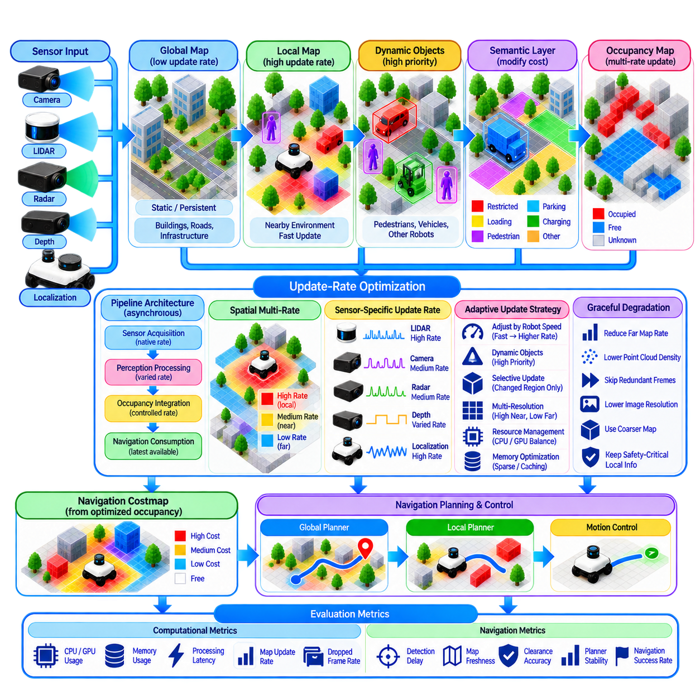{width="7.268055555555556in" height="7.268055555555556in"}

Real-time occupancy map update-rate optimization addresses the problem of maintaining an occupancy representation that is both spatially accurate and temporally responsive without consuming excessive computing resources. A robot continuously receives LiDAR, camera, radar, depth, and localization data, but not every sensor stream needs to update the entire map at the same frequency. The objective is to determine appropriate update rates, spatial scopes, and processing priorities so that the map remains sufficiently current for navigation and collision avoidance.

The required update rate depends strongly on the operational role of the map. A persistent global map containing buildings, walls, road boundaries, and fixed infrastructure can normally be updated relatively slowly because these structures change infrequently. A local occupancy or costmap around a moving robot requires much faster updates because pedestrians, vehicles, and newly detected obstacles can change the immediately traversable space within a short period. Separating global and local update frequencies is therefore a fundamental optimization strategy.

Sensor-specific update rates should also be considered rather than forcing all perception sources into a single synchronized cycle. LiDAR may provide high-frequency geometric observations, cameras may operate at a different frame rate, radar may provide continuous motion-related information, and localization may run at a substantially higher rate. The occupancy system can consume each source according to its temporal characteristics and confidence instead of unnecessarily processing every sensor at the highest common frequency.

A useful approach is to separate sensor acquisition, perception processing, occupancy integration, and navigation consumption into independent pipelines. Sensor acquisition can continue at the native sensor frequency while occupancy integration occurs at a controlled rate. Navigation can consume the most recent valid map state without waiting for every perception module to complete a new cycle. This asynchronous architecture reduces unnecessary synchronization delays and prevents a slow processing component from blocking the complete navigation pipeline.

Not every map region requires the same update frequency. The spatial area immediately surrounding the robot should normally receive higher-frequency updates because it has the greatest influence on imminent collision risk. Distant regions can be updated less frequently, especially when they contain stable structures. A multi-rate spatial strategy can therefore divide the map into local, near, and far regions, assigning computational resources according to distance, motion relevance, and expected environmental change.

Dynamic-object information should receive higher temporal priority than persistent static geometry. A pedestrian or vehicle can move significantly between consecutive planning cycles, whereas a building wall generally remains unchanged. Dynamic-object-aware occupancy layers can therefore be refreshed rapidly while static layers are retained and reused. This reduces computation while ensuring that the information most relevant to immediate safety remains temporally current.

Map update frequency should also reflect robot velocity. As robot speed increases, the distance traveled during one update interval becomes larger, reducing the time available to react to newly detected obstacles. A slow-moving robot may tolerate a lower occupancy update frequency, while a high-speed outdoor platform requires shorter perception-to-map latency. Update scheduling can therefore incorporate velocity, stopping distance, sensor range, and braking capability rather than using a fixed frequency for every operating condition.

End-to-end latency is often more important than the nominal map update frequency alone. A system may claim a high update rate while still producing stale information if sensor capture, inference, coordinate transformation, map insertion, costmap generation, and planner consumption introduce substantial delays. The relevant quantity is the age of the information when it reaches the controller. Real-time optimization should therefore measure the complete perception-to-action latency and identify the stages that contribute most to stale occupancy.

Computational resources can be managed through selective map updates. Instead of rebuilding or processing the complete occupancy grid for every sensor frame, the system can identify regions affected by new observations and update only those areas. Local bounding boxes, active voxel blocks, changed cells, sparse spatial indices, and incremental ray updates can substantially reduce unnecessary computation. This approach is especially valuable for large 3D voxel maps where only a small fraction of the total environment changes at any given moment.

Resolution can also be adapted according to spatial and operational requirements. High-resolution occupancy is useful near the robot, narrow obstacles, and collision-critical regions, while lower resolution may be sufficient for distant or geometrically stable areas. Multi-resolution voxel structures and hierarchical maps allow computational effort to concentrate where geometric precision has the greatest navigation value. The system can therefore maintain broad spatial awareness without processing the entire environment at maximum resolution.

GPU and CPU workloads should be balanced according to the characteristics of each operation. Neural perception, point-cloud preprocessing, voxelization, and some spatial operations may benefit from GPU acceleration, while map management, synchronization, scheduling, and lightweight queries may remain efficient on the CPU. Excessive GPU utilization by perception can nevertheless increase latency for other critical tasks. Real-time occupancy optimization should therefore consider resource contention rather than maximizing the throughput of a single processing module.

Memory bandwidth and data movement can become bottlenecks even when raw compute capacity appears sufficient. Large voxel grids, point clouds, feature tensors, and costmaps can require frequent memory transfers between processing stages. Efficient sparse representations, contiguous memory layouts, caching, reduced precision, downsampling, and local map windows can reduce data movement. In embedded robotic systems, minimizing unnecessary memory traffic can be as important as reducing arithmetic operations.

Update-rate control should also include graceful degradation. If the computational load temporarily exceeds available resources, the system should degrade in a controlled manner rather than allowing all perception and navigation processes to become unstable. Possible strategies include reducing distant-map update frequency, lowering point-cloud density, skipping redundant frames, reducing image resolution, or temporarily using a coarser occupancy representation. Safety-critical local obstacle information should generally receive higher priority than low-priority global map refinement.

The quality of an optimized occupancy system should be evaluated using both computational and navigation-oriented metrics. CPU and GPU utilization, memory consumption, processing latency, map update frequency, and dropped-frame rate describe system efficiency, while obstacle detection delay, map freshness, collision-clearance accuracy, planner stability, and navigation success describe operational effectiveness. A high update rate is not inherently useful if the resulting map is noisy, unstable, spatially misaligned, or too expensive for the navigation stack to consume reliably.

Real-time occupancy optimization ultimately aims to maintain the freshest spatial information that the robot actually needs while avoiding unnecessary computation. The preceding occupancy, 3D voxel, semantic, dynamic, semantic-layer, and costmap stages provide the information that must be maintained, while update-rate optimization determines when, where, and at what resolution that information should be refreshed. This creates a practical bridge between perception performance and real-time navigation, preparing the system for long-term semantic-map maintenance and distributed AMR semantic-map management.

실시간 점유 지도 갱신 주기 최적화(Real-Time Occupancy Map Update-Rate Optimization)는 과도한 계산 자원을 사용하지 않으면서 공간적으로 정확하고 시간적으로 신속하게 반응하는 점유 표현(Occupancy Representation)을 유지하는 문제를 다룬다. 로봇은 지속적으로 라이다(LiDAR), 카메라(Camera), 레이더(Radar), 깊이 센서(Depth Sensor), 위치 추정(Localization) 데이터를 수신하지만, 모든 센서 스트림이 전체 지도를 동일한 주기로 갱신할 필요는 없다. 목표는 적절한 갱신 주기(Update Rate), 공간적 범위(Spatial Scope), 처리 우선순위(Processing Priority)를 결정하여 내비게이션(Navigation)과 충돌 회피(Collision Avoidance)에 충분히 최신 상태인 지도를 유지하는 것이다.

필요한 갱신 주기는 지도의 운용 목적에 크게 좌우된다. 건물, 벽, 도로 경계, 고정 인프라를 포함하는 지속적인 전역 지도(Persistent Global Map)는 이러한 구조물이 거의 변하지 않기 때문에 일반적으로 상대적으로 느리게 갱신해도 된다. 반면 이동하는 로봇 주변의 로컬 점유 지도(Local Occupancy Map) 또는 비용 지도(Costmap)는 보행자, 차량, 새롭게 감지된 장애물이 짧은 시간 안에 즉각적인 주행 가능 공간을 변화시킬 수 있으므로 훨씬 빠른 갱신이 필요하다. 따라서 전역 및 로컬 갱신 주기를 분리하는 것은 기본적인 최적화 전략이다.

모든 인지 센서를 하나의 동기화된 주기로 강제하기보다는 센서별 갱신 주기도 고려해야 한다. 라이다는 고주기의 기하학적 관측을 제공할 수 있고, 카메라는 서로 다른 프레임 속도로 동작할 수 있으며, 레이더는 지속적인 움직임 관련 정보를 제공할 수 있고, 위치 추정은 상당히 더 높은 주기로 실행될 수 있다. 점유 시스템은 모든 센서를 가장 높은 공통 주기로 불필요하게 처리하는 대신 각 센서의 시간적 특성과 신뢰도에 따라 정보를 사용할 수 있다.

유용한 접근 방식은 센서 획득(Sensor Acquisition), 인지 처리(Perception Processing), 점유 통합(Occupancy Integration), 내비게이션 사용(Navigation Consumption)을 서로 독립적인 파이프라인으로 분리하는 것이다. 센서 획득은 센서의 고유 주기(Native Sensor Frequency)로 계속 수행하면서 점유 통합은 제어된 주기로 실행할 수 있다. 내비게이션은 모든 인지 모듈이 새로운 주기를 완료할 때까지 기다리지 않고 가장 최근의 유효한 지도 상태(Map State)를 사용할 수 있다. 이러한 비동기 아키텍처(Asynchronous Architecture)는 불필요한 동기화 지연을 줄이고 느린 처리 구성요소가 전체 내비게이션 파이프라인을 차단하는 것을 방지한다.

모든 지도 영역이 동일한 갱신 주기를 필요로 하는 것은 아니다. 일반적으로 로봇 바로 주변의 공간 영역은 임박한 충돌 위험에 가장 큰 영향을 미치므로 더 높은 주기로 갱신해야 한다. 반면 원거리 영역은 특히 안정적인 구조물을 포함하고 있다면 더 낮은 주기로 갱신할 수 있다. 따라서 다중 주기 공간 전략(Multi-Rate Spatial Strategy)을 사용하여 지도를 근거리, 중거리, 원거리 영역으로 나누고 거리, 움직임 관련성(Motion Relevance), 예상 환경 변화에 따라 계산 자원을 할당할 수 있다.

동적 객체 정보(Dynamic-Object Information)는 지속적인 정적 기하 구조보다 높은 시간적 우선순위(Temporal Priority)를 받아야 한다. 보행자나 차량은 연속적인 계획 주기 사이에서도 상당한 거리를 이동할 수 있지만 건물 벽은 일반적으로 변하지 않는다. 따라서 동적 객체 인식 기반 점유 계층(Dynamic-Object-Aware Occupancy Layer)은 빠르게 갱신하고 정적 계층(Static Layer)은 유지하면서 재사용할 수 있다. 이를 통해 계산량을 줄이면서도 즉각적인 안전과 가장 관련성이 높은 정보가 시간적으로 최신 상태를 유지하도록 할 수 있다.

지도 갱신 주기는 로봇 속도(Robot Velocity)도 반영해야 한다. 로봇 속도가 증가하면 하나의 갱신 주기 동안 이동하는 거리가 커지므로 새롭게 감지된 장애물에 대응할 수 있는 시간이 감소한다. 저속으로 이동하는 로봇은 낮은 점유 갱신 주기를 허용할 수 있지만, 고속으로 이동하는 야외 플랫폼은 더 짧은 인지-지도 지연(Perception-to-Map Latency)을 필요로 한다. 따라서 갱신 스케줄링(Update Scheduling)은 모든 운용 조건에 고정된 주파수를 사용하는 대신 속도, 정지 거리(Stopping Distance), 센서 탐지 범위(Sensor Range), 제동 능력(Braking Capability)을 함께 고려할 수 있다.

전체 지연 시간(End-to-End Latency)은 단순한 명목상의 지도 갱신 주기보다 더 중요할 수 있다. 시스템이 높은 갱신 주기를 가진다고 하더라도 센서 캡처, 추론(Inference), 좌표 변환(Coordinate Transformation), 지도 삽입(Map Insertion), 비용 지도 생성(Costmap Generation), 플래너 사용(Planner Consumption) 과정에서 상당한 지연이 발생하면 오래된 정보를 생성할 수 있다. 실제로 중요한 값은 해당 정보가 제어기(Controller)에 도달했을 때의 정보 연령(Information Age)이다. 따라서 실시간 최적화에서는 전체 인지-행동 지연(Perception-to-Action Latency)을 측정하고 오래된 점유 정보를 만드는 데 가장 크게 기여하는 단계를 식별해야 한다.

계산 자원은 선택적 지도 갱신(Selective Map Update)을 통해 관리할 수 있다. 모든 센서 프레임마다 전체 점유 격자를 다시 구축하거나 처리하는 대신 새로운 관측값의 영향을 받는 영역을 식별하고 해당 영역만 갱신할 수 있다. 로컬 경계 상자(Local Bounding Box), 활성 복셀 블록(Active Voxel Block), 변경 셀(Changed Cell), 희소 공간 인덱스(Sparse Spatial Index), 증분 광선 갱신(Incremental Ray Update) 등을 활용하면 불필요한 계산을 크게 줄일 수 있다. 이러한 방식은 특정 시점에서 전체 환경 중 극히 일부만 변화하는 대규모 3차원 복셀 지도(3D Voxel Map)에서 특히 유용하다.

해상도(Resolution) 역시 공간적 및 운용상의 요구사항에 따라 조정할 수 있다. 높은 해상도의 점유 표현은 로봇 주변, 좁은 장애물, 충돌이 중요한 영역에서 유용한 반면, 원거리 또는 기하학적으로 안정적인 영역에서는 낮은 해상도로 충분할 수 있다. 다중 해상도 복셀 구조(Multi-Resolution Voxel Structure)와 계층형 지도(Hierarchical Map)를 사용하면 기하학적 정밀도가 내비게이션에 가장 큰 가치를 제공하는 영역에 계산 자원을 집중할 수 있다. 이를 통해 전체 환경을 최대 해상도로 처리하지 않으면서도 넓은 공간에 대한 인식을 유지할 수 있다.

GPU와 CPU 작업량은 각 연산의 특성에 따라 균형을 맞춰야 한다. 신경망 기반 인지(Neural Perception), 포인트 클라우드 전처리(Point-Cloud Preprocessing), 복셀화(Voxelization), 일부 공간 연산은 GPU 가속의 이점을 받을 수 있는 반면, 지도 관리(Map Management), 동기화(Synchronization), 스케줄링(Scheduling), 경량 질의(Lightweight Query)는 CPU에서도 효율적으로 수행할 수 있다. 그러나 인지 처리에 GPU를 과도하게 사용하면 다른 중요 작업의 지연 시간이 증가할 수 있다. 따라서 실시간 점유 최적화에서는 하나의 처리 모듈의 처리량을 최대화하는 것보다 자원 경쟁(Resource Contention)을 고려해야 한다.

메모리 대역폭(Memory Bandwidth)과 데이터 이동(Data Movement)은 원시 연산 능력이 충분해 보이는 경우에도 병목이 될 수 있다. 대규모 복셀 격자, 포인트 클라우드, 특징 텐서(Feature Tensor), 비용 지도는 처리 단계 사이에서 빈번한 메모리 이동을 필요로 할 수 있다. 효율적인 희소 표현(Sparse Representation), 연속적인 메모리 배치(Contiguous Memory Layout), 캐싱(Caching), 감소된 정밀도(Reduced Precision), 다운샘플링(Downsampling), 로컬 지도 윈도우(Local Map Window)를 사용하면 데이터 이동을 줄일 수 있다. 임베디드 로봇 시스템에서는 불필요한 메모리 트래픽을 줄이는 것이 산술 연산을 줄이는 것만큼 중요할 수 있다.

갱신 주기 제어(Update-Rate Control)에는 우아한 성능 저하(Graceful Degradation)도 포함되어야 한다. 계산 부하가 일시적으로 가용 자원을 초과하는 경우 시스템은 모든 인지 및 내비게이션 프로세스가 불안정해지는 대신 제어된 방식으로 성능을 낮춰야 한다. 가능한 전략으로는 원거리 지도 갱신 주기 감소, 포인트 클라우드 밀도 감소, 중복 프레임 건너뛰기, 영상 해상도 감소, 또는 일시적으로 더 거친 점유 표현 사용 등이 있다. 안전과 직결되는 로컬 장애물 정보는 일반적으로 우선순위가 낮은 전역 지도 정밀화보다 높은 우선순위를 가져야 한다.

최적화된 점유 시스템의 품질은 계산 성능 지표와 내비게이션 중심 지표를 함께 사용하여 평가해야 한다. CPU 및 GPU 사용률, 메모리 사용량, 처리 지연 시간, 지도 갱신 주기, 프레임 손실률(Dropped-Frame Rate)은 시스템 효율성을 설명하며, 장애물 검출 지연(Obstacle Detection Delay), 지도 최신성(Map Freshness), 충돌 여유 정확도(Collision-Clearance Accuracy), 플래너 안정성(Planner Stability), 내비게이션 성공률(Navigation Success Rate)은 운용 효과를 설명한다. 높은 갱신 주기가 항상 유용한 것은 아니며, 결과 지도가 잡음이 많거나 불안정하거나 공간적으로 잘못 정렬되었거나 내비게이션 스택이 안정적으로 처리하기에 지나치게 많은 계산을 요구한다면 실질적인 이점이 제한될 수 있다.

실시간 점유 최적화(Real-Time Occupancy Optimization)의 궁극적인 목표는 불필요한 계산을 피하면서 로봇이 실제로 필요로 하는 가장 최신의 공간 정보를 유지하는 것이다. 앞선 점유 지도(Occupancy), 3차원 복셀(3D Voxel), 의미론적 점유(Semantic Occupancy), 동적 점유(Dynamic Occupancy), 의미 지도 계층(Semantic Map Layer), 비용 지도(Costmap) 단계는 유지해야 할 정보를 제공하고, 갱신 주기 최적화(Update-Rate Optimization)는 해당 정보를 언제, 어디에서, 어떤 해상도로 갱신해야 하는지를 결정한다. 이를 통해 인지 성능과 실시간 내비게이션 사이의 실용적인 연결이 형성되며, 이후의 장기 의미 지도 유지관리(Long-Term Semantic-Map Maintenance)와 분산 AMR 의미 지도 관리(Distributed AMR Semantic-Map Management)를 위한 기반이 마련된다.

##  

## 08.09. Long Term Semantic Map Maintenance [w/Code]

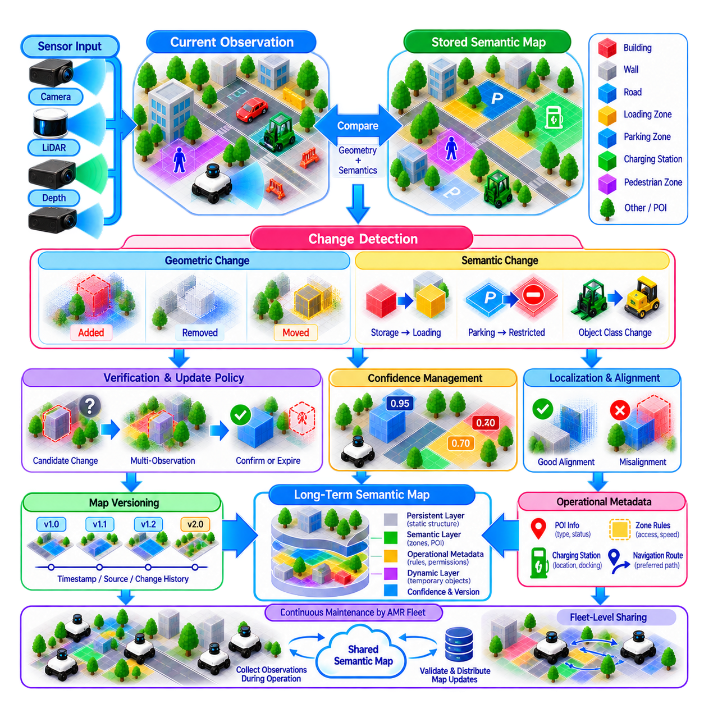{width="7.268055555555556in" height="7.268055555555556in"}

Long-term semantic map maintenance treats the semantic map as a continuously evolving representation rather than a static database created once during an initial mapping mission. Buildings, roads, equipment, furniture, access areas, and operational zones may change over weeks or months, while temporary objects may appear and disappear much more quickly. The maintenance process must therefore preserve reliable spatial knowledge while identifying outdated geometry, changed semantic labels, newly created regions, and information whose confidence has gradually decreased.

A long-term map normally separates persistent environmental structure from short-lived observations. Fixed walls, road boundaries, buildings, charging stations, and permanent equipment can remain in a persistent layer, while vehicles, temporary barriers, pedestrians, and other transient objects are handled through dynamic layers. This separation prevents temporary perception results from becoming permanent map content. It also allows different update policies to be applied according to the expected lifetime and operational importance of each semantic entity.

Change detection provides the fundamental mechanism for determining whether the stored map still represents the current environment. New camera, LiDAR, radar, or occupancy observations can be registered against the existing map and compared with previously stored geometry and semantic information. A difference does not automatically mean that the map should be modified because sensor noise, localization error, occlusion, or temporary objects can create apparent changes. Reliable maintenance therefore requires evidence accumulation and temporal consistency before committing important map modifications.

Geometric change detection focuses on differences in spatial structure. A wall may have moved because of reconstruction, a shelf may have been relocated, or a road boundary may have changed after construction. Point-cloud registration, occupancy comparison, voxel differencing, surface comparison, and spatial change statistics can identify regions where the current geometry disagrees with the stored representation. The detected difference can then be classified as temporary, uncertain, or persistent according to repeated observations and the operational context.

Semantic change detection addresses changes in the meaning assigned to a spatial entity. A location previously identified as a storage area may become a loading zone, a parking region may become restricted, or equipment may be replaced by another object class. Semantic observations should therefore be compared with existing labels rather than simply appended to the map. Confidence, observation frequency, source reliability, and temporal persistence can be used to determine whether a new label should replace, coexist with, or remain separate from the existing semantic information.

Map versioning is important when semantic maps are continuously modified. Each significant map state can be associated with a version, timestamp, coordinate reference, source information, and change history. This allows the system to determine when an object or zone was introduced, modified, or removed. Versioning also provides a mechanism for recovering from an incorrect update and for comparing different map states when investigating navigation failures or unexpected environmental changes.

Confidence management should be maintained at the level of individual map elements whenever practical. A semantic label, POI, zone boundary, or geometric feature may have different confidence depending on how it was observed and how recently it was confirmed. Repeated observations from independent sensors can increase confidence, while contradictory observations can reduce it. This prevents the entire map from being treated as equally certain and allows downstream navigation systems to apply conservative behavior in regions containing unresolved map uncertainty.

Map maintenance must account for localization quality because inaccurate registration can make stable structures appear to move. If the robot pose estimate is incorrect, a newly observed wall may be displaced relative to the stored wall even though the physical environment has not changed. Long-term maintenance should therefore consider localization confidence, sensor calibration, and registration quality before declaring a persistent environmental change. Map updates based on poor spatial alignment can otherwise introduce systematic errors that become difficult to remove later.

A useful maintenance policy distinguishes observation, verification, and commitment. A newly detected change can first be stored as a candidate modification without immediately altering the authoritative map. Additional observations from later robot passes or different sensor viewpoints can then verify whether the change persists. Once sufficient evidence is accumulated, the candidate can be promoted to the persistent map, while observations that fail verification can expire. This approach reduces the risk of permanently storing false changes caused by transient conditions.

Semantic map maintenance should also consider spatial granularity. Some changes require modification of individual objects, while others affect entire zones or map regions. Moving one shelf may require only a local object update, whereas a warehouse reconstruction may require changes to aisle boundaries, restricted areas, charging locations, and preferred navigation routes. Hierarchical maintenance allows local changes to be processed independently while larger structural changes trigger coordinated updates across related semantic layers.

Operational metadata should remain connected to the maintained map. A POI can contain its location, semantic type, availability state, and associated operational information. A zone can contain access permissions, speed constraints, preferred behavior, or scheduling rules. When the underlying geometry changes, dependent metadata may also need verification. For example, moving a charging station requires not only updating its position but also checking whether its docking area, navigation route, and associated operational constraints remain valid.

For AMR environments, long-term maintenance becomes a continuous operational process involving repeated observations from robots performing normal missions. Instead of requiring a dedicated mapping mission after every environmental change, the fleet can collect observations during navigation and identify regions that require review. This creates a feedback loop in which operational robots contribute evidence to the evolution of the shared semantic map. The next stage can extend this concept to fleet-level map sharing, where validated changes are distributed across multiple AMRs.

Long-term semantic map maintenance therefore connects perception, mapping, localization, navigation, and operational knowledge into a persistent spatial management process. The preceding stages establish occupancy, semantic layers, dynamic-object handling, costmap generation, and real-time update strategies; maintenance determines how this information remains valid over extended periods. The essential objective is not to update everything continuously, but to preserve trusted knowledge, detect meaningful environmental change, verify uncertain modifications, and maintain a versioned semantic representation that remains useful for autonomous navigation and future fleet-level sharing.

장기 의미 지도 유지관리(Long-Term Semantic Map Maintenance)는 의미 지도(Semantic Map)를 초기 지도화 임무에서 한 번 생성하고 끝나는 정적인 데이터베이스가 아니라, 지속적으로 변화하는 표현으로 취급한다. 건물, 도로, 장비, 가구, 출입 구역, 운용 Zone은 수주 또는 수개월에 걸쳐 변화할 수 있으며, 일시적인 객체는 훨씬 더 빠르게 나타나고 사라질 수 있다. 따라서 유지관리 과정은 신뢰할 수 있는 공간 지식(Spatial Knowledge)을 보존하는 동시에 오래된 기하 정보, 변경된 의미 Label, 새롭게 생성된 영역, 시간이 지나면서 신뢰도가 감소한 정보를 식별해야 한다.

장기 지도(Long-Term Map)는 일반적으로 지속적인 환경 구조(Persistent Environmental Structure)와 단기 관측(Short-Lived Observation)을 분리한다. 고정된 벽, 도로 경계, 건물, 충전 스테이션, 영구 설비는 지속 계층(Persistent Layer)에 유지할 수 있으며, 차량, 임시 장벽, 보행자 및 기타 일시적인 객체는 동적 계층(Dynamic Layer)을 통해 처리한다. 이러한 분리는 일시적인 인지 결과가 영구적인 지도 정보가 되는 것을 방지한다. 또한 각 의미 객체의 예상 수명과 운용상 중요도에 따라 서로 다른 갱신 정책(Update Policy)을 적용할 수 있도록 한다.

변화 검출(Change Detection)은 저장된 지도가 현재 환경을 계속해서 정확하게 표현하고 있는지를 판단하기 위한 기본적인 메커니즘을 제공한다. 새로운 카메라(Camera), 라이다(LiDAR), 레이더(Radar), 점유(Occupancy) 관측값을 기존 지도에 정합(Register)하고 이전에 저장된 기하 정보 및 의미 정보와 비교할 수 있다. 그러나 차이가 발생했다고 해서 항상 지도를 수정해야 하는 것은 아니다. 센서 잡음(Sensor Noise), 위치 추정 오차(Localization Error), 가림(Occlusion), 일시적인 객체가 겉보기 변화를 만들어낼 수 있기 때문이다. 따라서 신뢰할 수 있는 유지관리에는 중요한 지도 변경을 확정하기 전에 증거 누적(Evidence Accumulation)과 시간적 일관성(Temporal Consistency)이 필요하다.

기하학적 변화 검출(Geometric Change Detection)은 공간 구조의 차이에 초점을 맞춘다. 재건축으로 인해 벽이 이동하거나, 선반이 재배치되거나, 공사 이후 도로 경계가 변경될 수 있다. 포인트 클라우드 정합(Point-Cloud Registration), 점유 비교(Occupancy Comparison), 복셀 차분(Voxel Differencing), 표면 비교(Surface Comparison), 공간 변화 통계(Spatial Change Statistics)를 통해 현재 기하 구조가 저장된 표현과 일치하지 않는 영역을 식별할 수 있다. 이후 검출된 차이는 반복 관측과 운용 상황에 따라 일시적 변화(Temporary), 불확실한 변화(Uncertain), 지속적 변화(Persistent)로 분류할 수 있다.

의미 변화 검출(Semantic Change Detection)은 특정 공간 객체에 부여된 의미가 변화하는 것을 다룬다. 이전에 보관 구역(Storage Area)으로 식별된 위치가 적재 구역(Loading Zone)으로 변경되거나, 주차 영역(Parking Region)이 출입 제한 구역(Restricted Area)으로 변경되거나, 기존 장비가 다른 객체 종류로 교체될 수 있다. 따라서 의미 관측값은 단순히 지도에 추가하는 것이 아니라 기존 Label과 비교해야 한다. 신뢰도(Confidence), 관측 빈도(Observation Frequency), 정보원 신뢰성(Source Reliability), 시간적 지속성(Temporal Persistence)을 활용하여 새로운 Label이 기존 의미 정보를 대체할지, 함께 유지할지, 또는 기존 정보와 분리된 상태로 유지할지를 결정할 수 있다.

지도 버전 관리(Map Versioning)는 의미 지도가 지속적으로 수정될 때 중요하다. 각각의 중요한 지도 상태에는 버전(Version), 타임스탬프(Timestamp), 좌표 기준(Coordinate Reference), 정보 출처(Source Information), 변경 이력(Change History)을 연결할 수 있다. 이를 통해 특정 객체나 Zone이 언제 추가되고, 수정되고, 제거되었는지를 확인할 수 있다. 또한 버전 관리는 잘못된 갱신을 이전 상태로 복구하고, 내비게이션 실패나 예상하지 못한 환경 변화가 발생했을 때 서로 다른 지도 상태를 비교할 수 있는 기반을 제공한다.

신뢰도 관리(Confidence Management)는 가능한 경우 개별 지도 요소 수준에서 유지하는 것이 바람직하다. 의미 Label, POI, Zone 경계, 기하학적 특징은 어떻게 관측되었는지와 얼마나 최근에 확인되었는지에 따라 서로 다른 신뢰도를 가질 수 있다. 서로 독립적인 센서에서 반복적으로 동일한 관측이 이루어지면 신뢰도가 증가할 수 있으며, 상반된 관측이 발생하면 신뢰도가 감소할 수 있다. 이를 통해 전체 지도를 동일한 수준의 확실성을 가진 정보로 취급하는 것을 방지하고, 후단 내비게이션 시스템이 아직 해결되지 않은 지도 불확실성이 존재하는 영역에서 보수적인 행동을 적용할 수 있도록 한다.

지도 유지관리는 위치 추정 품질(Localization Quality)을 고려해야 한다. 부정확한 정합으로 인해 안정적인 구조물이 움직이는 것처럼 보일 수 있기 때문이다. 로봇의 자세 추정이 잘못되면 새롭게 관측된 벽이 실제로 환경이 변화하지 않았음에도 저장된 벽과 다른 위치에 존재하는 것처럼 나타날 수 있다. 따라서 장기 유지관리는 지속적인 환경 변화로 판단하기 전에 위치 추정 신뢰도, 센서 보정(Sensor Calibration), 정합 품질(Registration Quality)을 함께 고려해야 한다. 그렇지 않으면 잘못된 공간 정렬을 기반으로 한 지도 갱신이 발생하여 이후 제거하기 어려운 구조적 오류를 지도에 남길 수 있다.

유용한 유지관리 정책은 관측(Observation), 검증(Verification), 확정(Commitment)을 구분한다. 새롭게 검출된 변화는 권위 있는 지도(Authoritative Map)를 즉시 변경하지 않고 먼저 후보 수정(Candidate Modification)으로 저장할 수 있다. 이후 로봇이 다시 해당 영역을 통과하거나 다른 센서 시점에서 추가 관측을 수행하여 변화가 지속되는지를 검증할 수 있다. 충분한 증거가 축적되면 후보 변경을 지속 지도(Persistent Map)로 승격할 수 있으며, 검증에 실패한 관측은 만료(Expire)시킬 수 있다. 이러한 방식은 일시적인 환경 조건으로 인해 발생한 잘못된 변화를 영구적으로 저장할 위험을 줄인다.

의미 지도 유지관리는 공간적 세분화 수준(Spatial Granularity)도 고려해야 한다. 일부 변화는 개별 객체만 수정하면 되지만, 다른 변화는 전체 Zone이나 지도 영역에 영향을 줄 수 있다. 선반 하나가 이동한 경우에는 해당 객체만 지역적으로 갱신하면 되지만, 창고가 재구성된 경우에는 통로 경계, 출입 제한 영역, 충전 위치, 선호 내비게이션 경로까지 함께 변경해야 할 수 있다. 계층적 유지관리(Hierarchical Maintenance)를 적용하면 지역적 변경은 독립적으로 처리하면서 더 큰 구조적 변화가 발생했을 때에는 관련 의미 계층 전체에 걸쳐 연계된 갱신을 수행할 수 있다.

운용 메타데이터(Operational Metadata)는 유지관리되는 지도와 지속적으로 연결되어야 한다. POI에는 위치, 의미 유형(Semantic Type), 가용 상태(Availability State), 관련 운용 정보를 포함할 수 있다. Zone에는 접근 권한(Access Permission), 속도 제약(Speed Constraint), 선호 행동(Preferred Behavior), 일정 규칙(Scheduling Rule) 등을 포함할 수 있다. 기본 기하 구조가 변경되면 관련 메타데이터 역시 검증해야 할 수 있다. 예를 들어 충전 스테이션이 이동했다면 위치만 변경하는 것이 아니라 도킹 영역(Docking Area), 내비게이션 경로, 관련 운용 제약조건이 여전히 유효한지도 확인해야 한다.

AMR 환경에서 장기 유지관리는 반복적인 운용 임무를 수행하는 로봇의 관측을 활용하는 지속적인 운용 프로세스가 된다. 모든 환경 변화가 발생할 때마다 별도의 지도화 임무를 수행하도록 요구하는 대신, 플릿(Fleet)은 정상적인 내비게이션 과정에서 관측값을 수집하고 검토가 필요한 영역을 식별할 수 있다. 이를 통해 실제 운용 로봇이 공유 의미 지도(Shared Semantic Map)의 발전에 필요한 증거를 제공하는 피드백 루프(Feedback Loop)를 구성할 수 있다. 이후 단계에서는 이러한 개념을 플릿 수준 지도 공유(Fleet-Level Map Sharing)로 확장하여 검증된 변경 사항을 여러 AMR에 배포할 수 있다.

장기 의미 지도 유지관리(Long-Term Semantic Map Maintenance)는 궁극적으로 인지(Perception), 지도화(Mapping), 위치 추정(Localization), 내비게이션(Navigation), 운용 지식(Operational Knowledge)을 지속적인 공간 관리 프로세스(Persistent Spatial Management Process)로 연결한다. 앞선 단계에서는 점유(Occupancy), 의미 계층(Semantic Layer), 동적 객체 처리(Dynamic-Object Handling), 비용 지도 생성(Costmap Generation), 실시간 갱신 전략(Real-Time Update Strategy)을 구축하며, 유지관리는 이러한 정보가 장기간 유효한 상태를 유지하도록 한다. 핵심 목표는 모든 정보를 지속적으로 갱신하는 것이 아니라, 신뢰할 수 있는 지식을 보존하고, 의미 있는 환경 변화를 검출하며, 불확실한 변경을 검증하고, 자율 내비게이션(Autonomous Navigation)과 향후 플릿 수준 공유(Fleet-Level Sharing)에 지속적으로 활용할 수 있는 버전 관리형 의미 표현(Versioned Semantic Representation)을 유지하는 것이다.

##  

## 08.10. AMR Semantic Map Fleet Sharing Case

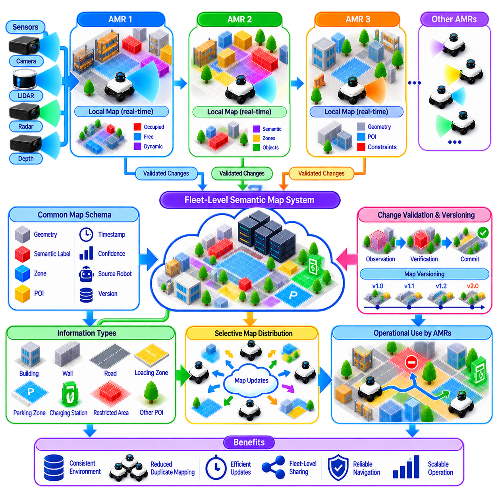{width="7.268055555555556in" height="7.268055555555556in"}

An AMR fleet can use semantic map sharing to transform individual robot observations into a continuously maintained representation of a common operating environment. Each robot collects occupancy, geometric, semantic, and operational information while performing normal missions, then contributes validated map information to a shared fleet map. The objective is not to continuously transmit complete sensor streams, but to exchange useful spatial knowledge such as persistent structures, zones, POIs, navigation constraints, and verified environmental changes.

A practical fleet architecture separates robot-local mapping from shared semantic-map management. Each AMR maintains a local representation for immediate navigation and safety, while a fleet-level system maintains a persistent semantic representation of the operating site. Local maps can therefore respond rapidly to dynamic obstacles without immediately modifying the common map. Stable observations and verified changes are selectively promoted to the shared representation according to confidence, persistence, spatial consistency, and operational importance.

Map sharing begins with a common coordinate reference and consistent map schema. Robots must associate their observations with the same global frame so that a charging station detected by one AMR corresponds to the same spatial entity recognized by another. The shared representation should define consistent structures for geometry, semantic labels, zones, POIs, timestamps, confidence, source robot, and version information. Without such consistency, individually accurate maps can become difficult to merge and may introduce duplicated or spatially conflicting entities.

During normal operation, robots can continuously collect observations without requiring a dedicated mapping mission. An AMR navigating a warehouse may observe relocated shelves, newly blocked aisles, changed loading areas, or modified charging locations. Another robot may later observe the same region from a different viewpoint. These independent observations can be accumulated as evidence rather than immediately changing the authoritative fleet map. This approach allows routine robot operation to become a source of continuous environmental verification.

Change validation is particularly important before distributing updates across the fleet. A single observation may be affected by localization error, temporary occlusion, sensor noise, or a transient object. A candidate change can therefore remain provisional until repeated observations confirm that it is persistent and spatially consistent. Confidence can increase when multiple robots or different sensor modalities observe the same change. Once verification reaches the required threshold, the change can be committed to a new semantic-map version.

Fleet-level sharing should distinguish persistent information from dynamic information. Building structures, permanent equipment, charging stations, and stable zones can be distributed as persistent knowledge. Pedestrians, forklifts, moving vehicles, and temporary obstacles should generally remain within dynamic or local layers rather than becoming permanent fleet-map entities. This separation reduces unnecessary network traffic and prevents short-lived observations from contaminating the shared long-term semantic representation.

Semantic information can provide operational value beyond geometric mapping. A shared map may contain loading zones, restricted areas, pedestrian zones, preferred routes, charging locations, inspection points, docking positions, and other POIs. These entities can be associated with attributes such as access permissions, speed constraints, availability, preferred behavior, or operational schedules. When distributed consistently, such information allows multiple AMRs to interpret the same facility according to a common spatial and operational model.

The fleet system should also support version control and conflict resolution. Two robots may observe different states of the same region, or one robot may operate with an older map version while another has already confirmed an update. Each update can therefore include a map version, timestamp, source information, confidence, and change history. The fleet manager can compare these records, determine whether observations are compatible, and prevent an outdated robot state from unintentionally overwriting newer validated information.

Map distribution should be selective rather than indiscriminate. A robot operating in one warehouse zone may not need the complete semantic map of every other zone. The fleet system can distribute map updates according to robot location, mission requirements, operational permissions, and the spatial extent of each change. Localized updates reduce communication load while allowing robots to receive the information necessary for their current and upcoming tasks.

A robust fleet-sharing system should continue operating when communication is intermittent. Robots may temporarily lose network connectivity while continuing autonomous operation with their most recent valid local map. New observations and candidate changes can be stored locally and synchronized when communication becomes available. The synchronization process should reconcile map versions and preserve provenance rather than simply replacing the entire map with the latest received copy.

The shared semantic map can also support fleet-level navigation consistency. When a restricted region, preferred route, charging station, or operational zone changes, the validated update can be propagated to multiple AMRs so that their navigation systems operate from a consistent environmental description. This does not eliminate the need for local perception because dynamic conditions still require immediate sensing, but it reduces repeated discovery of persistent environmental information by individual robots.

A practical implementation can therefore be organized as a continuous loop of observation, local mapping, change detection, verification, versioning, distribution, and local adaptation. AMRs contribute new evidence during normal operation, the fleet-level system validates and manages persistent knowledge, and individual robots consume relevant updates according to their operational context. This creates a distributed semantic-map lifecycle in which mapping is no longer an isolated initialization step but an ongoing part of fleet operation.

For an AMR deployment, the value of semantic-map fleet sharing ultimately depends on reliability, consistency, update latency, communication efficiency, and the quality of change validation. The architecture should preserve local autonomy for immediate safety while using shared semantic knowledge to reduce duplicated mapping effort and maintain a common operational representation. This case therefore extends long-term semantic-map maintenance into fleet-level spatial knowledge management and provides a practical connection between perception, navigation, map management, and multi-AMR operations.

AMR 플릿(AMR Fleet)은 의미 지도 공유(Semantic Map Sharing)를 활용하여 개별 로봇의 관측값을 공통 운용 환경에 대한 지속적으로 유지되는 표현으로 전환할 수 있다. 각 로봇은 정상적인 임무를 수행하면서 점유(Occupancy), 기하학(Geometry), 의미 정보(Semantic Information), 운용 정보(Operational Information)를 수집하고, 검증된 지도 정보를 공유 플릿 지도(Shared Fleet Map)에 제공한다. 여기서 목적은 전체 센서 스트림을 지속적으로 전송하는 것이 아니라 지속적인 구조물(Persistent Structure), Zone, POI, 내비게이션 제약(Navigation Constraint), 검증된 환경 변화(Verified Environmental Change)와 같은 유용한 공간 지식(Spatial Knowledge)을 교환하는 것이다.

실용적인 플릿 아키텍처(Fleet Architecture)는 로봇 로컬 지도화(Robot-Local Mapping)와 공유 의미 지도 관리(Shared Semantic-Map Management)를 분리한다. 각 AMR은 즉각적인 내비게이션과 안전을 위해 로컬 표현(Local Representation)을 유지하는 반면, 플릿 수준 시스템(Fleet-Level System)은 운용 사이트에 대한 지속적인 의미 표현(Persistent Semantic Representation)을 관리한다. 따라서 로컬 지도는 동적 장애물(Dynamic Obstacle)에 신속하게 대응하면서도 공통 지도를 즉시 수정하지 않을 수 있다. 안정적인 관측값과 검증된 변화만 신뢰도(Confidence), 지속성(Persistence), 공간적 일관성(Spatial Consistency), 운용상 중요도(Operational Importance)에 따라 선택적으로 공유 표현으로 승격된다.

지도 공유(Map Sharing)는 공통 좌표 기준(Common Coordinate Reference)과 일관된 지도 스키마(Map Schema)에서 시작된다. 로봇은 자신의 관측값을 동일한 전역 좌표계(Global Frame)에 연결하여 한 AMR이 감지한 충전 스테이션(Charging Station)이 다른 AMR이 인식한 동일한 공간 객체에 대응하도록 해야 한다. 공유 표현은 기하 정보(Geometry), 의미 Label(Semantic Label), Zone, POI, 타임스탬프(Timestamp), 신뢰도(Confidence), 관측 로봇(Source Robot), 버전 정보(Version Information)를 일관된 구조로 정의해야 한다. 이러한 일관성이 없으면 개별적으로 정확한 지도도 병합하기 어려워지며 중복되거나 공간적으로 충돌하는 객체가 생성될 수 있다.

정상 운용 중 로봇은 별도의 지도화 임무를 요구하지 않고 지속적으로 관측값을 수집할 수 있다. 창고를 이동하는 AMR은 재배치된 선반, 새롭게 막힌 통로, 변경된 적재 구역, 변경된 충전 위치 등을 관측할 수 있다. 이후 다른 로봇이 다른 관점에서 동일한 영역을 관측할 수 있다. 이러한 독립적인 관측값은 권위 있는 플릿 지도(Authoritative Fleet Map)를 즉시 변경하는 대신 증거(Evidence)로 누적할 수 있다. 이를 통해 정상적인 로봇 운용 자체가 지속적인 환경 검증(Environmental Verification)의 원천이 될 수 있다.

플릿 전체에 갱신 정보를 배포하기 전에 변화 검증(Change Validation)이 특히 중요하다. 하나의 관측값은 위치 추정 오차(Localization Error), 일시적인 가림(Temporary Occlusion), 센서 잡음(Sensor Noise), 일시적인 객체(Transient Object)의 영향을 받을 수 있다. 따라서 후보 변화(Candidate Change)는 반복적인 관측을 통해 해당 변화가 지속적이고 공간적으로 일관적인 것으로 확인될 때까지 잠정적인 상태로 유지할 수 있다. 여러 로봇 또는 서로 다른 센서 모달리티(Sensor Modality)가 동일한 변화를 관측하면 신뢰도가 증가할 수 있다. 검증이 필요한 임계값에 도달하면 해당 변화는 새로운 의미 지도 버전(Semantic-Map Version)에 확정할 수 있다.

플릿 수준 공유(Fleet-Level Sharing)는 지속적인 정보(Persistent Information)와 동적 정보(Dynamic Information)를 구분해야 한다. 건물 구조, 영구 설비, 충전 스테이션, 안정적인 Zone은 지속적인 지식(Persistent Knowledge)으로 배포할 수 있다. 보행자, 지게차, 이동 차량, 임시 장애물은 일반적으로 동적 계층(Dynamic Layer) 또는 로컬 계층(Local Layer)에 유지하고 지속적인 플릿 지도 객체로 만들지 않아야 한다. 이러한 분리는 불필요한 네트워크 트래픽(Network Traffic)을 줄이고 단기적인 관측값이 장기적인 공유 의미 표현(Shared Semantic Representation)을 오염시키는 것을 방지한다.

의미 정보(Semantic Information)는 기하학적 지도화(Geometric Mapping)를 넘어 운용상의 가치를 제공할 수 있다. 공유 지도에는 적재 구역(Loading Zone), 출입 제한 구역(Restricted Area), 보행자 영역(Pedestrian Zone), 선호 경로(Preferred Route), 충전 위치(Charging Location), 검사 지점(Inspection Point), 도킹 위치(Docking Position), 기타 POI를 포함할 수 있다. 이러한 객체에는 접근 권한(Access Permission), 속도 제약(Speed Constraint), 가용 상태(Availability), 선호 행동(Preferred Behavior), 운용 일정(Operational Schedule) 등의 속성을 연결할 수 있다. 이러한 정보를 일관되게 배포하면 여러 AMR이 동일한 시설을 공통의 공간 및 운용 모델(Common Spatial and Operational Model)에 따라 해석할 수 있다.

플릿 시스템(Fleet System)은 버전 관리(Version Control)와 충돌 해결(Conflict Resolution)도 지원해야 한다. 두 로봇이 동일한 영역에 대해 서로 다른 상태를 관측할 수 있으며, 한 로봇이 이전 지도 버전을 사용하는 동안 다른 로봇은 이미 갱신을 확정했을 수도 있다. 따라서 각 갱신에는 지도 버전(Map Version), 타임스탬프, 정보 출처(Source Information), 신뢰도, 변경 이력(Change History)을 포함할 수 있다. 플릿 관리 시스템(Fleet Manager)은 이러한 기록을 비교하여 관측값이 서로 호환되는지를 판단하고, 오래된 로봇 상태가 새롭게 검증된 정보를 의도하지 않게 덮어쓰는 것을 방지할 수 있다.

지도 배포(Map Distribution)는 무차별적인 방식이 아니라 선택적으로 수행되어야 한다. 특정 창고 Zone에서 운용되는 로봇은 다른 모든 Zone의 전체 의미 지도를 필요로 하지 않을 수 있다. 플릿 시스템은 로봇의 위치, 임무 요구사항, 운용 권한, 각 변화의 공간적 범위에 따라 지도 갱신 정보를 배포할 수 있다. 지역적으로 제한된 갱신(Localised Update)은 통신 부하를 줄이면서도 로봇이 현재 및 예정된 임무에 필요한 정보를 수신하도록 할 수 있다.

강건한 플릿 공유 시스템(Robust Fleet-Sharing System)은 통신이 간헐적으로 중단되는 상황에서도 계속 동작할 수 있어야 한다. 로봇은 일시적으로 네트워크 연결(Network Connectivity)을 잃더라도 가장 최근의 유효한 로컬 지도를 사용하여 자율 운용을 계속할 수 있다. 새로운 관측값과 후보 변화는 로컬에 저장하고 통신이 복구되었을 때 동기화(Synchronization)할 수 있다. 이 동기화 과정에서는 단순히 전체 지도를 최신 수신본으로 교체하는 대신 지도 버전을 조정하고 정보의 출처(Provenance)를 보존해야 한다.

공유 의미 지도(Shared Semantic Map)는 플릿 수준의 내비게이션 일관성(Navigation Consistency)도 지원할 수 있다. 출입 제한 영역, 선호 경로, 충전 스테이션, 운용 Zone이 변경되면 검증된 갱신 정보를 여러 AMR에 전파하여 이들의 내비게이션 시스템이 일관된 환경 표현(Environmental Representation)을 기반으로 동작하도록 할 수 있다. 그러나 이것이 로컬 인지(Local Perception)의 필요성을 제거하는 것은 아니다. 동적 환경은 여전히 즉각적인 센싱이 필요하기 때문이다. 다만 개별 로봇이 지속적인 환경 정보를 반복적으로 발견해야 하는 부담을 줄일 수 있다.

실용적인 구현은 관측(Observation), 로컬 지도화(Local Mapping), 변화 검출(Change Detection), 검증(Verification), 버전 관리(Versioning), 배포(Distribution), 로컬 적응(Local Adaptation)이 지속적으로 반복되는 루프로 구성할 수 있다. AMR은 정상적인 운용 과정에서 새로운 증거를 제공하고, 플릿 수준 시스템은 지속적인 지식을 검증하고 관리하며, 개별 로봇은 자신의 운용 상황에 따라 관련 갱신 정보를 사용한다. 이를 통해 지도화는 더 이상 초기화 단계에서 한 번 수행하는 독립적인 작업이 아니라 플릿 운용의 지속적인 일부가 되는 분산 의미 지도 생명주기(Distributed Semantic-Map Lifecycle)를 구성할 수 있다.

AMR 운용에서 의미 지도 플릿 공유(Semantic-Map Fleet Sharing)의 실질적인 가치는 신뢰성(Reliability), 일관성(Consistency), 갱신 지연(Update Latency), 통신 효율(Communication Efficiency), 변화 검증 품질(Quality of Change Validation)에 의해 결정된다. 아키텍처는 즉각적인 안전을 위해 로컬 자율성(Local Autonomy)을 유지하면서 공유 의미 지식을 활용하여 중복된 지도화 작업을 줄이고 공통 운용 표현(Common Operational Representation)을 유지해야 한다. 따라서 이 사례는 장기 의미 지도 유지관리(Long-Term Semantic Map Maintenance)를 플릿 수준 공간 지식 관리(Fleet-Level Spatial Knowledge Management)로 확장하며, 인지(Perception), 내비게이션(Navigation), 지도 관리(Map Management), 다중 AMR 운용(Multi-AMR Operations)을 연결하는 실용적인 구조를 제공한다.
