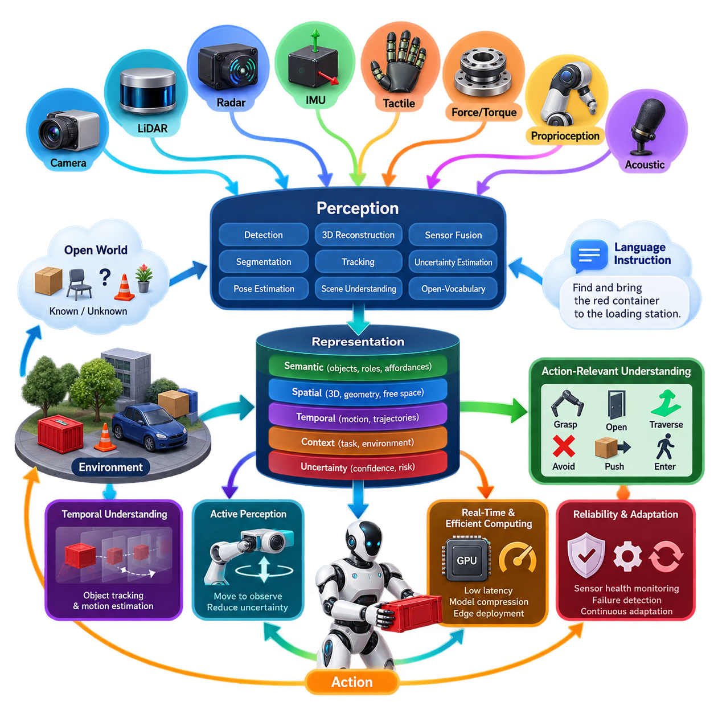
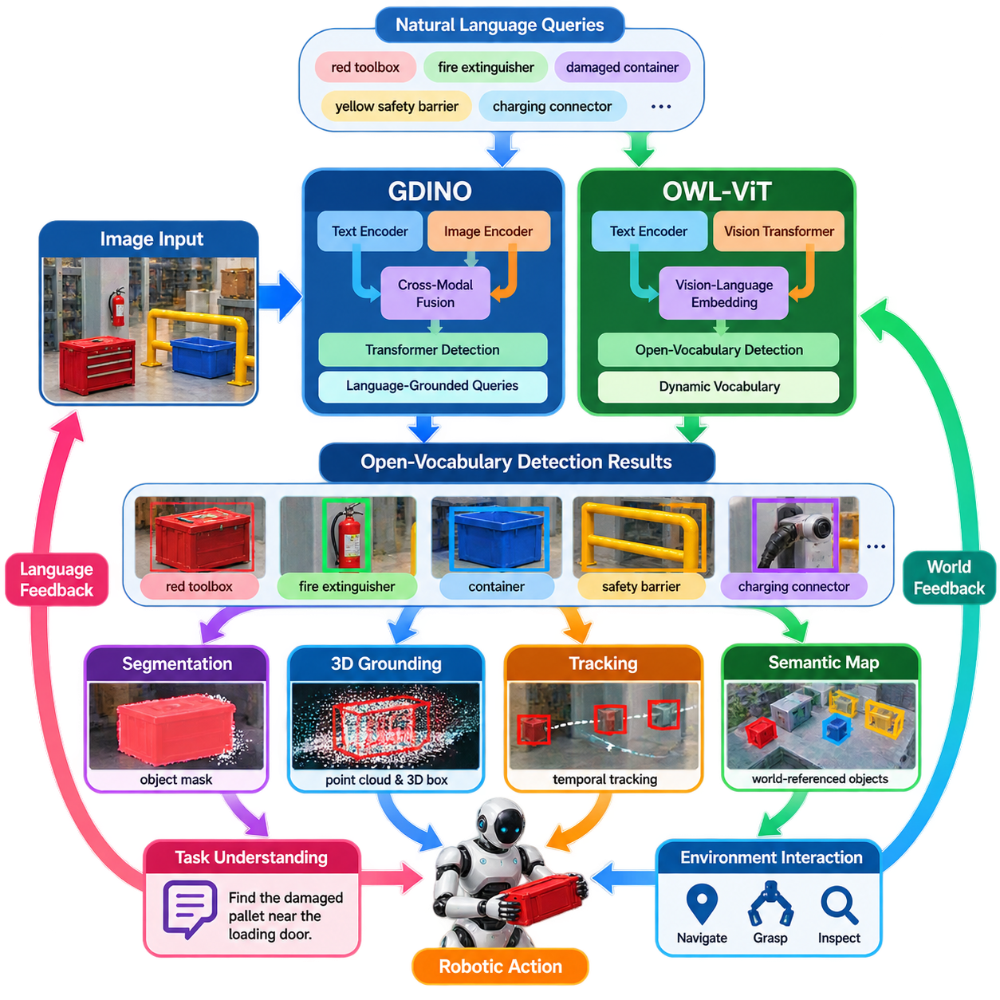
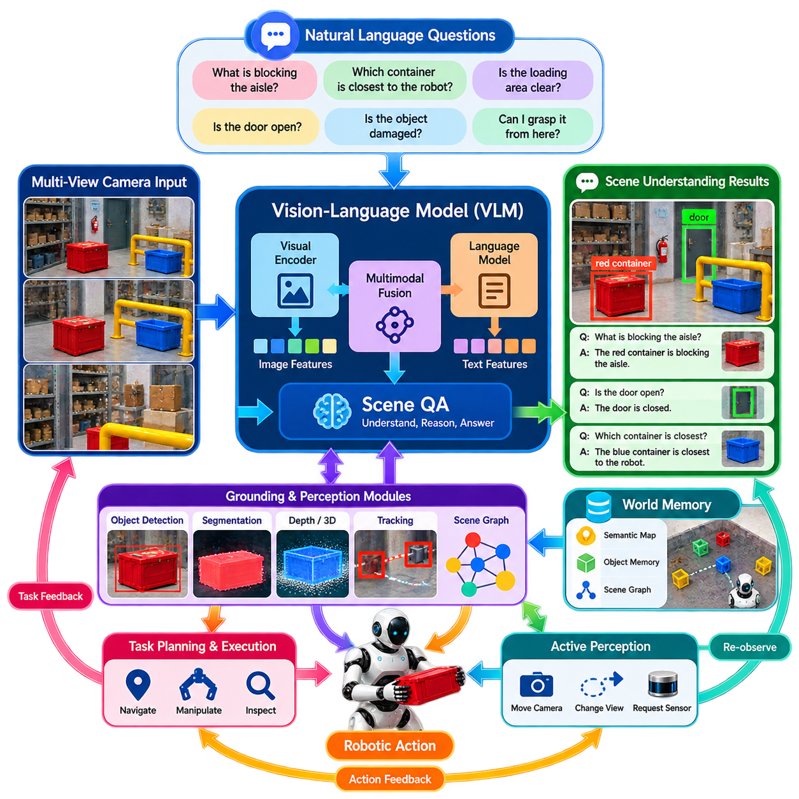
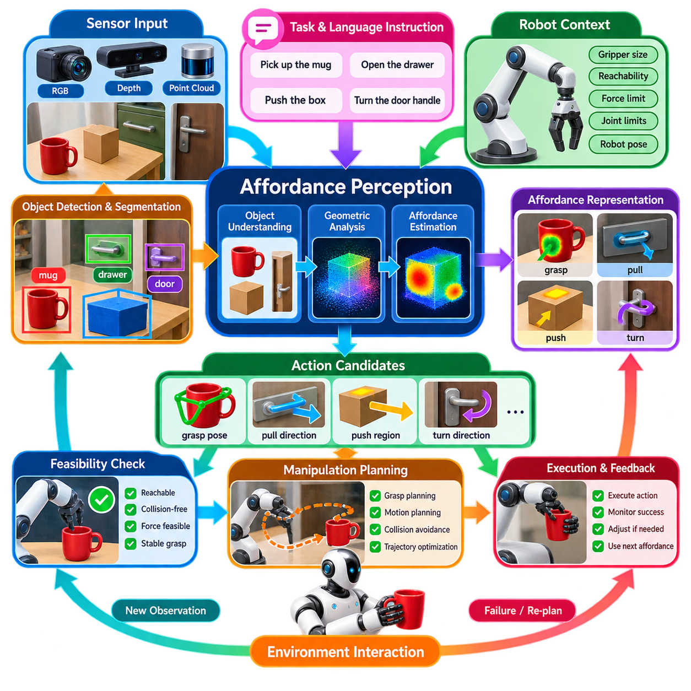
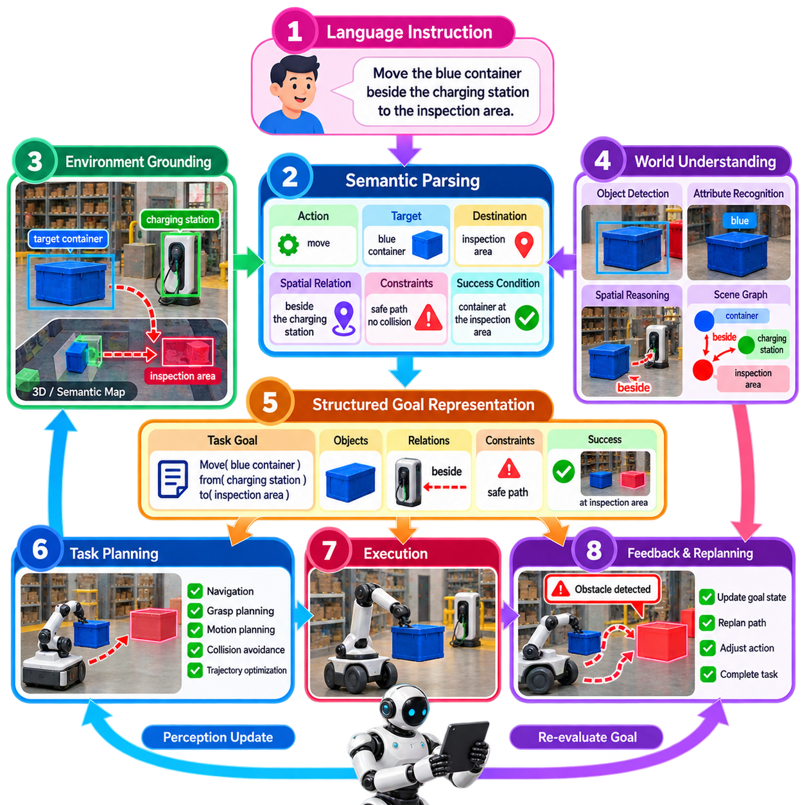
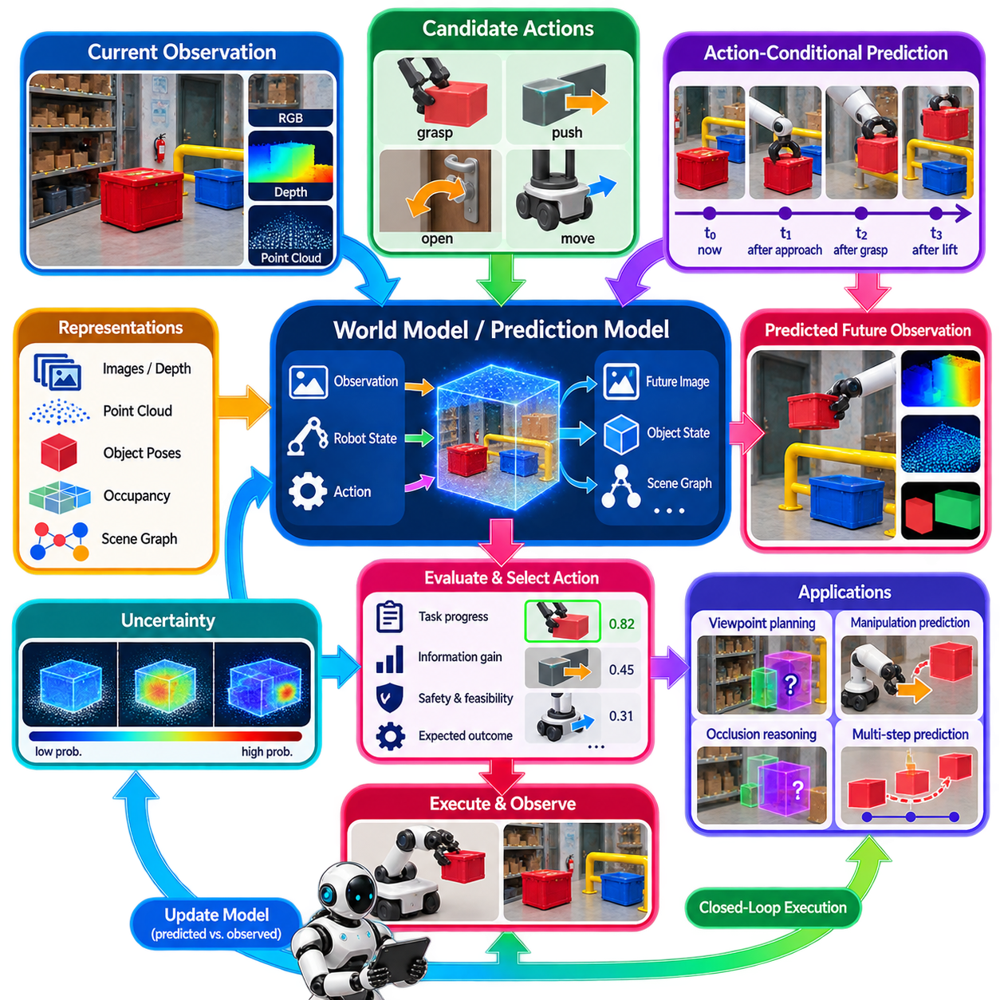
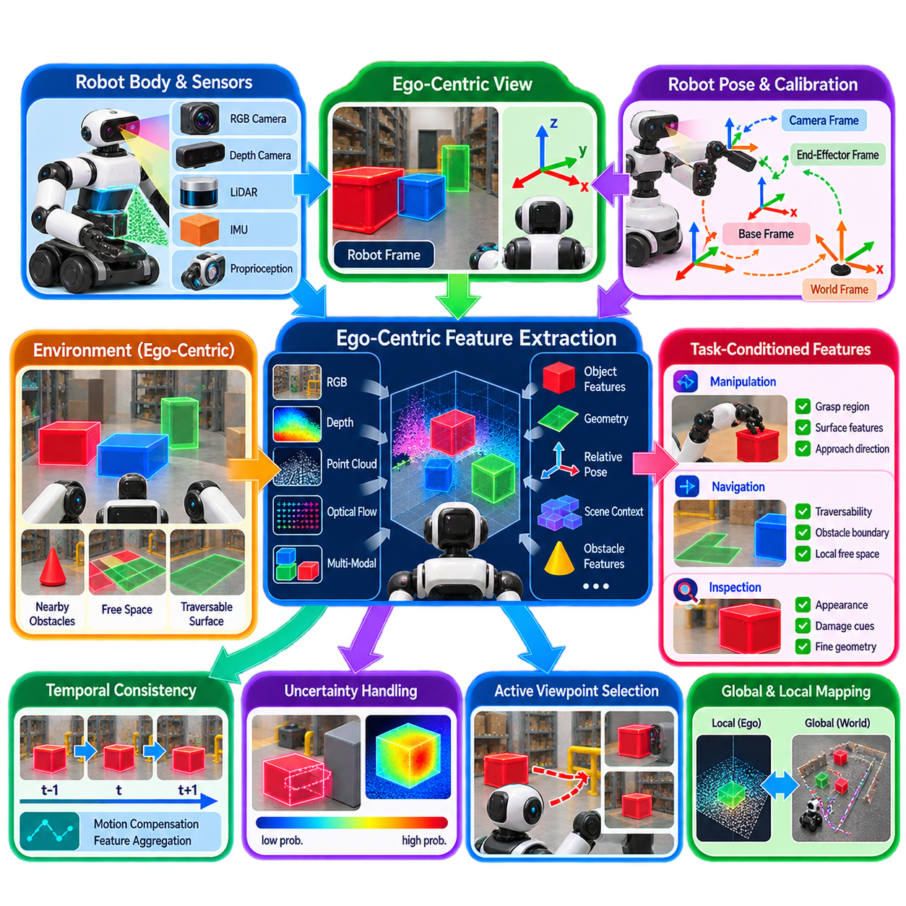
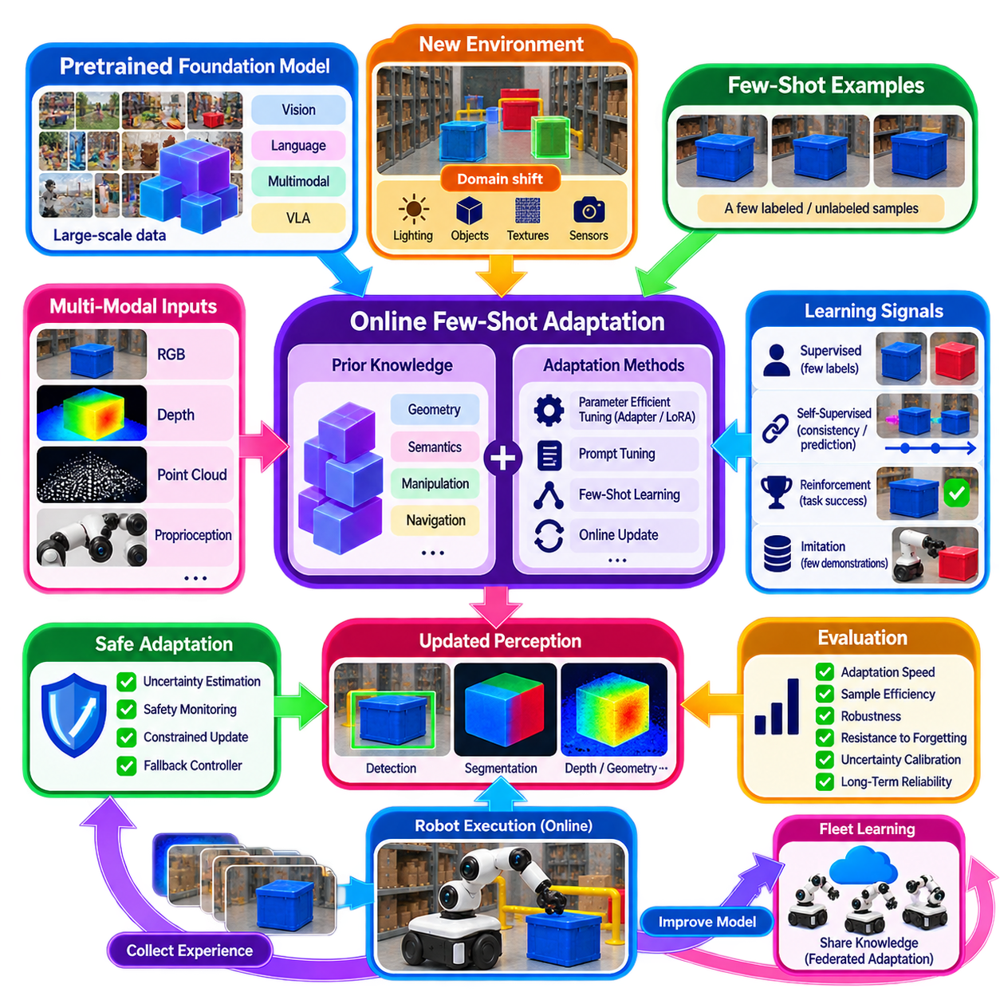
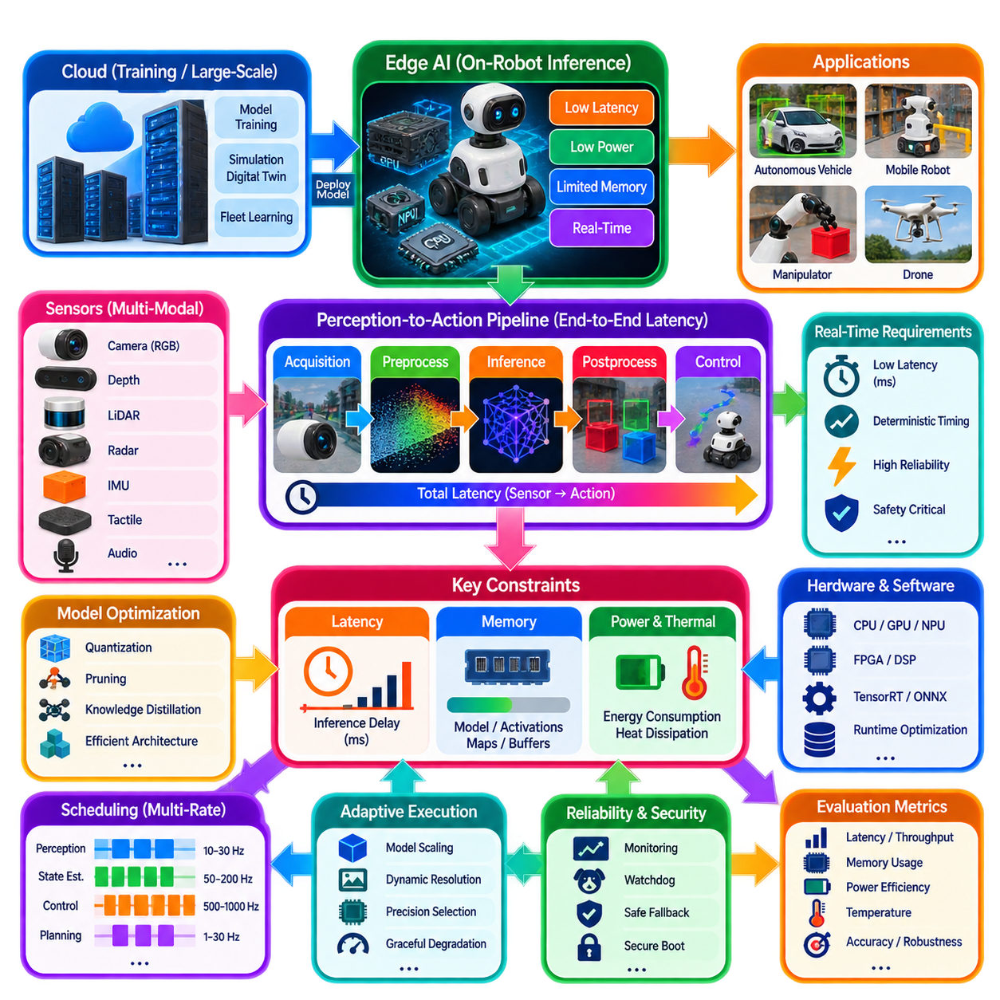
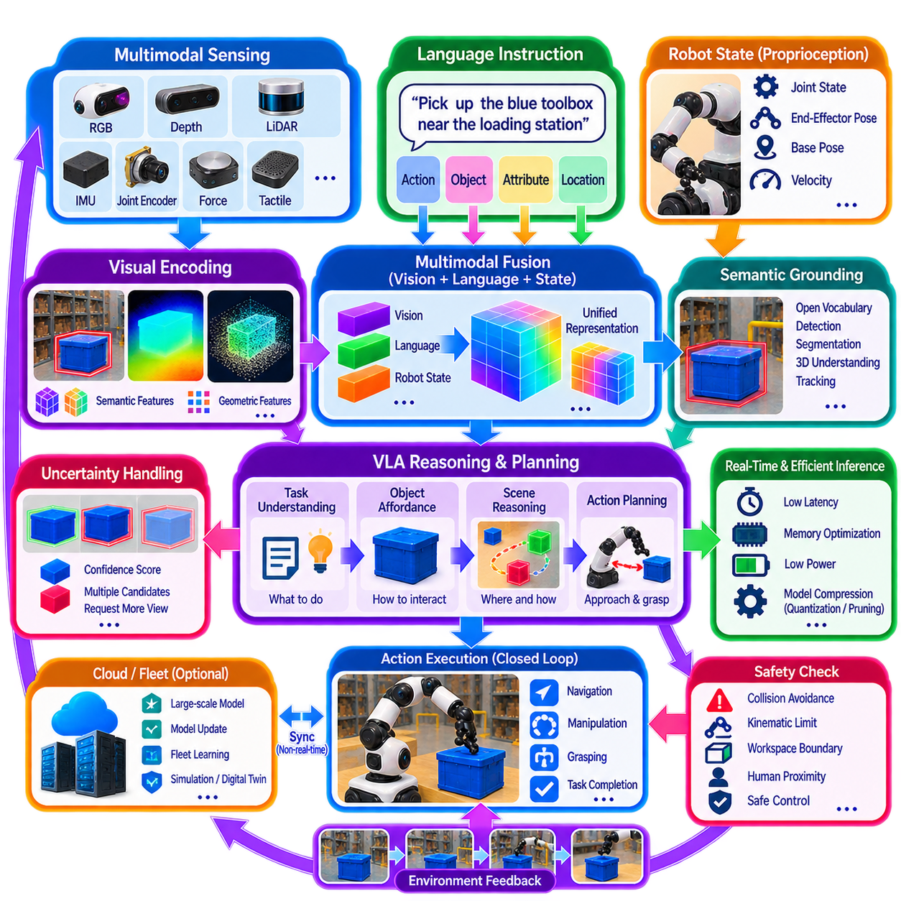

**Volume 14. Perception and Sensor Fusion**


# Chapter 09. Perception for Physical AI

##  

## 09.01. Perception Requirements for Physical AI Systems

{width="7.268055555555556in" height="7.268055555555556in"}

Physical AI systems require perception to serve as an active interface between intelligence and the physical world rather than as a passive sensing subsystem. A conventional perception pipeline may focus on detecting objects, estimating geometry, or recognizing predefined classes. Physical AI must additionally determine what environmental states mean for the robot's current goal, what interactions are possible, and which observations are relevant to future actions.

The required representation therefore extends beyond geometric reconstruction and semantic labeling. A Physical AI agent must combine spatial structure, object identity, motion, physical properties, relationships, uncertainty, and task context into representations that can support reasoning and action. Metric information such as position, distance, orientation, velocity, and free space must coexist with semantic concepts such as object roles, functional regions, hazards, tools, containers, destinations, and interaction targets.

Perception must also operate under an open-world assumption. Robots deployed in homes, factories, hospitals, warehouses, outdoor infrastructure, or public spaces inevitably encounter objects, configurations, and events that were not represented explicitly during training. The system must distinguish between known observations, unfamiliar but interpretable observations, and situations for which confidence is insufficient. This requirement motivates open-vocabulary recognition, vision-language representations, novelty detection, and uncertainty-aware reasoning.

Physical AI perception is fundamentally multimodal because no individual sensor provides sufficient information across all operating conditions. Cameras provide appearance and semantic richness, LiDAR supplies accurate spatial geometry, radar contributes robust range and velocity information, and inertial sensors capture high-rate platform motion. Tactile, force, torque, proprioceptive, acoustic, and other sensors may become equally important when the robot physically interacts with objects or operates near humans.

Temporal understanding is another essential requirement. A robot cannot treat every sensor frame as an independent snapshot because the physical world evolves continuously. Perception must maintain object identities, estimate trajectories, recognize changes, distinguish static structures from dynamic agents, and preserve useful information when observations become temporarily unavailable. Temporal fusion allows the system to infer persistent state rather than repeatedly reconstructing reality from isolated measurements.

Unlike purely visual AI, Physical AI requires perception to be tightly coupled with action. The significance of an observation depends on what the robot intends to do next. A chair may represent an obstacle during navigation, a landmark during localization, or an interaction target for a manipulation task. Perception should therefore expose action-relevant information and support affordance reasoning that estimates where an object can be grasped, traversed, pushed, opened, entered, avoided, or otherwise physically manipulated.

Three-dimensional spatial consistency is particularly important because actions must be executed in physical coordinates. Semantic recognition alone cannot reliably guide locomotion or manipulation unless recognized entities are associated with position, orientation, scale, geometry, and surrounding free space. Physical AI perception must consequently connect image-space features and language-level concepts with metric 3D representations such as point clouds, voxels, meshes, occupancy fields, object poses, and scene graphs.

The perception system must furthermore communicate uncertainty rather than presenting every estimate as equally reliable. Sensor noise, occlusion, adverse weather, reflective surfaces, motion blur, calibration drift, domain shift, and unfamiliar objects can all degrade observations. Confidence should propagate from sensing and inference into mapping, planning, reasoning, and control so that downstream components can slow the robot, request another viewpoint, select another sensor, or invoke a safe fallback behavior when evidence is inadequate.

Active perception becomes necessary when the current observation does not provide enough information for a reliable decision. Instead of accepting ambiguity, the robot can move its camera, reposition its body, approach an object, illuminate a region, change viewpoint, or physically probe an environment. Perception therefore becomes part of a closed perception-action loop in which sensing influences action and action deliberately improves subsequent sensing, reducing uncertainty before consequential physical interaction.

Physical AI also introduces language-conditioned perception requirements. Instructions such as "bring the damaged red container near the loading station" require the robot to connect linguistic descriptions with visual observations, spatial relationships, object attributes, and task context. Vision-language models can provide broad semantic grounding, but their outputs must ultimately connect to geometrically consistent entities and physically executable actions rather than remaining abstract textual descriptions.

A robust system must preserve multiple levels of representation simultaneously. Fast geometric representations may support collision avoidance and local control, object-level representations can support manipulation and tracking, semantic maps provide task context, while vision-language embeddings enable flexible recognition and reasoning. These representations operate at different spatial scales, update rates, and computational costs, so the architecture must determine which information requires immediate processing and which can be evaluated asynchronously.

Real-time behavior imposes strict computational requirements because perception lies directly in the control loop. High-resolution cameras, dense point clouds, multimodal fusion, foundation models, and temporal reasoning can easily exceed available edge-computing resources. Physical AI perception therefore requires explicit latency budgets, scheduling, hardware acceleration, model compression, selective inference, asynchronous pipelines, and graceful degradation so that computational complexity never prevents the robot from maintaining essential safety-related environmental awareness.

Perception must remain reliable when individual sensors or algorithms degrade. Redundant sensing alone is insufficient if multiple modules share correlated failure modes or if the system cannot identify which estimate has become unreliable. Sensor-health monitoring, calibration validation, plausibility checking, cross-modal consistency tests, failure detection and isolation, and fallback representations should therefore be integrated into the perception architecture rather than added only after nominal performance has been achieved.

Continuous adaptation is also required because real deployment environments differ from training datasets and continue changing after deployment. Lighting, weather, floor conditions, object appearance, sensor aging, camera contamination, facility layouts, and operational routines can create persistent distribution shifts. Physical AI systems should detect these changes and support controlled adaptation through updated models, few-shot learning, map maintenance, experience replay, or human-assisted correction without sacrificing previously validated behavior.

The ultimate requirement is not maximum recognition accuracy in isolation but sufficient situational understanding for reliable physical decision making. A useful perception system must answer not only "What is present?" but also "Where is it?", "How is it changing?", "What can the robot do with it?", "How certain is the estimate?", and "What should be observed next?" This action-oriented interpretation distinguishes Physical AI perception from conventional computer vision and connects sensing directly with reasoning, planning, control, and embodied intelligence. :chatgpt-content-reference{index="0"}

피지컬 AI(Physical AI) 시스템에서 인지(Perception)는 수동적인 센싱 하위 시스템(Passive Sensing Subsystem)이 아니라 지능(Intelligence)과 물리적 세계(Physical World)를 연결하는 능동적 인터페이스(Active Interface) 역할을 수행해야 한다. 기존의 인지 파이프라인(Perception Pipeline)이 객체 검출(Object Detection), 기하 구조 추정(Geometry Estimation), 사전에 정의된 클래스(Class)의 인식에 집중했다면, 피지컬 AI는 환경 상태가 현재 로봇의 목표에 어떤 의미를 갖는지, 어떠한 상호작용이 가능한지, 그리고 미래 행동에 어떤 관측 정보가 중요한지를 추가로 판단해야 한다.

따라서 요구되는 표현(Representation)은 기하학적 재구성(Geometric Reconstruction)과 의미론적 라벨링(Semantic Labeling)을 넘어선다. 피지컬 AI 에이전트(Physical AI Agent)는 공간 구조(Spatial Structure), 객체 정체성(Object Identity), 움직임(Motion), 물리적 속성(Physical Properties), 관계(Relationships), 불확실성(Uncertainty), 작업 맥락(Task Context)을 결합하여 추론(Reasoning)과 행동(Action)을 지원할 수 있는 표현을 구성해야 한다. 위치, 거리, 방향, 속도, 자유 공간(Free Space)과 같은 계량적 정보(Metric Information)는 객체 역할, 기능 영역, 위험 요소, 도구, 컨테이너, 목적지, 상호작용 대상과 같은 의미론적 개념(Semantic Concepts)과 함께 존재해야 한다.

인지(Perception)는 또한 개방형 세계 가정(Open-World Assumption)에서 동작해야 한다. 가정, 공장, 병원, 창고, 실외 인프라 또는 공공장소에 배치된 로봇은 학습 과정에서 명시적으로 표현되지 않았던 객체, 구성, 사건을 필연적으로 만나게 된다. 시스템은 이미 알고 있는 관측(Known Observation), 익숙하지 않지만 해석 가능한 관측(Unfamiliar but Interpretable Observation), 그리고 신뢰도가 충분하지 않은 상황을 구별해야 한다. 이러한 요구사항은 개방형 어휘 인식(Open-Vocabulary Recognition), 비전-언어 표현(Vision-Language Representation), 신규성 검출(Novelty Detection), 불확실성 인지 추론(Uncertainty-Aware Reasoning)의 필요성을 높인다.

피지컬 AI 인지(Physical AI Perception)는 본질적으로 다중 모달(Multimodal)이어야 한다. 어떠한 단일 센서도 모든 운용 조건에서 충분한 정보를 제공할 수 없기 때문이다. 카메라(Camera)는 외관과 풍부한 의미 정보를 제공하고, 라이다(LiDAR)는 정확한 공간 기하 정보를 제공하며, 레이더(Radar)는 강건한 거리 및 속도 정보를 제공한다. 관성 센서(Inertial Sensor)는 높은 주기로 플랫폼의 움직임을 측정한다. 로봇이 객체와 물리적으로 상호작용하거나 사람 주변에서 동작할 경우 촉각(Tactile), 힘(Force), 토크(Torque), 고유수용감각(Proprioception), 음향(Acoustic) 등의 센서 역시 중요한 역할을 수행할 수 있다.

시간적 이해(Temporal Understanding) 역시 핵심 요구사항이다. 물리적 세계는 지속적으로 변화하므로 로봇은 각각의 센서 프레임(Sensor Frame)을 서로 독립적인 순간 영상으로 처리할 수 없다. 인지 시스템은 객체의 정체성을 지속적으로 유지하고, 궤적(Trajectory)을 추정하며, 변화를 인식하고, 정적 구조(Static Structure)와 동적 객체(Dynamic Agent)를 구별해야 한다. 또한 관측이 일시적으로 불가능해지더라도 유용한 정보를 유지해야 한다. 시간 융합(Temporal Fusion)은 시스템이 개별 측정값으로부터 매번 현실을 다시 구성하는 대신 지속적인 상태(Persistent State)를 추론하도록 한다.

순수한 시각 AI(Visual AI)와 달리 피지컬 AI는 인지(Perception)가 행동(Action)과 긴밀하게 결합되어야 한다. 관측 정보의 중요성은 로봇이 다음에 무엇을 하려는지에 따라 달라진다. 의자(Chair)는 주행 중에는 장애물(Obstacle)이 될 수 있고, 위치 추정(Localization)에서는 랜드마크(Landmark)가 될 수 있으며, 조작 작업에서는 상호작용 대상(Interaction Target)이 될 수 있다. 따라서 인지는 행동과 관련된 정보를 제공하고, 객체가 어디에서 파지(Grasp), 통과(Traverse), 밀기(Push), 열기(Open), 진입(Enter), 회피(Avoid) 또는 기타 물리적 조작이 가능한지를 판단하는 어포던스 추론(Affordance Reasoning)을 지원해야 한다.

3차원 공간 일관성(Three-Dimensional Spatial Consistency)은 행동이 실제 물리 좌표(Physical Coordinates)에서 실행되어야 하기 때문에 특히 중요하다. 의미론적 인식(Semantic Recognition)만으로는 인식된 객체가 위치, 방향, 크기, 기하 구조 및 주변 자유 공간과 연결되지 않는 한 이동이나 조작을 안정적으로 안내할 수 없다. 따라서 피지컬 AI 인지는 이미지 공간 특징(Image-Space Features)과 언어 수준 개념(Language-Level Concepts)을 포인트 클라우드(Point Cloud), 복셀(Voxel), 메시(Mesh), 점유 필드(Occupancy Field), 객체 자세(Object Pose), 장면 그래프(Scene Graph)와 같은 계량적 3차원 표현(Metric 3D Representation)에 연결해야 한다.

인지 시스템은 모든 추정값을 동일하게 신뢰할 수 있는 것으로 제시하는 대신 불확실성(Uncertainty)을 함께 전달해야 한다. 센서 노이즈(Sensor Noise), 가림(Occlusion), 악천후(Adverse Weather), 반사 표면(Reflective Surface), 모션 블러(Motion Blur), 보정 오차 누적(Calibration Drift), 도메인 변화(Domain Shift), 익숙하지 않은 객체는 모두 관측 품질을 저하시킬 수 있다. 신뢰도(Confidence)는 센싱과 추론 단계에서 지도 작성(Mapping), 계획(Planning), 추론(Reasoning), 제어(Control) 단계까지 전달되어야 하며, 이를 통해 하위 시스템이 로봇의 속도를 낮추거나, 다른 시점을 확보하거나, 다른 센서를 선택하거나, 증거가 충분하지 않을 때 안전 대체 동작(Safe Fallback Behavior)을 실행할 수 있어야 한다.

현재 관측만으로 신뢰할 수 있는 의사결정에 필요한 정보가 충분하지 않을 경우 능동 인지(Active Perception)가 필요하다. 로봇은 모호성을 그대로 받아들이는 대신 카메라를 움직이고, 몸체의 위치를 변경하며, 객체에 접근하거나, 특정 영역을 조명하거나, 관측 시점(Viewpoint)을 변경하고, 환경을 물리적으로 탐색할 수 있다. 따라서 인지는 센싱(Sensing)이 행동에 영향을 주고 행동이 의도적으로 다음 센싱의 품질을 향상시키는 폐루프 인지-행동 구조(Closed Perception-Action Loop)의 일부가 되며, 중요한 물리적 상호작용 이전에 불확실성을 감소시킨다.

피지컬 AI는 또한 언어 조건부 인지(Language-Conditioned Perception)를 요구한다. 예를 들어 "적재 구역 근처에 있는 손상된 빨간색 컨테이너를 가져와라"와 같은 명령을 수행하려면 로봇은 언어적 설명(Linguistic Description)을 시각 관측(Visual Observation), 공간 관계(Spatial Relationship), 객체 속성(Object Attribute), 작업 맥락(Task Context)과 연결해야 한다. 비전-언어 모델(Vision-Language Model, VLM)은 광범위한 의미론적 그라운딩(Semantic Grounding)을 제공할 수 있지만, 그 결과는 추상적인 텍스트 설명에 머무르지 않고 궁극적으로 기하학적으로 일관된 객체와 물리적으로 실행 가능한 행동에 연결되어야 한다.

강건한 시스템(Robust System)은 여러 수준의 표현(Multiple Levels of Representation)을 동시에 유지해야 한다. 빠른 기하학적 표현(Geometric Representation)은 충돌 회피(Collision Avoidance)와 로컬 제어(Local Control)를 지원할 수 있고, 객체 수준 표현(Object-Level Representation)은 조작과 추적을 지원할 수 있으며, 의미 지도(Semantic Map)는 작업 맥락을 제공한다. 비전-언어 임베딩(Vision-Language Embedding)은 유연한 인식과 추론을 가능하게 한다. 이러한 표현은 서로 다른 공간적 규모, 갱신 주기, 계산 비용을 가지므로 아키텍처는 어떤 정보를 즉시 처리해야 하고 어떤 정보를 비동기적으로 평가할 수 있는지를 결정해야 한다.

실시간 동작(Real-Time Behavior)은 인지가 제어 루프(Control Loop)에 직접 포함되기 때문에 엄격한 계산 요구사항을 발생시킨다. 고해상도 카메라, 밀집 포인트 클라우드(Dense Point Cloud), 다중 모달 융합(Multimodal Fusion), 파운데이션 모델(Foundation Model), 시간적 추론(Temporal Reasoning)은 엣지 컴퓨팅(Edge Computing)의 가용 자원을 쉽게 초과할 수 있다. 따라서 피지컬 AI 인지는 명시적인 지연시간 예산(Latency Budget), 스케줄링(Scheduling), 하드웨어 가속(Hardware Acceleration), 모델 압축(Model Compression), 선택적 추론(Selective Inference), 비동기 파이프라인(Asynchronous Pipeline), 점진적 성능 저하(Graceful Degradation)를 필요로 하며, 계산 복잡성이 필수적인 안전 관련 환경 인식을 방해하지 않도록 해야 한다.

개별 센서나 알고리즘의 성능이 저하되더라도 인지 시스템은 신뢰성을 유지해야 한다. 여러 센서를 중복하여 사용하는 것만으로는 충분하지 않으며, 다수의 모듈이 서로 연관된 고장 모드(Correlated Failure Mode)를 공유하거나 시스템이 어떤 추정값의 신뢰성이 저하되었는지를 식별하지 못한다면 중복성의 효과는 제한된다. 따라서 센서 상태 모니터링(Sensor-Health Monitoring), 보정 검증(Calibration Validation), 타당성 검사(Plausibility Checking), 교차 모달 일관성 검사(Cross-Modal Consistency Test), 고장 검출 및 격리(Failure Detection and Isolation), 대체 표현(Fallback Representation)을 인지 아키텍처에 통합해야 한다.

실제 배치 환경은 학습 데이터셋(Training Dataset)과 다르고 배치 이후에도 계속 변화하기 때문에 지속적 적응(Continuous Adaptation) 역시 필요하다. 조명, 날씨, 바닥 상태, 객체 외관, 센서 노화(Sensor Aging), 카메라 오염, 시설 배치, 운영 절차의 변화는 지속적인 분포 변화(Distribution Shift)를 발생시킬 수 있다. 피지컬 AI 시스템은 이러한 변화를 감지하고 기존에 검증된 동작을 훼손하지 않으면서 모델 업데이트, 소수 샷 학습(Few-Shot Learning), 지도 유지관리(Map Maintenance), 경험 재생(Experience Replay), 인간 보조 수정(Human-Assisted Correction) 등을 통한 통제된 적응(Controlled Adaptation)을 지원해야 한다.

궁극적인 요구사항은 개별적인 인식 정확도(Recognition Accuracy)를 최대화하는 것이 아니라 신뢰할 수 있는 물리적 의사결정(Physical Decision Making)에 충분한 상황 이해(Situational Understanding)를 확보하는 것이다. 유용한 인지 시스템은 단순히 "무엇이 존재하는가?"뿐만 아니라 "어디에 있는가?", "어떻게 변화하고 있는가?", "로봇이 그것을 이용해 무엇을 할 수 있는가?", "이 추정은 얼마나 확실한가?", "다음에는 무엇을 관측해야 하는가?"라는 질문에도 답할 수 있어야 한다. 이러한 행동 지향적 해석(Action-Oriented Interpretation)이 피지컬 AI 인지를 기존 컴퓨터 비전(Computer Vision)과 구별하며, 센싱을 추론, 계획, 제어 및 체화 지능(Embodied Intelligence)과 직접 연결한다.

##  

## 09.02. Open Vocabulary Detection GDINO OWL ViT [w/Code]

{width="7.268055555555556in" height="7.268055555555556in"}

Open-vocabulary detection extends conventional object detection beyond a fixed set of categories defined during model training. Instead of predicting only labels such as person, car, or chair from a closed vocabulary, the detector accepts natural-language concepts as queries and attempts to localize corresponding regions in an image. This capability is especially important for Physical AI systems that must operate in environments containing unfamiliar objects and task-specific concepts.

Traditional detectors usually learn a classification head whose output dimensions correspond directly to predefined training categories. This architecture performs efficiently when deployment conditions match the training taxonomy, but adding a new category commonly requires additional labeled data and retraining or fine-tuning. Open-vocabulary detection replaces this rigid category interface with vision-language representations that compare visual regions against semantic embeddings derived from textual descriptions.

The fundamental mechanism is cross-modal alignment between visual and linguistic feature spaces. An image encoder extracts representations describing candidate objects or spatial regions, while a text encoder transforms words or phrases into semantic vectors. Training encourages visually corresponding and linguistically corresponding representations to become compatible. At inference time, arbitrary textual queries can therefore function as dynamically supplied categories without modifying the detector\'s output layer.

Grounding DINO, commonly abbreviated as GDINO, combines transformer-based object detection with grounded language understanding. Rather than treating category labels as fixed classifier indices, it processes textual prompts and image features jointly to associate language tokens with spatial object candidates. The model can consequently receive phrases such as "red toolbox," "damaged container," or "yellow safety barrier" and return bounding boxes whose visual content corresponds to those descriptions.

The GDINO architecture inherits important concepts from DETR-style detection, including transformer representations and object queries, while introducing language-aware feature interaction. Image features provide spatial evidence and text features specify what the system should search for. Cross-modal fusion allows object localization to depend on linguistic context, enabling the same image to produce different detections when the prompt changes. This makes detection directly configurable by task-level semantic requirements.

Prompt formulation strongly affects open-vocabulary detection behavior. A query containing several object names can request multiple categories simultaneously, while descriptive phrases can narrow the semantic target. However, natural-language flexibility does not guarantee perfect grounding. Ambiguous descriptions, visually similar objects, uncommon terminology, small targets, severe occlusion, and domain-specific equipment can reduce reliability, requiring threshold tuning and downstream geometric or temporal validation.

OWL-ViT approaches open-vocabulary detection through vision-transformer and language-image embedding mechanisms. Its design builds upon large-scale image-text pretraining, allowing textual queries to be compared against visual representations without requiring a conventional fixed-category classifier. Image patches encoded by a Vision Transformer are used to predict object locations and query-dependent classification scores, providing a relatively direct connection between semantic language embeddings and spatial detection.

A major advantage of OWL-ViT is that the category vocabulary can be constructed dynamically at inference time. A robot may search for "fire extinguisher," "charging connector," or "plastic storage bin" even when these concepts are not represented as fixed deployment classes. Multiple textual formulations can also describe similar concepts, enabling applications to construct query sets according to mission context rather than maintaining one permanently defined detector taxonomy.

GDINO and OWL-ViT share the principle of language-conditioned detection but differ in architectural details and practical behavior. GDINO emphasizes grounded text-image feature interaction and transformer-based localization, whereas OWL-ViT derives much of its flexibility from vision-language embedding alignment and Vision Transformer representations. For robotics, model selection should therefore consider target-domain accuracy, prompt sensitivity, inference latency, memory consumption, object scale, and integration complexity rather than vocabulary size alone.

Open-vocabulary detection becomes particularly valuable when integrated with segmentation. A detector can first convert a textual concept into one or more bounding boxes, after which a segmentation model can estimate precise object masks. This detector-to-segmenter pipeline transforms language such as "the blue container beside the robot" into spatially explicit image regions that can subsequently support depth association, point-cloud extraction, pose estimation, grasp planning, or obstacle reasoning.

For Physical AI, a two-dimensional bounding box is rarely sufficient as the final representation. Detection results should be associated with depth, 3D geometry, robot pose, temporal tracks, and semantic maps. Camera detections may be projected into LiDAR or depth measurements to estimate object position, while repeated observations can establish persistent identities. This converts transient language-grounded detections into world-referenced entities that planners and manipulation systems can use.

Open-vocabulary detection also provides an important bridge between language instructions and embodied execution. If a user requests "inspect the damaged pallet near the loading door," a language model can extract relevant concepts and spatial relationships, while the detector grounds candidate objects in sensor observations. Scene understanding can then evaluate relationships such as "near the loading door," allowing linguistic task specifications to become physically meaningful targets for navigation and interaction.

Despite its flexibility, open-vocabulary detection should not be interpreted as unlimited object recognition. Zero-shot performance depends heavily on the visual-language knowledge acquired during pretraining, and semantic similarity can produce false positives between related concepts. Confidence scores are not necessarily calibrated for safety-critical robotic decisions. Unknown industrial components, unusual viewpoints, transparent materials, visually repetitive structures, and specialized terminology may therefore require domain adaptation or additional verification.

Temporal consistency can substantially improve reliability in robotic deployment. A single-frame prediction may fluctuate because of viewpoint changes, motion blur, illumination, or partial occlusion, whereas tracking allows detections to accumulate evidence over time. A robot can combine open-vocabulary scores with motion models, depth consistency, geometric constraints, and historical observations. Persistent disagreement can then trigger re-observation, alternative prompts, or a conservative decision instead of immediate physical action.

Real-time deployment introduces another important constraint because large vision-language detectors can consume significant GPU memory and computational bandwidth. Input resolution, number of text queries, backbone size, precision, batching strategy, and inference frequency all affect latency. Edge systems may therefore run open-vocabulary detection at a lower semantic update rate while conventional lightweight perception maintains high-frequency obstacle detection, tracking, occupancy estimation, and safety monitoring.

A practical Physical AI architecture consequently treats open-vocabulary detection as one component within a hierarchical perception system rather than as a replacement for every specialized detector. Fast closed-set models can handle known safety-critical categories, while GDINO, OWL-ViT, or related models provide flexible semantic discovery for novel and mission-dependent concepts. Their outputs can feed segmentation, 3D grounding, tracking, semantic mapping, VLM reasoning, and ultimately VLA-based action selection.

The broader significance of open-vocabulary detection is that perception categories no longer need to be completely determined when the robot is designed. Language can dynamically specify what information matters for the current task, allowing the perceptual interface to evolve with instructions and environmental context. When combined with geometric grounding, uncertainty estimation, temporal reasoning, and action validation, this capability provides a key transition from fixed-purpose robot vision toward adaptable Physical AI perception.

개방형 어휘 검출(Open-Vocabulary Detection)은 기존 객체 검출(Conventional Object Detection)을 모델 학습 과정에서 정의된 고정된 범주의 집합을 넘어 확장한다. 사람(Person), 자동차(Car), 의자(Chair)와 같은 폐쇄형 어휘(Closed Vocabulary)의 라벨만 예측하는 대신, 검출기는 자연어 개념(Natural-Language Concepts)을 질의(Query)로 받아 이미지에서 해당 영역을 찾는다. 이러한 기능은 익숙하지 않은 객체와 작업별 개념(Task-Specific Concepts)이 존재하는 환경에서 동작해야 하는 피지컬 AI(Physical AI) 시스템에 특히 중요하다.

기존 검출기(Traditional Detector)는 일반적으로 출력 차원이 사전에 정의된 학습 범주와 직접 대응하는 분류 헤드(Classification Head)를 학습한다. 이러한 아키텍처는 배치 환경이 학습 분류 체계(Training Taxonomy)와 일치할 때 효율적으로 동작하지만, 새로운 범주를 추가하려면 일반적으로 추가 라벨 데이터와 재학습(Retraining) 또는 미세조정(Fine-Tuning)이 필요하다. 개방형 어휘 검출은 이러한 경직된 범주 인터페이스를 시각 영역과 텍스트 설명에서 생성된 의미 임베딩(Semantic Embedding)을 비교하는 비전-언어 표현(Vision-Language Representation)으로 대체한다.

핵심 메커니즘은 시각 특징 공간(Visual Feature Space)과 언어 특징 공간(Linguistic Feature Space) 사이의 교차 모달 정렬(Cross-Modal Alignment)이다. 이미지 인코더(Image Encoder)는 후보 객체 또는 공간 영역을 설명하는 표현을 추출하고, 텍스트 인코더(Text Encoder)는 단어나 구문을 의미 벡터(Semantic Vector)로 변환한다. 학습 과정에서는 시각적으로 대응되는 표현과 언어적으로 대응되는 표현이 서로 호환되도록 학습한다. 따라서 추론(Inference) 시 임의의 텍스트 질의가 검출기의 출력 계층을 변경하지 않고 동적으로 제공되는 범주 역할을 수행할 수 있다.

그라운딩 DINO(Grounding DINO), 일반적으로 GDINO라고 부르는 모델은 트랜스포머 기반 객체 검출(Transformer-Based Object Detection)과 그라운딩된 언어 이해(Grounded Language Understanding)를 결합한다. 범주 라벨을 고정된 분류기 인덱스로 처리하는 대신 텍스트 프롬프트(Text Prompt)와 이미지 특징(Image Feature)을 함께 처리하여 언어 토큰(Language Token)을 공간적 객체 후보와 연결한다. 따라서 "빨간 공구함(Red Toolbox)", "손상된 컨테이너(Damaged Container)", "노란색 안전 장벽(Yellow Safety Barrier)"과 같은 구문을 입력받아 해당 설명과 시각적으로 대응하는 바운딩 박스(Bounding Box)를 반환할 수 있다.

GDINO 아키텍처는 트랜스포머 표현(Transformer Representation)과 객체 질의(Object Query)를 포함하여 DETR 계열 검출(DETR-Style Detection)의 중요한 개념을 계승하면서 언어 인식 특징 상호작용(Language-Aware Feature Interaction)을 추가한다. 이미지 특징은 공간적 증거(Spatial Evidence)를 제공하고 텍스트 특징은 시스템이 무엇을 찾아야 하는지를 지정한다. 교차 모달 융합(Cross-Modal Fusion)을 통해 객체 위치 결정이 언어적 맥락에 따라 달라질 수 있으므로 동일한 이미지에서도 프롬프트가 변경되면 서로 다른 검출 결과를 생성할 수 있다. 이를 통해 작업 수준의 의미론적 요구사항(Task-Level Semantic Requirements)에 따라 검출 기능을 직접 구성할 수 있다.

프롬프트 구성(Prompt Formulation)은 개방형 어휘 검출의 동작에 큰 영향을 미친다. 여러 객체 이름이 포함된 질의는 여러 범주를 동시에 요청할 수 있으며, 설명형 구문(Descriptive Phrase)은 의미론적 목표를 더욱 구체화할 수 있다. 그러나 자연어의 유연성이 완벽한 그라운딩(Grounding)을 보장하는 것은 아니다. 모호한 설명, 시각적으로 유사한 객체, 드문 용어, 작은 객체, 심한 가림(Occlusion), 도메인 특화 장비(Domain-Specific Equipment)는 신뢰성을 낮출 수 있으므로 임계값 조정(Threshold Tuning)과 후단의 기하학적 또는 시간적 검증이 필요하다.

OWL-ViT는 비전 트랜스포머(Vision Transformer)와 언어-이미지 임베딩(Language-Image Embedding) 메커니즘을 이용하여 개방형 어휘 검출에 접근한다. 대규모 이미지-텍스트 사전학습(Image-Text Pretraining)을 기반으로 하므로 기존의 고정 범주 분류기 없이도 텍스트 질의를 시각 표현과 비교할 수 있다. 비전 트랜스포머가 인코딩한 이미지 패치(Image Patch)는 객체 위치와 질의 의존적 분류 점수(Query-Dependent Classification Score)를 예측하는 데 사용되며, 의미론적 언어 임베딩과 공간적 검출 사이에 비교적 직접적인 연결을 제공한다.

OWL-ViT의 주요 장점은 추론 시 범주 어휘(Category Vocabulary)를 동적으로 구성할 수 있다는 것이다. 로봇은 이러한 개념이 고정된 배치 범주로 정의되어 있지 않더라도 "소화기(Fire Extinguisher)", "충전 커넥터(Charging Connector)", "플라스틱 보관함(Plastic Storage Bin)" 등을 검색할 수 있다. 유사한 개념을 여러 텍스트 표현으로 기술할 수도 있으므로 애플리케이션은 영구적으로 정의된 하나의 검출기 분류 체계를 유지하는 대신 임무 맥락(Mission Context)에 따라 질의 집합(Query Set)을 구성할 수 있다.

GDINO와 OWL-ViT는 언어 조건부 검출(Language-Conditioned Detection)이라는 원칙을 공유하지만 아키텍처의 세부 구조와 실제 동작 특성에서는 차이가 있다. GDINO는 그라운딩된 텍스트-이미지 특징 상호작용과 트랜스포머 기반 위치 결정에 중점을 두는 반면, OWL-ViT는 비전-언어 임베딩 정렬(Vision-Language Embedding Alignment)과 비전 트랜스포머 표현을 통해 유연성을 확보한다. 따라서 로보틱스(Robotics)에서는 어휘 크기만이 아니라 대상 도메인 정확도(Target-Domain Accuracy), 프롬프트 민감도(Prompt Sensitivity), 추론 지연시간(Inference Latency), 메모리 사용량, 객체 크기, 통합 복잡성 등을 고려하여 모델을 선택해야 한다.

개방형 어휘 검출은 세그멘테이션(Segmentation)과 통합할 때 특히 높은 가치를 제공한다. 검출기가 먼저 텍스트 개념을 하나 이상의 바운딩 박스로 변환한 다음 세그멘테이션 모델이 정확한 객체 마스크(Object Mask)를 추정할 수 있다. 이러한 검출기-세그멘터 파이프라인(Detector-to-Segmenter Pipeline)은 "로봇 옆의 파란색 컨테이너(The Blue Container Beside the Robot)"와 같은 언어 표현을 공간적으로 명확한 이미지 영역으로 변환하고, 이후 깊이 연결(Depth Association), 포인트 클라우드 추출(Point-Cloud Extraction), 자세 추정(Pose Estimation), 파지 계획(Grasp Planning), 장애물 추론(Obstacle Reasoning)을 지원할 수 있다.

피지컬 AI에서는 2차원 바운딩 박스(Two-Dimensional Bounding Box)만으로 최종 표현을 구성하기에는 부족한 경우가 많다. 검출 결과는 깊이(Depth), 3차원 기하 구조(3D Geometry), 로봇 자세(Robot Pose), 시간적 트랙(Temporal Track), 의미 지도(Semantic Map)와 연결되어야 한다. 카메라 검출 결과를 라이다 또는 깊이 측정값에 투영하여 객체 위치를 추정할 수 있으며, 반복적인 관측을 통해 지속적인 객체 정체성(Persistent Identity)을 구성할 수 있다. 이를 통해 일시적인 언어 기반 검출 결과를 계획기와 조작 시스템이 사용할 수 있는 세계 좌표 기반 객체(World-Referenced Entity)로 변환할 수 있다.

개방형 어휘 검출은 언어 명령(Language Instruction)과 체화된 실행(Embodied Execution)을 연결하는 중요한 다리 역할도 한다. 사용자가 "적재 출입구 근처의 손상된 팔레트를 검사하라(Inspect the Damaged Pallet Near the Loading Door)"고 요청하면 언어 모델(Language Model)은 관련 개념과 공간 관계를 추출하고, 검출기는 센서 관측에서 후보 객체를 그라운딩할 수 있다. 이후 장면 이해(Scene Understanding)는 "적재 출입구 근처(Near the Loading Door)"와 같은 관계를 평가하여 언어 기반 작업 명세를 주행 및 상호작용을 위한 물리적으로 의미 있는 목표로 변환할 수 있다.

높은 유연성에도 불구하고 개방형 어휘 검출을 무제한 객체 인식(Unlimited Object Recognition)으로 이해해서는 안 된다. 제로샷 성능(Zero-Shot Performance)은 사전학습 과정에서 획득한 시각-언어 지식에 크게 의존하며, 의미론적 유사성(Semantic Similarity)으로 인해 관련 개념 사이에서 오검출(False Positive)이 발생할 수 있다. 또한 신뢰도 점수(Confidence Score)가 안전 필수 로봇 의사결정에 적합하게 보정되어 있다고 보장할 수 없다. 알려지지 않은 산업용 부품, 특이한 시점, 투명 소재, 시각적으로 반복되는 구조, 전문 용어 등에는 도메인 적응(Domain Adaptation)이나 추가 검증이 필요할 수 있다.

시간적 일관성(Temporal Consistency)은 실제 로봇 배치에서 신뢰성을 크게 향상시킬 수 있다. 단일 프레임 예측은 시점 변화, 모션 블러(Motion Blur), 조명 변화, 부분 가림에 따라 변동할 수 있지만 추적(Tracking)을 이용하면 시간에 따라 검출 증거를 누적할 수 있다. 로봇은 개방형 어휘 점수를 움직임 모델(Motion Model), 깊이 일관성(Depth Consistency), 기하학적 제약(Geometric Constraint), 과거 관측과 결합할 수 있다. 지속적인 불일치가 발생하면 즉시 물리적 행동을 수행하는 대신 재관측(Re-Observation), 대체 프롬프트(Alternative Prompt), 보수적인 의사결정(Conservative Decision)을 실행할 수 있다.

실시간 배치(Real-Time Deployment)에서는 대규모 비전-언어 검출기(Vision-Language Detector)가 상당한 GPU 메모리와 계산 대역폭을 사용할 수 있기 때문에 추가적인 제약이 발생한다. 입력 해상도(Input Resolution), 텍스트 질의 수, 백본 크기(Backbone Size), 정밀도(Precision), 배치 전략(Batching Strategy), 추론 주기(Inference Frequency)는 모두 지연시간에 영향을 준다. 따라서 엣지 시스템(Edge System)은 개방형 어휘 검출을 비교적 낮은 의미 갱신 주기(Semantic Update Rate)로 실행하고, 기존의 경량 인지 시스템은 높은 주기로 장애물 검출, 추적, 점유 추정(Occupancy Estimation), 안전 모니터링을 수행하도록 구성할 수 있다.

따라서 실용적인 피지컬 AI 아키텍처(Physical AI Architecture)는 개방형 어휘 검출을 모든 전문 검출기를 대체하는 기술이 아니라 계층형 인지 시스템(Hierarchical Perception System)의 하나의 구성 요소로 다룬다. 빠른 폐쇄형 모델(Closed-Set Model)은 이미 알려진 안전 필수 범주를 처리하고, GDINO, OWL-ViT 또는 관련 모델은 새로운 개념과 임무 의존적 개념에 대한 유연한 의미 탐색(Semantic Discovery)을 제공할 수 있다. 이러한 출력은 세그멘테이션, 3차원 그라운딩(3D Grounding), 추적, 의미 지도, 비전-언어 모델 추론(VLM Reasoning), 궁극적으로 비전-언어-행동 기반 행동 선택(VLA-Based Action Selection)에 전달될 수 있다.

개방형 어휘 검출의 더 큰 의미는 로봇을 설계하는 시점에 인지 범주(Perception Category)를 완전히 결정할 필요가 없어진다는 데 있다. 언어(Language)는 현재 작업에 중요한 정보가 무엇인지를 동적으로 지정할 수 있으며, 이를 통해 인지 인터페이스(Perceptual Interface)는 명령과 환경 맥락에 따라 변화할 수 있다. 이러한 능력을 기하학적 그라운딩(Geometric Grounding), 불확실성 추정(Uncertainty Estimation), 시간적 추론(Temporal Reasoning), 행동 검증(Action Validation)과 결합하면 고정 목적 로봇 비전(Fixed-Purpose Robot Vision)에서 적응형 피지컬 AI 인지(Adaptable Physical AI Perception)로 전환하기 위한 핵심 기반을 제공한다.

##  

## 09.03. Vision Language Model VLM Based Scene QA [w/Code]

{width="7.268055555555556in" height="7.268055555555556in"}

Vision-Language Model based Scene Question Answering extends robotic perception from recognizing visible entities toward interpreting scenes through natural-language interaction. A VLM receives visual observations together with textual questions and generates answers grounded in the observed environment. For Physical AI, this enables a robot to query its surroundings semantically, asking not only what objects exist but also where they are, how they relate, and whether they matter to the current task.

A typical Scene QA pipeline begins with one or more camera observations processed by a visual encoder. The resulting visual features are aligned or fused with language representations inside a multimodal model, allowing textual tokens to attend to relevant image regions. Questions such as "What is blocking the aisle?", "Which container is closest to the robot?", or "Is the loading area clear?" transform raw perception into task-oriented semantic queries that can support reasoning and action.

The visual encoder converts image content into compact feature representations containing information about objects, attributes, spatial structure, and scene context. Depending on the VLM architecture, these features may originate from Vision Transformers, contrastively pretrained vision encoders, or other foundation-model components. A projection or multimodal adapter commonly maps visual features into a representation that can interact effectively with the language model responsible for interpreting questions and generating responses.

Scene QA differs fundamentally from conventional image classification because the required output is determined dynamically by the question. The same warehouse image may be queried about obstacles, equipment, colors, spatial relationships, safety conditions, or possible interaction targets. Instead of producing one predefined label set, the model interprets visual evidence according to linguistic context, making perception adaptable to changing mission requirements without redesigning a dedicated classifier for every possible semantic question.

For robotics, spatial reasoning is one of the most important capabilities of Scene QA. Questions involving "left of," "behind," "inside," "nearest," or "between" require more than recognizing individual objects. The system must understand relationships among entities and ideally connect image-space reasoning with metric geometry. Depth cameras, LiDAR, object poses, occupancy maps, or 3D scene representations can therefore complement VLM outputs when accurate physical distances and coordinates are required.

Scene QA can also provide relational and functional understanding. A robot may ask whether a door is open, whether a pallet blocks a passage, whether a container appears damaged, or which object could be used for a requested task. These questions connect visual semantics with state, relationships, and potential affordances. Such reasoning is particularly useful for Physical AI because successful behavior depends on understanding how perceived entities influence navigation, manipulation, inspection, and human instructions.

Temporal context becomes important when questions concern events rather than static appearance. A robot may need to determine whether an object has moved, whether a person entered a restricted zone, or whether a previously clear path has become obstructed. Processing isolated images cannot reliably answer many such questions. Scene QA should therefore incorporate tracked objects, recent observations, event histories, or temporally aggregated visual features when reasoning about changing environments.

A VLM can serve as a semantic interface above specialized perception modules rather than replacing them. High-frequency detectors, segmentation networks, depth estimation, tracking, and occupancy mapping can continue producing structured environmental information, while the VLM interprets selected observations at a higher semantic level. This hierarchical architecture combines deterministic geometric processing with flexible language reasoning and avoids requiring a computationally expensive VLM to execute every perception operation at control-loop frequency.

Grounding is essential because a linguistically plausible answer is not necessarily physically correct. When the VLM states that "the red container beside the door is blocking the path," the robot should ideally associate the phrases "red container," "door," and "path" with identifiable spatial entities. Object detectors, open-vocabulary models, segmentation, depth sensing, and scene graphs can provide explicit grounding so that language-level conclusions remain connected to measurable environmental evidence.

Hallucination represents a major limitation when Scene QA is used for Physical AI. A VLM may generate an answer consistent with common knowledge or linguistic patterns even when the corresponding evidence is absent or ambiguous in the sensor data. Such behavior is inconvenient in general visual question answering but potentially dangerous in robotics. The architecture should therefore distinguish observed facts, inferred relationships, uncertain interpretations, and information that cannot be determined from available observations.

Confidence management should consequently be integrated into the Scene QA process. Instead of forcing a definitive answer, the system should permit responses equivalent to "not visible," "uncertain," or "additional observation required." These outcomes can trigger active perception, such as moving the camera, approaching the target, changing viewpoint, or requesting another sensor measurement. Scene QA then becomes part of a perception-action loop rather than a one-directional question-answer interface.

Language questions may originate from humans, planners, autonomous agents, or VLA systems. A human operator might ask "What is in front of the charging station?", while a planner could internally formulate "Is the target graspable from the current pose?" An autonomous reasoning module can similarly generate intermediate questions to resolve uncertainty before selecting an action. Scene QA therefore provides a common semantic interface through which different components can request task-relevant information from perception.

Efficient deployment requires separating semantic reasoning frequency from safety-critical sensing frequency. Large VLMs may require substantial GPU memory, bandwidth, and inference time, whereas obstacle avoidance and motion control often demand much faster updates. A practical Physical AI platform can maintain lightweight perception continuously and invoke Scene QA when semantic interpretation is required. Cached visual embeddings, region selection, reduced image resolution, and event-triggered inference can further reduce computational load.

Scene QA becomes more powerful when connected to persistent world representations. Instead of answering exclusively from the current camera image, the VLM can access semantic maps, object memories, scene graphs, tracked identities, and previously observed states. The robot can then answer questions about objects outside the current field of view, provided that stored information remains valid. This transforms Scene QA from image question answering into query-based access to an embodied world model.

Integration with navigation and manipulation converts Scene QA results into operational decisions. If the system determines that a requested container is behind an obstacle, the planner can select an alternative approach path. If a manipulation query indicates that the visible side of an object is not suitable for grasping, active perception can seek another viewpoint. Semantic answers therefore become useful only when their referenced entities, confidence, and spatial information can be consumed by downstream action modules.

A robust architecture should validate important VLM conclusions using independent perception evidence whenever practical. Object existence can be checked through detection, spatial relationships through geometry, motion through tracking, and free space through occupancy estimation. This cross-checking reduces dependence on unconstrained language generation and allows the system to exploit VLM flexibility while retaining the measurable structure required for reliable robotic operation.

Ultimately, VLM-based Scene QA provides Physical AI with a language-accessible layer of environmental understanding. It allows perception to be queried according to the robot's current goals rather than exposing only predetermined outputs. When combined with grounding, 3D geometry, temporal memory, uncertainty handling, active perception, and specialized real-time modules, Scene QA becomes a practical bridge connecting multimodal sensing with reasoning, planning, human communication, and embodied action.

비전-언어 모델 기반 장면 질의응답(Vision-Language Model based Scene Question Answering)은 로봇 인지를 단순히 눈에 보이는 객체를 인식하는 수준에서 자연어 상호작용을 통해 장면을 해석하는 수준으로 확장한다. VLM은 시각적 관측(Visual Observation)과 텍스트 질문(Textual Question)을 함께 입력받아 관측된 환경에 근거한 답변을 생성한다. 피지컬 AI(Physical AI)에서는 로봇이 주변 환경에 대해 의미론적으로 질의할 수 있도록 하며, 단순히 어떤 객체가 존재하는지뿐만 아니라 객체가 어디에 있는지, 서로 어떤 관계를 가지는지, 현재 작업에 중요한지를 판단할 수 있도록 한다.

일반적인 장면 질의응답(Scene QA) 파이프라인은 하나 이상의 카메라 관측(Camera Observation)을 시각 인코더(Visual Encoder)로 처리하면서 시작한다. 생성된 시각 특징(Visual Feature)은 다중 모달 모델(Multimodal Model) 내부에서 언어 표현(Language Representation)과 정렬되거나 융합되며, 이를 통해 텍스트 토큰(Text Token)이 관련 이미지 영역에 주의를 집중할 수 있다. "통로를 막고 있는 것은 무엇인가?", "로봇에서 가장 가까운 컨테이너는 어느 것인가?", "적재 구역이 비어 있는가?"와 같은 질문은 원시 인지 데이터(Raw Perception)를 작업 지향적 의미 질의(Task-Oriented Semantic Query)로 변환하여 추론과 행동을 지원할 수 있다.

시각 인코더(Visual Encoder)는 객체, 속성, 공간 구조, 장면 맥락에 관한 정보를 포함하는 압축된 특징 표현(Compact Feature Representation)으로 이미지 내용을 변환한다. VLM 아키텍처에 따라 이러한 특징은 비전 트랜스포머(Vision Transformer), 대조 학습 방식으로 사전학습된 비전 인코더(Contrastively Pretrained Vision Encoder), 또는 기타 파운데이션 모델(Foundation Model) 구성요소에서 생성될 수 있다. 프로젝션 계층(Projection Layer)이나 다중 모달 어댑터(Multimodal Adapter)는 일반적으로 시각 특징을 언어 모델과 효과적으로 상호작용할 수 있는 표현으로 변환하며, 언어 모델은 질문을 해석하고 답변을 생성한다.

장면 질의응답(Scene QA)은 요구되는 출력이 질문에 따라 동적으로 결정된다는 점에서 기존 이미지 분류(Image Classification)와 근본적으로 다르다. 동일한 창고 이미지에 대해서도 장애물, 장비, 색상, 공간 관계, 안전 상태 또는 잠재적인 상호작용 대상에 대해 질문할 수 있다. 사전에 정의된 하나의 라벨 집합을 출력하는 대신 모델은 언어적 맥락에 따라 시각적 증거를 해석한다. 따라서 각각의 의미론적 질문에 대해 별도의 전용 분류기를 설계하지 않고도 변화하는 임무 요구사항에 맞게 인지를 유연하게 구성할 수 있다.

로봇 분야에서 공간 추론(Spatial Reasoning)은 장면 질의응답의 가장 중요한 기능 가운데 하나이다. "왼쪽에 있는", "뒤에 있는", "안에 있는", "가장 가까운", "사이에 있는"과 같은 관계를 포함하는 질문은 개별 객체를 인식하는 것 이상의 능력을 요구한다. 시스템은 객체들 사이의 관계를 이해해야 하며, 이상적으로는 이미지 공간(Image Space)의 추론 결과를 계량적 기하 정보(Metric Geometry)와 연결해야 한다. 따라서 정확한 물리적 거리와 좌표가 필요한 경우 깊이 카메라(Depth Camera), 라이다(LiDAR), 객체 자세(Object Pose), 점유 지도(Occupancy Map), 3D 장면 표현(3D Scene Representation) 등이 VLM 출력 결과를 보완할 수 있다.

장면 질의응답은 관계적 이해(Relational Understanding)와 기능적 이해(Functional Understanding)도 제공할 수 있다. 로봇은 문이 열려 있는지, 팔레트가 통로를 막고 있는지, 컨테이너가 손상된 것처럼 보이는지, 또는 특정 작업에 사용할 수 있는 객체가 무엇인지 질문할 수 있다. 이러한 질문은 시각적 의미론(Visual Semantics)을 상태(State), 관계(Relationship), 잠재적 어포던스(Affordance)와 연결한다. 이는 피지컬 AI에서 특히 중요하다. 성공적인 행동은 인식된 객체가 주행(Navigation), 조작(Manipulation), 검사(Inspection), 인간의 명령(Human Instruction)에 어떤 영향을 미치는지를 이해하는 데 달려 있기 때문이다.

질문이 정적인 외관이 아니라 사건(Event)에 관한 것이라면 시간적 맥락(Temporal Context)이 중요해진다. 로봇은 객체가 이동했는지, 사람이 제한 구역에 들어왔는지, 이전에는 비어 있던 경로가 장애물로 막혔는지를 판단해야 할 수 있다. 이러한 질문에 개별 이미지만을 처리해서는 신뢰성 있게 답하기 어렵다. 따라서 장면 질의응답은 변화하는 환경을 추론할 때 객체 추적(Object Tracking), 최근 관측(Recent Observation), 사건 이력(Event History), 시간적으로 집계된 시각 특징(Temporally Aggregated Visual Feature) 등을 통합해야 한다.

VLM은 특화된 인지 모듈(Specialized Perception Module)을 대체하기보다는 그 위에서 동작하는 의미론적 인터페이스(Semantic Interface) 역할을 할 수 있다. 고주기 객체 검출(High-Frequency Detection), 세그멘테이션(Segmentation), 깊이 추정(Depth Estimation), 추적(Tracking), 점유 지도 생성(Occupancy Mapping)은 계속해서 구조화된 환경 정보를 생성하고, VLM은 선택된 관측 정보를 더 높은 수준의 의미론적 관점에서 해석할 수 있다. 이러한 계층형 아키텍처(Hierarchical Architecture)는 결정론적 기하 처리(Deterministic Geometric Processing)와 유연한 언어 추론(Language Reasoning)을 결합하며, 계산 비용이 높은 VLM이 모든 인지 작업을 제어 루프(Control Loop)의 주기로 수행해야 하는 문제를 피할 수 있다.

그라운딩(Grounding)은 매우 중요하다. 언어적으로 그럴듯한 답변이 반드시 물리적으로 정확한 것은 아니기 때문이다. VLM이 "문 옆의 빨간 컨테이너가 경로를 막고 있다"고 답한다면, 로봇은 이상적으로 "빨간 컨테이너", "문", "경로"라는 표현을 식별 가능한 공간 객체(Spatial Entity)와 연결할 수 있어야 한다. 객체 검출(Object Detection), 개방형 어휘 모델(Open-Vocabulary Model), 세그멘테이션, 깊이 센싱(Depth Sensing), 장면 그래프(Scene Graph)는 명시적인 그라운딩을 제공하여 언어 수준의 결론이 측정 가능한 환경 증거와 연결되도록 할 수 있다.

환각(Hallucination)은 장면 질의응답을 피지컬 AI에 사용할 때의 중요한 한계이다. VLM은 센서 데이터에 해당 증거가 존재하지 않거나 모호한 상황에서도 일반적인 지식이나 언어적 패턴과 일치하는 답변을 생성할 수 있다. 이러한 현상은 일반적인 시각 질의응답에서는 불편한 문제일 수 있지만 로봇에서는 잠재적으로 위험할 수 있다. 따라서 아키텍처는 관측된 사실(Observed Fact), 추론된 관계(Inferred Relationship), 불확실한 해석(Uncertain Interpretation), 현재 관측으로 판단할 수 없는 정보(Undeterminable Information)를 구분해야 한다.

따라서 신뢰도 관리(Confidence Management)는 장면 질의응답 과정에 통합되어야 한다. 시스템은 확정적인 답변만 강제하는 대신 "보이지 않음(Not Visible)", "불확실함(Uncertain)", "추가 관측 필요(Additional Observation Required)"와 같은 결과를 허용해야 한다. 이러한 결과는 카메라를 이동하거나, 대상에 접근하거나, 관측 시점을 변경하거나, 다른 센서 측정을 요청하는 능동 인지(Active Perception)를 유발할 수 있다. 이때 장면 질의응답은 단방향 질문-답변 인터페이스가 아니라 인지-행동 루프(Perception-Action Loop)의 일부가 된다.

언어 질문(Language Question)은 인간, 플래너(Planner), 자율 에이전트(Autonomous Agent), VLA 시스템(VLA System)으로부터 생성될 수 있다. 인간 작업자는 "충전 스테이션 앞에 무엇이 있는가?"라고 질문할 수 있으며, 플래너는 내부적으로 "현재 자세에서 목표 객체를 파지할 수 있는가?"라고 질문할 수 있다. 자율 추론 모듈(Autonomous Reasoning Module) 역시 행동을 선택하기 전에 불확실성을 해결하기 위한 중간 질문(Intermediate Question)을 생성할 수 있다. 따라서 장면 질의응답은 서로 다른 시스템 구성요소가 인지 시스템에 작업 관련 정보를 요청할 수 있는 공통 의미 인터페이스(Common Semantic Interface)를 제공한다.

효율적인 배치(Efficient Deployment)를 위해서는 의미론적 추론 주기(Semantic Reasoning Frequency)와 안전 필수 센싱 주기(Safety-Critical Sensing Frequency)를 분리해야 한다. 대규모 VLM은 상당한 GPU 메모리, 대역폭, 추론 시간을 요구할 수 있지만 장애물 회피(Obstacle Avoidance)와 모션 제어(Motion Control)는 일반적으로 훨씬 빠른 갱신 주기를 요구한다. 실용적인 피지컬 AI 플랫폼은 경량 인지(Lightweight Perception)를 지속적으로 실행하면서 의미론적 해석이 필요한 경우에 장면 질의응답을 호출할 수 있다. 캐시된 시각 임베딩(Cached Visual Embedding), 영역 선택(Region Selection), 축소된 이미지 해상도(Reduced Image Resolution), 사건 기반 추론(Event-Triggered Inference)을 활용하면 계산 부하를 더욱 줄일 수 있다.

장면 질의응답은 지속적인 세계 표현(Persistent World Representation)과 연결될 때 더욱 강력해진다. 현재 카메라 이미지에서만 답변하는 대신 VLM은 의미 지도(Semantic Map), 객체 메모리(Object Memory), 장면 그래프(Scene Graph), 추적된 객체 정체성(Tracked Identity), 과거에 관측된 상태(Previously Observed State)에 접근할 수 있다. 이를 통해 현재 시야 밖에 있는 객체에 관한 질문에도 답할 수 있으며, 저장된 정보가 여전히 유효하다는 조건이 필요하다. 이러한 구조는 장면 질의응답을 단순한 이미지 질의응답에서 체화된 세계 모델(Embodied World Model)에 대한 질의 기반 접근(Query-Based Access)으로 확장한다.

주행(Navigation) 및 조작(Manipulation)과의 통합은 장면 질의응답 결과를 실제 운용 의사결정(Operational Decision)으로 변환한다. 시스템이 요청된 컨테이너가 장애물 뒤에 있다고 판단하면 플래너는 대체 접근 경로(Alternative Approach Path)를 선택할 수 있다. 조작 질의 결과 현재 보이는 객체의 면이 적절한 파지에 적합하지 않다고 판단되면 능동 인지는 다른 관측 시점을 탐색할 수 있다. 따라서 의미론적 답변은 참조된 객체, 신뢰도, 공간 정보가 하위 행동 모듈(Downstream Action Module)에서 사용될 수 있을 때 비로소 실질적인 가치가 발생한다.

강건한 아키텍처(Robust Architecture)는 중요한 VLM 결론을 가능한 경우 독립적인 인지 증거(Independent Perception Evidence)로 검증해야 한다. 객체의 존재 여부는 검출(Object Detection)로 확인할 수 있고, 공간 관계는 기하 정보(Geometry), 움직임은 추적(Tracking), 자유 공간은 점유 추정(Occupancy Estimation)을 통해 검증할 수 있다. 이러한 교차 검증(Cross-Checking)은 제약 없는 언어 생성(Unconstrained Language Generation)에 대한 의존도를 줄이고, VLM의 유연성을 활용하면서도 신뢰할 수 있는 로봇 운용에 필요한 측정 가능한 구조(Measurable Structure)를 유지할 수 있도록 한다.

궁극적으로 VLM 기반 장면 질의응답(VLM-Based Scene QA)은 피지컬 AI에 환경 이해(Environmental Understanding)에 접근할 수 있는 언어 기반 계층(Language-Accessible Layer)을 제공한다. 이를 통해 인지는 사전에 정의된 출력만 제공하는 것이 아니라 로봇의 현재 목표에 따라 질의될 수 있다. 장면 질의응답을 그라운딩, 3차원 기하(3D Geometry), 시간적 메모리(Temporal Memory), 불확실성 처리(Uncertainty Handling), 능동 인지, 실시간 특화 모듈(Specialized Real-Time Module)과 결합하면 다중 모달 센싱(Multimodal Sensing)을 추론(Reasoning), 계획(Planning), 인간과의 의사소통(Human Communication), 체화된 행동(Embodied Action)으로 연결하는 실용적인 가교 역할을 수행할 수 있다.

##  

## 09.04. Affordance Perception for Manipulation [w/Code]

{width="7.268055555555556in" height="7.268055555555556in"}

Affordance perception extends robotic perception from identifying what an object is to estimating what can be physically done with it. In manipulation, recognizing a cup, box, handle, or door is only the first step. The robot must also determine whether an object can be grasped, pushed, pulled, opened, inserted, lifted, or otherwise interacted with. Affordance perception therefore connects visual understanding with physically executable actions and provides a semantic layer between perception, manipulation planning, and control.

An affordance describes an action possibility that emerges from the relationship between an object, its geometry, its physical properties, the robot embodiment, and the current environment. The same object may provide different affordances depending on the robot and task. A handle may support pulling for one manipulator, while another robot may be unable to reach or generate sufficient force. Affordance perception must therefore consider not only object identity but also accessibility, reachability, graspability, orientation, and task context.

A conventional object detector usually produces a category and bounding box, while affordance perception produces action-relevant spatial information. Instead of simply recognizing a door, the system may identify its handle as a graspable region and estimate a suitable pulling direction. For a container, it may distinguish surfaces suitable for grasping from regions that should not be contacted. This transforms perception from passive recognition into an interpretation of how the robot can interact with the observed environment.

Affordance representations can be expressed at several levels of abstraction. A coarse representation may classify an object as graspable, pushable, movable, or unusable. A more detailed representation can identify pixel-level affordance maps, keypoints, contact regions, surface normals, grasp poses, approach directions, or action-conditioned geometric features. For manipulation systems, these representations should ultimately provide information that can be transformed into candidate end-effector poses and motion trajectories.

Visual affordance perception commonly combines RGB images with depth or three-dimensional sensing. Appearance provides information about object identity, material, and semantic context, while depth provides geometry needed to estimate surfaces, distances, and approach directions. Point clouds or reconstructed meshes can further identify collision boundaries and contact surfaces. Combining semantic and geometric information is particularly important when the robot must execute precise manipulation rather than merely describe the scene.

The relationship between affordance and object geometry is highly significant. A graspable region must have appropriate size, shape, clearance, and orientation for the end effector. A pushable surface must permit stable contact and provide sufficient access for the robot. An opening may be traversable only from a particular direction, while a handle may require a specific approach orientation. Affordance perception therefore needs to represent local geometric structure rather than relying exclusively on object-level semantic labels.

Affordances are also conditioned by task objectives. The same object may provide multiple possible actions, but only some are relevant to the current goal. A box can be grasped, pushed, opened, stacked, or inspected, while the appropriate action depends on the task specification. A Physical AI system should therefore combine perception with task context and language instructions so that affordance estimation can prioritize action possibilities that contribute directly to the current objective.

Language can provide an additional semantic interface for affordance perception. Instructions such as "pick up the handle," "open the cabinet," or "place the object inside the container" imply specific interaction requirements. A vision-language model can interpret these instructions and connect them with detected objects and regions, while geometric perception determines whether the proposed interaction is physically feasible. This creates a pathway from language-conditioned goals to grounded manipulation actions.

Affordance perception must account for uncertainty because interaction failures can result from small perception errors. Occlusion may hide a grasp point, reflective surfaces may corrupt depth measurements, and unusual object configurations may produce ambiguous action regions. Instead of producing a single unquestioned affordance, the system can estimate confidence and generate multiple candidate interaction hypotheses. Manipulation planning can then evaluate these candidates using reachability, collision constraints, force limits, and task success criteria.

Temporal information is useful when affordances depend on changing object states. A door that is closed may become traversable after opening, while a moving object may no longer provide a stable grasp location. The robot can use tracking and sequential observations to determine whether an interaction surface is stationary, whether an object has shifted, and whether the environment remains consistent with the previous affordance estimate. This supports safer manipulation in dynamic environments.

Affordance perception should be integrated with grasp planning and motion planning rather than operating as an isolated classification module. Perception can propose graspable regions or interaction points, grasp planning can generate candidate end-effector configurations, and motion planning can determine whether those configurations are reachable without collision. The resulting feasibility information can be fed back to perception, allowing the robot to reconsider alternative interaction regions when the initially selected affordance cannot be executed.

For Physical AI, affordance perception can also become an intermediate representation for learning-based manipulation. Instead of directly mapping raw images to motor commands, a system can learn structured relationships between observations, affordances, and actions. Demonstrations or interaction data can teach which visual patterns correspond to successful grasping, opening, pushing, or insertion. This intermediate representation can improve interpretability and allow the same perceptual knowledge to support multiple downstream manipulation policies.

Robust affordance perception requires integration with the robot\'s embodiment and physical capabilities. The system must know the dimensions and workspace of the end effector, joint limits, available force and torque, collision geometry, and relevant contact constraints. An affordance that is theoretically visible may still be unusable because the robot cannot reach it, cannot generate sufficient force, or cannot approach it from a safe direction. Consequently, affordance should be understood as a feasible interaction possibility rather than merely a semantic property of an object.

Ultimately, affordance perception provides a critical bridge between scene understanding and physical manipulation. It converts objects and surfaces into potential interaction opportunities that can be evaluated according to geometry, task requirements, robot capabilities, uncertainty, and environmental constraints. When integrated with language understanding, 3D perception, grasp planning, motion planning, and feedback control, affordance perception enables Physical AI systems to move beyond recognizing the world toward understanding how they can physically act within it.

어포던스 인지(Affordance Perception)는 로봇 인지(Robot Perception)의 범위를 객체가 무엇인지 식별하는 것에서 객체를 통해 무엇을 물리적으로 할 수 있는지를 추정하는 것으로 확장한다. 조작(Manipulation)에서 컵, 상자, 손잡이 또는 문을 인식하는 것은 첫 번째 단계에 불과하다. 로봇은 또한 객체를 잡을 수 있는지, 밀 수 있는지, 당길 수 있는지, 열 수 있는지, 삽입할 수 있는지, 들어 올릴 수 있는지 또는 다른 방식으로 상호작용할 수 있는지를 판단해야 한다. 따라서 어포던스 인지는 시각적 이해(Visual Understanding)를 실제로 실행 가능한 행동(Physically Executable Action)과 연결하고 인지(Perception), 조작 계획(Manipulation Planning), 제어(Control) 사이에 의미론적 계층(Semantic Layer)을 제공한다.

어포던스(Affordance)는 객체, 객체의 기하 구조(Geometry), 물리적 특성(Physical Properties), 로봇의 신체 구조(Robot Embodiment), 현재 환경(Current Environment) 사이의 관계에서 발생하는 행동 가능성(Action Possibility)을 의미한다. 동일한 객체도 로봇과 작업에 따라 서로 다른 어포던스를 제공할 수 있다. 예를 들어 손잡이(Handle)는 한 매니퓰레이터(Manipulator)에게는 당기기(Pulling)를 지원할 수 있지만, 다른 로봇은 해당 손잡이에 도달하지 못하거나 충분한 힘을 생성하지 못할 수 있다. 따라서 어포던스 인지는 객체의 정체성(Object Identity)뿐만 아니라 접근 가능성(Accessibility), 도달 가능성(Reachability), 파지 가능성(Graspability), 방향(Orientation), 작업 맥락(Task Context)까지 고려해야 한다.

일반적인 객체 검출기(Object Detector)는 보통 객체의 범주(Category)와 바운딩 박스(Bounding Box)를 출력하지만, 어포던스 인지는 행동과 관련된 공간 정보(Action-Relevant Spatial Information)를 출력한다. 단순히 문(Door)을 인식하는 대신 시스템은 손잡이(Handle)를 파지 가능한 영역(Graspable Region)으로 식별하고 적절한 당김 방향(Pulling Direction)을 추정할 수 있다. 컨테이너(Container)의 경우에도 파지에 적합한 표면과 접촉해서는 안 되는 영역을 구별할 수 있다. 이와 같이 인지는 수동적인 인식(Passive Recognition)에서 관측된 환경과 로봇이 어떻게 상호작용할 수 있는지를 해석하는 과정으로 확장된다.

어포던스 표현(Affordance Representation)은 여러 수준의 추상화(Level of Abstraction)로 표현될 수 있다. 거친 수준의 표현(Coarse Representation)은 객체를 파지 가능(Graspable), 밀기 가능(Pushable), 이동 가능(Movable), 사용 불가능(Unusable) 등으로 분류할 수 있다. 보다 상세한 표현은 픽셀 수준 어포던스 맵(Pixel-Level Affordance Map), 키포인트(Keypoint), 접촉 영역(Contact Region), 표면 법선(Surface Normal), 파지 자세(Grasp Pose), 접근 방향(Approach Direction), 행동 조건부 기하 특징(Action-Conditioned Geometric Feature) 등을 식별할 수 있다. 조작 시스템에서는 이러한 표현이 궁극적으로 후보 엔드이펙터 자세(Candidate End-Effector Pose)와 이동 궤적(Motion Trajectory)으로 변환될 수 있는 정보를 제공해야 한다.

시각적 어포던스 인지(Visual Affordance Perception)는 일반적으로 RGB 이미지와 깊이(Depth) 또는 3차원 센싱(3D Sensing)을 결합한다. 외관 정보(Appearance)는 객체의 정체성, 재질(Material), 의미론적 맥락(Semantic Context)에 관한 정보를 제공하는 반면, 깊이 정보는 표면, 거리, 접근 방향을 추정하는 데 필요한 기하 정보를 제공한다. 포인트 클라우드(Point Cloud)나 재구성된 메시(Reconstructed Mesh)는 충돌 경계(Collision Boundary)와 접촉 표면(Contact Surface)을 추가로 식별할 수 있다. 의미 정보와 기하 정보를 결합하는 것은 단순히 장면을 설명하는 것이 아니라 정밀한 조작을 수행해야 하는 경우 특히 중요하다.

어포던스와 객체 기하 구조(Object Geometry)의 관계는 매우 중요하다. 파지 가능한 영역은 엔드이펙터(End Effector)에 적합한 크기, 형태, 여유 공간(Clearance), 방향을 가져야 한다. 밀기 가능한 표면은 안정적인 접촉(Stable Contact)을 가능하게 하고 로봇이 충분히 접근할 수 있어야 한다. 어떤 개구부(Opening)는 특정 방향에서만 통과 가능할 수 있으며, 손잡이는 특정 접근 방향을 요구할 수 있다. 따라서 어포던스 인지는 객체 수준의 의미론적 라벨(Semantic Label)에만 의존하지 않고 국부적인 기하 구조(Local Geometric Structure)를 표현해야 한다.

어포던스는 또한 작업 목표(Task Objective)에 의해 조건화된다. 동일한 객체가 여러 가지 가능한 행동을 제공할 수 있지만, 현재 목표와 관련된 것은 그중 일부일 수 있다. 상자는 잡기(Grasp), 밀기(Push), 열기(Open), 쌓기(Stack), 검사(Inspect) 등이 가능하지만 적절한 행동은 작업 명세(Task Specification)에 따라 달라진다. 피지컬 AI(Physical AI) 시스템은 따라서 인지를 작업 맥락 및 언어 명령(Language Instruction)과 결합하여 현재 목표에 직접 기여하는 행동 가능성을 우선적으로 평가해야 한다.

언어(Language)는 어포던스 인지를 위한 추가적인 의미론적 인터페이스(Semantic Interface)를 제공할 수 있다. "손잡이를 잡아라(Pick Up the Handle)", "캐비닛을 열어라(Open the Cabinet)", "객체를 컨테이너 안에 넣어라(Place the Object Inside the Container)"와 같은 명령은 특정한 상호작용 요구사항(Interaction Requirement)을 포함한다. 비전-언어 모델(Vision-Language Model)은 이러한 명령을 해석하고 이를 검출된 객체 및 영역과 연결할 수 있으며, 기하 인지(Geometric Perception)는 제안된 상호작용이 물리적으로 가능한지를 판단한다. 이를 통해 언어 조건부 목표(Language-Conditioned Goal)에서 실제 조작 행동(Grounded Manipulation Action)으로 연결되는 경로가 형성된다.

어포던스 인지는 불확실성(Uncertainty)을 고려해야 한다. 작은 인지 오차도 조작 실패(Manipulation Failure)를 초래할 수 있기 때문이다. 가림(Occlusion)은 파지 지점을 숨길 수 있고, 반사 표면(Reflective Surface)은 깊이 측정을 손상시킬 수 있으며, 특이한 객체 구성(Unusual Object Configuration)은 행동 영역에 대한 모호성을 발생시킬 수 있다. 따라서 하나의 확정적인 어포던스를 출력하기보다 시스템은 신뢰도(Confidence)를 추정하고 여러 후보 상호작용 가설(Candidate Interaction Hypothesis)을 생성할 수 있다. 이후 조작 계획(Manipulation Planning)은 도달 가능성, 충돌 제약(Collision Constraint), 힘 제한(Force Limit), 작업 성공 조건(Task Success Criterion)을 이용하여 이러한 후보를 평가할 수 있다.

시간 정보(Temporal Information)는 객체의 상태 변화에 따라 어포던스가 달라지는 경우 유용하다. 닫혀 있는 문은 열린 이후 통과 가능한 상태가 될 수 있으며, 움직이는 객체는 더 이상 안정적인 파지 위치를 제공하지 않을 수 있다. 로봇은 추적(Tracking)과 연속적인 관측(Sequential Observation)을 사용하여 상호작용 표면이 정지 상태인지, 객체가 이동했는지, 환경이 이전 어포던스 추정과 일관된 상태를 유지하고 있는지를 판단할 수 있다. 이를 통해 동적인 환경에서 더욱 안전한 조작이 가능해진다.

어포던스 인지는 독립적인 분류 모듈(Isolated Classification Module)로 동작하기보다는 파지 계획(Grasp Planning)과 모션 계획(Motion Planning)에 통합되어야 한다. 인지는 파지 가능한 영역이나 상호작용 지점(Interaction Point)을 제안하고, 파지 계획은 후보 엔드이펙터 구성(Candidate End-Effector Configuration)을 생성하며, 모션 계획은 해당 구성이 충돌 없이 도달 가능한지를 판단할 수 있다. 이렇게 얻어진 실행 가능성 정보(Feasibility Information)는 다시 인지 시스템으로 전달되어 최초에 선택된 어포던스를 실행할 수 없는 경우 다른 상호작용 영역을 재평가하도록 할 수 있다.

피지컬 AI에서 어포던스 인지는 학습 기반 조작(Learning-Based Manipulation)을 위한 중간 표현(Intermediate Representation)으로도 활용될 수 있다. 원시 이미지(Raw Image)를 모터 명령(Motor Command)에 직접 연결하는 대신 시스템은 관측(Observation), 어포던스(Affordance), 행동(Action) 사이의 구조화된 관계를 학습할 수 있다. 시연 데이터(Demonstration Data)나 상호작용 데이터(Interaction Data)를 통해 어떤 시각적 패턴이 성공적인 잡기, 열기, 밀기, 삽입과 관련되는지를 학습할 수 있다. 이러한 중간 표현은 해석 가능성(Interpretability)을 높이고 동일한 인지 지식이 여러 하위 조작 정책(Manipulation Policy)을 지원하도록 할 수 있다.

강건한 어포던스 인지(Robust Affordance Perception)는 로봇의 신체 구조와 물리적 능력(Physical Capability)을 통합해야 한다. 시스템은 엔드이펙터의 크기와 작업 공간(Workspace), 관절 제한(Joint Limit), 사용 가능한 힘과 토크(Force and Torque), 충돌 형상(Collision Geometry), 관련 접촉 제약(Contact Constraint)을 알고 있어야 한다. 이론적으로는 관측 가능한 어포던스라도 로봇이 해당 위치에 도달할 수 없거나 충분한 힘을 생성할 수 없거나 안전한 방향에서 접근할 수 없다면 실제로는 사용할 수 없다. 따라서 어포던스는 단순한 객체의 의미론적 속성이 아니라 실행 가능한 상호작용 가능성(Feasible Interaction Possibility)으로 이해해야 한다.

궁극적으로 어포던스 인지는 장면 이해(Scene Understanding)와 물리적 조작(Physical Manipulation)을 연결하는 핵심적인 다리 역할을 한다. 이는 객체와 표면을 기하 구조, 작업 요구사항, 로봇의 능력, 불확실성, 환경 제약에 따라 평가할 수 있는 잠재적인 상호작용 기회(Interaction Opportunity)로 변환한다. 어포던스 인지를 언어 이해(Language Understanding), 3차원 인지(3D Perception), 파지 계획, 모션 계획, 피드백 제어(Feedback Control)와 통합하면 피지컬 AI 시스템은 단순히 세계를 인식하는 수준을 넘어 자신이 그 세계 안에서 어떻게 물리적으로 행동할 수 있는지를 이해하는 단계로 발전할 수 있다.

##  

## 09.05. Semantic Goal Specification from Language [w/Code]

{width="7.268055555555556in" height="7.268055555555556in"}

Semantic goal specification from language enables a Physical AI system to convert human instructions expressed in natural language into structured objectives that can be interpreted by perception, planning, and action modules. Instead of defining every robot task through fixed programs or predefined command identifiers, the system accepts descriptions such as "inspect the damaged container near the loading area" and derives the relevant objects, properties, spatial relationships, desired outcomes, and constraints required to execute the task.

A language instruction usually contains more than a simple action verb. It may describe an object, its attributes, a destination, a spatial relationship, a temporal condition, or an expected final state. A robust goal specification process therefore separates concepts such as action, target, location, relation, constraint, and success condition. The resulting representation should preserve the meaning of the original instruction while converting it into information that downstream robotic modules can process consistently.

The first stage is semantic parsing of the instruction. A language model can identify important entities and relationships from the command and transform them into structured semantic elements. For example, "move the blue container beside the charging station to the inspection area" contains an action, an object category, a color attribute, a spatial reference, and a destination. These elements provide a bridge between natural-language communication and machine-interpretable task specifications.

Goal specification must remain grounded in the physical environment. A language model may identify the concept "blue container," but the robot must associate that concept with an actual object detected by its perception system. Open-vocabulary detection, scene understanding, object tracking, semantic maps, and 3D grounding can connect language-level entities with physical objects. This grounding process prevents a semantic goal from remaining an abstract instruction disconnected from measurable environmental states.

Spatial language is particularly important for mobile and manipulation robots. Expressions such as "near the door," "behind the pallet," "inside the storage area," or "to the left of the robot" describe relationships rather than absolute coordinates. The goal specification layer should convert these relationships into constraints that can be evaluated against spatial representations. Depending on the task, these constraints may be resolved using camera observations, depth information, point clouds, localization data, occupancy maps, or semantic scene graphs.

A semantic goal should also describe the desired state rather than only the immediate action. "Open the cabinet" implies that the cabinet should transition from a closed state to an open state. "Place the box on the table" implies that the box should end at a suitable location with an acceptable orientation and stable support. Representing goals as desired world states allows planning and execution modules to determine whether the requested objective has actually been achieved rather than assuming success when an action command has been issued.

Task constraints are another essential component of semantic goal specification. A command may implicitly or explicitly require the robot to avoid certain regions, maintain a safe distance from humans, use a particular object, preserve an object orientation, or complete an operation within a specified area. These constraints should be represented separately from the primary objective so that planners can incorporate them during trajectory generation, manipulation planning, and execution monitoring.

Ambiguity must be handled explicitly. A phrase such as "bring the container over there" may be understandable to a human who shares the surrounding context but insufficient for a robot. The system should identify missing references and determine whether they can be resolved using environmental context, previous dialogue, stored world state, or additional perception. When ambiguity remains significant, the robot should be able to request clarification rather than silently selecting an arbitrary interpretation.

Semantic goal specification should therefore maintain uncertainty when appropriate. If several objects satisfy the description "the red box," the system can retain multiple candidates and allow downstream reasoning to evaluate them. Confidence values, alternative interpretations, and unresolved references can become part of the goal representation. This approach is preferable to forcing an uncertain language interpretation into a single deterministic target that could cause an incorrect physical action.

The goal representation should connect naturally with perception and planning. Perception determines which physical entities satisfy the semantic description, while planning determines how the robot can achieve the specified objective. For navigation, the goal may become a target pose or semantic destination. For manipulation, it may become an object, an affordance, a grasp requirement, and a desired final state. For inspection, it may specify an object and the observations that must be obtained before the task is considered complete.

Hierarchical goals are useful for complex Physical AI tasks. A high-level instruction such as "prepare the loading area for inspection" may contain several subordinate objectives, including locating obstacles, moving specified objects, checking equipment, and confirming that a required region is accessible. A semantic planner can decompose the high-level objective into executable subgoals while preserving dependencies between them. This creates a structured connection between language-level intent and lower-level robotic behaviors.

Language-based goals can also be combined with feedback from the physical world. During execution, perception may reveal that an expected object is missing, an obstacle has appeared, or an intended manipulation is infeasible. The system should then update the semantic task state and reconsider the corresponding subgoal. This creates a closed-loop architecture in which language specifies the objective, perception evaluates the current state, planning selects actions, and execution feedback determines whether the goal representation must be updated.

Safety is particularly important when language-derived goals control physical actions. A semantically valid instruction may still imply an unsafe or physically impossible operation. Before execution, the goal should therefore be checked against robot capabilities, workspace limits, collision constraints, environmental hazards, and safety policies. High-level language interpretation should not bypass lower-level safety mechanisms; instead, semantic goals should be translated into constrained objectives that remain subject to validated planning and control layers.

Ultimately, semantic goal specification from language provides an interface between human intent and embodied robotic intelligence. It allows people to describe desired outcomes using flexible natural language while enabling the robot to transform those descriptions into grounded objects, spatial relationships, constraints, states, and executable subgoals. When integrated with perception, open-vocabulary understanding, affordance estimation, planning, world models, and feedback control, language becomes not merely a command channel but a structured mechanism for specifying what the robot should accomplish in the physical world.

언어로부터의 의미론적 목표 명세(Semantic Goal Specification from Language)는 피지컬 AI(Physical AI) 시스템이 자연어(Natural Language)로 표현된 인간의 지시를 인지(Perception), 계획(Planning), 행동(Action) 모듈이 해석할 수 있는 구조화된 목표(Structured Objective)로 변환할 수 있도록 한다. 모든 로봇 작업을 고정된 프로그램이나 사전에 정의된 명령 식별자(Predefined Command Identifier)로 지정하는 대신, 시스템은 "적재 구역 근처의 손상된 컨테이너를 검사하라(Inspect the damaged container near the loading area)"와 같은 설명을 받아 관련 객체, 속성, 공간 관계, 원하는 결과, 실행에 필요한 제약 조건을 추출할 수 있다.

언어 명령(Language Instruction)은 일반적으로 단순한 행동 동사(Action Verb) 이상의 정보를 포함한다. 객체, 객체의 속성, 목적지, 공간 관계, 시간 조건(Temporal Condition), 예상되는 최종 상태(Expected Final State) 등을 설명할 수 있다. 따라서 강건한 목표 명세(Goal Specification) 과정은 행동(Action), 대상(Target), 위치(Location), 관계(Relation), 제약 조건(Constraint), 성공 조건(Success Condition)과 같은 개념을 구분해야 한다. 이렇게 생성된 표현은 원래 명령의 의미를 유지하면서 하위 로봇 모듈(Downstream Robotic Module)이 일관되게 처리할 수 있는 정보로 변환되어야 한다.

첫 번째 단계는 명령에 대한 의미론적 파싱(Semantic Parsing)이다. 언어 모델(Language Model)은 명령에서 중요한 개체와 관계를 식별하고 이를 구조화된 의미 요소(Structured Semantic Element)로 변환할 수 있다. 예를 들어 "충전 스테이션 옆의 파란색 컨테이너를 검사 구역으로 이동하라(Move the blue container beside the charging station to the inspection area)"라는 명령에는 행동, 객체 범주, 색상 속성, 공간적 참조, 목적지가 포함되어 있다. 이러한 요소는 자연어 의사소통(Natural-Language Communication)과 기계가 해석할 수 있는 작업 명세(Machine-Interpretable Task Specification)를 연결하는 다리를 제공한다.

목표 명세(Goal Specification)는 반드시 물리적 환경(Physical Environment)에 그라운딩(Grounding)되어야 한다. 언어 모델은 "파란색 컨테이너(Blue Container)"라는 개념을 식별할 수 있지만, 로봇은 그 개념을 인지 시스템이 검출한 실제 객체와 연결해야 한다. 개방형 어휘 검출(Open-Vocabulary Detection), 장면 이해(Scene Understanding), 객체 추적(Object Tracking), 의미 지도(Semantic Map), 3차원 그라운딩(3D Grounding)은 언어 수준의 개체를 물리적 객체와 연결할 수 있다. 이러한 그라운딩 과정은 의미론적 목표가 측정 가능한 환경 상태와 연결되지 않은 추상적인 명령으로 남는 것을 방지한다.

공간 언어(Spatial Language)는 이동 로봇과 조작 로봇 모두에서 특히 중요하다. "문 근처에 있는(Near the Door)", "팔레트 뒤에 있는(Behind the Pallet)", "보관 구역 안에 있는(Inside the Storage Area)", "로봇의 왼쪽에 있는(To the Left of the Robot)"과 같은 표현은 절대 좌표(Absolute Coordinate)가 아니라 관계(Relationship)를 설명한다. 목표 명세 계층(Goal Specification Layer)은 이러한 관계를 공간 표현(Spatial Representation)에 대해 평가할 수 있는 제약 조건으로 변환해야 한다. 작업에 따라 이러한 제약은 카메라 관측(Camera Observation), 깊이 정보(Depth Information), 포인트 클라우드(Point Cloud), 위치 추정(Localization) 데이터, 점유 지도(Occupancy Map), 의미론적 장면 그래프(Semantic Scene Graph)를 이용하여 해결할 수 있다.

의미론적 목표(Semantic Goal)는 단순히 즉각적인 행동만이 아니라 원하는 상태(Desired State)도 표현해야 한다. "캐비닛을 열어라(Open the Cabinet)"는 캐비닛이 닫힌 상태(Closed State)에서 열린 상태(Open State)로 전환되어야 함을 의미한다. "상자를 테이블 위에 놓아라(Place the Box on the Table)"는 상자가 적절한 위치에 있고 허용 가능한 방향(Orientation)을 가지며 안정적으로 지지되는 상태(Stable Support)에 도달해야 함을 의미한다. 목표를 원하는 세계 상태(Desired World State)로 표현하면 계획 및 실행 모듈이 행동 명령이 내려졌다는 사실만으로 성공을 가정하지 않고 실제 목표가 달성되었는지를 판단할 수 있다.

작업 제약 조건(Task Constraint)은 의미론적 목표 명세의 또 다른 핵심 요소이다. 명령은 특정 영역을 피하거나, 사람과 안전 거리를 유지하거나, 특정 객체를 사용하거나, 객체의 방향을 유지하거나, 지정된 영역 안에서 작업을 완료해야 한다는 요구사항을 명시적 또는 암묵적으로 포함할 수 있다. 이러한 제약 조건은 주요 목표(Primary Objective)와 별도로 표현하여 플래너(Planner)가 궤적 생성(Trajectory Generation), 조작 계획(Manipulation Planning), 실행 모니터링(Execution Monitoring) 과정에서 이를 반영할 수 있도록 해야 한다.

모호성(Ambiguity)은 명시적으로 처리되어야 한다. "저기에 있는 컨테이너를 가져와라(Bring the Container Over There)"와 같은 표현은 주변 맥락을 공유하는 인간에게는 이해될 수 있지만 로봇에게는 충분하지 않을 수 있다. 시스템은 누락된 참조(Missing Reference)를 식별하고 환경 맥락(Environmental Context), 이전 대화(Previous Dialogue), 저장된 세계 상태(Stored World State), 추가 인지(Additional Perception)를 이용하여 해결할 수 있는지를 판단해야 한다. 상당한 모호성이 남아 있다면 로봇은 임의의 해석을 조용히 선택하는 대신 사용자에게 명확한 설명을 요청할 수 있어야 한다.

따라서 의미론적 목표 명세는 필요한 경우 불확실성(Uncertainty)을 유지해야 한다. 여러 객체가 "빨간 상자(Red Box)"라는 설명을 만족한다면 시스템은 여러 후보를 유지하고 하위 추론(Downstream Reasoning)이 이를 평가하도록 할 수 있다. 신뢰도 값(Confidence Value), 대안적 해석(Alternative Interpretation), 해결되지 않은 참조(Unresolved Reference)는 목표 표현(Goal Representation)의 일부가 될 수 있다. 이러한 방식은 불확실한 언어 해석을 잘못된 물리적 행동으로 이어질 수 있는 하나의 결정론적 대상(Deterministic Target)으로 강제로 변환하는 것보다 적절하다.

목표 표현(Goal Representation)은 인지 및 계획과 자연스럽게 연결되어야 한다. 인지는 의미론적 설명을 만족하는 물리적 개체(Physical Entity)를 결정하고, 계획은 지정된 목표를 달성하기 위해 로봇이 수행할 수 있는 방법을 결정한다. 주행(Navigation)의 경우 목표는 목표 자세(Target Pose) 또는 의미론적 목적지(Semantic Destination)가 될 수 있다. 조작(Manipulation)의 경우 객체, 어포던스(Affordance), 파지 요구사항(Grasp Requirement), 원하는 최종 상태(Desired Final State)로 변환될 수 있다. 검사(Inspection)의 경우 작업이 완료되었다고 판단하기 전에 관측해야 하는 객체와 필요한 관측 정보(Required Observation)를 지정할 수 있다.

복잡한 피지컬 AI 작업에서는 계층적 목표(Hierarchical Goal)가 유용하다. "적재 구역을 검사할 수 있도록 준비하라(Prepare the Loading Area for Inspection)"와 같은 상위 수준 명령(High-Level Instruction)은 장애물 찾기, 특정 객체 이동, 장비 점검, 필요한 영역의 접근 가능 여부 확인 등 여러 하위 목표(Subgoal)를 포함할 수 있다. 의미론적 플래너(Semantic Planner)는 상위 목표를 실행 가능한 하위 목표로 분해하면서 그 사이의 의존 관계(Dependency)를 유지할 수 있다. 이를 통해 언어 수준의 의도(Language-Level Intent)와 하위 수준의 로봇 행동(Lower-Level Robotic Behavior) 사이에 구조화된 연결이 형성된다.

언어 기반 목표(Language-Based Goal)는 물리적 세계로부터의 피드백(Physical World Feedback)과 결합될 수도 있다. 실행 과정에서 인지 시스템이 예상했던 객체가 사라졌거나, 장애물이 나타났거나, 의도한 조작이 실행 불가능하다는 사실을 발견할 수 있다. 시스템은 이에 따라 의미론적 작업 상태(Semantic Task State)를 업데이트하고 관련 하위 목표를 재검토해야 한다. 이러한 구조는 언어가 목표를 지정하고, 인지가 현재 상태를 평가하며, 계획이 행동을 선택하고, 실행 피드백이 목표 표현을 업데이트해야 하는지를 결정하는 폐루프 아키텍처(Closed-Loop Architecture)를 형성한다.

언어에서 파생된 목표가 물리적 행동을 제어할 경우 안전성(Safety)은 특히 중요하다. 의미론적으로 유효한 명령이라도 안전하지 않거나 물리적으로 실행 불가능한 작업을 의미할 수 있다. 따라서 실행 전에 목표는 로봇의 능력(Robot Capability), 작업 공간 제한(Workspace Limit), 충돌 제약(Collision Constraint), 환경 위험(Environmental Hazard), 안전 정책(Safety Policy)에 대해 검증되어야 한다. 높은 수준의 언어 해석(High-Level Language Interpretation)이 하위 수준의 안전 메커니즘을 우회해서는 안 되며, 의미론적 목표는 검증된 계획 및 제어 계층(Validated Planning and Control Layer)의 적용을 받는 제약된 목표(Constrained Objective)로 변환되어야 한다.

궁극적으로 언어로부터의 의미론적 목표 명세(Semantic Goal Specification from Language)는 인간의 의도(Human Intent)와 체화된 로봇 지능(Embodied Robotic Intelligence) 사이의 인터페이스를 제공한다. 사람은 유연한 자연어를 사용하여 원하는 결과를 설명할 수 있으며, 로봇은 이러한 설명을 그라운딩된 객체(Grounded Object), 공간 관계(Spatial Relationship), 제약 조건(Constraint), 상태(State), 실행 가능한 하위 목표(Executable Subgoal)로 변환할 수 있다. 이를 인지, 개방형 어휘 이해(Open-Vocabulary Understanding), 어포던스 추정(Affordance Estimation), 계획, 세계 모델(World Model), 피드백 제어(Feedback Control)와 통합하면 언어는 단순한 명령 채널(Command Channel)을 넘어 로봇이 물리적 세계에서 무엇을 달성해야 하는지를 지정하는 구조화된 메커니즘(Structured Mechanism)이 된다.

##  

## 09.06. Action Conditional Perception Prediction [w/Code]

{width="7.268055555555556in" height="7.268055555555556in"}

Action-conditional perception prediction extends robotic perception from describing the current environment to predicting what will be observed under a possible future action. Conventional perception estimates the present state from sensor observations, whereas action-conditional perception asks how the scene may change if the robot moves, grasps, pushes, opens, approaches, or otherwise interacts with it. This creates a direct connection between perception, action selection, planning, and future-state estimation.

The central idea is to condition future perception on both the current observation and a candidate action. Given an image, point cloud, robot state, and proposed action, the system predicts a future observation, object configuration, scene representation, or task-relevant state. The prediction does not need to reproduce every pixel or sensor measurement. Instead, it should estimate the aspects of the future environment that are important for subsequent decision making, such as object motion, visibility, contact state, free space, or task progress.

This formulation changes perception from a purely passive process into a predictive component of embodied intelligence. A robot deciding whether to grasp an object may evaluate how the scene is expected to look after the grasp. A mobile robot approaching an occluded region may predict which objects will become visible from a new viewpoint. A manipulator pushing an object may estimate its future position and orientation. These predictions allow actions to be evaluated partly by their expected perceptual consequences before physical execution.

Action-conditional prediction can operate at multiple representation levels. At the lowest level, a model may predict future images, depth maps, optical flow, or point clouds. At a higher level, it may predict object poses, trajectories, occupancy states, contact relationships, or semantic scene graphs. For Physical AI, structured predictions are often more useful than purely photorealistic predictions because planning requires physically meaningful information rather than an exact reproduction of sensor appearance.

The action representation must contain enough information to describe the intended intervention. For mobile robots, this may include velocity, steering commands, target poses, or short motion trajectories. For manipulators, it may include end-effector position, orientation, grasp configuration, force, or motion sequence. A useful action-conditional perception model must also consider the robot state, because the same nominal action can produce different outcomes depending on the robot\'s pose, contact configuration, velocity, or available workspace.

The environment itself must be represented in a form that supports prediction. Objects, surfaces, free space, dynamic agents, and spatial relationships can be encoded using feature maps, point clouds, voxels, object-centric representations, scene graphs, or latent world-model states. Combining these representations with robot state and candidate actions allows the prediction model to estimate how the environment is likely to evolve. This establishes an important connection between perception models and world-model-based Physical AI architectures.

Occlusion provides an especially important application. A robot often cannot directly observe the complete state of an object because another object, the robot itself, or the environment blocks the sensor view. An action can deliberately change the viewpoint and reveal previously hidden information. Action-conditional perception prediction can estimate which regions or objects are likely to become visible after the robot moves, allowing the planner to select actions that improve both physical progress and environmental observability.

This concept is closely related to active perception, but the two should not be treated as identical. Active perception selects actions partly to obtain better information, while action-conditional perception predicts the perceptual consequences of candidate actions. The prediction model can therefore provide information to an active perception or planning module, which compares alternative actions according to expected information gain, task progress, safety, and execution cost.

Manipulation provides another important application. Before pushing a box, the robot can predict its likely future position and orientation. Before opening a drawer, it can estimate how the drawer and its contents will move. Before grasping an object, it can predict whether the planned contact will change the object\'s configuration. These predictions can be combined with geometric and physical constraints to reject actions whose expected outcomes are inconsistent with the desired task state.

Temporal prediction is essential because physical actions unfold continuously rather than producing an instantaneous state transition. The system may therefore predict a sequence of future states rather than a single endpoint. Such predictions can include object trajectories, robot motion, contact transitions, visibility changes, and evolving occupancy. A planner can then evaluate candidate action sequences using predicted intermediate states rather than considering only the final result.

Prediction uncertainty must be explicitly represented because physical environments are inherently stochastic and perception is imperfect. Object dynamics may be unknown, friction may vary, contacts may be difficult to model, and other agents may behave unpredictably. Instead of producing one deterministic future state, the model can represent multiple possible outcomes or estimate a probability distribution over future states. Planning can then account for uncertainty when selecting actions and can favor behaviors that remain robust across plausible outcomes.

Action-conditional prediction can also support counterfactual reasoning. The robot can ask what is likely to happen if it moves left rather than right, grasps one side rather than another, or approaches an object from a different direction. These hypothetical predictions allow the system to evaluate alternatives without physically executing every candidate action. Such counterfactual reasoning can reduce unnecessary interaction, improve planning efficiency, and provide a mechanism for selecting actions based on their predicted consequences.

For Physical AI, perception prediction should be connected to task objectives rather than treated as an isolated forecasting problem. A prediction is valuable when it helps determine whether a candidate action will advance the task. For example, a predicted object displacement matters because it may indicate whether the object reaches its target location. A predicted visibility change matters because it may reveal information required for subsequent manipulation. Task-conditioned prediction therefore provides a mechanism for aligning perceptual forecasting with high-level goals.

Learning-based approaches can acquire action-conditioned prediction from demonstrations, interaction trajectories, simulation, or real-world experience. The training data should associate observations with actions and subsequent states so that the model learns how interventions influence the environment. World models, video prediction models, latent dynamics models, and action-conditioned transformers can provide different implementations of this principle. The appropriate architecture depends on the required prediction horizon, representation, computational budget, and physical complexity.

Simulation can play an important role because collecting large amounts of real robotic interaction data is expensive and potentially unsafe. A simulator can generate diverse action-observation trajectories covering manipulation, navigation, collisions, object motion, and environmental changes. However, the prediction model must account for the simulation-to-real gap because real-world friction, deformability, sensing noise, and unexpected object behavior may differ from simulated assumptions. Real observations should therefore remain part of validation and adaptation.

Action-conditional perception prediction should ultimately participate in a closed-loop architecture. The robot observes the current state, generates candidate actions, predicts their perceptual and physical consequences, evaluates the predicted outcomes, executes an appropriate action, and then observes the actual result. Differences between predicted and observed states provide valuable information for updating the model or revising the plan. This creates a continuous cycle in which perception informs action, action changes the world, and the resulting observation improves subsequent prediction.

The broader significance of action-conditional perception prediction is that it transforms perception from an observation-only capability into a forward-looking component of Physical AI. Instead of asking only "What is happening now?", the system can evaluate "What will I see or what will change if I perform this action?" When integrated with world models, active perception, affordance estimation, semantic goals, planning, and feedback control, this capability provides a foundation for robots that can reason about the perceptual consequences of their own actions before committing them to the physical world.

행동 조건부 인지 예측(Action-Conditional Perception Prediction)은 로봇 인지를 현재 환경을 설명하는 수준에서 특정한 미래 행동에 따라 무엇을 관측하게 될지를 예측하는 수준으로 확장한다. 기존 인지(Conventional Perception)는 센서 관측으로부터 현재 상태를 추정하는 반면, 행동 조건부 인지는 로봇이 이동하고, 잡고, 밀고, 열고, 접근하거나 기타 방식으로 환경과 상호작용할 경우 장면이 어떻게 변화할지를 질문한다. 이를 통해 인지(Perception), 행동 선택(Action Selection), 계획(Planning), 미래 상태 추정(Future-State Estimation) 사이에 직접적인 연결이 형성된다.

핵심 개념은 현재 관측(Current Observation)과 후보 행동(Candidate Action)을 함께 조건으로 사용하여 미래의 인지 결과를 예측하는 것이다. 이미지(Image), 포인트 클라우드(Point Cloud), 로봇 상태(Robot State), 제안된 행동(Proposed Action)이 주어지면 시스템은 미래 관측(Future Observation), 객체 구성(Object Configuration), 장면 표현(Scene Representation), 또는 작업과 관련된 상태(Task-Relevant State)를 예측할 수 있다. 이러한 예측은 모든 픽셀이나 센서 측정값을 정확하게 재현할 필요는 없다. 대신 이후 의사결정에 중요한 객체 움직임, 가시성, 접촉 상태, 자유 공간, 작업 진행도와 같은 요소를 추정해야 한다.

이러한 방식은 인지를 수동적인 과정에서 체화 지능(Embodied Intelligence)의 예측적 구성요소(Predictive Component)로 변화시킨다. 로봇이 객체를 잡을지 결정할 때에는 파지 이후 장면이 어떻게 보일지를 평가할 수 있다. 이동 로봇이 가려진 영역에 접근할 때에는 새로운 관측 시점에서 어떤 객체가 보이게 될지를 예측할 수 있다. 매니퓰레이터가 객체를 밀 때에는 객체의 미래 위치와 방향을 추정할 수 있다. 이러한 예측을 이용하면 물리적으로 행동을 실행하기 전에 행동의 결과를 부분적으로 평가할 수 있다.

행동 조건부 예측(Action-Conditional Prediction)은 여러 수준의 표현에서 수행될 수 있다. 가장 낮은 수준에서는 미래 이미지, 깊이 맵(Depth Map), 광학 흐름(Optical Flow), 포인트 클라우드(Point Cloud)를 예측할 수 있다. 더 높은 수준에서는 객체 자세(Object Pose), 궤적(Trajectory), 점유 상태(Occupancy State), 접촉 관계(Contact Relationship), 의미론적 장면 그래프(Semantic Scene Graph) 등을 예측할 수 있다. 피지컬 AI(Physical AI)에서는 순수하게 사실적인 예측보다 구조화된 예측(Structured Prediction)이 더 유용한 경우가 많다. 계획(Planning)은 센서 외관을 정확하게 재현하는 것보다 물리적으로 의미 있는 정보를 필요로 하기 때문이다.

행동 표현(Action Representation)은 의도된 개입(Intended Intervention)을 설명할 수 있을 만큼 충분한 정보를 포함해야 한다. 이동 로봇에서는 속도(Velocity), 조향 명령(Steering Command), 목표 자세(Target Pose), 짧은 이동 궤적(Short Motion Trajectory) 등이 포함될 수 있다. 매니퓰레이터에서는 엔드이펙터 위치(End-Effector Position), 방향(Orientation), 파지 구성(Grasp Configuration), 힘(Force), 이동 순서(Motion Sequence) 등이 포함될 수 있다. 유용한 행동 조건부 인지 모델(Action-Conditional Perception Model)은 로봇 상태(Robot State)도 고려해야 한다. 동일한 명목상의 행동(Nominal Action)이라도 로봇의 자세, 접촉 상태, 속도, 사용 가능한 작업 공간에 따라 서로 다른 결과가 발생할 수 있기 때문이다.

환경 자체도 예측을 지원할 수 있는 형태로 표현되어야 한다. 객체, 표면, 자유 공간, 동적 에이전트, 공간 관계는 특징 맵(Feature Map), 포인트 클라우드(Point Cloud), 복셀(Voxel), 객체 중심 표현(Object-Centric Representation), 장면 그래프(Scene Graph), 잠재 세계 모델 상태(Latent World-Model State) 등을 이용하여 표현할 수 있다. 이러한 표현을 로봇 상태와 후보 행동과 결합하면 예측 모델은 환경이 어떻게 변화할 가능성이 있는지를 추정할 수 있다. 이는 인지 모델(Perception Model)과 세계 모델 기반 피지컬 AI 아키텍처(World-Model-Based Physical AI Architecture) 사이의 중요한 연결을 형성한다.

가림(Occlusion)은 특히 중요한 적용 분야를 제공한다. 로봇은 다른 객체, 로봇 자체, 또는 환경 구조물이 센서의 시야를 가리기 때문에 객체의 전체 상태를 직접 관측하지 못하는 경우가 많다. 행동은 의도적으로 관측 시점(Viewpoint)을 변경하여 이전에 가려졌던 정보를 드러낼 수 있다. 행동 조건부 인지 예측은 로봇이 이동한 후 어떤 영역이나 객체가 새롭게 보이게 될 가능성이 높은지를 추정할 수 있으며, 이를 통해 플래너(Planner)는 물리적 작업 진행과 환경 관측 가능성을 동시에 향상시키는 행동을 선택할 수 있다.

이 개념은 능동 인지(Active Perception)와 밀접하게 관련되어 있지만 두 개념을 동일하게 취급해서는 안 된다. 능동 인지는 더 나은 정보를 얻기 위해 부분적으로 행동을 선택하는 반면, 행동 조건부 인지 예측은 후보 행동이 가져올 인지적 결과(Perceptual Consequence)를 예측한다. 따라서 예측 모델은 능동 인지 또는 계획 모듈에 정보를 제공할 수 있으며, 해당 모듈은 예상 정보 획득량(Expected Information Gain), 작업 진행도(Task Progress), 안전성(Safety), 실행 비용(Execution Cost)에 따라 여러 행동을 비교할 수 있다.

조작(Manipulation)은 또 다른 중요한 적용 분야이다. 상자를 밀기 전에 로봇은 상자의 예상되는 미래 위치와 방향을 예측할 수 있다. 서랍을 열기 전에 서랍과 내부 물체가 어떻게 움직일지를 추정할 수 있다. 객체를 잡기 전에 계획된 접촉이 객체의 구성을 변화시킬 것인지를 예측할 수 있다. 이러한 예측은 기하학적 제약(Geometric Constraint)과 물리적 제약(Physical Constraint)과 결합되어 예상 결과가 원하는 작업 상태와 일치하지 않는 행동을 제거하는 데 사용될 수 있다.

시간적 예측(Temporal Prediction)은 물리적 행동이 순간적인 상태 전환이 아니라 연속적으로 진행되기 때문에 중요하다. 따라서 시스템은 하나의 최종 상태뿐만 아니라 일련의 미래 상태를 예측할 수 있다. 이러한 예측에는 객체 궤적, 로봇 움직임, 접촉 전환(Contact Transition), 가시성 변화(Visibility Change), 변화하는 점유 상태 등이 포함될 수 있다. 플래너는 최종 결과만을 고려하는 대신 예측된 중간 상태(Intermediate State)를 이용하여 후보 행동 시퀀스를 평가할 수 있다.

행동 조건부 예측은 물리적 환경이 본질적으로 확률적이고 인지 자체에도 불완전성이 존재하기 때문에 불확실성(Uncertainty)을 명시적으로 표현해야 한다. 객체 동역학(Object Dynamics)을 정확히 알 수 없거나 마찰(Friction)이 변할 수 있으며, 접촉을 정확하게 모델링하기 어렵고 다른 에이전트가 예측할 수 없는 방식으로 행동할 수도 있다. 하나의 결정론적 미래 상태를 출력하는 대신 시스템은 여러 가능한 결과를 표현하거나 미래 상태에 대한 확률 분포(Probability Distribution)를 추정할 수 있다. 그러면 계획 시스템은 행동을 선택할 때 불확실성을 고려하고 여러 가능한 결과에서도 강건하게 동작하는 행동을 선호할 수 있다.

행동 조건부 인지 예측은 반사실적 추론(Counterfactual Reasoning)도 지원할 수 있다. 로봇은 왼쪽으로 이동하는 대신 오른쪽으로 이동하면 어떻게 될지, 객체의 한쪽을 잡는 대신 다른 쪽을 잡으면 어떻게 될지, 또는 다른 방향에서 객체에 접근하면 어떻게 될지를 질문할 수 있다. 이러한 가상적 예측(Hypothetical Prediction)을 통해 로봇은 모든 후보 행동을 실제로 실행하지 않고도 여러 대안을 평가할 수 있다. 이는 불필요한 상호작용을 줄이고 계획 효율성을 높이며, 예측된 결과를 기반으로 행동을 선택할 수 있는 메커니즘을 제공한다.

피지컬 AI에서 인지 예측은 독립적인 미래 예측 문제가 아니라 작업 목표(Task Objective)와 연결되어야 한다. 예측은 후보 행동이 작업을 얼마나 진전시키는지를 판단하는 데 도움이 될 때 가치가 있다. 예를 들어 객체의 예상 이동량이 중요한 이유는 객체가 목표 위치에 도달할 수 있는지를 나타낼 수 있기 때문이다. 예상되는 가시성 변화가 중요한 이유는 이후 조작에 필요한 정보를 제공할 수 있기 때문이다. 따라서 작업 조건부 예측(Task-Conditioned Prediction)은 인지적 미래 예측을 상위 수준의 목표와 정렬하는 메커니즘을 제공한다.

학습 기반 접근법(Learning-Based Approach)은 시연 데이터(Demonstration), 상호작용 궤적(Interaction Trajectory), 시뮬레이션(Simulation), 실제 환경 경험(Real-World Experience)으로부터 행동 조건부 예측을 학습할 수 있다. 학습 데이터는 관측(Observation)을 행동(Action) 및 그 이후의 상태(Subsequent State)와 연결하여 행동이 환경에 어떤 영향을 미치는지를 모델이 학습할 수 있도록 해야 한다. 세계 모델(World Model), 비디오 예측 모델(Video Prediction Model), 잠재 동역학 모델(Latent Dynamics Model), 행동 조건부 트랜스포머(Action-Conditioned Transformer) 등은 이러한 원리를 구현하는 다양한 방법을 제공한다. 적절한 아키텍처는 필요한 예측 시간 범위(Prediction Horizon), 표현 방식, 계산 예산(Computational Budget), 물리적 복잡성에 따라 달라진다.

시뮬레이션은 대규모 실제 로봇 상호작용 데이터를 수집하는 데 많은 비용이 들고 잠재적으로 위험할 수 있기 때문에 중요한 역할을 할 수 있다. 시뮬레이터는 조작, 주행, 충돌, 객체 움직임, 환경 변화 등을 포함하는 다양한 행동-관측 궤적(Action-Observation Trajectory)을 생성할 수 있다. 그러나 예측 모델은 시뮬레이션-실제 간 차이(Simulation-to-Real Gap)를 고려해야 한다. 실제 환경의 마찰, 변형 가능성(Deformability), 센서 노이즈, 예상하지 못한 객체의 행동은 시뮬레이션의 가정과 다를 수 있기 때문이다. 따라서 실제 관측 데이터는 검증 및 적응 과정에서 계속 활용되어야 한다.

행동 조건부 인지 예측은 궁극적으로 폐루프 아키텍처(Closed-Loop Architecture)에 참여해야 한다. 로봇은 현재 상태를 관측하고, 후보 행동을 생성하며, 각 행동의 예상되는 인지적 및 물리적 결과를 예측하고, 예측 결과를 평가한 후 적절한 행동을 실행하고, 실제 결과를 다시 관측한다. 예측된 상태와 실제 관측된 상태 사이의 차이는 모델을 업데이트하거나 계획을 수정하는 데 중요한 정보를 제공한다. 이를 통해 인지가 행동에 정보를 제공하고, 행동이 세계를 변화시키며, 그 결과 얻어진 관측이 이후의 예측을 향상시키는 지속적인 순환 구조가 형성된다.

행동 조건부 인지 예측의 더 큰 의미는 인지를 단순한 관측 기능에서 미래를 지향하는 피지컬 AI의 구성요소로 변화시킨다는 데 있다. 시스템은 단순히 "지금 무슨 일이 일어나고 있는가?"라고 질문하는 데 그치지 않고, "내가 이 행동을 수행하면 무엇을 보게 되며 무엇이 변화할 것인가?"를 평가할 수 있다. 이를 세계 모델, 능동 인지, 어포던스 추정(Affordance Estimation), 의미론적 목표(Semantic Goal), 계획, 피드백 제어(Feedback Control)와 통합하면 로봇이 물리적 세계에서 행동을 실행하기 전에 자신의 행동이 가져올 인지적 결과를 사전에 추론할 수 있는 기반을 제공한다.

##  

## 09.07. Embodied Perception Ego Centric Feature Extract [w/Code]

{width="7.268055555555556in" height="7.268055555555556in"}

Embodied perception extends conventional perception by making visual features explicitly dependent on the robot's own body, viewpoint, motion, and interaction capabilities. An external observer may describe a scene from a fixed world-centered perspective, but an embodied robot perceives the environment through sensors mounted on its moving body. Consequently, the same physical object can generate very different observations depending on the robot pose, camera orientation, field of view, motion, and current task.

Ego-centric perception uses the robot's own coordinate frame as a primary reference for interpreting observations. Camera images, depth measurements, LiDAR returns, and proprioceptive information can be transformed into representations centered on the robot or its active sensor. This provides a direct relationship between what the robot currently observes and what it can physically reach, avoid, manipulate, or inspect. Ego-centric features are therefore particularly useful for connecting perception with immediate action.

The feature extraction process should preserve information that is relevant to embodied interaction rather than treating every visual feature as equally important. Object identity, local geometry, relative position, surface orientation, depth, motion, and nearby obstacles can be encoded together with the robot state. Features may be extracted from RGB images, depth images, point clouds, optical flow, or multimodal sensor representations and then transformed into a common latent space suitable for downstream reasoning and action.

Robot pose and sensor configuration strongly influence the resulting feature representation. A feature describing an object at a particular image location is incomplete unless the system knows the camera pose, sensor calibration, and relationship between the sensor and robot body. Extrinsic calibration therefore becomes an important foundation for embodied perception. Transformations between camera, LiDAR, base, end-effector, and world frames allow local observations to be interpreted consistently across movement and interaction.

Ego-centric features are especially valuable for manipulation because the robot must understand objects relative to its own end-effector and reachable workspace. A detected object may be visually clear but physically inaccessible because it is outside the manipulator workspace or blocked by another structure. By representing object features together with hand or end-effector pose, distance, approach direction, and local obstacles, the perception system can produce representations that are directly useful for grasp selection and manipulation planning.

For mobile robots, ego-centric perception supports local navigation and dynamic obstacle understanding. The robot needs to know not only where an obstacle exists in the environment but also where it is relative to the robot\'s current trajectory, footprint, velocity, and stopping distance. Features extracted around the robot can therefore emphasize nearby free space, obstacle boundaries, dynamic agents, traversable surfaces, and local semantic context. These representations can be updated rapidly as the robot moves through the environment.

Embodied perception should also maintain a connection between local ego-centric information and persistent world-centered representations. A local feature map is useful for immediate action, while a global map provides longer-term spatial consistency. The robot can transform ego-centric observations into a world frame using localization and sensor fusion, while simultaneously maintaining a local representation centered on its current body pose. This combination supports both immediate reaction and long-term navigation or task reasoning.

Temporal consistency is important because the robot\'s own motion continuously changes the observation. Features extracted independently from successive frames may appear different even when the physical environment remains unchanged. Motion estimation, visual odometry, inertial measurements, tracking, and temporal feature aggregation can help distinguish changes caused by robot motion from actual changes in the environment. This allows the system to maintain more stable representations while operating continuously.

The robot\'s actions should also influence which features are extracted and retained. When approaching an object for grasping, features related to handles, contact surfaces, free space, and approach direction become more important. During navigation, traversability and obstacle features may dominate. During inspection, surface appearance, damage indicators, or fine geometric details may receive greater attention. Embodied feature extraction can therefore be conditioned on task goals rather than using a single fixed representation for every situation.

Attention mechanisms and feature selection can provide an efficient way to implement this task dependence. A perception system may process broad scene information initially and then allocate greater computational resources to regions that are relevant to the current action. For example, a manipulation task may focus attention on a target object and its immediate surroundings, while a navigation task may emphasize the forward corridor and potential collision regions. This reduces unnecessary computation while preserving task-critical information.

Multimodal fusion can further improve ego-centric feature quality. RGB information provides appearance and semantic context, depth provides distance and local geometry, LiDAR contributes robust three-dimensional structure, and IMU or proprioceptive signals provide information about the robot\'s own motion. When these measurements are aligned through calibrated coordinate transformations, the resulting representation can capture both environmental state and the robot\'s relationship to that state.

Embodied feature representations should account for uncertainty and incomplete observation. A robot may observe only part of an object, experience temporary sensor degradation, or encounter severe occlusion during manipulation. Rather than treating missing information as a definitive absence, the system can preserve uncertainty or maintain latent representations of partially observed entities. This is particularly important when the robot must decide whether to move closer, change viewpoint, or perform another action to obtain additional evidence.

Active viewpoint selection can naturally emerge from ego-centric perception. If the current feature representation is insufficient to determine whether an object is graspable or whether a passage is traversable, the robot can evaluate alternative viewpoints. Moving the camera or robot body changes the available visual evidence and may expose previously hidden geometry. Ego-centric features therefore provide the state information required to connect perception quality with viewpoint planning and active perception.

Learning-based embodied perception can use demonstrations and interaction data to discover which features are predictive of successful actions. Instead of learning only object categories, a model can associate ego-centric observations with grasp success, navigation outcomes, contact events, or task completion. Vision encoders, transformer-based architectures, contrastive learning, and multimodal representation learning can provide mechanisms for learning such relationships. The resulting features can serve as inputs to planners, policies, world models, or VLA systems.

A critical distinction is that ego-centric does not mean purely camera-centric. The most useful embodied representation should reflect the relationship between the robot, its sensors, its environment, and its possible actions. Camera-centered image features may be valuable, but they become more useful when combined with robot pose, end-effector state, spatial geometry, motion, and task context. The goal is therefore an action-relevant representation of the environment from the robot\'s current physical perspective.

Ultimately, embodied perception and ego-centric feature extraction provide a foundation for connecting sensing with physical interaction. They transform raw observations into representations that describe not only what exists in the environment but also where it is relative to the robot, how it may affect the robot\'s actions, and which information is relevant to the current task. When integrated with multimodal sensing, localization, affordance perception, active perception, planning, world models, and VLA systems, ego-centric features become a key representation layer for Physical AI operating continuously in the physical world.

체화 인지(Embodied Perception)는 시각 특징(Visual Feature)을 로봇 자신의 신체(Body), 관측 시점(Viewpoint), 움직임(Motion), 상호작용 능력(Interaction Capability)에 명시적으로 의존하도록 함으로써 기존 인지(Conventional Perception)를 확장한다. 외부 관찰자는 고정된 세계 중심 관점(World-Centered Perspective)에서 장면을 설명할 수 있지만, 체화된 로봇은 이동하는 자신의 몸체에 장착된 센서를 통해 환경을 인지한다. 따라서 동일한 물리적 객체도 로봇의 자세(Pose), 카메라 방향(Camera Orientation), 시야(Field of View), 움직임, 현재 작업에 따라 매우 다른 관측을 생성할 수 있다.

자기 중심 인지(Ego-Centric Perception)는 로봇 자신의 좌표계(Coordinate Frame)를 관측을 해석하기 위한 주요 기준으로 사용한다. 카메라 이미지(Camera Image), 깊이 측정(Depth Measurement), 라이다 측정(LiDAR Return), 고유수용감각(Proprioceptive Information)은 로봇 또는 활성 센서(Active Sensor)를 중심으로 한 표현으로 변환될 수 있다. 이를 통해 로봇이 현재 관측하고 있는 것과 실제로 도달하거나, 회피하거나, 조작하거나, 검사할 수 있는 것 사이에 직접적인 관계를 형성할 수 있다. 따라서 자기 중심 특징(Ego-Centric Feature)은 인지를 즉각적인 행동과 연결하는 데 특히 유용하다.

특징 추출 과정(Feature Extraction Process)은 모든 시각 특징을 동일하게 취급하기보다 체화된 상호작용(Embodied Interaction)에 중요한 정보를 보존해야 한다. 객체 정체성(Object Identity), 국부 기하(Local Geometry), 상대 위치(Relative Position), 표면 방향(Surface Orientation), 깊이(Depth), 움직임(Motion), 주변 장애물(Nearby Obstacle)은 로봇 상태(Robot State)와 함께 표현될 수 있다. 특징은 RGB 이미지, 깊이 이미지, 포인트 클라우드(Point Cloud), 광학 흐름(Optical Flow), 다중 모달 센서 표현(Multimodal Sensor Representation)에서 추출될 수 있으며, 이후 하위 추론(Downstream Reasoning)과 행동(Action)에 적합한 공통 잠재 공간(Common Latent Space)으로 변환될 수 있다.

로봇 자세(Robot Pose)와 센서 구성(Sensor Configuration)은 생성되는 특징 표현에 강한 영향을 미친다. 특정 이미지 위치에 있는 객체를 설명하는 특징은 카메라 자세(Camera Pose), 센서 보정(Sensor Calibration), 센서와 로봇 몸체 사이의 관계를 알지 못하면 불완전하다. 따라서 외부 파라미터 보정(Extrinsic Calibration)은 체화 인지의 중요한 기반이 된다. 카메라(Camera), 라이다(LiDAR), 베이스(Base), 엔드이펙터(End-Effector), 세계(World) 좌표계 사이의 변환을 통해 이동과 상호작용 과정에서도 국부 관측(Local Observation)을 일관되게 해석할 수 있다.

자기 중심 특징은 로봇이 객체를 자신의 엔드이펙터와 도달 가능한 작업 공간(Reachable Workspace)에 대해 이해해야 하기 때문에 조작(Manipulation)에 특히 유용하다. 검출된 객체가 시각적으로 명확하더라도 매니퓰레이터의 작업 공간 밖에 있거나 다른 구조물에 의해 가려져 실제로 접근할 수 없을 수 있다. 객체 특징을 손 또는 엔드이펙터 자세, 거리, 접근 방향(Approach Direction), 주변 장애물과 함께 표현하면 인지 시스템은 파지 선택(Grasp Selection)과 조작 계획(Manipulation Planning)에 직접 활용할 수 있는 표현을 생성할 수 있다.

이동 로봇(Mobile Robot)의 경우 자기 중심 인지는 국부 주행(Local Navigation)과 동적 장애물 이해(Dynamic Obstacle Understanding)를 지원한다. 로봇은 장애물이 환경의 어디에 존재하는지만이 아니라 현재 주행 궤적, 로봇 풋프린트(Robot Footprint), 속도(Velocity), 제동 거리(Stopping Distance)에 대해 어디에 존재하는지도 알아야 한다. 따라서 로봇 주변에서 추출되는 특징은 인접 자유 공간(Nearby Free Space), 장애물 경계(Obstacle Boundary), 동적 에이전트(Dynamic Agent), 주행 가능 표면(Traversable Surface), 국부 의미론적 맥락(Local Semantic Context)을 강조할 수 있다. 이러한 표현은 로봇이 환경을 이동함에 따라 빠르게 갱신될 수 있다.

체화 인지는 또한 국부적인 자기 중심 정보와 지속적인 세계 중심 표현(Persistent World-Centered Representation) 사이의 연결을 유지해야 한다. 국부 특징 지도(Local Feature Map)는 즉각적인 행동에 유용한 반면, 전역 지도(Global Map)는 장기적인 공간 일관성(Spatial Consistency)을 제공한다. 로봇은 위치 추정(Localization)과 센서 융합(Sensor Fusion)을 사용하여 자기 중심 관측을 세계 좌표계로 변환하면서 동시에 현재 로봇 자세를 중심으로 한 국부 표현을 유지할 수 있다. 이러한 조합은 즉각적인 반응과 장기적인 주행 또는 작업 추론을 모두 지원한다.

시간적 일관성(Temporal Consistency)은 로봇 자신의 움직임이 관측을 지속적으로 변화시키기 때문에 중요하다. 연속적인 프레임에서 독립적으로 추출된 특징은 물리적 환경이 변하지 않았더라도 서로 다르게 나타날 수 있다. 움직임 추정(Motion Estimation), 시각 주행거리계(Visual Odometry), 관성 측정(Inertial Measurement), 추적(Tracking), 시간적 특징 집계(Temporal Feature Aggregation)는 로봇 움직임으로 인해 발생한 변화와 실제 환경 변화가 서로 다르다는 것을 구별하는 데 도움을 줄 수 있다. 이를 통해 시스템은 지속적으로 동작하면서 보다 안정적인 표현을 유지할 수 있다.

로봇의 행동(Action)은 어떤 특징을 추출하고 유지할 것인지에도 영향을 미쳐야 한다. 객체를 파지하기 위해 접근할 때는 손잡이, 접촉 표면(Contact Surface), 자유 공간, 접근 방향과 관련된 특징이 더욱 중요해진다. 주행 중에는 주행 가능성(Traversability)과 장애물 특징이 우선될 수 있다. 검사(Inspection) 중에는 표면 외관, 손상 지표(Damage Indicator), 세밀한 기하학적 정보가 더 높은 중요도를 가질 수 있다. 따라서 체화 특징 추출(Embodied Feature Extraction)은 모든 상황에서 하나의 고정된 표현을 사용하는 대신 작업 목표(Task Goal)에 따라 조건화될 수 있다.

어텐션 메커니즘(Attention Mechanism)과 특징 선택(Feature Selection)은 이러한 작업 의존성을 효율적으로 구현하는 방법을 제공할 수 있다. 인지 시스템은 먼저 광범위한 장면 정보를 처리한 다음 현재 행동과 관련된 영역에 더 많은 계산 자원을 할당할 수 있다. 예를 들어 조작 작업에서는 대상 객체와 주변 영역에 주의를 집중할 수 있으며, 주행 작업에서는 전방 주행 통로와 잠재적인 충돌 영역을 강조할 수 있다. 이를 통해 작업에 중요한 정보를 보존하면서 불필요한 계산을 줄일 수 있다.

다중 모달 융합(Multimodal Fusion)은 자기 중심 특징의 품질을 더욱 향상시킬 수 있다. RGB 정보는 외관과 의미론적 맥락을 제공하고, 깊이는 거리와 국부 기하를 제공하며, 라이다는 강건한 3차원 구조를 제공하고, IMU 또는 고유수용감각 신호(Proprioceptive Signal)는 로봇 자신의 움직임에 대한 정보를 제공한다. 이러한 측정값을 보정된 좌표 변환(Calibrated Coordinate Transformation)을 통해 정렬하면 생성되는 표현은 환경 상태와 로봇이 해당 환경과 맺고 있는 관계를 모두 포함할 수 있다.

체화 특징 표현(Embodied Feature Representation)은 불확실성(Uncertainty)과 불완전한 관측(Incomplete Observation)을 고려해야 한다. 로봇은 객체의 일부만 관측하거나 일시적인 센서 성능 저하를 경험하거나 조작 중 심각한 가림을 만날 수 있다. 시스템은 누락된 정보를 확정적인 부재(Definitive Absence)로 취급하기보다 불확실성을 유지하거나 부분적으로 관측된 객체에 대한 잠재 표현(Latent Representation)을 유지할 수 있다. 이는 로봇이 더 가까이 이동할지, 관측 시점을 변경할지, 추가 정보를 얻기 위한 다른 행동을 수행할지를 결정해야 할 때 특히 중요하다.

능동적인 관측 시점 선택(Active Viewpoint Selection)은 자기 중심 인지에서 자연스럽게 도출될 수 있다. 현재 특징 표현만으로 객체가 파지 가능한지 또는 통로가 주행 가능한지를 판단하기에 충분하지 않다면 로봇은 대체 관측 시점(Alternative Viewpoint)을 평가할 수 있다. 카메라 또는 로봇 몸체를 이동하면 이용 가능한 시각적 증거가 변경되고 이전에 가려졌던 기하 구조가 드러날 수 있다. 따라서 자기 중심 특징은 인지 품질을 관측 시점 계획(Viewpoint Planning) 및 능동 인지와 연결하는 데 필요한 상태 정보를 제공한다.

학습 기반 체화 인지(Learning-Based Embodied Perception)는 시연 데이터(Demonstration Data)와 상호작용 데이터를 사용하여 성공적인 행동을 예측하는 특징이 무엇인지를 학습할 수 있다. 객체 범주만 학습하는 대신 모델은 자기 중심 관측과 파지 성공(Grasp Success), 주행 결과(Navigation Outcome), 접촉 사건(Contact Event), 작업 완료(Task Completion)를 연결할 수 있다. 비전 인코더(Vision Encoder), 트랜스포머 기반 아키텍처(Transformer-Based Architecture), 대조 학습(Contrastive Learning), 다중 모달 표현 학습(Multimodal Representation Learning)은 이러한 관계를 학습하기 위한 방법을 제공할 수 있다. 이렇게 생성된 특징은 플래너(Planner), 정책(Policy), 세계 모델(World Model), VLA 시스템의 입력으로 활용될 수 있다.

중요한 구분은 자기 중심(Ego-Centric)이 단순히 카메라 중심(Camera-Centric)을 의미하는 것은 아니라는 점이다. 가장 유용한 체화 표현은 로봇, 센서, 환경, 가능한 행동 사이의 관계를 반영해야 한다. 카메라 중심 이미지 특징(Camera-Centered Image Feature)도 유용하지만, 로봇 자세, 엔드이펙터 상태, 공간 기하, 움직임, 작업 맥락과 결합될 때 더욱 유용해진다. 따라서 목표는 로봇의 현재 물리적 관점에서 환경을 행동과 관련된 표현(Action-Relevant Representation)으로 구성하는 것이다.

궁극적으로 체화 인지와 자기 중심 특징 추출(Ego-Centric Feature Extraction)은 센싱(Sensing)과 물리적 상호작용(Physical Interaction)을 연결하는 기반을 제공한다. 이는 원시 관측(Raw Observation)을 단순히 환경에 무엇이 존재하는지를 설명하는 것에서 나아가, 그것이 로봇에 대해 어디에 있는지, 로봇의 행동에 어떤 영향을 미칠 수 있는지, 현재 작업에 어떤 정보가 중요한지를 설명하는 표현으로 변환한다. 이를 다중 모달 센싱, 위치 추정, 어포던스 인지(Affordance Perception), 능동 인지, 계획, 세계 모델, VLA 시스템과 통합하면 자기 중심 특징은 물리적 세계에서 지속적으로 동작하는 피지컬 AI(Physical AI)를 위한 핵심 표현 계층(Representation Layer)이 된다.

##  

## 09.08. Online Perception Adaptation Few Shot Learning [w/Code]

{width="7.268055555555556in" height="7.268055555555556in"}

Few-shot online perception adaptation enables a Physical AI system to adjust its perceptual capabilities to a new environment using only a small number of observations or examples collected during deployment. Conventional machine learning assumes that training data adequately represents future operating conditions, but real robots encounter changes in lighting, objects, surfaces, sensor characteristics, human behavior, weather, and workspace organization. Online adaptation addresses this gap by allowing perception models to continue learning after deployment rather than depending entirely on a fixed pretrained representation. :chatgpt-content-reference{index="0"}

The central principle combines few-shot learning with continuous online adaptation. Few-shot learning allows a model to acquire useful information from a very small number of examples, while online adaptation allows those observations to influence the model while the robot is actively operating. This is particularly important for Physical AI because collecting and labeling thousands of new examples for every deployment environment is expensive and often impractical. A robot should instead exploit its existing knowledge and specialize it rapidly using limited local experience. :chatgpt-content-reference{index="1"}

The need for adaptation becomes clear when a robot moves between environments that perform similar tasks but differ in physical conditions. A manipulator installed in another factory may encounter different camera positions, illumination, conveyor speeds, fixtures, products, and workstation organization. A service robot entering a new building may encounter unfamiliar furniture, floor materials, layouts, and household objects. Although the robot\'s general perception capabilities remain useful, local adaptation can compensate for environmental differences without requiring complete retraining of the original model. :chatgpt-content-reference{index="2"}

Online adaptation differs from conventional transfer learning because the timing of learning is fundamentally different. Transfer learning normally uses a predefined target-domain dataset before deployment, whereas online adaptation continues learning while the robot is operating. New observations can therefore influence model parameters, representations, or decision policies during actual deployment. This makes adaptation an ongoing process rather than a separate preparation stage and creates the possibility of continual improvement as the robot accumulates experience. :chatgpt-content-reference{index="3"}

Successful few-shot adaptation depends strongly on prior knowledge. The robot should not begin learning from random initialization when it encounters a new environment. Instead, it starts from representations acquired through extensive pretraining across diverse environments, tasks, and object categories. These representations can encode general information about geometry, semantics, physics, manipulation, navigation, and perception. Adaptation then specializes this broad knowledge toward local environmental characteristics using a small amount of additional experience. :chatgpt-content-reference{index="4"}

Representation quality is therefore critical because transferable features reduce the amount of new data required for adaptation. Features that capture general object geometry may remain useful when textures or lighting change, while language representations can generalize across different expressions of similar intentions. Manipulation representations can similarly encode reusable grasp affordances across related objects. The objective is not simply to maximize benchmark accuracy but to develop representations that preserve general knowledge while allowing rapid specialization to new conditions. :chatgpt-content-reference{index="5"}

Foundation models provide an important basis for efficient adaptation. Large pretrained vision, language, multimodal, and Vision-Language-Action models already contain broad knowledge acquired from large datasets. Rather than relearning basic concepts during deployment, a robot can adapt existing representations toward local conditions. Parameter-efficient methods such as adapters, low-rank adaptation, prompt tuning, and lightweight fine-tuning can reduce computational requirements while helping preserve previously acquired capabilities. :chatgpt-content-reference{index="6"}

Online adaptation can occur at several levels of a robotic system. Perception modules may improve recognition under local lighting conditions, while localization systems refine maps as new observations arrive. Navigation policies can learn local traffic patterns, floor characteristics, and obstacle configurations, while manipulation systems can adapt grasp forces, insertion trajectories, and contact models from observed interactions. Higher-level modules can also acquire knowledge about workspace organization and task-specific conventions, creating a progressively more specialized robotic system. :chatgpt-content-reference{index="7"}

Different learning signals can support adaptation depending on what feedback is available. Supervised adaptation can use a small number of examples labeled by a human operator, while self-supervised adaptation can exploit temporal consistency, geometric constraints, sensor agreement, predictive modeling, or cross-modal correspondence without explicit labels. Reinforcement learning can use task outcomes as feedback, and imitation learning can adapt behavior from a limited number of demonstrations. These approaches can also be combined within a unified online adaptation architecture. :chatgpt-content-reference{index="8"}

Self-supervised adaptation is especially valuable because continuous human labeling is difficult during deployment. A robot can exploit repeated observations of the same object from different viewpoints, consistency between sensors, temporal relationships, and geometric constraints as sources of supervisory information. Contrastive learning can further organize related observations close together in latent representation space while separating unrelated experiences. These mechanisms allow the system to improve representations from operational experience without requiring extensive manual annotation. :chatgpt-content-reference{index="9"}

Few-shot adaptation must be designed carefully because learning during physical operation can temporarily reduce performance. Unconstrained parameter updates may cause an adapted model to behave worse before improvement occurs. Safe adaptation therefore requires mechanisms such as uncertainty estimation, safety monitoring, constrained optimization, runtime verification, and fallback controllers. The learning process should remain subordinate to independently validated safety mechanisms so that incomplete or incorrect adaptation does not directly produce unsafe physical behavior. :chatgpt-content-reference{index="10"}

Evaluation of online few-shot adaptation should consider more than final recognition accuracy. Important characteristics include adaptation speed, sample efficiency, computational cost, robustness to distribution shift, resistance to forgetting, uncertainty calibration, energy consumption, and long-term operational reliability. Evaluation can examine performance after very small numbers of adaptation examples, such as one, five, ten, or twenty observations, because the central question is how rapidly useful performance emerges from limited deployment experience rather than only how well the system performs after extensive convergence. :chatgpt-content-reference{index="11"}

Fleet-level learning can extend few-shot adaptation beyond an individual robot. Experiences collected from different deployments can be aggregated within shared learning infrastructure and used to produce improved initialization models for subsequent robots. Federated adaptation provides another approach in which robots exchange parameter updates, adaptation statistics, or learned representations rather than directly sharing raw sensor observations. This enables knowledge acquired in one environment to contribute to broader robotic capability while reducing the need for every robot to independently relearn the same environmental variations. :chatgpt-content-reference{index="12"}

Ultimately, online few-shot perception adaptation provides a mechanism for transforming a pretrained Physical AI system into an environment-aware and continuously improving system. Transferable representations provide the initial capability, limited local observations provide deployment-specific evidence, online learning specializes the model, uncertainty and safety mechanisms constrain adaptation, and accumulated experience can contribute to future deployments. When combined with continual learning, meta-learning, world models, multimodal foundation models, and Vision-Language-Action architectures, few-shot online adaptation becomes an important foundation for robots that must operate reliably across diverse real-world environments without exhaustive retraining for every new deployment.

퓨샷 온라인 인지 적응(Few-Shot Online Perception Adaptation)은 피지컬 AI(Physical AI) 시스템이 배포 중에 수집된 소수의 관측이나 예제만을 사용하여 새로운 환경에 맞게 인지 능력을 조정할 수 있도록 한다. 기존 머신러닝(Machine Learning)은 학습 데이터가 미래의 운용 조건을 충분히 대표한다고 가정하지만, 실제 로봇은 조명, 객체, 표면, 센서 특성, 인간의 행동, 날씨, 작업 공간 구성 등에서 다양한 변화를 경험한다. 온라인 적응(Online Adaptation)은 배포 이후에도 인지 모델이 계속 학습할 수 있도록 하여 고정된 사전학습 표현(Pretrained Representation)에 전적으로 의존하는 문제를 완화한다.

핵심 원리는 퓨샷 학습(Few-Shot Learning)과 지속적인 온라인 적응(Continuous Online Adaptation)을 결합하는 것이다. 퓨샷 학습은 매우 적은 수의 예제만으로 모델이 유용한 정보를 습득하도록 하며, 온라인 적응은 로봇이 실제로 운용되는 동안 이러한 관측이 모델에 영향을 미치도록 한다. 이는 모든 새로운 배포 환경에 대해 수천 개의 새로운 데이터를 수집하고 라벨링하는 것이 비용이 많이 들고 현실적으로 어려운 피지컬 AI에서 특히 중요하다. 로봇은 기존 지식을 활용하면서 제한된 현장 경험을 통해 새로운 환경에 빠르게 특화될 수 있어야 한다.

적응의 필요성은 로봇이 유사한 작업을 수행하지만 물리적 조건이 서로 다른 환경으로 이동할 때 명확하게 나타난다. 다른 공장에 설치된 매니퓰레이터(Manipulator)는 서로 다른 카메라 위치, 조명, 컨베이어 속도, 지그(Fixture), 제품, 작업 공간 구성을 경험할 수 있다. 서비스 로봇(Service Robot)이 새로운 건물에 진입하면 익숙하지 않은 가구, 바닥 재질, 공간 배치, 생활 물체를 접할 수 있다. 로봇의 일반적인 인지 능력은 여전히 유용하지만, 전체 모델을 다시 학습하지 않고도 이러한 환경 차이를 보완하기 위해 국부적인 적응(Local Adaptation)이 필요할 수 있다.

온라인 적응(Online Adaptation)은 학습이 수행되는 시점에서 기존 전이학습(Transfer Learning)과 근본적으로 다르다. 전이학습은 일반적으로 배포 전에 미리 준비된 대상 도메인 데이터셋(Target-Domain Dataset)을 사용하지만, 온라인 적응은 로봇이 운용되는 동안 계속해서 학습한다. 따라서 새로운 관측은 실제 배포 환경에서 로봇이 작업을 수행하는 동안 모델 파라미터(Parameter), 표현(Representation), 의사결정 정책(Decision Policy)에 영향을 줄 수 있다. 이를 통해 적응은 배포를 위한 별도의 준비 단계가 아니라 로봇이 경험을 축적하면서 계속 진행되는 과정이 된다.

성공적인 퓨샷 적응(Few-Shot Adaptation)은 사전에 습득된 지식(Prior Knowledge)에 크게 의존한다. 로봇이 새로운 환경을 만났다고 해서 무작위 초기화(Random Initialization) 상태에서 다시 학습을 시작해서는 안 된다. 대신 다양한 환경, 작업, 객체 범주를 대상으로 수행된 광범위한 사전학습(Pretraining)을 통해 얻은 표현에서 시작해야 한다. 이러한 표현은 기하(Geometry), 의미론(Semantics), 물리학(Physics), 조작(Manipulation), 주행(Navigation), 인지(Perception)에 관한 일반적인 정보를 포함할 수 있다. 이후 적응 과정은 제한된 추가 경험을 이용하여 이러한 광범위한 지식을 특정 환경의 특성에 맞게 특화한다.

따라서 표현의 품질(Representation Quality)은 적응에 필요한 새로운 데이터의 양을 줄이기 때문에 매우 중요하다. 객체의 일반적인 기하 구조를 포착하는 특징은 질감이나 조명이 변하더라도 유용하게 유지될 수 있으며, 언어 표현(Language Representation)은 동일한 의도를 표현하는 서로 다른 명령에도 일반화될 수 있다. 조작 표현(Manipulation Representation)은 서로 관련된 객체 범주에서 재사용할 수 있는 파지 어포던스(Grasp Affordance)를 표현할 수도 있다. 목표는 단순히 벤치마크 정확도(Benchmark Accuracy)를 최대화하는 것이 아니라 일반적인 지식을 유지하면서 새로운 조건에 빠르게 특화될 수 있는 전이 가능한 표현(Transferable Representation)을 확보하는 것이다.

파운데이션 모델(Foundation Model)은 효율적인 적응을 위한 중요한 기반을 제공한다. 대규모 사전학습 비전 모델(Pretrained Vision Model), 언어 모델(Language Model), 다중 모달 모델(Multimodal Model), 비전-언어-행동 모델(Vision-Language-Action Model)은 이미 대규모 데이터셋을 통해 폭넓은 지식을 보유하고 있다. 로봇은 배포 환경에서 기본적인 개념을 다시 학습하는 대신 기존 표현을 새로운 환경의 특성에 맞게 조정할 수 있다. 어댑터(Adapter), 저랭크 적응(Low-Rank Adaptation), 프롬프트 튜닝(Prompt Tuning), 경량 파인튜닝(Lightweight Fine-Tuning)과 같은 파라미터 효율적 방법(Parameter-Efficient Method)은 계산 요구량을 줄이는 동시에 기존에 습득한 능력을 보존하는 데 도움을 줄 수 있다.

온라인 적응은 로봇 시스템의 여러 수준에서 발생할 수 있다. 인지 모듈(Perception Module)은 현지 조명 조건에서 객체 인식 성능을 향상시킬 수 있고, 위치 추정 시스템(Localization System)은 새로운 관측이 추가됨에 따라 환경 지도를 정교화할 수 있다. 주행 정책(Navigation Policy)은 현지 교통 패턴, 바닥 특성, 장애물 구성을 학습할 수 있으며, 조작 시스템은 실제 상호작용을 통해 파지 힘(Grasp Force), 삽입 궤적(Insertion Trajectory), 접촉 모델(Contact Model)을 조정할 수 있다. 상위 수준 모듈은 작업 공간 구성과 작업별 운용 규칙에 관한 지식까지 습득할 수 있으며, 이러한 적응이 결합되면서 점점 더 환경에 특화된 로봇 시스템이 형성된다.

적응을 지원하는 학습 신호는 이용 가능한 피드백에 따라 달라질 수 있다. 지도 적응(Supervised Adaptation)은 인간 작업자가 제공하는 소수의 라벨링된 예제를 사용할 수 있으며, 자기지도 적응(Self-Supervised Adaptation)은 명시적인 라벨 없이 시간적 일관성(Temporal Consistency), 기하학적 제약(Geometric Constraint), 센서 간 일치(Sensor Agreement), 예측 모델링(Predictive Modeling), 다중 모달 대응(Multimodal Correspondence) 등을 활용할 수 있다. 강화학습(Reinforcement Learning)은 작업 결과를 피드백으로 사용할 수 있으며, 모방학습(Imitation Learning)은 제한된 수의 시연을 통해 행동을 적응시킬 수 있다. 이러한 방법들은 하나의 온라인 적응 아키텍처(Online Adaptation Architecture) 안에서 결합될 수도 있다.

자기지도 적응은 지속적인 인간 라벨링이 어렵기 때문에 특히 중요하다. 로봇은 동일한 객체를 여러 관점에서 반복적으로 관측하면서 얻는 일관성, 센서 간의 일치, 시간적 관계, 기하학적 제약 등을 감독 신호(Supervisory Signal)로 활용할 수 있다. 대조학습(Contrastive Learning)은 관련된 관측을 잠재 표현 공간(Latent Representation Space)에서 서로 가깝게 배치하고 관련성이 낮은 경험은 서로 분리하도록 할 수 있다. 이러한 방법을 통해 시스템은 대규모 수동 라벨링 없이 실제 운용 경험으로부터 표현을 개선할 수 있다.

퓨샷 적응은 실제 운용 중 학습하기 때문에 신중하게 설계되어야 한다. 제약 없는 파라미터 업데이트(Unconstrained Parameter Update)는 성능이 향상되기 전에 적응된 모델의 성능을 일시적으로 저하시킬 수 있다. 따라서 안전한 적응(Safe Adaptation)을 위해서는 불확실성 추정(Uncertainty Estimation), 안전 모니터링(Safety Monitoring), 제약 최적화(Constrained Optimization), 런타임 검증(Runtime Verification), 대체 제어기(Fallback Controller)와 같은 메커니즘이 필요하다. 학습 과정은 독립적으로 검증된 안전 메커니즘보다 우선해서는 안 되며, 불완전하거나 잘못된 적응이 직접적으로 위험한 물리적 행동으로 이어지지 않도록 해야 한다.

온라인 퓨샷 적응의 평가는 최종 인식 정확도만을 기준으로 해서는 안 된다. 중요한 특성으로는 적응 속도(Adaptation Speed), 샘플 효율성(Sample Efficiency), 계산 비용(Computational Cost), 분포 변화에 대한 강건성(Robustness to Distribution Shift), 망각에 대한 저항성(Resistance to Forgetting), 불확실성 보정(Uncertainty Calibration), 에너지 소비(Energy Consumption), 장기 운용 신뢰성(Long-Term Operational Reliability) 등이 있다. 평가는 완전히 수렴한 이후의 성능만을 보는 것이 아니라 한 개, 다섯 개, 열 개, 스무 개와 같이 매우 적은 수의 적응 예제를 사용했을 때 얼마나 빠르게 유용한 성능에 도달하는지를 확인해야 한다.

플릿 수준 학습(Fleet-Level Learning)은 퓨샷 적응을 개별 로봇의 범위를 넘어 확장할 수 있다. 서로 다른 배포 환경에서 수집된 경험을 공유 학습 인프라(Shared Learning Infrastructure)에 통합하고, 이후 로봇을 위한 개선된 초기화 모델(Initialization Model)을 생성하는 데 사용할 수 있다. 연합 적응(Federated Adaptation)은 로봇이 원시 센서 관측을 직접 공유하는 대신 파라미터 업데이트(Parameter Update), 적응 통계(Adaptation Statistics), 학습된 표현(Learned Representation)을 교환하는 또 다른 방법을 제공한다. 이를 통해 한 환경에서 얻은 지식이 더 광범위한 로봇 능력에 기여할 수 있으며, 모든 로봇이 동일한 환경 변화를 독립적으로 다시 학습해야 하는 필요성을 줄일 수 있다.

궁극적으로 온라인 퓨샷 인지 적응(Online Few-Shot Perception Adaptation)은 사전학습된 피지컬 AI 시스템을 환경에 적응하고 지속적으로 개선되는 시스템으로 변화시키는 메커니즘을 제공한다. 전이 가능한 표현은 초기 능력을 제공하고, 제한된 현장 관측은 배포 환경에 특화된 증거를 제공하며, 온라인 학습은 모델을 특화하고, 불확실성과 안전 메커니즘은 적응을 제약하며, 축적된 경험은 이후 배포에 기여할 수 있다. 이를 지속학습(Continual Learning), 메타학습(Meta-Learning), 세계 모델(World Model), 다중 모달 파운데이션 모델, 비전-언어-행동 아키텍처와 결합하면 온라인 퓨샷 적응은 새로운 배포 환경마다 전체 재학습을 수행하지 않고도 다양한 실제 환경에서 신뢰성 있게 동작해야 하는 로봇을 위한 중요한 기반 기술이 된다.

##  

## 09.09. Perception for Physical AI Latency Constraints

{width="7.268055555555556in" height="7.268055555555556in"}

Edge AI has become one of the foundational technologies enabling Physical AI because intelligent robots must make decisions directly within the physical world under strict real-time constraints. While cloud computing provides enormous computational resources for large-scale model training, simulation, digital twins, and fleet learning, many robotic decisions cannot depend on remote servers. A mobile robot navigating among pedestrians, an autonomous vehicle avoiding collisions, or a manipulator grasping a moving object may need to react within milliseconds. Network communication, cloud processing, or unreliable connectivity can introduce delays that degrade performance or create unsafe conditions. Consequently, inference increasingly needs to execute on computing devices located directly on or near the robot.

The distinction between AI training and AI inference is fundamental to this architecture. Training optimizes millions or billions of parameters through repeated exposure to large datasets and normally requires powerful GPU clusters or specialized accelerators. Inference applies an already trained model to new observations and produces predictions or decisions. Although inference generally requires fewer computations than training, it must satisfy much stricter requirements for response time, memory usage, reliability, energy consumption, and hardware efficiency. For continuously operating autonomous robots, inference performance therefore becomes a direct determinant of operational capability.

Edge computing devices operate under substantially tighter constraints than cloud servers. Embedded processors provide limited computational throughput, memory capacity, thermal dissipation, electrical power, physical volume, and cost. Every additional watt increases battery consumption, every additional gigabyte of memory increases hardware requirements, and every additional millisecond of processing delay reduces responsiveness. Physical AI therefore cannot optimize predictive accuracy independently from deployment constraints. Practical architecture requires a balanced design in which model capability, computational resources, energy consumption, and timing requirements are considered together.

Latency represents one of the most important requirements for real-time Physical AI perception. Latency is the elapsed time between receiving an input and producing a usable output. In robotics, this determines how rapidly perception can influence action. If an approaching obstacle is detected but the resulting navigation decision requires hundreds of milliseconds, the obstacle may already have moved significantly before the response becomes available. Similarly, a manipulator tracking a moving object requires very short delays because the target configuration changes continuously. Real-time perception therefore depends not only on model accuracy but also on minimizing the complete inference delay.

The acceptable latency depends strongly on application dynamics. High-speed autonomous vehicles may require perception and planning updates within tens of milliseconds because the distance traveled during a delay increases rapidly with velocity. Industrial manipulators operating at high speed similarly require rapid feedback to maintain precision and safety. Warehouse robots moving at lower speeds may tolerate somewhat greater delays while still requiring smooth obstacle avoidance. Medical robots may prioritize deterministic timing over maximum computational throughput because predictable behavior is important during interaction with humans. Each Physical AI system therefore needs a latency requirement derived from its own dynamics and downstream consumers.

Latency is produced by the complete perception-to-action pipeline rather than neural-network execution alone. Sensor acquisition introduces delay as cameras, LiDAR, radar, and inertial sensors capture observations. Preprocessing performs resizing, normalization, point-cloud filtering, synchronization, coordinate transformation, and sensor fusion. Neural inference then produces predictions, followed by postprocessing such as object filtering, pose estimation, tracking, trajectory generation, or command construction. Communication between computational modules adds additional overhead, while actuator controllers introduce further delay before physical movement occurs. End-to-end latency must therefore be measured across the complete chain rather than reported only as neural-network inference time.

Deterministic latency can be more important than average latency. A perception system that normally responds within twenty milliseconds but occasionally requires one hundred milliseconds can create problems for a closed-loop controller even if its average latency appears excellent. Physical systems depend on predictable feedback intervals. Real-time operating systems, dedicated hardware accelerators, deterministic scheduling, priority-based execution, and bounded communication paths are therefore important for maintaining predictable timing. The objective is not simply high throughput but reliable delivery of useful perception information before its validity expires.

Memory is another major constraint shaping Edge AI deployment. Large foundation models may contain billions of parameters and require memory capacities that exceed those available on embedded robotic platforms. Edge hardware must share memory among perception, planning, mapping, localization, operating systems, middleware, communication stacks, and application software. Consequently, the relevant measure is not the neural-network parameter count alone but the total memory footprint of the complete robotic system. A model that fits theoretically into available memory may still be impractical if its runtime activations and supporting software leave insufficient capacity.

Memory consumption occurs at several levels simultaneously. Model parameters occupy memory during inference, while intermediate activation tensors consume additional space during forward computation. Images, point clouds, radar data, sensor histories, maps, and multimodal inputs require buffering. Middleware, localization, mapping, planning, and operating-system processes also compete for memory. Efficient memory reuse, streaming, buffering, shared-memory architectures, and careful allocation are therefore essential for practical deployment. Zero-copy communication and direct memory access can further reduce unnecessary data movement between software components.

Model size strongly influences deployment feasibility. Large transformer architectures can provide strong predictive performance but may require substantially more memory and computation than compact convolutional networks or lightweight transformer variants. Physical AI systems therefore increasingly use parameter-efficient architectures designed for embedded execution. Compact Vision Transformers, MobileNet-family networks, MobileViT, TinyViT, efficient multimodal encoders, and other optimized models attempt to balance predictive capability with practical resource requirements. The objective is to achieve sufficient perception quality within the available memory, power, and timing budget.

Memory bandwidth is also a critical but frequently overlooked factor. A processor may provide very high arithmetic throughput while remaining limited by the speed at which data can move between memory and computational units. AI accelerators therefore use high-bandwidth memory, on-chip caches, tensor-oriented execution units, and optimized memory hierarchies to reduce unnecessary data movement. In many workloads, improving memory access efficiency can provide a larger practical inference improvement than simply increasing the number of arithmetic operations available.

Model compression provides important methods for reducing these resource requirements. Quantization reduces numerical precision from thirty-two-bit floating point toward sixteen-bit, eight-bit, four-bit, or other lower-precision representations while attempting to preserve acceptable accuracy. Lower precision reduces both memory consumption and computational complexity, allowing larger models to execute on embedded hardware. Mixed-precision inference can assign different numerical formats to different parts of a model according to their sensitivity, balancing accuracy, memory requirements, and execution speed.

Pruning provides another optimization strategy. Neural networks frequently contain parameters that contribute relatively little to final predictions. Structured pruning can remove channels, layers, attention heads, or neurons, while unstructured pruning removes individual weights with limited contribution. The resulting networks may require fewer operations and less memory. Structured sparsity is particularly attractive for embedded deployment because specialized hardware can exploit predictable reductions in computation more effectively than arbitrary sparse structures.

Knowledge distillation offers a further method for reducing model complexity. A large teacher model transfers useful behavior to a smaller student model through training on teacher predictions or related representations. The student can retain a substantial portion of the teacher\'s useful capability while containing far fewer parameters. For Edge AI, distillation can therefore provide a practical compromise between large-model accuracy and the limited memory, power, and computational capacity available on robotic platforms.

Power consumption forms another fundamental constraint. Mobile robots, drones, autonomous vehicles, wearable systems, service robots, agricultural platforms, and inspection robots often depend on batteries. Every watt consumed by AI inference reduces operational endurance. High power consumption also produces additional heat, which may require larger cooling systems and further increase weight, size, and energy demand. Power-efficient inference therefore affects not only battery life but also the overall mechanical and thermal architecture of the robot.

The relationship between computational performance and electrical power creates a central engineering tradeoff in Physical AI. High-performance GPUs can provide exceptional inference capability but may consume hundreds of watts, while embedded accelerators can operate at substantially lower power with reduced computational throughput. Designers must balance accuracy, response speed, battery life, physical size, cooling requirements, and cost according to the application. A warehouse robot expected to operate for many hours may prioritize energy efficiency differently from an autonomous vehicle with a much larger onboard power budget.

Thermal management is closely connected to power consumption. Electrical power ultimately becomes heat, and excessive temperature can reduce hardware reliability, computational stability, and component lifetime. Edge platforms therefore employ heat sinks, heat pipes, vapor chambers, fans, liquid cooling where appropriate, thermal throttling, and workload scheduling to maintain acceptable temperatures. Peak hardware specifications do not necessarily represent sustainable inference performance because prolonged workloads may be limited by thermal conditions. Sustained performance must therefore be evaluated under realistic operational workloads.

Hardware acceleration has become central to Edge AI because general-purpose CPUs alone may not satisfy modern inference requirements efficiently. Embedded systems can combine CPUs, GPUs, Neural Processing Units, Digital Signal Processors, Field-Programmable Gate Arrays, and dedicated AI accelerators. CPUs can manage control logic, middleware, communication, and sequential processing, while GPUs or NPUs execute highly parallel neural workloads. DSPs can process specialized signals, and FPGAs can implement deterministic pipelines for selected latency-critical operations. This heterogeneous architecture allows each workload to execute on hardware appropriate to its characteristics.

Software optimization is equally important. Frameworks such as TensorRT, ONNX Runtime, TensorFlow Lite, OpenVINO, TVM, and hardware-specific AI runtimes can transform trained networks into optimized execution graphs. Graph optimization, operator fusion, memory reuse, kernel selection, layer scheduling, and precision optimization can reduce inference latency and resource consumption without fundamentally changing the neural architecture. Practical Edge AI performance therefore depends on the interaction between model design, compiler optimization, runtime software, and target hardware.

Workload partitioning provides another method for balancing edge and cloud resources. Latency-critical perception, obstacle avoidance, localization, safety monitoring, and low-level planning generally remain local because they must continue operating even when communication is unavailable. Computationally intensive long-horizon reasoning, large-scale model inference, fleet learning, digital-twin synchronization, and large optimization problems can be performed in on-premise or cloud infrastructure when network conditions permit. Such architectures combine local responsiveness with access to greater computational resources.

Communication latency strongly influences where a workload should execute. A round trip to a remote server may require tens or hundreds of milliseconds depending on network conditions. Such delay can be unacceptable for collision avoidance, visual servoing, force control, or high-speed manipulation. These functions therefore normally require local execution. Less time-critical functions such as mission-level reasoning, semantic retrieval, report generation, fleet analytics, or large-scale model updates can tolerate longer delays and benefit from remote computational resources.

Multimodal Physical AI increases the memory and bandwidth challenge because modern robots may simultaneously process RGB images, depth, point clouds, radar, IMU data, tactile information, audio, language instructions, maps, and historical observations. Efficient buffering, asynchronous execution, compression, streaming, shared-memory transport, and zero-copy data paths can reduce unnecessary duplication. Sensor synchronization and coordinate transformation must also be performed efficiently because excessive preprocessing overhead can consume a significant portion of the available latency budget before neural inference even begins.

Scheduling determines how multiple AI models share limited computational resources. A robot may need object detection, semantic segmentation, localization, obstacle tracking, human detection, language understanding, manipulation planning, and anomaly detection at the same time. These workloads do not necessarily have identical deadlines or importance. Safety-critical perception should receive priority over less urgent semantic or generative processing. Dynamic resource allocation can adjust model execution according to mission context, environmental complexity, battery state, available compute capacity, and current system load.

A multi-rate architecture is particularly useful for Physical AI. Perception may operate at approximately 10--30 Hz depending on the sensor and model, state estimation may operate at substantially higher rates, and low-level motor control may operate at hundreds or thousands of hertz. These loops should not be forced into a single execution frequency. Instead, the system can use the latest valid perception result while high-frequency estimation and control continue operating independently. Prediction, interpolation, temporal filtering, and uncertainty estimation can bridge differences between the update rates.

Deadline-based scheduling is more meaningful than simply maximizing frame rate. A perception result is useful only if it reaches the downstream consumer before the information becomes too stale for the intended action. For example, a perception module producing twenty frames per second has a nominal period of fifty milliseconds, but the useful deadline depends on robot velocity, object dynamics, controller behavior, and the consumer of the information. Scheduling should therefore consider information validity and action deadlines rather than treating every frame as equally important.

Mixed-criticality operation becomes necessary when computational demand exceeds available resources. Actuator control, safety monitoring, and state estimation should remain protected because their failure can directly affect physical stability and safety. Perception inference, mapping, visualization, or generative AI can often degrade more gracefully by reducing inference frequency, skipping obsolete frames, switching to smaller models, reducing resolution, or temporarily stopping noncritical processing. Protecting critical functions under overload is therefore more important than maintaining every AI workload at its nominal performance.

Dynamic adaptation can further maintain system responsiveness. The robot can monitor GPU utilization, memory pressure, thermal state, battery condition, queue length, and deadline misses, then dynamically change model size, input resolution, precision, or inference frequency. When computational demand increases, a system may switch from a large model to a compact model or process only the latest observation. When resources become available again, higher-quality inference can resume. Such graceful degradation maintains useful intelligence instead of allowing overload to propagate into critical control functions.

Reliability and observability are essential for validating latency behavior. Engineers need to measure sensor-to-inference delay, inference time, preprocessing time, postprocessing time, middleware delay, queueing delay, and total perception-to-action latency. Average latency alone is insufficient; percentile latency, maximum delay, deadline misses, jitter, resource utilization, and thermal behavior provide a more complete picture. Runtime monitoring and recorded traces allow engineers to identify whether latency originates from the model, memory system, communication path, scheduler, or competing workload.

Edge AI reliability also requires fault containment. Hardware overload, inference failure, timeout, stale data, memory exhaustion, or communication failure should not automatically propagate into uncontrolled physical behavior. Watchdog mechanisms can detect missing or delayed outputs, while embedded controllers can hold, slow, stop, or transition the robot into a safe state. The AI perception layer should therefore operate within a larger architecture in which deterministic safety and control mechanisms remain capable of maintaining safe operation when high-level AI becomes unavailable.

Security and reliability must also be considered because Edge AI directly influences physical systems. Sensor manipulation, model modification, adversarial inputs, compromised communication, or unauthorized software updates can affect perception and therefore physical behavior. Secure boot, authenticated software, protected model storage, runtime monitoring, and communication security provide additional safeguards. These mechanisms must be implemented without introducing unacceptable latency or computational overhead into the critical path.

Evaluation should therefore extend beyond neural-network accuracy. Practical Edge AI benchmarking should include inference latency, deterministic timing, memory consumption, computational throughput, energy efficiency, thermal behavior, battery endurance, startup time, deadline misses, reliability, scalability, and complete end-to-end responsiveness. A model that achieves slightly higher accuracy while doubling power consumption or exceeding the available memory may be unsuitable for a practical robot despite performing well on an isolated benchmark.

Different Physical AI applications impose different resource priorities. Autonomous drones emphasize weight, battery efficiency, and low latency. Autonomous vehicles require deterministic perception and planning under stringent safety constraints. Industrial manipulators require precise low-latency visual and force feedback. Medical robots place strong emphasis on predictable timing and reliability. Warehouse robots balance perception quality, compute efficiency, and long operational endurance. Edge AI architecture must therefore remain application-specific while preserving common principles of bounded latency, efficient resource usage, and graceful degradation.

Future Edge AI systems are likely to combine compact foundation models, efficient multimodal architectures, adaptive model scaling, dynamic precision selection, on-device continual learning, specialized AI accelerators, and heterogeneous computing. Rather than executing one static model at all times, a Physical AI system can dynamically adjust computational complexity according to available resources, environmental difficulty, battery condition, task urgency, and operational priorities. The objective is to optimize mission-level performance rather than any single hardware or model metric.

Edge AI inference requirements therefore extend far beyond simply executing neural networks efficiently. Latency determines whether perception information arrives in time to influence a physical action. Memory determines whether increasingly sophisticated perception, reasoning, mapping, and planning models can coexist within embedded hardware limits. Power determines operational endurance, thermal stability, physical size, and deployment feasibility. Together, latency, memory, and power form a fundamental engineering constraint set for Physical AI, enabling advanced computational intelligence to operate directly at the edge where perception becomes decision, decision becomes action, and AI continuously interacts with the physical world

엣지 AI(Edge AI)는 지능형 로봇이 엄격한 실시간 제약(Real-Time Constraint) 아래에서 물리적 세계에서 직접 의사결정을 내려야 하기 때문에 피지컬 AI(Physical AI)를 구현하는 핵심 기술 중 하나가 되었다. 클라우드 컴퓨팅(Cloud Computing)은 대규모 모델 학습, 시뮬레이션, 디지털 트윈(Digital Twin), 플릿 학습(Fleet Learning)에 막대한 계산 자원을 제공하지만, 많은 로봇 의사결정은 원격 서버에 의존할 수 없다. 보행자 사이를 주행하는 모바일 로봇, 충돌을 회피하는 자율주행 차량, 이동하는 물체를 파지하는 매니퓰레이터(Manipulator)는 수 밀리초 이내에 반응해야 할 수 있다. 네트워크 통신, 클라우드 처리, 불안정한 연결은 성능 저하나 안전하지 않은 동작을 유발할 수 있다. 따라서 추론(Inference)은 점점 로봇에 직접 또는 근접한 컴퓨팅 장치에서 실행되어야 한다.

AI 학습(Training)과 AI 추론(Inference)의 구분은 이러한 아키텍처의 기본이다. 학습은 대규모 데이터셋에 반복적으로 노출하면서 수백만 또는 수십억 개의 파라미터를 최적화하며, 일반적으로 강력한 GPU 클러스터나 특수 가속기를 필요로 한다. 반면 추론은 이미 학습된 모델을 새로운 관측에 적용하여 예측이나 의사결정을 생성한다. 추론은 일반적으로 학습보다 적은 계산을 필요로 하지만, 응답 시간, 메모리 사용량, 신뢰성, 에너지 소비, 하드웨어 효율성에 대해서는 훨씬 엄격한 요구사항을 만족해야 한다. 지속적으로 운용되는 자율 로봇에서는 추론 성능이 곧 실제 운용 능력을 결정하는 요소가 된다.

엣지 컴퓨팅 장치(Edge Computing Device)는 클라우드 서버보다 훨씬 강한 제약 조건에서 동작한다. 임베디드 프로세서(Embedded Processor)는 제한된 연산 처리량, 메모리 용량, 열 방출 능력, 전력, 물리적 크기, 비용을 가진다. 추가되는 1와트의 전력은 배터리 소비를 증가시키고, 추가되는 1GB의 메모리는 하드웨어 요구사항을 증가시키며, 추가되는 1밀리초의 처리 지연은 반응성을 낮춘다. 따라서 피지컬 AI는 예측 정확도만 독립적으로 최적화할 수 없다. 실제 아키텍처에서는 모델 능력, 계산 자원, 에너지 소비, 시간 제약을 함께 고려하는 균형 잡힌 설계가 필요하다.

지연시간(Latency)은 실시간 피지컬 AI 인지(Perception)에서 가장 중요한 요구사항 중 하나이다. 지연시간은 입력을 받은 시점부터 사용할 수 있는 출력이 생성될 때까지 경과하는 시간을 의미한다. 로봇에서는 인지가 얼마나 빠르게 행동에 영향을 줄 수 있는지를 결정한다. 접근하는 장애물을 감지했지만 그에 따른 주행 결정을 생성하는 데 수백 밀리초가 걸린다면, 응답이 생성되기 전에 장애물이 상당히 이동할 수 있다. 마찬가지로 이동하는 물체를 추적하는 매니퓰레이터는 목표의 상태가 지속적으로 변하기 때문에 매우 짧은 지연시간이 필요하다. 따라서 실시간 인지는 모델 정확도뿐만 아니라 전체 추론 지연을 최소화하는 것에 직접적으로 의존한다.

허용 가능한 지연시간은 응용 분야의 동역학(Dynamics)에 크게 의존한다. 고속 자율주행 차량은 속도가 증가함에 따라 지연 동안 이동하는 거리가 빠르게 증가하기 때문에 수십 밀리초 이내의 인지 및 계획 업데이트가 필요할 수 있다. 고속으로 동작하는 산업용 매니퓰레이터 역시 정밀도와 안전성을 유지하기 위해 빠른 피드백이 필요하다. 창고 로봇은 상대적으로 낮은 속도로 이동하기 때문에 어느 정도 더 긴 지연을 허용할 수 있지만 여전히 원활한 장애물 회피가 필요하다. 의료 로봇은 인간과 상호작용하는 동안 예측 가능한 동작이 중요하기 때문에 최대 계산 처리량보다 결정론적 지연(Deterministic Latency)을 우선할 수 있다. 따라서 각각의 피지컬 AI 시스템은 자체 동역학과 하위 시스템의 요구사항에 기반하여 지연시간을 정의해야 한다.

지연시간은 단순히 신경망 실행에서만 발생하지 않고 전체 인지-행동 파이프라인(Perception-to-Action Pipeline)에서 발생한다. 센서 획득은 카메라, LiDAR, 레이더, 관성 센서가 관측을 수집하는 과정에서 지연을 발생시킨다. 전처리(Preprocessing)는 이미지 크기 조정, 정규화, 포인트 클라우드 필터링, 동기화, 좌표 변환, 센서 융합을 수행한다. 이후 신경망 추론이 예측을 생성하고, 객체 필터링, 자세 추정, 추적, 궤적 생성, 명령 생성 등의 후처리(Postprocessing)가 수행된다. 계산 모듈 사이의 통신 역시 추가적인 오버헤드를 발생시키며, 액추에이터 제어기는 물리적 움직임이 발생하기 전 또 다른 지연을 추가한다. 따라서 종단 간 지연(End-to-End Latency)은 신경망 추론 시간만이 아니라 전체 파이프라인에서 측정해야 한다.

결정론적 지연은 평균 지연보다 더 중요할 수 있다. 일반적으로 20밀리초 이내에 응답하지만 가끔 100밀리초가 걸리는 인지 시스템은 평균 지연이 매우 우수하더라도 폐루프 제어(Closed-Loop Control)에 문제를 일으킬 수 있다. 물리 시스템은 예측 가능한 피드백 주기에 의존하기 때문이다. 따라서 실시간 운영체제(Real-Time Operating System), 전용 하드웨어 가속기, 결정론적 스케줄링(Deterministic Scheduling), 우선순위 기반 실행(Priority-Based Execution), 제한된 통신 경로 등이 예측 가능한 시간 특성을 유지하는 데 중요하다. 목표는 단순히 높은 처리량을 얻는 것이 아니라 정보의 유효성이 유지되는 동안 사용할 수 있는 인지 결과를 안정적으로 전달하는 것이다.

메모리(Memory)는 엣지 AI 배포를 결정하는 또 하나의 중요한 제약이다. 대규모 파운데이션 모델(Foundation Model)은 수십억 개의 파라미터를 포함할 수 있으며, 임베디드 로봇 플랫폼에서 사용할 수 있는 메모리보다 훨씬 큰 용량을 요구할 수 있다. 엣지 하드웨어는 인지, 계획, 매핑, 위치 추정, 운영체제, 미들웨어, 통신 스택, 애플리케이션 소프트웨어가 메모리를 공유해야 한다. 따라서 실제로 고려해야 할 것은 신경망의 파라미터 수만이 아니라 전체 시스템의 메모리 사용량이다. 이론적으로 모델이 메모리에 들어가더라도 실행 중 필요한 활성화 데이터와 지원 소프트웨어를 고려하면 실제 배포가 불가능할 수 있다.

메모리 사용량은 여러 수준에서 동시에 발생한다. 모델 파라미터는 추론 중 메모리를 차지하며, 중간 활성화 텐서(Activation Tensor)는 순전파 계산 과정에서 추가 공간을 사용한다. 이미지, 포인트 클라우드, 레이더 데이터, 센서 이력, 지도, 다중 모달 입력은 버퍼링을 필요로 한다. 미들웨어, 위치 추정, 매핑, 계획, 운영체제 프로세스도 메모리를 공유한다. 따라서 효율적인 메모리 재사용, 스트리밍, 버퍼링, 공유 메모리 아키텍처가 실제 배포에서 중요하다. 제로 카피 통신(Zero-Copy Communication)과 직접 메모리 접근(Direct Memory Access)은 소프트웨어 구성요소 사이의 불필요한 데이터 이동을 더욱 줄일 수 있다.

모델 크기는 배포 가능성에 큰 영향을 미친다. 대규모 트랜스포머 아키텍처(Transformer Architecture)는 높은 예측 성능을 제공할 수 있지만 소형 합성곱 네트워크나 경량 트랜스포머보다 훨씬 많은 메모리와 계산을 필요로 할 수 있다. 따라서 피지컬 AI 시스템은 임베디드 실행을 위해 설계된 파라미터 효율적 아키텍처(Parameter-Efficient Architecture)를 점점 더 활용하고 있다. 소형 비전 트랜스포머(Compact Vision Transformer), MobileNet 계열 네트워크, MobileViT, TinyViT, 효율적인 다중 모달 인코더(Optimized Multimodal Encoder) 등은 실제 자원 제약 안에서 예측 능력과 실행 효율 사이의 균형을 추구한다.

메모리 대역폭(Memory Bandwidth) 역시 중요하지만 자주 간과되는 요소이다. 프로세서가 매우 높은 연산 처리량을 제공하더라도 메모리와 계산 장치 사이에서 데이터를 이동시키는 속도에 의해 제한될 수 있다. 따라서 AI 가속기는 고대역폭 메모리(High-Bandwidth Memory), 온칩 캐시(On-Chip Cache), 텐서 기반 실행 장치(Tensor-Oriented Execution Unit), 최적화된 메모리 계층(Memory Hierarchy)을 사용하여 불필요한 데이터 이동을 줄인다. 많은 작업에서 메모리 접근 효율을 개선하는 것이 단순히 연산 수를 증가시키는 것보다 실제 추론 성능을 크게 향상시킬 수 있다.

모델 압축(Model Compression)은 이러한 자원 요구량을 줄이기 위한 중요한 방법이다. 양자화(Quantization)는 32비트 부동소수점 표현을 16비트, 8비트, 4비트 또는 그보다 낮은 정밀도의 표현으로 줄이면서 허용 가능한 정확도를 유지하려는 방법이다. 낮은 정밀도는 메모리 사용량과 계산 복잡도를 동시에 줄여 더 큰 모델도 임베디드 하드웨어에서 실행할 수 있게 한다. 혼합 정밀도 추론(Mixed-Precision Inference)은 모델의 각 부분의 민감도에 따라 서로 다른 수치 형식을 선택하여 정확도, 메모리 요구량, 실행 속도의 균형을 맞출 수 있다.

프루닝(Pruning)은 또 다른 최적화 방법이다. 신경망에는 최종 예측에 상대적으로 적은 영향을 미치는 파라미터가 포함되는 경우가 많다. 구조적 프루닝(Structured Pruning)은 채널, 레이어, 어텐션 헤드, 뉴런 등을 제거할 수 있으며, 비구조적 프루닝(Unstructured Pruning)은 개별 가중치 중 기여도가 낮은 항목을 제거한다. 이를 통해 필요한 연산량과 메모리를 줄일 수 있다. 특히 구조적 희소성(Structured Sparsity)은 특수 하드웨어가 예측 가능한 계산량 감소를 보다 효과적으로 활용할 수 있기 때문에 임베디드 배포에 적합하다.

지식 증류(Knowledge Distillation)는 모델 복잡도를 줄이는 또 다른 방법이다. 대형 교사 모델(Teacher Model)의 유용한 동작을 작은 학생 모델(Student Model)에 학습시키는 방식이다. 학생 모델은 훨씬 적은 파라미터를 가지면서도 교사 모델의 유용한 능력을 상당 부분 유지할 수 있다. 엣지 AI에서는 지식 증류가 대규모 모델의 정확도와 제한된 메모리, 전력, 계산 자원 사이에서 실용적인 절충안을 제공할 수 있다.

전력 소비(Power Consumption)는 또 하나의 근본적인 제약이다. 모바일 로봇, 드론, 자율주행 차량, 웨어러블 시스템, 서비스 로봇, 농업 플랫폼, 검사 로봇은 배터리에 의존하는 경우가 많다. AI 추론에 소비되는 모든 전력은 운용 시간을 감소시킨다. 높은 전력 소비는 추가적인 열을 발생시키며, 더 큰 냉각 시스템을 필요로 하여 무게, 크기, 에너지 요구량을 증가시킬 수 있다. 따라서 전력 효율적인 추론은 배터리 수명뿐만 아니라 로봇의 전체 기계적·열적 아키텍처에도 영향을 미친다.

계산 성능과 전력 사이의 관계는 피지컬 AI에서 핵심적인 공학적 절충을 만든다. 고성능 GPU는 뛰어난 추론 성능을 제공할 수 있지만 수백 와트의 전력을 소비할 수 있는 반면, 임베디드 가속기는 훨씬 낮은 전력으로 동작하면서 상대적으로 낮은 처리량을 제공할 수 있다. 설계자는 애플리케이션에 따라 정확도, 응답 속도, 배터리 수명, 물리적 크기, 냉각 요구사항, 비용 사이의 균형을 맞춰야 한다. 장시간 운용되는 창고 로봇은 고성능 자율주행 차량과 다른 전력 효율 우선순위를 가질 수 있다.

열 관리(Thermal Management)는 전력 소비와 밀접하게 연결된다. 전기 에너지는 결국 열로 변환되며, 과도한 온도는 하드웨어 신뢰성, 계산 안정성, 부품 수명을 저하시킬 수 있다. 엣지 플랫폼은 히트싱크(Heat Sink), 히트파이프(Heat Pipe), 베이퍼 챔버(Vapor Chamber), 팬, 액체 냉각(Liquid Cooling), 열 스로틀링(Thermal Throttling), 작업 부하 스케줄링(Workload Scheduling) 등을 사용하여 허용 가능한 온도를 유지한다. 따라서 하드웨어의 최대 사양은 지속적인 추론 성능을 반드시 의미하지 않는다. 현실적인 작업 부하에서 지속 가능한 성능을 평가해야 한다.

하드웨어 가속(Hardware Acceleration)은 현대 엣지 AI의 핵심이 되었다. 범용 CPU만으로는 현대적인 추론 요구사항을 효율적으로 만족하기 어려울 수 있기 때문이다. 임베디드 시스템은 CPU, GPU, 신경망 처리 장치(NPU), 디지털 신호 처리기(DSP), FPGA(Field-Programmable Gate Array), 전용 AI 가속기를 결합할 수 있다. CPU는 제어 로직, 미들웨어, 통신, 순차 처리를 담당하고 GPU 또는 NPU는 대규모 병렬 신경망 작업을 실행할 수 있다. DSP는 특수 신호를 처리하고 FPGA는 특정 시간 민감형 작업을 위한 결정론적 파이프라인을 구현할 수 있다. 이러한 이기종 아키텍처(Heterogeneous Architecture)는 각 작업의 특성에 맞는 하드웨어에서 실행할 수 있도록 한다.

소프트웨어 최적화(Software Optimization) 역시 동일하게 중요하다. TensorRT, ONNX Runtime, TensorFlow Lite, OpenVINO, TVM, 하드웨어별 AI 런타임(AI Runtime) 등은 학습된 네트워크를 최적화된 실행 그래프(Execution Graph)로 변환할 수 있다. 그래프 최적화, 연산자 융합(Operator Fusion), 메모리 재사용, 커널 선택(Kernel Selection), 레이어 스케줄링, 정밀도 최적화 등을 통해 기본적인 신경망 구조를 크게 변경하지 않고도 추론 지연과 자원 소비를 줄일 수 있다. 따라서 실제 엣지 AI 성능은 모델 설계, 컴파일러 최적화, 런타임 소프트웨어, 대상 하드웨어 사이의 상호작용에 의해 결정된다.

작업 부하 분할(Workload Partitioning)은 엣지와 클라우드 자원의 균형을 맞추는 또 하나의 방법이다. 지연시간에 민감한 인지, 장애물 회피, 위치 추정, 안전 모니터링, 저수준 계획은 통신이 불가능한 상황에서도 계속 동작해야 하므로 일반적으로 로컬에서 실행한다. 장기 추론, 대규모 모델 실행, 플릿 학습, 디지털 트윈 동기화, 대규모 최적화는 네트워크가 허용하는 경우 온프레미스 또는 클라우드 인프라에서 수행할 수 있다. 이러한 구조는 로컬의 즉각적인 반응성과 더 큰 계산 자원에 대한 접근성을 결합한다.

통신 지연(Communication Latency)은 작업을 어디에서 실행할지를 결정하는 데 큰 영향을 미친다. 원격 서버와의 왕복 통신은 네트워크 상태에 따라 수십 또는 수백 밀리초가 걸릴 수 있다. 이러한 지연은 충돌 회피, 비주얼 서보잉(Visual Servoing), 힘 제어(Force Control), 고속 조작 등에 허용되지 않을 수 있다. 따라서 이러한 기능은 로컬 실행이 필요하다. 반면 미션 수준 추론, 의미 검색(Semantic Retrieval), 보고서 생성, 플릿 분석과 같이 시간에 덜 민감한 기능은 더 긴 지연을 허용할 수 있으며 원격 계산 자원의 이점을 활용할 수 있다.

다중 모달 피지컬 AI는 현대 로봇이 RGB 이미지, 깊이, 포인트 클라우드, 레이더, IMU 데이터, 촉각 정보, 오디오, 언어 명령, 지도, 과거 관측을 동시에 처리할 수 있기 때문에 메모리와 대역폭 문제를 더욱 증가시킨다. 효율적인 버퍼링, 비동기 실행(Asynchronous Execution), 압축, 스트리밍, 공유 메모리 전송, 제로 카피 데이터 경로(Zero-Copy Data Path)는 불필요한 데이터 중복을 줄일 수 있다. 센서 동기화와 좌표 변환도 효율적으로 수행해야 하는데, 과도한 전처리 오버헤드는 신경망 추론이 시작되기도 전에 사용 가능한 지연시간 예산의 상당 부분을 소비할 수 있기 때문이다.

스케줄링(Scheduling)은 여러 AI 모델이 제한된 계산 자원을 어떻게 공유할지를 결정한다. 하나의 로봇은 객체 검출, 의미론적 분할(Semantic Segmentation), 위치 추정, 장애물 추적, 사람 검출, 언어 이해, 조작 계획, 이상 검출을 동시에 수행해야 할 수 있다. 이러한 작업들은 동일한 마감시간(Deadline)이나 중요도를 갖지 않는다. 안전과 관련된 인지는 긴급하지 않은 의미론적 처리나 생성형 AI 처리보다 우선되어야 한다. 동적 자원 할당(Dynamic Resource Allocation)은 미션 상황, 환경 복잡도, 배터리 상태, 가용 계산 자원, 현재 시스템 부하에 따라 모델 실행을 조정할 수 있다.

다중 주기 아키텍처(Multi-Rate Architecture)는 피지컬 AI에서 특히 유용하다. 센서와 모델에 따라 인지는 약 10\~30Hz로 동작할 수 있고, 상태 추정(State Estimation)은 훨씬 높은 주기로 동작하며, 저수준 모터 제어는 수백 또는 수천 Hz에서 동작할 수 있다. 이러한 루프를 하나의 실행 주기로 강제로 통합해서는 안 된다. 대신 고주파 상태 추정과 제어가 독립적으로 계속 동작하는 동안 가장 최신의 유효한 인지 결과를 사용할 수 있다. 예측, 보간(Interpolation), 시간 필터링, 불확실성 추정(Uncertainty Estimation)은 서로 다른 업데이트 주기 사이의 차이를 보완할 수 있다.

마감시간 기반 스케줄링(Deadline-Based Scheduling)은 단순히 프레임 속도를 최대화하는 것보다 더 의미가 있다. 인지 결과는 의도한 행동에 필요한 시간 안에 하위 소비자(Downstream Consumer)에게 전달될 때만 유용하다. 예를 들어 인지 모듈이 초당 20프레임을 생성한다면 명목상 주기는 50밀리초이지만, 실제 유효 마감시간은 로봇 속도, 객체 동역학, 제어기 동작, 해당 정보를 사용하는 시스템에 따라 달라진다. 따라서 스케줄링은 모든 프레임을 동일하게 취급하기보다 정보의 유효성과 행동 마감시간을 고려해야 한다.

계산 요구량이 가용 자원을 초과할 때는 혼합 중요도 운용(Mixed-Criticality Operation)이 필요하다. 액추에이터 제어(Actuator Control), 안전 모니터링(Safety Monitoring), 상태 추정은 실패할 경우 물리적 안정성과 안전에 직접 영향을 미칠 수 있으므로 보호되어야 한다. 반면 인지 추론, 매핑, 시각화, 생성형 AI 등은 추론 주기를 줄이거나, 오래된 프레임을 건너뛰거나, 더 작은 모델로 전환하거나, 해상도를 낮추거나, 비핵심 처리를 일시적으로 중단하는 방식으로 보다 점진적으로 성능을 낮출 수 있다. 과부하 상황에서도 핵심 기능을 보호하는 것이 모든 AI 작업을 정상 성능으로 유지하는 것보다 중요하다.

동적 적응(Dynamic Adaptation)은 시스템의 반응성을 더욱 안정적으로 유지할 수 있다. 로봇은 GPU 사용률, 메모리 압박, 열 상태, 배터리 상태, 큐 길이, 마감시간 초과 등을 모니터링한 다음 모델 크기, 입력 해상도, 정밀도, 추론 주기를 동적으로 변경할 수 있다. 계산 요구가 증가하면 대형 모델에서 소형 모델로 전환하거나 최신 관측만 처리할 수 있다. 다시 자원이 충분해지면 고품질 추론을 재개할 수 있다. 이러한 우아한 성능 저하(Graceful Degradation)는 과부하가 핵심 제어 기능으로 전파되는 것을 방지하면서 유용한 지능을 유지한다.

신뢰성(Reliability)과 관측 가능성(Observability)은 지연시간을 검증하는 데 필수적이다. 엔지니어는 센서에서 추론까지의 지연, 추론 시간, 전처리 시간, 후처리 시간, 미들웨어 지연, 큐잉 지연(Queueing Delay), 전체 인지-행동 지연을 측정해야 한다. 평균 지연만으로는 충분하지 않으며, 백분위 지연(Percentile Latency), 최대 지연, 마감시간 초과, 지터(Jitter), 자원 사용률, 열 특성을 함께 확인해야 한다. 런타임 모니터링과 기록된 실행 추적(Trace)은 지연이 모델, 메모리 시스템, 통신 경로, 스케줄러, 또는 경쟁 작업 중 어디에서 발생하는지를 파악하는 데 도움을 준다.

엣지 AI의 신뢰성은 장애 격리(Fault Containment)도 필요로 한다. 하드웨어 과부하, 추론 실패, 타임아웃, 오래된 데이터, 메모리 고갈, 통신 장애가 곧바로 통제되지 않은 물리적 행동으로 전파되어서는 안 된다. 워치독(Watchdog) 메커니즘은 누락되거나 지연된 출력을 감지할 수 있으며, 임베디드 제어기는 로봇을 유지(Hold), 감속(Slow), 정지(Stop), 또는 안전 상태(Safe State)로 전환할 수 있다. 따라서 AI 인지 계층은 고수준 AI를 사용할 수 없을 때에도 결정론적인 안전 및 제어 메커니즘이 안전한 운용을 유지할 수 있는 더 큰 아키텍처 안에서 동작해야 한다.

보안(Security)과 신뢰성은 엣지 AI가 물리적 시스템에 직접 영향을 미치기 때문에 함께 고려되어야 한다. 센서 조작, 모델 변경, 적대적 입력(Adversarial Input), 통신 침해, 승인되지 않은 소프트웨어 업데이트는 인지에 영향을 주고 결과적으로 물리적 행동에도 영향을 줄 수 있다. 보안 부팅(Secure Boot), 인증된 소프트웨어, 보호된 모델 저장소, 런타임 모니터링, 통신 보안은 추가적인 보호 계층을 제공한다. 이러한 메커니즘은 중요한 경로에 허용할 수 없는 지연이나 계산 오버헤드를 추가하지 않는 방식으로 구현되어야 한다.

평가는 신경망 정확도를 넘어 확장되어야 한다. 실제 엣지 AI 벤치마킹에서는 추론 지연, 결정론적 시간 특성, 메모리 사용량, 계산 처리량, 에너지 효율, 열 특성, 배터리 지속시간, 시작 시간, 마감시간 초과, 신뢰성, 확장성, 전체 종단 간 반응성을 포함해야 한다. 실용적인 시스템 평가는 독립된 신경망 성능이 아니라 전체 배포 요구사항을 반영해야 한다. 정확도가 약간 높더라도 전력 소비가 두 배로 증가하거나 사용 가능한 메모리를 초과하는 모델은 실용적인 로봇에 적합하지 않을 수 있다.

서로 다른 피지컬 AI 응용 분야는 서로 다른 자원 우선순위를 갖는다. 자율 드론은 무게, 배터리 효율, 낮은 지연시간을 중시한다. 자율주행 차량은 엄격한 안전 제약 아래에서 결정론적인 인지와 계획을 필요로 한다. 산업용 매니퓰레이터는 정밀하고 낮은 지연의 시각 및 힘 피드백을 필요로 한다. 의료 로봇은 예측 가능한 시간 특성과 신뢰성을 중요하게 고려한다. 창고 로봇은 인지 품질, 계산 효율, 장시간 운용 능력 사이의 균형을 필요로 한다. 따라서 엣지 AI 아키텍처는 애플리케이션에 따라 달라져야 하지만, 제한된 지연시간, 효율적인 자원 사용, 우아한 성능 저하라는 공통 원칙은 유지해야 한다.

미래의 엣지 AI 시스템은 소형 파운데이션 모델(Compact Foundation Model), 효율적인 다중 모달 아키텍처, 적응형 모델 스케일링(Adaptive Model Scaling), 동적 정밀도 선택(Dynamic Precision Selection), 온디바이스 지속학습(On-Device Continual Learning), 특수 AI 가속기, 이기종 컴퓨팅을 결합할 가능성이 높다. 하나의 고정된 모델을 항상 실행하는 대신 피지컬 AI 시스템은 가용 자원, 환경의 복잡도, 배터리 상태, 작업 긴급도, 운용 우선순위에 따라 계산 복잡도를 동적으로 조정할 수 있다. 목표는 특정 하드웨어나 모델의 단일 지표를 최적화하는 것이 아니라 전체 미션 수준의 성능을 최적화하는 것이다.

따라서 엣지 AI 추론 요구사항은 단순히 신경망을 효율적으로 실행하는 것보다 훨씬 넓은 의미를 가진다. 지연시간은 인지 정보가 물리적 행동에 영향을 줄 수 있는 시점에 도착할 수 있는지를 결정한다. 메모리는 점점 더 복잡해지는 인지, 추론, 매핑, 계획 모델이 임베디드 하드웨어의 제한된 자원 안에서 함께 실행될 수 있는지를 결정한다. 전력은 운용 지속시간, 열 안정성, 물리적 크기, 배포 가능성을 결정한다. 결국 지연시간, 메모리, 전력은 피지컬 AI를 위한 핵심적인 공학적 제약 집합을 구성하며, 인지가 의사결정으로, 의사결정이 행동으로 이어지고 AI가 물리적 세계와 지속적으로 상호작용할 수 있도록 하는 엣지 기반 지능의 실질적인 기반이 된다.

##  

## 09.10. VLA Perception Module Integration Case [w/Code]

{width="7.268055555555556in" height="7.268055555555556in"}

VLA-based perception integration connects visual observations, language instructions, robot state, and action-oriented reasoning within a unified Physical AI architecture. Instead of treating perception as an isolated module that produces object labels or geometric measurements, the VLA system converts multimodal observations into representations that can directly support task interpretation and action selection. This allows the robot to understand not only what is visible but also which observed entities are relevant to the requested task and how they may influence subsequent behavior.

The perception front end typically combines multiple visual and physical sensing sources. RGB cameras provide appearance and semantic information, while depth cameras and LiDAR contribute three-dimensional geometry. Additional information from IMU, joint encoders, force sensors, tactile sensors, or other proprioceptive sources provides the robot\'s own physical state. These heterogeneous observations must be synchronized, calibrated, and transformed into representations that can be processed jointly with language and action-related information.

Visual encoders transform raw images or multimodal observations into compact feature representations. Models derived from large-scale vision-language pretraining can provide semantic features that connect visual regions with concepts expressed in natural language. Rather than requiring every possible object category to be predefined, the encoder can support open-ended semantic associations. This capability is important when a VLA system receives instructions involving previously unseen objects, attributes, spatial descriptions, or task-specific concepts.

Language provides the semantic context required to interpret visual information according to the current task. An instruction such as "pick up the blue toolbox near the loading station" contains an action, object category, attribute, and spatial relationship. The perception module must therefore identify candidate visual entities corresponding to these concepts and establish their relationships within the scene. Language should not replace geometric perception; instead, it provides task-level semantic conditioning for selecting and interpreting relevant visual evidence.

Multimodal fusion combines visual features, language representations, robot state, and additional sensor information into a common representation. Fusion may occur at the feature level, token level, cross-attention level, or through a shared latent space. The objective is to preserve complementary information while allowing one modality to influence the interpretation of another. For example, language can focus visual attention on a particular object, while depth and robot-state information determine whether that object is physically reachable.

The integrated representation then supports reasoning and planning. A VLA system can infer which object satisfies the instruction, estimate its relevant affordances, determine an appropriate approach, and construct an action sequence. For navigation, the output may correspond to a semantic destination and movement objective. For manipulation, it may include a target object, grasp region, approach direction, and desired final state. The perception module therefore becomes part of a larger reasoning pipeline rather than an independent image-understanding component.

Grounding is a central requirement for successful VLA perception. Semantic concepts extracted from language must be associated with actual physical entities and locations. Open-vocabulary detection, segmentation, tracking, depth estimation, and 3D scene understanding can provide the necessary grounding mechanisms. A language model may understand the concept "blue toolbox," but the robot must identify which physical object corresponds to that description and determine its location relative to the robot, workspace, and surrounding obstacles.

Ego-centric and embodied representations further connect perception to physical action. The same object can have different practical meanings depending on the robot\'s current position, end-effector configuration, viewpoint, and available workspace. A VLA perception module should therefore preserve relative position, orientation, depth, local geometry, visibility, and robot-state information. These features allow downstream policies to distinguish between an object that is semantically correct and one that is actually accessible and manipulable.

Temporal information is also important because robotic perception occurs continuously rather than as independent images. Objects move, the robot changes viewpoint, people enter or leave the scene, and manipulation changes object configurations. Tracking, temporal feature aggregation, video representations, and world-model states can maintain continuity across observations. This enables the VLA system to reason about changes over time and to evaluate whether an action has produced the expected state transition.

The perception module should also support uncertainty estimation. Visual observations may be incomplete because of occlusion, reflections, poor lighting, sensor noise, or limited viewpoints. Language instructions may contain ambiguous references, and multiple objects may satisfy the same semantic description. Rather than forcing an uncertain interpretation into a single deterministic result, the system can maintain confidence values and alternative candidates. Planning can then use these uncertainties when selecting actions, requesting additional observations, or deciding whether clarification is necessary.

VLA perception must remain compatible with real-time robotic constraints. Large multimodal models can require substantial computation, memory, and energy, while physical actions may require predictable response times. Edge deployment can therefore use quantization, pruning, knowledge distillation, parameter-efficient adaptation, model compression, caching, and hardware acceleration. A practical architecture may execute latency-critical perception and control locally while assigning computationally intensive reasoning, model updates, or fleet-level learning to more powerful on-premise or cloud infrastructure.

Safety requires an additional layer between VLA-generated decisions and physical execution. A semantically reasonable action is not necessarily physically feasible or safe. Before execution, proposed actions should be checked against collision constraints, kinematic limits, dynamic limits, workspace boundaries, human proximity, object stability, and other operational policies. Runtime monitoring and deterministic control layers should remain capable of rejecting, modifying, slowing, or stopping an action when the VLA output conflicts with physical or safety constraints.

The VLA perception module should operate as part of a closed-loop system rather than a one-way pipeline. The robot observes the environment, interprets language, grounds relevant entities, predicts or selects an action, executes that action, and observes the resulting state. Differences between expected and actual outcomes can trigger replanning, additional perception, or adaptation. This feedback loop allows perception to remain connected to task progress and enables the system to recover when assumptions about the environment prove incorrect.

A practical integration architecture can therefore be organized around multimodal sensing, visual-language representation, semantic grounding, embodied feature extraction, multimodal fusion, reasoning, planning, action decoding, and feedback. Each component contributes a distinct capability while sharing representations and state information through well-defined interfaces. Conventional perception modules can continue providing deterministic geometric information, while VLA components add semantic interpretation and flexible task conditioning. This hybrid structure allows existing robotics software to coexist with emerging foundation-model capabilities.

Ultimately, VLA-based perception integration transforms perception from a system that merely recognizes the environment into one that understands the environment in relation to human intent and possible physical action. Visual observations provide evidence, language specifies task context, robot state establishes embodiment, multimodal fusion creates a shared representation, reasoning connects observations to goals, and action policies convert the resulting interpretation into behavior. When combined with 3D perception, affordance estimation, world models, online adaptation, planning, and safety control, VLA perception becomes a central interface between semantic intelligence and reliable physical action.

VLA 기반 인지 통합(VLA-Based Perception Integration)은 시각 관측(Visual Observation), 언어 명령(Language Instruction), 로봇 상태(Robot State), 행동 지향 추론(Action-Oriented Reasoning)을 하나의 통합된 피지컬 AI(Physical AI) 아키텍처 안에서 연결한다. 인지를 객체 레이블이나 기하학적 측정값을 생성하는 독립적인 모듈로 취급하는 대신, VLA 시스템은 다중 모달 관측을 작업 해석(Task Interpretation)과 행동 선택(Action Selection)을 직접 지원할 수 있는 표현으로 변환한다. 이를 통해 로봇은 단순히 무엇이 보이는지를 이해하는 것을 넘어, 현재 요청된 작업과 어떤 관측 대상이 관련되어 있는지, 그리고 그것이 이후 행동에 어떤 영향을 미칠 수 있는지를 이해할 수 있다.

인지 전처리부(Perception Front End)는 일반적으로 여러 시각 및 물리적 센싱 소스를 결합한다. RGB 카메라는 외관(Appearance)과 의미론적 정보(Semantic Information)를 제공하고, 깊이 카메라(Depth Camera)와 LiDAR는 3차원 기하(3D Geometry)에 기여한다. IMU, 관절 엔코더(Joint Encoder), 힘 센서(Force Sensor), 촉각 센서(Tactile Sensor) 또는 기타 고유수용감각(Proprioceptive) 센서에서 얻은 추가 정보는 로봇 자신의 물리적 상태를 제공한다. 이러한 이종 관측(Heterogeneous Observation)은 동기화되고 보정되며, 언어 및 행동 관련 정보와 함께 처리될 수 있는 표현으로 변환되어야 한다.

시각 인코더(Visual Encoder)는 원시 이미지 또는 다중 모달 관측을 압축된 특징 표현(Feature Representation)으로 변환한다. 대규모 비전-언어 사전학습(Vision-Language Pretraining)에서 파생된 모델은 시각 영역을 자연어로 표현되는 개념과 연결하는 의미론적 특징(Semantic Feature)을 제공할 수 있다. 모든 가능한 객체 범주를 미리 정의해야 하는 대신, 인코더는 개방형 의미론적 연관(Open-Ended Semantic Association)을 지원할 수 있다. 이러한 능력은 VLA 시스템이 이전에 관측하지 못한 객체, 속성, 공간적 설명 또는 작업별 개념이 포함된 명령을 받을 때 중요하다.

언어(Language)는 현재 작업에 따라 시각 정보를 해석하는 데 필요한 의미론적 맥락(Semantic Context)을 제공한다. 예를 들어 "적재 스테이션 근처의 파란색 공구 상자를 집어라"라는 명령에는 행동, 객체 범주, 속성, 공간적 관계가 포함되어 있다. 따라서 인지 모듈은 이러한 개념에 대응하는 후보 시각 객체를 식별하고 장면 내에서 그 관계를 설정해야 한다. 언어는 기하학적 인지를 대체해서는 안 되며, 관련된 시각적 증거를 선택하고 해석하기 위한 작업 수준 의미론적 조건(Task-Level Semantic Conditioning)을 제공해야 한다.

다중 모달 융합(Multimodal Fusion)은 시각 특징, 언어 표현, 로봇 상태, 추가 센서 정보를 하나의 공통 표현(Common Representation)으로 결합한다. 융합은 특징 수준(Feature Level), 토큰 수준(Token Level), 교차 어텐션 수준(Cross-Attention Level) 또는 공유 잠재 공간(Shared Latent Space)을 통해 수행될 수 있다. 목적은 서로 다른 모달리티가 가진 상호 보완적인 정보를 보존하면서 하나의 모달리티가 다른 모달리티의 해석에 영향을 줄 수 있도록 하는 것이다. 예를 들어 언어는 특정 객체에 대한 시각적 주의를 집중시킬 수 있으며, 깊이와 로봇 상태 정보는 해당 객체가 물리적으로 도달 가능한지를 결정할 수 있다.

통합된 표현(Integrated Representation)은 이후 추론과 계획을 지원한다. VLA 시스템은 명령에 부합하는 객체를 추론하고, 관련 어포던스(Affordance)를 추정하며, 적절한 접근 방법을 결정하고, 행동 시퀀스를 구성할 수 있다. 주행에서는 의미론적 목적지와 이동 목표에 해당하는 결과를 생성할 수 있다. 조작에서는 대상 객체, 파지 영역(Grasp Region), 접근 방향(Approach Direction), 원하는 최종 상태(Final State)를 포함할 수 있다. 따라서 인지 모듈은 독립적인 이미지 이해 구성요소가 아니라 더 큰 추론 파이프라인의 일부가 된다.

그라운딩(Grounding)은 성공적인 VLA 인지를 위한 핵심 요구사항이다. 언어에서 추출된 의미론적 개념은 실제 물리적 객체와 위치에 연결되어야 한다. 개방형 어휘 검출(Open-Vocabulary Detection), 분할(Segmentation), 추적(Tracking), 깊이 추정(Depth Estimation), 3D 장면 이해(3D Scene Understanding)는 필요한 그라운딩 기능을 제공할 수 있다. 언어 모델은 "파란색 공구 상자"라는 개념을 이해할 수 있지만, 로봇은 실제 환경에서 어떤 물리적 객체가 그 설명에 해당하는지 식별하고 로봇, 작업 공간, 주변 장애물에 대한 상대적 위치를 결정해야 한다.

자기 중심 및 체화 표현(Ego-Centric and Embodied Representation)은 인지를 물리적 행동과 더욱 직접적으로 연결한다. 동일한 객체라도 로봇의 현재 위치, 엔드이펙터 구성, 관측 시점, 사용 가능한 작업 공간에 따라 실질적인 의미가 달라질 수 있다. 따라서 VLA 인지 모듈은 상대 위치(Relative Position), 방향(Orientation), 깊이(Depth), 국부 기하(Local Geometry), 가시성(Visibility), 로봇 상태 정보를 보존해야 한다. 이러한 특징은 하위 정책(Downstream Policy)이 의미론적으로 올바른 객체와 실제로 접근 및 조작 가능한 객체를 구별할 수 있도록 한다.

시간 정보(Temporal Information) 역시 중요하다. 로봇 인지는 독립된 이미지들의 집합이 아니라 지속적으로 발생하기 때문이다. 객체는 이동하고, 로봇은 관측 시점을 변경하며, 사람이 장면에 들어오거나 나가고, 조작 과정에서 객체의 상태가 변화한다. 추적(Tracking), 시간적 특징 집계(Temporal Feature Aggregation), 비디오 표현(Video Representation), 세계 모델 상태(World-Model State)는 이러한 관측 사이의 연속성을 유지할 수 있다. 이를 통해 VLA 시스템은 시간에 따른 변화를 추론하고 행동이 예상된 상태 변화를 발생시켰는지를 평가할 수 있다.

인지 모듈은 또한 불확실성 추정(Uncertainty Estimation)을 지원해야 한다. 가림(Occlusion), 반사, 불량한 조명, 센서 노이즈, 제한된 관측 시점 때문에 시각적 관측은 불완전할 수 있다. 언어 명령에는 모호한 참조가 포함될 수 있으며, 여러 객체가 동일한 의미론적 설명을 만족할 수도 있다. 불확실한 해석을 하나의 결정론적 결과로 강제하기보다 시스템은 신뢰도(Confidence)와 대안 후보(Alternative Candidate)를 유지할 수 있다. 그러면 계획 시스템은 이러한 불확실성을 고려하여 행동을 선택하거나, 추가 관측을 요청하거나, 명확한 설명이 필요한지를 결정할 수 있다.

VLA 인지는 실시간 로봇 제약(Real-Time Robotic Constraint)과 호환되어야 한다. 대규모 다중 모달 모델은 상당한 계산량, 메모리, 에너지를 필요로 할 수 있으며, 물리적 행동은 예측 가능한 응답 시간을 요구할 수 있다. 따라서 엣지 배포(Edge Deployment)에서는 양자화(Quantization), 프루닝(Pruning), 지식 증류(Knowledge Distillation), 파라미터 효율적 적응(Parameter-Efficient Adaptation), 모델 압축(Model Compression), 캐싱(Caching), 하드웨어 가속(Hardware Acceleration) 등을 사용할 수 있다. 실용적인 아키텍처에서는 지연시간에 민감한 인지와 제어를 로컬에서 실행하고, 계산량이 큰 추론, 모델 업데이트, 플릿 수준 학습(Fleet-Level Learning)은 보다 강력한 온프레미스 또는 클라우드 인프라에 할당할 수 있다.

안전(Safety)을 위해서는 VLA가 생성한 의사결정과 물리적 실행 사이에 추가적인 계층이 필요하다. 의미론적으로 타당한 행동이라고 해서 반드시 물리적으로 실행 가능하거나 안전한 것은 아니다. 실행 전에 제안된 행동은 충돌 제약(Collision Constraint), 운동학적 한계(Kinematic Limit), 동역학적 한계(Dynamic Limit), 작업 공간 경계(Workspace Boundary), 사람과의 거리, 객체 안정성(Object Stability), 기타 운용 정책에 대해 검증되어야 한다. 런타임 모니터링(Runtime Monitoring)과 결정론적 제어 계층(Deterministic Control Layer)은 VLA 출력이 물리적 또는 안전 제약과 충돌할 경우 해당 행동을 거부하거나 수정하거나 감속하거나 정지시킬 수 있어야 한다.

VLA 인지 모듈은 단방향 파이프라인이 아니라 폐루프 시스템(Closed-Loop System)의 일부로 동작해야 한다. 로봇은 환경을 관측하고, 언어를 해석하고, 관련 객체를 그라운딩하고, 행동을 예측하거나 선택하고, 그 행동을 실행한 후 결과 상태를 다시 관측한다. 예상한 결과와 실제 결과 사이에 차이가 발생하면 재계획(Replanning), 추가 인지, 또는 적응(Adaptation)을 수행할 수 있다. 이러한 피드백 루프는 인지를 작업 진행 상황과 연결하며 환경에 대한 기존 가정이 잘못되었을 때 시스템이 복구할 수 있도록 한다.

실용적인 통합 아키텍처(Integration Architecture)는 다중 모달 센싱, 시각-언어 표현(Visual-Language Representation), 의미론적 그라운딩, 체화 특징 추출(Embodied Feature Extraction), 다중 모달 융합, 추론, 계획, 행동 디코딩(Action Decoding), 피드백을 중심으로 구성할 수 있다. 각 구성요소는 명확하게 정의된 인터페이스를 통해 표현과 상태 정보를 공유하면서 고유한 기능을 제공한다. 기존 인지 모듈은 결정론적인 기하학적 정보를 계속 제공할 수 있으며, VLA 구성요소는 의미론적 해석과 유연한 작업 조건화를 추가할 수 있다. 이러한 하이브리드 구조(Hybrid Structure)는 기존 로봇 소프트웨어와 새로운 파운데이션 모델(Foundation Model) 기능이 함께 동작할 수 있도록 한다.

궁극적으로 VLA 기반 인지 통합은 인지를 단순히 환경을 인식하는 시스템에서 인간의 의도와 가능한 물리적 행동에 연결하여 환경을 이해하는 시스템으로 변화시킨다. 시각 관측은 증거를 제공하고, 언어는 작업 맥락을 지정하며, 로봇 상태는 체화된 관점을 설정하고, 다중 모달 융합은 공유 표현을 생성하며, 추론은 관측과 목표를 연결하고, 행동 정책은 이러한 해석을 실제 행동으로 변환한다. 이를 3D 인지, 어포던스 추정, 세계 모델, 온라인 적응, 계획, 안전 제어와 결합하면 VLA 인지는 의미론적 지능과 신뢰성 있는 물리적 행동 사이를 연결하는 핵심 인터페이스가 된다.
