**Volume 14. Perception and Sensor Fusion**

# Chapter 10. Tactile and Force Perception

## 10.01. Tactile Sensor Technologies Capacitive Resistive Optical

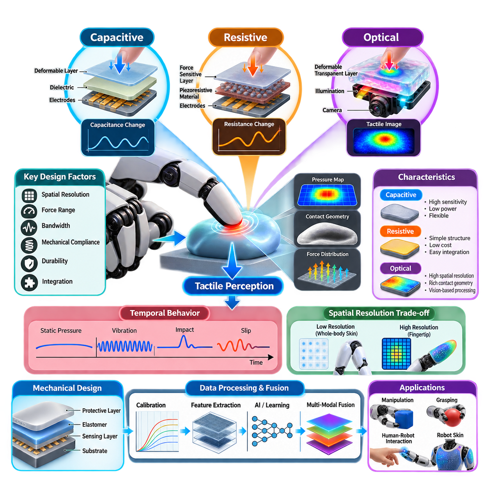{width="7.268055555555556in" height="7.268055555555556in"}

촉각 인지(Tactile Perception)는 비전(Vision), 라이다(LiDAR) 또는 기타 원격 센싱(Remote Sensing) 방식만으로는 안정적으로 얻기 어려운 정보를 로봇에 제공한다. 촉각 인지는 접촉 인터페이스(Contact Interface)에서 발생하는 물리적 상호작용(Physical Interaction)을 측정하여 접촉 발생 여부, 접촉 위치, 압력 또는 변형의 공간적 분포를 추정할 수 있도록 한다. 이러한 능력은 조작(Manipulation), 파지(Grasping), 인간-로봇 상호작용(Human--Robot Interaction), 접촉 중심 피지컬 AI(Contact-Rich Physical AI) 시스템에서 핵심적이다.

촉각 센서(Tactile Sensor)는 기계적 상호작용(Mechanical Interaction)을 측정 가능한 전기적 또는 광학적 신호(Electrical or Optical Signal)로 변환한다. 센서 구조에 따라 측정 대상은 수직 압력(Normal Pressure), 전단력(Shear Force), 변형(Deformation), 진동(Vibration), 접촉 형상(Contact Geometry) 또는 이들의 조합이 될 수 있다. 관절이나 손목에서 전체 하중을 측정하는 일반적인 힘-토크 센서(Force--Torque Sensor)와 달리, 촉각 배열(Tactile Array)은 접촉 표면 전체에 걸쳐 공간적으로 분산된 측정 정보를 제공한다.

따라서 센서 아키텍처(Sensor Architecture)는 요구되는 공간 해상도(Spatial Resolution), 힘 범위(Force Range), 대역폭(Bandwidth), 기계적 순응성(Mechanical Compliance), 내구성(Durability), 통합 제약조건(Integration Constraints)에 따라 선정해야 한다. 정밀 조작용 로봇 손끝(Robotic Fingertip)은 작은 표면 특징을 감지하기 위한 고밀도 센싱(Dense Sensing)이 필요할 수 있지만, 휴머노이드 스킨(Humanoid Skin)은 넓은 영역의 감지 범위, 견고성, 유연성 및 안전한 접촉 감지를 우선할 수 있다. 모든 요구조건을 최적으로 만족하는 단일 촉각 기술은 존재하지 않는다.

정전용량식 촉각 센서(Capacitive Tactile Sensor)는 기계적 변형으로 발생하는 정전용량(Capacitance)의 변화를 측정한다. 일반적인 센싱 요소(Sensing Element)는 유전체(Dielectric Material)를 사이에 둔 전도성 전극(Conductive Electrode)으로 구성된다. 외부 압력에 의해 전극 사이의 거리나 유효 중첩 면적이 변하면 정전용량도 변한다. 이러한 요소들을 배열(Array)로 구성하면 접촉력의 공간적 분포를 분석할 수 있는 압력 감지 표면(Pressure-Sensitive Surface)을 구현할 수 있다.

정전용량식 센싱(Capacitive Sensing)은 높은 감도(High Sensitivity), 비교적 낮은 전력 소비(Low Power Consumption), 유연 기판(Flexible Substrate)과의 우수한 호환성을 제공한다. 작은 변형을 감지할 수 있기 때문에 로봇 손끝, 인공 피부(Artificial Skin), 웨어러블 센싱 표면(Wearable Sensing Surface), 순응형 그리퍼(Compliant Gripper)에 활용하기 적합하다. 고밀도 배열은 단순한 접촉 여부뿐 아니라 접촉 위치 추정, 물체 형상 추정(Object Shape Estimation), 파지 안정성 평가(Grasp Stability Assessment)에 활용할 수 있는 압력 맵(Pressure Map)을 제공한다.

그러나 정전용량식 센서는 기생 정전용량(Parasitic Capacitance), 전자기 간섭(Electromagnetic Interference), 환경 조건, 유전체 특성 변화에 영향을 받는다. 대규모 배열에서는 배선과 판독 전자회로(Readout Electronics)가 추가적인 정전용량을 발생시킬 수 있으므로 전극 배선(Electrode Routing)과 멀티플렉싱(Multiplexing)을 신중하게 설계해야 한다. 따라서 차폐(Shielding), 기준값 보정(Baseline Calibration), 온도 보상(Temperature Compensation), 기계적으로 안정적인 패키징(Mechanical Packaging)이 실제 센서 설계에서 중요하다.

저항식 촉각 센서(Resistive Tactile Sensor)는 기계적 하중을 전기 저항(Electrical Resistance)의 변화로 변환한다. 힘 감응 저항기(Force-Sensitive Resistor), 압저항 소재(Piezoresistive Material), 전도성 폴리머(Conductive Polymer), 엘라스토머 복합재(Elastomer Composite), 변형 감응 구조(Strain-Sensitive Structure) 등이 대표적으로 사용된다. 압력이 가해지면 전도 경로나 소재의 형상이 변하면서 저항값이 달라지고, 이를 비교적 단순한 아날로그 전자회로(Analog Electronics)를 통해 측정할 수 있다.

저항식 센싱(Resistive Sensing)의 주요 장점은 구조적 단순성, 낮은 비용, 얇은 폼팩터(Thin Form Factor), 넓은 센싱 표면으로의 용이한 통합이다. 이러한 특성으로 인해 저항식 배열(Resistive Array)은 그리퍼 패드(Gripper Pad), 로봇 스킨(Robot Skin), 충돌 감지 표면(Collision Detection Surface) 등에 적합하며, 정밀한 접촉 형상 복원보다 압력의 크기와 분포를 안정적으로 감지하는 것이 중요한 응용 분야에서 유용하다.

반면 저항식 센서는 히스테리시스(Hysteresis), 비선형 응답(Nonlinear Response), 드리프트(Drift), 크리프(Creep), 센싱 요소 간 편차 등의 한계를 가진다. 반복적인 하중은 시간이 지남에 따라 소재 특성을 변화시킬 수도 있다. 따라서 원시 저항값(Raw Resistance)을 곧바로 정확한 물리적 힘으로 해석해서는 안 되며, 정량적인 힘 추정이 필요한 경우 보정 곡선(Calibration Curve), 정규화(Normalization), 필터링(Filtering), 보상 모델(Compensation Model), 주기적인 재보정(Recalibration)이 필요할 수 있다.

광학식 촉각 센싱(Optical Tactile Sensing)은 상당히 다른 원리를 사용한다. 접촉으로 변화하는 전기적 특성을 직접 측정하는 대신 내부 카메라(Internal Camera)가 유연한 투명 또는 반투명 표면의 변형을 관찰한다. 조명 시스템(Illumination System)을 이용하여 형상, 텍스처(Texture), 마커(Marker), 반사광 패턴의 변화를 드러내고, 컴퓨터 비전(Computer Vision) 알고리즘이 이러한 영상을 물리적인 접촉 상태의 표현으로 변환한다.

광학식 센서는 해상도가 주로 엘라스토머(Elastomer) 구조, 광학 구성(Optical Configuration), 카메라 해상도(Camera Resolution)에 의해 결정되기 때문에 매우 높은 공간 밀도의 측정이 가능하다. 겔사이트(GelSight)나 디짓(DIGIT)과 같은 개념을 기반으로 하는 시스템은 접촉한 표면의 고해상도 영상과 유사한 정밀 접촉 형상(Fine Contact Geometry)을 획득할 수 있다. 이를 통해 모서리, 텍스처, 국부 곡률(Local Curvature), 접촉 영역(Contact Patch), 미세한 물체 특징을 인지할 수 있다.

생성된 촉각 영상(Tactile Image)은 기존의 비전 기법과 학습 기반 비전 기술을 이용하여 처리할 수 있다. 합성곱 신경망(Convolutional Neural Network)이나 비전 트랜스포머(Vision Transformer)는 영상 시퀀스로부터 접촉 상태, 소재 특성, 물체 식별, 자세 보정(Pose Correction), 미끄러짐(Slip), 파지 품질(Grasp Quality)을 직접 추론할 수 있다. 따라서 광학식 촉각 센싱은 촉각 인지와 현대적인 시각 표현 학습(Visual Representation Learning)을 강하게 연결한다.

그러나 광학식 설계에도 고유한 공학적 제약조건이 존재한다. 카메라, 조명, 엘라스토머, 보호막(Protective Membrane), 내부 광학 경로(Optical Path)는 물리적 공간을 차지하며 기계적인 정렬 상태를 유지해야 한다. 엘라스토머의 마모나 오염은 영상 특성을 변화시킬 수 있으며, 조명 변화와 소재 노화(Material Aging)는 도메인 시프트(Domain Shift)를 발생시킬 수 있다. 또한 고해상도 촉각 비디오(Tactile Video)는 단순한 압력 배열보다 훨씬 많은 데이터를 생성한다.

따라서 세 가지 기술은 단순한 성능 순위를 형성하는 것이 아니라 서로 다른 설계 영역(Design Region)을 차지한다. 정전용량식 센싱은 높은 감도, 유연한 구조, 분산 압력 측정이 중요한 경우 유리하다. 저항식 센싱은 저비용이며 기계적으로 단순한 구현에 적합하다. 광학식 센싱은 높은 계산 및 기계적 복잡성을 감수하더라도 매우 풍부한 공간 정보와 정밀 접촉 형상이 필요한 경우 높은 가치를 제공한다.

촉각 인지는 시간적 거동(Temporal Behavior)에도 의존한다. 정적 압력(Static Pressure)은 접촉력이 어떻게 분포하는지를 나타내는 반면, 빠른 신호 변화는 충격(Impact), 진동, 초기 미끄러짐(Incipient Slip), 고착과 미끄러짐 사이의 전환을 나타낼 수 있다. 따라서 센서 대역폭은 관찰할 수 있는 상호작용 현상을 결정한다. 조작 시스템은 느리게 변화하는 압력 추정값과 고주파 성분을 결합하여 파지력과 동적 안정성을 동시에 분석할 수 있다.

공간 해상도 역시 중요한 절충관계(Trade-Off)를 가진다. 촉각 요소(Taxel)의 수를 증가시키면 접촉 위치 추정 성능이 향상되고 상세한 접촉 패턴을 복원할 수 있지만, 배선, 보정 작업, 대역폭, 연산량 및 고장 가능 지점도 증가한다. 따라서 팔이나 휴머노이드 신체를 덮는 로봇 스킨은 상대적으로 낮은 해상도의 분산 센싱을 사용할 수 있으며, 손끝에는 정밀 조작에 필요한 고해상도 센싱을 집중할 수 있다.

기계 설계(Mechanical Design)는 촉각 센서 성능과 분리할 수 없다. 보호층(Protective Layer)은 신호가 센싱 요소에 도달하기 전에 감도, 접촉 면적, 마찰, 힘 전달 특성에 영향을 준다. 매우 부드러운 표면은 물체에 대한 순응성을 향상시키지만 국부적인 힘을 흐리게 만들 수 있고, 단단한 표면은 더 선명한 접촉 패턴을 유지하지만 순응성이 감소한다. 따라서 센서 패키징은 목표로 하는 상호작용 역학(Interaction Mechanics)과 함께 설계되어야 한다.

보정(Calibration)은 원시 센서 측정값과 물리적으로 의미 있는 값 사이의 관계를 설정한다. 여기에는 영점 오프셋 보정(Zero-Offset Correction), 이득 정규화(Gain Normalization), 힘 보정(Force Calibration), 공간 보정(Spatial Calibration), 온도 보상, 히스테리시스 또는 드리프트 보상이 포함될 수 있다. 배열 센서에서는 명목상 동일한 센싱 요소도 서로 다른 응답 특성을 보일 수 있으므로 개별 촉각 요소 사이의 편차도 고려해야 한다.

현대 로봇 시스템은 촉각 데이터를 단순한 피드백 신호(Feedback Signal)가 아니라 하나의 인지 모달리티(Perception Modality)로 다루는 방향으로 발전하고 있다. 압력 맵, 촉각 영상, 시간적 접촉 시퀀스(Contact Sequence)를 학습된 특징 표현(Feature Representation)으로 인코딩하고 비전, 고유감각(Proprioception), 힘-토크 측정, 로봇 상태와 융합할 수 있다. 이러한 멀티모달 표현(Multimodal Representation)은 원거리 관측만으로는 모호한 물리적 상호작용을 로봇이 추론할 수 있도록 한다.

이러한 역할은 시각 인지가 가림(Occlusion)에 의해 저하될 때 특히 중요하다. 파지 과정에서는 로봇 손 자체가 가장 중요한 상호작용이 발생하는 물체 영역을 가릴 수 있다. 촉각 센싱은 이러한 상황에서도 접촉 인터페이스를 계속 관찰하여 물체가 이동했는지, 접촉이 비대칭인지, 추가적인 파지력이 필요한지를 감지할 수 있다. 따라서 촉각(Touch)은 외부 인지를 대체하는 것이 아니라 이를 보완한다.

피지컬 AI(Physical AI)에서 촉각 센서는 지능형 연산(Intelligent Computation)과 물리적 현실(Physical Reality)을 직접 연결하는 관측 채널(Observation Channel)을 제공한다. 정전용량식, 저항식, 광학식 기술은 각각 서로 다른 형태로 접촉을 표현하며 고유한 장점과 한계를 가진다. 이들 기술의 선택에는 로봇의 신체적 구현(Embodiment)과 목표 상호작용에 따라 감도, 해상도, 대역폭, 내구성, 비용, 연산량 및 기계적 통합을 종합적으로 고려해야 한다.

## 10.02. Force Torque Sensor Data Processing [w/Code]

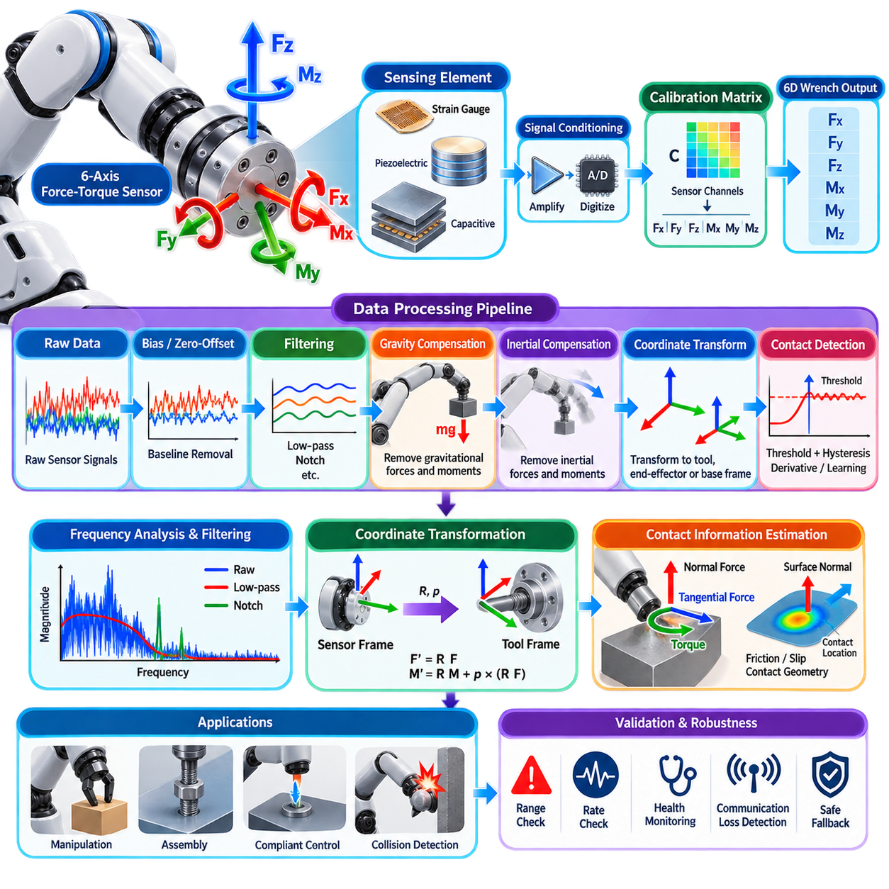{width="7.268055555555556in" height="7.268055555555556in"}

힘-토크 센서(Force--Torque Sensor)는 로봇의 신체와 물리적 환경 사이에서 발생하는 기계적 상호작용(Mechanical Interaction)을 직접 측정한다. 일반적인 6축 힘-토크 센서(Six-Axis Force--Torque Sensor)는 서로 직교하는 세 방향의 힘 Fx, Fy, Fz와 세 방향의 모멘트(Moment) Mx, My, Mz를 추정한다. 이러한 측정값은 조작(Manipulation), 조립(Assembly), 접촉 감지(Contact Detection), 순응 제어(Compliant Control), 충돌 모니터링(Collision Monitoring) 및 기타 상호작용 중심 로봇 작업에서 핵심적인 역할을 한다.

센싱 요소(Sensing Element)는 일반적으로 스트레인 게이지(Strain Gauge), 압전 구조(Piezoelectric Structure), 정전용량 요소(Capacitive Element) 또는 이와 유사한 변환기(Transducer)를 이용하여 기계적 변형을 전기 신호로 변환한다. 내부 전자회로는 이러한 신호를 증폭하고 디지털화한 후, 센서 채널의 측정값을 물리적인 힘과 토크 값으로 변환하는 보정 행렬(Calibration Matrix)을 적용한다. 그 결과 생성되는 6차원 렌치(Six-Dimensional Wrench)는 센서 기준 좌표계(Sensor Reference Frame)에 작용하는 병진 및 회전 하중을 통합적으로 나타낸다.

원시 힘-토크 측정값(Raw Force--Torque Measurement)은 로봇 제어나 인지 알고리즘에서 그대로 사용하는 것이 바람직하지 않다. 센서 신호에는 전기적 노이즈(Electrical Noise), 기계적 진동(Mechanical Vibration), 구조 공진(Structural Resonance), 열 드리프트(Thermal Drift), 바이어스(Bias), 양자화 효과(Quantization Effect), 그리고 로봇 자체의 움직임으로 발생하는 하중이 포함될 수 있다. 따라서 신뢰성 있는 처리를 위해서는 원시 측정값을 보정되고 필터링되며 보상되고 시간 정렬된 물리적으로 해석 가능한 렌치 추정값으로 변환하는 처리 파이프라인(Processing Pipeline)이 필요하다.

보정(Calibration)은 원시 센서 채널과 실제 기계적 하중 사이의 수학적 관계를 설정한다. 다축 센서(Multi-Axis Sensor)에서는 하나의 센싱 요소에서 측정된 변형이 여러 힘 또는 토크 성분에 반응할 수 있기 때문에 일반적으로 이러한 관계를 보정 행렬로 표현한다. 따라서 정확한 보정에서는 각 채널을 완전히 독립적인 측정값으로 취급하기보다 축간 감도(Cross-Axis Sensitivity)를 함께 고려해야 한다.

영점 오프셋 추정(Zero-Offset Estimation)은 일반적으로 센서에 하중이 없는 상태 또는 예상되는 정적 하중이 알려진 상태에서 수행한다. 측정된 기준값(Baseline)을 저장한 후 이후의 측정값에서 차감한다. 그러나 온도 변화, 장착 응력(Mounting Stress), 전자회로 드리프트(Electronics Drift), 기계적 노화(Mechanical Aging) 등으로 기준값이 변할 수 있으므로 한 번의 영점 조정만으로 장기적인 바이어스를 제거할 수는 없다. 따라서 실제 시스템에서는 제어된 재영점 조정(Rezeroing)이나 온라인 바이어스 추정(Online Bias Estimation)이 필요할 수 있다.

필터링(Filtering)은 힘-토크 데이터 처리에서 가장 중요한 단계 중 하나이다. 고주파 전기 노이즈와 구조적 진동은 불안정한 접촉 추정이나 불필요한 제어 반응을 발생시킬 수 있다. 원하는 상호작용 동역학(Interaction Dynamics)이 낮은 주파수 영역에 존재하는 경우 저역통과 필터(Low-Pass Filter)가 일반적으로 사용되며, 지연시간과 감쇠 특성에 따라 이동평균(Moving Average), 버터워스 필터(Butterworth Filter), 지수 필터(Exponential Filter) 또는 기타 디지털 필터(Digital Filter)를 선택할 수 있다.

필터 설계(Filter Design)는 노이즈 억제와 시간 응답(Temporal Response) 사이의 균형을 고려해야 한다. 지나친 평활화(Smoothing)는 충격, 접촉 전환(Contact Transition), 미끄러짐 관련 이벤트의 감지를 지연시킬 수 있으며, 필터링이 부족하면 진동이 제어기로 전달될 수 있다. 따라서 실시간 조작(Real-Time Manipulation)에서는 센서 샘플링 속도(Sampling Rate), 로봇 구조 동역학(Structural Dynamics), 제어기 대역폭(Controller Bandwidth), 물리적 상호작용의 주파수 특성을 고려하여 차단 주파수(Cutoff Frequency)를 설정해야 한다.

노치 필터(Notch Filter)는 힘 신호에 특정 주파수의 강한 주기적 외란(Periodic Disturbance)이 포함되어 있을 때 유용하다. 이러한 외란은 모터, 기어박스, 펌프, 프로펠러, 구조 공진 또는 기타 반복적인 기계 장치에서 발생할 수 있다. 적절하게 설정된 노치 필터는 나머지 신호 대역폭 대부분을 유지하면서 좁은 주파수 영역만 억제할 수 있지만, 운전 조건이 변화하는 경우 적응형 필터링(Adaptive Filtering)이나 다중 주파수 접근 방식이 필요할 수 있다.

중력 보상(Gravity Compensation)은 힘-토크 센서가 공구(Tool), 그리퍼(Gripper), 페이로드(Payload) 또는 기타 질량을 지지하는 경우 필요하다. 로봇의 자세가 변화하면 중력이 센서 좌표계에서 서로 다른 힘 성분으로 나타나며, 질량중심(Center of Mass)이 센싱 원점에서 떨어져 있으면 모멘트도 발생한다. 이러한 영향을 보상하지 않으면 예측 가능한 중력 하중이 외부 접촉력으로 잘못 해석될 수 있다.

중력 보상을 위해서는 페이로드 질량, 질량중심 위치, 센서 자세(Sensor Pose), 중력가속도(Gravitational Acceleration)에 대한 추정값이 필요하다. 로봇 기구학(Robot Kinematics)을 이용하여 중력 벡터(Gravity Vector)를 월드 좌표계(World Frame) 또는 베이스 좌표계(Base Frame)에서 센서 좌표계로 변환할 수 있다. 이후 예상되는 중력과 그에 따른 모멘트를 계산하여 측정 렌치에서 제거하면 외부 상호작용을 보다 정확하게 나타내는 추정값을 얻을 수 있다.

관성 보상(Inertial Compensation)은 이러한 원리를 동적 움직임으로 확장한다. 매니퓰레이터(Manipulator)가 가속하거나 회전하면 외부 접촉이 없더라도 페이로드의 관성으로 인해 힘과 모멘트가 발생한다. 따라서 고속 조작에서는 환경과의 상호작용처럼 보이는 상당한 렌치 신호가 생성될 수 있다. 로봇 관절 상태(Joint State), 기구학적 추정값, 페이로드 관성 파라미터(Inertial Parameter), 경우에 따라 관성 측정 장치(IMU) 데이터를 이용하여 로봇 자체의 동역학에서 발생하는 하중과 외부 하중을 분리할 수 있다.

좌표 변환(Coordinate Transformation) 역시 기본적인 처리 과정이다. 측정된 렌치는 정의된 기준 좌표계에 대해서만 물리적 의미를 갖기 때문이다. 센서 좌표계는 응용 시스템에서 요구되는 툴 중심점(Tool Center Point), 엔드이펙터 좌표계(End-Effector Frame), 로봇 베이스 좌표계 또는 접촉 좌표계(Contact Frame)와 다를 수 있다. 힘 벡터는 회전 변환(Rotational Transformation)이 필요하며, 토크 변환에서는 기준점 사이의 위치 차이까지 추가로 고려해야 한다.

렌치를 하나의 기준점에서 다른 기준점으로 변환할 때 기준점에서 떨어진 위치에 작용하는 힘은 추가적인 모멘트를 발생시킨다. 따라서 토크 변환은 단순히 세 개의 토크 성분을 회전시키는 것과 동일하지 않다. 정확한 렌치 변환(Wrench Transformation)은 좌표계 사이의 강체 공간 관계(Rigid-Body Spatial Relationship)를 이용하여 방향과 모멘트 암 효과(Lever-Arm Effect)를 함께 표현함으로써 인지와 제어에서 물리적 일관성을 유지한다.

접촉 감지(Contact Detection)는 처리된 렌치를 힘 또는 토크 임계값(Threshold)과 비교하여 구현할 수 있다. 단순한 임계값은 접촉 상태가 명확하게 구분되는 경우 효과적이지만, 실제 환경에는 진동, 변화하는 페이로드, 불확실한 기준값이 존재한다. 보다 강건한 시스템(Robust System)은 임계값과 함께 히스테리시스, 시간 지속 조건(Temporal Persistence), 미분 정보(Derivative Information), 통계적 검사(Statistical Test) 또는 학습 기반 분류기(Learned Classifier)를 사용하여 의도적인 접촉과 순간적인 외란을 구분한다.

힘의 미분값(Force Derivative)과 변화율(Rate of Change)은 갑작스러운 충격을 식별하는 데 특히 유용하다. 절대적인 힘의 크기가 크지 않더라도 매우 빠르게 증가한다면 중요한 충돌을 의미할 수 있다. 반대로 천천히 증가하는 힘은 정상적인 삽입(Insertion) 또는 순응 접촉(Compliant Contact)을 나타낼 수 있다. 따라서 힘의 크기와 시간적 특성을 결합하면 인지 시스템이 서로 다른 상호작용 모드(Interaction Mode)를 더욱 신뢰성 있게 구분할 수 있다.

힘-토크 데이터 처리는 접촉 특성(Contact Property)의 추정에도 활용된다. 측정된 힘의 방향은 대략적인 표면 법선(Surface Normal)을 나타낼 수 있으며, 접선 방향 힘(Tangential Force)과 수직 방향 힘(Normal Force)의 관계는 마찰 상태(Frictional Condition) 또는 미끄러짐 가능성을 나타낼 수 있다. 또한 공구와 환경의 형상을 충분히 알고 있다면 토크 패턴(Torque Pattern)을 통해 중심에서 벗어난 접촉, 회전 구속(Rotational Constraint), 접촉 위치 등에 관한 정보를 얻을 수 있다.

조작 과정에서 처리된 렌치 신호는 순응 제어(Compliant Control)와 밀접하게 연결된다. 임피던스 제어기(Impedance Controller)와 어드미턴스 제어기(Admittance Controller)는 힘 정보를 이용하여 로봇 운동과 환경 상호작용 사이의 관계를 조절한다. 처리된 신호의 품질은 제어기의 안정성과 응답성에 직접 영향을 미치므로 보정 정확도, 필터 지연(Filter Delay), 샘플링 일관성(Sampling Consistency), 좌표계 정확성은 시스템 수준에서 매우 중요한 요구조건이다.

조립 작업(Assembly Operation)은 6축 측정의 중요성을 특히 잘 보여준다. 페그 삽입(Peg Insertion), 커넥터 결합(Connector Mating), 표면 추종(Surface Following), 연마(Polishing), 체결(Fastening) 과정에서는 작은 측방향 힘과 모멘트가 시각 인지가 문제를 식별하기 전에 정렬 오차(Misalignment)를 나타낼 수 있다. 로봇은 이러한 신호를 이용하여 궤적을 수정하거나 접촉 응력을 줄이고, 정렬 위치를 탐색하거나 과도한 힘으로 손상이 발생하기 전에 작업을 중단할 수 있다.

힘-토크 데이터를 관절 엔코더(Joint Encoder), 카메라, 촉각 센서(Tactile Sensor), 관성 측정 장치와 융합할 때는 샘플링과 타임스탬프 관리(Timestamp Management)가 중요하다. 서로 다른 속도와 지연시간을 가진 측정값은 동일한 물리적 상태에 대응하도록 정렬되어야 한다. 데이터 획득 지점에 가까운 위치에서 타임스탬프를 생성하고, 필요한 경우 결정론적 통신(Deterministic Communication)을 유지하며, 데이터 스트림을 동기화함으로써 서로 다른 시점의 측정값이 결합되어 발생하는 오류를 줄일 수 있다.

센서 고장은 위험한 제어 동작으로 이어질 수 있으므로 정상적인 데이터 처리 과정에는 신호 검증(Signal Validation)이 포함되어야 한다. 포화(Saturation), 채널 연결 해제, 비정상적인 오프셋, 과도한 노이즈, 물리적으로 타당하지 않은 불연속 변화, 통신 손실 등을 측정값이 안전 중요 제어기(Safety-Critical Controller)에 전달되기 전에 감지해야 한다. 범위 검사(Range Check), 변화율 검사(Rate Check), 상태 플래그(Health Flag), 중복 정보(Redundant Information), 폴백 상태(Fallback State)를 이용하여 손상된 렌치 추정값이 위험한 움직임을 명령하는 것을 방지할 수 있다.

센서 장착(Sensor Mounting) 역시 데이터 품질에 영향을 준다. 기계적 인터페이스(Mechanical Interface)는 충분한 강성과 예측 가능한 하중 전달 특성을 제공하면서 의도하지 않은 예압(Preload)이나 구조적 변형을 방지해야 한다. 케이블에 의한 힘, 공구 장착 오차, 느슨한 체결부, 열팽창(Thermal Expansion), 기계적 교차 결합(Mechanical Cross-Coupling)은 모두 측정 렌치에 포함될 수 있다. 따라서 신뢰성 높은 인지를 위해서는 센서, 장착 구조, 공구 및 보정 모델을 하나의 통합된 측정 시스템(Integrated Measurement System)으로 다루어야 한다.

피지컬 AI(Physical AI)에서 힘-토크 센싱(Force--Torque Sensing)은 행동의 물리적 결과를 직접적으로 표현하는 정보를 제공한다. 비전은 물체와 접촉했다고 예측할 수 있지만, 렌치 측정값은 로봇이 물체와 어느 방향으로 얼마나 강하게 물리적으로 상호작용하고 있는지를 알려준다. 따라서 적절하게 처리된 힘-토크 데이터는 물리적으로 근거가 있는 피드백 신호(Physically Grounded Feedback Signal)를 통해 인지, 제어, 조작 및 학습을 연결한다.

완전한 힘-토크 처리 파이프라인(Force--Torque Processing Pipeline)은 데이터 획득(Acquisition)과 보정에서 시작하여 바이어스 보정(Bias Correction), 필터링, 중력 및 관성 보상, 좌표 변환, 동기화(Synchronization), 접촉 해석(Contact Interpretation), 신호 검증으로 이어진다. 그 목적은 단순히 부드러운 수치 신호를 생성하는 것이 아니라 원시 센서 측정값을 안전하고 신속하며 지능적인 로봇 상호작용을 가능하게 하는 신뢰성 높은 물리 정보(Reliable Physical Information)로 변환하는 것이다.

## 10.03. Contact Detection and Classification from F T [w/Code]

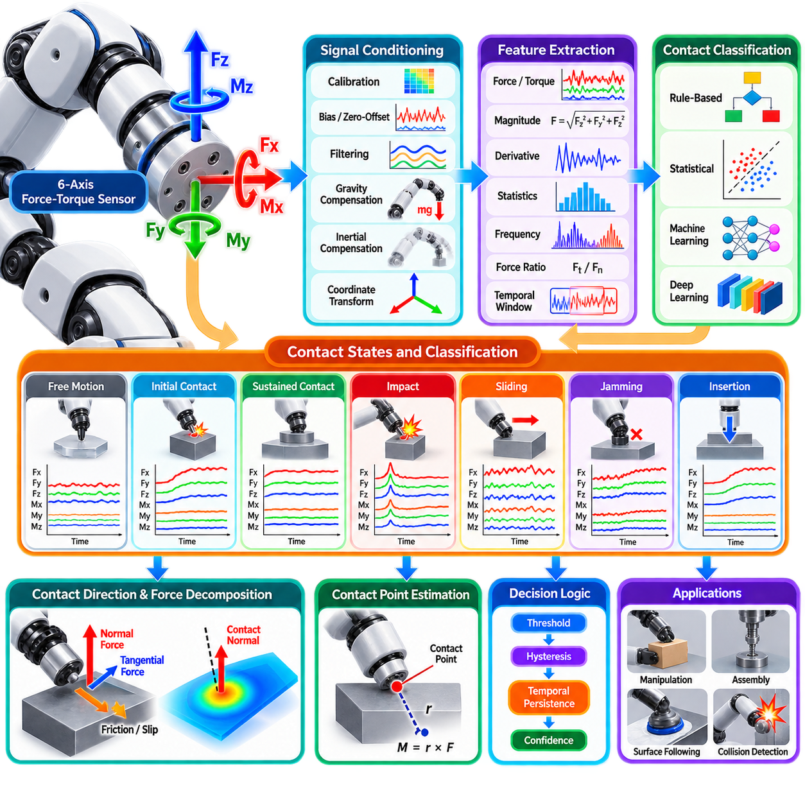{width="7.268055555555556in" height="7.268055555555556in"}

힘-토크 센싱(Force--Torque Sensing)을 이용하면 로봇은 물리적 접촉이 언제 발생했는지를 판단하고, 측정된 렌치(Wrench)를 통해 해당 상호작용의 특성을 추론할 수 있다. 6축 센서(Six-Axis Sensor)는 Fx, Fy, Fz의 힘과 Mx, My, Mz의 모멘트를 제공하여 기계적 상호작용(Mechanical Interaction)을 간결하게 표현한다. 접촉 감지(Contact Detection)는 이러한 연속적인 신호를 자유 운동(Free Motion), 최초 접촉(Initial Touch), 지속 접촉(Sustained Contact), 충격(Impact), 미끄러짐(Sliding), 구속된 상호작용(Constrained Interaction)과 같은 의미 있는 상태로 변환한다.

신뢰성 높은 접촉 감지(Contact Detection)는 적절하게 처리된 힘-토크 데이터에서 시작한다. 원시 측정값에는 센서 바이어스(Sensor Bias), 전기적 노이즈(Electrical Noise), 구조적 진동(Structural Vibration), 중력 하중(Gravity Load), 로봇 운동에 의해 발생하는 관성력(Inertial Force)이 포함될 수 있다. 따라서 분류(Classification)에 앞서 보정(Calibration), 영점 오프셋 보정(Zero-Offset Correction), 필터링(Filtering), 중력 보상(Gravity Compensation), 관성 보상(Inertial Compensation), 좌표 변환(Coordinate Transformation)을 수행하여 관찰된 변화가 가능한 한 외부의 물리적 상호작용을 나타내도록 해야 한다.

가장 단순한 접촉 감지 전략은 힘의 크기(Force Magnitude)를 사전에 설정한 임계값(Threshold)과 비교하는 것이다. 합력(Resultant Force)은 Fx, Fy, Fz의 크기로 표현할 수 있으며, 토크 크기(Torque Magnitude) 역시 Mx, My, Mz로부터 계산할 수 있다. 어느 한 값이라도 실험적으로 결정된 임계값을 초과하면 시스템은 접촉이 발생했다고 판단한다. 이 방법은 계산량이 적으며 동작 조건이 예측 가능한 많은 산업용 조작 작업에 적합하다.

그러나 단일 임계값(Single Threshold)은 신호가 결정 경계(Decision Boundary) 근처에서 변동할 때 불안정한 판단을 발생시킬 수 있다. 히스테리시스(Hysteresis)는 접촉 상태로 진입하는 임계값과 접촉 상태에서 벗어나는 임계값을 서로 다르게 설정하여 이러한 문제를 해결한다. 예를 들어 상대적으로 높은 힘 임계값에서 접촉을 활성화하고, 힘이 더 낮은 임계값 아래로 내려갔을 때만 접촉을 해제할 수 있다. 이를 통해 노이즈나 작은 기계적 진동에 의해 접촉과 비접촉 상태가 빠르게 반복되는 현상을 방지할 수 있다.

시간적 지속성(Temporal Persistence)은 또 다른 강건성(Robustness)을 제공한다. 한 번의 샘플에서 임계값 조건이 발생했다고 바로 접촉을 선언하는 대신, 일정한 수의 샘플 또는 특정 시간 동안 조건이 유지될 것을 요구한다. 이를 통해 짧은 순간의 외란은 제거하면서 지속적인 상호작용은 유지할 수 있다. 지속 시간(Persistence Interval)은 조작 및 안전 기능의 반응 시간 요구조건을 만족할 수 있을 만큼 짧게 설정해야 한다.

힘의 변화량(Change in Force)은 절대적인 크기만으로는 얻을 수 없는 정보를 제공할 수 있다. 힘의 시간 미분값(Temporal Derivative)은 급격한 변화를 강조하며 충격(Impact)이나 최초 접촉(First Contact)을 감지하는 데 특히 유용하다. 빠르게 증가하는 힘은 힘의 크기가 커지기 전에도 충돌(Collision)을 나타낼 수 있는 반면, 천천히 증가하는 신호는 의도적인 순응 하중(Compliant Loading)에 해당할 수 있다. 따라서 힘의 크기와 미분값을 함께 사용하면 서로 다른 상호작용 유형을 보다 정확하게 구분할 수 있다.

실제 시스템에서는 로봇의 상호작용을 여러 접촉 상태(Contact State)의 유한 집합으로 표현할 수 있다. 자유 운동은 보상된 기준값(Compensated Baseline)에 가까운 힘으로 나타난다. 최초 접촉은 상당한 힘 변화로 특징지어지고, 지속 접촉은 지속적인 하중으로 나타나며, 분리는 힘이 다시 기준값으로 돌아가는 과정으로 나타난다. 여기에 충격, 미끄러짐, 걸림(Jamming), 삽입(Insertion) 또는 기타 작업별 기계적 상태를 추가할 수 있다.

접촉 방향(Contact Direction)은 3차원 힘 벡터(Three-Dimensional Force Vector)를 이용하여 추정할 수 있다. 렌치를 적절한 공구 또는 접촉 좌표계(Contact Coordinate Frame)로 변환한 후 힘의 방향은 환경이 로봇의 움직임에 어느 방향으로 저항하고 있는지에 대한 정보를 제공한다. 대략적인 표면 방향을 알고 있다면 법선 방향 성분(Normal Component)과 접선 방향 성분(Tangential Component)을 분리하여 보다 상세하게 접촉 역학을 해석할 수 있다.

법선력(Normal Force)은 접촉면에 수직으로 작용하는 하중을 나타내며, 접선력(Tangential Force)은 접촉면을 따라 작용하는 하중을 나타낸다. 두 성분 사이의 관계는 안정적인 접촉과 미끄러짐 가능성을 구분하는 데 특히 중요하다. 접선 하중이 법선력에 의해 결정되는 마찰 한계(Friction Limit)에 가까워지면 상호작용이 미끄러짐(Slip)으로 전환될 가능성이 있다. 따라서 힘-토크 센싱은 고밀도 촉각 센싱(Dense Tactile Sensing)이 없어도 접촉 안정성(Contact Stability)에 대한 간접적인 정보를 제공할 수 있다.

토크 측정(Torque Measurement)은 단순한 힘의 크기만으로는 얻을 수 없는 정보를 추가한다. 센서 또는 공구의 기준점에서 떨어진 위치에서 접촉이 발생하면 지렛대 암(Lever Arm)과 작용하는 힘에 비례하는 모멘트가 생성된다. 따라서 Mx, My, Mz에 나타나는 패턴을 이용하면 편심 하중(Eccentric Loading), 회전 구속(Rotational Constraint), 정렬 오차(Misalignment), 유효 접촉 위치의 변화 등을 식별하는 데 도움을 받을 수 있다.

공구 형상(Tool Geometry)을 알고 있다면 힘과 토크 측정값을 이용하여 접촉점(Contact Point)을 추정할 수도 있다. 측정된 모멘트는 위치 벡터(Position Vector)와 작용하는 힘 사이의 벡터 외적(Cross Product)을 반영하지만, 추가적인 가정이 없다면 이 문제는 미정(Underdetermined)일 수 있다. 기하학적 제약조건(Geometric Constraint), 알려진 표면, 로봇 기구학(Robot Kinematics), 촉각 정보 등을 이용하면 이러한 모호성을 줄이고 접촉 위치 추정(Contact Localization)의 정확도를 향상시킬 수 있다.

접촉 분류(Contact Classification)는 접촉 감지를 확장하여 현재 발생하고 있는 물리적 상호작용의 종류를 결정한다. 유용한 입력 특징(Input Feature)에는 개별 힘과 토크 성분, 합력 크기, 시간 미분값, 이동 통계량(Moving Statistics), 주파수 영역 특성(Frequency-Domain Characteristics), 힘 비율(Force Ratio), 신호 지속시간 등이 포함된다. 이러한 특징은 최대 힘은 비슷하지만 시간적 또는 방향적 구조가 서로 다른 이벤트를 구분하는 데 활용할 수 있다.

규칙 기반 분류기(Rule-Based Classifier)는 상호작용 모드가 명확하게 이해되어 있을 때 효과적이다. 충격은 큰 양의 힘 미분값 이후 빠른 감소가 발생하는 형태로 표현할 수 있으며, 지속적인 누름은 일정하게 유지되는 법선 하중으로 나타낼 수 있다. 미끄러짐은 특유의 변동을 동반하는 접선력으로 나타날 수 있으며, 걸림(Jamming)은 로봇의 명령된 움직임이 거의 없음에도 힘과 모멘트가 증가하는 형태로 나타날 수 있다. 이러한 규칙은 해석 가능성이 높고 계산 효율이 좋다.

고정된 규칙만으로 센서의 변동성을 표현하기 어려운 경우 통계적 분류(Statistical Classification)가 유용하다. 짧은 시간 구간에서 추출된 특징 벡터(Feature Vector)는 로지스틱 회귀(Logistic Regression), 서포트 벡터 머신(Support Vector Machine), 결정 트리(Decision Tree), 확률적 분류기(Probabilistic Classifier)와 같은 방법으로 처리할 수 있다. 학습 데이터는 특정 렌치 패턴을 알려진 접촉 유형과 연결하며, 이를 통해 각 운전 조건에 대해 분류 경계를 수동으로 정의하지 않고 데이터로부터 학습할 수 있다.

접촉 패턴이 복잡한 경우 딥러닝(Deep Learning)은 힘-토크 시퀀스를 직접 처리할 수 있다. 1차원 합성곱 신경망(1D Convolutional Network)은 국부적인 시간 특징을 추출할 수 있고, 순환 신경망(Recurrent Architecture)은 순차적인 의존성을 모델링할 수 있으며, 트랜스포머 기반 모델(Transformer-Based Model)은 보다 긴 상호작용 이력을 표현할 수 있다. 이러한 방법은 접촉이 복잡한 작업을 분류할 수 있지만 일반적으로 더 많은 라벨링 데이터가 필요하며 공구, 물체, 속도, 페이로드가 달라지는 환경에서 신중한 검증이 요구된다.

분류는 사용 가능한 다른 로봇 정보를 무시하고 힘-토크 데이터만으로 수행할 필요는 없다. 관절 위치(Joint Position), 속도(Velocity), 명령된 운동(Commanded Motion), 모터 전류(Motor Current), 촉각 센싱(Tactile Sensing), 비전(Vision), 고유감각 상태(Proprioceptive State)는 힘-토크 측정을 해석하기 위한 추가적인 맥락을 제공한다. 예를 들어 명령된 누름 동작 중의 큰 힘은 정상적일 수 있지만, 자유 공간 운동 중 동일한 힘이 발생한다면 즉각적인 대응이 필요한 예상하지 못한 충돌을 의미할 수 있다.

운동 맥락(Motion Context)은 관성 효과와 외부 접촉을 구분하는 데 특히 중요하다. 무거운 공구를 빠르게 가속하면 환경과 접촉하지 않았더라도 상당한 렌치 변화가 발생할 수 있다. 반대로 로봇이 거의 정지한 상태에서도 접촉이 발생할 수 있다. 따라서 보상된 힘-토크 측정값을 로봇 기구학과 운동 명령과 결합하면 오검출(False Positive)을 줄이고 상호작용 분류 성능을 향상시킬 수 있다.

실시간 구현(Real-Time Implementation)에서는 지연시간(Latency)을 명확하게 고려해야 한다. 필터링, 시간 윈도우(Temporal Window), 지속성 검사(Persistence Test), 학습 기반 추론(Learned Inference)은 모두 실제 접촉과 분류 결과 사이에 지연을 발생시킨다. 긴 시간 윈도우는 분류 정확도를 높일 수 있지만 충돌 대응에는 적합하지 않을 수 있다. 따라서 안전 중심의 감지는 빠른 저수준 경로(Low-Level Path)를 사용하고, 보다 풍부한 분류는 더 긴 시간적 맥락을 이용하여 동시에 수행할 수 있다.

접촉 유형이 서로 겹치거나 센서 조건이 학습 환경과 다를 때는 신뢰도 추정(Confidence Estimation)이 유용하다. 분류기는 단순히 하나의 범주형 라벨(Categorical Label)을 출력하는 대신 가능한 상호작용 상태에 대한 확률 또는 신뢰도 점수(Confidence Score)를 제공할 수 있다. 신뢰도가 낮은 이벤트는 로봇이 보수적인 동작(Conservative Behavior)을 수행하도록 하거나 추가적인 센싱을 요청하거나, 신뢰할 수 없는 판단을 강제로 내리지 않고 미지 상태(Unknown)로 유지하도록 할 수 있다.

접촉 감지 시스템은 비정상적인 측정값도 처리해야 한다. 센서 포화(Sensor Saturation), 통신 손실(Communication Loss), 갑작스러운 바이어스 변화, 과도한 진동 또는 잘못된 보상은 실제 접촉 이벤트와 유사하게 나타날 수 있다. 따라서 범위 검사(Range Check), 신호 품질 지표(Signal Quality Indicator), 일관성 검사(Consistency Test), 센서 상태 모니터링(Sensor Health Monitoring)을 접촉 분류기와 함께 동작시켜 센서 고장이 환경과의 실제 접촉으로 잘못 해석되지 않도록 해야 한다.

조작(Manipulation)과 조립(Assembly)은 힘-토크 기반 접촉 분류의 중요한 응용 분야이다. 삽입 과정에서는 자유 접근(Free Approach), 최초 접촉, 정렬된 삽입(Aligned Insertion), 모서리 접촉(Edge Contact), 걸림 등을 구분할 수 있다. 표면 추종(Surface Following)에서는 원하는 법선 접촉력을 유지하면서 과도한 접선 하중을 감지할 수 있다. 파지(Grasping) 또는 핸드오버(Handover) 과정에서는 외부 상호작용을 식별하고 이에 따라 로봇의 움직임을 조절할 수 있다.

피지컬 AI(Physical AI)에서 접촉 분류(Contact Classification)는 기계적 신호를 행동 결과에 대한 의미론적 정보(Semantic Information)로 변환한다. 로봇은 단순히 힘이 존재한다는 사실만 관찰하는 것이 아니라, 접촉했는지, 충돌했는지, 눌렀는지, 미끄러졌는지, 구속되었는지 또는 접촉이 필요한 작업을 완료했는지를 해석한다. 이러한 해석은 저수준 물리 센싱(Low-Level Physical Sensing)과 구현된 상호작용에 대한 고수준 추론(High-Level Reasoning)을 연결한다.

따라서 강건한 접촉 인지 파이프라인(Contact Perception Pipeline)은 보정되고 보상된 렌치 측정값에서 시작하여 특징 추출(Feature Extraction), 접촉 감지, 시간적 상태 추정(Temporal State Estimation), 상호작용 분류, 신뢰도 평가(Confidence Evaluation), 제어 응답(Control Response)으로 이어진다. 힘의 크기, 방향, 토크, 시간적 동역학(Temporal Dynamics), 로봇 운동, 그리고 주변 맥락 정보를 결합하면 시스템은 6축 힘-토크 신호를 물리적 접촉에 대한 신뢰성 높은 지식으로 변환할 수 있다.

## 10.04. Tactile Image Processing GelSight DIGIT [w/Code]

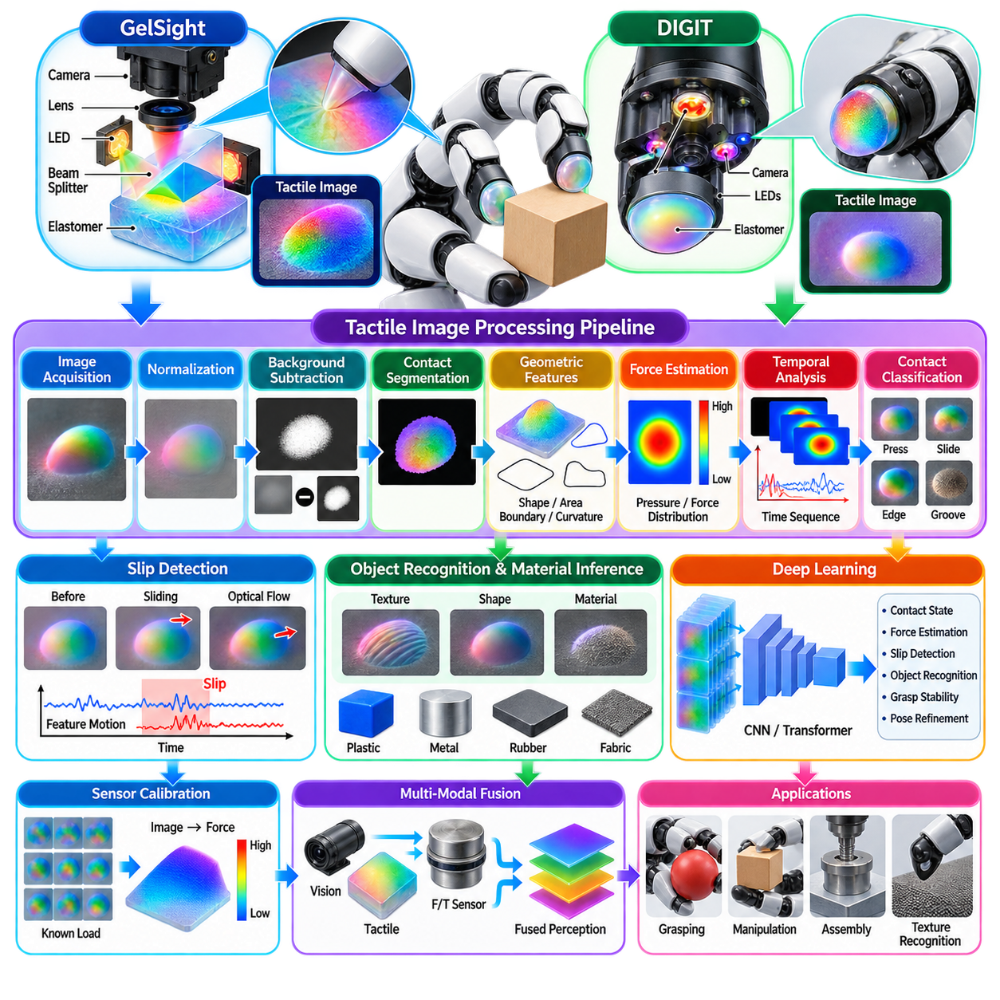{width="7.268055555555556in" height="7.268055555555556in"}

촉각 이미지 처리(Tactile Image Processing)는 광학식 촉각 센서(Optical Tactile Sensor)에서 획득한 원시 영상을 접촉 형상(Contact Geometry), 압력 분포(Pressure Distribution), 변형(Deformation), 상호작용 상태(Interaction State)에 대한 정량적 표현으로 변환한다. 개별 촉각 요소(Taxel)의 전기적 측정값을 직접 출력하는 기존 압력 배열(Pressure Array)과 달리, 광학식 촉각 센서는 카메라와 제어된 조명(Controlled Illumination)을 이용하여 엘라스토머 표면의 변형을 관찰한다. GelSight와 DIGIT은 이러한 접근법의 대표적인 사례이며, 여기에서는 컴퓨터 비전(Computer Vision)이 촉각을 해석하는 핵심 수단이 된다.

일반적인 광학식 촉각 센서는 순응성 엘라스토머 센싱 표면(Compliant Elastomeric Sensing Surface), 내부 조명 시스템(Internal Illumination System), 카메라(Camera), 그리고 이들 구성요소 사이의 광학적 관계를 일정하게 유지하는 기계적 패키징(Mechanical Packaging)으로 구성된다. 물체가 센싱 표면을 누르면 엘라스토머가 변형되고 내부 센싱 표면의 외관이 변화한다. 카메라는 이러한 변화를 영상으로 획득하며, 그 결과 접촉에 대한 공간적 정보와 시간적 정보를 모두 포함하는 촉각 표현(Tactile Representation)이 생성된다.

GelSight 방식의 센싱은 국부적인 접촉 형상(Local Contact Geometry)을 고해상도로 복원하는 데 중점을 둔다. 순응성 엘라스토머를 내부 카메라로 관찰하고 조명을 이용하여 표면 변형과 접촉 특징을 시각적으로 구분할 수 있도록 한다. 생성된 촉각 영상은 물체의 경계(Object Boundary), 표면 텍스처(Surface Texture), 국부 곡률(Local Curvature), 접촉 형상(Contact Shape)을 나타낼 수 있다. 따라서 광학식 촉각 센싱은 단순한 힘의 크기만으로는 안정적으로 판단하기 어려운 세밀한 물리적 특성을 로봇이 추론해야 하는 경우 특히 유용하다.

DIGIT은 로봇 손끝(Robotic Fingertip)과 조작(Manipulation)을 위해 설계된 소형 광학식 촉각 센싱 개념을 따른다. 작은 폼팩터(Small Form Factor)를 통해 촉각 인지를 실제 상호작용 지점에 직접 배치하면서도 영상 기반 센싱(Image-Based Sensing)을 유지할 수 있다. 생성된 촉각 프레임(Tactile Frame)은 컴퓨터 비전 기법을 이용하여 접촉 영역(Contact Region), 물체 특징(Object Feature), 변형 패턴(Deformation Pattern), 상호작용 상태를 추정할 수 있다. 관절형 로봇 손에 촉각 센싱을 통합해야 하는 경우 이러한 소형 구조는 특히 중요하다.

첫 번째 처리 단계는 일반적으로 카메라 영상을 안정적인 촉각 표현으로 변환하는 것이다. 원시 프레임(Raw Frame)에는 조명 변화(Illumination Variation), 센서 고유의 아티팩트(Sensor-Specific Artifact), 렌즈 왜곡(Lens Distortion), 배경 구조(Background Structure), 엘라스토머 변형에 의해 발생하는 변화가 포함될 수 있다. 따라서 영상 정규화(Image Normalization), 배경 제거(Background Subtraction), 기하학적 보정(Geometric Correction), 조명 보상(Illumination Compensation)을 적용하면 후속 처리의 일관성을 향상시킬 수 있다. 목표는 물리적 접촉에 의해 발생한 변화를 중심으로 분리하는 것이다.

접촉 분할(Contact Segmentation)은 외부 물체의 영향을 받은 촉각 영상 영역을 식별한다. 간단한 방법은 현재 영상을 센서가 무부하 상태일 때의 기준 영상(Reference Image)과 비교하는 것이다. 상당한 픽셀 차이가 발생한 영역은 엘라스토머에 변화가 발생한 위치를 나타낸다. 보다 발전된 방법에서는 학습 기반 분할 모델(Learned Segmentation Model)을 이용하여 실제 접촉과 노이즈, 내부 반사, 기계적 아티팩트 또는 목표 상호작용과 관계없는 변형을 구분할 수 있다.

접촉 형상(Contact Geometry)은 분할된 촉각 영상에서 추출할 수 있다. 접촉 영역의 형태, 면적, 경계, 국부적인 구조는 물체가 센서와 어떻게 접촉하는지에 대한 정보를 제공한다. 경계는 물체의 외곽을 나타낼 수 있으며, 국부적인 변형 패턴은 곡률이나 표면 구조를 나타낼 수 있다. 센서가 적절하게 보정되어 있다면 영상 좌표(Image Coordinate)를 물리적 좌표(Physical Coordinate)로 변환하여 촉각 측정값에 실제 기하학적 의미를 부여할 수 있다.

압력 또는 힘 분포(Pressure or Force Distribution)는 촉각 영상의 외관과 기계적 하중 사이의 관계를 학습함으로써 추정할 수 있다. 엘라스토머의 변형은 작용한 힘과 상관된 영상 특징을 생성한다. 따라서 알려진 하중 조건에서 수행한 보정 실험을 이용하여 정규력(Normal Force), 전단력(Shear Force), 공간적 압력 분포(Spatial Pressure Distribution)를 추정하는 회귀 모델(Regression Model)을 위한 학습 데이터를 생성할 수 있다. 이러한 모델의 성능은 특정 센서의 기계적 특성과 광학적 특성에 크게 의존한다.

촉각 이미지 처리는 조작 과정에서 접촉이 시간에 따라 변화하기 때문에 본질적으로 시간적 특성(Temporal Property)을 가진다. 하나의 프레임은 접촉 위치를 나타낼 수 있지만, 연속된 프레임 시퀀스는 접근(Approach), 충격(Impact), 압축(Compression), 안정 접촉(Stable Contact), 미끄러짐(Sliding), 분리(Release)를 나타낼 수 있다. 시간 필터링(Temporal Filtering)과 프레임 간 특징 추적(Frame-to-Frame Feature Tracking)은 노이즈를 억제하고 보다 안정적인 추정값을 제공할 수 있다. 또한 순차 모델(Sequential Model)은 서로 다른 상호작용 상태에 해당하는 특징적인 패턴을 학습할 수 있다.

미끄러짐 감지(Slip Detection)는 시간적 촉각 처리(Temporal Tactile Processing)의 중요한 응용 분야이다. 안정적인 파지(Stable Grasping)에서는 물체에 하중이 작용하더라도 접촉 영상이 상대적으로 일정하게 유지될 수 있다. 물체가 미끄러지기 시작하면 국부적인 영상 특징이 이동하거나 빠르게 변화할 수 있다. 광학 흐름(Optical Flow), 상관 기반 추적(Correlation-Based Tracking), 영상 그래디언트(Image Gradient), 학습 기반 시간 표현(Learned Temporal Representation)을 이용하면 이러한 변화를 감지하여 물체를 실제로 놓치기 전에 초기 미끄러짐(Incipient Slip)을 조기에 판단할 수 있다.

촉각 영상은 물체 인식(Object Recognition)과 재질 관련 추론(Material-Related Inference)에도 활용할 수 있다. 접촉 형상은 물체의 국부적인 형상 정보를 제공하며, 텍스처와 변형 특성은 표면 특성에 대한 추가적인 단서를 제공할 수 있다. 머신러닝 모델(Machine Learning Model)은 접촉 영상과 물체 범주(Object Category), 국부 표면 특징(Local Surface Feature), 조작 결과(Manipulation Outcome)를 연결하는 촉각 표현을 학습할 수 있다. 촉각 표현과 시각 표현(Visual Representation)을 결합하면 외부 비전이 가려지거나 모호한 상황에서 인식 성능을 더욱 향상시킬 수 있다.

보정(Calibration)은 동일한 물리적 힘이라도 엘라스토머 특성, 센서 형상, 조명, 카메라 특성, 온도, 기계적 노화(Mechanical Aging)에 따라 서로 다른 영상 패턴을 생성할 수 있기 때문에 필수적이다. 실제 보정 과정에서는 통제된 조건에서 영상 특징과 물리량 사이의 관계를 설정한다. 장기적인 운용 신뢰성을 확보하기 위해서는 기계적 구조를 일관되게 유지하고 보정 드리프트(Calibration Drift)를 주기적으로 모니터링하는 것이 중요하다.

딥러닝(Deep Learning)은 촉각 영상을 고수준 인지 출력(High-Level Perception Output)으로 변환하는 강력한 방법을 제공한다. 합성곱 신경망(Convolutional Neural Network)은 개별 촉각 프레임에서 공간적 특징을 추출할 수 있으며, 시간 모델(Temporal Network)이나 트랜스포머(Transformer)는 촉각 관측 시퀀스를 처리할 수 있다. 모델은 접촉 분류(Contact Classification), 힘 추정(Force Estimation), 미끄러짐 감지, 물체 인식, 파지 안정성 예측(Grasp Stability Prediction), 자세 보정(Pose Refinement) 등을 위해 학습할 수 있다. 그러나 성능은 촉각 학습 데이터의 다양성과 품질에 크게 의존한다.

촉각 이미지 처리는 다른 로봇 인지 모달리티(Perception Modality)와 결합할 때 더욱 강력해진다. 비전은 전역적인 물체와 장면 정보를 제공하는 반면, 촉각 센싱은 실제 접촉 인터페이스에서 국부적인 정보를 제공한다. 힘-토크 센싱(Force--Torque Sensing)은 전체적인 기계적 하중을 제공하는 반면, 촉각 영상은 그 하중의 공간적 분포를 보여준다. 따라서 이러한 신호를 융합하면 하나의 센서 모달리티만 사용하는 것보다 조작 상태에 대한 더욱 완전한 표현을 생성할 수 있다.

피지컬 AI(Physical AI)에서 GelSight 및 DIGIT 방식의 촉각 인지는 시각적 표현 학습(Visual Representation Learning)과 물리적 접촉을 직접 연결하는 인터페이스를 제공한다. 로봇은 원시 촉각 영상을 접촉 형상, 힘 관련 특징, 미끄러짐 정보, 파지 안정성, 상호작용 상태로 변환할 수 있다. 이러한 표현은 조작 계획기(Manipulation Planner), 제어기(Controller), 학습 기반 정책(Learned Policy), 멀티모달 파운데이션 모델(Multimodal Foundation Model)에 입력될 수 있으며, 물리적 접촉에서 지능적 행동으로 이어지는 인지 경로를 형성한다.

완전한 촉각 이미지 처리 파이프라인(Tactile Image Processing Pipeline)은 광학 영상 획득(Optical Image Acquisition)에서 시작하여 정규화(Normalization), 배경 보상(Background Compensation), 접촉 분할, 기하학적 특징 추출(Geometric Feature Extraction), 시간적 분석(Temporal Analysis), 힘 또는 압력 추정, 고수준 분류(High-Level Classification)로 이어진다. GelSight는 정밀한 접촉 형상에 중점을 두는 반면, DIGIT은 소형 광학식 촉각 센싱을 로봇 조작에 통합할 수 있음을 보여준다. 이러한 접근법은 영상 기반 촉각(Image-Based Touch)이 국부적인 물리적 상호작용을 고도화된 로봇 시스템을 위한 구조화된 인지 정보(Structured Perceptual Information)로 변환할 수 있음을 보여준다.

## 10.05. Slip Detection from Tactile Signals [w/Code]

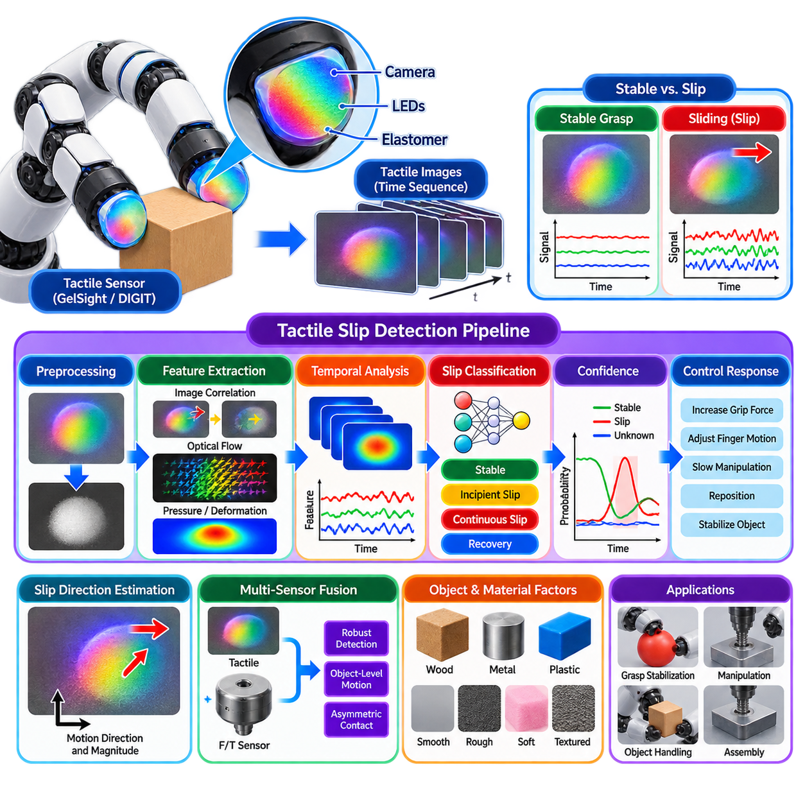{width="7.268055555555556in" height="7.268055555555556in"}

촉각 신호 기반 미끄러짐 감지(Slip Detection from Tactile Signals)는 물체가 파지 표면(Grasping Surface)에 대해 상대적으로 움직이기 시작하는 순간을 로봇이 식별할 수 있도록 한다. 물체를 원거리에서 관찰하는 비전 기반 방법과 달리 촉각 센싱(Tactile Sensing)은 실제 접촉 인터페이스(Contact Interface)에서 발생하는 변화를 직접 측정한다. 따라서 촉각 미끄러짐 인지(Tactile Slip Perception)는 물체가 로봇 손에 의해 부분적으로 가려져 있거나, 시각적 텍스처가 약하거나, 물체가 눈에 띄게 이동하기 전에 발생하는 매우 작은 상대 운동을 감지해야 하는 경우 특히 유용하다.

촉각 센서(Tactile Sensor)는 압력(Pressure), 변형(Deformation), 접촉 위치(Contact Location) 또는 국부적인 촉각 영상 특징(Tactile Image Feature)의 시간적 변화를 통해 미끄러짐을 나타낼 수 있다. 안정적인 파지(Stable Grasp) 상태에서는 진동이나 센서 노이즈로 인해 작은 변화가 발생할 수 있지만 접촉 패턴(Contact Pattern)은 일반적으로 비교적 일정하게 유지된다. 미끄러짐이 시작되면 국부적인 특징이 센싱 표면을 따라 이동하거나 압력 분포가 일정한 방향으로 변화한다. 따라서 하나의 촉각 프레임을 해석하는 것보다 이러한 변화를 시간에 따라 감지하는 것이 더욱 효과적이다.

GelSight 또는 DIGIT과 같은 광학식 촉각 센서(Optical Tactile Sensor)의 경우 미끄러짐 감지는 접촉 인터페이스에서 발생하는 시각적 운동 추정(Visual Motion Estimation) 문제로 구성할 수 있다. 연속적인 촉각 영상을 비교하여 특징적인 표면 특징이 이동했는지를 판단한다. 광학 흐름(Optical Flow), 영상 상관(Image Correlation), 특징 추적(Feature Tracking), 영상 그래디언트(Image Gradient), 프레임 간 변위(Frame-to-Frame Displacement)를 이용하면 국부적인 움직임의 방향과 크기를 확인할 수 있다. 이렇게 얻어진 운동장은 물체와 촉각 표면 사이에 상대적인 움직임이 발생하고 있다는 직접적인 증거를 제공한다.

간단한 방법으로는 연속적인 촉각 프레임 사이의 영상 상관(Image Correlation)을 이용할 수 있다. 국부적인 접촉 영역을 작은 영역으로 나누고 각 영역을 다음 프레임의 대응 영역과 비교한다. 영상 패턴에서 상당한 변위가 발생하면 미끄러짐 가능성이 있는 것으로 판단한다. 상관 기반 방법(Correlation-Based Method)은 계산 과정이 이해하기 쉽고 임베디드 시스템에서도 효율적으로 동작할 수 있지만, 접촉 형상이 크게 변하거나 촉각 영상에 반복적이거나 모호한 텍스처가 포함된 경우 성능이 저하될 수 있다.

광학 흐름(Optical Flow)은 촉각 운동을 보다 상세하게 표현할 수 있다. 접촉 영역 전체에 대해 하나의 변위만 추정하는 대신, 광학 흐름은 촉각 영상의 각 위치에서 국부적인 운동 벡터(Local Motion Vector)를 계산한다. 이러한 벡터의 공간적 분포를 통해 접촉이 균일하게 이동하는지, 회전하는지, 변형되는지, 또는 국부적인 미끄러짐이 발생하는지를 판단할 수 있다. 따라서 흐름의 크기와 방향은 안정적인 파지와 다양한 형태의 물체 운동을 구분하는 중요한 특징이 될 수 있다.

미끄러짐은 영상 특징을 명시적으로 추적하지 않고도 압력이나 변형의 변화로 감지할 수 있다. 안정적인 접촉에서는 압력 분포가 예상 범위 내에서 유지될 수 있다. 물체가 움직이기 시작하면 압력이 접촉 영역의 한 부분에서 다른 부분으로 이동하면서 특징적인 시간적 패턴이 발생할 수 있다. 촉각 시스템은 압력 차이, 압력 중심(Center of Pressure)의 이동, 변형 그래디언트(Deformation Gradient), 기타 공간 통계량(Spatial Statistics)을 이용하여 이러한 변화를 모니터링할 수 있다.

시간적 처리(Temporal Processing)는 미끄러짐이 본질적으로 동적인 사건이기 때문에 필수적이다. 촉각 외관에서 발생한 하나의 변화가 반드시 미끄러짐을 의미하는 것은 아니다. 진동, 센서 노이즈, 탄성 복원(Elastic Recovery), 파지력의 작은 변화도 유사한 변화를 발생시킬 수 있기 때문이다. 시간 윈도우(Temporal Window)를 이용하면 여러 프레임에 걸쳐 증거를 누적할 수 있으며, 이를 통해 지속적인 방향성 운동과 짧은 시간 동안 발생한 외란을 구분할 수 있다.

촉각 특징의 운동 속도(Rate of Tactile Feature Motion)는 초기 미끄러짐(Incipient Slip)을 조기에 나타내는 지표가 될 수 있다. 많은 파지 상황에서는 물체가 큰 폭으로 이동하기 전에 작은 국부적 움직임이 먼저 발생한다. 이러한 초기 변화를 감지하면 로봇은 물체를 놓치기 전에 파지력을 증가시키거나 손가락 운동을 수정하거나 조작 전략을 변경할 수 있다. 따라서 미끄러짐 감지는 폐루프 파지 안정화(Closed-Loop Grasp Stabilization)의 중요한 구성요소가 된다.

미끄러짐 방향(Slip Direction) 역시 제어에 유용하다. 촉각 운동장은 물체가 접촉 표면에 대해 위, 아래, 측방향 또는 회전 방향으로 이동하고 있는지를 나타낼 수 있다. 로봇은 이러한 정보를 이용하여 개별 손가락의 힘을 조절하거나 엔드이펙터 자세(End-Effector Pose)를 변경할 수 있다. 여러 개의 촉각 센서를 사용하는 경우 각각의 운동 추정값을 결합하여 물체 수준의 운동(Object-Level Motion)과 비대칭 접촉 조건(Asymmetric Contact Condition)에 대한 추가 정보를 얻을 수 있다.

임계값 기반 미끄러짐 감지(Threshold-Based Slip Detection)는 변위, 광학 흐름 크기, 압력 변화 또는 시간적 변화량에 대한 한계를 설정하여 구현할 수 있다. 측정된 신호가 일정 시간 동안 해당 임계값을 초과하면 시스템은 미끄러짐 사건을 선언한다. 히스테리시스(Hysteresis)와 시간적 지속성(Temporal Persistence)을 사용하면 노이즈로 인한 오검출(False Detection)을 줄일 수 있다. 그러나 물체 재질, 파지력, 센서 조건 또는 조작 속도가 변화하면 고정된 임계값을 조정해야 할 수 있다.

학습 기반 방법(Learning-Based Method)은 보다 복잡한 촉각 미끄러짐 패턴을 학습할 수 있다. 모델은 촉각 영상 시퀀스 또는 추출된 촉각 특징을 입력으로 받아 안정적인 접촉, 초기 미끄러짐, 지속적인 미끄러짐 및 기타 상호작용 상태 사이의 차이를 학습할 수 있다. 합성곱 신경망(Convolutional Network)은 공간적 특징을 추출할 수 있으며, 순환 신경망(Recurrent Model)이나 트랜스포머 기반 모델(Transformer-Based Model)은 시간적 의존성을 표현할 수 있다. 이러한 모델은 촉각 정보와 힘-토크 측정값(Force--Torque Measurement), 로봇 상태(Robot State)를 함께 결합할 수도 있다.

미끄러짐 감지를 위한 학습 데이터는 로봇이 실제로 작업하게 될 운용 조건을 반영해야 한다. 서로 다른 물체 재질, 형상, 표면 텍스처, 파지력, 센서 구성, 운동 속도는 상당히 다른 촉각 신호를 생성할 수 있다. 라벨은 안정적인 파지, 초기 미끄러짐, 지속적인 미끄러짐, 회복(Recovery) 등의 상태를 구분할 수 있다. 이러한 사례의 다양성은 특정한 소수의 물체에 대해서만 학습된 모델이 새로운 조작 조건에서도 안정적으로 일반화할 수 있도록 하는 데 중요하다.

미끄러짐 감지는 독립적인 인지 기능으로 취급하기보다 파지 제어(Grasp Control)와 통합해야 한다. 초기 미끄러짐이 감지되면 제어기는 법선 방향 파지력(Normal Grasp Force)을 증가시키거나 손가락 자세를 변경하거나 조작 속도를 낮추거나 일시적으로 물체를 안정화할 수 있다. 적절한 대응은 작업에 따라 달라진다. 단순히 힘을 증가시키는 것은 깨지기 쉬운 물체를 손상시키거나 불필요한 에너지 소비를 증가시킬 수 있기 때문이다. 따라서 촉각 인지는 단순한 이진 경보(Binary Alarm)가 아니라 적응형 제어(Adaptive Control)를 위한 정보를 제공한다.

피지컬 AI(Physical AI)에서 촉각 미끄러짐 감지는 물리적 상호작용(Physical Interaction)과 행동 적응(Action Adaptation)을 직접 연결한다. 로봇은 자신의 운동과 환경과의 상호작용으로 인해 접촉 상태가 어떻게 변화하는지를 관찰하고, 그 정보를 이용하여 자신의 행동을 수정한다. 따라서 촉각 시퀀스(Tactile Sequence)는 학습 기반 조작 정책(Learned Manipulation Policy)의 일부가 될 수 있으며, 미끄러짐 관련 특징은 파지 안정성 추정(Grasp Stability Estimation), 행동 선택(Action Selection), 폐루프 의사결정(Closed-Loop Decision Making)에 기여할 수 있다.

완전한 촉각 미끄러짐 감지 파이프라인(Tactile Slip Detection Pipeline)은 촉각 신호 획득(Tactile Signal Acquisition)에서 시작하여 전처리(Preprocessing), 공간적 특징 추출(Spatial Feature Extraction), 시간적 분석(Temporal Analysis), 운동 또는 변형 추정(Motion or Deformation Estimation), 미끄러짐 분류(Slip Classification), 신뢰도 평가(Confidence Evaluation), 제어 응답(Control Response)으로 이어진다. 광학 흐름과 영상 추적(Image Tracking)은 영상 기반 촉각 센서에 특히 유용하며, 압력과 변형 통계는 이를 보완하는 정보를 제공한다. 이러한 신호를 힘-토크 측정값, 로봇 운동, 학습 기반 모델과 결합하면 접촉 중심 조작(Contact-Rich Manipulation) 과정에서 미끄러짐을 조기에 안정적으로 감지할 수 있다.

## 10.06. Tactile Based Grasp Stability Assessment [w/Code]

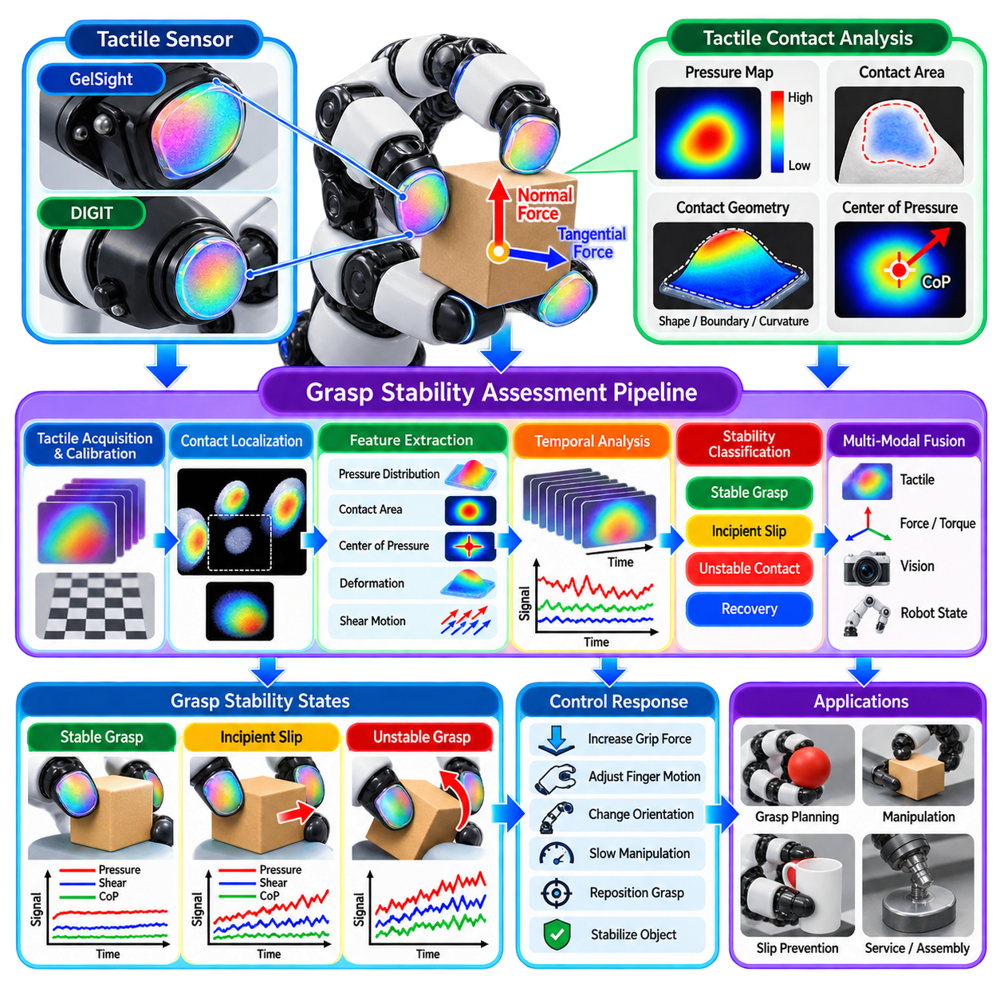{width="7.268055555555556in" height="7.268055555555556in"}

촉각 기반 파지 안정성 평가(Tactile-Based Grasp Stability Assessment)는 로봇이 파지 인터페이스(Grasp Interface)에서 직접 획득한 정보를 분석하여 물체가 안정적으로 잡혀 있는지, 미끄러짐이 발생하기 시작했는지, 또는 접촉이 불안정해지고 있는지를 판단할 수 있도록 한다. 비전(Vision)은 물체의 자세와 손의 구성을 추정할 수 있고, 힘-토크 센싱(Force--Torque Sensing)은 전체적인 하중을 제공하지만, 촉각 센싱(Tactile Sensing)은 개별 접촉 영역에 걸쳐 압력과 변형이 어떻게 분포하는지를 보여준다. 따라서 촉각 인지는 가려진 상태(Occlusion)와 지속적인 물리적 상호작용 중에서 파지 품질을 평가하는 데 특히 유용하다.

파지 안정성(Grasp Stability)은 단순히 힘의 크기만으로 결정되지 않는다. 안정적인 파지는 법선력(Normal Force), 접선력(Tangential Force), 접촉 위치(Contact Location), 접촉 면적(Contact Area), 마찰(Friction), 물체 형상(Object Geometry), 로봇과 물체의 운동 사이의 관계에 의해 결정된다. 촉각 센서는 압력 맵(Pressure Map), 변형 패턴(Deformation Pattern), 접촉 형상(Contact Geometry), 시간적 신호 변화(Temporal Signal Variation)를 통해 이러한 변수의 변화를 관찰할 수 있다. 따라서 안정성 평가는 국부적인 촉각 관측을 현재의 파지가 예상되는 외란(Expected Disturbance)을 견딜 수 있는지에 대한 추정값으로 변환한다.

유용한 촉각 표현(Tactile Representation)은 먼저 손가락이나 그리퍼(Gripper)에서 활성화된 접촉 영역(Active Contact Region)을 식별하는 것에서 시작한다. 센서는 접촉 면적, 압력 분포, 압력 중심(Center of Pressure), 국부 변형(Local Deformation), 공간 그래디언트(Spatial Gradient)를 추정할 수 있다. 이러한 측정값은 접촉이 고르게 분포되어 있는지 또는 바람직하지 않은 위치에 집중되어 있는지를 보여준다. 전체 힘이 충분하더라도 접촉이 매우 국부적인 파지는 보다 넓고 균형 잡힌 접촉 분포를 가진 파지와 다르게 동작할 수 있다.

법선력(Normal Force)은 파지 안정성의 중요한 요소이다. 이는 접선 운동에 대한 마찰 저항(Frictional Resistance)의 크기를 결정하기 때문이다. 법선력이 적용된 접선 하중에 비해 충분하지 않으면 물체가 미끄러지기 시작할 수 있다. 촉각 센싱은 여러 접촉 영역에서 국부적인 법선 하중을 추정하고 사용 가능한 마찰 여유(Frictional Margin)가 어느 정도 소모되고 있는지를 판단할 수 있다. 이를 통해 안정적인 접촉과 미끄러짐에 가까워지는 조건을 물리적으로 구분할 수 있다.

접선력(Tangential Force)과 전단 변형(Shear Deformation)은 파지 안정성에 대한 추가적인 정보를 제공한다. 물체가 손가락 표면에 대해 움직이기 시작하면 전체 법선 압력에 큰 변화가 발생하기 전에도 촉각 패턴이 이동할 수 있다. 따라서 국부적인 전단 변위(Local Shear Displacement)는 초기 미끄러짐(Incipient Slip)의 조기 지표로 사용할 수 있다. 법선 압력과 접선 운동을 결합하면 접촉이 안정적인 마찰 영역 내에 유지되는지 또는 미끄러짐으로 전환되는 상태에 가까워지고 있는지를 추정할 수 있다.

여러 손가락 사이의 접촉 분포(Contact Distribution) 역시 중요하다. 다중 손가락 파지(Multi-Finger Grasp)에서는 각 접촉점이 병진과 회전에 저항하는 전체 능력에 기여한다. 촉각 측정값은 한 손가락이 과도한 하중을 부담하는 반면 다른 손가락은 접촉을 잃고 있는지를 보여줄 수 있다. 이러한 비대칭성(Asymmetry)은 전체 파지력이 허용 가능한 범위에 있더라도 불안정한 파지를 나타낼 수 있다. 로봇은 이러한 정보를 이용하여 손가락 힘을 재분배하고 기계적 균형(Mechanical Balance)을 향상시킬 수 있다.

시간적 일관성(Temporal Consistency) 역시 핵심적인 요소이다. 안정적인 파지는 로봇이 의도한 동작을 수행하는 동안 예상 범위 내에서 접촉 패턴을 유지해야 한다. 짧은 시간의 변동은 진동, 센서 노이즈 또는 작은 탄성 변화로 인해 발생할 수 있으므로 이를 자동으로 불안정성으로 해석해서는 안 된다. 반면 압력 중심의 지속적인 이동, 접촉 면적의 점진적인 감소, 증가하는 전단 변형, 반복적인 국부 미끄러짐은 파지 안정성이 저하되고 있다는 보다 강한 증거가 된다.

GelSight 또는 DIGIT과 같은 광학식 센서(Optical Sensor)의 촉각 영상(Tactile Image)은 특히 풍부한 안정성 정보를 제공할 수 있다. 국부적인 표면 특징(Local Surface Feature)의 변화는 물체 운동, 접촉 변형, 미끄러짐 방향을 나타낼 수 있다. 영상 상관(Image Correlation), 광학 흐름(Optical Flow), 특징 추적(Feature Tracking), 시간적 특징 추출(Temporal Feature Extraction)을 이용하면 촉각 영상 시퀀스를 운동 기술자(Motion Descriptor)로 변환할 수 있다. 이러한 기술자는 압력 또는 힘 추정값과 결합되어 안정적인 파지와 초기 또는 지속적인 미끄러짐을 구분할 수 있다.

안정성 평가는 먼저 분석적 또는 규칙 기반 기준(Analytical or Rule-Based Criterion)을 이용하여 구현할 수 있다. 접촉 면적, 법선력, 전단력, 압력 중심 이동 또는 촉각 특징 변위에 대한 임계값(Threshold)을 설정할 수 있다. 히스테리시스(Hysteresis)와 시간적 지속성(Temporal Persistence)을 사용하면 안정 상태와 불안정 상태 사이에서 발생하는 불안정한 전환을 방지할 수 있다. 이러한 방법은 해석이 쉽고 계산 효율이 높기 때문에 운용 조건이 잘 정의된 경우 실시간 임베디드 제어(Real-Time Embedded Control)에 적합하다.

학습 기반 안정성 추정(Learning-Based Stability Estimation)은 파지 동작이 물체 형상, 재질 특성, 손가락 구성, 운동 사이의 복잡한 상호작용에 의존하는 경우 유용하다. 모델은 촉각 영상, 압력 맵, 힘-토크 측정값, 로봇 상태(Robot State)를 입력으로 받아 안정적인 파지, 초기 미끄러짐, 불안정한 접촉, 회복(Recovery)을 분류하는 방법을 학습할 수 있다. 합성곱 신경망(Convolutional Network)은 공간적인 촉각 정보를 인코딩할 수 있으며, 시간 모델(Temporal Network)이나 트랜스포머(Transformer)는 시간에 따른 접촉 패턴의 변화를 표현할 수 있다.

파지 안정성은 의도된 조작 작업(Manipulation Task)과 함께 평가해야 한다. 정지 상태에서 물체를 잡고 있을 때 안정적인 파지가 가속, 회전, 삽입 또는 운반 과정에서는 불안정해질 수 있다. 반대로 압력의 일시적인 재분배는 의도적인 조작 동작에 해당한다면 허용될 수 있다. 따라서 안정성 평가는 모든 촉각 변화를 실패로 처리하기보다 로봇 운동, 명령된 행동(Commanded Action), 물체 동역학(Object Dynamics), 예상되는 접촉 상태(Expected Contact State)를 함께 고려해야 한다.

불안정성이 감지되면 촉각 인지는 폐루프 파지 조정(Closed-Loop Grasp Adjustment)을 지원할 수 있다. 제어기는 법선 방향 파지력(Normal Grasp Force)을 증가시키거나 개별 손가락 위치를 변경하거나 엔드이펙터 자세(End-Effector Orientation)를 변경하거나 조작 속도를 낮추거나 일시적으로 물체를 안정화할 수 있다. 대응은 추정된 위험 수준에 비례해야 한다. 과도한 파지력은 깨지기 쉬운 물체를 손상시키거나 액추에이터 하중(Actuator Load)을 증가시키거나 섬세한 조작을 방해할 수 있기 때문이다. 따라서 촉각 안정성 추정(Tactile Stability Estimation)은 단순한 이진 경보(Binary Alarm)가 아니라 지속적인 피드백 메커니즘(Continuous Feedback Mechanism)으로 기능한다.

피지컬 AI(Physical AI)에서 촉각 기반 파지 안정성 평가는 물리적 접촉, 인지, 적응형 행동을 직접 연결한다. 로봇은 변화하는 하중과 운동 조건에서 자신의 파지가 어떻게 동작하는지를 관찰하고 현재 안정성 상태를 추정하며 예상되는 안정성 여유(Stability Margin)가 부족해지면 자신의 행동을 수정한다. 촉각 형상, 압력 분포, 전단 운동, 시간적 동역학(Temporal Dynamics), 힘-토크 정보, 로봇 상태를 결합함으로써 시스템은 파지 품질에 대한 보다 물리적으로 근거 있는 표현(Physically Grounded Representation)을 구축할 수 있다.

완전한 촉각 파지 안정성 파이프라인(Tactile Grasp Stability Pipeline)은 촉각 획득과 보정에서 시작하여 접촉 위치 추정(Contact Localization), 압력 및 변형 분석, 전단 및 미끄러짐 추정, 시간적 안정성 평가, 멀티모달 융합(Multimodal Fusion), 안정성 분류(Stability Classification), 폐루프 제어로 이어진다. 생성된 안정성 추정값은 파지 계획(Grasp Planning), 조작 실행(Manipulation Execution), 미끄러짐 방지(Slip Prevention), 회복 동작(Recovery Behavior)을 지원할 수 있다. 이러한 접근법을 통해 촉각 센싱은 로봇 지능의 능동적인 구성요소가 되며, 국부적인 접촉 측정값을 물체가 안정적으로 잡혀 있는지와 물리적 상호작용 중 파지를 어떻게 조정해야 하는지에 대한 지속적인 지식으로 변환한다.

## 10.07. Whole Body Skin Sensor for Humanoid Safety [w/Code]

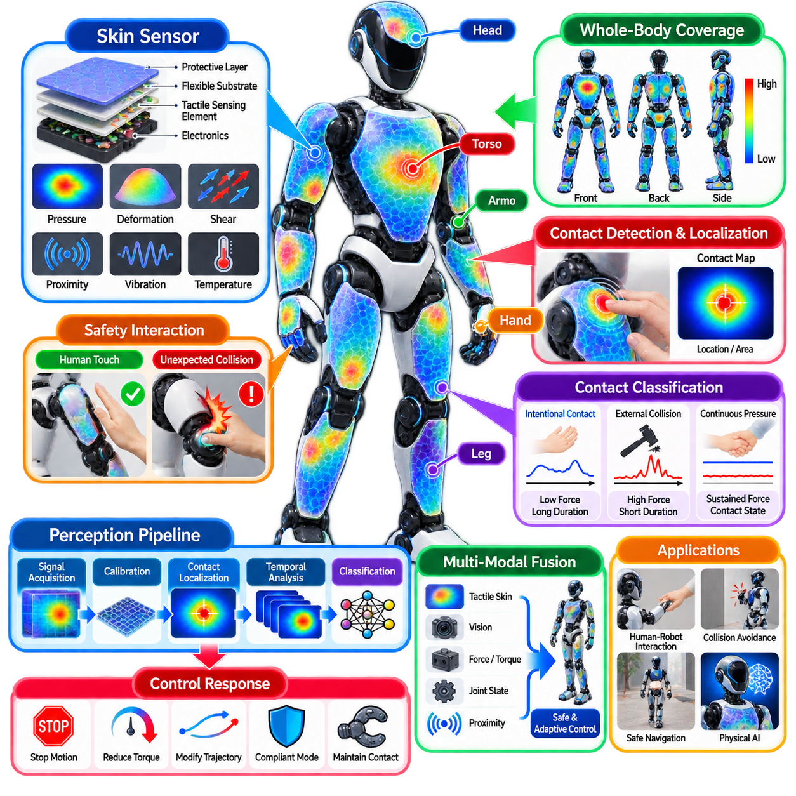{width="7.268055555555556in" height="7.268055555555556in"}

전신 스킨 센싱(Whole-Body Skin Sensing)은 휴머노이드 로봇이 몸통, 팔, 손, 다리 및 기타 외부에 노출된 표면 전체에서 물리적 접촉을 분산적으로 인지할 수 있도록 한다. 주로 모터 전류(Motor Current)나 관절 토크(Joint Torque)에 기반한 기존 충돌 감지(Collision Detection)와 달리, 스킨 센서는 실제 상호작용 표면에 더 가까운 위치에서 접촉을 관찰한다. 이를 통해 로봇은 발생한 하중이 전체 기구로 전달되기 전에 사람과의 접촉, 예상하지 못한 장애물, 압력, 국부적인 기계적 상호작용을 감지할 수 있다.

휴머노이드 스킨 시스템(Humanoid Skin System)은 일반적으로 유연하거나 순응성 있는 표면(Flexible or Compliant Surface)에 배치된 다수의 분산 센싱 요소(Distributed Sensing Element)로 구성된다. 각각의 센싱 요소는 압력(Pressure), 변형(Deformation), 전단(Shear), 근접(Proximity), 진동(Vibration) 또는 이와 관련된 물리량을 측정할 수 있다. 이러한 요소들은 국부적인 센서 패치(Local Sensor Patch)로 구성되고 영역별 획득 전자회로(Regional Acquisition Electronics)에 연결될 수 있다. 이러한 구조는 충분한 공간적 커버리지(Spatial Coverage)를 확보하면서도 로봇의 곡면 형상, 관절 운동, 기계적 변형, 외부 보호 구조와 호환되어야 한다.

전신 커버리지(Whole-Body Coverage)는 손끝 촉각 인지(Fingertip Tactile Perception)와는 근본적으로 다른 센싱 문제를 만든다. 손끝은 작은 물체와 직접 상호작용하기 때문에 매우 높은 공간 해상도(Spatial Resolution)가 필요할 수 있지만, 신체 스킨은 훨씬 넓은 영역을 커버하면서 여러 방향에서 발생하는 예상하지 못한 접촉을 감지해야 한다. 따라서 센서 설계에서는 공간 해상도, 센싱 범위(Sensing Range), 응답 시간(Response Time), 유연성(Flexibility), 내구성(Durability), 배선 복잡도(Wiring Complexity), 전력 소비(Power Consumption), 제조 비용(Manufacturing Cost) 사이의 균형이 필요하다. 사람과의 상호작용이나 충돌 위험이 높은 영역에서는 센서 밀도(Sensor Density)를 높일 수 있다.

접촉 위치 추정(Contact Localization)은 전신 스킨 센싱의 주요 기능 중 하나이다. 여러 센서 요소가 동시에 반응하면 그 공간적 패턴을 이용하여 접촉 위치와 대략적인 접촉 범위를 추정할 수 있다. 국부적인 압력 최대값(Local Pressure Maximum)은 상호작용의 중심을 나타낼 수 있으며, 주변의 활성화된 센서 요소는 접촉 영역을 나타낼 수 있다. 각각의 스킨 요소와 로봇 신체 모델 사이의 좌표 관계(Coordinate Mapping)를 유지하면 접촉 정보를 공통 로봇 좌표계(Robot Frame)로 표현하여 인지와 제어에 활용할 수 있다.

안전 중심 스킨 센싱(Safety-Oriented Skin Sensing)은 의도된 상호작용과 잠재적으로 위험한 충돌을 구분해야 한다. 사람은 정상적인 동작 중 휴머노이드를 만지거나, 밀거나, 잡거나, 유도할 수 있지만, 예상하지 못한 충돌은 즉각적인 보호 반응을 요구할 수 있다. 시스템은 접촉 크기(Contact Magnitude), 변화율(Rate of Change), 지속시간(Duration), 위치(Location), 방향(Direction), 로봇 운동(Motion Context)을 이용하여 이러한 상황을 분류할 수 있다. 따라서 접촉 해석(Contact Interpretation)은 촉각 신호만이 아니라 로봇의 명령된 행동과 현재 운용 상태를 함께 고려해야 한다.

휴머노이드 안전에서는 응답 지연시간(Response Latency)이 특히 중요하다. 스킨 센서는 기존의 기계적 보호 장치나 관절 수준 모니터링이 이벤트를 식별하기 전에 접촉을 감지할 수 있다. 따라서 센싱 시스템은 필요한 안전 대응을 지원할 수 있을 만큼 빠르게 접촉 정보를 획득하고 처리하며 전달해야 한다. 즉각적인 감지를 위해 저지연 하드웨어 경로(Low-Latency Hardware Path)를 사용할 수 있으며, 보다 상세한 해석을 위해 동일한 데이터를 더 긴 시간 윈도우에서 분석하는 고수준 인지 알고리즘을 동시에 사용할 수 있다.

스킨 센서 계층(Skin Sensor Layer)은 독립적인 측정 시스템으로 취급하기보다 로봇의 제어 아키텍처(Control Architecture)에 통합되어야 한다. 접촉 정보는 안전 제어기(Safety Controller), 전신 제어기(Whole-Body Controller), 모션 플래너(Motion Planner), 고수준 인지 모듈(High-Level Perception Module)로 전달될 수 있다. 감지된 이벤트에 따라 로봇은 동작을 정지하거나, 관절 토크를 감소시키거나, 궤적을 변경하거나, 순응 모드(Compliant Mode)로 전환하거나, 제어된 접촉을 유지할 수 있다. 적절한 대응은 상호작용의 위치, 심각도, 상황에 따라 달라진다.

분산형 스킨 센싱(Distributed Skin Sensing)은 특히 물리적 인간-로봇 상호작용(Physical Human--Robot Interaction)에 중요하다. 휴머노이드는 다른 작업을 수행하는 동안 사람이 자신의 팔을 만지거나 몸통을 밀거나 움직임을 방해하거나 접촉하는 상황을 인식해야 할 수 있다. 카메라의 시야 밖에 있을 수 있는 영역까지 스킨이 덮기 때문에 스킨 센서는 시각 인지의 보완적인 국부 센싱 계층(Local Sensing Layer)을 제공한다. 이를 통해 가림(Occlusion), 조명, 신체 자세 등의 영향을 받는 상황에서도 접촉을 감지할 수 있다.

전신 촉각 센싱(Whole-Body Tactile Sensing)은 충돌 회피(Collision Avoidance)와 운동 적응(Motion Adaptation)에도 기여할 수 있다. 로봇이 움직이는 동안 특정 신체 영역에서 접촉이 감지되면 로봇은 이러한 정보를 즉각적인 운동 반응에 반영할 수 있다. 예를 들어 예상하지 못한 접촉이 발생하면 로봇은 속도를 낮추거나 방향을 변경하거나 특정 신체 부위의 움직임을 정지하면서 다른 신체 부위에서는 안전한 동작을 계속 수행할 수 있다. 이를 통해 물리적 상호작용과 전신 운동 제어 사이에 직접적인 피드백 경로(Feedback Path)를 형성할 수 있다.

스킨의 기계적 구조(Mechanical Construction)는 센싱 계층이 반복적인 접촉을 견디면서도 예측 가능한 측정 특성을 유지해야 하기 때문에 매우 중요하다. 유연 기판(Flexible Substrate), 순응성 보호층(Compliant Protective Layer), 분할형 모듈(Segmented Module), 견고한 전기 연결부(Robust Electrical Connection)를 사용하면 곡면의 로봇 표면에 통합할 수 있다. 그러나 보호 재료는 힘의 전달 특성과 센서 감도(Sensitivity)에도 영향을 준다. 따라서 기계적 적층 구조(Mechanical Stack)는 보호층을 단순한 외장 구조로 취급하기보다 센서 특성과 함께 설계해야 한다.

센싱 요소의 수가 증가하면 보정(Calibration)과 상태 모니터링(Health Monitoring)이 더욱 어려워진다. 개별 센싱 요소는 서로 다른 오프셋(Offset), 감도(Sensitivity), 온도 응답(Temperature Response), 노화 특성(Aging Characteristic)을 가질 수 있다. 따라서 실제 시스템에서는 기준값 보정(Baseline Calibration), 센서 정규화(Sensor Normalization), 고장 또는 포화 센서 검출, 통신 품질 모니터링이 필요하다. 영역별 중복성(Regional Redundancy)을 적용하면 개별 센싱 요소의 신뢰성이 저하되는 경우에도 유용한 접촉 정보를 유지하는 데 도움이 될 수 있다.

전신 스킨 데이터는 비전(Vision), 힘-토크 센싱(Force--Torque Sensing), 관절 상태 정보(Joint-State Information), 모터 전류(Motor Current), 근접 센싱(Proximity Sensing)과 결합할 수 있다. 비전은 전역 환경 맥락(Global Environmental Context)을 제공하고, 관절 및 모터 측정값은 로봇의 내부 상태를 나타내며, 스킨 센서는 국부적인 물리적 접촉 정보를 제공한다. 멀티모달 융합(Multimodal Fusion)을 통해 단순히 접촉이 발생했다는 사실뿐만 아니라 접촉 위치, 로봇이 수행하던 행동, 해당 상호작용이 예상된 것이었는지까지 판단할 수 있다. 이는 체화 지능(Embodied Intelligence)과 피지컬 AI(Physical AI)에서 특히 중요하다.

피지컬 AI(Physical AI)에서 전신 스킨 센싱은 로봇과 환경 사이에 위치하는 분산형 물리 관측 계층(Distributed Physical Observation Layer)을 제공한다. 로봇은 접촉을 단순히 비정상적인 사건으로 취급하는 대신 물리적 상호작용을 지속적으로 관찰하고 이를 자신의 상태 표현(State Representation)의 일부로 사용할 수 있다. 접촉 패턴(Contact Pattern)은 인간-로봇 상호작용, 안전한 이동, 순응형 조작(Compliant Manipulation), 운동 적응, 물리적 경험으로부터의 학습에 활용될 수 있다. 따라서 스킨은 로봇의 체화 인지 시스템(Embodied Perception System)을 구성하는 중요한 요소가 된다.

완전한 전신 스킨 안전 아키텍처(Whole-Body Skin Safety Architecture)는 분산형 촉각 센싱을 국부 신호 획득(Local Signal Acquisition), 보정, 접촉 위치 추정, 시간적 처리(Temporal Processing), 접촉 분류(Contact Classification), 안전 의사결정 로직(Safety Decision Logic), 전신 제어와 연결한다. 이 아키텍처는 다양한 신체 영역에서 동작하면서 예측 가능한 응답 시간과 고장 처리(Fault Handling)를 유지해야 한다. 광범위한 물리적 커버리지와 로봇 상태에 대한 맥락 정보를 결합함으로써 휴머노이드 스킨 센싱은 기존의 인지 시스템과 기계적 안전 메커니즘을 보완하는 추가적인 접촉 인지 계층을 제공할 수 있다.

## 10.08. Tactile Data Learning Contact Rich Manipulation [w/Code]

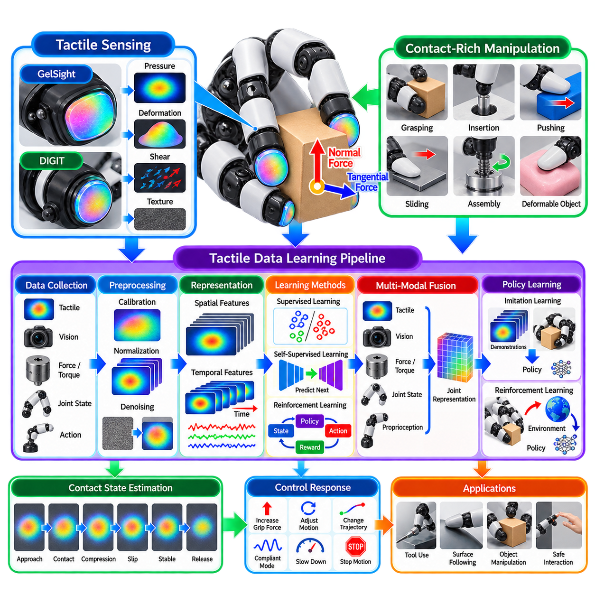{width="7.268055555555556in" height="7.268055555555556in"}

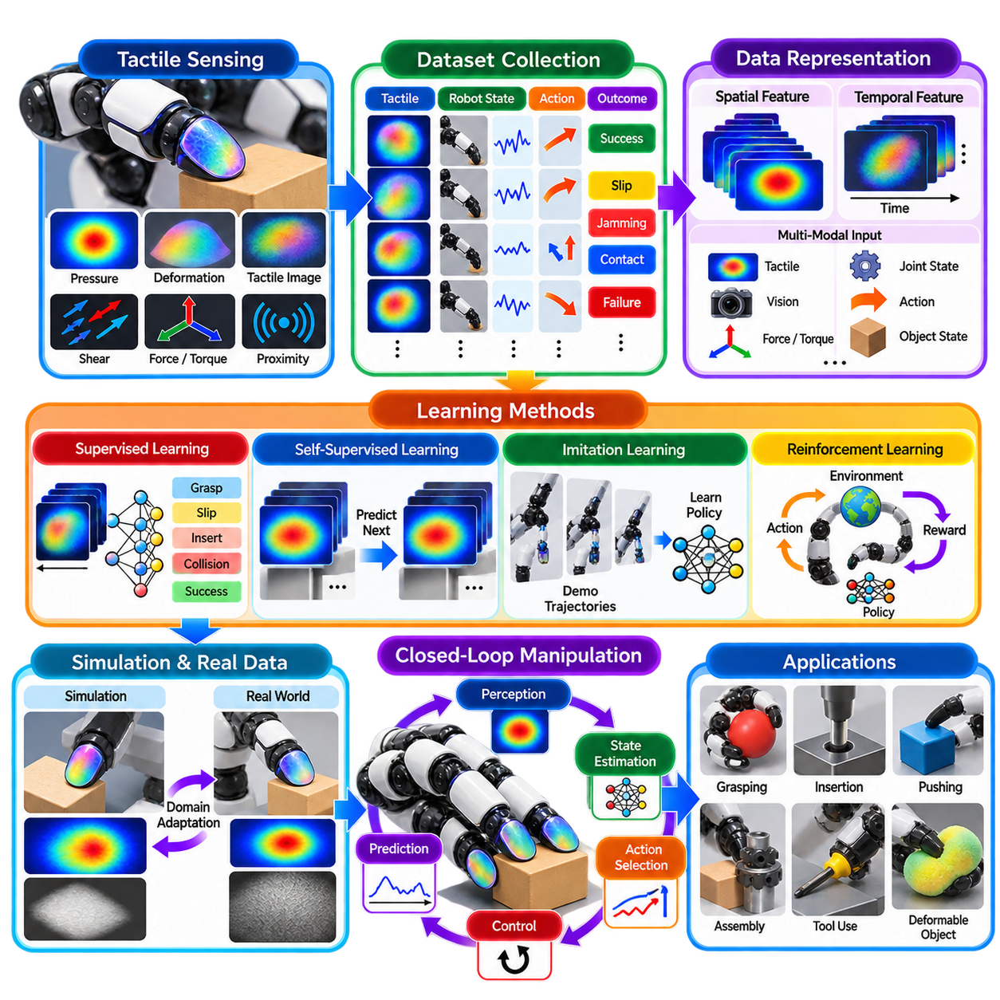{width="7.268055555555556in" height="7.268055555555556in"}

촉각 데이터 학습(Tactile Data Learning)은 로봇이 물리적 접촉 관측을 조작 의사결정(Manipulation Decision)과 학습 기반 제어에 활용할 수 있는 표현으로 변환할 수 있도록 한다. 주로 접촉 이전의 물체와 장면을 설명하는 비전(Vision)과 달리, 촉각 센싱(Tactile Sensing)은 실제 상호작용 인터페이스에서 어떤 일이 발생하는지를 관찰한다. 따라서 압력 분포(Pressure Distribution), 변형 패턴(Deformation Pattern), 접촉 형상(Contact Geometry), 미끄러짐 신호(Slip Signal), 힘-토크 측정값(Force--Torque Measurement)은 접촉 중심 조작(Contact-Rich Manipulation) 과정에서 로봇 행동의 물리적 결과에 대한 학습 정보를 제공할 수 있다.

접촉 중심 조작(Contact-Rich Manipulation)은 실행 과정에서 물리적 상호작용이 지속되거나 반복적으로 변화하는 작업을 포함한다. 파지(Grasping), 삽입(Insertion), 밀기(Pushing), 미끄러뜨리기(Sliding), 조립(Assembly), 도구 사용(Tool Use), 표면 추종(Surface Following), 변형 가능한 물체(Deformable Object) 취급 등이 그 예이다. 이러한 작업에서는 시각 관측만으로 물체가 올바르게 정렬되었는지, 구속되었는지, 미끄러지고 있는지, 걸렸는지 또는 안정적으로 지지되고 있는지를 완전히 파악하기 어려울 수 있다. 촉각 데이터는 이러한 숨겨진 상호작용 상태를 추론하고 로봇의 행동 선택을 향상시키는 데 사용할 수 있는 국부적인 증거를 제공한다.

유용한 촉각 학습 데이터셋(Tactile Learning Dataset)은 센서 관측, 로봇 상태, 행동, 작업 결과 사이의 관계를 보존해야 한다. 촉각 프레임이나 압력 맵(Pressure Map)은 관절 위치(Joint Position), 속도, 명령된 행동(Commanded Action), 힘-토크 측정값, 물체 상태(Object State), 시간적 맥락(Temporal Context)과 연결될 때 더욱 가치가 높아진다. 이러한 동기화된 기록을 이용하면 학습 시스템은 단순히 접촉이 어떻게 보이는지를 학습하는 것이 아니라, 로봇의 움직임에 따라 접촉이 어떻게 변화하는지와 이러한 변화가 작업 성공에 어떤 영향을 미치는지를 추정할 수 있다.

데이터 표현(Data Representation)은 촉각 센서가 서로 다른 형태의 신호를 생성하기 때문에 중요한 설계 요소가 된다. 정전용량식(Capacitive) 및 저항식(Resistive) 배열은 압력 맵을 생성할 수 있고, 광학식 센서(Optical Sensor)는 고해상도 촉각 영상을 생성할 수 있으며, 힘-토크 센서는 저차원 렌치 측정값(Wrench Measurement)을 제공한다. 이러한 신호는 독립적으로 처리하거나 공통 잠재 표현(Common Latent Representation)으로 인코딩할 수 있다. 공간 특징(Spatial Feature)은 접촉이 어디에서 발생하는지를 설명하고, 시간 특징(Temporal Feature)은 접촉이 어떻게 변화하는지를 설명한다.

시간 정보(Temporal Information)는 접촉 동역학(Contact Dynamics)을 학습하는 데 특히 중요하다. 단일 촉각 프레임은 안정적인 접촉 상태를 보여줄 수 있지만, 연속적인 시퀀스는 접근(Approach), 충돌(Impact), 압축(Compression), 미끄러짐(Slip), 해제(Release), 걸림(Jamming)과 같은 상태를 나타낼 수 있다. 시간 합성곱(Temporal Convolution), 순환 모델(Recurrent Model), 트랜스포머(Transformer) 또는 기타 시퀀스 학습 방법을 이용하면 이러한 변화를 표현할 수 있다. 이렇게 얻은 표현은 미래의 접촉 상태를 예측하거나 현재의 물리적 조건에서 어떤 행동이 적절한지를 결정하는 데 사용할 수 있다.

지도학습(Supervised Learning)은 촉각 관측과 사람이 정의한 작업 라벨(Task Label)을 연결할 수 있다. 라벨은 파지 성공(Grasp Success), 접촉 유형(Contact Type), 미끄러짐 상태(Slip State), 삽입 정렬(Insertion Alignment), 충돌(Collision), 작업 완료(Task Completion) 등을 나타낼 수 있다. 분류 모델(Classification Model)은 이러한 촉각 특징에서 해당 상태로 이어지는 관계를 학습할 수 있다. 감독 정보의 품질은 중요하다. 모호하거나 일관되지 않은 라벨은 모델이 의미 있는 물리적 상호작용이 아니라 센서의 인공적인 패턴을 학습하도록 만들 수 있기 때문이다.

자기지도학습(Self-Supervised Learning)은 수동으로 촉각에 라벨을 지정해야 하는 부담을 줄일 수 있다. 모든 접촉 시퀀스를 사람이 직접 라벨링하는 대신, 로봇은 시간적 일관성(Temporal Consistency), 센서 복원(Sensor Reconstruction), 모달리티 간 예측(Cross-Modal Prediction), 미래 상태 예측(Future-State Prediction)과 같이 자연스럽게 이용할 수 있는 신호를 통해 학습할 수 있다. 예를 들어 모델은 현재 촉각 관측과 로봇 상태의 이력을 이용하여 다음 촉각 관측을 예측하도록 학습할 수 있다. 이러한 예측 관계를 통해 작업별 미세 조정(Task-Specific Fine-Tuning)을 수행하기 전에 유용한 표현을 확보할 수 있다.

멀티모달 학습(Multimodal Learning)은 촉각 정보가 국부적인 반면 시각 정보는 주로 전역적인 특성을 가지기 때문에 특히 유용하다. 카메라는 물체를 식별하고 대략적인 자세를 추정할 수 있지만, 촉각 센싱은 파지 이후 실제 접촉 상태를 결정할 수 있다. 힘-토크 센싱은 전체적인 기계적 하중을 제공하고, 고유감각(Proprioception) 데이터는 로봇의 구성과 움직임을 설명한다. 이러한 모달리티를 결합하면 시각적 의도(Visual Intent)와 실제 물리적 실행(Physical Execution)을 연결하는 표현을 만들 수 있다.

모방학습(Imitation Learning)은 성공적인 물리적 상호작용으로부터 촉각 시연(Tactile Demonstration)을 이용하여 조작 정책(Manipulation Policy)을 학습할 수 있다. 시연 데이터에는 촉각 관측과 함께 로봇 행동, 관절 상태, 작업 맥락이 포함될 수 있다. 학습된 정책은 특정 접촉 패턴을 특정한 보정 행동(Corrective Action)이나 생산적인 행동(Productive Action)과 연결할 수 있다. 시각적으로 동일한 상황이라도 마찰, 접촉 정렬 또는 물체의 미끄러짐 시작 여부에 따라 서로 다른 행동이 필요할 수 있기 때문에 촉각 정보는 특히 유용하다.

강화학습(Reinforcement Learning)은 상호작용을 통해 촉각 기반 조작을 더욱 최적화할 수 있다. 로봇은 촉각 특징을 포함한 관측을 받고 작업 진행도, 안정성, 힘 제한(Force Limit), 성공적인 완료를 기준으로 보상을 얻는다. 정책은 불확실한 접촉 조건에서 기대되는 결과를 향상시키는 행동을 학습한다. 보상 설계(Reward Design)는 중요하다. 물리적 제약 없이 작업 성공만을 최대화하면 과도한 힘, 물체를 손상시키는 접촉, 바람직하지 않은 조작 전략이 발생할 수 있기 때문이다.

접촉 중심 학습(Contact-Rich Learning)은 이벤트 기반 표현(Event-Based Representation)의 이점도 활용할 수 있다. 모든 촉각 샘플을 동일한 방식으로 처리하는 대신 최초 접촉(First Contact), 최대 압축(Peak Compression), 미끄러짐 시작(Onset of Slip), 안정적인 지지(Stable Support), 접촉 상실(Loss of Contact), 충돌과 같은 의미 있는 이벤트를 식별할 수 있다. 이러한 이벤트는 상호작용 동역학(Interaction Dynamics)을 간결하게 표현하며 상위 수준의 작업 모델(Task Model)에 대한 입력으로 사용할 수 있다. 이벤트 표현은 장시간 조작 시퀀스에서 필요한 계산량을 줄이는 데에도 도움이 될 수 있다.

데이터 다양성(Data Diversity)은 촉각 학습에서 매우 중요하다. 접촉 신호는 물리적 조건에 강하게 의존하기 때문이다. 물체 재질, 표면 질감, 형상, 질량, 마찰, 파지력, 센서 순응성(Sensor Compliance), 도구 구성, 조작 속도 등은 모두 관측되는 촉각 패턴을 변화시킬 수 있다. 이러한 조건 중 하나의 조합만으로 학습된 모델은 다른 물체나 센서 구성으로 전이될 때 실패할 수 있다. 따라서 데이터셋 구성에서는 단순히 거의 동일한 샘플의 수를 늘리는 것보다 의미 있는 변화를 포함하는 것이 중요하다.

보정(Calibration)과 센서 일관성(Sensor Consistency) 역시 학습에서 중요하다. 센서 장착 상태, 엘라스토머(Elastomer) 특성, 조명, 온도, 전자회로, 기계적 마모의 변화는 촉각 관측의 분포를 변화시킬 수 있다. 이러한 변화가 학습 데이터에 포함되거나 전처리 단계에서 보상되지 않으면 학습된 모델은 센서 드리프트(Sensor Drift)를 물리적 변화로 해석할 수 있다. 따라서 안정적인 보정 절차와 센서 정규화(Sensor Normalization)는 학습된 촉각 표현의 신뢰성을 향상시킬 수 있다.

시뮬레이션된 촉각 데이터(Simulated Tactile Data)는 실제 데이터 수집을 보완할 수 있지만, 시뮬레이션이 관련 접촉 물리와 센서 특성을 충분히 재현해야 한다. 합성 데이터(Synthetic Data)는 물리적으로 수집하기 어렵거나 비용이 많이 드는 조건을 포함하여 대량의 제어된 상호작용을 제공할 수 있다. 도메인 랜덤화(Domain Randomization)와 적응 기법(Adaptation Technique)은 시뮬레이션 촉각 관측과 실제 촉각 관측 사이의 차이를 줄일 수 있다. 실제 촉각 데이터는 학습된 표현이 실제 센서 동작으로 전이되는지를 검증하는 데 여전히 중요하다.

촉각 학습은 궁극적으로 오프라인 인식(Offline Recognition)에만 머무르지 않고 폐루프 조작(Closed-Loop Manipulation)을 지원해야 한다. 시스템은 접촉을 관찰하고 현재의 상호작용 상태를 추정하며, 현재 움직임이 계속될 경우 발생할 가능성이 높은 결과를 예측하고, 작업 성능을 유지하거나 향상시키는 행동을 선택한다. 미끄러짐이 감지되면 정책은 파지력을 증가시킬 수 있고, 삽입 저항이 예상보다 증가하면 정렬을 조정할 수 있으며, 접촉이 불안정해지면 움직임을 늦추거나 변경할 수 있다. 이를 통해 직접적인 인지-예측-행동(Perception--Prediction--Action) 루프가 형성된다.

피지컬 AI(Physical AI)에서 촉각 데이터는 물리적 행동의 결과를 상호작용 지점에서 기록하기 때문에 특히 중요한 체화 경험(Grounded Experience)의 원천이 된다. 이러한 신호로부터 학습하면 로봇은 접촉, 마찰, 순응성(Compliance), 안정성, 조작 결과에 대한 표현을 획득할 수 있다. 비전, 힘-토크 센싱, 고유감각, 행동 이력(Action History)과 결합할 경우 촉각 학습은 로봇의 행동이 물리적 세계에 어떤 영향을 미치는지를 표현하는 멀티모달 모델(Multimodal Model)에 기여할 수 있다.

완전한 촉각 학습 파이프라인(Tactile Learning Pipeline)은 센서 획득과 보정에서 시작하여 동기화(Synchronization), 전처리(Preprocessing), 특징 또는 표현 학습(Feature or Representation Learning), 멀티모달 융합, 작업 라벨링 또는 자기지도학습 목적함수, 정책 학습(Policy Learning), 평가(Evaluation), 폐루프 배포(Closed-Loop Deployment)로 연결된다. 핵심 목적은 단순히 촉각 영상을 분류하는 것이 아니라 접촉 관측, 로봇 행동, 물리적 결과 사이의 관계를 학습하는 것이다. 이러한 접촉 기반 학습(Contact-Grounded Learning)은 실제 물리적 인터페이스에서 발생하는 상황에 따라 행동을 적응시킬 수 있는 조작 시스템의 기반을 제공한다.

## 10.09. Force Torque ROS2 Driver and Filter [w/Code]

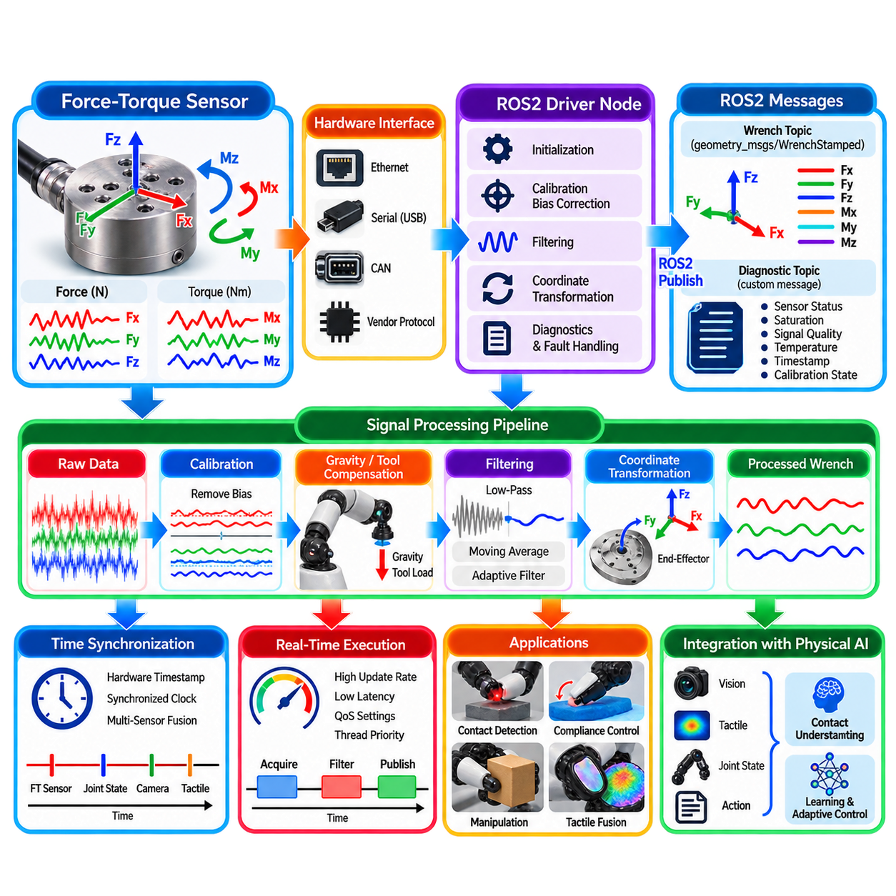{width="7.268055555555556in" height="7.268055555555556in"}

힘-토크 센서 드라이버(Force--Torque Sensor Driver)는 물리적인 6축 센서(6-Axis Sensor)와 ROS2 인지 및 제어 시스템 사이의 소프트웨어 인터페이스를 제공한다. 센서는 일반적으로 3개의 힘 성분 Fx, Fy, Fz와 3개의 토크 성분 Mx, My, Mz를 출력한다. ROS2 드라이버는 이러한 측정값을 신뢰성 있게 획득하고, 센서별로 필요한 해석을 적용하며, 정확한 타임스탬프(Timestamp)를 부여하고, 표준화된 메시지(Standardized Message)로 발행해야 한다. 이를 통해 후단의 접촉 감지(Contact Detection), 순응 제어(Compliance Control), 조작(Manipulation), 촉각 융합(Tactile Fusion) 모듈이 데이터를 일관되게 사용할 수 있다.

생산 수준의 드라이버(Production-Quality Driver)는 하드웨어 통신과 신호 처리를 ROS2 통신으로부터 분리해야 한다. 하드웨어 계층(Hardware Layer)은 Ethernet, 직렬 통신(Serial Communication), CAN 또는 제조사 전용 인터페이스와 같은 프로토콜을 관리하고, 처리 계층(Processing Layer)은 보정(Calibration), 바이어스 보정(Bias Correction), 필터링(Filtering), 좌표 변환(Coordinate Transformation), 유효성 검사를 수행한다. 이후 ROS2 노드는 처리된 렌치(Wrench)를 적절한 메타데이터(Metadata)와 함께 발행한다. 이러한 분리는 시스템 테스트를 쉽게 하며, 동일한 처리 로직을 시뮬레이션 데이터나 기록된 센서 데이터에도 재사용할 수 있도록 한다.

센서 초기화(Initialization)는 후단 구성요소가 측정값을 사용하기 전에 결정론적인 운용 상태(Deterministic Operating State)를 설정해야 한다. 드라이버는 샘플링 속도(Sampling Rate), 통신 모드, 센서 범위(Sensor Range), 출력 형식(Output Format), 내부 필터링(Internal Filtering), 보정 파라미터(Calibration Parameter)를 설정해야 할 수 있다. 또한 센서가 시스템에서 사용 가능해지기 전에 통신 상태를 확인하고 비정상적인 값을 검출해야 한다. 가능한 경우 ROS2 라이프사이클 관리(Lifecycle Management)를 사용하여 설정(Configuration), 활성화(Activation), 운용(Operation), 종료(Shutdown)를 명시적이고 예측 가능한 상태로 관리할 수 있다.

타임스탬프 품질(Timestamp Quality)은 힘-토크 측정값이 관절 상태(Joint State), 촉각 영상(Tactile Image), 로봇 운동(Robot Motion), 카메라 관측(Camera Observation)과 자주 결합되기 때문에 중요하다. 따라서 측정값에는 ROS2 메시지가 발행된 시간이 아니라 실제 획득 시간에 최대한 가까운 타임스탬프가 부여되어야 한다. 하드웨어 타임스탬프(Hardware Timestamp) 또는 동기화된 클록(Synchronized Clock)을 사용하면 시간적 불확실성을 줄일 수 있다. 여러 센서가 접촉 추정(Contact Estimation)에 참여하는 경우 일관된 시간 동기화(Time Synchronization)는 빠른 충격과 일시적인 상호작용을 해석하는 데 특히 중요하다.

보정(Calibration)은 원시 센서 출력을 물리적으로 의미 있는 힘과 토크 값으로 변환한다. 센서 특성에 따라 스케일 계수(Scale Factor), 축 정렬(Axis Alignment), 바이어스 보정, 완전한 보정 행렬(Calibration Matrix)이 필요할 수 있다. 무부하 바이어스 추정(Zero-Bias Estimation)은 특히 중요하다. 작은 오프셋도 지속적인 접촉력(Contact Force)처럼 나타날 수 있기 때문이다. 드라이버는 무부하 측정값을 획득하기 위한 제어된 절차를 제공하고, 정상적인 페이로드(Payload)나 중력(Gravity)의 영향을 센서 오류로 잘못 판단하지 않으면서 해당 바이어스 값을 적용할 수 있어야 한다.

중력 및 툴 하중 보상(Gravity and Tool-Load Compensation)은 기본적인 센서 보정과 구분하는 것이 일반적으로 바람직하다. 보정은 센서 자체의 특성을 수정하는 반면, 보상(Compensation)은 센서에 가해지는 알려진 기계적 하중을 처리한다. 매니퓰레이터(Manipulator)에서는 툴의 질량, 무게중심(Center of Mass), 자세(Orientation)에 의해 상당한 렌치 성분이 발생할 수 있으며, 툴이 환경과 접촉하지 않은 상태에서도 이러한 값이 나타날 수 있다. 따라서 상위 수준의 보상 모듈은 로봇 운동학(Robot Kinematics)과 현재 자세를 이용하여 예측 가능한 하중을 제거한 후 접촉 감지나 힘 제어를 수행할 수 있다.

힘-토크 신호는 전기적 노이즈, 구조적 진동(Structural Vibration), 모터에 의해 발생하는 외란, 양자화 효과(Quantization Effect)를 포함하는 경우가 많기 때문에 필터링이 필요하다. 저역통과 필터(Low-Pass Filter)는 고주파 노이즈를 억제할 수 있으며, 이동 평균 필터(Moving-Average Filter)나 지수 필터(Exponential Filter)는 간단한 계산 방식으로 사용할 수 있다. 그러나 과도한 필터링은 위상 지연(Phase Delay)을 발생시키고 빠른 접촉 이벤트를 숨길 수 있다. 따라서 필터 파라미터는 사용 목적에 따라 선택해야 하며, 충돌 또는 충격 감지를 위한 경로는 빠르게, 힘 추정이나 조작 제어를 위한 경로는 보다 부드럽게 구성할 수 있다.

힘과 토크 채널에는 노이즈 특성과 기계적 민감도가 서로 다를 수 있기 때문에 서로 다른 필터링 전략이 필요할 수 있다. 6개 축 모두에 동일한 고정 필터(Fixed Filter)를 적용하는 것은 간단하지만 최적의 응답을 제공하지 않을 수 있다. 보다 발전된 구현에서는 서로 다른 차단 주파수(Cutoff Frequency), 알려진 진동 주파수를 위한 노치 필터(Notch Filter), 운용 조건이 변화할 때의 적응형 방법(Adaptive Method)을 사용할 수 있다. 드라이버는 필터링 파라미터를 명확하게 노출하여 하드웨어 인터페이스 자체를 수정하지 않고도 시스템을 조정할 수 있도록 해야 한다.

좌표계 처리(Coordinate-Frame Handling)는 힘-토크 통합에서 또 하나의 중요한 부분이다. 센서는 자신의 측정 좌표계(Measurement Frame)에서 렌치를 측정하지만, 조작 알고리즘은 툴 좌표계(Tool Frame), 엔드이펙터 좌표계(End-Effector Frame), 로봇 베이스 좌표계(Robot Base Frame), 접촉 좌표계(Contact Frame)에서 렌치를 필요로 할 수 있다. 렌치를 변환할 때는 힘과 토크 성분을 올바르게 처리해야 하며, 기준점(Reference Point)이 변경될 때 발생하는 영향도 고려해야 한다. 따라서 ROS2 애플리케이션은 일관된 TF2 프레임 구조를 유지하고 모든 발행된 렌치에 연결된 좌표계를 명확하게 정의해야 한다.

ROS2 메시지 설계(Message Design)는 측정값의 의미를 보존해야 한다. 표준 렌치 메시지(Standard Wrench Message)는 힘과 토크 벡터를 포함할 수 있으며, 메시지 헤더(Message Header)는 타임스탬프와 기준 좌표계를 제공한다. 센서 상태(Sensor Status), 포화 상태(Saturation State), 통신 상태(Communication Health), 보정 상태(Calibration State), 신호 품질(Signal Quality)과 같은 추가 진단 정보는 별도의 메시지로 발행할 수 있다. 이러한 분리는 애플리케이션 코드가 문서화되지 않은 제조사 전용 필드에 의존하는 것을 방지하면서도 하드웨어에 대한 상세한 모니터링을 가능하게 한다.

힘-토크 신호가 제어 루프(Control Loop)에 직접 참여하는 경우 실시간 동작(Real-Time Behavior)이 중요해진다. 획득 및 필터링 경로에서는 불필요한 동적 메모리 할당(Dynamic Memory Allocation), 제어되지 않는 블로킹 연산(Blocking Operation), 예측하기 어려운 처리 지연을 피해야 한다. ROS2 실행기(Executor), 콜백 그룹(Callback Group), QoS 설정(QoS Setting), 스레드 우선순위(Thread Priority)는 필요한 업데이트 속도와 지연시간에 맞게 선택해야 한다. 고속 센서 데이터는 통신 계층이 불필요한 지연이나 과도한 버퍼링을 발생시키지 않도록 적절한 히스토리(History)와 신뢰성(Reliability) 설정을 요구할 수도 있다.

고장 처리(Fault Handling)는 드라이버에 처음부터 설계되어야 하며 나중에 추가하는 기능으로 취급해서는 안 된다. 통신 손실(Communication Loss), 잘못된 패킷(Invalid Packet), 센서 포화(Sensor Saturation), 누락된 샘플(Missing Sample), 비정상적인 오프셋(Abnormal Offset), 타임스탬프 불연속(Timestamp Discontinuity), 물리적 운용 범위를 벗어난 값은 명시적으로 검출해야 한다. 드라이버는 유효한 거의 0에 가까운 측정값과 업데이트가 중단된 센서를 구분할 수 있어야 한다. 그러면 하위 제어기는 손상된 데이터를 거부하거나 안전 모드(Safe Mode)로 진입하거나 다른 센싱 소스로 전환하는 등의 적절한 대응을 수행할 수 있으며, 잘못된 데이터를 실제 물리적 상호작용으로 처리하지 않을 수 있다.

힘-토크 필터링은 실제 조작 작업을 기준으로 평가해야 한다. 기록 과정에서 시각적으로 부드러운 신호를 만드는 필터라도 지연시간 때문에 충격 인식이 늦어진다면 접촉 감지에는 적합하지 않을 수 있다. 반대로 최소한으로 필터링된 신호는 안정적인 힘 제어를 수행하기에는 진동이 너무 클 수 있다. 따라서 실제 평가는 노이즈 수준, 계단 응답(Step Response), 지연시간, 오버슈트(Overshoot), 주파수 응답(Frequency Response), 접촉 이벤트 감지 시간, 제어 안정성(Control Stability)을 고려해야 한다. 기록된 데이터셋은 실제 로봇에 적용하기 전에 다양한 필터 설정을 비교하는 데 특히 유용할 수 있다.

피지컬 AI(Physical AI)에서 ROS2 힘-토크 드라이버는 단순한 하드웨어 추상화 계층(Hardware Abstraction Layer) 이상의 역할을 한다. 이는 인지, 학습, 제어에 사용되는 물리적 상호작용 신호의 신뢰성을 결정하기 때문이다. 일관되게 보정되고, 시간 정렬(Time-Aligned)되며, 필터링되고, 올바른 좌표계로 변환된 렌치 측정 스트림은 촉각 영상, 관절 상태, 비전, 로봇 행동과 결합할 수 있다. 이러한 동기화된 신호는 접촉 분류(Contact Classification), 미끄러짐 감지(Slip Detection), 파지 안정성 추정(Grasp Stability Estimation), 순응형 조작(Compliant Manipulation), 접촉 중심 경험으로부터의 학습(Learning from Contact-Rich Experience)을 지원할 수 있다.

완전한 힘-토크 ROS2 아키텍처(Force--Torque ROS2 Architecture)는 센서 통신, 초기화, 타임스탬프, 보정, 보상, 필터링, 좌표 변환, ROS2 발행, 진단(Diagnostics), 고장 처리를 하나의 제어된 데이터 경로(Controlled Data Path)로 연결한다. 최종 출력은 실시간 제어에 충분할 만큼 예측 가능하면서도 상위 수준의 인지와 학습에 필요한 물리적 정보를 충분히 보존해야 한다. 이러한 설계를 통해 힘-토크 센싱은 로봇의 환경과의 물리적 상호작용과 ROS2 기반 지능 스택(Intelligence Stack) 사이를 연결하는 신뢰성 높은 인터페이스로 기능할 수 있다.

## 10.10. Tactile Perception Integration in Manipulator Case

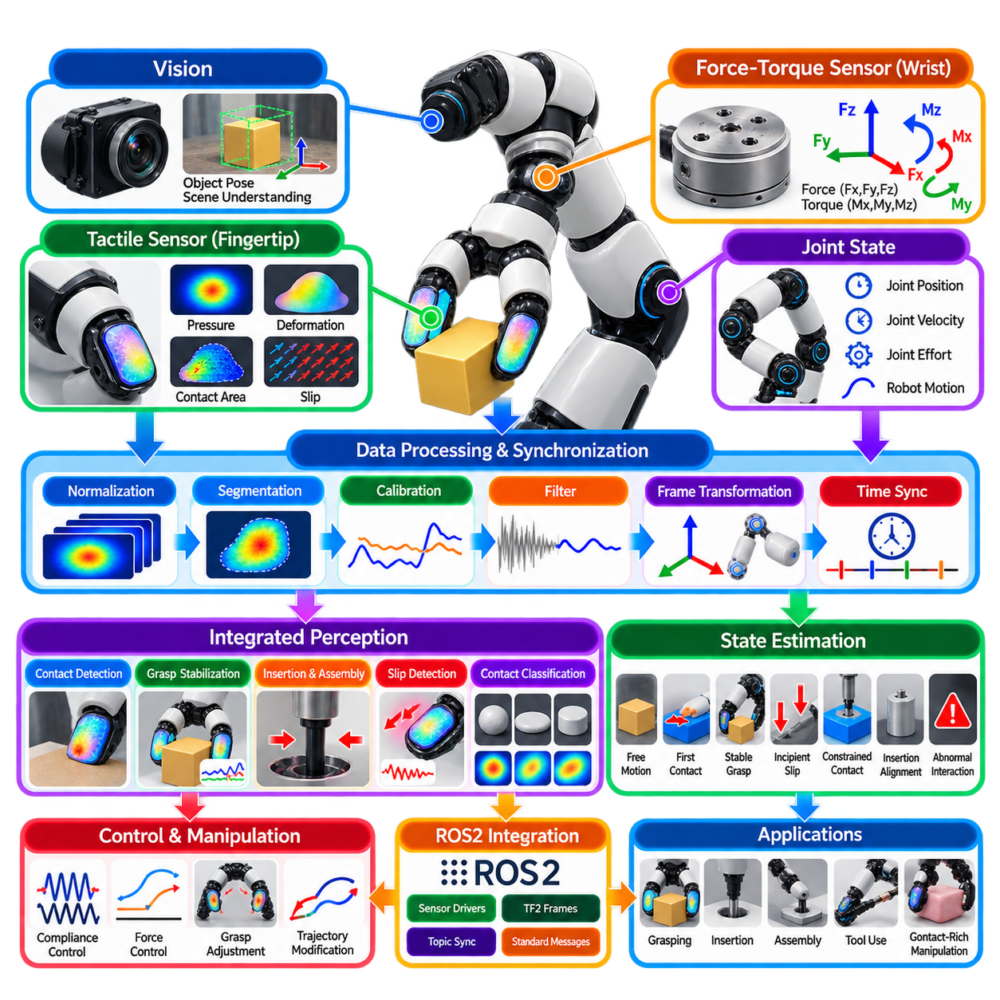{width="7.268055555555556in" height="7.268055555555556in"}

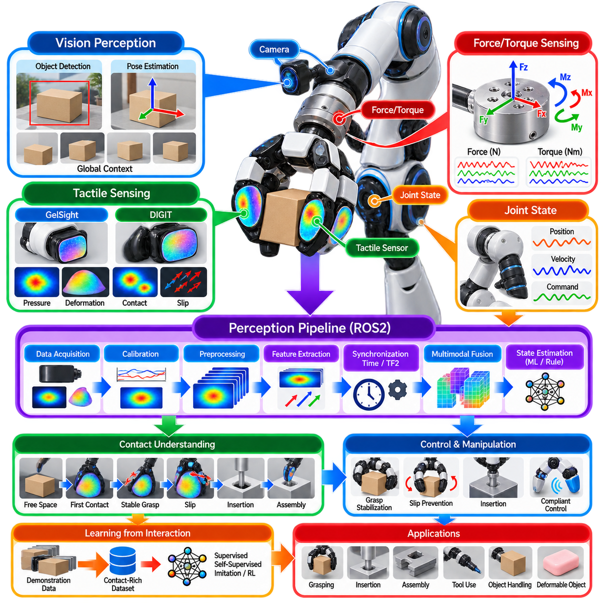{width="7.268055555555556in" height="7.268055555555556in"}

실용적인 매니퓰레이터(Manipulator)는 비전(Vision), 관절 상태 피드백(Joint-State Feedback), 힘-토크 측정(Force--Torque Measurement)을 보완하는 연속적인 센싱 계층(Sensing Layer)으로 촉각 인지(Tactile Perception)를 통합한다. 비전은 물체를 식별하고 초기 자세를 추정할 수 있는 반면, 촉각 센서는 엔드이펙터(End-Effector)가 물체에 도달한 이후 실제 접촉 상태를 관찰한다. 이러한 통합은 물체가 부분적으로 가려지는 경우, 시각적 위치 추정 이후에도 기하학적 불확실성이 남아 있는 경우, 또는 외부 카메라만으로 신뢰성 있게 추론하기 어려운 미세한 접촉 변화에 따라 조작 성공 여부가 결정되는 경우에 특히 중요하다.

대표적인 촉각 매니퓰레이터 아키텍처는 그립 표면에 촉각 센서를 장착하고, 필요한 경우 손목에 힘-토크 센서(Wrist-Mounted Force--Torque Sensor)를 추가한다. 촉각 센싱은 국부적인 압력(Pressure), 변형(Deformation), 접촉 형상(Contact Geometry), 미끄러짐(Slip) 정보를 제공하고, 손목 센서는 전체적인 6축 렌치(Six-Axis Wrench)를 제공한다. 관절 위치, 속도, 명령된 움직임은 로봇 상태 맥락(Robot-State Context)을 제공한다. 이러한 신호는 일관된 타임스탬프(Timestamp)를 사용하여 획득해야 하며, 이를 통해 시스템은 특정 촉각 이벤트를 해당 이벤트를 발생시킨 정확한 로봇 움직임 및 기계적 상태와 연결할 수 있다.

인지 파이프라인(Perception Pipeline)은 센서 융합(Fusion)을 수행하기 전에 각 센서 스트림을 먼저 처리한다. 촉각 영상(Tactile Image)이나 압력 맵(Pressure Map)은 정규화(Normalization), 배경 보정(Background Compensation), 접촉 영역 분할(Contact Segmentation), 공간 특징 추출(Spatial Feature Extraction)이 필요할 수 있다. 힘-토크 측정값은 보정(Calibration), 바이어스 보정(Bias Correction), 중력 또는 툴 하중 보상(Gravity or Tool-Load Compensation), 필터링(Filtering), 좌표 변환(Coordinate Transformation)이 필요하다. 관절 상태 데이터 역시 유효성을 확인하고 센서 스트림과 동기화해야 한다. 목적은 단순히 각각의 신호를 깨끗하게 만드는 것이 아니라, 접촉 인터페이스(Contact Interface)에서 함께 해석할 수 있는 물리적으로 일관된 관측값을 생성하는 것이다.

접촉 감지(Contact Detection)는 통합 인지 계층의 첫 번째 의사결정 단계이다. 물체에 접근하는 매니퓰레이터는 처음에는 자유 공간(Free Space)에서 움직이다가 최초 접촉(First Contact)을 거쳐 지속적인 하중(Sustained Loading) 상태로 전환될 수 있다. 촉각 활성화(Tactile Activation)는 국부적인 접촉 영역을 식별할 수 있고, 힘-토크 센서는 측정 가능한 외부 렌치(External Wrench)가 형성되었음을 확인할 수 있다. 이러한 신호를 결합하면 하나의 임계값에 대한 의존도를 줄일 수 있으며, 측정된 힘이 의도된 파지(Grasping), 환경과의 접촉(Environmental Contact), 또는 예상하지 못한 충돌(Unexpected Collision)에 해당하는지에 대한 맥락 정보를 제공할 수 있다.

파지 안정화(Grasp Stabilization)는 통합 인지 루프의 다음 단계이다. 촉각 센서는 개별 손가락의 압력 분포와 접촉 면적을 추정할 수 있고, 힘-토크 측정값은 전체적인 기계적 하중을 설명한다. 접촉 표면에서 압력 중심이 이동하거나 국부적인 촉각 특징이 움직이기 시작하면 시스템은 초기 미끄러짐(Incipient Slip)을 식별할 수 있다. 그러면 제어기는 물체를 놓치기 전에 손가락 힘이나 움직임을 조정할 수 있다. 이를 통해 촉각 관측, 파지 상태 추정(Grasp-State Estimation), 조작 제어 사이에 폐루프 관계가 형성된다.

삽입 및 조립(Insertion and Assembly) 작업은 촉각 정보와 힘 정보를 결합하는 것의 가치를 잘 보여준다. 비전은 매니퓰레이터를 대략적인 삽입 위치로 유도할 수 있지만, 최종 정렬(Final Alignment)은 물리적 접촉에 의해 결정될 수 있다. 삽입 과정에서 증가하는 횡력(Lateral Force)이나 토크는 정렬 불량(Misalignment)을 나타낼 수 있으며, 촉각 패턴은 그리퍼 또는 도구의 어느 부분이 물체와 접촉하고 있는지를 식별할 수 있다. 로봇은 계속해서 힘을 증가시키는 대신 자세나 궤적을 수정하여 대응할 수 있다. 따라서 촉각 인지는 접촉 유도 움직임(Contact-Guided Motion)을 위한 능동적인 정보원이 된다.

GelSight 또는 DIGIT과 같은 광학 촉각 센서(Optical Tactile Sensor)를 사용하면 매니퓰레이터는 상세한 접촉 형상과 국부적인 움직임도 추출할 수 있다. 영상 상관(Image Correlation), 광학 흐름(Optical Flow), 특징 추적(Feature Tracking)을 통해 접촉 영역 내부의 변위를 추정하고 미끄러짐 방향과 국부적인 변형에 대한 정보를 얻을 수 있다. 이러한 영상 기반 측정값은 저차원의 힘-토크 신호를 보완한다. 힘 센서는 전체적인 하중이 얼마나 발생하고 있는지를 나타내는 반면, 촉각 영상은 그 하중이 어디에서 발생하고 있으며 접촉 패턴이 어떻게 변화하고 있는지를 나타낸다.

ROS2는 이러한 센싱 및 제어 기능을 연결하는 미들웨어 계층(Middleware Layer)을 제공할 수 있다. 개별 드라이버는 보정된 촉각 및 힘-토크 측정값을 발행하고, 동기화 및 변환 구성요소는 공통의 시간적 및 공간적 기준을 설정한다. 이렇게 생성된 데이터는 접촉 감지, 파지 평가(Grasp Assessment), 조작 계획(Manipulation Planning), 순응 제어(Compliant Control) 노드에서 사용할 수 있다. 일관된 TF2 프레임 구조와 표준화된 메시지 인터페이스는 중요하다. 촉각 측정값은 로봇 및 도구와의 공간적 관계가 정확하게 유지될 때만 의미를 가지기 때문이다.

통합 시스템은 또한 응답 요구사항에 따라 인지 기능을 구분해야 한다. 미끄러짐 감지(Slip Detection)와 충돌 감지(Collision Detection)는 낮은 지연시간(Low Latency)의 처리 경로가 필요할 수 있다. 지연된 정보는 보정 행동(Corrective Action)의 효과를 감소시킬 수 있기 때문이다. 보다 많은 계산량을 요구하는 촉각 영상 해석이나 학습 기반 접촉 분류(Learned Contact Classification)는 더 긴 시간 구간을 이용하여 동작할 수 있다. 빠른 안전 또는 안정화 신호를 보다 풍부한 인지 신호와 분리하면, 매니퓰레이터는 상세한 상위 수준 추론 정보를 유지하면서도 신속한 반응을 수행할 수 있다.

따라서 실용적인 사례에서는 비전이 작업 맥락(Task Context)을 설정하고, 촉각 센싱이 국부적인 접촉 상태를 식별하며, 힘-토크 센싱이 전역적인 기계적 상호작용(Global Mechanical Interaction)을 평가하고, 로봇 상태 정보가 움직임 맥락(Motion Context)을 제공하는 계층적 의사결정 프로세스를 사용할 수 있다. 이후 학습 모델(Learned Model)은 이러한 관측을 결합하여 자유 움직임(Free Motion), 최초 접촉, 안정적인 파지(Stable Grasp), 초기 미끄러짐, 구속 접촉(Constrained Contact), 삽입 정렬, 비정상적인 상호작용(Abnormal Interaction)과 같은 상태를 추정할 수 있다. 모델의 출력은 오프라인 분류 결과로만 사용되는 것이 아니라 제어기 또는 조작 정책(Manipulation Policy)에 입력될 수 있다.

이러한 통합 매니퓰레이터에서 수집된 데이터는 접촉 중심 학습(Contact-Rich Learning)을 위한 학습 자료가 될 수도 있다. 각 상호작용 시퀀스는 카메라 관측, 촉각 영상, 힘-토크 측정값, 관절 상태, 로봇 행동, 작업 결과를 서로 연결할 수 있다. 성공 및 실패한 상호작용은 지도학습(Supervised Learning), 자기지도학습(Self-Supervised Learning), 모방학습(Imitation Learning), 강화학습(Reinforcement Learning)을 위한 사례를 제공할 수 있다. 이렇게 구성된 데이터셋은 단순히 물체가 어떻게 보였는지만 기록하는 것이 아니라, 로봇의 행동에 따라 물리적 상호작용이 어떻게 변화했는지를 기록한다.

피지컬 AI(Physical AI)에서 매니퓰레이터의 촉각 인지 통합은 물체 중심 인지(Object-Centered Perception)에서 상호작용 중심 인지(Interaction-Centered Perception)로의 전환을 의미한다. 로봇은 단순히 물체가 어디에 있는지를 결정하는 데 의존하지 않고, 물체에 작용하는 동안 물리적 인터페이스에서 실제로 어떤 일이 발생하고 있는지를 지속적으로 추정한다. 비전은 전역적인 맥락을 제공하고, 촉각 센싱은 국부적인 접촉 증거를 제공하며, 힘-토크 센싱은 기계적 상호작용 정보를 제공하고, 로봇 상태는 행동 맥락을 제공한다. 이러한 데이터 스트림은 통합된 조작 루프에서 인지, 예측, 적응형 행동을 지원한다.

완전한 매니퓰레이터 촉각 통합 아키텍처(Manipulator Tactile Integration Architecture)는 센서 획득, 보정, 동기화, 좌표 변환, 접촉 감지, 촉각 특징 추출, 힘-토크 해석, 멀티모달 융합(Multimodal Fusion), 상태 추정(State Estimation), 학습 기반 인지, 폐루프 제어(Closed-Loop Control)를 연결한다. 최종 시스템은 낮은 지연시간의 물리적 피드백을 유지하면서도 조작 추론 및 학습에 필요한 충분히 풍부한 표현을 제공해야 한다. 이러한 아키텍처를 통해 촉각 센싱은 매니퓰레이터에 추가로 부착된 하나의 센서가 아니라, 파지, 삽입, 조립, 미끄러짐 방지, 접촉 중심의 물리적 상호작용을 지속적으로 지원하는 핵심 인지 계층으로 기능할 수 있다.
