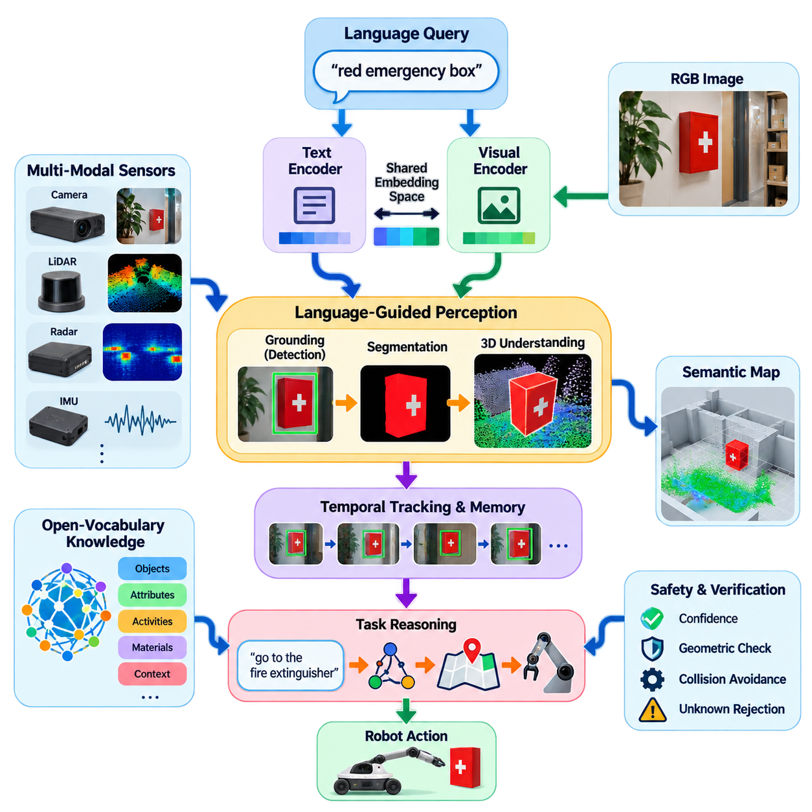
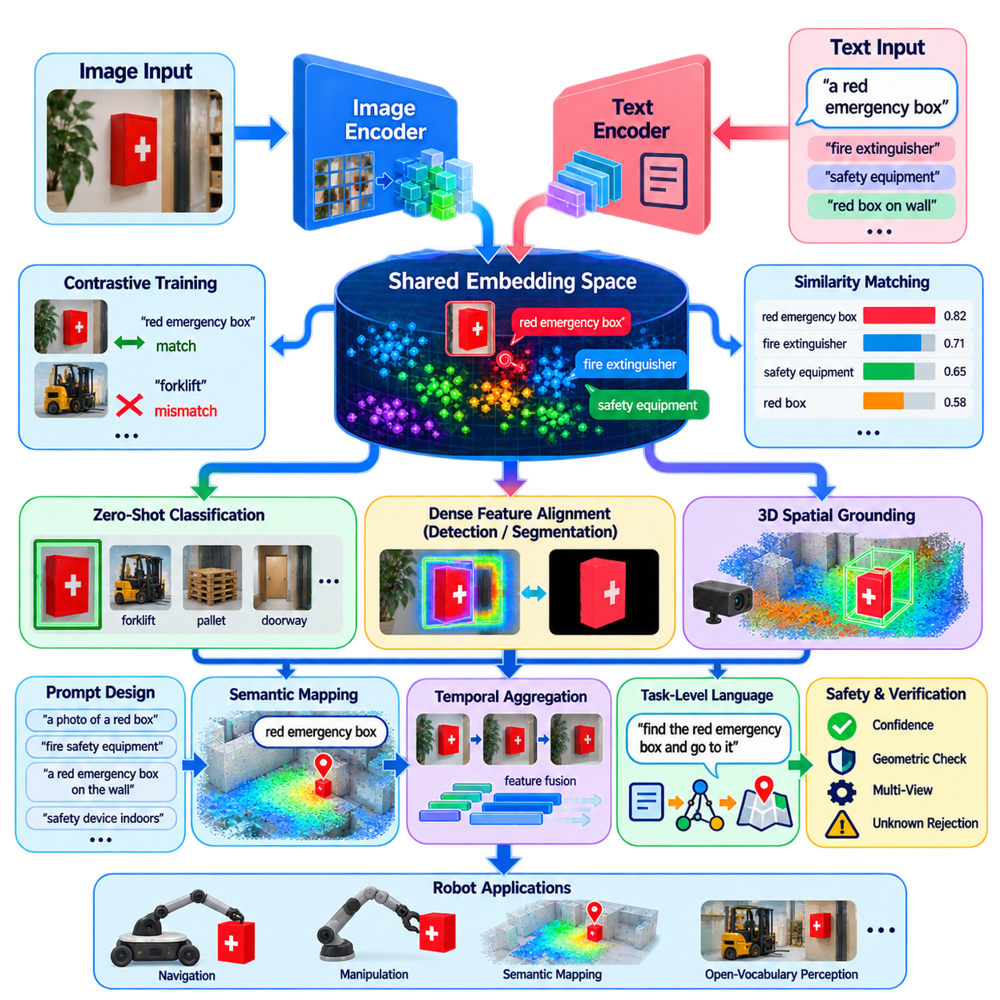
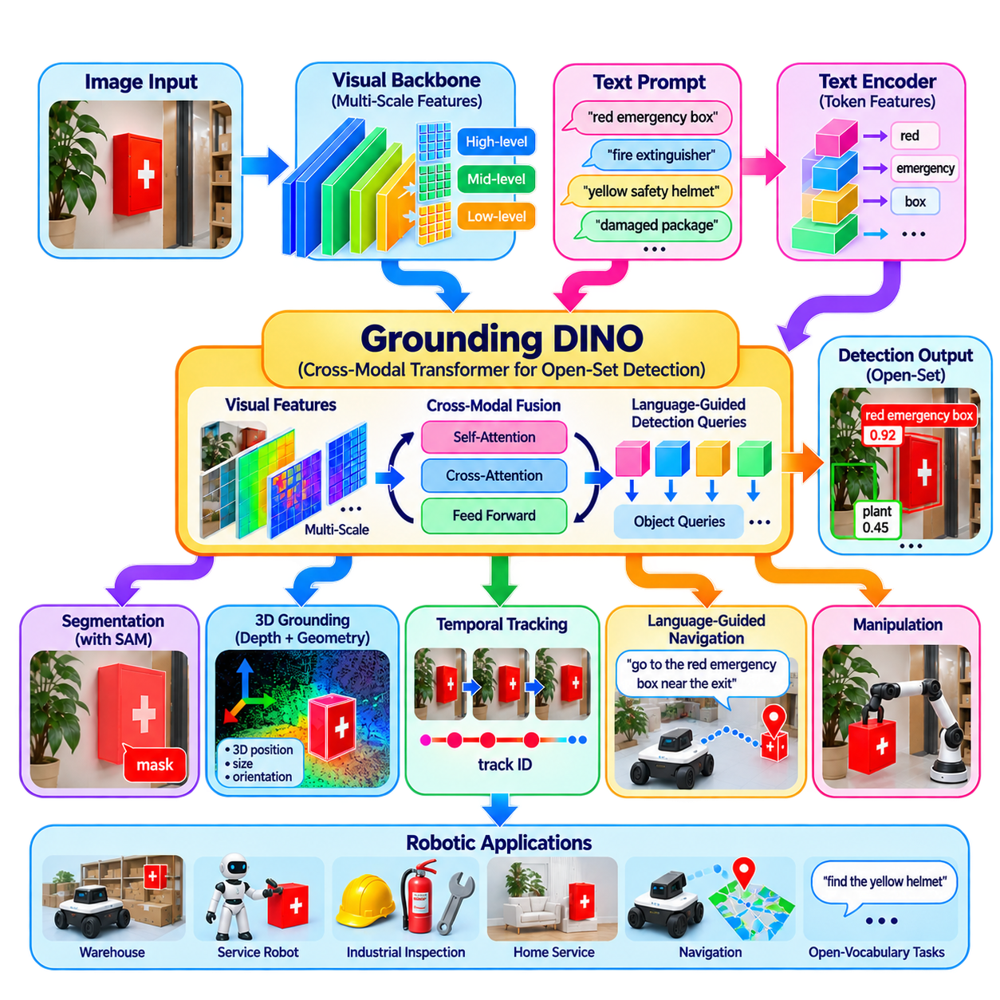
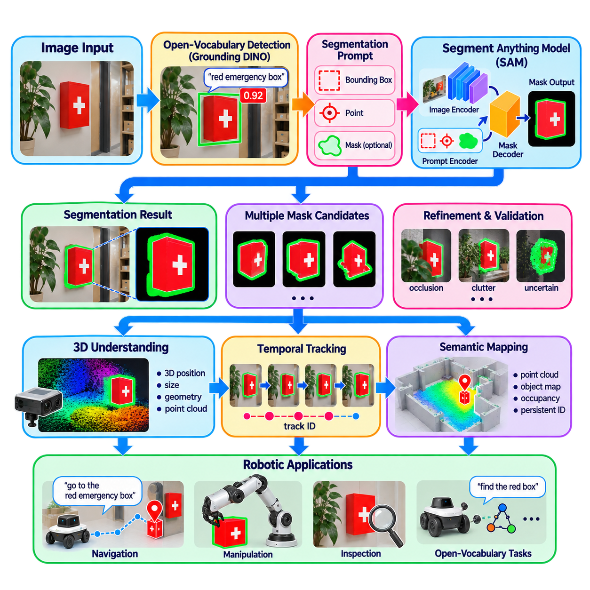
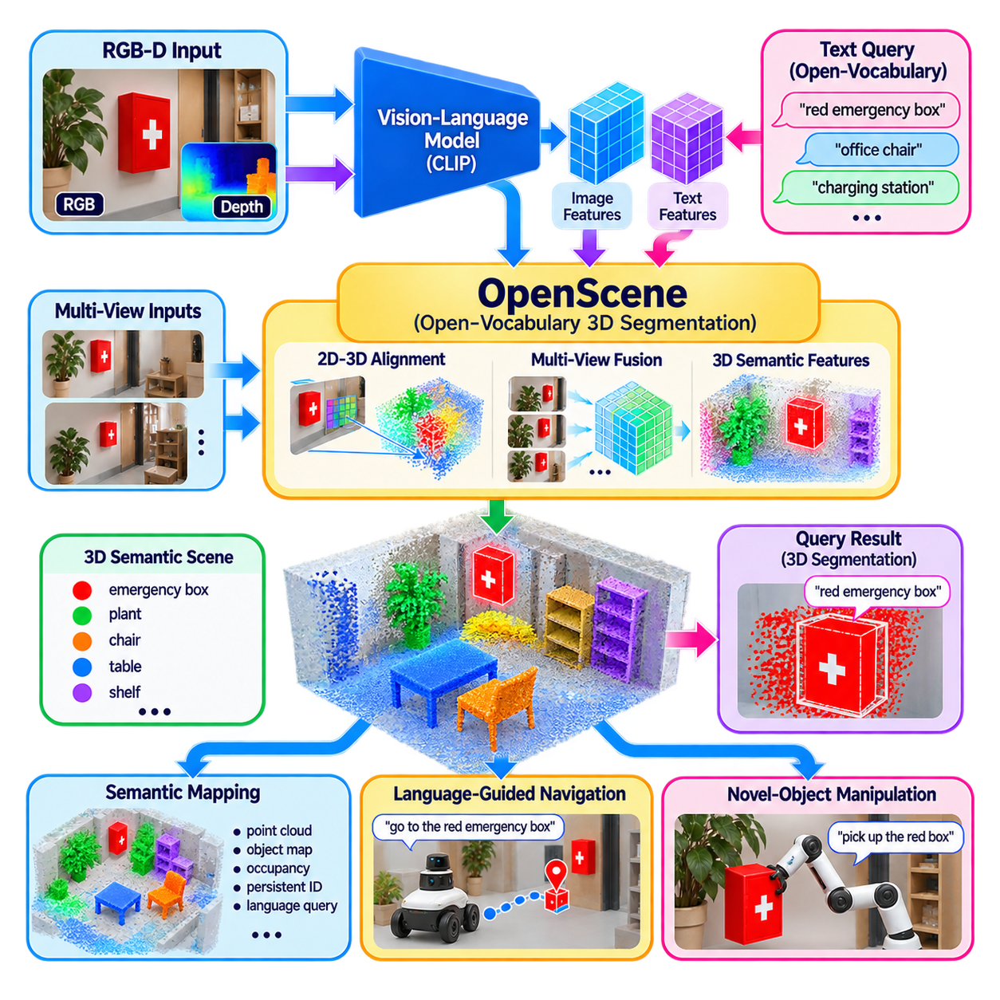
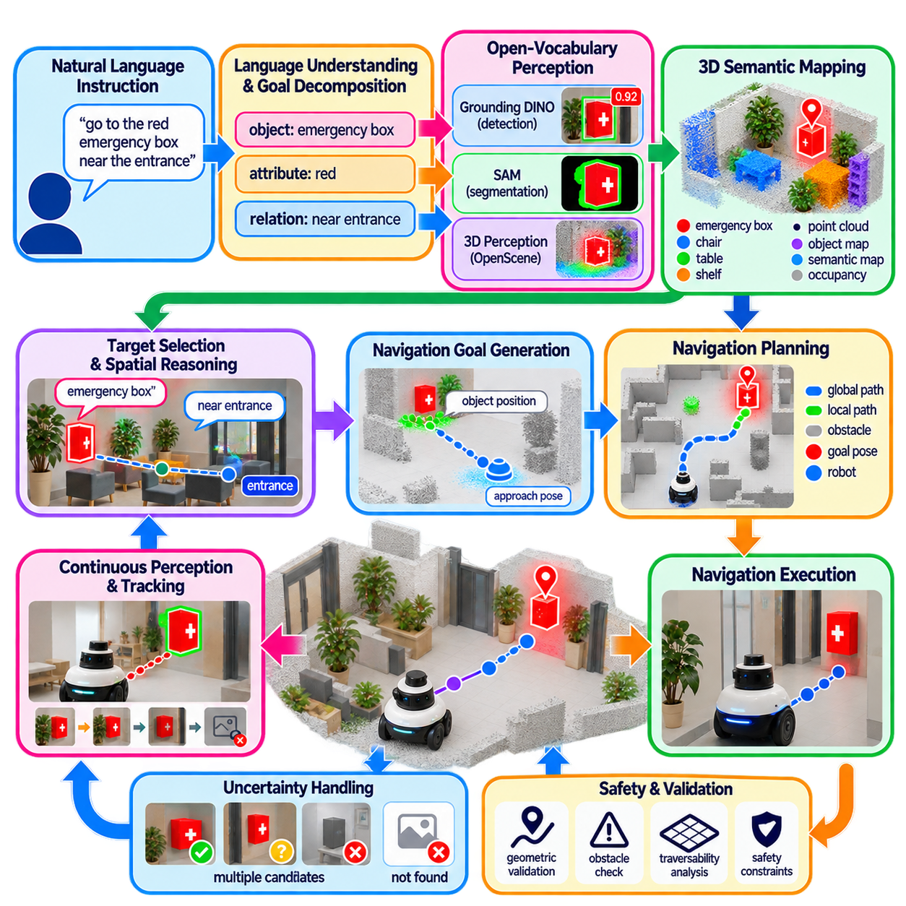
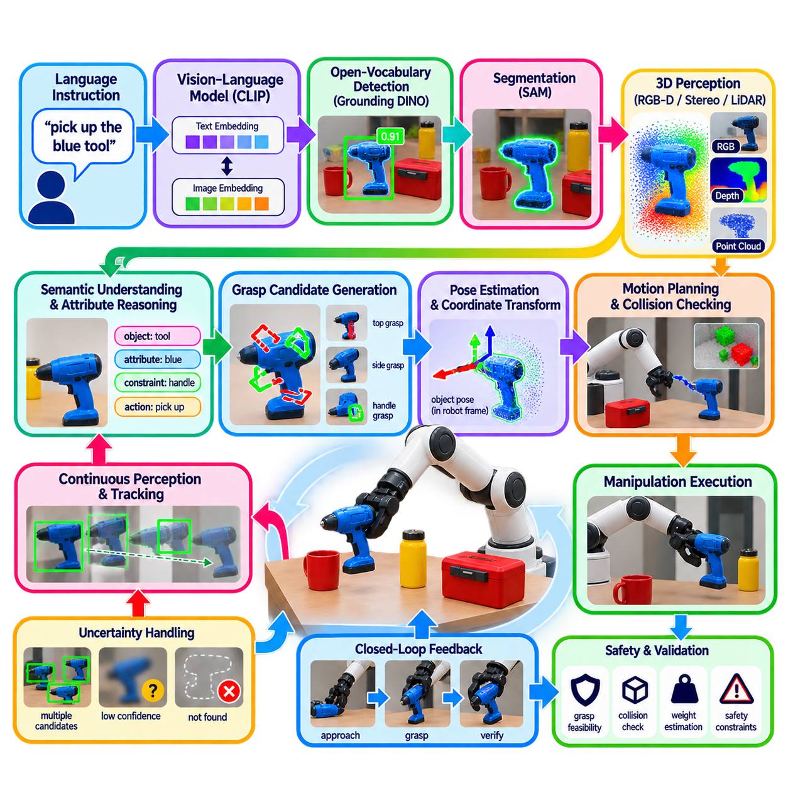
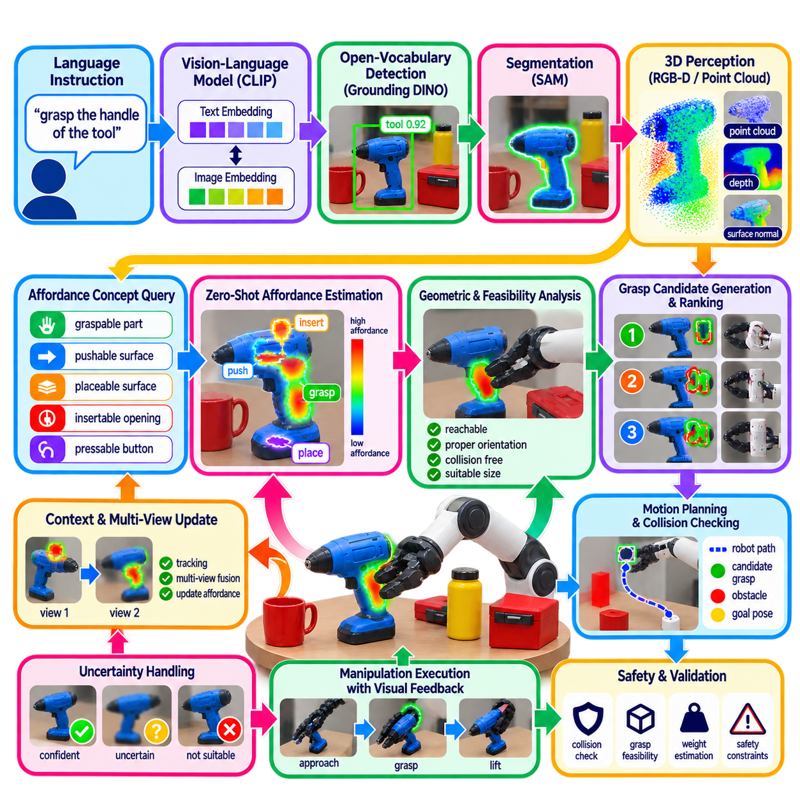
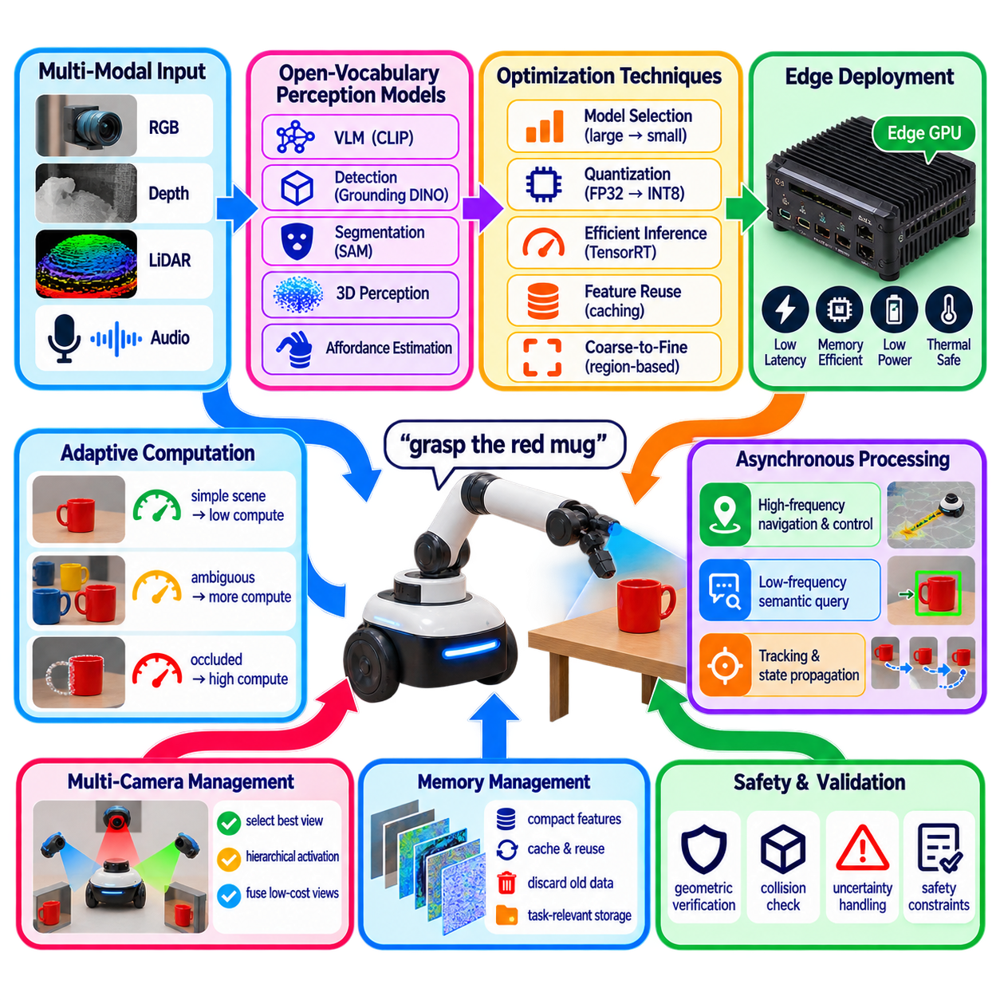
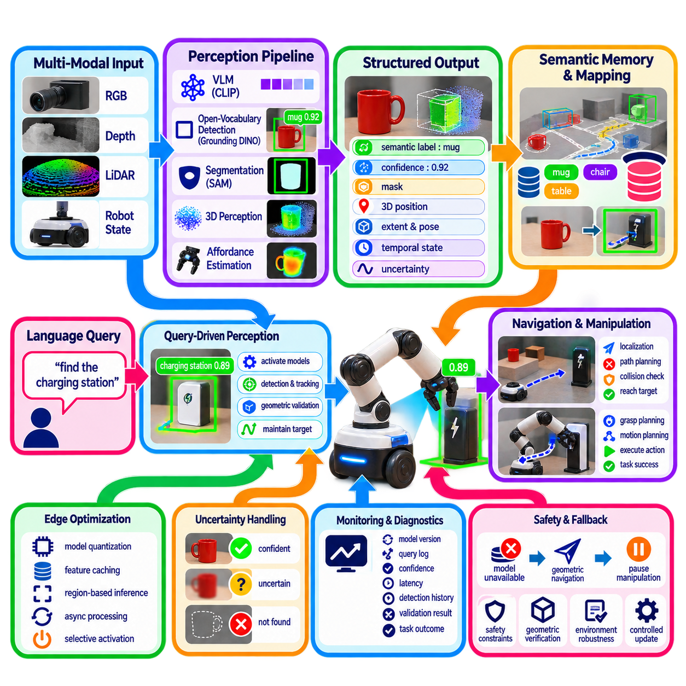

**Volume 14. Perception and Sensor Fusion**


# Chapter 11. Open Vocabulary Perception

##  

## 11.01. Open Vocabulary Perception Motivation and Architecture

{width="7.268055555555556in" height="7.268055555555556in"}

Open-vocabulary perception extends robot perception beyond a predefined list of object classes. Conventional detectors and segmentation systems are normally trained around a closed vocabulary, meaning that the categories recognized during deployment are largely determined during dataset construction and training. Robots operating in homes, factories, warehouses, streets, or unfamiliar environments cannot assume that every relevant object has been enumerated beforehand. :chatgpt-content-reference{index="0"}

The motivation for open-vocabulary perception therefore comes from the mismatch between finite training datasets and effectively unlimited real-world semantics. A mobile robot may encounter unfamiliar equipment, temporary obstacles, unusual containers, new tools, or objects described differently by individual users. Instead of requiring a new annotated dataset and retraining cycle whenever the vocabulary changes, the perception system should interpret novel semantic concepts from language and associate them with visual observations.

This capability changes the basic perception question. A closed-set detector asks which predefined category best explains an image region, whereas an open-vocabulary system can ask where an object described by an arbitrary phrase appears in the scene. Queries such as "red emergency box," "damaged package," "charging connector," or "tool used for tightening bolts" can become semantic inputs to perception. The vocabulary is consequently supplied partly at inference time rather than being completely embedded in the classifier.

The architectural foundation is a shared representation space between vision and language. A visual encoder converts an image, region, or image patch into feature vectors, while a text encoder converts words, category names, phrases, or task descriptions into compatible semantic embeddings. Similarity between these representations provides a mechanism for associating visual evidence with language without constructing a conventional independently trained classifier for every possible category.

Vision-language pretraining is central to this architecture because large collections of image-text pairs expose models to substantially richer semantic variation than conventional class-labeled datasets. The resulting representation can encode relationships among objects, attributes, activities, materials, and contextual concepts. Models derived from this principle can transfer semantic knowledge to downstream robot perception, while subsequent components specialize the representation for localization, detection, segmentation, navigation, or manipulation.

A practical architecture commonly separates semantic encoding from spatial grounding. Language encoders determine what concept the robot is searching for, while visual backbones extract features describing the observed scene. Cross-modal alignment or attention then connects the query with relevant visual regions. A grounding component predicts candidate boxes or spatial references, and a segmentation component can refine these coarse regions into pixel-level masks when accurate object boundaries are required.

This modular organization enables complementary foundation models to form a perception pipeline rather than forcing one network to perform every operation. A vision-language model can provide semantic correspondence, an open-set detector can localize language-specified objects, and a general segmentation model can obtain precise boundaries. The attached volume structure reflects this progression through CLIP-style feature alignment, Grounding DINO, SAM, open-vocabulary 3D segmentation, language-guided navigation, and manipulation. :chatgpt-content-reference{index="1"}

For robotics, open-vocabulary perception must ultimately connect two-dimensional semantics to physical space. Image detections alone do not tell a robot whether an object is reachable, traversable, graspable, or located at a particular three-dimensional coordinate. Camera depth, stereo vision, LiDAR, RGB-D sensing, robot pose, and calibrated sensor transformations can therefore be combined with language-grounded observations to project semantic information into point clouds, occupancy maps, object maps, or scene representations.

Temporal reasoning is equally important because robots perceive continuously rather than from isolated images. An object recognized with moderate confidence in one frame may become clear after the robot changes viewpoint. Tracking and temporal feature aggregation can maintain semantic identity while observations evolve. Persistent object representations also allow a robot to remember that an unfamiliar item observed earlier corresponds to a user-defined concept instead of rediscovering its meaning independently in every frame.

Open-vocabulary perception also provides an important interface between perception and task reasoning. A language instruction such as "go to the fire extinguisher near the exit" can be decomposed into semantic entities and spatial relationships, which perception attempts to ground in sensor observations. Navigation can then receive a physical target derived from semantic understanding. Similarly, manipulation systems can transform instructions such as "pick up the blue cleaning tool" into candidate objects and subsequent pose or grasp estimation.

However, semantic flexibility does not imply guaranteed recognition. Vision-language similarity may produce plausible but incorrect associations, especially for visually similar objects, uncommon terminology, small targets, domain-specific equipment, or scenes that differ substantially from pretraining data. Open-vocabulary models can also assign meaning to regions even when the requested object is absent. Robotics therefore requires confidence estimation, rejection mechanisms, geometric verification, temporal consistency, and explicit handling of unknown or ambiguous observations.

This distinction becomes particularly important in safety-related applications. A robot should not convert every language-grounding result directly into motion. Semantic perception can propose that a region corresponds to a requested object, but independent geometric and safety layers should determine whether approaching, traversing, or manipulating that region is permissible. Open-vocabulary perception is therefore best treated as an expanded semantic sensing capability embedded within a larger perception, planning, and safety architecture.

Computational cost is another architectural constraint. Large vision and language encoders, grounding transformers, segmentation networks, depth processing, and three-dimensional fusion may compete for the same edge GPU resources. A production robot may consequently use hierarchical inference: lightweight perception operates continuously, while expensive open-vocabulary grounding is activated by task queries, uncertain observations, scene changes, or lower-frequency semantic updates. Feature caching and selective segmentation can further reduce redundant computation.

The architecture can also separate fast operational perception from slower semantic interpretation. Conventional detectors remain useful for frequently encountered safety-critical classes because they can provide predictable latency and carefully validated performance. Open-vocabulary models can complement them by handling long-tail objects and dynamically specified concepts. Such hybrid perception avoids treating open-vocabulary capability as a replacement for every established perception component and instead assigns each model to the role where its properties are strongest.

The progression toward open-vocabulary perception represents a broader shift from category recognition toward language-addressable environmental understanding. The robot is no longer limited to answering "which trained class is present?" but can connect human concepts with visual and spatial observations as tasks change. This capability establishes a semantic bridge from sensor data to navigation, manipulation, scene reasoning, and Physical AI, while retaining geometric perception and safety validation as essential foundations.

개방 어휘 인지(Open-Vocabulary Perception)는 로봇 인지(Robot Perception)의 범위를 사전에 정의된 객체 클래스(Object Class) 목록 이상으로 확장한다. 기존 객체 검출기(Object Detector)와 분할 시스템(Segmentation System)은 일반적으로 폐쇄 어휘(Closed Vocabulary)를 중심으로 학습되므로, 실제 운용 중 인식할 수 있는 범주는 데이터셋(Dataset) 구축 및 학습 단계에서 대부분 결정된다. 그러나 가정, 공장, 창고, 도로 또는 미지의 환경에서 동작하는 로봇은 관련된 모든 객체가 사전에 정의되어 있다고 가정할 수 없다.

따라서 개방 어휘 인지(Open-Vocabulary Perception)의 필요성은 유한한 학습 데이터셋(Finite Training Dataset)과 사실상 무한한 실제 세계 의미 체계(Real-World Semantics) 사이의 불일치에서 발생한다. 이동 로봇(Mobile Robot)은 익숙하지 않은 장비, 임시 장애물, 특이한 용기, 새로운 도구 또는 사용자마다 서로 다른 표현으로 설명하는 객체를 만날 수 있다. 어휘가 변경될 때마다 새로운 주석 데이터셋(Annotated Dataset)을 만들고 재학습하는 대신, 인지 시스템(Perception System)은 언어로부터 새로운 의미 개념(Semantic Concept)을 해석하고 이를 시각 관측(Visual Observation)과 연결할 수 있어야 한다.

이러한 능력은 기본적인 인지 질문 자체를 변화시킨다. 폐쇄 집합 검출기(Closed-Set Detector)는 사전에 정의된 범주 중 어떤 것이 영상 영역을 가장 잘 설명하는지를 판단하지만, 개방 어휘 시스템(Open-Vocabulary System)은 임의의 문구로 설명된 객체가 장면의 어디에 존재하는지를 질문할 수 있다. 예를 들어 "빨간색 비상 상자(Red Emergency Box)", "손상된 포장물(Damaged Package)", "충전 커넥터(Charging Connector)" 또는 "볼트를 조이는 데 사용하는 도구(Tool Used for Tightening Bolts)"와 같은 질의를 인지 시스템의 의미 입력(Semantic Input)으로 사용할 수 있다. 따라서 어휘는 분류기(Classifier)에 완전히 고정되는 대신 일부가 추론 시점(Inference Time)에 제공된다.

이 아키텍처(Architecture)의 기반은 시각(Vision)과 언어(Language) 사이의 공유 표현 공간(Shared Representation Space)이다. 시각 인코더(Visual Encoder)는 영상, 영역 또는 영상 패치(Image Patch)를 특징 벡터(Feature Vector)로 변환하고, 텍스트 인코더(Text Encoder)는 단어, 범주명, 문구 또는 작업 설명(Task Description)을 호환 가능한 의미 임베딩(Semantic Embedding)으로 변환한다. 이러한 표현 간의 유사도(Similarity)를 이용하면 가능한 모든 범주마다 독립적인 기존 분류기를 학습하지 않고도 시각적 증거(Visual Evidence)를 언어와 연결할 수 있다.

시각-언어 사전학습(Vision-Language Pretraining)은 이러한 아키텍처의 핵심이다. 대규모 영상-텍스트 쌍(Image-Text Pair)을 사용하면 기존 클래스 라벨 데이터셋(Class-Labeled Dataset)보다 훨씬 풍부한 의미적 변화를 모델에 노출할 수 있기 때문이다. 이렇게 생성된 표현은 객체, 속성, 행동, 재질 및 문맥적 개념(Contextual Concept) 사이의 관계를 인코딩할 수 있다. 이 원리를 기반으로 하는 모델은 의미 지식(Semantic Knowledge)을 하위 로봇 인지 작업으로 전이할 수 있으며, 이후 구성요소들은 위치 결정(Localization), 검출(Detection), 분할(Segmentation), 내비게이션(Navigation) 또는 조작(Manipulation)에 맞게 표현을 특화한다.

실용적인 아키텍처에서는 일반적으로 의미 인코딩(Semantic Encoding)과 공간적 그라운딩(Spatial Grounding)을 분리한다. 언어 인코더(Language Encoder)는 로봇이 어떤 개념을 찾는지를 결정하고, 시각 백본(Visual Backbone)은 관측된 장면을 설명하는 특징을 추출한다. 이후 교차 모달 정렬(Cross-Modal Alignment) 또는 어텐션(Attention)이 질의와 관련된 시각 영역을 연결한다. 그라운딩 구성요소(Grounding Component)는 후보 경계 상자(Bounding Box) 또는 공간 참조(Spatial Reference)를 예측하고, 정확한 객체 경계가 필요한 경우 분할 구성요소(Segmentation Component)가 이러한 거친 영역을 픽셀 수준 마스크(Pixel-Level Mask)로 정교화할 수 있다.

이러한 모듈형 구성(Modular Organization)을 사용하면 하나의 신경망이 모든 연산을 수행하도록 강제하는 대신 상호 보완적인 파운데이션 모델(Foundation Model)을 결합하여 하나의 인지 파이프라인(Perception Pipeline)을 구성할 수 있다. 시각-언어 모델(Vision-Language Model)은 의미적 대응 관계를 제공하고, 개방 집합 검출기(Open-Set Detector)는 언어로 지정된 객체의 위치를 찾으며, 범용 분할 모델(General Segmentation Model)은 정밀한 경계를 추출할 수 있다. 이러한 흐름은 CLIP 방식의 특징 정렬(Feature Alignment), Grounding DINO, SAM, 개방 어휘 3차원 분할(Open-Vocabulary 3D Segmentation), 언어 유도 내비게이션(Language-Guided Navigation), 조작(Manipulation)으로 확장된다.

로보틱스(Robotics)에서 개방 어휘 인지(Open-Vocabulary Perception)는 궁극적으로 2차원 의미 정보(Two-Dimensional Semantics)를 물리적 공간(Physical Space)에 연결해야 한다. 영상 검출 결과만으로는 객체에 도달할 수 있는지, 통과할 수 있는지, 파지할 수 있는지 또는 특정 3차원 좌표에 존재하는지를 알 수 없다. 따라서 카메라 깊이(Camera Depth), 스테레오 비전(Stereo Vision), 라이다(LiDAR), RGB-D 센싱(RGB-D Sensing), 로봇 자세(Robot Pose), 보정된 센서 변환(Calibrated Sensor Transformation)을 언어 기반 관측과 결합하여 의미 정보를 포인트 클라우드(Point Cloud), 점유 지도(Occupancy Map), 객체 지도(Object Map) 또는 장면 표현(Scene Representation)에 투영할 수 있다.

시간적 추론(Temporal Reasoning) 역시 중요하다. 로봇은 독립된 단일 영상이 아니라 연속적으로 환경을 인지하기 때문이다. 한 프레임에서 중간 정도의 신뢰도(Confidence)로 인식된 객체도 로봇이 관측 시점(Viewpoint)을 변경하면 더욱 명확하게 인식될 수 있다. 추적(Tracking)과 시간적 특징 집계(Temporal Feature Aggregation)는 관측이 변화하는 동안에도 의미적 정체성(Semantic Identity)을 유지할 수 있다. 또한 지속적인 객체 표현(Persistent Object Representation)을 사용하면 이전에 관측된 익숙하지 않은 객체가 사용자 정의 개념(User-Defined Concept)에 해당한다는 사실을 기억하여 매 프레임마다 의미를 다시 발견할 필요를 줄일 수 있다.

개방 어휘 인지(Open-Vocabulary Perception)는 인지(Perception)와 작업 추론(Task Reasoning)을 연결하는 중요한 인터페이스도 제공한다. "출구 근처의 소화기로 이동하라(Go to the Fire Extinguisher Near the Exit)"와 같은 언어 명령은 의미 개체(Semantic Entity)와 공간 관계(Spatial Relationship)로 분해될 수 있으며, 인지 시스템은 이를 센서 관측에 그라운딩(Grounding)한다. 이후 내비게이션 시스템은 의미 이해에서 도출된 물리적 목표(Physical Target)를 전달받을 수 있다. 마찬가지로 조작 시스템은 "파란색 청소 도구를 집어라(Pick Up the Blue Cleaning Tool)"와 같은 명령을 후보 객체로 변환한 뒤 자세 추정(Pose Estimation) 또는 파지 추정(Grasp Estimation)으로 연결할 수 있다.

그러나 의미적 유연성(Semantic Flexibility)이 인식의 정확성을 보장하는 것은 아니다. 시각-언어 유사도(Vision-Language Similarity)는 시각적으로 유사한 객체, 드문 전문 용어, 작은 객체, 특정 산업 장비 또는 사전학습 데이터(Pretraining Data)와 크게 다른 장면에서 그럴듯하지만 잘못된 연결을 생성할 수 있다. 또한 개방 어휘 모델(Open-Vocabulary Model)은 요청한 객체가 실제로 존재하지 않더라도 특정 영역에 의미를 부여할 수 있다. 따라서 로봇 시스템에서는 신뢰도 추정(Confidence Estimation), 거부 메커니즘(Rejection Mechanism), 기하학적 검증(Geometric Verification), 시간적 일관성(Temporal Consistency), 그리고 알 수 없거나 모호한 관측(Unknown or Ambiguous Observation)에 대한 명시적 처리가 필요하다.

이러한 구분은 안전 관련 응용(Safety-Related Application)에서 특히 중요하다. 로봇은 모든 언어 기반 그라운딩(Language Grounding) 결과를 직접 움직임으로 변환해서는 안 된다. 의미 인지(Semantic Perception)는 특정 영역이 요청된 객체에 해당한다는 후보를 제시할 수 있지만, 독립적인 기하학 및 안전 계층(Geometric and Safety Layer)이 해당 영역으로 접근하거나 통과하거나 조작하는 것이 허용되는지를 판단해야 한다. 따라서 개방 어휘 인지는 더 큰 인지, 계획(Planning), 안전 아키텍처(Safety Architecture) 내부에 포함되는 확장된 의미 센싱(Semantic Sensing) 기능으로 다루는 것이 적절하다.

연산 비용(Computational Cost) 역시 중요한 아키텍처 제약 조건이다. 대규모 시각 및 언어 인코더, 그라운딩 트랜스포머(Grounding Transformer), 분할 신경망, 깊이 처리(Depth Processing), 3차원 융합(3D Fusion)은 동일한 엣지 GPU(Edge GPU) 자원을 놓고 경쟁할 수 있다. 따라서 실제 로봇에서는 경량 인지(Lightweight Perception)를 지속적으로 실행하고, 작업 질의, 불확실한 관측, 장면 변화 또는 저주기 의미 갱신이 발생할 때 고비용 개방 어휘 그라운딩을 활성화하는 계층적 추론(Hierarchical Inference)을 사용할 수 있다. 특징 캐싱(Feature Caching)과 선택적 분할(Selective Segmentation)을 이용하면 중복 연산도 줄일 수 있다.

또한 아키텍처는 빠른 운용 인지(Fast Operational Perception)와 상대적으로 느린 의미 해석(Semantic Interpretation)을 분리할 수 있다. 기존 객체 검출기(Conventional Detector)는 예측 가능한 지연 시간(Latency)과 충분히 검증된 성능을 제공할 수 있기 때문에 자주 등장하는 안전 핵심 클래스(Safety-Critical Class)에 여전히 유용하다. 개방 어휘 모델은 롱테일 객체(Long-Tail Object)와 동적으로 지정되는 개념을 처리함으로써 이를 보완할 수 있다. 이러한 하이브리드 인지(Hybrid Perception)는 개방 어휘 기능을 모든 기존 인지 구성요소의 대체재로 간주하지 않고 각 모델의 특성이 가장 적합한 역할에 배치한다.

개방 어휘 인지(Open-Vocabulary Perception)로의 발전은 범주 인식(Category Recognition)에서 언어로 접근 가능한 환경 이해(Language-Addressable Environmental Understanding)로 이동하는 더 큰 변화를 의미한다. 로봇은 더 이상 "학습된 클래스 중 무엇이 존재하는가?"라는 질문에만 제한되지 않고, 작업이 변화함에 따라 인간의 개념(Human Concept)을 시각 및 공간 관측(Visual and Spatial Observation)과 연결할 수 있다. 이러한 능력은 센서 데이터(Sensor Data)를 내비게이션, 조작, 장면 추론(Scene Reasoning), 피지컬 AI(Physical AI)로 연결하는 의미적 가교(Semantic Bridge)를 형성하며, 동시에 기하학적 인지(Geometric Perception)와 안전 검증(Safety Validation)을 필수적인 기반으로 유지한다.

##  

## 11.02. CLIP and Vision Language Feature Alignment [w/Code]

{width="7.268055555555556in" height="7.268055555555556in"}

CLIP, or Contrastive Language--Image Pre-training, provides a foundational mechanism for connecting visual observations with natural-language concepts. Instead of training an image classifier around a fixed set of predefined labels, CLIP learns representations from paired images and text. This approach creates a semantic interface through which robots can interpret objects and scenes using flexible language descriptions rather than relying exclusively on closed-set categories.

The core CLIP architecture contains two major processing paths: an image encoder and a text encoder. The image encoder transforms an input image into a compact visual feature vector, while the text encoder converts a textual description into a corresponding language feature vector. Both representations are projected into a shared embedding space, where their relationship can be evaluated directly through similarity rather than through a conventional fixed classification head.

Image encoders may be based on convolutional networks or Vision Transformers, with modern implementations commonly using transformer-based representations. The encoder divides visual information into features that capture shapes, textures, objects, contextual relationships, and higher-level semantics. After processing, the representation is projected and normalized so that it can be compared efficiently with text embeddings produced independently by the language processing branch.

The text encoder converts words or phrases such as "forklift," "red emergency box," or "open doorway" into semantic vectors. Tokenization first represents the language input as a sequence of tokens, after which a transformer models relationships among them. The resulting representation captures more than literal category names because attributes, contextual descriptions, and combinations of concepts can also occupy meaningful locations within the learned vision-language embedding space.

Feature alignment is learned through contrastive training. During training, a batch contains multiple image-text pairs, and the model learns to increase similarity between representations belonging to matching pairs while reducing similarity between mismatched combinations. This objective encourages images and their corresponding descriptions to become neighbors in the shared embedding space, while semantically unrelated observations are pushed farther apart.

Cosine similarity is commonly used to measure the relationship between normalized image and text embeddings. Given a visual feature vector and several candidate text vectors, the system calculates their similarities and identifies which textual concepts best correspond to the visual observation. A learned temperature or scaling parameter can control the distribution of similarity scores, allowing them to be transformed into relative probabilities for downstream interpretation.

This mechanism enables zero-shot classification without training a new classifier for every target category. Candidate class names can be converted into prompts such as "a photo of a forklift" or "a photo of a pallet," encoded into text features, and compared against an image representation. Changing the vocabulary then becomes primarily a matter of changing the language prompts rather than modifying and retraining the final classification layer.

Prompt design can significantly affect feature alignment because different linguistic descriptions may generate somewhat different text embeddings for the same underlying concept. A robot searching for a "charging station" might benefit from prompts describing its appearance, function, or environmental context. Prompt ensembles can combine several alternative descriptions and average their representations, producing a more stable semantic prototype than relying on a single short category label.

For open-vocabulary robotic perception, whole-image similarity alone is insufficient because robots must determine where relevant concepts occur. CLIP-style features can therefore be extracted from image regions, patches, object proposals, or dense feature maps. These localized representations can be compared with text embeddings to produce semantic similarity maps, enabling the system to associate language queries with particular portions of the observed scene.

Dense vision-language features provide a bridge from image-level recognition toward detection and segmentation. When spatially preserved visual features remain aligned with language embeddings, each region can be evaluated against arbitrary textual concepts. Subsequent detection or segmentation modules can convert these similarities into bounding boxes or masks. This principle supports architectures that combine vision-language representation learning with grounding and general-purpose segmentation models.

Robotics additionally requires vision-language features to interact with geometry. A semantic feature associated with a camera pixel or image region can be projected into three-dimensional space using depth information and calibrated sensor transformations. RGB-D cameras, stereo depth, or LiDAR-camera fusion can therefore attach language-compatible embeddings to points, voxels, objects, or map elements, creating spatial representations that remain queryable using natural language.

Such representations are particularly useful for semantic mapping. Instead of storing only fixed class labels such as wall, chair, or vehicle, a map can preserve richer feature embeddings associated with spatial locations. When a new language query arrives, the robot compares its text embedding with stored visual features to retrieve relevant locations. This allows semantic queries to evolve after mapping without requiring every useful category to have been specified beforehand.

Temporal aggregation can further improve feature reliability. A mobile robot observes the same object from different distances, viewpoints, lighting conditions, and levels of occlusion. Rather than treating every observation independently, features from multiple frames can be associated through tracking or geometric correspondence and fused into a persistent representation. Repeated observations can strengthen stable semantic evidence while reducing dependence on a single ambiguous image.

Vision-language alignment also creates an interface between perception and task-level language. An instruction such as "find the cart carrying the damaged package" contains objects, attributes, and relationships that can be converted into semantic queries. CLIP-like representations help identify visual candidates, while grounding, spatial reasoning, tracking, and scene understanding refine the result. The embedding space therefore serves as an intermediate semantic layer between raw sensor observations and higher-level robot reasoning.

However, similarity in an embedding space should not be interpreted as definitive physical understanding. CLIP can confuse visually related concepts, struggle with fine-grained industrial distinctions, or respond strongly to contextual correlations rather than the intended object itself. Small objects, unusual viewpoints, specialized equipment, text printed inside images, and environments far from the pretraining distribution can produce unreliable or poorly calibrated similarity scores.

Production systems should therefore combine vision-language similarity with additional evidence. Conventional detectors can continue handling validated safety-critical classes, while CLIP-style features provide flexible recognition for long-tail and dynamically specified concepts. Depth consistency, object tracking, geometric constraints, multiple viewpoints, confidence thresholds, and unknown rejection can prevent weak semantic similarities from being treated automatically as reliable physical facts.

Computational efficiency is especially important on edge robots because dense visual embeddings can consume substantial GPU memory and inference time. Feature extraction may therefore operate at reduced frequency, selected image resolutions, or only within candidate regions. Visual features can also be cached and reused for multiple text queries, because new language prompts can often be encoded and compared without repeatedly executing the expensive image backbone.

CLIP-style vision-language feature alignment fundamentally changes how semantic knowledge enters a perception system. Rather than encoding every required category into a dedicated output neuron, the robot maintains a representation in which visual observations and language concepts can be compared dynamically. This shared semantic space becomes a foundation for open-vocabulary detection, segmentation, 3D semantic mapping, language-guided navigation, novel-object manipulation, and increasingly general Physical AI perception.

CLIP(Contrastive Language--Image Pre-training)은 시각적 관측(Visual Observation)과 자연어 개념(Natural-Language Concept)을 연결하기 위한 기본적인 메커니즘을 제공한다. 고정된 사전 정의 라벨(Predefined Label)을 중심으로 영상 분류기(Image Classifier)를 학습하는 대신, CLIP은 서로 짝을 이루는 영상(Image)과 텍스트(Text)로부터 표현(Representation)을 학습한다. 이를 통해 로봇은 폐쇄 집합 범주(Closed-Set Category)에만 의존하지 않고 유연한 언어 설명(Language Description)을 이용하여 객체와 장면을 해석할 수 있는 의미 인터페이스(Semantic Interface)를 확보한다.

CLIP의 핵심 아키텍처(Core Architecture)는 영상 인코더(Image Encoder)와 텍스트 인코더(Text Encoder)라는 두 개의 주요 처리 경로로 구성된다. 영상 인코더는 입력 영상을 압축된 시각 특징 벡터(Visual Feature Vector)로 변환하고, 텍스트 인코더는 텍스트 설명을 대응하는 언어 특징 벡터(Language Feature Vector)로 변환한다. 두 표현은 공유 임베딩 공간(Shared Embedding Space)에 투영되며, 기존의 고정된 분류 헤드(Classification Head) 대신 유사도(Similarity)를 통해 직접적인 관계를 평가할 수 있다.

영상 인코더(Image Encoder)는 합성곱 신경망(Convolutional Network) 또는 비전 트랜스포머(Vision Transformer)를 기반으로 구성할 수 있으며, 현대적인 구현에서는 트랜스포머 기반 표현(Transformer-Based Representation)이 널리 사용된다. 인코더는 시각 정보를 형태, 질감, 객체, 문맥 관계(Contextual Relationship), 고수준 의미(High-Level Semantics)를 포착하는 특징으로 변환한다. 처리된 표현은 독립적으로 생성된 텍스트 임베딩(Text Embedding)과 효율적으로 비교할 수 있도록 투영(Projection) 및 정규화(Normalization)된다.

텍스트 인코더(Text Encoder)는 "지게차(Forklift)", "빨간색 비상 상자(Red Emergency Box)", "열린 출입구(Open Doorway)"와 같은 단어나 문구를 의미 벡터(Semantic Vector)로 변환한다. 먼저 토큰화(Tokenization)를 통해 언어 입력을 토큰 시퀀스(Token Sequence)로 표현하고, 이후 트랜스포머(Transformer)가 토큰 사이의 관계를 모델링한다. 결과 표현은 단순한 범주명뿐만 아니라 속성(Attribute), 문맥 설명(Contextual Description), 개념의 조합도 학습된 시각-언어 임베딩 공간(Vision-Language Embedding Space) 내에서 의미 있는 위치에 표현할 수 있다.

특징 정렬(Feature Alignment)은 대조 학습(Contrastive Training)을 통해 학습된다. 학습 과정에서 하나의 배치(Batch)는 여러 영상-텍스트 쌍(Image-Text Pair)을 포함하며, 모델은 서로 일치하는 쌍의 표현 사이 유사도를 증가시키고 일치하지 않는 조합의 유사도를 감소시키도록 학습된다. 이러한 목적 함수(Objective)는 영상과 그에 대응하는 설명을 공유 임베딩 공간에서 서로 가까운 위치로 이동시키는 반면, 의미적으로 관련이 없는 관측은 더 멀리 떨어지도록 만든다.

코사인 유사도(Cosine Similarity)는 정규화된 영상 임베딩(Image Embedding)과 텍스트 임베딩 사이의 관계를 측정하는 데 일반적으로 사용된다. 시각 특징 벡터(Visual Feature Vector)와 여러 후보 텍스트 벡터가 주어지면 시스템은 각각의 유사도를 계산하고 어떤 텍스트 개념이 시각적 관측과 가장 잘 대응하는지를 판단한다. 학습 가능한 온도 또는 스케일링 파라미터(Temperature or Scaling Parameter)를 이용하여 유사도 점수의 분포를 조절하고, 이를 하위 해석 과정에서 사용할 상대적 확률(Relative Probability)로 변환할 수도 있다.

이 메커니즘은 모든 목표 범주에 대해 새로운 분류기를 학습하지 않고도 제로샷 분류(Zero-Shot Classification)를 가능하게 한다. 후보 클래스 이름을 "지게차의 사진(A Photo of a Forklift)" 또는 "팔레트의 사진(A Photo of a Pallet)"과 같은 프롬프트(Prompt)로 변환하고 텍스트 특징(Text Feature)으로 인코딩한 다음 영상 표현과 비교할 수 있다. 따라서 어휘를 변경하는 작업은 최종 분류 계층을 수정하고 재학습하는 대신 주로 언어 프롬프트를 변경하는 문제가 된다.

프롬프트 설계(Prompt Design)는 특징 정렬에 상당한 영향을 미칠 수 있다. 동일한 기본 개념이라도 서로 다른 언어적 설명은 다소 다른 텍스트 임베딩을 생성할 수 있기 때문이다. 예를 들어 로봇이 "충전소(Charging Station)"를 탐색할 경우 외형, 기능 또는 환경적 문맥(Environmental Context)을 설명하는 프롬프트를 활용할 수 있다. 프롬프트 앙상블(Prompt Ensemble)은 여러 대체 설명을 결합하고 표현을 평균화함으로써 하나의 짧은 범주명에만 의존하는 것보다 안정적인 의미 프로토타입(Semantic Prototype)을 생성할 수 있다.

개방 어휘 로봇 인지(Open-Vocabulary Robotic Perception)에서는 전체 영상 유사도(Whole-Image Similarity)만으로 충분하지 않다. 로봇은 관련된 개념이 장면의 어디에 존재하는지도 판단해야 하기 때문이다. 따라서 CLIP 방식의 특징(CLIP-Style Feature)은 영상 영역(Image Region), 패치(Patch), 객체 후보(Object Proposal) 또는 밀집 특징 맵(Dense Feature Map)에서 추출할 수 있다. 이러한 지역화 표현(Localized Representation)을 텍스트 임베딩과 비교하여 의미 유사도 맵(Semantic Similarity Map)을 생성함으로써 언어 질의를 관측 장면의 특정 영역과 연결할 수 있다.

밀집 시각-언어 특징(Dense Vision-Language Feature)은 영상 수준 인식(Image-Level Recognition)에서 검출(Detection)과 분할(Segmentation)로 확장하기 위한 연결 고리를 제공한다. 공간적으로 유지된 시각 특징이 언어 임베딩과 정렬되어 있으면 각각의 영역을 임의의 텍스트 개념과 비교할 수 있다. 이후 검출 또는 분할 모듈은 이러한 유사도를 경계 상자(Bounding Box) 또는 마스크(Mask)로 변환할 수 있다. 이 원리는 시각-언어 표현 학습(Vision-Language Representation Learning)을 그라운딩(Grounding) 및 범용 분할 모델(General-Purpose Segmentation Model)과 결합하는 아키텍처를 지원한다.

로보틱스(Robotics)에서는 추가적으로 시각-언어 특징이 기하학(Geometry)과 상호작용해야 한다. 카메라 픽셀 또는 영상 영역에 연결된 의미 특징(Semantic Feature)은 깊이 정보(Depth Information)와 보정된 센서 변환(Calibrated Sensor Transformation)을 사용하여 3차원 공간으로 투영할 수 있다. 따라서 RGB-D 카메라, 스테레오 깊이(Stereo Depth), 라이다-카메라 융합(LiDAR-Camera Fusion)을 이용하면 언어와 호환되는 임베딩을 포인트(Point), 복셀(Voxel), 객체(Object) 또는 지도 요소(Map Element)에 연결하여 자연어로 질의할 수 있는 공간 표현(Spatial Representation)을 생성할 수 있다.

이러한 표현은 의미 지도화(Semantic Mapping)에 특히 유용하다. 벽(Wall), 의자(Chair), 차량(Vehicle)과 같은 고정된 클래스 라벨만 저장하는 대신 지도에 공간 위치와 연계된 풍부한 특징 임베딩(Feature Embedding)을 저장할 수 있다. 새로운 언어 질의가 입력되면 로봇은 해당 텍스트 임베딩과 저장된 시각 특징을 비교하여 관련 위치를 검색한다. 이를 통해 지도 작성 시점에 모든 유용한 범주를 미리 지정하지 않았더라도 이후 의미 질의(Semantic Query)를 확장할 수 있다.

시간적 집계(Temporal Aggregation)는 특징의 신뢰성을 더욱 향상시킬 수 있다. 이동 로봇은 동일한 객체를 서로 다른 거리, 시점(Viewpoint), 조명 조건 및 가림(Occlusion) 수준에서 반복적으로 관측한다. 각 관측을 독립적으로 처리하는 대신 여러 프레임의 특징을 추적(Tracking) 또는 기하학적 대응(Geometric Correspondence)을 통해 연결하고 지속적인 표현(Persistent Representation)으로 융합할 수 있다. 반복 관측은 안정적인 의미적 증거를 강화하면서 하나의 모호한 영상에 대한 의존성을 감소시킨다.

시각-언어 정렬(Vision-Language Alignment)은 인지와 작업 수준 언어(Task-Level Language)를 연결하는 인터페이스도 형성한다. "손상된 포장물을 운반하는 카트를 찾아라(Find the Cart Carrying the Damaged Package)"와 같은 명령에는 객체, 속성 및 관계가 포함되어 있으며, 이를 의미 질의(Semantic Query)로 변환할 수 있다. CLIP 방식 표현은 시각적 후보를 식별하는 데 도움을 주고, 그라운딩, 공간 추론(Spatial Reasoning), 추적 및 장면 이해(Scene Understanding)가 그 결과를 정교화한다. 따라서 임베딩 공간은 원시 센서 관측(Raw Sensor Observation)과 고수준 로봇 추론(High-Level Robot Reasoning) 사이의 중간 의미 계층(Intermediate Semantic Layer)으로 기능한다.

그러나 임베딩 공간의 유사도(Similarity)를 확정적인 물리적 이해(Definitive Physical Understanding)로 해석해서는 안 된다. CLIP은 시각적으로 관련된 개념을 혼동하거나 세분화된 산업적 구분(Fine-Grained Industrial Distinction)에 어려움을 겪을 수 있으며, 의도한 객체 자체보다 문맥적 상관관계(Contextual Correlation)에 강하게 반응할 수도 있다. 작은 객체, 특이한 관측 시점, 전문 장비, 영상 내부의 텍스트 및 사전학습 분포(Pretraining Distribution)와 크게 다른 환경에서는 신뢰하기 어렵거나 보정이 불충분한 유사도 점수가 생성될 수 있다.

따라서 실제 운용 시스템(Production System)은 시각-언어 유사도를 추가적인 증거와 결합해야 한다. 기존 객체 검출기(Conventional Detector)는 검증된 안전 핵심 클래스(Safety-Critical Class)를 계속 처리하고, CLIP 방식 특징은 롱테일 객체(Long-Tail Object)와 동적으로 지정되는 개념에 대한 유연한 인식을 제공할 수 있다. 깊이 일관성(Depth Consistency), 객체 추적(Object Tracking), 기하학적 제약(Geometric Constraint), 다중 시점(Multiple Viewpoint), 신뢰도 임계값(Confidence Threshold), 미지 객체 거부(Unknown Rejection)를 활용하면 약한 의미 유사도가 신뢰할 수 있는 물리적 사실로 자동 해석되는 것을 방지할 수 있다.

엣지 로봇(Edge Robot)에서는 밀집 시각 임베딩(Dense Visual Embedding)이 상당한 GPU 메모리와 추론 시간(Inference Time)을 사용할 수 있기 때문에 연산 효율성(Computational Efficiency)이 특히 중요하다. 따라서 특징 추출(Feature Extraction)은 낮은 주기, 선택된 영상 해상도 또는 후보 영역에서만 수행할 수 있다. 또한 시각 특징을 캐싱(Caching)하여 여러 텍스트 질의에 재사용할 수 있는데, 새로운 언어 프롬프트는 고비용 영상 백본(Image Backbone)을 반복 실행하지 않고도 인코딩하여 기존 특징과 비교할 수 있기 때문이다.

CLIP 방식의 시각-언어 특징 정렬(CLIP-Style Vision-Language Feature Alignment)은 의미 지식(Semantic Knowledge)이 인지 시스템에 입력되는 방식을 근본적으로 변화시킨다. 필요한 모든 범주를 전용 출력 뉴런(Dedicated Output Neuron)에 인코딩하는 대신 로봇은 시각 관측과 언어 개념을 동적으로 비교할 수 있는 표현을 유지한다. 이러한 공유 의미 공간(Shared Semantic Space)은 개방 어휘 검출(Open-Vocabulary Detection), 분할, 3차원 의미 지도화(3D Semantic Mapping), 언어 유도 내비게이션(Language-Guided Navigation), 신규 객체 조작(Novel-Object Manipulation), 그리고 더욱 범용적인 피지컬 AI 인지(Physical AI Perception)를 위한 기반이 된다.

##  

## 11.03. Grounding DINO Open Set Object Detection [w/Code]

{width="7.268055555555556in" height="7.268055555555556in"}

Grounding DINO extends transformer-based object detection from a fixed category vocabulary toward language-conditioned open-set detection. Instead of predicting objects only from class labels defined during training, it accepts textual concepts as queries and searches the image for regions that correspond to those descriptions. This capability allows a robot to request objects such as "fire extinguisher," "damaged package," or "red tool box" without requiring a dedicated output class for every possible concept.

The key architectural idea is to combine a strong visual representation with a language representation before producing detection results. An image backbone extracts multi-scale visual features from the input image, while a text encoder converts category names, phrases, or longer descriptions into language features. Grounding DINO then establishes correspondence between these two modalities so that detection is conditioned directly on the semantic information contained in the text query.

Unlike conventional detectors whose classification heads produce probabilities over a predetermined category set, Grounding DINO treats language as part of the detection process. Text prompts can contain multiple object concepts, and the detector evaluates visual regions against their associated language representations. Consequently, the vocabulary can be changed during inference without redesigning the detector output layer, which is a fundamental requirement for open-vocabulary robotic perception.

The visual backbone produces hierarchical image features representing objects at different spatial scales. Small tools, medium-sized packages, vehicles, doors, and large environmental structures may occupy dramatically different portions of an image, so multi-scale representations are important. These features retain spatial information needed for localization while providing increasingly semantic descriptions that can later interact with the language-conditioned detection transformer.

The language branch transforms an input prompt into token-level text features. Rather than reducing the complete prompt immediately to a single category vector, token-level representations preserve information about individual words and phrases. This allows the architecture to establish fine-grained correspondence between linguistic concepts and visual evidence, supporting prompts that contain object names together with attributes or descriptive information.

A central component is cross-modal feature fusion, where image and language information interact before final object prediction. Vision features are enhanced using linguistic context, while text features obtain information about relevant visual content. This deep interaction differs from architectures that perform visual detection first and attach language labels afterward. Grounding becomes part of the detection computation itself rather than merely a post-processing classification step.

Grounding DINO also builds on the query-based detection principles of DETR and DINO-style architectures. Detection queries are processed by a transformer decoder to predict candidate objects and their bounding boxes. Language-conditioned information guides these queries toward regions that correspond to the supplied textual concepts. The resulting predictions therefore contain both spatial localization and semantic correspondence with portions of the input text.

Query selection is particularly important because an image can contain a very large number of possible spatial locations while only a small subset corresponds to meaningful objects. Language-guided query selection helps identify visual features that are strongly related to the supplied text before decoder processing. This improves the connection between candidate regions and requested concepts while reducing dependence on completely generic object proposals.

The output of the detector typically consists of candidate bounding boxes together with scores describing their correspondence to textual tokens or phrases. Thresholds can then be applied to remove weak predictions. In a robot searching for a "yellow safety helmet," for example, the system can return spatial regions associated with the phrase rather than simply selecting among classes contained in a conventional detector\'s training vocabulary.

Open-set detection becomes especially useful when robot tasks are specified dynamically. A warehouse robot may receive instructions to locate a newly introduced container, a maintenance robot may search for an unfamiliar component described by an operator, and a service robot may need to identify household objects never included in its application-specific training dataset. Language-conditioned detection reduces the need to retrain the perception system whenever the operational vocabulary changes.

Grounding DINO can also serve as a front end for segmentation. A language query first identifies candidate objects and produces bounding boxes, after which a general segmentation model such as SAM can use those boxes as prompts to generate precise masks. This Grounding DINO--SAM combination transforms natural-language concepts into pixel-level object regions and provides a practical architecture for open-vocabulary segmentation in robotic perception.

For physical robots, the detected two-dimensional boxes usually need to be connected with depth and geometry. RGB-D measurements, stereo depth, or calibrated LiDAR-camera fusion can associate the detected image region with three-dimensional points. The system can then estimate object position, dimensions, orientation candidates, or occupied space and transform a language-grounded detection into information usable by navigation or manipulation modules.

Temporal integration further improves reliability. A mobile robot may detect the same object repeatedly while moving through the environment, allowing bounding boxes and language correspondence scores to be associated across frames. Tracking can distinguish persistent objects from transient false detections, while observations from different viewpoints provide additional evidence. The resulting object representation can then be inserted into a semantic map or persistent scene memory.

Grounding DINO also enables language-guided navigation by converting semantic goals into observable targets. A command such as "go to the red fire extinguisher near the exit" can provide object and attribute descriptions to the detector. Candidate detections can be combined with depth, localization, and semantic-map information to determine a navigable target position, while spatial reasoning can evaluate additional relations such as "near the exit."

Manipulation systems can use the same architecture to identify novel objects before performing more precise geometric processing. Grounding DINO may locate "the blue wrench" or "the damaged connector," after which segmentation, depth reconstruction, pose estimation, and grasp planning determine how the robot should interact with it. Open-set detection therefore acts as semantic object discovery rather than replacing the geometric perception required for physical manipulation.

Detection scores must nevertheless be treated carefully because language grounding does not guarantee that a requested object actually exists. Similar objects, contextual cues, unusual viewpoints, occlusion, small target size, and ambiguous prompts can produce incorrect associations. A robot should support an explicit unknown or not-found state instead of automatically accepting the highest-scoring candidate whenever every available detection has weak evidence.

Prompt formulation also influences detection quality. Short category names may work well for common objects, while specialized industrial components may require more descriptive phrases containing appearance, function, or attributes. However, excessively complicated prompts can introduce ambiguity. Production systems should therefore define prompt templates and vocabulary-management strategies while still retaining the flexibility that distinguishes open-set perception from conventional closed-set detection.

Real-time deployment introduces additional constraints because transformer-based visual processing and cross-modal fusion can require substantial GPU computation. Robots may reduce image resolution, restrict detection to selected cameras, activate open-set detection only when semantic queries occur, or execute the model at a lower frequency than safety-critical perception. Detected objects can then be tracked at higher rates using lighter-weight algorithms between expensive grounding updates.

A practical robot perception architecture therefore often combines Grounding DINO with conventional detectors rather than replacing them completely. Validated closed-set models can continuously detect pedestrians, vehicles, or other safety-critical classes with predictable latency, while Grounding DINO handles long-tail objects and task-specific language queries. Segmentation, depth sensing, tracking, and geometric verification can subsequently refine its detections before they influence robot behavior.

Grounding DINO represents an important transition from predefined object recognition toward language-addressable object discovery. By integrating visual features, token-level language representations, cross-modal fusion, language-guided queries, and transformer-based localization, it allows the robot\'s detectable vocabulary to evolve with its instructions. Within open-vocabulary perception, this capability forms a practical bridge from vision-language feature alignment to segmentation, 3D grounding, semantic navigation, and novel-object manipulation.

Grounding DINO는 고정된 범주 어휘(Fixed Category Vocabulary)에서 벗어나 언어 조건 기반 개방 집합 객체 검출(Language-Conditioned Open-Set Object Detection)로 확장한 트랜스포머 기반 객체 검출(Transformer-Based Object Detection) 방식이다. 기존 객체 검출기는 학습 과정에서 정의된 고정된 클래스만을 예측하지만, Grounding DINO는 텍스트 개념을 질의(Query)로 입력받아 해당 설명과 대응하는 영상 영역을 탐색한다. 이를 통해 로봇은 모든 가능한 개념에 대해 전용 출력 클래스를 학습하지 않고도 "소화기(Fire Extinguisher)", "손상된 포장물(Damaged Package)", "빨간색 공구함(Red Tool Box)"과 같은 객체를 요청할 수 있다.

핵심 아키텍처는 강력한 시각 표현(Visual Representation)과 언어 표현(Language Representation)을 결합한 후 검출 결과를 생성하는 것이다. 영상 백본(Image Backbone)은 입력 영상에서 다중 스케일 시각 특징(Multi-Scale Visual Feature)을 추출하고, 텍스트 인코더(Text Encoder)는 범주명, 구문 또는 보다 긴 설명을 언어 특징(Language Feature)으로 변환한다. Grounding DINO는 이러한 두 모달리티 사이의 대응 관계를 형성하여 텍스트 질의에 포함된 의미 정보에 따라 객체 검출을 수행한다.

사전 정의된 범주 집합에 대한 확률을 출력하는 기존 검출기의 분류 헤드(Classification Head)와 달리, Grounding DINO는 언어를 검출 과정 자체의 일부로 취급한다. 하나의 텍스트 프롬프트(Text Prompt)에 여러 객체 개념을 포함할 수 있으며, 검출기는 시각 영역과 관련 언어 표현 사이의 대응 관계를 평가한다. 따라서 추론 시점(Inference Time)에 어휘를 변경할 수 있으며, 새로운 개념을 추가하기 위해 검출기의 출력 계층을 다시 설계할 필요가 없다. 이것은 개방 어휘 로봇 인지(Open-Vocabulary Robotic Perception)의 핵심 요구사항이다.

시각 백본(Visual Backbone)은 서로 다른 공간적 크기를 갖는 객체를 표현하기 위한 계층적 영상 특징(Hierarchical Image Feature)을 생성한다. 작은 공구, 중간 크기의 포장물, 차량, 출입문 및 대규모 환경 구조물은 영상에서 차지하는 영역이 크게 다를 수 있기 때문에 다중 스케일 표현(Multi-Scale Representation)이 중요하다. 이러한 특징은 객체 위치를 결정하는 데 필요한 공간 정보를 유지하면서 점차 높은 수준의 의미 정보를 제공하고, 이후 언어 조건 기반 검출 트랜스포머(Language-Conditioned Detection Transformer)와 상호작용한다.

언어 브랜치(Language Branch)는 입력 프롬프트를 토큰 수준 텍스트 특징(Token-Level Text Feature)으로 변환한다. 전체 프롬프트를 즉시 하나의 범주 벡터로 축소하는 대신 토큰 수준 표현을 유지함으로써 개별 단어와 구문의 정보를 보존할 수 있다. 이를 통해 아키텍처는 언어 개념과 시각적 증거 사이의 세밀한 대응 관계를 형성할 수 있으며, 객체명뿐만 아니라 속성이나 설명적 정보가 포함된 프롬프트도 처리할 수 있다.

핵심 구성요소 중 하나는 영상과 언어 정보가 최종 객체 예측 이전에 서로 상호작용하도록 하는 교차 모달 특징 융합(Cross-Modal Feature Fusion)이다. 시각 특징은 언어적 문맥에 의해 강화되고, 텍스트 특징은 관련된 시각적 내용에 대한 정보를 얻는다. 이러한 깊은 상호작용은 먼저 시각적 객체 검출을 수행한 후 언어 라벨을 추가하는 방식과 다르다. 그라운딩(Grounding)이 단순한 후처리 분류 과정이 아니라 객체 검출 계산 자체의 일부로 이루어진다는 점이 중요하다.

Grounding DINO는 DETR 및 DINO 계열 아키텍처의 질의 기반 객체 검출(Query-Based Object Detection) 원리도 활용한다. 검출 질의(Detection Query)는 트랜스포머 디코더(Transformer Decoder)를 통해 처리되며 후보 객체와 해당 경계 상자(Bounding Box)를 예측한다. 언어 조건 기반 정보는 이러한 질의가 입력된 텍스트 개념에 대응하는 영역으로 향하도록 유도한다. 따라서 최종 결과에는 공간적 위치 정보와 입력 텍스트의 특정 부분에 대한 의미적 대응 정보가 함께 포함된다.

질의 선택(Query Selection)은 영상에 매우 많은 가능한 공간 위치가 존재하는 반면 의미 있는 객체에 해당하는 영역은 일부에 불과하기 때문에 특히 중요하다. 언어 유도 질의 선택(Language-Guided Query Selection)은 디코더 처리 이전에 입력 텍스트와 강하게 관련된 시각 특징을 식별하도록 돕는다. 이를 통해 후보 영역과 요청된 개념 사이의 연결을 강화하면서 완전히 일반적인 객체 후보에 대한 의존성을 줄일 수 있다.

검출기의 출력은 일반적으로 후보 경계 상자와 텍스트 토큰 또는 구문에 대한 대응 정도를 나타내는 점수로 구성된다. 이후 임계값(Threshold)을 적용하여 낮은 신뢰도의 예측을 제거할 수 있다. 예를 들어 로봇이 "노란색 안전모(Yellow Safety Helmet)"를 찾는 경우, 기존 검출기의 학습 어휘에 포함된 클래스 중 하나를 선택하는 대신 해당 문구와 관련된 영상 영역을 반환할 수 있다.

개방 집합 검출(Open-Set Detection)은 로봇 작업이 동적으로 지정될 때 특히 유용하다. 창고 로봇은 새롭게 도입된 컨테이너를 찾아야 할 수 있고, 유지보수 로봇은 작업자가 설명한 익숙하지 않은 부품을 찾아야 할 수 있으며, 서비스 로봇은 특정 응용 분야의 학습 데이터셋에 포함되지 않았던 가정용 객체를 식별해야 할 수 있다. 언어 조건 기반 검출(Language-Conditioned Detection)은 운용 어휘가 변경될 때마다 인지 시스템을 다시 학습해야 하는 필요성을 줄여준다.

Grounding DINO는 분할(Segmentation)의 전단부(Front End)로도 활용할 수 있다. 먼저 언어 질의가 후보 객체를 식별하고 경계 상자를 생성하면, 이후 SAM(Segment Anything Model)과 같은 범용 분할 모델이 해당 상자를 프롬프트로 사용하여 정밀한 마스크(Mask)를 생성할 수 있다. Grounding DINO와 SAM을 결합하면 자연어 개념을 픽셀 수준의 객체 영역으로 변환할 수 있으며, 로봇 인지를 위한 실용적인 개방 어휘 분할(Open-Vocabulary Segmentation) 아키텍처를 구성할 수 있다.

실제 로봇에서는 2차원 검출 경계 상자를 깊이 및 기하학 정보와 연결해야 하는 경우가 많다. RGB-D 측정, 스테레오 깊이(Stereo Depth), 또는 보정된 라이다-카메라 융합(LiDAR-Camera Fusion)을 이용하면 검출된 영상 영역을 3차원 점과 연결할 수 있다. 이를 통해 객체 위치, 크기, 방향 후보 또는 점유 공간(Occupied Space)을 추정하고, 언어로 그라운딩된 검출 결과를 내비게이션(Navigation)이나 조작(Manipulation) 모듈에서 사용할 수 있는 정보로 변환할 수 있다.

시간적 통합(Temporal Integration)은 인식 신뢰성을 더욱 향상시킬 수 있다. 이동 로봇은 환경을 이동하면서 동일한 객체를 반복적으로 검출할 수 있으며, 경계 상자와 언어 대응 점수를 여러 프레임에 걸쳐 연결할 수 있다. 추적(Tracking)은 지속적으로 존재하는 객체와 일시적인 오검출(False Detection)을 구분할 수 있으며, 서로 다른 시점(Viewpoint)의 관측은 추가적인 증거를 제공한다. 이렇게 형성된 객체 표현(Object Representation)은 이후 의미 지도(Semantic Map) 또는 지속적 장면 메모리(Persistent Scene Memory)에 저장될 수 있다.

Grounding DINO는 의미 목표를 관측 가능한 대상으로 변환함으로써 언어 유도 내비게이션(Language-Guided Navigation)도 지원할 수 있다. "출구 근처의 빨간색 소화기로 이동하라(Go to the Red Fire Extinguisher Near the Exit)"와 같은 명령은 객체 및 속성 설명을 검출기에 제공할 수 있다. 후보 검출 결과는 깊이, 위치 추정(Localization), 의미 지도 정보를 결합하여 이동 가능한 목표 위치(Navigable Target Position)를 결정하는 데 활용할 수 있으며, 공간 추론(Spatial Reasoning)을 통해 "출구 근처"와 같은 추가 관계도 평가할 수 있다.

조작 시스템(Manipulation System)은 보다 정밀한 기하학적 처리를 수행하기 전에 동일한 아키텍처를 이용하여 새로운 객체를 식별할 수 있다. Grounding DINO가 "파란색 렌치(Blue Wrench)" 또는 "손상된 커넥터(Damaged Connector)"를 찾으면, 이후 분할, 깊이 재구성(Depth Reconstruction), 자세 추정(Pose Estimation), 파지 계획(Grasp Planning)이 로봇이 해당 객체와 어떻게 상호작용해야 하는지를 결정한다. 따라서 개방 집합 검출은 물리적 조작에 필요한 기하학적 인지를 대체하기보다는 의미적 객체 발견(Semantic Object Discovery) 기능으로 작동한다.

그러나 검출 점수(Detection Score)는 신중하게 다루어야 한다. 언어 기반 그라운딩이 요청된 객체가 실제로 존재한다는 사실을 보장하지 않기 때문이다. 유사한 객체, 문맥적 단서(Contextual Cue), 특이한 관측 시점, 작은 객체 크기, 가려짐(Occlusion), 모호한 프롬프트는 잘못된 대응을 생성할 수 있다. 따라서 로봇은 모든 검출 결과 중 가장 높은 점수를 무조건 받아들이기보다, 모든 후보의 증거가 약한 경우 명시적으로 미지 객체(Unknown) 또는 찾을 수 없음(Not Found) 상태를 지원해야 한다.

프롬프트 구성(Prompt Formulation) 역시 검출 성능에 영향을 미친다. 짧은 범주명은 일반적인 객체에서 잘 작동할 수 있지만, 전문적인 산업 부품은 외형, 기능 또는 속성을 포함하는 보다 구체적인 설명이 필요할 수 있다. 그러나 지나치게 복잡한 프롬프트는 모호성을 증가시킬 수도 있다. 따라서 실제 시스템에서는 개방 집합 인지의 유연성을 유지하면서도 프롬프트 템플릿(Prompt Template)과 어휘 관리 전략(Vocabulary Management Strategy)을 정의할 필요가 있다.

실시간 배포(Real-Time Deployment)에서는 트랜스포머 기반 시각 처리와 교차 모달 융합이 상당한 GPU 연산을 요구할 수 있기 때문에 추가적인 제약이 발생한다. 로봇은 영상 해상도를 낮추거나, 선택된 카메라에서만 검출을 수행하거나, 의미 질의가 발생할 때만 개방 집합 검출을 활성화하거나, 안전 핵심 인지(Safety-Critical Perception)보다 낮은 주기로 모델을 실행할 수 있다. 이후 검출된 객체는 보다 가벼운 알고리즘으로 추적하여 고비용 그라운딩 업데이트 사이에서도 높은 주기의 객체 위치 정보를 유지할 수 있다.

따라서 실제 로봇 인지 아키텍처에서는 Grounding DINO를 기존 객체 검출기의 완전한 대체재로 사용하기보다 함께 사용하는 경우가 많다. 검증된 폐쇄 집합 모델(Closed-Set Model)은 예측 가능한 지연 시간과 안정적인 성능으로 보행자, 차량 또는 기타 안전 핵심 클래스를 지속적으로 검출하고, Grounding DINO는 롱테일 객체(Long-Tail Object)와 작업별 언어 질의를 처리할 수 있다. 이후 분할, 깊이 센싱(Depth Sensing), 추적 및 기하학적 검증(Geometric Verification)을 통해 검출 결과를 정교화한 후 로봇 행동에 영향을 주도록 구성할 수 있다.

Grounding DINO는 사전에 정의된 객체 인식(Predefined Object Recognition)에서 언어로 접근 가능한 객체 발견(Language-Addressable Object Discovery)으로 이동하는 중요한 전환을 나타낸다. 시각 특징, 토큰 수준 언어 표현(Token-Level Language Representation), 교차 모달 융합, 언어 유도 질의, 트랜스포머 기반 위치 결정을 통합함으로써 로봇이 감지할 수 있는 어휘를 명령에 따라 변화시킬 수 있다. 개방 어휘 인지(Open-Vocabulary Perception)에서 이러한 능력은 시각-언어 특징 정렬(Vision-Language Feature Alignment)에서 분할, 3차원 그라운딩(3D Grounding), 의미 내비게이션(Semantic Navigation), 신규 객체 조작(Novel-Object Manipulation)으로 이어지는 실용적인 연결 고리를 형성한다.

##  

## 11.04. Segment Anything Model SAM for Robots [w/Code]

{width="7.268055555555556in" height="7.268055555555556in"}

The Segment Anything Model (SAM) provides a general-purpose image segmentation capability that can generate object masks from visual prompts rather than depending entirely on a fixed semantic class vocabulary. In robotic perception, this makes SAM particularly useful after an open-vocabulary detector identifies an object of interest. Instead of requiring a separately trained segmentation model for every object category, the robot can use a detected region, point, or other visual cue to obtain a precise pixel-level representation.

SAM is based on a large-scale vision encoder, a prompt encoder, and a mask decoder. The image encoder converts the complete image into a reusable visual representation, while the prompt encoder represents information such as points, bounding boxes, or other segmentation cues. The mask decoder then combines these representations to generate one or more candidate masks. This separation allows the expensive image representation to be reused for multiple segmentation requests within the same scene.

The prompt-driven design is particularly important for robotics because the desired segmentation target may change according to the current task. A robot may first receive a bounding box from an open-vocabulary detector and provide that box to SAM as a prompt. Alternatively, a selected image point can indicate the object to segment. The resulting mask can then be associated with the semantic identity provided by the preceding perception module, creating a flexible connection between language-guided detection and precise visual segmentation.

In a typical open-vocabulary perception pipeline, Grounding DINO and SAM can operate as complementary components. Grounding DINO determines which image region corresponds to a language query such as "red emergency box," while SAM refines that region into a detailed object mask. This combination separates semantic discovery from boundary extraction. The detector supplies the meaning and approximate location, while the segmentation model provides a more accurate representation of the visible object extent.

The quality of the resulting mask depends strongly on the quality of the prompt and the visual conditions. Accurate bounding boxes or informative points generally provide stronger guidance than poorly localized prompts. Occlusion, reflections, transparent surfaces, low illumination, motion blur, clutter, and objects with weak visual boundaries can make segmentation more difficult. Robotic systems should therefore treat the generated mask as an estimated perception result rather than an automatically guaranteed physical boundary.

SAM can also produce multiple candidate masks when the prompt is ambiguous. This capability is useful when a point or region may correspond to more than one plausible object interpretation. A downstream robot perception system can evaluate the alternatives using confidence, object appearance, depth consistency, temporal stability, or task context. Such processing allows segmentation to remain flexible while preventing an uncertain mask from being immediately converted into a physical action.

For robotics, two-dimensional segmentation becomes considerably more useful when combined with depth and geometric information. A mask obtained from an RGB image can be associated with RGB-D depth, stereo reconstruction, or LiDAR-camera correspondence. Pixels inside the mask can then be projected into three-dimensional space to estimate an object\'s position, occupied volume, surface geometry, or approximate dimensions. This provides a bridge from visual segmentation to spatial reasoning and physical interaction.

The resulting three-dimensional representation can support manipulation tasks. After SAM identifies the visible extent of a requested object, depth information can be used to construct a point cloud for that region. Subsequent pose estimation or grasp-planning modules can analyze the object\'s geometry and determine feasible interaction points. In this architecture, SAM does not perform grasp planning itself; it supplies a more precise visual region that downstream geometric and manipulation algorithms can exploit.

SAM is also valuable for mobile robots because segmentation can be maintained across changing viewpoints. A robot moving through an environment may observe the same object under different scales, orientations, and partial occlusions. When combined with object tracking, masks from consecutive frames can be associated with a persistent object identity. Temporal consistency checks can then reject unstable masks and improve the reliability of the semantic object representation used by navigation or mapping systems.

Semantic mapping provides another important application. Instead of recording only a bounding box or a coarse object center, a robot can associate segmentation masks with spatial map elements. When combined with camera calibration, depth, localization, and three-dimensional reconstruction, segmented regions can contribute to semantic point clouds, object maps, or occupancy representations. A language-grounded object can therefore become a persistent spatial entity that later navigation or task reasoning modules can query.

SAM can support navigation by providing accurate regions for objects that act as semantic landmarks or task targets. For example, after a language query identifies an emergency device, the segmentation mask can help distinguish the target from nearby visually similar structures. Combined with depth and robot localization, the target can be converted into a spatial representation for navigation. However, segmentation alone does not determine whether a location is safe or reachable; planning and safety layers must independently evaluate traversability, collision risk, and other constraints.

Edge deployment introduces practical computational considerations. The image encoder can represent a substantial portion of the inference cost, particularly when high-resolution images are processed. A robotic implementation may therefore reuse image features, restrict segmentation to relevant frames or regions, reduce input resolution when acceptable, or execute SAM less frequently than lightweight tracking and control components. The appropriate strategy depends on the robot\'s GPU capability, camera resolution, required latency, and operational environment.

SAM should therefore be regarded as a general visual segmentation component within a larger robotic perception architecture rather than as a complete perception system. Open-vocabulary detection can determine what the robot should look for, SAM can determine the corresponding pixel region, depth and LiDAR can provide three-dimensional structure, tracking can maintain temporal identity, and task-level reasoning can determine how the information should be used. This modular organization allows each component to perform a clearly defined function while supporting flexible object understanding.

For safety-critical applications, segmentation results should also be independently validated before influencing physical behavior. A visually plausible mask may include background pixels, exclude partially occluded object regions, or incorrectly merge adjacent objects. Geometric consistency, temporal stability, sensor agreement, and confidence thresholds can provide additional evidence. When the available evidence is insufficient, the system should retain an unknown or uncertain state instead of forcing the segmentation result into a deterministic action.

The importance of SAM for robotic perception ultimately comes from its ability to transform relatively simple visual prompts into detailed object regions without requiring a dedicated segmentation class for every possible object. When integrated with open-vocabulary models, SAM enables a perception chain in which language specifies the target, detection identifies its approximate location, segmentation extracts its visible extent, and geometric processing converts the result into spatial information. This makes SAM an important component for open-vocabulary navigation, manipulation, semantic mapping, and broader Physical AI perception.

SAM(Segment Anything Model)은 고정된 의미 클래스 어휘(Fixed Semantic Class Vocabulary)에 전적으로 의존하지 않고 시각적 프롬프트(Visual Prompt)를 사용하여 객체 마스크(Object Mask)를 생성할 수 있는 범용 영상 분할(Image Segmentation) 기능을 제공한다. 로봇 인지(Robotic Perception)에서는 개방 어휘 검출기(Open-Vocabulary Detector)가 관심 객체를 식별한 이후 SAM을 사용하는 방식이 특히 유용하다. 로봇은 각 객체 범주마다 별도의 분할 모델을 학습하는 대신 검출 영역, 점(Point) 또는 다른 시각적 단서를 사용하여 정밀한 픽셀 수준 표현(Pixel-Level Representation)을 얻을 수 있다.

SAM의 기본 아키텍처는 대규모 시각 인코더(Large-Scale Vision Encoder), 프롬프트 인코더(Prompt Encoder), 마스크 디코더(Mask Decoder)로 구성된다. 영상 인코더(Image Encoder)는 전체 영상을 재사용 가능한 시각 표현(Visual Representation)으로 변환하고, 프롬프트 인코더는 점, 경계 상자(Bounding Box) 또는 기타 분할 단서(Segmentation Cue)를 표현한다. 이후 마스크 디코더가 이러한 표현을 결합하여 하나 이상의 후보 마스크(Candidate Mask)를 생성한다. 이러한 분리는 동일한 장면에서 여러 분할 요청이 발생할 때 비용이 큰 영상 표현을 재사용할 수 있도록 한다.

프롬프트 기반 설계(Prompt-Driven Design)는 로봇공학에서 특히 중요하다. 원하는 분할 대상이 현재 작업에 따라 달라질 수 있기 때문이다. 로봇은 먼저 개방 어휘 검출기(Open-Vocabulary Detector)로부터 경계 상자를 받고, 해당 상자를 SAM의 프롬프트로 제공할 수 있다. 또는 선택된 영상의 한 점을 사용하여 분할할 객체를 지정할 수도 있다. 이후 생성된 마스크는 앞선 인지 모듈(Perception Module)이 제공한 의미적 객체 정체성(Semantic Object Identity)과 연결될 수 있으며, 이를 통해 언어 유도 검출(Language-Guided Detection)과 정밀한 시각 분할(Visual Segmentation)을 유연하게 연결할 수 있다.

일반적인 개방 어휘 인지(Open-Vocabulary Perception) 파이프라인에서는 Grounding DINO와 SAM을 상호 보완적인 구성요소로 사용할 수 있다. Grounding DINO가 "빨간색 비상 상자(Red Emergency Box)"와 같은 언어 질의에 대응하는 영상 영역을 결정하면, SAM은 해당 영역을 상세한 객체 마스크로 정교화한다. 이러한 결합은 의미적 발견(Semantic Discovery)과 경계 추출(Boundary Extraction)을 분리한다. 검출기는 의미와 대략적인 위치를 제공하고, 분할 모델은 보이는 객체의 범위를 보다 정확하게 표현한다.

생성되는 마스크의 품질은 프롬프트의 품질과 시각적 환경에 크게 영향을 받는다. 일반적으로 정확한 경계 상자나 정보가 충분한 점은 위치가 부정확한 프롬프트보다 강한 지침을 제공한다. 가림(Occlusion), 반사(Reflection), 투명 표면(Transparent Surface), 낮은 조도(Low Illumination), 모션 블러(Motion Blur), 복잡한 배경(Clutter), 경계가 불분명한 객체는 분할을 어렵게 만들 수 있다. 따라서 로봇 시스템은 생성된 마스크를 물리적 경계가 자동으로 보장된 결과가 아니라 추정된 인지 결과로 취급해야 한다.

SAM은 프롬프트가 모호한 경우 여러 후보 마스크를 생성할 수도 있다. 이러한 기능은 하나의 점이나 영역이 둘 이상의 가능한 객체 해석에 대응할 수 있을 때 유용하다. 하위 로봇 인지 시스템은 신뢰도(Confidence), 객체 외형(Object Appearance), 깊이 일관성(Depth Consistency), 시간적 안정성(Temporal Stability), 작업 문맥(Task Context)을 사용하여 후보를 평가할 수 있다. 이러한 처리를 통해 분할의 유연성을 유지하면서 불확실한 마스크가 즉시 물리적 행동으로 변환되는 것을 방지할 수 있다.

로봇공학에서는 2차원 분할 결과가 깊이 및 기하학 정보(Geometric Information)와 결합될 때 훨씬 더 유용해진다. RGB 영상에서 얻은 마스크는 RGB-D 깊이, 스테레오 재구성(Stereo Reconstruction) 또는 라이다-카메라 대응(LiDAR-Camera Correspondence)과 연결할 수 있다. 이후 마스크 내부의 픽셀을 3차원 공간으로 투영하여 객체의 위치, 점유 부피(Occupied Volume), 표면 형상(Surface Geometry) 또는 대략적인 크기를 추정할 수 있다. 이는 영상 분할에서 공간 추론(Spatial Reasoning)과 물리적 상호작용(Physical Interaction)으로 연결되는 중요한 가교를 제공한다.

생성된 3차원 표현은 조작 작업(Manipulation Task)을 지원할 수 있다. SAM이 요청된 객체의 보이는 범위를 식별한 후 깊이 정보를 사용하여 해당 영역의 포인트 클라우드(Point Cloud)를 구성할 수 있다. 이후 자세 추정(Pose Estimation) 또는 파지 계획(Grasp Planning) 모듈이 객체의 기하학적 구조를 분석하고 가능한 상호작용 지점을 결정할 수 있다. 이러한 아키텍처에서 SAM 자체가 파지 계획을 수행하는 것은 아니며, 하위 기하학 및 조작 알고리즘이 활용할 수 있는 보다 정밀한 시각 영역을 제공한다.

SAM은 이동 로봇(Mobile Robot)에서도 유용하다. 로봇이 서로 다른 시점(Viewpoint)으로 이동하면서 변화하는 관측에서도 분할 결과를 유지할 수 있기 때문이다. 환경을 이동하는 로봇은 동일한 객체를 서로 다른 크기, 방향 및 부분적인 가림 상태에서 관측할 수 있다. 객체 추적(Object Tracking)과 결합하면 연속 프레임에서 생성된 마스크를 지속적인 객체 정체성(Persistent Object Identity)과 연결할 수 있다. 이후 시간적 일관성 검사를 통해 불안정한 마스크를 제거하고 내비게이션(Navigation)이나 지도화(Mapping)에 사용되는 의미적 객체 표현의 신뢰성을 높일 수 있다.

의미 지도화(Semantic Mapping) 역시 중요한 응용 분야이다. 로봇은 단순한 경계 상자나 대략적인 객체 중심점만 기록하는 대신 분할 마스크를 공간 지도 요소(Spatial Map Element)와 연결할 수 있다. 카메라 보정(Camera Calibration), 깊이, 위치 추정(Localization), 3차원 재구성(3D Reconstruction)과 결합하면 분할된 영역이 의미적 포인트 클라우드(Semantic Point Cloud), 객체 지도(Object Map), 점유 표현(Occupancy Representation)에 기여할 수 있다. 따라서 언어로 그라운딩된 객체(Language-Grounded Object)를 이후 내비게이션이나 작업 추론(Task Reasoning) 모듈이 질의할 수 있는 지속적인 공간 객체(Persistent Spatial Entity)로 변환할 수 있다.

SAM은 의미적 랜드마크(Semantic Landmark) 또는 작업 목표(Task Target)로 사용되는 객체에 대해 정확한 영역을 제공함으로써 내비게이션을 지원할 수 있다. 예를 들어 언어 질의를 통해 비상 장치(Emergency Device)를 식별한 후 분할 마스크를 사용하면 주변의 시각적으로 유사한 구조물과 목표를 구분하는 데 도움을 줄 수 있다. 깊이 정보와 로봇 위치 추정을 결합하면 목표를 내비게이션을 위한 공간 표현으로 변환할 수 있다. 그러나 분할만으로 해당 위치가 안전하거나 도달 가능한지를 결정할 수는 없으므로 계획(Planning) 및 안전 계층(Safety Layer)이 주행 가능성(Traversability), 충돌 위험(Collision Risk) 및 기타 제약 조건을 독립적으로 평가해야 한다.

엣지 배포(Edge Deployment)에서는 실용적인 연산 문제가 발생한다. 특히 고해상도 영상을 처리할 경우 영상 인코더가 전체 추론 비용(Inference Cost)에서 상당한 부분을 차지할 수 있다. 따라서 로봇 구현에서는 영상 특징(Image Feature)을 재사용하거나, 관련 프레임 또는 영역으로 분할 처리를 제한하거나, 허용 가능한 범위에서 입력 해상도를 낮추거나, 경량 추적 및 제어 구성요소보다 낮은 주기로 SAM을 실행할 수 있다. 적절한 전략은 로봇의 GPU 성능, 카메라 해상도, 요구 지연 시간(Required Latency), 운용 환경에 따라 결정된다.

따라서 SAM은 완전한 인지 시스템이 아니라 더 큰 로봇 인지 아키텍처 내부의 범용 시각 분할 구성요소(General Visual Segmentation Component)로 보는 것이 적절하다. 개방 어휘 검출(Open-Vocabulary Detection)은 로봇이 무엇을 찾아야 하는지를 결정하고, SAM은 해당 객체의 픽셀 영역을 결정하며, 깊이 및 라이다는 3차원 구조를 제공하고, 추적은 시간적 정체성을 유지하며, 작업 수준 추론(Task-Level Reasoning)은 해당 정보를 어떻게 사용할지를 결정할 수 있다. 이러한 모듈형 구성(Modular Organization)은 각 구성요소에 명확한 역할을 부여하면서도 유연한 객체 이해(Object Understanding)를 지원한다.

안전 핵심 응용(Safety-Critical Application)에서는 물리적 행동에 영향을 주기 전에 분할 결과를 독립적으로 검증해야 한다. 시각적으로 그럴듯한 마스크라도 배경 픽셀을 포함하거나, 부분적으로 가려진 객체 영역을 제외하거나, 인접한 객체를 잘못 결합할 수 있다. 기하학적 일관성(Geometric Consistency), 시간적 안정성(Temporal Stability), 센서 간 일치(Sensor Agreement), 신뢰도 임계값(Confidence Threshold)은 추가적인 증거를 제공할 수 있다. 이용 가능한 증거가 충분하지 않은 경우에는 분할 결과를 결정론적 행동으로 강제하기보다 미지(Unknown) 또는 불확실(Uncertain) 상태를 유지해야 한다.

로봇 인지에서 SAM의 중요성은 궁극적으로 모든 가능한 객체에 대해 전용 분할 클래스를 요구하지 않고도 비교적 단순한 시각적 프롬프트를 상세한 객체 영역으로 변환할 수 있다는 점에서 나온다. 개방 어휘 모델과 통합하면 언어가 목표를 지정하고, 검출이 대략적인 위치를 식별하며, 분할이 보이는 범위를 추출하고, 기하학적 처리가 그 결과를 공간 정보로 변환하는 인지 체인을 구성할 수 있다. 이러한 특성은 SAM을 개방 어휘 내비게이션, 조작, 의미 지도화 및 보다 광범위한 피지컬 AI 인지를 위한 중요한 구성요소로 만든다.

##  

## 11.05. Open Vocabulary 3D Segmentation OpenScene [w/Code]

{width="7.268055555555556in" height="7.268055555555556in"}

Open-vocabulary 3D segmentation extends language-grounded perception from individual images into three-dimensional environments. The provided structure places this topic within Open-Vocabulary Perception, following CLIP-based feature alignment, Grounding DINO detection, and SAM segmentation, and before language-guided navigation and novel-object manipulation. The central objective is to assign semantic meanings to 3D points or regions using flexible natural-language concepts rather than a fixed set of predefined 3D classes.

OpenScene represents an important approach to this problem by connecting pretrained vision-language representations with three-dimensional scene geometry. A conventional 3D segmentation model usually learns a closed vocabulary from annotated point clouds, which limits recognition to categories represented during training. An open-vocabulary system instead transfers semantic knowledge from large-scale image-language models into 3D space, allowing queries such as "red emergency box," "office chair," or "charging station" to be evaluated against spatial scene representations.

The basic processing pipeline begins with RGB images and a reconstructed or continuously observed 3D scene. A vision-language model provides semantic features for the camera images, while camera calibration and geometric reconstruction establish correspondence between image pixels and 3D points. Image-level semantic information can then be projected into the 3D representation. By aggregating observations from multiple viewpoints, individual 3D points can obtain richer and more stable semantic features than would be possible from a single camera frame.

A critical component is the alignment between 2D visual features and 3D geometric elements. Each visible 3D point may appear in several camera images, potentially under different viewpoints, lighting conditions, scales, and occlusion states. Features associated with these observations can be aggregated to create a persistent 3D semantic representation. The resulting point-level features remain connected to the shared vision-language embedding space, allowing them to be compared with text embeddings after the original image processing stage.

This approach changes the role of 3D segmentation from simple category assignment to semantic querying of physical space. Instead of asking only whether a point belongs to a class such as chair or table, the robot can compare its 3D representation with a language description. A query such as "objects that can be used for seating" or "red safety equipment" can therefore retrieve spatial regions whose learned representations are semantically compatible with the description, even when those concepts were not explicit training classes.

Multi-view feature aggregation is particularly important for mobile robots because a single observation is rarely sufficient to describe an object completely. As the robot moves, previously hidden surfaces may become visible and ambiguous observations can be reinforced by additional views. Aggregating features across time and viewpoint can increase semantic stability while reducing the influence of temporary occlusion, blur, reflections, or unfavorable viewing angles.

The resulting open-vocabulary 3D representation can support point-level, region-level, and object-level reasoning. Point-level features provide fine spatial resolution, while connected regions can be grouped into candidate objects or semantic areas. Geometric information such as surface continuity, spatial proximity, depth, and object boundaries can help separate neighboring objects that have similar visual semantics. This combination allows language-based semantic information to remain grounded in actual physical geometry.

Open-vocabulary 3D segmentation becomes especially valuable when integrated with semantic mapping. Instead of storing only fixed labels in a map, a robot can maintain spatial features that remain searchable through language. A previously mapped area can therefore be queried later with concepts that were not explicitly specified during mapping. This creates a more flexible semantic memory in which spatial information and language-compatible representations coexist.

The connection to navigation is direct because 3D segmentation provides semantic targets together with their physical locations. A language instruction can identify a desired object or region, while the 3D representation determines where that target exists relative to the robot. Navigation can then use the retrieved position together with occupancy, traversability, localization, and obstacle information. Semantic recognition therefore becomes an input to navigation rather than an isolated classification result.

Manipulation systems can use the same representation to discover novel objects in physical space. Once a language query identifies a candidate object, its associated 3D points can provide information about position, approximate shape, visible surfaces, and spatial extent. Subsequent pose estimation, grasp generation, and collision checking can operate on this geometrically grounded region. The open-vocabulary component identifies what the robot should consider, while downstream geometric modules determine how it can physically interact with the object.

However, semantic similarity in 3D space does not guarantee correct physical identification. Sparse observations, incorrect camera calibration, reconstruction errors, reflective surfaces, occlusion, motion, and accumulated feature noise can produce unstable or spatially incorrect semantic regions. A robust system should therefore combine language similarity with geometric consistency, multi-view agreement, temporal stability, depth information, and confidence estimation. Unknown or ambiguous regions should remain explicitly represented rather than being forced into a predefined class.

Real-time deployment introduces additional challenges because maintaining dense 3D semantic features can require significant memory, GPU computation, and data movement. A practical robot may update semantic features selectively, process only regions relevant to active language queries, reuse previously computed image features, or maintain different update rates for geometry and semantics. This allows high-rate geometric mapping and navigation to continue while computationally expensive open-vocabulary semantic updates occur less frequently.

OpenScene-style open-vocabulary 3D segmentation therefore forms a bridge between vision-language foundation models and spatial intelligence. Image-language models provide broad semantic knowledge, multi-view projection transfers that knowledge into physical space, and 3D aggregation creates persistent spatial representations that can be queried using natural language. The resulting architecture supports a progression from visual perception to semantic mapping, language-guided navigation, novel-object manipulation, and broader Physical AI systems in which robots must understand not only what they see, but where meaningful objects and concepts exist in the world.

개방 어휘 3차원 분할(Open-Vocabulary 3D Segmentation)은 언어 기반 인지(Language-Grounded Perception)를 개별 영상에서 3차원 환경으로 확장한다. 제공된 구조에서는 이 주제가 CLIP 기반 특징 정렬(CLIP-Based Feature Alignment), Grounding DINO 검출, SAM 분할에 이어지고, 언어 유도 내비게이션(Language-Guided Navigation)과 신규 객체 조작(Novel-Object Manipulation)에 앞서는 개방 어휘 인지(Open-Vocabulary Perception)의 한 부분으로 구성된다. 핵심 목표는 고정된 사전 정의 3차원 클래스(Predefined 3D Class)에 의존하지 않고 유연한 자연어 개념(Natural-Language Concept)을 사용하여 3차원 점(Point) 또는 영역(Region)에 의미를 부여하는 것이다.

OpenScene은 사전학습된 시각-언어 표현(Vision-Language Representation)과 3차원 장면 기하학(3D Scene Geometry)을 연결하는 중요한 접근 방식이다. 기존의 3차원 분할 모델(3D Segmentation Model)은 일반적으로 주석이 달린 포인트 클라우드(Annotated Point Cloud)로부터 폐쇄된 어휘(Closed Vocabulary)를 학습하므로 학습 과정에 포함된 범주로 인식이 제한된다. 반면 개방 어휘 시스템(Open-Vocabulary System)은 대규모 영상-언어 모델(Image-Language Model)에서 학습된 의미 지식을 3차원 공간으로 전이하여 "빨간색 비상 상자(Red Emergency Box)", "사무용 의자(Office Chair)", "충전 스테이션(Charging Station)"과 같은 질의를 공간 장면 표현(Spatial Scene Representation)에 대해 평가할 수 있도록 한다.

기본 처리 파이프라인(Basic Processing Pipeline)은 RGB 영상과 재구성된 3차원 장면 또는 지속적으로 관측되는 3차원 장면에서 시작한다. 시각-언어 모델(Vision-Language Model)은 카메라 영상에 대한 의미 특징(Semantic Feature)을 제공하고, 카메라 보정(Camera Calibration)과 기하학적 재구성(Geometric Reconstruction)은 영상 픽셀과 3차원 점 사이의 대응 관계를 설정한다. 이후 영상 수준의 의미 정보(Image-Level Semantic Information)를 3차원 표현으로 투영할 수 있다. 여러 시점에서 관측된 정보를 집계함으로써 개별 3차원 점은 하나의 카메라 프레임만으로 얻을 수 있는 것보다 더욱 풍부하고 안정적인 의미 특징을 갖게 된다.

핵심 구성요소는 2차원 시각 특징(2D Visual Feature)과 3차원 기하학 요소(3D Geometric Element) 사이의 정렬(Alignment)이다. 각각의 가시적인 3차원 점은 서로 다른 시점, 조명 조건, 크기 및 가림 상태에서 여러 카메라 영상에 나타날 수 있다. 이러한 관측에 연결된 특징을 집계하여 지속적인 3차원 의미 표현(Persistent 3D Semantic Representation)을 생성할 수 있다. 생성된 점 수준 특징(Point-Level Feature)은 공유 시각-언어 임베딩 공간(Shared Vision-Language Embedding Space)과 계속 연결되어 있으므로, 원래의 영상 처리 단계가 끝난 이후에도 텍스트 임베딩(Text Embedding)과 비교할 수 있다.

이러한 접근 방식은 3차원 분할의 역할을 단순한 범주 할당(Category Assignment)에서 물리적 공간의 의미적 질의(Semantic Query)로 변화시킨다. 단순히 어떤 점이 의자나 테이블과 같은 클래스에 속하는지를 판단하는 대신, 로봇은 3차원 표현을 언어 설명과 비교할 수 있다. 예를 들어 "앉는 데 사용할 수 있는 객체(Objects That Can Be Used for Seating)" 또는 "빨간색 안전 장비(Red Safety Equipment)"와 같은 질의를 사용하면, 해당 개념이 명시적인 학습 클래스가 아니더라도 학습된 표현이 설명과 의미적으로 호환되는 공간 영역을 검색할 수 있다.

다중 시점 특징 집계(Multi-View Feature Aggregation)는 이동 로봇에서 특히 중요하다. 하나의 관측만으로 객체를 완전히 설명하기 어려운 경우가 많기 때문이다. 로봇이 이동하면서 이전에 가려져 있던 표면이 새롭게 보일 수 있으며, 모호했던 관측도 추가적인 시점에서 얻은 정보에 의해 강화될 수 있다. 여러 시점과 시간에 걸쳐 특징을 집계하면 의미적 안정성을 높이는 동시에 일시적인 가림, 블러, 반사 또는 불리한 관측 각도의 영향을 줄일 수 있다.

생성된 개방 어휘 3차원 표현(Open-Vocabulary 3D Representation)은 점 수준(Point-Level), 영역 수준(Region-Level), 객체 수준(Object-Level)의 추론을 지원할 수 있다. 점 수준 특징은 높은 공간 해상도를 제공하고, 연결된 영역은 후보 객체 또는 의미 영역(Semantic Area)으로 그룹화할 수 있다. 표면의 연속성, 공간적 근접성, 깊이, 객체 경계와 같은 기하학 정보는 유사한 시각적 의미를 가진 인접 객체를 분리하는 데 도움을 줄 수 있다. 이러한 결합을 통해 언어 기반 의미 정보가 실제 물리적 기하학과 연결된 상태로 유지된다.

개방 어휘 3차원 분할은 의미 지도화(Semantic Mapping)와 통합될 때 특히 유용하다. 고정된 라벨만 지도에 저장하는 대신, 로봇은 언어를 통해 검색할 수 있는 공간 특징(Spatial Feature)을 유지할 수 있다. 따라서 이전에 매핑된 영역은 지도 작성 당시 명시적으로 지정되지 않았던 새로운 개념으로도 나중에 질의할 수 있다. 이는 공간 정보와 언어 호환 표현(Language-Compatible Representation)이 함께 존재하는 보다 유연한 의미 메모리(Semantic Memory)를 형성한다.

내비게이션(Navigation)과의 연결도 직접적이다. 3차원 분할은 의미적 목표(Semantic Target)와 그 목표의 물리적 위치를 함께 제공하기 때문이다. 언어 명령은 원하는 객체 또는 영역을 지정하고, 3차원 표현은 해당 목표가 로봇을 기준으로 어디에 존재하는지를 결정한다. 이후 내비게이션은 검색된 위치를 점유 정보(Occupancy), 주행 가능성(Traversability), 위치 추정(Localization), 장애물 정보와 함께 사용할 수 있다. 따라서 의미 인식은 고립된 분류 결과가 아니라 내비게이션의 입력으로 활용된다.

조작 시스템(Manipulation System)은 동일한 표현을 사용하여 물리적 공간에서 새로운 객체를 발견할 수 있다. 언어 질의가 후보 객체를 식별하면 해당 객체와 연결된 3차원 점이 위치, 대략적인 형상, 가시 표면 및 공간적 범위에 대한 정보를 제공할 수 있다. 이후 자세 추정(Pose Estimation), 파지 생성(Grasp Generation), 충돌 검사(Collision Checking)는 기하학적으로 그라운딩된 영역(Geometrically Grounded Region)을 기반으로 수행될 수 있다. 개방 어휘 구성요소는 로봇이 무엇을 대상으로 고려해야 하는지를 식별하고, 하위 기하학 모듈은 로봇이 해당 객체와 어떻게 물리적으로 상호작용할 수 있는지를 결정한다.

그러나 3차원 공간에서의 의미적 유사도(Semantic Similarity)가 정확한 물리적 객체 식별을 보장하는 것은 아니다. 희소한 관측(Sparse Observation), 잘못된 카메라 보정, 재구성 오류(Reconstruction Error), 반사 표면, 가림, 움직임 및 누적된 특징 잡음(Feature Noise)은 불안정하거나 공간적으로 잘못된 의미 영역을 생성할 수 있다. 따라서 견고한 시스템은 언어 유사도를 기하학적 일관성(Geometric Consistency), 다중 시점 일치(Multi-View Agreement), 시간적 안정성(Temporal Stability), 깊이 정보(Depth Information), 신뢰도 추정(Confidence Estimation)과 결합해야 한다. 미지 또는 모호한 영역은 사전 정의된 클래스에 강제로 할당하지 않고 명시적으로 표현해야 한다.

실시간 배포(Real-Time Deployment)는 상당한 추가적인 문제를 발생시킨다. 밀집 3차원 의미 특징(Dense 3D Semantic Feature)을 유지하려면 상당한 메모리, GPU 연산 및 데이터 이동(Data Movement)이 필요할 수 있기 때문이다. 실제 로봇은 의미 특징을 선택적으로 갱신하거나, 활성화된 언어 질의와 관련된 영역만 처리하거나, 기존에 계산된 영상 특징을 재사용하거나, 기하학과 의미 정보에 서로 다른 갱신 주기(Update Rate)를 적용할 수 있다. 이를 통해 고주기 기하학 지도화와 내비게이션을 계속 수행하면서 연산 비용이 높은 개방 어휘 의미 갱신은 상대적으로 낮은 주기로 실행할 수 있다.

OpenScene 방식의 개방 어휘 3차원 분할(Open-Vocabulary 3D Segmentation)은 시각-언어 파운데이션 모델(Vision-Language Foundation Model)과 공간 지능(Spatial Intelligence) 사이를 연결하는 가교를 형성한다. 영상-언어 모델은 폭넓은 의미 지식을 제공하고, 다중 시점 투영(Multi-View Projection)은 이러한 지식을 물리적 공간으로 전달하며, 3차원 집계(3D Aggregation)는 자연어로 질의할 수 있는 지속적인 공간 표현(Persistent Spatial Representation)을 생성한다. 이러한 아키텍처는 시각 인지에서 의미 지도화, 언어 유도 내비게이션, 신규 객체 조작으로 이어지는 발전을 지원하며, 로봇이 단순히 무엇을 보는지를 넘어 의미 있는 객체와 개념이 실제 세계의 어디에 존재하는지를 이해해야 하는 보다 광범위한 피지컬 AI 시스템(Physical AI System)을 위한 기반을 제공한다.

##  

## 11.06. Language Guided Navigation with OV Perception [w/Code]

{width="7.268055555555556in" height="7.268055555555556in"}

Language-guided navigation with open-vocabulary perception extends conventional robot navigation by allowing navigation goals to be specified through natural language rather than only through coordinates, predefined object IDs, or fixed semantic classes. The approach builds upon the preceding open-vocabulary pipeline, in which vision-language alignment, language-conditioned detection, image segmentation, and 3D semantic representations provide flexible descriptions of objects and regions in the physical environment. :chatgpt-content-reference{index="0"}

A conventional navigation system generally receives a geometric goal such as a pose, waypoint, or map coordinate. Language-guided navigation introduces a semantic goal such as "go to the red emergency box," "find the charging station," or "move to the chair near the entrance." The robot must first interpret the language, identify the corresponding physical entity using open-vocabulary perception, estimate its spatial relationship to the robot, and then convert the semantic target into a navigation-compatible goal.

The first stage is language understanding and goal decomposition. A natural-language instruction may contain an object, attribute, spatial relationship, destination, or action condition. The system extracts meaningful concepts such as "red," "emergency box," and "near the entrance," then converts them into perception queries. These queries can be passed to open-vocabulary detectors or vision-language models, allowing the navigation system to search for concepts that were not necessarily included as fixed classes during conventional perception training.

Open-vocabulary detection provides the initial connection between the language goal and visual observations. A model such as Grounding DINO can receive the textual object description and identify candidate image regions corresponding to the query. If the robot searches for a "red emergency box," the detector can produce candidate bounding boxes and semantic correspondence scores. These detections provide approximate image locations, but they must subsequently be connected to depth, localization, and three-dimensional geometry before they can become navigation targets.

Segmentation can refine the detected region and provide a more precise representation of the target. A model such as SAM can use the detected bounding box or another visual prompt to generate a pixel-level mask. Combining this mask with RGB-D, stereo, or LiDAR information allows the system to estimate which three-dimensional points belong to the requested object. The resulting spatial representation can be used to determine the object\'s location, approximate extent, and relationship to nearby obstacles or navigable regions.

Open-vocabulary 3D perception provides a more persistent representation for navigation. Instead of repeatedly interpreting every camera frame independently, the robot can associate language-compatible features with 3D points, regions, or objects in a semantic map. Multi-view observations can reinforce semantic evidence as the robot moves through the environment. A language query can then be matched against the accumulated spatial representation, allowing the robot to search previously observed areas using concepts that were not necessarily specified when the map was created.

The semantic target must then be transformed into a navigation goal. An object detected in an image is not automatically a valid position for the robot to occupy. The navigation system may instead compute an approach pose, a nearby reachable position, or a safe observation point. For example, identifying a fire extinguisher does not mean that the robot should drive directly onto its location. The target must be related to the robot\'s footprint, obstacle boundaries, free space, orientation requirements, and task-specific approach constraints.

Spatial relationships make language-guided navigation more expressive but also more demanding. A command such as "go to the chair near the window" requires the system to identify both the chair and the window and then evaluate their spatial relationship. Similarly, "find the red box next to the charging station" requires multiple semantic entities and a relational constraint. Open-vocabulary perception supplies candidate objects, while the navigation reasoning layer evaluates relationships and selects the candidate that best satisfies the complete instruction.

The navigation stack can then use conventional planning methods once a semantic target has been converted into a geometric representation. Global planning can determine a collision-free route through the map, while local planning reacts to dynamic obstacles and changing environmental conditions. The semantic perception layer therefore does not replace localization, path planning, obstacle avoidance, or motion control. Instead, it provides a flexible mechanism for converting human-oriented semantic goals into the geometric targets required by those navigation components.

Continuous perception is important because semantic targets may move, become occluded, or be incorrectly localized. A robot approaching a requested object should continue observing the target and updating its estimated position. Tracking can maintain object identity across frames, while new observations can correct earlier localization errors. If the target disappears or confidence falls below an acceptable threshold, the navigation system should be able to pause, search, re-observe, or return to a safe state rather than blindly continuing toward an outdated position.

Uncertainty handling is particularly important for open-vocabulary navigation. Language similarity does not guarantee that a detected region corresponds to the intended physical object. Multiple visually similar candidates may exist, or the requested object may not be present at all. The system should therefore maintain confidence values and candidate hypotheses and combine semantic evidence with geometric consistency, depth information, temporal stability, and spatial relationships. An explicit unknown or not-found state is preferable to forcing an uncertain detection into a navigation decision.

Semantic maps can provide memory that reduces repeated perception effort. Once an object has been detected and geometrically localized, its semantic identity and spatial representation can be stored in the map. Future language queries can retrieve this information without requiring the robot to rediscover the same object from the beginning. However, the stored representation should include temporal information because objects can move, disappear, or change their environment. Persistent semantic memory therefore needs mechanisms for validation and updating.

Language-guided navigation also benefits from hierarchical reasoning. A high-level instruction can be interpreted as a semantic objective, an intermediate module can identify and localize the requested entity, and a conventional navigation stack can generate and execute the physical trajectory. This separation makes the system easier to validate because semantic reasoning does not directly control motors. The final motion remains constrained by localization, obstacle avoidance, vehicle dynamics, safety rules, and the navigation controller.

The approach can support a wide range of robot platforms because the semantic layer is relatively independent of the underlying mobility system. An indoor AMR may search for a shelf, pallet, workstation, or charging station, while an outdoor robot may search for a gate, vehicle, inspection target, or infrastructure component. A quadruped may use terrain-related semantic concepts, while a humanoid or mobile manipulator may use language to locate objects that later become manipulation targets.

Edge deployment introduces practical computational constraints. Open-vocabulary models can be considerably more expensive than conventional lightweight detectors, particularly when high-resolution images, multiple cameras, dense segmentation, or 3D feature processing are involved. A practical system can therefore use lightweight perception continuously and invoke expensive language-grounded perception only when a semantic query is active, when uncertainty increases, or when a new target must be discovered. Cached features and persistent semantic maps can further reduce repeated computation.

Safety requires a clear separation between semantic interpretation and physical action. A language model or open-vocabulary detector should not directly command the robot to move based solely on semantic similarity. The detected target must pass through geometric validation, localization, obstacle assessment, traversability analysis, and navigation safety constraints. This layered structure allows open-vocabulary perception to increase the flexibility of navigation while preserving deterministic safeguards for physical movement.

Language-guided navigation therefore forms a direct bridge between human-level task descriptions and conventional robot navigation. Natural language specifies what the robot should find, open-vocabulary perception identifies the corresponding physical entities, 3D perception determines where those entities exist, semantic reasoning resolves relationships, and the navigation stack converts the result into a safe geometric trajectory. This architecture transforms navigation from a system that primarily follows predefined coordinates into one capable of responding to dynamically specified semantic goals while retaining the established foundations of localization, planning, obstacle avoidance, and control.

개방 어휘 인지(Open-Vocabulary Perception)를 이용한 언어 유도 내비게이션(Language-Guided Navigation)은 기존 로봇 내비게이션을 확장하여 좌표, 사전에 정의된 객체 ID 또는 고정된 의미 클래스뿐만 아니라 자연어(Natural Language)를 통해 내비게이션 목표를 지정할 수 있도록 한다. 이 접근 방식은 앞선 개방 어휘 인지 파이프라인을 기반으로 하며, 시각-언어 정렬(Vision-Language Alignment), 언어 조건 기반 검출(Language-Conditioned Detection), 영상 분할(Image Segmentation), 3차원 의미 표현(3D Semantic Representation)을 이용하여 물리적 환경의 객체와 영역을 유연하게 표현한다.

기존 내비게이션 시스템은 일반적으로 위치(Pose), 웨이포인트(Waypoint) 또는 지도 좌표(Map Coordinate)와 같은 기하학적 목표(Geometric Goal)를 입력으로 받는다. 언어 유도 내비게이션은 "빨간색 비상 상자로 이동하라(Go to the Red Emergency Box)", "충전 스테이션을 찾아라(Find the Charging Station)", "입구 근처의 의자로 이동하라(Move to the Chair Near the Entrance)"와 같은 의미적 목표(Semantic Goal)를 도입한다. 로봇은 먼저 언어를 해석하고, 개방 어휘 인지(Open-Vocabulary Perception)를 이용하여 해당 물리적 객체를 식별하고, 로봇과의 공간적 관계를 추정한 다음, 의미적 목표를 내비게이션에서 사용할 수 있는 목표로 변환해야 한다.

첫 번째 단계는 언어 이해(Language Understanding)와 목표 분해(Goal Decomposition)이다. 자연어 명령에는 객체, 속성(Attribute), 공간적 관계(Spatial Relationship), 목적지(Destination) 또는 행동 조건(Action Condition)이 포함될 수 있다. 시스템은 "빨간색(Red)", "비상 상자(Emergency Box)", "입구 근처(Near the Entrance)"와 같은 의미 있는 개념을 추출한 다음 이를 인지 질의(Perception Query)로 변환한다. 이러한 질의는 개방 어휘 검출기(Open-Vocabulary Detector) 또는 시각-언어 모델(Vision-Language Model)에 전달될 수 있으며, 이를 통해 기존 인지 학습에서 고정된 클래스로 반드시 포함되지 않았던 개념도 탐색할 수 있다.

개방 어휘 검출(Open-Vocabulary Detection)은 언어 목표와 시각 관측(Visual Observation) 사이의 최초 연결을 제공한다. Grounding DINO와 같은 모델은 텍스트로 표현된 객체 설명을 입력받아 해당 질의와 대응하는 영상 영역을 식별할 수 있다. 로봇이 "빨간색 비상 상자"를 찾는 경우 검출기는 후보 경계 상자(Bounding Box)와 의미적 대응 점수(Semantic Correspondence Score)를 생성할 수 있다. 이러한 검출 결과는 대략적인 영상 위치를 제공하지만, 실제 내비게이션 목표가 되기 위해서는 깊이(Depth), 위치 추정(Localization), 3차원 기하학(3D Geometry)과 연결되어야 한다.

분할(Segmentation)은 검출된 영역을 정교화하고 목표에 대한 보다 정확한 표현을 제공할 수 있다. SAM(Segment Anything Model)과 같은 모델은 검출된 경계 상자 또는 다른 시각적 프롬프트(Visual Prompt)를 사용하여 픽셀 수준 마스크(Pixel-Level Mask)를 생성할 수 있다. 이 마스크를 RGB-D, 스테레오(Stereo) 또는 라이다(LiDAR) 정보와 결합하면 요청된 객체에 해당하는 3차원 점을 추정할 수 있다. 이렇게 생성된 공간 표현(Spatial Representation)은 객체의 위치, 대략적인 범위 및 주변 장애물이나 주행 가능한 영역과의 관계를 결정하는 데 사용할 수 있다.

개방 어휘 3차원 인지(Open-Vocabulary 3D Perception)는 내비게이션을 위한 보다 지속적인 표현(Persistent Representation)을 제공한다. 모든 카메라 프레임을 독립적으로 반복 해석하는 대신 로봇은 언어와 호환되는 특징(Language-Compatible Feature)을 3차원 점, 영역 또는 객체와 연결하여 의미 지도(Semantic Map)에 저장할 수 있다. 로봇이 환경을 이동함에 따라 여러 시점의 관측을 통해 의미적 증거를 강화할 수 있다. 이후 언어 질의는 누적된 공간 표현과 비교할 수 있으며, 지도 작성 당시 반드시 지정되지 않았던 개념을 사용하여 이전에 관측된 영역을 탐색할 수 있다.

이후 의미적 목표는 내비게이션 목표(Navigation Goal)로 변환되어야 한다. 영상에서 검출된 객체의 위치가 로봇이 실제로 점유해야 하는 유효한 위치를 의미하는 것은 아니다. 내비게이션 시스템은 대신 접근 자세(Approach Pose), 도달 가능한 인접 위치(Reachable Nearby Position) 또는 안전한 관측 위치(Safe Observation Point)를 계산할 수 있다. 예를 들어 소화기를 식별했다고 해서 로봇이 소화기의 위치 위로 직접 이동해야 하는 것은 아니다. 목표는 로봇의 풋프린트(Footprint), 장애물 경계, 자유 공간(Free Space), 방향 요구사항(Orientation Requirement), 작업별 접근 제약조건과 관련하여 결정되어야 한다.

공간적 관계(Spatial Relationship)는 언어 유도 내비게이션을 더욱 표현력 있게 만들지만 동시에 더 높은 추론 능력을 요구한다. "창문 근처의 의자로 이동하라(Go to the Chair Near the Window)"라는 명령은 의자와 창문을 모두 식별한 다음 두 객체 사이의 공간적 관계를 평가해야 한다. 마찬가지로 "충전 스테이션 옆의 빨간색 상자를 찾아라(Find the Red Box Next to the Charging Station)"는 여러 의미적 객체와 관계 제약(Relational Constraint)을 요구한다. 개방 어휘 인지는 후보 객체를 제공하고, 내비게이션 추론 계층(Navigation Reasoning Layer)은 공간적 관계를 평가하여 전체 명령을 가장 잘 만족하는 후보를 선택한다.

의미적 목표가 기하학적 표현으로 변환되면 내비게이션 스택(Navigation Stack)은 기존의 계획 방법을 사용할 수 있다. 전역 계획(Global Planning)은 지도 내에서 충돌 없는 경로(Collision-Free Route)를 결정하고, 지역 계획(Local Planning)은 동적 장애물과 변화하는 환경 조건에 대응한다. 따라서 의미 인지 계층(Semantic Perception Layer)은 위치 추정, 경로 계획(Path Planning), 장애물 회피(Obstacle Avoidance) 또는 모션 제어(Motion Control)를 대체하지 않는다. 대신 인간이 사용하는 의미적 목표를 이러한 내비게이션 구성요소가 요구하는 기하학적 목표로 변환하는 유연한 메커니즘을 제공한다.

지속적인 인지(Continuous Perception)는 의미적 목표가 이동하거나 가려지거나 잘못 위치 추정될 수 있기 때문에 중요하다. 요청된 객체에 접근하는 동안 로봇은 계속해서 목표를 관측하고 추정 위치를 갱신해야 한다. 추적(Tracking)은 프레임 사이에서 객체의 정체성을 유지할 수 있으며, 새로운 관측은 이전의 위치 추정 오류를 수정할 수 있다. 목표가 사라지거나 신뢰도가 허용 가능한 임계값 아래로 떨어지는 경우 내비게이션 시스템은 오래된 위치를 향해 계속 이동하기보다 일시 정지(Pause), 탐색(Search), 재관측(Re-Observation) 또는 안전 상태(Safe State)로 복귀할 수 있어야 한다.

불확실성 처리(Uncertainty Handling)는 개방 어휘 내비게이션에서 특히 중요하다. 언어 유사도(Language Similarity)가 검출된 영역이 의도한 물리적 객체와 일치한다는 것을 보장하지 않기 때문이다. 시각적으로 유사한 후보가 여러 개 존재하거나 요청된 객체가 실제로 존재하지 않을 수도 있다. 따라서 시스템은 신뢰도 값(Confidence Value)과 후보 가설(Candidate Hypothesis)을 유지하고, 의미적 증거를 기하학적 일관성(Geometric Consistency), 깊이 정보, 시간적 안정성(Temporal Stability), 공간적 관계와 결합해야 한다. 불확실한 검출을 내비게이션 결정에 강제로 사용하는 것보다 명시적인 미지(Unknown) 또는 찾을 수 없음(Not Found) 상태를 유지하는 것이 바람직하다.

의미 지도(Semantic Map)는 반복적인 인지 작업을 줄일 수 있는 메모리를 제공한다. 객체가 한 번 검출되고 기하학적으로 위치가 결정되면 의미적 정체성(Semantic Identity)과 공간 표현을 지도에 저장할 수 있다. 이후의 언어 질의는 로봇이 동일한 객체를 처음부터 다시 발견하지 않고도 이 정보를 검색할 수 있다. 그러나 객체가 이동하거나 사라지거나 주변 환경이 변화할 수 있으므로 저장된 표현에는 시간 정보(Temporal Information)가 포함되어야 한다. 따라서 지속적인 의미 메모리(Persistent Semantic Memory)는 검증 및 갱신 메커니즘을 필요로 한다.

언어 유도 내비게이션은 계층적 추론(Hierarchical Reasoning)을 통해서도 효과적으로 구성할 수 있다. 상위 수준 명령은 의미적 목표로 해석되고, 중간 계층은 요청된 객체를 식별하고 위치를 추정하며, 기존 내비게이션 스택은 실제 궤적(Trajectory)을 생성하고 실행한다. 이러한 분리는 시스템 검증을 보다 용이하게 만든다. 의미 추론이 모터를 직접 제어하지 않기 때문이다. 최종 움직임은 위치 추정, 장애물 회피, 로봇 동역학(Robot Dynamics), 안전 규칙 및 내비게이션 제어기(Navigation Controller)의 제약을 계속해서 받는다.

이 접근 방식은 의미 계층이 하위 이동 시스템(Mobility System)과 비교적 독립적이기 때문에 다양한 로봇 플랫폼을 지원할 수 있다. 실내 AMR은 선반, 팔레트, 작업장 또는 충전 스테이션을 찾을 수 있고, 실외 로봇은 게이트, 차량, 검사 대상 또는 인프라 구성요소를 찾을 수 있다. 사족보행 로봇(Quadruped)은 지형 관련 의미 개념을 사용할 수 있으며, 휴머노이드 또는 이동형 매니퓰레이터(Mobile Manipulator)는 이후 조작 대상으로 사용할 객체를 언어를 통해 찾을 수 있다.

엣지 배포(Edge Deployment)는 실용적인 연산 제약을 발생시킨다. 개방 어휘 모델은 특히 고해상도 영상, 다중 카메라, 밀집 분할(Dense Segmentation) 또는 3차원 특징 처리가 포함될 경우 기존의 경량 검출기보다 훨씬 높은 연산 비용을 요구할 수 있다. 따라서 실제 시스템에서는 경량 인지를 지속적으로 실행하고, 의미 질의가 활성화되거나 불확실성이 증가하거나 새로운 목표를 발견해야 할 때에만 고비용 언어 기반 인지를 호출할 수 있다. 캐시된 특징(Cached Feature)과 지속적인 의미 지도는 반복적인 연산을 더욱 줄일 수 있다.

안전(Safety)을 위해서는 의미적 해석과 물리적 행동(Physical Action)을 명확하게 분리해야 한다. 언어 모델이나 개방 어휘 검출기가 의미적 유사도만을 근거로 로봇에게 직접 이동 명령을 내려서는 안 된다. 검출된 목표는 기하학적 검증, 위치 추정, 장애물 평가, 주행 가능성 분석(Traversability Analysis) 및 내비게이션 안전 제약을 통과해야 한다. 이러한 계층적 구조를 통해 개방 어휘 인지는 내비게이션의 유연성을 높이는 동시에 물리적 이동에 대한 결정론적 안전장치(Deterministic Safeguard)를 유지할 수 있다.

언어 유도 내비게이션은 궁극적으로 인간 수준의 작업 설명(Human-Level Task Description)과 기존 로봇 내비게이션 사이를 직접 연결하는 가교를 형성한다. 자연어는 로봇이 무엇을 찾아야 하는지를 지정하고, 개방 어휘 인지는 해당 물리적 객체를 식별하며, 3차원 인지는 객체가 어디에 존재하는지를 결정하고, 의미 추론은 객체 간 관계를 해결하며, 내비게이션 스택은 그 결과를 안전한 기하학적 궤적으로 변환한다. 이러한 아키텍처는 사전에 정의된 좌표를 주로 따라가는 내비게이션 시스템에서 벗어나 동적으로 지정되는 의미적 목표에 대응할 수 있는 시스템으로 발전시키면서도 위치 추정, 계획, 장애물 회피 및 제어라는 기존 내비게이션의 핵심 기반을 그대로 유지한다.

##  

## 11.07. OV Perception for Novel Object Manipulation [w/Code]

{width="7.268055555555556in" height="7.268055555555556in"}

Open-vocabulary perception for novel-object manipulation extends robotic manipulation beyond objects that were explicitly included in the training vocabulary. The topic follows open-vocabulary 3D segmentation and language-guided navigation in the provided structure, and precedes zero-shot affordance estimation and edge deployment optimization. The central objective is to allow a robot to identify previously unseen or dynamically specified objects and connect their semantic descriptions to the geometric information required for physical interaction.

A conventional manipulation pipeline often assumes that the target object belongs to a predefined set of categories. Detection, pose estimation, grasp generation, and control models can consequently be optimized for known objects. Novel-object manipulation removes this assumption by allowing a language description, visual query, or task instruction to specify an object that may not have a dedicated detector or manipulation model. Open-vocabulary perception therefore becomes the entry point for discovering what the robot should manipulate.

The process can begin with a natural-language instruction such as "pick up the blue tool," "grasp the red container," or "move the damaged connector." A vision-language model converts the textual description into a semantic representation, while an open-vocabulary detector searches the current scene for visually compatible regions. Grounding DINO can provide candidate bounding boxes, while CLIP-style features can provide semantic correspondence between the language query and observed image content.

Segmentation can then refine the detected target into a more accurate visual region. A model such as SAM can use the detected bounding box or another visual prompt to produce a pixel-level mask. The mask is important because a manipulation system needs more than the approximate center of an object. It must distinguish the target from neighboring objects, estimate its visible boundaries, and determine which visual evidence belongs to the object that the language instruction actually refers to.

The next step is to connect the segmented object with three-dimensional geometry. RGB-D cameras, stereo systems, or calibrated LiDAR-camera fusion can associate the segmentation mask with depth measurements and reconstruct a target point cloud. This representation can provide the object\'s approximate position, dimensions, visible surfaces, and spatial extent. Camera calibration and robot kinematics are then required to transform the object representation into the coordinate system used by the manipulator.

Novel-object manipulation requires careful separation between semantic identification and physical interaction. Open-vocabulary perception can determine that a region is likely to correspond to a "blue tool," but it does not automatically determine how the robot should grasp it. Pose estimation, surface analysis, collision checking, grasp generation, and inverse kinematics must use the perception result to calculate physically feasible actions. The semantic layer identifies the target, while geometric and control layers determine the interaction.

The object\'s shape may be unknown or substantially different from previously encountered objects. Consequently, grasp planning should not depend entirely on a fixed object model. The segmented point cloud can instead be analyzed for candidate surfaces, edges, handles, cavities, or stable contact regions. A grasp generator can evaluate these geometric structures according to the capabilities of the robot hand or gripper, producing candidate grasp poses without requiring a complete CAD model of the novel object.

Language can also specify attributes that influence manipulation. Instructions such as "pick up the small red container," "grasp the handle of the black tool," or "move the damaged part without touching the cable" contain semantic constraints in addition to object identity. Open-vocabulary perception can provide candidate regions, while language reasoning identifies relevant attributes and relationships. These constraints can then be passed to grasp planning and motion planning as task-specific conditions.

Three-dimensional semantic representations become particularly valuable when multiple candidate objects are visually similar. If several containers are present, the system can combine color, shape, spatial location, surrounding objects, and language relationships to determine which candidate best matches the instruction. A semantic map or persistent object representation can provide additional context when the target was observed earlier. This allows manipulation to use information accumulated across multiple viewpoints rather than relying on a single image.

Temporal perception is also important during manipulation because the target and surrounding objects may move. Tracking can maintain the identity of the selected object as the robot approaches it. Repeated observations can update the estimated position and compensate for changes caused by viewpoint, occlusion, or motion. If the target becomes ambiguous or disappears, the manipulation system should be able to pause and request additional perception rather than continuing with an outdated object pose.

Uncertainty must be explicitly considered because open-vocabulary similarity does not guarantee correct object identification. Visually similar objects, unusual appearances, transparent materials, reflective surfaces, partial occlusion, and unfamiliar object configurations can produce incorrect detections or masks. A robust system should combine semantic confidence with geometric consistency, depth quality, multi-view agreement, temporal stability, and task constraints. When evidence is insufficient, the system should maintain an uncertain or unknown state instead of executing an irreversible grasp.

After target identification, the system can construct a manipulation scene representation containing the target object, nearby obstacles, robot configuration, and candidate interaction regions. Collision geometry is particularly important because the segmented object may be surrounded by other objects or located inside a constrained workspace. The manipulation planner must ensure that the selected end-effector trajectory remains compatible with the robot\'s kinematics and avoids unintended contact.

The perception-to-action interface should therefore expose structured information rather than only a class label. Useful outputs can include the semantic identity or query correspondence, segmentation mask, three-dimensional point cloud, object pose estimate, confidence, candidate grasp regions, and temporal tracking state. Such a representation allows downstream modules to decide whether the available evidence is sufficient for grasp planning and execution.

After a grasp is generated, visual feedback can continue to support closed-loop manipulation. The robot can observe whether the gripper approaches the expected location, whether the object moves as predicted, and whether the grasp remains stable after contact. Updated perception can correct errors before or during subsequent motion. This closed-loop structure is especially important for novel objects because their geometry and physical properties may differ from assumptions made during initial planning.

The same architecture can support a range of manipulation behaviors beyond simple pick-and-place. A robot may be instructed to identify and inspect an unfamiliar component, move an object to a specified location, select one item from a group, or manipulate an object according to a semantic attribute. Open-vocabulary perception provides the flexible object-discovery mechanism, while task reasoning, affordance estimation, grasp planning, and motion control determine the appropriate physical behavior.

Computational constraints become significant when high-resolution open-vocabulary perception is combined with depth processing, segmentation, tracking, and manipulation planning. A practical robot can use lightweight object tracking and geometric processing continuously while invoking expensive vision-language inference when a new target must be identified or when confidence decreases. Cached visual features, persistent 3D representations, and region-based processing can further reduce redundant computation on edge hardware.

Safety requires that semantic perception never become an uncontrolled direct path to actuator commands. Before physical interaction, the system should validate target identity, spatial location, collision geometry, grasp feasibility, robot configuration, and environmental conditions. For unfamiliar objects, additional checks may be required because the object\'s weight, flexibility, fragility, or physical response may not be known from visual appearance alone. The manipulation controller should therefore maintain conservative behavior when perception or physical assumptions are uncertain.

Open-vocabulary perception ultimately provides a semantic front end for manipulation of objects beyond a fixed training vocabulary. Language specifies the intended target, vision-language models establish semantic correspondence, open-vocabulary detection localizes candidates, segmentation isolates the object, and 3D perception provides geometric structure. Grasp planning, affordance reasoning, kinematic validation, and closed-loop control then transform that information into physical interaction. This architecture creates a practical pathway from flexible semantic object discovery toward manipulation of novel objects while preserving the geometric and safety requirements of real robotic systems.

신규 객체 조작(Novel-Object Manipulation)을 위한 개방 어휘 인지(Open-Vocabulary Perception)는 학습 어휘(Training Vocabulary)에 명시적으로 포함된 객체를 넘어 로봇 조작을 확장한다. 제공된 구조에서는 이 주제가 개방 어휘 3차원 분할(Open-Vocabulary 3D Segmentation)과 언어 유도 내비게이션(Language-Guided Navigation)에 이어지고, 제로샷 어포던스 추정(Zero-Shot Affordance Estimation)과 엣지 배포 최적화(Edge Deployment Optimization)에 앞서 배치되어 있다. 핵심 목표는 로봇이 이전에 보지 못했거나 동적으로 지정된 객체를 식별하고, 그 의미적 설명(Semantic Description)을 실제 물리적 상호작용에 필요한 기하학적 정보(Geometric Information)와 연결할 수 있도록 하는 것이다.

기존 조작 파이프라인(Manipulation Pipeline)은 대상 객체가 사전에 정의된 범주에 속한다고 가정하는 경우가 많다. 따라서 객체 검출(Object Detection), 자세 추정(Pose Estimation), 파지 생성(Grasp Generation), 제어(Control) 모델은 알려진 객체에 맞게 최적화될 수 있다. 신규 객체 조작은 이러한 가정을 제거하여 언어 설명, 시각 질의 또는 작업 명령(Task Instruction)을 통해 전용 검출기나 조작 모델이 존재하지 않을 수도 있는 객체를 지정할 수 있도록 한다. 따라서 개방 어휘 인지는 로봇이 무엇을 조작해야 하는지를 발견하는 진입점(Entry Point)이 된다.

이 과정은 "파란색 도구를 집어라(Pick Up the Blue Tool)", "빨간색 용기를 잡아라(Grasp the Red Container)", "손상된 커넥터를 옮겨라(Move the Damaged Connector)"와 같은 자연어 명령으로 시작할 수 있다. 시각-언어 모델(Vision-Language Model)은 텍스트 설명을 의미 표현(Semantic Representation)으로 변환하고, 개방 어휘 검출기(Open-Vocabulary Detector)는 현재 장면에서 시각적으로 호환되는 영역을 탐색한다. Grounding DINO는 후보 경계 상자(Bounding Box)를 제공할 수 있으며, CLIP 방식 특징(CLIP-Style Feature)은 언어 질의와 관측된 영상 내용 사이의 의미적 대응(Semantic Correspondence)을 제공할 수 있다.

이후 분할(Segmentation)을 통해 검출된 대상을 보다 정확한 시각 영역으로 정교화할 수 있다. SAM(Segment Anything Model)과 같은 모델은 검출된 경계 상자 또는 다른 시각적 프롬프트(Visual Prompt)를 사용하여 픽셀 수준 마스크(Pixel-Level Mask)를 생성할 수 있다. 마스크가 중요한 이유는 조작 시스템이 단순히 객체의 대략적인 중심점만 필요로 하는 것이 아니기 때문이다. 시스템은 대상 객체를 주변 객체와 구분하고, 가시적인 경계를 추정하며, 언어 명령이 실제로 지정한 객체에 어떤 시각적 증거가 속하는지를 판단해야 한다.

다음 단계는 분할된 객체를 3차원 기하학(3D Geometry)과 연결하는 것이다. RGB-D 카메라, 스테레오 시스템(Stereo System) 또는 보정된 라이다-카메라 융합(LiDAR-Camera Fusion)은 분할 마스크를 깊이 측정값과 연결하여 대상 포인트 클라우드(Target Point Cloud)를 재구성할 수 있다. 이러한 표현은 객체의 대략적인 위치, 크기, 가시 표면 및 공간적 범위를 제공할 수 있다. 이후 카메라 보정(Camera Calibration)과 로봇 운동학(Robot Kinematics)을 사용하여 객체 표현을 매니퓰레이터(Manipulator)가 사용하는 좌표계로 변환해야 한다.

신규 객체 조작에서는 의미적 식별(Semantic Identification)과 물리적 상호작용(Physical Interaction)을 신중하게 분리해야 한다. 개방 어휘 인지는 특정 영역이 "파란색 도구(Blue Tool)"일 가능성이 높다는 것을 판단할 수 있지만, 로봇이 이를 어떻게 잡아야 하는지를 자동으로 결정하지는 않는다. 자세 추정, 표면 분석(Surface Analysis), 충돌 검사(Collision Checking), 파지 생성, 역기구학(Inverse Kinematics)은 인지 결과를 이용하여 물리적으로 가능한 행동을 계산해야 한다. 의미 계층(Semantic Layer)은 목표를 식별하고, 기하학 및 제어 계층(Geometric and Control Layer)은 상호작용 방법을 결정한다.

객체의 형상은 알려지지 않았거나 기존에 관측된 객체와 상당히 다를 수 있다. 따라서 파지 계획(Grasp Planning)은 고정된 객체 모델에 전적으로 의존해서는 안 된다. 대신 분할된 포인트 클라우드를 분석하여 후보 표면, 모서리, 손잡이, 내부 공간 또는 안정적인 접촉 영역을 찾을 수 있다. 파지 생성기는 로봇 손이나 그리퍼(Gripper)의 능력에 따라 이러한 기하학적 구조를 평가하여 신규 객체에 대한 완전한 CAD 모델이 없어도 후보 파지 자세(Grasp Pose)를 생성할 수 있다.

언어는 조작에 영향을 미치는 속성(Attribute)도 지정할 수 있다. "작은 빨간색 용기를 집어라(Pick Up the Small Red Container)", "검은색 도구의 손잡이를 잡아라(Grasp the Handle of the Black Tool)", "케이블을 건드리지 않고 손상된 부품을 옮겨라(Move the Damaged Part Without Touching the Cable)"와 같은 명령에는 객체 정체성뿐만 아니라 의미적 제약(Semantic Constraint)이 포함되어 있다. 개방 어휘 인지는 후보 영역을 제공하고, 언어 추론(Language Reasoning)은 관련 속성과 관계를 식별한다. 이러한 제약은 작업별 조건(Task-Specific Condition)으로 파지 계획과 모션 계획(Motion Planning)에 전달될 수 있다.

여러 후보 객체가 시각적으로 유사할 경우 3차원 의미 표현(3D Semantic Representation)이 특히 중요해진다. 여러 개의 용기가 존재한다면 시스템은 색상, 형상, 공간적 위치, 주변 객체 및 언어적 관계를 결합하여 어떤 후보가 명령과 가장 잘 일치하는지를 판단할 수 있다. 의미 지도(Semantic Map) 또는 지속적 객체 표현(Persistent Object Representation)은 대상이 이전에 관측되었던 경우 추가적인 문맥을 제공할 수 있다. 이를 통해 조작 시스템은 단일 영상에만 의존하지 않고 여러 시점에서 축적된 정보를 활용할 수 있다.

조작 과정에서는 대상과 주변 객체가 움직일 수 있기 때문에 시간적 인지(Temporal Perception)도 중요하다. 추적(Tracking)은 로봇이 대상에 접근하는 동안 선택된 객체의 정체성을 유지할 수 있다. 반복적인 관측은 추정 위치를 갱신하고 시점 변화, 가림 또는 움직임으로 인해 발생하는 변화를 보정할 수 있다. 대상이 모호해지거나 시야에서 사라지는 경우 조작 시스템은 오래된 객체 자세(Object Pose)를 기반으로 계속 진행하기보다 일시 정지하고 추가적인 인지를 요청할 수 있어야 한다.

불확실성(Uncertainty)은 개방 어휘 유사도(Open-Vocabulary Similarity)가 올바른 객체 식별을 보장하지 않기 때문에 명시적으로 고려해야 한다. 시각적으로 유사한 객체, 특이한 외형, 투명 재질, 반사 표면, 부분적인 가림 및 익숙하지 않은 객체 구성은 잘못된 검출이나 마스크를 생성할 수 있다. 견고한 시스템은 의미적 신뢰도(Semantic Confidence)를 기하학적 일관성, 깊이 품질(Depth Quality), 다중 시점 일치(Multi-View Agreement), 시간적 안정성 및 작업 제약(Task Constraint)과 결합해야 한다. 증거가 충분하지 않은 경우 되돌릴 수 없는 파지(Grasp)를 실행하기보다 불확실 또는 미지 상태를 유지해야 한다.

대상 식별 이후 시스템은 대상 객체, 주변 장애물, 로봇 구성(Robot Configuration), 후보 상호작용 영역(Candidate Interaction Region)을 포함하는 조작 장면 표현(Manipulation Scene Representation)을 구성할 수 있다. 대상 객체가 다른 객체에 둘러싸여 있거나 제한된 작업 공간 안에 위치할 수 있기 때문에 충돌 기하학(Collision Geometry)이 특히 중요하다. 조작 계획기는 선택된 엔드 이펙터(End-Effector)의 궤적이 로봇의 운동학과 호환되고 의도하지 않은 접촉을 피하도록 보장해야 한다.

따라서 인지에서 행동으로 연결되는 인터페이스(Perception-to-Action Interface)는 단순한 클래스 라벨이 아니라 구조화된 정보를 제공해야 한다. 유용한 출력에는 의미적 정체성 또는 질의 대응(Semantic Identity or Query Correspondence), 분할 마스크, 3차원 포인트 클라우드, 객체 자세 추정, 신뢰도, 후보 파지 영역(Candidate Grasp Region), 시간적 추적 상태(Temporal Tracking State)가 포함될 수 있다. 이러한 표현을 통해 하위 모듈은 현재 이용 가능한 증거가 파지 계획과 실행에 충분한지를 판단할 수 있다.

파지가 생성된 이후에도 시각 피드백(Visual Feedback)을 통해 폐루프 조작(Closed-Loop Manipulation)을 지원할 수 있다. 로봇은 그리퍼가 예상 위치에 접근하고 있는지, 객체가 예상대로 움직이는지, 접촉 이후 파지가 안정적으로 유지되는지를 관측할 수 있다. 갱신된 인지는 후속 동작 전이나 동작 중에 오류를 수정할 수 있다. 이러한 폐루프 구조는 신규 객체의 형상과 물리적 특성이 초기 계획에서 가정한 조건과 다를 수 있기 때문에 특히 중요하다.

동일한 아키텍처는 단순한 집기 및 배치(Pick-and-Place)를 넘어 다양한 조작 행동을 지원할 수 있다. 로봇은 익숙하지 않은 부품을 식별하고 검사하거나, 객체를 지정된 위치로 이동하거나, 여러 객체 중 하나를 선택하거나, 특정 의미적 속성에 따라 객체를 조작하도록 지시받을 수 있다. 개방 어휘 인지는 유연한 객체 발견(Object Discovery) 기능을 제공하고, 작업 추론, 어포던스 추정(Affordance Estimation), 파지 계획 및 모션 제어는 적절한 물리적 행동을 결정한다.

고해상도 개방 어휘 인지를 깊이 처리, 분할, 추적 및 조작 계획과 결합하면 연산 제약이 중요해진다. 실제 로봇은 경량 객체 추적과 기하학 처리를 지속적으로 수행하면서 새로운 대상이 식별되어야 하거나 신뢰도가 낮아질 때 고비용 시각-언어 추론을 호출할 수 있다. 캐시된 시각 특징(Cached Visual Feature), 지속적인 3차원 표현(Persistent 3D Representation), 영역 기반 처리(Region-Based Processing)를 활용하면 엣지 하드웨어에서 중복 연산을 추가로 줄일 수 있다.

안전(Safety)을 위해 의미적 인지가 액추에이터 명령(Actuator Command)으로 직접 연결되는 비제어 경로가 되어서는 안 된다. 물리적 상호작용 전에 시스템은 목표 정체성, 공간적 위치, 충돌 기하학, 파지 가능성(Grasp Feasibility), 로봇 구성 및 환경 조건을 검증해야 한다. 신규 객체의 경우 시각적 외형만으로 객체의 무게, 유연성, 취약성 또는 물리적 반응을 알 수 없기 때문에 추가적인 검증이 필요할 수 있다. 따라서 인지 또는 물리적 가정이 불확실할 때 조작 제어기(Manipulation Controller)는 보수적인 동작을 유지해야 한다.

개방 어휘 인지는 궁극적으로 고정된 학습 어휘를 넘어서는 객체 조작을 위한 의미적 전단부(Semantic Front End)를 제공한다. 언어는 의도한 대상을 지정하고, 시각-언어 모델은 의미적 대응을 형성하며, 개방 어휘 검출은 후보를 위치화하고, 분할은 객체를 분리하며, 3차원 인지는 기하학적 구조를 제공한다. 이후 파지 계획, 어포던스 추론, 운동학적 검증(Kinematic Validation), 폐루프 제어는 이러한 정보를 실제 물리적 상호작용으로 변환한다. 이러한 아키텍처는 유연한 의미적 객체 발견에서 신규 객체 조작으로 이어지는 실용적인 경로를 제공하면서도 실제 로봇 시스템에 필요한 기하학적 및 안전 요구사항을 유지한다.

##  

## 11.08. Zero Shot Affordance Estimation [w/Code]

{width="7.268055555555556in" height="7.268055555555556in"}

Zero-shot affordance estimation extends open-vocabulary perception from identifying what an object is to estimating how an object can be physically used. In the chapter structure, this topic follows novel-object manipulation and precedes edge deployment optimization, placing affordance reasoning as a bridge between semantic object understanding and executable robot behavior. The central idea is to infer actionable regions or possible interactions without requiring a separate affordance model trained for every object category.

An affordance describes an action possibility provided by an object or part of an environment relative to a particular agent. A handle may afford grasping, a flat surface may afford placing, a button may afford pressing, and an opening may afford insertion. Traditional affordance estimation can be trained on predefined objects and annotated interaction regions, but this approach becomes restrictive when robots encounter unfamiliar objects. Zero-shot estimation instead attempts to transfer semantic and functional knowledge to objects and interaction regions not explicitly represented during training.

Language provides a natural interface for specifying the desired affordance. A robot may receive instructions such as "find where to grasp the tool," "locate a surface for placing the object," or "find the button to press." A vision-language model can represent the relationship between the language description and observed visual features, while open-vocabulary perception identifies candidate objects and regions. The system can therefore search for an interaction possibility rather than merely assigning a category label to the complete object.

The first stage is semantic object grounding. Grounding DINO or a similar open-vocabulary detector can identify the object associated with a language query, while SAM can refine the detected region into a detailed mask. Open-vocabulary 3D perception can then connect the object to physical geometry. This sequence is important because affordance estimation generally needs to reason about specific parts of an object, and those parts must first be associated with the correct physical entity.

Affordance reasoning then focuses attention on functional regions rather than treating the entire object as equally actionable. For a tool, the handle may be suitable for grasping while the working end should not be used as the primary grasp region. For a container, an opening may afford insertion while another surface may provide a stable placement region. The system therefore needs to combine semantic understanding with local geometry, object structure, and the capabilities of the robot end effector.

Zero-shot affordance estimation can use visual-language similarity to associate image regions with action concepts. Text descriptions such as "graspable part," "pushable surface," "placeable surface," or "insertable opening" can be embedded into a shared representation space and compared with local visual features. Regions with stronger correspondence become candidates for further geometric and physical evaluation. This allows functional concepts to be specified dynamically instead of encoding every affordance as a fixed output class.

Three-dimensional information is essential because an affordance is ultimately related to physical interaction. A visually suitable region may be inaccessible, incorrectly oriented, too small for the gripper, or located behind another object. Depth, point clouds, surface normals, curvature, free space, and robot pose can therefore be combined with semantic affordance predictions. The resulting representation can estimate not only where an interaction may occur, but also whether the robot can physically approach and execute that interaction.

The relationship between affordance estimation and grasp planning should remain modular. Affordance estimation identifies regions that may support a particular action, while grasp generation determines candidate end-effector poses and contact configurations. Motion planning then evaluates whether those poses can be reached without collision. This separation allows the perception system to remain flexible when encountering novel objects while preserving established geometric and kinematic constraints in the manipulation pipeline.

Language can provide additional constraints that make affordance estimation more task-specific. "Grasp the handle," "place the object on the flat surface," and "press the red button" specify both an interaction type and a semantic target. The system can combine object identity, attributes, spatial relationships, and action concepts to rank candidate regions. This creates a task-conditioned affordance representation in which the same physical region may be useful for one instruction but irrelevant for another.

Multiple candidate affordances may exist simultaneously, so confidence and ranking are important. A robot may identify several possible grasp points on an unfamiliar object, multiple surfaces suitable for placement, or more than one button that visually resembles the requested target. Candidate regions should therefore be evaluated using semantic similarity, geometric feasibility, accessibility, collision constraints, and consistency across viewpoints. When no candidate satisfies the required evidence, the system should retain an uncertain or unavailable state rather than forcing an unsafe interaction.

Temporal perception can improve affordance estimation as the robot changes its viewpoint. A region that initially appears unsuitable may become clearly identifiable after the robot moves, while partial occlusion may hide an important handle or opening. Tracking the object and accumulating observations allows the system to update affordance hypotheses over time. This is particularly useful for mobile manipulators that must approach objects before obtaining sufficiently detailed visual and geometric evidence.

Zero-shot affordance estimation also supports manipulation of objects for which complete CAD models or dedicated training data are unavailable. Instead of requiring an exact object identity before planning an action, the robot can reason about functional properties visible in the current scene. A novel object may therefore be manipulated according to its graspable surfaces, openings, supports, or interaction points. This capability complements open-vocabulary object recognition by adding a functional layer between semantic identification and physical action.

Uncertainty is especially important because visual similarity to an affordance concept does not prove that an interaction will succeed. A region that appears graspable may be fragile, slippery, obstructed, or mechanically unsuitable. Similarly, a surface that appears suitable for placement may not support the object\'s weight. Affordance predictions should therefore be treated as hypotheses that require geometric, kinematic, and task-level validation before execution.

For practical robotic systems, the affordance representation should expose structured information to downstream modules. Useful outputs can include the semantic object identity, affordance type, candidate interaction region, three-dimensional location, surface orientation, confidence, and estimated feasibility. Grasp planning, motion planning, and control can then consume these outputs without requiring the affordance model itself to solve the complete manipulation problem.

Zero-shot affordance estimation therefore represents a functional extension of open-vocabulary perception. Language specifies the desired interaction, vision-language models provide semantic correspondence, open-vocabulary perception identifies the relevant object, segmentation isolates candidate regions, and 3D geometry provides physical context. Affordance reasoning then proposes where an action may be possible, while grasp planning, kinematic validation, collision checking, and closed-loop control determine whether and how the robot should execute it. This architecture connects flexible semantic perception with generalizable physical interaction while maintaining the geometric and safety requirements of robotic manipulation.

제로샷 어포던스 추정(Zero-Shot Affordance Estimation)은 개방 어휘 인지(Open-Vocabulary Perception)를 단순히 객체가 무엇인지 식별하는 수준에서 객체가 어떻게 물리적으로 사용될 수 있는지를 추정하는 수준으로 확장한다. 장의 구조에서 이 주제는 신규 객체 조작(Novel-Object Manipulation)에 이어지고 엣지 배포 최적화(Edge Deployment Optimization)에 앞서 배치되어 있으며, 의미적 객체 이해(Semantic Object Understanding)와 실행 가능한 로봇 행동(Executable Robot Behavior) 사이를 연결하는 어포던스 추론(Affordance Reasoning)의 역할을 보여준다. 핵심 개념은 모든 객체 범주에 대해 별도의 어포던스 모델을 학습하지 않고도 행동 가능한 영역(Actionable Region)이나 가능한 상호작용(Possible Interaction)을 추론하는 것이다.

어포던스(Affordance)는 특정 에이전트(Agent)의 관점에서 객체 또는 환경이 제공하는 행동 가능성(Action Possibility)을 의미한다. 손잡이는 잡기(Grasping)를 위한 어포던스를 제공할 수 있고, 평평한 표면은 놓기(Placing), 버튼은 누르기(Pressing), 구멍은 삽입(Insertion)을 위한 어포던스를 제공할 수 있다. 기존의 어포던스 추정은 사전에 정의된 객체와 주석이 지정된 상호작용 영역(Annotated Interaction Region)을 사용하여 학습할 수 있지만, 익숙하지 않은 객체를 만나는 로봇에서는 이러한 방식이 제한적이다. 제로샷 추정(Zero-Shot Estimation)은 학습 과정에서 명시적으로 표현되지 않았던 객체와 상호작용 영역으로 의미적 및 기능적 지식을 전이하는 것을 목표로 한다.

언어(Language)는 원하는 어포던스를 지정하기 위한 자연스러운 인터페이스를 제공한다. 로봇은 "도구에서 잡을 곳을 찾아라(Find Where to Grasp the Tool)", "객체를 놓을 표면을 찾아라(Locate a Surface for Placing the Object)", 또는 "누를 버튼을 찾아라(Find the Button to Press)"와 같은 명령을 받을 수 있다. 시각-언어 모델(Vision-Language Model)은 언어 설명과 관측된 시각 특징 사이의 관계를 표현할 수 있고, 개방 어휘 인지(Open-Vocabulary Perception)는 후보 객체와 영역을 식별한다. 따라서 시스템은 전체 객체에 단순히 범주 라벨을 할당하는 것이 아니라 특정 상호작용 가능성을 탐색할 수 있다.

첫 번째 단계는 의미적 객체 그라운딩(Semantic Object Grounding)이다. Grounding DINO 또는 유사한 개방 어휘 검출기(Open-Vocabulary Detector)는 언어 질의와 관련된 객체를 식별할 수 있으며, SAM은 검출된 영역을 상세한 마스크(Detailed Mask)로 정교화할 수 있다. 이후 개방 어휘 3차원 인지(Open-Vocabulary 3D Perception)는 해당 객체를 실제 물리적 기하학(Physical Geometry)과 연결할 수 있다. 이 과정이 중요한 이유는 어포던스 추정이 일반적으로 객체 전체가 아니라 특정 부분에 대한 추론을 필요로 하기 때문이다. 따라서 이러한 부분은 먼저 올바른 물리적 객체와 연결되어야 한다.

이후 어포던스 추론(Affordance Reasoning)은 객체 전체를 동일하게 행동 가능한 영역으로 취급하는 대신 기능적 영역(Functional Region)에 집중한다. 예를 들어 도구에서는 손잡이가 잡기에 적합할 수 있지만 작업을 수행하는 끝부분은 주요 파지 영역으로 적합하지 않을 수 있다. 용기에서는 입구가 삽입을 위한 어포던스를 제공할 수 있고 다른 표면은 안정적인 배치를 위한 영역이 될 수 있다. 따라서 시스템은 의미적 이해와 국부 기하학(Local Geometry), 객체 구조(Object Structure), 로봇 엔드 이펙터(End Effector)의 능력을 결합해야 한다.

제로샷 어포던스 추정은 시각-언어 유사도(Visual-Language Similarity)를 이용하여 영상 영역과 행동 개념(Action Concept)을 연결할 수 있다. "잡을 수 있는 부분(Graspable Part)", "밀 수 있는 표면(Pushable Surface)", "놓을 수 있는 표면(Placeable Surface)", "삽입 가능한 구멍(Insertable Opening)"과 같은 텍스트 설명을 공유 표현 공간(Shared Representation Space)에 임베딩하고 국부 시각 특징(Local Visual Feature)과 비교할 수 있다. 대응도가 높은 영역은 이후의 기하학적 및 물리적 평가를 위한 후보가 된다. 이를 통해 모든 어포던스를 고정된 출력 클래스로 미리 정의하지 않고 기능적 개념을 동적으로 지정할 수 있다.

3차원 정보는 어포던스가 궁극적으로 물리적 상호작용과 관련되기 때문에 필수적이다. 시각적으로 적합해 보이는 영역이라도 접근할 수 없거나, 방향이 잘못되었거나, 그리퍼에 비해 너무 작거나, 다른 객체 뒤에 위치할 수 있다. 따라서 깊이(Depth), 포인트 클라우드(Point Cloud), 표면 법선(Surface Normal), 곡률(Curvature), 자유 공간(Free Space), 로봇 자세(Robot Pose)를 의미적 어포던스 예측과 결합할 수 있다. 이렇게 생성된 표현은 상호작용이 가능한 위치뿐만 아니라 로봇이 해당 위치에 물리적으로 접근하고 상호작용을 실행할 수 있는지도 추정할 수 있다.

어포던스 추정과 파지 계획(Grasp Planning)의 관계는 모듈형으로 유지하는 것이 바람직하다. 어포던스 추정은 특정 행동을 지원할 가능성이 있는 영역을 식별하고, 파지 생성(Grasp Generation)은 후보 엔드 이펙터 자세와 접촉 구성을 결정한다. 이후 모션 계획(Motion Planning)은 해당 자세에 충돌 없이 도달할 수 있는지를 평가한다. 이러한 분리를 통해 새로운 객체를 만났을 때 인지 시스템은 유연성을 유지하면서도 조작 파이프라인에서는 기존의 기하학적 및 운동학적 제약을 그대로 사용할 수 있다.

언어는 어포던스 추정을 더욱 작업 중심적으로 만드는 추가적인 제약을 제공할 수 있다. "손잡이를 잡아라(Grasp the Handle)", "평평한 표면에 객체를 놓아라(Place the Object on the Flat Surface)", "빨간색 버튼을 눌러라(Press the Red Button)"와 같은 명령은 상호작용 유형과 의미적 목표를 동시에 지정한다. 시스템은 객체 정체성, 속성(Attribute), 공간적 관계(Spatial Relationship), 행동 개념을 결합하여 후보 영역의 순위를 결정할 수 있다. 이를 통해 동일한 물리적 영역이라도 하나의 명령에서는 유용하지만 다른 명령에서는 무관할 수 있는 작업 조건 기반 어포던스 표현(Task-Conditioned Affordance Representation)을 구성할 수 있다.

여러 후보 어포던스가 동시에 존재할 수 있기 때문에 신뢰도(Confidence)와 순위화(Ranking)가 중요하다. 로봇은 익숙하지 않은 객체에서 여러 개의 가능한 파지 지점, 배치에 적합한 여러 표면, 또는 요청된 대상과 시각적으로 유사한 여러 버튼을 식별할 수 있다. 따라서 후보 영역은 의미적 유사도(Semantic Similarity), 기하학적 가능성(Geometric Feasibility), 접근 가능성(Accessibility), 충돌 제약(Collision Constraint), 여러 시점에서의 일관성을 이용하여 평가해야 한다. 필요한 증거를 만족하는 후보가 없다면 안전하지 않은 상호작용을 강제로 실행하기보다 불확실(Uncertain) 또는 사용 불가(Unavailable) 상태를 유지해야 한다.

시간적 인지(Temporal Perception)는 로봇이 관측 시점을 변경함에 따라 어포던스 추정을 향상시킬 수 있다. 처음에는 적합하지 않은 것처럼 보였던 영역도 로봇이 이동하면서 명확하게 식별될 수 있으며, 부분적인 가림으로 인해 보이지 않던 손잡이나 입구가 새롭게 나타날 수도 있다. 객체를 추적하고 관측 정보를 축적하면 시스템은 시간에 따라 어포던스 가설(Affordance Hypothesis)을 갱신할 수 있다. 이는 충분히 상세한 시각 및 기하학적 증거를 얻기 위해 객체에 접근해야 하는 이동형 매니퓰레이터(Mobile Manipulator)에 특히 유용하다.

제로샷 어포던스 추정은 완전한 CAD 모델이나 전용 학습 데이터가 없는 객체의 조작도 지원할 수 있다. 로봇은 행동을 계획하기 전에 정확한 객체 정체성을 반드시 알아야 하는 대신, 현재 장면에서 관찰되는 기능적 특성(Functional Property)을 기반으로 추론할 수 있다. 따라서 신규 객체도 잡을 수 있는 표면, 입구, 지지면 또는 상호작용 지점에 따라 조작할 수 있다. 이러한 능력은 개방 어휘 객체 인식을 보완하여 의미적 식별(Semantic Identification)과 물리적 행동 사이에 기능적 계층(Functional Layer)을 추가한다.

불확실성(Uncertainty)은 시각적 어포던스 개념과의 유사성이 실제 상호작용 성공을 보장하지 않기 때문에 특히 중요하다. 잡을 수 있어 보이는 영역이 실제로는 깨지기 쉽거나, 미끄럽거나, 장애물에 가려져 있거나, 기계적으로 부적합할 수 있다. 마찬가지로 배치에 적합해 보이는 표면이 객체의 무게를 지지하지 못할 수도 있다. 따라서 어포던스 예측은 실행 전에 기하학적, 운동학적, 작업 수준의 검증이 필요한 가설로 취급해야 한다.

실제 로봇 시스템에서는 어포던스 표현이 하위 모듈에 구조화된 정보를 제공해야 한다. 유용한 출력에는 의미적 객체 정체성(Semantic Object Identity), 어포던스 유형(Affordance Type), 후보 상호작용 영역(Candidate Interaction Region), 3차원 위치, 표면 방향(Surface Orientation), 신뢰도, 예상 실행 가능성(Estimated Feasibility)이 포함될 수 있다. 이후 파지 계획, 모션 계획 및 제어(Control)는 어포던스 모델 자체가 전체 조작 문제를 해결할 필요 없이 이러한 출력을 사용할 수 있다.

제로샷 어포던스 추정은 궁극적으로 개방 어휘 인지를 기능적 수준으로 확장한다. 언어는 원하는 상호작용을 지정하고, 시각-언어 모델은 의미적 대응을 제공하며, 개방 어휘 인지는 관련 객체를 식별하고, 분할은 후보 영역을 분리하며, 3차원 기하학은 물리적 문맥을 제공한다. 이후 어포던스 추론은 행동이 가능한 위치를 제안하고, 파지 계획, 운동학적 검증(Kinematic Validation), 충돌 검사(Collision Checking), 폐루프 제어(Closed-Loop Control)는 로봇이 실제로 해당 행동을 수행할 수 있는지와 어떻게 수행해야 하는지를 결정한다. 이러한 아키텍처는 유연한 의미적 인지와 일반화 가능한 물리적 상호작용을 연결하면서도 로봇 조작에 필요한 기하학적 및 안전 요구사항을 유지한다.

##  

## 11.09. OV Perception Edge Deployment Optimization [w/Code]

{width="7.268055555555556in" height="7.268055555555556in"}

Open-vocabulary perception introduces substantially higher computational demands than conventional closed-set perception because vision-language models, open-vocabulary detectors, segmentation models, and 3D semantic representations may operate together. For a physical robot, these models must execute within strict limits on latency, GPU memory, power consumption, and thermal capacity. Edge deployment optimization therefore focuses on preserving the semantic flexibility of open-vocabulary perception while adapting the complete pipeline to the computational resources available on the robot.

A practical edge architecture should separate perception functions according to their computational importance and required update frequency. Safety-critical detection, obstacle perception, and motion-related sensing may require continuous high-rate processing, whereas open-vocabulary semantic queries do not necessarily need to run at the same frequency. A lightweight perception layer can operate continuously while more expensive vision-language inference is activated when a semantic target is requested, when uncertainty increases, or when a new object must be identified.

Model selection is therefore an important part of deployment optimization. Large vision-language encoders may provide strong semantic representations but can exceed the memory and latency limits of embedded hardware. Smaller encoders, compact open-vocabulary detectors, reduced image resolutions, and region-based inference can lower computational cost. The appropriate model should be selected according to the required semantic capability, target object scale, camera configuration, available GPU memory, and maximum acceptable perception latency.

Image resolution has a direct influence on both accuracy and computational cost. High resolution is valuable for small objects, fine boundaries, and detailed affordance estimation, but processing the entire image at high resolution can become expensive. A practical system can use lower-resolution images for global semantic search and selectively process high-resolution regions after candidate objects have been identified. This coarse-to-fine strategy concentrates computation where additional visual detail provides the greatest benefit.

Feature reuse is another important optimization mechanism. Vision-language systems often perform expensive image encoding before comparing the resulting representation with multiple text queries. If the camera image or scene has not changed significantly, previously computed visual features can be cached and reused. Multiple language queries can then be evaluated against the same image representation without repeatedly executing the complete visual backbone, reducing redundant computation during interactive robot operation.

Open-vocabulary perception can also be scheduled asynchronously with the main navigation and control loops. A robot may maintain high-frequency localization, obstacle avoidance, and motion control while a lower-frequency semantic process searches for language-specified objects. Once a semantic target is detected, its position can be transferred to the navigation or manipulation stack. Tracking and geometric propagation can then maintain the target state between expensive open-vocabulary updates.

Quantization and optimized inference runtimes can further reduce the computational burden. Neural networks may be converted to lower-precision representations when the resulting accuracy loss is acceptable. Deployment frameworks can optimize graph execution, memory movement, kernel selection, and hardware acceleration. TensorRT-style optimization, mixed precision, and carefully selected numerical formats can be particularly useful when the robot must execute multiple perception models on a shared embedded GPU.

Memory management is as important as raw inference speed. Open-vocabulary 3D perception may require image features, depth information, point clouds, semantic embeddings, and temporal observations to coexist in memory. Persistent storage of every dense feature can become impractical on an edge platform. A system can therefore maintain compact representations, update semantic features selectively, discard obsolete observations, and preserve high-resolution information only for objects or regions relevant to current tasks.

Multi-camera robots require additional resource allocation because multiple streams can multiply preprocessing and inference costs. Running a large open-vocabulary model independently on every camera may be unnecessary. The system can select the most informative camera, perform hierarchical camera activation, or fuse lower-cost observations before invoking expensive semantic inference. Camera selection can also consider target visibility, viewpoint quality, occlusion, and the spatial relationship between the camera and the requested object.

For real-time robotic operation, latency should be evaluated as an end-to-end property rather than only as neural-network inference time. Image acquisition, preprocessing, model execution, post-processing, coordinate transformation, communication, tracking, and delivery of the result to navigation or manipulation all contribute to the effective response time. A model with fast isolated inference may therefore provide limited system-level benefit if data transfer or downstream processing introduces substantial delay.

Accuracy must also be evaluated under the operating conditions of the robot rather than only on a general benchmark. Open-vocabulary models can behave differently under low illumination, motion blur, outdoor environments, reflective surfaces, unusual viewpoints, small targets, and domain-specific industrial equipment. Edge optimization should therefore measure the trade-off among semantic accuracy, localization accuracy, latency, memory usage, power consumption, and robustness. Excessive compression or aggressive frame skipping may reduce the reliability of the complete perception-to-action chain.

A robust architecture should also support adaptive computation. When the scene is simple and the semantic target is clearly identified, the system can reduce expensive processing. When multiple candidates are visually similar, the target is partially occluded, or confidence falls, additional viewpoints, higher resolution, segmentation, or 3D verification can be activated. Computation is consequently allocated according to uncertainty and task importance rather than being applied uniformly to every frame and every object.

The final edge deployment architecture should preserve a clear separation between semantic perception and safety-critical control. Open-vocabulary models can identify flexible targets, generate semantic regions, and provide information for navigation or manipulation, but their outputs should pass through geometric validation and safety constraints before physical action. This is particularly important because semantic similarity can produce plausible but incorrect detections. Unknown-state handling, confidence thresholds, temporal consistency, depth verification, and collision constraints should remain active even when computational resources are limited.

Within the open-vocabulary perception pipeline, edge optimization therefore does not mean simply making every model smaller. It means allocating computation according to semantic importance, temporal requirements, uncertainty, hardware capability, and physical task constraints. Vision-language features can be cached, expensive models can be invoked selectively, lightweight tracking can maintain intermediate states, and geometric verification can refine semantic predictions. This approach allows open-vocabulary perception to operate as a practical component of an edge robot while maintaining the flexibility required for language-guided navigation, novel-object manipulation, semantic mapping, and zero-shot affordance estimation.

개방 어휘 인지(Open-Vocabulary Perception)는 기존의 폐쇄 집합 인지(Closed-Set Perception)보다 훨씬 높은 연산 요구사항을 발생시킨다. 시각-언어 모델(Vision-Language Model), 개방 어휘 검출기(Open-Vocabulary Detector), 분할 모델(Segmentation Model), 3차원 의미 표현(3D Semantic Representation)이 함께 동작할 수 있기 때문이다. 실제 로봇에서는 이러한 모델들이 엄격한 지연 시간(Latency), GPU 메모리, 전력 소비(Power Consumption), 열 용량(Thermal Capacity) 제한 안에서 실행되어야 한다. 따라서 엣지 배포 최적화(Edge Deployment Optimization)의 핵심은 개방 어휘 인지의 의미적 유연성을 유지하면서 전체 파이프라인을 로봇이 사용할 수 있는 연산 자원에 맞게 조정하는 것이다.

실용적인 엣지 아키텍처(Edge Architecture)는 인지 기능을 연산 중요도와 필요한 갱신 주기(Update Frequency)에 따라 분리해야 한다. 안전 핵심 검출(Safety-Critical Detection), 장애물 인지(Obstacle Perception), 모션 관련 센싱(Motion-Related Sensing)은 지속적인 고주기 처리가 필요할 수 있지만, 개방 어휘 의미 질의(Open-Vocabulary Semantic Query)는 반드시 동일한 주기로 실행할 필요가 없다. 경량 인지 계층(Lightweight Perception Layer)은 지속적으로 동작하고, 고비용 시각-언어 추론(Vision-Language Inference)은 의미적 목표가 요청되거나 불확실성이 증가하거나 새로운 객체를 식별해야 할 때 활성화할 수 있다.

따라서 모델 선택(Model Selection)은 배포 최적화의 중요한 부분이다. 대규모 시각-언어 인코더(Vision-Language Encoder)는 강력한 의미 표현을 제공할 수 있지만 임베디드 하드웨어의 메모리와 지연 시간 제한을 초과할 수 있다. 더 작은 인코더, 경량화된 개방 어휘 검출기, 낮은 영상 해상도, 영역 기반 추론(Region-Based Inference)을 사용하면 연산 비용을 낮출 수 있다. 적절한 모델은 요구되는 의미적 능력, 대상 객체의 크기, 카메라 구성, 사용 가능한 GPU 메모리, 허용 가능한 최대 인지 지연 시간을 기준으로 선택해야 한다.

영상 해상도(Image Resolution)는 정확도와 연산 비용 모두에 직접적인 영향을 미친다. 높은 해상도는 작은 객체, 정밀한 경계, 상세한 어포던스 추정(Affordance Estimation)에 유용하지만 전체 영상을 고해상도로 처리하면 비용이 증가할 수 있다. 실제 시스템에서는 낮은 해상도의 영상으로 전체적인 의미 탐색(Global Semantic Search)을 수행한 후 후보 객체가 식별되면 선택된 영역만 고해상도로 처리할 수 있다. 이러한 조대-세밀 전략(Coarse-to-Fine Strategy)은 추가적인 시각 정보가 가장 큰 이점을 제공하는 영역에 연산을 집중시킨다.

특징 재사용(Feature Reuse)은 또 다른 중요한 최적화 방법이다. 시각-언어 시스템은 여러 텍스트 질의와 비교하기 전에 고비용 영상 인코딩(Image Encoding)을 수행하는 경우가 많다. 카메라 영상이나 장면이 크게 변하지 않았다면 이전에 계산된 시각 특징(Visual Feature)을 캐시(Caching)하여 재사용할 수 있다. 이후 여러 언어 질의를 동일한 영상 표현과 비교할 수 있으므로 전체 시각 백본(Visual Backbone)을 반복 실행할 필요가 줄어들고, 대화형 로봇 운용에서 중복 연산을 감소시킬 수 있다.

개방 어휘 인지는 주 내비게이션 및 제어 루프(Main Navigation and Control Loop)와 비동기적으로 실행되도록 구성할 수도 있다. 로봇은 고주기 위치 추정(Localization), 장애물 회피(Obstacle Avoidance), 모션 제어(Motion Control)를 유지하면서 저주기 의미 프로세스(Semantic Process)가 언어로 지정된 객체를 탐색하도록 할 수 있다. 의미적 목표가 검출되면 그 위치를 내비게이션 또는 조작 스택(Manipulation Stack)으로 전달할 수 있다. 이후 추적(Tracking)과 기하학적 상태 전파(Geometric State Propagation)를 사용하여 고비용 개방 어휘 갱신 사이의 목표 상태를 유지할 수 있다.

양자화(Quantization)와 최적화된 추론 런타임(Optimized Inference Runtime)은 연산 부담을 더욱 줄일 수 있다. 신경망을 낮은 정밀도 표현(Lower-Precision Representation)으로 변환하여 허용 가능한 정확도 손실 범위 안에서 사용할 수 있다. 배포 프레임워크는 그래프 실행(Graph Execution), 메모리 이동, 커널 선택(Kernel Selection), 하드웨어 가속(Hardware Acceleration)을 최적화할 수 있다. TensorRT 방식 최적화, 혼합 정밀도(Mixed Precision), 적절한 수치 형식(Numerical Format)을 사용하면 하나의 임베디드 GPU에서 여러 인지 모델을 실행해야 하는 로봇에 특히 유용할 수 있다.

메모리 관리(Memory Management)는 순수한 추론 속도만큼 중요하다. 개방 어휘 3차원 인지는 영상 특징, 깊이 정보, 포인트 클라우드, 의미 임베딩(Semantic Embedding), 시간적 관측(Temporal Observation)을 동시에 메모리에 유지해야 할 수 있다. 모든 밀집 특징(Dense Feature)을 지속적으로 저장하면 엣지 플랫폼에서는 비현실적일 수 있다. 따라서 시스템은 압축된 표현(Compact Representation)을 유지하고, 의미 특징을 선택적으로 갱신하며, 오래된 관측을 제거하고, 현재 작업과 관련된 객체나 영역에 대해서만 고해상도 정보를 유지할 수 있다.

다중 카메라 로봇(Multi-Camera Robot)은 여러 영상 스트림으로 인해 추가적인 자원 할당(Resource Allocation)이 필요하다. 모든 카메라에서 대규모 개방 어휘 모델을 독립적으로 실행하는 것은 불필요할 수 있다. 시스템은 가장 정보가 많은 카메라를 선택하거나, 계층적 카메라 활성화(Hierarchical Camera Activation)를 수행하거나, 저비용 관측을 먼저 융합한 후 고비용 의미 추론을 호출할 수 있다. 카메라 선택은 목표의 가시성, 관측 시점의 품질, 가림, 요청된 객체와 카메라 사이의 공간적 관계도 고려할 수 있다.

실시간 로봇 운용에서 지연 시간은 단순한 신경망 추론 시간만이 아니라 전체 시스템의 관점에서 평가해야 한다. 영상 획득, 전처리(Preprocessing), 모델 실행, 후처리(Post-Processing), 좌표 변환(Coordinate Transformation), 통신, 추적, 그리고 결과를 내비게이션 또는 조작 시스템으로 전달하는 과정이 모두 실제 응답 시간에 영향을 미친다. 따라서 개별 모델의 추론 시간이 빠르더라도 데이터 전송이나 하위 처리에서 상당한 지연이 발생한다면 전체 시스템 수준의 이점은 제한될 수 있다.

정확도(Accuracy)는 일반적인 벤치마크뿐만 아니라 실제 로봇의 운용 조건에서도 평가해야 한다. 개방 어휘 모델은 낮은 조도, 모션 블러, 실외 환경, 반사 표면, 특이한 관측 시점, 작은 대상, 특정 산업 장비와 같은 조건에서 다르게 동작할 수 있다. 따라서 엣지 최적화는 의미적 정확도, 위치 정확도(Localization Accuracy), 지연 시간, 메모리 사용량, 전력 소비, 강건성(Robustness) 사이의 균형을 측정해야 한다. 과도한 압축이나 공격적인 프레임 건너뛰기(Frame Skipping)는 전체 인지-행동 체인의 신뢰성을 떨어뜨릴 수 있다.

견고한 아키텍처(Robust Architecture)는 적응형 연산(Adaptive Computation)도 지원해야 한다. 장면이 단순하고 의미적 목표가 명확하게 식별된 경우에는 고비용 처리를 줄일 수 있다. 반대로 시각적으로 유사한 후보가 여러 개 존재하거나, 목표가 부분적으로 가려져 있거나, 신뢰도가 낮아지면 추가적인 관측 시점, 높은 해상도, 분할 또는 3차원 검증을 활성화할 수 있다. 따라서 연산은 모든 프레임과 모든 객체에 균일하게 적용하는 것이 아니라 불확실성과 작업 중요도(Task Importance)에 따라 할당되어야 한다.

최종 엣지 배포 아키텍처는 의미적 인지(Semantic Perception)와 안전 핵심 제어(Safety-Critical Control) 사이의 명확한 분리를 유지해야 한다. 개방 어휘 모델은 유연한 목표를 식별하고, 의미 영역을 생성하며, 내비게이션 또는 조작을 위한 정보를 제공할 수 있지만, 물리적 행동에 영향을 주기 전에 그 결과는 기하학적 검증(Geometric Validation)과 안전 제약(Safety Constraint)을 통과해야 한다. 이는 의미적 유사도가 그럴듯하지만 잘못된 검출을 생성할 수 있기 때문에 특히 중요하다. 미지 상태 처리(Unknown-State Handling), 신뢰도 임계값, 시간적 일관성(Temporal Consistency), 깊이 검증(Depth Verification), 충돌 제약(Collision Constraint)은 제한된 연산 자원에서도 계속 활성화되어야 한다.

개방 어휘 인지 파이프라인에서 엣지 최적화는 단순히 모든 모델을 작게 만드는 것을 의미하지 않는다. 의미적 중요도, 시간적 요구사항, 불확실성, 하드웨어 성능, 물리적 작업 제약에 따라 연산을 배분하는 것을 의미한다. 시각-언어 특징은 캐시할 수 있고, 고비용 모델은 선택적으로 호출할 수 있으며, 경량 추적은 중간 상태를 유지하고, 기하학적 검증은 의미적 예측을 정교화할 수 있다. 이러한 접근 방식을 통해 개방 어휘 인지는 엣지 로봇에서 실용적인 구성요소로 동작하면서도 언어 유도 내비게이션, 신규 객체 조작, 의미 지도화(Semantic Mapping), 제로샷 어포던스 추정에 필요한 유연성을 유지할 수 있다.

##  

## 11.10. Open Vocabulary Perception Production Case

{width="7.268055555555556in" height="7.268055555555556in"}

A production open-vocabulary perception system must transform the capabilities developed in earlier stages into a reliable and maintainable robotic subsystem. The chapter structure places this production case after language-guided navigation, novel-object manipulation, zero-shot affordance estimation, and edge deployment optimization. This sequence implies that production deployment should integrate semantic recognition, spatial grounding, task interaction, computational efficiency, and operational safety rather than treating open-vocabulary perception as an isolated neural-network model.

The production architecture can begin with synchronized RGB, depth, LiDAR, and robot-state inputs, followed by a staged perception pipeline. Vision-language features provide semantic representations, open-vocabulary detection identifies candidate objects, segmentation refines their visible regions, and three-dimensional processing associates those regions with physical space. The system should preserve clear interfaces between these stages so that individual models can be replaced, optimized, or upgraded without requiring a complete redesign of the robot perception stack.

A practical system should distinguish continuous perception from query-driven perception. Conventional safety and navigation sensors can operate continuously at high frequency, while computationally expensive open-vocabulary models can be activated when a semantic task requires them. A language query such as "find the charging station" or "locate the damaged container" can trigger semantic processing, after which lightweight tracking and geometric propagation maintain the target state. This architecture prevents expensive foundation-model inference from becoming an unnecessary constant computational burden.

Production operation also requires a structured representation of perception results. A detected object should not be passed downstream merely as a class name or bounding box. Its representation can include semantic identity, query correspondence, confidence, image region, segmentation mask, three-dimensional position, estimated extent, temporal state, and associated uncertainty. Such a representation allows navigation, manipulation, mapping, and task reasoning modules to consume the same perception output while applying their own geometric and operational constraints.

The system should also support persistent semantic memory. When an object has been detected and localized, its representation can be associated with the robot\'s semantic map or spatial memory. Later queries can retrieve previously observed objects without requiring the entire recognition process to start again. Because real environments change, however, stored observations should carry temporal information and confidence so that objects can be revalidated, updated, or removed when subsequent observations contradict the previous state.

Production robustness depends strongly on uncertainty management. An open-vocabulary model may produce semantically plausible detections even when the requested object is absent, partially occluded, visually ambiguous, or outside the model\'s reliable operating conditions. The production system should therefore support explicit unknown, uncertain, and not-found states. Semantic similarity should be combined with depth consistency, geometric plausibility, temporal stability, multi-view agreement, and task context before a detection is promoted to an actionable target.

The same principle applies to language-guided navigation and manipulation. A semantic detection should not directly command vehicle motion or an actuator. Navigation should validate the target against localization, occupancy, traversability, and collision constraints, while manipulation should validate object geometry, grasp feasibility, robot kinematics, and surrounding obstacles. This separation creates a controlled perception-to-action interface in which open-vocabulary models provide flexible semantic information without bypassing established safety mechanisms.

Production systems must also accommodate environmental variation. Indoor facilities, warehouses, hospitals, outdoor sites, and industrial workspaces can contain different lighting conditions, object appearances, camera viewpoints, background structures, and sensor configurations. The system should therefore avoid assuming that benchmark performance automatically represents field performance. Deployment evaluation should use representative operational data and measure semantic accuracy together with localization quality, latency, robustness, false detections, missed targets, and downstream task success.

Model lifecycle management becomes important once open-vocabulary perception is deployed across multiple robots. Models, prompts, thresholds, calibration parameters, and runtime configurations should be versioned and traceable. A change to a vision-language encoder or detection threshold can alter downstream behavior even if the robot software itself has not changed. Production engineering therefore benefits from explicit configuration management, reproducible deployment packages, controlled updates, and rollback procedures.

Edge optimization should be integrated into this lifecycle rather than treated as a final compression step. Model quantization, feature caching, region-based inference, asynchronous processing, and selective model activation can reduce computational requirements. At the same time, optimization should be validated against semantic accuracy and task performance. A smaller or faster model is not necessarily an improvement if it increases false detections or causes the robot to lose critical targets during navigation or manipulation.

Multi-camera and multi-sensor operation also requires deliberate resource management. A production robot may have several RGB cameras, depth sensors, LiDAR units, and auxiliary sensors, but running every expensive model on every stream may be unnecessary. Camera selection, hierarchical activation, sensor fusion, and query-dependent processing can concentrate computation on the most informative observations. Sensor timestamps, calibration, and coordinate transformations must remain consistent so that semantic information is correctly associated with physical space.

Monitoring and diagnostics are essential after deployment. The production system should record sufficient information to determine why a semantic query succeeded, failed, or became uncertain without requiring unrestricted storage of every raw sensor stream. Useful diagnostic information includes model versions, query text, confidence values, processing latency, selected camera, detection history, geometric validation results, and downstream task outcomes. These records provide evidence for performance analysis and targeted improvement.

A production perception system should also define operational fallback behavior. If an open-vocabulary model becomes unavailable, exceeds its latency budget, or produces insufficient confidence, the robot should continue using appropriate conventional perception functions where possible. Navigation may fall back to geometric obstacle avoidance, while manipulation may pause until a reliable target is reacquired. The objective is not to guarantee that open-vocabulary perception always succeeds, but to ensure that its failure does not automatically become an unsafe physical action.

The final production architecture therefore treats open-vocabulary perception as a coordinated subsystem rather than a single model. Language and vision provide semantic discovery, detection and segmentation establish visual grounding, 3D perception connects semantics to physical space, and navigation or manipulation converts validated information into task-specific behavior. Edge optimization, uncertainty handling, persistent memory, configuration management, monitoring, and safety validation complete the operational framework. This provides a practical path from experimental open-vocabulary capabilities to a maintainable robotic perception service suitable for repeated field operation.

실제 운영 환경에서 사용되는 개방 어휘 인지(Open-Vocabulary Perception) 시스템은 앞선 단계에서 개발된 기능을 신뢰할 수 있고 유지보수 가능한 로봇 인지 서브시스템(Robotic Perception Subsystem)으로 전환해야 한다. 장의 구조에서는 이 생산 적용 사례(Production Case)가 언어 유도 내비게이션(Language-Guided Navigation), 신규 객체 조작(Novel-Object Manipulation), 제로샷 어포던스 추정(Zero-Shot Affordance Estimation), 엣지 배포 최적화(Edge Deployment Optimization) 이후에 배치되어 있다. 이러한 순서는 실제 운영 환경에서 개방 어휘 인지가 단순한 하나의 신경망 모델이 아니라 의미 인식, 공간적 그라운딩(Spatial Grounding), 작업 상호작용, 연산 효율성, 운영 안전성을 통합해야 하는 시스템임을 보여준다.

실용적인 시스템 아키텍처(Production Architecture)는 동기화된 RGB, 깊이(Depth), LiDAR, 로봇 상태(Robot State) 입력에서 시작하여 단계적인 인지 파이프라인을 구성할 수 있다. 시각-언어 특징(Vision-Language Feature)은 의미 표현(Semantic Representation)을 제공하고, 개방 어휘 검출(Open-Vocabulary Detection)은 후보 객체를 식별하며, 분할(Segmentation)은 보이는 영역을 정교화하고, 3차원 처리는 해당 영역을 실제 물리적 공간과 연결한다. 시스템은 이러한 단계 사이에 명확한 인터페이스를 유지하여 개별 모델을 교체하거나 최적화하거나 업그레이드하더라도 전체 로봇 인지 스택(Perception Stack)을 다시 설계할 필요가 없도록 해야 한다.

실제 시스템은 지속적 인지(Continuous Perception)와 질의 기반 인지(Query-Driven Perception)를 구분해야 한다. 기존의 안전 및 내비게이션 센서는 고주기로 지속적으로 동작할 수 있는 반면, 연산 비용이 높은 개방 어휘 모델은 의미적 작업이 필요할 때 활성화할 수 있다. "충전 스테이션을 찾아라(Find the Charging Station)" 또는 "손상된 컨테이너를 찾아라(Locate the Damaged Container)"와 같은 언어 질의가 의미 처리를 활성화할 수 있으며, 이후 경량 추적(Lightweight Tracking)과 기하학적 상태 전파(Geometric Propagation)가 목표 상태를 유지할 수 있다. 이러한 구조는 파운데이션 모델 추론(Foundation Model Inference)이 불필요하게 지속적인 연산 부담이 되는 것을 방지한다.

실제 운영을 위해서는 인지 결과를 구조화된 표현(Structured Representation)으로 관리해야 한다. 검출된 객체를 단순히 클래스 이름이나 경계 상자(Bounding Box)로 하위 모듈에 전달해서는 안 된다. 객체 표현에는 의미적 정체성(Semantic Identity), 질의 대응(Query Correspondence), 신뢰도(Confidence), 영상 영역, 분할 마스크(Segmentation Mask), 3차원 위치, 추정 범위(Estimated Extent), 시간적 상태(Temporal State), 관련 불확실성(Uncertainty)을 포함할 수 있다. 이러한 표현을 사용하면 내비게이션, 조작, 지도화(Mapping), 작업 추론(Task Reasoning) 모듈이 동일한 인지 결과를 사용하면서도 각각의 기하학적 및 운영 제약을 적용할 수 있다.

시스템은 지속적인 의미 메모리(Persistent Semantic Memory)도 지원해야 한다. 객체가 한 번 검출되고 위치가 결정되면 그 표현을 로봇의 의미 지도(Semantic Map) 또는 공간 메모리(Spatial Memory)와 연결할 수 있다. 이후 질의에서는 전체 인식 과정을 처음부터 다시 수행하지 않고 이전에 관측된 객체를 검색할 수 있다. 그러나 실제 환경은 변화하기 때문에 저장된 관측에는 시간 정보(Temporal Information)와 신뢰도가 포함되어야 하며, 이후 관측 결과가 이전 상태와 일치하지 않을 경우 객체를 다시 검증하거나 갱신하거나 제거할 수 있어야 한다.

실제 운영의 강건성(Robustness)은 불확실성 관리(Uncertainty Management)에 크게 의존한다. 개방 어휘 모델은 요청된 객체가 실제로 존재하지 않거나, 부분적으로 가려져 있거나, 시각적으로 모호하거나, 모델의 신뢰 가능한 운용 조건을 벗어난 경우에도 의미적으로 그럴듯한 검출 결과를 생성할 수 있다. 따라서 실제 운영 시스템은 명시적인 미지(Unknown), 불확실(Uncertain), 찾을 수 없음(Not Found) 상태를 지원해야 한다. 의미적 유사도(Semantic Similarity)는 검출 결과가 실제 행동 가능한 목표(Actionable Target)로 승격되기 전에 깊이 일관성(Depth Consistency), 기하학적 타당성(Geometric Plausibility), 시간적 안정성(Temporal Stability), 다중 시점 일치(Multi-View Agreement), 작업 문맥(Task Context)과 결합되어야 한다.

동일한 원칙은 언어 유도 내비게이션과 조작에도 적용된다. 의미적 검출 결과가 차량 이동이나 액추에이터를 직접 제어해서는 안 된다. 내비게이션은 위치 추정(Localization), 점유(Occupancy), 주행 가능성(Traversability), 충돌 제약(Collision Constraint)을 기준으로 목표를 검증해야 하며, 조작은 객체 기하학, 파지 가능성(Grasp Feasibility), 로봇 운동학(Robot Kinematics), 주변 장애물을 검증해야 한다. 이러한 분리는 개방 어휘 모델이 유연한 의미 정보를 제공하면서도 기존의 안전 메커니즘을 우회하지 않는 통제된 인지-행동 인터페이스(Perception-to-Action Interface)를 형성한다.

실제 운영 시스템은 환경 변화에도 대응할 수 있어야 한다. 실내 시설, 창고, 병원, 실외 현장, 산업 작업 공간은 서로 다른 조명 조건, 객체 외형, 카메라 시점, 배경 구조 및 센서 구성을 가질 수 있다. 따라서 일반적인 벤치마크 성능이 자동으로 현장 성능을 의미한다고 가정해서는 안 된다. 배포 평가(Deployment Evaluation)는 실제 운용 데이터를 사용하여 수행해야 하며, 의미적 정확도와 함께 위치 추정 품질(Localization Quality), 지연 시간, 강건성, 오검출(False Detection), 미검출(Missed Target), 하위 작업 성공률(Downstream Task Success)을 측정해야 한다.

개방 어휘 인지가 여러 로봇에 배포되면 모델 수명주기 관리(Model Lifecycle Management)가 중요해진다. 모델, 프롬프트, 임계값, 보정 파라미터(Calibration Parameter), 런타임 설정(Runtime Configuration)은 버전 관리되고 추적 가능해야 한다. 시각-언어 인코더나 검출 임계값을 변경하면 로봇 소프트웨어 자체가 변경되지 않았더라도 하위 동작이 달라질 수 있다. 따라서 실제 운영 엔지니어링에서는 명시적인 설정 관리(Configuration Management), 재현 가능한 배포 패키지(Reproducible Deployment Package), 통제된 업데이트(Controlled Update), 롤백 절차(Rollback Procedure)가 필요하다.

엣지 최적화(Edge Optimization)는 전체 수명주기의 마지막 단계에서 수행하는 단순한 압축 작업으로 취급해서는 안 된다. 모델 양자화(Model Quantization), 특징 캐싱(Feature Caching), 영역 기반 추론(Region-Based Inference), 비동기 처리(Asynchronous Processing), 선택적 모델 활성화(Selective Model Activation)를 통해 연산 요구사항을 줄일 수 있다. 동시에 이러한 최적화는 의미적 정확도와 작업 성능을 기준으로 검증되어야 한다. 더 작거나 빠른 모델이라도 오검출을 증가시키거나 내비게이션 또는 조작 중 중요한 목표를 놓치게 만든다면 실제 시스템에서는 개선이라고 볼 수 없다.

다중 카메라 및 다중 센서 운용(Multi-Camera and Multi-Sensor Operation) 역시 의도적인 자원 관리(Resource Management)가 필요하다. 실제 로봇은 여러 RGB 카메라, 깊이 센서, LiDAR 장치 및 보조 센서를 사용할 수 있지만 모든 스트림에서 고비용 모델을 실행하는 것은 불필요할 수 있다. 카메라 선택(Camera Selection), 계층적 활성화(Hierarchical Activation), 센서 융합(Sensor Fusion), 질의 기반 처리(Query-Dependent Processing)를 통해 가장 정보가 많은 관측에 연산을 집중할 수 있다. 센서 타임스탬프(Timestamp), 보정(Calibration), 좌표 변환(Coordinate Transformation)은 의미 정보가 실제 물리적 공간에 정확하게 연결되도록 일관되게 유지되어야 한다.

배포 이후에는 모니터링과 진단(Monitoring and Diagnostics)이 필수적이다. 실제 운영 시스템은 의미적 질의가 성공했거나 실패했거나 불확실해진 이유를 파악할 수 있을 정도의 정보를 기록해야 하지만, 모든 원시 센서 스트림을 제한 없이 저장할 필요는 없다. 유용한 진단 정보에는 모델 버전, 질의 텍스트, 신뢰도 값, 처리 지연 시간, 선택된 카메라, 검출 이력, 기하학적 검증 결과, 하위 작업 결과가 포함될 수 있다. 이러한 기록은 성능 분석과 목표 지향적 개선(Targeted Improvement)을 위한 근거를 제공한다.

실제 운영 인지 시스템은 운영상의 대체 동작(Fallback Behavior)도 정의해야 한다. 개방 어휘 모델을 사용할 수 없게 되거나, 허용된 지연 시간 예산을 초과하거나, 충분한 신뢰도를 제공하지 못하는 경우에도 로봇은 가능한 범위에서 적절한 기존 인지 기능을 계속 사용할 수 있어야 한다. 내비게이션은 기하학적 장애물 회피(Geometric Obstacle Avoidance)로 전환할 수 있고, 조작은 신뢰할 수 있는 목표가 다시 식별될 때까지 일시 정지할 수 있다. 목표는 개방 어휘 인지가 항상 성공하도록 보장하는 것이 아니라, 인지 실패가 자동으로 위험한 물리적 행동으로 이어지지 않도록 하는 것이다.

최종적인 실제 운영 아키텍처(Production Architecture)는 개방 어휘 인지를 하나의 모델이 아니라 서로 협력하는 서브시스템으로 취급한다. 언어와 영상은 의미적 발견(Semantic Discovery)을 제공하고, 검출과 분할은 시각적 그라운딩(Visual Grounding)을 수행하며, 3차원 인지는 의미를 물리적 공간과 연결하고, 내비게이션 또는 조작은 검증된 정보를 작업별 행동으로 변환한다. 엣지 최적화, 불확실성 처리, 지속적 메모리, 설정 관리, 모니터링, 안전 검증(Safety Validation)이 이 운영 프레임워크를 완성한다. 이를 통해 실험적인 개방 어휘 기능에서 반복적인 현장 운용에 적합한 유지보수 가능한 로봇 인지 서비스(Robotic Perception Service)로 발전할 수 있는 실용적인 경로를 제공한다.
