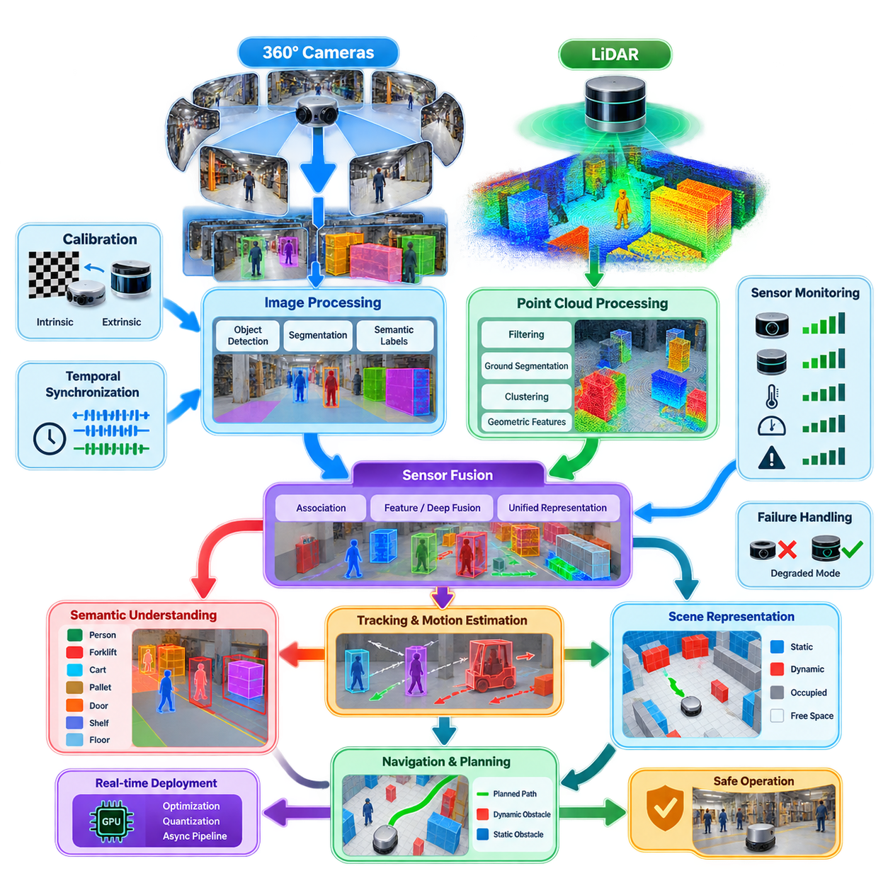
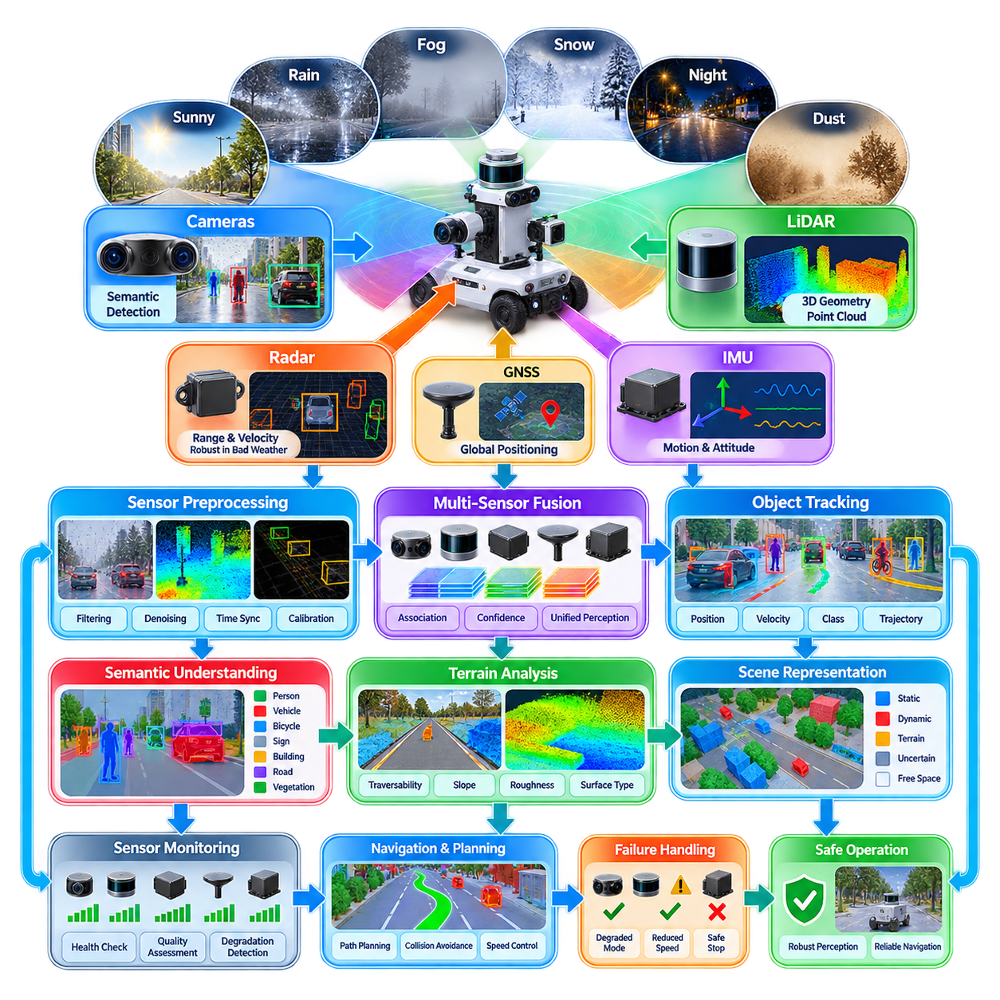
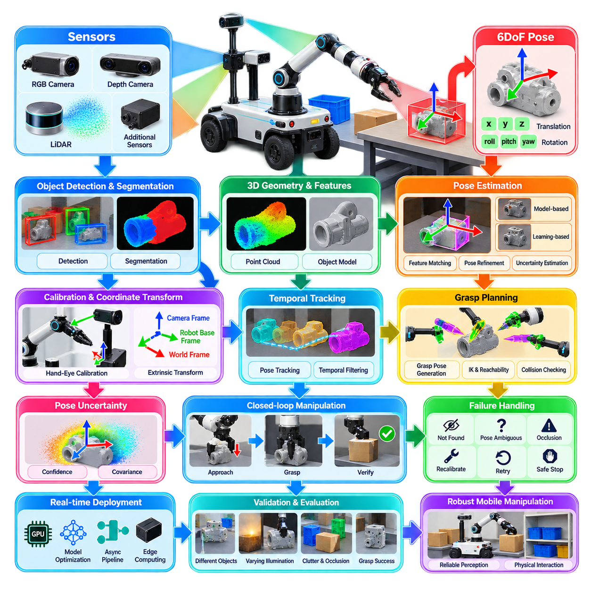
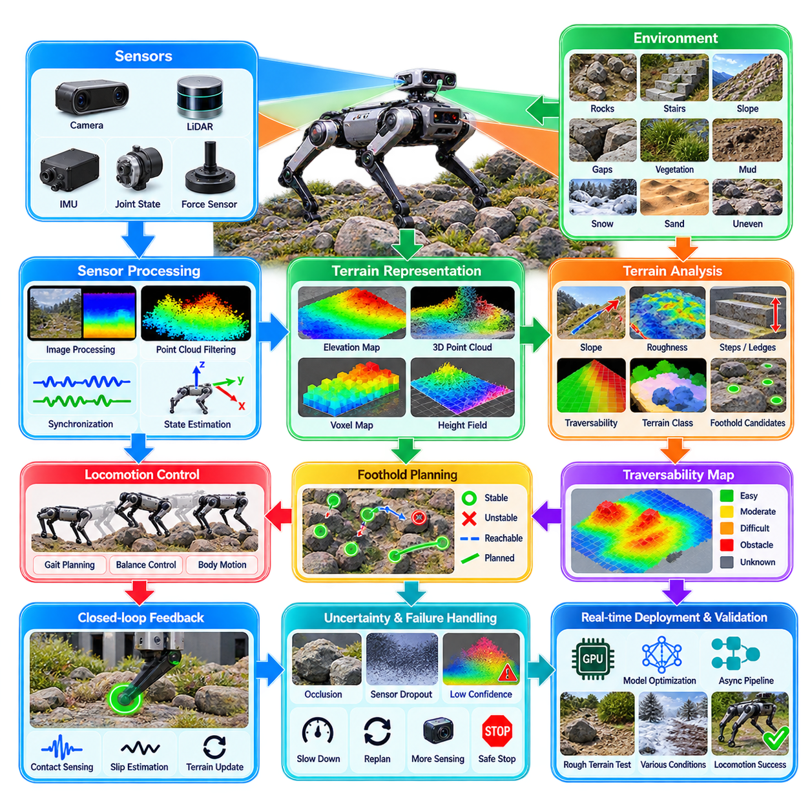
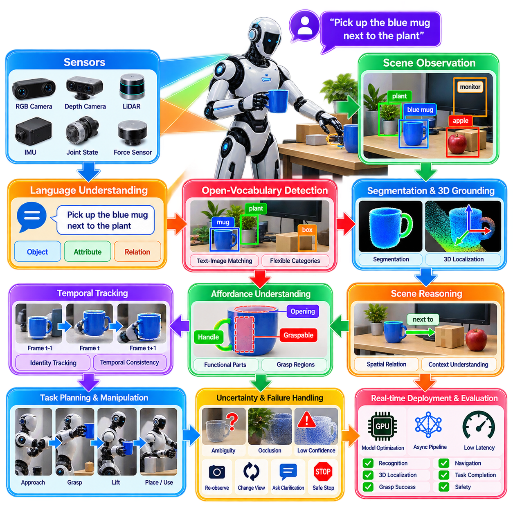
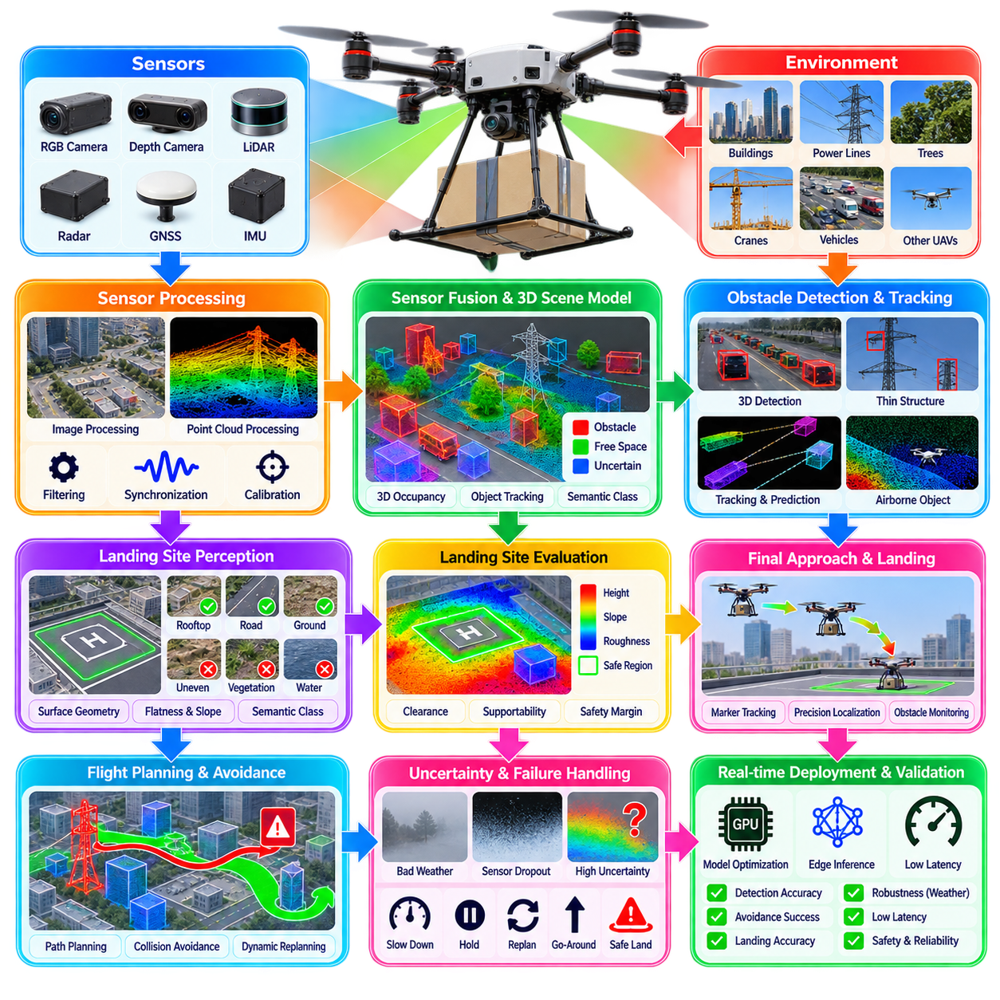
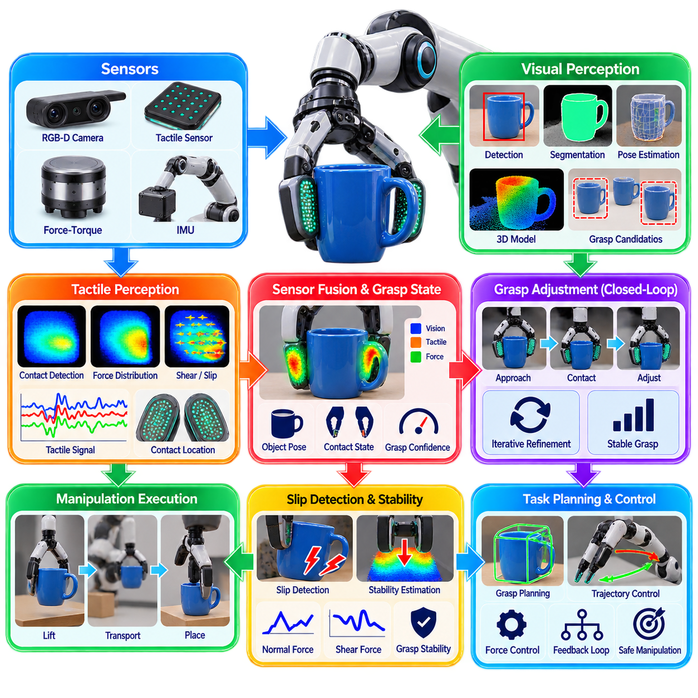
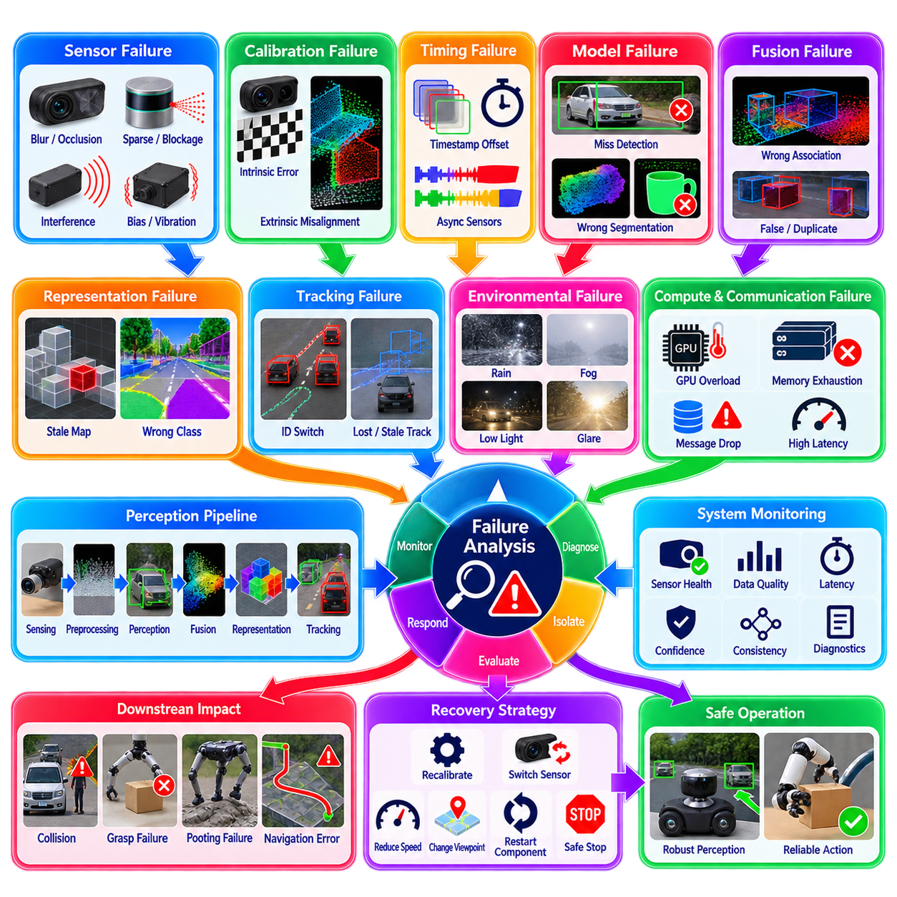
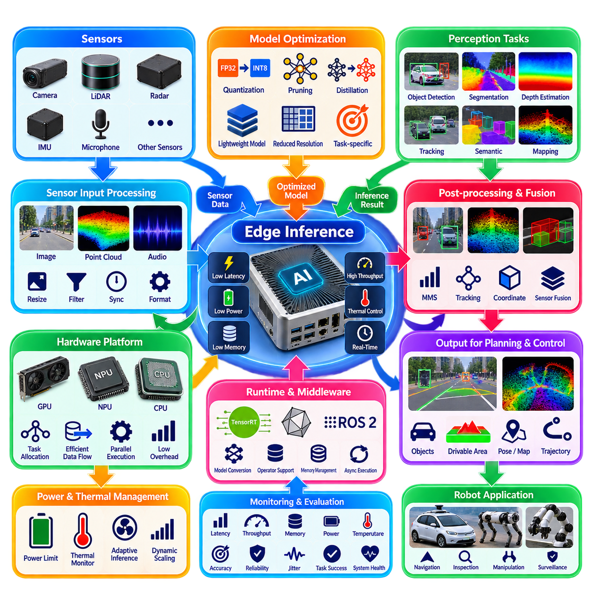
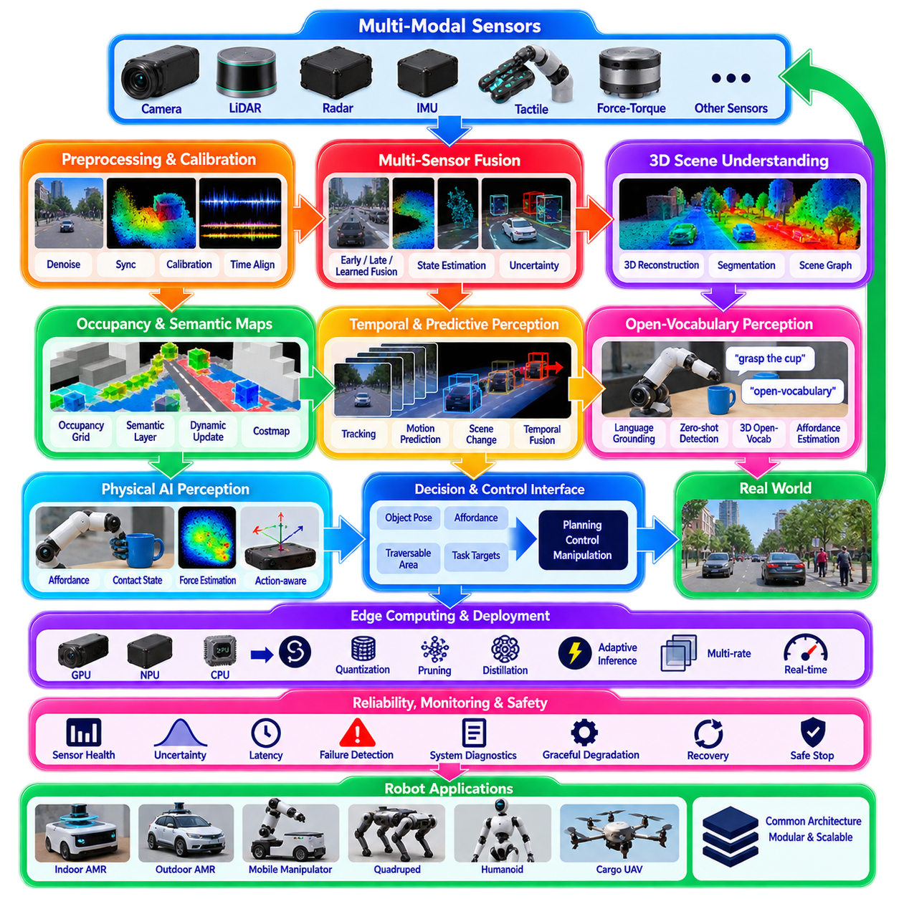

**Volume 14. Perception and Sensor Fusion**

# Chapter 12. Perception Case Studies

## 12.01. Indoor AMR 360 Camera LiDAR Fusion Perception Case

{width="7.268055555555556in" height="7.268055555555556in"}

창고, 공장, 병원 또는 상업 시설에서 운용되는 실내 자율이동로봇(Autonomous Mobile Robot, AMR)은 로봇 주변의 사람, 차량, 랙(rack), 벽, 팔레트(pallet), 임시 장애물을 지속적으로 인식해야 한다. 실용적인 아키텍처(architecture)는 360도 카메라 시스템(360-degree camera system)과 라이다(LiDAR)를 결합하여, 조밀한 시각적 의미 정보(visual semantics)가 기하학적으로 정확한 거리 측정 정보를 보완하도록 구성한다. 이를 통해 어느 한 센서 방식만 사용할 때 발생할 수 있는 사각지대(blind zone)를 줄일 수 있다.

카메라 서브시스템(camera subsystem)은 객체 종류, 질감, 색상, 표지판, 사람의 자세, 의미적 상황(semantic context)과 같은 풍부한 외형 정보를 제공한다. 서라운드 뷰(surround-view)는 서로 중첩되는 여러 카메라 또는 파노라마 영상(panoramic imaging)을 통해 구성할 수 있으며, 각각의 영상은 보정(calibration)을 거쳐 공통 로봇 좌표계(robot coordinate frame)로 변환된다. 이후 객체 검출(object detection)과 분할 네트워크(segmentation network)는 원시 픽셀(raw pixel)을 보행자, 카트, 팔레트, 문, 선반 및 바닥 영역 등을 구분할 수 있는 의미적 관측 정보(semantic observation)로 변환한다.

라이다(LiDAR)는 객체의 질감이나 조명 조건에 크게 의존하지 않는 직접적인 기하학적 측정값(geometric measurement)을 제공한다. 각각의 스캔(scan)은 로봇 좌표계로 변환되고 로컬 포인트 클라우드(local point cloud) 또는 점유 표현(occupancy representation)으로 누적될 수 있다. 실내 AMR에서 라이다는 구조적 경계(structural boundary)를 검출하고, 장애물 거리를 측정하며, 자유 공간(free space)을 식별하고, 시각적으로 반복되는 복도 환경에서도 신뢰성 높은 기하학적 인식(geometric perception)을 유지하는 데 특히 유용하다.

카메라-라이다 융합(camera-LiDAR fusion)의 핵심 장점은 단순한 중복성(redundancy)이 아니라 상호 보완성(complementarity)에 있다. 카메라는 특정 영역에 사람이 존재한다는 것을 인식할 수 있지만 거리를 정확하게 추정하는 데 한계가 있을 수 있다. 반면 라이다는 해당 표면까지의 거리를 정확하게 측정할 수 있지만 그 대상의 의미를 본질적으로 이해하지는 못한다. 센서 융합(sensor fusion)은 이러한 관측을 연계하여 장애물을 위치, 공간적 크기, 운동 상태, 의미적 클래스(semantic class), 신뢰도(confidence)를 동시에 포함하는 형태로 표현한다.

성공적인 융합은 정확한 내부 보정(intrinsic calibration)과 외부 보정(extrinsic calibration)에서 시작한다. 카메라 내부 파라미터(intrinsic parameter)는 투영 기하학(projection geometry)과 렌즈 왜곡(lens distortion)을 정의하며, 외부 변환(extrinsic transformation)은 각 카메라와 라이다 좌표계 사이의 강체 관계(rigid relationship)를 설정한다. 작은 회전 또는 병진 보정 오차도 라이다 포인트를 잘못된 영상 영역에 투영시켜 의미적 레이블(semantic label)이 인접 객체와 잘못 연결되고 후속 추적 성능을 저하시킬 수 있다.

실내 AMR과 주변 객체가 모두 움직일 수 있기 때문에 시간 동기화(temporal synchronization) 역시 중요하다. 서로 다른 시간에 취득된 카메라 프레임(camera frame)과 라이다 스캔(LiDAR scan)은 서로 다른 기하학적 상태를 나타내며, 특히 보행자 주변이나 로봇이 회전할 때 이러한 차이가 커진다. 따라서 하드웨어 타임스탬프(hardware timestamp), 동기화된 시계(synchronized clock), 보간(interpolation), 자기 운동 보상(ego-motion compensation)을 이용하여 공간적 연관(spatial association)이나 시간 융합(temporal fusion)을 수행하기 전에 측정값을 공통 기준 시점으로 정렬할 수 있다.

모듈형 융합 파이프라인(modular fusion pipeline)은 먼저 각각의 센서 스트림(sensor stream)을 독립적으로 처리한 다음 그 결과를 결합할 수 있다. 카메라 네트워크는 경계 상자(bounding box), 분할 마스크(segmentation mask), 임베딩(embedding), 의미적 레이블을 생성하며, 라이다 처리는 클러스터(cluster), 장애물 포인트, 자유 공간 경계 및 기하학적 특징(geometric feature)을 추출한다. 보정된 좌표계 사이의 투영을 이용하면 시각 관측과 라이다 측정값을 연계한 후 통합 객체 트랙(unified object track) 또는 로컬 장면 표현(local scene representation)을 생성할 수 있다.

충분한 연산 자원과 학습 데이터가 확보된 경우 특징 수준 융합(feature-level fusion) 또는 심층 융합(deep fusion)을 또 다른 설계 방식으로 사용할 수 있다. 카메라 특징을 조감도 표현(Bird\'s-Eye-View, BEV)으로 변환하고 검출 또는 점유 예측(occupancy prediction)을 수행하기 전에 라이다 특징과 결합할 수 있다. 이러한 아키텍처는 후기 융합(late fusion)보다 센서 간 관계를 효과적으로 활용할 수 있지만, 모델 복잡도, 보정 민감도, 데이터셋 요구량 및 AMR 엣지 컴퓨터(edge computer)의 연산 부하를 증가시킨다.

내비게이션(navigation)을 위해서는 융합된 인식 결과를 단순한 검출 결과로 유지하는 것이 아니라 최종적으로 모션 계획(motion planning)에 활용할 수 있는 표현으로 변환해야 한다. 고정된 벽과 랙은 지속적인 점유 계층(persistent occupancy layer)에 반영할 수 있으며, 보행자, 지게차, 카트 및 임시로 배치된 자재는 동적 또는 일시적 장애물(dynamic or transient obstacle)로 표현해야 한다. 의미 정보는 객체 종류, 운용 구역 및 필요한 안전거리에 따라 내비게이션 비용(navigation cost)을 추가적으로 조정하는 데 활용할 수 있다.

보행자 처리는 실내 운용에서 의미적 융합(semantic fusion)이 중요한 이유를 잘 보여준다. 라이다 클러스터만으로는 공간이 점유되었다는 사실만 알 수 있지만, 카메라 인식은 해당 클러스터가 사람이라는 것을 식별하고 방향이나 행동과 관련된 추가 단서를 제공할 수 있다. 이에 따라 내비게이션 시스템은 더 큰 안전 여유(safety margin)를 적용하고 잠재적인 움직임을 예상하며, 일시적으로 정지한 사람을 영구적인 지도 구조물로 잘못 처리하지 않을 수 있어 운용 안전성과 경로 효율성을 함께 향상시킬 수 있다.

시간적 추적(temporal tracking)은 개별 센서 프레임을 넘어 인식 출력을 안정화한다. 연계된 검출 결과는 칼만 필터링(Kalman filtering) 또는 관련 추적 방법을 통해 전파되어 위치, 속도, 방향 및 불확실성(uncertainty)을 추정할 수 있다. 트랙 지속성(track persistence)은 일시적인 카메라 가림(occlusion)이나 희소한 라이다 반환값(sparse LiDAR return)을 보완하는 데에도 도움이 된다. 그러나 오래된 트랙(stale track)은 유령 장애물(phantom obstacle)을 생성하여 불필요한 주행 제한을 발생시킬 수 있으므로 트랙 생성과 삭제를 신중하게 관리해야 한다.

실내 환경은 비교적 통제된 환경처럼 보이지만 다양한 어려운 예외 상황(corner case)을 포함한다. 반사 표면, 유리문, 광택 바닥, 가느다란 금속 구조물, 낮은 장애물, 군중, 심각한 가림, 변화하는 조명은 각각의 센서에 서로 다른 영향을 줄 수 있다. 따라서 강건한 융합 아키텍처(robust fusion architecture)는 센서 간 일치를 강제로 만드는 대신 센서별 신뢰도와 불확실성을 유지해야 하며, 이를 통해 불일치하는 측정값을 검출하고 성능이 저하된 센서 채널(sensor channel)의 영향력을 줄일 수 있다.

양산 또는 실제 운용 AMR에서는 인식 상태 모니터링(perception health monitoring)이 특히 중요하다. 시스템은 카메라 프레임률(frame rate), 노출(exposure), 영상 손상, 라이다 스캔 주파수, 포인트 밀도(point density), 타임스탬프 일관성, 보정 잔차(calibration residual), 추론 지연시간(inference latency), 통신 상태를 지속적으로 평가할 수 있다. 특정 센서가 사용할 수 없거나 신뢰하기 어려운 상태가 되면 손상된 측정값을 점유 지도와 내비게이션 결정에 조용히 전파하는 대신 정의된 성능 저하 모드(degraded mode)로 전환해야 한다.

실시간 성능(real-time performance)을 확보하려면 센서 취득, 전처리(preprocessing), 신경망 추론(neural inference), 연관, 융합, 추적, 지도 갱신 단계 전체에서 명시적인 지연시간 관리(latency management)가 필요하다. 모든 카메라를 항상 최대 해상도로 처리할 필요는 없다. 해상도 조절, 관심 영역 처리(Region-of-Interest processing), 모델 양자화(model quantization), TensorRT 계열 가속, 비동기 파이프라인(asynchronous pipeline), 선택적 추론(selective inference)을 활용하면 라이다와 로컬 장애물 센싱을 기반으로 하는 고속 기하학적 안전 경로를 유지하면서 연산 부하를 줄일 수 있다.

실용적인 배치(deployment)에서는 인식 기능을 중요도(criticality)에 따라 분리하는 것도 필요하다. 빠른 기하학적 장애물 검출은 결정론적인 안전 지향 계층(deterministic safety-oriented layer)으로 지속적으로 동작하게 하고, 더 많은 연산량이 필요한 의미적 모델(semantic model)은 상대적으로 낮은 주기로 실행하여 장면 표현을 보강할 수 있다. 이를 통해 신경망 추론 지연시간이 일시적으로 증가하더라도 기본적인 충돌 회피 기능이 직접 차단되지 않으며, 고급 AI 인식이 로봇의 최소 안전 센싱 기능을 대체하는 것이 아니라 강화하도록 구성할 수 있다.

검증(validation)은 신경망 정확도만 측정하는 것이 아니라 실제 운용 조건을 대표하는 환경에서 전체 융합 시스템을 평가해야 한다. 시험에는 좁은 통로, 교차로, 출입문, 접근하는 보행자, 횡단하는 카트, 부분적으로 가려진 객체, 반사 표면, 조명 변화, 센서 오염, 통신 지연 및 의도적인 센서 고장이 포함되어야 한다. 검출 품질은 위치추정 일관성(localization consistency), 추적 안정성(tracking stability), 지연시간 및 실제 내비게이션 결과와 함께 평가해야 한다.

최종 아키텍처는 파노라마 비전(panoramic vision)이 풍부한 의미 정보를 제공하고, 라이다가 미터 단위의 기하학적 정보(metric geometry)를 제공하며, 시간적 처리가 움직임의 연속성(motion continuity)을 제공하고, 센서 융합이 이러한 상호 보완적 관측을 내비게이션에 활용 가능한 장면 지식(scene knowledge)으로 변환하는 계층형 인식 시스템(layered perception system)을 형성한다. 따라서 이 사례는 센싱(sensing), 보정(calibration), 공간 표현(spatial representation), 의미 이해(semantic understanding), 다중 센서 융합(multi-sensor fusion), 점유 매핑(occupancy mapping), 고장 처리(failure handling), 엣지 배치(edge deployment)가 하나의 통합 로봇 파이프라인으로 동작하는 전체적인 인식 구조를 보여준다.

## 12.02. Outdoor AMR Multi Sensor Adverse Weather Case

{width="7.268055555555556in" height="7.268055555555556in"}

실외 자율이동로봇(Autonomous Mobile Robot, AMR)은 실내 플랫폼보다 훨씬 변화가 심한 인식 환경에서 운용된다. 인식 시스템(perception system)은 직사광선, 어둠, 비, 안개, 먼지, 눈, 젖은 노면, 그림자, 식생, 급격한 조명 변화에서도 신뢰할 수 있는 주변 인식을 유지해야 한다. 따라서 실제 양산형 아키텍처(production architecture)는 하나의 인식 방식이 모든 환경에서 항상 신뢰성을 유지할 수 있다고 가정하기보다 상호 보완적인 센서(complementary sensor)를 활용한다.

대표적인 실외 AMR은 카메라(camera), 라이다(LiDAR), 레이더(radar), 위성항법시스템(GNSS), 관성측정장치(Inertial Measurement Unit, IMU)를 결합한다. 카메라는 조밀한 외형 및 의미 정보(semantic information)를 제공하고, 라이다는 정확한 3차원 기하 정보(three-dimensional geometry)를 제공하며, 레이더는 시각적으로 열화된 환경에서도 유용한 강건성을 가지는 직접적인 거리와 상대속도 측정값을 제공한다. GNSS와 IMU는 로봇이 이동하는 동안 위치추정(localization), 시간 정렬(temporal alignment), 센서 관측 보상을 지원하는 운동 및 전역 기준 정보를 제공한다.

카메라 인식(camera perception)은 보행자, 차량, 교통 인프라, 도로 경계, 표지판, 작업 장비 및 주행 가능 표면(traversable surface)의 의미적 특성을 식별하는 데 특히 유용하다. 그러나 눈부심(glare), 저조도, 물방울, 렌즈 오염, 안개 또는 강한 명암 대비로 인해 성능이 저하될 수 있다. 따라서 노출 제어(exposure control), 고명암비 영상(High Dynamic Range imaging, HDR), 영상 품질 모니터링(image-quality monitoring), 신뢰도 추정(confidence estimation)은 선택적인 전처리 기능이 아니라 실외 인식의 필수 구성 요소가 된다.

라이다(LiDAR)는 장애물, 지형, 연석, 구조물 및 자유 공간(free space)에 대한 기하학적으로 정밀한 표현을 제공한다. 포인트 클라우드(point cloud)는 필터링, 지면 분리(ground separation), 클러스터링(clustering)을 거쳐 내비게이션에 사용되는 로컬 점유 표현(local occupancy representation) 또는 고도 표현(elevation representation)으로 변환할 수 있다. 그러나 비, 안개, 눈, 공기 중 입자, 고반사 재질 및 젖은 표면은 감쇠(attenuation), 산란(scattering), 오검출 반환값(false return), 포인트 밀도 감소를 유발할 수 있으므로 인식 파이프라인은 측정 품질을 지속적으로 평가해야 한다.

레이더(radar)는 무선주파수 측정(radio-frequency measurement)이 광학 센서와는 다른 방식으로 대기 및 조명 조건에 반응하기 때문에 중요한 보완 센싱 채널(complementary sensing channel)을 제공한다. 레이더는 카메라 대비 또는 라이다 가시성이 저하된 경우에도 움직이는 객체의 거리, 방사 속도(radial velocity), 경우에 따라 고도 또는 각도 구조를 추정할 수 있다. 그러나 상대적으로 낮은 공간 해상도(spatial resolution)와 다중경로 효과(multipath effect)가 발생할 수 있으므로 풍부한 기하학적 및 의미적 관측 정보와 융합할 때 가장 효과적이다.

다중 센서 융합(multi-sensor fusion)은 모든 측정값에 동일한 신뢰도를 강제하는 대신 각 센서 방식의 장점과 불확실성(uncertainty)을 유지해야 한다. 카메라 검출은 의미적 클래스(semantic class)를 제공하고, 라이다 클러스터는 3차원 위치와 형상을 결정하며, 레이더 반환값은 속도 추정을 강화할 수 있다. 이러한 관측값 사이의 연관(association)을 통해 위치, 크기, 클래스, 속도, 방향, 신뢰도 및 불확실성을 포함하는 객체 트랙(object track)을 생성하여 후속 예측(prediction)과 모션 계획(motion planning)에 활용할 수 있다.

실외 플랫폼은 진동, 온도 변화, 기계적 충격 및 장시간 운용에 노출되어 센서 정렬(sensor alignment)이 점진적으로 변할 수 있으므로 정확한 보정(calibration)이 필수적이다. 카메라-라이다, 라이다-레이더 및 센서-차량 간 변환(sensor-to-vehicle transformation)을 정확하게 설정하고 운용 중에도 지속적으로 감시해야 한다. 보정 잔차(calibration residual) 또는 센서 간 불일치(cross-sensor disagreement)는 정렬 오차가 인식 성능을 심각하게 저하시키기 전에 기계적 변위를 식별할 수 있는 지표가 될 수 있다.

실외 차량의 주행 속도에서는 시간 동기화(time synchronization)가 특히 중요하다. 작은 타임스탬프(timestamp) 차이도 AMR이나 다른 객체가 빠르게 움직이는 경우 상당한 공간 오차를 발생시킬 수 있다. 하드웨어 타임스탬프(hardware timestamp), 동기화된 시계(synchronized clock), IMU 기반 자기 운동 추정(ego-motion estimation), 시간 보간(temporal interpolation)을 이용하여 측정값을 공통 기준 시점으로 변환하면 카메라 검출, 라이다 포인트, 레이더 표적 및 위치추정 결과 사이의 겉보기 위치 차이를 줄일 수 있다.

악천후 인식(adverse-weather perception)에서는 명시적인 센서 품질 평가(sensor-quality assessment)가 효과적이다. 센서가 단순히 정상 또는 고장 상태라고 가정하는 대신 영상 대비, 라이다 포인트 밀도, 레이더 일관성, 가시거리 추정(visibility estimation), 오염 지표(contamination indicator), 시간적 안정성을 이용하여 중간 단계의 성능 저하 상태(degradation state)를 추정할 수 있다. 이에 따라 융합 가중치(fusion weight) 또는 신뢰도를 동적으로 조정하여 일시적으로 성능이 저하된 센서의 영향력을 완전히 제거하지 않으면서 감소시킬 수 있다.

비가 내리는 상황은 이러한 적응형 동작(adaptive behavior)을 잘 보여준다. 카메라 영상에는 대비 저하, 반사 및 물방울이 나타날 수 있으며, 라이다는 강수와 젖은 표면으로 인해 산란된 반환값(scattered return)을 생성할 수 있다. 레이더 측정은 환경 영향으로부터 완전히 자유롭지는 않지만 움직이는 표적을 검출하는 데 상대적으로 유용할 수 있다. 센서 간 일관성(cross-modal consistency)을 이용하면 단일 센서 파이프라인보다 지속적으로 존재하는 실제 장애물과 일시적인 기상 유발 측정값(weather-induced measurement)을 더욱 신뢰성 있게 구별할 수 있다.

안개(fog)는 부유하는 물방울이 광학적 가시성을 감소시키고 라이다 측정값을 감쇠시키거나 산란시킬 수 있기 때문에 또 다른 어려운 조건을 형성한다. 카메라 기반 의미 인식(semantic recognition)의 유효 검출 거리가 감소할 수 있으며, 라이다 포인트 밀도 역시 거리가 증가할수록 감소할 수 있다. 인식 시스템은 이에 대응하여 불확실성을 증가시키고 신뢰 가능한 인식 거리(perception horizon)를 줄이며, 적절한 경우 레이더의 기여도를 높이고 장애물을 신뢰성 있게 검출할 수 있는 거리에 따라 내비게이션 시스템이 주행 속도를 감소시키도록 해야 한다.

눈과 공기 중 먼지는 작은 장애물처럼 보이는 다수의 일시적인 측정값(transient measurement)을 생성할 수 있다. 시간적 필터링(temporal filtering)은 공간적으로 지속되지 않는 관측값을 제거하는 데 도움이 되며, 기하학적 클러스터링(geometric clustering)은 고립된 반환값이 즉시 내비게이션 장애물로 변환되는 것을 방지한다. 그러나 지나치게 공격적인 필터링은 실제 작은 객체까지 제거할 수 있으므로 오검출(false positive)을 억제하면서 짧은 시간 또는 희소하게 나타나는 실제 장애물을 유지해야 하는 안전 요구사항 사이에서 균형을 확보해야 한다.

실외 지형 인식(outdoor terrain perception)은 일반적인 객체 검출을 넘어선다. AMR은 경사도, 거칠기(roughness), 고도 불연속(elevation discontinuity), 연석, 포트홀(pothole), 느슨한 지면, 식생, 물 고임 및 기타 지형 특성을 고려하여 지면 자체가 주행 가능한지를 판단해야 한다. 라이다 기하 정보는 고도 및 경사 분석을 지원하며, 카메라 의미 정보는 기하학적으로 유사하게 보이지만 접지력(traction)이나 이동성 위험(mobility risk)이 서로 다른 표면 종류를 구분하는 데 활용할 수 있다.

융합 표현(fused representation)은 정적 구조물, 동적 객체, 지형 특성 및 불확실 영역(uncertain region)을 구분해야 한다. 건물, 장벽, 기둥 및 안정적인 인프라는 지속적 지도 계층(persistent map layer)에 포함할 수 있으며, 보행자, 자전거, 차량 및 이동식 장비는 동적 추적(dynamic tracking)이 필요하다. 지형 비용 계층(terrain cost layer)은 경사도나 거칠기를 표현할 수 있으며, 충분히 관측되지 않은 영역은 자동으로 자유 공간으로 분류하지 않고 불확실성을 유지해야 한다. 이러한 표현은 내비게이션이 위험 인지형 계획(risk-aware planning)을 수행할 수 있는 더욱 풍부한 기반을 제공한다.

동적 객체 추적(dynamic-object tracking)은 일부 센서의 성능이 저하된 상황에서도 안정적으로 유지되어야 한다. 시각 추적(visual tracking)이 불안정해지면 레이더 속도 측정값이 운동 추정을 지원할 수 있으며, 객체의 외형이 크게 변화하는 경우에도 라이다 기하 정보가 객체 위치를 유지하는 데 도움을 줄 수 있다. 시간적 필터링과 트랙 관리(track management)는 여러 프레임의 관측값을 결합하지만, 오래되거나 잘못 연관된 트랙은 유령 장애물(phantom obstacle)이 되어 로봇의 움직임을 불필요하게 제한할 수 있으므로 신중하게 제거해야 한다.

안전 아키텍처(safety architecture)는 연산 비용이 높은 AI 인식에만 의존해서는 안 된다. 빠른 기하학적 장애물 검출 경로(geometric obstacle-detection path)를 의미적 인식 및 학습 기반 인식 모듈과 병렬로 운용하면 신경망 추론이 지연되거나 환경 조건으로 인해 분류 신뢰도가 감소하더라도 최소한의 보호 기능을 제공할 수 있다. 고급 인식은 이러한 안전 지향 계층에 객체 정체성, 움직임 해석, 지형 의미 및 장기적인 상황 이해를 추가하는 방식으로 구성할 수 있다.

고장 검출 및 격리(Failure Detection and Isolation, FDI)는 실외 배치에서 매우 중요하다. 시스템은 프레임률(frame rate), 타임스탬프, 통신 상태, 센서 온도, 영상 품질, 라이다 반환 통계, 레이더 표적 일관성, GNSS 품질, IMU 동작, 추론 지연시간 및 센서 간 잔차(cross-modal residual)를 모니터링해야 한다. 특정 센서의 신뢰성이 떨어지면 남아 있는 인식 능력에 따라 AMR을 저속 운행, 더 큰 안전 여유, 제한된 경로 또는 제어된 정지(controlled stop)를 적용하는 성능 저하 운용 모드(degraded operating mode)로 전환할 수 있다.

실시간 엣지 배치(real-time edge deployment)를 위해서는 연산 자원을 신중하게 할당해야 한다. 고해상도 카메라 네트워크, 포인트 클라우드 처리, 레이더 추적, 위치추정 및 센서 융합이 엄격한 지연시간 제약 아래에서 동시에 실행될 수 있다. 모델 양자화(model quantization), 하드웨어 가속(hardware acceleration), 비동기 실행(asynchronous execution), 관심 영역 처리(Region-of-Interest processing), 적응형 추론 주기(adaptive inference rate), 우선순위 스케줄링(prioritized scheduling)을 활용하면 환경 복잡도가 낮은 상황에서 불필요한 연산을 줄이면서 핵심 인식 기능을 유지할 수 있다.

검증(validation)은 이상적인 날씨에서 각 센서를 개별적으로 시험하는 데 그치지 않고 다양한 조건의 조합을 재현해야 한다. 대표적인 시나리오에는 밝은 영역에서 그림자로의 전환, 야간 운용, 폭우, 안개, 젖은 노면, 먼지, 눈, 반사 표면, 식생, 부분적으로 가려진 보행자, 횡단 차량, 센서 오염, GNSS 성능 저하 및 의도적인 센서 고장이 포함된다. 평가는 검출 및 추적 지표를 지연시간, 불확실성, 내비게이션 동작, 정지거리(stopping distance), 실제 안전 결과와 연결하여 수행해야 한다.

결과적으로 실외 AMR 아키텍처는 고정된 독립 검출기들의 집합이 아니라 환경 조건을 인식하는 다중 센서 인식 시스템(condition-aware multi-sensor perception system)으로 구성된다. 카메라는 풍부한 의미 정보를 제공하고, 라이다는 정밀한 기하 정보를 제공하며, 레이더는 운동 감지와 가시성 저하 환경에서의 인식 능력을 강화하고, 관성 및 위치 센서는 공간적·시간적 일관성을 유지한다. 적응형 융합(adaptive fusion), 상태 모니터링(health monitoring), 지형 이해(terrain understanding), 고장 처리(failure handling), 실시간 엣지 처리(real-time edge processing)는 이러한 상호 보완적 측정값을 안전한 자율 운용을 위한 강건한 장면 인식(scene awareness)으로 변환한다.

## 12.03. Mobile Manipulator 6DoF Object Pose Estimation Case

{width="7.268055555555556in" height="7.268055555555556in"}

이동형 매니퓰레이터(mobile manipulator)는 자율 이동과 로봇 조작을 결합하므로, 단순히 객체를 검출하거나 대략적인 위치를 결정하는 것 이상의 인식 문제가 발생한다. 객체를 잡거나(grasp), 검사하거나, 조립하거나, 상호작용하기 위해서는 로봇이 6자유도(6 Degrees of Freedom, 6DoF)의 전체 자세(pose)를 추정해야 하며, 이는 3차원 위치(translation)와 3차원 회전(rotation)으로 구성된다. 이 자세는 카메라, 로봇 베이스, 매니퓰레이터 및 월드 좌표계(world coordinate frame) 사이에서 일관되게 유지되어야 한다.

대표적인 시스템은 로봇 본체, 마스트(mast) 또는 매니퓰레이터 손목(wrist)에 장착된 RGB 또는 RGB-D 카메라를 사용하며, 필요에 따라 라이다(LiDAR) 또는 추가 깊이 센서(depth sensor)를 보조적으로 사용할 수 있다. 카메라는 외형 및 의미 정보(semantic information)를 제공하고, 깊이 측정값은 객체 위치와 표면 구조에 대한 기하학적 제약(geometric constraint)을 제공한다. 인식 파이프라인(perception pipeline)은 이러한 관측값을 객체 식별(object identity), 분할 마스크(segmentation mask), 3차원 형상(3D geometry), 그리고 최종적으로 조작 계획(manipulation planning)에 사용할 수 있는 자세 변환(pose transformation)으로 변환한다.

6자유도 자세 추정(6DoF pose estimation)은 객체의 위치를 x, y, z축 방향의 이동으로 표현하고, 방향을 이들 축을 중심으로 한 회전으로 표현한다. 구현에서는 회전 행렬(rotation matrix), 쿼터니언(quaternion) 또는 기타 자세 표현 방식을 사용할 수 있다. 추정된 변환(transformation)은 객체 좌표계(object coordinate frame)와 관측 센서 좌표계(observing sensor frame) 사이의 관계를 정의하므로, 조작 시스템은 접근 방향, 파지점(grasp point), 충돌 없는 이동 경로를 기하학적으로 판단할 수 있다.

첫 번째 단계는 일반적으로 객체 검출(object detection) 또는 객체 분할(object segmentation)이다. 검출기는 영상 내 후보 객체를 식별하고, 인스턴스 분할(instance segmentation)은 주변 표면이나 인접 객체를 제외한 보다 정밀한 픽셀 단위 경계를 제공할 수 있다. 이러한 분리는 복잡한 산업 환경에서 특히 중요하다. 부품들이 서로 가까이 배치되거나 부분적으로 가려져 있거나, 컨테이너 내부에 놓여 있어 복잡한 배경과 모호한 깊이 측정이 발생할 수 있기 때문이다.

대상이 분리되면 자세 추정(pose estimation)은 학습된 영상 특징(learned image feature), 깊이 기하(depth geometry), 알려진 3차원 모델(known 3D model) 또는 이들의 조합을 활용할 수 있다. 모델 기반 접근법(model-based approach)은 관측된 특징과 기준 객체 모델(reference object model) 사이의 대응 관계(correspondence)를 설정하는 반면, 학습 기반 접근법(learned approach)은 영상이나 포인트 클라우드로부터 자세 관련 표현을 직접 예측할 수 있다. 최신 시스템에서는 학습 기반 특징 추출과 기하학적 정합(geometric registration)을 결합하여 인식 강건성과 정확한 미터 단위 정렬(metric alignment)을 동시에 확보할 수 있다.

깊이 정보(depth information)는 영상 관측만으로는 발생하는 크기 모호성(scale ambiguity)을 줄이기 때문에 이동 위치 추정(translation estimation)을 크게 향상시킨다. RGB-D 카메라는 픽셀을 측정된 깊이와 연결하여 객체 표면의 3차원 재구성을 가능하게 한다. 이렇게 생성된 포인트는 CAD 모델 또는 학습된 객체 표현과 비교할 수 있다. 반사 재질, 가림 또는 센서 한계로 인해 깊이 정보가 불완전한 경우에는 시각적 특징과 기하학적 사전 지식(geometric prior)이 상호 보완적인 제약으로 활용될 수 있다.

실용적인 6DoF 인식 파이프라인에서는 좌표 변환(coordinate transformation)을 신중하게 관리해야 한다. 카메라 관측은 처음에는 카메라 좌표계(camera frame)로 표현되지만, 파지 계획(grasp planning)은 일반적으로 로봇 베이스 또는 매니퓰레이터 좌표계(manipulator frame)를 기준으로 수행된다. 따라서 정확한 핸드-아이 보정(hand-eye calibration)과 카메라-베이스 보정(camera-to-base calibration)을 통해 추정된 객체 자세를 로봇의 운동학(robot kinematics)과 연결해야 한다. 수 밀리미터 또는 몇 도 정도의 오차도 부품 삽입, 좁은 파지 영역 접근 또는 작은 객체 조작에서는 상당한 문제가 될 수 있다.

이동형 조작에서는 베이스 자체가 매번 동일한 자세에서 정확하게 정지하지 않을 수 있기 때문에 또 다른 불확실성이 발생한다. 내비게이션(navigation)은 로봇을 작업 영역으로 이동시킬 수 있지만, 조작 인식(manipulation perception)은 도착한 이후 목표물과의 관계를 다시 정밀하게 보정해야 하며 전역 위치추정(global localization)에만 의존해서는 안 된다. 따라서 로봇은 대략적인 위치 결정에는 내비게이션을 사용하고, 최종적인 정밀 조작에는 국부적인 영상 또는 깊이 기반 자세 추정을 사용하는 방식으로 전역 이동 정확도와 최종 파지 정확도를 분리할 수 있다.

손목 장착 카메라(wrist-mounted camera)는 이러한 정밀 보정을 위한 유용한 방법을 제공한다. 본체 장착 카메라는 먼저 목표물을 검출하고 대략적인 자세를 추정할 수 있으며, 이후 매니퓰레이터가 목표물에 가까이 이동하여 손목 카메라를 통해 더 높은 해상도의 관측을 획득할 수 있다. 이러한 조대-정밀(coarse-to-fine) 전략은 불확실성을 줄이고 비주얼 서보잉(visual servoing)을 지원한다. 비주얼 서보잉에서는 접근 과정 중 반복적인 인식 업데이트를 통해 엔드 이펙터(end effector)와 목표물 사이의 상대 변환(relative transformation)을 지속적으로 보정한다.

가림(occlusion)은 실제 자세 추정에서 핵심적인 어려움이다. 객체가 컨테이너, 고정 장치, 인접 부품 또는 로봇 자체의 그리퍼(gripper)에 의해 부분적으로 가려질 수 있다. 강건한 시스템은 신뢰도(confidence)를 추정하여 가시성이 낮은 예측을 완전하게 관측된 결과와 동일한 수준으로 취급하지 않아야 한다. 시간적 통합(temporal integration), 다중 시점 관측(multi-view observation), 깊이 정보 및 능동적 시점 선택(active viewpoint selection)을 활용하면 하나의 카메라 시점에서 충분한 기하학적 증거를 확보하지 못하는 경우에도 자세 추정을 개선할 수 있다.

객체의 대칭성(symmetry)은 또 다른 중요한 문제를 발생시킨다. 원통형 부품, 박스, 반복적인 면을 가진 기어, 커넥터 및 제조 부품은 시각적 또는 기하학적으로 서로 동일한 여러 방향을 가질 수 있다. 하나의 대표적인 방향만 예측하는 자세 추정기는 실제로 기능적으로 동일한 자세를 예측했음에도 수치적으로는 큰 자세 오차를 보고할 수 있다. 따라서 조작 중심의 평가(manipulation-aware evaluation)에서는 객체 대칭성을 고려하고, 서로 다른 자세가 동일한 파지 또는 조립 결과를 만들어내는지를 판단해야 한다.

자세 불확실성(pose uncertainty)은 인식 인터페이스에서 사라지는 것이 아니라 조작 계획으로 전달되어야 한다. 자세 추정값에는 위치와 방향이 관측에 의해 얼마나 강하게 뒷받침되는지를 나타내는 신뢰도, 공분산(covariance) 또는 기타 불확실성 정보가 함께 제공될 수 있다. 계획기는 더 큰 여유 공간을 갖는 파지를 선택하거나, 다른 시점을 요청하거나, 접근 속도를 낮추거나, 불확실성이 작업 허용 오차를 초과할 경우 조작 시도를 거부할 수 있다.

시간적 추적(temporal tracking)은 이동형 매니퓰레이터가 여러 프레임에 걸쳐 객체와 상호작용할 때 안정성을 더욱 향상시킨다. 시스템은 매 영상마다 독립적으로 자세를 추정하는 대신 이전 추정값을 시간적 사전 정보(temporal prior)로 활용하고 갑작스럽고 비현실적인 변화를 필터링할 수 있다. 추적은 특히 매니퓰레이터의 움직임, 카메라 움직임 또는 객체의 이동 과정에서 유용하지만, 대상이 완전히 가려지거나 추적 신뢰도가 급격히 감소하는 경우에는 다시 초기화(reinitialization)할 수 있어야 한다.

추정된 자세는 파지 계획(grasp planning)과 통합된 이후에야 실제 행동으로 연결될 수 있다. 후보 파지 자세(candidate grasp pose)는 객체 좌표계를 기준으로 정의할 수 있으며, 추정된 객체 변환을 이용하여 로봇 좌표계로 변환할 수 있다. 이후 역기구학(Inverse Kinematics, IK)을 통해 매니퓰레이터가 해당 파지 위치에 도달할 수 있는지를 판단하고, 충돌 검사(collision checking)를 통해 팔, 손목 및 그리퍼가 주변 구조물과 접촉하지 않고 접근할 수 있는지를 검증한다. 따라서 인식과 조작은 공유된 기하 정보(shared geometry)를 통해 긴밀하게 결합된다.

단일 인식-파지 과정보다는 폐루프 검증(closed-loop verification)이 바람직하다. 최종 접촉 전에 로봇은 목표물을 다시 관측하고 자세 오차가 허용 가능한 범위 내에 유지되는지 검증할 수 있다. 그리퍼를 닫은 이후에는 영상, 힘 또는 촉각 센싱(force or tactile sensing)을 이용하여 객체가 성공적으로 파지되었는지를 확인할 수 있다. 검증에 실패하면 시스템은 후퇴하고 자세 추정값을 갱신한 후 새로운 파지 후보를 선택하여 다시 시도할 수 있으며, 잘못된 조작 시퀀스를 계속 수행하지 않도록 해야 한다.

고장 처리는 객체 부재(object absence), 검출 실패(detection failure), 자세 모호성(pose ambiguity), 보정 오류(calibration error), 깊이 정보 저하(depth degradation), 가림(occlusion), 도달할 수 없는 파지 기하(unreachable grasp geometry)를 구분해야 한다. 이러한 조건들은 서로 다른 복구 동작(recovery action)을 요구한다. 실제 문제가 불량한 시점 기하(viewpoint geometry) 또는 보정 드리프트(calibration drift)인 경우 동일한 자세 추정기를 반복 실행하는 것은 효과적이지 않다. 따라서 양산 시스템은 작업 실행기가 베이스 위치를 변경하거나 카메라를 이동시키거나 재보정을 수행하거나 사람의 지원을 요청할 수 있도록 진단 상태(diagnostic state)를 제공해야 한다.

실시간 배치(real-time deployment)에서는 정확도와 지연시간(latency) 사이의 균형을 유지해야 한다. 고해상도 분할, 조밀한 포인트 클라우드 처리, 특징 정합(feature matching), 자세 정밀화(pose refinement), 파지 생성(grasp generation)은 상당한 엣지 컴퓨팅 자원을 사용할 수 있다. 관심 영역 처리(Region-of-Interest processing), 모델 양자화(model quantization), GPU 가속(GPU acceleration), 캐시된 객체 모델(cached object model), 비동기 실행(asynchronous execution), 단계적 추론(staged inference)을 통해 연산 비용을 줄일 수 있으며, 특히 조작 대상으로 선택된 객체에 대해서만 고비용 정밀화를 수행할 수 있다.

검증은 자세 정확도만을 독립적으로 평가하는 것이 아니라 전체 인식-조작 체인(perception-to-manipulation chain)을 평가해야 한다. 시험에는 서로 다른 객체 거리, 방향, 조명 수준, 장애물 밀도, 부분적인 가림, 반사 표면, 반복적인 질감, 대칭 객체, 베이스 위치 오차, 카메라 진동 및 보정 오차를 포함해야 한다. 평가 지표는 이동 및 회전 오차를 파지 성공률(grasp success rate), 삽입 정확도(insertion accuracy), 충돌 빈도(collision frequency), 사이클 시간(cycle time), 복구 성능(recovery performance)과 연결하여 평가해야 한다.

이 사례는 이동형 매니퓰레이터의 6DoF 객체 자세 추정이 단순한 컴퓨터 비전 출력이 아니라 인식과 물리적 행동을 연결하는 기하학적 인터페이스(geometric interface)임을 보여준다. 검출은 목표물을 식별하고, 깊이와 기하 정보는 공간 구조를 확립하며, 보정은 좌표계를 연결하고, 추적은 시간적 일관성(temporal consistency)을 유지하며, 불확실성은 조작 결정을 안내한다. 자세 추정을 파지 계획, 검증 및 고장 복구와 결합하면 물리적 상호작용을 안정적으로 수행할 수 있는 폐루프 인식 능력(closed-loop perception capability)으로 발전시킬 수 있다.

## 12.04. Quadruped Terrain Perception Rough Terrain Case

{width="7.268055555555556in" height="7.268055555555556in"}

험준한 지형(rough terrain)에서 운용되는 사족보행 로봇(quadruped robot)의 인식은 일반적인 장애물 검출(obstacle detection)을 넘어서는 기능을 요구한다. 로봇은 지속적으로 지면의 고도(elevation), 경사(slope), 거칠기(roughness), 단차(steps), 틈(gaps), 암석(rocks), 식생(vegetation), 느슨한 지면(loose surfaces), 주행 가능 영역(traversable regions)을 이해해야 하며, 동시에 로봇의 본체와 센서는 상당한 움직임을 겪는다. 따라서 지형 인식(terrain perception)은 환경 센싱(environmental sensing), 보행 계획(locomotion planning), 균형 제어(balance control), 발 디딤점 선택(foothold selection)을 직접 연결하는 인터페이스가 된다.

실용적인 인식 시스템은 스테레오 카메라(stereo camera) 또는 RGB-D 카메라, 라이다(LiDAR), 관성측정장치(IMU), 관절 상태 정보(joint-state information), 그리고 필요에 따라 추가 거리 센서(range sensor) 또는 힘 센서(force sensor)를 결합할 수 있다. 카메라는 풍부한 시각 및 의미 정보를 제공하고, 라이다는 넓은 공간 영역에 대한 명시적인 3차원 기하 정보를 제공한다. IMU는 로봇 본체의 가속도와 각운동을 측정하고, 관절 상태 정보는 다리의 형상과 자세에 대한 정보를 제공한다. 이러한 정보를 결합하면 지형을 고정된 센서 관측값이 아니라 움직이는 로봇을 기준으로 해석할 수 있다.

첫 번째 단계에서는 원시 센서 측정값(raw sensor measurement)을 주변 지형에 대한 일관된 표현(consistent representation)으로 변환한다. 카메라 영상은 의미적 분할(semantic segmentation), 깊이 추정(depth estimation), 지형 분류(terrain classification)를 위해 처리할 수 있으며, 라이다 포인트 클라우드(point cloud)는 필터링, 다운샘플링(downsampling), 좌표 변환을 거쳐 고도 표현(elevation representation)으로 변환할 수 있다. 일반적인 평면 지면 가정(planar ground assumption)은 암석, 계단, 경사면, 도랑 및 불규칙한 자연 지형에서는 성립하지 않는 경우가 많으므로 지면 추출(ground extraction)은 큰 고도 변화에도 강건해야 한다.

지형 기하(terrain geometry)는 고도 맵(elevation map), 복셀 맵(voxel map), 포인트 클라우드(point cloud), 로컬 높이 필드(local height field) 등으로 표현할 수 있다. 고도 맵은 각 수평 위치에 추정된 지면 높이와 관련 신뢰도(confidence)를 저장할 수 있기 때문에 사족보행 이동에 특히 유용하다. 이러한 표현으로부터 로봇은 지표면 경사, 국부적 거칠기, 불연속성(discontinuity), 잠재적인 발 디딤 영역을 계산할 수 있다. 희소한 측정이나 가림(occlusion)으로 인해 안전하지 않은 영역이 인위적으로 주행 가능한 영역으로 나타나는 것을 방지하기 위해 불확실성(uncertainty)을 유지하는 것이 중요하다.

경사도와 거칠기 추정(slope and roughness estimation)은 험준한 지형 이해의 핵심이다. 국부적으로 적합된 표면(local fitted surface)은 지형 경사도를 추정할 수 있으며, 일정 영역 내의 높이 변화는 거칠기를 나타낼 수 있다. 그러나 이러한 지표는 로봇의 형태학(morphology)과 보행 능력(gait capability)을 기준으로 해석해야 한다. 작은 단차도 한 사족보행 로봇에는 문제가 없을 수 있지만, 다른 로봇에서는 다리 길이, 발 크기, 차체 지상고(body clearance), 관절 한계(joint limit), 가용 구동력(actuation authority)에 따라 문제가 될 수 있다.

지형 인식은 계단, 턱, 틈, 암석, 구멍 및 급격한 고도 변화와 같은 불연속 구조(discrete structure)도 식별해야 한다. 이러한 특징은 보행 계획 과정에서 특별한 처리가 필요한 고도 맵의 불연속성을 발생시킬 수 있다. 사족보행 로봇은 작은 장애물을 넘거나, 높은 지면에 발을 올리거나, 얕은 움푹 들어간 곳을 통과할 수 있지만, 이러한 판단은 단순한 장애물 높이만으로 결정되지 않고 예상되는 발 디딤점의 안정성과 그 결과로 발생하는 로봇 본체 자세(body posture)를 함께 고려해야 한다.

의미 정보(semantic information)는 기하학을 넘어 추가적인 인식 계층을 제공한다. 카메라는 암석, 잔디, 진흙, 자갈, 포장도로, 모래, 눈 또는 물을 구분할 수 있으며, 이러한 표면이 기하학적으로 유사하더라도 구별할 수 있다. 이러한 클래스는 접지력(traction), 침하(sinkage), 미끄러짐 확률(slip probability) 또는 기계적 위험(mechanical risk)에 대해 서로 다른 추정값과 연결될 수 있다. 따라서 의미적 지형 분류는 기하학적 분석을 대체하는 것이 아니라 이를 보완해야 한다. 외형 정보만으로는 실제 지지 조건을 항상 신뢰성 있게 판단할 수 없기 때문이다.

사족보행 로봇은 지형 관측값을 획득하는 동안 지속적으로 움직이기 때문에 로봇 자체의 움직임이 주요한 어려움을 만든다. 본체의 피치(pitch), 롤(roll), 요(yaw), 수직 진동(vertical oscillation), 다리 움직임은 환경 특징의 겉보기 위치를 변화시킬 수 있다. 따라서 자기 운동 보상(ego-motion compensation)과 센서 관측값을 공통 로컬 좌표계로 변환하기 위해 IMU 측정값과 로봇 상태 추정(robot state estimation)이 필요하다. 빠른 보행 중에는 작은 시간 동기화 오차도 상당한 공간적 불일치를 발생시킬 수 있으므로 정확한 시간 동기화(temporal synchronization) 역시 중요하다.

인식 시스템은 단순히 지형을 안전 또는 위험으로 분류하는 것이 아니라 주행 가능성 표현(traversability representation)을 생성해야 한다. 주행 가능성은 경사도, 거칠기, 단차 높이, 표면 종류, 추정된 여유 공간(clearance), 불확실성 및 위험 요소와의 거리를 종합할 수 있다. 결과는 연속적인 비용 필드(continuous cost field)로 표현할 수 있으며, 유리한 기하 조건을 가진 지형에는 낮은 이동 비용을 부여하고 불확실하거나 기계적으로 어려운 영역에는 높은 비용을 부여할 수 있다. 이러한 표현은 발 디딤점 계획과 차체 움직임 계획(body-motion planning)에 활용될 수 있다.

발 디딤점 인식(foothold perception)은 사족보행 로봇에서 특히 중요하다. 보행은 개별적인 접촉 위치(contact location)에 의존하기 때문이다. 관측된 국부 지형으로부터 후보 발 디딤점(candidate foothold)을 생성하고 표면 평탄도, 경사, 지지 면적, 가장자리와의 거리, 충돌 위험 및 도달 가능성(reachability)을 기준으로 평가할 수 있다. 인식 시스템이 최종 발 디딤점을 반드시 직접 선택할 필요는 없지만, 보행 계획기가 물리적으로 가능한 접촉 위치와 시각적으로 이용 가능하지만 불안정한 위치를 구분할 수 있도록 기하학적 및 의미적 증거를 제공해야 한다.

가림은 험준한 지형 인식에서 중요한 한계가 된다. 암석, 식생 또는 로봇 자체의 본체가 뒤쪽 지형을 가려 불완전한 고도 정보를 생성할 수 있다. 시스템은 관측되지 않은 지형(unknown terrain)과 자유 지형(free terrain)을 구분해야 하며, 관측값이 없다는 이유만으로 해당 영역을 안전한 공간으로 처리해서는 안 된다. 여러 프레임의 누적(multi-frame accumulation), 시점 변화(viewpoint change), 시간적 필터링 및 능동 센싱(active sensing)을 통해 사족보행 로봇이 처음에는 관측하지 못한 영역에 접근하면서 불확실성을 점진적으로 줄일 수 있다.

지형 인식은 서로 다른 공간적 스케일(spatial scale)에서도 동작해야 한다. 발 주변의 국부 인식(local perception)은 작은 가장자리나 구멍도 접촉 안정성에 영향을 줄 수 있기 때문에 높은 공간 해상도가 필요하다. 반면 더 먼 거리에서는 로봇이 경사면, 계단, 큰 장애물 및 지형 전환을 미리 예측할 수 있도록 더 넓지만 상대적으로 낮은 해상도의 표현이 필요하다. 따라서 계층적 표현(hierarchical representation)을 사용하면 전체 환경을 최고 해상도로 처리하지 않고도 즉각적인 발 디딤점 선택과 단거리 보행 계획을 동시에 지원할 수 있다.

동적인 지형 조건(dynamic terrain condition)은 추가적인 복잡성을 만든다. 느슨한 암석은 발 접촉에 의해 움직일 수 있고, 식생은 휘어질 수 있으며, 진흙은 변형되고, 눈은 실제 지지면을 가릴 수 있다. 순수한 기하학적 인식만으로는 시각적으로 평평한 영역이 로봇의 하중을 실제로 지지할 수 있는지를 항상 판단할 수 없다. 접촉 센싱(contact sensing), 힘-토크 측정(force-torque measurement), 관절 구동력(joint effort), 발 움직임 및 미끄러짐 추정(slip estimation)을 이용하면 실제 물리적 상호작용 이후 지형 신뢰도를 갱신할 수 있다.

따라서 사족보행 로봇의 인식 시스템은 보행과 폐루프(closed loop)로 동작해야 한다. 발을 내딛기 전에 인식 시스템은 후보 지형과 관련 불확실성을 추정한다. 발을 내딛는 동안 상태 추정과 접촉 센싱은 예상한 지지 조건이 실제로 구현되고 있는지를 판단한다. 접촉 이후에는 시스템이 예측된 동작과 실제 관측된 동작을 비교하고 국부 지형 표현을 갱신할 수 있다. 이러한 피드백을 통해 원격 센싱만으로는 신뢰성 있게 추론하기 어려운 표면의 물리적 특성에 로봇이 적응할 수 있다.

안전을 위해서는 인식 불확실성과 고장에 대한 명시적인 처리가 필요하다. 센서 데이터 손실(sensor dropout), 과도한 움직임에 의한 영상 흐림(motion blur), 희소한 라이다 반환값(sparse LiDAR return), 심각한 조명 변화, 먼지, 비, 눈 또는 일시적인 가림은 지형 신뢰도를 감소시킬 수 있다. 불확실성이 지나치게 커지면 보행 시스템은 계획 지평(planning horizon)을 단축하고, 보행 속도를 낮추며, 보다 보수적인 발 디딤점을 선택하고, 추가 관측을 요청하거나 정지할 수 있다. 인식 계층은 신뢰도 정보를 제공하지 않은 채 겉보기에는 정밀한 지형 추정값을 제공하는 것이 아니라 이러한 신뢰도 상태를 명시적으로 전달해야 한다.

실시간 구현(real-time implementation)은 인식과 보행 동역학(locomotion dynamics)을 동기화해야 하기 때문에 제약을 받는다. 고해상도 포인트 클라우드 처리와 의미 모델(semantic model)은 상당한 GPU 자원을 요구할 수 있는 반면, 지형 갱신과 발 디딤점 평가는 선택된 보행 패턴에 충분히 빠르게 수행되어야 한다. 효율적인 복셀화(voxelization), 로컬 맵 갱신, GPU 가속, 원거리 영역의 저해상도 처리, 비동기 파이프라인(asynchronous pipeline), 적응형 추론 주기(adaptive inference rate)를 활용하면 중요한 근거리 인식에 필요한 계산 자원을 유지할 수 있다.

검증(validation)은 평평한 실험실 환경에서만 수행하지 않고 대표적인 험준 지형 조건에서 지형 인식을 평가해야 한다. 유용한 시험 조건에는 암석, 계단, 경사면, 불균일한 지면, 구멍, 좁은 발 디딤 영역, 식생, 느슨한 자갈, 진흙, 눈, 부분적인 가림, 빠른 본체 움직임 및 변화하는 조명이 포함된다. 평가에서는 높이 오차(height error), 지형 분류 정확도(terrain classification accuracy), 주행 가능성 정밀도(traversability precision), 불확실성 보정(uncertainty calibration)과 같은 인식 지표를 발 디딤 성공률(foothold success), 미끄러짐 비율(slip rate), 복구 동작(recovery behavior), 안정성(stability), 에너지 소비량(energy consumption)과 연결하여 평가해야 한다.

결과적으로 이 아키텍처는 지형 인식을 사족보행 이동을 직접 지원하는 지속적으로 갱신되는 기하학적·의미적 모델(geometric and semantic model)로 취급한다. 카메라는 시각적 의미 정보를 제공하고, 라이다는 3차원 구조를 제공하며, IMU와 상태 추정은 공간적 일관성(spatial consistency)을 유지하고, 접촉 관련 센싱은 물리적 피드백을 제공한다. 고도, 거칠기, 경사도, 주행 가능성, 발 디딤점 품질, 불확실성 및 동적 표면 거동(dynamic surface behavior)을 통합함으로써 인식은 고립된 객체 검출 기능이 아니라 안정적인 험준 지형 보행(stable rough-terrain locomotion)을 가능하게 하는 능동적인 시스템 구성 요소가 된다.

## 12.05. Humanoid Open Vocabulary Task Perception Case

{width="7.268055555555556in" height="7.268055555555556in"}

비정형 환경(unstructured environment)에서 작업을 수행하는 휴머노이드 로봇(humanoid robot)은 미리 정의된 고정된 객체 범주를 넘어서는 대상을 인식하고 추론할 수 있는 인식(perception) 기능을 필요로 한다. 개방형 어휘 인식(Open-Vocabulary Perception)은 폐쇄형 분류 목록(closed classification list)에만 의존하지 않고 자연어 설명(natural-language description)을 사용하여 객체, 영역 및 장면 요소를 식별할 수 있도록 한다. 이러한 기능은 익숙하지 않은 객체, 변화하는 환경, 유연한 언어로 표현되는 명령을 처리해야 하는 휴머노이드에게 특히 중요하다.

인식 파이프라인(perception pipeline)은 RGB 또는 RGB-D 카메라와 비전-언어 모델(Vision-Language Model, VLM), 개방형 어휘 객체 검출기(open-vocabulary object detector), 분할 모델(segmentation model), 깊이 추정(depth estimation), 3차원 장면 표현(3D scene representation)을 결합할 수 있다. 카메라 영상은 시각적 외형과 공간적 맥락을 제공하고, 언어는 컵을 식별하거나, 도구를 찾거나, 손잡이를 찾거나, 언어로 설명된 조건에 맞는 객체를 선택하는 것과 같은 작업 의존적 의미 질의(task-dependent semantic query)를 제공한다. 시스템은 이러한 관측을 작업 계획(task planning) 및 조작(manipulation) 모듈에서 사용할 수 있는 실제 시각 객체(grounded visual entity)로 변환한다.

개방형 어휘 검출(open-vocabulary detection)은 객체 범주를 동적으로 지정할 수 있도록 기존 객체 검출(object detection)을 확장한다. 지도 학습 과정에서 포함된 클래스만 예측하는 대신, 모델은 시각 영역과 텍스트 설명을 비교하여 학습 과정에서 명시적으로 보지 못했거나 의미적으로 관련된 객체를 식별할 수 있다. 이는 휴머노이드가 원래의 작업별 검출 어휘(task-specific detection vocabulary)에 명시적으로 포함되지 않은 다양한 가정용, 산업용 또는 실험실용 객체를 접할 수 있는 환경에서 유용하다.

비전-언어 특징 정렬(vision-language feature alignment)은 이러한 기능의 기반을 제공한다. 영상 영역과 텍스트 설명을 공통 표현 공간(shared representation space)에 투영하고 그 안에서 의미적 유사도(semantic similarity)를 평가할 수 있다. 따라서 "빨간 컵(red cup)", "작은 수공구(small hand tool)", "절단에 사용하는 물체(object used for cutting)"와 같은 표현을 고정된 클래스 식별자가 아니라 인식 질의(perception query)로 사용할 수 있다. 이렇게 생성된 표현은 로봇이 작업을 설명하는 언어와 시각적 증거를 연결할 수 있도록 한다.

언어를 공간적으로 실행 가능한 정보(spatially actionable information)로 변환하려면 그라운딩(grounding)이 필요하다. "모니터 옆에 있는 파란색 컨테이너를 집어라"와 같은 명령에는 객체의 정체성, 외형 및 공간적 관계가 포함되어 있다. 인식 시스템은 후보 영역을 식별하고 해당 영역이 설명과 시각적·의미적으로 얼마나 일치하는지를 평가하며 다른 장면 요소와의 공간적 관계를 결정해야 한다. 이후 그라운딩 결과는 후속 계획에 사용할 수 있도록 영상 영역, 3차원 객체 또는 좌표 프레임(coordinate frame)으로 표현할 수 있다.

분할(segmentation)은 경계 상자(bounding box)보다 더욱 정밀한 객체 경계를 제공한다. 휴머노이드가 객체를 조작할 때에는 주변 표면, 인접 객체 또는 부분적으로 겹쳐 있는 객체와 목표 객체를 구분해야 할 수 있다. 개방형 어휘 분할(open-vocabulary segmentation)은 텍스트 또는 시각적 프롬프트(visual prompt)를 기반으로 마스크를 생성할 수 있으므로 고정된 분할 분류 체계에 포함되지 않은 객체도 분리할 수 있다. 이후 깊이 정보(depth information)를 이용하여 분할된 영역과 3차원 기하 정보(3D geometry)를 연결할 수 있다.

로봇이 식별한 객체와 실제로 물리적 상호작용을 수행해야 하는 경우 3차원 그라운딩(3D grounding)이 더욱 중요해진다. 2차원 마스크만으로는 객체가 로봇 작업 공간(robot workspace)의 어느 위치에 존재하는지를 직접 알 수 없다. 깊이 추정, RGB-D 센싱, 스테레오 비전(stereo vision) 또는 추가 공간 센서를 이용하면 그라운딩된 영역을 3차원 표현으로 변환할 수 있다. 결과 객체 표현에는 위치, 대략적인 형상, 방향, 의미적 설명, 신뢰도(confidence), 주변 장면 요소와의 관계가 포함될 수 있다.

작업 인식(task perception)은 어포던스 이해(affordance understanding)도 지원해야 한다. 객체를 "컵"으로 식별하는 것과 그것을 어디에서 잡을 수 있는지 또는 어떻게 사용할 수 있는지를 인식하는 것은 서로 다른 문제이다. 따라서 인식 시스템은 언어로 그라운딩된 객체에 손잡이, 개구부, 버튼, 파지 가능한 표면 또는 지지 영역과 같은 기능적 영역(functional region)을 연결할 수 있다. 이를 통해 개방형 어휘 인식은 조작 계획을 직접 지원할 수 있는 작업 관련 인식(task-relevant perception)으로 발전한다.

휴머노이드의 작업 환경에는 여러 객체가 하나의 언어적 설명에 동시에 부합할 수 있기 때문에 모호성(ambiguity)이 자주 발생한다. "병을 집어라"라는 명령은 서로 다른 색상, 크기 또는 위치를 가진 여러 후보 객체를 가리킬 수 있다. 따라서 시스템은 여러 가설(multiple hypothesis)을 유지하고 상황적 정보(contextual information), 공간적 관계, 이전 작업 상태 및 언어 제약(language constraint)을 사용하여 모호성을 해결해야 한다. 신뢰도는 명시적으로 유지되어야 하며, 해석이 불확실한 경우 즉시 물리적 행동을 수행하기보다 추가 관측을 수행하도록 해야 한다.

객체, 사람 및 휴머노이드 로봇이 움직이는 경우 시간적 인식(temporal perception)이 중요해진다. 한 프레임에서 검출된 그라운딩 객체를 다음 프레임에서 완전히 새로운 객체로 처리해서는 안 된다. 추적(tracking)을 통해 로봇의 시점이 변화하는 동안에도 객체의 정체성, 위치 및 의미적 속성을 지속적으로 유지할 수 있다. 시간적 정보 통합(temporal aggregation)은 객체가 부분적으로 가려져 있거나 특정 시점에서만 관측되는 경우에도 인식을 개선할 수 있다.

개방형 어휘 인식은 언어 이해만으로 물리적 정확성이 보장되지 않기 때문에 작업 계획(task planning)과 신중하게 연결되어야 한다. 작업 계획기는 그라운딩된 객체에 신뢰도, 공간적 위치, 기하학적 정보 및 관련 어포던스를 함께 전달받아야 한다. 이후 인식된 객체가 작업 조건을 만족하는지, 로봇이 실행 가능한 조작 또는 내비게이션 행동을 수행할 수 있는지를 판단할 수 있다. 따라서 인식과 계획은 엄격하게 독립된 모듈로 분리하기보다 피드백 루프(feedback loop)로 동작해야 한다.

개방형 어휘 모델은 의미적으로 그럴듯하지만 물리적으로 잘못된 해석을 생성할 수 있으므로 고장 처리(failure handling)가 필수적이다. 로봇은 시각적으로 유사한 객체를 혼동하거나, 언어 표현을 잘못된 객체 인스턴스에 그라운딩하거나, 조작에 필요한 충분한 기하 정보를 확보하지 못한 상태에서 객체를 식별할 수 있다. 언어 정보, 영상 증거, 깊이 정보, 객체 기하 및 작업 맥락(task context)을 상호 검증하면 이러한 오류를 줄일 수 있다. 신뢰도가 충분하지 않은 경우 로봇은 시점을 변경하거나, 명확화를 요청하거나, 다른 인식 과정을 수행하거나, 보다 안전한 대체 행동(fallback behavior)을 선택할 수 있다.

실시간 배치(real-time deployment)에서는 비전-언어 모델과 개방형 어휘 분할 모델이 높은 연산량을 요구할 수 있기 때문에 추가적인 제약이 발생한다. 실용적인 휴머노이드 시스템은 계층적 파이프라인(hierarchical pipeline)을 사용할 수 있으며, 경량 검출 및 추적은 지속적으로 수행하고 고비용 개방형 어휘 추론(open-vocabulary reasoning)은 모호하거나 작업상 중요한 객체에 선택적으로 적용할 수 있다. 관심 영역 처리(Region-of-Interest processing), 모델 양자화(model quantization), GPU 가속, 특징 캐싱(feature caching), 비동기 실행(asynchronous execution), 적응형 추론 주기(adaptive inference rate)를 이용하면 의미적 유연성을 유지하면서 지연시간을 줄일 수 있다.

평가는 기존의 객체 검출 정확도만을 측정해서는 안 된다. 유용한 평가에는 개방형 어휘 인식, 그라운딩 정확도(grounding accuracy), 분할 품질(segmentation quality), 3차원 위치추정(3D localization), 모호성 해결(ambiguity resolution), 시간적 일관성(temporal consistency), 추론 지연시간(inference latency), 작업 성공률(task success)이 포함된다. 최종적인 기준은 로봇이 자연어로 표현된 작업 설명을 의도된 객체와의 신뢰할 수 있는 물리적 상호작용으로 정확하게 변환할 수 있는지 여부이다. 따라서 평가는 인식 지표뿐만 아니라 파지 성공(grasp success), 내비게이션 성공, 작업 완료(task completion), 복구 행동(recovery behavior), 안전성과 연결되어야 한다.

이 사례는 언어가 유연한 의미적 목표(semantic goal)를 제공하고, 비전이 시각적 증거를 제공하며, 그라운딩이 언어와 공간 객체를 연결하고, 분할과 깊이가 객체의 경계와 기하를 확립하며, 시간적 추론이 일관된 장면 이해를 유지하는 개방형 어휘 작업 인식 아키텍처를 보여준다. 이를 어포던스 인식, 작업 계획, 불확실성 처리 및 실시간 배치와 통합하면 개방형 어휘 인식은 자연어 명령과 휴머노이드의 물리적 행동을 연결하는 실용적인 인터페이스가 된다. 이를 통해 로봇은 고정된 폐쇄형 인식 어휘(closed-set perception vocabulary)를 넘어 다양한 환경과 작업에서 동작할 수 있다.

## 12.06. Cargo UAV Obstacle Detection Landing Perception Case

{width="7.268055555555556in" height="7.268055555555556in"}

산업, 물류 또는 원격 환경에서 자율적으로 운용되는 화물 UAV(Cargo UAV)는 안전한 비행과 정밀한 착륙을 모두 지원할 수 있는 인식(perception) 기능을 필요로 한다. 지상 로봇과 달리 UAV는 고도, 자세, 관측 시점을 지속적으로 변화시키면서 3차원 공간의 장애물을 판단해야 한다. 따라서 인식 시스템은 공중 및 지상 장애물을 검출하고, 자유 공간(free space)을 추정하며, 지형과 착륙 표면을 이해하고, 비행 제어(flight control)와 착륙 계획(landing planning)에 신뢰할 수 있는 공간 정보를 제공해야 한다.

실용적인 화물 UAV 인식 아키텍처(perception architecture)는 RGB 또는 RGB-D 카메라, 라이다(LiDAR), 레이더(radar), 위성항법시스템(GNSS), 관성측정장치(IMU)를 결합할 수 있다. 카메라는 건물, 케이블, 나무, 차량, 착륙 마커(landing marker), 표면 상태 등에 대한 의미 정보를 제공한다. 라이다는 3차원 기하 정보와 장애물 거리를 제공하고, 레이더는 가시성이 저하된 환경에서도 강건한 거리 및 속도 정보를 제공할 수 있다. GNSS와 IMU는 위치추정(localization)과 운동 보상(motion compensation)을 위한 전역 및 관성 기준 좌표계를 설정한다.

장애물 검출(obstacle detection)은 UAV 주변의 수평 공간만이 아니라 전체 3차원 비행 영역(three-dimensional flight envelope)을 고려해야 한다. 전력선, 케이블, 나뭇가지, 기둥, 크레인, 구조물 및 다른 UAV는 영상에서 매우 작은 영역을 차지할 수 있지만 상당한 충돌 위험을 나타낼 수 있다. 따라서 인식 시스템은 영상 기반 검출과 기하학적 센싱(geometric sensing)을 결합하고, 항공기 주변의 점유 공간(occupied space), 자유 공간, 불확실 공간(uncertain space)을 포함하는 3차원 표현을 유지해야 한다.

카메라 기반 인식(camera-based perception)은 의미적 장애물 클래스(semantic obstacle class)와 시각적으로 구별되는 인프라를 식별하는 데 유용하다. 고해상도 전방 및 하방 카메라는 강한 시각적 특징을 가지지만 라이다 반환값이 제한적인 객체를 검출할 수 있다. 그러나 카메라 성능은 눈부심(glare), 저조도, 움직임에 의한 흐림(motion blur), 안개, 비, 먼지 또는 렌즈 오염으로 저하될 수 있다. 따라서 노출 관리(exposure management), 영상 품질 추정(image-quality estimation), 시간적 필터링(temporal filtering), 신뢰도 기반 검출(confidence-aware detection)은 실제 운용 UAV 인식 시스템의 중요한 구성 요소가 된다.

라이다(LiDAR)는 특히 구조물과 그 공간적 경계를 검출하는 데 유용한 직접적인 기하학적 측정값을 제공한다. 포인트 클라우드(point cloud)는 필터링되고 변환되어 로컬 점유 표현(local occupancy representation) 또는 복셀 표현(voxel representation)으로 구성될 수 있으며, 이를 통해 비행 계획기(flight planner)는 장애물 여유 거리(obstacle clearance)와 자유 비행 통로(free corridor)를 판단할 수 있다. 그러나 공기 중 입자, 비, 반사 표면 및 가는 케이블과 같은 희소 구조물은 어려운 측정 조건을 만들 수 있으므로 라이다를 항상 신뢰할 수 있는 유일한 센서로 취급하기보다는 다른 센서 방식과 보완적으로 사용해야 한다.

레이더(radar)는 장애물 검출과 상대 운동 추정(relative-motion estimation)을 위한 추가적인 센싱 경로를 제공할 수 있다. 거리와 도플러 속도(Doppler velocity)를 측정할 수 있는 능력은 광학적 가시성이 저하되거나 UAV가 이동 차량, 다른 항공기 또는 UAV 자체의 움직임과 구분해야 하는 객체를 만났을 때 유용하다. 레이더는 일반적으로 카메라보다 세밀한 공간 및 의미 정보를 적게 제공하므로, 라이다, 비전(vision), 관성 추정(inertial estimation)과 결합될 때 가장 효과적이다.

센서 융합(sensor fusion)은 장애물 위치, 크기, 운동 상태, 의미적 클래스, 신뢰도 및 불확실성을 포함하는 통합된 3차원 장면 모델(unified three-dimensional scene model)을 생성해야 한다. 카메라 검출은 객체 정체성을 제공하고, 라이다는 기하학적 위치를 결정하며, 레이더는 속도 정보를 보강하고, IMU 기반 자기 운동 추정(ego-motion estimation)은 UAV의 빠른 움직임을 보상할 수 있다. UAV와 주변 환경의 여러 객체가 동시에 움직일 수 있으므로 이러한 표현은 지속적으로 갱신되어야 한다.

비행 중에는 작은 시간 오차나 외부 보정 오차도 상당한 공간적 불일치를 만들 수 있으므로 시간 동기화(temporal synchronization)와 보정(calibration)이 매우 중요하다. 카메라, 라이다, 레이더, GNSS 및 IMU 관측값에는 정확한 타임스탬프(timestamp)를 부여하고 공통 기준 좌표계(common reference frame)로 변환해야 한다. 외부 보정(extrinsic calibration)은 센서 장착 구조와 기계적 진동을 고려해야 하며, 온라인 모니터링(online monitoring)은 센서 변위나 보정 성능 저하를 나타내는 비정상적인 잔차(abnormal residual)를 식별할 수 있다.

장애물 회피(obstacle avoidance)는 장애물이 가까워진 이후에 검출하는 것만으로 충분하지 않다. 인식 시스템은 적절한 안전 여유(safety margin)를 유지할 수 있도록 장애물 거리, 상대 속도, 불확실성 및 예상 위치(predicted position)를 추정해야 한다. 시간적 추적(temporal tracking)은 정지 구조물과 움직이는 객체를 구분하고 단기 궤적(short-horizon trajectory)을 제공할 수 있다. 가늘거나 부분적으로만 관측되는 위험 요소에 대해서는 보수적인 불확실성 처리(conservative uncertainty handling)가 중요하다. 시각적으로 약한 검출이라도 심각한 충돌 위험을 의미할 수 있기 때문이다.

착륙 인식(landing perception)은 서로 다르지만 동일하게 중요한 문제를 제기한다. 화물 UAV는 충분한 기하학적 여유, 물리적 지지력, 운용 안전성을 제공하는 착륙 영역(landing region)을 식별해야 한다. 하방 카메라와 라이다는 표면 기하를 추정할 수 있으며, 의미 인식은 지붕, 콘크리트 패드, 도로, 토양, 식생, 물, 차량, 사람 또는 기타 부적합 가능 영역을 식별할 수 있다. 시스템은 주변 조건을 고려하지 않고 하나의 점만 선택하는 것이 아니라 착륙 지점을 공간적 영역(spatial region)으로 평가해야 한다.

착륙 지점 표현(landing-site representation)은 표면 높이, 경사도, 거칠기, 평탄도, 장애물 밀도, 의미적 클래스, 여유 공간, 바람에 민감한 구조물(wind-sensitive structure), 신뢰도 등을 포함할 수 있다. 이후 후보 영역은 항공기의 착륙 장치 형상, 하강 동역학(descent dynamics), 화물 특성 및 필요한 안전 여유를 기준으로 평가할 수 있다. 시각적으로 개방된 영역이라고 해서 자동으로 유효한 착륙 지점이 되는 것은 아니다. 국부적인 경사, 느슨한 재질, 장애물 또는 부족한 지지력 때문에 무거운 화물 UAV에 부적합할 수 있기 때문이다.

최종 하강(final descent) 과정에서는 가용한 반응 시간이 빠르게 감소하기 때문에 인식이 더 높은 공간적·시간적 정밀도로 동작해야 한다. UAV는 선택된 착륙 영역과의 상대적 위치를 지속적으로 재추정하고 의도한 표면이 여전히 장애물 없이 유지되는지를 확인해야 한다. 사람, 차량, 물체 또는 예상하지 못한 위험 요소가 착륙 영역에 진입하면 비행 시스템은 현재 착륙 목표를 거부하고 호버링(hover), 위치 재조정(repositioning), 복행(go-around) 또는 대체 착륙 절차를 시작할 수 있어야 한다.

준비된 인프라가 존재하는 경우 착륙 마커와 시각적 기준점(visual reference)은 정밀도를 향상시킬 수 있다. 피듀셜 마커(fiducial marker), 고대비 패턴(high-contrast pattern), 기하학적 착륙 패드 또는 알려진 구조적 특징은 최종 접근(final approach) 과정에서 추가적인 위치추정 제약을 제공할 수 있다. 그러나 화물 UAV 운용이 준비되지 않은 장소에서도 이루어질 수 있으므로 시스템이 인공 마커에만 의존해서는 안 된다. 따라서 자연 특징 기반 위치추정(natural-feature-based localization)과 기하학적 표면 추정(geometric surface estimation)을 보완적인 방법으로 유지해야 한다.

화물 UAV 인식은 움직임으로 인해 발생하는 센싱 문제도 처리해야 한다. 로터 진동(rotor vibration), 빠른 자세 변화, 변화하는 관측 각도 및 공기역학적 외란(aerodynamic disturbance)은 카메라 영상과 포인트 클라우드 정합(point-cloud registration)에 영향을 줄 수 있다. IMU 측정값은 자기 운동 보상(ego-motion compensation)을 지원하고, 시간적 필터링과 운동 인지형 정합(motion-aware registration)은 UAV 움직임으로 인해 발생하는 환경의 겉보기 움직임을 줄일 수 있다. 따라서 센서 장착, 진동 절연(vibration isolation), 타임스탬프 정확도 및 동기화는 별도의 기계적 문제로 분리하기보다 인식 아키텍처의 일부로 취급해야 한다.

안전 아키텍처(safety architecture)는 핵심 기능을 위해 독립적이거나 상호 보완적인 인식 경로(perception path)를 유지해야 한다. 연산량이 높은 의미적 모델(semantic model)은 풍부한 환경 이해를 제공하고, 더 빠른 기하학적 장애물 계층(geometric obstacle layer)은 지속적인 근접 감시(proximity monitoring)를 제공할 수 있다. 하나의 인식 채널의 신뢰도가 떨어지면 UAV는 남아 있는 센싱 능력에 기반하여 정의된 성능 저하 모드(degraded mode)로 전환해야 한다. 가능한 대응에는 속도 감소, 장애물 여유 거리 증가, 위치 유지, 상승, 경로 변경, 착륙 중단 또는 제어된 복구 절차(controlled recovery procedure) 실행 등이 포함된다.

실시간 엣지 배치(real-time edge deployment)에서는 장애물 검출, 포인트 클라우드 처리, 위치추정, 추적, 매핑 및 착륙 영역 분석이 동시에 실행될 수 있기 때문에 연산 자원을 신중하게 관리해야 한다. GPU 가속(GPU acceleration), 모델 양자화(model quantization), 관심 영역 처리(Region-of-Interest processing), 비동기 센서 파이프라인(asynchronous sensor pipeline), 적응형 추론 주기(adaptive inference rate), 계층적 인식(hierarchical perception)을 통해 지연시간을 줄일 수 있다. 고비용 의미 추론(semantic reasoning)은 작업상 중요한 영역에 집중하고, 경량 기하학 처리는 지속적인 안전 인식을 유지하도록 구성할 수 있다.

검증(validation)은 대표적인 운용 조건에서 전체 인식-비행(perception-to-flight) 및 인식-착륙(perception-to-landing) 체인을 평가해야 한다. 시험에는 주간, 야간 운용, 비, 안개, 먼지, 눈부심, 가는 케이블, 나무, 기둥, 이동 차량, 다른 항공기, 복잡한 착륙 영역, 경사진 표면, 부분적 가림, GNSS 성능 저하, 센서 오염, 진동 및 의도적인 센서 고장이 포함되어야 한다. 평가는 장애물 검출 및 위치추정 정확도를 회피 성공률(avoidance success), 최소 여유 거리(minimum clearance), 착륙 지점 분류(landing-site classification), 착륙 정확도(landing accuracy), 착륙 중단(aborted approach), 복구 동작(recovery behavior), 시스템 지연시간과 연결하여 수행해야 한다.

결과적으로 화물 UAV 아키텍처는 인식을 고립된 객체 검출기가 아니라 비행 안전과 착륙 의사결정(landing decision)을 통합하는 시스템으로 취급한다. 카메라는 의미적 이해를 제공하고, 라이다는 3차원 기하 정보를 제공하며, 레이더는 거리 및 운동 인식을 강화하고, GNSS와 IMU는 공간적·시간적 일관성을 유지한다. 장애물 검출, 3차원 점유 표현, 객체 추적, 착륙 영역 평가, 불확실성 관리, 고장 처리 및 실시간 엣지 추론을 결합함으로써 UAV는 다양한 센서 관측값을 안전한 자율 비행과 정밀 착륙을 위한 실행 가능한 정보(actionable information)로 변환할 수 있다.

## 12.07. Tactile Guided Grasp Perception Integration Case

{width="7.268055555555556in" height="7.268055555555556in"}

촉각 유도 파지 인식(tactile-guided grasp perception)은 로봇이 파지 과정에서 물리적 접촉을 인식할 수 있도록 함으로써 기존의 비전 기반 조작(vision-based manipulation)을 확장한다. 비전은 객체의 위치, 형상 및 대략적인 파지 자세를 추정할 수 있지만, 손가락이 안정적인 접촉을 형성했는지 또는 객체가 미끄러지고 있는지를 항상 판단할 수 있는 것은 아니다. 촉각 센싱(tactile sensing)은 접촉 압력, 접촉 위치, 힘의 분포 및 국부적인 변형에 대한 직접적인 정보를 제공하므로, 시각 정보만으로 충분하지 않은 상황에서도 인식이 지속될 수 있도록 한다.

실용적인 시스템은 RGB 또는 RGB-D 비전, 그리퍼(gripper)에 장착된 촉각 센서(tactile sensor), 그리고 필요에 따라 손목 힘-토크 센서(wrist force-torque sensor)를 결합한다. 비전은 초기 객체 검출, 분할, 자세 추정 및 파지 후보 생성을 수행하고, 접근 및 접촉 과정에서는 촉각 센싱의 중요성이 점차 증가한다. 따라서 전체 시스템은 시각 정보가 초기 기하학적 가설을 설정하고 촉각 관측이 물리적 상태를 점진적으로 정밀화하는 인식 과정(perception sequence)을 형성한다.

촉각 센서는 정전용량식(capacitive), 저항식(resistive), 압저항식(piezoresistive), 광학식(optical) 또는 기타 센싱 원리를 사용할 수 있다. 출력은 접촉 압력, 힘 분포, 변형, 전단력(shear), 촉각 이미지(tactile image) 등의 형태로 표현될 수 있다. 파지 인식을 위해서는 원시 촉각 신호(raw tactile signal)를 접촉 위치, 접촉 면적, 압력 집중도, 수직력(normal force), 접선력(tangential force), 시간적 변화와 같은 의미 있는 접촉 특징(contact feature)으로 변환해야 한다. 촉각 측정에는 센서 잡음, 드리프트(drift), 히스테리시스(hysteresis), 온도 의존성이 포함될 수 있으므로 필터링과 보정(calibration)이 중요하다.

초기 시각 기반 파지 추정(visual grasp estimate)을 최종 결과로 간주해서는 안 된다. 그리퍼가 객체에 접근한 이후에는 객체 자세, 손가락 정렬 또는 표면 기하의 작은 오차로 인해 예상하지 못한 접촉이 발생할 수 있다. 촉각 관측은 손가락이 의도한 영역에 접촉했는지, 접촉이 중심에 위치하는지, 객체가 이동했는지를 알려줄 수 있다. 따라서 로봇은 촉각 피드백(tactile feedback)을 이용하여 손가락 위치를 보정하거나 파지 구성을 변경하거나 적절한 접촉 조건이 형성될 때까지 그리퍼를 계속 닫을 수 있다.

접촉 검출(contact detection)은 첫 번째 핵심 촉각 인식 기능이다. 접촉 이벤트는 촉각 신호 크기의 변화, 공간적인 압력 분포 또는 힘-토크 측정값의 변화로 식별할 수 있다. 신뢰성 있는 접촉 검출은 물리적인 접촉이 이미 발생했는데도 그리퍼가 계속 닫히는 것을 방지한다. 또한 시스템은 객체와의 의미 있는 접촉과 테이블, 컨테이너, 고정 장치 또는 로봇의 다른 부분과의 우발적인 접촉을 구분해야 한다.

접촉이 검출된 이후에는 촉각 인식을 통해 파지 안정성(grasp stability)을 추정할 수 있다. 안정적인 파지는 일반적으로 외란과 객체의 무게를 견딜 수 있도록 충분한 수직력과 적절한 접촉력 분포를 필요로 한다. 그러나 과도한 힘은 취약한 객체를 손상시키거나 부드러운 재료를 변형시키거나 액추에이터 부하를 증가시킬 수 있다. 따라서 제어기는 단순히 파지력을 최대화하는 것이 아니라 객체의 특성과 원하는 조작 작업을 고려하여 촉각 측정값을 해석해야 한다.

미끄러짐 검출(slip detection)은 또 다른 중요한 기능이다. 객체는 처음에는 안정적으로 파지된 것처럼 보이더라도 마찰 부족, 가속도, 진동 또는 예상하지 못한 외부 하중 때문에 손가락에 대해 움직이기 시작할 수 있다. 촉각 센서는 전단력, 압력 분포, 국부적인 변형 또는 미세 미끄러짐(micro-slip)과 관련된 고주파 신호 패턴의 변화를 감지할 수 있다. 조기에 미끄러짐을 검출하면 로봇은 파지력을 증가시키거나 손가락 자세를 변경하거나 가속도를 낮추거나 완전한 파지 실패가 발생하기 전에 객체를 내려놓을 수 있다.

접촉 이후에는 시각 관측이 저하될 수 있기 때문에 촉각 인식이 특히 중요해진다. 손가락 자체가 객체를 가릴 수 있고, 그리퍼가 카메라 시야를 차단할 수 있으며, 객체가 최초 자세에서 이동할 수도 있다. 로봇은 지속적으로 직접적인 시각 관측을 요구하는 대신 촉각 및 힘 측정값으로부터 국부적인 물리 상태(local physical state)를 유지할 수 있다. 이를 통해 비전은 전역적인 기하학적 맥락을 제공하고 촉각은 국부적인 접촉 기하와 상호작용 상태를 제공하는 상호 보완적인 관계를 형성한다.

유용한 통합 아키텍처는 객체 자세, 손가락 구성, 접촉 위치, 접촉력, 파지 신뢰도(grasp confidence), 추정된 미끄러짐 상태를 포함하는 공유 파지 상태(shared grasp state)를 유지한다. 비전은 객체 수준의 기하 정보를 갱신하고, 촉각 센싱은 접촉 수준의 정보를 갱신한다. 손목 힘-토크 센서는 전체 상호작용 렌치(interaction wrench)에 대한 추가적인 정보를 제공할 수 있다. 상태 추정기(state estimator)는 이러한 측정값을 시간에 따라 결합하여 개별적인 잡음 관측이 즉시 불안정한 제어 결정을 유발하지 않도록 할 수 있다.

촉각 유도 조정(tactile-guided adjustment)은 폐루프(closed-loop) 과정으로 동작할 수 있다. 로봇은 먼저 시각적으로 추정된 파지 자세를 이용하여 접근하고, 접촉을 형성한 다음 촉각 반응을 평가한다. 접촉 분포가 비대칭이거나 예상한 접촉이 발생하지 않았다면 매니퓰레이터는 작은 보정 동작(corrective motion)을 수행할 수 있다. 각각의 조정 이후 새로운 촉각 관측값을 평가하고, 파지가 허용 가능한 상태에 도달할 때까지 이 과정을 반복한다. 이러한 방식은 파지를 하나의 개방루프 동작(open-loop action)이 아니라 반복적인 인식-행동 과정(perception-action process)으로 변환한다.

객체의 물리적 특성은 촉각 정보의 해석에 큰 영향을 준다. 단단한 금속 부품, 부드러운 포장재, 변형 가능한 객체, 질감이 있는 표면 및 취약한 부품은 동일한 파지력에서도 매우 다른 촉각 반응을 발생시킬 수 있다. 따라서 시스템은 하나의 보편적인 촉각 임계값(tactile threshold)을 사용하지 않는 것이 바람직하다. 객체 종류, 추정된 기하, 예상 강성(stiffness), 접촉 면적 및 조작 목적을 촉각 측정값의 해석과 적절한 힘 제한(force limit)의 선택에 반영할 수 있다.

멀티모달 학습(multimodal learning)은 시각 및 촉각 표현을 더욱 통합할 수 있다. 시각 특징은 객체의 외형, 범주, 기하 및 맥락에 대한 정보를 제공하고, 촉각 특징은 국부적인 물리적 상호작용을 표현한다. 융합 모델(fusion model)은 이러한 모달리티 사이의 관계를 학습하여 파지 품질(grasp quality), 접촉 상태(contact state), 미끄러짐 확률(slip probability) 또는 조작 결과(manipulation outcome)를 예측할 수 있다. 그러나 촉각 데이터셋이 실제 운용에서 발생하는 모든 재료, 객체 형상 및 접촉 조건을 포함할 수는 없으므로 학습된 예측은 신뢰도와 물리적 제약(physical constraint)과 함께 사용되어야 한다.

시간 정보(temporal information)는 촉각 인식에서 특히 중요하다. 많은 유용한 신호는 절대적인 크기보다 변화 자체에 의해 정의되기 때문이다. 비접촉 상태에서 접촉 상태로의 전환, 그리퍼 폐쇄 과정에서의 압력 재분배, 전단력 발생, 미끄러짐과 관련된 점진적인 이동에는 모두 시간적 구조가 포함되어 있다. 짧은 시간 이력 구간(short history window), 필터링, 순환 모델(recurrent model), 시간 합성곱(temporal convolution) 또는 상태공간 추정(state-space estimation)을 사용하면 이러한 패턴을 포착하면서 개별 센서 잡음에 대한 민감도를 줄일 수 있다.

고장 처리는 접촉 미검출(missed contact), 불안정한 접촉(unstable contact), 과도한 힘(excessive force), 객체 미끄러짐, 객체 변형, 센서 포화(sensor saturation), 센서 고장(sensor failure)을 구분해야 한다. 각각의 조건은 서로 다른 대응을 요구한다. 접촉이 검출되지 않은 경우에는 그리퍼를 추가로 닫아야 할 수 있으며, 과도한 힘이 발생한 경우에는 즉시 힘을 줄여야 할 수 있다. 미끄러짐이 검출되면 파지력을 증가시키거나 파지 구성을 변경해야 할 수 있다. 촉각 측정값의 신뢰성이 떨어지는 경우에는 로봇이 이용 가능한 비전 또는 힘 정보를 활용하여 이전 파지 상태가 여전히 유효하다고 가정하지 않아야 한다.

실시간 구현(real-time implementation)에서는 접촉 이벤트가 빠르게 변화할 수 있기 때문에 촉각 처리가 충분히 낮은 지연시간으로 동작해야 한다. 센서 드라이버(sensor driver), 필터링, 특징 추출, 상태 추정 및 제어 인터페이스는 매니퓰레이터 제어기와 동기화되어야 한다. 센서가 고해상도 촉각 이미지를 생성하는 경우에는 로컬 촉각 처리(local tactile processing)를 통해 데이터 전송량을 줄일 수 있다. GPU 또는 CPU 가속, 비동기 처리(asynchronous processing), 고정 주기 제어 루프(fixed-rate control loop), 이벤트 기반 촉각 업데이트(event-driven tactile update)를 사용하면 전체 조작 사이클 시간을 불필요하게 증가시키지 않으면서 효율적인 통합이 가능하다.

검증(validation)은 촉각 센서의 정확도만을 평가하는 것이 아니라 전체 인식-파지 과정(perception-to-grasp process)을 평가해야 한다. 대표적인 시험에는 단단한 객체와 변형 가능한 객체, 서로 다른 마찰 조건, 다양한 객체 질량, 부분적인 시각 가림, 초기 파지 정렬 오차, 외부 외란, 빠른 팔 움직임 및 의도적인 미끄러짐 조건을 포함할 수 있다. 평가 지표에는 접촉 검출 정확도, 파지 성공률, 미끄러짐 검출 지연시간, 최대 파지력, 객체 손상률, 복구 성공률, 조작 사이클 시간, 다양한 객체 범주에 대한 강건성이 포함되어야 한다.

결과적으로 이 아키텍처는 촉각 센싱을 시각 인식, 힘 센싱, 파지 계획 및 조작 제어와 통합된 능동적 인식 모달리티(active perception modality)로 취급한다. 비전은 객체 수준의 기하학적 가설을 설정하고, 촉각 센싱은 물리적 접촉을 검증하고 정밀화하며, 힘-토크 센싱은 상호작용 수준의 제약을 제공하고, 시간적 추정은 일관된 파지 상태를 유지한다. 이러한 폐루프 통합을 통해 로봇은 접촉을 검출하고, 안정성을 평가하며, 미끄러짐에 대응하고, 파지력을 조정하고, 오류에서 복구하면서 비전만 사용하는 파지 인식보다 더욱 높은 신뢰성으로 물리적 조작을 수행할 수 있다.

## 12.08. Perception System Failure Analysis Case

{width="7.268055555555556in" height="7.268055555555556in"}

물리적 로봇(physical robot)의 인식 시스템(perception system)은 센싱(sensing), 보정(calibration), 연산(computation), 통신(communication), 추정(estimation), 해석(interpretation)이 실시간으로 함께 동작해야 하기 때문에 다양한 고장 메커니즘(failure mechanism)에 노출된다. 고장은 잘못된 객체 검출, 불안정한 위치추정(localization), 장애물 미검출, 지연된 맵 갱신 또는 잘못된 의미적 해석(semantic interpretation)으로 나타날 수 있지만, 실제 근본 원인(root cause)은 센싱 체인의 훨씬 앞부분에 존재할 수 있다. 따라서 체계적인 고장 분석(failure analysis)을 위해서는 센서 데이터 획득에서 인식, 표현, 융합, 그리고 의사결정 인터페이스에 이르는 전체 경로를 추적해야 한다.

센서 고장(sensor failure)은 인식 성능 저하의 가장 직접적인 원인 중 하나이다. 카메라는 과노출(overexposure), 어두운 환경, 움직임 흐림(motion blur), 렌즈 오염, 프레임 손실 또는 손상된 픽셀의 영향을 받을 수 있다. 라이다(LiDAR)는 희소한 반환값(sparse return), 오염, 반사 표면, 잘못된 스캔 타이밍 또는 부분적인 차단으로 인해 성능이 저하될 수 있다. 레이더(radar)는 간섭(interference), 다중경로 효과(multipath effect), 불안정한 검출의 영향을 받을 수 있으며, IMU 측정값은 바이어스(bias), 진동, 포화 또는 보정 오류의 영향을 받을 수 있다. 강건한 시스템은 정상적인 센서 출력이 항상 유효한 환경 정보를 나타낸다고 가정하지 않고 센서 상태(sensor health)를 지속적으로 감시해야 한다.

보정 고장(calibration failure)은 센서가 겉보기에는 정상적인 측정값을 계속 생성하기 때문에 식별하기가 더 어려울 수 있다. 잘못된 카메라 내부 파라미터(camera intrinsic parameter)는 영상 기하를 왜곡할 수 있으며, 카메라, 라이다, 레이더 및 로봇 좌표계 사이의 외부 보정(extrinsic calibration) 오류는 센서 융합 과정에서 관측값을 서로 어긋나게 만들 수 있다. 작은 회전 또는 이동 오차도 장거리 또는 고속 움직임에서 상당한 문제가 될 수 있다. 온라인 잔차 모니터링(online residual monitoring), 보정 상태 검사(calibration check), 센서 간 일관성 분석(cross-sensor consistency analysis)은 인식 고장의 원인이 인식 모델 자체가 아니라 기하학적 정렬 오류(geometric misalignment)임을 판단하는 데 도움을 줄 수 있다.

시간 동기화 고장(timing failure)도 중요한 메커니즘이다. 인식 시스템은 서로 다른 주기와 타임스탬프(timestamp)로 생성되는 측정값을 결합하기 때문이다. 카메라 프레임, 라이다 스캔, 레이더 검출, IMU 측정값의 동기화가 정확하지 않으면 서로 다른 물리적 상태를 나타낼 수 있다. 그 결과 객체 위치 오류, 불안정한 추적, 왜곡된 포인트 클라우드 정합(point-cloud registration), 일관되지 않은 센서 융합이 발생할 수 있다. 따라서 하드웨어 타임스탬프(hardware timestamp), 동기화된 클록(synchronized clock), 운동 보상(motion compensation), 보간(interpolation), 시간적 일관성 검사(temporal consistency check)는 시간 관련 고장을 식별하고 제어하는 데 필수적이다.

인식 모델 고장(perception-model failure)은 센서 데이터 자체는 유효하지만 알고리즘이 이를 잘못 해석할 때 발생한다. 객체 검출기는 작거나 부분적으로 가려진 객체를 놓칠 수 있고, 분할 모델은 잘못된 경계를 생성할 수 있으며, 깊이 모델은 익숙하지 않은 환경에서 실패할 수 있다. 또한 개방형 어휘 모델(open-vocabulary model)은 의미적으로 그럴듯하지만 물리적으로 잘못된 객체 대응을 생성할 수 있다. 모델 신뢰도(model confidence), 불확실성 추정(uncertainty estimation), 분포 외 검출(out-of-distribution detection), 시간적 일관성, 멀티모달 검증(cross-modal verification)은 일반적으로 어려운 상황과 모델을 더 이상 신뢰해서는 안 되는 상황을 구분하는 데 도움을 줄 수 있다.

다중 센서 융합(multi-sensor fusion)은 개별적으로는 합리적인 관측값이 잘못 결합될 때 또 다른 유형의 고장을 발생시킬 수 있다. 예를 들어 카메라는 객체를 정확하게 검출했지만 라이다가 인접한 구조물의 포인트를 해당 객체와 잘못 연결할 수 있으며, 레이더는 움직이는 대상을 검출했지만 그 대상을 영상 검출 결과와 잘못 대응시킬 수 있다. 잘못된 데이터 연관(data association)은 가짜 객체, 중복 트랙, 잘못된 속도 또는 손상된 점유 맵(occupancy map)을 생성할 수 있다. 따라서 융합 시스템은 센서별 증거와 신뢰도를 유지하여 서로 일치하지 않는 관측값을 하나의 융합 결과 안에 숨기기보다 검출할 수 있도록 해야 한다.

표현 고장(representation failure)은 유효한 인식 결과가 부적절한 공간적 또는 의미적 표현으로 변환될 때 발생한다. 점유 맵은 오래된 상태가 될 수 있고, 복셀 맵(voxel map)은 잘못된 자유 공간 가정을 포함할 수 있으며, 의미 계층(semantic layer)은 정확한 기하학적 관측에 부적절한 클래스를 할당할 수 있다. 해상도, 갱신 주기, 좌표계 일관성, 불확실성 표현, 동적 객체 처리는 표현이 이후의 내비게이션 또는 조작 시스템에서 계속 유용하게 유지되는지를 결정하는 중요한 요소이다.

시간적 추적 고장(temporal tracking failure)은 개별 검출 결과가 정확하더라도 객체의 움직임에 대한 잘못된 이해를 만들 수 있다. 추적기는 가림(occlusion) 중에 객체를 잃어버리거나, 가까이 있는 객체 사이에서 정체성을 서로 바꾸거나, 오래된 트랙(stale track)을 계속 유지하거나, 갑작스러운 측정값 변화 이후 비현실적인 속도를 추정할 수 있다. 따라서 트랙 관리(track management)는 신뢰도, 생명주기 상태(lifecycle state), 운동 제약(motion constraint), 재식별(re-identification) 기능을 포함해야 한다. 잘못된 예측 궤적은 개별 센서 관측값이 정확하더라도 계획(planning)에 영향을 줄 수 있으므로 자율 시스템에서 시간적 고장은 특히 중요하다.

환경 조건(environmental condition)은 하드웨어 고장 없이도 인식 고장을 발생시킬 수 있다. 비, 안개, 눈, 먼지, 눈부심, 어둠, 식생, 반사 재질, 반복적인 구조, 복잡한 환경(clutter), 변화하는 조명은 모두 인식 신뢰도를 감소시킬 수 있다. 시스템은 환경적 성능 저하와 영구적인 센서 고장을 구분하고 그에 따라 동작을 조정해야 한다. 센서 품질 지표(sensor-quality indicator), 적응형 융합 가중치(adaptive fusion weight), 운용 속도 감소, 증가된 안전 여유(safety margin), 성능 저하 운용 모드(degraded operating mode)를 활용하면 일시적인 인식 성능 저하가 통제되지 않은 자율 시스템 고장으로 발전하는 것을 방지할 수 있다.

연산 및 통신 고장(compute and communication failure)도 인식 시스템 전체로 전파될 수 있다. GPU 과부하, 메모리 고갈, 추론 지연시간(inference latency), 미들웨어 메시지 손실, 네트워크 혼잡, 잘못된 QoS 설정, 지연된 센서 드라이버는 기본 센서가 정상적으로 동작하고 있어도 인식 결과를 오래된 상태(stale)로 만들 수 있다. 따라서 모니터링에는 종단 간 지연시간(end-to-end latency), 큐 길이(queue length), 프레임률(frame rate), 처리 시간(processing time), 메시지 수명(message age), 동기화 상태(synchronization status)를 포함해야 한다. 빠르게 움직이는 로봇에서는 너무 늦게 도착한 인식 결과가 사실상 잘못된 결과와 동일한 기능적 문제를 일으킬 수 있다.

고장 분석은 인식 오류를 그 이후의 물리적 결과와 연결해야 한다. 보행자를 놓치는 것은 충돌 위험으로 이어질 수 있고, 잘못된 지형 추정은 사족보행 로봇(quadruped)의 발 디딤점 실패(foothold failure)를 발생시킬 수 있으며, 잘못된 객체 자세(object pose)는 파지 실패(grasp failure)를 일으킬 수 있다. 또한 오래된 점유 맵은 AMR이 점유된 영역으로 진입하도록 만들 수 있다. 따라서 고장 분석은 인식 성능 지표만 독립적으로 평가하는 것이 아니라 인식에서 행동으로 이어지는 전체 체인(perception-to-action chain)을 추적해야 한다. 근본 원인 분석(root-cause analysis)은 정보가 어느 지점에서 신뢰성을 잃었는지, 그리고 그 오류가 계획 또는 제어로 어떻게 전파되었는지를 식별해야 한다.

실제 운용을 위한 인식 아키텍처(production perception architecture)는 명시적인 상태 모니터링(health monitoring)과 고장 검출 및 격리(failure detection and isolation)를 포함해야 한다. 각 주요 하위 시스템은 상태(status), 신뢰도, 지연시간, 데이터 품질(data quality), 진단 정보를 제공할 수 있어야 한다. 센서 수준 고장은 보정, 동기화, 모델, 융합, 표현, 연산 고장과 분리되어야 한다. 이를 통해 자율 시스템은 속도를 줄이거나, 센서 가중치를 변경하거나, 다른 관측 시점을 요청하거나, 운용 영역을 제한하거나, 인식 구성 요소를 재시작하거나, 제어된 정지(controlled stop) 상태로 전환하는 등 적절한 대응을 선택할 수 있다.

고장 허용성(fault tolerance)은 신뢰할 수 없는 측정값을 단순히 무시하는 것을 의미해서는 안 된다. 고장 난 센서의 역할을 이해하지 않고 해당 센서를 제거하면 새로운 사각지대(blind spot)가 발생할 수 있다. 대신 시스템은 남아 있는 인식 범위(perception coverage)를 평가하고 현재 작업에 필요한 센싱 구성이 충분한지를 판단해야 한다. 대체 센서가 충분한 범위를 제공한다면 로봇은 감소된 기능으로 계속 운용할 수 있지만, 장애물 또는 지형 인식과 같은 핵심 기능이 손실된 경우에는 즉각적인 움직임 제한이 필요할 수 있다.

복구 메커니즘(recovery mechanism)은 고장 유형에 따라 설계되어야 한다. 일시적인 카메라 가림은 렌즈를 청소하거나 시점을 변경하거나 다른 카메라로 전환하여 해결할 수 있다. 보정 불일치는 재보정(recalibration) 또는 해당 센서의 격리(sensor isolation)를 필요로 할 수 있다. 과도한 연산 지연은 추론 해상도 또는 모델 복잡도를 낮추어 해결할 수 있다. 손상된 맵은 국부적인 재구성(local reconstruction)이 필요할 수 있으며, 지속적인 불확실성은 정지 또는 사람의 개입(human intervention)을 요구할 수 있다. 따라서 복구 과정은 하나의 일반적인 리셋 절차가 아니라 고장 조건에 맞게 설계되어야 한다.

검증(validation)은 전체 인식 스택(perception stack)에 의도적인 고장을 주입하여 수행해야 한다. 시험에는 카메라 데이터 손실, 라이다 성능 저하, 레이더 간섭, IMU 바이어스, 타임스탬프 오프셋(timestamp offset), 외부 보정 교란, 지연된 메시지, 프레임 손실, GPU 과부하, 환경 성능 저하 및 잘못된 모델 출력을 포함할 수 있다. 목적은 단순히 고장이 검출되는지를 측정하는 데 그치지 않는다. 시스템이 안전하게 대응하고, 영향을 받은 구성 요소를 격리하며, 다른 센서의 유효한 정보를 보존하고, 고장이 제거된 이후 정상 운용으로 복귀할 수 있는지를 함께 평가해야 한다.

유용한 신뢰성 프레임워크(reliability framework)는 정량적 지표와 운용상의 결과를 결합한다. 검출 확률(detection probability), 오탐률(false-positive rate), 위치추정 오차(localization error), 추적 안정성(tracking stability), 맵 일관성(map consistency), 인식 지연시간, 불확실성 보정(uncertainty calibration), 센서 가용성(sensor availability)은 인식 성능을 설명한다. 반면 최소 여유 거리(minimum clearance), 충돌 회피, 파지 성공, 발 디딤 안정성, 착륙 안전성, 복구 시간(recovery time), 제어된 정지 동작(controlled-stop behavior)은 물리적 결과를 설명한다. 이 두 수준을 연결하면 개별 신경망이나 센서를 독립적으로 평가하는 것보다 인식 시스템의 신뢰성을 더욱 의미 있게 평가할 수 있다.

결과적으로 이러한 고장 분석 아키텍처(failure-analysis architecture)는 인식을 독립적인 AI 모델들의 집합이 아니라 안전이 중요한 정보 시스템(safety-critical information system)으로 취급한다. 센서 상태, 보정, 시간 동기화, 모델 유효성, 융합 일관성, 공간 표현, 추적, 연산 성능 및 환경 조건을 함께 모니터링해야 한다. 고장이 발생하면 시스템은 영향을 받은 계층을 식별하고, 남아 있는 인식 능력을 추정하며, 신뢰할 수 없는 정보를 격리하고, 적절한 성능 저하 또는 복구 상태(degraded or recovery state)로 전환해야 한다. 이러한 접근법을 통해 인식 고장은 자율 로봇의 예기치 않은 행동을 유발하는 원인이 아니라 시스템이 관리할 수 있는 운용 상태(managed system condition)로 전환될 수 있다.

## 12.09. Perception Edge Inference Optimization Case

{width="7.268055555555556in" height="7.268055555555556in"}

엣지 추론(edge inference)은 자율 로봇이 엄격한 지연시간, 전력, 메모리 및 열 제약 조건에서 센서 관측값을 실행 가능한 정보(actionable information)로 변환해야 하기 때문에 로봇 인식(perception)에서 필수적이다. 클라우드 기반 추론(cloud-based inference)은 상당한 연산 능력을 제공할 수 있지만, 네트워크 지연, 연결성 손실, 대역폭 제한 및 개인정보 보호 요구사항 때문에 많은 물리적 AI 시스템에서 지속적인 원격 처리는 적합하지 않다. 따라서 엣지 인식(edge perception)은 핵심 추론 기능을 센서와 제어 시스템에 가까운 위치에서 수행하도록 구성한다.

실용적인 엣지 인식 아키텍처(edge perception architecture)는 카메라, 라이다(LiDAR), 레이더(radar), IMU 데이터 및 여러 AI 모델을 하나의 임베디드 컴퓨팅 플랫폼에 결합할 수 있다. 시스템은 동기화를 유지하면서 서로 다른 센서 스트림을 처리해야 하며 예측 가능한 지연시간을 확보해야 한다. 모델 정확도를 연산 비용을 고려하지 않고 최대화하는 대신, 아키텍처는 로봇의 운용 요구사항에 따라 인식 품질, 추론 속도, 메모리 사용량, 전력 소비, 열 상태 및 사용 가능한 가속기 자원의 균형을 맞춰야 한다.

모델 선택(model selection)은 첫 번째 주요 최적화 결정 중 하나이다. 대규모 인식 모델은 더 높은 정확도 또는 더욱 풍부한 의미적 이해를 제공할 수 있지만 임베디드 플랫폼의 연산 예산을 초과할 수 있다. 경량 아키텍처(lightweight architecture), 감소된 입력 해상도, 소형 백본(compact backbone), 작업 특화 모델(task-specific model)을 사용하면 추론 비용을 줄일 수 있다. 실용적인 시스템은 계층적 인식(hierarchical perception)을 사용할 수도 있다. 이 경우 경량 모델은 지속적으로 동작하고, 더 많은 추론이 필요한 어려운 상황이나 작업상 중요한 상황에서만 고비용 모델이 활성화된다.

양자화(quantization)는 엣지 추론 비용을 줄이는 주요 기술이다. 부동소수점 모델을 FP16, INT8 또는 지원되는 기타 저정밀 표현으로 변환하면 메모리 사용량을 줄이고 가속기 처리량(accelerator throughput)을 향상시킬 수 있다. 사후 학습 양자화(post-training quantization)는 비교적 적은 재학습 노력으로 적용할 수 있으며, 양자화 인지 학습(quantization-aware training)은 정밀도 감소가 모델 동작을 크게 변화시키는 경우 정확도를 보다 효과적으로 유지할 수 있다. 보정 데이터(calibration data)는 실제 운용 환경을 대표해야 한다. 적절하지 않은 보정 샘플은 예상하지 못한 정확도 저하를 발생시킬 수 있기 때문이다.

가지치기(pruning)와 구조적 모델 압축(structured model compression)은 연산 요구량을 더욱 줄일 수 있다. 불필요한 파라미터, 채널 또는 연산 경로를 제거하면 메모리 접근과 산술 연산을 줄일 수 있지만 과도한 압축은 인식 정확도를 감소시킬 수 있다. 지식 증류(knowledge distillation)는 대규모 교사 모델(teacher model)로부터 더 작은 학생 모델(student model)이 학습하도록 하는 또 다른 방법이다. 목적은 단순히 가능한 가장 작은 네트워크를 만드는 것이 아니라 로봇의 물리적 작업에서 가장 중요한 인식 능력을 유지하는 것이다.

입력 및 출력 처리(input and output processing)는 신경망 추론 자체가 고도로 최적화되어 있더라도 상당한 병목이 될 수 있다. 영상 크기 조정, 색상 변환, 센서 디코딩, 포인트 클라우드 전처리, 복셀화(voxelization), 후처리, 비최대 억제(non-maximum suppression), 추적(tracking), 좌표 변환 등이 상당한 CPU 및 메모리 대역폭을 소비할 수 있다. 따라서 효과적인 엣지 아키텍처는 신경망 커널만을 집중적으로 최적화하는 것이 아니라 전체 파이프라인을 최적화해야 한다. 제로 카피 데이터 이동(zero-copy data movement), GPU 전처리, 메모리 재사용, 효율적인 텐서 레이아웃(tensor layout)은 불필요한 데이터 전송을 줄일 수 있다.

실시간 인식(real-time perception)은 명시적인 지연시간 예산(latency budget)을 필요로 한다. 인식 파이프라인에는 센서 획득, 전처리, 추론, 후처리, 융합, 추적 및 메시지 발행 단계가 포함될 수 있다. 전체 지연시간은 결과가 계획(planning) 또는 제어(control)에 도달할 때 환경 정보가 얼마나 오래된 상태인지를 결정한다. 평균 지연시간만으로는 충분하지 않다. 간헐적인 긴 지연은 약간 느리지만 예측 가능한 파이프라인보다 더 위험할 수 있기 때문이다. 따라서 최대 지연시간, 지터(jitter), 큐의 데이터 수명(queue age), 종단 간 센서-행동 지연시간(end-to-end sensor-to-action delay)을 지속적으로 모니터링해야 한다.

하드웨어 가속(hardware acceleration)은 명목상의 최대 성능보다는 실제 작업량(workload)을 기준으로 선택해야 한다. GPU는 고도로 병렬화된 신경망 연산에 효과적이며, NPU 또는 DLA와 같은 전용 가속기(dedicated accelerator)는 지원되는 연산에 대해 효율적인 실행을 제공할 수 있다. CPU 자원은 오케스트레이션(orchestration), 전처리, 센서 드라이버 및 제어 인터페이스에서 여전히 중요하다. 균형 잡힌 아키텍처는 사용 가능한 연산 자원에 작업을 분산하면서 처리 장치 사이의 과도한 동기화와 메모리 전송 오버헤드를 방지해야 한다.

열 및 전력 제약(thermal and power constraints)은 모바일 로봇에서 특히 중요하다. 지속적인 최대 연산은 온도를 높이고 주행, 액추에이션(actuation), 통신 또는 기타 핵심 기능에 사용할 수 있는 전력을 감소시킬 수 있다. 따라서 엣지 인식 시스템은 적응형 연산(adaptive computation)을 지원해야 한다. 환경 복잡도, 로봇 속도, 작업 우선순위 및 열 상태에 따라 추론 해상도, 프레임률, 모델 복잡도 및 활성화된 인식 모듈의 수를 조정할 수 있다. 안전이 중요한 기능은 자원 감소 상황에서도 충분한 연산 자원을 유지해야 한다.

다중 주기 인식(multi-rate perception)은 또 다른 효과적인 최적화 전략이다. 모든 인식 기능이 동일한 주파수로 동작할 필요는 없다. 빠른 장애물 검출이나 운동 추정(motion estimation)은 높은 갱신 주기가 필요할 수 있지만, 의미적 분류(semantic classification)나 장거리 장면 해석(long-range scene interpretation)은 더 낮은 주기로 동작할 수 있다. 정적인 환경에 대한 이해는 캐시하고 중요한 변화가 발생했을 때만 갱신할 수도 있다. 이를 통해 계산 자원을 즉각적인 로봇 행동에 가장 큰 영향을 미치는 정보에 집중할 수 있다.

엣지 최적화(edge optimization)는 속도만을 유일한 목표로 취급하지 않고 인식 신뢰성을 유지해야 한다. 높은 프레임률을 달성하더라도 작은 장애물을 자주 놓치는 모델은 안전이 중요한 로봇에 적합하지 않을 수 있다. 따라서 평가는 정확도, 지연시간, 메모리 사용량, 전력 소비, 열 거동 및 대표적인 운용 조건에서의 강건성을 함께 비교해야 한다. 중요한 지표에는 검출 정확도, 분할 품질, 추적 안정성, 인식 정보의 최신성(perception age), 추론 지터, 추론당 에너지 소비량(energy per inference), 작업 수준 성공률(task-level success)이 포함될 수 있다.

배치 최적화(deployment optimization)는 런타임 소프트웨어와 미들웨어(runtime software and middleware)도 고려해야 한다. 모델 변환(model conversion), 연산자 호환성(operator compatibility), TensorRT 또는 이에 상응하는 가속기 런타임(accelerator runtime), 메모리 할당, ROS 2 통신, QoS 설정 및 비동기 실행(asynchronous execution)은 실제 성능에 상당한 영향을 미칠 수 있다. 개별적으로는 효율적으로 벤치마크된 모델도 카메라 드라이버, 라이다 처리, 매핑(mapping), 위치추정(localization), 내비게이션과 통합되면 느려질 수 있다. 따라서 독립적인 모델 벤치마크에서는 보이지 않는 병목을 식별하기 위해 종단 간 프로파일링(end-to-end profiling)이 필수적이다.

최종적인 엣지 추론 아키텍처(edge inference architecture)는 단순히 최적화된 AI 모델들의 집합이 아니라 작업 인지형 연산 시스템(task-aware computational system)으로 취급해야 한다. 센서 데이터는 예측 가능한 지연시간으로 처리되어야 하며, 핵심 인식 기능은 자원 제약 상황에서도 사용할 수 있어야 하고, 모델 정확도는 물리적 결과와 함께 평가되어야 한다. 양자화, 압축, 하드웨어 가속, 효율적인 데이터 이동, 다중 주기 실행, 적응형 추론, 열 관리 및 종단 간 프로파일링을 통해 엣지 인식은 실제 연산 제약 아래에서 운용되는 자율 로봇에 필요한 실시간성과 신뢰성 있는 정보를 제공할 수 있다.

## 12.10. Future Perception Architecture Roadmap

{width="7.268055555555556in" height="7.268055555555556in"}

Physical AI(Physical AI)를 위한 미래 인식 아키텍처(future perception architecture)는 서로 독립적으로 동작하는 센서 처리 모듈들의 집합에서 벗어나, 이종 센서 관측값(heterogeneous observations)을 기하학적(geometric), 의미적(semantic), 시간적(temporal), 행동 관련(action-relevant) 표현으로 지속적으로 변환하는 통합 시스템으로 발전해야 한다. 이 볼륨의 구조는 로봇 인식 기초(robot perception fundamentals)에서 카메라, LiDAR, 레이더, IMU, 다중 센서 융합(multi-sensor fusion), 3D 장면 이해(3D scene understanding), 점유 및 의미 맵(occupancy and semantic maps), Physical AI 인식, 촉각 및 힘 인식(tactile and force perception), 개방형 어휘 인식(open-vocabulary perception), 그리고 실제 생산 사례(production case studies)로 발전한다. 따라서 로드맵은 각각의 센싱 모달리티를 독립적인 하위 시스템으로 취급하기보다 이러한 기능들을 하나의 통합된 인식 아키텍처로 연결한다.

미래의 인식 시스템은 하나의 주된 센서에 의존하기보다 상호 보완적인 센싱 모달리티(sensing modality)를 점점 더 결합하게 될 것이다. 카메라는 외형과 의미 정보를 제공하고, LiDAR는 정확한 3차원 기하 정보를 제공하며, 레이더는 열악한 가시성 조건에서도 거리와 속도 정보를 제공하고, IMU는 높은 주기의 관성 측정값을 제공한다. 촉각 및 힘 센서는 조작 과정에서 물리적 접촉까지 인식 범위를 확장한다. 아키텍처는 센서 보정(sensor calibration), 타임스탬프 동기화(timestamp synchronization), 불확실성(uncertainty), 상태 정보(health information)를 명시적으로 유지하여 로봇이 변화하는 환경을 이동하는 동안에도 센서 융합의 신뢰성을 유지해야 한다.

다음 단계의 아키텍처는 공간적 및 시간적 차원에서 더욱 깊은 다중 센서 융합(multi-sensor fusion)을 수행하는 것이다. 초기 융합(early fusion), 후기 융합(late fusion), 학습 기반 융합(learned fusion)은 각 작업의 요구사항에 따라 결합될 수 있으며, 칼만 필터(Kalman filtering), 팩터 그래프 최적화(factor-graph optimization), 시간적 집계(temporal aggregation), 신경망 기반 융합(neural fusion)은 일관된 상태 추정을 유지하기 위한 서로 다른 방법을 제공한다. 온라인 외부 보정(online extrinsic calibration)과 고장 검출(failure detection)은 간헐적인 유지보수 절차가 아니라 지속적으로 수행되는 기능이 되어야 한다. 목표는 개별 센서가 잡음, 지연, 가림 또는 일시적인 성능 저하를 경험하더라도 공간적으로 일관된 인식 상태를 유지하는 것이다.

3차원 장면 이해(3D scene understanding)는 원시 센싱(raw sensing)과 로봇 지능(robot intelligence) 사이를 연결하는 공통 표현(common representation)이 될 것이다. 미래 시스템은 객체, 표면 및 자유 공간을 서로 독립적인 출력으로 처리하는 대신 기하 정보, 의미 정보, 객체 관계, 시간적 상태 및 불확실성을 포함하는 통합된 3D 장면 표현을 구축할 수 있다. 장면 그래프(scene graph), 의미 분할(semantic segmentation), 파놉틱 표현(panoptic representation), 신경 암시적 표현(neural implicit representation), 가우시안 기반 재구성(Gaussian-based reconstruction), 온라인 재구성(online reconstruction)은 서로 다른 수준의 세부 정보를 제공할 수 있다. 적절한 표현 방식은 이후 작업이 내비게이션, 조작, 검사 또는 장기적인 장면 이해인지에 따라 달라져야 한다.

점유 및 의미 맵(occupancy and semantic maps)은 정적인 내비게이션 자원에서 지속적으로 갱신되는 세계 표현(world representation)으로 발전할 것이다. 점유 그리드(occupancy grid)와 복셀 맵(voxel map)은 자유 공간과 점유 공간을 표현하고, 의미 계층(semantic layer)은 구역, 라벨, 관심 지점(POI), 객체 범주를 추가할 수 있다. 동적 객체 인식 기반 갱신(dynamic-object-aware update)은 지속적인 구조물과 일시적인 객체를 구분할 수 있으며, 비용 맵(costmap)은 인식 결과를 내비게이션 제약조건으로 변환할 수 있다. 장기 맵 관리(long-term map maintenance)는 또한 환경 변화를 감지하고 수정이 필요한 부분만 갱신함으로써 불필요한 연산을 줄이고 시간적 일관성을 유지해야 한다.

Physical AI(Physical AI)는 인식(perception)이 행동(action)과 명시적으로 연결되도록 요구한다. 로봇은 단순히 환경을 설명하기 위해 인식하는 것이 아니라 이동(navigation), 파지(grasp), 검사(inspection), 보행(walking), 비행(flying), 조작(manipulation)을 수행하기 위해 환경을 인식한다. 따라서 미래 아키텍처에는 어포던스 인식(affordance perception), 의미적 목표 해석(semantic goal interpretation), 행동 조건부 예측(action-conditional prediction), 자기중심적 표현(ego-centric representation), 온라인 적응(online adaptation), 지연시간 인지 처리(latency-aware processing)가 포함되어야 한다. 인식은 객체가 무엇인지만 표현하는 것이 아니라 현재 작업에서 해당 객체에 어떻게 접근하고, 잡고, 밟고, 피하고, 조작하거나 사용할 수 있는지도 표현할 수 있어야 한다.

개방형 어휘 인식(open-vocabulary perception)은 시스템의 의미적 유연성을 더욱 확장할 것이다. 예측 가능한 생산 환경에서는 폐쇄형 인식(closed-set recognition)이 여전히 유용하지만, 개방형 어휘 검출(open-vocabulary detection), 비전-언어 특징 정렬(vision-language feature alignment), 언어 기반 그라운딩(language grounding), 개방형 어휘 3D 분할(open-vocabulary 3D segmentation), 제로샷 어포던스 추정(zero-shot affordance estimation)은 작업에 따라 인식 질의를 변경할 수 있도록 한다. 미래 시스템은 언어를 사용하여 의미적 대상을 지정하면서도 센서로부터 얻은 기하학적 및 물리적 제약을 동시에 유지할 수 있다. 이를 통해 고수준 작업 설명과 실제 환경에 존재하는 객체, 영역, 표면 및 행동 사이의 연결이 형성된다.

촉각 및 힘 인식(tactile and force perception)은 시각 및 공간 인식이 물리적 접촉 상황에서 충분하지 않게 되기 때문에 중요한 보완 계층이 될 것이다. 촉각 센싱은 접촉, 압력 분포, 국부적 변형 및 미끄러짐(slip)을 감지할 수 있으며, 힘-토크 센싱(force-torque sensing)은 상호작용 렌치(interaction wrench)에 대한 정보를 제공한다. 미래의 조작 시스템은 시각적 객체 자세(visual object pose), 촉각 접촉 상태(tactile contact state), 힘 정보(force information), 시간 이력(temporal history)을 공유 상태 표현(shared state representation) 안에서 결합할 수 있다. 이를 통해 인식은 로봇이 물리적 상호작용을 시작한 이후에도 계속될 수 있으며, 파지 및 접촉 중심 조작(contact-rich manipulation) 과정까지 인식 범위를 확장할 수 있다.

엣지 배치(edge deployment)는 앞으로도 중요한 아키텍처 제약조건으로 남을 것이다. 인식 모델은 지연시간, 메모리, 전력, 열 조건 및 가속기 용량에 대한 현실적인 한계 안에서 동작해야 한다. 따라서 미래 시스템은 계층적 및 다중 주기 추론(hierarchical and multi-rate inference)을 사용해야 하며, 경량의 안전 관련 인식(safety-critical perception)은 지속적으로 동작하고 계산량이 큰 의미 인식 또는 개방형 어휘 모델은 작업 요구사항에 따라 활성화할 수 있다. 양자화(quantization), 가지치기(pruning), 지식 증류(knowledge distillation), 효율적인 텐서 처리, 하드웨어 가속(hardware acceleration), 비동기 실행(asynchronous execution), 적응형 추론(adaptive inference)은 Physical AI에 필요한 인식 기능을 유지하면서 계산 효율성을 높일 수 있다.

신뢰성(reliability)은 사후적으로 추가되는 기능이 아니라 아키텍처 자체의 속성이 되어야 한다. 센서 고장, 보정 오류, 시간 동기화 오류, 모델 불확실성, 융합 불일치, 오래된 맵(stale map), 추적 고장, 환경 성능 저하, 연산 병목은 모두 계획과 제어로 전파될 수 있다. 미래의 인식 시스템은 각 주요 계층에서 신뢰도, 불확실성, 지연시간, 센서 상태, 데이터 품질을 제공해야 한다. 고장 검출 및 격리(failure detection and isolation)는 영향을 받은 구성 요소를 식별하고, 남아 있는 인식 범위를 추정하며, 필요한 경우 제어된 성능 저하(controlled degradation), 센서 재구성(sensor reconfiguration), 복구(recovery) 또는 안전 정지(safe stopping)를 지원해야 한다.

아키텍처는 또한 점점 더 시간적이고 예측적인(temporal and predictive) 구조로 발전해야 한다. 현재의 인식은 현재 장면을 설명하지만, 자율 행동은 객체, 지형 및 상호작용 상태가 어떻게 변화할지를 추정해야 한다. 시간적 융합(temporal fusion), 객체 추적(object tracking), 장면 변화 검출(scene-change detection), 행동 조건부 예측(action-conditional prediction), 월드 모델 지향 표현(world-model-oriented representation)은 이러한 기능을 제공할 수 있다. 개별 프레임 단위의 검출 결과를 생성하는 대신 인식 시스템은 관측값이 누적되고, 가설이 갱신되며, 미래 상태가 명시적인 불확실성과 함께 추정되는 지속적으로 변화하는 상태를 유지할 수 있다.

서로 다른 로봇 플랫폼에서는 동일한 구현을 강제하지 않으면서 동일한 아키텍처 원칙을 특화하여 사용할 수 있다. 실내 AMR은 360도 카메라와 LiDAR 융합, 의미 맵, 동적 장애물 인식, 플릿 수준 일관성(fleet-level consistency)을 중점적으로 사용할 수 있다. 실외 AMR은 레이더, GNSS, 지형 이해 및 악천후 강건성이 필요할 수 있다. 모바일 매니퓰레이터는 6DoF 객체 자세와 촉각 유도 파지 인식이 필요하며, 사족보행 로봇은 지형 기하와 발 디딤점 관련 인식(foothold-relevant perception)이 필요하다. 휴머노이드는 개방형 어휘 및 작업 지향 인식이 필요하고, 화물 UAV는 3차원 장애물 검출과 착륙 지점 인식(landing-site perception)이 필요하다. 따라서 공통 아키텍처는 모듈형으로 유지하면서 센싱 및 추론 구성은 플랫폼별로 특화할 수 있다.

장기적인 로드맵은 물리적 세계와 상위 수준의 로봇 지능 사이에서 지속적으로 동작하는 인터페이스로서의 인식 시스템으로 이어진다. 센서는 이종의 증거(heterogeneous evidence)를 제공하고, 융합은 일관된 공간적 및 시간적 상태를 생성하며, 3D 및 의미 표현은 환경을 구조화한다. 개방형 어휘 및 Physical AI 모듈은 인식을 작업 의도와 연결하고, 촉각 센싱은 인식 범위를 물리적 접촉까지 확장하며, 엣지 추론은 실시간 실행을 제공하고, 신뢰성 메커니즘은 불확실성 아래에서도 안정적인 운용을 유지한다. 따라서 미래의 아키텍처는 하나의 모델이나 하나의 센서에 의해 정의되는 것이 아니라, 센싱, 표현, 추론, 예측, 행동 관련성, 연산 및 고장 관리(failure management)를 하나의 지속적으로 동작하는 인식 시스템으로 통합하는 구조로 정의된다.
